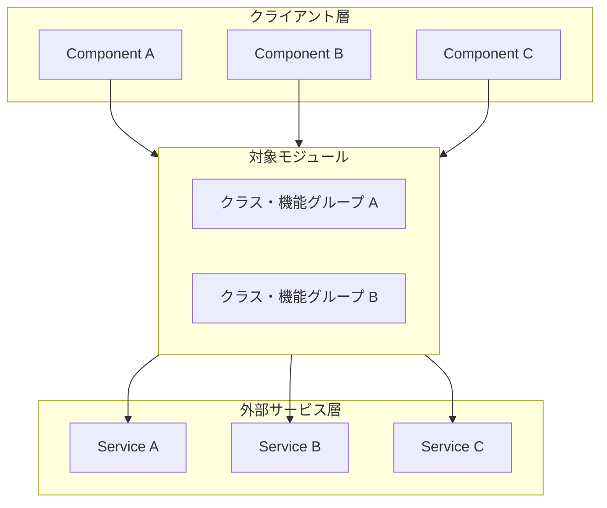
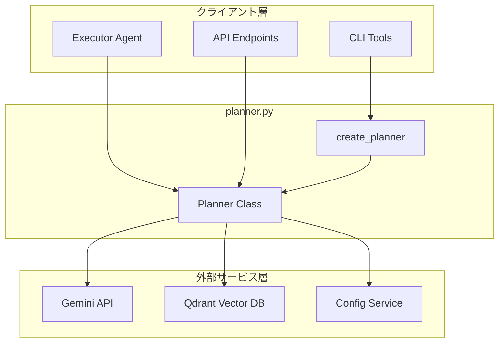
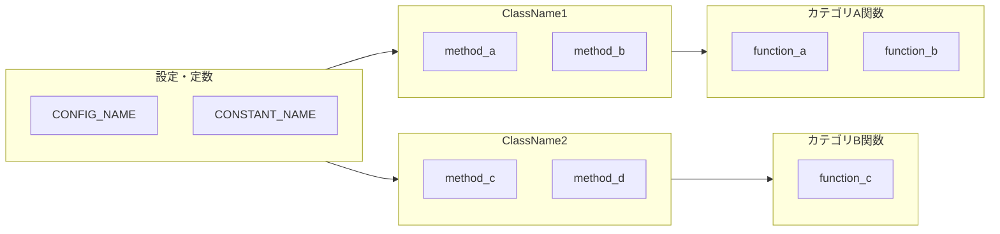
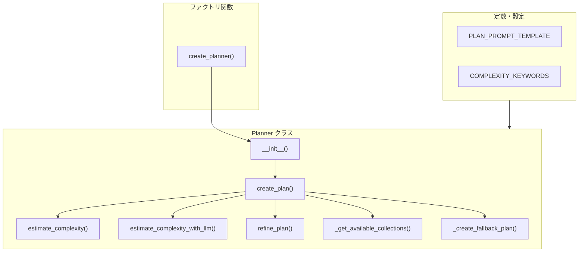
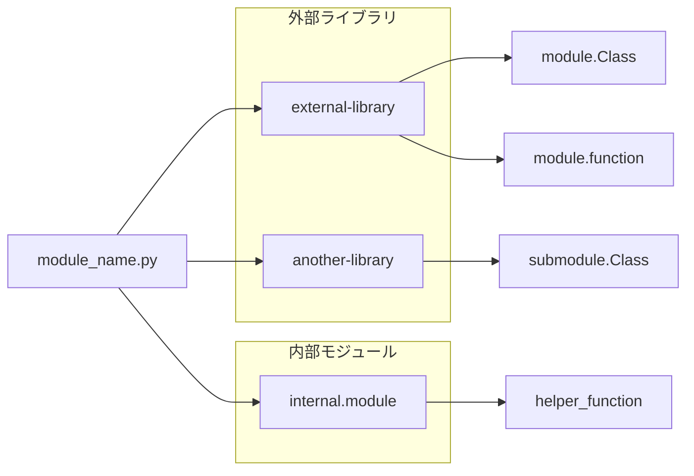
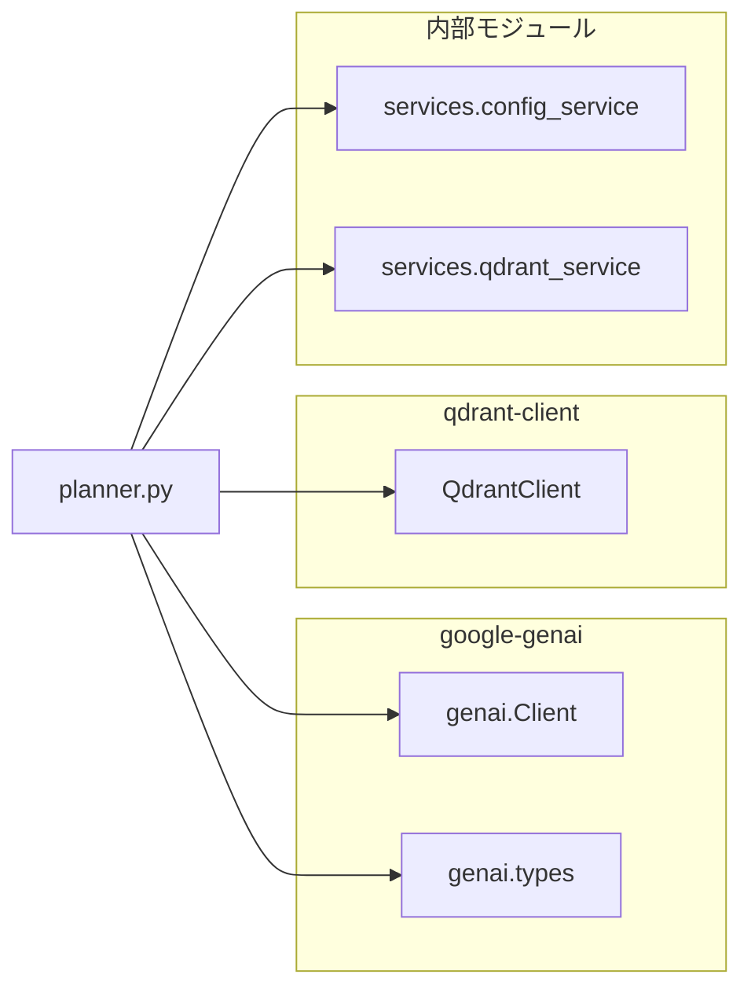
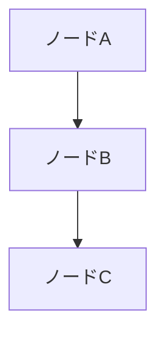
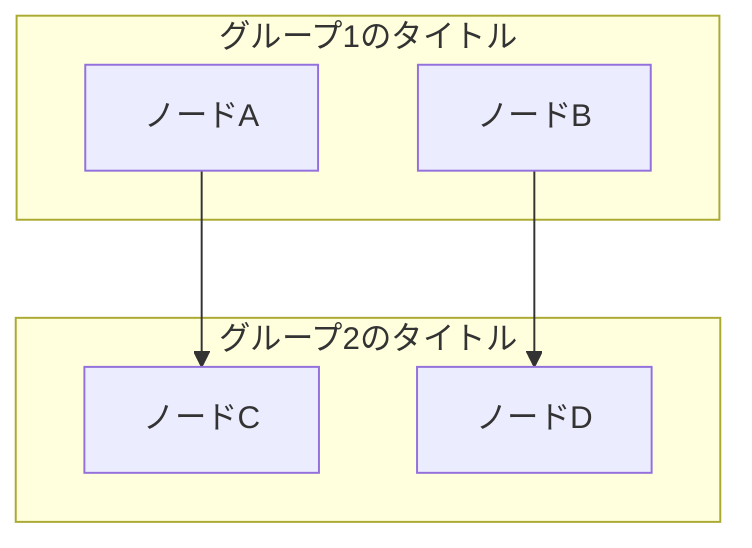
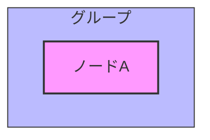
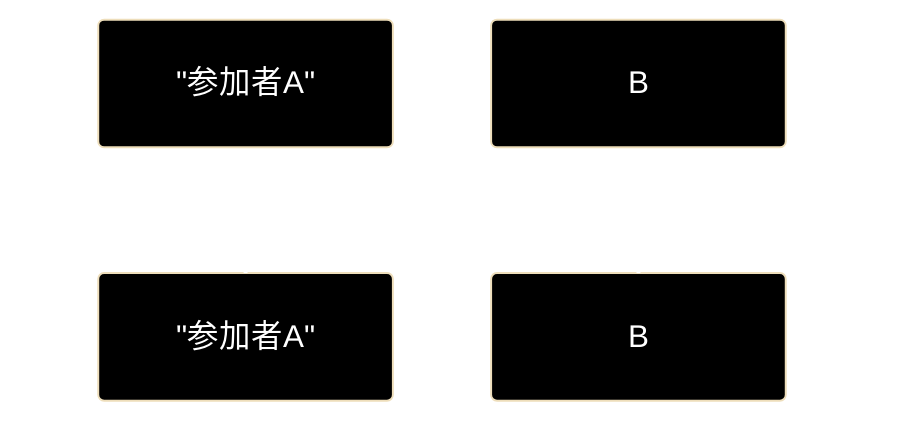

# Pythonモジュール ドキュメント フォーマット仕様書

**Version 1.5** | 最終更新: 2026-06-11

---

## 目次

1. [概要](#概要)
2. [ドキュメント全体構成](#1-ドキュメント全体構成)
   - [必須セクション構成](#11-必須セクション構成)
   - [セクション説明](#12-セクション説明)
3. [ヘッダー・メタ情報](#2-ヘッダーメタ情報)
   - [タイトル形式](#21-タイトル形式)
   - [概要セクション](#22-概要セクション)
   - [主な責務の記述規則](#23-主な責務の記述規則)
   - [各責務対応のモジュールの記述規則](#25-各責務対応のモジュールの記述規則)
   - [主要機能一覧の記述規則](#24-主要機能一覧の記述規則)
4. [アーキテクチャ構成図](#3-アーキテクチャ構成図)
   - [システム全体構成（Mermaid）](#31-システム全体構成mermaid)
   - [データフロー](#32-データフロー)
5. [モジュール構成図](#4-モジュール構成図)
   - [内部モジュール構成（Mermaid）](#41-内部モジュール構成mermaid)
   - [依存関係テーブル](#42-依存関係テーブル)
6. [クラス・関数一覧表](#5-クラス関数一覧表)
   - [クラス一覧](#51-クラス一覧)
   - [関数一覧（カテゴリ別）](#52-関数一覧カテゴリ別)
7. [クラス・関数 IPO詳細](#6-クラス関数-ipo詳細)
   - [クラスの記述形式](#61-クラスの記述形式)
   - [メソッドの記述形式](#62-メソッドの記述形式)
   - [関数の記述形式](#63-関数の記述形式)
   - [IPO記述の構成要素](#64-ipo記述の構成要素)
8. [IPOテーブルの記述規則](#7-ipoテーブルの記述規則)
   - [基本形式](#71-基本形式)
   - [Input の記述方法](#72-input-の記述方法)
   - [Process の記述方法](#73-process-の記述方法)
   - [Output の記述方法](#74-output-の記述方法)
9. [戻り値例の記述規則](#8-戻り値例の記述規則)
   - [基本形式](#81-基本形式)
   - [戻り値の種類別フォーマット](#82-戻り値の種類別フォーマット)
10. [使用例の記述規則](#9-使用例の記述規則)
    - [基本形式](#91-基本形式)
    - [記述のポイント](#92-記述のポイント)
    - [複雑な使用例](#93-複雑な使用例)
11. [注釈・警告の記述](#10-注釈警告の記述)
    - [警告（非推奨）](#101-警告非推奨)
    - [注意事項](#102-注意事項)
    - [補足情報](#103-補足情報)
12. [設定・定数セクション](#11-設定定数セクション)
    - [設定辞書](#111-設定辞書)
    - [非推奨の定数](#112-非推奨の定数)
13. [使用例セクション（ワークフロー）](#12-使用例セクションワークフロー)
    - [基本ワークフロー](#121-基本ワークフロー)
    - [応用ワークフロー](#122-応用ワークフロー)
14. [エクスポートセクション](#13-エクスポートセクション)
15. [変更履歴セクション](#14-変更履歴セクション)
16. [付録セクション](#15-付録セクション)
    - [依存関係図（Mermaid）](#151-依存関係図mermaid)
17. [Mermaid記法ガイド](#16-mermaid記法ガイド)
    - [基本構文](#161-基本構文)
    - [ノード形状](#162-ノード形状)
    - [矢印スタイル](#163-矢印スタイル)
    - [サブグラフ](#164-サブグラフ)
18. [Markdown記法ルール](#17-markdown記法ルール)
    - [見出しレベル](#171-見出しレベル)
    - [コードブロック](#172-コードブロック)
    - [テーブル](#173-テーブル)
    - [区切り線](#174-区切り線)
19. [チェックリスト](#18-チェックリスト)
20. [変更履歴](#変更履歴)

---

## 概要

本仕様書は、Pythonモジュールのドキュメントを統一されたフォーマットで作成するための規約を定義します。IPO（Input-Process-Output）形式を採用し、シグネチャ・戻り値例・使用例を含む実用的なドキュメントを目指します。

**図表について**: 本仕様書ではMermaid v9フローチャートを使用します（PyCharm Pro対応）。

---

## 1. ドキュメント全体構成

### 1.1 必須セクション構成

```
# {module_name}.py - {モジュール説明} ドキュメント

**Version X.X** | 最終更新: YYYY-MM-DD

---

## 目次
## 概要
## 1. アーキテクチャ構成図
## 2. モジュール構成図
## 3. クラス・関数一覧表
## 4. クラス・関数 IPO詳細
## 5. 設定・定数
## 6. 使用例
## 7. エクスポート
## 8. 変更履歴
## 付録: 依存関係図
```

### 1.2 セクション説明

| セクション | 必須 | 説明 |
|-----------|:----:|------|
| 目次 | ✅ | ドキュメント内のセクションへのリンク一覧 |
| 概要 | ✅ | モジュールの目的、主な責務、主要機能一覧 |
| アーキテクチャ構成図 | ✅ | システム全体の位置づけとデータフロー（Mermaid） |
| モジュール構成図 | ✅ | 内部構造と依存関係（Mermaid） |
| クラス・関数一覧表 | ✅ | 全要素のクイックリファレンス |
| クラス・関数 IPO詳細 | ✅ | 各要素の詳細仕様（概要・シグネチャ・IPO・戻り値例・使用例） |
| 設定・定数 | ⚪ | 設定値や定数がある場合 |
| 使用例 | ✅ | 典型的なワークフロー |
| エクスポート | ⚪ | `__all__`の内容 |
| 変更履歴 | ✅ | バージョン履歴 |
| 付録 | ⚪ | 補足情報（依存関係図等） |

---

## 2. ヘッダー・メタ情報

### 2.1 タイトル形式

```markdown
# {module_name}.py - {モジュール説明} ドキュメント

**Version X.X** | 最終更新: YYYY-MM-DD

---

## 目次

1. [概要](#概要)
2. [アーキテクチャ構成図](#1-アーキテクチャ構成図)
...

---
```

### 2.2 概要セクション

概要セクションは以下の順序で記述します：

1. モジュールの説明文
2. 主な責務（箇条書き）
3. 各責務対応のモジュール（テーブル）
4. 主要機能一覧（テーブル）

```markdown
## 概要

`{module_name}.py`は、{モジュールの目的と機能の説明}。

### 主な責務

- 責務1の説明
- 責務2の説明
- 責務3の説明
- 責務4の説明

### 各責務対応のモジュール

| # | 責務 | 対応モジュール | 説明 |
|---|------|--------------|------|
| 1 | 責務1の説明 | `module_a.py` | モジュールAが担う役割の説明 |
| 2 | 責務2の説明 | `module_b.py` | モジュールBが担う役割の説明 |
| 3 | 責務3の説明 | `module_c.py` | モジュールCが担う役割の説明 |
| 4 | 責務4の説明 | `module_d.py` | モジュールDが担う役割の説明 |

### 主要機能一覧

| 機能 | 説明 |
|------|------|
| `ClassName` | クラスの説明 |
| `ClassName.method_name()` | メソッドの説明 |
| `function_name()` | 関数の説明 |
```

### 2.3 主な責務の記述規則

「主な責務」は、モジュールが担う役割・責任を箇条書きで記述します。

```markdown
### 主な責務

- ユーザークエリの複雑度推定
- LLMを用いた実行計画の自動生成
- 利用可能なコレクション（Qdrant）の取得
- フィードバックに基づく計画の修正（リファインメント）
- フォールバック計画の提供
```

**記述のポイント**:
- 動詞で始める（「〜する」「〜の管理」等）
- 3〜7項目程度が適切
- 具体的かつ簡潔に記述

### 2.5 各責務対応のモジュールの記述規則

「各責務対応のモジュール」は、上記「主な責務」の各項目がどのモジュール（ファイル）で実現されているかを対応テーブルで記述します。

```markdown
### 各責務対応のモジュール

| # | 責務 | 対応モジュール | 説明 |
|---|------|--------------|------|
| 1 | ユーザークエリの複雑度推定 | `planner.py` | キーワード/LLMベースの複雑度分析 |
| 2 | LLMを用いた実行計画の自動生成 | `planner.py` | Gemini APIで検索計画を生成 |
| 3 | 利用可能なコレクションの取得 | `qdrant_client_wrapper.py` | Qdrantから動的にコレクション一覧を取得 |
| 4 | フィードバックに基づく計画の修正 | `planner.py` | 検索結果のスコアに応じてリファインメント |
| 5 | フォールバック計画の提供 | `planner.py` | LLMエラー時の安全な代替計画 |
```

**記述のポイント**:
- 「責務」列は「主な責務」の箇条書きと1対1で対応させる
- 「対応モジュール」列はバッククォートでコード表記（`module_name.py`）
- 1つの責務が複数モジュールにまたがる場合は、主要なモジュールを記載し「説明」列で補足
- 責務の数（行数）は「主な責務」の項目数と一致させる

### 2.4 主要機能一覧の記述規則

「主要機能一覧」は、クラス名・メソッド名・関数名とその説明をテーブル形式で記述します。

```markdown
### 主要機能一覧

| 機能 | 説明 |
|------|------|
| `Planner` | 計画生成エージェントクラス |
| `Planner.__init__()` | コンストラクタ（設定・モデル名指定） |
| `Planner.create_plan()` | LLMを使用して実行計画を生成 |
| `Planner.estimate_complexity()` | キーワードベースで複雑度を推定 |
| `Planner.estimate_complexity_with_llm()` | LLMで複雑度を推定 |
| `Planner.refine_plan()` | フィードバックに基づき計画を修正 |
| `create_planner()` | Plannerインスタンスを作成するファクトリ関数 |
```

**記述のポイント**:
- 機能列はバッククォートでコード表記
- クラスは `ClassName` 形式
- メソッドは `ClassName.method_name()` 形式
- 関数は `function_name()` 形式
- プライベートメソッド（`_method_name`）も必要に応じて含める

---

## 3. アーキテクチャ構成図

### 3.1 システム全体構成（Mermaid）

Mermaid v9 フローチャートを使用して3層構造で表現します。

```markdown
## 1. アーキテクチャ構成図

### 1.1 システム全体構成


```

**具体例（Plannerモジュール）**:



### 3.2 データフロー

番号付きリストで処理の流れを記述します。

```markdown
### 1.2 データフロー

1. クライアント層からのリクエストを受信
2. 対象モジュールが適切な処理を実行
3. 必要に応じて外部サービスを呼び出し
4. 結果をクライアント層に返却
```

---

## 4. モジュール構成図

### 4.1 内部モジュール構成（Mermaid）

Mermaid フローチャートでモジュールの内部構成を表現します。

```markdown
## 2. モジュール構成図

### 2.1 内部モジュール構成


```

**具体例（Plannerモジュール）**:



### 4.2 依存関係テーブル

```markdown
### 2.2 外部依存関係

| ライブラリ | バージョン | 用途 |
|-----------|-----------|------|
| `library-name` | X.x | 用途の説明 |

### 2.3 内部依存モジュール

| モジュール | 用途 |
|-----------|------|
| `module.submodule` | 用途の説明 |
```

---

## 5. クラス・関数一覧表

### 5.1 クラス一覧

```markdown
## 3. クラス・関数一覧表

### 3.1 クラス一覧

#### ClassName

| メソッド | 概要 |
|---------|------|
| `__init__(param1, param2)` | コンストラクタの説明 |
| `method_name(param)` | メソッドの概要 |
```

### 5.2 関数一覧（カテゴリ別）

```markdown
### 3.2 関数一覧（カテゴリ別）

#### カテゴリ名

| 関数名 | 概要 |
|-------|------|
| `function_name(param1, param2)` | 関数の概要説明 |
```

---

## 6. クラス・関数 IPO詳細

### 6.1 クラスの記述形式

クラスの説明文の後、各メソッドを記述します。

```markdown
## 4. クラス・関数 IPO詳細

### 4.X {ClassName} クラス

{クラスの説明文（1〜2行）}

#### コンストラクタ: `__init__`

**概要**: コンストラクタの説明文。

```python
ClassName(param1: Type1, param2: Type2 = default_value)
```

| パラメータ | 型 | デフォルト | 説明 |
|------------|------|-----------|------|
| `param1` | Type1 | - | パラメータの説明 |
| `param2` | Type2 | default_value | パラメータの説明 |

| 項目 | 内容 |
|------|------|
| **Input** | `param1: Type1`, `param2: Type2 = default_value` |
| **Process** | 処理内容の説明 |
| **Output** | ClassNameインスタンス |
```

### 6.2 メソッドの記述形式

メソッド名の直下に「**概要**:」ラベルを付けて概要を記述し、その後にシグネチャ・IPOテーブルを続けます。

```markdown
#### メソッド: `method_name`

**概要**: メソッドの説明文（1行）。

```python
def method_name(self, param1: Type1, param2: Type2 = default) -> ReturnType
```

| パラメータ | 型 | デフォルト | 説明 |
|------------|------|-----------|------|
| `param1` | Type1 | - | パラメータの説明 |
| `param2` | Type2 | default | パラメータの説明 |

| 項目 | 内容 |
|------|------|
| **Input** | `param1: Type1`, `param2: Type2 = default` |
| **Process** | 1. 処理ステップ1<br>2. 処理ステップ2<br>3. 処理ステップ3 |
| **Output** | `ReturnType`: 戻り値の説明 |

**戻り値例**:
```python
{
    "key1": "value1",
    "key2": 123,
    "key3": ["item1", "item2"]
}
```

```python
# 使用例
instance = ClassName(param1="value")
result = instance.method_name(param1="input")
print(result)
# 出力結果のコメント
```
```

### 6.3 関数の記述形式

関数名の直下に「**概要**:」ラベルを付けて概要を記述します。

```markdown
### 4.X カテゴリ名関数

#### `function_name`

**概要**: 関数の説明文（1〜2行）。

```python
def function_name(
    param1: Type1,
    param2: Type2 = default_value,
    param3: Optional[Type3] = None
) -> ReturnType
```

| パラメータ | 型 | デフォルト | 説明 |
|------------|------|-----------|------|
| `param1` | Type1 | - | パラメータの説明 |
| `param2` | Type2 | default_value | パラメータの説明 |
| `param3` | Optional[Type3] | None | パラメータの説明 |

| 項目 | 内容 |
|------|------|
| **Input** | `param1: Type1`, `param2: Type2 = default_value`, `param3: Optional[Type3] = None` |
| **Process** | 1. 処理ステップ1<br>2. 処理ステップ2 |
| **Output** | `ReturnType`: 戻り値の説明 |

**戻り値例**:
```python
[
    {"name": "item1", "value": 100},
    {"name": "item2", "value": 200}
]
```

```python
# 使用例
result = function_name(param1="value", param2=123)
print(f"結果: {result}")
# 結果: [{"name": "item1", "value": 100}, ...]
```
```

### 6.4 IPO記述の構成要素

各メソッド・関数のIPO詳細は、以下の順序で構成します：

| 順序 | 要素 | 必須 | 説明 |
|:----:|------|:----:|------|
| 1 | **概要** | ✅ | `**概要**:` ラベル付きで説明文を記述 |
| 2 | シグネチャ | ✅ | Pythonコードブロックで型注釈付きシグネチャ |
| 3 | パラメータ表 | ✅ | パラメータ/型/デフォルト/説明のテーブル |
| 4 | IPOテーブル | ✅ | Input/Process/Outputの3行テーブル |
| 5 | 戻り値例 | ✅ | `**戻り値例**:` ラベル付きでコード例 |
| 6 | 使用例 | ✅ | `# 使用例` コメント付きでコード例 |

---

## 7. IPOテーブルの記述規則

### 7.1 基本形式

| 項目 | 内容 |
|------|------|
| **Input** | 入力パラメータをカンマ区切りで列挙 |
| **Process** | 処理内容を簡潔に記述（複数ステップは番号付きで`<br>`区切り） |
| **Output** | 戻り値の型と説明 |

### 7.2 Input の記述方法

```markdown
| **Input** | `param1: Type1`, `param2: Type2 = default` |
```

- パラメータがない場合: `なし（selfのみ）`
- 複数パラメータ: カンマ区切りで列挙

### 7.3 Process の記述方法

```markdown
<!-- 単一処理 -->
| **Process** | 処理内容の説明 |

<!-- 複数ステップ -->
| **Process** | 1. ステップ1<br>2. ステップ2<br>3. ステップ3 |
```

### 7.4 Output の記述方法

```markdown
<!-- 単純な型 -->
| **Output** | `bool`: 成功した場合True |

<!-- 複合型 -->
| **Output** | `Dict[str, Any]`: `{key1, key2, key3}` |

<!-- タプル -->
| **Output** | `Tuple[bool, str, Optional[Dict]]`<br>- bool: フラグ<br>- str: メッセージ<br>- Dict: 詳細情報 |
```

---

## 8. 戻り値例の記述規則

### 8.1 基本形式

```markdown
**戻り値例**:
```python
{
    "key1": "value1",
    "key2": 123
}
```
```

### 8.2 戻り値の種類別フォーマット

#### 辞書（Dict）

```python
{
    "status": "success",
    "data": {
        "id": 1,
        "name": "example"
    },
    "count": 100
}
```

#### リスト（List）

```python
[
    {"id": 1, "name": "item1"},
    {"id": 2, "name": "item2"}
]
```

#### タプル（Tuple）

```python
(
    True,
    "処理成功",
    {
        "detail": "追加情報"
    }
)
```

#### DataFrame（コメント形式）

```python
#    Column1    Column2    Column3
# 0  value1     100        True
# 1  value2     200        False
```

---

## 9. 使用例の記述規則

### 9.1 基本形式

```markdown
```python
# 使用例
from module import function_name

result = function_name(param="value")
print(result)
# 出力: expected_output
```
```

### 9.2 記述のポイント

| ポイント | 説明 |
|---------|------|
| コメント開始 | `# 使用例` で開始 |
| インポート | 必要に応じてインポート文を含める |
| 実行コード | 最小限の動作確認コード |
| 出力コメント | `# 出力:` または `# 結果:` で期待値を表示 |

### 9.3 複雑な使用例

```markdown
```python
# 使用例
def callback_function(current, total):
    print(f"進捗: {current}/{total}")

result = complex_function(
    param1="value1",
    param2=123,
    callback=callback_function
)

if result["success"]:
    print(f"完了: {result['count']}件")
else:
    print(f"エラー: {result['error']}")
```
```

---

## 10. 注釈・警告の記述

### 10.1 警告（非推奨）

```markdown
> ⚠️ **非推奨**: この関数は非推奨です。`alternative_function()`を使用してください。
```

### 10.2 注意事項

```markdown
> 📝 **注意**: この処理は時間がかかる場合があります。
```

### 10.3 補足情報

```markdown
**特徴**:
- 特徴1の説明
- 特徴2の説明

**制約事項**:
- 制約1の説明
- 制約2の説明
```

---

## 11. 設定・定数セクション

### 11.1 設定辞書

```markdown
## 5. 設定・定数

### 5.1 CONFIG_NAME

{設定の説明}

```python
CONFIG_NAME = {
    "key1": "value1",
    "key2": 123,
    "key3": True,
}
```

| キー | デフォルト値 | 説明 |
|-----|-------------|------|
| `key1` | "value1" | キーの説明 |
| `key2` | 123 | キーの説明 |
```

### 11.2 非推奨の定数

```markdown
### 5.2 非推奨の定数

| 定数名 | 状態 | 代替方法 |
|-------|------|---------|
| `OLD_CONSTANT` | ⚠️ 非推奨 | `new_function()` |
```

---

## 12. 使用例セクション（ワークフロー）

### 12.1 基本ワークフロー

```markdown
## 6. 使用例

### 6.1 基本的なワークフロー

```python
from module import (
    Class1,
    function1,
    function2,
)

# 1. 初期化
instance = Class1()

# 2. データ準備
data = function1("input.csv")

# 3. 処理実行
result = function2(data)

# 4. 結果確認
print(f"処理完了: {result}")
```
```

### 12.2 応用ワークフロー

```markdown
### 6.2 応用的なワークフロー

```python
# 特定のユースケース向けの設定
config = {
    "option1": True,
    "option2": "advanced"
}

result = advanced_function(data, **config)
```
```

---

## 13. エクスポートセクション

```markdown
## 7. エクスポート

`__init__.py`でエクスポートされる要素：

```python
__all__ = [
    # クラス
    "ClassName1",
    "ClassName2",
    # 関数
    "function_name1",
    "function_name2",
    # 定数
    "CONFIG_NAME",
    "DEPRECATED_CONSTANT",  # 非推奨
]
```
```

---

## 14. 変更履歴セクション

```markdown
## 8. 変更履歴

| バージョン | 変更内容 |
|-----------|---------|
| 1.0 | 初版作成 |
| 1.1 | 機能Aを追加 |
| 1.2 | 機能Bの改善、非推奨機能の追加 |
```

---

## 15. 付録セクション

### 15.1 依存関係図（Mermaid）

Mermaid フローチャートを使用して依存関係を表現します。

```markdown
## 付録: 依存関係図


```

**具体例（Plannerモジュール）**:



---

## 16. Mermaid記法ガイド

### 16.1 基本構文

```markdown

```

**方向指定**:

| 指定 | 方向 |
|------|------|
| `TB` / `TD` | 上から下（Top to Bottom） |
| `BT` | 下から上（Bottom to Top） |
| `LR` | 左から右（Left to Right） |
| `RL` | 右から左（Right to Left） |

### 16.2 ノード形状

| 構文 | 形状 |
|------|------|
| `A[テキスト]` | 四角形（デフォルト） |
| `A(テキスト)` | 角丸四角形 |
| `A([テキスト])` | スタジアム形 |
| `A[[テキスト]]` | サブルーチン形 |
| `A[(テキスト)]` | データベース形 |
| `A((テキスト))` | 円形 |
| `A>テキスト]` | 非対称形 |
| `A{テキスト}` | ひし形（判断） |
| `A{{テキスト}}` | 六角形 |
| `A[/テキスト/]` | 平行四辺形 |

### 16.3 矢印スタイル

| 構文 | 説明 |
|------|------|
| `A --> B` | 矢印 |
| `A --- B` | 線のみ |
| `A -.-> B` | 点線矢印 |
| `A ==> B` | 太い矢印 |
| `A --テキスト--> B` | ラベル付き矢印 |
| `A -->|テキスト| B` | ラベル付き矢印（代替構文） |

### 16.4 サブグラフ

```markdown

```

**スタイル適用**:

```markdown

```

### 16.5 カラーテーマ（黒背景・白文字）— **必須**

すべてのMermaidダイアグラムに以下のスタイルを適用すること。

| 要素 | 設定値 |
|------|--------|
| ノード背景色 | `fill:#000` |
| ノードテキスト色 | `color:#fff` |
| ノード枠線色 | `stroke:#fff` |
| サブグラフ背景色 | `fill:#1a1a1a` |
| サブグラフテキスト色 | `color:#fff` |
| サブグラフ枠線色 | `stroke:#fff` |

#### flowchart / graph 図の実装パターン

```markdown

```

**必須ルール:**

1. `classDef default fill:#000,stroke:#fff,color:#fff` を必ずブロック末尾に追加する
2. `classDef subgraphStyle fill:#1a1a1a,stroke:#fff,color:#fff` を追加する
3. 全ノードに `class <node_ids> default` を付与する
4. 全サブグラフに `style <subgraph_name> fill:#1a1a1a,stroke:#fff,color:#fff` を付与する
5. 既存の `style`/`classDef`/`class` 行は重複しないよう整理する

#### sequenceDiagram 図の実装パターン

```markdown

```

**必須ルール:**

- `sequenceDiagram` の前に必ず `%%{ init: ... }%%` ヘッダーを挿入する
- `classDef` / `class` 行は `sequenceDiagram` では使用しない（非対応）

---

## 17. Markdown記法ルール

### 17.1 見出しレベル

| レベル | 用途 |
|-------|------|
| `#` (H1) | ドキュメントタイトル（1つのみ） |
| `##` (H2) | 主要セクション（番号付き） |
| `###` (H3) | サブセクション |
| `####` (H4) | クラス名、関数名、メソッド名 |

### 17.2 コードブロック

| 言語指定 | 用途 |
|---------|------|
| ` ```python ` | Pythonコード、シグネチャ、使用例 |
| ` ```mermaid ` | Mermaidフローチャート、図表 |
| ` ``` ` (指定なし) | その他のテキストブロック |

### 17.3 テーブル

```markdown
| 列1 | 列2 | 列3 |
|-----|-----|-----|
| 値1 | 値2 | 値3 |
```

### 17.4 区切り線

```markdown
---
```

主要セクションの区切りに使用します。

---

## 18. チェックリスト

ドキュメント作成時の確認項目:

- [ ] タイトルとバージョン情報が正しい
- [ ] 目次が正しく作成されている
- [ ] 概要セクションにモジュールの目的が記載されている
- [ ] 主な責務が箇条書きで記載されている
- [ ] 各責務対応のモジュールがテーブル形式で記載されている
- [ ] 主要機能一覧がテーブル形式で記載されている
- [ ] アーキテクチャ構成図がMermaidで作成されている
- [ ] モジュール構成図がMermaidで作成されている
- [ ] 全クラス・関数が一覧表に含まれている
- [ ] 各クラス・関数に「**概要**:」ラベル付きの説明がある
- [ ] 各クラス・関数にIPOテーブルがある
- [ ] 各メソッド・関数にシグネチャがある
- [ ] 戻り値例が記載されている
- [ ] 使用例が記載されている
- [ ] 設定・定数が文書化されている
- [ ] 変更履歴が更新されている
- [ ] 依存関係図がMermaidで作成されている
- [ ] 全Mermaidダイアグラムに黒背景・白文字スタイルが適用されている（`classDef default fill:#000,stroke:#fff,color:#fff`）

---

## 変更履歴

| バージョン | 変更内容 |
|-----------|---------|
| 1.0 | 初版作成 |
| 1.1 | 概要セクションに「主な責務」「主要機能一覧」を追加、IPO詳細に「**概要**:」ラベルを追加 |
| 1.2 | 目次セクションを追加、チェックリストに目次確認項目を追加 |
| 1.3 | ASCII図をMermaid v9フローチャートに変更（PyCharm Pro対応）、Mermaid記法ガイドセクションを追加 |
| 1.4 | 概要セクションに「各責務対応のモジュール」テーブルを追加（責務→モジュール対応の明示化） |
| 1.5 | §16.5 カラーテーマ（黒背景・白文字）を必須仕様として追加、チェックリストに確認項目を追加 |
