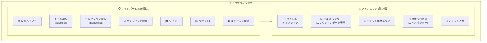
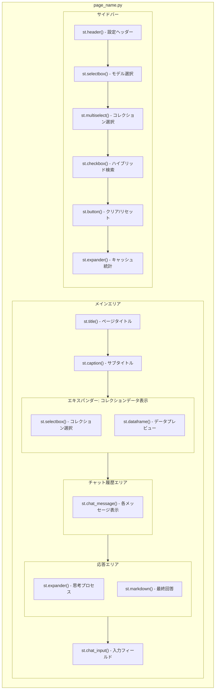
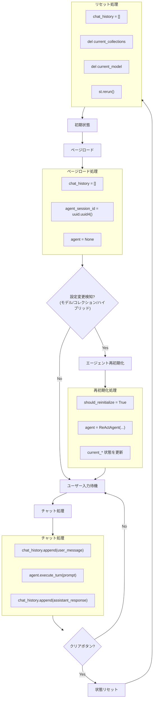
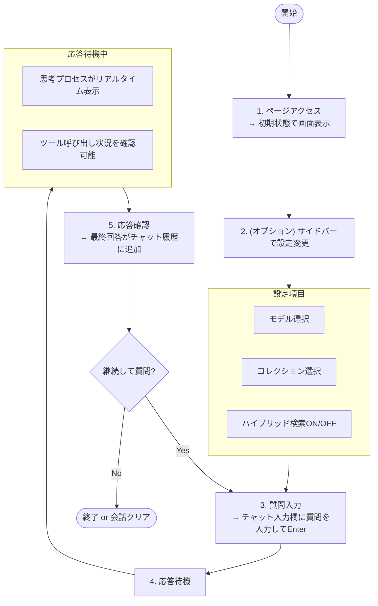
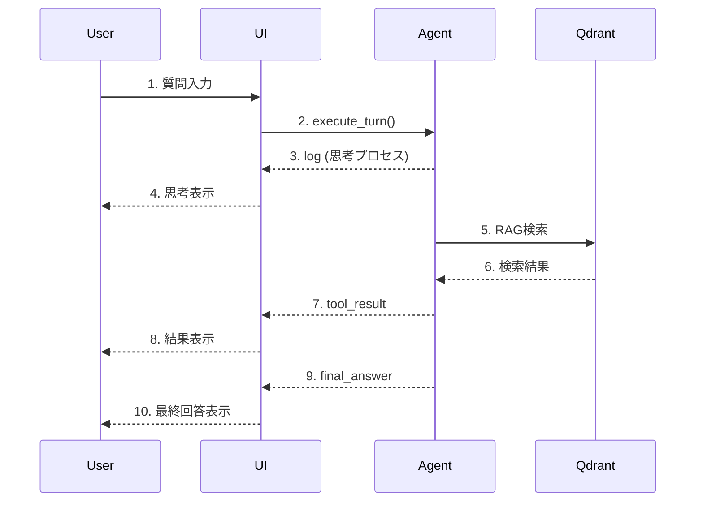
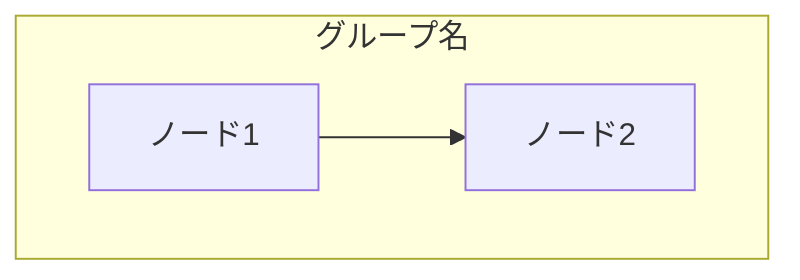
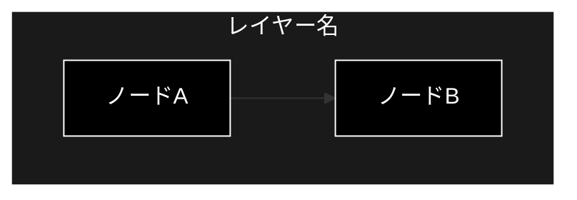
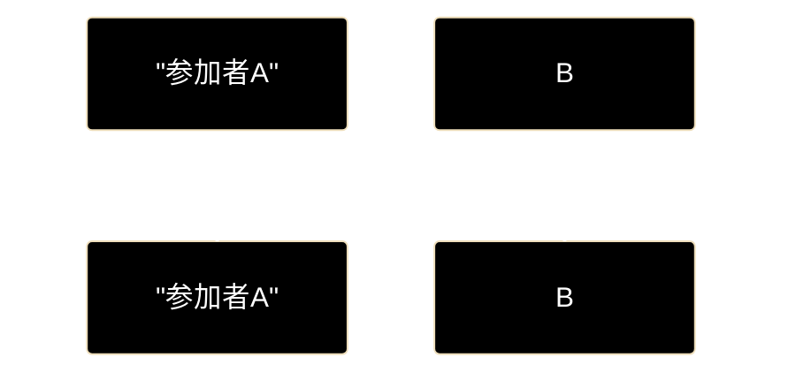

# Streamlit UIページ ドキュメント フォーマット仕様書

**Version 1.2** | 最終更新: 2026-06-11

---

## 目次

1. [概要](#概要)
2. [ドキュメント全体構成](#1-ドキュメント全体構成)
   - [必須セクション構成](#11-必須セクション構成)
   - [セクション説明](#12-セクション説明)
3. [ヘッダー・メタ情報](#2-ヘッダーメタ情報)
   - [タイトル形式](#21-タイトル形式)
   - [概要セクション](#22-概要セクション)
   - [主な責務の記述規則](#23-主な責務の記述規則)
   - [主要機能一覧の記述規則](#24-主要機能一覧の記述規則)
4. [画面レイアウト図](#3-画面レイアウト図)
   - [全体レイアウト](#31-全体レイアウト)
   - [コンポーネント配置図](#32-コンポーネント配置図)
5. [UIコンポーネント詳細](#4-uiコンポーネント詳細)
   - [サイドバー](#41-サイドバー)
   - [メインエリア](#42-メインエリア)
   - [エキスパンダー](#43-エキスパンダー)
   - [ダイアログ・モーダル](#44-ダイアログモーダル)
6. [セッション状態管理](#5-セッション状態管理)
   - [状態一覧](#51-状態一覧)
   - [状態遷移図](#52-状態遷移図)
   - [初期化・リセット条件](#53-初期化リセット条件)
7. [ユーザー操作フロー](#6-ユーザー操作フロー)
   - [基本操作フロー](#61-基本操作フロー)
   - [操作シーケンス図](#62-操作シーケンス図)
8. [関数一覧表](#7-関数一覧表)
   - [メイン関数](#71-メイン関数)
   - [ヘルパー関数](#72-ヘルパー関数)
9. [関数 IPO詳細](#8-関数-ipo詳細)
   - [メイン関数の記述形式](#81-メイン関数の記述形式)
   - [ヘルパー関数の記述形式](#82-ヘルパー関数の記述形式)
   - [コールバック関数の記述形式](#83-コールバック関数の記述形式)
10. [依存関係](#9-依存関係)
    - [外部ライブラリ](#91-外部ライブラリ)
    - [内部モジュール](#92-内部モジュール)
    - [サービス層](#93-サービス層)
11. [イベント処理](#10-イベント処理)
    - [ボタンイベント](#101-ボタンイベント)
    - [入力イベント](#102-入力イベント)
    - [リアルタイム更新](#103-リアルタイム更新)
12. [エラーハンドリング](#11-エラーハンドリング)
    - [エラー種別](#111-エラー種別)
    - [エラー表示](#112-エラー表示)
13. [使用例](#12-使用例)
14. [変更履歴](#13-変更履歴)
15. [チェックリスト](#14-チェックリスト)

---

## 概要

本仕様書は、Streamlit UIページのドキュメントを統一されたフォーマットで作成するための規約を定義します。画面レイアウト、UIコンポーネント、セッション状態管理、ユーザー操作フローを含む、UIページ特有の情報を体系的に文書化することを目指します。

**図表の記述方法**: 本仕様書ではMermaid v9フローチャートを使用します（PyCharm Pro対応）。

---

## 1. ドキュメント全体構成

### 1.1 必須セクション構成

```
# {page_name}.py - {ページ説明} ドキュメント

**Version X.X** | 最終更新: YYYY-MM-DD

---

## 目次
## 概要
## 1. 画面レイアウト図
## 2. UIコンポーネント詳細
## 3. セッション状態管理
## 4. ユーザー操作フロー
## 5. 関数一覧表
## 6. 関数 IPO詳細
## 7. 依存関係
## 8. イベント処理
## 9. エラーハンドリング
## 10. 使用例
## 11. 変更履歴
```

### 1.2 セクション説明

| セクション | 必須 | 説明 |
|-----------|:----:|------|
| 目次 | ✅ | ドキュメント内のセクションへのリンク一覧 |
| 概要 | ✅ | ページの目的、主な責務、主要機能一覧 |
| 画面レイアウト図 | ✅ | 画面構成のMermaidフローチャート |
| UIコンポーネント詳細 | ✅ | 各UIコンポーネントの詳細仕様 |
| セッション状態管理 | ✅ | `st.session_state`で管理する状態の一覧と遷移 |
| ユーザー操作フロー | ✅ | ユーザーの操作シーケンス |
| 関数一覧表 | ✅ | ページ内の関数クイックリファレンス |
| 関数 IPO詳細 | ✅ | 各関数の詳細仕様 |
| 依存関係 | ✅ | 外部・内部モジュールの依存関係 |
| イベント処理 | ⚪ | ボタン・入力等のイベント処理詳細 |
| エラーハンドリング | ⚪ | エラー処理の方針 |
| 使用例 | ⚪ | ページの利用方法（スクリーンショット等） |
| 変更履歴 | ✅ | バージョン履歴 |

---

## 2. ヘッダー・メタ情報

### 2.1 タイトル形式

```markdown
# {page_name}.py - {ページ説明} ドキュメント

**Version X.X** | 最終更新: YYYY-MM-DD

---

## 目次

1. [概要](#概要)
2. [画面レイアウト図](#1-画面レイアウト図)
...

---
```

### 2.2 概要セクション

概要セクションは以下の順序で記述します：

1. ページの説明文
2. 主な責務（箇条書き）
3. 主要機能一覧（テーブル）

```markdown
## 概要

`{page_name}.py`は、{ページの目的と機能の説明}。

### 主な責務

- 責務1の説明
- 責務2の説明
- 責務3の説明

### 主要機能一覧

| 機能 | 説明 |
|------|------|
| コレクション選択 | 検索対象コレクションの選択UI |
| チャット入力 | ユーザー質問の入力インターフェース |
| 思考プロセス表示 | エージェントの推論過程をリアルタイム表示 |
```

### 2.3 主な責務の記述規則

「主な責務」は、ページが担う役割・責任を箇条書きで記述します。

```markdown
### 主な責務

- ユーザーからの質問入力の受付
- エージェントへのクエリ送信と応答表示
- 思考プロセスのリアルタイム可視化
- 会話履歴の管理とセッション状態の維持
- 検索対象コレクションの選択と設定
```

**記述のポイント**:
- ユーザー視点での機能を中心に記述
- 3〜7項目程度が適切
- 具体的かつ簡潔に記述

### 2.4 主要機能一覧の記述規則

```markdown
### 主要機能一覧

| 機能 | 説明 |
|------|------|
| `show_agent_chat_page()` | メインページ表示関数 |
| サイドバー設定 | モデル選択、コレクション選択、キャッシュ管理 |
| チャット履歴表示 | 会話履歴のストリーミング表示 |
| 思考プロセス表示 | エージェント推論のリアルタイム表示 |
```

---

## 3. 画面レイアウト図

### 3.1 全体レイアウト

Mermaidフローチャートを使用して画面構成を表現します。

```markdown
## 1. 画面レイアウト図

### 1.1 全体レイアウト


```

### 3.2 コンポーネント配置図

コンポーネントの階層構造をMermaidフローチャートで示します。

```markdown
### 1.2 コンポーネント配置図


```

---

## 4. UIコンポーネント詳細

### 4.1 サイドバー

サイドバー内の各コンポーネントをテーブル形式で詳細に記述します。

```markdown
## 2. UIコンポーネント詳細

### 2.1 サイドバー

| コンポーネント | 種類 | キー | デフォルト値 | 説明 |
|---------------|------|------|-------------|------|
| モデル選択 | `st.selectbox` | - | `AgentConfig.MODEL_NAME` | 使用するLLMモデル |
| コレクション選択 | `st.multiselect` | - | 全コレクション | 検索対象コレクション |
| ハイブリッド検索 | `st.checkbox` | - | `True` | Sparse+Dense検索の有効化 |
| 履歴クリア | `st.button` | - | - | 会話履歴のクリア |
| キャッシュリセット | `st.button` | - | - | キャッシュのクリア |
| キャッシュ統計 | `st.expander` | - | 折りたたみ | キャッシュ状態の表示 |

#### モデル選択の詳細

```python
selected_model = st.selectbox(
    "使用モデル (Model)",
    options=GeminiConfig.AVAILABLE_MODELS,
    index=GeminiConfig.AVAILABLE_MODELS.index(AgentConfig.MODEL_NAME)
)
```

**オプション一覧**:

| モデル名 | 説明 |
|---------|------|
| `gemini-2.0-flash` | 高速推論モデル |
| `gemini-1.5-pro` | 高性能モデル |
```

### 4.2 メインエリア

```markdown
### 2.2 メインエリア

| コンポーネント | 種類 | 説明 |
|---------------|------|------|
| タイトル | `st.title` | ページタイトル表示 |
| キャプション | `st.caption` | サブタイトル・説明 |
| データプレビュー | `st.expander` + `st.dataframe` | コレクションデータの閲覧 |
| チャット履歴 | `st.chat_message` | 会話の表示 |
| 思考プロセス | `st.expander` | エージェント推論の表示 |
| チャット入力 | `st.chat_input` | ユーザー入力 |
```

### 4.3 エキスパンダー

```markdown
### 2.3 エキスパンダー

| エキスパンダー名 | 初期状態 | 内容 |
|-----------------|---------|------|
| コレクションデータ表示 | 折りたたみ | データフレームによるプレビュー |
| 思考プロセス | 展開 | ツール呼び出し、結果のリアルタイム表示 |
| キャッシュ統計 | 折りたたみ | キャッシュヒット状態、統計情報 |
```

### 4.4 ダイアログ・モーダル

```markdown
### 2.4 ダイアログ・モーダル

（このページではダイアログ・モーダルは使用していません）
```

---

## 5. セッション状態管理

### 5.1 状態一覧

```markdown
## 3. セッション状態管理

### 3.1 状態一覧

| キー | 型 | 初期値 | 説明 | リセット条件 |
|-----|-----|-------|------|-------------|
| `chat_history` | `List[Dict]` | `[]` | 会話履歴 | クリアボタン |
| `agent_session_id` | `str` | UUID | セッション識別子 | ページリロード |
| `agent` | `ReActAgent` | `None` | エージェントインスタンス | 設定変更時 |
| `current_collections` | `List[str]` | `[]` | 選択中コレクション | コレクション変更時 |
| `current_model` | `str` | - | 選択中モデル | モデル変更時 |
| `current_hybrid_search` | `bool` | `True` | ハイブリッド検索状態 | チェックボックス変更時 |
```

### 5.2 状態遷移図

```markdown
### 3.2 状態遷移図


```

### 5.3 初期化・リセット条件

```markdown
### 3.3 初期化・リセット条件

| 条件 | 対象状態 | 処理 |
|------|---------|------|
| ページ初回ロード | 全状態 | デフォルト値で初期化 |
| モデル変更 | `agent`, `current_model` | エージェント再初期化 |
| コレクション変更 | `agent`, `current_collections` | エージェント再初期化 |
| ハイブリッド検索変更 | `agent`, `current_hybrid_search` | エージェント再初期化 |
| クリアボタン | `chat_history`, `current_*` | 全状態クリア後リロード |
| キャッシュリセット | キャッシュのみ | `collection_cache.clear()` |
```

---

## 6. ユーザー操作フロー

### 6.1 基本操作フロー

```markdown
## 4. ユーザー操作フロー

### 4.1 基本操作フロー


```

### 6.2 操作シーケンス図

```markdown
### 4.2 操作シーケンス図


```

---

## 7. 関数一覧表

```markdown
## 5. 関数一覧表

### 5.1 メイン関数

| 関数名 | 概要 |
|-------|------|
| `show_agent_chat_page()` | ページ全体のレンダリングと制御 |

### 5.2 ヘルパー関数（インポート）

| 関数名 | モジュール | 概要 |
|-------|-----------|------|
| `get_available_collections_from_qdrant_helper()` | `services.agent_service` | Qdrantコレクション一覧取得 |
| `ReActAgent` | `services.agent_service` | エージェントクラス |
```

---

## 8. 関数 IPO詳細

### 8.1 メイン関数の記述形式

```markdown
## 6. 関数 IPO詳細

### 6.1 `show_agent_chat_page`

**概要**: エージェントチャットページのメイン表示関数。サイドバー設定、チャット履歴、ユーザー入力処理を統合管理する。

```python
def show_agent_chat_page() -> None
```

| 項目 | 内容 |
|------|------|
| **Input** | なし（セッション状態から取得） |
| **Process** | 1. サイドバー設定UIの描画<br>2. セッション状態の初期化・更新チェック<br>3. エージェントの初期化（必要時）<br>4. チャット履歴の表示<br>5. ユーザー入力の処理<br>6. エージェント応答のストリーミング表示 |
| **Output** | なし（画面描画のみ） |

**主要処理フロー**:

```python
# 1. サイドバー設定
with st.sidebar:
    selected_model = st.selectbox(...)
    selected_collections = st.multiselect(...)
    use_hybrid_search = st.checkbox(...)

# 2. セッション状態初期化
if "chat_history" not in st.session_state:
    st.session_state.chat_history = []

# 3. エージェント初期化（設定変更時）
if should_reinitialize:
    st.session_state.agent = ReActAgent(...)

# 4. チャット履歴表示
for message in st.session_state.chat_history:
    with st.chat_message(message["role"]):
        st.markdown(message["content"])

# 5. ユーザー入力処理
if prompt := st.chat_input("質問を入力してください..."):
    # 6. エージェント応答処理
    for event in st.session_state.agent.execute_turn(prompt):
        # イベントタイプに応じた表示処理
```
```

### 8.2 ヘルパー関数の記述形式

（外部モジュールの関数の場合、簡略化した記述）

```markdown
### 6.2 `get_available_collections_from_qdrant_helper`

**概要**: Qdrantから利用可能なコレクション一覧を取得する。

**参照**: `services/agent_service.py`

| 項目 | 内容 |
|------|------|
| **Input** | なし |
| **Process** | Qdrantクライアントでコレクション一覧を取得 |
| **Output** | `List[str]`: コレクション名のリスト |
```

### 8.3 コールバック関数の記述形式

```markdown
### 6.3 イベント処理コールバック

#### チャット入力コールバック

```python
if prompt := st.chat_input("質問を入力してください..."):
    # ユーザーメッセージを履歴に追加
    st.session_state.chat_history.append({"role": "user", "content": prompt})

    # エージェント応答処理
    for event in st.session_state.agent.execute_turn(prompt):
        if event["type"] == "log":
            # 思考ログ表示
        elif event["type"] == "tool_call":
            # ツール呼び出し表示
        elif event["type"] == "tool_result":
            # ツール結果表示
        elif event["type"] == "final_answer":
            # 最終回答表示
```
```

---

## 9. 依存関係

```markdown
## 7. 依存関係

### 7.1 外部ライブラリ

| ライブラリ | バージョン | 用途 |
|-----------|-----------|------|
| `streamlit` | >= 1.28 | UIフレームワーク |
| `pandas` | >= 2.0 | データフレーム表示 |
| `qdrant-client` | >= 1.6 | Qdrant接続 |

### 7.2 内部モジュール

| モジュール | 用途 |
|-----------|------|
| `config.AgentConfig` | エージェント設定 |
| `config.GeminiConfig` | Geminiモデル設定 |

### 7.3 サービス層

| サービス | 用途 |
|---------|------|
| `services.agent_service.ReActAgent` | エージェント処理 |
| `services.agent_service.get_available_collections_from_qdrant_helper` | コレクション取得 |
| `agent_cache.collection_cache` | キャッシュ管理 |
```

---

## 10. イベント処理

```markdown
## 8. イベント処理

### 8.1 ボタンイベント

| ボタン | イベント | 処理内容 |
|-------|---------|---------|
| 🗑️ 会話履歴をクリア | クリック | `chat_history`クリア、状態リセット、`st.rerun()` |
| 🔄 キャッシュをリセット | クリック | `collection_cache.clear(session_id)` |

### 8.2 入力イベント

| コンポーネント | イベント | 処理内容 |
|---------------|---------|---------|
| モデル選択 | 変更 | `should_reinitialize = True` |
| コレクション選択 | 変更 | `should_reinitialize = True` |
| ハイブリッド検索 | 変更 | `should_reinitialize = True` |
| チャット入力 | Enter | エージェント処理開始 |

### 8.3 リアルタイム更新

| イベント種別 | 更新内容 |
|-------------|---------|
| `log` | 思考プロセスエキスパンダーに追記 |
| `tool_call` | ツール呼び出し情報を表示、スピナー表示 |
| `tool_result` | ツール結果を表示 |
| `final_answer` | 最終回答をマークダウン表示 |
```

---

## 11. エラーハンドリング

```markdown
## 9. エラーハンドリング

### 9.1 エラー種別

| エラー種別 | 発生条件 | 対処 |
|-----------|---------|------|
| Qdrant接続エラー | サーバー未起動 | `st.warning`で警告表示 |
| エージェント初期化エラー | API認証失敗等 | `st.error`でエラー表示、処理中断 |
| チャット処理エラー | API呼び出し失敗 | `st.error`でエラー表示、ログ出力 |
| コレクション取得エラー | Qdrantエラー | 空リストで続行、警告表示 |

### 9.2 エラー表示

| 表示種別 | Streamlitコンポーネント | 用途 |
|---------|------------------------|------|
| エラー | `st.error()` | 致命的エラー |
| 警告 | `st.warning()` | 注意喚起 |
| 情報 | `st.info()` | 補足情報 |
| トースト | `st.toast()` | 一時的な通知 |

### 9.3 エラー処理コード例

```python
try:
    for event in st.session_state.agent.execute_turn(prompt):
        # イベント処理
        ...
except Exception as e:
    st.error(f"エラーが発生しました: {e}")
    logger.error(f"Chat Error: {e}", exc_info=True)
```
```

---

## 12. 使用例

```markdown
## 10. 使用例

### 10.1 基本的な使用方法

1. ページにアクセス
2. サイドバーで必要に応じて設定を変更
   - 使用モデルの選択
   - 検索対象コレクションの選択
   - ハイブリッド検索の有効/無効
3. チャット入力欄に質問を入力してEnter
4. 思考プロセスを確認しながら応答を待機
5. 最終回答を確認
6. 必要に応じて追加の質問を続ける

### 10.2 画面スクリーンショット

（実際のドキュメントでは、スクリーンショット画像を挿入）

### 10.3 典型的な質問例

```
- 「〇〇について教えてください」
- 「△△と□□の違いは何ですか？」
- 「××の手順を説明してください」
```
```

---

## 13. 変更履歴

```markdown
## 11. 変更履歴

| バージョン | 日付 | 変更内容 |
|-----------|------|---------|
| 1.0 | YYYY-MM-DD | 初版作成 |
| 1.1 | YYYY-MM-DD | ハイブリッド検索機能追加 |
| 1.2 | YYYY-MM-DD | キャッシュ統計表示追加 |
```

---

## 14. チェックリスト

ドキュメント作成時の確認項目:

- [ ] タイトルとバージョン情報が正しい
- [ ] 目次が正しく作成されている
- [ ] 概要セクションにページの目的が記載されている
- [ ] 主な責務が箇条書きで記載されている
- [ ] 主要機能一覧がテーブル形式で記載されている
- [ ] 画面レイアウト図がMermaidフローチャートで作成されている
- [ ] UIコンポーネント詳細が記載されている
- [ ] セッション状態一覧が完備されている
- [ ] 状態遷移図がMermaidフローチャートで作成されている
- [ ] ユーザー操作フローがMermaidフローチャートで記載されている
- [ ] 操作シーケンス図がMermaid sequenceDiagramで作成されている
- [ ] 関数一覧表が作成されている
- [ ] 関数IPO詳細が記載されている
- [ ] 依存関係が文書化されている
- [ ] イベント処理が記載されている
- [ ] エラーハンドリングが記載されている
- [ ] 変更履歴が更新されている
- [ ] 全Mermaidダイアグラムに黒背景・白文字スタイルが適用されている

---

## 付録: a_md_doc_format.md との対応表

| a_md_doc_format.md | a_pages_format.md | 備考 |
|-------------------|-------------------|------|
| アーキテクチャ構成図 | 画面レイアウト図 | UIに特化した表現（Mermaid使用） |
| モジュール構成図 | コンポーネント配置図 | UIコンポーネント階層（Mermaid使用） |
| クラス・関数一覧表 | 関数一覧表 | ページは関数中心 |
| クラス・関数 IPO詳細 | 関数 IPO詳細 | 同様の形式 |
| - | UIコンポーネント詳細 | **UIページ固有** |
| - | セッション状態管理 | **UIページ固有** |
| - | ユーザー操作フロー | **UIページ固有**（Mermaid使用） |
| - | イベント処理 | **UIページ固有** |
| 設定・定数 | 依存関係 | サービス層を強調 |
| 使用例 | 使用例 | 画面操作を含む |
| 変更履歴 | 変更履歴 | 同様 |

---

## 付録: Mermaid記述ガイドライン

### 対応バージョン

- **Mermaid v9** (PyCharm Pro対応)

### 使用する図の種類

| 図の種類 | Mermaid構文 | 用途 |
|---------|------------|------|
| フローチャート | `flowchart TB/LR` | レイアウト図、状態遷移図、操作フロー |
| シーケンス図 | `sequenceDiagram` | 操作シーケンス図 |

### フローチャートの方向

| 方向 | 構文 | 説明 |
|------|------|------|
| 上から下 | `flowchart TB` | 縦方向のフロー（推奨） |
| 左から右 | `flowchart LR` | 横方向のフロー |

### 基本構文例



### 注意事項

- ノード名に日本語を使用する場合は `[""]` で囲む
- `<br/>` で改行可能
- subgraph内のノードは自動的にグループ化される

### カラーテーマ（黒背景・白文字）— **必須**

すべてのMermaidダイアグラムに以下のスタイルを適用すること。

| 要素 | 設定値 |
|------|--------|
| ノード背景色 | `fill:#000` |
| ノードテキスト色 | `color:#fff` |
| ノード枠線色 | `stroke:#fff` |
| サブグラフ背景色 | `fill:#1a1a1a` |
| サブグラフテキスト色 | `color:#fff` |
| サブグラフ枠線色 | `stroke:#fff` |

#### flowchart 図の実装パターン

```markdown

```

**必須ルール:**

1. `classDef default fill:#000,stroke:#fff,color:#fff` を必ずブロック末尾に追加する
2. 全ノードに `class <node_ids> default` を付与する
3. 全サブグラフに `style <subgraph_name> fill:#1a1a1a,stroke:#fff,color:#fff` を付与する

#### sequenceDiagram 図の実装パターン

```markdown

```

**必須ルール:**

- `sequenceDiagram` の前に必ず `%%{ init: ... }%%` ヘッダーを挿入する
- `classDef` / `class` 行は `sequenceDiagram` では使用しない（非対応）
