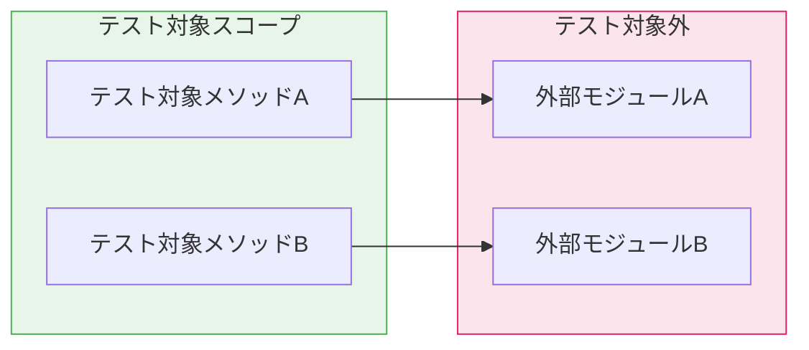
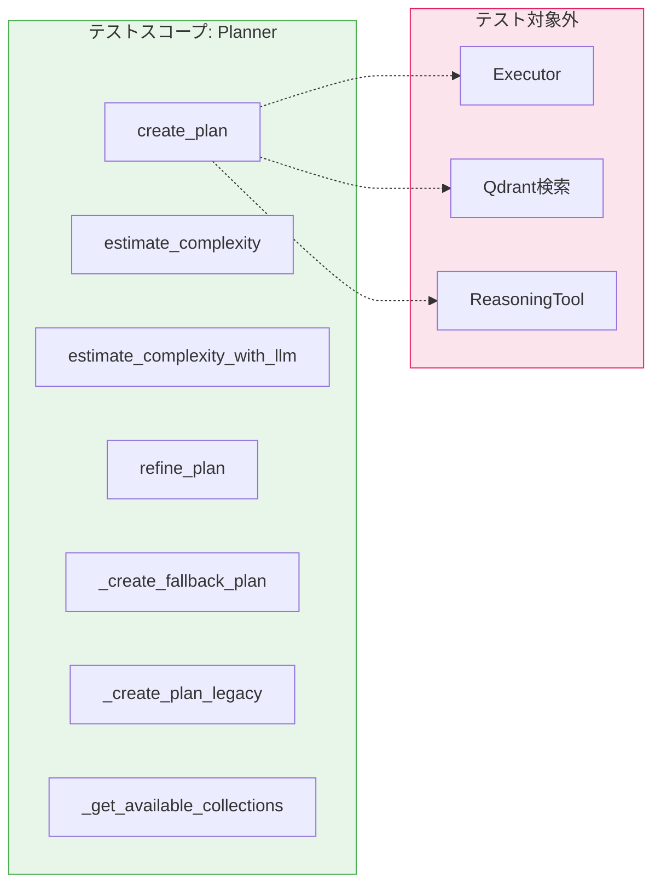
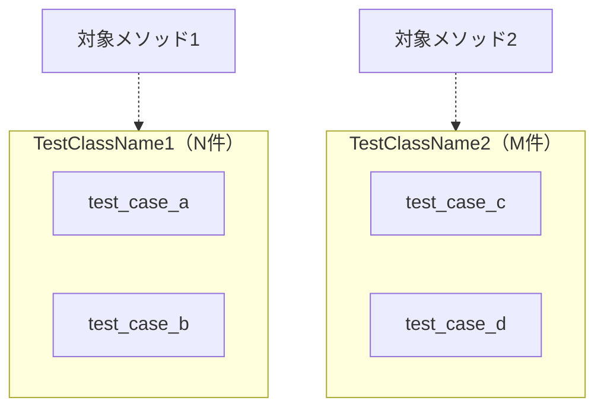
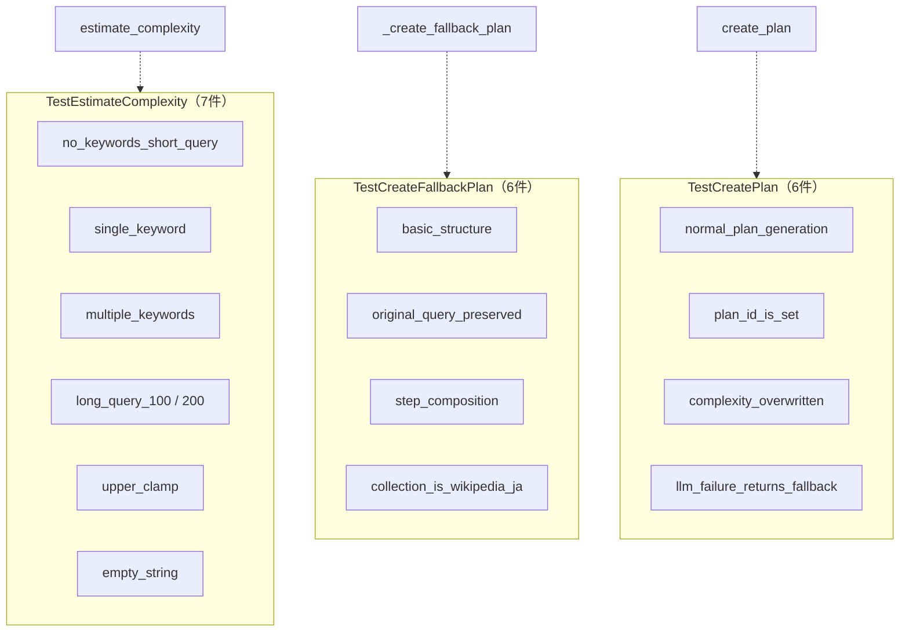
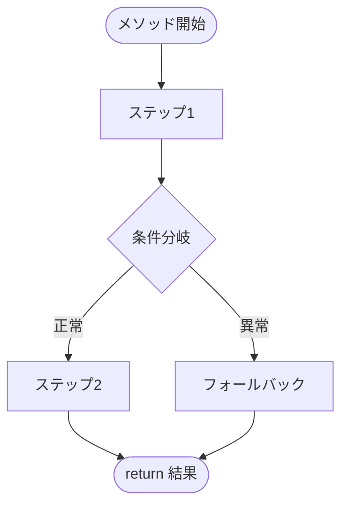

# Python 単体テスト ドキュメント フォーマット仕様書

**Version 1.1** | 最終更新: 2026-06-11

---

## 目次

1. [概要](#概要)
2. [通常ドキュメントとの違い](#1-通常ドキュメントとの違い)
3. [ドキュメント全体構成](#2-ドキュメント全体構成)
   - [必須セクション構成](#21-必須セクション構成)
   - [セクション説明](#22-セクション説明)
4. [ヘッダー・メタ情報](#3-ヘッダーメタ情報)
   - [タイトル形式](#31-タイトル形式)
   - [概要セクション](#32-概要セクション)
5. [テスト対象の責務と境界](#4-テスト対象の責務と境界)
   - [テスト対象の責務](#41-テスト対象の責務)
   - [テスト対象外（明示）](#42-テスト対象外明示)
   - [責務境界図（Mermaid）](#43-責務境界図mermaid)
6. [テスト構成図](#5-テスト構成図)
   - [テストクラス構成（Mermaid）](#51-テストクラス構成mermaid)
   - [処理フロー図（Mermaid）](#52-処理フロー図mermaid)
7. [モック・フィクスチャ設計](#6-モックフィクスチャ設計)
   - [モック方針](#61-モック方針)
   - [フィクスチャ一覧](#62-フィクスチャ一覧)
   - [フィクスチャ詳細](#63-フィクスチャ詳細)
   - [テストデータ定義](#64-テストデータ定義)
   - [ヘルパー関数](#65-ヘルパー関数)
8. [テストケース一覧](#7-テストケース一覧)
   - [一覧テーブル形式](#71-一覧テーブル形式)
   - [カバレッジマトリクス](#72-カバレッジマトリクス)
9. [テストケース詳細](#8-テストケース詳細)
   - [テストクラスの記述形式](#81-テストクラスの記述形式)
   - [テストケースの記述形式](#82-テストケースの記述形式)
   - [SAEテーブルの記述規則](#83-saeテーブルの記述規則)
10. [実行方法](#9-実行方法)
11. [変更履歴セクション](#10-変更履歴セクション)
12. [Mermaid記法ガイド](#11-mermaid記法ガイド)
13. [Markdown記法ルール](#12-markdown記法ルール)
14. [チェックリスト](#13-チェックリスト)
15. [変更履歴](#変更履歴)

---

## 概要

本仕様書は、Python単体テストファイルのドキュメントを統一されたフォーマットで作成するための規約を定義します。

通常のモジュールドキュメント（`a_class_method_md_format.md`）が **IPO（Input-Process-Output）** を中心に据えるのに対し、本仕様書では **SAE（Setup-Action-Expected）** 形式を採用します。これはテストの本質である「準備 → 実行 → 検証」のサイクルに対応しています。

**図表について**: 本仕様書ではMermaid v9フローチャートを使用します（PyCharm Pro対応）。

---

## 1. 通常ドキュメントとの違い

テストドキュメントは、通常のクラス/メソッドドキュメントとは **観点・構成・粒度** が異なります。

| 観点 | 通常ドキュメント (`a_class_method_md_format.md`) | テストドキュメント（本仕様書） |
|------|------|------|
| 主目的 | APIの仕様・使い方を伝える | テストの意図・設計・網羅性を伝える |
| 中心構造 | IPO（Input-Process-Output） | SAE（Setup-Action-Expected） |
| 対象読者 | モジュール利用者・開発者 | テスト保守者・レビュアー |
| 記述粒度 | メソッド単位で仕様を記述 | テストケース単位で検証内容を記述 |
| 特有セクション | アーキテクチャ図、エクスポート、設定・定数 | モック方針、フィクスチャ設計、カバレッジマトリクス |
| 不要セクション | ― | IPO詳細、戻り値例、使用例（ワークフロー） |

**設計指針**: テストドキュメントは「なぜこのテストが存在するか」「何を保証しているか」を明確にすることを最優先とします。

---

## 2. ドキュメント全体構成

### 2.1 必須セクション構成

```
# test_{module_name}.py - {テスト対象モジュール説明} 単体テスト ドキュメント

**Version X.X** | 最終更新: YYYY-MM-DD

---

## 目次
## 概要
## 1. テスト対象の責務と境界
## 2. テスト構成図
## 3. モック・フィクスチャ設計
## 4. テストケース一覧
## 5. テストケース詳細
## 6. 実行方法
## 7. 変更履歴
```

### 2.2 セクション説明

| セクション | 必須 | 説明 |
|-----------|:----:|------|
| 目次 | ✅ | ドキュメント内のセクションへのリンク一覧 |
| 概要 | ✅ | テスト対象・テストフレームワーク・関連ファイル |
| テスト対象の責務と境界 | ✅ | 何をテストし、何をテストしないかの明示 |
| テスト構成図 | ✅ | テストクラス構成・処理フロー（Mermaid） |
| モック・フィクスチャ設計 | ✅ | モック方針・フィクスチャ・テストデータの詳細 |
| テストケース一覧 | ✅ | 全テストケースのクイックリファレンス |
| テストケース詳細 | ✅ | 各テストケースのSAE詳細 |
| 実行方法 | ✅ | コマンド・環境変数・注意事項 |
| 変更履歴 | ✅ | バージョン履歴 |

---

## 3. ヘッダー・メタ情報

### 3.1 タイトル形式

```markdown
# test_{module_name}.py - {テスト対象モジュール説明} 単体テスト ドキュメント

**Version X.X** | 最終更新: YYYY-MM-DD

---

## 目次

1. [概要](#概要)
2. [テスト対象の責務と境界](#1-テスト対象の責務と境界)
...

---
```

### 3.2 概要セクション

概要セクションは以下のテーブルとテスト方針で構成します。

```markdown
## 概要

| 項目 | 内容 |
|------|------|
| テストファイル | `test_{module_name}.py` |
| テスト対象 | `package.{module_name}` |
| テスト対象クラス | `ClassName` |
| テスト対象メソッド | `method_a()`, `method_b()`, ... |
| テストフレームワーク | pytest + unittest.mock |
| 関連ファイル | `module_name.py`, `schemas.py`, `config.py` |

### テスト方針

テスト方針を簡潔に記述します（2〜5行程度）。

- 方針1（例: 外部依存はモック化し、ユニットテストの独立性を確保）
- 方針2（例: 正常系・異常系・境界値を網羅）
- 方針3（例: 実APIは使用せず、全てモックで代替）
```

**記述のポイント**:
- 「テスト対象メソッド」はテストファイル内で実際にテストされるメソッドを列挙
- テスト方針は「モック戦略」「API利用の有無」「カバレッジ方針」を含む

---

## 4. テスト対象の責務と境界

### 4.1 テスト対象の責務

テスト対象モジュールの責務を箇条書きで記述します。これはテストの「スコープ」を定義します。

```markdown
## 1. テスト対象の責務と境界

### 1.1 テスト対象の責務

- 責務1の説明
- 責務2の説明
- 責務3の説明
```

### 4.2 テスト対象外（明示）

テスト対象外を明示することで、テストのスコープを明確にします。

```markdown
### 1.2 テスト対象外

| 対象外の処理 | 責務を持つモジュール | 理由 |
|-------------|-------------------|------|
| 処理A | `module_a.py` | ModuleAの責務 |
| 処理B | `module_b.py` | ModuleBの責務 |
```

**具体例（Plannerテスト）**:

```markdown
### 1.2 テスト対象外

| 対象外の処理 | 責務を持つモジュール | 理由 |
|-------------|-------------------|------|
| `rag_search` の実行 | `executor.py` | Executorの責務 |
| Qdrantへの検索リクエスト | `qdrant_service.py` | RAGSearchToolの責務 |
| 回答文の生成 | `reasoning_tool.py` | ReasoningToolの責務 |
```

### 4.3 責務境界図（Mermaid）

テスト対象と対象外の境界をMermaidで視覚化します。

```markdown
### 1.3 責務境界図


```

**具体例（Plannerテスト）**:



---

## 5. テスト構成図

### 5.1 テストクラス構成（Mermaid）

テストクラスとそのテストメソッドの対応を図示します。

```markdown
## 2. テスト構成図

### 2.1 テストクラス構成


```

**具体例（Plannerテスト）**:



### 5.2 処理フロー図（Mermaid）

テスト対象メソッドの内部処理フローを図示します。テスト設計の根拠として使用します。

```markdown
### 2.2 処理フロー図


```

**記述のポイント**:
- テストケースがどの分岐をカバーしているかを示すために使用
- 正常系パス・異常系パス・境界値が視覚的に分かるようにする
- 必要に応じてノードにスタイルを適用（正常系=緑、異常系=オレンジ等）

---

## 6. モック・フィクスチャ設計

### 6.1 モック方針

モック方針を2つのテーブル（モックする/しない）で記述します。

```markdown
## 3. モック・フィクスチャ設計

### 3.1 モック方針

**モック対象:**

| モック対象 | パッチパス | モック内容 | 理由 |
|-----------|-----------|-----------|------|
| `ExternalClient` | `package.module.Client` | `MagicMock` | 外部API依存を排除 |
| `get_data` | `package.module.get_data` | 固定データ返却 | DB依存を排除 |

**モックしない対象:**

| 対象 | 理由 |
|------|------|
| `TargetClass` | テスト対象そのもの |
| `Config` | 軽量かつ副作用なし |
```

### 6.2 フィクスチャ一覧

フィクスチャの全体像をテーブルで示します。

```markdown
### 3.2 フィクスチャ一覧

| フィクスチャ名 | スコープ | 説明 | 依存フィクスチャ |
|--------------|---------|------|----------------|
| `mock_config` | function | テスト用設定 | — |
| `mock_client` | function | APIクライアントのモック | — |
| `target_instance` | function | テスト対象インスタンス | `mock_config`, `mock_client` |
```

### 6.3 フィクスチャ詳細

各フィクスチャの内容を記述します。

```markdown
### 3.3 フィクスチャ詳細

#### `fixture_name`

**概要**: フィクスチャの目的を1行で記述。

**生成手順**:

1. ステップ1の説明
2. ステップ2の説明
3. ステップ3の説明

```python
@pytest.fixture
def fixture_name(dependency):
    """docstring"""
    # セットアップコード
    return instance
```

**補足**: 必要に応じて注意点を記載。
```

**具体例（Plannerテスト）**:

```markdown
#### `planner_instance`

**概要**: 外部依存を全てモックしたPlannerインスタンスを生成。

**生成手順**:

1. `genai.Client` をモックに差し替え
2. `KeywordExtractor` をモックに差し替え（MeCab不要）
3. `Planner(config=mock_config)` でインスタンス生成
4. `planner.client` をモッククライアントに上書き

```python
@pytest.fixture
def planner_instance(mock_config, mock_genai_client):
    with patch(PATCH_GENAI_CLIENT, return_value=mock_genai_client), \
         patch(PATCH_KEYWORD_EXTRACTOR, return_value=MagicMock()):
        planner = Planner(config=mock_config)
        planner.client = mock_genai_client
        return planner
```
```

### 6.4 テストデータ定義

テスト用の固定データを記述します。

```markdown
### 3.4 テストデータ

| データ名 | 型 | 用途 | 概要 |
|---------|------|------|------|
| `VALID_PLAN_JSON` | `str` (JSON) | 正常系テスト | 有効なExecutionPlan JSON |
| `INVALID_JSON` | `str` | 異常系テスト | パース不可能な壊れたJSON |
| `PLAN_WITH_BAD_DEPS_JSON` | `str` (JSON) | 境界値テスト | 不正な依存関係を含む計画 |
```

各データの構造をコードブロックで示す場合:

```markdown
#### `VALID_PLAN_JSON`

**概要**: 正常な2ステップ計画（rag_search → reasoning）。

```python
VALID_PLAN_JSON = json.dumps({
    "original_query": "東京タワーの高さは？",
    "complexity": 0.2,
    "steps": [
        {"step_id": 1, "action": "rag_search", ...},
        {"step_id": 2, "action": "reasoning", ...},
    ],
})
```
```

### 6.5 ヘルパー関数

テスト内で使用するヘルパー関数を記述します。

```markdown
### 3.5 ヘルパー関数

| 関数名 | 概要 |
|-------|------|
| `_make_llm_response(text)` | 指定テキストを返すGemini応答モックを生成 |
| `_make_llm_response_none()` | `response.text = None` の応答モックを生成 |
```

---

## 7. テストケース一覧

### 7.1 一覧テーブル形式

テストクラスごとに、全テストケースを一覧テーブルで示します。

```markdown
## 4. テストケース一覧

### TestClassName1

| ID | テスト名 | 分類 | 検証内容 |
|:--:|---------|:----:|---------|
| 1-1 | `test_normal_case` | 正常 | 正常入力で期待結果が返る |
| 1-2 | `test_edge_case` | 境界 | 空文字列でデフォルト値が返る |
| 1-3 | `test_error_case` | 異常 | API例外でフォールバック |

### TestClassName2

| ID | テスト名 | 分類 | 検証内容 |
|:--:|---------|:----:|---------|
| 2-1 | `test_another_case` | 正常 | 別の正常系 |
```

**分類の凡例**:

| 分類 | 説明 |
|:----:|------|
| 正常 | 期待される入力に対する正常動作 |
| 異常 | 例外・エラー発生時のフォールバック動作 |
| 境界 | 境界値・空入力・上限値等の限界テスト |

### 7.2 カバレッジマトリクス

テスト対象メソッドと分類の組み合わせをマトリクスで示します。

```markdown
### カバレッジマトリクス

| テスト対象メソッド | 正常系 | 異常系 | 境界値 |
|-----------------|:------:|:------:|:------:|
| `method_a()` | ✅ 3件 | ✅ 2件 | ✅ 1件 |
| `method_b()` | ✅ 2件 | ✅ 1件 | — |
| `method_c()` | ✅ 1件 | ✅ 1件 | ✅ 2件 |
| **合計** | **6件** | **4件** | **3件** |
```

**具体例（Plannerテスト）**:

```markdown
| テスト対象メソッド | 正常系 | 異常系 | 境界値 |
|-----------------|:------:|:------:|:------:|
| `estimate_complexity()` | ✅ 3件 | — | ✅ 4件 |
| `_create_fallback_plan()` | ✅ 6件 | — | — |
| `_create_plan_legacy()` | ✅ 3件 | — | — |
| `estimate_complexity_with_llm()` | ✅ 2件 | ✅ 3件 | ✅ 2件 |
| `create_plan()` | ✅ 3件 | ✅ 2件 | ✅ 1件 |
| `_get_available_collections()` | ✅ 1件 | ✅ 1件 | — |
| `refine_plan()` | ✅ 1件 | ✅ 1件 | — |
| `__init__()` / `create_planner()` | ✅ 4件 | ✅ 1件 | — |
```

---

## 8. テストケース詳細

### 8.1 テストクラスの記述形式

テストクラスごとにセクションを設け、対象メソッドとの関係を明記します。

```markdown
## 5. テストケース詳細

### 5.X TestClassName — `target_method()` のテスト

テストクラスの概要（1〜2行）。テスト対象メソッドの役割を簡潔に記述。

| 項目 | 内容 |
|------|------|
| テスト対象 | `ClassName.target_method()` |
| ソース箇所 | `module_name.py` L100-150 |
| テスト件数 | N件（正常: X / 異常: Y / 境界: Z） |
```

### 8.2 テストケースの記述形式

各テストケースを **SAE（Setup-Action-Expected）** 形式で記述します。

```markdown
#### 1-1: `test_normal_case` — テスト名の日本語説明（正常系）

| 項目 | 内容 |
|------|------|
| **Setup** | モック設定やテストデータの準備内容 |
| **Action** | `result = instance.method("input")` |
| **Expected** | `assert result == expected_value` |

> 📝 **根拠**: `module_name.py` L123 で処理Xが実行されるため。
```

**具体例（Plannerテスト: 異常系）**:

```markdown
#### 4-5: `test_api_exception_fallback` — API例外発生でキーワードベースにフォールバック（異常系）

| 項目 | 内容 |
|------|------|
| **Setup** | `generate_content` が `Exception("API Error")` を送出 |
| **Action** | `result = planner.estimate_complexity_with_llm("東京タワーの高さは？")` |
| **Expected** | `assert result == pytest.approx(0.5, abs=0.01)` |

> 📝 **根拠**: `planner.py` L372-374 の `except → return self.estimate_complexity(query)` による。
```

**具体例（Plannerテスト: パラメータ化）**:

```markdown
#### 1-3: `test_multiple_keywords` — 複数キーワード検出（正常系 / parametrize）

**パラメータ一覧**:

| query | expected |
|-------|----------|
| `"AとBの違いを比較して"` | `0.8` |
| `"PythonとJavaの違いを比較して詳しく教えて"` | `0.95` |
| `"複数の方法を教えて"` | `0.8` |

| 項目 | 内容 |
|------|------|
| **Setup** | `planner_instance` フィクスチャ（デフォルト） |
| **Action** | `result = planner.estimate_complexity(query)` |
| **Expected** | `assert result == pytest.approx(expected, abs=0.01)` |
```

### 8.3 SAEテーブルの記述規則

SAE（Setup-Action-Expected）テーブルは、テストの三要素を簡潔に記述します。

| 項目 | 記述内容 | 記述ルール |
|------|---------|-----------|
| **Setup** | テスト前の準備 | モック設定・テストデータ・パッチを記述。フィクスチャのみの場合は「`planner_instance` フィクスチャ（デフォルト）」 |
| **Action** | テスト実行 | 実際の呼び出しコードを `コード記法` で1行記述 |
| **Expected** | 期待結果 | `assert` 文を `コード記法` で記述。複数アサーションは `<br>` で改行 |

**Setup の記述パターン**:

```markdown
<!-- フィクスチャのみ -->
| **Setup** | `planner_instance` フィクスチャ（デフォルト） |

<!-- モック設定あり -->
| **Setup** | `generate_content` → `_make_llm_response("0.3")` を返す |

<!-- 複数のモック設定 -->
| **Setup** | 1. `generate_content` → 1回目: `"0.8"`, 2回目: `VALID_PLAN_JSON`<br>2. `get_all_collections` → 空リスト |

<!-- 例外設定 -->
| **Setup** | `generate_content` が `Exception("API Error")` を送出 |
```

**Expected の記述パターン**:

```markdown
<!-- 単一アサーション -->
| **Expected** | `assert result == 0.5` |

<!-- 複数アサーション -->
| **Expected** | `assert isinstance(plan, ExecutionPlan)`<br>`assert len(plan.steps) == 2`<br>`assert plan.steps[0].action == "rag_search"` |

<!-- 近似値 -->
| **Expected** | `assert result == pytest.approx(0.65, abs=0.01)` |
```

---

## 9. 実行方法

```markdown
## 6. 実行方法

### 実行コマンド

```bash
# 全テスト実行
pytest test_{module_name}.py -v

# 特定テストクラスのみ
pytest test_{module_name}.py::TestClassName -v

# 特定テストケースのみ
pytest test_{module_name}.py::TestClassName::test_case_name -v

# キーワードフィルタ
pytest test_{module_name}.py -v -k "keyword"
```

### 環境要件

| 項目 | 要件 |
|------|------|
| Python | 3.10+ |
| 必須パッケージ | `pytest`, `unittest.mock` |
| 環境変数 | `API_KEY=xxxxx`（必要な場合） |
| ネットワーク | 不要（全モック化） |

### 注意事項

- 注意事項1
- 注意事項2
```

---

## 10. 変更履歴セクション

```markdown
## 7. 変更履歴

| バージョン | 日付 | 変更内容 |
|-----------|------|---------|
| 1.0 | YYYY-MM-DD | 初版作成（N件のテストケース） |
| 1.1 | YYYY-MM-DD | テストケース追加（+M件） |
```

---

## 11. Mermaid記法ガイド

本仕様書では `a_class_method_md_format.md` のMermaid記法ガイド（セクション16）と同一の規約に従います。

主要ルール（抜粋）:

| 項目 | ルール |
|------|------|
| 構文バージョン | Mermaid v9（PyCharm Pro対応） |
| 方向指定 | `TB`（上→下）、`LR`（左→右）を状況に応じて選択 |
| ノード形状 | `A[四角]`, `A{ひし形}`, `A([スタジアム])` |
| サブグラフ | `subgraph ID["タイトル"]` 形式 |
| スタイル | `style NodeID fill:#色,color:#文字色,stroke:#枠色` |

テストドキュメント固有のスタイル推奨（正常系/異常系の色分けはスコープ境界のみに限定し、ノード全体は黒背景で統一すること）:

| 用途 | 推奨スタイル |
|------|------------|
| テストスコープ（対象内）境界 | `stroke:#4CAF50` |
| テストスコープ（対象外）境界 | `stroke:#E91E63` |

### カラーテーマ（黒背景・白文字）— **必須**

すべてのMermaidダイアグラムに以下のスタイルを適用すること。

| 要素 | 設定値 |
|------|--------|
| ノード背景色 | `fill:#000` |
| ノードテキスト色 | `color:#fff` |
| ノード枠線色 | `stroke:#fff` |
| サブグラフ背景色 | `fill:#1a1a1a` |
| サブグラフテキスト色 | `color:#fff` |
| サブグラフ枠線色 | `stroke:#fff` |

#### flowchart 図の実装パターン

```markdown

```

**必須ルール:**

1. `classDef default fill:#000,stroke:#fff,color:#fff` を必ずブロック末尾に追加する
2. 全ノードに `class <node_ids> default` を付与する
3. 全サブグラフに `style <subgraph_name> fill:#1a1a1a,stroke:#fff,color:#fff` を付与する
4. テストスコープ境界の色分けは `stroke` 色のみ変更し、背景は `#1a1a1a` を維持する

---

## 12. Markdown記法ルール

`a_class_method_md_format.md` のMarkdown記法ルール（セクション17）と同一の規約に従います。

見出しレベルの対応:

| レベル | 用途（テストドキュメント） |
|-------|----------------------|
| `#` (H1) | ドキュメントタイトル（1つのみ） |
| `##` (H2) | 主要セクション（番号付き） |
| `###` (H3) | テストクラス名 / サブセクション |
| `####` (H4) | 個別テストケース（`ID: test_name — 説明`） |

---

## 13. チェックリスト

テストドキュメント作成時の確認項目:

- [ ] タイトルとバージョン情報が正しい
- [ ] 目次が正しく作成されている
- [ ] 概要テーブルにテスト対象・フレームワーク・関連ファイルが記載されている
- [ ] テスト方針が記載されている
- [ ] テスト対象の責務が箇条書きで記載されている
- [ ] テスト対象外が明示されている
- [ ] 責務境界図がMermaidで作成されている
- [ ] テストクラス構成図がMermaidで作成されている
- [ ] 処理フロー図がMermaidで作成されている（主要メソッド）
- [ ] モック方針テーブルが記載されている（する/しない両方）
- [ ] フィクスチャ一覧・詳細が記載されている
- [ ] テストデータが一覧化されている
- [ ] ヘルパー関数が一覧化されている
- [ ] テストケース一覧テーブルにID・分類・検証内容が含まれている
- [ ] カバレッジマトリクスが記載されている
- [ ] 全テストケースにSAEテーブルがある
- [ ] 各テストケースに根拠（ソース行番号等）が記載されている
- [ ] `parametrize` テストにはパラメータ一覧テーブルがある
- [ ] 実行コマンドが記載されている
- [ ] 環境要件が記載されている
- [ ] 変更履歴が更新されている
- [ ] 全Mermaidダイアグラムに黒背景・白文字スタイルが適用されている（`classDef default fill:#000,stroke:#fff,color:#fff`）

---

## 変更履歴

| バージョン | 変更内容 |
|-----------|---------|
| 1.0 | 初版作成 |
| 1.1 | §11 カラーテーマ（黒背景・白文字）を必須仕様として追加、チェックリストに確認項目を追加 |
