# 自律型Agent + RAG (Anthropic Claude API版) プロジェクト
#### (1) 自律型Agent　（Anthropic Claude API利用、スクラッチで作成）
- (1-1) 計画策定（Plan）
- → 実行（Execute）
- → 信頼度評価（Confidence）
- → 介入判定（Intervention）
- → リプラン（Replan）


### 概要（ReAct とは）
**ReAct（Reason + Act）** は、計画どおりに動くのではなく「**推論（Reason）→ 行動（Act）→ 観測（Observe）**」を繰り返し、**毎ターンその場で次の一手を決める**動的エージェント方式です。
本プロジェクトでは `planner.py` が質問の複雑度（complexity）を見積もって計画を作り、複雑な質問のときだけ `executor.py` が ReAct ループに切り替えます。
ループ内では `_decide_next_action` がこれまでの観測（`Scratchpad`）を踏まえて「検索する／推論して答える／終了する」を **LLM にその場で判断**させ、`_execute_step` で実行します。
各ターンの結果は `confidence.py` の `decide_action` が信頼度で評価し、**根拠が十分なら finish、不十分なら検索を続行、低すぎれば人間に介入**を求めます。
つまり「**観測しながら計画を組み替える**」点が、固定手順の Plan-Execute との決定的な違いです。
---
### 要点・重点（特に「動的な判断」）
### 1. 静的 Plan-Execute と動的 ReAct の二段構え（核心）
`executor._dispatch_generator` が `plan.complexity >= react_complexity_threshold(0.7)` を見て切替えます。単純な質問は固定計画で速く、複雑な質問だけ ReAct で粘る——**無駄なループを避けつつ難問に強い**という設計上の肝です。
### 2. 「次の一手」を実行時に決める（＝動的判断の本体）
`_decide_next_action` は固定手順ではなく、直前までの観測（`Scratchpad`）を入力に LLM が `next_action` を選ぶ（`rag_search` / `web_search` / `reasoning` / `finish`）。検索結果が薄ければもう一度検索、揃えば回答生成、と**状況に応じて経路が変わる**のが ReAct の動的性です。
### 3. 信頼度がループの「制御弁」
`confidence.decide_action` が各ターンの信頼度を `SILENT` / `NOTIFY` / `CONFIRM` / `ESCALATE` に変換し、続行・人間介入・終了を動的に決定。さらに `GroundednessVerifier`（回答の各主張が引用ソースに支持されるか）を信頼度の主成分にしているため、「**根拠があるか**」で止め時を判断します。
### 4. フォールバックで壊れない
LLM 不在（ローカル Ollama 未起動など）でも `_decide_next_action` は初期計画の手順を順に辿る**静的動作へ degrade** します。動的判断は「**できるときに賢く、できないとき安全に**」が担保されています。
### 5. 役割分担の一行まとめ
| モジュール | 役割 | 判断の位置づけ |
|---|---|---|
| `planner.py` | どれだけ複雑かを見て計画と分岐を決める | 入口の判断 |
| `executor.py` | 次に何をするかを毎ターン決めて回す | ループの判断 |
| `confidence.py` | 続けるか止めるか・人を呼ぶかを信頼度で決める | 停止の判断 |


・計画策定（Plan）


→ 実行（Execute）


→ 信頼度評価（Confidence）


→ 介入判定（Intervention）
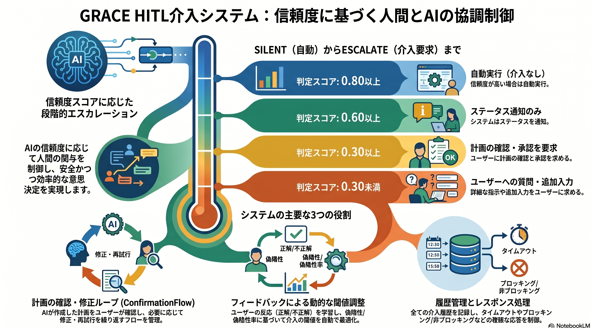
- （作図）作成中

→ リプラン（Replan）


## (2) Chunking（意味ある文章に分割する）
- (2-1) 評価用データ：HuggingFaceからダウンロード
- (2-2) RAG: Chunkデータの作成
- (2-3) RAG: Qdrant(ベクターDB)への登録、検索

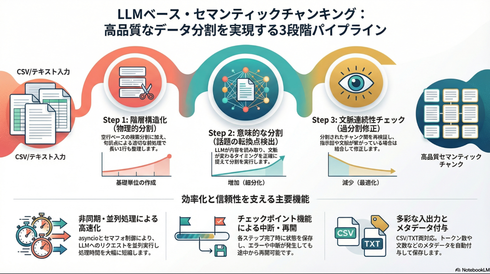

> **はじめにお読みください**
>
> | # | ドキュメント | 説明 |
> | - | ----------- | ---- |
> | 1 | [セットアップ・インストール手順書 (docs/setup_and_install.md)](./docs/setup_and_install.md) | Python・Docker・uv・API キーの包括的セットアップ手順（はじめにこちら） |
> | 2 | [環境構築手順書 (readme_make_env.md)](./readme_make_env.md) | Mac 向け詳細環境構築（Python / Docker / Celery / API キー設定） |
> | 3 | [uv パッケージマネージャー (docs/uv_install.md)](./docs/uv_install.md) | pip → uv 移行・仮想環境管理手順 |
> | 4 | [RAG データ取得ガイド (down_load_non_qa_rag_data_from_huggingface.md)](./down_load_non_qa_rag_data_from_huggingface.md) | RAG データを HuggingFace からダウンロード・前処理する手順 |
> | 5 | [RAG ツール使用ガイド (readme_usage_tools.md)](./readme_usage_tools.md) | チャンク作成 → Q/A 生成・Qdrant 登録 → Agent 検索の操作手順 |
> | 6 | [RAG Q/A 生成・検索システム (readme_rag.md)](./readme_rag.md) | RAG パイプライン全体の設計・クラス・関数 IPO 詳細（セマンティックチャンキング / Q&A 生成 / Qdrant 検索） |
> | 7 | [Streamlit アプリ設計書 (docs/agent_rag.md)](./docs/agent_rag.md) | agent_rag.py のアーキテクチャ・ページ構成・Anthropic Claude 設定・モデル一覧 |
> | 8 | [ReAct+Reflection エージェント (readme_react_reflection.md)](./readme_react_reflection.md) | ReAct（Reasoning+Acting）ループ + Reflection 自己評価による自律型 RAG エージェントの設計と実装 |
> | 9 | [自律型 Agent — GRACE (readme_autonomous_agent.md)](./readme_autonomous_agent.md) | GRACE（Plan→Execute→Confidence→Intervention→Replan）アーキテクチャの設計・IPO 詳細 |
>
> **技術参考資料**
>
> | # | ドキュメント | 説明 |
> | - | ----------- | ---- |
> | R1 | [LLM API 3プロバイダー対比表 v2 (docs/llm_api_comparison_v2.md)](./docs/llm_api_comparison_v2.md) | Anthropic / OpenAI / Gemini の API・クライアント・Embedding 完全比較（最新版） |
>
> **アーカイブ**
>
> 旧 API 移行計画・ベンチマーク TODO・リファクタリング TODO 等の過去ドキュメントは [docs/archive/](./docs/archive/README.md) に移動しました（移行計画 v2 / 各種 API 移行ガイド / benchmark_todo / grace_react_refactor_todo を含む）。

---

## ドキュメント ↔ 対応コード 対応表

各ドキュメントが「どのソースコードを説明・対象としているか」の対応表です。ドキュメントを最新化する際は、対応するコードを精読して整合させてください。

| # | ドキュメント | 主な対応コード | 補助的に参照するコード |
|---|---|---|---|
| 0 | [README.md](./README.md)（プロジェクト全体・UIエントリ） | `agent_rag.py`（Streamlit エントリ） | `ui/app.py`, `ui/pages/*`, `ui/components/*`、および全パイプライン（`grace/`, `chunking/`, `qa_qdrant/`, `qa_generation/`, `services/`, `helper/`） |
| 1 | [docs/setup_and_install.md](./docs/setup_and_install.md)（セットアップ・インストール） | `pyproject.toml`, `uv.lock`, `requirements.txt`, `docker-compose/docker-compose.yml` | `config.py` / `config.yml`, `.env`, `helper/helper_llm.py`, `helper/helper_embedding.py`（APIキー確認） |
| 2 | [readme_make_env.md](./readme_make_env.md)（Mac環境構築） | `requirements.txt`, `pyproject.toml`, `docker-compose/docker-compose.yml`, `.env` | `config.py`（`GraceConfig`）, `config.yml` |
| 3 | [docs/uv_install.md](./docs/uv_install.md)（uv パッケージ管理） | `pyproject.toml`, `uv.lock` | `requirements.txt` |
| 4 | [down_load_non_qa_rag_data_from_huggingface.md](./down_load_non_qa_rag_data_from_huggingface.md)（RAGデータ取得） | `down_load_non_qa_rag_data_from_huggingface.py` | `datasets/` 配下 |
| 5 | [readme_usage_tools.md](./readme_usage_tools.md)（RAGツール操作手順） | `chunking/csv_text_to_chunks_text_csv.py`, `qa_qdrant/make_qa_register_qdrant.py`, `qa_qdrant/register_to_qdrant.py` | `chunking/*`（`async_api_client.py`, `checkpoint_manager.py`, `prompts.py` 等）, `qa_qdrant/make_qa.py` |
| 6 | [readme_rag.md](./readme_rag.md)（RAG Q/A生成・検索システム設計） | `chunking/`, `qa_generation/`（`semantic.py`, `smart_qa_generator.py`, `pipeline.py`, `evaluation.py`）, `qa_qdrant/`, `qdrant_client_wrapper.py` | `helper/helper_rag*.py`, `helper/helper_embedding*.py`, `services/qdrant_service.py`, `models.py` |
| 7 | [docs/agent_rag.md](./docs/agent_rag.md)（Streamlitアプリ設計書） | `agent_rag.py` | `ui/app.py`, `ui/pages/*`（`grace_chat_page.py`, `agent_chat_page.py`, `qdrant_*` 等）, `ui/components/*` |
| 8 | [readme_react_reflection.md](./readme_react_reflection.md)（ReAct+Reflectionエージェント） | `services/agent_service.py`（`ReActAgent`） | `agent_main.py`, `agent_tools.py`, `agent_parallel_search.py`, `agent_cache.py`, `ui/pages/agent_chat_page.py`, `services/qa_service.py`, `services/qdrant_service.py`, `helper/helper_llm.py`, `helper/helper_embedding*.py` |
| 9 | [readme_autonomous_agent.md](./readme_autonomous_agent.md)（自律型Agent — GRACE） | `grace/` パッケージ（`planner.py`, `executor.py`, `confidence.py`, `intervention.py`, `replan.py`, `calibration.py`, `llm_compat.py`, `schemas.py`, `config.py`, `tools.py`） | `grace/benchmark.py`, `ui/pages/grace_chat_page.py`, `ui/components/grace_components.py` |

**補足:**

- `agent_rag.py` は Streamlit アプリのエントリで、`ui/pages/` 配下の各ページを束ねます。README.md（#0）と docs/agent_rag.md（#7）はこのアプリ層が主対象です。
- #8（ReAct+Reflection）と #9（GRACE）は別系統のエージェントです。ReAct は `services/agent_service.py`（google-genai 直叩き＋Reflection フェーズ・レガシー経路で、モデル名は Gemini 系へ自動フォールバック）、GRACE は `grace/` パッケージ（Plan→Execute→Confidence→Intervention→Replan、`grace/llm_compat.py` 経由で Anthropic Claude 既定）。
- 技術スタック規約：LLM = Anthropic Claude（`claude-sonnet-4-6`、`grace/llm_compat.py` 経由）、Embedding = Gemini（`gemini-embedding-001`・3072次元）。ただしチャンキング/Q&A 生成の CLI ツール（`chunking/`・`qa_qdrant/`）は argparse 既定が `gemini-2.5-flash` で、`--model claude-sonnet-4-6` で上書き可能。

---

## （自律型Agent）grace_chat_page.py

画面（UIエントリポイント）： `streamlit run agent_rag.py`


個々のドキュメントは、機能ディレクトリー/doc/*.md を参照あれ。

### Streamlit アプリの起動とページ構成

```bash
# UI 起動（エントリポイントは agent_rag.py）
uv run streamlit run agent_rag.py --server.port 8501
```

`agent_rag.py` のサイドバーメニュー（`main()` の `st.radio`）から以下のページを選択します。

| メニュー表示                          | ページID             | 実装                                                       |
| ------------------------------------- | -------------------- | ---------------------------------------------------------- |
| 📖 説明                               | `explanation`        | `ui/pages/explanation_page.py::show_system_explanation_page` |
| 🔎 Qdrant検索                         | `qdrant_search`      | `ui/pages/qdrant_search_page.py::show_qdrant_search_page`  |
| 🤖 Agent(ReAct+Reflection)            | `agent_chat`         | `ui/pages/agent_chat_page.py::show_agent_chat_page`        |
| [最新] 自律型Agent(Plan+Executor)     | `grace_chat`         | `ui/pages/grace_chat_page.py::show_grace_chat_page`        |
| 📊 未回答ログ                         | `log_viewer`         | `ui/pages/log_viewer_page.py::show_log_viewer_page`        |
| 📄 RAGデータ作成                      | `rag_data_creation`  | `agent_rag.py::show_rag_data_creation_page`（CLI手順への案内） |
| 🗄️ QdrantのCRUD                       | `qdrant_crud`        | `agent_rag.py::show_qdrant_crud_page`                      |

RAGデータの作成（チャンク分割 → Q/A生成＋Qdrant登録）は UI からではなく CLI で実行します（後述「RAGデータ作成パイプライン」を参照）。`ui/pages/` には `download_page` / `qa_generation_page` / `qdrant_registration_page` / `qdrant_show_page` も同梱されていますが、現行の `agent_rag.py` メニューには未接続です。

### RAGデータ作成パイプライン（CLI）

```bash
# (1) チャンク分割（LLMベース 3段階セマンティックチャンキング）
uv run python -m chunking.csv_text_to_chunks_text_csv \
  --input-file OUTPUT/cc_news_1per.csv \
  --output output_chunked

# (2) Q/A生成 ＋ Qdrant登録（統合CLI）
uv run python qa_qdrant/make_qa_register_qdrant.py \
  --input output_chunked/cc_news_1per_chunks.csv

# 既存 Q/A CSV を登録のみ行う場合
uv run python qa_qdrant/register_to_qdrant.py --input qa_output/...csv

# (3) 検索・対話は UI から
uv run streamlit run agent_rag.py --server.port 8501
```

詳細手順は [readme_usage_tools.md](./readme_usage_tools.md)、各 CLI の仕様は `chunking/doc/csv_text_to_chunks_text_csv.md` / `qa_qdrant/doc/make_qa_register_qdrant.md` を参照してください。

### 技術スタック

| 役割                              | プロバイダー  | モデル / 設定                                                   |
| --------------------------------- | ------------- | -------------------------------------------------------------- |
| LLM（計画策定・実行・応答生成）   | **Anthropic** | デフォルト `claude-sonnet-4-6`（軽量 `claude-haiku-4-5-20251001`）、APIキー `ANTHROPIC_API_KEY`、ルーティングは `grace/llm_compat.py` 経由 |
| Embedding（Qdrant登録・検索）     | **Gemini**    | `gemini-embedding-001`（3072次元）、APIキー `GOOGLE_API_KEY` / `GEMINI_API_KEY` |
| ベクトルDB                        | Qdrant        | `http://localhost:6333`                                        |

LLM プロバイダー / モデルは `grace/config.py` の `LLMConfig`（`provider="anthropic"`, `model="claude-sonnet-4-6"`）、Embedding は `EmbeddingConfig`（`provider="gemini"`, `model="gemini-embedding-001"`, `dimensions=3072`）が既定値です。

**Version 4.2** | 最終更新: 2026-06-17

---

## 目次

1. [概要](#概要)
2. [画面レイアウト図](#1-画面レイアウト図)
3. [UIコンポーネント詳細](#2-uiコンポーネント詳細)
4. [セッション状態管理](#3-セッション状態管理)
5. [ユーザー操作フロー](#4-ユーザー操作フロー)
6. [関数一覧表](#5-関数一覧表)
7. [関数 IPO詳細](#6-関数-ipo詳細)
8. [依存関係](#7-依存関係)
9. [イベント処理](#8-イベント処理)
10. [エラーハンドリング](#9-エラーハンドリング)
11. [使用例](#10-使用例)
12. [変更履歴](#11-変更履歴)

---

## 概要

`grace_chat_page.py`は、GRACE（Goal-Reasoning-Action-Critique-Execute）アーキテクチャを使用した自律型エージェントとの対話インターフェースを提供するStreamlit UIページです。
Planner + Executor の2フェーズ分離型アーキテクチャにより、計画策定（Plan）→ 実行（Execute）→ 信頼度評価（Confidence）→ 介入判定（Intervention）→ リプラン（Replan）の一連のプロセスをリアルタイムに可視化します。

### 主な責務

- ユーザーからの質問入力の受付
- Planner による実行計画の策定と表示（複雑度・ステップ数・成功基準の可視化）
- Executor による計画の逐次実行と進捗表示（Generator ベースのリアルタイム更新）
- 各ステップの信頼度スコア表示と実行結果サマリの提示
- 会話履歴の管理とセッション状態の維持
- 検索対象コレクションの参考表示（GRACEは全コレクションを自動検索）
- Qdrantコレクションデータのプレビュー表示
- キャッシュ管理と統計表示

### 主要機能一覧


| 機能                     | 説明                                                                      |
| ------------------------ | ------------------------------------------------------------------------- |
| `show_grace_chat_page()` | メインページ表示関数                                                      |
| サイドバー設定           | モデル選択、コレクション参考表示、キャッシュ管理                          |
| コレクションデータ表示   | Qdrantコレクションの内容プレビュー（最大100件）                           |
| チャット履歴表示         | 会話履歴の表示                                                            |
| 計画策定表示             | Planner が生成した ExecutionPlan の構造化表示（📋 計画策定）              |
| 実行プロセス表示         | Executor のステップ実行ログ・信頼度のリアルタイム表示（⚡ 実行）          |
| 実行結果サマリ           | 全体ステータス・信頼度・リプラン回数・実行時間の表示（📊 実行結果サマリ） |

### アーキテクチャ概要

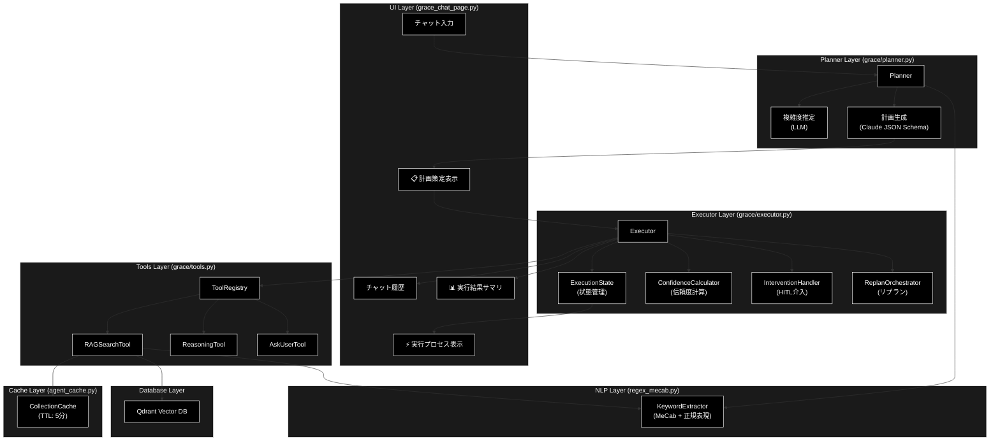

### Planner / Executor 2フェーズ処理フロー

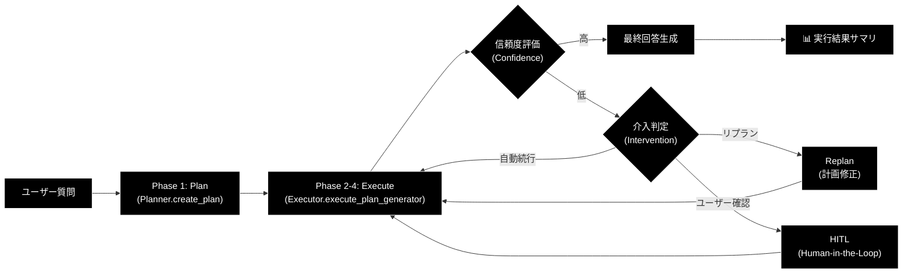

---

## 1. 画面レイアウト図

### 1.1 全体レイアウト

```mermaid
flowchart TB
    subgraph Browser["ブラウザウィンドウ"]
        direction TB
        subgraph Sidebar["📋 サイドバー (280px固定)"]
            direction TB
            S1["⚙️ 設定ヘッダー"]
            S2["モデル選択<br/>[selectbox]"]
            S3["コレクション選択<br/>[multiselect] (参考表示)"]
            S4["☑️ ハイブリッド検索<br/>(disabled)"]
            S5["[🗑️ 履歴クリア]"]
            S6["[🔄 キャッシュリセット]"]
            S7["📊 キャッシュ統計<br/>(expander)"]
            S1 --> S2 --> S3 --> S4 --> S5 --> S6 --> S7
        end
        subgraph Main["📄 メインエリア (残り幅)"]
            direction TB
            M1["🧠 タイトル<br/>自律型エージェント GRACE"]
            M2["キャプション<br/>Planner + Executor"]
            M3["📊 コレクションデータ表示<br/>(expander)"]
            M4["💬 チャットセクション"]
            M5["チャット履歴エリア"]
            M6["📋 計画策定 Plan<br/>(expander, 展開)"]
            M7["⚡ 実行 Execute<br/>(expander, 展開)"]
            M8["📊 実行結果サマリ<br/>(expander, 折りたたみ)"]
            M9["最終回答表示"]
            M10["📝 チャット入力"]
            M1 --> M2 --> M3 --> M4 --> M5 --> M6 --> M7 --> M8 --> M9 --> M10
        end
    end

    Sidebar -.-> Main
classDef default fill:#000,stroke:#fff,color:#fff
classDef subgraphStyle fill:#1a1a1a,stroke:#fff,color:#fff
class S1,S2,S3,S4,S5,S6,S7,M1,M2,M3,M4,M5,M6,M7,M8,M9,M10 default
style Browser fill:#1a1a1a,stroke:#fff,color:#fff
style Sidebar fill:#1a1a1a,stroke:#fff,color:#fff
style Main fill:#1a1a1a,stroke:#fff,color:#fff
```

### 1.2 コンポーネント配置図

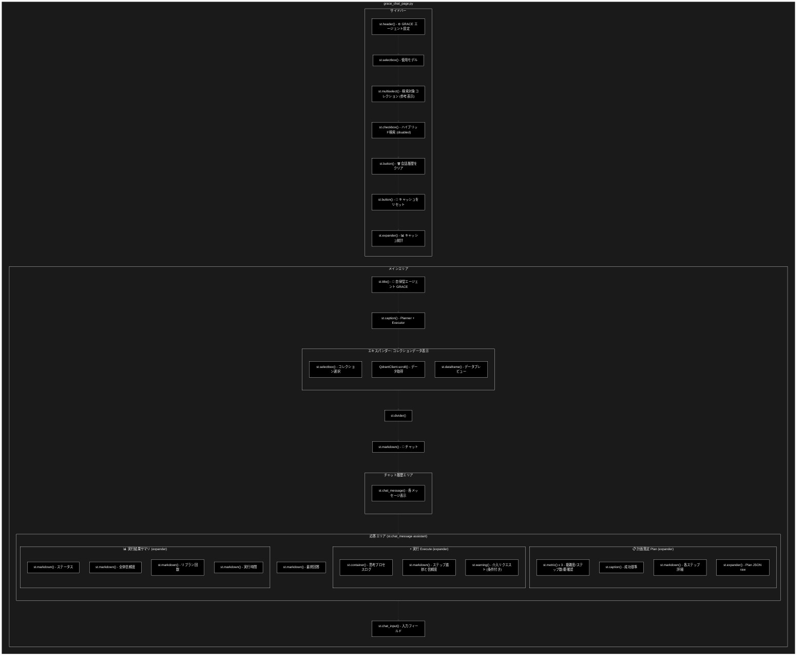

### 1.3 応答エリア内部構造

ユーザーが質問を送信した際、`st.chat_message("assistant")` 内に以下の3つのExpanderが順次生成されます。

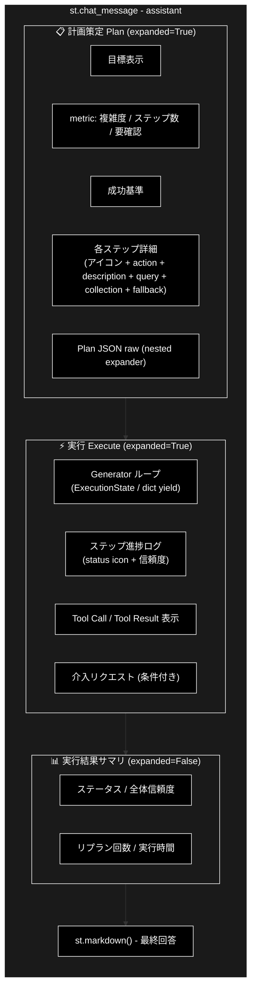

---

## 2. UIコンポーネント詳細

### 2.1 サイドバー


| コンポーネント     | 種類             | キー | デフォルト値             | 説明                                                              |
| ------------------ | ---------------- | ---- | ------------------------ | ----------------------------------------------------------------- |
| 設定ヘッダー       | `st.header`      | -    | -                        | 「⚙️ GRACE エージェント設定」                                   |
| モデル選択         | `st.selectbox`   | -    | `AgentConfig.MODEL_NAME` | 使用するLLMモデル（Anthropic Claude）                            |
| コレクション選択   | `st.multiselect` | -    | 全コレクション           | 検索対象コレクション（参考表示。GRACEは全コレクションを自動検索） |
| ハイブリッド検索   | `st.checkbox`    | -    | `True`                   | Sparse + Dense検索（`disabled=True`、GRACE側デフォルトに委任）    |
| 履歴クリア         | `st.button`      | -    | -                        | 会話履歴・Planner・Executor 状態のクリア                          |
| キャッシュリセット | `st.button`      | -    | -                        | セッションキャッシュのクリア                                      |
| キャッシュ統計     | `st.expander`    | -    | 折りたたみ               | キャッシュ状態の詳細表示                                          |

#### モデル選択の詳細

```python
selected_model = st.selectbox(
    "使用モデル (Model)",
    options=ModelConfig.AVAILABLE_MODELS,
    index=ModelConfig.AVAILABLE_MODELS.index(AgentConfig.MODEL_NAME)
    if AgentConfig.MODEL_NAME in ModelConfig.AVAILABLE_MODELS else 0
)
```

**オプション一覧** (`ModelConfig.AVAILABLE_MODELS`):


| モデル名                        | 説明                                       |
| ------------------------------- | ------------------------------------------ |
| `claude-sonnet-4-6`             | Claude Sonnet（**デフォルト**）            |
| `claude-haiku-4-5-20251001`     | 軽量・高速モデル                           |

#### コレクション選択の詳細

```python
selected_collections = st.multiselect(
    "検索対象コレクション (参考表示)",
    options=all_collections,
    default=all_collections if all_collections != ["(None)"] else [],
    help="GRACEエージェントはQdrant上の全コレクションを自動検索します。"
)
```

コレクション選択はUIでの参考表示のみです。GRACE Executor 内の `RAGSearchTool` が Qdrant から動的にコレクション一覧を取得し、優先順位に従って全コレクションを順次検索します。

#### キャッシュ統計の詳細


| 表示項目       | 説明                               |
| -------------- | ---------------------------------- |
| キャッシュ状態 | 🟢 ヒット / ⚪ なし                |
| コレクション   | キャッシュされているコレクション名 |
| 前回スコア     | 直近の検索スコア                   |
| ヒット回数     | キャッシュヒット累計               |
| 経過時間       | キャッシュ作成からの経過秒数       |

### 2.2 メインエリア


| コンポーネント           | 種類                           | 説明                                                                          |
| ------------------------ | ------------------------------ | ----------------------------------------------------------------------------- |
| タイトル                 | `st.title`                     | 「🧠 自律型エージェント (GRACE)」                                             |
| キャプション             | `st.caption`                   | 「Goal-Reasoning-Action-Critique-Execute Architecture — Planner + Executor」 |
| コレクションデータ表示   | `st.expander` + `st.dataframe` | Qdrantデータのプレビュー                                                      |
| チャットセクション見出し | `st.markdown`                  | 「### 💬 チャット」                                                           |
| チャット履歴             | `st.chat_message`              | 会話の表示                                                                    |
| 📋 計画策定 (Plan)       | `st.expander`                  | Planner が生成した ExecutionPlan の表示                                       |
| ⚡ 実行 (Execute)        | `st.expander`                  | Executor のステップ実行ログのリアルタイム表示                                 |
| 📊 実行結果サマリ        | `st.expander`                  | 全体ステータス・信頼度・リプラン回数・実行時間                                |
| 最終回答                 | `st.markdown`                  | Executor の最終回答テキスト                                                   |
| チャット入力             | `st.chat_input`                | ユーザー入力                                                                  |

### 2.3 エキスパンダー一覧


| エキスパンダー名            | 初期状態   | 表示タイミング   | 内容                                                                       |
| --------------------------- | ---------- | ---------------- | -------------------------------------------------------------------------- |
| 📊 コレクションデータの表示 | 折りたたみ | 常時             | コレクション選択 + DataFrameプレビュー（100件）                            |
| 📋 計画策定 (Plan)          | **展開**   | 質問送信後       | 目標、複雑度/ステップ数/要確認のmetric、成功基準、各ステップ詳細           |
| 🔧 Plan JSON (raw)          | 折りたたみ | 計画策定内       | ExecutionPlan の JSON ダンプ（デバッグ用、ネストExpander）                 |
| ⚡ 実行 (Execute)           | **展開**   | 計画策定後       | ステップ進捗ログ（status icon + 信頼度）、Tool Call/Result、介入リクエスト |
| 📊 実行結果サマリ           | 折りたたみ | 実行完了後       | ステータス、全体信頼度、リプラン回数、実行時間                             |
| 📊 キャッシュ統計           | 折りたたみ | 常時(サイドバー) | キャッシュヒット状態、統計情報                                             |

### 2.4 計画策定 (Plan) Expander 内部詳細

計画策定 Expander は `Planner.create_plan()` の結果である `ExecutionPlan` を構造化表示します。


| 表示要素   | コンポーネント          | データソース                                                                                    |
| ---------- | ----------------------- | ----------------------------------------------------------------------------------------------- |
| 目標       | `st.markdown`           | `plan.original_query`                                                                           |
| 複雑度     | `st.metric` (3カラム左) | `plan.complexity`（0.0-1.0）                                                                    |
| ステップ数 | `st.metric` (3カラム中) | `plan.estimated_steps`                                                                          |
| 要確認     | `st.metric` (3カラム右) | `plan.requires_confirmation`（⚠️/✅）                                                         |
| 成功基準   | `st.caption`            | `plan.success_criteria`                                                                         |
| 各ステップ | `st.markdown` (ループ)  | `plan.steps[]` の action, description, query, collection, expected_output, fallback, depends_on |

**ステップのアクションアイコンマッピング**:


| action             | アイコン |
| ------------------ | -------- |
| `rag_search`       | 🔍       |
| `web_search`       | 🌐       |
| `reasoning`        | 🧠       |
| `ask_user`         | 💬       |
| `code_execute`     | 💻       |
| `run_legacy_agent` | 🤖       |
| その他             | ▶️     |

### 2.5 実行 (Execute) Expander 内部詳細

実行 Expander は `Executor.execute_plan_generator()` の Generator から yield される値をリアルタイム表示します。


| yield 型                     | 表示処理                                                                                         |
| ---------------------------- | ------------------------------------------------------------------------------------------------ |
| `ExecutionState`             | ステップID、ステータスアイコン、信頼度を1行で表示。介入リクエストがある場合は`st.warning` で表示 |
| `dict` (type=`log`)          | 思考プロセスログを`st.markdown` で追記                                                           |
| `dict` (type=`tool_call`)    | ツール名・引数を表示（🛠️）                                                                     |
| `dict` (type=`tool_result`)  | ツール結果を表示（📝、500文字で切り詰め）                                                        |
| `dict` (type=`final_answer`) | Legacy Agent 経由の最終回答を取得                                                                |
| `StopIteration.value`        | `ExecutionResult` を取得（Generator 終了時）                                                     |

**ステータスアイコンマッピング**:


| StepStatus | アイコン |
| ---------- | -------- |
| `SUCCESS`  | ✅       |
| `FAILED`   | ❌       |
| `SKIPPED`  | ⏭️     |
| `RUNNING`  | 🔄       |
| `PENDING`  | ⏳       |
| その他     | ❓       |

### 2.6 実行結果サマリ Expander 内部詳細


| 表示項目     | コンポーネント | データソース                                                          |
| ------------ | -------------- | --------------------------------------------------------------------- |
| ステータス   | `st.markdown`  | `execution_result.overall_status`（success/partial/failed/cancelled） |
| 全体信頼度   | `st.markdown`  | `execution_result.overall_confidence`（0.00-1.00）                    |
| リプラン回数 | `st.markdown`  | `execution_result.replan_count`                                       |
| 実行時間     | `st.markdown`  | `execution_result.total_execution_time_ms`（ミリ秒、存在時のみ表示）  |

### 2.7 ダイアログ・モーダル

（このページではダイアログ・モーダルは使用していません）

---

## 3. セッション状態管理

### 3.1 状態一覧


| キー                  | 型           | 初期値                             | 説明                      | リセット条件                |
| --------------------- | ------------ | ---------------------------------- | ------------------------- | --------------------------- |
| `grace_chat_history`  | `List[Dict]` | `[]`                               | 会話履歴（role, content） | クリアボタン                |
| `grace_session_id`    | `str`        | `uuid.uuid4()`                     | セッション識別子          | ページリロード              |
| `grace_planner`       | `Planner`    | `None`（初回アクセス時に自動生成） | 計画策定エージェント      | モデル変更時 / クリアボタン |
| `grace_executor`      | `Executor`   | `None`（初回アクセス時に自動生成） | 計画実行エージェント      | モデル変更時 / クリアボタン |
| `grace_current_model` | `str`        | -                                  | 選択中モデル              | モデル変更時 / クリアボタン |

#### 旧バージョン（v1.0）からの変更点


| 旧キー（削除）                | 新キー（追加）                     | 変更理由                                        |
| ----------------------------- | ---------------------------------- | ----------------------------------------------- |
| `grace_agent`（ReActAgent）   | `grace_planner` + `grace_executor` | 単一エージェント → 2フェーズ分離               |
| `grace_current_hybrid_search` | （削除）                           | GRACE側デフォルトに委任（UI は`disabled=True`） |
| `grace_current_collections`   | （削除）                           | GRACEが全コレクション自動検索のため不要         |

### 3.2 状態遷移図

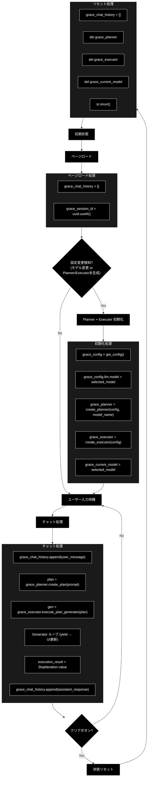

### 3.3 初期化・リセット条件


| 条件                    | 対象状態                                                                       | 処理                                      |
| ----------------------- | ------------------------------------------------------------------------------ | ----------------------------------------- |
| ページ初回ロード        | `grace_chat_history`, `grace_session_id`                                       | デフォルト値で初期化                      |
| モデル変更              | `grace_planner`, `grace_executor`, `grace_current_model`                       | Planner + Executor 再初期化、トースト表示 |
| Planner/Executor 未生成 | `grace_planner`, `grace_executor`                                              | 初期化処理を実行（初回アクセス時）        |
| クリアボタン            | `grace_chat_history`, `grace_planner`, `grace_executor`, `grace_current_model` | 全状態クリア後`st.rerun()`                |
| キャッシュリセット      | キャッシュのみ                                                                 | `collection_cache.clear(session_id)`      |

### 3.4 初期化処理の詳細

Planner と Executor の初期化は以下の条件のいずれかを満たす場合に実行されます。

```
should_reinitialize = (
    "grace_current_model" not in st.session_state
    or st.session_state.grace_current_model != selected_model
    or "grace_planner" not in st.session_state
    or "grace_executor" not in st.session_state
)
```

初期化フロー:

```python
# 1. GraceConfig を取得し、UIで選択したモデルを反映
grace_config = get_config()            # grace/config.py のシングルトン
grace_config.llm.model = selected_model

# 2. Planner を初期化（モデル名を明示的に指定）
st.session_state.grace_planner = create_planner(
    config=grace_config,
    model_name=selected_model
)

# 3. Executor を初期化（ToolRegistry, Confidence, Intervention, Replan を内包）
st.session_state.grace_executor = create_executor(
    config=grace_config
)

# 4. 現在のモデルを記録
st.session_state.grace_current_model = selected_model
```

旧バージョンとの主な違い:

- 旧: コレクション変更・ハイブリッド検索変更でもエージェント再初期化が必要だった
- 新: **モデル変更のみ**で再初期化。コレクション検索は `RAGSearchTool` が Qdrant から動的に取得するため、UI 側の選択は再初期化トリガーにならない

---

## 4. ユーザー操作フロー

### 4.1 基本操作フロー

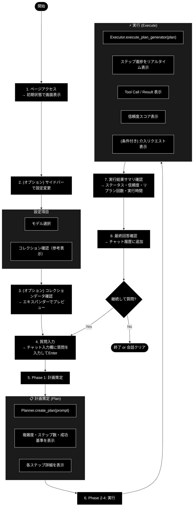

### 4.2 操作シーケンス図


---

## 5. 関数一覧表

### 5.1 メイン関数


| 関数名                   | 概要                           |
| ------------------------ | ------------------------------ |
| `show_grace_chat_page()` | ページ全体のレンダリングと制御 |

### 5.2 ヘルパー関数・クラス（インポート）


| 関数 / クラス                                    | モジュール               | 概要                                                 |
| ------------------------------------------------ | ------------------------ | ---------------------------------------------------- |
| `get_available_collections_from_qdrant_helper()` | `services.agent_service` | Qdrantコレクション一覧取得                           |
| `Planner` / `create_planner()`                   | `grace.planner`          | 計画策定エージェントの生成                           |
| `Executor` / `create_executor()`                 | `grace.executor`         | 計画実行エージェントの生成                           |
| `ExecutionPlan`                                  | `grace.schemas`          | 実行計画データモデル                                 |
| `ExecutionState`                                 | `grace.executor`         | 実行状態管理データクラス                             |
| `ExecutionResult`                                | `grace.schemas`          | 全体実行結果データモデル                             |
| `StepResult`                                     | `grace.schemas`          | ステップ単位の実行結果                               |
| `StepStatus`                                     | `grace.schemas`          | ステップの状態Enum                                   |
| `GraceConfig` / `get_config()`                   | `grace.config`           | GRACE設定の取得                                      |
| `collection_cache`                               | `agent_cache`            | コレクションキャッシュ管理（グローバルインスタンス） |

### 5.3 grace/ パッケージ内部構成

`grace_chat_page.py` が直接利用するのは Planner / Executor / schemas のみですが、Executor 内部で以下のモジュールが連携します。


| モジュール              | 概要                                     | Executor からの利用               |
| ----------------------- | ---------------------------------------- | --------------------------------- |
| `grace/planner.py`      | 計画生成（LLM + JSON Schema）            | UI から直接呼び出し               |
| `grace/executor.py`     | 計画実行（Generator + 状態管理）         | UI から直接呼び出し               |
| `grace/schemas.py`      | データモデル定義                         | ExecutionPlan, ExecutionResult 等 |
| `grace/config.py`       | 設定管理（YAML + 環境変数）              | get_config() 経由                 |
| `grace/tools.py`        | ToolRegistry（RAG, Reasoning, AskUser）  | Executor 内部で自動利用           |
| `grace/confidence.py`   | 信頼度計算（LLM自己評価 + クエリ網羅度） | Executor 内部で自動利用           |
| `grace/intervention.py` | HITL介入（Confirm, Escalate）            | Executor 内部で自動利用           |
| `grace/replan.py`       | リプラン戦略（部分/全体リプラン）        | Executor 内部で自動利用           |

---

## 6. 関数 IPO詳細

### 6.1 `show_grace_chat_page`

**概要**: GRACEエージェントチャットページのメイン表示関数。サイドバー設定、コレクションデータプレビュー、チャット履歴、Planner による計画策定、Executor による計画実行を統合管理する。

```python
def show_grace_chat_page() -> None
```


| 項目        | 内容                                                                                                                                                                                                                                                                                                                                                                                                                            |
| ----------- | ------------------------------------------------------------------------------------------------------------------------------------------------------------------------------------------------------------------------------------------------------------------------------------------------------------------------------------------------------------------------------------------------------------------------------- |
| **Input**   | なし（セッション状態から取得）                                                                                                                                                                                                                                                                                                                                                                                                  |
| **Process** | 1. コレクションデータ表示エリアの描画<br>2. サイドバー設定UIの描画<br>3. セッション状態の初期化・更新チェック<br>4. Planner + Executor の初期化（必要時）<br>5. チャット履歴の表示<br>6. ユーザー入力の処理<br>7. Phase 1: Planner.create_plan() → 計画策定 Expander 表示<br>8. Phase 2-4: Executor.execute_plan_generator() → 実行 Expander 表示<br>9. ExecutionResult → 実行結果サマリ表示<br>10. 最終回答の表示・履歴追加 |
| **Output**  | なし（画面描画のみ）                                                                                                                                                                                                                                                                                                                                                                                                            |

**主要処理フロー**:

```python
# 1. コレクションデータ表示
with st.expander("📊 コレクションデータの表示", expanded=False):
    target_collection = st.selectbox("コレクションを選択:", preview_collections)
    points, _ = client.scroll(collection_name=target_collection, limit=100)
    st.dataframe(df_preview)

# 2. サイドバー設定
with st.sidebar:
    selected_model = st.selectbox("使用モデル", options=ModelConfig.AVAILABLE_MODELS)
    selected_collections = st.multiselect("検索対象コレクション (参考表示)", ...)
    use_hybrid_search = st.checkbox("ハイブリッド検索", value=True, disabled=True)

# 3. セッション状態初期化
if "grace_chat_history" not in st.session_state:
    st.session_state.grace_chat_history = []
if "grace_session_id" not in st.session_state:
    st.session_state.grace_session_id = str(uuid.uuid4())

# 4. Planner + Executor 初期化（モデル変更時 or 未生成時）
if should_reinitialize:
    grace_config = get_config()
    grace_config.llm.model = selected_model
    st.session_state.grace_planner = create_planner(config=grace_config, model_name=selected_model)
    st.session_state.grace_executor = create_executor(config=grace_config)
    st.session_state.grace_current_model = selected_model

# 5. チャット履歴表示
for message in st.session_state.grace_chat_history:
    with st.chat_message(message["role"]):
        st.markdown(message["content"])

# 6. ユーザー入力処理
if prompt := st.chat_input("質問を入力してください..."):
    st.session_state.grace_chat_history.append({"role": "user", "content": prompt})

    with st.chat_message("assistant"):
        # 7. Phase 1: 計画策定
        with st.expander("📋 計画策定 (Plan)", expanded=True):
            plan = st.session_state.grace_planner.create_plan(prompt)
            # metric: 複雑度, ステップ数, 要確認
            # 各ステップ詳細表示

        # 8. Phase 2-4: 実行
        with st.expander("⚡ 実行 (Execute)", expanded=True):
            gen = st.session_state.grace_executor.execute_plan_generator(plan)
            try:
                while True:
                    yielded = next(gen)
                    if isinstance(yielded, ExecutionState):
                        # ステップ状態・信頼度を表示
                    elif isinstance(yielded, dict):
                        # log / tool_call / tool_result / final_answer を表示
            except StopIteration as e:
                execution_result = e.value  # ExecutionResult

        # 9. 実行結果サマリ
        with st.expander("📊 実行結果サマリ", expanded=False):
            # ステータス, 全体信頼度, リプラン回数, 実行時間

        # 10. 最終回答表示
        st.markdown(execution_result.final_answer)
        st.session_state.grace_chat_history.append({"role": "assistant", "content": ...})
```

### 6.2 `Planner.create_plan`

**概要**: ユーザーの質問を分析し、LLM（Anthropic Claude）を使って ExecutionPlan を生成する。

**参照**: `grace/planner.py`

```python
def create_plan(self, query: str) -> ExecutionPlan
```


| 項目        | 内容                                                                                                                                                                                                                                                                                                                                                                                                                                                     |
| ----------- | -------------------------------------------------------------------------------------------------------------------------------------------------------------------------------------------------------------------------------------------------------------------------------------------------------------------------------------------------------------------------------------------------------------------------------------------------------- |
| **Input**   | `query: str` — ユーザーの質問文                                                                                                                                                                                                                                                                                                                                                                                                                         |
| **Process** | 1.`_get_available_collections()` — Qdrantから利用可能コレクション一覧を取得<br>2. `estimate_complexity_with_llm(query)` — LLMで複雑度を推定（0.0-1.0）<br>3. `PLAN_GENERATION_PROMPT` にコレクション一覧・クエリを埋め込み<br>4. Anthropic Claude API で JSON Schema 出力（`response_schema=ExecutionPlan`）<br>5. `ExecutionPlan.model_validate_json()` でパース<br>6. `validate_plan_dependencies()` で依存関係を検証<br>7. 計画IDを付与（`create_plan_id()`） |
| **Output**  | `ExecutionPlan` — 実行計画（失敗時はフォールバック計画を返却）                                                                                                                                                                                                                                                                                                                                                                                          |

**フォールバック動作**: LLM呼び出しが失敗した場合、`_create_fallback_plan()` が2ステップの単純計画（rag_search → reasoning）を返します。

### 6.3 `Planner.estimate_complexity_with_llm`

**概要**: LLMを使って質問の複雑度を推定する。

```python
def estimate_complexity_with_llm(self, query: str) -> float
```


| 項目        | 内容                                                                                                    |
| ----------- | ------------------------------------------------------------------------------------------------------- |
| **Input**   | `query: str` — ユーザーの質問文                                                                        |
| **Process** | `COMPLEXITY_ESTIMATION_PROMPT` を使い、Anthropic Claude API で数値のみを取得（temperature=0.1）         |
| **Output**  | `float` — 複雑度スコア（0.0-1.0）。失敗時はキーワードベースの `estimate_complexity()` にフォールバック |

### 6.4 `Executor.execute_plan_generator`

**概要**: 計画をステップごとに実行し、進捗を Generator で逐次返す。UI でのリアルタイム表示に使用。

**参照**: `grace/executor.py`

```python
def execute_plan_generator(
    self, plan: ExecutionPlan, state: Optional[ExecutionState] = None
) -> Generator[ExecutionState | dict, None, ExecutionResult]
```


| 項目        | 内容                                                                                                                                                                                                                                                                                                                                                                                                                                                          |
| ----------- | ------------------------------------------------------------------------------------------------------------------------------------------------------------------------------------------------------------------------------------------------------------------------------------------------------------------------------------------------------------------------------------------------------------------------------------------------------------- |
| **Input**   | `plan: ExecutionPlan` — 実行する計画<br>`state: Optional[ExecutionState]` — 既存状態（再開時、省略時は新規作成）                                                                                                                                                                                                                                                                                                                                            |
| **Process** | 1.`ExecutionState` を初期化（全ステップを PENDING に設定）<br>2. 各ステップをループ: 依存チェック → ステップ実行 → 信頼度計算 → 介入判定<br>3. ステップ実行は `_execute_step()` を呼び出し、ToolRegistry 経由でツールを実行<br>4. `_execute_step()` が Generator を返す場合（Legacy Agent）は `yield from` で中継<br>5. ステップ失敗時に ReplanOrchestrator がリプランを試行<br>6. 全ステップ完了後に `_calculate_overall_confidence()` で全体信頼度を算出 |
| **Yield**   | `ExecutionState` — ステップ完了/一時停止の通知（status, confidence, intervention_request）<br>`dict` — ツール実行イベント（type: log / tool_call / tool_result / final_answer）                                                                                                                                                                                                                                                                             |
| **Return**  | `ExecutionResult` — 最終実行結果（`StopIteration.value` で取得）                                                                                                                                                                                                                                                                                                                                                                                             |

**Generator のライフサイクル**:

```
┌─ next(gen) ─────────────────────────────────────────────┐
│                                                          │
│  [ステップ開始]                                           │
│    └─ _execute_step(step, state)                        │
│        ├─ ToolRegistry.execute(action, kwargs)          │
│        │   └─ yield dict(type="log", content=...)       │
│        └─ return StepResult                             │
│                                                          │
│  [信頼度計算]                                             │
│    └─ _llm_calculate_step_confidence(tool_result, ...)  │
│                                                          │
│  [介入判定]                                               │
│    ├─ SILENT/NOTIFY → 自動続行                           │
│    └─ CONFIRM/ESCALATE → yield ExecutionState (paused)  │
│                                                          │
│  [ステップ完了]                                           │
│    └─ yield ExecutionState (status + confidence)         │
│                                                          │
│  [失敗時リプラン]                                         │
│    └─ yield from execute_plan_generator(new_plan, state) │
│                                                          │
├─ ... (次ステップへ) ...                                   │
│                                                          │
│  [全ステップ完了]                                         │
│    └─ return ExecutionResult ← StopIteration.value       │
└──────────────────────────────────────────────────────────┘
```

### 6.5 `get_available_collections_from_qdrant_helper`

**概要**: Qdrantから利用可能なコレクション一覧を取得する。

**参照**: `services/agent_service.py`


| 項目        | 内容                                                      |
| ----------- | --------------------------------------------------------- |
| **Input**   | なし                                                      |
| **Process** | QdrantClient でコレクション一覧を取得                     |
| **Output**  | `List[str]`: コレクション名のリスト（エラー時は空リスト） |

### 6.6 主要データモデル

#### ExecutionPlan（`grace/schemas.py`）


| フィールド              | 型                   | 説明                                    |
| ----------------------- | -------------------- | --------------------------------------- |
| `original_query`        | `str`                | ユーザーの元の質問                      |
| `complexity`            | `float` (0.0-1.0)    | 推定複雑度                              |
| `estimated_steps`       | `int` (1-20)         | 推定ステップ数                          |
| `requires_confirmation` | `bool`               | 実行前に確認が必要か                    |
| `steps`                 | `List[PlanStep]`     | 実行ステップのリスト                    |
| `success_criteria`      | `str`                | 計画成功の判定基準                      |
| `created_at`            | `Optional[datetime]` | 計画作成日時                            |
| `plan_id`               | `Optional[str]`      | 計画ID（自動生成、12文字のMD5ハッシュ） |

#### PlanStep（`grace/schemas.py`）


| フィールド        | 型                      | 説明                                                                                          |
| ----------------- | ----------------------- | --------------------------------------------------------------------------------------------- |
| `step_id`         | `int` (≥1)             | ステップ番号                                                                                  |
| `action`          | `Literal[...]`          | アクション種別（rag_search, web_search, reasoning, ask_user, code_execute, run_legacy_agent） |
| `description`     | `str`                   | ステップの説明                                                                                |
| `query`           | `Optional[str]`         | 検索クエリ（検索系アクション用）                                                              |
| `collection`      | `Optional[str]`         | 検索対象コレクション（原則 null — 全コレクション自動検索）                                   |
| `depends_on`      | `List[int]`             | 依存する先行ステップID                                                                        |
| `expected_output` | `str`                   | 期待される出力の説明                                                                          |
| `fallback`        | `Optional[str]`         | 失敗時の代替アクション                                                                        |
| `timeout_seconds` | `Optional[int]` (1-300) | タイムアウト秒数（デフォルト30）                                                              |

#### ExecutionResult（`grace/schemas.py`）


| フィールド                | 型                 | 説明                                                  |
| ------------------------- | ------------------ | ----------------------------------------------------- |
| `plan_id`                 | `str`              | 計画ID                                                |
| `original_query`          | `str`              | 元のクエリ                                            |
| `final_answer`            | `Optional[str]`    | 最終回答                                              |
| `step_results`            | `List[StepResult]` | 各ステップの結果                                      |
| `overall_confidence`      | `float` (0.0-1.0)  | 全体の信頼度                                          |
| `overall_status`          | `Literal[...]`     | 全体ステータス（success, partial, failed, cancelled） |
| `replan_count`            | `int`              | リプラン回数                                          |
| `total_execution_time_ms` | `Optional[int]`    | 総実行時間（ミリ秒）                                  |

#### ExecutionState（`grace/executor.py`）


| フィールド             | 型                              | 説明                         |
| ---------------------- | ------------------------------- | ---------------------------- |
| `plan`                 | `ExecutionPlan`                 | 実行中の計画                 |
| `current_step_id`      | `int`                           | 現在のステップID             |
| `step_results`         | `Dict[int, StepResult]`         | ステップID → 結果のマップ   |
| `step_statuses`        | `Dict[int, StepStatus]`         | ステップID → 状態のマップ   |
| `overall_confidence`   | `float`                         | 全体信頼度（実行中は暫定値） |
| `is_cancelled`         | `bool`                          | キャンセル済みフラグ         |
| `is_paused`            | `bool`                          | 一時停止フラグ（介入待ち）   |
| `intervention_request` | `Optional[InterventionRequest]` | 介入リクエスト               |
| `replan_count`         | `int`                           | リプラン回数                 |

#### StepResult（`grace/schemas.py`）


| フィールド          | 型                                        | 説明                       |
| ------------------- | ----------------------------------------- | -------------------------- |
| `step_id`           | `int`                                     | ステップID                 |
| `status`            | `Literal["success", "partial", "failed"]` | 実行結果ステータス         |
| `output`            | `Optional[str]`                           | 出力内容                   |
| `confidence`        | `float` (0.0-1.0)                         | 信頼度スコア               |
| `sources`           | `List[str]`                               | 引用ソース                 |
| `error`             | `Optional[str]`                           | エラーメッセージ（失敗時） |
| `execution_time_ms` | `Optional[int]`                           | 実行時間（ミリ秒）         |

---

## 7. 依存関係

### 7.1 外部ライブラリ


| ライブラリ      | バージョン | 用途                                         |
| --------------- | ---------- | -------------------------------------------- |
| `streamlit`     | >= 1.28    | UIフレームワーク                             |
| `pandas`        | >= 2.0     | データフレーム表示                           |
| `qdrant-client` | >= 1.6     | Qdrant接続・データ取得                       |
| `anthropic`     | >= 0.40    | Anthropic Claude API（LLM SDK）              |
| `google-genai`  | >= 0.4     | Gemini Embedding API（埋め込み SDK）         |
| `pydantic`      | >= 2.0     | データモデル（ExecutionPlan, StepResult 等） |
| `pyyaml`        | >= 6.0     | GraceConfig の YAML 読み込み                 |
| `MeCab`         | (Optional) | 日本語形態素解析（KeywordExtractor）         |
| `cohere`        | (Optional) | Re-ranking API                               |

### 7.2 内部モジュール（設定）


| モジュール                  | 用途                                                           |
| --------------------------- | -------------------------------------------------------------- |
| `config.AgentConfig`        | エージェント設定（デフォルトモデル、RAG設定）                  |
| `config.ModelConfig`        | Anthropic Claude モデル設定（利用可能モデル一覧）              |
| `grace.config.GraceConfig`  | GRACE統合設定（LLM, Confidence, Intervention, Replan, Qdrant） |
| `grace.config.get_config()` | GraceConfig シングルトン取得（YAML + 環境変数）                |

### 7.3 サービス層


| サービス                                                              | 用途                             | 旧版からの変更 |
| --------------------------------------------------------------------- | -------------------------------- | -------------- |
| `grace.Planner` / `create_planner()`                                  | 計画策定（LLM + JSON Schema）    | **新規追加** |
| `grace.Executor` / `create_executor()`                                | 計画実行（Generator + 状態管理） | **新規追加** |
| `services.agent_service.get_available_collections_from_qdrant_helper` | Qdrantコレクション取得           | 維持           |
| `agent_cache.collection_cache`                                        | セッションベースのキャッシュ管理 | 維持           |
| `qdrant_client_wrapper.get_qdrant_client`                             | Qdrantクライアント取得           | 維持           |

#### 旧版（v1.0）から削除されたサービス


| 旧サービス                                     | 理由                                  |
| ---------------------------------------------- | ------------------------------------- |
| `services.agent_service.ReActAgent`            | Planner + Executor に置換             |
| `agent_parallel_search.parallel_search_engine` | `grace/tools.py` RAGSearchTool に統合 |
| `agent_tools`                                  | `grace/tools.py` ToolRegistry に統合  |

### 7.4 grace/ パッケージ構成図

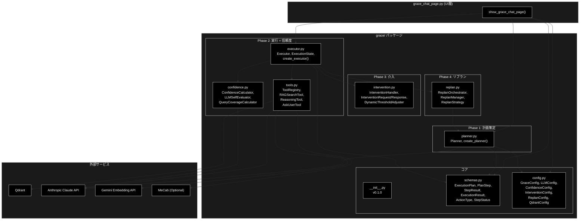

### 7.5 依存モジュール詳細

#### 7.5.1 grace/config.py — GRACE 統合設定

YAML ファイル（`grace_config.yaml`）と環境変数から設定を読み込みます。

**主要クラス**:


| クラス               | 説明                                              |
| -------------------- | ------------------------------------------------- |
| `GraceConfig`        | 統合設定ルート                                    |
| `LLMConfig`          | LLM設定（model, temperature, max_tokens 等）      |
| `ConfidenceConfig`   | 信頼度閾値設定                                    |
| `InterventionConfig` | 介入レベル設定                                    |
| `ReplanConfig`       | リプラン制御設定（max_replans 等）                |
| `QdrantConfig`       | Qdrant接続・検索設定（search_priority, top_k 等） |

**デフォルトモデル**: `claude-sonnet-4-6`（`LLMConfig.model`）

#### 7.5.2 grace/tools.py — ToolRegistry

Executor が使用するツール群を管理するレジストリです。

**主要クラス**:


| クラス          | ActionType   | 説明                                                               |
| --------------- | ------------ | ------------------------------------------------------------------ |
| `ToolRegistry`  | -            | ツール管理・ルーティング                                           |
| `RAGSearchTool` | `rag_search` | Qdrant全コレクション自動検索（auto-collection fallback、動的閾値） |
| `ReasoningTool` | `reasoning`  | LLM推論（検索結果を基にAnthropic Claudeで回答生成）                |
| `AskUserTool`   | `ask_user`   | HITL（ユーザーへの確認要求）                                       |

**RAGSearchTool の検索戦略**:

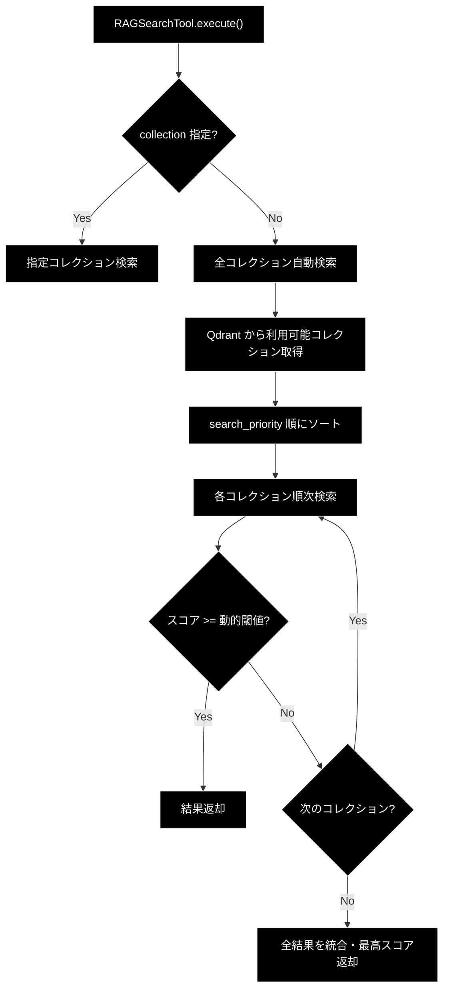

#### 7.5.3 grace/confidence.py — 信頼度計算

ステップ実行結果の信頼度を多角的に評価します。

**主要コンポーネント**:


| コンポーネント            | 説明                                              |
| ------------------------- | ------------------------------------------------- |
| `ConfidenceCalculator`    | 統合信頼度計算（evaluate → decide_action）       |
| `LLMSelfEvaluator`        | Anthropic Claude による自己評価（query と answer の整合性） |
| `QueryCoverageCalculator` | クエリキーワードの網羅度計算                      |
| `ConfidenceAggregator`    | 複数信頼度指標の重み付け統合                      |

**介入レベル判定**:


| InterventionLevel | 信頼度範囲     | 動作                       |
| ----------------- | -------------- | -------------------------- |
| `SILENT`          | 高（閾値以上） | 自動続行、ログのみ         |
| `NOTIFY`          | 中高           | 自動続行、UI に通知        |
| `CONFIRM`         | 中低           | 一時停止、ユーザー確認待ち |
| `ESCALATE`        | 低             | 一時停止、エスカレーション |

#### 7.5.4 grace/intervention.py — HITL 介入

信頼度が低い場合のユーザー介入フローを管理します。

**主要クラス**:


| クラス                     | 説明                                                        |
| -------------------------- | ----------------------------------------------------------- |
| `InterventionHandler`      | 介入要否判定・リクエスト生成                                |
| `InterventionRequest`      | 介入リクエスト（level, step_id, message, confidence_score） |
| `InterventionResponse`     | ユーザー応答（action: PROCEED / MODIFY / CANCEL / INPUT）   |
| `DynamicThresholdAdjuster` | フィードバックに基づく閾値自動調整                          |

#### 7.5.5 grace/replan.py — リプラン戦略

ステップ失敗時に計画を動的に修正します。

**主要クラス**:


| クラス               | 説明                                                     |
| -------------------- | -------------------------------------------------------- |
| `ReplanOrchestrator` | リプラン全体制御（失敗検知 → 戦略選択 → 新計画生成）   |
| `ReplanManager`      | リプラン戦略の管理・実行                                 |
| `ReplanStrategy`     | リプラン戦略Enum（PARTIAL: 部分修正 / FULL: 全体再計画） |
| `ReplanResult`       | リプラン結果（success, new_plan, reason）                |

**リプランフロー**:

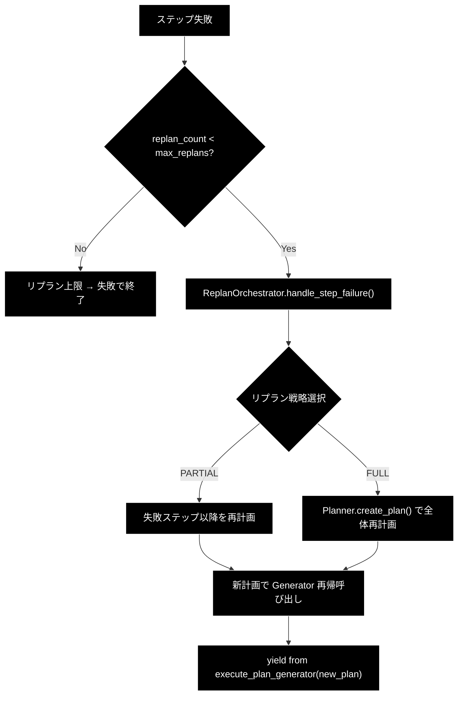

#### 7.5.6 agent_cache.py — コレクションキャッシュ

前回の検索成功コレクションをセッション単位でキャッシュし、検索効率を向上させます（旧版から変更なし）。

**主要クラス**:


| 名前                   | 種類                   | 説明                                                                    |
| ---------------------- | ---------------------- | ----------------------------------------------------------------------- |
| `CollectionCache`      | クラス                 | キャッシュ管理                                                          |
| `CollectionCacheEntry` | dataclass              | キャッシュエントリ（collection_name, last_score, timestamp, hit_count） |
| `collection_cache`     | グローバルインスタンス | デフォルトキャッシュ（TTL: 300秒）                                      |

---

## 8. イベント処理

### 8.1 ボタンイベント


| ボタン                  | イベント | 処理内容                                                                                                   |
| ----------------------- | -------- | ---------------------------------------------------------------------------------------------------------- |
| 🗑️ 会話履歴をクリア   | クリック | `grace_chat_history` クリア、`grace_planner` / `grace_executor` / `grace_current_model` 削除、`st.rerun()` |
| 🔄 キャッシュをリセット | クリック | `collection_cache.clear(session_id)`、トースト表示                                                         |

### 8.2 入力イベント


| コンポーネント                   | イベント | 処理内容                                                  | 旧版との差分                                         |
| -------------------------------- | -------- | --------------------------------------------------------- | ---------------------------------------------------- |
| モデル選択                       | 変更     | `should_reinitialize = True`、Planner + Executor 再初期化 | ReActAgent → Planner + Executor                     |
| コレクション選択                 | 変更     | UI表示のみ更新（再初期化は発生しない）                    | 旧: 再初期化トリガー →**新: 参考表示のみ**          |
| ハイブリッド検索                 | -        | `disabled=True` のため操作不可                            | 旧: 再初期化トリガー →**新: 操作無効化**            |
| コレクション選択（プレビュー用） | 変更     | Qdrantからデータ取得、DataFrame更新                       | 変更なし                                             |
| チャット入力                     | Enter    | Plan → Execute → Result → 最終回答 の一連処理開始      | execute_turn → create_plan + execute_plan_generator |

### 8.3 Generator イベント処理

新アーキテクチャでは、`Executor.execute_plan_generator()` が Generator として yield する値をリアルタイムに処理します。

#### 処理ループ構造

```python
gen = executor.execute_plan_generator(plan)
execution_result: Optional[ExecutionResult] = None

try:
    while True:
        yielded = next(gen)

        if isinstance(yielded, ExecutionState):
            # --- ステップ完了/一時停止の通知 ---
            ...
        elif isinstance(yielded, dict):
            # --- ツール実行イベント ---
            event_type = yielded.get("type", "")
            ...

except StopIteration as e:
    execution_result = e.value  # ExecutionResult
```

#### yield 型別イベント処理

**ExecutionState（ステップ状態通知）**:


| 処理           | 詳細                                                                           |
| -------------- | ------------------------------------------------------------------------------ |
| ステータス表示 | `Step {sid}: {status_icon} {status}{conf_str}` を `thought_container` に追記   |
| 信頼度表示     | `state.step_results[sid].confidence` を `(信頼度: 0.XX)` 形式で付記            |
| 介入リクエスト | `state.is_paused and state.intervention_request` の場合、`st.warning()` で表示 |
| 自動続行       | 現Phase では介入リクエスト後も`st.info("（自動続行します）")` で自動続行       |

**dict イベント**:


| type           | 処理内容                                                      | 表示コンポーネント                     |
| -------------- | ------------------------------------------------------------- | -------------------------------------- |
| `log`          | 思考プロセスログを追記 +`st.divider()`                        | `thought_container` 内の `st.markdown` |
| `tool_call`    | `🛠️ Tool Call: {name}` + `Args: {args}` を表示              | `thought_container` 内の `st.markdown` |
| `tool_result`  | `📝 Tool Result:` + 内容（500文字で切り詰め）+ `st.divider()` | `thought_container` 内の `st.markdown` |
| `final_answer` | Legacy Agent 経由の最終回答を`final_response_content` に格納  | 直接代入（後続で`st.markdown` 表示）   |

**StopIteration（Generator 終了）**:


| 処理         | 詳細                                                                            |
| ------------ | ------------------------------------------------------------------------------- |
| 結果取得     | `e.value` から `ExecutionResult` を取得                                         |
| 最終回答抽出 | `execution_result.final_answer` を `final_response_content` に設定              |
| サマリ表示   | `📊 実行結果サマリ` Expander にステータス・信頼度・リプラン回数・実行時間を表示 |
| 履歴追加     | `grace_chat_history.append({"role": "assistant", "content": ...})`              |

### 8.4 イベント処理フロー図

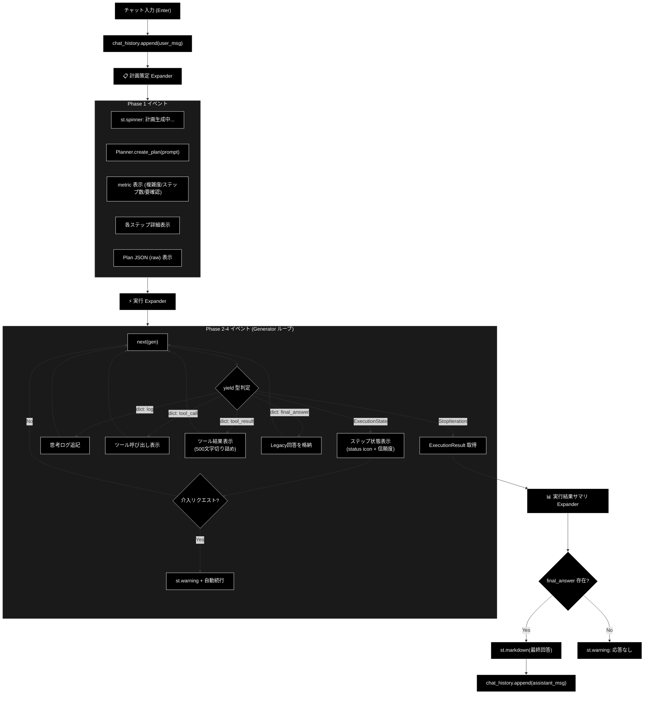

### 8.5 旧版イベント処理との対比


| 観点            | 旧版（v1.0）                                                | 新版（v2.0）                                                       |
| --------------- | ----------------------------------------------------------- | ------------------------------------------------------------------ |
| イベントソース  | `ReActAgent.execute_turn()` Generator                       | `Executor.execute_plan_generator()` Generator                      |
| yield 型        | `dict` のみ（type: log/tool_call/tool_result/final_answer） | `ExecutionState` + `dict`（2種類の yield）                         |
| ステップ状態    | なし（ReAct フェーズとして一括）                            | ステップ単位の status + confidence をリアルタイム表示              |
| 介入            | なし                                                        | `ExecutionState.is_paused` + `intervention_request` で一時停止通知 |
| 最終結果取得    | `final_answer` イベント（dict）                             | `StopIteration.value`（`ExecutionResult`）+ Legacy 用 dict         |
| 表示先 Expander | 1つ（🤔 エージェントの思考プロセス）                        | 3つ（📋 計画策定 / ⚡ 実行 / 📊 実行結果サマリ）                   |
| エラー時        | try/except で`st.error`                                     | 同様 +`ExecutionResult(status="failed")` でも結果返却              |

---

## 9. エラーハンドリング

### 9.1 エラー種別


| エラー種別                    | 発生箇所             | 発生条件                                | 対処                                                   |
| ----------------------------- | -------------------- | --------------------------------------- | ------------------------------------------------------ |
| Qdrant接続エラー              | サイドバー初期化     | サーバー未起動、ネットワーク障害        | `st.warning` で警告表示、`["(None)"]` で続行           |
| Planner/Executor 初期化エラー | セッション初期化     | API認証失敗、GraceConfig 読み込みエラー | `st.error` でエラー表示、`return` で処理中断           |
| 計画策定エラー                | Phase 1（Plan）      | LLM呼び出し失敗、JSON パースエラー      | Planner 内部でフォールバック計画を自動生成             |
| ステップ実行エラー            | Phase 2-4（Execute） | ツール実行失敗、タイムアウト            | Executor 内部でフォールバック → リプラン試行          |
| Generator 例外                | Phase 2-4（Execute） | 予期しないランタイムエラー              | `ExecutionResult(status="failed")` を返却              |
| チャット処理エラー            | 全体 try/except      | 上記以外の未捕捉エラー                  | `st.error` でエラー表示、`logger.error(exc_info=True)` |
| コレクションデータ取得エラー  | データプレビュー     | コレクション不在、スキーマ不一致        | `st.error` でエラー表示                                |

### 9.2 エラー処理の多層構造

新アーキテクチャではエラーが3つの層で処理されます。

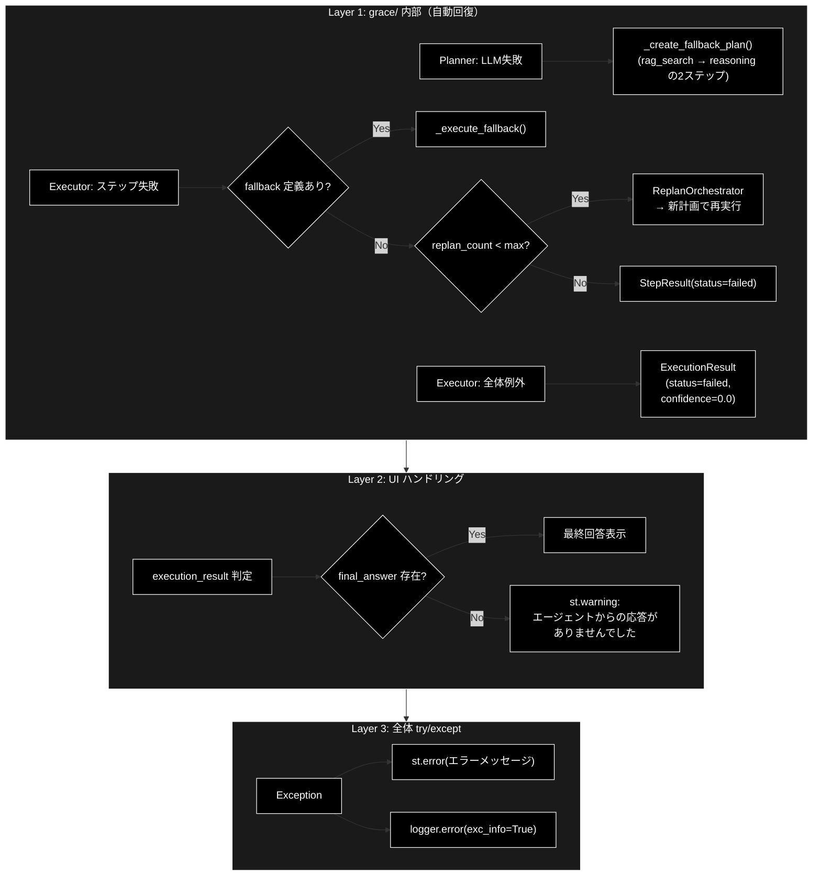

### 9.3 エラー表示コンポーネント


| 表示種別 | Streamlitコンポーネント | 用途                                                     |
| -------- | ----------------------- | -------------------------------------------------------- |
| エラー   | `st.error()`            | 致命的エラー（初期化失敗、未捕捉例外）                   |
| 警告     | `st.warning()`          | 注意喚起（コレクション未検出、応答なし、介入リクエスト） |
| 情報     | `st.info()`             | 補足情報（データなし、自動続行通知）                     |
| トースト | `st.toast()`            | 一時的な通知（設定変更、キャッシュクリア、初期化完了）   |

### 9.4 エラー処理コード例

```python
# Planner + Executor 初期化エラー
try:
    grace_config = get_grace_config()
    grace_config.llm.model = selected_model
    st.session_state.grace_planner = create_planner(config=grace_config, model_name=selected_model)
    st.session_state.grace_executor = create_executor(config=grace_config)
    st.toast("GRACE Planner + Executor の準備が完了しました。")
except Exception as e:
    st.error(f"GRACE エージェントの初期化に失敗しました: {e}")
    logger.error(f"GRACE init failed: {e}", exc_info=True)
    return

# チャット処理エラー（全体を包む try/except）
try:
    # Phase 1: 計画策定
    plan = st.session_state.grace_planner.create_plan(prompt)
    # → 失敗時: Planner 内部でフォールバック計画を自動生成

    # Phase 2-4: 実行
    gen = st.session_state.grace_executor.execute_plan_generator(plan)
    try:
        while True:
            yielded = next(gen)
            # イベント処理...
    except StopIteration as e:
        execution_result = e.value
    # → Generator 内部例外: ExecutionResult(status="failed") を返却

    # 最終回答チェック
    if final_response_content:
        st.markdown(final_response_content)
    else:
        st.warning("エージェントからの応答がありませんでした。")

except Exception as e:
    st.error(f"エラーが発生しました: {e}")
    logger.error(f"GRACE Chat Error: {e}", exc_info=True)
```

---

## 10. 使用例

### 10.1 基本的な使用方法

1. ページにアクセス
2. サイドバーで必要に応じてモデルを変更（デフォルト: `claude-sonnet-4-6`）
3. （オプション）コレクションデータのプレビュー — エキスパンダーを開いてコレクションを選択し、登録されているQ&Aデータを確認
4. チャット入力欄に質問を入力して Enter
5. **📋 計画策定 (Plan)** を確認 — 複雑度、ステップ数、各ステップの詳細
6. **⚡ 実行 (Execute)** を確認 — ステップ進捗、ツール呼び出し・結果、信頼度スコア
7. **📊 実行結果サマリ** を確認（任意）— 全体ステータス、信頼度、リプラン回数、実行時間
8. 最終回答を確認
9. 必要に応じて追加の質問を続ける

### 10.2 典型的な質問例

```
- 「カリン・フォン・アロルディンゲンについて教えてください」
- 「Wikipediaの情報から、〇〇の歴史を説明してください」
- 「ライブドアニュースで報じられた××について教えて」
- 「△△と□□の違いは何ですか？」
```

### 10.3 計画策定の表示例

```
📋 計画策定 (Plan)

目標: カリン・フォン・アロルディンゲンについて教えてください

  複雑度: 0.4    ステップ数: 3    要確認: ✅ いいえ

🎯 成功基準: ユーザーの質問に対して、検索結果に基づく正確な回答を提供する
────────────────────────────
🔍 Step 1: [rag_search] Qdrantナレッジベースから関連情報を検索
   🔑 Query: `カリン・フォン・アロルディンゲン`
   📤 期待出力: Wikipedia等からの人物情報
   🔄 Fallback: `web_search`

🧠 Step 2: [reasoning] 検索結果を基に回答を生成  ← 依存: Step [1]
   📤 期待出力: 経歴・業績をまとめた回答文

🧠 Step 3: [reasoning] 回答の品質チェックと最終整形  ← 依存: Step [2]
   📤 期待出力: ユーザーに提示する最終回答
```

### 10.4 実行プロセスの表示例

```
⚡ 実行 (Execute)

📝 【ツール実行結果: rag_search】
  [検索結果 JSON...]
────────────────────────────
Step 1: ✅ success (信頼度: 0.82)

📝 【ツール実行結果: reasoning】
  カリン・フォン・アロルディンゲンは...
────────────────────────────
Step 2: ✅ success (信頼度: 0.78)

Step 3: ✅ success (信頼度: 0.85)
```

### 10.5 実行結果サマリの表示例

```
📊 実行結果サマリ

ステータス: success
全体信頼度: 0.82
リプラン回数: 0
実行時間: 3450ms
```

---

## 11. 変更履歴


| バージョン | 日付           | 変更内容                                                                                                                                                                                                                                                                                                                                                                                                                                                                                                                                                                                                                                             |
| ---------- | -------------- | ---------------------------------------------------------------------------------------------------------------------------------------------------------------------------------------------------------------------------------------------------------------------------------------------------------------------------------------------------------------------------------------------------------------------------------------------------------------------------------------------------------------------------------------------------------------------------------------------------------------------------------------------------- |
| 1.0        | 2025-01-29     | 初版作成                                                                                                                                                                                                                                                                                                                                                                                                                                                                                                                                                                                                                                             |
| 1.1        | 2025-01-29     | 依存モジュール詳細（agent_cache, agent_parallel_search, agent_tools, regex_mecab）を追加                                                                                                                                                                                                                                                                                                                                                                                                                                                                                                                                                             |
| **2.0**    | **2025-06-14** | **ReActAgent → Planner + Executor アーキテクチャに全面移行**。主な変更: (1) アーキテクチャ概要を2フェーズ分離型に更新、(2) 画面レイアウトを3 Expander 構成に変更、(3) セッション状態から `grace_agent` / `grace_current_hybrid_search` / `grace_current_collections` を削除し `grace_planner` / `grace_executor` を追加、(4) イベント処理を Generator ベース（ExecutionState + dict yield）に刷新、(5) 依存関係に grace/ パッケージ構成図を追加、(6) エラーハンドリングを3層構造（grace内部自動回復 / UI判定 / 全体try-except）に整理、(7) 使用例を計画策定・実行プロセス・結果サマリの表示例に更新、(8) 付録Bに GraceConfig 設定リファレンスを追加 |
| **3.0**    | **2026-02-17** | **ドキュメント体系の整備**。主な変更: (1) 冒頭ドキュメント一覧表を5件に拡張（readme_rag.md / readme_react_reflection.md / readme_autonomous_agent.md を追加）、(2) 番号付きリンク表で参照順を明示 |
| **4.0**    | **2026-06-16** | **技術スタック統一とドキュメント再構築**。主な変更: (1) LLM プロバイダー表記を Gemini → Anthropic Claude に統一（タイトル / 設定クラス `GeminiConfig`→`ModelConfig` / デフォルト `claude-sonnet-4-6`・軽量 `claude-haiku-4-5-20251001` / LLM用APIキー `ANTHROPIC_API_KEY`）。**Embedding は Gemini（`gemini-embedding-001`・3072次元）のまま維持**、(2) アーカイブ済みドキュメント（移行計画 v2・各種 API 移行ガイド・benchmark_todo・grace_react_refactor_todo）を docs/archive/ へのリンクに整理し、壊れた R3 リンク（plan_for_migration.md）を削除、(3) 全 Mermaid 図を黒背景・白文字スタイルに統一（classDef/class/style 付与、sequenceDiagram は init ヘッダー付与） |
| **4.1**    | **2026-06-17** | **現行コードとの整合更新**。主な変更: (1) UI エントリポイントを `streamlit run agent_rag.py` と明記し、`agent_rag.py::main()` の実際の `st.radio` メニュー（explanation / qdrant_search / agent_chat / grace_chat / log_viewer / rag_data_creation / qdrant_crud）に合わせて付録A.1ページ一覧を修正（旧 `rag_download` / `qa_generation` / `qdrant_registration` / `show_qdrant` は `ui/pages/` に在るが未接続である旨を注記）、(2) RAGデータ作成パイプライン（チャンク分割 → Q/A生成＋Qdrant登録）の CLI コマンドと冒頭技術スタック表を追加（LLM=Anthropic Claude `claude-sonnet-4-6`、ルーティング `grace/llm_compat.py`、Embedding=Gemini `gemini-embedding-001` 3072次元）、(3) ドキュメント索引リンクの実在性を再検証 |
| **4.2**    | **2026-06-17** | **「ドキュメント ↔ 対応コード 対応表」を追加**。10ドキュメント（README 含む）が対象とするソースコードの対応関係を一覧化し、ReAct（`services/agent_service.py`・google-genai 直叩き）と GRACE（`grace/`・`llm_compat` 経由 Anthropic Claude）の系統差、CLI ツールの既定モデル（`gemini-2.5-flash`、`--model` 上書き可）を注記 |

---

## 付録A: アプリケーション構成

### A.1 メインアプリケーション (agent_rag.py)

`grace_chat_page.py`は`agent_rag.py`からインポートされ、サイドバーのメニューから呼び出されます。

```python
# agent_rag.py より抜粋
from ui.pages import show_grace_chat_page

page_mapping = {
    "grace_chat": show_grace_chat_page,
    # 他のページ...
}
```

**利用可能なページ一覧**（`agent_rag.py::main()` の `st.radio` メニュー順）:


| ページID             | 表示名                            | 説明                                                |
| -------------------- | --------------------------------- | --------------------------------------------------- |
| `explanation`        | 📖 説明                           | システム説明ページ                                  |
| `qdrant_search`      | 🔎 Qdrant検索                     | 検索テスト                                          |
| `agent_chat`         | 🤖 Agent(ReAct+Reflection)        | ReAct+Reflectionエージェント（旧版）                |
| `grace_chat`         | [最新] 自律型Agent(Plan+Executor) | **本ページ（Planner + Executor）**                  |
| `log_viewer`         | 📊 未回答ログ                     | 未回答質問のログ閲覧                                |
| `rag_data_creation`  | 📄 RAGデータ作成                  | RAGデータ作成 CLI 手順とドキュメントへの案内        |
| `qdrant_crud`        | 🗄️ QdrantのCRUD                   | Qdrant CRUD 操作の説明                              |

> **注**: `ui/pages/` には `download_page` / `qa_generation_page` / `qdrant_registration_page` / `qdrant_show_page` も実装されていますが、現行の `agent_rag.py` メニューには未接続です（RAGデータ作成は CLI パイプラインで実行）。

### A.2 CLI版エージェント (agent_main.py)

同等の機能を持つCLI版エージェントも提供されています。

```bash
# CLI版エージェントの実行
uv run python agent_main.py
```

**CLI版の機能**:

- Planner + Executor 2フェーズ処理
- 動的コレクション取得
- キーワード抽出（オプション）
- 多言語対応の検索戦略
- 信頼度評価・リプラン

---

## 付録B: 設定リファレンス

### B.1 AgentConfig（旧設定 — UI共通）


| 設定項目                 | デフォルト値                 | 説明                             |
| ------------------------ | ---------------------------- | -------------------------------- |
| `RAG_DEFAULT_COLLECTION` | `"wikipedia_ja_5per"`        | デフォルト検索コレクション       |
| `RAG_SEARCH_LIMIT`       | 3                            | 検索結果の最大件数               |
| `RAG_SCORE_THRESHOLD`    | 0.50                         | 検索結果として採用する最小スコア |
| `MODEL_NAME`             | `ModelConfig.DEFAULT_MODEL`  | デフォルトモデル                 |
| `CHAT_LOG_FILE_NAME`     | `"agent_chat.log"`           | チャットログファイル名           |
| `CHAT_LOG_LEVEL`         | `"INFO"`                     | ログレベル                       |

### B.2 ModelConfig


| 設定項目              | デフォルト値             | 説明                          |
| --------------------- | ------------------------ | ----------------------------- |
| `DEFAULT_MODEL`       | `"claude-sonnet-4-6"`    | デフォルト LLM モデル         |
| `LIGHT_MODEL`         | `"claude-haiku-4-5-20251001"` | 軽量 LLM モデル          |
| `EMBEDDING_MODEL`     | `"gemini-embedding-001"` | 埋め込みモデル（Gemini）      |
| `EMBEDDING_DIMS`      | 3072                     | 埋め込み次元数                |
| `DEFAULT_TEMPERATURE` | 1.0                      | 温度パラメータ                |

### B.3 GraceConfig（grace/config.py — GRACE 統合設定）

GraceConfig は `config/grace_config.yml` から読み込まれ、環境変数（`GRACE_` プレフィックス）で上書き可能です。

#### B.3.1 LLMConfig


| 設定項目      | デフォルト値               | 説明                  |
| ------------- | -------------------------- | --------------------- |
| `provider`    | `"anthropic"`              | LLMプロバイダー       |
| `model`       | `"claude-sonnet-4-6"`      | 使用モデル            |
| `temperature` | 0.7                        | 温度パラメータ        |
| `max_tokens`  | 4096                       | 最大トークン数        |
| `timeout`     | 30                         | APIタイムアウト（秒） |

#### B.3.2 EmbeddingConfig


| 設定項目     | デフォルト値             | 説明                 |
| ------------ | ------------------------ | -------------------- |
| `provider`   | `"gemini"`               | 埋め込みプロバイダー |
| `model`      | `"gemini-embedding-001"` | 埋め込みモデル       |
| `dimensions` | 3072                     | 埋め込み次元数       |

#### B.3.3 ConfidenceConfig


| 設定項目                   | デフォルト値 | 説明                     |
| -------------------------- | ------------ | ------------------------ |
| `weights.search_quality`   | 0.25         | 検索品質の重み           |
| `weights.source_agreement` | 0.20         | ソース一致度の重み       |
| `weights.llm_self_eval`    | 0.25         | LLM自己評価の重み        |
| `weights.tool_success`     | 0.15         | ツール成功率の重み       |
| `weights.query_coverage`   | 0.15         | クエリ網羅度の重み       |
| `thresholds.silent`        | 0.9          | SILENT 介入レベルの閾値  |
| `thresholds.notify`        | 0.7          | NOTIFY 介入レベルの閾値  |
| `thresholds.confirm`       | 0.4          | CONFIRM 介入レベルの閾値 |

#### B.3.4 InterventionConfig


| 設定項目                   | デフォルト値 | 説明                     |
| -------------------------- | ------------ | ------------------------ |
| `default_timeout`          | 300（5分）   | 介入タイムアウト（秒）   |
| `auto_proceed_on_timeout`  | `false`      | タイムアウト時の自動続行 |
| `max_clarification_rounds` | 3            | 最大確認回数             |

#### B.3.5 ReplanConfig


| 設定項目                   | デフォルト値 | 説明                           |
| -------------------------- | ------------ | ------------------------------ |
| `max_replans`              | 3            | 最大リプラン回数               |
| `confidence_threshold`     | 0.4          | リプラントリガーの信頼度閾値   |
| `partial_replan_threshold` | 0.6          | 部分リプランの閾値             |
| `cooldown_seconds`         | 5            | リプラン間のクールダウン（秒） |

#### B.3.6 QdrantConfig


| 設定項目          | デフォルト値                                               | 説明                     |
| ----------------- | ---------------------------------------------------------- | ------------------------ |
| `url`             | `"http://localhost:6333"`                                  | QdrantサーバーURL        |
| `collection_name` | `"customer_support_faq"`                                   | デフォルトコレクション   |
| `search_limit`    | 5                                                          | 検索結果の最大件数       |
| `score_threshold` | 0.35                                                       | 最小スコア閾値           |
| `search_priority` | `["wikipedia_ja", "livedoor", "cc_news", "japanese_text"]` | コレクション検索優先順位 |

#### B.3.7 その他


| サブ設定        | 主要項目                                           | 説明           |
| --------------- | -------------------------------------------------- | -------------- |
| `CostConfig`    | `daily_limit_usd=10.0`, `per_query_limit_usd=0.50` | コスト管理     |
| `ErrorConfig`   | `max_retries=3`, `exponential_backoff=true`        | エラーリトライ |
| `LoggingConfig` | `level="INFO"`, `file="logs/grace.log"`            | ロギング       |
| `ToolsConfig`   | `enabled=["rag_search", "reasoning", "ask_user"]`  | 有効ツール一覧 |

### B.4 CohereConfig（オプション）


| 設定項目       | デフォルト値                  | 説明           |
| -------------- | ----------------------------- | -------------- |
| `API_KEY`      | `os.getenv("COHERE_API_KEY")` | Cohere APIキー |
| `RERANK_MODEL` | `"rerank-multilingual-v3.0"`  | Rerankモデル   |

---

## 付録C: トラブルシューティング

### C.1 よくある問題と解決策


| 問題                                     | 原因                            | 解決策                                                               |
| ---------------------------------------- | ------------------------------- | -------------------------------------------------------------------- |
| 「コレクションがありません」と表示される | Qdrantサーバー未起動            | `docker-compose up -d qdrant` でQdrantを起動                         |
| Planner/Executor 初期化エラー            | APIキー未設定                   | LLM用 `ANTHROPIC_API_KEY`（および Embedding 用 `GOOGLE_API_KEY` / `GEMINI_API_KEY`）を設定 |
| GraceConfig 読み込みエラー               | YAML ファイル不在 or 構文エラー | `config/grace_config.yml` を確認。不在時はデフォルト値で動作         |
| 計画策定が常にフォールバック             | LLM呼び出し失敗                 | API認証・ネットワーク・モデル名を確認。ログ`logs/grace_run.log` 参照 |
| 信頼度が常に0.0                          | Confidence計算の依存エラー      | `grace_config.yml` の `confidence.weights` 設定を確認                |
| 検索結果が見つからない                   | コレクションにデータがない      | CSVデータ登録ページでデータを登録                                    |
| MeCabエラー                              | MeCab未インストール             | `pip install mecab-python3` でインストール（Optional）               |
| キャッシュが効かない                     | TTL切れ                         | 5分以内に同一セッションで検索を実行                                  |

### C.2 ログの確認方法

```bash
# アプリケーションログ
journalctl -u streamlit-app -f

# GRACE エージェントログ（新規）
tail -f logs/grace_run.log

# 旧エージェントログ
tail -f logs/agent_chat.log
```
