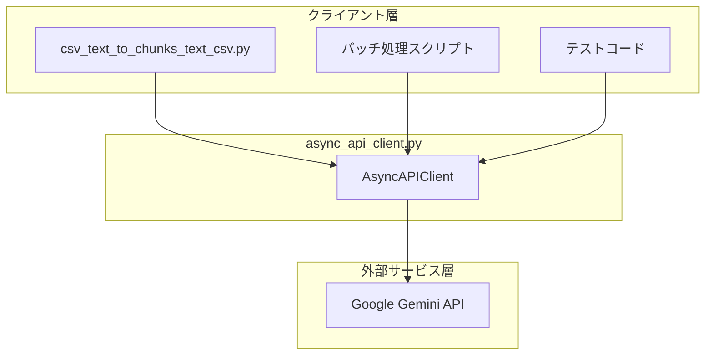
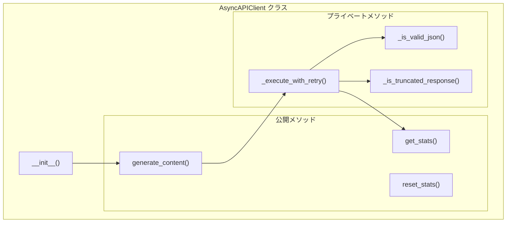
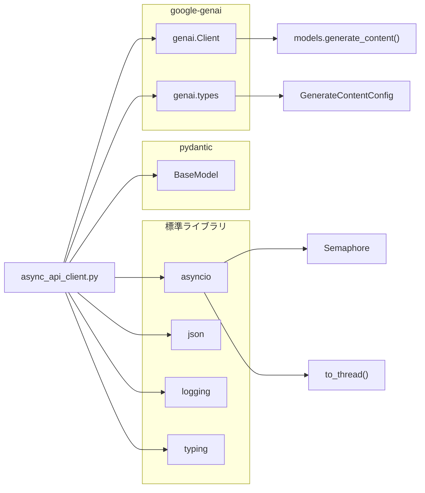
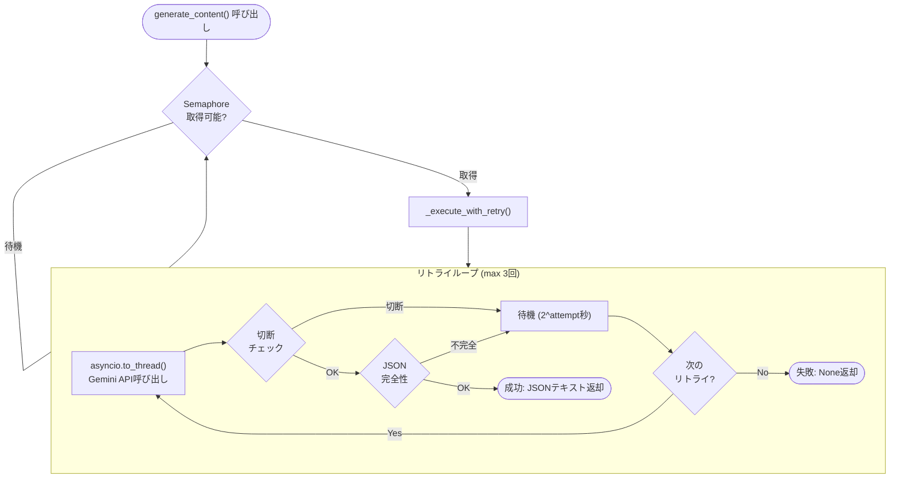
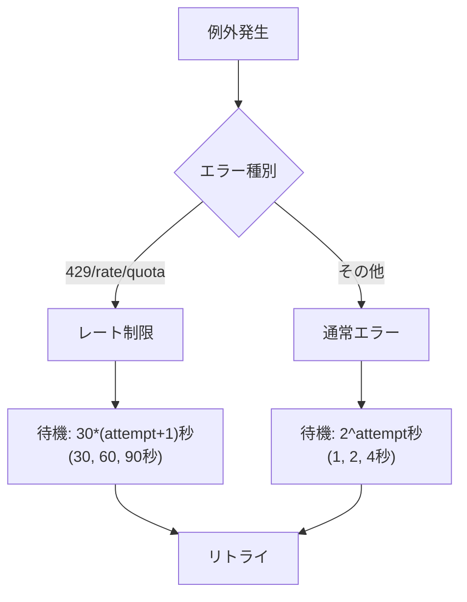

# async_api_client.py - 非同期APIクライアント ドキュメント

**Version 1.0** | 最終更新: 2025-01-29

---

## 目次

1. [概要](#概要)
2. [アーキテクチャ構成図](#1-アーキテクチャ構成図)
3. [モジュール構成図](#2-モジュール構成図)
4. [クラス・関数一覧表](#3-クラス関数一覧表)
5. [クラス・関数 IPO詳細](#4-クラス関数-ipo詳細)
6. [設定・定数](#5-設定定数)
7. [使用例](#6-使用例)
8. [エクスポート](#7-エクスポート)
9. [変更履歴](#8-変更履歴)
10. [付録: 依存関係図](#付録-依存関係図)

---

## 概要

`async_api_client.py`は、Google Gemini APIへの非同期アクセスを提供するクライアントモジュールです。`asyncio.to_thread()`で同期APIをラップし、Semaphoreによる並列数制御、指数バックオフによるリトライロジック、不完全JSONの検出とリトライ機能を備えています。

### 主な責務

- Google Gemini APIへの非同期リクエスト送信
- Semaphoreによる並列実行数の制御（デフォルト8並列）
- 指数バックオフによるリトライロジック（最大3回）
- 不完全JSON/切断レスポンスの検出と自動リトライ
- レート制限エラー（429）への対応
- API呼び出し統計情報の収集・管理

### 主要機能一覧

| 機能 | 説明 |
|------|------|
| `AsyncAPIClient` | 非同期APIクライアントクラス |
| `AsyncAPIClient.__init__()` | コンストラクタ（API Key、並列数、リトライ設定） |
| `AsyncAPIClient.generate_content()` | セマフォ制御でGemini API呼び出し |
| `AsyncAPIClient._execute_with_retry()` | リトライロジック実行（プライベート） |
| `AsyncAPIClient._is_valid_json()` | JSON完全性チェック（プライベート） |
| `AsyncAPIClient._is_truncated_response()` | レスポンス切断チェック（プライベート） |
| `AsyncAPIClient.get_stats()` | API呼び出し統計情報を取得 |
| `AsyncAPIClient.reset_stats()` | 統計情報をリセット |

---

## 1. アーキテクチャ構成図

### 1.1 システム全体構成



### 1.2 データフロー

1. クライアント層から`generate_content()`を呼び出し
2. Semaphoreで並列数を制御（最大8並列）
3. `asyncio.to_thread()`で同期API（`genai.Client`）を非同期実行
4. レスポンス検証（切断チェック、JSON完全性チェック）
5. 失敗時は指数バックオフでリトライ（最大3回）
6. 成功時はJSONテキストを返却、全リトライ失敗時は`None`を返却

---

## 2. モジュール構成図

### 2.1 内部モジュール構成



### 2.2 外部依存関係

| ライブラリ | バージョン | 用途 |
|-----------|-----------|------|
| `google-genai` | >= 0.1.0 | Gemini APIクライアント |
| `pydantic` | >= 2.0 | レスポンススキーマ定義 |

### 2.3 標準ライブラリ依存

| モジュール | 用途 |
|-----------|------|
| `asyncio` | 非同期処理、Semaphore、`to_thread()` |
| `json` | JSON解析・検証 |
| `logging` | ログ出力 |
| `typing` | 型ヒント（`Type`, `Optional`） |

### 2.4 内部依存モジュール

（このモジュールは外部依存のみで、内部モジュールへの依存はありません）

---

## 3. クラス・関数一覧表

### 3.1 クラス一覧

#### AsyncAPIClient

| メソッド | 概要 |
|---------|------|
| `__init__(api_key, max_workers, max_retries, max_output_tokens)` | コンストラクタ |
| `generate_content(model, contents, response_schema, task_id)` | セマフォ制御でAPI呼び出し |
| `_execute_with_retry(model, contents, response_schema, task_id)` | リトライロジック実行 |
| `_is_valid_json(text)` | JSON完全性チェック |
| `_is_truncated_response(response)` | レスポンス切断チェック |
| `get_stats()` | 統計情報を取得 |
| `reset_stats()` | 統計情報をリセット |

---

## 4. クラス・関数 IPO詳細

### 4.1 AsyncAPIClient クラス

Google Gemini APIへの非同期アクセスを提供するクライアント。Semaphoreによる並列数制御と指数バックオフによるリトライ機能を備える。

#### コンストラクタ: `__init__`

**概要**: AsyncAPIClientインスタンスを初期化する。Geminiクライアント、Semaphore、統計カウンタを設定。

```python
AsyncAPIClient(
    api_key: str,
    max_workers: int = 8,
    max_retries: int = 3,
    max_output_tokens: int = 8192
)
```

| パラメータ | 型 | デフォルト | 説明 |
|------------|------|-----------|------|
| `api_key` | str | - | Google API Key |
| `max_workers` | int | 8 | 並列実行数（Semaphore制御） |
| `max_retries` | int | 3 | 最大リトライ回数 |
| `max_output_tokens` | int | 8192 | 出力トークン制限 |

| 項目 | 内容 |
|------|------|
| **Input** | `api_key: str`, `max_workers: int = 8`, `max_retries: int = 3`, `max_output_tokens: int = 8192` |
| **Process** | 1. `genai.Client`を初期化<br>2. `asyncio.Semaphore`を作成<br>3. 統計カウンタを初期化（`_total_requests`, `_failed_requests`, `_truncated_responses`） |
| **Output** | `AsyncAPIClient`インスタンス |

**インスタンス属性**:

| 属性 | 型 | 説明 |
|------|-----|------|
| `client` | `genai.Client` | Gemini APIクライアント |
| `max_workers` | `int` | 並列数 |
| `semaphore` | `asyncio.Semaphore` | 並列制御用セマフォ |
| `max_retries` | `int` | 最大リトライ回数 |
| `max_output_tokens` | `int` | 出力トークン制限 |
| `_total_requests` | `int` | 総リクエスト数 |
| `_failed_requests` | `int` | 失敗リクエスト数 |
| `_truncated_responses` | `int` | 切断レスポンス数 |

```python
# 使用例
from chunking import AsyncAPIClient
import os

client = AsyncAPIClient(
    api_key=os.getenv("GOOGLE_API_KEY"),
    max_workers=8,
    max_retries=3,
    max_output_tokens=8192
)
```

---

#### メソッド: `generate_content`

**概要**: セマフォで並列数を制御しながらGemini API呼び出しを行う。失敗時は指数バックオフでリトライ。

```python
async def generate_content(
    self,
    model: str,
    contents: str,
    response_schema: Type[BaseModel],
    task_id: Optional[str] = None
) -> Optional[str]
```

| パラメータ | 型 | デフォルト | 説明 |
|------------|------|-----------|------|
| `model` | str | - | Geminiモデル名（例: `gemini-2.0-flash`） |
| `contents` | str | - | 入力テキスト（プロンプト） |
| `response_schema` | Type[BaseModel] | - | レスポンスのPydanticスキーマ |
| `task_id` | Optional[str] | None | タスク識別子（ログ用） |

| 項目 | 内容 |
|------|------|
| **Input** | `model: str`, `contents: str`, `response_schema: Type[BaseModel]`, `task_id: Optional[str] = None` |
| **Process** | 1. `async with self.semaphore`で並列数制御<br>2. `_execute_with_retry()`を呼び出し |
| **Output** | `Optional[str]`: レスポンスJSONテキスト、失敗時は`None` |

**戻り値例**:

```python
# 成功時
'{"sentences": [{"id": 1, "text": "文章1"}, {"id": 2, "text": "文章2"}]}'

# 失敗時
None
```

```python
# 使用例
import asyncio
from pydantic import BaseModel
from typing import List

class SentenceResult(BaseModel):
    sentences: List[dict]

async def main():
    client = AsyncAPIClient(api_key="your-api-key")

    result = await client.generate_content(
        model="gemini-2.0-flash",
        contents="以下のテキストを分析してください: ...",
        response_schema=SentenceResult,
        task_id="task_001"
    )

    if result:
        print(f"成功: {result}")
    else:
        print("失敗: Noneが返されました")

asyncio.run(main())
```

---

#### メソッド: `_execute_with_retry`

**概要**: リトライロジックを実行する。不完全JSON/切断レスポンス検出時は指数バックオフでリトライ。レート制限エラー時は長めの待機。

```python
async def _execute_with_retry(
    self,
    model: str,
    contents: str,
    response_schema: Type[BaseModel],
    task_id: Optional[str]
) -> Optional[str]
```

| パラメータ | 型 | デフォルト | 説明 |
|------------|------|-----------|------|
| `model` | str | - | Geminiモデル名 |
| `contents` | str | - | 入力テキスト |
| `response_schema` | Type[BaseModel] | - | レスポンススキーマ |
| `task_id` | Optional[str] | - | タスク識別子 |

| 項目 | 内容 |
|------|------|
| **Input** | `model: str`, `contents: str`, `response_schema: Type[BaseModel]`, `task_id: Optional[str]` |
| **Process** | 1. `max_retries`回ループ<br>2. `asyncio.to_thread()`でAPI呼び出し<br>3. `_is_truncated_response()`で切断チェック<br>4. `_is_valid_json()`でJSON完全性チェック<br>5. 失敗時は指数バックオフ（`2^attempt`秒）で待機<br>6. レート制限時は`30*(attempt+1)`秒待機 |
| **Output** | `Optional[str]`: 成功時はJSONテキスト、全リトライ失敗時は`None` |

**リトライ待機時間**:

| 状況 | 待機時間 |
|------|---------|
| 通常エラー/不完全JSON | 2^attempt 秒（1, 2, 4秒） |
| レート制限（429） | 30*(attempt+1) 秒（30, 60, 90秒） |

> 📝 **注意**: このメソッドはプライベートです。直接呼び出さず、`generate_content()`を使用してください。

---

#### メソッド: `_is_valid_json`

**概要**: 文字列が完全なJSONとして解析可能かチェックする。

```python
def _is_valid_json(self, text: str) -> bool
```

| パラメータ | 型 | デフォルト | 説明 |
|------------|------|-----------|------|
| `text` | str | - | チェック対象の文字列 |

| 項目 | 内容 |
|------|------|
| **Input** | `text: str` |
| **Process** | 1. 空文字列チェック<br>2. `json.loads()`で解析を試行 |
| **Output** | `bool`: 有効なJSONなら`True`、それ以外は`False` |

```python
# 内部動作例
client._is_valid_json('{"key": "value"}')  # True
client._is_valid_json('{"key": "value"')   # False（閉じ括弧なし）
client._is_valid_json('')                   # False（空文字列）
client._is_valid_json(None)                 # False
```

---

#### メソッド: `_is_truncated_response`

**概要**: Gemini APIレスポンスが途中で切断されたかチェックする。`finish_reason`を検査。

```python
def _is_truncated_response(self, response) -> bool
```

| パラメータ | 型 | デフォルト | 説明 |
|------------|------|-----------|------|
| `response` | GenerateContentResponse | - | Gemini APIレスポンス |

| 項目 | 内容 |
|------|------|
| **Input** | `response: GenerateContentResponse` |
| **Process** | 1. `response.candidates[0].finish_reason`を取得<br>2. `STOP`/`END`/`1`（正常終了）以外なら切断と判定 |
| **Output** | `bool`: 切断されていれば`True`、正常なら`False` |

**finish_reason判定**:

| finish_reason | 判定 |
|---------------|------|
| `None` | 正常（`False`） |
| `"STOP"`, `"END"` | 正常（`False`） |
| `1`（Enum値） | 正常（`False`） |
| その他 | 切断（`True`） |

---

#### メソッド: `get_stats`

**概要**: API呼び出しの統計情報を取得する。

```python
def get_stats(self) -> dict
```

| 項目 | 内容 |
|------|------|
| **Input** | なし（selfのみ） |
| **Process** | 内部カウンタから統計情報を集計 |
| **Output** | `dict`: 統計情報の辞書 |

**戻り値例**:

```python
{
    "total_requests": 100,
    "failed_requests": 2,
    "truncated_responses": 5,
    "success_rate": 98.0,
    "concurrency": 8
}
```

| キー | 型 | 説明 |
|-----|-----|------|
| `total_requests` | int | 総リクエスト数 |
| `failed_requests` | int | 全リトライ失敗したリクエスト数 |
| `truncated_responses` | int | 切断/不完全JSONが検出された回数 |
| `success_rate` | float | 成功率（%） |
| `concurrency` | int | 設定された並列数 |

```python
# 使用例
stats = client.get_stats()
print(f"成功率: {stats['success_rate']:.1f}%")
print(f"失敗: {stats['failed_requests']}/{stats['total_requests']}")
```

---

#### メソッド: `reset_stats`

**概要**: 統計情報をリセットする。

```python
def reset_stats(self) -> None
```

| 項目 | 内容 |
|------|------|
| **Input** | なし（selfのみ） |
| **Process** | `_total_requests`, `_failed_requests`, `_truncated_responses`を0にリセット |
| **Output** | `None` |

```python
# 使用例
client.reset_stats()
# バッチ処理開始
for batch in batches:
    await process_batch(batch, client)
# バッチ終了後に統計確認
print(client.get_stats())
```

---

## 5. 設定・定数

### 5.1 デフォルト設定値

| 設定 | デフォルト値 | 説明 |
|-----|-------------|------|
| `max_workers` | 8 | 並列実行数 |
| `max_retries` | 3 | 最大リトライ回数 |
| `max_output_tokens` | 8192 | 出力トークン制限 |

### 5.2 リトライ設定

| 設定 | 値 | 説明 |
|-----|-----|------|
| 通常エラー待機 | 2^attempt 秒 | 指数バックオフ（1, 2, 4秒） |
| レート制限待機 | 30*(attempt+1) 秒 | 長めの待機（30, 60, 90秒） |

### 5.3 レート制限判定キーワード

```python
# エラー文字列に以下が含まれる場合、レート制限と判定
["429", "rate", "quota"]
```

---

## 6. 使用例

### 6.1 基本的なワークフロー

```python
import asyncio
import os
from pydantic import BaseModel
from typing import List
from chunking import AsyncAPIClient

# レスポンススキーマ定義
class AnalysisResult(BaseModel):
    sentences: List[dict]
    summary: str

async def main():
    # 1. クライアント初期化
    client = AsyncAPIClient(
        api_key=os.getenv("GOOGLE_API_KEY"),
        max_workers=8,
        max_retries=3
    )

    # 2. API呼び出し
    result = await client.generate_content(
        model="gemini-2.0-flash",
        contents="以下のテキストを分析してください: 今日は良い天気です。",
        response_schema=AnalysisResult,
        task_id="analysis_001"
    )

    # 3. 結果処理
    if result:
        import json
        data = json.loads(result)
        print(f"分析結果: {data}")
    else:
        print("分析に失敗しました")

    # 4. 統計確認
    stats = client.get_stats()
    print(f"成功率: {stats['success_rate']:.1f}%")

asyncio.run(main())
```

### 6.2 並列バッチ処理

```python
import asyncio
from chunking import AsyncAPIClient

async def process_batch(texts: list, client: AsyncAPIClient):
    """複数テキストを並列処理"""
    tasks = [
        client.generate_content(
            model="gemini-2.0-flash",
            contents=text,
            response_schema=MySchema,
            task_id=f"batch_{i}"
        )
        for i, text in enumerate(texts)
    ]

    # 並列実行（Semaphoreで8並列に制限）
    results = await asyncio.gather(*tasks)
    return results

async def main():
    client = AsyncAPIClient(api_key="your-api-key", max_workers=8)

    texts = ["テキスト1", "テキスト2", "テキスト3", ...]

    # バッチサイズごとに処理
    batch_size = 50
    all_results = []

    for i in range(0, len(texts), batch_size):
        batch = texts[i:i+batch_size]
        results = await process_batch(batch, client)
        all_results.extend(results)

        # 進捗表示
        stats = client.get_stats()
        print(f"進捗: {i+len(batch)}/{len(texts)}, 成功率: {stats['success_rate']:.1f}%")

    # 最終統計
    final_stats = client.get_stats()
    print(f"完了: {final_stats}")

asyncio.run(main())
```

### 6.3 エラーハンドリング付きワークフロー

```python
import asyncio
import logging
from chunking import AsyncAPIClient

logging.basicConfig(level=logging.INFO)

async def safe_process(client: AsyncAPIClient, text: str, task_id: str):
    """エラーハンドリング付き処理"""
    try:
        result = await client.generate_content(
            model="gemini-2.0-flash",
            contents=text,
            response_schema=MySchema,
            task_id=task_id
        )

        if result is None:
            logging.warning(f"[{task_id}] API呼び出し失敗（全リトライ失敗）")
            return {"status": "failed", "task_id": task_id}

        return {"status": "success", "task_id": task_id, "data": result}

    except Exception as e:
        logging.error(f"[{task_id}] 予期せぬエラー: {e}")
        return {"status": "error", "task_id": task_id, "error": str(e)}

async def main():
    client = AsyncAPIClient(api_key="your-api-key")

    results = await asyncio.gather(*[
        safe_process(client, text, f"task_{i}")
        for i, text in enumerate(texts)
    ])

    # 結果集計
    success = sum(1 for r in results if r["status"] == "success")
    failed = sum(1 for r in results if r["status"] == "failed")
    errors = sum(1 for r in results if r["status"] == "error")

    print(f"成功: {success}, 失敗: {failed}, エラー: {errors}")

asyncio.run(main())
```

---

## 7. エクスポート

`chunking/__init__.py`でエクスポートされる要素：

```python
__all__ = [
    # API Client
    "AsyncAPIClient",
]
```

---

## 8. 変更履歴

| バージョン | 変更内容 |
|-----------|---------|
| 1.0 | 初版作成 |

---

## 付録: 依存関係図



---

## 付録: 処理フロー図

### API呼び出しフロー



### レート制限対応フロー


