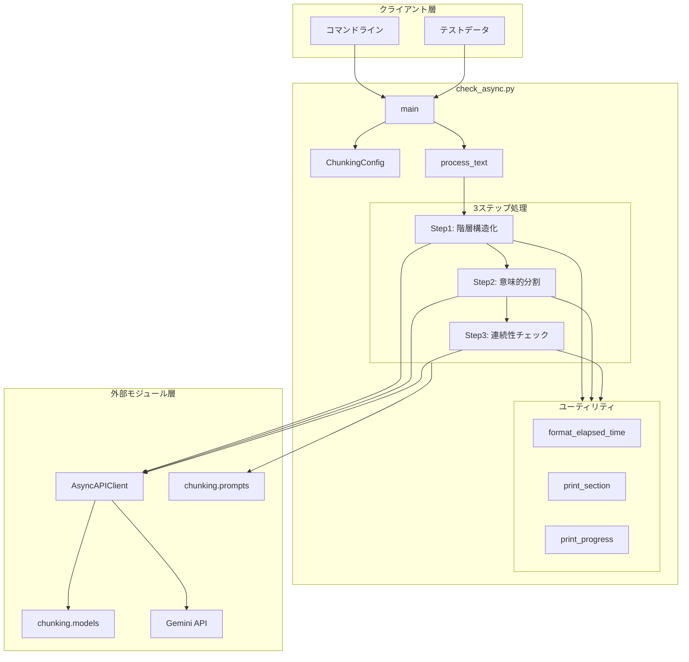
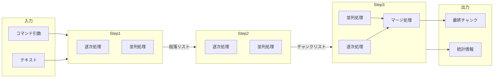
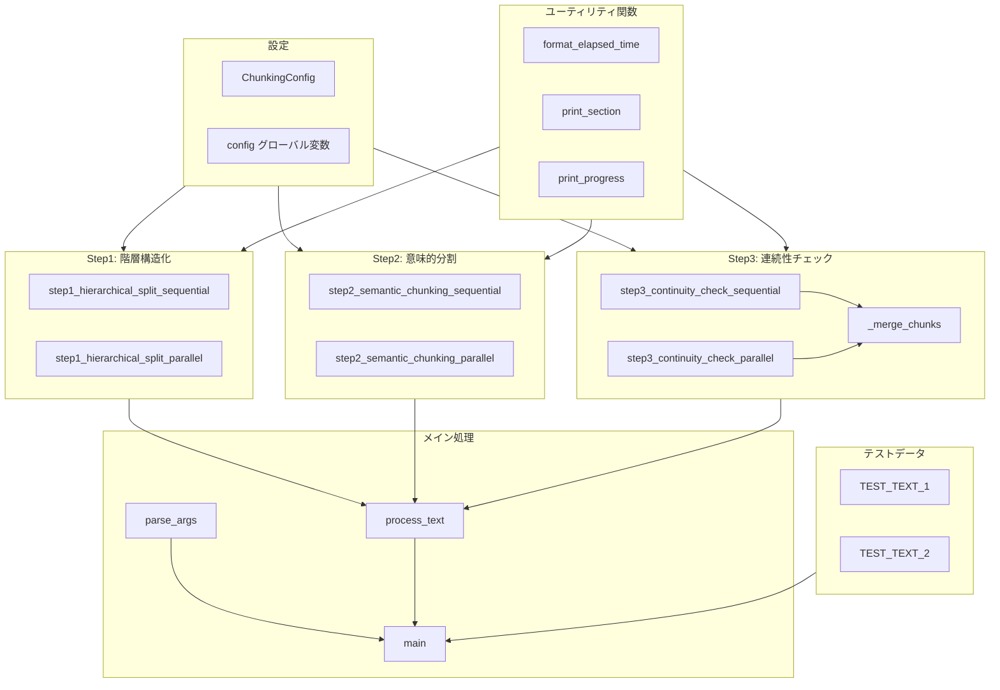
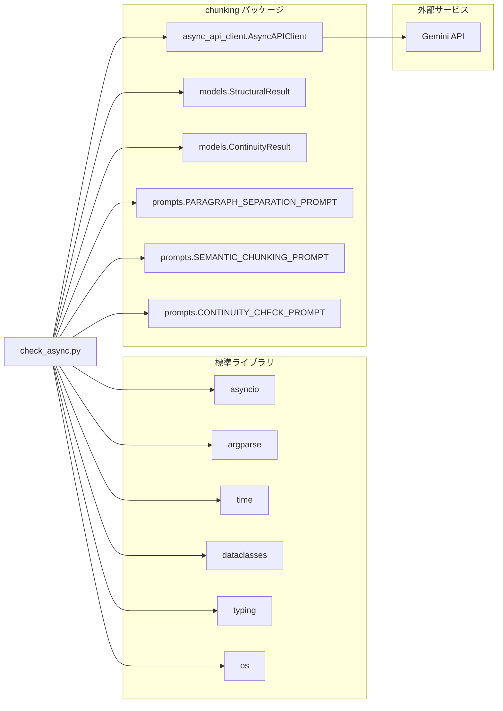
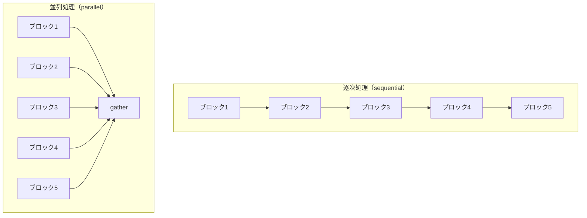
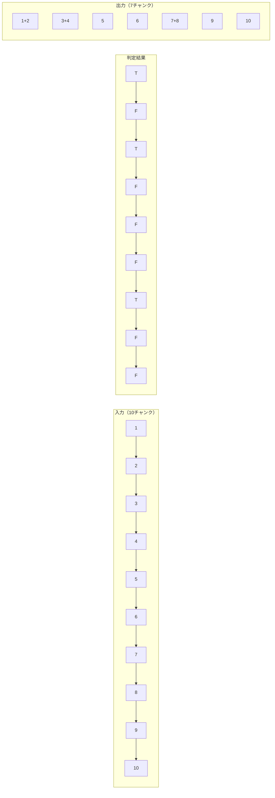

# check_async.py - 非同期・並列処理学習プログラム ドキュメント

**Version 1.0** | 最終更新: 2025-01-29

---

## 目次

1. [概要](#概要)
2. [アーキテクチャ構成図](#1-アーキテクチャ構成図)
3. [モジュール構成図](#2-モジュール構成図)
4. [クラス・関数一覧表](#3-クラス関数一覧表)
5. [クラス・関数 IPO詳細](#4-クラス関数-ipo詳細)
6. [設定・定数](#5-設定定数)
7. [使用例](#6-使用例)
8. [エクスポート](#7-エクスポート)
9. [変更履歴](#8-変更履歴)
10. [付録A: 依存関係図](#付録a-依存関係図)
11. [付録B: 処理フロー詳細](#付録b-処理フロー詳細)
12. [付録C: テストデータ仕様](#付録c-テストデータ仕様)

---

## 概要

`check_async.py`は、非同期・並列処理（async/await）の学習用プログラムです。セマンティックチャンキングの3ステップ処理（Step1→Step2→Step3）を、逐次処理と並列処理の両方で実行可能にし、非同期プログラミングの理解を深めることを目的としています。

### 主な責務

- 非同期処理（async/await）の学習支援
- 逐次処理と並列処理の比較検証
- Gemini APIを用いたテキスト分割処理の実行
- 処理時間計測と統計情報の表示
- コマンドラインオプションによる動作切替

### 主要機能一覧

| 機能 | 説明 |
|------|------|
| `ChunkingConfig` | 処理設定を管理するdataclass |
| `format_elapsed_time()` | 経過時間をフォーマット |
| `print_section()` | セクションヘッダーを表示 |
| `print_progress()` | プログレスバーを表示 |
| `step1_hierarchical_split_sequential()` | Step1の逐次処理版 |
| `step1_hierarchical_split_parallel()` | Step1の並列処理版 |
| `step2_semantic_chunking_sequential()` | Step2の逐次処理版 |
| `step2_semantic_chunking_parallel()` | Step2の並列処理版 |
| `step3_continuity_check_sequential()` | Step3の逐次処理版 |
| `step3_continuity_check_parallel()` | Step3の並列処理版 |
| `_merge_chunks()` | チャンクのマージ処理 |
| `process_text()` | 全Stepを統合実行 |
| `parse_args()` | コマンドライン引数をパース |
| `main()` | エントリーポイント |

### Step1・Step2・Step3との関係

| モジュール | 役割 | 本プログラムでの位置づけ |
|-----------|------|------------------------|
| step1.py | 階層構造化（段落分割） | step1_*関数で同等機能を実装 |
| step2.py | 意味的分割（チャンキング） | step2_*関数で同等機能を実装 |
| step3.py | 文脈連続性チェック | step3_*関数で同等機能を実装 |

---

## 1. アーキテクチャ構成図

### 1.1 システム全体構成



### 1.2 データフロー



### 1.3 処理フロー概要

1. コマンドライン引数をパース（`--mode`, `--workers`, `--text`等）
2. `ChunkingConfig`に設定を反映
3. テストテキストを選択（test1: 空行あり / test2: 空行なし）
4. `process_text()`で3ステップ処理を実行
5. 各Stepで逐次/並列を選択実行
6. 最終チャンクと統計情報を表示

---

## 2. モジュール構成図

### 2.1 内部モジュール構成



### 2.2 外部依存関係

| ライブラリ | バージョン | 用途 |
|-----------|-----------|------|
| `asyncio` | 標準ライブラリ | 非同期処理の実行 |
| `argparse` | 標準ライブラリ | コマンドライン引数のパース |
| `time` | 標準ライブラリ | 処理時間計測 |
| `dataclasses` | 標準ライブラリ | 設定クラスの定義 |
| `typing` | 標準ライブラリ | 型ヒント |

### 2.3 内部依存モジュール

| モジュール | 用途 |
|-----------|------|
| `chunking.async_api_client` | 非同期APIクライアント（セマフォ、リトライ内蔵） |
| `chunking.models` | Pydanticモデル（StructuralResult, ContinuityResult） |
| `chunking.prompts` | プロンプト定義（PARAGRAPH_SEPARATION_PROMPT等） |

---

## 3. クラス・関数一覧表

### 3.1 クラス一覧

#### ChunkingConfig

| 属性 | 概要 |
|------|------|
| `mode` | 処理モード（sequential/parallel） |
| `model` | 使用するGeminiモデル名 |
| `block_size` | Step1のブロックサイズ |
| `max_workers` | 最大並列数 |
| `max_retries` | 最大リトライ回数 |
| `max_output_tokens` | 出力トークン制限 |
| `text_variant` | テストテキスト選択 |

### 3.2 関数一覧（カテゴリ別）

#### ユーティリティ関数

| 関数名 | 概要 |
|-------|------|
| `format_elapsed_time(seconds)` | 秒数を「X.XX秒」または「X分X.XX秒」形式に変換 |
| `print_section(title, char, width)` | セクションヘッダーを表示 |
| `print_progress(current, total, prefix, suffix)` | プログレスバーを表示 |

#### Step1関数（階層構造化）

| 関数名 | 概要 |
|-------|------|
| `step1_hierarchical_split_sequential(text, api_client)` | 逐次処理でテキストを段落に分割 |
| `step1_hierarchical_split_parallel(text, api_client)` | 並列処理でテキストを段落に分割 |

#### Step2関数（意味的分割）

| 関数名 | 概要 |
|-------|------|
| `step2_semantic_chunking_sequential(paragraphs, api_client)` | 逐次処理で段落をチャンクに分割 |
| `step2_semantic_chunking_parallel(paragraphs, api_client)` | 並列処理で段落をチャンクに分割 |

#### Step3関数（連続性チェック）

| 関数名 | 概要 |
|-------|------|
| `step3_continuity_check_sequential(chunks, api_client)` | 逐次処理で連続性をチェック |
| `step3_continuity_check_parallel(chunks, api_client)` | 並列処理で連続性をチェック |
| `_merge_chunks(chunks, continuity_flags)` | 連続性フラグに基づきチャンクをマージ |

#### メイン処理関数

| 関数名 | 概要 |
|-------|------|
| `process_text(text, api_key)` | 全Stepを統合実行 |
| `parse_args()` | コマンドライン引数をパース |
| `main()` | エントリーポイント |

---

## 4. クラス・関数 IPO詳細

### 4.1 ChunkingConfig クラス

チャンキング処理の設定を管理するdataclass。コマンドライン引数から値を受け取り、各関数で参照される。

#### 属性定義

```python
@dataclass
class ChunkingConfig:
    mode: str = "sequential"        # 処理モード
    model: str = "gemini-2.5-flash" # Geminiモデル
    block_size: int = 2000          # ブロックサイズ（文字数）
    max_workers: int = 8            # 最大並列数
    max_retries: int = 3            # 最大リトライ回数
    max_output_tokens: int = 8192   # 出力トークン制限
    text_variant: str = "test1"     # テストテキスト選択
```

| 属性 | 型 | デフォルト | 説明 |
|------|------|-----------|------|
| `mode` | str | "sequential" | 処理モード（sequential/parallel） |
| `model` | str | "gemini-2.5-flash" | 使用するGeminiモデル名 |
| `block_size` | int | 2000 | Step1でテキストを分割するブロックサイズ（文字数） |
| `max_workers` | int | 8 | 並列処理の最大ワーカー数 |
| `max_retries` | int | 3 | APIエラー時の最大リトライ回数 |
| `max_output_tokens` | int | 8192 | APIレスポンスの最大トークン数 |
| `text_variant` | str | "test1" | テストテキスト選択（test1/test2） |

---

### 4.2 ユーティリティ関数

#### `format_elapsed_time`

**概要**: 秒数を人間が読みやすい形式にフォーマットする。

```python
def format_elapsed_time(seconds: float) -> str
```

| パラメータ | 型 | デフォルト | 説明 |
|------------|------|-----------|------|
| `seconds` | float | - | 経過秒数 |

| 項目 | 内容 |
|------|------|
| **Input** | `seconds: float` |
| **Process** | 1. 60秒未満なら「X.XX秒」形式<br>2. 60秒以上なら「X分X.XX秒」形式に変換 |
| **Output** | `str`: フォーマット済み文字列 |

**戻り値例**:
```python
"12.34秒"
"2分15.67秒"
```

```python
# 使用例
elapsed = 125.5
print(format_elapsed_time(elapsed))
# 出力: 2分5.50秒
```

---

#### `print_section`

**概要**: セクションヘッダーを装飾付きで表示する。

```python
def print_section(title: str, char: str = "=", width: int = 60)
```

| パラメータ | 型 | デフォルト | 説明 |
|------------|------|-----------|------|
| `title` | str | - | セクションタイトル |
| `char` | str | "=" | 装飾文字 |
| `width` | int | 60 | 装飾線の幅 |

| 項目 | 内容 |
|------|------|
| **Input** | `title: str`, `char: str = "="`, `width: int = 60` |
| **Process** | 1. 改行出力<br>2. 装飾線（char × width）出力<br>3. 【title】形式で出力<br>4. 装飾線出力 |
| **Output** | `None`（標準出力に表示） |

```python
# 使用例
print_section("Step1: 階層構造化")
# 出力:
# ============================================================
# 【Step1: 階層構造化】
# ============================================================
```

---

#### `print_progress`

**概要**: プログレスバーを表示する。

```python
def print_progress(current: int, total: int, prefix: str = "", suffix: str = "")
```

| パラメータ | 型 | デフォルト | 説明 |
|------------|------|-----------|------|
| `current` | int | - | 現在の進捗 |
| `total` | int | - | 全体数 |
| `prefix` | str | "" | 前置文字列 |
| `suffix` | str | "" | 後置文字列 |

| 項目 | 内容 |
|------|------|
| **Input** | `current: int`, `total: int`, `prefix: str`, `suffix: str` |
| **Process** | 1. 進捗率を計算<br>2. プログレスバー文字列を生成（█と░）<br>3. `\r`で同一行に上書き表示 |
| **Output** | `None`（標準出力に表示） |

```python
# 使用例
for i in range(10):
    print_progress(i + 1, 10, prefix="処理中")
# 出力: 処理中 [███████████████░░░░░░░░░░░░░░░] 5/10 (50.0%)
```

---

### 4.3 Step1関数（階層構造化）

#### `step1_hierarchical_split_sequential`

**概要**: 逐次処理でテキストを段落単位に分割する。学習ポイントとして、forループで1つずつ処理し、処理順序が保証される。

```python
async def step1_hierarchical_split_sequential(
    text: str,
    api_client: AsyncAPIClient
) -> list[str]
```

| パラメータ | 型 | デフォルト | 説明 |
|------------|------|-----------|------|
| `text` | str | - | 入力テキスト |
| `api_client` | AsyncAPIClient | - | 非同期APIクライアント |

| 項目 | 内容 |
|------|------|
| **Input** | `text: str`, `api_client: AsyncAPIClient` |
| **Process** | 1. テキストをblock_size文字ごとにブロック分割<br>2. 各ブロックをforループで逐次処理<br>3. PARAGRAPH_SEPARATION_PROMPTを使用<br>4. AsyncAPIClient.generate_content()でAPI呼び出し<br>5. StructuralResultをパースして段落抽出<br>6. 処理時間を計測・表示 |
| **Output** | `list[str]`: 段落テキストのリスト |

**戻り値例**:
```python
[
    "RAG（Retrieval-Augmented Generation）は...",
    "セマンティックチャンキングは...",
    "京都の紅葉は..."
]
```

```python
# 使用例
api_client = AsyncAPIClient(api_key=api_key)
paragraphs = await step1_hierarchical_split_sequential(text, api_client)
print(f"{len(paragraphs)}段落に分割")
```

---

#### `step1_hierarchical_split_parallel`

**概要**: 並列処理でテキストを段落単位に分割する。学習ポイントとして、asyncio.gather()で複数タスクを同時実行する。

```python
async def step1_hierarchical_split_parallel(
    text: str,
    api_client: AsyncAPIClient
) -> list[str]
```

| パラメータ | 型 | デフォルト | 説明 |
|------------|------|-----------|------|
| `text` | str | - | 入力テキスト |
| `api_client` | AsyncAPIClient | - | 非同期APIクライアント |

| 項目 | 内容 |
|------|------|
| **Input** | `text: str`, `api_client: AsyncAPIClient` |
| **Process** | 1. テキストをblock_size文字ごとにブロック分割<br>2. 内部関数process_block()を定義<br>3. asyncio.gather()で全ブロックを並列処理<br>4. 結果をインデックス順にソート<br>5. 段落を抽出してリスト化 |
| **Output** | `list[str]`: 段落テキストのリスト |

**学習ポイント**:
- `asyncio.gather(*tasks)`: 複数の非同期タスクを同時実行
- `return_exceptions=True`: 例外が発生してもキャンセルせず継続
- 結果はタスク作成順に返却されるが、並列実行のため完了順は不定

```python
# 使用例
paragraphs = await step1_hierarchical_split_parallel(text, api_client)
# 並列処理により、逐次処理より高速に完了
```

---

### 4.4 Step2関数（意味的分割）

#### `step2_semantic_chunking_sequential`

**概要**: 逐次処理で段落を意味的なチャンクに分割する。

```python
async def step2_semantic_chunking_sequential(
    paragraphs: list[str],
    api_client: AsyncAPIClient
) -> list[str]
```

| パラメータ | 型 | デフォルト | 説明 |
|------------|------|-----------|------|
| `paragraphs` | list[str] | - | 段落のリスト（Step1の出力） |
| `api_client` | AsyncAPIClient | - | 非同期APIクライアント |

| 項目 | 内容 |
|------|------|
| **Input** | `paragraphs: list[str]`, `api_client: AsyncAPIClient` |
| **Process** | 1. 各段落をforループで逐次処理<br>2. SEMANTIC_CHUNKING_PROMPTを使用<br>3. API呼び出しでチャンクに分割<br>4. 失敗時は元の段落をフォールバックとして使用 |
| **Output** | `list[str]`: チャンクテキストのリスト |

---

#### `step2_semantic_chunking_parallel`

**概要**: 並列処理で段落を意味的なチャンクに分割する。

```python
async def step2_semantic_chunking_parallel(
    paragraphs: list[str],
    api_client: AsyncAPIClient
) -> list[str]
```

| パラメータ | 型 | デフォルト | 説明 |
|------------|------|-----------|------|
| `paragraphs` | list[str] | - | 段落のリスト（Step1の出力） |
| `api_client` | AsyncAPIClient | - | 非同期APIクライアント |

| 項目 | 内容 |
|------|------|
| **Input** | `paragraphs: list[str]`, `api_client: AsyncAPIClient` |
| **Process** | 1. 内部関数process_paragraph()を定義<br>2. asyncio.gather()で全段落を並列処理<br>3. プログレスバーで進捗表示<br>4. 結果をインデックス順にソート<br>5. チャンクを抽出 |
| **Output** | `list[str]`: チャンクテキストのリスト |

---

### 4.5 Step3関数（連続性チェック）

#### `step3_continuity_check_sequential`

**概要**: 逐次処理で隣接チャンク間の連続性をチェックし、結合/分離を判定する。

```python
async def step3_continuity_check_sequential(
    chunks: list[str],
    api_client: AsyncAPIClient
) -> list[str]
```

| パラメータ | 型 | デフォルト | 説明 |
|------------|------|-----------|------|
| `chunks` | list[str] | - | チャンクのリスト（Step2の出力） |
| `api_client` | AsyncAPIClient | - | 非同期APIクライアント |

| 項目 | 内容 |
|------|------|
| **Input** | `chunks: list[str]`, `api_client: AsyncAPIClient` |
| **Process** | 1. チャンク数が1以下ならスキップ<br>2. 隣接ペア(N-1組)をforループで判定<br>3. CONTINUITY_CHECK_PROMPTを使用<br>4. ContinuityResult.is_connectedを取得<br>5. 失敗時はFalse（分離）をフォールバック<br>6. _merge_chunks()でマージ処理 |
| **Output** | `list[str]`: マージ後の最終チャンクリスト |

---

#### `step3_continuity_check_parallel`

**概要**: 並列処理で隣接チャンク間の連続性をチェックする。判定は並列、マージは逐次。

```python
async def step3_continuity_check_parallel(
    chunks: list[str],
    api_client: AsyncAPIClient
) -> list[str]
```

| パラメータ | 型 | デフォルト | 説明 |
|------------|------|-----------|------|
| `chunks` | list[str] | - | チャンクのリスト（Step2の出力） |
| `api_client` | AsyncAPIClient | - | 非同期APIクライアント |

| 項目 | 内容 |
|------|------|
| **Input** | `chunks: list[str]`, `api_client: AsyncAPIClient` |
| **Process** | 1. 内部関数judge_pair()を定義<br>2. asyncio.gather()で全ペアを並列判定<br>3. 結果をインデックス順にソート<br>4. 連続性フラグリストを抽出<br>5. _merge_chunks()でマージ処理（逐次） |
| **Output** | `list[str]`: マージ後の最終チャンクリスト |

> 📝 **注意**: マージ処理は前の結果に依存するため、並列化不可。

---

#### `_merge_chunks`

**概要**: 連続性フラグに基づいてチャンクをマージする内部関数。

```python
def _merge_chunks(chunks: list[str], continuity_flags: list[bool]) -> list[str]
```

| パラメータ | 型 | デフォルト | 説明 |
|------------|------|-----------|------|
| `chunks` | list[str] | - | チャンクのリスト |
| `continuity_flags` | list[bool] | - | 連続性フラグのリスト（True=結合, False=分離） |

| 項目 | 内容 |
|------|------|
| **Input** | `chunks: list[str]`, `continuity_flags: list[bool]` |
| **Process** | 1. 最初のチャンクを結果リストに追加<br>2. 各フラグをループで処理<br>3. True → 直前のチャンクに`\n\n`で結合<br>4. False → 新しいチャンクとして追加 |
| **Output** | `list[str]`: マージ後のチャンクリスト |

**戻り値例**:
```python
# 入力: 10チャンク, フラグ: [T, F, T, F, F, F, T, F, F]
# 出力: 7チャンク（3組が結合）
[
    "チャンク1\n\nチャンク2",  # True: 結合
    "チャンク3\n\nチャンク4",  # True: 結合
    "チャンク5",              # False: 分離
    "チャンク6",              # False: 分離
    "チャンク7\n\nチャンク8",  # True: 結合
    "チャンク9",              # False: 分離
    "チャンク10"              # False: 分離
]
```

---

### 4.6 メイン処理関数

#### `process_text`

**概要**: 全Stepを統合して実行する。設定に応じて逐次/並列処理を選択。

```python
async def process_text(text: str, api_key: str) -> list[str]
```

| パラメータ | 型 | デフォルト | 説明 |
|------------|------|-----------|------|
| `text` | str | - | 入力テキスト |
| `api_key` | str | - | Gemini APIキー |

| 項目 | 内容 |
|------|------|
| **Input** | `text: str`, `api_key: str` |
| **Process** | 1. AsyncAPIClientを初期化<br>2. config.modeに応じてStep1関数を選択・実行<br>3. config.modeに応じてStep2関数を選択・実行<br>4. config.modeに応じてStep3関数を選択・実行<br>5. 統計情報を表示（API呼び出し回数、成功率等） |
| **Output** | `list[str]`: 最終チャンクリスト |

---

#### `parse_args`

**概要**: コマンドライン引数をパースする。

```python
def parse_args() -> argparse.Namespace
```

| 項目 | 内容 |
|------|------|
| **Input** | なし（sys.argvから取得） |
| **Process** | 1. ArgumentParserを作成<br>2. --mode, --workers, --text, --model, --block-sizeを定義<br>3. 引数をパース |
| **Output** | `argparse.Namespace`: パース結果 |

**オプション一覧**:

| オプション | 短縮形 | デフォルト | 説明 |
|------------|--------|------------|------|
| `--mode` | `-m` | sequential | 処理モード（sequential/parallel） |
| `--workers` | `-w` | 8 | 並列処理の最大ワーカー数 |
| `--text` | `-t` | test1 | テストテキスト（test1/test2） |
| `--model` | - | gemini-2.5-flash | Geminiモデル名 |
| `--block-size` | - | 2000 | ブロックサイズ（文字数） |

---

#### `main`

**概要**: プログラムのエントリーポイント。非同期処理の起動点。

```python
async def main() -> None
```

| 項目 | 内容 |
|------|------|
| **Input** | なし（環境変数GOOGLE_API_KEY、コマンドライン引数） |
| **Process** | 1. parse_args()で引数をパース<br>2. configに設定を反映<br>3. GOOGLE_API_KEYを取得（未設定ならエラー）<br>4. テストテキストを選択<br>5. 期待結果を表示<br>6. process_text()を実行<br>7. 最終結果と検証ポイントを表示 |
| **Output** | `None`（標準出力に結果表示） |

---

## 5. 設定・定数

### 5.1 ChunkingConfig（グローバル設定）

モジュールレベルでグローバル変数として定義され、各関数から参照される。

```python
config = ChunkingConfig()
```

| キー | デフォルト値 | 説明 |
|-----|-------------|------|
| `mode` | "sequential" | 処理モード |
| `model` | "gemini-2.5-flash" | Geminiモデル |
| `block_size` | 2000 | ブロックサイズ |
| `max_workers` | 8 | 最大並列数 |
| `max_retries` | 3 | 最大リトライ回数 |
| `max_output_tokens` | 8192 | 出力トークン制限 |
| `text_variant` | "test1" | テストテキスト |

### 5.2 テストデータ

| 定数名 | 説明 |
|-------|------|
| `TEST_TEXT_1` | 空行あり（5段落）のテストテキスト |
| `TEST_TEXT_2` | 空行なし（1段落）のテストテキスト |

---

## 6. 使用例

### 6.1 基本的な使用方法（逐次処理）

```bash
# 環境変数を設定
export GOOGLE_API_KEY='your-api-key'

# デフォルト実行（逐次処理）
python check_async.py
```

```python
# 出力例
# ============================================================
# 【Step1: 階層構造化（段落分割）- 逐次処理】
# ============================================================
# 入力: 1234文字 → 1ブロック
#   ブロック 1/1 処理中...
#     → 5個の段落を抽出
#   ⏱️ Step1 処理時間: 2.34秒
#   📊 結果: 1ブロック → 5段落
```

### 6.2 並列処理モード

```bash
# 並列処理を有効化
python check_async.py --mode parallel

# 並列数を指定
python check_async.py --mode parallel --workers 5
```

### 6.3 空行なしテキストでテスト

```bash
# test2（空行なし）を使用
python check_async.py --text test2
```

### 6.4 モデルとブロックサイズの変更

```bash
# gemini-2.0-flash-001を使用、ブロックサイズ3000文字
python check_async.py --model gemini-2.0-flash-001 --block-size 3000
```

### 6.5 Pythonコードからの使用

```python
import asyncio
from check_async import process_text, config

# 設定を変更
config.mode = "parallel"
config.max_workers = 4

# 実行
async def run():
    api_key = "your-api-key"
    text = "処理したいテキスト..."
    chunks = await process_text(text, api_key)
    for i, chunk in enumerate(chunks, 1):
        print(f"チャンク{i}: {chunk[:50]}...")

asyncio.run(run())
```

---

## 7. エクスポート

このモジュールはスタンドアロンの学習用プログラムとして設計されており、`__all__`によるエクスポートは定義されていません。直接実行して使用することを想定しています。

```python
# 実行方法
if __name__ == "__main__":
    asyncio.run(main())
```

---

## 8. 変更履歴

| バージョン | 変更内容 |
|-----------|---------|
| 1.0 | 初版作成（改善版check_async.py） |

---

## 付録A: 依存関係図



---

## 付録B: 処理フロー詳細

### B.1 逐次処理 vs 並列処理



### B.2 処理時間の比較（概念図）

| 処理方式 | 5タスク×1秒/タスクの場合 |
|----------|------------------------|
| 逐次処理 | 約5秒（1+1+1+1+1） |
| 並列処理（5並列） | 約1秒（同時実行） |
| 並列処理（3並列） | 約2秒（3+2） |

### B.3 Step3のマージ処理



---

## 付録C: テストデータ仕様

### C.1 TEST_TEXT_1（空行あり）

- **特徴**: 空行（`\n\n`）で5段落に分割
- **Step1期待結果**: 5段落
- **Step2期待結果**: 10チャンク（各段落が2チャンクに分割）
- **Step3期待結果**: 7チャンク（3組が結合、4つが独立）

| 段落 | 内容 | Step3での判定 |
|-----|------|--------------|
| 1 | RAGの説明 | チャンク1+2: 前方依存で結合 |
| 2 | セマンティックチャンキング | チャンク3+4: 後方依存で結合 |
| 3 | 観光情報 | チャンク5, 6: 独立（分離） |
| 4 | ベクトルDB | チャンク7+8: 後方依存で結合 |
| 5 | 章構造 | チャンク9, 10: 章構造で分離 |

### C.2 TEST_TEXT_2（空行なし）

- **特徴**: 空行がないため、Step1で1段落として認識
- **Step1期待結果**: 1段落
- **Step2期待結果**: 複数チャンク（意味的分割による）
- **Step3期待結果**: Step2の結果に依存

### C.3 検証パターン

| パターン | 説明 | 期待判定 |
|---------|------|---------|
| 前方依存 | 「この」「それ」で前を参照 | True（結合） |
| 後方依存 | 専門用語が未定義のまま使用 | True（結合） |
| 独立判定 | 話題は同じでも単独で理解可能 | False（分離） |
| 章構造 | 章が変わった場合 | False（分離） |
| 話題転換 | 完全に別のトピック | False（分離） |
