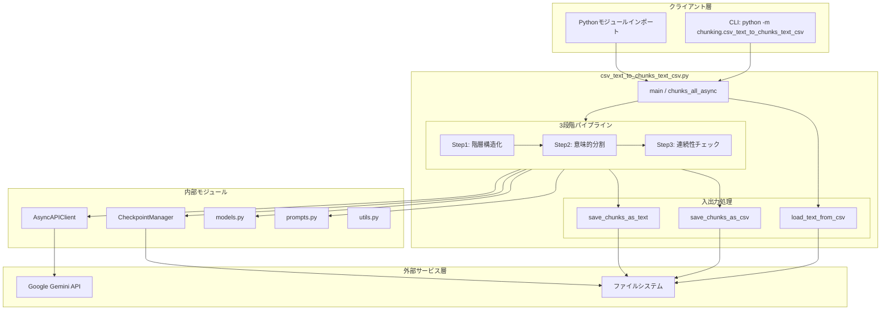
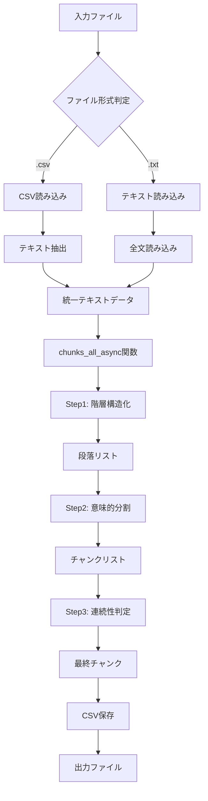
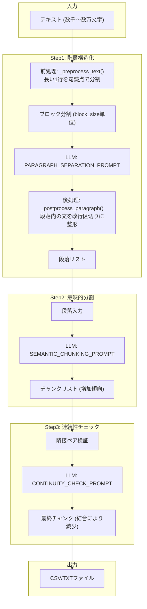
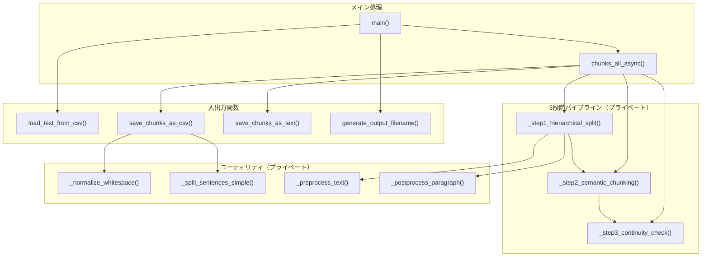
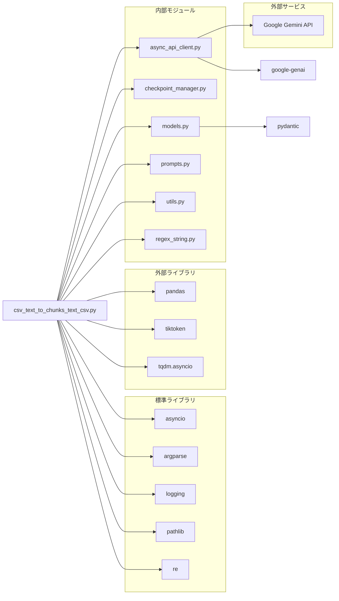
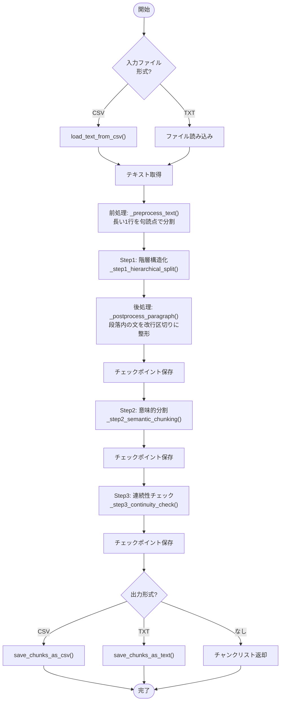
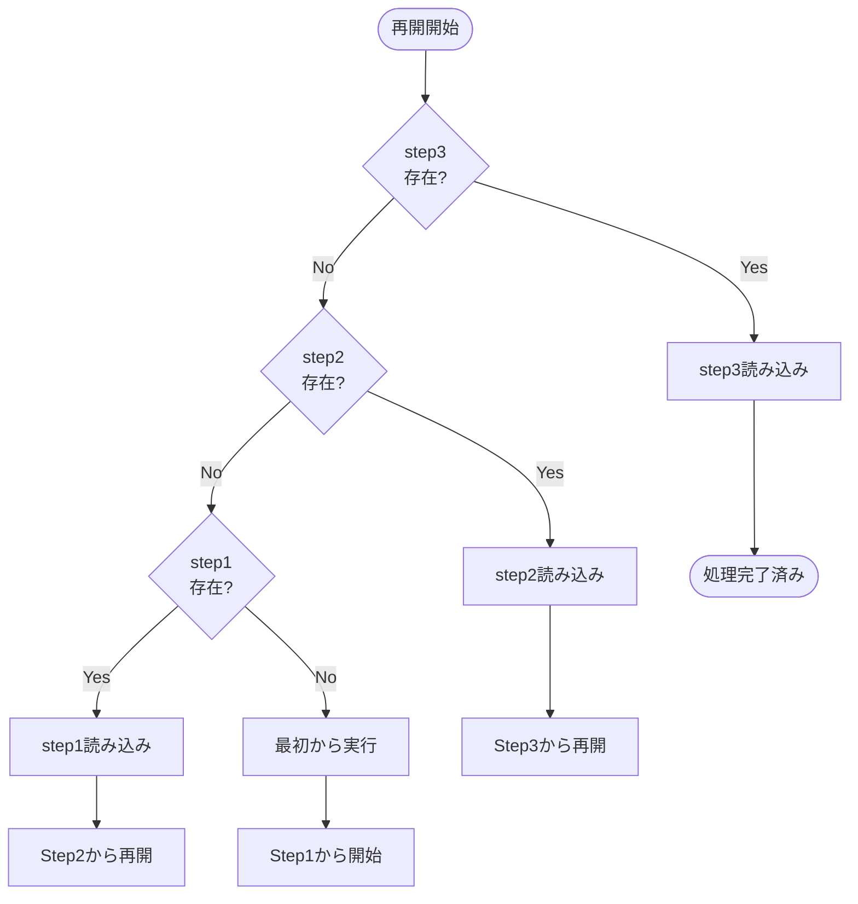

## csv_text_to_chunks_text_csv.py - LLMベースセマンティックチャンキング ドキュメント

**Version 1.4** | 最終更新: 2025-02-05

---

## 目次

1. [概要](#概要)
2. [アーキテクチャ構成図](#1-アーキテクチャ構成図)
3. [モジュール構成図](#2-モジュール構成図)
4. [クラス・関数一覧表](#3-クラス関数一覧表)
5. [クラス・関数 IPO詳細](#4-クラス関数-ipo詳細)
6. [設定・定数](#5-設定定数)
7. [使用例](#6-使用例)
8. [エクスポート](#7-エクスポート)
9. [変更履歴](#8-変更履歴)
10. [付録: 依存関係図](#付録-依存関係図)

---

## 概要

`csv_text_to_chunks_text_csv.py`は、テキストまたはCSVファイルをLLMを使用して意味的なチャンクに分割するパイプラインモジュールです。3段階の処理（階層構造化→意味的分割→文脈連続性チェック）により、高品質なセマンティックチャンキングを実現します。非同期・並列処理による高速化、チェックポイント機能による中断再開をサポートします。

### 主な責務

- CSVファイルまたはテキストファイルからのテキスト読み込み
- LLMを使用した3段階セマンティックチャンキング処理
- 非同期・並列処理による高速化（asyncio + Semaphore）
- チェックポイントによる中断・再開機能
- CSV/テキスト形式でのチャンク出力（改行正規化対応）
- 出力ファイル名の自動生成（タイムスタンプ付き）

### 主要機能一覧

| 機能 | 説明 |
|------|------|
| `chunks_all_async()` | テキストを3段階で意味的にチャンク化（メイン関数） |
| `load_text_from_csv()` | CSVファイルからテキストを読み込み |
| `save_chunks_as_csv()` | チャンクをCSV形式で保存（メタデータ付き） |
| `save_chunks_as_text()` | チャンクをテキスト形式で保存（後方互換） |
| `generate_output_filename()` | 出力ファイル名を自動生成 |
| `_step1_hierarchical_split()` | Step1: 階層構造化（段落分割）※前処理・後処理追加 |
| `_step2_semantic_chunking()` | Step2: 意味的分割（話題転換点検出） |
| `_step3_continuity_check()` | Step3: 文脈連続性チェック（過分割修正） |
| `_normalize_whitespace()` | テキストの改行・空白を正規化 |
| `_preprocess_text()` | **[v1.3追加]** Step1前処理: 長い1行を句読点で分割 |
| `_postprocess_paragraph()` | **[v1.3追加]** Step1後処理: 段落内の文を改行区切りに整形 |
| `_split_sentences_simple()` | 簡易的な文分割（日本語対応） |

---

## 1. アーキテクチャ構成図

### 1.1 システム全体構成



処理フロー全体図 - システム全体の流れ



### 1.2 データフロー

1. CLI引数またはAPI経由で入力ファイル（CSV/TXT）を受け取る
2. `load_text_from_csv()`でCSVからテキストを抽出（またはTXTを直接読み込み）
3. `chunks_all_async()`で3段階のチャンキング処理を実行
   - Step1: 空行ベースで階層構造化（段落分割）
   - Step2: LLMで意味的な話題転換点を検出して分割
   - Step3: LLMで隣接チャンクの連続性を判定、過分割を修正
4. 各ステップ完了時にチェックポイントを保存（再開可能）
5. `save_chunks_as_csv()`または`save_chunks_as_text()`で出力

### 1.3 3段階パイプライン詳細



---

## 2. モジュール構成図

### 2.1 内部モジュール構成



### 2.2 外部依存関係

| ライブラリ | バージョン | 用途 |
|-----------|-----------|------|
| `pandas` | >= 1.5.0 | CSV読み書き、DataFrame操作 |
| `tiktoken` | >= 0.5.0 | トークン数カウント（cl100k_base） |
| `tqdm` | >= 4.65.0 | 非同期進捗バー表示 |

### 2.3 標準ライブラリ依存

| モジュール | 用途 |
|-----------|------|
| `asyncio` | 非同期処理 |
| `argparse` | CLI引数パース |
| `logging` | ログ出力 |
| `pathlib` | パス操作 |
| `re` | 正規表現（文分割、空白正規化） |
| `datetime` | タイムスタンプ生成 |
| `os` | 環境変数、ディレクトリ操作 |

### 2.4 内部依存モジュール

| モジュール | インポート | 用途 |
|-----------|-----------|------|
| `chunking.async_api_client` | `AsyncAPIClient` | Gemini API非同期クライアント |
| `chunking.checkpoint_manager` | `CheckpointManager` | チェックポイント保存・読込 |
| `chunking.models` | `StructuralResult`, `ContinuityResult` | Pydanticスキーマ |
| `chunking.prompts` | `PARAGRAPH_SEPARATION_PROMPT`, `SEMANTIC_CHUNKING_PROMPT`, `CONTINUITY_CHECK_PROMPT` | LLMプロンプト |
| `chunking.utils` | `setup_logging`, `format_time`, `format_size` | ユーティリティ |
| `chunking.regex_string` | `chunk_text` | **[v1.3追加]** 日本語・英語対応の文分割 |

---

## 3. クラス・関数一覧表

### 3.1 公開関数（エクスポート対象）

| 関数名 | 概要 |
|-------|------|
| `chunks_all_async(text, model, max_workers, ...)` | テキストを3段階で意味的にチャンク化（メイン処理） |
| `load_text_from_csv(csv_path, text_column, ...)` | CSVファイルからテキストを読み込み |
| `save_chunks_as_csv(chunks, output_file, ...)` | チャンクをCSV形式で保存（メタデータ付き） |
| `save_chunks_as_text(chunks, output_file)` | チャンクをテキスト形式で保存（後方互換） |

### 3.2 その他の関数

| 関数名 | 概要 |
|-------|------|
| `generate_output_filename(input_file, output_dir, ...)` | 出力ファイル名を自動生成（タイムスタンプ付き） |
| `_normalize_whitespace(text)` | テキストの改行・空白を正規化（プライベート） |
| `_preprocess_text(text)` | **[v1.3追加]** Step1前処理: 長い1行を句読点で分割（プライベート） |
| `_postprocess_paragraph(paragraph)` | **[v1.3追加]** Step1後処理: 段落内の文を改行区切りに整形（プライベート） |
| `_split_sentences_simple(text)` | 簡易的な文分割・日本語対応（プライベート） |
| `_step1_hierarchical_split(text, client, ...)` | Step1: 階層構造化（プライベート）※v1.3で前処理・後処理追加 |
| `_step2_semantic_chunking(paragraphs, client, ...)` | Step2: 意味的分割（プライベート） |
| `_step3_continuity_check(chunks, client, ...)` | Step3: 文脈連続性チェック（プライベート） |
| `main()` | CLI用メイン関数 |

---

## 4. クラス・関数 IPO詳細

### 4.1 メイン処理関数

#### `chunks_all_async`

**概要**: テキストを3段階（階層構造化→意味的分割→連続性チェック）で意味的にチャンク化する。非同期・並列処理対応。

```python
async def chunks_all_async(
    text: str,
    model: str = "gemini-3-flash-preview",
    max_workers: int = 8,
    block_size: int = 1000,
    checkpoint_manager: Optional[CheckpointManager] = None,
    output_file: Optional[str] = None,
    dataset_type: str = "custom",
    source_file: Optional[str] = None
) -> List[str]
```

| パラメータ | 型 | デフォルト | 説明 |
|------------|------|-----------|------|
| `text` | str | - | 入力テキスト |
| `model` | str | "gemini-3-flash-preview" | 使用するLLMモデル名 |
| `max_workers` | int | 8 | 並列ワーカー数（Semaphore制御） |
| `block_size` | int | 1000 | Step1のブロックサイズ（文字数） |
| `checkpoint_manager` | Optional[CheckpointManager] | None | チェックポイント管理（省略時は自動生成） |
| `output_file` | Optional[str] | None | 出力ファイルパス（省略時は保存しない） |
| `dataset_type` | str | "custom" | データセット種別（CSV出力のメタデータ） |
| `source_file` | Optional[str] | None | 元ファイル名（CSV出力のメタデータ） |

| 項目 | 内容 |
|------|------|
| **Input** | `text: str`, `model: str`, `max_workers: int`, `block_size: int`, `checkpoint_manager`, `output_file`, `dataset_type`, `source_file` |
| **Process** | 1. 環境変数`GOOGLE_API_KEY`を取得<br>2. `AsyncAPIClient`を初期化<br>3. Step1: `_step1_hierarchical_split()`で階層構造化<br>4. Step2: `_step2_semantic_chunking()`で意味的分割<br>5. Step3: `_step3_continuity_check()`で連続性チェック<br>6. `output_file`指定時は`save_chunks_as_csv()`または`save_chunks_as_text()`で保存 |
| **Output** | `List[str]`: 最終チャンクのリスト |

**戻り値例**:

```python
[
    "第1章 はじめに\n\nこの文書は...",
    "1.1 背景\n\n近年、AIの発展により...",
    "第2章 手法\n\n本研究では..."
]
```

> 📝 **注意**: 環境変数`GOOGLE_API_KEY`が設定されていない場合、`ValueError`が発生します。

```python
# 使用例
import asyncio
from chunking import chunks_all_async

async def main():
    text = open("document.txt").read()

    chunks = await chunks_all_async(
        text=text,
        model="gemini-3-flash-preview",
        max_workers=8,
        output_file="output/chunks.csv",
        dataset_type="wikipedia"
    )

    print(f"生成チャンク数: {len(chunks)}")

asyncio.run(main())
```

---

### 4.2 入出力関数

#### `load_text_from_csv`

**概要**: CSVファイルからテキストカラムを読み込み、結合したテキストを返す。テキストカラムの自動検出機能付き。

```python
def load_text_from_csv(
    csv_path: str,
    text_column: Optional[str] = None,
    max_rows: Optional[int] = None,
    combine_rows: bool = False
) -> str
```

| パラメータ | 型 | デフォルト | 説明 |
|------------|------|-----------|------|
| `csv_path` | str | - | CSVファイルパス |
| `text_column` | Optional[str] | None | テキストカラム名（省略時は自動検出） |
| `max_rows` | Optional[int] | None | 最大読み込み行数（省略時は全行） |
| `combine_rows` | bool | False | 全行を1つのテキストに結合するか |

| 項目 | 内容 |
|------|------|
| **Input** | `csv_path: str`, `text_column: Optional[str]`, `max_rows: Optional[int]`, `combine_rows: bool` |
| **Process** | 1. `pd.read_csv()`でCSV読み込み<br>2. `max_rows`指定時は先頭N行に制限<br>3. テキストカラムを特定（指定 or 自動検出）<br>4. 空でないテキストを抽出<br>5. `\n\n`で結合して返却 |
| **Output** | `str`: 結合されたテキスト |

**自動検出カラム候補**:

```python
['text', 'Text', 'TEXT', 'content', 'Content', 'CONTENT',
 'Combined_Text', 'combined_text', 'body', 'Body', 'BODY',
 'document', 'Document', 'answer', 'Answer']
```

**戻り値例**:

```python
"記事1の本文テキスト...\n\n記事2の本文テキスト...\n\n記事3の本文テキスト..."
```

```python
# 使用例
from chunking import load_text_from_csv

# テキストカラム自動検出
text = load_text_from_csv("data/articles.csv")

# カラム指定 + 行数制限
text = load_text_from_csv(
    csv_path="data/articles.csv",
    text_column="body",
    max_rows=100,
    combine_rows=True
)
```

---

#### `save_chunks_as_csv`

**概要**: チャンクをCSV形式で保存する。メタデータ（トークン数、文数等）を自動付与。改行正規化オプション対応。

```python
def save_chunks_as_csv(
    chunks: List[str],
    output_file: str,
    dataset_type: str = "custom",
    source_file: Optional[str] = None,
    normalize_whitespace: bool = True
) -> str
```

| パラメータ | 型 | デフォルト | 説明 |
|------------|------|-----------|------|
| `chunks` | List[str] | - | チャンクのリスト |
| `output_file` | str | - | 出力ファイルパス |
| `dataset_type` | str | "custom" | データセット種別（chunk_idに使用） |
| `source_file` | Optional[str] | None | 元ファイル名 |
| `normalize_whitespace` | bool | True | 改行・空白を正規化するか |

| 項目 | 内容 |
|------|------|
| **Input** | `chunks: List[str]`, `output_file: str`, `dataset_type: str`, `source_file: Optional[str]`, `normalize_whitespace: bool` |
| **Process** | 1. 各チャンクに対してトークン数を計算（tiktoken）<br>2. `normalize_whitespace=True`時は`_normalize_whitespace()`で正規化<br>3. `_split_sentences_simple()`で文数を計算<br>4. DataFrameを作成してCSV保存 |
| **Output** | `str`: 保存したCSVファイルパス |

**CSV出力カラム**:

| カラム | 型 | 説明 |
|-------|-----|------|
| `chunk_id` | str | `{dataset_type}_chunk_{i}` 形式のID |
| `text` | str | チャンクテキスト（正規化済み） |
| `tokens` | int | トークン数（cl100k_base） |
| `chunk_idx` | int | チャンクインデックス |
| `dataset_type` | str | データセット種別 |
| `type` | str | 固定値: "llm_chunk" |
| `sentence_count` | int | 文数 |
| `source_file` | str | 元ファイル名 |

```python
# 使用例
from chunking import save_chunks_as_csv

chunks = ["チャンク1のテキスト...", "チャンク2のテキスト..."]

output_path = save_chunks_as_csv(
    chunks=chunks,
    output_file="output/result.csv",
    dataset_type="wikipedia",
    source_file="wikipedia_ja.csv",
    normalize_whitespace=True
)
# 出力: output/result.csv
```

---

#### `save_chunks_as_text`

**概要**: チャンクをテキスト形式で保存する（後方互換性のため）。各チャンクは`---`で区切られる。

```python
def save_chunks_as_text(chunks: List[str], output_file: str) -> str
```

| パラメータ | 型 | デフォルト | 説明 |
|------------|------|-----------|------|
| `chunks` | List[str] | - | チャンクのリスト |
| `output_file` | str | - | 出力ファイルパス |

| 項目 | 内容 |
|------|------|
| **Input** | `chunks: List[str]`, `output_file: str` |
| **Process** | 各チャンクを`\n---\n`区切りでファイルに書き込み |
| **Output** | `str`: 保存したファイルパス |

**出力形式**:

```
チャンク1のテキスト...
---
チャンク2のテキスト...
---
チャンク3のテキスト...
---
```

---

#### `generate_output_filename`

**概要**: 入力ファイル名から出力ファイル名を自動生成する。タイムスタンプ付きで一意性を保証。

```python
def generate_output_filename(
    input_file: str,
    output_dir: str,
    dataset_type: str = "custom"
) -> str
```

| パラメータ | 型 | デフォルト | 説明 |
|------------|------|-----------|------|
| `input_file` | str | - | 入力ファイルパス |
| `output_dir` | str | - | 出力ディレクトリ |
| `dataset_type` | str | "custom" | データセット種別（現在未使用） |

| 項目 | 内容 |
|------|------|
| **Input** | `input_file: str`, `output_dir: str`, `dataset_type: str` |
| **Process** | 1. 入力ファイル名のstemを取得<br>2. タイムスタンプ（`%Y%m%d_%H%M%S`）を生成<br>3. 出力ディレクトリを作成（`os.makedirs`）<br>4. `{stem}_chunks_{timestamp}.csv`形式でパス生成 |
| **Output** | `str`: 出力ファイルの絶対パス |

**戻り値例**:

```python
generate_output_filename("data/input.txt", "chunks_output", "custom")
# → 'chunks_output/input_chunks_20250129_143052.csv'

generate_output_filename("data/cc_news.csv", "output", "cc_news")
# → 'output/cc_news_chunks_20250129_143052.csv'
```

---

### 4.3 パイプライン関数（プライベート）

#### `_step1_hierarchical_split`

**概要**: Step1 - テキストを物理的な空行（`\n\n`）に基づいて段落に分割する。LLMを使用して階層構造化。**v1.3で前処理・後処理を追加し、改行のない長いテキストでも正確に分割可能。**

```python
async def _step1_hierarchical_split(
    text: str,
    client: AsyncAPIClient,
    model: str,
    block_size: int,
    checkpoint_manager: CheckpointManager
) -> List[str]
```

| パラメータ | 型 | デフォルト | 説明 |
|------------|------|-----------|------|
| `text` | str | - | 入力テキスト |
| `client` | AsyncAPIClient | - | 非同期APIクライアント |
| `model` | str | - | LLMモデル名 |
| `block_size` | int | - | ブロックサイズ（文字数） |
| `checkpoint_manager` | CheckpointManager | - | チェックポイント管理 |

| 項目 | 内容 |
|------|------|
| **Input** | `text: str`, `client: AsyncAPIClient`, `model: str`, `block_size: int`, `checkpoint_manager: CheckpointManager` |
| **Process** | 1. チェックポイント存在確認（存在すれば読み込み）<br>2. **[v1.3追加] 前処理: `_preprocess_text()`で長い1行を句読点で分割**<br>3. テキストを`block_size`単位でブロック分割<br>4. 各ブロックに`PARAGRAPH_SEPARATION_PROMPT`を適用<br>5. `asyncio.gather`で並列実行（tqdmで進捗表示）<br>6. `StructuralResult`をパースして段落抽出<br>7. **[v1.3追加] 後処理: `_postprocess_paragraph()`で段落内の文を改行区切りに整形**<br>8. チェックポイント保存 |
| **Output** | `List[str]`: 段落のリスト |

**v1.3での改善点**:

```
【処理フロー】
入力テキスト
    ↓
前処理 (_preprocess_text)
  - 長い1行を句読点（。/ .）で分割
  - 日本語・英語を自動判定
    ↓
LLM処理 (PARAGRAPH_SEPARATION_PROMPT)
  - 空行（\n\n）ベースで段落分割
    ↓
後処理 (_postprocess_paragraph)
  - 段落内の文を改行区切りに整形
  - Step2・Step3の処理精度向上
    ↓
段落リスト
```

> 📝 **注意**: このメソッドはプライベートです。直接呼び出さず、`chunks_all_async()`を使用してください。

---

#### `_step2_semantic_chunking`

**概要**: Step2 - 段落を意味的な類似度に基づいて再構成する。話題の転換点で分割。

```python
async def _step2_semantic_chunking(
    paragraphs: List[str],
    client: AsyncAPIClient,
    model: str,
    checkpoint_manager: CheckpointManager
) -> List[str]
```

| パラメータ | 型 | デフォルト | 説明 |
|------------|------|-----------|------|
| `paragraphs` | List[str] | - | 段落のリスト（Step1の出力） |
| `client` | AsyncAPIClient | - | 非同期APIクライアント |
| `model` | str | - | LLMモデル名 |
| `checkpoint_manager` | CheckpointManager | - | チェックポイント管理 |

| 項目 | 内容 |
|------|------|
| **Input** | `paragraphs: List[str]`, `client: AsyncAPIClient`, `model: str`, `checkpoint_manager: CheckpointManager` |
| **Process** | 1. チェックポイント存在確認<br>2. 各段落に`SEMANTIC_CHUNKING_PROMPT`を適用<br>3. 並列実行で意味的分割を実施<br>4. チャンク数は増加傾向（1段落→複数チャンク）<br>5. チェックポイント保存 |
| **Output** | `List[str]`: 意味的に分割されたチャンクのリスト |

**Step1との違い**:

| 観点 | Step1 | Step2 |
|------|-------|-------|
| 分割基準 | 物理的構造（空行のみ） | 意味的な話題転換 |
| 章の扱い | 空行がなければ分割しない | 章の変わり目で分割 |

---

#### `_step3_continuity_check`

**概要**: Step3 - 隣接するチャンク間の文脈連続性を判定し、連続している場合は結合する（過分割の修正）。

```python
async def _step3_continuity_check(
    chunks: List[str],
    client: AsyncAPIClient,
    model: str,
    checkpoint_manager: CheckpointManager
) -> List[str]
```

| パラメータ | 型 | デフォルト | 説明 |
|------------|------|-----------|------|
| `chunks` | List[str] | - | チャンクのリスト（Step2の出力） |
| `client` | AsyncAPIClient | - | 非同期APIクライアント |
| `model` | str | - | LLMモデル名 |
| `checkpoint_manager` | CheckpointManager | - | チェックポイント管理 |

| 項目 | 内容 |
|------|------|
| **Input** | `chunks: List[str]`, `client: AsyncAPIClient`, `model: str`, `checkpoint_manager: CheckpointManager` |
| **Process** | 1. チェックポイント存在確認<br>2. 隣接チャンクペアに`CONTINUITY_CHECK_PROMPT`を適用<br>3. `is_connected=True`なら結合、`False`なら分離<br>4. チャンク数は減少傾向（結合により）<br>5. チェックポイント保存 |
| **Output** | `List[str]`: 連続性に基づいて結合/分離された最終チャンクリスト |

**連続性判定パターン**:

| パターン | 判定 | 処理 |
|---------|------|------|
| 前方依存（「この」「それ」等） | True | 結合 |
| 後方依存（専門用語が未定義） | True | 結合 |
| 話題転換（完全に別トピック） | False | 分離 |
| 独立判定（単独で理解可能） | False | 分離 |
| 章構造変化 | False | 分離 |

---

### 4.4 ユーティリティ関数（プライベート）

#### `_normalize_whitespace`

**概要**: テキストの改行・空白を正規化する。CSV出力時のクリーンなデータ作成に使用。

```python
def _normalize_whitespace(text: str) -> str
```

| パラメータ | 型 | デフォルト | 説明 |
|------------|------|-----------|------|
| `text` | str | - | 正規化対象テキスト |

| 項目 | 内容 |
|------|------|
| **Input** | `text: str` |
| **Process** | 1. 改行（`\n`, `\r`）を半角スペースに置換<br>2. タブ（`\t`）を半角スペースに置換<br>3. 連続する空白を1つに正規化（`re.sub(r'\s+', ' ')`）<br>4. 先頭・末尾の空白を削除（`strip()`） |
| **Output** | `str`: 正規化されたテキスト |

**戻り値例**:

```python
_normalize_whitespace("行1\n\n行2")
# → '行1 行2'

_normalize_whitespace("  複数    空白  ")
# → '複数 空白'
```

---

#### `_preprocess_text` **[v1.3追加]**

**概要**: テキストの前処理として、長い1行を句読点で適切に分割する。日本語・英語を自動判定。

```python
def _preprocess_text(text: str) -> str
```

| パラメータ | 型 | デフォルト | 説明 |
|------------|------|-----------|------|
| `text` | str | - | 前処理対象のテキスト |

| 項目 | 内容 |
|------|------|
| **Input** | `text: str` |
| **Process** | 1. テキストを改行で分割<br>2. 各行に対して`chunk_text()`を適用（日本語・英語自動判定）<br>3. 日本語: 句点（`。`）で分割<br>4. 英語: 文末ピリオド（`. `）で分割（略語考慮）<br>5. 分割された文を改行で結合 |
| **Output** | `str`: 前処理されたテキスト（句読点で改行区切り） |

**使用するモジュール**: `chunking.regex_string.chunk_text`

**戻り値例**:

```python
# 日本語（改行なし）
_preprocess_text("人工知能は急速に発展しています。特にNLPの分野では革命的な成果を上げました。")
# → '人工知能は急速に発展しています。\n特にNLPの分野では革命的な成果を上げました。'

# 英語（改行なし）
_preprocess_text("AI is advancing rapidly. Transformer models achieved revolutionary results.")
# → 'AI is advancing rapidly.\nTransformer models achieved revolutionary results.'
```

---

#### `_postprocess_paragraph` **[v1.3追加]**

**概要**: 段落の後処理として、句読点で文を分割し、改行で区切る。Step2・Step3の処理精度向上に寄与。

```python
def _postprocess_paragraph(paragraph: str) -> str
```

| パラメータ | 型 | デフォルト | 説明 |
|------------|------|-----------|------|
| `paragraph` | str | - | 後処理対象の段落テキスト |

| 項目 | 内容 |
|------|------|
| **Input** | `paragraph: str` |
| **Process** | 1. 段落を改行で分割（存在する場合）<br>2. 各行に対して`chunk_text()`を適用<br>3. 句読点で文を分割<br>4. 分割された文を改行で結合 |
| **Output** | `str`: 後処理された段落テキスト（文ごとに改行区切り） |

**使用するモジュール**: `chunking.regex_string.chunk_text`

**戻り値例**:

```python
_postprocess_paragraph("第1章 はじめに。本章では概要を説明します。")
# → '第1章 はじめに。\n本章では概要を説明します。'
```

---

#### `_split_sentences_simple`

**概要**: テキストを簡易的に文に分割する（日本語対応）。句読点で分割。

```python
def _split_sentences_simple(text: str) -> List[str]
```

| パラメータ | 型 | デフォルト | 説明 |
|------------|------|-----------|------|
| `text` | str | - | 分割対象テキスト |

| 項目 | 内容 |
|------|------|
| **Input** | `text: str` |
| **Process** | 1. 正規表現で句点（`。．.！？!?`）で分割<br>2. 分割できない場合はテキスト全体を1文として扱う<br>3. 末尾の残余テキストを追加 |
| **Output** | `List[str]`: 文のリスト |

**対応する句読点**: `。`, `．`, `.`, `！`, `？`, `!`, `?`

---

### 4.5 CLI関数

#### `main`

**概要**: コマンドラインインターフェース用のメイン関数。引数をパースしてチャンキング処理を実行。

```python
async def main() -> None
```

| 項目 | 内容 |
|------|------|
| **Input** | CLI引数（`argparse`でパース） |
| **Process** | 1. 引数パース<br>2. ロギング設定<br>3. 入力ファイル読み込み（CSV or TXT）<br>4. 出力ファイル名自動生成<br>5. `chunks_all_async()`実行<br>6. 完了ログ出力 |
| **Output** | なし（ファイル出力） |

**CLI引数**:

| 引数 | 型 | デフォルト | 説明 |
|------|-----|-----------|------|
| `--input-file` | str | (必須) | 入力ファイル（.txt, .csv） |
| `--output` | str | "chunks_output" | 出力ディレクトリ |
| `--model` | str | "gemini-3-flash-preview" | LLMモデル名 |
| `--workers` | int | 8 | 並列ワーカー数 |
| `--block-size` | int | 1000 | バッチサイズ（文字数）※大きすぎるとMAX_TOKENSエラーが発生 |
| `--verbose` | flag | False | 詳細ログ出力 |
| `--resume` | str | None | 再開するジョブID |
| `--text-column` | str | None | CSVのテキストカラム名 |
| `--max-rows` | int | None | 最大処理行数（CSV用） |
| `--combine-rows` | flag | False | CSV全行を結合 |

---

## 5. 設定・定数

### 5.1 デフォルト設定値

| 設定 | デフォルト値 | 説明 |
|-----|-------------|------|
| `model` | "gemini-3-flash-preview" | 使用するLLMモデル |
| `max_workers` | 8 | 並列ワーカー数 |
| `block_size` | 1000 | Step1のブロックサイズ（文字数）※v1.4で2000→1000に変更 |
| `max_output_tokens` | 16384 | AsyncAPIClientの出力トークン制限 ※v1.4で4096→16384に変更 |
| `max_retries` | 3 | AsyncAPIClientのリトライ回数 |

### 5.2 テキストカラム自動検出候補

```python
text_candidates = [
    'text', 'Text', 'TEXT',
    'content', 'Content', 'CONTENT',
    'Combined_Text', 'combined_text',
    'body', 'Body', 'BODY',
    'document', 'Document',
    'answer', 'Answer'
]
```

### 5.3 環境変数

| 環境変数 | 必須 | 説明 |
|---------|:----:|------|
| `GOOGLE_API_KEY` | ✅ | Google Gemini APIキー |

---

## 6. 使用例

### 6.1 基本的なワークフロー（CLI）

```bash
# CSVファイルからチャンク作成
python -m chunking.csv_text_to_chunks_text_csv \
  --input-file OUTPUT/cc_news_5per.csv \
  --output output_chunked \
  --model gemini-3-flash-preview \
  --workers 4 \
  --text-column text \
  --combine-rows \
  --block-size 500

# テキストファイルからチャンク作成
python -m chunking.csv_text_to_chunks_text_csv \
  --input-file ./data/document.txt \
  --output chunks_output \
  --model gemini-3-flash-preview \
  --workers 8

# 詳細ログ付きで実行
python -m chunking.csv_text_to_chunks_text_csv \
  --input-file ./data/document.txt \
  --verbose
```

### 6.2 Pythonコードからの使用

```python
import asyncio
from chunking import (
    chunks_all_async,
    load_text_from_csv,
    save_chunks_as_csv,
)

async def process_csv():
    # 1. CSVからテキスト読み込み
    text = load_text_from_csv(
        csv_path="data/articles.csv",
        text_column="body",
        max_rows=100,
        combine_rows=True
    )

    # 2. チャンキング処理
    chunks = await chunks_all_async(
        text=text,
        model="gemini-3-flash-preview",
        max_workers=8,
        block_size=1000
    )

    # 3. CSV保存
    save_chunks_as_csv(
        chunks=chunks,
        output_file="output/result.csv",
        dataset_type="articles",
        source_file="articles.csv"
    )

    print(f"生成チャンク数: {len(chunks)}")

asyncio.run(process_csv())
```

### 6.3 チェックポイントからの再開

```python
import asyncio
from chunking import chunks_all_async
from chunking.checkpoint_manager import CheckpointManager

async def resume_processing():
    # 既存のジョブIDを指定して再開
    checkpoint_manager = CheckpointManager(job_id="20250129_143052")

    text = open("data/document.txt").read()

    # 中断したステップから自動的に再開
    chunks = await chunks_all_async(
        text=text,
        checkpoint_manager=checkpoint_manager,
        output_file="output/result.csv"
    )

    print(f"完了: {len(chunks)} チャンク")

asyncio.run(resume_processing())
```

### 6.4 出力ファイル名の自動生成

```python
from chunking.csv_text_to_chunks_text_csv import generate_output_filename

# タイムスタンプ付きファイル名を自動生成
output_file = generate_output_filename(
    input_file="data/wikipedia_ja.csv",
    output_dir="chunks_output",
    dataset_type="wikipedia"
)
# → 'chunks_output/wikipedia_ja_chunks_20250129_143052.csv'
```

---

## 7. エクスポート

`chunking/__init__.py`でエクスポートされる要素：

```python
__all__ = [
    # Main Processor
    "chunks_all_async",
    "load_text_from_csv",     # v1.2.0 追加
    "save_chunks_as_csv",     # v1.2.0 追加
    "save_chunks_as_text",    # v1.2.0 追加
]
```

---

## 8. 変更履歴

| バージョン | 変更内容 |
|-----------|---------|
| 1.0 | 初版作成（`chunks_all_async()`） |
| 1.1 | チェックポイント機能追加 |
| 1.2 | CSV入力対応（`load_text_from_csv()`）、CSV出力機能追加（`save_chunks_as_csv()`）、改行正規化対応、出力ファイル名自動生成機能追加 |
| 1.3 | Step1に前処理・後処理機能を追加（`_preprocess_text()`, `_postprocess_paragraph()`）、`regex_string.chunk_text`を使用した日本語・英語対応の文分割、改行のない長いテキストの処理精度向上 |
| 1.4 | デフォルトモデルを`gemini-3-flash-preview`に変更、`block_size`を2000→1000に変更（MAX_TOKENS対策）、`max_output_tokens`を4096→16384に変更 |

---

## 付録: 依存関係図



---

## 付録: 処理フロー図

### 全体処理フロー



### チェックポイント再開フロー


