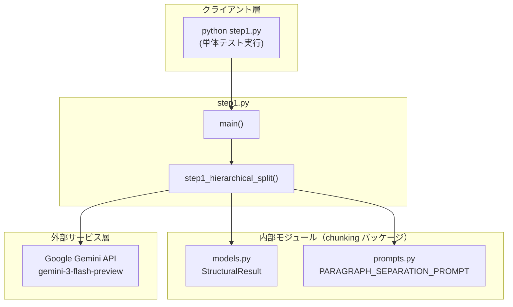
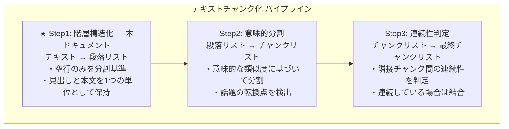
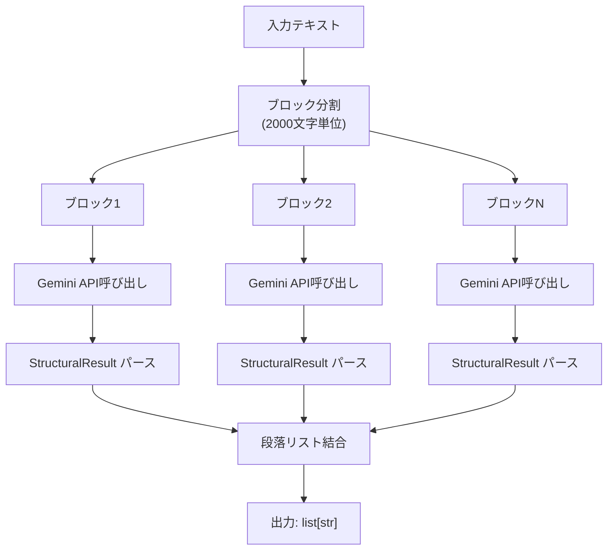
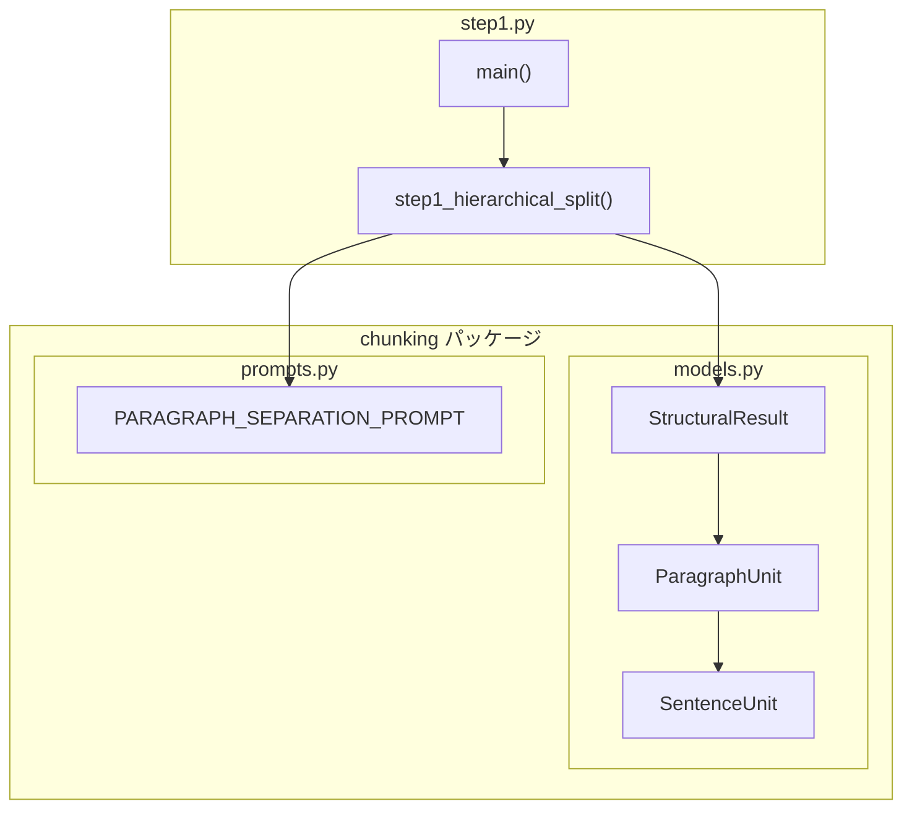
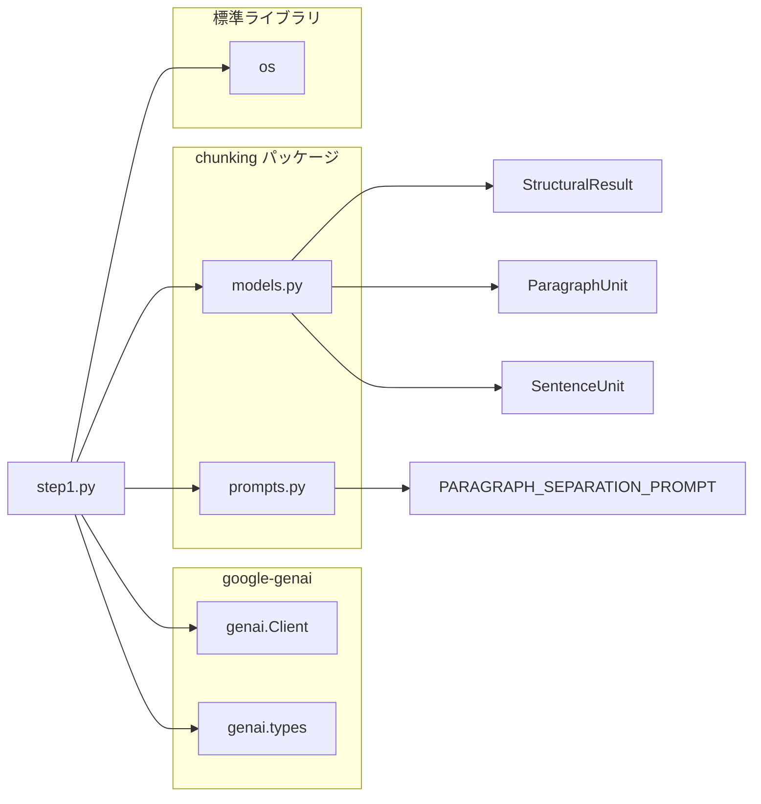

## step1.py - 階層構造化（Hierarchical Split）ドキュメント

**Version 1.1** | 最終更新: 2025-02-05

---

本プロジェクトは、現在のLLM開発における最先端かつ最も需要のある課題のAgent, RAGのプロジェクトを
LangChainなどのライブラリを使わず、「自律型エージェントの制御（Plan-and-Execute）」や「信頼度評価」、RAGデータ作成、ベクトルDBへの登録、検索システムを実現しています。

本番のチャンク分割は、「csv_text_to_chunks_text_csv.py」のコマンドで実行されます。
ここでは、上記コマンドのRAGの[チャンク分割]の4つのステージのStep1(階層構造化)の説明をします。

- Step1（階層構造化）
- Step2（意味的分割）
- Step3（文脈連続性チェック）
- 非同期・並列処理

##### 全ソースは： GitHubにあります。

- URL: https://github.com/nakashima2toshio/gemini_grace_agent
  [環境準備（超簡易版）]：
- 上記リポジトリーを自環境にcloneし、
- [ライブラリー]pip install -r requirements.txt　でライブラリを入れてください。
- step2以降で利用：[docker compose]プロジェクト・ルートのdocker-compose/ 以下で
  memo.txt を参考として、docker composeで、Redis, Qdrantを立ち上げてください。
- Gemini APIのKeyを取得し、.evn と環境変数に登録してください。

---

##### 開発環境（確認環境）：他の環境の方は、Anthropic(Claude code)やGemini, ChatGPTで確認してください。

- Macbook air M2, 24Gバイトメモリー（次は、M6が欲しいですね。）
- PyCharm pro, Gemini API, Python, Streamlit, docker compose(Redis, Qdrant)

---

## 📋 目次

1. [概要](#概要)
2. [アーキテクチャ構成図](#1-アーキテクチャ構成図)
3. [モジュール構成図](#2-モジュール構成図)
4. [クラス・関数一覧表](#3-クラス関数一覧表)
5. [クラス・関数 IPO詳細](#4-クラス関数-ipo詳細)
6. [設定・定数](#5-設定定数)
7. [使用例](#6-使用例)
8. [エクスポート](#7-エクスポート)
9. [変更履歴](#8-変更履歴)
10. [付録A: 依存関係図](#付録a-依存関係図)
11. [付録B: Step1の方式詳細](#付録b-step1の方式詳細)
12. [付録C: 具体例とテストデータ](#付録c-具体例とテストデータ)
13. [付録D: 重要な設計判断](#付録d-重要な設計判断)

---

## 概要

`step1.py`は、RAGシステムにおけるセマンティックチャンキングの第1段階「階層構造化」を**単体で確認**するためのテストプログラムです。テキストを空行（`\n\n`）を基準に段落単位へ分割し、見出しと本文は同一段落として保持します。

本番のチャンク分割は `csv_text_to_chunks_text_csv.py` で実行されますが、本プログラムはStep1の動作を独立して検証するために作成されました。

### 主な責務

- テキストを空行（`\n\n`）ベースで段落に分割
- 見出し（第X章など）と本文を同一段落として保持
- LLM（Gemini API）を使用した構造認識
- Step2（意味的分割）への入力データ生成
- Step1単体での動作確認・検証

### 主要機能一覧

| 機能 | 説明 |
|------|------|
| `preprocess_text()` | **[v1.1追加]** テキストの前処理（長い1行を句読点で分割） |
| `postprocess_paragraph()` | **[v1.1追加]** 段落の後処理（句読点で文を分割、改行区切り） |
| `step1_hierarchical_split()` | テキストを段落単位に分割（Step1のコア機能） |
| `run_test()` | テスト実行用のヘルパー関数 |
| `main()` | テスト実行用のメイン関数 |

### 3段階処理における位置づけ

| ステップ | 名称 | 入力 | 出力 | 本ドキュメント |
|:--------:|------|------|------|:--------------:|
| **Step1** | 階層構造化 | テキスト | 段落リスト | ★ |
| Step2 | 意味的分割 | 段落リスト | チャンクリスト | - |
| Step3 | 連続性判定 | チャンクリスト | 最終チャンクリスト | - |

### [超重要]

チャンク処理はRAGの検索精度を左右する重要な前処理工程です。
チャンクはLLM(Gemini API)で分割していますので、最重要は、prompts.pyのプロンプトです。
機能、性能はこのプロンプトで決まります。

```prompts.py
# プロンプト 1: 階層分割（改修版）
PARAGRAPH_SEPARATION_PROMPT
```

機能確認の方法：各ステップの確認プログラムで、機能を確認しましょう。
[確認]:

- 本番チャンクは、「csv_text_to_chunks_text_csv.py」のCLIのコマンド形式です。
- 最終確認は、[agent_rag.py]のstreamlit[GUI]で、実施します。
- 機能を確認するため「csv_text_to_chunks_text_csv.py」プログラムのstep1, step2, step3の該当処理を抜き出し、
- ステップ別の機能を確認用に「step1.py, step2.py, step3.py」を作成しました。
- また、step1, step2, step3 を通しての実行は、非同期・並列処理の check_async.py を準備しました。
- このプログラムで各ステップの処理、方式を確認します。

---

## 1. アーキテクチャ構成図

### 1.1 システム全体構成



### 1.2 3段階処理における Step1 の位置づけ



### 1.3 データフロー

| 段階 | 内容 |
|:---:|------|
| **入力** | `"RAG（Retrieval-Augmented Generation）は...\n\nセマンティックチャンキングは...\n\n京都の紅葉は..."` |
| ↓ | |
| **Step1: 階層構造化** | 1. テキストをブロックに分割<br>2. 各ブロックをLLMに送信<br>3. 段落構造を抽出<br>4. 結果を結合 |
| ↓ | |
| **出力（5段落）** | 段落1:`"RAG（定義+利点）"`<br>段落2:`"セマンティックチャンキング（用語定義+用語使用）"`<br>段落3:`"京都+沖縄（観光情報）"`<br>段落4:`"ベクトルDB（定義+活用）"`<br>段落5:`"第1章+第2章（章構造）"` |

### 1.4 処理の流れ図

- block sizeは、チャンク元の文章の（分野、性質）で調整する必要がある場合があります。



---

## 2. モジュール構成図

### 2.1 内部モジュール構成



### 2.2 外部依存関係

| ライブラリ | バージョン | 用途 |
|-----------|-----------|------|
| `google-genai` | >= 0.1.0 | Gemini APIクライアント |

### 2.3 標準ライブラリ依存

| モジュール | 用途 |
|-----------|------|
| `os` | 環境変数（`GOOGLE_API_KEY`）の取得 |

### 2.4 内部依存モジュール

| モジュール | インポート | 用途 |
|-----------|-----------|------|
| `chunking.models` | `StructuralResult` | LLMレスポンスのPydanticスキーマ |
| `chunking.prompts` | `PARAGRAPH_SEPARATION_PROMPT` | 階層分割用プロンプト |
| `chunking.regex_string` | `chunk_text` | **[v1.1追加]** 日本語・英語対応の文分割 |

---

## 3. クラス・関数一覧表

### 3.1 関数一覧

| 関数名 | 概要 |
|-------|------|
| `preprocess_text(text)` | **[v1.1追加]** テキストの前処理（長い1行を句読点で分割） |
| `postprocess_paragraph(paragraph)` | **[v1.1追加]** 段落の後処理（句読点で文を分割、改行区切り） |
| `step1_hierarchical_split(text, api_key, block_size)` | テキストを段落単位に分割（Step1のコア機能） |
| `run_test(title, text, api_key)` | テスト実行用のヘルパー関数 |
| `main()` | テスト実行用のメイン関数 |

---

## 4. クラス・関数 IPO詳細

### 4.1 前処理・後処理関数 **[v1.1追加]**

#### `preprocess_text`

**概要**: テキストの前処理を行い、長い1行を句読点で適切に分割する。

```python
def preprocess_text(text: str) -> str
```

| パラメータ | 型 | デフォルト | 説明 |
|------------|------|-----------|------|
| `text` | str | - | 入力テキスト |

| 項目 | 内容 |
|------|------|
| **Input** | `text: str` |
| **Process** | 1. テキストを`\n`で行単位に分割<br>2. 各行を`strip()`で前後空白除去<br>3. 空行は空文字列として保持<br>4. 各行を`chunk_text(line, keep_delimiter=True)`で分割<br>5. 複数チャンクに分割された場合は展開、そうでなければそのまま保持<br>6. `\n`で結合して返却 |
| **Output** | `str`: 前処理済みテキスト（改行区切り） |

**戻り値例**:
```python
preprocess_text("RAGは手法です。Facebookが発表しました。")
# → "RAGは手法です。\nFacebookが発表しました。"
```

---

#### `postprocess_paragraph`

**概要**: 段落の後処理を行い、句読点で文を分割して改行で区切る。

```python
def postprocess_paragraph(paragraph: str) -> str
```

| パラメータ | 型 | デフォルト | 説明 |
|------------|------|-----------|------|
| `paragraph` | str | - | 入力段落 |

| 項目 | 内容 |
|------|------|
| **Input** | `paragraph: str` |
| **Process** | 1. 改行の有無で処理を分岐（`\n`含む場合は分割）<br>2. 各行を`strip()`で前後空白除去<br>3. 空行を除外<br>4. 各行を`chunk_text(line, keep_delimiter=True)`で句読点分割<br>5. `\n`で結合して返却 |
| **Output** | `str`: 改行区切りの文の集合 |

**戻り値例**:
```python
postprocess_paragraph("RAGは手法です。Facebookが発表しました。")
# → "RAGは手法です。\nFacebookが発表しました。"
```

---

### 4.2 `step1_hierarchical_split`

**概要**: テキストを空行（`\n\n`）ベースで段落単位に分割する。LLM（Gemini API）を使用して構造を認識。

```python
def step1_hierarchical_split(
    text: str,
    api_key: str,
    block_size: int = 2000
) -> list[str]
```

| パラメータ | 型 | デフォルト | 説明 |
|------------|------|-----------|------|
| `text` | str | - | 入力テキスト |
| `api_key` | str | - | Gemini API キー |
| `block_size` | int | 2000 | ブロックサイズ（文字数） |

| 項目 | 内容 |
|------|------|
| **Input** | `text: str`, `api_key: str`, `block_size: int = 2000` |
| **Process** | 1. `genai.Client`を初期化<br>2. **[v1.1追加]** `preprocess_text()`で前処理（長い行を句読点で分割）<br>3. テキストを`block_size`単位でブロック分割<br>4. 各ブロックに`PARAGRAPH_SEPARATION_PROMPT`を適用<br>5. Gemini API呼び出し（`response_mime_type="application/json"`）<br>6. `StructuralResult.model_validate_json()`でパース<br>7. 各段落の`full_text`を抽出してリストに追加<br>8. **[v1.1追加]** 各段落を`postprocess_paragraph()`で後処理 |
| **Output** | `list[str]`: 段落のリスト |

**戻り値例**:

```python
[
    "RAG（Retrieval-Augmented Generation）は、検索と生成を組み合わせた手法です。\n"
    "外部知識ベースから関連情報を取得し、それをLLMのコンテキストとして渡します。\n"
    "...",

    "セマンティックチャンキングは、テキストを意味単位で分割する技術です。\n"
    "「チャンク」とは、分割されたテキストの各ブロックを指します。\n"
    "...",

    # ... 続く
]
```

**コア処理の詳細**:

```python
def step1_hierarchical_split(text: str, api_key: str, block_size: int = 2000) -> list[str]:
    """
    テキストを段落単位に分割する（Step1のコア機能）
    Args:
        text: 入力テキスト
        api_key: Gemini API キー
        block_size: ブロックサイズ（文字数）
    Returns:
        段落のリスト
    """
    # ① Gemini APIクライアントを初期化
    client = genai.Client(api_key=api_key)

    # ② [v1.1追加] 前処理: 長い1行を句読点で分割
    preprocessed_text = preprocess_text(text)

    # ③ テキストをブロックに分割
    #    例: 5000文字のテキスト → 3ブロック（2000, 2000, 1000文字）
    blocks = [preprocessed_text[i:i + block_size] for i in range(0, len(preprocessed_text), block_size)]
    print(f"入力: {len(text)}文字 → {len(blocks)}ブロック")

    paragraphs = []

    # ④ 各ブロックを処理
    for i, block in enumerate(blocks):
        print(f"ブロック {i + 1}/{len(blocks)} 処理中...")

        # ⑤ プロンプト作成（プロンプト + 入力テキスト）
        prompt = f"{PARAGRAPH_SEPARATION_PROMPT}\n\n【入力テキスト】\n{block}"

        # ⑥ Gemini API 呼び出し（同期）
        response = client.models.generate_content(
            model="gemini-3-flash-preview",  # v1.1で更新
            contents=prompt,
            config=types.GenerateContentConfig(
                response_mime_type="application/json",
                response_schema=StructuralResult
            )
        )

        # ⑦ レスポンスをパース
        result = StructuralResult.model_validate_json(response.text)

        # ⑦ 段落を抽出（full_textプロパティで改行結合）
        for para in result.paragraphs:
            paragraphs.append(para.full_text)

        print(f"  → {len(result.paragraphs)}個の段落を抽出")

    return paragraphs
```

```python
# 使用例
import os
from step1 import step1_hierarchical_split

api_key = os.getenv("GOOGLE_API_KEY")
text = open("document.txt").read()

paragraphs = step1_hierarchical_split(
    text=text,
    api_key=api_key,
    block_size=2000
)

print(f"段落数: {len(paragraphs)}")
for i, para in enumerate(paragraphs, 1):
    print(f"段落{i}: {para[:50]}...")
```

---

### 4.2 `main`

**概要**: Step1の動作を確認するためのテスト実行関数。テスト用テキストを使用して`step1_hierarchical_split()`を実行し、結果を検証。

```python
def main() -> None
```

| 項目 | 内容 |
|------|------|
| **Input** | なし（環境変数`GOOGLE_API_KEY`を使用） |
| **Process** | 1. 環境変数から`GOOGLE_API_KEY`を取得<br>2. テスト用テキスト（5段落構成）を準備<br>3. `step1_hierarchical_split()`を呼び出し<br>4. 結果を表示・検証（期待値: 5段落）<br>5. Step2・Step3との連携情報を表示 |
| **Output** | `None`（標準出力に結果を表示） |

```python
# 実行方法
if __name__ == "__main__":
    main()
```

---

## 5. 設定・定数

### 5.1 デフォルト設定値

| 設定 | デフォルト値 | 説明 |
|-----|-------------|------|
| `block_size` | 2000 | ブロックサイズ（文字数） |
| `model` | "gemini-3-flash-preview" | 使用するGeminiモデル |

### 5.2 ブロックサイズの選定

| サイズ | メリット | デメリット |
|--------|----------|------------|
| 500文字 | 処理が軽い | 段落が分断されやすい |
| **2000文字** | **バランスが良い** | **✅ 推奨** |
| 5000文字 | 段落が保持されやすい | API制限に近づく |

### 5.3 Geminiモデルの比較

| モデル | Input (1M tokens) | Output (1M tokens) | 特性 |
|--------|-------------------|--------------------|----|
| **gemini-3-flash-preview** | **$0.075** | **$0.30** | 【最新】高性能・大量処理に最適 |
| gemini-3-flash | $0.15 | $0.60 | 【バランス】複雑な判断向け |
| gemini-3-pro | $2.00 | $12.00 | 【高性能】最終推論向け |

### 5.4 環境変数

| 環境変数 | 必須 | 説明 |
|---------|:----:|------|
| `GOOGLE_API_KEY` | ✅ | Gemini APIキー |

### 5.5 分割ルール（最重要）

| 区分 | ルール |
|:----:|--------|
| ✅ **分割する場合** | 空行（`\n\n`）が存在する箇所のみ |
| ❌ **分割しない場合** | 見出し（「第〇章」など）と直後の本文 → 空行なければ同一段落 |
| ❌ **分割しない場合** | 章が変わっても（第1章→第2章）→ 空行なければ分割しない |
| ❌ **分割しない場合** | 改行（`\n`）だけでは分割しない |

---

## 6. 使用例

### 6.1 基本的な使用方法

```bash
# 環境変数を設定
export GOOGLE_API_KEY='your-api-key'

# 実行
python step1.py
```

### 6.2 Pythonコードからの使用

```python
import os
from step1 import step1_hierarchical_split

# APIキー取得
api_key = os.getenv("GOOGLE_API_KEY")

# テキスト準備
text = """RAG（Retrieval-Augmented Generation）は、検索と生成を組み合わせた手法です。
外部知識ベースから関連情報を取得し、それをLLMのコンテキストとして渡します。

セマンティックチャンキングは、テキストを意味単位で分割する技術です。
「チャンク」とは、分割されたテキストの各ブロックを指します。
"""

# Step1実行
paragraphs = step1_hierarchical_split(text, api_key)

# 結果確認
print(f"段落数: {len(paragraphs)}")
for i, para in enumerate(paragraphs, 1):
    print(f"\n--- 段落{i} ---")
    print(para)
```

### 6.3 Step2・Step3との連携確認

Step1の出力は、Step2の入力として使用されます。統合テストは `check_async.py` で実行できます。

```bash
# Step1〜Step3の通しテスト
python check_async.py
```

---

## 7. エクスポート

`step1.py` は**確認用プログラム**であり、`chunking/__init__.py` からはエクスポートされていません。

本番処理では以下を使用してください：

```python
# 本番用（csv_text_to_chunks_text_csv.py）
from chunking import chunks_all_async
```

---

## 8. 変更履歴

| バージョン | 変更内容 |
|-----------|---------|
| 1.0 | 初版作成（Step1単体確認用プログラム） |
| 1.1 | 前処理・後処理関数追加（`preprocess_text()`, `postprocess_paragraph()`）、デフォルトモデルを`gemini-3-flash-preview`に変更、`chunk_text`を使用した日本語・英語対応の文分割 |

---

## 付録A: 依存関係図



---

## 付録B: Step1の方式詳細

### B.1 目的

**文章の物理構造（空行による段落分け）を尊重した分割**を行います。

- 段落（パラグラフ）への分割は、regexでも可能ですが、
  LLM（ここではGemini）のAPIを使う練習ですね。
  ここでは、後の拡張性、改善を考慮し（LLM）を利用し分割しています。

#### [重要な前提]：

- 入力文章はCSV形式をデフォルトとしています。
- 人がこのCSVを作成した時に、「csvの行には、なんらかの意味があるはずだ」、が前提となっています。
- 全く改行のないテキストも(オプションで指定)入力できますが、
- 現在のLLM(モデル)で、これを段落に分割するには(かなりの計算パワ＝料金)がかかるので、
- 入力文章は、CSVをおすすめします。

> ⚠️ **重要**: Step1は**空行（`\n\n`）のみ**を分割基準とします。
> 章の変わり目（第1章→第2章）では**分割しません**。
> [注] 入力文章により、「章立てがある」、「Chapter、Sectionがある、、、」など
> 入力文章の特徴により、この部分に対応する[プロンプト-> prompts.py]は変更する必要があります。

単純な文字数分割では、以下の問題が発生します：

| 問題 | 具体例 |
|------|--------|
| 見出しと本文の分断 | 「第1章 機械学習入門」と本文が別チャンクに |
| 文の途中での切断 | 「この手法の最大の利点は、最新情報を反映でき」で切れる |
| 意味のまとまりの破壊 | RAGの定義と利点が別々のチャンクに |

Step1では、LLM（Gemini API）を活用して、これらの問題を解決します。

### B.2 アルゴリズム

| ステップ | 処理内容 |
|:--------:|----------|
| 1 | 入力テキストを`block_size`（デフォルト2000文字）ごとに分割<br>例: 5000文字 → 3ブロック（2000, 2000, 1000文字） |
| 2 | 各ブロックをLLM（Gemini API）に送信<br>・JSON形式（`response_mime_type="application/json"`）<br>・Pydanticスキーマ（`response_schema=StructuralResult`） |
| 3 | LLMが以下のルールで構造化:<br>・Rule 1: 空行（`\n\n`）のみで段落を分割<br>・Rule 2: 見出しと本文は分離せず1つの段落に<br>・Rule 3: 句点（。）や改行で文を分割 |
| 4 | 全ブロックの結果を結合して段落リストを生成 |

### B.3 LLMへのプロンプト

`chunking/prompts.py` で定義されている `PARAGRAPH_SEPARATION_PROMPT`:

```python
PARAGRAPH_SEPARATION_PROMPT = """
あなたはテキスト構造化エンジンです。入力されたテキストを以下の【分割ルール】に従って解析し、階層構造（段落 > 文）に変換してください。

【分割ルール】
入力されたテキストを、以下のルールに従って構造化してください。
目的は、テキストを「大きな意味のブロック（Paragraph）」に分け、その中を「文（Sentence）」に分解することです。

【Rule 1: Paragraphの分割基準（厳密に従うこと）】
**分割する場合（これ以外では分割しない）:**
- 空行（\\n\\n）が存在する箇所で分割する

**分割してはいけない場合（重要）:**
- 見出し（「第〇章」など）と直後の本文は、**空行がなければ**同じParagraphに含める
- 章が変わっても（例: 第1章 → 第2章）、**空行がなければ**分割しない
- 改行（\\n）だけでは分割しない

【Rule 2: 見出しの扱い】
- 「第〇章」などの見出しがある場合:
  - 見出し単体でParagraphを作らない
  - 見出しと直後の本文を**まとめて1つのParagraph**とする
  - ただし、見出しの前に空行（\\n\\n）があれば、そこで分割する

【Rule 3: Sentenceの分割】
- Paragraphの中身を、句点「。」や改行ごとに区切って sentences リストに格納してください。
- 見出し部分も1つの sentence として扱ってください。

【具体例】
入力テキスト:
段落A。段落A続き。

段落B。段落B続き。
第1章 タイトル
本文1。本文2。
第2章 タイトル
本文3。本文4。

段落C。

期待される分割:
- Paragraph 1: 「段落A。段落A続き。」
- Paragraph 2: 「段落B。段落B続き。第1章 タイトル 本文1。本文2。第2章 タイトル 本文3。本文4。」
  （空行がないので、第1章も第2章も同じParagraphに含まれる）
- Paragraph 3: 「段落C。」

【出力要件】
- JSONスキーマに従い、paragraphs リストの中に sentences リストを持つ構造で出力すること。
- 元のテキストの内容を省略したり要約したりせず、**そのままの文字列**を保持すること。
- **空行（\\n\\n）のみを分割基準とし、章の変わり目では分割しないこと。**
"""
```

### B.4 レスポンススキーマ（Pydanticモデル）

`chunking/models.py` で定義:

```python
class SentenceUnit(BaseModel):
    """1つの文、または意味の最小単位"""
    text: str = Field(description="1つの文、または意味の最小単位")


class ParagraphUnit(BaseModel):
    """段落単位"""
    id: int = Field(description="Paragraph ID")
    sentences: List[SentenceUnit] = Field(description="この段落に含まれる文のリスト")

    @property
    def full_text(self) -> str:
        """段落内の全文を結合して返す

        注意: 改行（\n）で文を結合します。
        これにより、元のテキスト構造が保持され、
        Step2・Step3での処理精度が向上します。

        CSV入力時に特に重要：
        - CSVセル内の改行が保持される
        - 可読性が高まる
        - 意味的分割が正確になる
        """
        return "\n".join([s.text for s in self.sentences])  # ← 改行で結合


class StructuralResult(BaseModel):
    """テキスト構造化の結果"""
    paragraphs: List[ParagraphUnit]
```

> ⚠️ **重要**: `full_text` プロパティは **改行（`\n`）** で文を結合します。
> これにより、元のテキスト構造が保持され、Step2・Step3での処理精度が向上します。

### B.5 なぜ Step1 が必要なのか？

| 問題 | Step1 の解決策 |
|------|--------------|
| 見出しの分断 | 見出しと本文を1つの段落として保持 |
| 文字数での切断 | LLMが意味を理解して分割 |
| 構造の欠落 | 空行ベースの分割で物理構造を維持 |
| 改行の誤認識 | 空行（`\n\n`）と改行（`\n`）を区別 |

### B.6 API呼び出しの詳細

利用するモデルのデフォルトはコスパから"gemini-3-flash-preview"としていますが、
最新モデルも利用し、結果を比較してみましょう。（段落分けではあまりない。）

```python
response = client.models.generate_content(
    model="gemini-3-flash-preview",           # モデル名（v1.1で更新）
    contents=prompt,                     # プロンプト
    config=types.GenerateContentConfig(
        response_mime_type="application/json",  # JSON形式を指定
        response_schema=StructuralResult        # Pydanticスキーマを指定
    )
)
```

| パラメータ | 値 | 説明 |
|------------|-----|------|
| `model` | `"gemini-3-flash-preview"` | 最新の安定版、高いレート制限とパフォーマンス |
| `response_mime_type` | `"application/json"` | JSON形式のレスポンスを要求 |
| `response_schema` | `StructuralResult` | Pydanticモデルでスキーマを指定 |

---

## 付録C: 具体例とテストデータ

### C.1 テスト用入力テキスト

`main()` 関数内で定義されているテストデータ：

| 段落 | 内容 | 備考 |
|:----:|------|------|
| 1 | RAGの説明（定義+利点） | 「この手法」「それ」で前方参照 |
| ↑空行↓ | | 分割ポイント |
| 2 | セマンティックチャンキング（用語定義+用語使用） | 「チャンク」「埋め込み」の定義と使用 |
| ↑空行↓ | | 分割ポイント |
| 3 | 観光情報（京都+沖縄） | 独立した2つの話題 |
| ↑空行↓ | | 分割ポイント |
| 4 | ベクトルDB（定義+活用） | 「ANN」の定義と使用 |
| ↑空行↓ | | 分割ポイント |
| 5 | 章構造（第1章+第2章） | ⚠️ 章間に空行なし→同一段落 |

### C.2 分割ポイントの可視化

| 段落 | 内容 | 分割理由 |
|:----:|------|----------|
| **段落1** | RAGの説明<br>`RAG（Retrieval-Augmented Generation）は...`<br>`...ハルシネーションを軽減する効果も報告されています。` | |
| ↓ | 空行（`\n\n`）あり | **分割** |
| **段落2** | セマンティックチャンキングの説明<br>`セマンティックチャンキングは...`<br>`...関連性の低い情報が混入します。` | |
| ↓ | 空行（`\n\n`）あり | **分割** |
| **段落3** | 観光情報<br>`京都の紅葉は...`<br>`...それ以外の季節も温暖で過ごしやすいです。` | |
| ↓ | 空行（`\n\n`）あり | **分割** |
| **段落4** | ベクトルDBの説明<br>`ベクトルデータベースは...`<br>`...スケーラビリティとコストも重要な判断基準となります。` | |
| ↓ | 空行（`\n\n`）あり | **分割** |
| **段落5** | 章構造（第1章+第2章）<br>`第1章 機械学習入門`<br>`機械学習は...本章では、これらの基本概念を解説しました。`<br>`第2章 深層学習の基礎`<br>`深層学習は...本章では、CNNとRNNの基本アーキテクチャを説明します。` | ⚠️ 空行がないので**分割しない** |

### C.3 期待される出力

```python
# Step1の出力（5段落）
[
  # 段落1: RAGの説明（定義+利点）
  "RAG（Retrieval-Augmented Generation）は、検索と生成を組み合わせた手法です。\n"
  "外部知識ベースから関連情報を取得し、それをLLMのコンテキストとして渡します。\n"
  "2020年にFacebookが発表し、現在では多くのシステムで採用されています。\n"
  "この手法の最大の利点は、最新情報を反映できることです。\n"
  "それにより、LLM単体では対応できない時事的な質問にも回答可能になります。\n"
  "また、ハルシネーションを軽減する効果も報告されています。",

  # 段落2: セマンティックチャンキングの説明（用語定義+用語使用）
  "セマンティックチャンキングは、テキストを意味単位で分割する技術です。\n"
  "「チャンク」とは、分割されたテキストの各ブロックを指します。\n"
  "「埋め込み」（Embedding）は、テキストを数値ベクトルに変換したものです。\n"
  "チャンクサイズは検索精度に大きく影響します。\n"
  "小さすぎると文脈が失われ、埋め込みの品質が低下します。\n"
  "大きすぎると検索ノイズが増加し、関連性の低い情報が混入します。",

  # 段落3: 観光情報（京都+沖縄）
  "京都の紅葉は11月中旬から下旬が見頃です。\n"
  "清水寺や嵐山が特に人気のスポットとして知られています。\n"
  "混雑を避けるなら平日の早朝がおすすめです。\n"
  "沖縄の海は透明度が高く、シュノーケリングに最適です。\n"
  "那覇から車で約1時間の恩納村には美しいビーチが点在しています。\n"
  "夏季は台風に注意が必要ですが、それ以外の季節も温暖で過ごしやすいです。",

  # 段落4: ベクトルDBの説明（定義+活用）
  "ベクトルデータベースは、高次元ベクトルを効率的に格納・検索するシステムです。\n"
  "代表的な製品にPinecone、Weaviate、Chromaなどがあります。\n"
  "ANN（Approximate Nearest Neighbor）アルゴリズムにより高速な類似検索を実現します。\n"
  "ANNの精度とスピードはトレードオフの関係にあります。\n"
  "HNSWやIVFなどのインデックス手法を選択することで、このバランスを調整できます。\n"
  "ベクトルDBの選定では、スケーラビリティとコストも重要な判断基準となります。",

  # 段落5: 章構造（第1章+第2章）← 空行がないので同じ段落！
  "第1章 機械学習入門\n"
  "機械学習は、データからパターンを学習するアルゴリズムの総称です。\n"
  "教師あり学習、教師なし学習、強化学習の3つに大別されます。\n"
  "本章では、これらの基本概念を解説しました。\n"
  "第2章 深層学習の基礎\n"
  "深層学習は、多層のニューラルネットワークを用いる機械学習の一手法です。\n"
  "画像認識や自然言語処理で革命的な成果を上げています。\n"
  "本章では、CNNとRNNの基本アーキテクチャを説明します。"
]
```

### C.4 検証ポイント

| チェック項目 | 期待結果 | 確認方法 |
|-------------|----------|----------|
| 段落数 | 5段落 | `len(paragraphs) == 5` |
| 空行での分割 | 空行（`\n\n`）で分割 | 各段落の境界を確認 |
| 章の非分割 | 第1章と第2章が同じ段落 | 段落5の内容を確認 |
| テキスト保持 | 省略なし | 文字数・内容を比較 |
| 改行結合 | `\n` で文を結合 | `full_text` の出力を確認 |

### C.5 Step2・Step3との連携（テストデータの流れ）

**【Step1】1テキスト → 5段落**

| 段落 | 内容 |
|:----:|------|
| 段落1 | RAGの説明（定義+利点） |
| 段落2 | セマンティックチャンキングの説明（用語定義+用語使用） |
| 段落3 | 観光情報（京都+沖縄） |
| 段落4 | ベクトルDBの説明（定義+活用） |
| 段落5 | 章構造（第1章+第2章） |

**【Step2】5段落 → 10チャンク（意味的に分割）**

| 入力 | 出力 |
|------|------|
| 段落1 | チャンク1（RAG定義）+ チャンク2（RAG利点） |
| 段落2 | チャンク3（用語定義）+ チャンク4（用語使用） |
| 段落3 | チャンク5（京都観光）+ チャンク6（沖縄観光） |
| 段落4 | チャンク7（ベクトルDB定義）+ チャンク8（活用） |
| 段落5 | チャンク9（第1章）+ チャンク10（第2章） |

**【Step3】10チャンク → 7チャンク（連続性で結合/分離）**

| 処理 | 結果 | 理由 |
|------|------|------|
| チャンク1+2 | 結合 | 前方依存: 「この手法」「それ」 |
| チャンク3+4 | 結合 | 後方依存: 「チャンク」「埋め込み」未定義 |
| チャンク5 | 独立 | 京都観光は単独で理解可能 |
| チャンク6 | 独立 | 沖縄観光は単独で理解可能 |
| チャンク7+8 | 結合 | 後方依存: 「ANN」「ベクトルDB」未定義 |
| チャンク9 | 独立 | 第1章は完結 |
| チャンク10 | 独立 | 第2章は独立して理解可能 |

### C.6 検証パターンの詳細

| パターン | 説明 | 具体例 | Step3での判定 |
|----------|------|--------|--------------|
| **前方依存** | 指示語で前を参照 | 「この手法」「それ」 | → 結合（True） |
| **後方依存** | 専門用語が未定義のまま使用 | 「チャンク」「埋め込み」「ANN」 | → 結合（True） |
| **独立判定** | 話題は同じでも単独で理解可能 | 京都観光 / 沖縄観光 | → 分離（False） |
| **章構造** | 章が変わった場合 | 第1章 / 第2章 | → 分離（False） |

---

## 付録D: 重要な設計判断

### D.1 なぜ空行のみを分割基準とするのか？

**【問題】** 章の変わり目で分割すると、Step2で「章の変わり目かどうか」の判断が難しくなる

**【例：入力テキスト】**

```
第1章 機械学習入門
機械学習は...
第2章 深層学習の基礎
深層学習は...
```

| 方式 | Step1の出力 | Step2での問題 |
|------|-------------|--------------|
| ❌ 章で分割 | 段落1:`第1章 機械学習入門\n機械学習は...`<br>段落2:`第2章 深層学習の基礎\n深層学習は...` | 段落1内は「第1章」しかないので、意味的分割の判断が困難<br>章構造の情報が失われる |
| ✅ 空行のみで分割 | 段落1:`第1章 機械学習入門\n機械学習は...第2章 深層学習の基礎\n深層学習は...` | 段落1内に「第1章」「第2章」の両方があり、章の転換点を検出可能<br>→ チャンク1: 第1章<br>→ チャンク2: 第2章 |

### D.2 なぜ改行（`\n`）で文を結合するのか？

```python
# models.py の full_text プロパティ

@property
def full_text(self) -> str:
    """段落内の全文を結合して返す

    注意: 改行（\n）で文を結合します。
    これにより、元のテキスト構造が保持され、
    Step2・Step3での処理精度が向上します。

    CSV入力時に特に重要：
    - CSVセル内の改行が保持される
    - 可読性が高まる
    - 意味的分割が正確になる
    """
    return "\n".join([s.text for s in self.sentences])  # ← 改行で結合
```

| 結合方法 | 結果 | 問題点 |
|----------|------|--------|
| 空文字結合`"".join()` | `"文1。文2。文3。"` | 元の改行構造が失われる |
| 改行結合`"\n".join()` | `"文1。\n文2。\n文3。"` | ✅ 元の構造が保持される |

**改行結合のメリット:**

- Step2で文の区切りを認識しやすい
- Step3で連続性判定の精度が向上
- デバッグ時に可読性が高い
- CSV入力時にセル内の改行が保持される

### D.3 ブロックサイズの選定理由

```python
block_size: int = 2000  # デフォルト値
```

| サイズ | メリット | デメリット |
|--------|----------|------------|
| 500文字 | 処理が軽い | 段落が分断されやすい |
| **2000文字** | **バランスが良い** | **✅ 推奨** |
| 5000文字 | 段落が保持されやすい | API制限に近づく |

---

## まとめ

### Step1 の役割

| 項目 | 内容 |
|------|------|
| 入力 | テキスト（文字列） |
| 出力 | 段落リスト（`list[str]`） |
| 目的 | 物理構造（空行による段落分け）を維持した分割 |
| 方式 | LLM（Gemini API）による構造認識 |

### 重要なポイント

1. **空行のみで分割**: `\n\n` のみが分割基準、章の変わり目では分割しない
2. **見出しと本文の保持**: 「第X章」と直後の本文は同じ段落として扱う
3. **改行で文を結合**: `full_text` は `\n` で文を結合し、構造を保持
4. **テキストの完全保持**: 省略や要約は行わない

### 次のステップ

Step1 の出力（段落リスト）は、**Step2（意味的分割）** の入力として使用されます。

Step2 では、各段落内の**意味的な転換点**を検出し、より細かいチャンクに分割します。
特に、章の変わり目（第1章→第2章）はStep2で分割されます。

Step3 では、隣接チャンク間の**連続性**を判定し、以下のパターンで結合/分離を行います：

| パターン | 判定 | 結果 |
|----------|------|------|
| **前方依存** | 指示語（「この」「それ」）で前を参照 | 結合 |
| **後方依存** | 専門用語が未定義のまま使用 | 結合 |
| **独立判定** | 話題は同じでも単独で理解可能 | 分離 |
| **章構造** | 章が変わった場合 | 分離 |
