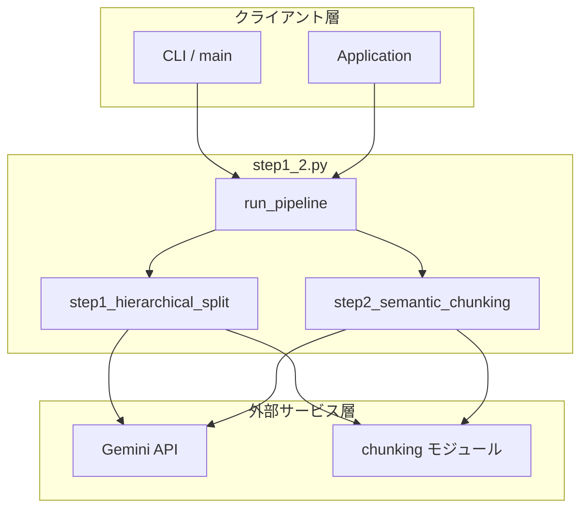
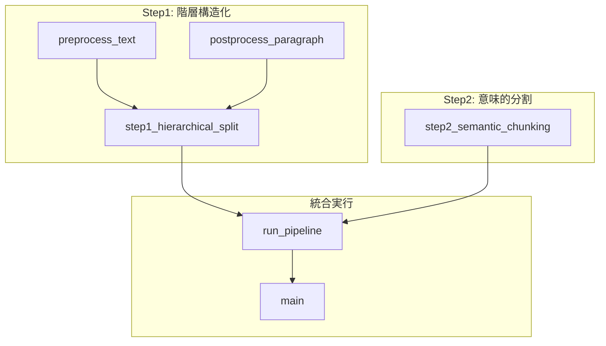
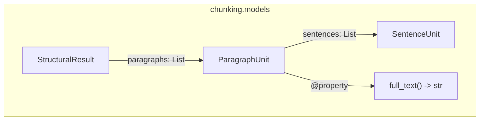

# step1_2.py - Step1 + Step2 統合実行スクリプト ドキュメント

**Version 1.1** | 最終更新: 2025-02-05

---

## 目次

1. [概要](#概要)
2. [アーキテクチャ構成図](#1-アーキテクチャ構成図)
3. [モジュール構成図](#2-モジュール構成図)
4. [クラス・関数一覧表](#3-クラス関数一覧表)
5. [クラス・関数 IPO詳細](#4-クラス関数-ipo詳細)
6. [設定・定数](#5-設定定数)
7. [使用例](#6-使用例)
8. [エクスポート](#7-エクスポート)
9. [変更履歴](#8-変更履歴)
10. [付録: 依存関係図](#付録-依存関係図)

---

## 概要

`step1_2.py`は、テキストを段落単位に分割（Step1: 階層構造化）した後、意味的なチャンクに分割（Step2: Semantic Chunking）する統合パイプラインを提供するモジュールです。

### 主な責務

- テキストの前処理（長い1行を適切に分割）
- Gemini APIを使用した段落単位への分割（Step1）
- 段落の後処理（句読点で文を分割）
- Gemini APIを使用した意味的チャンク分割（Step2）
- Step1 → Step2 の連続実行パイプラインの提供

### 主要機能一覧

| 機能 | 説明 |
|------|------|
| `preprocess_text()` | テキストの前処理（長い1行を適切に分割） |
| `postprocess_paragraph()` | 段落の後処理（句読点で文を分割） |
| `step1_hierarchical_split()` | Step1: テキストを段落単位に分割 |
| `step2_semantic_chunking()` | Step2: 段落を意味的なチャンクに分割 |
| `run_pipeline()` | Step1 → Step2 を連続実行する統合関数 |
| `main()` | テスト実行用のエントリーポイント |

---

## 1. アーキテクチャ構成図

### 1.1 システム全体構成



### 1.2 データフロー

1. クライアントから入力テキストを受信
2. Step1: テキストを前処理し、Gemini APIで段落に分割
3. Step1: 段落を後処理（句読点分割）
4. Step2: 各段落をGemini APIで意味的チャンクに分割
5. 最終的なチャンクリストをクライアントに返却

---

## 2. モジュール構成図

### 2.1 内部モジュール構成



### 2.2 外部依存関係

| ライブラリ | バージョン | 用途 |
|-----------|-----------|------|
| `google-genai` | - | Gemini API クライアント |

### 2.3 内部依存モジュール

| モジュール | 用途 |
|-----------|------|
| `chunking.models.StructuralResult` | API レスポンスのスキーマ定義 |
| `chunking.models.ParagraphUnit` | 段落単位のデータモデル |
| `chunking.models.SentenceUnit` | 文単位のデータモデル |
| `chunking.prompts.PARAGRAPH_SEPARATION_PROMPT` | Step1 用プロンプト（階層分割） |
| `chunking.prompts.SEMANTIC_CHUNKING_PROMPT` | Step2 用プロンプト（意味的分割） |
| `chunking.regex_string.chunk_text` | 句読点による文分割処理（日本語・英語対応）|

---

## 3. クラス・関数一覧表

### 3.1 関数一覧（カテゴリ別）

#### Step1: 階層構造化

| 関数名 | 概要 |
|-------|------|
| `preprocess_text(text)` | テキストの前処理（長い1行を適切に分割） |
| `postprocess_paragraph(paragraph)` | 段落の後処理（句読点で文を分割） |
| `step1_hierarchical_split(text, client, block_size)` | テキストを段落単位に分割 |

#### Step2: 意味的分割

| 関数名 | 概要 |
|-------|------|
| `step2_semantic_chunking(paragraphs, client)` | 段落を意味的なチャンクに分割 |

#### 統合実行

| 関数名 | 概要 |
|-------|------|
| `run_pipeline(text, api_key, verbose)` | Step1 → Step2 を連続実行 |
| `main()` | テスト実行用エントリーポイント |

---

## 4. クラス・関数 IPO詳細

### 4.1 Step1: 階層構造化関数

#### `preprocess_text`

**概要**: テキストの前処理を行い、長い1行を句読点で適切に分割する。

```python
def preprocess_text(text: str) -> str
```

| パラメータ | 型 | デフォルト | 説明 |
|------------|------|-----------|------|
| `text` | str | - | 入力テキスト |

| 項目 | 内容 |
|------|------|
| **Input** | `text: str` |
| **Process** | 1. テキストを`\n`で行単位に分割<br>2. 各行を`strip()`で前後空白除去<br>3. 空行は空文字列として保持<br>4. 各行を`chunk_text(line, keep_delimiter=True)`で分割<br>5. 複数チャンクに分割された場合は展開、そうでなければそのまま保持<br>6. `\n`で結合して返却 |
| **Output** | `str`: 前処理済みテキスト（改行区切り） |

**戻り値例**:
```python
"RAG（Retrieval-Augmented Generation）は、検索と生成を組み合わせた手法です。\n外部知識ベースから関連情報を取得し、それをLLMのコンテキストとして渡します。"
```

```python
# 使用例
text = "長い文章。句読点で区切られた文章。"
result = preprocess_text(text)
print(result)
# 出力: "長い文章。\n句読点で区切られた文章。"
```

---

#### `postprocess_paragraph`

**概要**: 段落の後処理を行い、句読点で文を分割して改行で区切る。

```python
def postprocess_paragraph(paragraph: str) -> str
```

| パラメータ | 型 | デフォルト | 説明 |
|------------|------|-----------|------|
| `paragraph` | str | - | 入力段落 |

| 項目 | 内容 |
|------|------|
| **Input** | `paragraph: str` |
| **Process** | 1. 改行の有無で処理を分岐（`\n`含む場合は分割）<br>2. 各行を`strip()`で前後空白除去<br>3. 空行を除外（`if line`）<br>4. 各行を`chunk_text(line, keep_delimiter=True)`で句読点分割<br>5. 日本語は「。」、英語は「. 」で分割（自動判定）<br>6. `\n`で結合して返却 |
| **Output** | `str`: 改行区切りの文の集合 |

**戻り値例**:
```python
"RAGは検索と生成を組み合わせた手法です。\n2020年にFacebookが発表しました。"
```

```python
# 使用例
para = "RAGは手法です。Facebookが発表しました。"
result = postprocess_paragraph(para)
print(result)
# 出力: "RAGは手法です。\nFacebookが発表しました。"
```

---

#### `step1_hierarchical_split`

**概要**: テキストを段落単位に分割する（Step1のコア機能）。

```python
def step1_hierarchical_split(text: str, client: genai.Client, block_size: int = 2000) -> list[str]
```

| パラメータ | 型 | デフォルト | 説明 |
|------------|------|-----------|------|
| `text` | str | - | 入力テキスト |
| `client` | genai.Client | - | Gemini API クライアント |
| `block_size` | int | 2000 | ブロック分割サイズ（文字数） |

| 項目 | 内容 |
|------|------|
| **Input** | `text: str`, `client: genai.Client`, `block_size: int = 2000` |
| **Process** | 1. `preprocess_text`で前処理（長い行を句読点で分割）<br>2. `block_size`単位でブロック分割<br>3. 各ブロックに`PARAGRAPH_SEPARATION_PROMPT`を適用<br>4. Gemini APIに送信（JSON形式でレスポンス）<br>5. `StructuralResult`でパース<br>6. `ParagraphUnit.full_text`で段落テキスト取得<br>7. 各段落を`postprocess_paragraph`で後処理 |
| **Output** | `list[str]`: 段落のリスト（各段落は改行区切りの文の集合） |

**戻り値例**:
```python
[
    "RAGは検索と生成を組み合わせた手法です。\n外部知識ベースから関連情報を取得します。",
    "セマンティックチャンキングは意味単位で分割する技術です。\nチャンクサイズは検索精度に影響します。"
]
```

```python
# 使用例
from google import genai

client = genai.Client(api_key="YOUR_API_KEY")
text = "長いテキスト..."
paragraphs = step1_hierarchical_split(text, client)
print(f"{len(paragraphs)}個の段落に分割")
```

---

### 4.2 Step2: 意味的分割関数

#### `step2_semantic_chunking`

**概要**: 段落を意味的なチャンクに分割する（Step2のコア機能）。

```python
def step2_semantic_chunking(paragraphs: list[str], client: genai.Client) -> list[str]
```

| パラメータ | 型 | デフォルト | 説明 |
|------------|------|-----------|------|
| `paragraphs` | list[str] | - | 段落のリスト（Step1の出力） |
| `client` | genai.Client | - | Gemini API クライアント |

| 項目 | 内容 |
|------|------|
| **Input** | `paragraphs: list[str]`, `client: genai.Client` |
| **Process** | 1. 各段落に`SEMANTIC_CHUNKING_PROMPT`を適用<br>2. Gemini APIに送信（JSON形式でレスポンス）<br>3. `StructuralResult`でパース<br>4. `ParagraphUnit.full_text`でチャンクテキスト取得<br>5. 話題の転換点で分割されたチャンクをリストに追加 |
| **Output** | `list[str]`: 意味的に分割されたチャンクのリスト |

**戻り値例**:
```python
[
    "RAGは検索と生成を組み合わせた手法です。",
    "この手法の最大の利点は、最新情報を反映できることです。",
    "京都の紅葉は11月中旬から下旬が見頃です。",
    "沖縄の海は透明度が高く、シュノーケリングに最適です。"
]
```

```python
# 使用例
paragraphs = ["段落1の内容...", "段落2の内容..."]
chunks = step2_semantic_chunking(paragraphs, client)
print(f"{len(chunks)}個のチャンクに分割")
```

---

### 4.3 統合実行関数

#### `run_pipeline`

**概要**: Step1 → Step2 を連続実行する統合パイプライン関数。

```python
def run_pipeline(text: str, api_key: str, verbose: bool = True) -> list[str]
```

| パラメータ | 型 | デフォルト | 説明 |
|------------|------|-----------|------|
| `text` | str | - | 入力テキスト |
| `api_key` | str | - | Gemini API キー |
| `verbose` | bool | True | 進捗表示の有無 |

| 項目 | 内容 |
|------|------|
| **Input** | `text: str`, `api_key: str`, `verbose: bool = True` |
| **Process** | 1. Gemini API クライアントを生成<br>2. Step1: `step1_hierarchical_split`で段落分割<br>3. Step2: `step2_semantic_chunking`でチャンク分割<br>4. verbose=Trueの場合、進捗を表示 |
| **Output** | `list[str]`: 最終的なチャンクのリスト |

**戻り値例**:
```python
[
    "RAGは検索と生成を組み合わせた手法です。\n外部知識ベースから関連情報を取得します。",
    "この手法の最大の利点は、最新情報を反映できることです。",
    "京都の紅葉は11月中旬から下旬が見頃です。\n清水寺や嵐山が人気です。",
    "沖縄の海は透明度が高いです。\n恩納村には美しいビーチが点在しています。"
]
```

```python
# 使用例
import os

api_key = os.getenv("GOOGLE_API_KEY")
text = "長いテキスト..."
chunks = run_pipeline(text, api_key, verbose=True)
print(f"最終結果: {len(chunks)}チャンク")
```

---

#### `main`

**概要**: テスト実行用のエントリーポイント。

```python
def main() -> None
```

| 項目 | 内容 |
|------|------|
| **Input** | なし（環境変数 `GOOGLE_API_KEY` を使用） |
| **Process** | 1. 環境変数からAPIキーを取得<br>2. テストテキストを定義<br>3. `run_pipeline`を実行<br>4. 結果を表示 |
| **Output** | `None`（標準出力に結果を表示） |

```python
# 使用例（コマンドライン）
# $ export GOOGLE_API_KEY='your-api-key'
# $ python step1_2.py
```

---

## 5. 設定・定数

### 5.1 使用される外部定数

| 定数 | 参照元 | 説明 |
|------|--------|------|
| `PARAGRAPH_SEPARATION_PROMPT` | `chunking.prompts` | Step1 用プロンプト（階層分割） |
| `SEMANTIC_CHUNKING_PROMPT` | `chunking.prompts` | Step2 用プロンプト（意味的分割） |

### 5.2 ハードコードされた設定値

| 設定 | 値 | 説明 |
|------|-----|------|
| モデル名 | `"gemini-3-flash-preview"` | 使用するGeminiモデル |
| デフォルトブロックサイズ | `2000` | Step1のブロック分割サイズ（文字数） |

### 5.3 依存モジュールのスキーマ定義

#### StructuralResult（chunking.models）

Gemini APIのレスポンススキーマとして使用されるPydanticモデル。

```python
class StructuralResult(BaseModel):
    """テキスト構造化の結果"""
    paragraphs: List[ParagraphUnit]
```

#### ParagraphUnit（chunking.models）

```python
class ParagraphUnit(BaseModel):
    """段落単位"""
    id: int = Field(description="Paragraph ID")
    sentences: List[SentenceUnit] = Field(description="この段落に含まれる文のリスト")

    @property
    def full_text(self) -> str:
        """段落内の全文を改行（\n）で結合して返す"""
        return "\n".join([s.text for s in self.sentences])
```

#### SentenceUnit（chunking.models）

```python
class SentenceUnit(BaseModel):
    """1つの文、または意味の最小単位"""
    text: str = Field(description="1つの文、または意味の最小単位")
```

### 5.4 プロンプトテンプレート

#### PARAGRAPH_SEPARATION_PROMPT（Step1用）

**目的**: テキストを「大きな意味のブロック（Paragraph）」に分け、その中を「文（Sentence）」に分解する。

**分割ルール**:
| ルール | 説明 |
|--------|------|
| Rule 1 | 空行（`\n\n`）でのみ分割。改行（`\n`）だけでは分割しない |
| Rule 2 | 見出し（「第〇章」等）と直後の本文は、空行がなければ同じParagraphに含める |
| Rule 3 | Paragraph内を句点「。」や改行で区切ってsentencesリストに格納 |

#### SEMANTIC_CHUNKING_PROMPT（Step2用）

**目的**: 形式的な段落や改行ではなく、「意味のまとまり（トピック）」に基づいて再構成する。

**分割基準**:
| 基準 | 説明 |
|------|------|
| 話題の転換点 | 意味の類似度が低下する箇所で分割 |
| 章の変わり目 | 第1章→第2章等は話題の大きな転換点として分割 |
| 改行の無視 | 改行（`\n`）は分割基準にしない |

### 5.5 chunk_text関数の仕様（chunking.regex_string）

```python
def chunk_text(text: str, keep_delimiter: bool = True) -> List[str]
```

**分割ルール（自動判定）**:

| 条件 | 分割方法 |
|------|---------|
| 改行が含まれる場合 | 改行（`\n`）で分割 |
| 日本語テキスト（改行なし） | 句点「。」で分割 |
| 英語テキスト（改行なし） | 文末ピリオド「. 」で分割（略語考慮） |

**言語判定**: 日本語文字（ひらがな・カタカナ・漢字）の有無で自動判定

---

## 6. 使用例

### 6.1 基本的なワークフロー

```python
import os
from step1_2 import run_pipeline

# 1. APIキー取得
api_key = os.getenv("GOOGLE_API_KEY")

# 2. 入力テキスト
text = """RAG（Retrieval-Augmented Generation）は、検索と生成を組み合わせた手法です。
外部知識ベースから関連情報を取得し、それをLLMのコンテキストとして渡します。

セマンティックチャンキングは、テキストを意味単位で分割する技術です。
チャンクサイズは検索精度に大きく影響します。"""

# 3. パイプライン実行
chunks = run_pipeline(text, api_key, verbose=True)

# 4. 結果確認
for i, chunk in enumerate(chunks, 1):
    print(f"チャンク{i}: {chunk[:50]}...")
```

### 6.2 個別ステップの実行

```python
from google import genai
from step1_2 import step1_hierarchical_split, step2_semantic_chunking

# クライアント作成
client = genai.Client(api_key="YOUR_API_KEY")

# Step1のみ実行
paragraphs = step1_hierarchical_split(text, client)
print(f"Step1結果: {len(paragraphs)}段落")

# Step2のみ実行（Step1の出力を入力として使用）
chunks = step2_semantic_chunking(paragraphs, client)
print(f"Step2結果: {len(chunks)}チャンク")
```

### 6.3 カスタムブロックサイズでの実行

```python
# 大きなテキスト向けにブロックサイズを増加
paragraphs = step1_hierarchical_split(
    text,
    client,
    block_size=4000  # デフォルト2000から変更
)
```

---

## 7. エクスポート

このモジュールは `__all__` を定義していません。以下の関数が利用可能です：

```python
# 主要な公開関数
from step1_2 import (
    # 統合実行
    run_pipeline,
    # Step1
    preprocess_text,
    postprocess_paragraph,
    step1_hierarchical_split,
    # Step2
    step2_semantic_chunking,
)
```

---

## 8. 変更履歴

| バージョン | 変更内容 |
|-----------|---------|
| 1.0 | 初版作成（step1.py と step2.py を統合） |
| 1.1 | デフォルトモデルを`gemini-3-flash-preview`に変更 |

---

## 付録: 依存関係図

```mermaid
flowchart LR
    STEP12[step1_2.py]

    subgraph GOOGLE["google-genai"]
        GENAI[genai.Client]
        TYPES[genai.types.GenerateContentConfig]
    end

    subgraph CHUNKING["chunking モジュール"]
        subgraph MODELS["models.py"]
            SR[StructuralResult]
            PU[ParagraphUnit]
            SU[SentenceUnit]
        end
        subgraph PROMPTS["prompts.py"]
            PSP[PARAGRAPH_SEPARATION_PROMPT]
            SCP[SEMANTIC_CHUNKING_PROMPT]
        end
        subgraph REGEX["regex_string.py"]
            CT[chunk_text]
        end
    end

    subgraph STDLIB["標準ライブラリ"]
        OS[os]
    end

    STEP12 --> GENAI
    STEP12 --> TYPES
    STEP12 --> SR
    SR --> PU
    PU --> SU
    STEP12 --> PSP
    STEP12 --> SCP
    STEP12 --> CT
    STEP12 --> OS
```



### 依存モジュール詳細

#### chunking.models



| クラス | 説明 |
|--------|------|
| `StructuralResult` | Gemini APIレスポンスのルートモデル |
| `ParagraphUnit` | 段落単位（id, sentences, full_text） |
| `SentenceUnit` | 文単位（text） |

#### chunking.regex_string

| 関数 | 説明 |
|------|------|
| `chunk_text(text, keep_delimiter)` | 日本語・英語自動判定でテキストを文単位に分割 |
| `chunk_text_with_info(text, keep_delimiter)` | 分割結果に詳細情報（言語・分割方法等）を付加 |

---

## 補足: 制約事項・注意事項

### API制約

| 項目 | 内容 |
|------|------|
| レート制限 | Gemini APIのレート制限に従う（詳細はGoogle AI公式ドキュメント参照） |
| 最大入力長 | `block_size`（デフォルト2000文字）単位で分割して送信 |

### エラーハンドリング

> ⚠️ **注意**: 現在のバージョンではAPI呼び出し時のエラーハンドリングが実装されていません。
> 本番環境での使用時は、以下の対策を推奨します：
> - try-except によるAPI呼び出しのラップ
> - リトライ機構の実装
> - タイムアウト設定

### 処理上の注意

| 項目 | 説明 |
|------|------|
| テキスト保持 | 元のテキストは一言一句変更せず保持される |
| 空行の扱い | Step1では空行（`\n\n`）のみが段落分割の基準 |
| 章構造 | Step2では章の変わり目（第1章→第2章等）で分割される |
