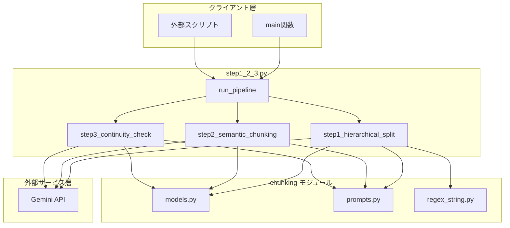
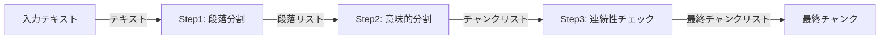
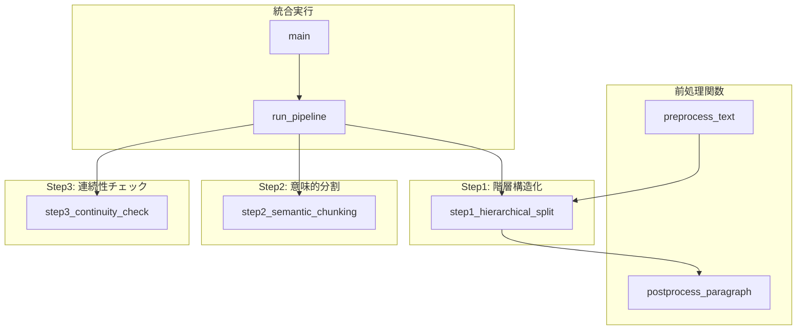
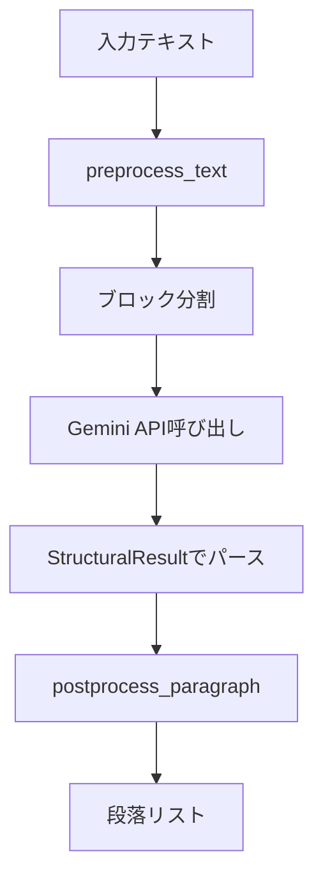
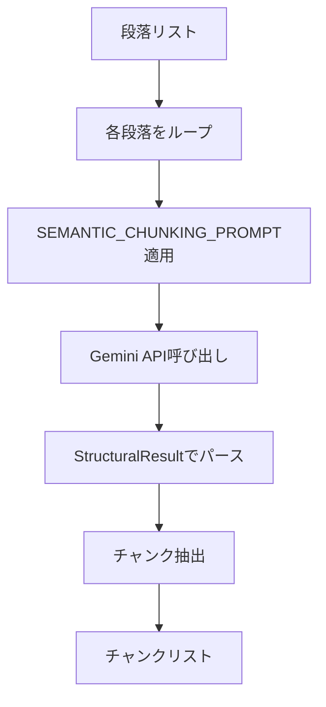
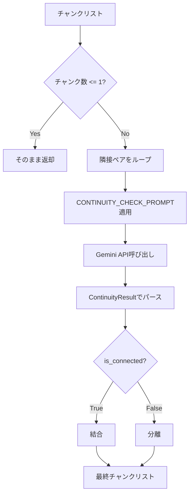
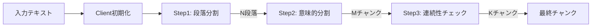
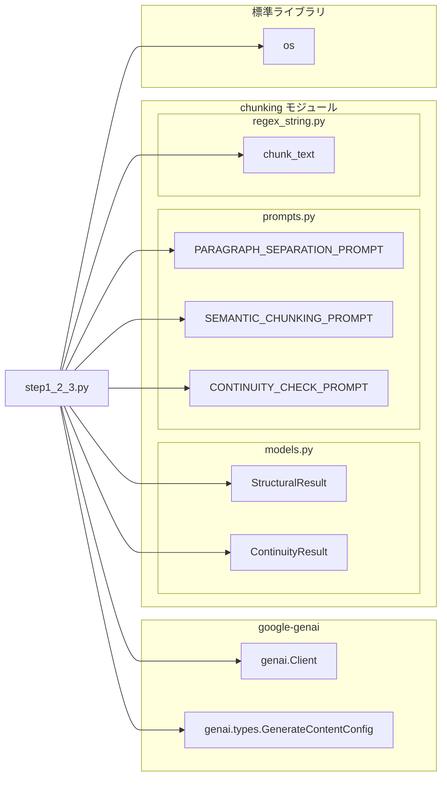
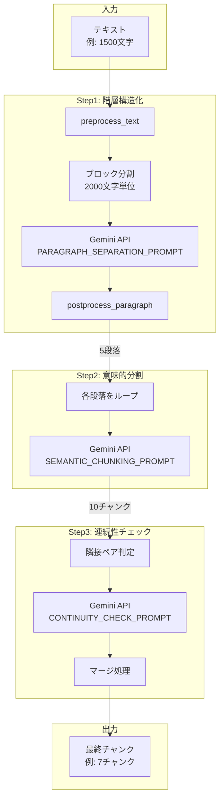

# step1_2_3.py - セマンティックチャンキング統合パイプライン ドキュメント

**Version 1.0** | 最終更新: 2025-02-01

---

## 目次

1. [概要](#概要)
2. [アーキテクチャ構成図](#1-アーキテクチャ構成図)
3. [モジュール構成図](#2-モジュール構成図)
4. [クラス・関数一覧表](#3-クラス関数一覧表)
5. [クラス・関数 IPO詳細](#4-クラス関数-ipo詳細)
6. [設定・定数](#5-設定定数)
7. [使用例](#6-使用例)
8. [エクスポート](#7-エクスポート)
9. [変更履歴](#8-変更履歴)
10. [付録: 依存関係図](#付録-依存関係図)

---

## 概要

`step1_2_3.py`は、テキストを意味的なチャンクに分割するための3段階パイプラインを提供する統合実行スクリプトです。Gemini APIを使用して、テキストの階層構造化、意味的分割、連続性チェックを順次実行します。

### 主な責務

- テキストの前処理（長い行の句読点分割）
- Step1: テキストを段落単位に階層構造化
- Step2: 段落を意味的なチャンクに分割
- Step3: 隣接チャンク間の連続性判定と結合/分離
- 3段階パイプラインの統合実行

### 主要機能一覧

| 機能 | 説明 |
|------|------|
| `preprocess_text()` | テキストの前処理（長い行を句読点で分割） |
| `postprocess_paragraph()` | 段落の後処理（句読点で文を分割し改行区切り） |
| `step1_hierarchical_split()` | Step1: テキストを段落単位に分割 |
| `step2_semantic_chunking()` | Step2: 段落を意味的なチャンクに分割 |
| `step3_continuity_check()` | Step3: 隣接チャンク間の連続性チェックと結合/分離 |
| `run_pipeline()` | Step1→Step2→Step3を連続実行 |

---

## 1. アーキテクチャ構成図

### 1.1 システム全体構成



### 1.2 データフロー



### 1.3 処理フロー詳細

1. 入力テキストを受信
2. Step1: 前処理後、ブロック単位でGemini APIに送信し段落を抽出
3. Step2: 各段落をGemini APIに送信し意味的チャンクに分割
4. Step3: 隣接チャンクペアの連続性を判定し結合/分離
5. 最終チャンクリストを返却

---

## 2. モジュール構成図

### 2.1 内部モジュール構成



### 2.2 外部依存関係

| ライブラリ | 用途 |
|-----------|------|
| `google-genai` | Gemini API クライアント |
| `pydantic` | レスポンススキーマ定義（models.py経由） |

### 2.3 内部依存モジュール

| モジュール | 用途 |
|-----------|------|
| `chunking.models.StructuralResult` | Step1/Step2のAPIレスポンススキーマ |
| `chunking.models.ContinuityResult` | Step3のAPIレスポンススキーマ |
| `chunking.prompts.PARAGRAPH_SEPARATION_PROMPT` | Step1用プロンプト |
| `chunking.prompts.SEMANTIC_CHUNKING_PROMPT` | Step2用プロンプト |
| `chunking.prompts.CONTINUITY_CHECK_PROMPT` | Step3用プロンプト |
| `chunking.regex_string.chunk_text` | 句読点による文分割（日本語・英語対応） |

---

## 3. クラス・関数一覧表

### 3.1 関数一覧（カテゴリ別）

#### 前処理関数

| 関数名 | 概要 |
|-------|------|
| `preprocess_text(text)` | テキストの前処理：長い1行を句読点で分割 |
| `postprocess_paragraph(paragraph)` | 段落の後処理：句読点で文を分割し改行区切り |

#### Step関数

| 関数名 | 概要 |
|-------|------|
| `step1_hierarchical_split(text, client, block_size)` | テキストを段落単位に分割 |
| `step2_semantic_chunking(paragraphs, client)` | 段落を意味的なチャンクに分割 |
| `step3_continuity_check(chunks, client)` | 隣接チャンク間の連続性をチェックし結合/分離 |

#### パイプライン関数

| 関数名 | 概要 |
|-------|------|
| `run_pipeline(text, api_key, verbose)` | Step1→Step2→Step3を連続実行 |
| `main()` | エントリーポイント（テスト実行） |

---

## 4. クラス・関数 IPO詳細

### 4.1 前処理関数

#### `preprocess_text`

**概要**: テキストの前処理として、長い1行を句読点で適切に分割する。

```python
def preprocess_text(text: str) -> str
```

| パラメータ | 型 | デフォルト | 説明 |
|------------|------|-----------|------|
| `text` | str | - | 入力テキスト |

| 項目 | 内容 |
|------|------|
| **Input** | `text: str` |
| **Process** | 1. テキストを`\n`で行単位に分割<br>2. 各行を`strip()`で前後空白除去<br>3. 空行は空文字列として保持<br>4. 各行を`chunk_text(line, keep_delimiter=True)`で分割<br>5. 複数チャンクに分割された場合は展開<br>6. `\n`で結合して返却 |
| **Output** | `str`: 前処理済みテキスト（改行区切り） |

**戻り値例**:
```python
"RAG（Retrieval-Augmented Generation）は、検索と生成を組み合わせた手法です。\n外部知識ベースから関連情報を取得し..."
```

---

#### `postprocess_paragraph`

**概要**: 段落の後処理として、句読点で文を分割し改行で区切る。

```python
def postprocess_paragraph(paragraph: str) -> str
```

| パラメータ | 型 | デフォルト | 説明 |
|------------|------|-----------|------|
| `paragraph` | str | - | 段落テキスト |

| 項目 | 内容 |
|------|------|
| **Input** | `paragraph: str` |
| **Process** | 1. 改行の有無で処理を分岐<br>2. 各行を`strip()`で前後空白除去<br>3. 空行を除外<br>4. 各行を`chunk_text(line, keep_delimiter=True)`で句読点分割<br>5. `\n`で結合して返却 |
| **Output** | `str`: 改行区切りの文の集合 |

**戻り値例**:
```python
"RAG（Retrieval-Augmented Generation）は、検索と生成を組み合わせた手法です。\n外部知識ベースから関連情報を取得し、それをLLMのコンテキストとして渡します。\n2020年にFacebookが発表し、現在では多くのシステムで採用されています。"
```

---

### 4.2 Step関数

#### `step1_hierarchical_split`

**概要**: Step1のコア機能。テキストを段落単位に分割する（階層構造化）。

```python
def step1_hierarchical_split(text: str, client: genai.Client, block_size: int = 2000) -> list[str]
```

| パラメータ | 型 | デフォルト | 説明 |
|------------|------|-----------|------|
| `text` | str | - | 入力テキスト |
| `client` | genai.Client | - | Gemini APIクライアント |
| `block_size` | int | 2000 | ブロック分割サイズ（文字数） |

| 項目 | 内容 |
|------|------|
| **Input** | `text: str`, `client: genai.Client`, `block_size: int = 2000` |
| **Process** | 1. `preprocess_text()`で前処理<br>2. `block_size`単位でブロック分割<br>3. 各ブロックに`PARAGRAPH_SEPARATION_PROMPT`を適用<br>4. Gemini APIに送信（JSON形式でレスポンス）<br>5. `StructuralResult`でパース<br>6. `ParagraphUnit.full_text`で段落テキスト取得<br>7. 各段落を`postprocess_paragraph()`で後処理 |
| **Output** | `list[str]`: 段落のリスト（各段落は改行区切りの文の集合） |

**処理フロー図**:



**戻り値例**:
```python
[
    "RAG（Retrieval-Augmented Generation）は、検索と生成を組み合わせた手法です。\n外部知識ベースから関連情報を取得し...",
    "セマンティックチャンキングは、テキストを意味単位で分割する技術です。\n「チャンク」とは...",
    "京都の紅葉は11月中旬から下旬が見頃です。\n清水寺や嵐山が特に人気のスポットとして..."
]
```

```python
# 使用例
client = genai.Client(api_key="YOUR_API_KEY")
paragraphs = step1_hierarchical_split(text, client)
print(f"段落数: {len(paragraphs)}")
```

---

#### `step2_semantic_chunking`

**概要**: Step2のコア機能。段落を意味的なチャンクに分割する（Semantic Chunking）。

```python
def step2_semantic_chunking(paragraphs: list[str], client: genai.Client) -> list[str]
```

| パラメータ | 型 | デフォルト | 説明 |
|------------|------|-----------|------|
| `paragraphs` | list[str] | - | 段落のリスト（Step1の出力） |
| `client` | genai.Client | - | Gemini APIクライアント |

| 項目 | 内容 |
|------|------|
| **Input** | `paragraphs: list[str]`, `client: genai.Client` |
| **Process** | 1. 各段落に`SEMANTIC_CHUNKING_PROMPT`を適用<br>2. Gemini APIに送信（JSON形式でレスポンス）<br>3. `StructuralResult`でパース<br>4. `ParagraphUnit.full_text`でチャンクテキスト取得<br>5. 話題の転換点で分割されたチャンクをリストに追加 |
| **Output** | `list[str]`: 意味的に分割されたチャンクのリスト |

**処理フロー図**:



**分割基準**:
- 話題の転換点で分割
- 章の変わり目（第1章→第2章等）で分割
- 改行は分割基準にしない

**戻り値例**:
```python
[
    "RAG（Retrieval-Augmented Generation）は、検索と生成を組み合わせた手法です。\n外部知識ベースから関連情報を取得し...",
    "この手法の最大の利点は、最新情報を反映できることです。\nそれにより...",
    "セマンティックチャンキングは、テキストを意味単位で分割する技術です。\n「チャンク」とは...",
    "チャンクサイズは検索精度に大きく影響します。\n小さすぎると文脈が失われ..."
]
```

```python
# 使用例
chunks = step2_semantic_chunking(paragraphs, client)
print(f"チャンク数: {len(chunks)}")
```

---

#### `step3_continuity_check`

**概要**: Step3のコア機能。隣接チャンク間の連続性をチェックし結合/分離する。

```python
def step3_continuity_check(chunks: list[str], client: genai.Client) -> list[str]
```

| パラメータ | 型 | デフォルト | 説明 |
|------------|------|-----------|------|
| `chunks` | list[str] | - | チャンクのリスト（Step2の出力） |
| `client` | genai.Client | - | Gemini APIクライアント |

| 項目 | 内容 |
|------|------|
| **Input** | `chunks: list[str]`, `client: genai.Client` |
| **Process** | 1. チャンクが1つ以下なら即座に返却<br>2. 隣接ペアごとに`CONTINUITY_CHECK_PROMPT`を適用<br>3. Gemini APIに送信（JSON形式でレスポンス）<br>4. `ContinuityResult`でパースし`is_connected`を取得<br>5. `True`なら結合、`False`なら分離<br>6. マージ処理で最終チャンクリストを構築 |
| **Output** | `list[str]`: 連続性に基づいて結合/分離された最終チャンクリスト |

**処理フロー図**:



**判定基準**:

| 判定 | 条件 | 処理 |
|------|------|------|
| True（接続） | 前方依存（指示語で参照）、後方依存（専門用語の前提）、意味的連続 | 結合 |
| False（切断） | 話題転換、章の変更、単独で理解可能 | 分離 |

**戻り値例**:
```python
[
    "RAG（Retrieval-Augmented Generation）は...\n\nこの手法の最大の利点は...",  # 結合
    "セマンティックチャンキングは...\n\nチャンクサイズは...",  # 結合
    "京都の紅葉は11月中旬から下旬が見頃です。\n...",  # 独立
    "沖縄の海は透明度が高く...",  # 独立
]
```

```python
# 使用例
final_chunks = step3_continuity_check(chunks, client)
print(f"最終チャンク数: {len(final_chunks)}")
```

---

### 4.3 パイプライン関数

#### `run_pipeline`

**概要**: Step1→Step2→Step3を連続実行する統合パイプライン。

```python
def run_pipeline(text: str, api_key: str, verbose: bool = True) -> list[str]
```

| パラメータ | 型 | デフォルト | 説明 |
|------------|------|-----------|------|
| `text` | str | - | 入力テキスト |
| `api_key` | str | - | Gemini API キー |
| `verbose` | bool | True | 進捗表示フラグ |

| 項目 | 内容 |
|------|------|
| **Input** | `text: str`, `api_key: str`, `verbose: bool = True` |
| **Process** | 1. `genai.Client`を初期化<br>2. `step1_hierarchical_split()`を実行（段落分割）<br>3. `step2_semantic_chunking()`を実行（意味的分割）<br>4. `step3_continuity_check()`を実行（連続性チェック）<br>5. 各ステップの結果を表示（verbose=Trueの場合） |
| **Output** | `list[str]`: 最終チャンクのリスト |

**処理フロー図**:



**戻り値例**:
```python
[
    "RAG（Retrieval-Augmented Generation）は...\n\nこの手法の最大の利点は...",
    "セマンティックチャンキングは...\n\nチャンクサイズは...",
    "京都の紅葉は...",
    "沖縄の海は...",
    "ベクトルデータベースは...\n\nANNの精度と...",
    "第1章 機械学習入門\n...",
    "第2章 深層学習の基礎\n..."
]
```

```python
# 使用例
api_key = os.getenv("GOOGLE_API_KEY")
final_chunks = run_pipeline(test_text, api_key)
# 出力:
# Step1: 5段落
# Step2: 10チャンク
# Step3: 7チャンク
```

---

## 5. 設定・定数

### 5.1 ハードコードされた設定値

| 設定 | 値 | 説明 |
|------|-----|------|
| モデル名 | `"gemini-3-flash-preview"` | 使用するGeminiモデル |
| デフォルトブロックサイズ | `2000` | Step1のブロック分割サイズ（文字数） |

### 5.2 使用されるプロンプト

| プロンプト | Step | 目的 |
|-----------|------|------|
| `PARAGRAPH_SEPARATION_PROMPT` | Step1 | テキストを段落・文に階層構造化 |
| `SEMANTIC_CHUNKING_PROMPT` | Step2 | 話題の転換点で意味的に分割 |
| `CONTINUITY_CHECK_PROMPT` | Step3 | 隣接チャンクの連続性を判定 |

### 5.3 使用されるスキーマ

| スキーマ | Step | 構造 |
|---------|------|------|
| `StructuralResult` | Step1, Step2 | `{ paragraphs: [{ id, sentences: [{ text }] }] }` |
| `ContinuityResult` | Step3 | `{ is_connected: bool }` |

---

## 6. 使用例

### 6.1 基本的なワークフロー

```python
import os
from step1_2_3 import run_pipeline

# APIキー取得
api_key = os.getenv("GOOGLE_API_KEY")

# テキスト準備
text = """RAG（Retrieval-Augmented Generation）は、検索と生成を組み合わせた手法です。
外部知識ベースから関連情報を取得し、それをLLMのコンテキストとして渡します。

セマンティックチャンキングは、テキストを意味単位で分割する技術です。
「チャンク」とは、分割されたテキストの各ブロックを指します。"""

# パイプライン実行
final_chunks = run_pipeline(text, api_key)

# 結果確認
for i, chunk in enumerate(final_chunks, 1):
    print(f"チャンク{i}: {chunk[:50]}...")
```

### 6.2 個別ステップの実行

```python
from google import genai
from step1_2_3 import (
    step1_hierarchical_split,
    step2_semantic_chunking,
    step3_continuity_check
)

# クライアント初期化
client = genai.Client(api_key=api_key)

# Step1のみ実行
paragraphs = step1_hierarchical_split(text, client)

# Step2のみ実行
chunks = step2_semantic_chunking(paragraphs, client)

# Step3のみ実行
final_chunks = step3_continuity_check(chunks, client)
```

### 6.3 カスタムブロックサイズ

```python
# 大きなテキスト向けにブロックサイズを調整
paragraphs = step1_hierarchical_split(
    text,
    client,
    block_size=4000  # 4000文字単位
)
```

---

## 7. エクスポート

利用可能な関数：

```python
# 前処理関数
preprocess_text
postprocess_paragraph

# Step関数
step1_hierarchical_split
step2_semantic_chunking
step3_continuity_check

# パイプライン関数
run_pipeline
main
```

---

## 8. 変更履歴

| バージョン | 変更内容 |
|-----------|---------|
| 1.0 | 初版作成（step1_2.pyにStep3を追加） |

---

## 付録: 依存関係図



### データフロー詳細図



---

## 補足: 期待される処理結果

テストテキスト（5段落構成）の場合：

| Step | 入力 | 出力 | 説明 |
|------|------|------|------|
| Step1 | 1テキスト | 5段落 | 空行（`\n\n`）で分割 |
| Step2 | 5段落 | 10チャンク | 各段落を2チャンクに分割 |
| Step3 | 10チャンク | 7チャンク | 前方依存・後方依存で結合 |

**Step3の判定パターン**:

| ペア | パターン | 判定 | 結果 |
|------|---------|------|------|
| 1→2 | 前方依存（「この手法」「それ」） | True | 結合 |
| 2→3 | 話題転換 | False | 分離 |
| 3→4 | 後方依存（専門用語の前提） | True | 結合 |
| 4→5 | 話題転換 | False | 分離 |
| 5→6 | 独立（同じ話題だが単独理解可能） | False | 分離 |
| 6→7 | 話題転換 | False | 分離 |
| 7→8 | 後方依存（ANN等の前提） | True | 結合 |
| 8→9 | 話題転換 | False | 分離 |
| 9→10 | 章構造（第1章→第2章） | False | 分離 |
