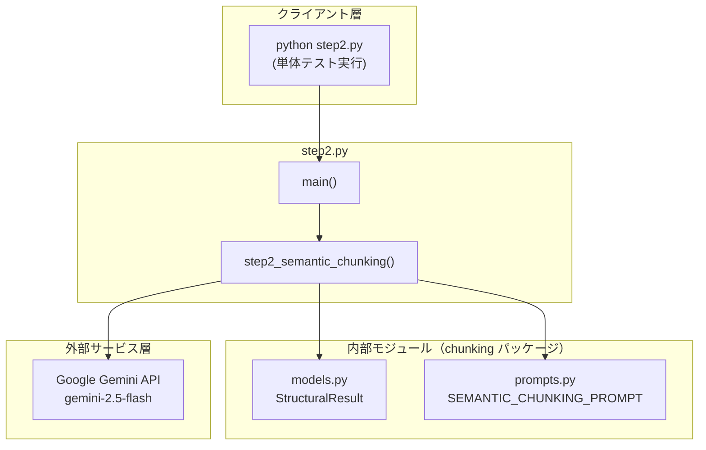
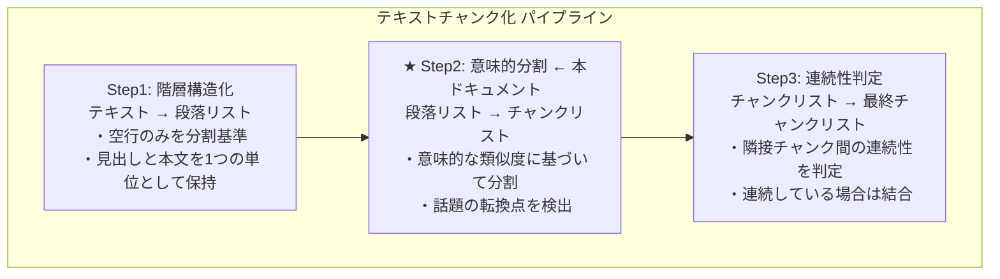
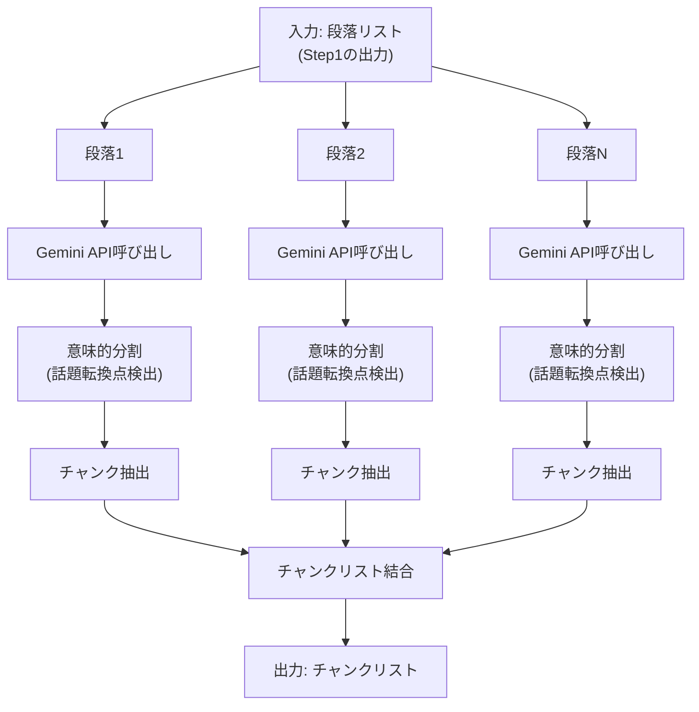
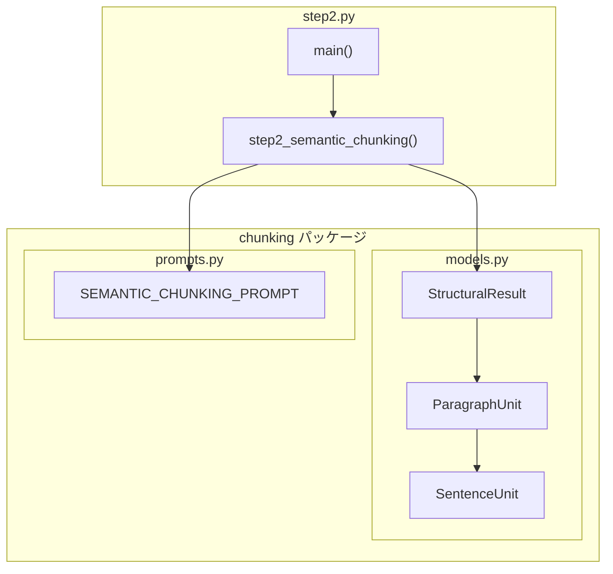
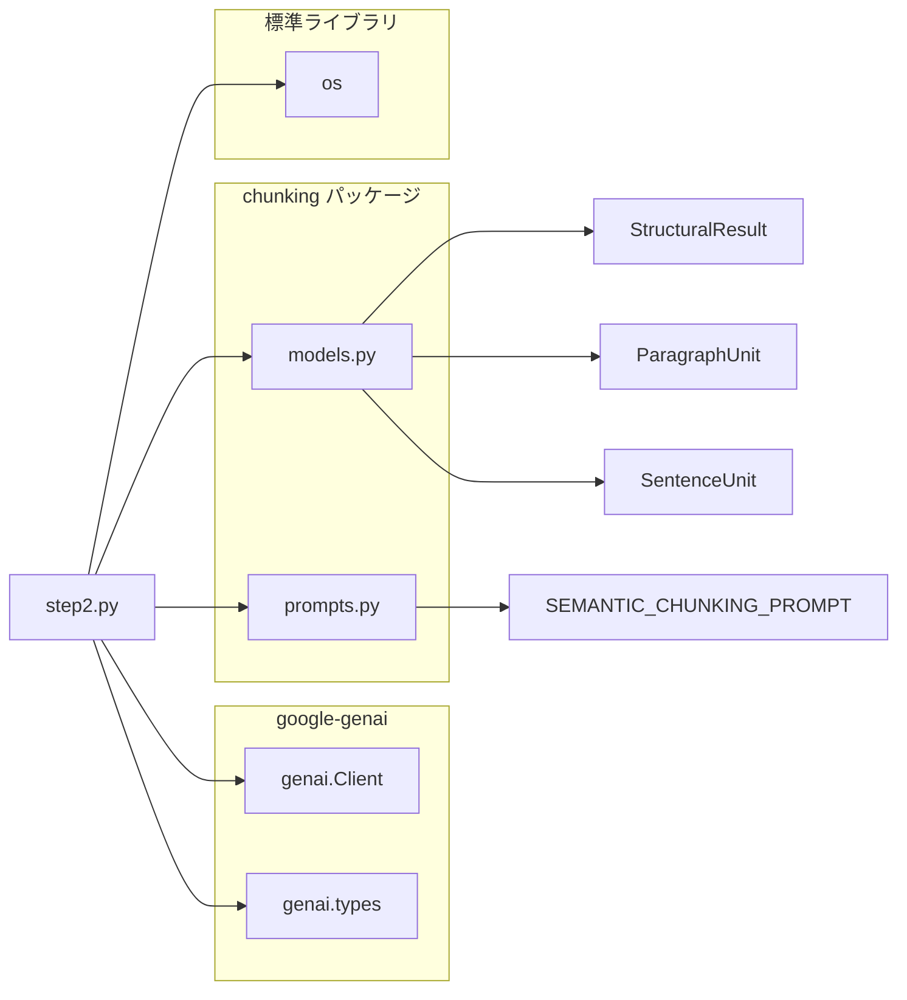

# step2.py - 意味的分割（Semantic Chunking）ドキュメント

**Version 1.0** | 最終更新: 2025-01-29

---

本番のチャンク分割は、「csv_text_to_chunks_text_csv.py」のコマンドです。
ここは、上記コマンドのRAGの[チャンク分割]の4つのステージのStep2（意味的分割）の説明です。
Step2（意味的分割）はLLMのAPI(Gemini)を利用して意味的分割を実施します。

#### [超重要ポイント]
- LLMで実行するので、step2でもプロンプトが機能、性能を決定づけます。
```
# プロンプト 2: 意味的分割
SEMANTIC_CHUNKING_PROMPT =
```

- Step1（階層構造化）
- Step2（意味的分割） <------- ここ
- Step3（文脈連続性チェック）
- 非同期・並列処理

##### 全ソースは： GitHubにあります。手元にcloneして確認してください。

- URL: https://github.com/nakashima2toshio/gemini_grace_agent

---

## 📋 目次

1. [概要](#概要)
2. [アーキテクチャ構成図](#1-アーキテクチャ構成図)
3. [モジュール構成図](#2-モジュール構成図)
4. [クラス・関数一覧表](#3-クラス関数一覧表)
5. [クラス・関数 IPO詳細](#4-クラス関数-ipo詳細)
6. [設定・定数](#5-設定定数)
7. [使用例](#6-使用例)
8. [エクスポート](#7-エクスポート)
9. [変更履歴](#8-変更履歴)
10. [付録A: 依存関係図](#付録a-依存関係図)
11. [付録B: Step2の方式詳細](#付録b-step2の方式詳細)
12. [付録C: 具体例とテストデータ](#付録c-具体例とテストデータ)
13. [付録D: 重要な設計判断](#付録d-重要な設計判断)

---

## 概要

`step2.py`は、RAGシステムにおけるセマンティックチャンキングの第2段階「意味的分割」を**単体で確認**するためのテストプログラムです。段落を意味的な類似度に基づいて再構成し、話題の転換点で分割します。形式的な改行ではなく、意味のまとまりで分割することが特徴です。

本番のチャンク分割は `csv_text_to_chunks_text_csv.py` で実行されますが、本プログラムはStep2の動作を独立して検証するために作成されました。

### 主な責務

- 段落を意味的な類似度に基づいて再構成
- 話題の転換点を検出して分割
- 章の変わり目（第1章→第2章）での分割
- 形式的な改行を無視した意味優先の分割
- Step3（連続性判定）への入力データ生成

### 主要機能一覧

| 機能 | 説明 |
|------|------|
| `step2_semantic_chunking()` | 段落を意味的なチャンクに分割（Step2のコア機能） |
| `main()` | テスト実行用のメイン関数 |

### 3段階処理における位置づけ

| ステップ | 名称 | 入力 | 出力 | 本ドキュメント |
|:--------:|------|------|------|:--------------:|
| Step1 | 階層構造化 | テキスト | 段落リスト | - |
| **Step2** | 意味的分割 | 段落リスト | チャンクリスト | ★ |
| Step3 | 連続性判定 | チャンクリスト | 最終チャンクリスト | - |

### Step1との違い

| 項目 | Step1（階層構造化） | Step2（意味的分割） |
|------|---------------------|---------------------|
| 分割基準 | 物理的構造（空行のみ） | 意味的な類似度（話題の転換） |
| 改行の扱い | 空行（`\n\n`）を尊重 | 改行を無視（意味優先） |
| 章の扱い | 空行がなければ分割しない | 章の変わり目で分割 |
| 目的 | 見出しと本文を保持 | 話題の混在を解消 |

---

## 1. アーキテクチャ構成図

### 1.1 システム全体構成



### 1.2 3段階処理における Step2 の位置づけ



### 1.3 データフロー

| 段階 | 内容 |
|:---:|------|
| **入力（Step1の出力: 5段落）** | 段落1:`"RAG（定義+利点）"`<br>段落2:`"セマンティックチャンキング（用語定義+用語使用）"`<br>段落3:`"京都+沖縄（観光情報）"`<br>段落4:`"ベクトルDB（定義+活用）"`<br>段落5:`"第1章+第2章（章構造）"` |
| ↓ | |
| **Step2: 意味的分割** | 1. 各段落をLLMに送信<br>2. 意味的な転換点を検出<br>3. 話題ごとにチャンクを分割<br>4. 結果を結合 |
| ↓ | |
| **出力（10チャンク）** | チャンク1:`"RAG定義"`<br>チャンク2:`"RAG利点"` ← 前方依存<br>チャンク3:`"用語定義"`<br>チャンク4:`"用語使用"` ← 後方依存<br>チャンク5:`"京都観光"`<br>チャンク6:`"沖縄観光"` ← 独立<br>チャンク7:`"ベクトルDB定義"`<br>チャンク8:`"ベクトルDB活用"` ← 後方依存<br>チャンク9:`"第1章"`<br>チャンク10:`"第2章"` ← 章構造 |

### 1.4 処理の流れ図



---

## 2. モジュール構成図

### 2.1 内部モジュール構成



### 2.2 外部依存関係

| ライブラリ | バージョン | 用途 |
|-----------|-----------|------|
| `google-genai` | >= 0.1.0 | Gemini APIクライアント |

### 2.3 標準ライブラリ依存

| モジュール | 用途 |
|-----------|------|
| `os` | 環境変数（`GOOGLE_API_KEY`）の取得 |

### 2.4 内部依存モジュール

| モジュール | インポート | 用途 |
|-----------|-----------|------|
| `chunking.models` | `StructuralResult` | LLMレスポンスのPydanticスキーマ |
| `chunking.prompts` | `SEMANTIC_CHUNKING_PROMPT` | 意味的分割用プロンプト |

---

## 3. クラス・関数一覧表

### 3.1 関数一覧

| 関数名 | 概要 |
|-------|------|
| `step2_semantic_chunking(paragraphs, api_key)` | 段落を意味的なチャンクに分割（Step2のコア機能） |
| `main()` | テスト実行用のメイン関数 |

---

## 4. クラス・関数 IPO詳細

### 4.1 `step2_semantic_chunking`

**概要**: 段落を意味的な類似度に基づいてチャンクに分割する。LLM（Gemini API）を使用して話題の転換点を検出。

```python
def step2_semantic_chunking(
    paragraphs: list[str],
    api_key: str
) -> list[str]
```

| パラメータ | 型 | デフォルト | 説明 |
|------------|------|-----------|------|
| `paragraphs` | list[str] | - | 段落のリスト（Step1の出力） |
| `api_key` | str | - | Gemini API キー |

| 項目 | 内容 |
|------|------|
| **Input** | `paragraphs: list[str]`, `api_key: str` |
| **Process** | 1. `genai.Client`を初期化<br>2. 各段落に`SEMANTIC_CHUNKING_PROMPT`を適用<br>3. Gemini API呼び出し（`response_mime_type="application/json"`）<br>4. `StructuralResult.model_validate_json()`でパース<br>5. 各チャンクの`full_text`を抽出してリストに追加 |
| **Output** | `list[str]`: 意味的に分割されたチャンクのリスト |

**戻り値例**:

```python
[
    # 段落1から生成（2チャンク）
    "RAG（Retrieval-Augmented Generation）は、検索と生成を組み合わせた手法です。\n"
    "外部知識ベースから関連情報を取得し、それをLLMのコンテキストとして渡します。\n"
    "2020年にFacebookが発表し、現在では多くのシステムで採用されています。",

    "この手法の最大の利点は、最新情報を反映できることです。\n"
    "それにより、LLM単体では対応できない時事的な質問にも回答可能になります。\n"
    "また、ハルシネーションを軽減する効果も報告されています。",

    # ... 続く（合計10チャンク）
]
```

**コア処理の詳細**:

```python
def step2_semantic_chunking(paragraphs: list[str], api_key: str) -> list[str]:
    """
    段落を意味的なチャンクに分割する（Step2のコア機能）

    Args:
        paragraphs: 段落のリスト（Step1の出力）
        api_key: Gemini API キー

    Returns:
        意味的に分割されたチャンクのリスト
    """
    # ① Gemini APIクライアントを初期化
    client = genai.Client(api_key=api_key)

    print(f"入力: {len(paragraphs)}段落")

    chunks = []

    # ② 各段落を処理
    for i, para in enumerate(paragraphs):
        print(f"段落 {i + 1}/{len(paragraphs)} 処理中...")

        # ③ プロンプト作成（プロンプト + 入力テキスト）
        prompt = f"{SEMANTIC_CHUNKING_PROMPT}\n\n【入力テキスト】\n{para}"

        # ④ Gemini API 呼び出し（同期）
        response = client.models.generate_content(
            model="gemini-2.5-flash",
            contents=prompt,
            config=types.GenerateContentConfig(
                response_mime_type="application/json",
                response_schema=StructuralResult
            )
        )

        # ⑤ レスポンスをパース
        result = StructuralResult.model_validate_json(response.text)

        # ⑥ チャンクを抽出（full_textプロパティで改行結合）
        for chunk_para in result.paragraphs:
            chunks.append(chunk_para.full_text)

        print(f"  → {len(result.paragraphs)}個のチャンクに分割")

    return chunks
```

```python
# 使用例
import os
from step2 import step2_semantic_chunking

api_key = os.getenv("GOOGLE_API_KEY")

# Step1の出力（段落リスト）
paragraphs = [
    "RAG（Retrieval-Augmented Generation）は...",
    "セマンティックチャンキングは...",
    # ...
]

# Step2実行
chunks = step2_semantic_chunking(paragraphs, api_key)

print(f"チャンク数: {len(chunks)}")
for i, chunk in enumerate(chunks, 1):
    print(f"チャンク{i}: {chunk[:50]}...")
```

---

### 4.2 `main`

**概要**: Step2の動作を確認するためのテスト実行関数。テスト用段落（5段落）を使用して`step2_semantic_chunking()`を実行し、結果を検証。

```python
def main() -> None
```

| 項目 | 内容 |
|------|------|
| **Input** | なし（環境変数`GOOGLE_API_KEY`を使用） |
| **Process** | 1. 環境変数から`GOOGLE_API_KEY`を取得<br>2. テスト用段落（5段落構成）を準備<br>3. `step2_semantic_chunking()`を呼び出し<br>4. 結果を表示・検証（期待値: 10チャンク）<br>5. Step3との連携情報を表示 |
| **Output** | `None`（標準出力に結果を表示） |

```python
# 実行方法
if __name__ == "__main__":
    main()
```

---

## 5. 設定・定数

### 5.1 デフォルト設定値

| 設定 | デフォルト値 | 説明 |
|-----|-------------|------|
| `model` | "gemini-2.5-flash" | 使用するGeminiモデル |

### 5.2 Geminiモデルの比較

| モデル | Input (1M tokens) | Output (1M tokens) | 特性 |
|--------|-------------------|--------------------|----|
| **gemini-2.5-flash** | **$0.075** | **$0.30** | 【最安】大量処理に最適 |
| gemini-3-flash | $0.15 | $0.60 | 【バランス】複雑な判断向け |
| gemini-3-pro | $2.00 | $12.00 | 【高性能】最終推論向け |

### 5.3 環境変数

| 環境変数 | 必須 | 説明 |
|---------|:----:|------|
| `GOOGLE_API_KEY` | ✅ | Gemini APIキー |

### 5.4 分割ルール

| 区分 | ルール |
|:----:|--------|
| ✅ **分割する場合** | 話題の転換点（意味の類似度がしきい値を下回る） |
| ✅ **分割する場合** | 章の変わり目（第1章→第2章） |
| ❌ **分割しない場合** | 文脈や意味が続いている場合（改行があっても） |
| ❌ **分割しない場合** | 同じトピックの説明が続いている場合 |

---

## 6. 使用例

### 6.1 基本的な使用方法

```bash
# 環境変数を設定
export GOOGLE_API_KEY='your-api-key'

# 実行
python step2.py
```

### 6.2 Pythonコードからの使用

```python
import os
from step2 import step2_semantic_chunking

# APIキー取得
api_key = os.getenv("GOOGLE_API_KEY")

# Step1の出力（段落リスト）を準備
paragraphs = [
    """RAG（Retrieval-Augmented Generation）は、検索と生成を組み合わせた手法です。
外部知識ベースから関連情報を取得し、それをLLMのコンテキストとして渡します。
この手法の最大の利点は、最新情報を反映できることです。
それにより、LLM単体では対応できない時事的な質問にも回答可能になります。""",

    """セマンティックチャンキングは、テキストを意味単位で分割する技術です。
「チャンク」とは、分割されたテキストの各ブロックを指します。
チャンクサイズは検索精度に大きく影響します。
小さすぎると文脈が失われ、埋め込みの品質が低下します。"""
]

# Step2実行
chunks = step2_semantic_chunking(paragraphs, api_key)

# 結果確認
print(f"段落数: {len(paragraphs)} → チャンク数: {len(chunks)}")
for i, chunk in enumerate(chunks, 1):
    print(f"\n--- チャンク{i} ---")
    print(chunk)
```

### 6.3 Step1・Step3との連携確認

Step1→Step2→Step3の統合テストは `check_async.py` で実行できます。

```bash
# Step1〜Step3の通しテスト
python check_async.py
```

---

## 7. エクスポート

`step2.py` は**確認用プログラム**であり、`chunking/__init__.py` からはエクスポートされていません。

本番処理では以下を使用してください：

```python
# 本番用（csv_text_to_chunks_text_csv.py）
from chunking import chunks_all_async
```

---

## 8. 変更履歴

| バージョン | 変更内容 |
|-----------|---------|
| 1.0 | 初版作成（Step2単体確認用プログラム） |

---

## 付録A: 依存関係図



---

## 付録B: Step2の方式詳細

### B.1 目的

**意味的な類似度に基づいた分割**を行います。

Step1では物理的な構造（空行による段落分け）で分割しましたが、同じ段落内でも話題が変わることがあります。Step2では、LLMを活用して**話題の転換点**を検出し、意味的なまとまりごとにチャンクを分割します。

### B.2 アルゴリズム

| ステップ | 処理内容 |
|:--------:|----------|
| 1 | Step1の出力（段落リスト）を入力として受け取る |
| 2 | 各段落をLLM（Gemini API）に送信<br>・JSON形式（`response_mime_type="application/json"`）<br>・Pydanticスキーマ（`response_schema=StructuralResult`） |
| 3 | LLMが以下のロジックで分割:<br>・テキストを文脈に沿って読み進める<br>・隣り合う文同士の「意味的な距離」を分析<br>・意味の類似度が高い → 同じブロックに結合<br>・話題の転換点を検出 → ブロックを分割 |
| 4 | 全段落の結果を結合してチャンクリストを生成 |

### B.3 LLMへのプロンプト

`chunking/prompts.py` で定義されている `SEMANTIC_CHUNKING_PROMPT`:

```python
SEMANTIC_CHUNKING_PROMPT = """
あなたは「セマンティック・チャンキング（意味的分割）エンジン」です。
入力されたテキストを、形式的な段落や改行ではなく、「意味のまとまり（トピック）」に基づいて再構成してください。

【処理ロジック: 仮想的なベクトル類似度判定】
1. テキストを文脈に沿って読み進め、隣り合う文同士の「意味的な距離」を分析してください。
2. 文の内容が連続している、または高い関連性を持つ場合は、同じブロック（Paragraph）に結合してください。
3. **「話題の転換点」**（意味の類似度がしきい値を下回るような、話題の切り替わり）を見つけたら、そこでブロックを分割してください。

【分割の基準】
- **文字数や物理的な改行（\\n）は無視すること**。
- たとえ改行がなくても、話題が大きく変われば分割する。
- たとえ改行があっても、文脈や意味が続いているなら分割しない。
- **章の変わり目（例: 第1章 → 第2章）は、話題の大きな転換点として扱い、分割すること。**

【出力要件】
- 意味的に凝集したブロックを1つの Paragraph と定義し、その中の文を sentences リストに格納して出力すること。
- 元のテキストを一言一句変更せず保持すること。
"""
```

### B.4 なぜ Step2 が必要なのか？

Step1だけでは解決できない問題があります：

| 問題 | 具体例 | Step2 の解決策 |
|------|--------|---------------|
| 話題の混在 | 機械学習の説明 → ラーメンの話 → 機械学習に戻る | 話題ごとに分割 |
| 章構造の分割 | 第1章と第2章が同じ段落に | 章の変わり目で分離 |
| 形式的分割の限界 | 改行がなくても話題は変わりうる | 改行を無視して意味で判断 |

### B.5 意味的分割のイメージ

**【Step1の出力（1つの段落）】**

| 内容 | 備考 |
|------|------|
| 強化学習は、エージェントが環境と相互作用しながら学習する手法です。 | |
| 報酬を最大化するように行動を学習していきます。 | |
| ゲームAIやロボット制御などに応用されています。 | |
| ところで、昨日食べたラーメンが美味しかったです。 | ← 話題転換！ |
| 次回も同じ店に行きたいと思います。 | |
| 話を戻すと、深層強化学習はDeep Learningと強化学習を... | ← 話題復帰 |

↓ **Step2: 意味的分割**

| チャンク | 内容 |
|:-------:|------|
| チャンク1 | 強化学習について<br>「強化学習は、エージェントが環境と相互作用しながら...」 |
| チャンク2 | ラーメンの話（別トピック）<br>「ところで、昨日食べたラーメンが美味しかったです...」 |
| チャンク3 | 深層強化学習について<br>「話を戻すと、深層強化学習はDeep Learningと...」 |

### B.6 API呼び出しの詳細

```python
response = client.models.generate_content(
    model="gemini-2.5-flash",           # モデル名
    contents=prompt,                     # プロンプト
    config=types.GenerateContentConfig(
        response_mime_type="application/json",  # JSON形式を指定
        response_schema=StructuralResult        # Pydanticスキーマを指定
    )
)
```

| パラメータ | 値 | 説明 |
|------------|-----|------|
| `model` | `"gemini-2.5-flash"` | 最新の安定版、高いレート制限とパフォーマンス |
| `response_mime_type` | `"application/json"` | JSON形式のレスポンスを要求 |
| `response_schema` | `StructuralResult` | Pydanticモデルでスキーマを指定 |

---

## 付録C: 具体例とテストデータ

### C.1 テスト用入力段落

`main()` 関数内で定義されているテストデータ（Step1の出力を想定）：

| 段落 | 内容 | Step2での分割 | 備考 |
|:----:|------|--------------|------|
| 段落1 | RAGの説明（定義+利点） | 2チャンク | 前方依存テスト用 |
| 段落2 | チャンキング説明（用語定義+用語使用） | 2チャンク | 後方依存テスト用 |
| 段落3 | 観光情報（京都+沖縄） | 2チャンク | 独立判定テスト用 |
| 段落4 | ベクトルDB説明（定義+活用） | 2チャンク | 後方依存テスト用 |
| 段落5 | 章構造（第1章+第2章） | 2チャンク | 章構造テスト用 |

### C.2 段落1の詳細処理例

**【入力（Step1の出力）】**

```
RAG（Retrieval-Augmented Generation）は、検索と生成を組み合わせた手法です。
外部知識ベースから関連情報を取得し、それをLLMのコンテキストとして渡します。
2020年にFacebookが発表し、現在では多くのシステムで採用されています。
この手法の最大の利点は、最新情報を反映できることです。
それにより、LLM単体では対応できない時事的な質問にも回答可能になります。
また、ハルシネーションを軽減する効果も報告されています。
```

↓ **Step2 処理（意味的分割）**

**【LLMのJSON出力】**

```json
{
  "paragraphs": [
    {
      "id": 0,
      "sentences": [
        {"text": "RAG（Retrieval-Augmented Generation）は、検索と生成を組み合わせた手法です。"},
        {"text": "外部知識ベースから関連情報を取得し、それをLLMのコンテキストとして渡します。"},
        {"text": "2020年にFacebookが発表し、現在では多くのシステムで採用されています。"}
      ]
    },
    {
      "id": 1,
      "sentences": [
        {"text": "この手法の最大の利点は、最新情報を反映できることです。"},
        {"text": "それにより、LLM単体では対応できない時事的な質問にも回答可能になります。"},
        {"text": "また、ハルシネーションを軽減する効果も報告されています。"}
      ]
    }
  ]
}
```

**【Step2の出力（段落1から生成されたチャンク）】**

| チャンク | 内容 |
|:-------:|------|
| チャンク1 | **RAGの定義**<br>`"RAG（Retrieval-Augmented Generation）は、検索と生成を組み合わせた手法です。`<br>`外部知識ベースから関連情報を取得し...`<br>`2020年にFacebookが発表し、現在では多くのシステムで採用..."` |
| チャンク2 | **RAGの利点（前方依存：「この手法」「それ」で参照）**<br>`"この手法の最大の利点は、最新情報を反映できることです。`<br>`それにより、LLM単体では対応できない時事的な質問にも...`<br>`また、ハルシネーションを軽減する効果も報告されています。"` |

### C.3 全体の入出力

**【入力】5段落**

| 段落 | 内容 |
|:---:|------|
| 段落1 | RAGの説明（定義+利点） |
| 段落2 | チャンキング説明（用語定義+用語使用） |
| 段落3 | 観光情報（京都+沖縄） |
| 段落4 | ベクトルDB説明（定義+活用） |
| 段落5 | 章構造（第1章+第2章） |

↓ **Step2 処理**

**【出力】10チャンク（各段落が2つに分割）**

| チャンク | 内容 | 元の段落 |
|:--------:|------|:--------:|
| チャンク1 | RAGの定義 | 段落1 |
| チャンク2 | RAGの利点（前方依存） | 段落1 |
| チャンク3 | 用語定義 | 段落2 |
| チャンク4 | 用語使用（後方依存） | 段落2 |
| チャンク5 | 京都観光 | 段落3 |
| チャンク6 | 沖縄観光（独立） | 段落3 |
| チャンク7 | ベクトルDB定義 | 段落4 |
| チャンク8 | ベクトルDB活用（後方依存） | 段落4 |
| チャンク9 | 第1章 機械学習入門 | 段落5 |
| チャンク10 | 第2章 深層学習の基礎（章構造） | 段落5 |

### C.4 検証ポイント

step2.py を実行した際に確認すべきポイント：

| チェック項目 | 期待結果 |
|-------------|----------|
| チャンク数 | 5段落 → 10チャンクに分割 |
| 意味的凝集 | 同じトピックの文が同じチャンクに |
| 話題転換の検出 | 各段落が意味的な境界で2つに分割 |
| 章の分割 | 第1章と第2章が別チャンクに |
| テキストの保持 | 省略や要約なく、原文が保持される |

### C.5 Step3との連携（テストデータの流れ）

**【Step1】1テキスト → 5段落**

| 段落 | 内容 |
|:---:|------|
| 段落1 | RAGの説明（定義+利点） |
| 段落2 | セマンティックチャンキングの説明（用語定義+用語使用） |
| 段落3 | 観光情報（京都+沖縄） |
| 段落4 | ベクトルDBの説明（定義+活用） |
| 段落5 | 章構造（第1章+第2章） |

**【Step2】5段落 → 10チャンク**

| 入力 | 出力 |
|------|------|
| 段落1 | チャンク1（RAG定義）+ チャンク2（RAG利点） |
| 段落2 | チャンク3（用語定義）+ チャンク4（用語使用） |
| 段落3 | チャンク5（京都観光）+ チャンク6（沖縄観光） |
| 段落4 | チャンク7（ベクトルDB定義）+ チャンク8（活用） |
| 段落5 | チャンク9（第1章）+ チャンク10（第2章） |

**【Step3】10チャンク → 7チャンク**

| 処理 | 結果 | 理由 |
|------|------|------|
| チャンク1+2 | 結合 | 前方依存 |
| チャンク3+4 | 結合 | 後方依存 |
| チャンク5 | 独立 | |
| チャンク6 | 独立 | |
| チャンク7+8 | 結合 | 後方依存 |
| チャンク9 | 独立 | |
| チャンク10 | 独立 | |

### C.6 Step3での判定詳細

| ペア | 判定 | 理由 |
|------|------|------|
| チャンク1→2 | **結合（True）** | 「この手法」「それ」が前のチャンクを参照（前方依存） |
| チャンク2→3 | 分離（False） | 話題転換（RAG → チャンキング） |
| チャンク3→4 | **結合（True）** | 「チャンク」「埋め込み」が未定義のまま使用（後方依存） |
| チャンク4→5 | 分離（False） | 話題転換（チャンキング → 京都観光） |
| チャンク5→6 | 分離（False） | 話題は「観光」だが、単独で完全に理解可能（独立） |
| チャンク6→7 | 分離（False） | 話題転換（沖縄観光 → ベクトルDB） |
| チャンク7→8 | **結合（True）** | 「ANN」「ベクトルDB」を説明なしで使用（後方依存） |
| チャンク8→9 | 分離（False） | 話題転換（ベクトルDB → 機械学習） |
| チャンク9→10 | 分離（False） | 章が変わり、単独で理解可能（章構造） |

---

## 付録D: 重要な設計判断

### D.1 なぜStep2で章を分割するのか？

| 方式 | Step1での処理 | Step2での処理 | 結果 |
|------|--------------|--------------|------|
| ✅ 採用方式 | 空行がなければ第1章と第2章を同じ段落に | 章の変わり目で分割 | 章構造を正しく認識 |
| ❌ 代替案 | 章の変わり目で分割 | なし | Step2で章の文脈を失う |

**理由**: Step1で空行のみで分割し、章の判断をStep2に委ねることで、章構造の情報を保持したまま意味的な分割が可能になります。

### D.2 1段落が複数チャンクになる理由

Step2では、1つの段落が複数のチャンクに分割される可能性があります：

| ケース | 例 | 結果 |
|--------|-----|------|
| 話題の転換 | RAGの定義 → RAGの利点 | 2チャンクに分割 |
| 章の変わり目 | 第1章 → 第2章 | 2チャンクに分割 |
| 単一トピック | 京都観光のみ | 1チャンクのまま |

### D.3 Step1との役割分担

| 処理 | Step1 | Step2 |
|------|-------|-------|
| 空行での分割 | ✅ 実施 | - |
| 章での分割 | ❌ 実施しない | ✅ 実施 |
| 話題での分割 | ❌ 実施しない | ✅ 実施 |
| 見出しの保持 | ✅ 本文と一緒に保持 | ✅ チャンク内に保持 |

---

## まとめ

### Step2 の役割

| 項目 | 内容 |
|------|------|
| 入力 | 段落リスト（Step1の出力） |
| 出力 | チャンクリスト（数が増える可能性） |
| 目的 | 意味的な類似度に基づいた分割 |
| 方式 | LLM（Gemini API）による話題転換検出 |

### 重要なポイント

1. **意味優先**: 物理的な改行ではなく、意味的なまとまりで分割
2. **話題転換の検出**: 定義→利点、用語定義→用語使用 などの転換点を認識
3. **章構造の分割**: 第1章→第2章 のような章の変わり目で分割
4. **チャンク数の増加**: 1段落が複数チャンクに分割される可能性
5. **テキストの完全保持**: 省略や要約は行わない

### 次のステップ

Step2 の出力（チャンクリスト）は、**Step3（連続性判定）** の入力として使用されます。
Step3 では、隣接するチャンク間の連続性を判定し、以下のパターンで結合/分離を行います：

| パターン | 説明 | 例 |
|----------|------|-----|
| **前方依存** | 「この」「それ」等の指示語で前を参照 → 結合 | チャンク2の「この手法」「それ」 |
| **後方依存** | 専門用語が未定義のまま使用 → 結合 | チャンク4の「チャンク」「埋め込み」 |
| **独立判定** | 話題は同じでも単独で理解可能 → 分離 | チャンク5（京都）とチャンク6（沖縄） |
| **章構造** | 章が変わった場合 → 分離 | チャンク9（第1章）とチャンク10（第2章） |
