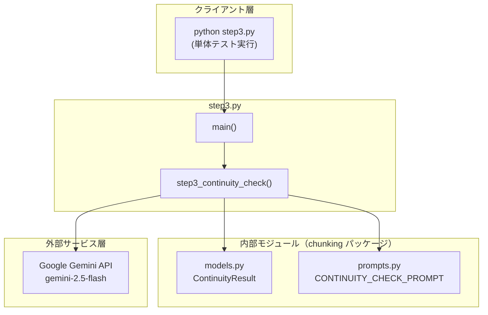
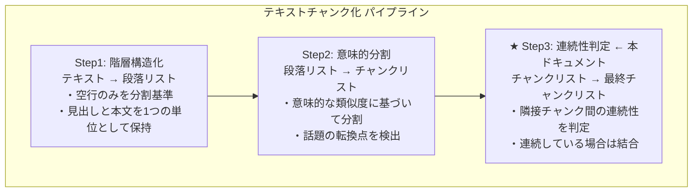
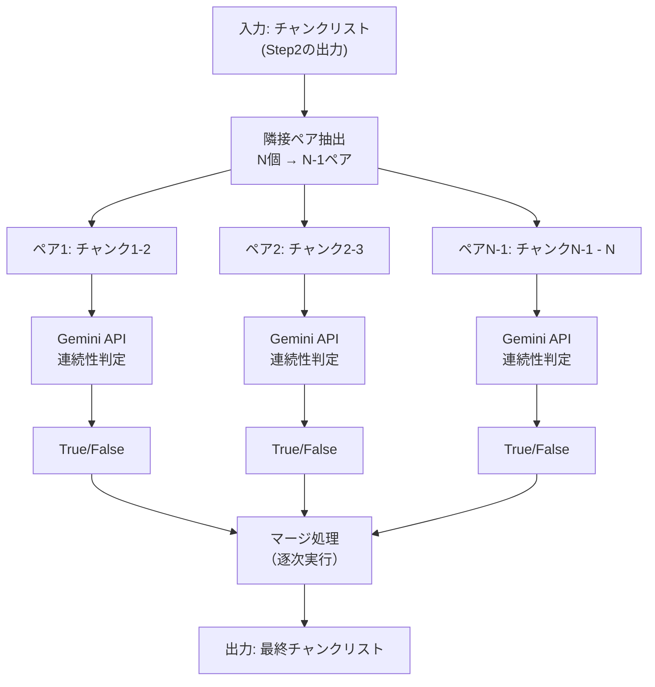
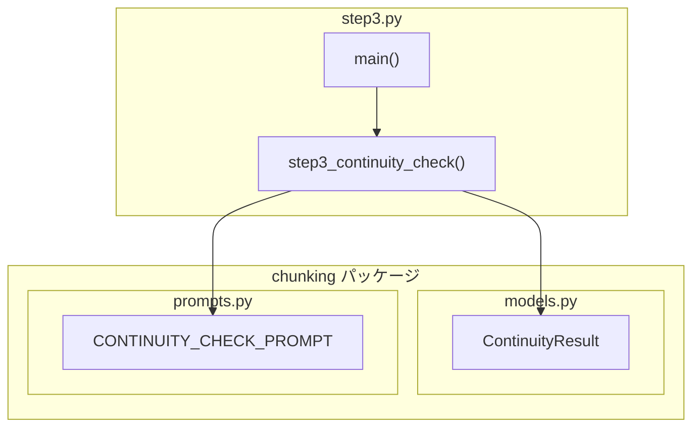
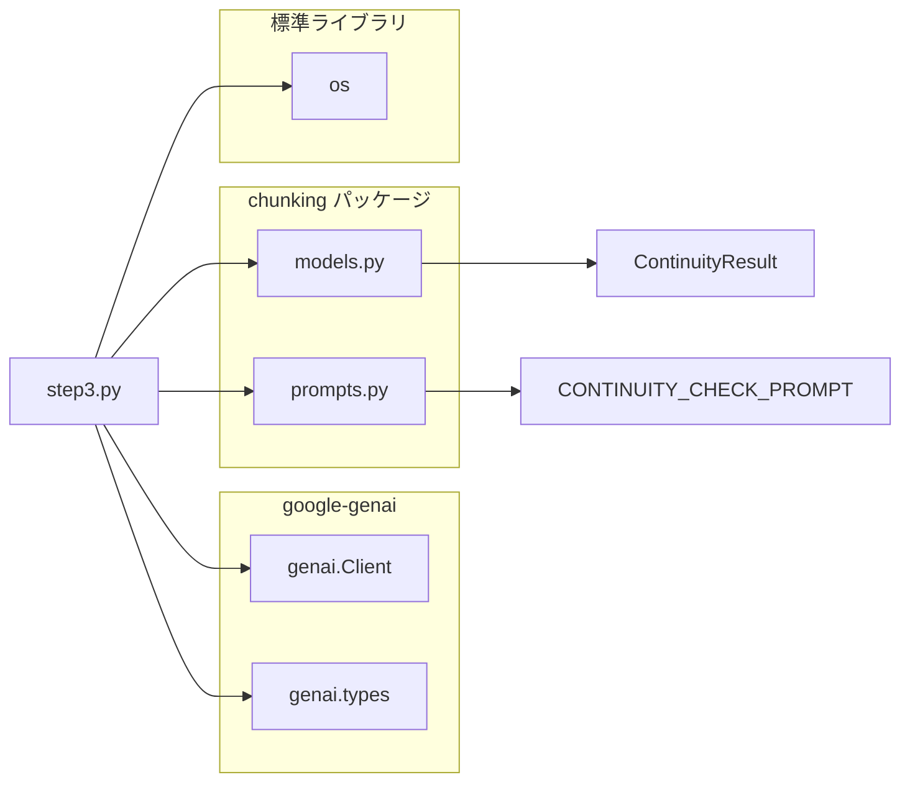
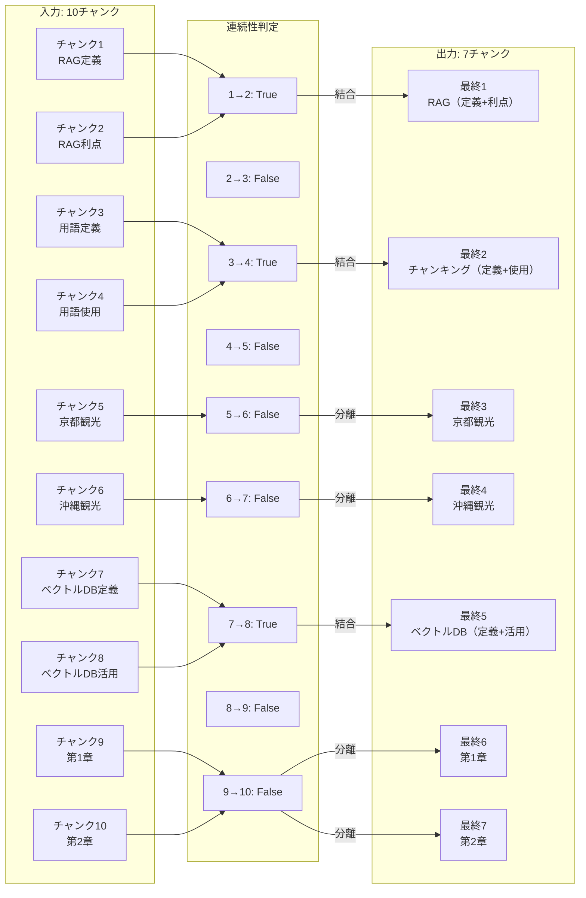

# step3.py - 連続性判定（Continuity Check）ドキュメント

**Version 1.0** | 最終更新: 2025-01-29

---

本番チャンク分割は、「csv_text_to_chunks_text_csv.py」のコマンドです。
ここでは、上記コマンドのRAGの[チャンク分割]の4つのステージのStep3（文脈連続性チェック）の説明をします。

- Step1（階層構造化）
- Step2（意味的分割）
- Step3（文脈連続性チェック） <------- ここ
- 非同期・並列処理

#### Step3の処理：Step3では依存性、独立性、構造を解決します。
- [超重要ポイント]
- この処理はLLMで実行されるので、プロンプト（prompts.py）が最重要です。
```text
# プロンプト 3: 文脈連続性チェック
CONTINUITY_CHECK_PROMPT =
```

| パターン | 説明 | 例 |
|----------|------|-----|
| **前方依存** | 「この」「それ」等の指示語で前を参照 → 結合 | チャンク2の「この手法」「それ」 |
| **後方依存** | 専門用語が未定義のまま使用 → 結合 | チャンク4の「チャンク」「埋め込み」 |
| **独立判定** | 話題は同じでも単独で理解可能 → 分離 | チャンク5（京都）とチャンク6（沖縄） |
| **章構造** | 章が変わった場合 → 分離 | チャンク9（第1章）とチャンク10（第2章） |

##### 全ソースは： GitHubにあります。

- URL: https://github.com/nakashima2toshio/gemini_grace_agent

---

## 📋 目次

1. [概要](#概要)
2. [アーキテクチャ構成図](#1-アーキテクチャ構成図)
3. [モジュール構成図](#2-モジュール構成図)
4. [クラス・関数一覧表](#3-クラス関数一覧表)
5. [クラス・関数 IPO詳細](#4-クラス関数-ipo詳細)
6. [設定・定数](#5-設定定数)
7. [使用例](#6-使用例)
8. [エクスポート](#7-エクスポート)
9. [変更履歴](#8-変更履歴)
10. [付録A: 依存関係図](#付録a-依存関係図)
11. [付録B: Step3の方式詳細](#付録b-step3の方式詳細)
12. [付録C: 具体例とテストデータ](#付録c-具体例とテストデータ)
13. [付録D: 重要な設計判断](#付録d-重要な設計判断)

---

## 概要

`step3.py`は、RAGシステムにおけるセマンティックチャンキングの第3段階「連続性判定」を**単体で確認**するためのテストプログラムです。隣接するチャンク間の文脈連続性を判定し、連続している場合は結合、非連続の場合は分離します。

本番のチャンク分割は `csv_text_to_chunks_text_csv.py` で実行されますが、本プログラムはStep3の動作を独立して検証するために作成されました。

### 主な責務

- 隣接チャンク間の文脈連続性を判定
- 連続している場合は結合（過分割の修正）
- 非連続の場合は分離（独立性の保持）
- 前方依存・後方依存・独立判定・章構造の4パターンを検出
- 最終的なチャンクリストの生成

### 主要機能一覧

| 機能 | 説明 |
|------|------|
| `step3_continuity_check()` | 隣接チャンク間の連続性をチェックし結合/分離（Step3のコア機能） |
| `main()` | テスト実行用のメイン関数 |

### 3段階処理における位置づけ

| ステップ | 名称 | 入力 | 出力 | 本ドキュメント |
|:--------:|------|------|------|:--------------:|
| Step1 | 階層構造化 | テキスト | 段落リスト | - |
| Step2 | 意味的分割 | 段落リスト | チャンクリスト | - |
| **Step3** | 連続性判定 | チャンクリスト | 最終チャンクリスト | ★ |

### Step2との違い

| 項目 | Step2（意味的分割） | Step3（連続性判定） |
|------|---------------------|---------------------|
| 処理方向 | 分割（1→多） | 結合（多→少） |
| 判定対象 | 段落内の文同士 | チャンク間のペア |
| 出力の変化 | チャンク数が増加 | チャンク数が減少 |
| 目的 | 話題の分離 | 過分割の修正 |

---

## 1. アーキテクチャ構成図

### 1.1 システム全体構成



### 1.2 3段階処理における Step3 の位置づけ



### 1.3 データフロー

| 段階 | 内容 |
|:---:|------|
| **入力（Step2の出力: 10チャンク）** | チャンク1: RAGの定義<br>チャンク2: RAGの利点 ← 前方依存（結合）<br>チャンク3: 用語定義<br>チャンク4: 用語使用 ← 後方依存（結合）<br>チャンク5: 京都観光<br>チャンク6: 沖縄観光 ← 独立（分離）<br>チャンク7: ベクトルDB定義<br>チャンク8: ベクトルDB活用 ← 後方依存（結合）<br>チャンク9: 第1章 機械学習入門<br>チャンク10: 第2章 深層学習の基礎 ← 章構造（分離） |
| ↓ | |
| **Step3: 連続性判定** | 1. 隣接ペアごとに連続性を判定<br>2. 連続 → 結合 / 非連続 → 分離<br>3. 最終チャンクリストを生成 |
| ↓ | |
| **出力（7チャンク）** | 最終1: RAG（定義+利点）← 前方依存で結合<br>最終2: チャンキング（定義+使用）← 後方依存で結合<br>最終3: 京都観光 ← 独立<br>最終4: 沖縄観光 ← 独立<br>最終5: ベクトルDB（定義+活用）← 後方依存で結合<br>最終6: 第1章 機械学習入門 ← 独立<br>最終7: 第2章 深層学習の基礎 ← 独立 |

### 1.4 処理の流れ図



---

## 2. モジュール構成図

### 2.1 内部モジュール構成



### 2.2 外部依存関係

| ライブラリ | バージョン | 用途 |
|-----------|-----------|------|
| `google-genai` | >= 0.1.0 | Gemini APIクライアント |

### 2.3 標準ライブラリ依存

| モジュール | 用途 |
|-----------|------|
| `os` | 環境変数（`GOOGLE_API_KEY`）の取得 |

### 2.4 内部依存モジュール

| モジュール | インポート | 用途 |
|-----------|-----------|------|
| `chunking.models` | `ContinuityResult` | LLMレスポンスのPydanticスキーマ（bool値） |
| `chunking.prompts` | `CONTINUITY_CHECK_PROMPT` | 連続性判定用プロンプト |

---

## 3. クラス・関数一覧表

### 3.1 関数一覧

| 関数名 | 概要 |
|-------|------|
| `step3_continuity_check(chunks, api_key)` | 隣接チャンク間の連続性をチェックし結合/分離（Step3のコア機能） |
| `main()` | テスト実行用のメイン関数 |

---

## 4. クラス・関数 IPO詳細

### 4.1 `step3_continuity_check`

**概要**: 隣接するチャンク間の文脈連続性を判定し、連続している場合は結合、非連続の場合は分離する。LLM（Gemini API）を使用して判定。

```python
def step3_continuity_check(
    chunks: list[str],
    api_key: str
) -> list[str]
```

| パラメータ | 型 | デフォルト | 説明 |
|------------|------|-----------|------|
| `chunks` | list[str] | - | チャンクのリスト（Step2の出力） |
| `api_key` | str | - | Gemini API キー |

| 項目 | 内容 |
|------|------|
| **Input** | `chunks: list[str]`, `api_key: str` |
| **Process** | 1. `genai.Client`を初期化<br>2. チャンク数が1以下の場合はそのまま返却<br>3. 隣接ペアごとに`CONTINUITY_CHECK_PROMPT`を適用<br>4. Gemini API呼び出し（`response_mime_type="application/json"`）<br>5. `ContinuityResult.model_validate_json()`でパース<br>6. `is_connected`フラグをリストに蓄積<br>7. フラグに基づいてマージ処理（True→結合、False→分離） |
| **Output** | `list[str]`: 連続性に基づいて結合/分離された最終チャンクリスト |

**戻り値例**:

```python
[
    # チャンク1+2が結合（前方依存）
    "RAG（Retrieval-Augmented Generation）は、検索と生成を組み合わせた手法です。\n"
    "外部知識ベースから関連情報を取得し、それをLLMのコンテキストとして渡します。\n"
    "2020年にFacebookが発表し、現在では多くのシステムで採用されています。\n\n"
    "この手法の最大の利点は、最新情報を反映できることです。\n"
    "それにより、LLM単体では対応できない時事的な質問にも回答可能になります。\n"
    "また、ハルシネーションを軽減する効果も報告されています。",

    # チャンク3+4が結合（後方依存）
    "セマンティックチャンキングは、テキストを意味単位で分割する技術です。\n"
    "「チャンク」とは、分割されたテキストの各ブロックを指します。\n"
    "「埋め込み」（Embedding）は、テキストを数値ベクトルに変換したものです。\n\n"
    "チャンクサイズは検索精度に大きく影響します。\n"
    "小さすぎると文脈が失われ、埋め込みの品質が低下します。\n"
    "大きすぎると検索ノイズが増加し、関連性の低い情報が混入します。",

    # チャンク5（独立）
    "京都の紅葉は11月中旬から下旬が見頃です。...",

    # チャンク6（独立）
    "沖縄の海は透明度が高く、シュノーケリングに最適です。...",

    # チャンク7+8が結合（後方依存）
    "ベクトルデータベースは、高次元ベクトルを効率的に格納・検索するシステムです。...",

    # チャンク9（独立）
    "第1章 機械学習入門...",

    # チャンク10（独立）
    "第2章 深層学習の基礎..."
]
```

**コア処理の詳細**:

```python
def step3_continuity_check(chunks: list[str], api_key: str) -> list[str]:
    """
    隣接チャンク間の連続性をチェックし結合/分離する（Step3のコア機能）

    Args:
        chunks: チャンクのリスト（Step2の出力）
        api_key: Gemini API キー

    Returns:
        連続性に基づいて結合/分離された最終チャンクリスト
    """
    # ① Gemini APIクライアントを初期化
    client = genai.Client(api_key=api_key)

    print(f"入力: {len(chunks)}チャンク")

    # ② チャンクが1つ以下の場合はそのまま返却
    if len(chunks) <= 1:
        print("チャンクが1つ以下のため、そのまま返します")
        return chunks

    # ③ 隣接ペアの連続性を判定
    continuity_flags = []

    for i in range(len(chunks) - 1):
        print(f"ペア {i + 1}/{len(chunks) - 1} 判定中...")

        # ④ プロンプト作成（前のテキスト + 次のテキスト）
        prompt = f"{CONTINUITY_CHECK_PROMPT}\n\n【前のテキスト】\n{chunks[i]}\n\n【次のテキスト】\n{chunks[i + 1]}"

        # ⑤ Gemini API 呼び出し（同期）
        response = client.models.generate_content(
            model="gemini-2.5-flash",
            contents=prompt,
            config=types.GenerateContentConfig(
                response_mime_type="application/json",
                response_schema=ContinuityResult
            )
        )

        # ⑥ レスポンスをパース
        result = ContinuityResult.model_validate_json(response.text)
        continuity_flags.append(result.is_connected)

        status = "連続 → 結合" if result.is_connected else "非連続 → 分離"
        print(f"  → {status}")

    # ⑦ マージ処理（逐次実行）
    print()
    print("マージ処理...")
    final_chunks = [chunks[0]]

    for i, is_connected in enumerate(continuity_flags):
        if is_connected:
            # 結合: 空行（\n\n）で連結
            final_chunks[-1] += "\n\n" + chunks[i + 1]
            print(f"  チャンク{i} + チャンク{i + 1} → 結合")
        else:
            # 分離: 新しいチャンクとして追加
            final_chunks.append(chunks[i + 1])
            print(f"  チャンク{i + 1} → 新規追加")

    return final_chunks
```

```python
# 使用例
import os
from step3 import step3_continuity_check

api_key = os.getenv("GOOGLE_API_KEY")

# Step2の出力（チャンクリスト）
chunks = [
    "RAG（Retrieval-Augmented Generation）は...",       # チャンク1
    "この手法の最大の利点は...",                        # チャンク2（前方依存）
    "セマンティックチャンキングは...",                  # チャンク3
    "チャンクサイズは検索精度に...",                    # チャンク4（後方依存）
    # ...
]

# Step3実行
final_chunks = step3_continuity_check(chunks, api_key)

print(f"チャンク数: {len(chunks)} → {len(final_chunks)}")
for i, chunk in enumerate(final_chunks, 1):
    print(f"最終チャンク{i}: {chunk[:50]}...")
```

---

### 4.2 `main`

**概要**: Step3の動作を確認するためのテスト実行関数。テスト用チャンク（10チャンク）を使用して`step3_continuity_check()`を実行し、結果を検証。

```python
def main() -> None
```

| 項目 | 内容 |
|------|------|
| **Input** | なし（環境変数`GOOGLE_API_KEY`を使用） |
| **Process** | 1. 環境変数から`GOOGLE_API_KEY`を取得<br>2. テスト用チャンク（10チャンク構成）を準備<br>3. `step3_continuity_check()`を呼び出し<br>4. 結果を表示・検証（期待値: 7チャンク）<br>5. 検証ポイントを表示 |
| **Output** | `None`（標準出力に結果を表示） |

```python
# 実行方法
if __name__ == "__main__":
    main()
```

---

## 5. 設定・定数

### 5.1 デフォルト設定値

| 設定 | デフォルト値 | 説明 |
|-----|-------------|------|
| `model` | "gemini-2.5-flash" | 使用するGeminiモデル |
| 結合時の区切り | `"\n\n"` | 空行で連結して段落構造を保持 |

### 5.2 Geminiモデルの比較

| モデル | Input (1M tokens) | Output (1M tokens) | 特性 |
|--------|-------------------|--------------------|----|
| **gemini-2.5-flash** | **$0.075** | **$0.30** | 【最安】大量処理に最適 |
| gemini-3-flash | $0.15 | $0.60 | 【バランス】複雑な判断向け |
| gemini-3-pro | $2.00 | $12.00 | 【高性能】最終推論向け |

### 5.3 環境変数

| 環境変数 | 必須 | 説明 |
|---------|:----:|------|
| `GOOGLE_API_KEY` | ✅ | Gemini APIキー |

### 5.4 判定基準

| 判定 | 条件 | 具体例 |
|:---:|------|--------|
| **True（結合）** | 前方依存: 指示語（「この」「それ」等）で前のチャンクを参照 | 「**この手法**の最大の利点は...」 |
| **True（結合）** | 後方依存: 専門用語が未定義のまま使用され、単独では意味が不完全 | 「**チャンク**サイズは...」（チャンクの定義なし） |
| **True（結合）** | 同じトピックの説明が続いている | 定義→活用の流れ |
| **False（分離）** | 章が変わった（例：「第1章」→「第2章」） | 章構造による独立 |
| **False（分離）** | 全く別の話題に切り替わった | RAG → 京都観光 |
| **False（分離）** | 話題は同じでも単独で完全に理解可能（独立判定） | 京都観光と沖縄観光 |

---

## 6. 使用例

### 6.1 基本的な使用方法

```bash
# 環境変数を設定
export GOOGLE_API_KEY='your-api-key'

# 実行
python step3.py
```

### 6.2 Pythonコードからの使用

```python
import os
from step3 import step3_continuity_check

# APIキー取得
api_key = os.getenv("GOOGLE_API_KEY")

# Step2の出力（チャンクリスト）を準備
chunks = [
    # チャンク1: RAGの定義
    """RAG（Retrieval-Augmented Generation）は、検索と生成を組み合わせた手法です。
外部知識ベースから関連情報を取得し、それをLLMのコンテキストとして渡します。
2020年にFacebookが発表し、現在では多くのシステムで採用されています。""",

    # チャンク2: 前方依存あり（「この手法」「それ」で前を参照）
    """この手法の最大の利点は、最新情報を反映できることです。
それにより、LLM単体では対応できない時事的な質問にも回答可能になります。
また、ハルシネーションを軽減する効果も報告されています。""",

    # ... 続く
]

# Step3実行
final_chunks = step3_continuity_check(chunks, api_key)

# 結果確認
print(f"チャンク数: {len(chunks)} → {len(final_chunks)}")
for i, chunk in enumerate(final_chunks, 1):
    print(f"\n--- 最終チャンク{i} ---")
    print(chunk)
```

### 6.3 Step1・Step2との連携確認

Step1→Step2→Step3の統合テストは `check_async.py` で実行できます。

```bash
# Step1〜Step3の通しテスト
python check_async.py
```

---

## 7. エクスポート

`step3.py` は**確認用プログラム**であり、`chunking/__init__.py` からはエクスポートされていません。

本番処理では以下を使用してください：

```python
# 本番用（csv_text_to_chunks_text_csv.py）
from chunking import chunks_all_async
```

---

## 8. 変更履歴

| バージョン | 変更内容 |
|-----------|---------|
| 1.0 | 初版作成（Step3単体確認用プログラム） |

---

## 付録A: 依存関係図



---

## 付録B: Step3の方式詳細

### B.1 目的

**隣接チャンク間の文脈連続性を判定し、適切に結合/分離**します。

Step2で意味的に分割されたチャンクの中には、本来1つにまとまるべきものが分かれてしまっている場合があります。Step3では、LLMを活用して隣接するチャンク間の連続性を判定し、連続している場合は結合します。

### B.2 アルゴリズム

| ステップ | 処理内容 |
|:--------:|----------|
| 1 | Step2の出力（チャンクリスト）を入力として受け取る |
| 2 | 隣接するチャンクのペアを作成<br>・チャンク数がN個の場合、N-1個のペアを作成<br>・例: [A, B, C, D] → [(A,B), (B,C), (C,D)] |
| 3 | 各ペアをLLM（Gemini API）に送信して連続性を判定 |
| 4 | 判定結果に基づいてマージ処理<br>・True: 前のチャンクに結合<br>・False: 新しいチャンクとして追加 |
| 5 | 最終チャンクリストを生成 |

### B.3 LLMへのプロンプト

`chunking/prompts.py` で定義されている `CONTINUITY_CHECK_PROMPT`:

```python
CONTINUITY_CHECK_PROMPT = """
あなたは「文脈判定エンジン」です。
提示された「前のテキスト(Prev)」と「次のテキスト(Next)」を読み、
これらが**「一つの連続した話題（トピック）」**としてつながっているかを判定してください。

【判定基準】
- **True (接続すべき)**:
    - 文脈が連続しており、前の文の情報を知らないと次の文が理解しにくい。
    - 同じトピックの説明が続いている。
    - **次のテキスト(Next)が、前のテキスト(Prev)で定義された概念・用語・文脈を前提としている。**
    - **次のテキスト(Next)を単独で読んだ場合、意味が不完全または曖昧になる。**

- **False (切断すべき)**:
    - 章が変わった（例：「第1章」から「第2章」へ）。
    - 全く別の話題、製品、カテゴリの話に切り替わった。
    - 前の文が「完結」しており、次の文から新しいセクションが始まっている。
    - **次のテキスト(Next)が、前のテキスト(Prev)なしでも完全に理解できる。**

判定結果（is_connected）のみをJSONで返してください。
"""
```

### B.4 レスポンススキーマ（Pydanticモデル）

`chunking/models.py` で定義（Step3専用）:

```python
class ContinuityResult(BaseModel):
    is_connected: bool = Field(
        description=(
            "前のテキスト(Prev)と次のテキスト(Next)が一つの連続した話題としてつながっている場合はTrue。"
            "Nextを単独で読んだ場合に意味が不完全・曖昧になる場合もTrue。"
            "話題が転換し、NextがPrevなしでも完全に理解できる場合はFalse。"
        )
    )
```

**注意:** Step1, Step2では `StructuralResult` を使用しましたが、Step3では `ContinuityResult`（ブール値のみ）を使用します。

### B.5 なぜ Step3 が必要なのか？

Step2だけでは発生しうる問題：

| 問題 | 具体例 | Step3 の解決策 |
|------|--------|---------------|
| 前方依存の分断 | 「この手法」「それ」の参照先が別チャンクに | 参照元と結合して文脈を保持 |
| 後方依存の分断 | 専門用語の定義が別チャンクに | 定義と使用を結合 |
| 過分割 | 同じトピックが細切れに | 連続したチャンクを結合 |

### B.6 検証パターン

Step3で検証すべき4つのパターン：

| パターン | 説明 | 判定 | 例 |
|----------|------|:----:|-----|
| **前方依存** | 「この」「それ」等の指示語で前を参照 | 結合（True） | 「この手法の利点は...」 |
| **後方依存** | 専門用語が未定義のまま使用される | 結合（True） | 「チャンクサイズは...」（チャンクの定義なし） |
| **独立判定** | 話題は同じでも単独で理解可能 | 分離（False） | 京都観光と沖縄観光 |
| **章構造** | 章が変わった場合 | 分離（False） | 第1章 → 第2章 |

### B.7 マージ処理のロジック

**【入力】10チャンク → 【出力】7チャンク**



### B.8 API呼び出しの詳細

```python
response = client.models.generate_content(
    model="gemini-2.5-flash",           # モデル名
    contents=prompt,                     # プロンプト
    config=types.GenerateContentConfig(
        response_mime_type="application/json",  # JSON形式を指定
        response_schema=ContinuityResult        # Pydanticスキーマを指定
    )
)
```

| パラメータ | 値 | 説明 |
|------------|-----|------|
| `model` | `"gemini-2.5-flash"` | 最新の安定版、高いレート制限とパフォーマンス |
| `response_mime_type` | `"application/json"` | JSON形式のレスポンスを要求 |
| `response_schema` | `ContinuityResult` | Pydanticモデルでスキーマを指定（bool値のみ） |

---

## 付録C: 具体例とテストデータ

### C.1 テスト用入力チャンク

`main()` 関数内で定義されているテストデータ（Step2の出力を想定）：

| チャンク | 内容 | パターン | 期待判定 |
|:--------:|------|----------|:--------:|
| チャンク1 | RAGの定義 | - | - |
| チャンク2 | RAGの利点 | **前方依存** | 結合（True） |
| チャンク3 | 用語定義 | 話題転換 | 分離（False） |
| チャンク4 | 用語使用 | **後方依存** | 結合（True） |
| チャンク5 | 京都観光 | 話題転換 | 分離（False） |
| チャンク6 | 沖縄観光 | **独立判定** | 分離（False） |
| チャンク7 | ベクトルDB定義 | 話題転換 | 分離（False） |
| チャンク8 | ベクトルDB活用 | **後方依存** | 結合（True） |
| チャンク9 | 第1章 機械学習 | 話題転換 | 分離（False） |
| チャンク10 | 第2章 深層学習 | **章構造** | 分離（False） |

### C.2 期待される判定

| ペア | 判定 | 理由 |
|------|:----:|------|
| 1→2 | **True** | 前方依存: 「この手法」「それ」が前のチャンクを参照 |
| 2→3 | False | 話題転換: RAG → チャンキング |
| 3→4 | **True** | 後方依存: 「チャンク」「埋め込み」が未定義のまま使用 |
| 4→5 | False | 話題転換: チャンキング → 京都観光 |
| 5→6 | False | 独立: 話題は「観光」だが、単独で完全に理解可能 |
| 6→7 | False | 話題転換: 沖縄観光 → ベクトルDB |
| 7→8 | **True** | 後方依存: 「ANN」「ベクトルDB」を説明なしで使用 |
| 8→9 | False | 話題転換: ベクトルDB → 機械学習 |
| 9→10 | False | 章構造: 第1章 → 第2章、章が変わり単独で理解可能 |

### C.3 Step3の処理

**【入力】10チャンク**

| チャンク | 内容 | 備考 |
|:--------:|------|------|
| 1 | RAGの定義 | |
| 2 | RAGの利点 | 前方依存 |
| 3 | 用語定義 | |
| 4 | 用語使用 | 後方依存 |
| 5 | 京都観光 | |
| 6 | 沖縄観光 | 独立 |
| 7 | ベクトルDB定義 | |
| 8 | ベクトルDB活用 | 後方依存 |
| 9 | 第1章 機械学習入門 | |
| 10 | 第2章 深層学習の基礎 | 章構造 |

↓ **Step3 処理（連続性判定）**

**【連続性判定】**

| ペア | 判定 | 理由 | 処理 |
|------|:----:|------|:----:|
| 1→2 | True | 前方依存:「この手法」「それ」 | 結合 |
| 2→3 | False | 話題転換: RAG → チャンキング | 分離 |
| 3→4 | True | 後方依存:「チャンク」「埋め込み」未定義 | 結合 |
| 4→5 | False | 話題転換: チャンキング → 京都観光 | 分離 |
| 5→6 | False | 独立: 同じ「観光」だが単独で理解可能 | 分離 |
| 6→7 | False | 話題転換: 沖縄観光 → ベクトルDB | 分離 |
| 7→8 | True | 後方依存:「ANN」「ベクトルDB」未定義 | 結合 |
| 8→9 | False | 話題転換: ベクトルDB → 機械学習 | 分離 |
| 9→10 | False | 章構造: 第1章 → 第2章 | 分離 |

**【出力】7チャンク**

| 最終チャンク | 内容 | 構成 |
|:------------:|------|------|
| 1 | RAG（定義 + 利点） | チャンク1+2を結合 |
| 2 | チャンキング（用語定義 + 用語使用） | チャンク3+4を結合 |
| 3 | 京都観光（独立） | チャンク5のみ |
| 4 | 沖縄観光（独立） | チャンク6のみ |
| 5 | ベクトルDB（定義 + 活用） | チャンク7+8を結合 |
| 6 | 第1章 機械学習入門（独立） | チャンク9のみ |
| 7 | 第2章 深層学習の基礎（独立） | チャンク10のみ |

### C.4 検証ポイント

step3.py を実行した際に確認すべきポイント：

| チェック項目 | 期待結果 |
|-------------|----------|
| チャンク数 | 10チャンク → 7チャンクに結合 |
| 前方依存の結合 | チャンク1+2が結合（「この手法」「それ」で参照） |
| 後方依存の結合 | チャンク3+4、チャンク7+8が結合（専門用語の依存） |
| 独立判定 | チャンク5、チャンク6が分離（同じ「観光」でも独立） |
| 章構造の分離 | チャンク9、チャンク10が分離（章が変わり独立） |
| テキストの保持 | 結合時に`\n\n` で連結、内容は保持 |

### C.5 Step1・Step2との連携（テストデータの流れ）

**【Step1】1テキスト → 5段落**

| 段落 | 内容 |
|:---:|------|
| 段落1 | RAGの説明（定義+利点） |
| 段落2 | セマンティックチャンキングの説明（用語定義+用語使用） |
| 段落3 | 観光情報（京都+沖縄） |
| 段落4 | ベクトルDBの説明（定義+活用） |
| 段落5 | 章構造（第1章+第2章） |

**【Step2】5段落 → 10チャンク**

| 入力 | 出力 |
|------|------|
| 段落1 | チャンク1（RAG定義）+ チャンク2（RAG利点） |
| 段落2 | チャンク3（用語定義）+ チャンク4（用語使用） |
| 段落3 | チャンク5（京都観光）+ チャンク6（沖縄観光） |
| 段落4 | チャンク7（ベクトルDB定義）+ チャンク8（活用） |
| 段落5 | チャンク9（第1章）+ チャンク10（第2章） |

**【Step3】10チャンク → 7チャンク**

| 処理 | 結果 | 理由 |
|------|------|------|
| チャンク1+2 | 結合 | 前方依存 |
| チャンク3+4 | 結合 | 後方依存 |
| チャンク5 | 独立 | |
| チャンク6 | 独立 | |
| チャンク7+8 | 結合 | 後方依存 |
| チャンク9 | 独立 | |
| チャンク10 | 独立 | |

---

## 付録D: 重要な設計判断

### D.1 なぜ結合時に `\n\n` で連結するのか？

```python
if is_connected:
    final_chunks[-1] += "\n\n" + chunks[i + 1]  # 空行で連結
```

| 連結方法 | 結果 | 問題点 |
|----------|------|--------|
| 空文字結合`""` | `"文1。文2。"` | 段落の境界が消える |
| 改行結合`"\n"` | `"文1。\n文2。"` | 段落の区切りが不明確 |
| 空行結合`"\n\n"` | `"文1。\n\n文2。"` | ✅ 段落構造が保持される |

### D.2 エラー時のフォールバック設計

**設計思想:** API失敗やパースエラー時は「分離」を選択

| 状況 | 処理 | 理由 |
|------|------|------|
| API成功 | 判定結果に従う | 正常処理 |
| パースエラー | 分離（False扱い） | 安全側に倒す |
| API失敗 | 分離（False扱い） | 安全側に倒す |

**理由:**

- 不適切な結合は文脈を壊す可能性がある
- 過分割は情報の欠落にならない
- エラー時は安全な選択（分離）を優先

### D.3 各Stepの特徴比較

| Step | 入力 | 出力 | 変化 | スキーマ |
|:----:|------|------|:----:|----------|
| Step1 | テキスト | 段落リスト | 構造化 | StructuralResult |
| Step2 | 段落リスト | チャンクリスト | 増加 | StructuralResult |
| Step3 | チャンクリスト | 最終チャンク | 減少 | ContinuityResult |

### D.4 並列処理と逐次処理の使い分け

| 処理 | 方式 | 理由 |
|------|:----:|------|
| API呼び出し（判定） | 並列 | 各ペアの判定は独立 |
| マージ処理 | 逐次 | 前の結果に依存 |

---

## まとめ

### Step3 の役割

| 項目 | 内容 |
|------|------|
| 入力 | チャンクリスト（Step2の出力） |
| 出力 | 最終チャンクリスト（数が減少） |
| 目的 | 隣接チャンク間の連続性を判定し結合 |
| 方式 | LLM（Gemini API）による連続性判定 |

### 重要なポイント

1. **ペア単位の判定**: 隣接する2つのチャンクを比較
2. **True/Falseの二値判定**: 結合か分離かを明確に決定
3. **マージ処理は逐次**: 前の結果に依存するため並列化不可
4. **エラー時は分離**: 安全側に倒す設計

### 検証パターン

| パターン | 説明 | 判定 | 例 |
|----------|------|:----:|-----|
| **前方依存** | 「この」「それ」等の指示語で前を参照 | 結合（True） | 「この手法の利点は...」 |
| **後方依存** | 専門用語が未定義のまま使用される | 結合（True） | 「チャンクサイズは...」 |
| **独立判定** | 話題は同じでも単独で理解可能 | 分離（False） | 京都観光と沖縄観光 |
| **章構造** | 章が変わった場合 | 分離（False） | 第1章 → 第2章 |

### 3段階処理の全体像

| ステップ | 処理 | データ量の変化 |
|:--------:|------|:--------------:|
| Step1 | テキスト → 段落（構造化） | 1テキスト → 5段落 |
| Step2 | 段落 → チャンク（分割・増加） | 5段落 → 10チャンク |
| Step3 | チャンク → 最終チャンク（結合・減少） | 10チャンク → 7チャンク |
