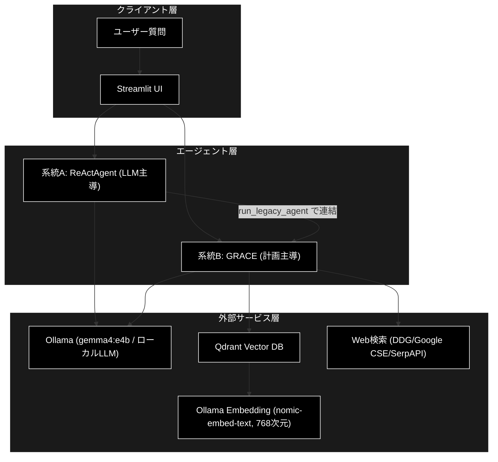
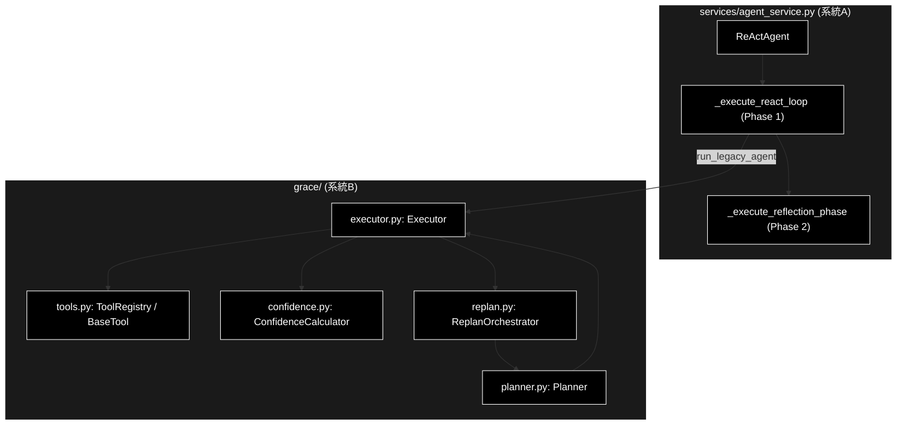
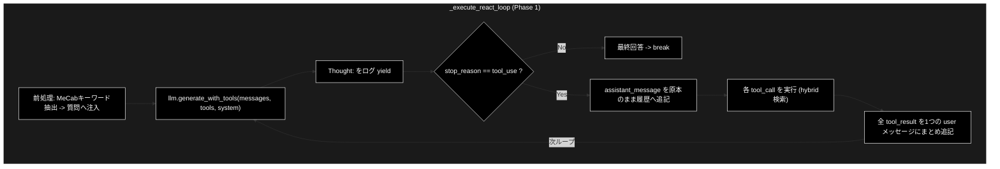
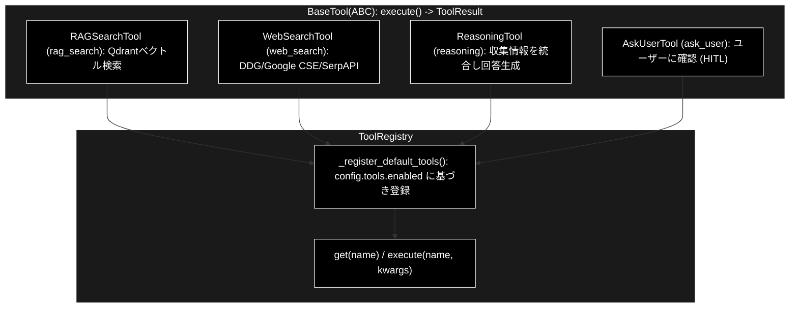
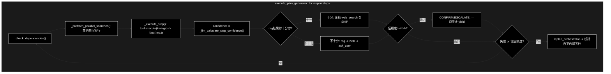
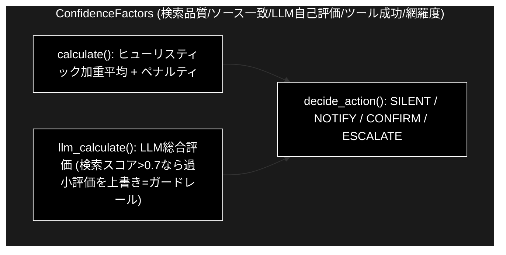
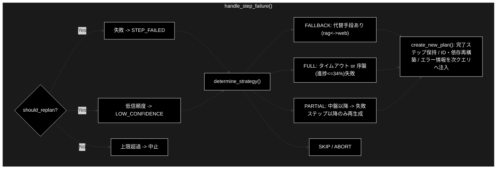
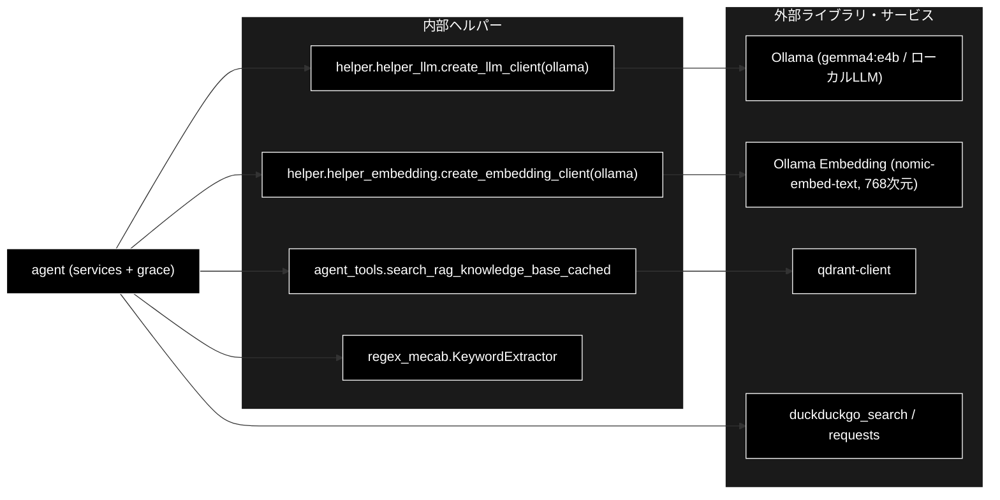

# agent.py - ReAct + Reflection / GRACE エージェント ドキュメント

**Version 1.0** | 最終更新: 2026-06-19

---

## 目次

1. [概要](#概要)
2. [アーキテクチャ構成図](#1-アーキテクチャ構成図)
3. [モジュール構成図](#2-モジュール構成図)
4. [クラス・関数一覧表](#3-クラス関数一覧表)
5. [クラス・関数 IPO詳細](#4-クラス関数-ipo詳細)
6. [使用例](#5-使用例)
7. [エクスポート](#6-エクスポート)
8. [変更履歴](#7-変更履歴)
9. [付録: 依存関係図](#付録-依存関係図)

---

## 概要

本ドキュメントは、本リポジトリのエージェント機構である **ReAct + Reflection**（`services/agent_service.py`）と
**GRACE（Plan + Execute）**（`grace/` 配下）の構成・構造・ロジックの組み立てを、処理ブロック単位で説明する。
あわせて各処理のメリット（処理の良さ）を「特徴」として主張する。

本リポジトリにはツールの定義・実行のしかたが **2 系統**あり、混同しないことが理解の鍵である。

- **系統A: ReActAgent（LLM主導）** … ツール定義を dict スキーマで `_build_tools()` に直書きし、
  Ollama の Tool Use 形式（`input_schema`）として LLM に渡す。LLM が呼び出し要否を毎ターン判断する。
- **系統B: GRACE（計画主導）** … ツールを `BaseTool` クラス（`grace/tools.py`）として実装し
  `ToolRegistry` に登録。Executor が計画ステップから `.execute()` を呼ぶ。

この 2 系統は `run_legacy_agent` ステップで連結される（`executor.py`）。LLM はローカル実行の Ollama
（既定モデル `gemma4:e4b`、`create_llm_client("ollama")`）を使用し、API キーは不要。

### 主な責務

- ユーザー質問の分析と回答経路の決定（検索要否・クエリ生成）
- ReAct ループによる「思考→行動→観察」の反復実行とツール呼び出し
- Reflection（自己評価・推敲）による回答品質の二段担保
- 実行計画の生成（複雑度に応じたルールベース／LLM の二層方式）
- 計画の順次実行・並列検索・動的フォールバック・人間介入制御
- 多軸信頼度計算による自動進行／確認の判断（Human-in-the-loop）
- 失敗・低信頼度からの動的リプランによる自律回復

### 各責務対応のモジュール

| # | 責務 | 対応モジュール | 説明 |
|---|------|--------------|------|
| 1 | ユーザー質問の分析と回答経路の決定 | `services/agent_service.py` | `ReActAgent` がシステムプロンプトとキーワード抽出で経路決定 |
| 2 | ReAct ループの反復実行とツール呼び出し | `services/agent_service.py` | `_execute_react_loop()`（Phase 1） |
| 3 | Reflection による回答品質の二段担保 | `services/agent_service.py` | `_execute_reflection_phase()`（Phase 2） |
| 4 | 実行計画の生成（二層方式） | `grace/planner.py` | `Planner.create_plan()` |
| 5 | 計画の順次実行・並列検索・介入制御 | `grace/executor.py` | `Executor.execute_plan_generator()` |
| 6 | ツール定義・登録・実行 | `grace/tools.py` | `BaseTool` 群と `ToolRegistry` |
| 7 | 多軸信頼度計算と介入レベル判定 | `grace/confidence.py` | `ConfidenceCalculator` ほか |
| 8 | 失敗・低信頼度からの動的リプラン | `grace/replan.py` | `ReplanOrchestrator` / `ReplanManager` |

### 主要機能一覧

| 機能 | 説明 |
|------|------|
| `ReActAgent` | ReAct + Reflection エージェントクラス（系統A） |
| `ReActAgent.execute_turn()` | 1ターンを Phase1→Phase2 で実行するジェネレータ |
| `ReActAgent._execute_react_loop()` | Phase 1: ReAct ループ（思考→行動→観察） |
| `ReActAgent._execute_reflection_phase()` | Phase 2: Reflection（自己評価・推敲） |
| `ToolRegistry` | GRACE ツールの登録・取得・実行（系統B） |
| `Planner.create_plan()` | 複雑度に応じた実行計画生成（二層方式） |
| `Executor.execute_plan_generator()` | 計画のステップ実行（並列・フォールバック・介入） |
| `ConfidenceCalculator.decide_action()` | 信頼度→介入レベル（SILENT/NOTIFY/CONFIRM/ESCALATE）判定 |
| `ReplanOrchestrator.handle_step_failure()` | 失敗・低信頼度時のリプラン処理 |

---

## 1. アーキテクチャ構成図

### 1.1 システム全体構成



### 1.2 データフロー

1. ユーザー質問を Streamlit UI から受信する。
2. 系統A（ReActAgent）は LLM 主導でツール呼び出し要否を判断し、ReAct → Reflection で回答する。
3. 系統B（GRACE）は計画を生成し、Executor が各ステップを実行する。
4. 検索ステップは Qdrant（Ollama Embedding `nomic-embed-text`・768次元）や Web 検索を呼び出す。
5. 各ステップは信頼度を算出し、低信頼度なら介入またはリプランへ分岐する。
6. 最終回答を UI へストリーミングで返却する。

---

## 2. モジュール構成図

### 2.1 内部モジュール構成



### 2.2 内部依存モジュール

| モジュール | 用途 |
|-----------|------|
| `services.agent_service` | ReActAgent 本体（系統A） |
| `grace.planner` | 実行計画の生成 |
| `grace.executor` | 計画実行・並列検索・介入制御 |
| `grace.tools` | ツール定義・登録・実行（系統B） |
| `grace.confidence` | 多軸信頼度計算・介入レベル判定 |
| `grace.replan` | 動的リプラン |
| `helper.helper_llm` | Ollama クライアント生成（`create_llm_client("ollama")`） |
| `agent_tools` | RAG 検索の実体（`search_rag_knowledge_base_cached` 等） |

---

## 3. クラス・関数一覧表

### 3.1 クラス一覧

#### ReActAgent（`services/agent_service.py`）

| メソッド | 概要 |
|---------|------|
| `__init__(selected_collections, model_name, session_id, use_hybrid_search)` | コンストラクタ（コレクション・モデル・セッション設定） |
| `execute_turn(user_input)` | 1ターンを Phase1→Phase2 で実行するジェネレータ |
| `_execute_react_loop(user_input)` | Phase 1: ReAct ループ |
| `_execute_reflection_phase(draft_answer)` | Phase 2: Reflection |
| `_build_system_instruction()` | システムプロンプト構築 |
| `_build_tools()` | Tool Use 形式（`input_schema`）のツールスキーマ構築 |
| `_format_final_answer(raw_answer)` | 最終回答の整形 |

#### ToolRegistry（`grace/tools.py`）

| メソッド | 概要 |
|---------|------|
| `_register_default_tools()` | `config.tools.enabled` に基づき既定ツールを登録 |
| `get(name)` | ツール名から `BaseTool` を取得 |
| `execute(name, **kwargs)` | ツールを実行し `ToolResult` を返す |

### 3.2 関数一覧（カテゴリ別）

#### 計画・実行（grace）

| 関数名 | 概要 |
|-------|------|
| `Planner.create_plan(query)` | 複雑度に応じた実行計画を生成 |
| `Executor.execute_plan_generator(plan, state)` | 計画をステップ実行するジェネレータ |
| `ConfidenceCalculator.decide_action(score)` | 信頼度→介入レベルを判定 |
| `ReplanOrchestrator.handle_step_failure(...)` | 失敗・低信頼度時のリプラン処理 |

---

## 4. クラス・関数 IPO詳細

### 4.1 ReActAgent クラス（系統A）

社内ドキュメント検索と連携した「ハイブリッド・ナレッジ・エージェント」。
1ターンを ReAct（思考主導）→ Reflection（自己評価）の順で実行する。LLM はローカルの Ollama を使用する。

#### メソッド: `execute_turn`

**概要**: 1ターンを Phase1（ReAct Loop）→ Phase2（Reflection）の順に実行し、進捗イベントを `yield` するジェネレータ。

```python
def execute_turn(self, user_input: str) -> Generator[Dict[str, Any], None, None]
```

| パラメータ | 型 | デフォルト | 説明 |
|------------|------|-----------|------|
| `user_input` | str | - | ユーザーの質問文 |

| 項目 | 内容 |
|------|------|
| **Input** | `user_input: str` |
| **Process** | 1. `self._messages = []`（ステートレス設計：毎ターン履歴リセット）<br>2. Phase 1: `_execute_react_loop()` で `draft_answer`（回答案）を取得<br>3. Phase 2: `_execute_reflection_phase(draft_answer)` で推敲<br>4. `_format_final_answer()` で整形し `final_answer` を yield |
| **Output** | `Generator`: `log` / `tool_call` / `tool_result` / `final_text` / `final_answer` イベント |

**特徴（処理の良さ）**:

- 思考過程（Thought / ツール呼び出し / 結果 / 推敲）を逐次 `yield` し、説明可能性を確保。
- ステートレス設計で毎ターン履歴をリセットし、ターン間の状態汚染を防ぐ。

```python
# 使用例
agent = ReActAgent(selected_collections=["wikipedia_ja"], model_name="gemma4:e4b")
for event in agent.execute_turn("金色夜叉の作者は誰ですか？"):
    if event["type"] == "final_answer":
        print(event["content"])
# 出力: 社内ナレッジによると、金色夜叉の作者は尾崎紅葉です。
```

#### メソッド: `_execute_react_loop`（Phase 1: ReAct Loop）

**概要**: 「Thought → Action → Observation」のサイクルを最大 `max_turns`（=10）回し、回答案を生成する。

```python
def _execute_react_loop(self, user_input: str) -> Generator[Dict[str, Any], None, None]
```

| 項目 | 内容 |
|------|------|
| **Input** | `user_input: str` |
| **Process** | 1. MeCab キーワード抽出 → 質問へ重要キーワードを注入（固有名詞の取りこぼし防止）<br>2. `llm.generate_with_tools(messages, tools, system)` を呼び出し（Ollama）<br>3. `Thought:` を含むテキストをログ yield<br>4. `stop_reason != "tool_use"` なら最終回答として break<br>5. `assistant_message` を原本のまま履歴へ追記（ID/ブロック整合を保持）<br>6. 各 `tool_call` を実行（`search_rag_knowledge_base_cached` 等、`collection_name` は指定せず自動選択）<br>7. 全 `tool_result` を1つの user メッセージにまとめ履歴へ追記し次ループへ |
| **Output** | `Generator`: 最終要素として `final_text`（回答案） |

**ReAct ループ図**:



**特徴（処理の良さ）**:

- LLM が検索要否・クエリをその場で判断する動的な経路選択（計画を固定しない）。
- `assistant_message`（API が返した `content` 原本）を履歴に積むため、ブロック順序・ツール ID の整合が壊れない。
- 複数ツールの同時呼び出しに対応し、全 `tool_result` を1つの user メッセージにまとめる（Tool Use 仕様要件）。
- `collection_name` を LLM に指定させず、システム側で自動コレクション選択・並列検索する。

#### メソッド: `_execute_reflection_phase`（Phase 2: Reflection）

**概要**: ReAct の回答案を捨てず、正確性・適切性・スタイルの観点で自己評価・推敲する。

```python
def _execute_reflection_phase(self, draft_answer: str) -> Generator[Dict[str, Any], None, str]
```

| パラメータ | 型 | デフォルト | 説明 |
|------------|------|-----------|------|
| `draft_answer` | str | - | Phase 1 が生成した回答案 |

| 項目 | 内容 |
|------|------|
| **Input** | `draft_answer: str` |
| **Process** | 1. `reflection_msg = REFLECTION_INSTRUCTION + 回答案` を構築<br>2. `self._messages` に追記（ReAct の検索結果・履歴を引き継ぐ）<br>3. `generate_with_tools(messages=self._messages, tools=[])` で推敲に専念<br>4. `Final Answer:` で分割し最終回答を採用 |
| **Output** | `str`: 推敲後の最終回答（return 値） |

**Reflection 図**:


**特徴（処理の良さ）**:

- `tools=[]` でツールを切り、かつ `self._messages` を全件渡すことで、ReAct の検索根拠を保持したまま
  「捏造していないか」を再点検でき、ハルシネーション抑制という Reflection 本来の目的が機能する。
- ReAct＝正しさ（根拠収集）／Reflection＝適切さ・読みやすさ、の二段品質保証。

### 4.2 ToolRegistry クラス（系統B・`grace/tools.py`）

GRACE のツールを `BaseTool` クラスとして登録・取得・実行するレジストリ。
登録ツールは `RAGSearchTool` / `WebSearchTool` / `ReasoningTool` / `AskUserTool`。

#### メソッド: `execute`

**概要**: ツール名から `BaseTool` を取得し実行、統一 `ToolResult` を返す。

```python
def execute(self, name: str, **kwargs) -> ToolResult
```

| パラメータ | 型 | デフォルト | 説明 |
|------------|------|-----------|------|
| `name` | str | - | ツール名（"rag_search" 等。計画ステップの `action` と一致） |
| `**kwargs` | Any | - | ツール固有引数（query / collection 等） |

| 項目 | 内容 |
|------|------|
| **Input** | `name: str`, `**kwargs` |
| **Process** | 1. `get(name)` でツール取得<br>2. 未登録なら失敗 `ToolResult`<br>3. `tool.execute(**kwargs)` を実行 |
| **Output** | `ToolResult`: `{success, output, confidence_factors, error, execution_time_ms}` |

**ツール構成図**:



**特徴（処理の良さ）**:

- 全ツールが統一 `ToolResult` を返すため、Executor はツール種別を意識せず信頼度計算・フォールバックに回せる。
- `RAGSearchTool` はコレクション自動フォールバック・Dynamic Thresholding（1位スコア0.98以上で下位を切り捨て）を内蔵。
- `WebSearchTool` は結果を `rag_search` 互換フォーマットに変換し、後段 `reasoning` が検索元を区別せず扱える。
- `BaseTool` を1クラス追加し登録するだけで新アクションを拡張できる。

### 4.3 Planner クラス（`grace/planner.py`）

ユーザー質問を分析し、実行計画（`ExecutionPlan`）を生成する。

#### メソッド: `create_plan`

**概要**: 複雑度に応じて、ルールベース計画（LLM 呼び出しなし）と LLM 計画生成を切り替える二層方式。

```python
def create_plan(self, query: str) -> ExecutionPlan
```

| パラメータ | 型 | デフォルト | 説明 |
|------------|------|-----------|------|
| `query` | str | - | ユーザーの質問 |

| 項目 | 内容 |
|------|------|
| **Input** | `query: str` |
| **Process** | 1. `estimate_complexity()` で複雑度推定<br>2. 単純 → `_create_rule_based_plan()`（rag_search→reasoning、LLM呼び出しゼロ）<br>3. 複雑/明示的web指示 → `_create_llm_plan()`（`generate_structured` + 一時エラーのみリトライ）<br>4. 失敗時は必ずルールベースへフォールバック |
| **Output** | `ExecutionPlan`: steps / depends_on / fallback / complexity |

**特徴（処理の良さ）**: 単純質問はルールベースで即計画（ローカル LLM 呼び出しゼロでレイテンシ削減）、複雑のみ LLM。失敗時もルールベースで安全に縮退する。

### 4.4 Executor クラス（`grace/executor.py`）

計画をステップごとに実行し、並列検索・動的フォールバック・介入・リプランを制御する。

#### メソッド: `execute_plan_generator`

**概要**: 計画を順次実行し、各ステップ完了後に `ExecutionState` を `yield` するジェネレータ。

```python
def execute_plan_generator(self, plan: ExecutionPlan, state: Optional[ExecutionState] = None) -> Generator[ExecutionState, None, ExecutionResult]
```

| パラメータ | 型 | デフォルト | 説明 |
|------------|------|-----------|------|
| `plan` | ExecutionPlan | - | 実行する計画 |
| `state` | Optional[ExecutionState] | None | 既存状態（再開・リプラン時） |

| 項目 | 内容 |
|------|------|
| **Input** | `plan: ExecutionPlan`, `state: Optional[ExecutionState] = None` |
| **Process** | 1. 依存関係チェック<br>2. 依存なし検索ステップを並列先行実行（`_prefetch_parallel_searches`）<br>3. `_execute_step()` でツール実行→信頼度算出<br>4. rag結果が十分なら後続 web_search を SKIP、不十分なら rag→web→ask_user の動的フォールバック<br>5. CONFIRM/ESCALATE なら一時停止 yield（介入）<br>6. 失敗/低信頼度なら `replan_orchestrator` で新計画を生成し再帰実行 |
| **Output** | `Generator[ExecutionState]` + return `ExecutionResult` |

**実行フロー図**:



**特徴（処理の良さ）**: `reasoning` ステップへ全成功ステップの出力を sources/context として注入し、ツールを疎結合に保ったまま情報連携する。結果十分時のスキップ・並列検索でレイテンシを削減する（ローカル実行のためコスト集計は行わない）。

### 4.5 ConfidenceCalculator クラス（`grace/confidence.py`）

検索品質・ソース一致度・LLM自己評価・ツール成功率・クエリ網羅度から多軸で信頼度を算出する。
ソース一致度の埋め込みは `create_embedding_client("ollama")`（`nomic-embed-text`・768次元）を用いる。

#### メソッド: `decide_action`

**概要**: 信頼度スコアを介入レベル（SILENT/NOTIFY/CONFIRM/ESCALATE）へ写像する。

```python
def decide_action(self, score: ConfidenceScore) -> ActionDecision
```

| パラメータ | 型 | デフォルト | 説明 |
|------------|------|-----------|------|
| `score` | ConfidenceScore | - | 算出済みの信頼度スコア |

| 項目 | 内容 |
|------|------|
| **Input** | `score: ConfidenceScore` |
| **Process** | 1. 閾値（`config.confidence.thresholds`）と比較<br>2. silent 以上→SILENT（自動進行）<br>3. notify 以上→NOTIFY（表示のみ）<br>4. confirm 以上→CONFIRM（確認）<br>5. それ未満→ESCALATE（ユーザー入力要求） |
| **Output** | `ActionDecision`: `{level, confidence_score, reason, suggested_action}` |

**信頼度計算図**:



**特徴（処理の良さ）**: 機械的スコアと LLM 評価のハイブリッド＋ガードレールで過小・過大評価を相互補正。信頼度を介入レベルへ写像し Human-in-the-loop を実現する。

### 4.6 ReplanOrchestrator クラス（`grace/replan.py`）

失敗・低信頼度に応じて計画を動的に作り直す。

#### メソッド: `handle_step_failure`

**概要**: ステップ失敗・低信頼度を検出し、戦略を選択して新計画を生成する。

```python
def handle_step_failure(self, step_result: StepResult, current_plan: ExecutionPlan, completed_results: Dict[int, StepResult], replan_count: int) -> Optional[ReplanResult]
```

| パラメータ | 型 | デフォルト | 説明 |
|------------|------|-----------|------|
| `step_result` | StepResult | - | 対象ステップの結果 |
| `current_plan` | ExecutionPlan | - | 現在の計画 |
| `completed_results` | Dict[int, StepResult] | - | 完了済み結果 |
| `replan_count` | int | - | 現在のリプラン回数 |

| 項目 | 内容 |
|------|------|
| **Input** | `step_result`, `current_plan`, `completed_results`, `replan_count` |
| **Process** | 1. `should_replan()`（失敗→STEP_FAILED／低信頼度→LOW_CONFIDENCE／上限超→中止）<br>2. `determine_strategy()`（FALLBACK/FULL/PARTIAL/SKIP/ABORT）<br>3. `create_new_plan()`（完了ステップ保持・ID/依存再構築・エラー情報を次クエリへ注入） |
| **Output** | `Optional[ReplanResult]`: `{success, strategy, new_plan, reason, replan_count}` |

**リプラン図**:



**特徴（処理の良さ）**: 失敗を即終了にせず進捗を捨てずに代替経路で回復する。`max_replans` で無限ループを抑止。`fallback` が `reasoning` でも検索系なら `web_search` へ昇格し回復力を強化する。

---

## 5. 使用例

### 5.1 基本ワークフロー（系統A: ReActAgent）

```python
from services.agent_service import ReActAgent

# 1. エージェント初期化（ローカル Ollama を使用、APIキー不要）
agent = ReActAgent(
    selected_collections=["wikipedia_ja", "livedoor"],
    model_name="gemma4:e4b",
    use_hybrid_search=True,
)

# 2. 1ターン実行（Phase1 ReAct -> Phase2 Reflection）
for event in agent.execute_turn("金色夜叉の作者は誰ですか？"):
    if event["type"] == "log":
        print("思考:", event["content"])
    elif event["type"] == "final_answer":
        print("回答:", event["content"])
# 出力: 回答: 社内ナレッジによると、金色夜叉の作者は尾崎紅葉です。
```

### 5.2 応用ワークフロー（系統B: GRACE Plan + Execute）

```python
from grace.planner import create_planner
from grace.executor import create_executor

# 1. 計画生成（複雑度に応じて二層方式で切替）
planner = create_planner()
plan = planner.create_plan("AとBの違いを最新情報も含めて教えて")

# 2. 計画実行（並列検索・動的フォールバック・介入・リプラン）
executor = create_executor()
result = executor.execute(plan)

# 3. 結果確認
print(f"status={result.overall_status}, confidence={result.overall_confidence:.2f}")
print(result.final_answer)
```

---

## 6. エクスポート

各モジュールの主なエクスポート要素：

```python
# services/agent_service.py
# （クラス）ReActAgent
# （関数）get_available_collections_from_qdrant_helper

# grace/tools.py
__all__ = ["ToolResult", "BaseTool", "RAGSearchTool", "WebSearchTool",
           "ReasoningTool", "AskUserTool", "ToolRegistry", "create_tool_registry"]

# grace/planner.py
__all__ = ["Planner", "create_planner", "PLAN_GENERATION_PROMPT"]

# grace/executor.py
__all__ = ["ExecutionState", "Executor", "create_executor"]

# grace/confidence.py
__all__ = ["ConfidenceFactors", "ConfidenceScore", "ActionDecision",
           "InterventionLevel", "ConfidenceCalculator", "LLMSelfEvaluator",
           "SourceAgreementCalculator", "QueryCoverageCalculator", "ConfidenceAggregator"]

# grace/replan.py
__all__ = ["ReplanTrigger", "ReplanStrategy", "ReplanContext", "ReplanResult",
           "ReplanManager", "ReplanOrchestrator", "create_replan_orchestrator"]
```

---

## 7. 変更履歴

| バージョン | 変更内容 |
|-----------|---------|
| 1.0 | 初版作成（ReAct + Reflection / GRACE の構成・IPO・Mermaid図・特徴を記述。Ollama 表記） |

---

## 付録: 依存関係図


