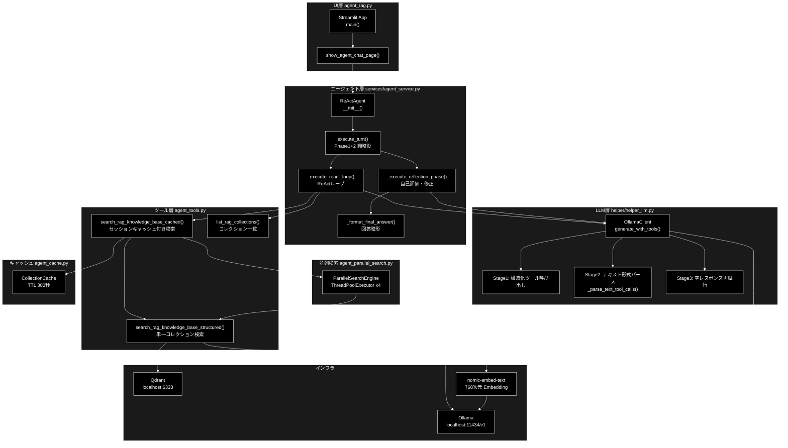
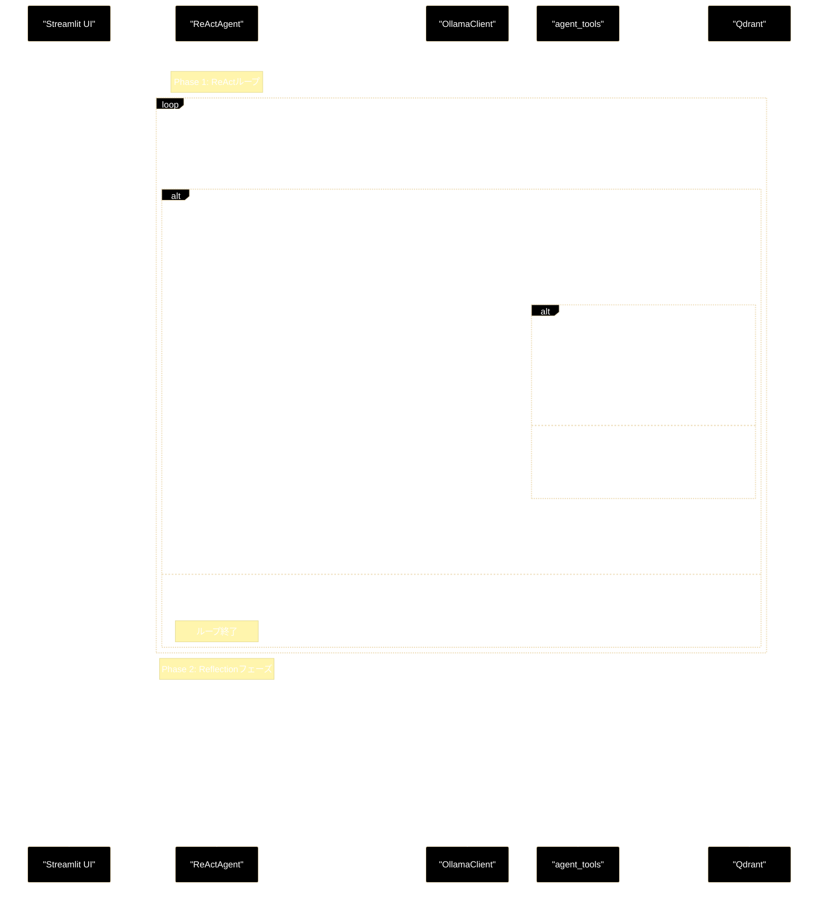

# agent_service.py - Agent(ReAct+Reflection) ドキュメント

**Version 1.0** | 最終更新: 2026-06-09

---

## 目次

1. [概要](#概要)
2. [ファイルと責務の対応](#1-ファイルと責務の対応)
3. [アーキテクチャ構成図](#2-アーキテクチャ構成図)
4. [ReAct+Reflection シーケンス図](#3-reactreflection-シーケンス図)
5. [クラス・関数一覧表](#4-クラス関数一覧表)
6. [クラス・関数 IPO詳細](#5-クラス関数-ipo詳細)
7. [各フェーズの説明](#6-各フェーズの説明)
8. [generate_with_tools の4段フォールバック](#7-generate_with_tools-の4段フォールバック)
9. [キャッシュ戦略](#8-キャッシュ戦略)
10. [詳細コールチェーン](#9-詳細コールチェーン)
11. [設定パラメータ一覧](#10-設定パラメータ一覧)
12. [変更履歴](#変更履歴)

---

## 概要

`services/agent_service.py` は、Ollama ローカル LLM を使った **ReAct+Reflection エージェント**を実装するモジュール。
ユーザーの質問に対して Qdrant RAG 検索を繰り返しながら回答を構築し（ReAct）、最後に自己評価・修正（Reflection）を加えて最終回答を生成する。

### 主な責務

- ReAct ループによる多段ツール呼び出し制御
- Qdrant RAG 検索ツールの実行管理
- Reflection フェーズによる自己評価・回答改善
- セッション単位の会話履歴管理
- LLM 空レスポンス時のフォールバック制御

### 各責務対応のモジュール

| # | 責務 | 対応モジュール | 説明 |
|---|------|--------------|------|
| 1 | ReAct ループ制御 | `services/agent_service.py` | `_execute_react_loop()` で Thought→Action→Observation を繰り返す |
| 2 | RAG 検索ツール実行 | `agent_tools.py` | `search_rag_knowledge_base_cached()` でキャッシュ付き並列検索 |
| 3 | Reflection フェーズ | `services/agent_service.py` | `_execute_reflection_phase()` で LLM 自己評価・修正 |
| 4 | LLM 呼び出し | `helper/helper_llm.py` | `OllamaClient.generate_with_tools()` で4段フォールバック |
| 5 | コレクションキャッシュ | `agent_cache.py` | `CollectionCache` で TTL 付きセッションキャッシュ |

### 主要機能一覧

| 機能 | 説明 |
|------|------|
| `ReActAgent` | ReAct+Reflection エージェント本体クラス |
| `ReActAgent.__init__()` | エージェント初期化・LLM/ツール/システムプロンプト構築 |
| `ReActAgent.execute_turn()` | 1ターン分の処理（Phase1+Phase2）を調整 |
| `ReActAgent._execute_react_loop()` | ReAct ループ（ツール呼び出し繰り返し） |
| `ReActAgent._execute_reflection_phase()` | Reflection フェーズ（自己評価・回答修正） |
| `ReActAgent._format_final_answer()` | 最終回答テキストの整形 |
| `OllamaClient.generate_with_tools()` | Ollama LLM ツール付き生成（4段フォールバック） |
| `search_rag_knowledge_base_cached()` | キャッシュ・並列検索統合 RAG 検索 |
| `ParallelSearchEngine.search_all_collections()` | 全コレクション並列検索 |
| `CollectionCache.get()` / `.set()` | セッションキャッシュ取得・保存 |

---

## 1. ファイルと責務の対応

| ファイル | 責務 | 主要クラス/関数 |
|---|---|---|
| `agent_rag.py` | Streamlit エントリポイント・ページルーティング | `main()`, `_resolve_startup_model()` |
| `services/agent_service.py` | ReAct+Reflection エージェント本体 | `ReActAgent` |
| `helper/helper_llm.py` | Ollama LLM クライアント・ツール変換・フォールバック | `OllamaClient`, `create_llm_client()` |
| `agent_tools.py` | RAG 検索ツール・Embedding 生成・結果整形 | `search_rag_knowledge_base_cached()` |
| `agent_parallel_search.py` | 全コレクション並列検索 | `ParallelSearchEngine` |
| `agent_cache.py` | セッション単位のコレクションキャッシュ | `CollectionCache` |
| `qdrant_client_wrapper.py` | Qdrant 接続・ベクトル検索・ハイブリッド検索 | `search_collection()`, `embed_query()` |

---

## 2. アーキテクチャ構成図

### 2.1 システム全体構成



### 2.2 データフロー

1. Streamlit UI からユーザー入力を受信
2. `ReActAgent.execute_turn()` が Phase1（ReAct）と Phase2（Reflection）を順に実行
3. ReAct ループで LLM がツール呼び出しを判断 → `search_rag_knowledge_base_cached()` でQdrant検索
4. 検索結果を会話履歴に追記して再度 LLM に渡す（最大10回）
5. LLM がテキスト回答を生成したらループ終了 → draft_answer
6. Reflection フェーズで draft_answer を自己評価・修正 → Final Answer
7. Generator でイベントをストリーム出力 → UI にリアルタイム表示

---

## 3. ReAct+Reflection シーケンス図



---

## 4. クラス・関数一覧表

### 4.1 クラス一覧

#### ReActAgent（`services/agent_service.py`）

| メソッド | 概要 |
|---------|------|
| `__init__(selected_collections, model_name, session_id, use_hybrid_search)` | エージェント初期化 |
| `execute_turn(user_input)` | 1ターン処理（Phase1+2）の調整役 |
| `_execute_react_loop(user_input)` | ReAct ループ本体（ツール呼び出し繰り返し） |
| `_execute_reflection_phase(draft_answer)` | Reflection フェーズ（自己評価・修正） |
| `_format_final_answer(raw_answer)` | 最終回答テキスト整形 |
| `_build_system_instruction()` | システムプロンプト構築 |
| `_build_tools()` | ツール定義リスト構築 |

#### OllamaClient（`helper/helper_llm.py`）

| メソッド | 概要 |
|---------|------|
| `__init__(base_url, default_model)` | Ollama クライアント初期化 |
| `generate_with_tools(messages, tools, system, model, max_tokens)` | ツール付き生成（4段フォールバック） |
| `generate_content(prompt, model)` | シンプルテキスト生成 |
| `generate_structured(prompt, response_schema, model)` | 構造化出力（Pydantic） |
| `count_tokens(text, model)` | トークン数推定 |
| `build_tool_result_message(tool_calls, results)` | ツール結果メッセージ構築 |

#### ParallelSearchEngine（`agent_parallel_search.py`）

| メソッド | 概要 |
|---------|------|
| `__init__(max_workers, timeout_per_collection)` | 並列検索エンジン初期化 |
| `search_all_collections(query, collections, search_func)` | 全コレクション並列検索 |

#### CollectionCache（`agent_cache.py`）

| メソッド | 概要 |
|---------|------|
| `__init__(ttl)` | キャッシュ初期化 |
| `get(session_id)` | キャッシュ取得 |
| `set(session_id, collection_name, score, query)` | キャッシュ保存 |
| `get_stats(session_id)` | キャッシュ統計情報取得 |

### 4.2 関数一覧（カテゴリ別）

#### RAG 検索関数（`agent_tools.py`）

| 関数名 | 概要 |
|-------|------|
| `search_rag_knowledge_base_cached(query, session_id, collection_name, cache_threshold, use_hybrid_search)` | キャッシュ付きスマート RAG 検索（エージェントから呼ばれる主関数） |
| `search_rag_knowledge_base_structured(query, collection_name, use_hybrid_search, ...)` | 単一コレクション RAG 検索 |
| `search_rag_knowledge_base(query, collection_name, use_hybrid_search)` | マルチコレクション検索 |
| `list_rag_collections()` | 利用可能なコレクション一覧取得 |

---

## 5. クラス・関数 IPO詳細

### 5.1 ReActAgent クラス

ReAct（Reasoning + Acting）+ Reflection パターンを実装したエージェント。
Ollama ローカル LLM を使い、Qdrant RAG 検索を繰り返しながら回答を生成する。

---

#### コンストラクタ: `__init__`

**概要**: エージェントを初期化し、LLM クライアント・システムプロンプト・ツール定義を構築する。

```python
ReActAgent(
    selected_collections: List[str],
    model_name: str = None,
    session_id: Optional[str] = None,
    use_hybrid_search: bool = True
)
```

| パラメータ | 型 | デフォルト | 説明 |
|---|---|---|---|
| `selected_collections` | `List[str]` | - | 検索対象の Qdrant コレクション名リスト |
| `model_name` | `str` | `None` | 使用モデル名（None 時は config から取得） |
| `session_id` | `Optional[str]` | `None` | セッション ID（None 時は UUID 自動生成） |
| `use_hybrid_search` | `bool` | `True` | Dense+Sparse ハイブリッド検索を使うか |

| 項目 | 内容 |
|------|------|
| **Input** | `selected_collections: List[str]`, `model_name: str = None`, `session_id: Optional[str] = None`, `use_hybrid_search: bool = True` |
| **Process** | 1. モデル名解決（config.yml の `models.default` にフォールバック）<br>2. `create_llm_client("ollama")` で OllamaClient 生成<br>3. `_build_system_instruction()` でシステムプロンプト構築<br>4. `_build_tools()` でツール定義リスト構築<br>5. KeywordExtractor 初期化（MeCab 利用可能な場合） |
| **Output** | `ReActAgent` インスタンス |

```python
# 使用例
agent = ReActAgent(
    selected_collections=["cc_news_2per_ollama"],
    model_name="gemma4:e4b",
    use_hybrid_search=True
)
```

---

#### メソッド: `execute_turn`

**概要**: ユーザー入力に対し Phase1（ReAct）と Phase2（Reflection）を順に実行し、最終回答をストリーム出力する。

```python
def execute_turn(self, user_input: str) -> Generator[Dict[str, Any], None, None]
```

| パラメータ | 型 | デフォルト | 説明 |
|---|---|---|---|
| `user_input` | `str` | - | ユーザーの質問テキスト |

| 項目 | 内容 |
|------|------|
| **Input** | `user_input: str` |
| **Process** | 1. `self._messages` をリセット<br>2. `_execute_react_loop()` を呼び出し `draft_answer` を取得<br>3. `_execute_reflection_phase(draft_answer)` で最終回答生成<br>4. 各フェーズのイベントを yield |
| **Output** | `Generator[Dict[str, Any], None, None]`: イベント dict のストリーム |

**戻り値例**:
```python
# yield されるイベントの種類
{"type": "log",          "content": "🔑 **Extracted Keywords:** TTC, 列車"}
{"type": "tool_call",    "name": "search_rag_knowledge_base", "args": {"query": "TTC"}}
{"type": "tool_result",  "content": "--- Result 1 [Cosine: 0.9256] ---\nQ: ..."}
{"type": "final_text",   "content": "Answer: TTC は..."}
{"type": "final_answer", "content": "TTC（トロント交通委員会）は..."}
```

```python
# 使用例
agent = ReActAgent(selected_collections=["cc_news_2per_ollama"])
for event in agent.execute_turn("TTCの運賃はいくらですか？"):
    if event["type"] == "final_answer":
        print(event["content"])
```

---

#### メソッド: `_execute_react_loop`

**概要**: ReAct ループ本体。LLM にツール付きで生成させ、ツール呼び出しが返る間は検索を繰り返す。

```python
def _execute_react_loop(self, user_input: str) -> Generator[Dict[str, Any], None, None]
```

| パラメータ | 型 | デフォルト | 説明 |
|---|---|---|---|
| `user_input` | `str` | - | ユーザーの質問テキスト |

| 項目 | 内容 |
|------|------|
| **Input** | `user_input: str` |
| **Process** | 1. キーワード抽出でクエリ拡張（オプション）<br>2. `self._messages` に user メッセージ追記<br>3. `llm.generate_with_tools()` 呼び出し<br>4. `finish_reason == "tool_calls"` なら検索ツール実行 → messages に追記 → 3 へ<br>5. `finish_reason == "stop"` でループ終了 → `final_text_from_react` を yield |
| **Output** | `Generator`: ループ中のイベント + `{"type": "final_text", "content": draft_answer}` |

**戻り値例**:
```python
{"type": "final_text", "content": "Thought: 検索結果から...\nAnswer: TTCの運賃は..."}
```

---

#### メソッド: `_execute_reflection_phase`

**概要**: Phase1 の draft_answer を LLM が自己評価し、誤り・不足を修正して最終回答を生成する。

```python
def _execute_reflection_phase(
    self, draft_answer: str
) -> Generator[Dict[str, Any], None, str]
```

| パラメータ | 型 | デフォルト | 説明 |
|---|---|---|---|
| `draft_answer` | `str` | - | Phase1 で生成した回答素案 |

| 項目 | 内容 |
|------|------|
| **Input** | `draft_answer: str` |
| **Process** | 1. `REFLECTION_INSTRUCTION + draft_answer` を `self._messages` に追記<br>2. `llm.generate_with_tools(tools=[])` で自己評価テキスト生成<br>3. `"Final Answer:"` セクションを抽出<br>4. `_format_final_answer()` で整形 |
| **Output** | `Generator`: reflection ログイベント + `{"type": "final_answer", "content": final}` |

**戻り値例**:
```python
{"type": "final_answer", "content": "TTCの成人運賃は3.30カナダドルです（2024年時点）。"}
```

---

#### メソッド: `_format_final_answer`

**概要**: LLM 出力テキストから最終回答部分を抽出・整形する。

```python
def _format_final_answer(self, raw_answer: str) -> str
```

| パラメータ | 型 | デフォルト | 説明 |
|---|---|---|---|
| `raw_answer` | `str` | - | LLM の生のテキスト出力 |

| 項目 | 内容 |
|------|------|
| **Input** | `raw_answer: str` |
| **Process** | `"Answer:"`, `"Thought:"`, `"考え:"` などのプレフィックスで分割し、回答部分のみ抽出 |
| **Output** | `str`: 整形済み最終回答テキスト |

**戻り値例**:
```python
"TTCの成人運賃は3.30カナダドルです。"
```

---

### 5.2 OllamaClient クラス（`helper/helper_llm.py`）

Ollama の OpenAI 互換エンドポイント（`http://localhost:11434/v1`）を使う LLM クライアント。
`gemma4:e4b` 等のモデルがツール呼び出しに完全対応しない場合の4段フォールバックを実装。

---

#### メソッド: `generate_with_tools`

**概要**: ツール定義付きで LLM を呼び出し、構造化/テキスト形式いずれのツール呼び出しも処理する4段フォールバック実装。

```python
def generate_with_tools(
    self,
    messages: List[Dict[str, Any]],
    tools: List[Dict[str, Any]],
    system: str = "",
    model: Optional[str] = None,
    max_tokens: int = 4096,
    **kwargs,
) -> tuple
```

| パラメータ | 型 | デフォルト | 説明 |
|---|---|---|---|
| `messages` | `List[Dict[str, Any]]` | - | 会話履歴（OpenAI 形式） |
| `tools` | `List[Dict[str, Any]]` | - | ツール定義リスト（Anthropic input_schema 形式） |
| `system` | `str` | `""` | システムプロンプト |
| `model` | `Optional[str]` | `None` | モデル名（None 時は default_model） |
| `max_tokens` | `int` | `4096` | 最大出力トークン数 |

| 項目 | 内容 |
|------|------|
| **Input** | `messages`, `tools`, `system`, `model`, `max_tokens` |
| **Process** | 1. `GeminiConfig.supports_tool_calls(model)` でツール対応確認<br>2. Anthropic 形式ツールを OpenAI 形式に変換して API 呼び出し<br>3. `msg.tool_calls` あり → 構造化ツール呼び出し（Stage 1）<br>4. `msg.content` にツール構文あり → `_parse_text_tool_calls()` でパース（Stage 2）<br>5. `msg.content=None` → tools なし再試行（Stage 3）<br>6. それでも空 → 空テキストをそのまま返す（Stage 4） |
| **Output** | `Tuple[str, List[Dict], str]`: `(text, tool_calls_result, finish_reason)` |

**戻り値例**:
```python
# ツール呼び出しの場合
(
    "Thought: 検索してみます。",
    [{"name": "search_rag_knowledge_base", "input": {"query": "TTC運賃"}, "id": "call_abc123"}],
    "tool_calls"
)

# テキスト回答の場合
(
    "Answer: TTCの運賃は3.30ドルです。",
    [],
    "stop"
)
```

```python
# 使用例
client = OllamaClient(default_model="gemma4:e4b")
text, tool_calls, finish_reason = client.generate_with_tools(
    messages=[{"role": "user", "content": "TTCの運賃は？"}],
    tools=[{"name": "search_rag_knowledge_base", "description": "...", "input_schema": {...}}],
    system="You are a helpful assistant.",
    max_tokens=4096,
)
```

---

### 5.3 search_rag_knowledge_base_cached 関数（`agent_tools.py`）

**概要**: セッションキャッシュと並列検索を組み合わせたスマート RAG 検索。エージェントのツール実行から直接呼ばれる主関数。

```python
def search_rag_knowledge_base_cached(
    query: str,
    session_id: str,
    collection_name: Optional[str] = None,
    cache_threshold: float = 0.6,
    use_hybrid_search: bool = True,
) -> str
```

| パラメータ | 型 | デフォルト | 説明 |
|---|---|---|---|
| `query` | `str` | - | 検索クエリ文字列 |
| `session_id` | `str` | - | セッション ID（キャッシュキー） |
| `collection_name` | `Optional[str]` | `None` | 明示指定コレクション（優先） |
| `cache_threshold` | `float` | `0.6` | キャッシュ検索成功とみなすスコア閾値 |
| `use_hybrid_search` | `bool` | `True` | Dense+Sparse ハイブリッド検索 |

| 項目 | 内容 |
|------|------|
| **Input** | `query: str`, `session_id: str`, `collection_name: Optional[str] = None`, `cache_threshold: float = 0.6`, `use_hybrid_search: bool = True` |
| **Process** | 1. `collection_name` 指定あり → Path 1（指定コレクションのみ検索）<br>2. キャッシュヒット + スコア >= `cache_threshold` → Path 2（キャッシュコレクション検索）<br>3. キャッシュミス / 低スコア → Path 3（全コレクション並列検索）<br>4. 最高スコア >= 0.5 の場合キャッシュ更新 |
| **Output** | `str`: フォーマット済み検索結果テキスト |

**戻り値例**:
```python
"""--- Result 1 [Cosine: 0.9256] ---
Q: ブライトン＆ホーヴ・アルビオンはプレミアリーグ復帰後、どのような目標を掲げていますか？
A: クリス・ハトン監督は、まずは「生き残る」ことに集中し、来シーズンはプレミアリーグのチームとなることを目標としています。
Source: cc_news_100_ollama"""
```

```python
# 使用例
result = search_rag_knowledge_base_cached(
    query="ブライトンの目標",
    session_id="session-uuid-1234",
    use_hybrid_search=True,
)
print(result)
# --- Result 1 [Cosine: 0.9256] ---
# Q: ブライトン＆ホーヴ・アルビオンは...
```

---

### 5.4 ParallelSearchEngine クラス（`agent_parallel_search.py`）

複数の Qdrant コレクションを `ThreadPoolExecutor` で並列検索し、結果をスコア順に統合するエンジン。

---

#### コンストラクタ: `__init__`

**概要**: 並列検索エンジンを初期化する。

```python
ParallelSearchEngine(max_workers: int = 4, timeout_per_collection: int = 10)
```

| パラメータ | 型 | デフォルト | 説明 |
|---|---|---|---|
| `max_workers` | `int` | `4` | 並列実行スレッド数 |
| `timeout_per_collection` | `int` | `10` | 1コレクションあたりのタイムアウト（秒） |

| 項目 | 内容 |
|------|------|
| **Input** | `max_workers: int = 4`, `timeout_per_collection: int = 10` |
| **Process** | 設定値を保存してログ出力 |
| **Output** | `ParallelSearchEngine` インスタンス |

---

#### メソッド: `search_all_collections`

**概要**: 指定した全コレクションに対して並列検索を実行し、スコア降順に統合した結果を返す。

```python
def search_all_collections(
    self,
    query: str,
    collections: List[str],
    search_func: Callable,
) -> List[Dict[str, Any]]
```

| パラメータ | 型 | デフォルト | 説明 |
|---|---|---|---|
| `query` | `str` | - | 検索クエリ |
| `collections` | `List[str]` | - | 検索対象コレクション名リスト |
| `search_func` | `Callable` | - | 単一コレクション検索関数（`search_rag_knowledge_base_structured` 等） |

| 項目 | 内容 |
|------|------|
| **Input** | `query: str`, `collections: List[str]`, `search_func: Callable` |
| **Process** | 1. `ThreadPoolExecutor(max_workers)` で各コレクションに `search_func` を並列投入<br>2. タイムアウト付きで結果を収集<br>3. 全結果を `top_score` 降順でソートして返す |
| **Output** | `List[Dict[str, Any]]`: スコア降順の統合検索結果リスト |

**戻り値例**:
```python
[
    {"question": "ブライトンの目標は？", "answer": "生き残ること...", "score": 0.9256, "collection_name": "cc_news_100_ollama"},
    {"question": "TTCの運賃は？",       "answer": "3.30ドル",       "score": 0.8830, "collection_name": "cc_news_2per_ollama"},
]
```

---

### 5.5 CollectionCache クラス（`agent_cache.py`）

セッション ID をキーに、前回の検索で最高スコアを記録したコレクション名を TTL 付きでキャッシュする。

---

#### コンストラクタ: `__init__`

**概要**: コレクションキャッシュを初期化する。

```python
CollectionCache(ttl: int = 300)
```

| パラメータ | 型 | デフォルト | 説明 |
|---|---|---|---|
| `ttl` | `int` | `300` | キャッシュ有効期間（秒） |

| 項目 | 内容 |
|------|------|
| **Input** | `ttl: int = 300` |
| **Process** | `_cache: Dict[str, CollectionCacheEntry]` を空で初期化 |
| **Output** | `CollectionCache` インスタンス |

---

#### メソッド: `get`

**概要**: セッション ID に対応するキャッシュエントリを取得する。TTL 切れの場合は `None` を返す。

```python
def get(self, session_id: str) -> Optional[CollectionCacheEntry]
```

| パラメータ | 型 | デフォルト | 説明 |
|---|---|---|---|
| `session_id` | `str` | - | セッション ID |

| 項目 | 内容 |
|------|------|
| **Input** | `session_id: str` |
| **Process** | 1. `_cache` からエントリ取得<br>2. TTL チェック（`time.time() - timestamp > _ttl` なら削除して `None`）<br>3. 有効なら `hit_count` をインクリメントして返す |
| **Output** | `Optional[CollectionCacheEntry]`: キャッシュエントリ（TTL 切れまたは未登録は `None`） |

**戻り値例**:
```python
CollectionCacheEntry(
    collection_name="cc_news_2per_ollama",
    last_score=0.9256,
    timestamp=1749470000.0,
    hit_count=3,
    query_history=["ブライトン", "TTC運賃", "NBA選手"]
)
# または
None  # TTL切れ or 未登録
```

---

#### メソッド: `set`

**概要**: セッションのキャッシュを保存する。新しいスコアが既存より高い場合のみ更新する。

```python
def set(
    self,
    session_id: str,
    collection_name: str,
    score: float,
    query: str = None,
)
```

| パラメータ | 型 | デフォルト | 説明 |
|---|---|---|---|
| `session_id` | `str` | - | セッション ID |
| `collection_name` | `str` | - | キャッシュするコレクション名 |
| `score` | `float` | - | 検索スコア |
| `query` | `str` | `None` | 検索クエリ（履歴記録用） |

| 項目 | 内容 |
|------|------|
| **Input** | `session_id: str`, `collection_name: str`, `score: float`, `query: str = None` |
| **Process** | 1. 既存エントリの `last_score` と比較<br>2. 新スコアが大きい場合のみ上書き<br>3. クエリ履歴に追記（最大5件） |
| **Output** | `None` |

```python
# 使用例
from agent_cache import collection_cache

collection_cache.set("session-1234", "cc_news_2per_ollama", 0.9256, "ブライトンの目標")
entry = collection_cache.get("session-1234")
print(f"キャッシュ: {entry.collection_name}, スコア: {entry.last_score}")
# キャッシュ: cc_news_2per_ollama, スコア: 0.9256
```

---

## 6. 各フェーズの説明

### Phase 1: ReAct ループ（`_execute_react_loop`）

**Thought → Action → Observation** を繰り返し、最終回答の素案（draft）を生成する。

| ステップ | 処理 | 実装箇所 |
|---|---|---|
| 1 | キーワード抽出 → クエリ拡張（オプション） | `agent_service.py:293` |
| 2 | `messages` に user メッセージ追記 | `agent_service.py:314` |
| 3 | `generate_with_tools()` 呼び出し | `agent_service.py:325` |
| 4 | `finish_reason="tool_calls"` なら Qdrant 検索 | `agent_service.py:340` |
| 5 | ツール結果を `messages` に追記して再度3へ | `agent_service.py:419` |
| 6 | `finish_reason="stop"` でループ終了 | `agent_service.py:342` |

**ループ上限**: `get_config("agent.max_turns", 10)` = 最大10回

### Phase 2: Reflection フェーズ（`_execute_reflection_phase`）

Phase 1 の draft answer を LLM が自己評価し、誤りや不足を補って最終回答を生成する。

| ステップ | 処理 |
|---|---|
| 1 | Phase 1 の `draft_answer` + `REFLECTION_INSTRUCTION` を `messages` に追記 |
| 2 | `tools=[]` で LLM を再呼び出し（検索なし・自己評価専用） |
| 3 | "Final Answer:" セクションを抽出して最終回答とする |

**Reflection の評価観点**（`REFLECTION_INSTRUCTION` より）:
- 回答の正確性・事実関係の確認
- 情報の網羅性・不足点の補完
- 日本語の自然さ・読みやすさ
- ソース情報の適切な引用

---

## 7. `generate_with_tools` の4段フォールバック

`helper/helper_llm.py` `OllamaClient.generate_with_tools()` は、
`gemma4:e4b` 等のモデルが構造化ツール呼び出しに対応しない場合に備え4段階のフォールバックを持つ。

```
Stage 1: 構造化 tool_calls が返ってきた → そのまま使用
         (msg.tool_calls に値あり, finish_reason="tool_calls")
    ↓
Stage 2: msg.content にツール構文が含まれる → テキストパース
         _parse_text_tool_calls() で以下フォーマットを検出:
           - Action:tool_name{"key": "value"}   ← Gemma4 形式
           - {"name": "tool_name", "args": ...} ← JSON 辞書形式
           - Action: tool_name Args: {...}       ← KV 形式
    ↓
Stage 3: msg.content=None（完全空レスポンス）→ tools なしで再試行
         ツール説明をプロンプトに埋め込み、テキスト形式ツール呼び出しを誘導
         → Stage 2 で再パースを試みる
    ↓
Stage 4: それでも空 → テキストをそのまま返す
         agent_service.py フォールバックが受け取り、
         tools=[] で一般知識による回答を生成（RAGなし）
```

**モデル別ツール対応状況**（`config.py GeminiConfig.MODEL_CONSTRAINTS`）:

| モデル | supports_tool_calls | 備考 |
|---|---|---|
| `gemma4:e4b` | True | Stage 1〜3 全対応 |
| `llama3.2` / `llama3.1` | True | 構造化 tool_calls 対応 |
| `qwen2.5:7b` | True | 多言語対応・精度高 |
| `mistral` | True | context 32k |
| `phi3` | **False** | tools パラメータを渡さない |
| `gemma2` | **False** | context 8k |

---

## 8. キャッシュ戦略

`agent_cache.py` `CollectionCache`（TTL: 300 秒）

セッション ID をキーに「最もスコアが良かったコレクション名」をキャッシュする。
2回目以降の質問は全コレクション並列検索をスキップしてキャッシュ済みのコレクションだけを検索するため、応答速度が大幅に向上する。

```
search_rag_knowledge_base_cached() の検索パス:

Path 1: ユーザーが collection_name を明示指定
        → そのコレクションのみ検索

Path 2: キャッシュヒット + スコア >= 0.6
        → キャッシュのコレクションのみ検索（高速）

Path 3: キャッシュミス / 低スコア
        → 全コレクション並列検索（ParallelSearchEngine）
        → 上位結果でキャッシュ更新（スコア >= 0.5 の場合）

Path 4: キャッシュ更新
        → collection_cache.set(session_id, collection_name, score)
```

**キャッシュエントリの構造**:

```python
@dataclass
class CollectionCacheEntry:
    collection_name: str   # 最高スコアのコレクション
    last_score: float      # 最高スコア値
    timestamp: float       # 登録時刻
    hit_count: int         # アクセス回数
    query_history: list    # 最近5件のクエリ履歴
```

---

## 9. 詳細コールチェーン

```
agent_rag.py
└── main()
    └── show_agent_chat_page()
        └── ReActAgent(selected_collections, model_name, session_id, use_hybrid_search)
            │
            ├── __init__()
            │   ├── create_llm_client("ollama") → OllamaClient
            │   ├── _build_system_instruction()  → SYSTEM_INSTRUCTION_TEMPLATE に collections を埋め込み
            │   └── _build_tools()               → search_rag_knowledge_base / list_rag_collections
            │
            └── execute_turn(user_input)
                │
                ├── [Phase 1] _execute_react_loop(user_input)
                │   ├── KeywordExtractor.extract(user_input) → keywords → augmented_input
                │   ├── self._messages.append({"role": "user", ...})
                │   │
                │   └── loop (max 10 turns):
                │       ├── llm.generate_with_tools(messages, tools, system, max_tokens=4096)
                │       │   └── OllamaClient.generate_with_tools()
                │       │       ├── GeminiConfig.supports_tool_calls(model) → True/False
                │       │       ├── client.chat.completions.create(model, messages, tools)
                │       │       ├── _parse_text_tool_calls(text)  ← Stage 2
                │       │       └── retry without tools           ← Stage 3
                │       │
                │       ├── if finish_reason == "tool_calls":
                │       │   ├── search_rag_knowledge_base_cached(query, session_id)
                │       │   │   ├── collection_cache.get(session_id) → hit/miss
                │       │   │   ├── [miss] parallel_search_engine.search_all_collections()
                │       │   │   │         └── ThreadPoolExecutor x4
                │       │   │   │             └── search_rag_knowledge_base_structured()
                │       │   │   │                 ├── embed_query() → nomic-embed-text (768dim)
                │       │   │   │                 ├── embed_sparse_query() (hybrid search)
                │       │   │   │                 └── search_collection() → Qdrant
                │       │   │   ├── filter: cosine >= 0.7
                │       │   │   ├── collection_cache.set(session_id, top_collection, score)
                │       │   │   └── _format_results() → "--- Result N [Cosine: X.XXXX] ---\nQ:...\nA:..."
                │       │   │
                │       │   └── self._messages.append(tool_result)
                │       │
                │       └── if finish_reason == "stop": break → draft_answer = text
                │
                └── [Phase 2] _execute_reflection_phase(draft_answer)
                    ├── self._messages.append({"role": "user", "content": REFLECTION_INSTRUCTION + draft})
                    ├── llm.generate_with_tools(messages, tools=[], max_tokens=2048)
                    ├── extract "Final Answer:" from reflection_text
                    └── _format_final_answer(raw) → cleaned answer
```

---

## 10. 設定パラメータ一覧

| パラメータ | デフォルト値 | 設定箇所 | 説明 |
|---|---|---|---|
| `agent.max_turns` | 10 | `config.yml` | ReAct ループ最大回数 |
| `agent.max_tokens` | 4096 | `config.yml` | ReAct フェーズ最大出力トークン |
| `agent.reflection_max_tokens` | 2048 | `config.yml` | Reflection フェーズ最大出力トークン |
| `models.default` | `"gemma4:e4b"` | `config.yml` | デフォルト LLM モデル |
| `COSINE_SIMILARITY_THRESHOLD` | 0.7 | `agent_tools.py:38` | 検索結果フィルタリング閾値 |
| `AgentConfig.RAG_SEARCH_LIMIT` | 3〜5 | `config.py` | コレクションあたり最大返却件数 |
| `CollectionCache TTL` | 300 秒 | `agent_cache.py:256` | コレクションキャッシュ有効期間 |
| `ParallelSearchEngine.max_workers` | 4 | `agent_parallel_search.py:289` | 並列検索スレッド数 |
| `ParallelSearchEngine.timeout` | 10 秒 | `agent_parallel_search.py:289` | 1コレクションあたりタイムアウト |
| `OLLAMA_BASE_URL` | `http://localhost:11434/v1` | 環境変数 / `helper_llm.py` | Ollama エンドポイント |
| `QDRANT_HOST` | `localhost` | 環境変数 / `config.py` | Qdrant ホスト |
| `QDRANT_PORT` | 6333 | 環境変数 / `config.py` | Qdrant ポート |

---

## 変更履歴

| バージョン | 変更内容 |
|---|---|
| 1.0 | 初版作成（アーキテクチャ・シーケンス図・フェーズ説明・キャッシュ戦略・コールチェーン） |
| 1.1 | Mermaid 図に `%%{init}%%` ブロックを追加（黒バック・白文字） |
| 1.2 | `a_class_method_md_format.md` 準拠にリフォーマット。ファイル責務表を先頭に移動。クラス・関数 IPO詳細セクションを追加 |
