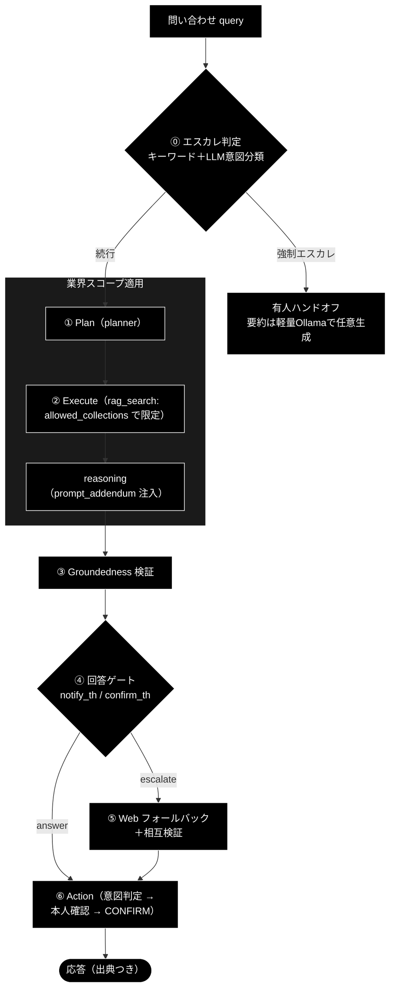

# 業界特化（VerticalProfile / GRACE-Support Vertical）Ollama 移植仕様書

**Version 1.0** | 作成日: 2026-07-03 | 対象リポジトリ: `ollama_grace_agent_v2`

> 本書は `anthropic_grace_agent_v2` で実装済みの「業界特化（VerticalProfile）」改修を
> `ollama_grace_agent_v2` へ移植するための仕様書である。実 TODO（作業チェックリスト）は
> [`docs/vertical_port_todo.md`](./vertical_port_todo.md) を参照。
>
> **移植元の正**: `anthropic_grace_agent_v2` の PR #106〜#130
> （`docs/vertical_spec_review.md` v1.2 / `grace/doc/agent_support_verticals.md` v1.4）を
> 「ロジックの正」とする。**プロバイダ層（LLM/Embedding/コレクション名/APIキー）は Ollama を維持する。**

---

## 目次

- [0. 要約（結論）](#0-要約結論)
- [1. 「業界特化」とは何か（移植対象の定義）](#1-業界特化とは何か移植対象の定義)
- [2. 移植方向の鉄則（プロバイダ差は取り込まない）](#2-移植方向の鉄則プロバイダ差は取り込まない)
- [3. 現状ギャップ（anthropic ↔ ollama 比較）](#3-現状ギャップanthropic--ollama-比較)
- [4. アーキテクチャと配線（2 つの load-bearing フック）](#4-アーキテクチャと配線2-つの-load-bearing-フック)
- [5. 移植ファイル一覧（コピー / 改変 / 新規）](#5-移植ファイル一覧コピー--改変--新規)
- [6. プロバイダ・トークン読み替え表](#6-プロバイダトークン読み替え表)
- [7. コレクション命名の読み替え](#7-コレクション命名の読み替え)
- [8. KPI 評価ハーネス（eval/vertical/）](#8-kpi-評価ハーネスevalvertical)
- [9. テスト移植](#9-テスト移植)
- [10. ドキュメント移植](#10-ドキュメント移植)
- [11. 要確認事項（設計判断）](#11-要確認事項設計判断)
- [12. 変更履歴](#12-変更履歴)

---

## 0. 要約（結論）

3 リポジトリ（anthropic / ollama）の**プログラムとドキュメントを実コードで突合**した結果、次が結論である。

1. **ollama には業界特化サブシステムが丸ごと存在しない。**
   `agent_support_example.py`（GRACE-Support 本体 ＋ `VerticalProfile`）・`support_actions.py`・
   `eval/vertical/` 一式・業界特化ドキュメント・関連テストが**すべて未移植**。
   これは「差分の移植」ではなく「サブシステムの新規移植」である。

2. **移植に必要なコアフックの大半は、ollama 側に既に存在する。**
   `RAGSearchTool.execute(collection=...)`・`ReasoningTool.execute(context=...)`・
   `PlanStep.collection`・`_prepare_tool_kwargs` の collection/context 配線・
   `restrict_to_collection` / `search_priority` は ollama にも実装済み。
   **新規に足すべきコアは 2 点の「配線フック」だけ** — `QdrantConfig.allowed_collections` と
   `LLMConfig.prompt_addendum`（と、その適用箇所 `RAGSearchTool._apply_allowed_collections` /
   `ReasoningTool._build_prompt`）。

3. **LLM クライアント seam が両者で互換。**
   ollama の `grace/llm_compat.create_chat_client()` は anthropic と同じ
   `client.models.generate_content(...)`（google-genai 互換 shim・`.text` / `.usage_metadata`）を提供する
   （`grace/llm_compat.py:121-222`）。よって二段意図分類・no-info 判定・reasoning は
   **モデル文字列の差し替えだけ**でそのまま動く。プロバイダ移植のリスクは低い。

4. **評価ハーネスの大半（`metrics.py` / `cases/*.jsonl` / `data/*.csv`）はプロバイダ非依存**でそのままコピー可。
   プロバイダ結合は「コレクション名 `*_anthropic`」「Embedding `provider="gemini"` / 3072 次元」
   「APIキー前提」の 3 点に集中している。

---

## 1. 「業界特化」とは何か（移植対象の定義）

「業界特化」とは、GRACE-Support（出典付き・groundedness ゲート付きのサポート回答エンジン）に対し、
**1 つのエンジン ＋ 業界別プロファイル（差し替え式）** で自治体 / SaaS / EC の 3 業種に対応する仕組みである。
コアエンジンは共通のまま、`VerticalProfile` の値だけで挙動を切り替える。構成機構は次の 7 つ。

| # | 機構 | 実装（anthropic 基準） | ロジック / プロバイダ区分 |
|---|---|---|---|
| 1 | **検索スコープ限定**（許可リスト） | `QdrantConfig.allowed_collections` ＋ `RAGSearchTool._apply_allowed_collections` | ロジック（フック新規） |
| 2 | **業界方針のプロンプト注入** | `LLMConfig.prompt_addendum` ＋ `ReasoningTool._build_prompt` | ロジック（フック新規） |
| 3 | **二段エスカレ判定**（キーワード＋LLM意図分類） | `_should_force_escalate` / `create_intent_classifier` | ロジック（モデル差替のみ） |
| 4 | **アクション判定**（意図キーワード→ActionType） | `_decide_action` ＋ `VerticalProfile.action_map` | ロジック |
| 5 | **本人確認フロー**（EC 必須） | `_perform_action` ＋ `support_actions.py`（`create_identity_verifier`） | ロジック（プロバイダ非依存） |
| 6 | **回答ゲートしきい値の業界別上書き** | `VerticalProfile.notify_th` / `confirm_th` | ロジック |
| 7 | **④' 情報なし判定**（few-shot LLM 判定） | `create_no_info_judge` / `_detect_no_info_answer` | ロジック（モデル差替のみ） |

`VerticalProfile` は 3 業種を定義（`agent_support_example.py:103-151`）。フィールドは
`name / collections / escalate_keywords / action_map / require_identity / notify_th / confirm_th / prompt_addendum`。

---

## 2. 移植方向の鉄則（プロバイダ差は取り込まない）

anthropic を「正」とするのは**ロジックのみ**。以下は既存の移植規約（CLAUDE.md §9.1 /
`docs/ollama_logic_port_todo_june13.md`）どおり、**Ollama 実装の上に移植**する。anthropic ファイルの丸コピーは禁止。

| 項目 | ❌ 取り込まない（anthropic） | ✅ 維持（ollama） |
|---|---|---|
| LLM クライアント | `create_llm_client("anthropic")` / `create_chat_client`（内部 Anthropic） | `create_llm_client("ollama")` / `create_chat_client`（内部 Ollama shim） |
| デフォルトモデル | `claude-sonnet-4-6` | `gemma4:e4b`（または `llama3.2`） |
| 軽量モデル（意図分類・no-info） | `claude-haiku-4-5-20251001` | 軽量 Ollama タグ（`llama3.2:3b` 等・§11 で確定） |
| Embedding / 次元 | `gemini-embedding-001` / 3072 | `nomic-embed-text` / 768 |
| Embedding provider 文字列 | `"gemini"` | `"ollama"` |
| コスト計算 | あり（$/MTok） | **なし**（ローカル実行・トークン集計のみ） |
| API キー | `ANTHROPIC_API_KEY` / `GOOGLE_API_KEY` 必須 | 不要（ローカル・キーレス） |
| Qdrant コレクション | `*_anthropic` | `*_ollama` |

---

## 3. 現状ギャップ（anthropic ↔ ollama 比較）

### 3.1 プログラム

| 種別 | ファイル | anthropic | ollama | 移植方針 |
|---|---|---|---|---|
| ドライバ | `agent_support_example.py`（905行） | あり | **無し** | 新規移植（プロバイダ読替） |
| アクション層 | `support_actions.py`（252行） | あり | **無し** | ほぼ丸ごとコピー（プロバイダ非依存） |
| コア設定 | `grace/config.py` | `allowed_collections`(173) / `prompt_addendum`(69) あり | **両方無し** | フック 2 点を追加 |
| コアツール | `grace/tools.py` | `_apply_allowed_collections`(356-381) / 方針注入(526-528) あり | **両方無し** | 該当箇所を移植 |
| コア計画 | `grace/planner.py` / `grace/schemas.py` | `PlanStep.collection` あり | あり（`schemas.py:65`） | 変更不要 |
| コア実行 | `grace/executor.py` | collection/context 配線あり | あり（`:1204`/`:1253`） | 変更不要 |
| 評価 | `eval/vertical/`（run/metrics/register/fetch ＋ cases/data） | あり | **無し** | 新規移植 |

### 3.2 ドキュメント

| ファイル | anthropic | ollama | 方針 |
|---|---|---|---|
| `grace/doc/agent_support_verticals.md`（v1.4・業界特化 主設計書） | あり | 無し | 移植（プロバイダ読替） |
| `grace/doc/agent_support_example.md`（GRACE-Support コア設計） | あり | 無し | 移植（概念中心・読替少） |
| `docs/vertical_test_data.md`（テストデータ準備ガイド） | あり | 無し | 移植（データ候補・キー読替） |
| `docs/migration_and_update.md`（需要分析・ロードマップ） | あり | 無し | 移植（読替ほぼ不要） |
| `docs/vertical_spec_review.md`（実装レビュー） | あり | 無し | 任意移植（履歴資料） |

---

## 4. アーキテクチャと配線（2 つの load-bearing フック）

業界特化の「配線」は、`run_support_agent()` 冒頭で共有 config を書き換える 2 行に集約される
（anthropic `agent_support_example.py:658-659`）。

```python
config.qdrant.allowed_collections = list(profile.collections) if profile else []
config.llm.prompt_addendum        = profile.prompt_addendum   if profile else ""
```

- **① 検索スコープ**: `config.qdrant.allowed_collections` は tools が保持する同一 config を書き換える。
  `RAGSearchTool.execute()` が候補コレクション構築後に `_apply_allowed_collections()` で許可リストと
  **部分一致で積集合**を取り、業界外への漏れ（フォールバック連鎖含む）を塞ぐ。
  **一致ゼロ（未登録）時は制限を適用せず従来動作**（デモ・評価の継続性を優先／警告を出す）。
- **② 業界方針**: `config.llm.prompt_addendum` は `ReasoningTool._build_prompt()` の
  システム指示直後に `【業務方針（遵守）】` ブロックとして連結され、ReAct / リプラン経路にも自動で効く。

### 4.1 改善後の処理フロー（移植後・Ollama）



---

## 5. 移植ファイル一覧（コピー / 改変 / 新規）

凡例: **C**=ほぼコピー（プロバイダ非依存）／**A**=改変（プロバイダ読替）／**N**=新規（コアに追記）

### 5.1 コア（grace/）

| 区分 | 対象（ollama） | 内容 | 参照（anthropic） |
|---|---|---|---|
| N | `grace/config.py` `LLMConfig`（:54） | `prompt_addendum: str = ""` を追加 | config.py:69 |
| N | `grace/config.py` `QdrantConfig`（:147） | `allowed_collections: list = Field(default_factory=list)` を追加 | config.py:173 |
| N | `grace/tools.py` `RAGSearchTool` | `_apply_allowed_collections()`（staticmethod・部分一致・空/未一致は無制限）を追加し、`execute()` の候補構築後に適用（`allowed_collections` kwarg も受ける） | tools.py:356-381 / 160-165 |
| N | `grace/tools.py` `ReasoningTool._build_prompt()`（:503） | `getattr(config.llm,"prompt_addendum","")` を `【業務方針（遵守）】` として注入 | tools.py:525-528 |

> planner / executor / schemas は変更不要（フックは既存）。

### 5.2 アプリ層（トップレベル）

| 区分 | 対象（ollama・新規） | 内容 | 参照（anthropic） |
|---|---|---|---|
| A | `agent_support_example.py` | GRACE-Support 本体 ＋ `VerticalProfile` ＋ `PROFILES` ＋ `run_support_agent` ＋ 二段判定 ＋ ④'no-info ＋ CLI。**モデル・キー・コレクション名を Ollama へ読替**（§6） | agent_support_example.py 全体 |
| C | `support_actions.py` | ActionBackend（dry-run/webhook/pseudo）＋ 本人確認（CSV台帳）。**プロバイダ非依存・そのままコピー** | support_actions.py 全体 |

### 5.3 評価（eval/vertical/・新規ディレクトリ）

| 区分 | 対象 | 内容 | 参照 |
|---|---|---|---|
| C | `eval/vertical/__init__.py` | パッケージ docstring（CLI ヒントのみ読替） | 同名 |
| A | `eval/vertical/run.py` | KPI ランナー CLI（docstring のキー前提を読替） | 同名 |
| C | `eval/vertical/metrics.py` | 決定的 KPI 計算（**完全にプロバイダ非依存・無改変**） | 同名 |
| A | `eval/vertical/register_test_collections.py` | 一括登録 CLI（`provider="gemini"→"ollama"` / 次元 / コレクション名 `*_ollama`） | 同名 |
| A | `eval/vertical/fetch_real_knowledge.py` | 実データ取得整形（**印字ヒント中の 2 コレクション名のみ**読替。e-Gov / FastAPI URL は保持） | 同名 |
| C | `eval/vertical/cases/{gov,saas,ec}.jsonl` | 期待ラベル付きテスト質問（日本語・プロバイダ非依存） | 同名 |
| C | `eval/vertical/data/*.csv`（6本） | 合成 Q&A コーパス（`question,answer,topic`） | 同名 |

### 5.4 テスト（§9 参照）

`tests/test_agent_support_vertical.py` / `tests/test_support_actions.py` /
`tests/grace/test_vertical_scope.py` / `tests/eval/{test_vertical_metrics,test_register_test_collections,test_fetch_real_knowledge}.py`。

---

## 6. プロバイダ・トークン読み替え表

| 箇所（anthropic） | トークン | Ollama への読み替え |
|---|---|---|
| `agent_support_example.py:91` | `INTENT_MODEL="claude-haiku-4-5-20251001"` | 軽量 Ollama タグ（`llama3.2:3b` 等・§11） |
| `agent_support_example.py:613` | `os.getenv("ANTHROPIC_API_KEY")` ゲート | 削除（キーレス）。必要なら `OLLAMA_HOST`/`base_url` 到達性チェックに置換 |
| `agent_support_example.py:35`（docstring） | `ANTHROPIC_API_KEY` / `GOOGLE_API_KEY` | 「APIキー不要（ローカル）」に修正 |
| `agent_support_example.py:124-150`（PROFILES） | コレクション名 `*_anthropic` ＋ `wikipedia_ja` | `*_ollama`（§7）。`wikipedia_ja` は ollama `search_priority` 既定に合わせ維持 |
| `grace/config.py:57-62` | `provider="anthropic"` / `claude-sonnet-4-6` / `light_model` | ollama は既定 `"ollama"` / `gemma4:e4b`（変更不要。`prompt_addendum` のみ追加） |
| `grace/config.py:74-76` | `provider="gemini"` / `gemini-embedding-001` / 3072 | ollama は既定 `"ollama"` / `nomic-embed-text` / 768（変更不要） |
| `eval/vertical/register_test_collections.py` | `--provider` 既定 `"gemini"`・ヘルプ「3072次元」 | `"ollama"`・「nomic-embed-text 768次元」 |
| `eval/vertical/run.py`（docstring） | `.env` に `ANTHROPIC_API_KEY / GOOGLE_API_KEY` | 「APIキー不要・要 Ollama/Qdrant 起動」 |
| ドキュメント各所 | `claude-*` モデル・$/MTok 価格 | Ollama タグ・「ローカル実行・コスト無し」 |
| `support_actions.py` | `SUPPORT_ACTION_WEBHOOK_URL` 等 | プロバイダ非依存・維持 |
| `grace/tools.py` `WebSearchTool` | `SERPAPI_KEY` / `GOOGLE_CSE_*` | プロバイダ非依存・維持（ollama 既定 backend も `serpapi`） |

> **LLM 呼び出し形状**: 両者とも `create_chat_client(config)` → `client.models.generate_content(model=..., contents=..., config={...})` →
> `response.text` / `response.usage_metadata`（ollama `grace/llm_compat.py:121-222`）。二段分類・no-info 判定は
> **モデル文字列の差し替えのみ**で移植可能。構造化出力（`response_schema`/`response_mime_type`）を使う planner 経路は
> ollama shim が対応済み（既存 GRACE が稼働しているため）。

---

## 7. コレクション命名の読み替え

`*_anthropic` → `*_ollama`。VerticalProfile・register・fetch・テストのすべてで統一する。

| 業種 | anthropic（正にしない） | **ollama（採用）** | 裏付け CSV（`eval/vertical/data/`） |
|---|---|---|---|
| gov | `gov_faq_anthropic` / `gov_laws_anthropic` / `wikipedia_ja` | `gov_faq_ollama` / `gov_laws_ollama` / `wikipedia_ja`（暫定共有） | `gov_faq.csv` / `gov_laws.csv` |
| saas | `saas_docs_anthropic` / `saas_api_anthropic` | `saas_docs_ollama` / `saas_api_ollama` | `saas_docs.csv` / `saas_api.csv` |
| ec | `ec_policy_anthropic` / `ec_faq_anthropic` | `ec_policy_ollama` / `ec_faq_ollama` | `ec_policy.csv` / `ec_faq.csv` |

- `register_test_collections.VERTICAL_COLLECTIONS` は上記 6 本の `*_ollama` を登録（`wikipedia_ja` は登録対象外）。
- `fetch_real_knowledge.py` の印字フォローアップコマンド（L290）中 `gov_laws_anthropic` / `saas_docs_anthropic` を
  `*_ollama` に更新。
- **`wikipedia_ja`**（gov 暫定フォールバック）は ollama `QdrantConfig.search_priority` 既定に存在するため接尾辞を付けない。
- **Embedding 次元の整合が必須**: `RAGSearchTool` は `config.embedding.dimensions`（ollama=768）で
  コレクションを次元フィルタする。よって登録コレクションは **768 次元（nomic-embed-text）**で作ること。
  anthropic の 3072 次元コレクションを流用してはならない。

---

## 8. KPI 評価ハーネス（eval/vertical/）

### 8.1 テストケース JSONL スキーマ（`cases/*.jsonl`）

1 行 1 JSON。先頭行は `#` コメント（`load_cases` がスキップ）。5 カテゴリ:
`in-scope / out-of-scope / action / escalate-keyword / keyword-trap`。

```json
{"vertical":"gov","category":"in-scope","query":"住民票の写しの取り方は？","expected_decision":"answer","expected_action":null}
{"vertical":"ec","category":"action","query":"返品したい","expected_decision":"answer","expected_action":"create_ticket","expect_identity_check":true}
{"vertical":"saas","category":"escalate-keyword","query":"サービスが落ちています","expected_decision":"escalate","expected_action":"escalate_to_human"}
```

### 8.2 メトリクス定義（`metrics.py`・プロバイダ非依存・無改変）

`_rate(num, den)`（den=0 → `None`）ベース。答え可能=`in-scope`＋`keyword-trap`、必須エスカレ=`out-of-scope`＋`escalate-keyword`。

| メトリクス | 定義（分子 / 分母） | 目標 |
|---|---|---|
| `decision_accuracy` | `decision==expected_decision` / 非エラー全体 | 1.0 |
| `false_escalate_rate` | 答え可能のうち escalate / 答え可能 | 0 |
| `forced_escalate_misfire_rate` | 答え可能のうち `forced_escalate` / 答え可能 | 0 |
| `escalate_recall` | 必須エスカレのうち escalate / 必須エスカレ | 1.0 |
| `citation_rate` | answer のうち `citation_count>=1` / answer | 1.0 |
| `ungrounded_answer_rate` | answer かつ `groundedness_decided>0 && groundedness<confirm_th` / answer | 0 |
| `action_accuracy` | `action_type==expected_action` / 非エラー全体 | 1.0 |
| `identity_check_rate` | `expect_identity_check` かつ `identity_checked` / 該当ケース | 1.0 |
| `mean_latency_ms` | 非エラーの平均レイテンシ | 小さいほど良 |

### 8.3 実行例（移植後）

```bash
# 1) 業界コレクションを 768 次元で登録（Ollama Embedding）
python -m eval.vertical.register_test_collections --vertical all --recreate --provider ollama

# 2) KPI 評価（常に dry-run・副作用なし）
python -m eval.vertical.run --vertical gov --report logs/vertical_gov.json
```

---

## 9. テスト移植

| 対象（ollama・新規） | 内容 | プロバイダ改変 |
|---|---|---|
| `tests/test_agent_support_vertical.py` | 純関数ユニット（`_answer_gate` / `_should_force_escalate` / `_decide_action` / `_detect_no_info_answer` / `TestProfiles`）。stub classifier/judge で API 不要 | PROFILES のコレクション名 assert を `*_ollama` に |
| `tests/test_support_actions.py` | ActionBackend ＋ 本人確認（webhook mock / CSV 台帳） | 無し（プロバイダ非依存） |
| `tests/grace/test_vertical_scope.py` | `_apply_allowed_collections` ＋ `prompt_addendum` 注入 ＋ 命名規約 | `_anthropic` → `_ollama` の assert、候補名を `*_ollama` に |
| `tests/eval/test_vertical_metrics.py` | `compute_metrics`/`format_table` ＋ `cases/*.jsonl` スキーマ検証 | 無し |
| `tests/eval/test_register_test_collections.py` | CSV データ整合（≥5行・重複無し・意図的な穴・命名） | `_anthropic` → `_ollama` の assert |
| `tests/eval/test_fetch_real_knowledge.py` | XML/Markdown パース・CSV スキーマ（ネット不要） | 無し |

- 実 Ollama/Qdrant 依存は既存規約どおり `RUN_OLLAMA_INTEGRATION=1` / `@pytest.mark.integration` でゲート。
- 検証は既存どおり `uv run pytest` ＋ `ruff check .` ＋ `python -m compileall`。

---

## 10. ドキュメント移植

移植時は CLAUDE.md §9.1 の技術スタック表記統一（Ollama / gemma4:e4b / nomic-embed-text 768 / `*_ollama` / コスト無し / キー不要）と
§7 の Mermaid 黒背景スタイルを厳守する。

| 移植先（ollama） | 主な読替 |
|---|---|
| `grace/doc/agent_support_verticals.md` | モデル（claude→Ollama）・Embedding（gemini/3072→nomic/768）・コレクション `*_ollama`・§9.3 コスト章は「ローカル・コスト無し」・キー前提削除 |
| `grace/doc/agent_support_example.md` | 概念中心。しきい値（silent=0.9/notify=0.7/confirm=0.4）は共通。モデル名の記述のみ読替 |
| `docs/vertical_test_data.md` | Embedding「nomic 768次元」・`*_ollama`・キー前提削除。データ候補（e-Gov / OSS docs / 合成）は維持 |
| `docs/migration_and_update.md` | 読替ほぼ不要（計画・需要分析）。図中の表記のみ統一 |
| `docs/vertical_spec_review.md` | 任意（履歴資料）。移植する場合は同様に読替 |

---

## 11. 要確認事項（設計判断）

移植前に確定すべき判断。既定案を推奨として併記する。

1. **軽量モデル（意図分類・no-info 判定）の選定**（推奨: `llama3.2:3b`）。
   anthropic は `claude-haiku-4-5-20251001` を `INTENT_MODEL` として使用。ollama の `LLMConfig` に
   `light_model` は無いため、(a) モジュール定数 `INTENT_MODEL="llama3.2:3b"` を置く、
   (b) `LLMConfig.light_model` を新設、(c) 既定 `config.llm.model`（`gemma4:e4b`）を流用、のいずれか。
   ローカルはコスト無しのため精度重視で (c) でも可。**推奨は (b) 新設**（anthropic と対応が取りやすい）。
   → **確定**: (b)＋(c) を採用。`LLMConfig.light_model` を新設し、既定値は `gemma4:e4b`（＝メインと同一）。
   当初 `llama3.2:3b` を既定にしたが、gov 実機計測で 3B 級が日本語 question/request を誤判定し
   keyword-trap で強制エスカレ誤発火（decision_accuracy=0.0）したため、精度優先で既定を `gemma4:e4b` に統一。
   `light_model` を `llama3.2:3b` 等へ設定すればレイテンシは短縮できる（精度とのトレードオフ）。

2. **コレクション接尾辞**（推奨: `*_ollama`）。§7 の命名で確定。CLAUDE.md §9.1 の規約と一致。

3. **Embedding 次元**（確定: 768 / `nomic-embed-text`）。登録・検索の両方で 768 に統一。既存 ollama 既定と一致。

4. **Web 検索 backend**（既定維持: `serpapi`、キー無し環境は `duckduckgo`）。プロバイダ非依存のため変更不要。

5. **移植範囲の確認**: `docs/vertical_spec_review.md`（実装レビュー履歴）を移植対象に含めるか。

---

## 12. 変更履歴

| バージョン | 変更内容 |
|-----------|---------|
| 1.0 | 初版。anthropic PR #106〜#130 の業界特化改修と ollama 現状をプログラム／ドキュメントで突合。現状ギャップ・2 つの load-bearing フック・移植ファイル一覧・プロバイダ読替表・コレクション命名・KPI ハーネス・テスト／ドキュメント移植・要確認事項を記載 |
