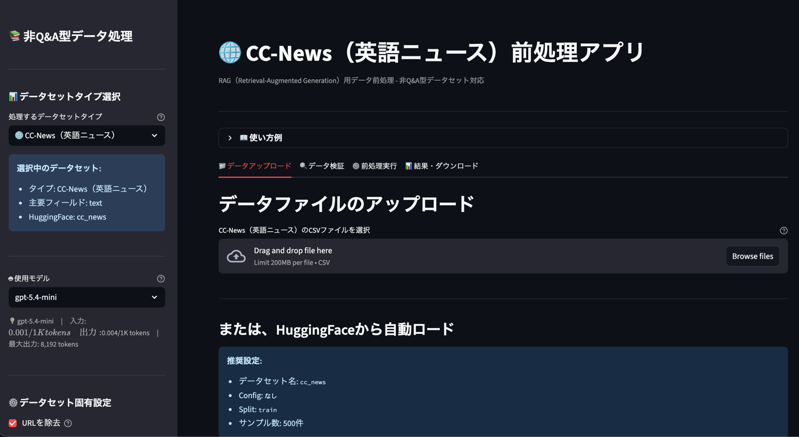
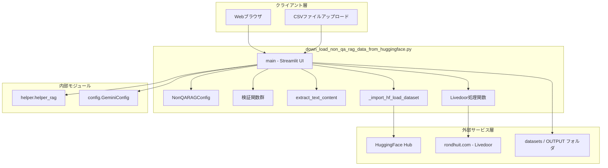
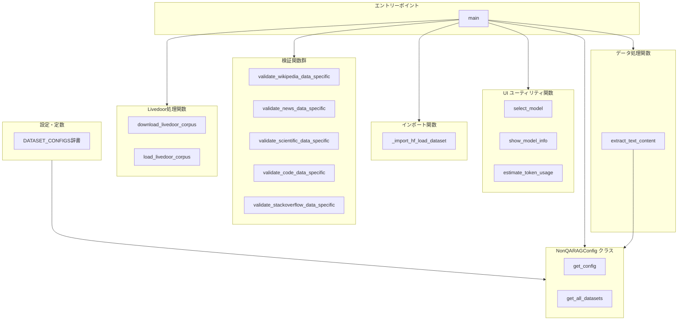
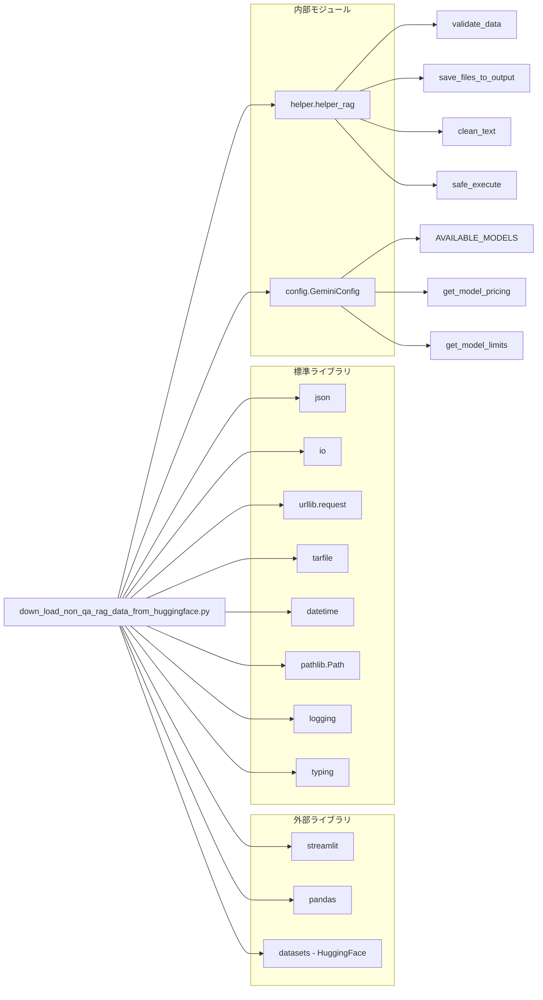

## 非Q&A型RAGデータ処理ツール ドキュメント
- (down_load_non_qa_rag_data_from_huggingface.py)

**Version 1.0** | 最終更新: 2026-02-16

---

## 目次

1. [概要](#概要)
2. [アーキテクチャ構成図](#1-アーキテクチャ構成図)
3. [モジュール構成図](#2-モジュール構成図)
4. [クラス・関数一覧表](#3-クラス関数一覧表)
5. [クラス・関数 IPO詳細](#4-クラス関数-ipo詳細)
6. [設定・定数](#5-設定定数)
7. [使用例](#6-使用例)
8. [エクスポート](#7-エクスポート)
9. [変更履歴](#8-変更履歴)
10. [付録: 依存関係図](#付録-依存関係図)

---

## 概要

`down_load_non_qa_rag_data_from_huggingface.py`は、HuggingFace Hub および直接ダウンロードによる非Q&A型データセットの取得・検証・前処理を行う Streamlit Web アプリケーション。RAG（Retrieval-Augmented Generation）パイプラインの入力データを準備するためのツールであり、日本語・英語の多様なデータセットに対応する。

### 主な責務

- HuggingFace Hub / 直接URL からのデータセットダウンロード
- データセット種別に応じた品質検証（Wikipedia / ニュース / 学術 / コード）
- RAG 用テキスト抽出・クレンジング・結合前処理
- トークン使用量とコストの推定表示
- CSV / TXT / JSON フォーマットでの出力・保存

### 各責務対応のモジュール

| # | 責務 | 対応モジュール | 説明 |
|---|------|--------------|------|
| 1 | データセットダウンロード | `down_load_non_qa_rag_data_from_huggingface.py` | HuggingFace streaming / Livedoor 直接DL |
| 2 | 品質検証 | `down_load_non_qa_rag_data_from_huggingface.py`, `helper.helper_rag` | データセット別検証 + 汎用検証 |
| 3 | テキスト前処理 | `down_load_non_qa_rag_data_from_huggingface.py`, `helper.helper_rag` | テキスト抽出・クレンジング |
| 4 | トークン推定 | `down_load_non_qa_rag_data_from_huggingface.py`, `config` | モデル料金情報と推定計算 |
| 5 | 出力・保存 | `helper.helper_rag` | CSV/TXT/JSON 出力と OUTPUT フォルダ保存 |

### 主要機能一覧

| 機能 | 説明 |
|------|------|
| `NonQARAGConfig` | データセット設定を一元管理するクラス |
| `NonQARAGConfig.get_config()` | 指定データセットタイプの設定辞書を取得 |
| `NonQARAGConfig.get_all_datasets()` | 全データセットタイプキーのリストを取得 |
| `select_model()` | サイドバーに Gemini モデル選択ウィジェットを表示 |
| `show_model_info()` | 選択モデルの料金・制限情報を表示 |
| `estimate_token_usage()` | DataFrame のトークン使用量と概算コストを表示 |
| `_import_hf_load_dataset()` | HuggingFace datasets の安全なインポート（名前衝突回避） |
| `validate_wikipedia_data_specific()` | Wikipedia データ固有の検証 |
| `validate_news_data_specific()` | ニュースデータ固有の検証 |
| `validate_scientific_data_specific()` | 学術論文データ固有の検証 |
| `validate_code_data_specific()` | コードデータ固有の検証 |
| `validate_stackoverflow_data_specific()` | Stack Overflow データ固有の検証 |
| `download_livedoor_corpus()` | Livedoor ニュースコーパスのダウンロード・解凍 |
| `load_livedoor_corpus()` | Livedoor コーパスのファイル読み込みと DataFrame 化 |
| `extract_text_content()` | データセットからテキストコンテンツを抽出・結合 |
| `main()` | Streamlit アプリケーションのエントリーポイント |

---

## 1. アーキテクチャ構成図

### 1.1 システム全体構成



### 1.2 データフロー

1. ユーザーが Streamlit UI でデータセットタイプとオプションを選択
2. CSV アップロード、または HuggingFace / 直接 URL からデータ取得
3. データセット種別に応じた品質検証を実行
4. テキスト抽出・クレンジング・短文除外・重複除去の前処理を実行
5. 処理済みデータを CSV / TXT / JSON 形式でダウンロードまたは OUTPUT フォルダに保存

---

## 2. モジュール構成図

### 2.1 内部モジュール構成



### 2.2 外部依存関係

| ライブラリ | 用途 |
|-----------|------|
| `streamlit` | Web UI フレームワーク |
| `pandas` | DataFrame 操作・CSV 入出力 |
| `datasets`（HuggingFace） | HuggingFace データセットのストリーミング取得 |

### 2.3 内部依存モジュール

| モジュール | 用途 |
|-----------|------|
| `helper.helper_rag.validate_data` | 汎用データ検証 |
| `helper.helper_rag.save_files_to_output` | OUTPUT フォルダへのファイル保存 |
| `helper.helper_rag.clean_text` | テキストクレンジング |
| `helper.helper_rag.safe_execute` | デコレータ（例外安全実行） |
| `config.GeminiConfig` | Gemini モデルの料金・制限情報 |

---

## 3. クラス・関数一覧表

### 3.1 クラス一覧

#### NonQARAGConfig

| メソッド | 概要 |
|---------|------|
| `get_config(dataset_type)` | 指定データセットタイプの設定辞書を取得 |
| `get_all_datasets()` | 全データセットタイプキーのリストを取得 |

### 3.2 関数一覧（カテゴリ別）

#### UI ユーティリティ関数

| 関数名 | 概要 |
|-------|------|
| `select_model()` | サイドバーにモデル選択ウィジェットを表示し、選択モデル名を返す |
| `show_model_info(model)` | 選択モデルの料金・制限情報をキャプション表示 |
| `estimate_token_usage(df, model)` | DataFrame の推定トークン数とコストを表示 |

#### インポート関数

| 関数名 | 概要 |
|-------|------|
| `_import_hf_load_dataset()` | ローカル datasets/ ディレクトリとの名前衝突を回避して HuggingFace `load_dataset` をインポート |

#### 検証関数

| 関数名 | 概要 |
|-------|------|
| `validate_wikipedia_data_specific(df)` | Wikipedia データのテキスト長・マークアップ・タイトル重複を検証 |
| `validate_news_data_specific(df, dataset_type)` | ニュースデータの記事長・カテゴリ分布を検証 |
| `validate_scientific_data_specific(df, dataset_type)` | 学術論文データの要旨長・学術用語を検証 |
| `validate_code_data_specific(df)` | コードデータのコード長・ドキュメント有無を検証 |
| `validate_stackoverflow_data_specific(df)` | Stack Overflow データの質問長・タグ分布を検証 |

#### Livedoor 処理関数

| 関数名 | 概要 |
|-------|------|
| `download_livedoor_corpus(save_dir)` | Livedoor ニュースコーパスの tar.gz をダウンロード・解凍 |
| `load_livedoor_corpus(data_dir)` | 解凍済みディレクトリからカテゴリ別に記事を読み込み DataFrame 化 |

#### データ処理関数

| 関数名 | 概要 |
|-------|------|
| `extract_text_content(df, dataset_type)` | データセット設定に基づきタイトル+テキストを結合した Combined_Text を生成 |

#### エントリーポイント

| 関数名 | 概要 |
|-------|------|
| `main()` | Streamlit アプリの UI 構築・全処理フローを統括 |

---

## 4. クラス・関数 IPO詳細

### 4.1 NonQARAGConfig クラス

非Q&A型 RAG データセットの設定を一元管理するクラス。クラス変数 `DATASET_CONFIGS` にデータセット定義辞書を保持し、クラスメソッドでアクセスする。

#### クラスメソッド: `get_config`

**概要**: 指定されたデータセットタイプに対応する設定辞書を返す。未知のタイプにはデフォルト設定を返す。

```python
@classmethod
def get_config(cls, dataset_type: str) -> Dict[str, Any]
```

| パラメータ | 型 | デフォルト | 説明 |
|------------|------|-----------|------|
| `dataset_type` | str | - | データセットタイプキー（例: `"wikipedia_ja"`, `"livedoor"`） |

| 項目 | 内容 |
|------|------|
| **Input** | `dataset_type: str` |
| **Process** | 1. `DATASET_CONFIGS` から該当キーの辞書を検索<br>2. 見つからない場合はデフォルト設定辞書を返す |
| **Output** | `Dict[str, Any]`: データセット設定辞書 |

**戻り値例**:
```python
{
    "name": "Wikipedia日本語版",
    "icon": "📚",
    "required_columns": ["title", "text"],
    "description": "Wikipedia日本語版の記事データ",
    "hf_dataset": "wikimedia/wikipedia",
    "hf_config": "20231101.ja",
    "split": "train",
    "streaming": True,
    "text_field": "text",
    "title_field": "title",
    "sample_size": 1000
}
```

```python
# 使用例
config = NonQARAGConfig.get_config("wikipedia_ja")
print(config["hf_dataset"])
# 出力: wikimedia/wikipedia
```

#### クラスメソッド: `get_all_datasets`

**概要**: 登録済み全データセットタイプのキーリストを返す。

```python
@classmethod
def get_all_datasets(cls) -> List[str]
```

| 項目 | 内容 |
|------|------|
| **Input** | なし（clsのみ） |
| **Process** | `DATASET_CONFIGS` の全キーをリスト化 |
| **Output** | `List[str]`: データセットタイプキーのリスト |

**戻り値例**:
```python
["wikipedia_ja", "japanese_text", "cc_news", "livedoor"]
```

```python
# 使用例
datasets = NonQARAGConfig.get_all_datasets()
print(datasets)
# 出力: ['wikipedia_ja', 'japanese_text', 'cc_news', 'livedoor']
```

---

### 4.2 UI ユーティリティ関数

#### `select_model`

**概要**: Streamlit サイドバーにモデル選択セレクトボックスを表示し、選択されたモデル名を返す。

```python
def select_model() -> str
```

| 項目 | 内容 |
|------|------|
| **Input** | なし（`GeminiConfig.AVAILABLE_MODELS` を内部参照） |
| **Process** | 1. `st.selectbox` でモデル一覧を表示<br>2. ユーザーの選択を取得 |
| **Output** | `str`: 選択されたモデル名 |

**戻り値例**:
```python
"gemini-2.0-flash"
```

```python
# 使用例（Streamlitコンテキスト内）
with st.sidebar:
    model = select_model()
    print(model)
    # 出力: gemini-2.0-flash
```

#### `show_model_info`

**概要**: 選択モデルの入出力料金と最大出力トークン数をキャプション表示する。

```python
def show_model_info(model: str) -> None
```

| パラメータ | 型 | デフォルト | 説明 |
|------------|------|-----------|------|
| `model` | str | - | モデル名 |

| 項目 | 内容 |
|------|------|
| **Input** | `model: str` |
| **Process** | 1. `GeminiConfig.get_model_pricing()` で料金取得<br>2. `GeminiConfig.get_model_limits()` で制限取得<br>3. `st.caption` でフォーマット表示 |
| **Output** | `None`（Streamlit UI に表示） |

```python
# 使用例
show_model_info("gemini-2.0-flash")
# UI表示: 💡 gemini-2.0-flash | 入力: $0.0001/1K tokens 出力: $0.0004/1K tokens | 最大出力: 8,192 tokens
```

#### `estimate_token_usage`

**概要**: DataFrame の `Combined_Text` カラムからトークン使用量と概算コストを推定し、3 カラムのメトリクスで表示する。

```python
def estimate_token_usage(df: pd.DataFrame, model: str) -> None
```

| パラメータ | 型 | デフォルト | 説明 |
|------------|------|-----------|------|
| `df` | pd.DataFrame | - | `Combined_Text` カラムを含む DataFrame |
| `model` | str | - | コスト計算に使用するモデル名 |

| 項目 | 内容 |
|------|------|
| **Input** | `df: pd.DataFrame`, `model: str` |
| **Process** | 1. `Combined_Text` の総文字数を計算<br>2. 文字数 / 2.0 でトークン数を概算（日英混在向け）<br>3. トークン数 × 入力単価でコスト算出<br>4. `st.metric` で3カラム表示 |
| **Output** | `None`（Streamlit UI に表示） |

> 📝 **注意**: `Combined_Text` カラムが存在しない場合は警告を表示して早期リターンする。

```python
# 使用例
estimate_token_usage(df_processed, "gemini-2.0-flash")
# UI表示: 推定トークン数: 125,000 | 総文字数: 250,000 | 推定コスト: $0.0125
```

---

### 4.3 インポート関数

#### `_import_hf_load_dataset`

**概要**: プロジェクトルートの `datasets/` ディレクトリ（データ保存用、`__init__.py` なし）が Python 3 の暗黙の名前空間パッケージとして HuggingFace `datasets` を遮蔽する問題を回避し、正規の `load_dataset` をインポートして返す。

```python
def _import_hf_load_dataset() -> Callable
```

| 項目 | 内容 |
|------|------|
| **Input** | なし |
| **Process** | 1. `sys.modules` から `datasets` 関連キャッシュを全削除<br>2. `sys.path` を走査し、`datasets/` ディレクトリが存在するが `__init__.py` がないパスを除外<br>3. `importlib.invalidate_caches()` 実行後に `from datasets import load_dataset`<br>4. `finally` で `sys.path` を元に復元 |
| **Output** | `Callable`: HuggingFace `datasets.load_dataset` 関数 |

> ⚠️ **注意**: HuggingFace `datasets` パッケージが未インストールの場合は `ImportError` を送出する。

```python
# 使用例
hf_load_dataset = _import_hf_load_dataset()
dataset = hf_load_dataset("wikimedia/wikipedia", "20231101.ja", split="train", streaming=True)
```

---

### 4.4 検証関数

#### `validate_wikipedia_data_specific`

**概要**: Wikipedia データセット固有の品質検証を行い、検証結果メッセージのリストを返す。

```python
def validate_wikipedia_data_specific(df: pd.DataFrame) -> List[str]
```

| パラメータ | 型 | デフォルト | 説明 |
|------------|------|-----------|------|
| `df` | pd.DataFrame | - | Wikipedia データの DataFrame |

| 項目 | 内容 |
|------|------|
| **Input** | `df: pd.DataFrame` |
| **Process** | 1. `text` カラムの平均テキスト長を計算（100文字未満で警告）<br>2. Wiki マークアップ（`==`, `[[`, `]]`）の含有率を検出<br>3. `title` カラムの重複を検出 |
| **Output** | `List[str]`: 検証結果メッセージのリスト（絵文字付き） |

**戻り値例**:
```python
[
    "✅ 適切なテキスト長: 平均3500文字",
    "💡 Wikiマークアップ含む記事: 850件 (85.0%)",
    "⚠️ 重複タイトル: 3件"
]
```

```python
# 使用例
issues = validate_wikipedia_data_specific(df)
for issue in issues:
    print(issue)
```

#### `validate_news_data_specific`

**概要**: ニュースデータ（CC-News / Livedoor 等）固有の品質検証を行う。

```python
def validate_news_data_specific(df: pd.DataFrame, dataset_type: str) -> List[str]
```

| パラメータ | 型 | デフォルト | 説明 |
|------------|------|-----------|------|
| `df` | pd.DataFrame | - | ニュースデータの DataFrame |
| `dataset_type` | str | - | データセットタイプキー |

| 項目 | 内容 |
|------|------|
| **Input** | `df: pd.DataFrame`, `dataset_type: str` |
| **Process** | 1. テキストフィールドを自動判定（`content` → `body` → `text`）<br>2. 平均記事長を計算、100文字未満の短い記事を検出<br>3. `category` カラムがあればカテゴリ分布を分析 |
| **Output** | `List[str]`: 検証結果メッセージのリスト |

**戻り値例**:
```python
[
    "📊 平均記事長: 1200文字",
    "⚠️ 短い記事（<100文字）: 15件 (2.0%)",
    "📂 カテゴリ数: 9種類",
    "  - sports-watch: 900件",
    "  - it-life-hack: 870件",
    "  - kaden-channel: 860件"
]
```

```python
# 使用例
issues = validate_news_data_specific(df, "livedoor")
```

#### `validate_scientific_data_specific`

**概要**: 学術論文データ（PubMed / arXiv 等）固有の品質検証を行う。

```python
def validate_scientific_data_specific(df: pd.DataFrame, dataset_type: str) -> List[str]
```

| パラメータ | 型 | デフォルト | 説明 |
|------------|------|-----------|------|
| `df` | pd.DataFrame | - | 学術論文データの DataFrame |
| `dataset_type` | str | - | データセットタイプキー（`"pubmed"`, `"arxiv"` 等） |

| 項目 | 内容 |
|------|------|
| **Input** | `df: pd.DataFrame`, `dataset_type: str` |
| **Process** | 1. `abstract` カラムの平均要旨長を計算<br>2. 学術キーワード（research, study, 研究, 方法 等）の含有率を検出<br>3. PubMed の場合は医学用語を追加検出<br>4. arXiv の場合は `article` カラムの本文有無を確認 |
| **Output** | `List[str]`: 検証結果メッセージのリスト |

```python
# 使用例
issues = validate_scientific_data_specific(df, "pubmed")
```

#### `validate_code_data_specific`

**概要**: コードデータ固有の品質検証を行う。

```python
def validate_code_data_specific(df: pd.DataFrame) -> List[str]
```

| パラメータ | 型 | デフォルト | 説明 |
|------------|------|-----------|------|
| `df` | pd.DataFrame | - | コードデータの DataFrame |

| 項目 | 内容 |
|------|------|
| **Input** | `df: pd.DataFrame` |
| **Process** | 1. `code` カラムの平均コード長を計算<br>2. `func_documentation_string` カラムのドキュメント有無を確認<br>3. コードキーワード（`def`, `class`, `import` 等）の含有率を検出 |
| **Output** | `List[str]`: 検証結果メッセージのリスト |

```python
# 使用例
issues = validate_code_data_specific(df)
```

#### `validate_stackoverflow_data_specific`

**概要**: Stack Overflow データ固有の品質検証を行う。

```python
def validate_stackoverflow_data_specific(df: pd.DataFrame) -> List[str]
```

| パラメータ | 型 | デフォルト | 説明 |
|------------|------|-----------|------|
| `df` | pd.DataFrame | - | Stack Overflow データの DataFrame |

| 項目 | 内容 |
|------|------|
| **Input** | `df: pd.DataFrame` |
| **Process** | 1. `body` カラムの平均質問長を計算<br>2. `tags` カラムのタグ付与率と人気タグ Top5 を分析<br>3. 技術キーワード（python, javascript, error 等）の含有率を検出 |
| **Output** | `List[str]`: 検証結果メッセージのリスト |

```python
# 使用例
issues = validate_stackoverflow_data_specific(df)
```

---

### 4.5 Livedoor 処理関数

#### `download_livedoor_corpus`

**概要**: Livedoor ニュースコーパス（tar.gz）を rondhuit.com からダウンロードし、指定ディレクトリに解凍する。既にダウンロード・解凍済みの場合はスキップする。

```python
def download_livedoor_corpus(save_dir: str = "datasets") -> str
```

| パラメータ | 型 | デフォルト | 説明 |
|------------|------|-----------|------|
| `save_dir` | str | `"datasets"` | ダウンロード・解凍先の親ディレクトリ |

| 項目 | 内容 |
|------|------|
| **Input** | `save_dir: str = "datasets"` |
| **Process** | 1. 保存ディレクトリを作成（`mkdir(exist_ok=True)`）<br>2. tar.gz が未ダウンロードなら `urllib.request.urlretrieve` で取得<br>3. 解凍先が未展開なら `tarfile` で解凍（`filter='data'` でセキュリティ対策） |
| **Output** | `str`: 解凍先ディレクトリのパス |

**戻り値例**:
```python
"datasets/livedoor"
```

```python
# 使用例
data_dir = download_livedoor_corpus("datasets")
print(data_dir)
# 出力: datasets/livedoor
```

#### `load_livedoor_corpus`

**概要**: 解凍済みの Livedoor コーパスディレクトリから 9 カテゴリの全記事を読み込み、DataFrame として返す。

```python
def load_livedoor_corpus(data_dir: str) -> pd.DataFrame
```

| パラメータ | 型 | デフォルト | 説明 |
|------------|------|-----------|------|
| `data_dir` | str | - | Livedoor コーパスの解凍ディレクトリパス |

| 項目 | 内容 |
|------|------|
| **Input** | `data_dir: str` |
| **Process** | 1. 9 カテゴリディレクトリを走査<br>2. 各 txt ファイルを読み込み（LICENSE.txt, README.txt は除外）<br>3. ファイル形式: 1行目=URL, 2行目=日付, 3行目=タイトル, 4行目以降=本文<br>4. DataFrame に変換 |
| **Output** | `pd.DataFrame`: カラム `url`, `date`, `title`, `content`, `category` |

**戻り値例**:
```python
#    url                                    date        title            content          category
# 0  http://news.livedoor.com/article/...  2012-01-01  記事タイトル1    本文テキスト...  sports-watch
# 1  http://news.livedoor.com/article/...  2012-01-02  記事タイトル2    本文テキスト...  it-life-hack
```

**特徴**:
- 対応カテゴリ: `dokujo-tsushin`, `it-life-hack`, `kaden-channel`, `livedoor-homme`, `movie-enter`, `peachy`, `smax`, `sports-watch`, `topic-news`
- 全記事数: 約 7,376 件

```python
# 使用例
data_dir = download_livedoor_corpus("datasets")
df = load_livedoor_corpus(data_dir)
print(f"記事数: {len(df)}, カテゴリ: {df['category'].nunique()}")
# 出力: 記事数: 7376, カテゴリ: 9
```

---

### 4.6 データ処理関数

#### `extract_text_content`

**概要**: データセット設定に基づき、タイトルとテキストフィールドを結合・クレンジングした `Combined_Text` カラムを生成する。`@safe_execute` デコレータ付き。

```python
@safe_execute
def extract_text_content(df: pd.DataFrame, dataset_type: str) -> pd.DataFrame
```

| パラメータ | 型 | デフォルト | 説明 |
|------------|------|-----------|------|
| `df` | pd.DataFrame | - | 入力データの DataFrame |
| `dataset_type` | str | - | データセットタイプキー |

| 項目 | 内容 |
|------|------|
| **Input** | `df: pd.DataFrame`, `dataset_type: str` |
| **Process** | 1. `NonQARAGConfig.get_config()` でテキスト/タイトルフィールド名を取得<br>2. タイトル+テキストの結合（タイトルがある場合）<br>3. テキストのみの抽出（タイトルがない場合）<br>4. フォールバック: テキスト系フィールド候補（`text`, `content`, `body` 等）を自動検出<br>5. 最終フォールバック: 全カラムを結合<br>6. `clean_text()` でクレンジング<br>7. 空テキストの行を除外 |
| **Output** | `pd.DataFrame`: `Combined_Text` カラムが追加された DataFrame |

```python
# 使用例
df_processed = extract_text_content(df, "wikipedia_ja")
print(df_processed['Combined_Text'].head(1).values[0][:100])
# 出力: 日本 日本国は、東アジアに位置する民主制国家...
```

---

### 4.7 エントリーポイント

#### `main`

**概要**: Streamlit アプリケーションのメイン処理関数。UI 構築、データ取得、検証、前処理、出力の全フローを統括する。

```python
def main() -> None
```

| 項目 | 内容 |
|------|------|
| **Input** | なし（Streamlit UI 経由でユーザー入力を受け取る） |
| **Process** | 1. ページ設定・サイドバー構築（データセット/モデル選択）<br>2. Tab1: CSV アップロード or HuggingFace ダウンロード<br>3. Tab2: データ品質検証（汎用 + データセット固有）<br>4. Tab3: 前処理実行（テキスト抽出・短文除外・重複除去）<br>5. Tab4: 結果表示・CSV/TXT/JSON ダウンロード・OUTPUT 保存 |
| **Output** | `None`（Streamlit UI に表示） |

**UI タブ構成**:
- 📁 データアップロード: ファイルアップロード / HuggingFace ロード
- 🔍 データ検証: 基本検証 + データセット固有検証
- ⚙️ 前処理実行: テキスト抽出・フィルタリング
- 📊 結果・ダウンロード: 出力ファイル生成・保存

```python
# 使用例（起動コマンド）
# streamlit run down_load_non_qa_rag_data_from_huggingface.py --server.port=8502
```

---

## 5. 設定・定数

### 5.1 DATASET_CONFIGS

`NonQARAGConfig.DATASET_CONFIGS` はデータセット定義を管理する辞書。各エントリの構成は以下の通り。

| キー | 型 | 説明 |
|-----|------|------|
| `name` | str | データセットの表示名 |
| `icon` | str | UI 表示用の絵文字アイコン |
| `required_columns` | List[str] | 必須カラムのリスト |
| `description` | str | データセットの説明文 |
| `hf_dataset` | Optional[str] | HuggingFace データセット名（`None` = 直接 DL） |
| `hf_config` | Optional[str] | HuggingFace config 名 |
| `split` | Optional[str] | 使用する split 名 |
| `streaming` | bool | ストリーミングモードの有無 |
| `text_field` | str | テキスト本文のフィールド名 |
| `title_field` | Optional[str] | タイトルのフィールド名 |
| `sample_size` | int | デフォルトサンプル数 |

### 5.2 登録済みデータセット一覧

| キー | 名前 | HuggingFace | サンプル数 |
|------|------|-------------|-----------|
| `wikipedia_ja` | Wikipedia日本語版 | `wikimedia/wikipedia` (config: `20231101.ja`) | 1,000 |
| `japanese_text` | 日本語Webテキスト（CC100） | `range3/cc100-ja` | 1,000 |
| `cc_news` | CC-News（英語ニュース） | `cc_news` | 500 |
| `livedoor` | Livedoorニュースコーパス | なし（直接DL） | 7,376 |

---

## 6. 使用例

### 6.1 基本的なワークフロー（Streamlit 起動）

```bash
# 起動
streamlit run down_load_non_qa_rag_data_from_huggingface.py --server.port=8502

# ブラウザで http://localhost:8502 にアクセス
```

### 6.2 プログラム的な使用例

```python
from down_load_non_qa_rag_data_from_huggingface import (
    NonQARAGConfig,
    download_livedoor_corpus,
    load_livedoor_corpus,
    extract_text_content,
)

# 1. データセット設定の確認
config = NonQARAGConfig.get_config("livedoor")
print(f"データセット: {config['name']}")
# 出力: データセット: Livedoorニュースコーパス

# 2. Livedoor コーパスのダウンロードと読み込み
data_dir = download_livedoor_corpus("datasets")
df = load_livedoor_corpus(data_dir)
print(f"記事数: {len(df)}, カテゴリ: {df['category'].nunique()}")
# 出力: 記事数: 7376, カテゴリ: 9

# 3. テキスト抽出・前処理
df_processed = extract_text_content(df, "livedoor")
print(f"処理後: {len(df_processed)}件")
# 出力: 処理後: 7350件
```

### 6.3 HuggingFace データセット取得の使用例

```python
from down_load_non_qa_rag_data_from_huggingface import (
    _import_hf_load_dataset,
    extract_text_content,
)
import pandas as pd

# 1. HuggingFace load_dataset の安全なインポート
hf_load_dataset = _import_hf_load_dataset()

# 2. Wikipedia 日本語版をストリーミング取得
dataset = hf_load_dataset(
    "wikimedia/wikipedia", "20231101.ja",
    split="train", streaming=True
)

# 3. サンプリング
samples = []
for i, item in enumerate(dataset):
    if i >= 100:
        break
    samples.append(item)
df = pd.DataFrame(samples)

# 4. テキスト抽出
df_processed = extract_text_content(df, "wikipedia_ja")
print(f"取得: {len(df_processed)}件")
```

---

## 7. エクスポート

本スクリプトは `__all__` を定義していない。主要なエクスポート対象は以下の通り。

```python
# クラス
"NonQARAGConfig"

# 関数
"select_model"
"show_model_info"
"estimate_token_usage"
"validate_wikipedia_data_specific"
"validate_news_data_specific"
"validate_scientific_data_specific"
"validate_code_data_specific"
"validate_stackoverflow_data_specific"
"download_livedoor_corpus"
"load_livedoor_corpus"
"extract_text_content"
"main"

# プライベート関数
"_import_hf_load_dataset"
```

---

## 8. 変更履歴

| バージョン | 変更内容 |
|-----------|---------|
| 1.0 | 初版作成 |

---

## 付録: 依存関係図


