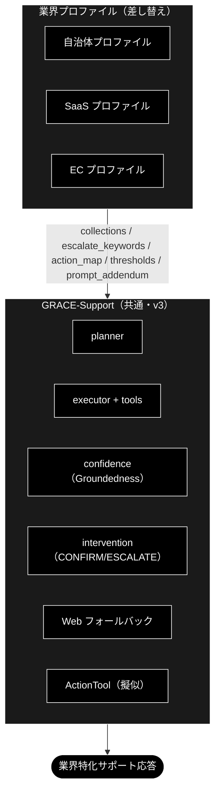

# GRACE-Support 業界特化 設計書（自治体 / SaaS / EC）

**Version 1.4（次工程候補①〜④をすべて実装: ungrounded 計測是正・web_search 耐性強化・実データ取得・実 ActionTool＋本人確認）** | 最終更新: 2026-07-03

> 📌 **移植メモ**: 本書は `anthropic_grace_agent_v2` の同名主設計書（v1.4）を `ollama_grace_agent_v2` へ移植したもの。設計ロジック（7 機構・二段判定・④' 情報なし判定・KPI ハーネス）はプロバイダ非依存でそのまま踏襲し、LLM/Embedding/コレクション名/API キー/コストの各層は Ollama / ローカル LLM へ読み替えた（既定 LLM `gemma4:e4b`・軽量 `gemma4:e4b`・Embedding `nomic-embed-text` 768 次元・コレクション `*_ollama`・API キー不要・API コスト無し）。移植方針の詳細は [`docs/vertical_port_spec.md`](../../docs/vertical_port_spec.md)、作業 TODO は [`docs/vertical_port_todo.md`](../../docs/vertical_port_todo.md) を参照。

> ✅ **実装状況**: `VerticalProfile` と `--vertical {gov|saas|ec}` は **`agent_support_example.py` に実装**される設計。しきい値上書き・エスカレ語（二段判定）・アクション対応（二段判定）・本人確認に加え、`collections`（`allowed_collections` による検索範囲の実限定）と `prompt_addendum`（reasoning プロンプトへの注入）もフル配線する。KPI 評価は `eval/vertical/`（§9）、テスト用コレクションの一括登録は `eval/vertical/register_test_collections.py`（§8）を参照。

> **参考ドキュメント**
> - [`grace/doc/agent_support_example.md`](./agent_support_example.md) — GRACE-Support 本体の設計書（v1〜v3）
> - [`docs/migration_and_update.md`](../../docs/migration_and_update.md) — 需要分析・全体ロードマップ（本書はその「業界特化」フェーズの詳細）
> - [`grace/doc/grace_core_flow.md`](./grace_core_flow.md) — 5 段階設計・8 コアモジュール

---

## 目次

- [概要](#概要)
- [1. 業界プロファイル（差し替えの共通枠）](#1-業界プロファイル差し替えの共通枠)
- [2. 業界プロファイルの GRACE-Support への適用](#2-業界プロファイルの-grace-support-への適用)
- [3. 自治体（Local Government）](#3-自治体local-government)
- [4. SaaS](#4-saas)
- [5. EC（Eコマース）](#5-eceコマース)
- [6. 実装への落とし込み（VerticalProfile 案）](#6-実装への落とし込みverticalprofile-案)
- [7. 実行例（コマンド）](#7-実行例コマンド)
- [8. テスト用データ](#8-テスト用データ)
- [9. テスト（KPI 評価・単体テスト・実行特性）](#9-テストkpi-評価単体テスト実行特性)
- [10. 残タスク（次工程候補）](#10-残タスク次工程候補)
- [11. 変更履歴](#11-変更履歴)

---

## 概要

### 主な責務

業界特化レイヤー（`VerticalProfile` ＋ `eval/vertical/`）が GRACE-Support 共通エンジンの上で担う責務は次の 5 つ。

1. **検索範囲の限定** — 業界の専用コレクションだけを回答根拠にする（`allowed_collections`。フォールバック連鎖も業界外へ漏らさない）
2. **判断基準の切替** — 「答える / 人に渡す」の閾値・強制エスカレ語・アクション語彙を業界の業務設計に合わせる
3. **安全装置の業界適合** — 本人確認（EC）・断定回避（gov）・「情報なし回答」の検知（④'）など、**間違え方の業界差**を吸収する
4. **語り口の注入** — `prompt_addendum` により回答方針（用語・禁則・トーン）を業界化する
5. **業界別の品質保証** — 期待ラベル付きテストケースと KPI で「良いサポート」の定義ごと評価する（テスト用データの整備を含む）

### 各責務対応のモジュール

| 責務 | 実装（`agent_support_example.py` / `grace/`） | テスト・データ資産 |
|---|---|---|
| 検索範囲の限定 | `PROFILES[v].collections` → `config.qdrant.allowed_collections` → `RAGSearchTool._apply_allowed_collections` | `tests/grace/test_vertical_scope.py` |
| 判断基準の切替 | `_answer_gate()`（閾値）/ `_should_force_escalate()`（エスカレ語×意図分類）/ `_decide_action()`（アクション語彙） | `tests/test_agent_support_vertical.py` |
| 安全装置の業界適合 | `_perform_action()`（本人確認）/ `_detect_no_info_answer()`＋`create_no_info_judge()`（④'） | `tests/test_agent_support_vertical.py` |
| 語り口の注入 | `PROFILES[v].prompt_addendum` → `config.llm.prompt_addendum` → `ReasoningTool._build_prompt()` | —（reasoning 出力に反映） |
| 業界別の品質保証 | `eval/vertical/run.py`・`metrics.py`・`cases/*.jsonl`・`register_test_collections.py`・`data/*.csv` | `tests/eval/test_register_test_collections.py` |

### 主要機能一覧

| 機能 | 概要 | 参照 |
|---|---|---|
| `--vertical gov / saas / ec` | プロファイル一括切替 CLI（閾値・エスカレ語・アクション・本人確認・検索範囲・方針） | §7 |
| 二段判定（エスカレ語・アクション語） | キーワード候補一致 → 軽量 LLM 意図分類で FAQ 質問の誤爆を抑止 | §6 |
| ④' 情報なし回答検知 | 「見つかりませんでした」型回答を実質回答判定（answered/no_info）で escalate へ | §6・§10 |
| テストコレクション一括登録 | 合成 Q&A（6 CSV）を専用コレクションへ 1 コマンドで登録 | §8 |
| KPI 自動計測 | 5 カテゴリ×8 指標で業界別品質を数値化 | §9 |

### 定義: 何をもって「業界特化」と呼ぶか

**「業界特化」＝共通エンジン（GRACE-Support）は 1 つのまま、業界ごとに差し替わる 7 つの機構（VerticalProfile）で挙動を変えること。**
エンジン本体（Plan → 内部 RAG → 根拠検証 → 回答ゲート → Web 裏取り → アクション＋HITL）は
gov / saas / ec で完全に共通であり、業界性はすべて**プロファイルの差分として注入**される。

言い換えると、業界特化の実体は次の 6 軸を業界別に定義したものである:
**「①何を知識源とし、②どこまで自信があれば答え、③何を人間に渡し、④何を実行し、⑤どう語り、⑥何で測るか」**。

### 業界特化を構成する 7 つの機構

| # | 機構 | 何が業界ごとに変わるか | 例 | 実装位置 |
|---|---|---|---|---|
| 1 | **検索スコープ**（`collections` → `config.qdrant.allowed_collections`） | 回答の根拠にしてよいナレッジの範囲。フォールバック連鎖も業界外へ漏れない | gov=FAQ・法令系のみ / ec=規定・注文 FAQ のみ | `RAGSearchTool._apply_allowed_collections` |
| 2 | **回答の厳しさ**（`notify_th` / `confirm_th`） | 「どこまで確信があれば答えてよいか」の基準 | gov は 0.8/0.5（既定 0.7/0.4 より厳格）＝「間違えるくらいなら窓口へ」 | `_answer_gate()` |
| 3 | **強制エスカレ基準**（`escalate_keywords`＋意図分類） | 機械に答えさせてはいけない話題の定義（二段判定で FAQ 質問の誤爆は抑止） | gov=法的判断・減免・個別事情 / saas=障害・課金 / ec=決済・破損 | `_should_force_escalate()` |
| 4 | **アクション語彙**（`action_map`） | 「対応」と見なす意図と、その処理先 | ec「返品したい」→起票 / gov「様式がほしい」→案内返信（申請自体は人間） | `_decide_action()` |
| 5 | **本人確認**（`require_identity`) | 副作用操作の前に本人確認を要するか | EC のみ True（注文情報の操作） | `_perform_action()` |
| 6 | **業務方針**（`prompt_addendum` → `config.llm.prompt_addendum`） | 回答の語り口・禁則 | gov「断定回避・担当課明示・個人情報を尋ねない」/ saas「バージョン明示・再現手順」 | `ReasoningTool._build_prompt()` |
| 7 | **評価基準**（KPI・期待ラベル付きテスト質問） | 何をもって良いサポートとするか | gov「根拠なし回答=0」/ ec「本人確認遵守率=100%」 | `eval/vertical/`（`cases/*.jsonl`・`metrics.py`） |

### 成熟度: 現時点で「特化」と呼べる度合い（正直な評価）

- **厚い部分（実質的な差別化）**: 機構 3・4・5。同種の依頼でも EC では「本人確認 → CONFIRM → 起票」、
  gov では「有人窓口へ」と、**業界の業務設計（誰が何をしてよいか）の違いをコードが実際に分岐**している。
- **薄い部分（まだ枠のみ）**:
  - 機構 1 のナレッジは**合成テストデータで登録可能**（§8）。
    `eval/vertical/data/*.csv`（各 10 Q&A）を `register_test_collections.py` で専用コレクションへ
    1 コマンド登録でき、KPI 計測と keyword-trap の安定化には十分。ただしこれは**評価用の疑似データ**であり、
    実運用ナレッジ（実 FAQ・実規約・e-Gov 等）の投入は引き続き将来課題。gov は暫定代替 `wikipedia_ja` も併用。
  - 機構 2・6 は数値 2 つと日本語 1 文であり、「特化」というより業界別チューニングの置き場。
  - 業界固有ワークフロー（実返品 API・申請システム連携）、業界用語辞書、制度改正追随は**未実装**。
    ActionTool は擬似（ドライラン）。

### 設計理由（トレードオフ）

「業界ごとに別アプリを作る」のではなく「プロファイル差し替え」にしたのは、回答エンジン・出典検証・
HITL という難しい共通部分を 1 回だけ作り、**業界追加を設定の追加に落とす**ため。その代償として、
現段階の「特化」の深さは上記パラメータの深さ＝**投入されたデータの質**に依存する。
次の一手は機能追加ではなく**データ登録と再計測**（`register_test_collections --recreate` → `eval/vertical/` で KPI 計測。§8・§9）、
その先に実運用データの投入がある。

---

## 1. 業界プロファイル（差し替えの共通枠）

| 差し替え項目 | 説明 | GRACE-Support 上の反映先 |
|---|---|---|
| `collections` | 検索対象コレクションの許可リスト | planner の `collection` 指定 / tools の検索範囲 |
| `sample_queries` | 代表想定質問（評価・回帰用） | KPI 計測・チューニング |
| `escalate_keywords` | 強制エスカレの語（例: 障害・決済・法的判断） | 回答ゲート前の割り込み判定 |
| `require_identity` | 本人確認が必要な操作か | アクション前 HITL（CONFIRM）強化 |
| `action_map` | 意図 → アクション種別の対応 | `_decide_action()` |
| `thresholds` | notify/confirm の上書き（厳しめ/緩め） | `_answer_gate()` |
| `prompt_addendum` | 業界固有の注意（用語・断定回避 等） | reasoning プロンプトへ追記 |
| `kpi` | 運用指標 | 評価 |

---

## 2. 業界プロファイルの GRACE-Support への適用



---

## 3. 自治体（Local Government）

| 項目 | 内容 |
|------|------|
| **主な責務** | **「誤案内ゼロ」**。出典（条例名・案内ページ）を示せる範囲でのみ答え、法的判断・個別事情は必ず窓口へ渡す |
| **対象コレクション** | `条例・要綱`、`手続き案内`、`窓口FAQ`（住民向け） |
| **専用コレクション（テストデータ）** | `gov_faq_ollama` / `gov_laws_ollama`（＋暫定代替 `wikipedia_ja`）← `eval/vertical/data/gov_faq.csv` / `gov_laws.csv`（§8） |
| **代表想定質問** | 「住民票の写しの取り方は？」「国民健康保険の加入手続きは？」「粗大ごみの出し方は？」「保育園の申込期限は？」 |
| **エスカレ基準** | 法的判断・個別事情・出典なしは**必ず有人**。断定を避け、根拠（条例名・案内ページ）を必須にする |
| **アクション** | `send_reply`（担当課・必要書類・窓口時間の案内）。申請受付そのものは人間（`escalate_to_human`） |
| **KPI** | 出典付与率 ≈ 100% / 根拠なし回答 = 0 / 一次解決率 / **誤案内 = 0** |
| **特有の注意** | 正確性最優先・**断定回避**、個人情報を聞かない、高齢者にも平易な表現、最新の制度改正への追随 |

> 自治体は「間違えない・出典を示す・迷ったら窓口へ」を最重視。`thresholds` は厳しめ（confirm/notify を上げる）に設定し、少しでも根拠が弱ければエスカレへ倒す。

---

## 4. SaaS

| 項目 | 内容 |
|------|------|
| **主な責務** | **「速い自己解決と正しい振り分け」**。ドキュメント根拠で即答し、障害・課金・セキュリティは即時に起票／有人へ |
| **対象コレクション** | `製品ドキュメント`、`APIリファレンス`、`リリースノート`、`既知の不具合` |
| **専用コレクション（テストデータ）** | `saas_docs_ollama` / `saas_api_ollama` ← `eval/vertical/data/saas_docs.csv` / `saas_api.csv`（§8） |
| **代表想定質問** | 「API のレート制限は？」「Webhook の設定方法は？」「このエラーコードの意味は？」「v2 への移行手順は？」 |
| **エスカレ基準** | 障害・課金・セキュリティ、再現不能、バージョン不一致は `create_ticket`／`escalate_to_human` |
| **アクション** | `create_ticket`（障害・不具合）、`send_reply`（ドキュメントリンク・ステータスページ案内） |
| **KPI** | 自己解決率（deflection）/ 一次応答時間 / チケット適正振り分け率 / 再現手順取得率 |
| **特有の注意** | **バージョン差の明示**、出典にドキュメント URL、コード例の正確性、Web フォールバックは公式ドキュメント優先 |

> SaaS は「速く・正確に・再現手順つき」。`escalate_keywords` に「障害」「ダウン」「課金」「情報漏えい」等を入れ、即エスカレ。

---

## 5. EC（Eコマース）

| 項目 | 内容 |
|------|------|
| **主な責務** | **「安全な実行」**。返品・キャンセル等の副作用操作を本人確認 → CONFIRM の二段で守りながら完遂させる |
| **対象コレクション** | `商品情報`、`返品・交換規定`、`配送・送料`、`注文FAQ` |
| **専用コレクション（テストデータ）** | `ec_policy_ollama` / `ec_faq_ollama` ← `eval/vertical/data/ec_policy.csv` / `ec_faq.csv`（§8） |
| **代表想定質問** | 「返品したい」「配送状況を知りたい」「サイズ交換できる？」「注文をキャンセルしたい」 |
| **エスカレ基準** | 個人注文情報の照会・変更（**本人確認必須**）、決済トラブルは有人／本人確認フロー |
| **アクション** | `create_ticket`（返品受付・要 CONFIRM＋本人確認）、`send_reply`（規定・返信テンプレ）。注文照会は注文 ID 必須 |
| **KPI** | 自己解決率 / 返品処理時間 / **誤操作 = 0（本人確認必須）** / CS 満足度 |
| **特有の注意** | **個人情報・注文権限の確認を必須**（`require_identity=True` → アクション前 HITL を強化）、規定の版管理 |

> EC は「行動（返品・キャンセル）に直結」するため、v3 のアクション＋HITL が本領。副作用のある操作は本人確認 → CONFIRM の二段で守る。

---

## 6. 実装への落とし込み（VerticalProfile 案）

共通コードは変えず、**プロファイルを渡すだけ**で切り替える設計。

```text
VerticalProfile（dataclass 案）
  - name: str                      # "gov" | "saas" | "ec"
  - collections: list[str]         # 検索許可コレクション
  - escalate_keywords: list[str]   # 強制エスカレ語
  - require_identity: bool         # アクション前に本人確認を必須化
  - action_map: dict[str, str]     # 意図キーワード → action_type
  - notify_th / confirm_th: float  # 閾値の上書き（未指定なら config 既定）
  - prompt_addendum: str           # reasoning への業界注意書き
  - sample_queries: list[str]      # 評価用
  - kpi: list[str]
```

**適用ポイント（GRACE-Support への差し込み）**:

| プロファイル項目 | 差し込み先（既存関数) | 状態 |
|---|---|---|
| `escalate_keywords` | **二段判定**: キーワード候補一致（`_match_keyword`）→ 軽量 LLM 意図分類（`create_intent_classifier`・question/request/incident）。question（FAQ質問）は誤爆とみなし通常フロー継続、それ以外・分類失敗は即 `escalate`（Web もスキップ） | ✅ 実装済み（`_should_force_escalate`） |
| `notify_th`/`confirm_th` | `_answer_gate()` のしきい値を上書き | ✅ 実装済み |
| `action_map` | `_decide_action()`（二段判定: キーワード候補 → 意図分類。question は起票せず回答のみ） | ✅ 実装済み |
| `require_identity` | `_perform_action()`（本人確認ステップを前置。起動有無は `SupportResult.identity_checked` に記録） | ✅ 実装済み |
| `collections` | `config.qdrant.allowed_collections` 経由で `RAGSearchTool` の検索候補（明示指定・フォールバック連鎖を含む）を許可リストで限定。実コレクション名（`gov_faq_ollama` 等）を割り当て済み。未登録なら制限を適用せず従来動作（警告ログ） | ✅ 実装済み（`RAGSearchTool._apply_allowed_collections`） |
| `prompt_addendum` | `config.llm.prompt_addendum` 経由で `ReasoningTool._build_prompt()` のシステム指示直後に「業務方針（遵守）」として注入。executor 経由・Web フォールバック経由の両 reasoning に効く | ✅ 実装済み |
| `sample_queries` / `kpi` | 期待ラベル付きテストケースは `eval/vertical/cases/<vertical>.jsonl` に外部化（dataclass には持たせない）。KPI は `eval/vertical/run.py` で自動計測 | ✅ 実装済み（評価ランナー） |

**CLI**: `python agent_support_example.py --vertical gov "住民票の取り方は？"`（プロファイルを選択）。

**実装状況**: `VerticalProfile` 導入と gov/saas/ec の 3 プロファイル、上表の全項目の配線を移植対象とする。設計時の実装順（自治体 → SaaS → EC）どおり 3 業界を同時に組み込む。残件は §10 を参照。

---

## 7. 実行例（コマンド）

業界別アプリの実行例を示す。`--vertical` フラグを用い、次の 2 段構えで示す。

- **7.1**: 共通コマンド（GRACE-Support v3・プロファイル未適用）で、業界の代表シナリオを試す
- **7.2**: `--vertical` でプロファイルを切り替えて実行する（推奨）

共通の前提: ローカル実行のため API キーは不要。Ollama（既定 `http://localhost:11434`）と Qdrant を起動し、対象コレクションを登録しておく
（専用コレクションは `python -m eval.vertical.register_test_collections --vertical all --recreate` で一括登録できる。§8）。
uv 管理環境では `python …` を `uv run python …` に読み替える。

### 7.1 現時点（v3 共通コマンドで業界シナリオを試す）

共通 CLI は `agent_support_example.py`（引数: `query` / `-v` / `--no-web` / `--no-action` / `--dry-run`）。`--vertical` を付けない場合は業界チューニング（エスカレ語・しきい値・アクション対応）が適用されないため、共通挙動の確認用。

**自治体（正確性・出典最優先）**
```bash
python agent_support_example.py "住民票の写しの取り方は？"
python agent_support_example.py -v "国民健康保険の加入手続きは？"   # 支持率の内訳を表示
```

**SaaS（速く・正確・再現手順）**
```bash
python agent_support_example.py "API のレート制限は？"
python agent_support_example.py -v "サービスが落ちています"        # 障害系 → escalate 想定
```

**EC（行動＝返品/キャンセルは HITL）**
```bash
python agent_support_example.py "返品したい"                       # アクション(create_ticket)・CONFIRM＋ドライラン
python agent_support_example.py --no-dry-run "解約したい"          # 擬似実行（実API連携は将来）
python agent_support_example.py --no-web "配送状況を知りたい"      # 内部ナレッジのみ
```

### 7.2 業界プロファイル（VerticalProfile）

`--vertical {gov|saas|ec}` でプロファイル（エスカレ語・アクション対応・本人確認・閾値、および表示メタの対象コレクション・方針）を一括切替する。

**自治体**
```bash
python agent_support_example.py --vertical gov "住民票の写しの取り方は？"
```

**SaaS**
```bash
python agent_support_example.py --vertical saas -v "Webhook の設定方法は？"
```

**EC**
```bash
python agent_support_example.py --vertical ec "返品したい"              # 本人確認 → CONFIRM → ドライラン
python agent_support_example.py --vertical ec --no-dry-run "返品したい"  # 擬似実行
```

> ✅ `--vertical` は、`escalate_keywords`/しきい値/`action_map`/`require_identity` に加え、
> `collections`（`allowed_collections` による実検索限定）と `prompt_addendum`（reasoning への注入）も**フル配線**（§6 参照）。
> 専用コレクション未登録時は警告ログのうえ無制限検索となる（§8.4）。

---

## 8. テスト用データ

KPI 評価（§9）の in-scope / keyword-trap 精度を計測するには、各業界の専用コレクションに
「社内根拠」が登録されている必要がある。**合成テストデータ（6 CSV）と一括登録スクリプト**を整備している。
データ選定の考え方・実データ候補（e-Gov 等）は [`docs/vertical_test_data.md`](../../docs/vertical_test_data.md) を参照。

### 8.1 データ設計の条件

`docs/vertical_test_data.md` §2 の 5 条件に準拠する。要点は次の 2 つ。

- **in-scope / keyword-trap 質問に社内根拠を与える**: `eval/vertical/cases/*.jsonl` の回答可能ケース
  （返品規定・返金ポリシー・解約手続き / API レート制限・課金プラン・SLA / 住民票・減免制度の概要 等）が
  RAG で内部根拠を引けるようにする。
- **out-of-scope 用の「穴」を意図的に残す**: 入荷予定日（ec）・来期売上見込み（saas）・税制改正予測（gov）は
  **あえてカバーしない**。escalate 分岐が常に検証可能であることを
  `tests/eval/test_register_test_collections.py` がガードする（穴が合成データで埋まると CI で検知）。

### 8.2 業界×コレクション×データ対応

| 業界 | コレクション | データ CSV（各 10 Q&A・列 `question,answer,topic`） |
|---|---|---|
| gov | `gov_faq_ollama` / `gov_laws_ollama` | `eval/vertical/data/gov_faq.csv` / `gov_laws.csv` |
| saas | `saas_docs_ollama` / `saas_api_ollama` | `saas_docs.csv` / `saas_api.csv` |
| ec | `ec_policy_ollama` / `ec_faq_ollama` | `ec_policy.csv` / `ec_faq.csv` |

コレクション名は `PROFILES[vertical].collections` と一致していることをテストで保証する（プロファイル改名時に検知）。

### 8.3 登録手順

```bash
# 全業界（6 コレクション）を一括登録（既存は再作成）
python -m eval.vertical.register_test_collections --vertical all --recreate

# 業界単位
python -m eval.vertical.register_test_collections --vertical ec --recreate
```

前提: Qdrant 起動済み・Ollama 起動済み（API キー不要・ローカル実行）。
登録経路は既存の `qa_qdrant/register_to_qdrant.py` を再利用する（Ollama `nomic-embed-text` 768 次元・
内容ハッシュベースのべき等 ID）。**新規の登録経路は作らない**。ollama 版の登録 CLI に `--provider` フラグは無い
（Embedding プロバイダは Ollama に固定）。

### 8.4 未登録時の挙動（重要）

専用コレクションが未登録の場合、`allowed_collections` は警告ログを出して制限を適用せず、従来動作（無制限検索）になる。
このとき keyword-trap 質問（「返金ポリシーを教えて」等）は**社内根拠ゼロ → Web 頼み**となり、
reasoning が他社情報の提示を控えると ④' 情報なし検知で escalate に倒れ得る（安全側だが実行ごとに揺れる）。
**登録後に再計測すること**（`cases/ec.jsonl` の該当ケースにも同旨のノートあり）。
Ollama では全 6 コレクション（`*_ollama`）の登録と 3 業種 KPI 計測は**未実施（実機計測予定）**。登録後に keyword-trap の揺れが解消することを確認する。

---

## 9. テスト（KPI 評価・単体テスト・実行特性）

### 9.1 KPI 評価（`eval/vertical/`）

```bash
python -m eval.vertical.run --vertical ec --report logs/vertical_ec.json
# オプション: --limit N（先頭 N 件のスモーク）/ --no-web（⑤ Web フォールバック無効）/ --cases <jsonl>
```

テストケースは `cases/<vertical>.jsonl`（期待ラベル付き。ec=9 / saas=8 / gov=7 ケース）で、5 カテゴリで構成する:

| カテゴリ | 検証内容 | 期待 |
|---|---|---|
| in-scope | ナレッジ内の FAQ 質問に答えられるか | answer |
| out-of-scope | ナレッジ外の質問を人に渡せるか（④' 含む） | escalate |
| action | 依頼を起票などのアクションに繋げられるか | answer＋action |
| escalate-keyword | 障害・決済等の強制エスカレ語で即時エスカレするか | escalate |
| keyword-trap | エスカレ語・アクション語を含む**質問**で誤爆しないか | answer（起票なし） |

KPI 8 指標（`metrics.py`。カテゴリ別の decision/action accuracy も同時出力）:

| 指標 | 定義 | 目標 |
|---|---|---|
| decision_accuracy | `decision == expected_decision` の割合 | 1.0 |
| false_escalate_rate | in-scope＋keyword-trap のうち escalate になった割合 | 0 |
| forced_escalate_misfire_rate | 強制エスカレの誤発火率 | 0 |
| escalate_recall | out-of-scope＋escalate-keyword のうち escalate になった割合 | 1.0 |
| citation_rate | answer のうち出典 1 件以上の割合 | 1.0 |
| ungrounded_answer_rate | answer のうち支持率 < confirm_th の割合（根拠なし回答） | 0 |
| action_accuracy | `action_type == expected_action` の割合（None 同士の一致を含む） | 1.0 |
| identity_check_rate | 本人確認を期待するケースで確認ステップが起動した割合 | 1.0 |

**計測状況（Ollama）**:

> ⚠️ 上記 8 指標の**具体値は Ollama では未計測**である。`*_ollama` 6 コレクションを登録
> （`register_test_collections --vertical all --recreate`）したうえで 3 業種の `eval/vertical/run` を実行し、
> **ベースラインを実機計測する**のが次のライブ作業。移植元（anthropic 版）の計測値は本リポジトリの
> 指標を保証しないため転記しない。以下は移植元で観測された**質的な既知課題**であり、Ollama でも
> 同様に発生し得るため、再計測時に確認すべき観点として残す（数値・レイテンシは実機で取得する）。

登録・計測時に確認すべき既知課題（プロバイダ非依存の設計課題）:

- **keyword-trap の安定化**: 専用コレクション登録後、keyword-trap 質問（返金ポリシー・解約手続き・課金プラン・SLA・減免概要・行政不服審査）が RAG 根拠つきで安定して answer になり、`検索範囲を限定: ['ec_policy_ollama', ...]` ログが出ることを確認する（§8 の狙い＝揺れの解消）。
- **誤エスカレ**: false_escalate_rate・forced_escalate_misfire_rate が 3 業種すべてで 0 になり、citation_rate・identity_check_rate（ec）が維持されることを確認する。
- **軽量モデルの動作**: ステップ確信度評価を軽量モデル（既定 `gemma4:e4b`・`config.llm.light_model`）で実行すること。既定は精度優先で `gemma4:e4b`（メインと同一）だが、`config.llm.light_model="llama3.2:3b"` 等に切り替えるとレイテンシを短縮できる（意図分類の精度とのトレードオフ）。既存の安全弁（Heuristic 比較・検索スコア上書き）も期待どおり発動することを確認し、mean_latency を実機で計測する。
- **out-of-scope × 動的 Web の answer 化**: 社内根拠ゼロ→Web の一般情報で「情報なし＋一般的な確認方法の案内」型の実質回答が生成され、④' が answered と判定して answer 通過する事象（ec 入荷予定日・gov 税制改正予測・saas「500 エラー報告」）。escalate_recall 低下の主因（§10 #10 で対処済み）。再計測で回復を確認する。
- **ungrounded_answer_rate の過大計上**: Q&A 形式ソースに対する Groundedness 検証が「neutral (0 decided)」となりがちで support_rate=0 に落ちる計測方法の既知課題（§10 #11 で是正）。回答自体は citation つき・出典明示である点に注意。

### 9.2 単体テスト（実 API・実 Qdrant 不要）

| テスト | 対象 |
|---|---|
| `tests/test_agent_support_vertical.py` | 二段判定（エスカレ語・アクション語の誤爆抑止）・④' ゲート（スタブジャッジ利用で LLM 不要） |
| `tests/grace/test_vertical_scope.py` | `allowed_collections` による検索範囲限定（フォールバック連鎖・未登録時の警告を含む） |
| `tests/eval/test_register_test_collections.py` | テストデータの整合（CSV 存在・question/answer 非空・重複なし・`PROFILES` との一致・「穴」の維持） |

実行: `uv run --extra dev pytest tests/ -q`。実 Ollama/Qdrant 依存の統合テストは `RUN_OLLAMA_INTEGRATION=1` でのみ実行され、未設定の環境では自動 skip される。

### 9.3 実行特性（レイテンシ・スループット）

ローカル実行（Ollama）のため **API 料金は発生しない**。運用上のコストは金額ではなく**実時間（レイテンシ）とスループット**で見る。トークン量は集計可能だが課金には結びつかない。

eval 1 ケースの LLM 呼び出しは約 7〜10 回（reasoning・ステップ毎の確信度評価・`evaluate_final`・
groundedness 検証・⑤ 再検証・軽量判定 2 種）。1 ケースあたりの呼び出し回数が多いほど wall-clock が伸びる。

- 最大の実時間費目はステップ毎の確信度評価 `evaluate_with_factors`。これは軽量モデル
  `config.llm.light_model`（既定 `gemma4:e4b`）で実行する。`light_model` を `llama3.2:3b` 等に
  切り替えるとレイテンシを短縮できるが、日本語の意図分類・情報なし判定の精度が落ちるため
  既定は `gemma4:e4b`（メインと同一）とする。reasoning・groundedness・`evaluate_final` は既定 `gemma4:e4b` を維持する。
- 実時間が嵩む主因は**全件再実行の繰り返し**。短縮策: `--limit N`（スモーク）・`--no-web`（⑤ と外部検索 SerpAPI を回避）・
  業界単位の実行・`--cases` で失敗ケースだけの JSONL を渡す。
- ローカル GPU/CPU のスループットとモデルサイズが実時間を支配するため、実機での計測が必須。

---

## 10. 残タスク（次工程候補）

`VerticalProfile`（`--vertical`）とコア配線は移植対象。設計上の進捗は次のとおり（状態は移植元の実装状況を踏襲。Ollama での KPI 効果確認は実機計測時に行う）。

| # | 残タスク | 内容 | 状態 |
|---|---------|------|------|
| 1 | `collections` の実検索限定 | プロファイルの対象コレクション（実名 `gov_faq_ollama` 等）で RAG 検索範囲をスコープ制限。フォールバック連鎖にも適用。未登録コレクションのみなら制限なしで従来動作（警告） | ✅ **実装済み**（`config.qdrant.allowed_collections`＋`RAGSearchTool._apply_allowed_collections`・テスト `tests/grace/test_vertical_scope.py`） |
| 2 | `prompt_addendum` のプロンプト注入 | reasoning プロンプトのシステム指示直後へ業界方針（断定回避・出典必須・本人確認等）を「業務方針（遵守）」として追記 | ✅ **実装済み**（`config.llm.prompt_addendum`＋`ReasoningTool._build_prompt`） |
| 3 | KPI 評価スクリプト | 分岐一致率・誤エスカレ率・**強制エスカレ誤発火率（0 目標）**・出典付与率・**根拠なし回答率（0 目標）**・アクション適合率・本人確認遵守率を自動計測 | ✅ **実装済み**（`eval/vertical/run.py`・`eval/vertical/metrics.py`・`cases/{gov,saas,ec}.jsonl` 5 カテゴリ） |
| 4 | 二段判定（キーワード誤爆抑止） | エスカレ語・アクション語の部分一致を候補検出に格下げし、一致時のみ軽量 LLM（`config.llm.light_model`・既定 `gemma4:e4b`）で意図分類（question/request/incident）。question は強制エスカレ・起票を抑止 | ✅ **実装済み**（`_should_force_escalate` / `_decide_action`・単体テスト `tests/test_agent_support_vertical.py`） |
| 5 | 「情報なし回答」検知ゲート（④'） | 「見つかりませんでした」型の誠実な回答が出典・支持率を伴い answer で通過する問題（3 業種の out-of-scope で顕在化）への対処。定型句の候補検出＋軽量 LLM の実質回答判定（answered/no_info）の二段判定で、情報なしなら escalate に倒す。判定失敗は安全側（escalate） | ✅ **実装済み**（`_detect_no_info_answer` / `create_no_info_judge`） |
| 6 | Web 重複実行の排除（⑤） | executor が動的 Web 検索済みなら、⑤ フォールバックは回答再生成（reasoning）と相互検証を省略し、内部回答を本文スニペットで再検証のみ実施（1 ケースあたり十数秒〜短縮）。出典は URL 包含で重複排除（`_merge_citations`） | ✅ **実装済み** |
| 7 | ④' 判定プロンプトの few-shot 改善 | 「弊社固有の規定は見当たりませんでした」等の断り書きに軽量ジャッジが反応し、実質回答まで no_info と誤判定する over-strict を、判定基準の具体化＋few-shot 判定例で是正 | ✅ **実装済み**（誤 no_info 判定を是正。KPI は Ollama で再計測予定） |
| 8 | テスト用コレクションの整備 | 合成 Q&A（6 CSV・各 10 件）＋一括登録スクリプト `eval/vertical/register_test_collections.py`。out-of-scope 検証用の「穴」はガードテストで維持 | ✅ **実装済み**（§8） |
| 9 | ステップ確信度評価の軽量化 | `evaluate_with_factors` を軽量モデル `config.llm.light_model`（既定 `gemma4:e4b`）で実行。`light_model` を `llama3.2:3b` 等に切り替えれば eval のレイテンシを短縮できるが、既定は意図分類精度を優先し `gemma4:e4b`（メインと同一）。reasoning・groundedness・evaluate_final は既定 `gemma4:e4b` を維持 | ✅ **実装済み**（§9.3） |
| 10 | out-of-scope × 動的 Web の answer 化対策（escalate_recall 回復） | ①④' 判定基準を精密化: 「質問された事柄そのもの」と「確認方法の案内」を区別し案内のみは no_info、将来予測質問への非確定情報（要望・検討段階）の紹介も no_info。一般知識質問への Web 根拠つき実質回答は answered として保護する few-shot を併記。②出典が Web のみ（社内根拠ゼロ）の answer は候補句がなくても ④' 判定を必須化（`_detect_no_info_answer` の `force_judge`）。追加コストは Web-only 回答 1 件あたり軽量 LLM 1 呼び出し | ✅ **実装済み**（`create_no_info_judge` / `_detect_no_info_answer`。Ollama での escalate_recall 回復は再計測で確認予定） |
| 11 | ungrounded_answer_rate の計測是正（次工程候補①） | `SupportResult`/`CaseResult` に判定できた主張数 `groundedness_decided` を伝搬し、「判定可能（decided>0）かつ支持率 < confirm_th」のみを根拠なしに計上。判定不能（Q&A 形式ソースで全 neutral）は新指標 `groundedness_neutral_rate` で可視化。根本対策として Groundedness プロンプトに Q&A 形式ソースの扱いを明記 | ✅ **実装済み**（効果は Ollama 再計測で確認） |
| 12 | web_search のタイムアウト耐性強化（次工程候補②） | タイムアウト→検索0件→情報なし回答→誤エスカレの連鎖（saas「500エラー報告」）を遮断。リトライを設定化（`max_retries`/`retry_backoff_seconds`・対象を Timeout/ConnectionError/5xx に拡大）＋主バックエンド失敗/0件時の `fallback_backend`（既定 duckduckgo・キー不要）を追加 | ✅ **実装済み**（効果は saas 再計測で確認） |
| 13 | 実運用ナレッジの取得整備（次工程候補③） | `eval/vertical/fetch_real_knowledge.py`: gov=e-Gov 法令 API（条単位 text CSV）/ saas=OSS 公式ドキュメント（セクション単位 text CSV）を 1 コマンドで取得・整形。ec は合成 or 自社 CSV を同一手順で登録（詳細: [`docs/vertical_test_data.md`](../../docs/vertical_test_data.md) §5） | ✅ **実装済み**（取得・登録の実行はユーザー環境） |
| 14 | 実 ActionTool 連携と本人確認フロー（次工程候補④） | `support_actions.py`: ActionBackend 抽象（dry-run / **Webhook 実連携**（JSON POST・Bearer 任意）/ pseudo）＋本人確認（dry-run=デモ照合、実モード=顧客台帳 CSV 照合・台帳未設定は安全側で未確認→有人へ）。⑥ Action を「本人確認→CONFIRM→バックエンド実行」に再配線。CLI `--identity KEY=VALUE` 追加 | ✅ **実装済み**（実連携は `SUPPORT_ACTION_WEBHOOK_URL` 等で有効化） |

> テスト用コレクションは #8 で整備済み。**登録後の 3 業種 KPI 計測は Ollama では未実施（実機計測予定）**。
> escalate_recall 低下（out-of-scope × 動的 Web）への対処は **#10 として実装済み**（Ollama での回復確認は再計測時）。
> **次工程候補①〜④は #11〜#14 としてすべて実装済み**（上表参照）。残るライブ作業は
> ユーザー環境での (1) 実データ取得・登録（#13 のコマンド）、(2) `*_ollama` 登録後の 3 業種 KPI 計測
> （#10〜#12・#14 の効果確認を含むベースライン取得）。

---

## 11. 変更履歴

| バージョン | 変更内容 |
|-----------|---------|
| 0.1 | 初版作成（設計フェーズ）。業界プロファイルの共通枠、GRACE-Support への適用図、自治体/SaaS/EC の対象コレクション・想定質問・エスカレ基準・アクション・KPI・注意点、VerticalProfile 実装案と差し込みポイントを定義 |
| 0.2 | §2 適用図を縦並び（`flowchart TB`）に変更。§7「実行例（コマンド）」を追加（7.1 現時点の共通コマンド／7.2 `--vertical` の想定）。変更履歴を §8 に繰り下げ |
| 0.3 | `VerticalProfile` と `--vertical {gov|saas|ec}` の実装に合わせて更新。§6 の適用ポイントに実装状況（escalate_keywords/しきい値/action_map/require_identity=実装済み、collections/prompt_addendum=表示のみ）を追記、§7.2 を「実装済み」へ、ヘッダに実装状況注記を追加 |
| 0.4 | §8「残タスク（次工程候補）」を追加（collections の実検索限定・prompt_addendum のプロンプト注入・KPI 評価スクリプト）。変更履歴を §9 に繰り下げ |
| 0.5 | §7 冒頭・§7.1 の旧文言を実装済み前提に修正。ヘッダに仕様レビューへの参照を追加 |
| 0.6 | **二段判定（誤爆抑止）**と **KPI 評価ランナー**の実装を反映。§6 適用ポイント表を更新（escalate_keywords/action_map は「キーワード候補検出 → 意図分類」へ、sample_queries/kpi は `eval/vertical/` に外部化）。§8 を進捗表に改め、#3 KPI 評価・#4 二段判定を実装済みに |
| 0.7 | **フル配線完了**: #1 `collections` 実検索限定（`allowed_collections` 許可リスト・実コレクション名を割り当て）と #2 `prompt_addendum` 注入（`config.llm.prompt_addendum` → reasoning システム指示）を実装済みに更新 |
| 0.8 | 概要を全面改訂: **「業界特化」の定義**（共通エンジン×プロファイル差し替え・6 軸）、**構成する 7 つの機構**（実装位置つき）、**成熟度の正直な評価**（厚い部分=エスカレ/アクション/本人確認、薄い部分=ナレッジ未登録・擬似 ActionTool）、**設計理由（トレードオフ）**を明文化 |
| 0.9 | §8 に #5「情報なし回答」検知ゲート（④'・二段判定）と #6 Web 重複実行の排除（⑤ の再利用モード）を追加。3 業種で共通だった out-of-scope→answer と重複 Web 検索への対処 |
| 1.0 | **主な責務・テスト章の新設**: 概要に「主な責務／各責務対応のモジュール／主要機能一覧」（doc 規約の 3 点セット）を追加、§3〜5 に業界別の「主な責務」「専用コレクション（テストデータ）」行を追加。**§8「テスト用データ」**（設計条件・意図的な「穴」・業界×コレクション×CSV 対応・登録手順・未登録時の挙動）と**§9「テスト」**（KPI 8 指標・5 カテゴリ・単体テスト一覧・実行特性）を新設し、旧 §8/§9 を §10/§11 へ繰り下げ。#7（④' few-shot）/#8（テストコレクション整備）/#9（確信度評価の軽量モデル化）を残タスク表へ反映 |
| 1.1 | **登録・再計測フローの整備**: `register_test_collections --recreate` ＋ 3 業種 KPI 計測の枠組みを §9.1 に整備（keyword-trap の安定 answer・false_escalate 抑止・軽量モデル化の動作確認を計画）。残課題として「out-of-scope × 動的 Web の answer 化」「ungrounded_answer_rate の過大計上」「web_search タイムアウト」を §10 次工程候補に整理 |
| 1.2 | **#10 escalate_recall 回復を実装**: ④' 判定基準の精密化（「事柄そのもの」と「確認方法の案内」の区別・将来予測質問への非確定情報は no_info・一般知識質問の保護例）＋出典 Web のみの answer への ④' 必須化（`force_judge`）。§10 残タスク表に #10 追加、次工程候補を再番号付け。あわせて judge 引数の誤用テストバグを修正 |
| 1.3 | **#10 実装後の再計測観点を整理**: escalate_recall 回復を狙う 2 つの是正機構（④' 判定基準精密化＝ec 入荷予定日、`force_judge`＋将来予測基準＝gov 税制改正）の動作確認・keyword-trap 維持（誤爆なし）・mean_latency を §9.1 の再計測観点に記録。§10 の #10 を実装済みに更新（KPI 効果確認は Ollama 実機で実施） |
| 1.4 | **次工程候補①〜④を #11〜#14 としてすべて実装**: ① ungrounded_answer_rate の過大計上是正（`groundedness_decided` 伝搬・判定不能は `groundedness_neutral_rate` へ分離・Groundedness プロンプトの Q&A ソース対応）② web_search 耐性強化（リトライ設定化＋Timeout/5xx 対象拡大＋`fallback_backend`）③ 実運用ナレッジ取得の 1 コマンド化（`fetch_real_knowledge.py`: e-Gov 法令／OSS docs → text CSV）④ 実 ActionTool（Webhook 連携）＋本人確認フロー（台帳照合・未確認は安全側で有人へ。`support_actions.py`）。§10 の残タスク表・次工程候補ブロックを更新。残るライブ作業は実データ登録と 3 業種 KPI 計測（ユーザー環境） |
| 1.4（ollama 移植） | `anthropic_grace_agent_v2` の v1.4 から本リポジトリへ移植。設計ロジック（7 機構・二段判定・④'・KPI ハーネス）はそのまま、プロバイダ層を Ollama / ローカル LLM へ読み替え（既定 `gemma4:e4b`・軽量 `llama3.2:3b`・Embedding `nomic-embed-text` 768 次元・コレクション `*_ollama`・登録 CLI は `--vertical`〔`--provider` 廃止〕・API キー不要）。§9.3 を「実行コスト（$）」から「実行特性（レイテンシ・スループット）」へ全面改訂（ローカル＝API 料金なし）。§9.1 の計測値は移植元の測定であり本リポジトリの指標を保証しないため転記せず、Ollama 実機での再計測を前提とする「未計測・実機計測予定」に置換（KPI 定義は保持） |
| 1.5（ollama 実機是正） | **keyword-trap 誤エスカレの是正**: gov 実機計測で「住民税の減免制度の概要を教えて」「行政不服審査制度とはどんな制度ですか？」が意図分類で `request` と誤判定され強制エスカレ誤発火（keyword-trap decision_accuracy=0.0）。原因は軽量モデル `llama3.2:3b`（3B 級）の日本語 question/request 判定の精度不足。対処: ① `config.llm.light_model` 既定を `gemma4:e4b` に統一（意図分類・情報なし判定の精度優先。`llama3.2:3b` 等への切替でレイテンシ短縮は可能だがトレードオフ）② 意図分類プロンプトに「〜を教えて／〜とは／〜の概要」型は語に『減免』『不服』等を含んでも question とする判定基準と few-shot を追記 |
