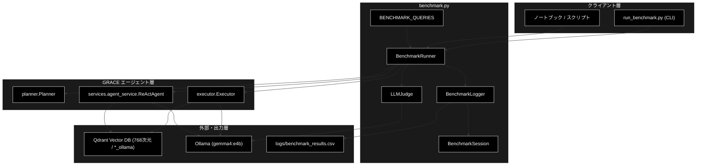
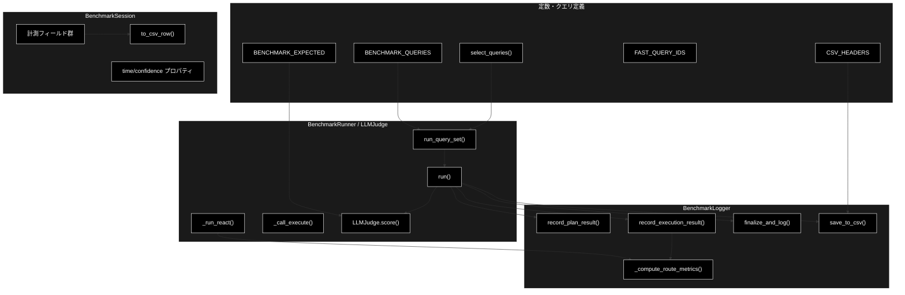
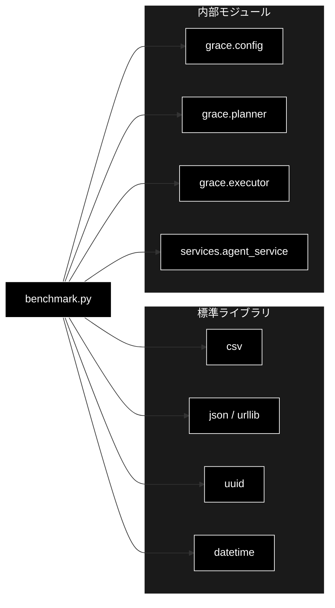

# benchmark.py - GRACE ベンチマーク計測 ドキュメント

**Version 1.0** | 最終更新: 2026-06-22

---

## 目次

1. [概要](#概要)
2. [アーキテクチャ構成図](#1-アーキテクチャ構成図)
3. [モジュール構成図](#2-モジュール構成図)
4. [クラス・関数一覧表](#3-クラス関数一覧表)
5. [クラス・関数 IPO詳細](#4-クラス関数-ipo詳細)
6. [設定・定数](#5-設定定数)
7. [使用例](#6-使用例)
8. [エクスポート](#7-エクスポート)
9. [変更履歴](#8-変更履歴)
10. [付録: 依存関係図](#付録-依存関係図)

---

## 概要

`benchmark.py` は、GRACE エージェントの各フェーズ（Plan / Execute / Confidence /
Intervention / Replan）の性能指標を計測・記録・CSV出力するモジュールです。
評価軸は「ドメイン網羅」ではなく **検索結果スコアに応じた分岐ハンドリングの正しさ**
に置かれ、2つの主機能（GRACE Plan+Executor / ReAct+Reflection）を別々に計測・比較できます。

LLM は **Ollama**（既定 `gemma4:e4b`、代替 `llama3.2`）、Embedding は **Ollama** の
`nomic-embed-text`（768次元）、Qdrant コレクションは `*_ollama` 命名を用います。
Ollama はローカル実行のため **API コストは発生しません**（`cost_usd` は常に 0、
トークン集計のみ）。

### 主な責務

- 標準クエリセット（A〜E ケース・期待挙動付き）の定義と絞り込み
- 1クエリ／クエリセット全体のフルパイプライン実行と各指標の計測
- 検索結果ハンドリング指標（rag_top_score / route_correct 等）の自動採点
- LLM-as-judge による accuracy / completeness の自動採点
- 計測結果の整形ログ出力と CSV 追記
- 2エージェント方式（grace_dynamic / react）の切替・横並び比較

### 各責務対応のモジュール

| # | 責務 | 対応モジュール | 説明 |
|---|------|--------------|------|
| 1 | 標準クエリセットの定義・絞り込み | `benchmark.py` | `BENCHMARK_QUERIES` / `select_queries()` |
| 2 | フルパイプライン実行・計測 | `benchmark.py` | `BenchmarkRunner` が `planner.py`/`executor.py` を駆動 |
| 3 | 検索ハンドリング指標の自動採点 | `benchmark.py` | `BenchmarkLogger._compute_route_metrics()` |
| 4 | 品質スコアの自動採点 | `benchmark.py` | `LLMJudge`（Ollama chat API） |
| 5 | ログ出力・CSV追記 | `benchmark.py` | `BenchmarkLogger.finalize_and_log()` / `save_to_csv()` |
| 6 | 2エージェント方式の切替 | `benchmark.py` | `BenchmarkRunner.run_query_set(mode=...)` / `_run_react()` |

### 主要機能一覧

| 機能 | 説明 |
|------|------|
| `BENCHMARK_QUERIES` | 標準12クエリ（case A〜E・expected 付き）の定義 |
| `BENCHMARK_EXPECTED` | LLM-as-judge 用の期待キーワード・採点基準 |
| `FAST_QUERY_IDS` | 高速モード対象の代表クエリID（A〜E 各1本） |
| `select_queries()` | 実行対象クエリの絞り込みヘルパー |
| `BenchmarkSession` | 1実行分の計測データを保持するデータクラス |
| `BenchmarkSession.to_csv_row()` | CSV 1行分の辞書を返す |
| `BenchmarkLogger` | 整形ログ出力・CSV追記・指標算出を担うクラス |
| `BenchmarkLogger.record_plan_result()` | Plan フェーズ指標を記録 |
| `BenchmarkLogger.record_execution_result()` | Execute/Confidence/Replan 指標と検索指標を記録 |
| `BenchmarkLogger._compute_route_metrics()` | 期待挙動と実結果を突き合わせ route_correct を算定 |
| `LLMJudge` | Ollama chat API による accuracy/completeness 採点 |
| `BenchmarkRunner` | パイプライン全体をラップする実行クラス |
| `BenchmarkRunner.run()` | 1クエリをフル実行して計測 |
| `BenchmarkRunner._run_react()` | ReAct+Reflection 方式で1クエリを計測 |
| `BenchmarkRunner.run_query_set()` | クエリセットを一括実行 |

---

## 1. アーキテクチャ構成図

### 1.1 システム全体構成



### 1.2 データフロー

1. CLI／スクリプトが `BenchmarkRunner` を生成し、`run_query_set()` を呼ぶ
2. `select_queries()` で実行対象クエリ（A〜E ケース）を絞り込む
3. 各クエリを `mode`（grace_dynamic / react）ごとに `run()` で実行
4. grace_dynamic は `Planner` → `Executor`（Qdrant検索・Ollama推論）を駆動
5. `BenchmarkLogger` が各フェーズ指標と検索ハンドリング指標を `BenchmarkSession` に記録
6. `_compute_route_metrics()` が期待挙動と突き合わせ `route_correct` を算定
7. `LLMJudge` が Ollama chat API で accuracy / completeness を採点
8. 整形ログを出力し、`logs/benchmark_results.csv` に1行追記

---

## 2. モジュール構成図

### 2.1 内部モジュール構成



### 2.2 外部依存関係

| ライブラリ | バージョン | 用途 |
|-----------|-----------|------|
| `csv`（標準） | - | CSV 追記出力 |
| `json`（標準） | - | LLMJudge のリクエスト/レスポンス処理 |
| `urllib`（標準） | - | Ollama chat API 呼び出し（LLMJudge） |
| `uuid`（標準） | - | セッションID生成 |
| `datetime`（標準） | - | タイムスタンプ生成 |

### 2.3 内部依存モジュール

| モジュール | 用途 |
|-----------|------|
| `grace.config` | `get_config()` による設定取得（埋め込み次元768・閾値・リプラン上限） |
| `grace.planner` | `Planner.create_plan()` で実行計画を生成 |
| `grace.executor` | `Executor.execute()` でプラン実行・指標生成 |
| `services.agent_service` | `ReActAgent`（react モード時のみ遅延 import） |

---

## 3. クラス・関数一覧表

### 3.1 クラス一覧

#### BenchmarkSession

| メソッド | 概要 |
|---------|------|
| `plan_time_sec` (property) | 計画生成フェーズ所要時間（秒） |
| `execute_time_sec` (property) | 実行フェーズ所要時間（秒） |
| `total_time_sec` (property) | Plan+Execute 合計時間（秒） |
| `min_step_confidence` (property) | ステップ信頼度の最小値 |
| `max_step_confidence` (property) | ステップ信頼度の最大値 |
| `to_csv_row()` | CSV 1行分の辞書を返す |

#### BenchmarkLogger

| メソッド | 概要 |
|---------|------|
| `__init__(csv_path, config)` | CSVパス・設定参照を保持しヘッダーを用意 |
| `record_plan_result(session, plan)` | Plan フェーズ指標を記録 |
| `record_execution_result(session, result)` | 実行・信頼度・検索指標を記録 |
| `_compute_route_metrics(session, web_fired)` | 期待挙動と突き合わせ route_correct を算定 |
| `_score_to_intervention(score)` | 信頼度→介入レベル変換 |
| `finalize_and_log(session)` | 整形ログ出力 |
| `save_to_csv(session)` | CSV 追記 |

#### LLMJudge

| メソッド | 概要 |
|---------|------|
| `__init__(model, base_url)` | Ollama chat API のモデル・エンドポイントを保持 |
| `score(query_id, query_text, answer, expected)` | accuracy/completeness を採点 |
| `_parse_scores(content)` | JSON 応答からスコアを抽出 |
| `_keyword_fallback(answer, expected)` | LLM 失敗時のキーワード一致採点 |

#### BenchmarkRunner

| メソッド | 概要 |
|---------|------|
| `__init__(model_name, provider, config, csv_path, qdrant_collection, enable_judge, judge_model)` | 設定・モデル・ロガー・採点器を初期化 |
| `run(query_id, query_text, ...)` | 1クエリをフル実行 |
| `_run_react(session)` | ReAct+Reflection 方式で計測 |
| `_call_execute(executor, plan)` | Executor 実行（generator/batch両対応） |
| `run_query_set(...)` | クエリセット一括実行 |

### 3.2 関数一覧（カテゴリ別）

#### クエリ選択

| 関数名 | 概要 |
|-------|------|
| `select_queries(query_ids, limit, fast, queries)` | 実行対象クエリを絞り込む |

---

## 4. クラス・関数 IPO詳細

### 4.1 `select_queries` 関数

#### `select_queries`

**概要**: 実行対象クエリを `query_ids` / `fast` / `limit` で絞り込むヘルパー。

```python
def select_queries(
    query_ids: Optional[List[str]] = None,
    limit: Optional[int] = None,
    fast: bool = False,
    queries: Optional[List[Dict[str, Any]]] = None,
) -> List[Dict[str, Any]]
```

| パラメータ | 型 | デフォルト | 説明 |
|------------|------|-----------|------|
| `query_ids` | Optional[List[str]] | None | 実行するID（最優先。例: `["Q01","Q03"]`） |
| `limit` | Optional[int] | None | 先頭から実行する件数 |
| `fast` | bool | False | True で `FAST_QUERY_IDS` のみ |
| `queries` | Optional[List[Dict]] | None | 元クエリリスト（省略時 `BENCHMARK_QUERIES`） |

| 項目 | 内容 |
|------|------|
| **Input** | `query_ids`, `limit`, `fast`, `queries` |
| **Process** | 1. `query_ids` 指定時はそれを抽出<br>2. それ以外で `fast` なら `FAST_QUERY_IDS` を抽出<br>3. `limit` で先頭から件数を絞る |
| **Output** | `List[Dict]`: 定義順を保持した絞り込み後クエリ |

```python
# 使用例
from grace.benchmark import select_queries
qs = select_queries(query_ids=["Q01", "Q11"])
print([q["id"] for q in qs])
# ['Q01', 'Q11']
```

### 4.2 `BenchmarkSession` クラス

1回の実行セッションのベンチマークデータを保持するデータクラス。タイミングは
`time.monotonic()` で計測し、所要時間は property で計算します。

#### メソッド: `to_csv_row`

**概要**: セッションの全指標を `CSV_HEADERS` に対応する辞書へ変換する。

```python
def to_csv_row(self) -> Dict[str, Any]
```

| 項目 | 内容 |
|------|------|
| **Input** | なし（selfのみ） |
| **Process** | 1. identity/フェーズ/信頼度/検索指標/トークンを収集<br>2. property（時間・信頼度）を評価<br>3. スコアを丸めて辞書化 |
| **Output** | `Dict[str, Any]`: `CSV_HEADERS` の全キーを持つ1行分の辞書 |

**戻り値例**:
```python
{
    "query_id": "Q01", "expected_case": "A", "agent_mode": "grace_dynamic",
    "rag_top_score": 0.8421, "rag_hit_in_target": True,
    "web_fallback_fired": False, "route_correct": True, "replan_converged": True,
    "cost_usd": 0.0,  # Ollama ローカル実行のため常に 0
}
```

### 4.3 `BenchmarkLogger` クラス

`BenchmarkSession` の内容を整形ログと CSV の両形式で出力し、検索ハンドリング
指標を算出するクラス。

#### コンストラクタ: `__init__`

**概要**: CSVパスと route 指標算出用の設定参照を保持し、CSV ヘッダーを用意する。

```python
BenchmarkLogger(csv_path: Optional[Path] = None, config: Any = None)
```

| パラメータ | 型 | デフォルト | 説明 |
|------------|------|-----------|------|
| `csv_path` | Optional[Path] | None | 出力先（省略時 `logs/benchmark_results.csv`） |
| `config` | Any | None | route 指標算出に使う設定（Runnerから注入） |

| 項目 | 内容 |
|------|------|
| **Input** | `csv_path`, `config` |
| **Process** | 1. パス・設定参照を保持<br>2. ログディレクトリ作成<br>3. CSV未作成ならヘッダー書込 |
| **Output** | `BenchmarkLogger` インスタンス |

#### メソッド: `record_execution_result`

**概要**: `Executor.execute()` の `ExecutionResult` から実行・信頼度・検索指標を記録する。

```python
def record_execution_result(self, session: BenchmarkSession, result: Any) -> None
```

| 項目 | 内容 |
|------|------|
| **Input** | `session`, `result`（`grace.schemas.ExecutionResult`） |
| **Process** | 1. 信頼度・リプラン回数・ステータス・トークンを記録<br>2. 各ステップを走査し `rag_top_score`（output内score最大）と web切替（URLソース）を抽出<br>3. 信頼度→介入レベルを算定<br>4. `_compute_route_metrics()` を呼ぶ |
| **Output** | `None`（session を破壊的に更新） |

```python
# 使用例
logger = BenchmarkLogger(config=cfg)
logger.record_execution_result(session, execution_result)
print(session.route_correct, session.rag_top_score)
# True 0.8421
```

#### メソッド: `_compute_route_metrics`

**概要**: 期待挙動（`session.expected`）と実結果を突き合わせ、検索ハンドリング
4指標（rag_hit_in_target / web_fallback_fired / route_correct / replan_converged）を算定する。

```python
def _compute_route_metrics(self, session: BenchmarkSession, web_fired: bool) -> None
```

| 項目 | 内容 |
|------|------|
| **Input** | `session`, `web_fired` |
| **Process** | 1. 設定から `rag_sufficient_score` / `max_replans` を取得<br>2. `rag_hit_in_target`（スコア閾値）・`web_fallback_fired`（web_firedまたはリプラン）・`replan_converged`（上限内・非failed）を算定<br>3. `expected` の intervention/web/min_rag_score/replan を順に検証し `route_correct` を決定 |
| **Output** | `None`（session を破壊的に更新） |

**戻り値例**:
```python
# session に設定される値（case A の例）
session.rag_hit_in_target  = True
session.web_fallback_fired = False
session.replan_converged   = True
session.route_correct      = True
```

### 4.4 `LLMJudge` クラス

Ollama の chat API（`/api/chat`）を直接呼び出し、回答の accuracy / completeness を
0.0〜1.0 で採点するクラス。LLM 呼び出しに失敗した場合は期待キーワードの一致率で
フォールバック採点します。

#### メソッド: `score`

```python
def score(
    self,
    query_id: str,
    query_text: str,
    answer: str,
    expected: Optional[Dict[str, Any]] = None,
) -> Tuple[float, float]
```

| 項目 | 内容 |
|------|------|
| **Input** | `query_id`, `query_text`, `answer`, `expected`（`BENCHMARK_EXPECTED` の項目） |
| **Process** | 1. 採点プロンプトを構築<br>2. Ollama chat API へ POST（temperature=0.0）<br>3. JSON 応答からスコア抽出。失敗時はキーワード一致率へフォールバック |
| **Output** | `Tuple[float, float]`: `(accuracy, completeness)` |

### 4.5 `BenchmarkRunner` クラス

GRACEパイプライン全体をラップし、1クエリまたはクエリセットのベンチマークを実行するクラス。

#### コンストラクタ: `__init__`

**概要**: 設定・モデル名・プロバイダーを解決し、設定注入済みの `BenchmarkLogger` と
任意の `LLMJudge` を生成する。

```python
BenchmarkRunner(
    model_name: Optional[str] = None,
    provider: Optional[str] = None,
    config: Any = None,
    csv_path: Optional[Path] = None,
    qdrant_collection: Optional[str] = None,
    enable_judge: bool = True,
    judge_model: Optional[str] = None,
)
```

| パラメータ | 型 | デフォルト | 説明 |
|------------|------|-----------|------|
| `model_name` | Optional[str] | None | LLMモデル名（省略時 `config.llm.model` → `gemma4:e4b`） |
| `provider` | Optional[str] | None | プロバイダー（省略時 `config.llm.provider` → `ollama`） |
| `config` | Any | None | 設定（省略時 `get_config()`） |
| `csv_path` | Optional[Path] | None | CSV出力先 |
| `qdrant_collection` | Optional[str] | None | 検索対象コレクション名（指定時 `collection_name` を上書き） |
| `enable_judge` | bool | True | LLM-as-judge 採点の有効化 |
| `judge_model` | Optional[str] | None | 採点用モデル（省略時 `model_name`） |

#### メソッド: `run`

**概要**: 1クエリを Plan→Execute のフルパイプライン（または react 方式）で実行し計測する。

```python
def run(
    self,
    query_id: str,
    query_text: str,
    run_number: int = 1,
    level: str = "",
    category: str = "",
    agent_path: str = "",
    expected_case: str = "",
    expected: Optional[Dict[str, Any]] = None,
    agent_mode: str = "grace_dynamic",
) -> BenchmarkSession
```

| 項目 | 内容 |
|------|------|
| **Input** | `query_id`, `query_text`, ラベル群, `expected_case`, `expected`, `agent_mode` |
| **Process** | 1. `BenchmarkSession` 生成<br>2. `agent_mode=="react"` なら `_run_react()` へ委譲<br>3. それ以外は `Planner.create_plan()` → `Executor.execute()` を計測<br>4. 各フェーズ指標を記録<br>5. LLMJudge で accuracy/completeness 採点<br>6. finally でログ出力・CSV追記 |
| **Output** | `BenchmarkSession`: 計測結果 |

```python
# 使用例
runner = BenchmarkRunner(qdrant_collection="cc_news_2per_768")
session = runner.run(
    query_id="Q01", query_text="Amazonの新規職は何件？",
    expected_case="A", expected={"intervention": ["SILENT", "NOTIFY"], "web": False},
)
print(session.route_correct)
# True
```

#### メソッド: `run_query_set`

**概要**: 複数クエリを `runs_per_query` 回ずつ、指定モード（grace/react/both）で実行する。

```python
def run_query_set(
    self,
    queries: Optional[List[Dict[str, Any]]] = None,
    runs_per_query: int = 3,
    fast: bool = False,
    query_ids: Optional[List[str]] = None,
    limit: Optional[int] = None,
    max_replans: Optional[int] = None,
    restrict_collection: Optional[bool] = None,
    mode: str = "grace",
) -> List[BenchmarkSession]
```

| パラメータ | 型 | デフォルト | 説明 |
|------------|------|-----------|------|
| `queries` | Optional[List[Dict]] | None | クエリリスト（省略時 `BENCHMARK_QUERIES`） |
| `runs_per_query` | int | 3 | 各クエリの試行回数 |
| `fast` | bool | False | 高速モード（代表クエリ・1回・最小アクセス） |
| `query_ids` | Optional[List[str]] | None | 実行するIDの明示指定 |
| `limit` | Optional[int] | None | 先頭からの件数 |
| `max_replans` | Optional[int] | None | リプラン上限の上書き（fast時は既定1） |
| `restrict_collection` | Optional[bool] | None | 単一コレクション固定（fast時は既定True） |
| `mode` | str | "grace" | `"grace"` / `"react"` / `"both"` |

| 項目 | 内容 |
|------|------|
| **Input** | 上記パラメータ群 |
| **Process** | 1. `mode` を agent_mode リストへ変換<br>2. fast時は試行回数1・max_replans=1・単一コレクション固定を既定適用<br>3. `select_queries()` で対象抽出<br>4. クエリ×agent_mode×試行で `run()` を反復 |
| **Output** | `List[BenchmarkSession]`: 全セッション結果 |

```python
# 使用例
runner = BenchmarkRunner(qdrant_collection="cc_news_2per_768")
sessions = runner.run_query_set(fast=True, mode="both")
print(len(sessions))
# 10  （代表5クエリ × 2方式 × 1回）
```

---

## 5. 設定・定数

### 5.1 CSV_HEADERS

CSV 出力の列定義。`expected_case` / `agent_mode` と検索ハンドリング5指標を含みます。
`cost_usd` 列は存在しますが、Ollama はローカル実行のため常に 0 です。

```python
CSV_HEADERS = [
    "timestamp", "session_id", "query_id", "query_text_short",
    "level", "category", "agent_path", "expected_case", "agent_mode",
    "model", "provider", "run_number",
    # ... Plan / Execute / Confidence / Intervention / Replan ...
    "rag_top_score", "rag_hit_in_target", "web_fallback_fired",
    "route_correct", "replan_converged",
    "input_tokens", "output_tokens", "cost_usd",  # cost_usd は常に 0
    "accuracy_score", "completeness_score",
]
```

### 5.2 BENCHMARK_QUERIES / FAST_QUERY_IDS

標準クエリは Qdrant コレクション `cc_news_2per_768`（`nomic-embed-text` / 768次元）の
実データに対応し、検索ハンドリングの5ケースを通過するよう設計されています。

| キー | 説明 |
|-----|------|
| `case` | 検索ハンドリングケース（A:高スコア命中 / B:中スコア境界 / C:低スコア不一致 / D:要リプラン / E:曖昧） |
| `expected.intervention` | 許容する介入レベル集合（`None`=不問） |
| `expected.web` | web_fallback を期待するか（True/False/None） |
| `expected.replan` | リプラン発火＋収束を期待するか（True/False/None） |
| `expected.min_rag_score` | 期待する RAG 最高スコア下限（`None`=不問） |
| `force_collection` | （任意）初回プランの全 rag_search の検索先を指定コレクションへ固定。存在しない名前を与えると結果ゼロ → ステップ failed → リプランを確定発火させる（Case D 用） |

Case D は 2 本構成です。

- **Q12**: RAG が低スコア（非空）で命中せず、動的 web フォールバックで回復する経路。
  この経路は `replan_count` を増やさない（成功扱いの低スコア → web 動的挿入）ため、
  期待は「web で回復」（`replan=None`）。
- **Q13**: `force_collection` で初回 RAG を存在しないコレクションへ向け、結果ゼロ →
  ステップ failed → `_should_trigger_replan` が必ず発火 → 回復プランへ差し替え。
  期待は「リプラン発火＋上限内収束」（`replan=True`）。真に replan を強制する設計。

`FAST_QUERY_IDS = ["Q01", "Q03", "Q11", "Q13", "Q10"]`（A〜E 各1本。D 枠は真の replan を測る Q13）。

### 5.3 BENCHMARK_EXPECTED

LLM-as-judge（`LLMJudge`）用の採点メタデータ。`keywords`（期待キーワード）、
`criteria`（採点基準）、`no_answer_ok`（「情報なし」応答を正解とみなすか）を持ちます。

---

## 6. 使用例

### 6.1 基本的なワークフロー

```python
from grace.benchmark import BenchmarkRunner

# 1. ランナー生成（コレクションを明示指定）
runner = BenchmarkRunner(qdrant_collection="cc_news_2per_768")

# 2. 高速モードで全ケース A〜E を1本ずつ実行（単一コレクション固定・リプラン最小）
sessions = runner.run_query_set(fast=True)

# 3. 経路一致率を集計
scored = [s for s in sessions if s.route_correct is not None]
correct = sum(1 for s in scored if s.route_correct)
print(f"route_correct: {correct}/{len(scored)}")
```

### 6.2 2方式の横並び比較

```python
# GRACE Plan+Executor と ReAct+Reflection を同一クエリで比較
runner = BenchmarkRunner(qdrant_collection="cc_news_2per_768")
sessions = runner.run_query_set(fast=True, mode="both")

for s in sessions:
    print(s.query_id, s.agent_mode, s.route_correct, round(s.rag_top_score, 3))
```

> 📝 **注意**: reasoning / plan / confidence 経路の計測には Ollama サーバ
> （`localhost:11434`）の起動と対象モデル（`gemma4:e4b` 等）の pull が前提です。
> 未起動時は全ステップが失敗し route が測れません。Ollama はローカル実行のため
> API キーは不要で、コストも発生しません（トークン集計のみ）。

---

## 7. エクスポート

```python
__all__ = [
    "BENCHMARK_QUERIES",
    "BENCHMARK_EXPECTED",
    "FAST_QUERY_IDS",
    "select_queries",
    "CSV_HEADERS",
    "BENCHMARK_CSV_PATH",
    "BenchmarkSession",
    "BenchmarkLogger",
    "LLMJudge",
    "BenchmarkRunner",
]
```

---

## 8. 変更履歴

| バージョン | 変更内容 |
|-----------|---------|
| 1.0 | 初版作成（検索ハンドリング評価への再設計・2エージェント別計測・新メトリクス5列に対応。Ollama ネイティブ化: LLM=`gemma4:e4b`、Embedding=`nomic-embed-text` 768次元、コレクション `*_ollama`、コストなし） |

---

## 付録: 依存関係図


