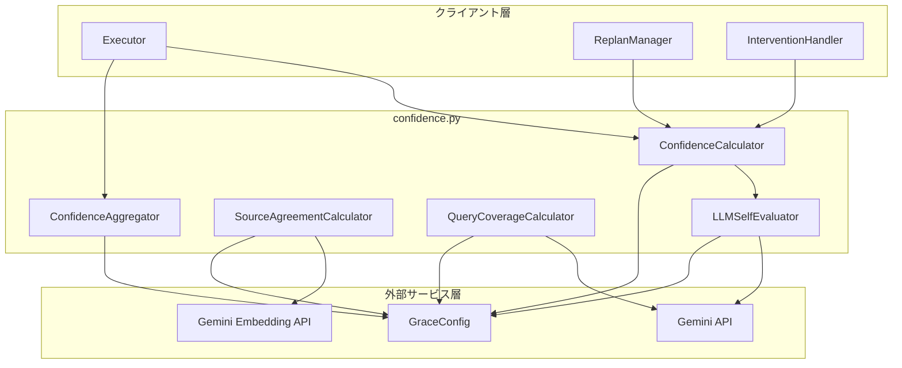
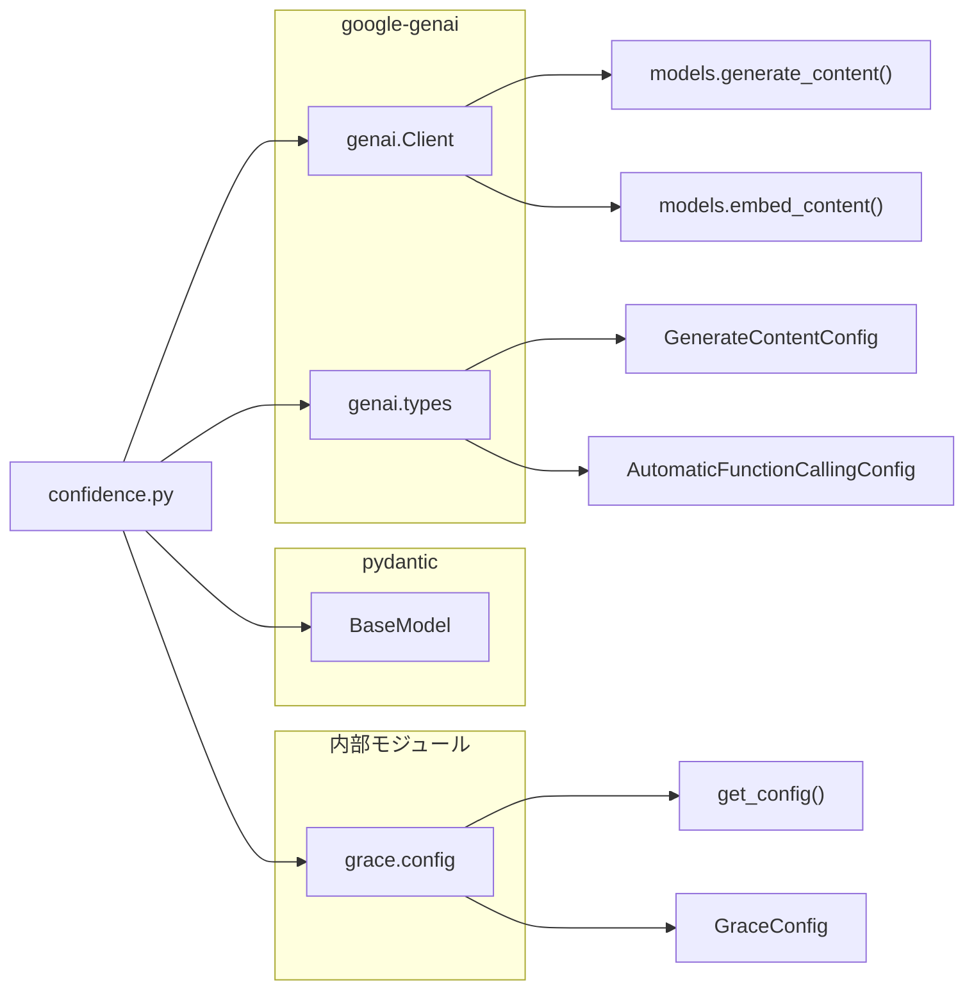

# confidence.py - 信頼度計算システム ドキュメント

**Version 2.0** | 最終更新: 2026-02-19

---

## 目次

1. [概要](#概要)
2. [アーキテクチャ構成図](#1-アーキテクチャ構成図)
   - [システム全体構成](#11-システム全体構成)
   - [データフロー](#12-データフロー)
3. [モジュール構成図](#2-モジュール構成図)
   - [内部モジュール構成](#21-内部モジュール構成)
   - [外部依存関係](#22-外部依存関係)
   - [内部依存モジュール](#23-内部依存モジュール)
4. [クラス・関数一覧表](#3-クラス関数一覧表)
   - [クラス一覧](#31-クラス一覧)
   - [関数一覧（カテゴリ別）](#32-関数一覧カテゴリ別)
5. [クラス・関数 IPO詳細](#4-クラス関数-ipo詳細)
   - [EvaluationResult クラス](#41-evaluationresult-クラス)
   - [ConfidenceFactors クラス](#42-confidencefactors-クラス)
   - [ConfidenceScore クラス](#43-confidencescore-クラス)
   - [InterventionLevel 列挙型](#44-interventionlevel-列挙型)
   - [ActionDecision クラス](#45-actiondecision-クラス)
   - [ConfidenceCalculator クラス](#46-confidencecalculator-クラス)
   - [LLMSelfEvaluator クラス](#47-llmselfevaluator-クラス)
   - [SourceAgreementCalculator クラス](#48-sourceagreementcalculator-クラス)
   - [QueryCoverageCalculator クラス](#49-querycoveragecalculator-クラス)
   - [ConfidenceAggregator クラス](#410-confidenceaggregator-クラス)
   - [ファクトリ関数](#411-ファクトリ関数)
6. [設定・定数](#5-設定定数)
   - [Confidence重み設定](#51-confidence重み設定)
   - [Confidence閾値設定](#52-confidence閾値設定)
   - [LLMプロンプトテンプレート](#53-llmプロンプトテンプレート)
7. [使用例](#6-使用例)
   - [基本的なワークフロー](#61-基本的なワークフロー)
   - [LLMベース信頼度計算](#62-llmベース信頼度計算)
   - [複数ステップの集計](#63-複数ステップの集計)
8. [エクスポート](#7-エクスポート)
9. [変更履歴](#8-変更履歴)
10. [付録: 依存関係図](#付録-依存関係図)

---

## 概要

`confidence.py`は、GRACEエージェントにおける信頼度計算システムを実装するモジュール。ハイブリッド方式（重み付き平均 + LLM自己評価）による多軸信頼度計算を提供し、各ステップの実行結果に対して信頼度スコアを算出する。信頼度に基づくアクション決定（自動進行/通知/確認要求/エスカレーション）を行い、Human-in-the-Loopの介入レベルを制御する。

### 主な責務

- ハイブリッド方式による多軸信頼度スコアの計算（検索品質・ソース一致度・LLM自己評価・ツール成功率・クエリ網羅度）
- LLM（Gemini API）を活用した自己評価・信頼度判定
- 複数情報源間の一致度計算（Embedding類似度ベース）
- クエリに対する回答の網羅度評価
- 信頼度スコアに基づく介入レベル決定（SILENT/NOTIFY/CONFIRM/ESCALATE）
- 複数ステップの信頼度集計（平均/最小値/重み付き平均）

### 各責務対応のモジュール

| # | 責務 | 対応モジュール | 説明 |
|---|------|--------------|------|
| 1 | ハイブリッド方式による多軸信頼度スコアの計算 | `confidence.py` | `ConfidenceCalculator`が重み付き平均 + ペナルティで算出 |
| 2 | LLMを活用した自己評価・信頼度判定 | `confidence.py` | `LLMSelfEvaluator`がGemini APIで評価、`ConfidenceCalculator.llm_calculate()`で統合 |
| 3 | 複数情報源間の一致度計算 | `confidence.py` | `SourceAgreementCalculator`がEmbedding類似度で算出 |
| 4 | クエリに対する回答の網羅度評価 | `confidence.py` | `QueryCoverageCalculator`がLLMで網羅度を0.0-1.0で評価 |
| 5 | 信頼度スコアに基づく介入レベル決定 | `confidence.py` | `ConfidenceCalculator.decide_action()`が閾値ベースで判定 |
| 6 | 複数ステップの信頼度集計 | `confidence.py` | `ConfidenceAggregator`が複数ステップのスコアを集計 |

### 主要機能一覧

| 機能 | 説明 |
|------|------|
| `EvaluationResult` | LLM信頼度評価の応答スキーマ（Pydantic） |
| `ConfidenceFactors` | 信頼度を構成する各要素を保持するデータクラス |
| `ConfidenceScore` | 信頼度スコアと内訳を保持するデータクラス |
| `ConfidenceScore.level` | 信頼度レベル（high/medium/low/very_low）を返すプロパティ |
| `InterventionLevel` | 介入レベル列挙型（SILENT/NOTIFY/CONFIRM/ESCALATE） |
| `ActionDecision` | 信頼度に基づくアクション決定データクラス |
| `ActionDecision.should_proceed` | 自動進行可能か判定するプロパティ |
| `ActionDecision.needs_confirmation` | 確認が必要か判定するプロパティ |
| `ActionDecision.needs_user_input` | ユーザー入力が必要か判定するプロパティ |
| `ConfidenceCalculator` | ハイブリッド方式によるConfidence計算クラス |
| `ConfidenceCalculator.__init__()` | コンストラクタ（設定読込・重み検証） |
| `ConfidenceCalculator.calculate()` | 統計ベースのハイブリッドConfidence計算 |
| `ConfidenceCalculator.llm_calculate()` | LLMを使用した信頼度計算（次世代版） |
| `ConfidenceCalculator._calc_search_quality()` | RAG検索品質のスコア化（内部メソッド） |
| `ConfidenceCalculator._calc_tool_success()` | ツール成功率の計算（内部メソッド） |
| `ConfidenceCalculator._apply_penalties()` | ペナルティ適用（内部メソッド） |
| `ConfidenceCalculator._validate_weights()` | 重み合計検証（内部メソッド） |
| `ConfidenceCalculator.decide_action()` | 信頼度に基づくアクション決定 |
| `LLMSelfEvaluator` | LLMによる自己評価クラス |
| `LLMSelfEvaluator.__init__()` | コンストラクタ（Gemini Client初期化） |
| `LLMSelfEvaluator.evaluate()` | LLMに回答の信頼度を自己評価させる |
| `LLMSelfEvaluator.evaluate_with_factors()` | Factors考慮の総合LLM評価（Structured Output） |
| `SourceAgreementCalculator` | 複数ソース間の一致度計算クラス |
| `SourceAgreementCalculator.__init__()` | コンストラクタ（Embedding設定） |
| `SourceAgreementCalculator.calculate()` | 複数回答間の一致度をEmbedding類似度で算出 |
| `SourceAgreementCalculator._cosine_similarity()` | コサイン類似度計算（静的メソッド） |
| `QueryCoverageCalculator` | クエリ網羅度計算クラス |
| `QueryCoverageCalculator.__init__()` | コンストラクタ（LLMモデル設定） |
| `QueryCoverageCalculator.calculate()` | クエリに対する回答の網羅度をLLMで算出 |
| `ConfidenceAggregator` | 複数ステップの信頼度集計クラス |
| `ConfidenceAggregator.__init__()` | コンストラクタ（設定読込） |
| `ConfidenceAggregator.aggregate()` | 複数スコアを集計（mean/min/weighted） |
| `ConfidenceAggregator.aggregate_with_critical_check()` | 重要度チェック付きの集計 |
| `create_confidence_calculator()` | ConfidenceCalculatorのファクトリ関数 |
| `create_llm_evaluator()` | LLMSelfEvaluatorのファクトリ関数 |
| `create_source_agreement_calculator()` | SourceAgreementCalculatorのファクトリ関数 |
| `create_query_coverage_calculator()` | QueryCoverageCalculatorのファクトリ関数 |
| `create_confidence_aggregator()` | ConfidenceAggregatorのファクトリ関数 |

---

## 1. アーキテクチャ構成図

### 1.1 システム全体構成



### 1.2 データフロー

1. Executorがステップ実行結果から`ConfidenceFactors`を構築
2. `ConfidenceCalculator.calculate()`または`llm_calculate()`で信頼度スコアを算出
3. 必要に応じて`LLMSelfEvaluator`がGemini APIで自己評価を実行
4. 必要に応じて`SourceAgreementCalculator`がEmbedding類似度でソース一致度を算出
5. 必要に応じて`QueryCoverageCalculator`がLLMでクエリ網羅度を評価
6. `ConfidenceCalculator.decide_action()`が介入レベルを決定
7. `ConfidenceAggregator`が計画全体の信頼度を集計
8. 結果をExecutor/ReplanManager/InterventionHandlerに返却

---

## 2. モジュール構成図

### 2.1 内部モジュール構成

```mermaid
flowchart TB
    subgraph SCHEMA["スキーマ・データクラス"]
        EVAL_RESULT[EvaluationResult]
        FACTORS[ConfidenceFactors]
        SCORE[ConfidenceScore]
        LEVEL[InterventionLevel]
        DECISION[ActionDecision]
    end

    subgraph CALCULATOR["ConfidenceCalculator クラス"]
        CC_INIT["__init__()"]
        CC_CALC["calculate()"]
        CC_LLM["llm_calculate()"]
        CC_SEARCH["_calc_search_quality()"]
        CC_TOOL["_calc_tool_success()"]
        CC_PENALTY["_apply_penalties()"]
        CC_VALIDATE["_validate_weights()"]
        CC_DECIDE["decide_action()"]
    end

    subgraph LLM_EVALUATOR["LLMSelfEvaluator クラス"]
        LE_INIT["__init__()"]
        LE_EVAL["evaluate()"]
        LE_FACTORS["evaluate_with_factors()"]
    end

    subgraph SRC_CALC["SourceAgreementCalculator クラス"]
        SA_INIT["__init__()"]
        SA_CALC["calculate()"]
        SA_COS["_cosine_similarity()"]
    end

    subgraph QRY_CALC["QueryCoverageCalculator クラス"]
        QC_INIT["__init__()"]
        QC_CALC["calculate()"]
    end

    subgraph AGGREGATOR["ConfidenceAggregator クラス"]
        AG_INIT["__init__()"]
        AG_AGG["aggregate()"]
        AG_CRIT["aggregate_with_critical_check()"]
    end

    subgraph FACTORY["ファクトリ関数"]
        F1["create_confidence_calculator()"]
        F2["create_llm_evaluator()"]
        F3["create_source_agreement_calculator()"]
        F4["create_query_coverage_calculator()"]
        F5["create_confidence_aggregator()"]
    end

    SCHEMA --> CALCULATOR
    SCHEMA --> LLM_EVALUATOR
    CC_LLM --> LE_FACTORS
    CC_CALC --> CC_SEARCH
    CC_CALC --> CC_TOOL
    CC_CALC --> CC_PENALTY
    CC_INIT --> CC_VALIDATE
    CC_DECIDE --> LEVEL
    CC_DECIDE --> DECISION
    CC_CALC --> SCORE
    CC_LLM --> SCORE
    SA_CALC --> SA_COS
    F1 --> CC_INIT
    F2 --> LE_INIT
    F3 --> SA_INIT
    F4 --> QC_INIT
    F5 --> AG_INIT
```



### 2.2 外部依存関係

| ライブラリ | バージョン | 用途 |
|-----------|-----------|------|
| `google-genai` | - | Gemini API（LLM呼び出し・Embedding取得） |
| `pydantic` | v2 | `EvaluationResult`スキーマ定義、Structured Output |

### 2.3 内部依存モジュール

| モジュール | 用途 |
|-----------|------|
| `grace.config` | `get_config()`, `GraceConfig`（設定読込） |

---

## 3. クラス・関数一覧表

### 3.1 クラス一覧

#### EvaluationResult

| メソッド | 概要 |
|---------|------|
| _(Pydanticモデル)_ | `score: float`, `reason: str` のスキーマ定義 |

#### ConfidenceFactors

| フィールド | 概要 |
|-----------|------|
| `search_result_count` | 検索結果数 |
| `search_avg_score` | 平均類似度スコア |
| `search_max_score` | 最高類似度スコア |
| `search_score_variance` | スコアの分散 |
| `source_agreement` | 情報源間の一致度 (0-1) |
| `source_count` | 引用ソース数 |
| `llm_self_confidence` | LLMの自己評価 (0-1) |
| `tool_success_rate` | ツール成功率 |
| `tool_execution_count` | 実行ツール数 |
| `tool_success_count` | 成功ツール数 |
| `query_coverage` | クエリへの回答網羅度 |
| `is_search_step` | 検索ステップかどうか |

#### ConfidenceScore

| メソッド / プロパティ | 概要 |
|---------------------|------|
| `score` | 最終スコア (0.0-1.0) |
| `factors` | 計算に使用した要素 |
| `breakdown` | 各要素のスコア内訳 |
| `penalties_applied` | 適用されたペナルティ |
| `reason` | 信頼度スコアの理由 |
| `level` (property) | 信頼度レベル（high/medium/low/very_low） |

#### ActionDecision

| メソッド / プロパティ | 概要 |
|---------------------|------|
| `level` | 介入レベル (InterventionLevel) |
| `confidence_score` | 信頼度スコア |
| `reason` | 理由 |
| `suggested_action` | 推奨アクション |
| `should_proceed` (property) | 自動進行可能か |
| `needs_confirmation` (property) | 確認が必要か |
| `needs_user_input` (property) | ユーザー入力が必要か |

#### ConfidenceCalculator

| メソッド | 概要 |
|---------|------|
| `__init__(config)` | コンストラクタ（設定読込・重み検証） |
| `calculate(factors)` | 統計ベースのハイブリッドConfidence計算 |
| `llm_calculate(factors, step_description, tool_output)` | LLMを使用した信頼度計算 |
| `_calc_search_quality(factors)` | RAG検索品質のスコア化 |
| `_calc_tool_success(factors)` | ツール成功率の計算 |
| `_apply_penalties(base_score, factors)` | ペナルティ適用 |
| `_validate_weights()` | 重み合計の検証 |
| `decide_action(score)` | 信頼度に基づくアクション決定 |

#### LLMSelfEvaluator

| メソッド | 概要 |
|---------|------|
| `__init__(config, model_name)` | コンストラクタ（Gemini Client初期化） |
| `evaluate(query, answer, sources)` | LLMに自己評価させる |
| `evaluate_with_factors(description, output, factors)` | Factors考慮の総合LLM評価 |

#### SourceAgreementCalculator

| メソッド | 概要 |
|---------|------|
| `__init__(config)` | コンストラクタ（Embedding設定） |
| `calculate(answers)` | 複数回答間の一致度を計算 |
| `_cosine_similarity(vec1, vec2)` | コサイン類似度計算（静的メソッド） |

#### QueryCoverageCalculator

| メソッド | 概要 |
|---------|------|
| `__init__(config, model_name)` | コンストラクタ（LLMモデル設定） |
| `calculate(query, answer)` | クエリに対する回答の網羅度を計算 |

#### ConfidenceAggregator

| メソッド | 概要 |
|---------|------|
| `__init__(config)` | コンストラクタ（設定読込） |
| `aggregate(scores, method)` | 複数スコアを集計 |
| `aggregate_with_critical_check(scores, critical_threshold)` | 重要度チェック付きの集計 |

### 3.2 関数一覧（カテゴリ別）

#### ファクトリ関数

| 関数名 | 概要 |
|-------|------|
| `create_confidence_calculator(config)` | ConfidenceCalculatorインスタンスを作成 |
| `create_llm_evaluator(config, model_name)` | LLMSelfEvaluatorインスタンスを作成 |
| `create_source_agreement_calculator(config)` | SourceAgreementCalculatorインスタンスを作成 |
| `create_query_coverage_calculator(config, model_name)` | QueryCoverageCalculatorインスタンスを作成 |
| `create_confidence_aggregator(config)` | ConfidenceAggregatorインスタンスを作成 |

---

## 4. クラス・関数 IPO詳細

### 4.1 EvaluationResult クラス

LLM信頼度評価の応答スキーマ。Gemini Structured Outputで使用するPydanticモデル。

#### コンストラクタ: `__init__`

**概要**: Pydanticモデルとして自動生成。

```python
EvaluationResult(score: float, reason: str)
```

| パラメータ | 型 | デフォルト | 説明 |
|------------|------|-----------|------|
| `score` | float | - | 信頼度スコア (0.0-1.0) |
| `reason` | str | - | 評価理由 |

| 項目 | 内容 |
|------|------|
| **Input** | `score: float`, `reason: str` |
| **Process** | Pydanticによるバリデーション |
| **Output** | `EvaluationResult`インスタンス |

---

### 4.2 ConfidenceFactors クラス

信頼度を構成する各要素を保持するデータクラス（`@dataclass`）。検索品質、ソース一致度、LLM自己評価、ツール成功率、クエリ網羅度の5軸の入力値を格納する。

#### コンストラクタ: `__init__`

**概要**: データクラスとして各フィールドをデフォルト値付きで初期化。

```python
ConfidenceFactors(
    search_result_count: int = 0,
    search_avg_score: float = 0.0,
    search_max_score: float = 0.0,
    search_score_variance: float = 1.0,
    source_agreement: float = 0.0,
    source_count: int = 0,
    llm_self_confidence: float = 0.5,
    tool_success_rate: float = 1.0,
    tool_execution_count: int = 0,
    tool_success_count: int = 0,
    query_coverage: float = 0.0,
    is_search_step: bool = False
)
```

| パラメータ | 型 | デフォルト | 説明 |
|------------|------|-----------|------|
| `search_result_count` | int | 0 | 検索結果数 |
| `search_avg_score` | float | 0.0 | 平均類似度スコア |
| `search_max_score` | float | 0.0 | 最高類似度スコア |
| `search_score_variance` | float | 1.0 | スコアの分散（低いほど一貫性あり） |
| `source_agreement` | float | 0.0 | 情報源間の一致度 (0-1) |
| `source_count` | int | 0 | 引用ソース数 |
| `llm_self_confidence` | float | 0.5 | LLMの自己評価 (0-1) |
| `tool_success_rate` | float | 1.0 | ツール成功率 |
| `tool_execution_count` | int | 0 | 実行ツール数 |
| `tool_success_count` | int | 0 | 成功ツール数 |
| `query_coverage` | float | 0.0 | クエリへの回答網羅度 |
| `is_search_step` | bool | False | 検索ステップかどうか |

| 項目 | 内容 |
|------|------|
| **Input** | 上記各フィールド（すべてオプション、デフォルト値あり） |
| **Process** | dataclassによるフィールド初期化 |
| **Output** | `ConfidenceFactors`インスタンス |

---

### 4.3 ConfidenceScore クラス

信頼度スコアと内訳を保持するデータクラス（`@dataclass`）。

#### コンストラクタ: `__init__`

**概要**: 計算済みの信頼度スコアとメタ情報を保持。

```python
ConfidenceScore(
    score: float,
    factors: ConfidenceFactors,
    breakdown: Dict[str, float] = field(default_factory=dict),
    penalties_applied: List[str] = field(default_factory=list),
    reason: str = ""
)
```

| パラメータ | 型 | デフォルト | 説明 |
|------------|------|-----------|------|
| `score` | float | - | 最終スコア (0.0-1.0) |
| `factors` | ConfidenceFactors | - | 計算に使用した要素 |
| `breakdown` | Dict[str, float] | {} | 各要素のスコア内訳 |
| `penalties_applied` | List[str] | [] | 適用されたペナルティ |
| `reason` | str | "" | 信頼度スコアの理由 |

| 項目 | 内容 |
|------|------|
| **Input** | `score`, `factors`, `breakdown`, `penalties_applied`, `reason` |
| **Process** | dataclassによるフィールド初期化 |
| **Output** | `ConfidenceScore`インスタンス |

#### プロパティ: `level`

**概要**: 信頼度スコアを4段階のレベル文字列に変換する。

```python
@property
def level(self) -> str
```

| 項目 | 内容 |
|------|------|
| **Input** | なし（selfのみ） |
| **Process** | `self.score`の値に基づき閾値判定:<br>1. >= 0.9 → "high"<br>2. >= 0.7 → "medium"<br>3. >= 0.4 → "low"<br>4. < 0.4 → "very_low" |
| **Output** | `str`: 信頼度レベル（"high" / "medium" / "low" / "very_low"） |

**戻り値例**:
```python
"high"
```

```python
# 使用例
score = ConfidenceScore(score=0.85, factors=ConfidenceFactors())
print(score.level)
# 出力: "medium"
```

---

### 4.4 InterventionLevel 列挙型

介入レベルを定義する列挙型（`str, Enum`）。

| 値 | 文字列 | 説明 |
|----|--------|------|
| `SILENT` | "silent" | バックグラウンドで進行 |
| `NOTIFY` | "notify" | ステータス表示 |
| `CONFIRM` | "confirm" | 確認を求める |
| `ESCALATE` | "escalate" | ユーザー入力を要求 |

---

### 4.5 ActionDecision クラス

信頼度に基づくアクション決定データクラス（`@dataclass`）。

#### コンストラクタ: `__init__`

**概要**: 信頼度スコアに基づく介入レベルと推奨アクションを保持。

```python
ActionDecision(
    level: InterventionLevel,
    confidence_score: float,
    reason: str,
    suggested_action: Optional[str] = None
)
```

| パラメータ | 型 | デフォルト | 説明 |
|------------|------|-----------|------|
| `level` | InterventionLevel | - | 介入レベル |
| `confidence_score` | float | - | 信頼度スコア |
| `reason` | str | - | 決定理由 |
| `suggested_action` | Optional[str] | None | 推奨アクション |

| 項目 | 内容 |
|------|------|
| **Input** | `level`, `confidence_score`, `reason`, `suggested_action` |
| **Process** | dataclassによるフィールド初期化 |
| **Output** | `ActionDecision`インスタンス |

#### プロパティ: `should_proceed`

**概要**: SILENT/NOTIFYの場合Trueを返す。自動進行が可能かどうかを判定する。

```python
@property
def should_proceed(self) -> bool
```

| 項目 | 内容 |
|------|------|
| **Input** | なし（selfのみ） |
| **Process** | `self.level`が`SILENT`または`NOTIFY`に含まれるか判定 |
| **Output** | `bool`: 自動進行可能ならTrue |

#### プロパティ: `needs_confirmation`

**概要**: CONFIRMレベルの場合Trueを返す。

```python
@property
def needs_confirmation(self) -> bool
```

| 項目 | 内容 |
|------|------|
| **Input** | なし（selfのみ） |
| **Process** | `self.level == InterventionLevel.CONFIRM`を判定 |
| **Output** | `bool`: 確認が必要ならTrue |

#### プロパティ: `needs_user_input`

**概要**: ESCALATEレベルの場合Trueを返す。

```python
@property
def needs_user_input(self) -> bool
```

| 項目 | 内容 |
|------|------|
| **Input** | なし（selfのみ） |
| **Process** | `self.level == InterventionLevel.ESCALATE`を判定 |
| **Output** | `bool`: ユーザー入力が必要ならTrue |

---

### 4.6 ConfidenceCalculator クラス

ハイブリッド方式（重み付き平均 + LLM自己評価）によるConfidence計算クラス。検索ステップと非検索ステップで異なるスコアリングロジックを使用する。

#### コンストラクタ: `__init__`

**概要**: GRACE設定を読み込み、重みの合計が1.0であることを検証する。

```python
ConfidenceCalculator(config: Optional[GraceConfig] = None)
```

| パラメータ | 型 | デフォルト | 説明 |
|------------|------|-----------|------|
| `config` | Optional[GraceConfig] | None | GRACE設定（Noneの場合はデフォルト設定を使用） |

| 項目 | 内容 |
|------|------|
| **Input** | `config: Optional[GraceConfig] = None` |
| **Process** | 1. 設定読込（`get_config()`フォールバック）<br>2. confidence.weightsを取得<br>3. `_validate_weights()`で重み合計を検証 |
| **Output** | `ConfidenceCalculator`インスタンス |

#### メソッド: `calculate`

**概要**: 統計ベースのハイブリッドConfidence計算。検索ステップと非検索ステップで異なるアルゴリズムを使用する。

```python
def calculate(self, factors: ConfidenceFactors) -> ConfidenceScore
```

| パラメータ | 型 | デフォルト | 説明 |
|------------|------|-----------|------|
| `factors` | ConfidenceFactors | - | 信頼度要素 |

| 項目 | 内容 |
|------|------|
| **Input** | `factors: ConfidenceFactors` |
| **Process** | 1. 各要素をスコア化（search_quality, source_agreement, llm_self_eval, tool_success, query_coverage）<br>2. 検索ステップの場合: search_qualityベース × tool_success減点<br>3. 非検索ステップの場合: 有効な要素のみで加重平均を計算し正規化<br>4. `_apply_penalties()`でペナルティ適用<br>5. 0.0-1.0の範囲にクランプ |
| **Output** | `ConfidenceScore`: 信頼度スコアと内訳 |

**戻り値例**:
```python
ConfidenceScore(
    score=0.782,
    factors=ConfidenceFactors(...),
    breakdown={
        "search_quality": 0.85,
        "source_agreement": 0.7,
        "llm_self_eval": 0.8,
        "tool_success": 1.0,
        "query_coverage": 0.6
    },
    penalties_applied=[]
)
```

```python
# 使用例
from grace.confidence import ConfidenceCalculator, ConfidenceFactors

calc = ConfidenceCalculator()
factors = ConfidenceFactors(
    search_result_count=3,
    search_max_score=0.85,
    search_avg_score=0.72,
    tool_success_rate=1.0,
    tool_execution_count=1,
    tool_success_count=1,
    is_search_step=True
)
score = calc.calculate(factors)
print(f"Score: {score.score}, Level: {score.level}")
# 出力: Score: 0.85, Level: medium
```

#### メソッド: `llm_calculate`

**概要**: LLMを使用した信頼度計算（次世代版）。`LLMSelfEvaluator.evaluate_with_factors()`を呼び出し、検索スコアのガードレールを適用する。

```python
def llm_calculate(
    self,
    factors: ConfidenceFactors,
    step_description: str = "",
    tool_output: str = ""
) -> ConfidenceScore
```

| パラメータ | 型 | デフォルト | 説明 |
|------------|------|-----------|------|
| `factors` | ConfidenceFactors | - | 統計的要因（参考情報として使用） |
| `step_description` | str | "" | ステップの目的 |
| `tool_output` | str | "" | ツールの出力 |

| 項目 | 内容 |
|------|------|
| **Input** | `factors: ConfidenceFactors`, `step_description: str`, `tool_output: str` |
| **Process** | 1. `create_llm_evaluator()`でLLMSelfEvaluatorを生成<br>2. `evaluate_with_factors()`でLLM評価を実行<br>3. ガードレール: 検索ステップで検索最高スコア > 0.7 かつ検索スコア > LLMスコアの場合、検索スコアを優先<br>4. 内訳を作成 |
| **Output** | `ConfidenceScore`: LLM評価による信頼度スコア |

**戻り値例**:
```python
ConfidenceScore(
    score=0.8,
    factors=ConfidenceFactors(...),
    breakdown={"llm_score": 0.8, "reason": 1.0},
    reason="検索品質が高く、関連性の高い情報が取得されている。",
    penalties_applied=[]
)
```

```python
# 使用例
from grace.confidence import ConfidenceCalculator, ConfidenceFactors

calc = ConfidenceCalculator()
factors = ConfidenceFactors(
    search_result_count=5,
    search_max_score=0.9,
    is_search_step=True
)
score = calc.llm_calculate(
    factors=factors,
    step_description="FAQからの情報検索",
    tool_output="ご質問の件について、以下の通りご案内いたします..."
)
print(f"Score: {score.score}, Reason: {score.reason}")
# 出力: Score: 0.9, Reason: 検索品質が高く... (検索スコア 0.9000 を優先)
```

#### メソッド: `_calc_search_quality`

**概要**: RAG検索品質のスコア化（最高スコア重視版）。検索結果の最高スコアと平均スコアから品質を算出する。

```python
def _calc_search_quality(self, factors: ConfidenceFactors) -> float
```

| パラメータ | 型 | デフォルト | 説明 |
|------------|------|-----------|------|
| `factors` | ConfidenceFactors | - | 信頼度要素 |

| 項目 | 内容 |
|------|------|
| **Input** | `factors: ConfidenceFactors` |
| **Process** | 1. 検索結果0件かつ最大スコア0の場合は0.0を返す<br>2. 最高スコア >= 0.6 の場合はそのまま採用<br>3. それ以外は 70% Max + 30% Avg で算出し、分散ペナルティを適用 |
| **Output** | `float`: 検索品質スコア (0.0-1.0) |

#### メソッド: `_calc_tool_success`

**概要**: ツール成功率の計算。

```python
def _calc_tool_success(self, factors: ConfidenceFactors) -> float
```

| パラメータ | 型 | デフォルト | 説明 |
|------------|------|-----------|------|
| `factors` | ConfidenceFactors | - | 信頼度要素 |

| 項目 | 内容 |
|------|------|
| **Input** | `factors: ConfidenceFactors` |
| **Process** | 1. 実行数0の場合は`tool_success_rate`をそのまま返す<br>2. それ以外は `success_count / execution_count` を返す |
| **Output** | `float`: ツール成功率 (0.0-1.0) |

#### メソッド: `_apply_penalties`

**概要**: 特定条件でのペナルティ適用。検索結果0件・ツール失敗・ソース0件の場合にスコアを減点する。

```python
def _apply_penalties(
    self,
    base_score: float,
    factors: ConfidenceFactors
) -> tuple[float, List[str]]
```

| パラメータ | 型 | デフォルト | 説明 |
|------------|------|-----------|------|
| `base_score` | float | - | ベーススコア |
| `factors` | ConfidenceFactors | - | 信頼度要素 |

| 項目 | 内容 |
|------|------|
| **Input** | `base_score: float`, `factors: ConfidenceFactors` |
| **Process** | 1. 検索ステップで検索結果0件: × 0.5 ("no_search_results")<br>2. ツール失敗あり: × (0.8 + 0.2 × success_rate) ("tool_failures")<br>3. ソース0件（条件付き）: × 0.7 ("no_sources") |
| **Output** | `tuple[float, List[str]]`: (調整済スコア, 適用されたペナルティ名のリスト) |

**戻り値例**:
```python
(0.425, ["no_search_results"])
```

#### メソッド: `_validate_weights`

**概要**: 重みの合計が1.0であることを確認する。0.01の許容誤差を持つ。

```python
def _validate_weights(self) -> None
```

| 項目 | 内容 |
|------|------|
| **Input** | なし（selfのみ） |
| **Process** | 5つの重み（search_quality, source_agreement, llm_self_eval, tool_success, query_coverage）の合計を検証 |
| **Output** | なし（検証失敗時は`ValueError`を送出） |

#### メソッド: `decide_action`

**概要**: 信頼度スコアに基づいてアクション（介入レベル）を決定する。

```python
def decide_action(self, score: ConfidenceScore) -> ActionDecision
```

| パラメータ | 型 | デフォルト | 説明 |
|------------|------|-----------|------|
| `score` | ConfidenceScore | - | 信頼度スコア |

| 項目 | 内容 |
|------|------|
| **Input** | `score: ConfidenceScore` |
| **Process** | 設定の閾値に基づき判定:<br>1. >= silent (0.9): SILENT ("proceed")<br>2. >= notify (0.7): NOTIFY ("proceed_with_status")<br>3. >= confirm (0.4): CONFIRM ("ask_confirmation")<br>4. < confirm: ESCALATE ("request_clarification") |
| **Output** | `ActionDecision`: アクション決定 |

**戻り値例**:
```python
ActionDecision(
    level=InterventionLevel.NOTIFY,
    confidence_score=0.85,
    reason="中程度の信頼度: ステータス表示しながら進行",
    suggested_action="proceed_with_status"
)
```

```python
# 使用例
from grace.confidence import ConfidenceCalculator, ConfidenceFactors

calc = ConfidenceCalculator()
factors = ConfidenceFactors(search_max_score=0.85, is_search_step=True)
score = calc.calculate(factors)
decision = calc.decide_action(score)
print(f"Level: {decision.level}, Proceed: {decision.should_proceed}")
# 出力: Level: InterventionLevel.NOTIFY, Proceed: True
```

---

### 4.7 LLMSelfEvaluator クラス

LLM（Gemini API）による自己評価クラス。回答の確信度をLLMに評価させる。

#### コンストラクタ: `__init__`

**概要**: Gemini Clientを初期化し、使用するモデル名を設定する。

```python
LLMSelfEvaluator(
    config: Optional[GraceConfig] = None,
    model_name: Optional[str] = None
)
```

| パラメータ | 型 | デフォルト | 説明 |
|------------|------|-----------|------|
| `config` | Optional[GraceConfig] | None | GRACE設定 |
| `model_name` | Optional[str] | None | 使用するモデル名（Noneの場合は設定から取得） |

| 項目 | 内容 |
|------|------|
| **Input** | `config: Optional[GraceConfig]`, `model_name: Optional[str]` |
| **Process** | 1. 設定読込（`get_config()`フォールバック）<br>2. モデル名の決定（引数 or 設定値）<br>3. `genai.Client()`の初期化 |
| **Output** | `LLMSelfEvaluator`インスタンス |

#### メソッド: `evaluate`

**概要**: LLMに回答の信頼度を自己評価させる。プロンプトベースで0.0-1.0のスコアを返す。

```python
def evaluate(
    self,
    query: str,
    answer: str,
    sources: Optional[List[str]] = None
) -> float
```

| パラメータ | 型 | デフォルト | 説明 |
|------------|------|-----------|------|
| `query` | str | - | 元の質問 |
| `answer` | str | - | 生成された回答 |
| `sources` | Optional[List[str]] | None | 使用した情報源のリスト |

| 項目 | 内容 |
|------|------|
| **Input** | `query: str`, `answer: str`, `sources: Optional[List[str]]` |
| **Process** | 1. EVAL_PROMPTテンプレートにパラメータを埋め込み<br>2. Gemini APIで評価を実行（temperature=0.0, max_output_tokens=10）<br>3. レスポンスから数値を抽出<br>4. 0.0-1.0の範囲にクランプ |
| **Output** | `float`: 信頼度 (0.0-1.0)。エラー時は0.5をデフォルト返却 |

**戻り値例**:
```python
0.8
```

```python
# 使用例
from grace.confidence import create_llm_evaluator

evaluator = create_llm_evaluator()
score = evaluator.evaluate(
    query="営業時間を教えてください",
    answer="営業時間は9:00〜17:00です。",
    sources=["FAQ-001"]
)
print(f"LLM評価: {score}")
# 出力: LLM評価: 0.8
```

#### メソッド: `evaluate_with_factors`

**概要**: Factorsとコンテキストを考慮した総合評価。Gemini Structured Output（`EvaluationResult`スキーマ）を使用してスコアと理由を取得する。

```python
def evaluate_with_factors(
    self,
    description: str,
    output: str,
    factors: ConfidenceFactors
) -> Dict[str, Any]
```

| パラメータ | 型 | デフォルト | 説明 |
|------------|------|-----------|------|
| `description` | str | - | ステップの目的 |
| `output` | str | - | ツールの出力内容 |
| `factors` | ConfidenceFactors | - | 統計的要因 |

| 項目 | 内容 |
|------|------|
| **Input** | `description: str`, `output: str`, `factors: ConfidenceFactors` |
| **Process** | 1. 評価プロンプトを構築（ステップ目的・出力・統計データ・評価基準を含む）<br>2. Gemini APIでStructured Output（response_schema=EvaluationResult）を実行<br>3. response.parsed → text JSON → 手動パースの順でフォールバック<br>4. パース失敗時はsearch_max_scoreへフォールバック |
| **Output** | `Dict[str, Any]`: `{"score": float, "reason": str}` |

**戻り値例**:
```python
{
    "score": 0.8,
    "reason": "検索品質が高く、関連性の高い情報が取得されている。目的を達成できている。"
}
```

```python
# 使用例
from grace.confidence import create_llm_evaluator, ConfidenceFactors

evaluator = create_llm_evaluator()
factors = ConfidenceFactors(
    search_result_count=3,
    search_max_score=0.85,
    tool_success_rate=1.0
)
result = evaluator.evaluate_with_factors(
    description="FAQからの情報検索",
    output="営業時間は9:00〜17:00です。",
    factors=factors
)
print(f"Score: {result['score']}, Reason: {result['reason']}")
# 出力: Score: 0.8, Reason: 検索品質が高く...
```

---

### 4.8 SourceAgreementCalculator クラス

複数ソース間の一致度計算クラス。Embedding（Gemini Embedding API）の類似度を使用してソース間の一致度を算出する。

#### コンストラクタ: `__init__`

**概要**: Gemini Clientと Embeddingモデルを初期化する。

```python
SourceAgreementCalculator(config: Optional[GraceConfig] = None)
```

| パラメータ | 型 | デフォルト | 説明 |
|------------|------|-----------|------|
| `config` | Optional[GraceConfig] | None | GRACE設定 |

| 項目 | 内容 |
|------|------|
| **Input** | `config: Optional[GraceConfig]` |
| **Process** | 1. 設定読込<br>2. `genai.Client()`の初期化<br>3. Embeddingモデル名の取得 |
| **Output** | `SourceAgreementCalculator`インスタンス |

#### メソッド: `calculate`

**概要**: 複数の回答間の一致度をEmbedding類似度で算出する。ペアワイズのコサイン類似度の平均を返す。

```python
def calculate(self, answers: List[str]) -> float
```

| パラメータ | 型 | デフォルト | 説明 |
|------------|------|-----------|------|
| `answers` | List[str] | - | 回答のリスト |

| 項目 | 内容 |
|------|------|
| **Input** | `answers: List[str]` |
| **Process** | 1. 回答が2件未満の場合は1.0（完全一致）を返す<br>2. 各回答のEmbeddingを`genai.Client().models.embed_content()`で取得<br>3. 全ペアのコサイン類似度を計算<br>4. 平均一致度を返す |
| **Output** | `float`: 一致度 (0.0-1.0)。エラー時は0.5をデフォルト返却 |

**戻り値例**:
```python
0.87
```

```python
# 使用例
from grace.confidence import create_source_agreement_calculator

sa_calc = create_source_agreement_calculator()
agreement = sa_calc.calculate([
    "営業時間は9:00〜17:00です。",
    "当店は朝9時から夕方5時まで営業しております。",
    "9時開店、17時閉店です。"
])
print(f"一致度: {agreement}")
# 出力: 一致度: 0.87
```

#### メソッド: `_cosine_similarity` (staticmethod)

**概要**: 2つのベクトル間のコサイン類似度を計算する。

```python
@staticmethod
def _cosine_similarity(vec1: List[float], vec2: List[float]) -> float
```

| パラメータ | 型 | デフォルト | 説明 |
|------------|------|-----------|------|
| `vec1` | List[float] | - | ベクトル1 |
| `vec2` | List[float] | - | ベクトル2 |

| 項目 | 内容 |
|------|------|
| **Input** | `vec1: List[float]`, `vec2: List[float]` |
| **Process** | 1. 内積を計算<br>2. 各ベクトルのノルムを計算<br>3. ノルムが0の場合は0.0を返す<br>4. 内積 / (ノルム1 × ノルム2) を返す |
| **Output** | `float`: コサイン類似度 (0.0-1.0) |

---

### 4.9 QueryCoverageCalculator クラス

クエリ網羅度計算クラス。LLM（Gemini API）を使用して、質問に対する回答の網羅度を評価する。

#### コンストラクタ: `__init__`

**概要**: Gemini Clientとモデル名を初期化する。

```python
QueryCoverageCalculator(
    config: Optional[GraceConfig] = None,
    model_name: Optional[str] = None
)
```

| パラメータ | 型 | デフォルト | 説明 |
|------------|------|-----------|------|
| `config` | Optional[GraceConfig] | None | GRACE設定 |
| `model_name` | Optional[str] | None | 使用するモデル名 |

| 項目 | 内容 |
|------|------|
| **Input** | `config: Optional[GraceConfig]`, `model_name: Optional[str]` |
| **Process** | 1. 設定読込<br>2. モデル名の決定<br>3. `genai.Client()`の初期化 |
| **Output** | `QueryCoverageCalculator`インスタンス |

#### メソッド: `calculate`

**概要**: クエリに対する回答の網羅度をLLMで算出する。

```python
def calculate(self, query: str, answer: str) -> float
```

| パラメータ | 型 | デフォルト | 説明 |
|------------|------|-----------|------|
| `query` | str | - | 元の質問 |
| `answer` | str | - | 生成された回答 |

| 項目 | 内容 |
|------|------|
| **Input** | `query: str`, `answer: str` |
| **Process** | 1. COVERAGE_PROMPTテンプレートにパラメータを埋め込み<br>2. Gemini APIで評価を実行（temperature=0.0, max_output_tokens=10）<br>3. レスポンスから数値を抽出<br>4. 0.0-1.0の範囲にクランプ |
| **Output** | `float`: 網羅度 (0.0-1.0)。エラー時は0.5をデフォルト返却 |

**戻り値例**:
```python
0.8
```

```python
# 使用例
from grace.confidence import create_query_coverage_calculator

qc_calc = create_query_coverage_calculator()
coverage = qc_calc.calculate(
    query="営業時間と定休日を教えてください",
    answer="営業時間は9:00〜17:00です。"
)
print(f"網羅度: {coverage}")
# 出力: 網羅度: 0.6  (定休日の情報が不足)
```

---

### 4.10 ConfidenceAggregator クラス

複数ステップの信頼度を集計するアグリゲータ。計画全体の信頼度を算出する。

#### コンストラクタ: `__init__`

**概要**: GRACE設定を読み込む。

```python
ConfidenceAggregator(config: Optional[GraceConfig] = None)
```

| パラメータ | 型 | デフォルト | 説明 |
|------------|------|-----------|------|
| `config` | Optional[GraceConfig] | None | GRACE設定 |

| 項目 | 内容 |
|------|------|
| **Input** | `config: Optional[GraceConfig]` |
| **Process** | 設定読込（`get_config()`フォールバック） |
| **Output** | `ConfidenceAggregator`インスタンス |

#### メソッド: `aggregate`

**概要**: 複数の信頼度スコアを集計する。3つの集計方法（mean/min/weighted）を選択可能。

```python
def aggregate(
    self,
    scores: List[ConfidenceScore],
    method: Literal["mean", "min", "weighted"] = "mean"
) -> float
```

| パラメータ | 型 | デフォルト | 説明 |
|------------|------|-----------|------|
| `scores` | List[ConfidenceScore] | - | 信頼度スコアのリスト |
| `method` | Literal["mean", "min", "weighted"] | "mean" | 集計方法 |

| 項目 | 内容 |
|------|------|
| **Input** | `scores: List[ConfidenceScore]`, `method: Literal["mean", "min", "weighted"]` |
| **Process** | 1. 空リストの場合は0.0を返す<br>2. "mean": 単純平均<br>3. "min": 最小値（最も弱い部分を重視）<br>4. "weighted": 後半のステップほど重みを増やす重み付き平均 |
| **Output** | `float`: 集計された信頼度 (0.0-1.0) |

**戻り値例**:
```python
0.75
```

```python
# 使用例
from grace.confidence import ConfidenceAggregator, ConfidenceScore, ConfidenceFactors

agg = ConfidenceAggregator()
scores = [
    ConfidenceScore(score=0.9, factors=ConfidenceFactors()),
    ConfidenceScore(score=0.7, factors=ConfidenceFactors()),
    ConfidenceScore(score=0.6, factors=ConfidenceFactors()),
]
result = agg.aggregate(scores, method="mean")
print(f"集計スコア: {result}")
# 出力: 集計スコア: 0.7333...
```

#### メソッド: `aggregate_with_critical_check`

**概要**: 重要度チェック付きの集計。いずれかのステップが閾値を下回る場合、全体スコアにペナルティ（× 0.7）を適用する。

```python
def aggregate_with_critical_check(
    self,
    scores: List[ConfidenceScore],
    critical_threshold: float = 0.3
) -> tuple[float, bool]
```

| パラメータ | 型 | デフォルト | 説明 |
|------------|------|-----------|------|
| `scores` | List[ConfidenceScore] | - | 信頼度スコアのリスト |
| `critical_threshold` | float | 0.3 | 重要閾値 |

| 項目 | 内容 |
|------|------|
| **Input** | `scores: List[ConfidenceScore]`, `critical_threshold: float = 0.3` |
| **Process** | 1. 空リストの場合は(0.0, False)を返す<br>2. いずれかのスコアが閾値未満かチェック<br>3. 閾値未満あり: 平均値 × 0.7 + Trueフラグ<br>4. 閾値未満なし: 平均値 + Falseフラグ |
| **Output** | `tuple[float, bool]`: (集計スコア, 重要ステップ失敗フラグ) |

**戻り値例**:
```python
(0.49, True)
```

```python
# 使用例
from grace.confidence import ConfidenceAggregator, ConfidenceScore, ConfidenceFactors

agg = ConfidenceAggregator()
scores = [
    ConfidenceScore(score=0.9, factors=ConfidenceFactors()),
    ConfidenceScore(score=0.2, factors=ConfidenceFactors()),  # 閾値未満
]
total, has_failure = agg.aggregate_with_critical_check(scores)
print(f"集計: {total}, 失敗あり: {has_failure}")
# 出力: 集計: 0.385, 失敗あり: True
```

---

### 4.11 ファクトリ関数

#### `create_confidence_calculator`

**概要**: ConfidenceCalculatorインスタンスを作成するファクトリ関数。

```python
def create_confidence_calculator(
    config: Optional[GraceConfig] = None
) -> ConfidenceCalculator
```

| パラメータ | 型 | デフォルト | 説明 |
|------------|------|-----------|------|
| `config` | Optional[GraceConfig] | None | GRACE設定 |

| 項目 | 内容 |
|------|------|
| **Input** | `config: Optional[GraceConfig] = None` |
| **Process** | `ConfidenceCalculator(config=config)`を返す |
| **Output** | `ConfidenceCalculator`インスタンス |

#### `create_llm_evaluator`

**概要**: LLMSelfEvaluatorインスタンスを作成するファクトリ関数。

```python
def create_llm_evaluator(
    config: Optional[GraceConfig] = None,
    model_name: Optional[str] = None
) -> LLMSelfEvaluator
```

| パラメータ | 型 | デフォルト | 説明 |
|------------|------|-----------|------|
| `config` | Optional[GraceConfig] | None | GRACE設定 |
| `model_name` | Optional[str] | None | 使用するモデル名 |

| 項目 | 内容 |
|------|------|
| **Input** | `config: Optional[GraceConfig]`, `model_name: Optional[str]` |
| **Process** | `LLMSelfEvaluator(config=config, model_name=model_name)`を返す |
| **Output** | `LLMSelfEvaluator`インスタンス |

#### `create_source_agreement_calculator`

**概要**: SourceAgreementCalculatorインスタンスを作成するファクトリ関数。

```python
def create_source_agreement_calculator(
    config: Optional[GraceConfig] = None
) -> SourceAgreementCalculator
```

| パラメータ | 型 | デフォルト | 説明 |
|------------|------|-----------|------|
| `config` | Optional[GraceConfig] | None | GRACE設定 |

| 項目 | 内容 |
|------|------|
| **Input** | `config: Optional[GraceConfig] = None` |
| **Process** | `SourceAgreementCalculator(config=config)`を返す |
| **Output** | `SourceAgreementCalculator`インスタンス |

#### `create_query_coverage_calculator`

**概要**: QueryCoverageCalculatorインスタンスを作成するファクトリ関数。

```python
def create_query_coverage_calculator(
    config: Optional[GraceConfig] = None,
    model_name: Optional[str] = None
) -> QueryCoverageCalculator
```

| パラメータ | 型 | デフォルト | 説明 |
|------------|------|-----------|------|
| `config` | Optional[GraceConfig] | None | GRACE設定 |
| `model_name` | Optional[str] | None | 使用するモデル名 |

| 項目 | 内容 |
|------|------|
| **Input** | `config: Optional[GraceConfig]`, `model_name: Optional[str]` |
| **Process** | `QueryCoverageCalculator(config=config, model_name=model_name)`を返す |
| **Output** | `QueryCoverageCalculator`インスタンス |

#### `create_confidence_aggregator`

**概要**: ConfidenceAggregatorインスタンスを作成するファクトリ関数。

```python
def create_confidence_aggregator(
    config: Optional[GraceConfig] = None
) -> ConfidenceAggregator
```

| パラメータ | 型 | デフォルト | 説明 |
|------------|------|-----------|------|
| `config` | Optional[GraceConfig] | None | GRACE設定 |

| 項目 | 内容 |
|------|------|
| **Input** | `config: Optional[GraceConfig] = None` |
| **Process** | `ConfidenceAggregator(config=config)`を返す |
| **Output** | `ConfidenceAggregator`インスタンス |

---

## 5. 設定・定数

### 5.1 Confidence重み設定

`grace_config.yml` の `confidence.weights` セクションで定義。5軸の合計は1.0であること。

```python
# GraceConfig.confidence.weights
{
    "search_quality": 0.25,
    "source_agreement": 0.20,
    "llm_self_eval": 0.25,
    "tool_success": 0.15,
    "query_coverage": 0.15,
}
```

| キー | デフォルト値 | 説明 |
|-----|-------------|------|
| `search_quality` | 0.25 | RAG検索品質の重み |
| `source_agreement` | 0.20 | ソース一致度の重み |
| `llm_self_eval` | 0.25 | LLM自己評価の重み |
| `tool_success` | 0.15 | ツール成功率の重み |
| `query_coverage` | 0.15 | クエリ網羅度の重み |

> 📝 **注意**: `ConfidenceCalculator.calculate()`の非検索ステップでは、有効な要素のみで動的に重みを再配分するため、上記設定値は`_validate_weights()`の検証にのみ使用される。

### 5.2 Confidence閾値設定

`grace_config.yml` の `confidence.thresholds` セクションで定義。`decide_action()`の判定基準。

```python
# GraceConfig.confidence.thresholds
{
    "silent": 0.9,
    "notify": 0.7,
    "confirm": 0.4,
}
```

| キー | デフォルト値 | 介入レベル | 説明 |
|-----|-------------|-----------|------|
| `silent` | 0.9 | SILENT | > 0.9: 自動実行 |
| `notify` | 0.7 | NOTIFY | 0.7-0.9: 通知のみ |
| `confirm` | 0.4 | CONFIRM | 0.4-0.7: 確認要求 |
| _(implicit)_ | < 0.4 | ESCALATE | < 0.4: 人間介入必須 |

### 5.3 LLMプロンプトテンプレート

#### EVAL_PROMPT (LLMSelfEvaluator)

LLMに回答の確信度を0.0-1.0で評価させるプロンプト。正確性・適切性・スタイルの3軸で評価。

#### COVERAGE_PROMPT (QueryCoverageCalculator)

質問に対する回答の網羅度を0.0-1.0で評価させるプロンプト。

#### evaluate_with_factors 内プロンプト (LLMSelfEvaluator)

検索品質・ツール成功・ソース一致度・目標達成度の4軸で総合評価するプロンプト。Structured Output（JSON形式）で応答を要求。

---

## 6. 使用例

### 6.1 基本的なワークフロー

```python
from grace.confidence import (
    create_confidence_calculator,
    ConfidenceFactors,
)

# 1. Calculator初期化
calc = create_confidence_calculator()

# 2. Factors構築（検索ステップの場合）
factors = ConfidenceFactors(
    search_result_count=3,
    search_max_score=0.85,
    search_avg_score=0.72,
    search_score_variance=0.05,
    source_agreement=0.9,
    source_count=3,
    tool_success_rate=1.0,
    tool_execution_count=1,
    tool_success_count=1,
    is_search_step=True,
)

# 3. 信頼度計算
score = calc.calculate(factors)
print(f"Score: {score.score}, Level: {score.level}")
print(f"Breakdown: {score.breakdown}")

# 4. アクション決定
decision = calc.decide_action(score)
print(f"Action: {decision.level}, Proceed: {decision.should_proceed}")
```

### 6.2 LLMベース信頼度計算

```python
from grace.confidence import (
    create_confidence_calculator,
    ConfidenceFactors,
)

# 1. Calculator初期化
calc = create_confidence_calculator()

# 2. Factors構築
factors = ConfidenceFactors(
    search_result_count=5,
    search_max_score=0.9,
    is_search_step=True,
)

# 3. LLMベースの信頼度計算
score = calc.llm_calculate(
    factors=factors,
    step_description="FAQから営業時間に関する情報を検索",
    tool_output="営業時間は9:00〜17:00です。土日祝日は休業となります。"
)
print(f"Score: {score.score}, Reason: {score.reason}")
```

### 6.3 複数ステップの集計

```python
from grace.confidence import (
    create_confidence_calculator,
    create_confidence_aggregator,
    ConfidenceFactors,
)

calc = create_confidence_calculator()
agg = create_confidence_aggregator()

# 各ステップの信頼度計算
step_scores = []
for step_factors in [factors_step1, factors_step2, factors_step3]:
    score = calc.calculate(step_factors)
    step_scores.append(score)

# 集計（重み付き平均 - 後半重視）
total = agg.aggregate(step_scores, method="weighted")
print(f"全体信頼度: {total}")

# 重要度チェック付き集計
total_checked, has_failure = agg.aggregate_with_critical_check(step_scores)
if has_failure:
    print(f"警告: 重要ステップの失敗あり（調整後スコア: {total_checked}）")
```

---

## 7. エクスポート

`__init__.py`でエクスポートされる要素：

```python
__all__ = [
    # Data classes
    "ConfidenceFactors",
    "ConfidenceScore",
    "ActionDecision",

    # Enums
    "InterventionLevel",

    # Calculators
    "ConfidenceCalculator",
    "LLMSelfEvaluator",
    "SourceAgreementCalculator",
    "QueryCoverageCalculator",
    "ConfidenceAggregator",

    # Factory functions
    "create_confidence_calculator",
    "create_llm_evaluator",
    "create_source_agreement_calculator",
    "create_query_coverage_calculator",
    "create_confidence_aggregator",
]
```

---

## 8. 変更履歴

| バージョン | 変更内容 |
|-----------|---------|
| 1.0 | 初版作成（Phase 2: Confidence計算システム） |
| 2.0 | `EvaluationResult`スキーマ追加、`llm_calculate()`メソッド追加（LLMベース信頼度計算・ガードレール）、`evaluate_with_factors()`メソッド追加（Structured Output対応）、検索/非検索ステップの分岐ロジック強化、ペナルティ条件の精緻化 |

---

## 付録: 依存関係図


