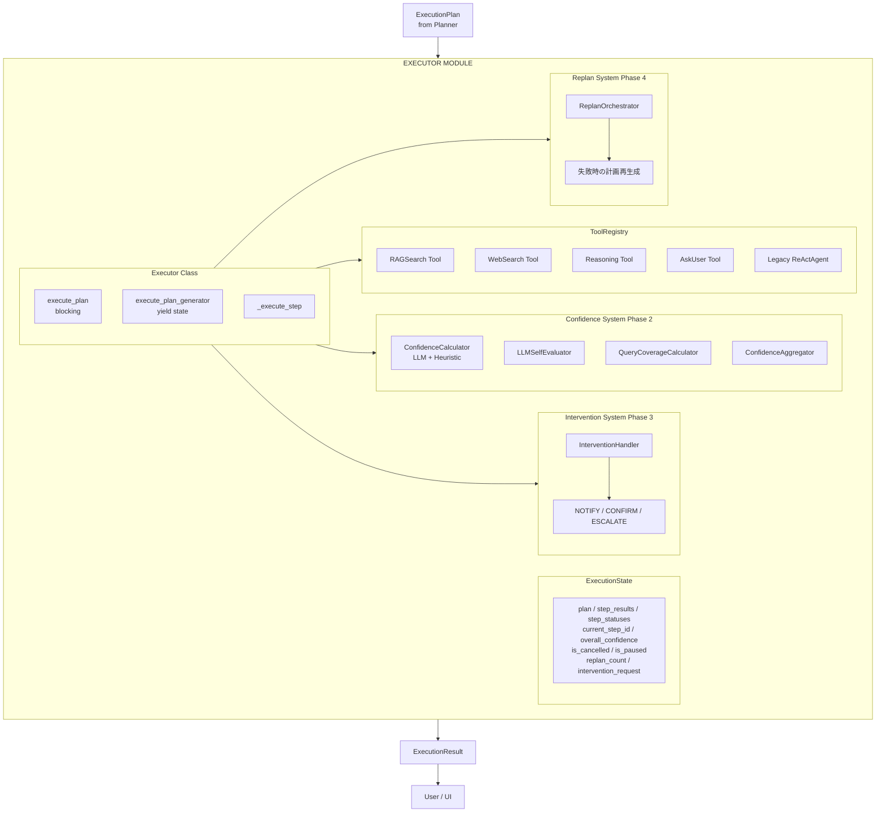
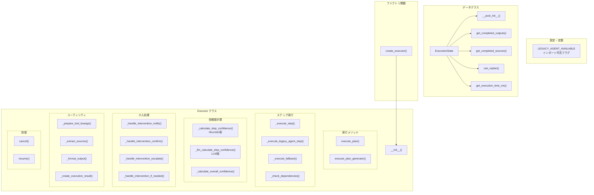
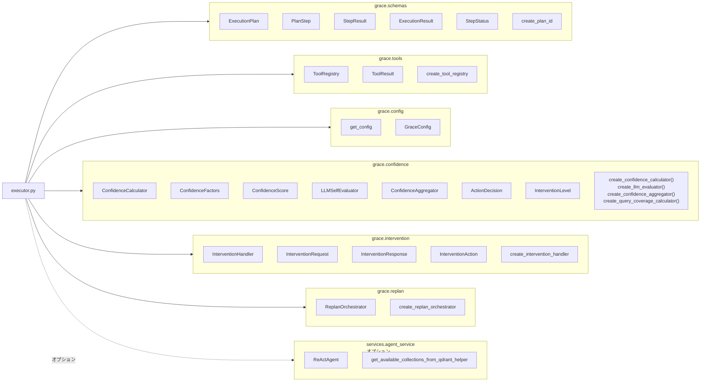
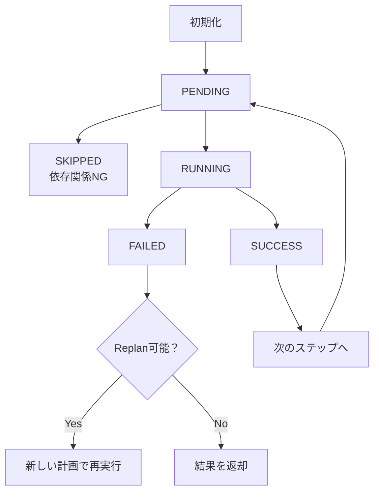

# executor.py - GRACE計画実行エージェント ドキュメント

**Version 3.0** | 最終更新: 2026-02-19

---

## 目次

1. [概要](#概要)
   - [主な責務](#主な責務)
   - [各責務対応のモジュール](#各責務対応のモジュール)
   - [主要機能一覧](#主要機能一覧)
2. [アーキテクチャ構成図](#1-アーキテクチャ構成図)
   - [システム全体構成](#11-システム全体構成)
   - [データフロー](#12-データフロー)
3. [モジュール構成図](#2-モジュール構成図)
   - [内部モジュール構成](#21-内部モジュール構成)
   - [外部依存関係](#22-外部依存関係)
   - [内部依存モジュール](#23-内部依存モジュール)
4. [クラス・関数一覧表](#3-クラス関数一覧表)
   - [クラス一覧](#31-クラス一覧)
   - [関数一覧（カテゴリ別）](#32-関数一覧カテゴリ別)
5. [クラス・関数 IPO詳細](#4-クラス関数-ipo詳細)
   - [ExecutionState データクラス](#41-executionstate-データクラス)
   - [Executor クラス](#42-executor-クラス)
   - [ファクトリ関数](#43-ファクトリ関数)
6. [設定・定数](#5-設定定数)
   - [LEGACY_AGENT_AVAILABLE](#51-legacy_agent_available)
   - [GraceConfigから使用される設定](#52-graceconfigから使用される設定)
7. [使用例](#6-使用例)
   - [基本的なワークフロー](#61-基本的なワークフロー)
   - [コールバック付きの使用](#62-コールバック付きの使用)
   - [ジェネレータ版の使用](#63-ジェネレータ版の使用)
8. [エクスポート](#7-エクスポート)
9. [変更履歴](#8-変更履歴)
10. [付録: 依存関係図](#付録-依存関係図)
11. [付録: エラーハンドリング](#付録-エラーハンドリング)
12. [付録: ステータス遷移図](#付録-ステータス遷移図)

---

## 概要

`executor.py`は、GRACE（Guided Reasoning with Adaptive Confidence Execution）エージェントの計画実行コンポーネントです。Plannerが生成した`ExecutionPlan`を受け取り、各ステップを順次実行して結果を管理します。

### 主な責務

- 計画の順次実行（ブロッキング版/ジェネレータ版）
- ステップ間の依存関係管理
- ツールの呼び出しと結果管理（ToolRegistry経由）
- 信頼度（Confidence）の計算と評価（LLM版/Heuristic版）
- Human-in-the-Loop（HITL）介入処理（NOTIFY/CONFIRM/ESCALATE）
- 失敗時のリプラン連携（ReplanOrchestrator）
- 実行状態の追跡とコールバック通知

### 各責務対応のモジュール

| # | 責務 | 対応モジュール | 説明 |
|---|------|--------------|------|
| 1 | 計画の順次実行 | `executor.py` | ブロッキング版（`execute_plan`）とジェネレータ版（`execute_plan_generator`）の2モード |
| 2 | ステップ間の依存関係管理 | `executor.py` | `_check_dependencies`で依存ステップの成否を確認 |
| 3 | ツールの呼び出しと結果管理 | `grace.tools` | ToolRegistryから取得したツールを`_execute_step`で実行 |
| 4 | 信頼度の計算と評価 | `grace.confidence` | LLM版（`_llm_calculate_step_confidence`）とHeuristic版（`_calculate_step_confidence`）の二重構成 |
| 5 | HITL介入処理 | `grace.intervention` | InterventionHandlerを通じてNOTIFY/CONFIRM/ESCALATEレベルの介入を処理 |
| 6 | 失敗時のリプラン連携 | `grace.replan` | ReplanOrchestratorを通じてステップ失敗時に計画を再生成 |
| 7 | 実行状態の追跡 | `executor.py` | ExecutionStateデータクラスで状態を管理、コールバックでUIに通知 |

### 主要機能一覧

| 機能 | 説明 |
|------|------|
| `ExecutionState` | 実行状態管理データクラス |
| `ExecutionState.__post_init__()` | 全ステップをPENDINGで初期化 |
| `ExecutionState.get_completed_outputs()` | 成功したステップの出力を取得 |
| `ExecutionState.get_completed_sources()` | 成功したステップのソースを取得 |
| `ExecutionState.can_replan()` | リプラン可能か判定 |
| `ExecutionState.get_execution_time_ms()` | 実行時間（ミリ秒）を取得 |
| `Executor` | 計画実行エージェントクラス |
| `Executor.__init__()` | コンストラクタ（各種コンポーネントの初期化） |
| `Executor.execute_plan()` | 計画を同期実行（ブロッキング版） |
| `Executor.execute_plan_generator()` | 計画をジェネレータで実行（UI連携用） |
| `Executor._execute_step()` | 個別ステップの実行（ジェネレータ対応） |
| `Executor._execute_legacy_agent_step()` | Legacy ReActAgentを使用したステップ実行 |
| `Executor._check_dependencies()` | ステップの依存関係を確認 |
| `Executor._llm_calculate_step_confidence()` | LLMを使用したステップ信頼度計算 |
| `Executor._calculate_step_confidence()` | Heuristicベースのステップ信頼度計算 |
| `Executor._calculate_overall_confidence()` | 全体信頼度の計算（LLMSelfEvaluator + QueryCoverage + Aggregator） |
| `Executor.cancel()` | 実行をキャンセル |
| `Executor.resume()` | 実行を再開 |
| `create_executor()` | Executorインスタンスを作成するファクトリ関数 |

---

## 1. アーキテクチャ構成図

### 1.1 システム全体構成



### 1.2 データフロー

1. Plannerから`ExecutionPlan`を受信
2. `ExecutionState`を初期化し、全ステップをPENDINGに設定
3. 各ステップを順次実行（依存関係を確認）
4. ツールを呼び出し、結果を取得（中間結果をyieldでUI通知）
5. 信頼度を計算し（LLM版優先、低スコア時はHeuristicと比較）、必要に応じて介入を処理
6. 失敗時はリプランを実行（最大3回）
7. 全体信頼度を計算（LLMSelfEvaluator + QueryCoverage + Aggregator）
8. `ExecutionResult`を生成して返却

---

## 2. モジュール構成図

### 2.1 内部モジュール構成



### 2.2 外部依存関係

| ライブラリ | バージョン | 用途 |
|-----------|-----------|------|
| `logging` | 標準ライブラリ | ログ出力 |
| `time` | 標準ライブラリ | 実行時間計測 |
| `dataclasses` | 標準ライブラリ | データクラス定義 |
| `enum` | 標準ライブラリ | 列挙型（Enum） |

### 2.3 内部依存モジュール

| モジュール | 用途 |
|-----------|------|
| `grace.schemas` | ExecutionPlan, PlanStep, StepResult, ExecutionResult, StepStatus, create_plan_id |
| `grace.tools` | ToolRegistry, ToolResult, create_tool_registry |
| `grace.config` | get_config, GraceConfig設定管理 |
| `grace.confidence` | ConfidenceCalculator, ConfidenceFactors, ConfidenceScore, LLMSelfEvaluator, ConfidenceAggregator, ActionDecision, InterventionLevel, create_confidence_calculator, create_llm_evaluator, create_confidence_aggregator, create_query_coverage_calculator, create_source_agreement_calculator |
| `grace.intervention` | InterventionHandler, InterventionRequest, InterventionResponse, InterventionAction, create_intervention_handler |
| `grace.replan` | ReplanOrchestrator, create_replan_orchestrator |
| `services.agent_service` | ReActAgent, get_available_collections_from_qdrant_helper（オプション、Legacy Agent用） |

---

## 3. クラス・関数一覧表

### 3.1 クラス一覧

#### ExecutionState

| メソッド | 概要 |
|---------|------|
| `__post_init__()` | 全ステップをPENDINGで初期化 |
| `get_completed_outputs()` | 成功したステップの出力を取得 |
| `get_completed_sources()` | 成功したステップのソースを取得 |
| `can_replan()` | リプラン可能か判定 |
| `get_execution_time_ms()` | 実行時間（ミリ秒）を取得 |

#### Executor

| メソッド | 概要 |
|---------|------|
| `__init__(config, tool_registry, ...)` | コンストラクタ（各種コンポーネントの初期化） |
| `execute_plan(plan)` | 計画を同期実行（ブロッキング版） |
| `execute_plan_generator(plan, state)` | 計画をジェネレータで実行（UI連携用） |
| `_execute_step(step, state)` | 個別ステップの実行（ジェネレータ対応） |
| `_execute_legacy_agent_step(step, state, start_time)` | Legacy ReActAgentを使用したステップ実行 |
| `_execute_fallback(step, state)` | フォールバックアクションの実行 |
| `_check_dependencies(step, state)` | ステップの依存関係を確認 |
| `_prepare_tool_kwargs(step, state)` | ツール実行引数の準備 |
| `_llm_calculate_step_confidence(tool_result, step, state)` | ステップ信頼度の計算（LLM版） |
| `_calculate_step_confidence(tool_result, step, state)` | ステップ信頼度の計算（Heuristic版） |
| `_calculate_overall_confidence(state)` | 全体信頼度の計算 |
| `_extract_sources(tool_result)` | ツール結果からソースを抽出 |
| `_format_output(output)` | 出力を文字列にフォーマット |
| `_create_execution_result(state)` | ExecutionResultを生成 |
| `_handle_intervention_notify(message)` | NOTIFYレベルの介入処理 |
| `_handle_intervention_confirm(request)` | CONFIRMレベルの介入処理 |
| `_handle_intervention_escalate(request)` | ESCALATEレベルの介入処理 |
| `_handle_intervention_if_needed(action_decision, step, state)` | 介入が必要か判定して処理 |
| `cancel(state)` | 実行をキャンセル |
| `resume(state)` | 実行を再開 |

### 3.2 関数一覧（カテゴリ別）

#### ファクトリ関数

| 関数名 | 概要 |
|-------|------|
| `create_executor(config, tool_registry, **kwargs)` | Executorインスタンスを作成 |

---

## 4. クラス・関数 IPO詳細

### 4.1 ExecutionState データクラス

実行状態管理。計画の実行状態、ステップ結果、信頼度、制御フラグなどを保持します。

#### フィールド一覧

| フィールド | 型 | デフォルト | 説明 |
|-----------|------|-----------|------|
| `plan` | ExecutionPlan | - | 実行中の計画 |
| `current_step_id` | int | 0 | 現在実行中のステップID |
| `step_results` | Dict[int, StepResult] | {} | ステップID → 結果のマッピング |
| `step_statuses` | Dict[int, StepStatus] | {} | ステップID → ステータスのマッピング |
| `overall_confidence` | float | 0.0 | 全体の信頼度スコア (0.0-1.0) |
| `is_cancelled` | bool | False | キャンセルフラグ |
| `is_paused` | bool | False | 一時停止フラグ |
| `intervention_request` | Optional[Any] | None | 保留中の介入リクエスト（InterventionRequest） |
| `replan_count` | int | 0 | リプラン実行回数 |
| `max_replans` | int | 3 | 最大リプラン回数 |
| `start_time` | Optional[float] | None | 実行開始時刻 |
| `end_time` | Optional[float] | None | 実行終了時刻 |

---

#### メソッド: `__post_init__`

**概要**: データクラス初期化後の処理。全ステップのステータスをPENDINGで初期化します。

```python
def __post_init__(self) -> None
```

| 項目 | 内容 |
|------|------|
| **Input** | なし（selfのみ） |
| **Process** | 計画内の全ステップのステータスを`StepStatus.PENDING`で初期化 |
| **Output** | なし（`self.step_statuses`が初期化された状態） |

---

#### メソッド: `get_completed_outputs`

**概要**: 成功したステップの出力を取得します。

```python
def get_completed_outputs(self) -> Dict[int, str]
```

| 項目 | 内容 |
|------|------|
| **Input** | なし（selfのみ） |
| **Process** | statusが"success"のステップの出力を抽出 |
| **Output** | `Dict[int, str]`: ステップID → 出力のマッピング |

**戻り値例**:
```python
{
    1: "検索結果: 『金色夜叉』は尾崎紅葉の作品です...",
    2: "尾崎紅葉は明治時代の小説家で..."
}
```

---

#### メソッド: `get_completed_sources`

**概要**: 成功したステップのソースを取得します。

```python
def get_completed_sources(self) -> List[str]
```

| 項目 | 内容 |
|------|------|
| **Input** | なし（selfのみ） |
| **Process** | statusが"success"でsourcesが存在するステップからソースを収集 |
| **Output** | `List[str]`: ソースURLや参照のリスト |

**戻り値例**:
```python
["wikipedia_ja:尾崎紅葉", "wikipedia_ja:金色夜叉"]
```

---

#### メソッド: `can_replan`

**概要**: リプラン可能か判定します。

```python
def can_replan(self) -> bool
```

| 項目 | 内容 |
|------|------|
| **Input** | なし（selfのみ） |
| **Process** | リプラン回数が上限未満（`replan_count < max_replans`）かつキャンセルされていないか確認 |
| **Output** | `bool`: リプラン可能ならTrue |

---

#### メソッド: `get_execution_time_ms`

**概要**: 実行時間をミリ秒で取得します。

```python
def get_execution_time_ms(self) -> Optional[int]
```

| 項目 | 内容 |
|------|------|
| **Input** | なし（selfのみ） |
| **Process** | start_timeからend_time（またはcurrent time）までの経過時間を計算 |
| **Output** | `Optional[int]`: 実行時間（ミリ秒）、start_timeがNoneの場合はNone |

**戻り値例**:
```python
1234  # 1.234秒
```

---

### 4.2 Executor クラス

計画実行エージェント（GRACEネイティブ実装）。ToolRegistry、Confidenceシステム、Interventionシステム、Replanシステムを統合して計画を実行します。

#### コンストラクタ: `__init__`

**概要**: Executorインスタンスを初期化します。設定、ToolRegistry、各種Confidenceコンポーネント、コールバック、InterventionHandler、ReplanOrchestratorを設定します。

```python
Executor(
    config: Optional[GraceConfig] = None,
    tool_registry: Optional[ToolRegistry] = None,
    on_step_start: Optional[Callable[[PlanStep], None]] = None,
    on_step_complete: Optional[Callable[[StepResult], None]] = None,
    on_intervention_required: Optional[Callable[[str, Dict], Any]] = None,
    on_confidence_update: Optional[Callable[[ConfidenceScore, ActionDecision], None]] = None,
    on_replan: Optional[Callable[[str, int], None]] = None,
    replan_orchestrator: Optional[ReplanOrchestrator] = None,
    enable_replan: bool = True
)
```

| パラメータ | 型 | デフォルト | 説明 |
|------------|------|-----------|------|
| `config` | Optional[GraceConfig] | None | GRACE設定（Noneの場合はデフォルト設定を使用） |
| `tool_registry` | Optional[ToolRegistry] | None | ツールレジストリ（Noneの場合はデフォルト作成） |
| `on_step_start` | Optional[Callable] | None | ステップ開始時コールバック |
| `on_step_complete` | Optional[Callable] | None | ステップ完了時コールバック |
| `on_intervention_required` | Optional[Callable] | None | 介入要求時コールバック |
| `on_confidence_update` | Optional[Callable] | None | 信頼度更新時コールバック |
| `on_replan` | Optional[Callable] | None | リプラン発生時コールバック |
| `replan_orchestrator` | Optional[ReplanOrchestrator] | None | リプランオーケストレーター |
| `enable_replan` | bool | True | リプラン機能の有効/無効 |

| 項目 | 内容 |
|------|------|
| **Input** | 上記パラメータ |
| **Process** | 1. 設定の取得（`get_config()`）<br>2. ToolRegistryの初期化（`create_tool_registry`）<br>3. Confidenceコンポーネントの初期化（Calculator, LLMEvaluator, QueryCoverage, Aggregator）<br>4. コールバックの設定（5種）<br>5. InterventionHandlerの初期化（notify/confirm/escalateコールバック付き）<br>6. ReplanOrchestratorの初期化（指定/自動生成/無効の3パターン）<br>7. `step_confidence_scores`辞書の初期化 |
| **Output** | Executorインスタンス |

```python
# 使用例
from grace.executor import Executor
from grace.config import get_config

# デフォルト設定で初期化
executor = Executor()

# カスタム設定で初期化
config = get_config("config/custom.yml")
executor = Executor(config=config, enable_replan=False)
```

---

#### メソッド: `execute_plan`

**概要**: 計画を同期実行します（ブロッキング版）。全ステップを順次実行し、最終結果を返します。ジェネレータ版と異なり、中間状態のyieldは行いません。

```python
def execute_plan(self, plan: ExecutionPlan) -> ExecutionResult
```

| パラメータ | 型 | デフォルト | 説明 |
|------------|------|-----------|------|
| `plan` | ExecutionPlan | - | 実行する計画 |

| 項目 | 内容 |
|------|------|
| **Input** | `plan: ExecutionPlan` |
| **Process** | 1. 受信した計画内容をログ出力<br>2. ExecutionStateの初期化（開始時刻を記録）<br>3. 各ステップを順次実行（キャンセルチェック → 依存関係チェック → ツール実行）<br>4. `_execute_step`の戻り値がGeneratorの場合は最後まで消費して結果を取得<br>5. 結果を保存し、ステータスを更新<br>6. ask_userステップの場合は`on_intervention_required`で応答を取得<br>7. 失敗時はReplanOrchestratorで計画を再生成し再帰実行<br>8. 全体信頼度を計算（`_calculate_overall_confidence`）<br>9. ExecutionResultを生成 |
| **Output** | `ExecutionResult`: 実行結果 |

**戻り値例**:
```python
ExecutionResult(
    plan_id="plan_20260212_123456_abc123",
    original_query="『金色夜叉』の作者は誰ですか？",
    final_answer="『金色夜叉』の作者は尾崎紅葉です。",
    step_results=[...],
    overall_confidence=0.85,
    overall_status="success",
    replan_count=0,
    total_execution_time_ms=1234
)
```

```python
# 使用例
from grace.executor import create_executor
from grace.planner import create_planner

planner = create_planner()
plan = planner.create_plan("『金色夜叉』の作者は誰ですか？")

executor = create_executor()
result = executor.execute_plan(plan)

print(f"ステータス: {result.overall_status}")
print(f"信頼度: {result.overall_confidence:.2f}")
print(f"回答: {result.final_answer}")
```

---

#### メソッド: `execute_plan_generator`

**概要**: 計画をジェネレータで実行します（UI連携用）。各ステップ完了後に状態をyieldし、リアルタイム表示を可能にします。介入が必要な場合は一時停止状態をyieldして返却します。

```python
def execute_plan_generator(
    self,
    plan: ExecutionPlan,
    state: Optional[ExecutionState] = None
) -> Generator[ExecutionState, None, ExecutionResult]
```

| パラメータ | 型 | デフォルト | 説明 |
|------------|------|-----------|------|
| `plan` | ExecutionPlan | - | 実行する計画 |
| `state` | Optional[ExecutionState] | None | 既存の状態（再開時に指定） |

| 項目 | 内容 |
|------|------|
| **Input** | `plan: ExecutionPlan`, `state: Optional[ExecutionState] = None` |
| **Process** | 1. 受信した計画内容をログ出力<br>2. ExecutionStateの初期化（未指定時）<br>3. 未完了ステップのリストを取得<br>4. 各ステップを順次実行（キャンセルチェック → 依存関係チェック → ツール実行）<br>5. `_execute_step`がGeneratorの場合は`yield from`で中間イベントを中継<br>6. CONFIRM/ESCALATE介入時はInterventionRequestを作成し、一時停止状態をyield後にreturn<br>7. 失敗時はReplanOrchestratorで計画を再生成し再帰的にyield from<br>8. 全体信頼度を計算してExecutionResultをreturn |
| **Yields** | `ExecutionState`: 各ステップ完了後の状態 |
| **Returns** | `ExecutionResult`: 最終実行結果 |

```python
# 使用例
from grace.executor import create_executor

executor = create_executor()
generator = executor.execute_plan_generator(plan)

try:
    while True:
        state = next(generator)
        print(f"現在のステップ: {state.current_step_id}")
        print(f"完了ステップ: {list(state.step_results.keys())}")

        if state.is_paused and state.intervention_request:
            # UIで介入処理
            handle_intervention(state.intervention_request)
            state.is_paused = False

except StopIteration as e:
    result = e.value
    print(f"完了: {result.overall_status}")
```

---

#### メソッド: `_execute_step`

**概要**: 個別ステップを実行します。ツールを取得し、引数を準備して実行、中間結果をyieldで通知した後、信頼度を計算してStepResultを返します。`run_legacy_agent`アクションの場合は`_execute_legacy_agent_step`に委譲します。

```python
def _execute_step(self, step: PlanStep, state: ExecutionState) -> Any
```

| パラメータ | 型 | デフォルト | 説明 |
|------------|------|-----------|------|
| `step` | PlanStep | - | 実行するステップ |
| `state` | ExecutionState | - | 現在の実行状態 |

| 項目 | 内容 |
|------|------|
| **Input** | `step: PlanStep`, `state: ExecutionState` |
| **Process** | 1. ToolRegistryからツールを取得<br>2. `run_legacy_agent`の場合は`_execute_legacy_agent_step`に委譲<br>3. `_prepare_tool_kwargs`でツール引数を準備<br>4. ツールを実行<br>5. 成功時は中間結果をyieldで通知（IPO風ラベル付き）<br>6. `_llm_calculate_step_confidence`で信頼度を計算<br>7. ソースを抽出<br>8. StepResultを構築してreturn<br>9. 失敗時は`_execute_fallback`を実行 |
| **Output** | `StepResult` または `Generator[Any, None, StepResult]` |

---

#### メソッド: `_execute_legacy_agent_step`

**概要**: Legacy ReActAgentを使用したステップ実行（ジェネレータ版）。コレクション準備、Agent初期化、ストリーミング実行を行い、結果を構築します。

```python
def _execute_legacy_agent_step(
    self, step: PlanStep, state: ExecutionState, start_time: float
) -> Generator[Any, None, StepResult]
```

| パラメータ | 型 | デフォルト | 説明 |
|------------|------|-----------|------|
| `step` | PlanStep | - | 実行するステップ |
| `state` | ExecutionState | - | 現在の実行状態 |
| `start_time` | float | - | ステップ開始時刻 |

| 項目 | 内容 |
|------|------|
| **Input** | `step: PlanStep`, `state: ExecutionState`, `start_time: float` |
| **Process** | 1. Qdrantからコレクション一覧を取得（失敗時はconfig.qdrant.search_priority）<br>2. ReActAgentを初期化<br>3. `execute_turn`でストリーミング実行し、各イベントをyieldで上位に中継<br>4. イベントからソースを抽出（"Source:"パターン）<br>5. 簡易Confidence計算（回答あり=0.8、なし/謝罪=0.3）<br>6. ConfidenceScoreオブジェクトを作成・保存<br>7. StepResultを構築してreturn |
| **Output** | `Generator[Any, None, StepResult]` |

---

#### メソッド: `_check_dependencies`

**概要**: ステップの依存関係を確認します。依存するステップが全て完了し、失敗していないことを確認します。

```python
def _check_dependencies(self, step: PlanStep, state: ExecutionState) -> bool
```

| パラメータ | 型 | デフォルト | 説明 |
|------------|------|-----------|------|
| `step` | PlanStep | - | 確認するステップ |
| `state` | ExecutionState | - | 現在の実行状態 |

| 項目 | 内容 |
|------|------|
| **Input** | `step: PlanStep`, `state: ExecutionState` |
| **Process** | `depends_on`の各ステップIDが`step_results`に存在し、statusが"failed"でないことを確認 |
| **Output** | `bool`: 依存関係が満たされていればTrue |

---

#### メソッド: `_prepare_tool_kwargs`

**概要**: ツール実行引数を準備します。アクションタイプに応じて、RAG検索のcollection指定、reasoningのコンテキスト構築、ask_userの質問構成を行います。

```python
def _prepare_tool_kwargs(self, step: PlanStep, state: ExecutionState) -> Dict[str, Any]
```

| パラメータ | 型 | デフォルト | 説明 |
|------------|------|-----------|------|
| `step` | PlanStep | - | 実行するステップ |
| `state` | ExecutionState | - | 現在の実行状態 |

| 項目 | 内容 |
|------|------|
| **Input** | `step: PlanStep`, `state: ExecutionState` |
| **Process** | 1. 基本引数（query）を設定<br>2. `rag_search`: collection引数を追加<br>3. `web_search`: num_results/language引数を追加（config.web_searchから取得）<br>4. `reasoning`: 依存ステップの結果をパースしcontext/sourcesとして追加<br>5. `ask_user`: question/reason/urgencyを追加 |
| **Output** | `Dict[str, Any]`: ツール実行引数 |

---

#### メソッド: `_llm_calculate_step_confidence`

**概要**: LLMを使用したステップ信頼度の計算。ConfidenceFactorsを構築し、ConfidenceCalculator.llm_calculateで評価します。LLM評価が低スコアの場合はHeuristic版と比較して高い方を採用します。

```python
def _llm_calculate_step_confidence(
    self, tool_result: ToolResult, step: PlanStep, state: ExecutionState
) -> float
```

| パラメータ | 型 | デフォルト | 説明 |
|------------|------|-----------|------|
| `tool_result` | ToolResult | - | ツール実行結果 |
| `step` | PlanStep | - | 実行したステップ |
| `state` | ExecutionState | - | 現在の実行状態 |

| 項目 | 内容 |
|------|------|
| **Input** | `tool_result: ToolResult`, `step: PlanStep`, `state: ExecutionState` |
| **Process** | 1. 失敗時は0.0を返却<br>2. ソース抽出とsource_count決定<br>3. source_agreementの計算（2ソース以上の場合）<br>4. 依存ステップからのスコア継承（非検索ステップの場合）<br>5. ConfidenceFactorsを構築<br>6. `confidence_calculator.llm_calculate`でLLM評価<br>7. 低スコア（< 0.6）かつ検索ステップの場合、Heuristicと比較して高い方を採用<br>8. ConfidenceScoreを保存<br>9. ActionDecisionを取得してコールバック通知 |
| **Output** | `float`: 信頼度スコア (0.0-1.0) |

---

#### メソッド: `_calculate_step_confidence`

**概要**: Heuristicベースのステップ信頼度計算。`_llm_calculate_step_confidence`のフォールバック版。ConfidenceFactorsを構築し、ConfidenceCalculator.calculateで評価します。

```python
def _calculate_step_confidence(
    self, tool_result: ToolResult, step: PlanStep, state: ExecutionState
) -> float
```

| パラメータ | 型 | デフォルト | 説明 |
|------------|------|-----------|------|
| `tool_result` | ToolResult | - | ツール実行結果 |
| `step` | PlanStep | - | 実行したステップ |
| `state` | ExecutionState | - | 現在の実行状態 |

| 項目 | 内容 |
|------|------|
| **Input** | `tool_result: ToolResult`, `step: PlanStep`, `state: ExecutionState` |
| **Process** | `_llm_calculate_step_confidence`と同一のConfidenceFactors構築ロジック後、`confidence_calculator.calculate`（Heuristic版）で計算 |
| **Output** | `float`: 信頼度スコア (0.0-1.0) |

---

#### メソッド: `_calculate_overall_confidence`

**概要**: 全体の信頼度を計算します。各ステップのConfidenceScore、LLM自己評価（LLMSelfEvaluator）、クエリ網羅度（QueryCoverageCalculator）を統合します。

```python
def _calculate_overall_confidence(self, state: ExecutionState) -> float
```

| パラメータ | 型 | デフォルト | 説明 |
|------------|------|-----------|------|
| `state` | ExecutionState | - | 最終実行状態 |

| 項目 | 内容 |
|------|------|
| **Input** | `state: ExecutionState` |
| **Process** | 1. 各ステップのConfidenceScoreを収集<br>2. 最後のステップのbreakdownをベースとして取得<br>3. 最終回答を取得（最後のreasoning/run_legacy_agentステップ）<br>4. LLMSelfEvaluatorで最終回答を評価（breakdownに`llm_self_eval`として追加）<br>5. QueryCoverageCalculatorでクエリ網羅度を評価（breakdownに`query_coverage`として追加）<br>6. 網羅度評価完了時に`on_confidence_update`コールバックで通知<br>7. ConfidenceAggregatorで重み付き統合<br>8. フォールバック: 単純平均 |
| **Output** | `float`: 全体信頼度スコア (0.0-1.0) |

**戻り値例**:
```python
0.85  # 85%の信頼度
```

---

#### メソッド: `_execute_fallback`

**概要**: フォールバックアクションを実行します。元のステップの`fallback`フィールドで指定されたアクションで代替ステップを作成し実行します。

```python
def _execute_fallback(self, step: PlanStep, state: ExecutionState) -> StepResult
```

| パラメータ | 型 | デフォルト | 説明 |
|------------|------|-----------|------|
| `step` | PlanStep | - | 失敗した元のステップ |
| `state` | ExecutionState | - | 現在の実行状態 |

| 項目 | 内容 |
|------|------|
| **Input** | `step: PlanStep`, `state: ExecutionState` |
| **Process** | 1. `step.fallback`をアクションとするPlanStepを作成（fallback=Noneで二重フォールバック防止）<br>2. `_execute_step`で実行（Generatorの場合は最後まで消費） |
| **Output** | `StepResult`: フォールバック実行結果 |

---

#### メソッド: `_extract_sources`

**概要**: ツール結果からソースを抽出します。

```python
def _extract_sources(self, tool_result: ToolResult) -> List[str]
```

| パラメータ | 型 | デフォルト | 説明 |
|------------|------|-----------|------|
| `tool_result` | ToolResult | - | ツール実行結果 |

| 項目 | 内容 |
|------|------|
| **Input** | `tool_result: ToolResult` |
| **Process** | outputがlistの場合、各itemのpayload.sourceを抽出（重複排除） |
| **Output** | `List[str]`: ソース名のリスト |

---

#### メソッド: `_format_output`

**概要**: 出力を文字列にフォーマットします。

```python
def _format_output(self, output: Any) -> Optional[str]
```

| パラメータ | 型 | デフォルト | 説明 |
|------------|------|-----------|------|
| `output` | Any | - | フォーマットする出力 |

| 項目 | 内容 |
|------|------|
| **Input** | `output: Any` |
| **Process** | None → None、str → そのまま、dict → str()、list → 要素をjoinまたはstr() |
| **Output** | `Optional[str]`: フォーマットされた文字列 |

---

#### メソッド: `_create_execution_result`

**概要**: 実行結果を生成します。全体ステータスの判定と最終回答の取得を行います。

```python
def _create_execution_result(self, state: ExecutionState) -> ExecutionResult
```

| パラメータ | 型 | デフォルト | 説明 |
|------------|------|-----------|------|
| `state` | ExecutionState | - | 実行状態 |

| 項目 | 内容 |
|------|------|
| **Input** | `state: ExecutionState` |
| **Process** | 1. 全体ステータスを判定（cancelled/success/partial/failed）<br>2. 最終回答を取得（最後のreasoning/run_legacy_agentステップの成功出力）<br>3. ExecutionResultを構築 |
| **Output** | `ExecutionResult`: 実行結果 |

---

#### メソッド: `cancel`

**概要**: 実行をキャンセルします。

```python
def cancel(self, state: ExecutionState) -> None
```

| パラメータ | 型 | デフォルト | 説明 |
|------------|------|-----------|------|
| `state` | ExecutionState | - | キャンセルする実行状態 |

| 項目 | 内容 |
|------|------|
| **Input** | `state: ExecutionState` |
| **Process** | `state.is_cancelled = True`を設定 |
| **Output** | なし |

---

#### メソッド: `resume`

**概要**: 実行を再開します。

```python
def resume(self, state: ExecutionState) -> None
```

| パラメータ | 型 | デフォルト | 説明 |
|------------|------|-----------|------|
| `state` | ExecutionState | - | 再開する実行状態 |

| 項目 | 内容 |
|------|------|
| **Input** | `state: ExecutionState` |
| **Process** | `state.is_paused = False`を設定 |
| **Output** | なし |

---

#### メソッド: `_handle_intervention_notify`

**概要**: NOTIFYレベルの介入処理。ログ出力と、オプションでUI通知を行います。

```python
def _handle_intervention_notify(self, message: str) -> None
```

| パラメータ | 型 | デフォルト | 説明 |
|------------|------|-----------|------|
| `message` | str | - | 通知メッセージ |

| 項目 | 内容 |
|------|------|
| **Input** | `message: str` |
| **Process** | 1. INFOログ出力<br>2. `on_intervention_required`コールバックで"notify"タイプの通知 |
| **Output** | なし |

---

#### メソッド: `_handle_intervention_confirm`

**概要**: CONFIRMレベルの介入処理。UIにユーザー確認を要求し、応答に基づいてInterventionResponseを返します。

```python
def _handle_intervention_confirm(self, request: InterventionRequest) -> InterventionResponse
```

| パラメータ | 型 | デフォルト | 説明 |
|------------|------|-----------|------|
| `request` | InterventionRequest | - | 介入リクエスト |

| 項目 | 内容 |
|------|------|
| **Input** | `request: InterventionRequest` |
| **Process** | 1. `on_intervention_required`で"confirm"タイプの確認をUIに送信<br>2. ユーザー応答を解析（proceed/modify/cancel/input）<br>3. コールバックなしの場合はデフォルトでPROCEED |
| **Output** | `InterventionResponse`: 介入応答 |

---

#### メソッド: `_handle_intervention_escalate`

**概要**: ESCALATEレベルの介入処理。UIにユーザー入力を要求します。

```python
def _handle_intervention_escalate(self, request: InterventionRequest) -> InterventionResponse
```

| パラメータ | 型 | デフォルト | 説明 |
|------------|------|-----------|------|
| `request` | InterventionRequest | - | 介入リクエスト |

| 項目 | 内容 |
|------|------|
| **Input** | `request: InterventionRequest` |
| **Process** | 1. `on_intervention_required`で"escalate"タイプのユーザー入力要求をUIに送信<br>2. 応答がある場合はINPUTアクションで返却<br>3. コールバックなしの場合はタイムアウト扱いでPROCEED |
| **Output** | `InterventionResponse`: 介入応答 |

---

#### メソッド: `_handle_intervention_if_needed`

**概要**: 必要に応じて介入を処理します。ActionDecisionのレベルに応じて適切な処理を実行します。

```python
def _handle_intervention_if_needed(
    self, action_decision: ActionDecision, step: PlanStep, state: ExecutionState
) -> Optional[InterventionResponse]
```

| パラメータ | 型 | デフォルト | 説明 |
|------------|------|-----------|------|
| `action_decision` | ActionDecision | - | 信頼度に基づくアクション決定 |
| `step` | PlanStep | - | 現在のステップ |
| `state` | ExecutionState | - | 実行状態 |

| 項目 | 内容 |
|------|------|
| **Input** | `action_decision: ActionDecision`, `step: PlanStep`, `state: ExecutionState` |
| **Process** | 1. SILENT/NOTIFYは自動続行（NOTIFYはInterventionHandler経由で通知）<br>2. CONFIRM/ESCALATEはInterventionHandler.handleで処理<br>3. キャンセル応答の場合は`state.is_cancelled = True` |
| **Output** | `Optional[InterventionResponse]`: 介入レスポンス（SILENT/NOTIFYの場合はNone） |

---

### 4.3 ファクトリ関数

#### `create_executor`

**概要**: Executorインスタンスを作成するファクトリ関数です。

```python
def create_executor(
    config: Optional[GraceConfig] = None,
    tool_registry: Optional[ToolRegistry] = None,
    **kwargs
) -> Executor
```

| パラメータ | 型 | デフォルト | 説明 |
|------------|------|-----------|------|
| `config` | Optional[GraceConfig] | None | GRACE設定 |
| `tool_registry` | Optional[ToolRegistry] | None | ツールレジストリ |
| `**kwargs` | Any | - | 各種コールバック等（on_step_start, on_step_complete等） |

| 項目 | 内容 |
|------|------|
| **Input** | `config: Optional[GraceConfig] = None`, `tool_registry: Optional[ToolRegistry] = None`, `**kwargs` |
| **Process** | Executorコンストラクタを呼び出してインスタンスを生成 |
| **Output** | `Executor`: Executorインスタンス |

```python
# 使用例
from grace.executor import create_executor

# デフォルト設定で作成
executor = create_executor()

# コールバック付きで作成
def on_step_complete(result):
    print(f"ステップ {result.step_id} 完了")

executor = create_executor(on_step_complete=on_step_complete)
```

---

## 5. 設定・定数

### 5.1 LEGACY_AGENT_AVAILABLE

Legacy Agent（ReActAgent）のインポート可否を示すフラグ。

```python
LEGACY_AGENT_AVAILABLE: bool
# services.agent_service のインポートに成功した場合は True
```

### 5.2 GraceConfigから使用される設定

| 設定パス | 型 | デフォルト | 説明 |
|---------|-----|----------|------|
| `llm.model` | str | 設定ファイル依存 | LLMモデル名（Legacy Agent初期化時に使用） |
| `qdrant.url` | str | `http://localhost:6333` | QdrantサーバーURL |
| `qdrant.search_priority` | list | `["wikipedia_ja", ...]` | 検索優先順序（コレクション取得失敗時のフォールバック） |
| `confidence.weights.*` | float | 各種 | 信頼度計算の重み |
| `confidence.thresholds.*` | float | 各種 | 介入レベルの閾値 |
| `web_search.backend` | str | `"serpapi"` | Web検索バックエンド（"serpapi" / "duckduckgo" / "google_cse"） |
| `web_search.num_results` | int | 5 | Web検索の取得件数（`_prepare_tool_kwargs`で使用） |
| `web_search.language` | str | `"ja"` | Web検索の言語（`_prepare_tool_kwargs`で使用） |
| `web_search.timeout` | int | 30 | Web検索のタイムアウト（秒） |
| `replan.max_replans` | int | 3 | 最大リプラン回数 |

---

## 6. 使用例

### 6.1 基本的なワークフロー

```python
from grace.executor import create_executor
from grace.planner import create_planner

# 1. Plannerインスタンスを作成
planner = create_planner()

# 2. 計画を生成
query = "『金色夜叉』の作者は誰ですか？"
plan = planner.create_plan(query)

# 3. Executorインスタンスを作成
executor = create_executor()

# 4. 計画を実行
result = executor.execute_plan(plan)

# 5. 結果を確認
print(f"ステータス: {result.overall_status}")
print(f"信頼度: {result.overall_confidence:.2f}")
print(f"回答: {result.final_answer}")
print(f"実行時間: {result.total_execution_time_ms}ms")

# 出力例:
# ステータス: success
# 信頼度: 0.85
# 回答: 『金色夜叉』の作者は尾崎紅葉です。
# 実行時間: 1234ms
```

### 6.2 コールバック付きの使用

```python
from grace.executor import create_executor

def on_step_start(step):
    print(f"▶ ステップ {step.step_id} 開始: {step.description}")

def on_step_complete(result):
    status = "✓" if result.status == "success" else "✗"
    print(f"{status} ステップ {result.step_id} 完了: 信頼度={result.confidence:.2f}")

def on_intervention(type, data):
    if type == "confirm":
        return input(f"確認: {data['message']} (proceed/cancel): ")
    elif type == "escalate":
        return input(f"入力が必要: {data['message']}: ")
    return None

def on_confidence_update(score, decision):
    print(f"  信頼度更新: {score.score:.2f} -> {decision.level.value}")

executor = create_executor(
    on_step_start=on_step_start,
    on_step_complete=on_step_complete,
    on_intervention_required=on_intervention,
    on_confidence_update=on_confidence_update
)

result = executor.execute_plan(plan)
```

### 6.3 ジェネレータ版の使用

```python
from grace.executor import create_executor, ExecutionState

executor = create_executor()

# ジェネレータで実行（各ステップ後に状態を取得）
generator = executor.execute_plan_generator(plan)

try:
    while True:
        state = next(generator)

        # 進捗表示
        completed = len(state.step_results)
        total = len(state.plan.steps)
        print(f"進捗: {completed}/{total} ステップ完了")

        # 一時停止状態のチェック
        if state.is_paused and state.intervention_request:
            # UIで介入処理
            req = state.intervention_request
            print(f"介入要求: {req.message}")
            user_input = input("応答: ")
            # 応答を処理...
            state.is_paused = False

except StopIteration as e:
    result = e.value
    print(f"\n完了: {result.overall_status}")
    print(f"最終信頼度: {result.overall_confidence:.2f}")
```

---

## 7. エクスポート

`executor.py`でエクスポートされる要素：

```python
__all__ = [
    # データクラス
    "ExecutionState",
    # クラス
    "Executor",
    # ファクトリ関数
    "create_executor",
]
```

---

## 8. 変更履歴

| バージョン | 変更内容 |
|-----------|---------|
| 0.1.0 | 初版作成 |
| 1.0 | ドキュメント改修: a_md_doc_format.md v1.2に準拠、主な責務・主要機能一覧・IPO詳細に「**概要**:」ラベルを追加 |
| 2.0 | フォーマット仕様v1.4準拠: ASCII図をMermaid v9フローチャートに全面変更、「各責務対応のモジュール」テーブル追加、`_execute_fallback`/`_prepare_tool_kwargs`/`_format_output`/`_create_execution_result`/各介入処理メソッドのIPO詳細を追加、execute_plan_generatorのProcess詳細化（yield from中継・介入時一時停止・リプラン再帰の記載）、llm.modelを「設定ファイル依存」に変更 |
| 3.0 | web_search対応: アーキテクチャ図にWebSearch Tool追加、`_prepare_tool_kwargs`にweb_search引数（num_results/language）追加、設定テーブルにweb_search.*設定を追加、内部依存にcreate_source_agreement_calculator追加 |

---

## 付録: 依存関係図



---

## 付録: エラーハンドリング

### ツール実行失敗時

| 状況 | 動作 | ログレベル |
|-----|------|----------|
| ツール実行エラー | `_execute_fallback()`を使用 | ERROR |
| フォールバック成功 | 結果を返却 | INFO |
| フォールバック失敗 | status="failed"で結果を返却 | ERROR |

### 依存関係未達時

| 状況 | 動作 | ログレベル |
|-----|------|----------|
| 依存ステップ未完了 | ステップをスキップ（SKIPPED） | WARNING |
| 依存ステップ失敗 | ステップをスキップ（SKIPPED） | WARNING |

### 全体実行失敗時

| 状況 | 動作 | ログレベル |
|-----|------|----------|
| 例外発生 | overall_status="failed"で結果を返却 | ERROR |
| 回答 | "実行エラー: {error_message}" | - |
| 信頼度 | 0.0 | - |

### 信頼度計算失敗時

| 状況 | 動作 | ログレベル |
|-----|------|----------|
| LLM信頼度計算失敗 | Heuristic版にフォールバック | ERROR |
| ソース一致度計算失敗 | source_agreement=0.5を使用 | WARNING |
| LLM自己評価失敗 | スキップ（step_scoresに追加しない） | WARNING |
| クエリ網羅度評価失敗 | スキップ（step_scoresに追加しない） | WARNING |

### リプラン関連

| 状況 | 動作 | ログレベル |
|-----|------|----------|
| リプラン成功 | 新しい計画で再実行（ブロッキング版: 再帰、ジェネレータ版: yield from） | INFO |
| リプラン上限到達 | 元の結果をそのまま返却 | INFO |
| リプラン失敗 | 元の計画の結果をそのまま返却 | WARNING |

### Legacy Agent関連

| 状況 | 動作 | ログレベル |
|-----|------|----------|
| agent_serviceインポート失敗 | `LEGACY_AGENT_AVAILABLE=False`、実行時にImportError | WARNING |
| コレクション取得失敗 | config.qdrant.search_priorityを使用 | - |

---

## 付録: ステータス遷移図


