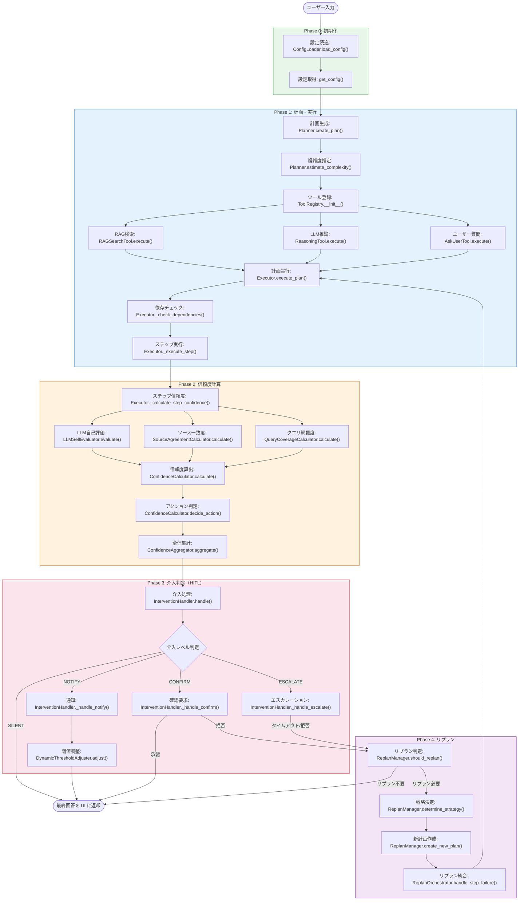
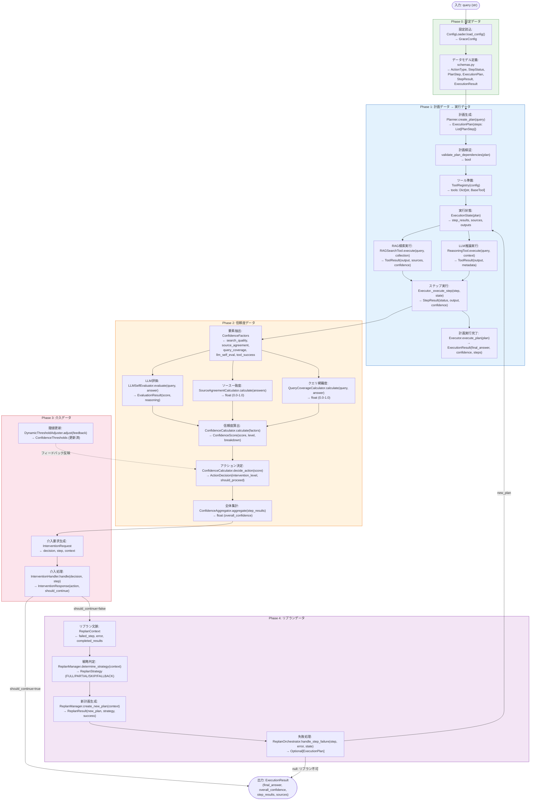

# grace/ クラス・関数リファレンス — grace_chat_page.py 処理順

**Version 1.0** | 作成日: 2025-02-13

---

## 目次

1. [概要](#1-概要)
2. [処理順クラス一覧表（サマリー）](#2-処理順クラス一覧表サマリー)
3. [詳細情報：処理順クラス・関数一覧](#3-詳細情報処理順クラス関数一覧)
4. [不足情報・課題の指摘](#4-不足情報課題の指摘)

---

## 1. 概要

`grace_chat_page.py` は Streamlit UI ページであり、GRACE アーキテクチャの各コンポーネントを**処理フローの順序**で呼び出す。本ドキュメントでは `grace/` パッケージ内の全クラスを、grace_chat_page.py の処理順に沿って整理する。

### 処理フロー概要

```
ユーザー入力
  → [Phase 0] config.py    設定読み込み
  → [Phase 0] schemas.py   データモデル定義（全Phase共通）
  → [Phase 1] planner.py   計画生成（ExecutionPlan作成）
  → [Phase 1] tools.py     ツール登録（ToolRegistry構築）
  → [Phase 1] executor.py  計画実行（ステップ順次実行）
  → [Phase 2] confidence.py 信頼度計算（ステップ毎＋全体）
  → [Phase 3] intervention.py 介入判定（HITL）
  → [Phase 4] replan.py    動的リプラン（失敗時再計画）
  → 最終回答を UI に返却
```

### 処理の流れ（Mermaid図）



### データ処理の流れ（Mermaid図）



---

## 2. 処理順クラス一覧表（サマリー）

| # | Phase | ファイル | クラス名 | 概要 |
|---|-------|---------|---------|------|
| 1 | 0 | config.py | `LLMConfig` | LLM設定（provider, model, temperature等） |
| 2 | 0 | config.py | `EmbeddingConfig` | Embedding設定（model, dimensions） |
| 3 | 0 | config.py | `ConfidenceWeights` | Confidence重み設定（5軸） |
| 4 | 0 | config.py | `ConfidenceThresholds` | Confidence閾値設定（silent/notify/confirm） |
| 5 | 0 | config.py | `ConfidenceConfig` | Confidence計算設定（weights + thresholds） |
| 6 | 0 | config.py | `InterventionConfig` | 介入設定（timeout, auto_proceed等） |
| 7 | 0 | config.py | `ReplanConfig` | リプラン設定（max_replans, thresholds等） |
| 8 | 0 | config.py | `CostConfig` | コスト管理設定 |
| 9 | 0 | config.py | `ErrorConfig` | エラーハンドリング設定 |
| 10 | 0 | config.py | `LoggingConfig` | ログ設定 |
| 11 | 0 | config.py | `QdrantConfig` | Qdrant接続・検索設定 |
| 12 | 0 | config.py | `ToolsConfig` | ツール有効化設定 |
| 13 | 0 | config.py | `GraceConfig` | 統合設定（全サブ設定を集約） |
| 14 | 0 | config.py | `ConfigLoader` | YAML + 環境変数からの設定読み込み |
| 15 | 0 | schemas.py | `ActionType` (Enum) | 実行可能なアクション種別 |
| 16 | 0 | schemas.py | `StepStatus` (Enum) | ステップ実行状態 |
| 17 | 0 | schemas.py | `PlanStep` | 計画の1ステップ定義 |
| 18 | 0 | schemas.py | `ExecutionPlan` | 実行計画全体 |
| 19 | 0 | schemas.py | `StepResult` | ステップ実行結果 |
| 20 | 0 | schemas.py | `ExecutionResult` | 計画全体の実行結果 |
| 21 | 1 | planner.py | `Planner` | LLMによる計画生成エージェント |
| 22 | 1 | tools.py | `ToolResult` | ツール実行結果データクラス |
| 23 | 1 | tools.py | `BaseTool` (ABC) | ツール基底クラス（抽象） |
| 24 | 1 | tools.py | `RAGSearchTool` | RAG検索ツール（Qdrant） |
| 25 | 1 | tools.py | `ReasoningTool` | LLM推論ツール |
| 26 | 1 | tools.py | `AskUserTool` | ユーザー質問ツール（HITL） |
| 27 | 1 | tools.py | `ToolRegistry` | ツールレジストリ（登録・管理） |
| 28 | 1 | executor.py | `ExecutionState` | 実行状態管理 |
| 29 | 1 | executor.py | `Executor` | 計画実行エージェント（中核） |
| 30 | 2 | confidence.py | `EvaluationResult` | LLM信頼度評価の応答スキーマ |
| 31 | 2 | confidence.py | `ConfidenceFactors` | 信頼度を構成する各要素 |
| 32 | 2 | confidence.py | `ConfidenceScore` | 信頼度スコアと内訳 |
| 33 | 2 | confidence.py | `InterventionLevel` (Enum) | 介入レベル（SILENT/NOTIFY/CONFIRM/ESCALATE） |
| 34 | 2 | confidence.py | `ActionDecision` | 信頼度に基づくアクション決定 |
| 35 | 2 | confidence.py | `ConfidenceCalculator` | ハイブリッド方式Confidence計算 |
| 36 | 2 | confidence.py | `LLMSelfEvaluator` | LLMによる自己評価 |
| 37 | 2 | confidence.py | `SourceAgreementCalculator` | 複数ソース間の一致度計算 |
| 38 | 2 | confidence.py | `QueryCoverageCalculator` | クエリ網羅度計算 |
| 39 | 2 | confidence.py | `ConfidenceAggregator` | 複数ステップ信頼度の集計 |
| 40 | 3 | intervention.py | `InterventionRequest` | 介入リクエスト |
| 41 | 3 | intervention.py | `InterventionAction` (Enum) | 介入アクション種別 |
| 42 | 3 | intervention.py | `InterventionResponse` | 介入レスポンス |
| 43 | 3 | intervention.py | `InterventionHandler` | 介入ハンドラー |
| 44 | 3 | intervention.py | `FeedbackRecord` | フィードバック記録 |
| 45 | 3 | intervention.py | `DynamicThresholdAdjuster` | 動的閾値調整 |
| 46 | 3 | intervention.py | `ConfirmationFlow` | 計画確認フロー管理 |
| 47 | 4 | replan.py | `ReplanTrigger` (Enum) | リプランのトリガー条件 |
| 48 | 4 | replan.py | `ReplanStrategy` (Enum) | リプラン戦略 |
| 49 | 4 | replan.py | `ReplanContext` | リプラン時のコンテキスト |
| 50 | 4 | replan.py | `ReplanResult` | リプラン結果 |
| 51 | 4 | replan.py | `ReplanManager` | 動的リプランニング管理 |
| 52 | 4 | replan.py | `ReplanOrchestrator` | Executor統合リプランオーケストレーター |

---

## 3. 詳細情報：処理順クラス・関数一覧

---

### 3.1 config.py — 設定管理（Phase 0：最初にロード）

#### 3.1.1 モジュールレベル関数

| 関数名 | 概要 |
|--------|------|
| `init_grace_logging()` | GRACEパッケージ用ロギング初期化（モジュール読み込み時に自動実行） |
| `get_config(config_path=None)` | 設定をシングルトンで取得 |
| `reload_config()` | 設定を再読み込み |
| `reset_config()` | 設定をリセット（テスト用） |

#### 3.1.2 設定モデルクラス（全てPydantic BaseModel）

| クラス名 | 関数/属性 | 概要 |
|---------|----------|------|
| **LLMConfig** | — | LLM設定（provider, model, temperature, max_tokens, timeout） |
| **EmbeddingConfig** | — | Embedding設定（provider, model, dimensions） |
| **ConfidenceWeights** | — | 重み設定（search_quality, source_agreement, llm_self_eval, tool_success, query_coverage） |
| **ConfidenceThresholds** | — | 閾値設定（silent=0.9, notify=0.7, confirm=0.4） |
| **ConfidenceConfig** | — | weights + thresholds を集約 |
| **InterventionConfig** | — | default_timeout=300, auto_proceed_on_timeout, max_clarification_rounds |
| **ReplanConfig** | — | max_replans=3, confidence_threshold=0.4, partial_replan_threshold=0.6, cooldown_seconds=5 |
| **CostConfig** | — | daily/hourly/per_query制限, warning_threshold |
| **ErrorConfig** | — | max_retries=3, retry_delay, exponential_backoff |
| **LoggingConfig** | — | level, format, file, max_size_mb, backup_count |
| **QdrantConfig** | — | url, collection_name, search_limit, score_threshold, search_priority |
| **ToolsConfig** | — | enabled tools リスト |
| **GraceConfig** | — | 全サブ設定を統合する最上位設定 |

#### 3.1.3 ConfigLoader

| クラス名 | 関数 | 概要 |
|---------|------|------|
| **ConfigLoader** | `__init__(config_path)` | 設定ローダーの初期化 |
| | `load()` | YAML→環境変数→Pydantic検証の順で設定読み込み |
| | `_apply_env_overrides(config_dict)` | `GRACE_` プレフィックス環境変数で上書き |
| | `_convert_value(value)` | 文字列→bool/int/float/listへの型変換 |
| | `reload()` | キャッシュクリアして再読み込み |

---

### 3.2 schemas.py — データモデル定義（Phase 0：全Phase共通）

#### 3.2.1 Enumクラス

| クラス名 | 値 | 概要 |
|---------|-----|------|
| **ActionType** | RAG_SEARCH, WEB_SEARCH, REASONING, ASK_USER, CODE_EXECUTE | 実行可能アクション種別 |
| **StepStatus** | PENDING, RUNNING, SUCCESS, PARTIAL, FAILED, SKIPPED | ステップ実行状態 |

#### 3.2.2 Pydanticモデル

| クラス名 | 主要フィールド | 概要 |
|---------|--------------|------|
| **PlanStep** | step_id, action, description, query, collection, depends_on, expected_output, fallback, timeout_seconds | 計画の1ステップ定義 |
| **ExecutionPlan** | original_query, complexity, estimated_steps, requires_confirmation, steps, success_criteria, plan_id | 実行計画全体 |
| **StepResult** | step_id, status, output, confidence, sources, error, execution_time_ms, token_usage | ステップ実行結果 |
| **ExecutionResult** | plan_id, original_query, final_answer, step_results, overall_confidence, overall_status, replan_count, total_execution_time_ms, total_cost_usd | 計画全体の実行結果 |

#### 3.2.3 ユーティリティ関数

| 関数名 | 概要 |
|--------|------|
| `create_plan_id()` | MD5ハッシュベースの一意計画ID生成 |
| `validate_plan_dependencies(plan)` | 計画の依存関係を検証（循環・不在チェック） |

---

### 3.3 planner.py — 計画生成（Phase 1：ユーザー入力→計画作成）

#### 3.3.1 プロンプト定数

| 定数名 | 概要 |
|--------|------|
| `PLAN_GENERATION_PROMPT` | 計画生成用LLMプロンプト（利用可能アクション・コレクション・ルール定義） |
| `COMPLEXITY_ESTIMATION_PROMPT` | 複雑度推定用プロンプト |

#### 3.3.2 Planner クラス

| クラス名 | 関数 | 概要 |
|---------|------|------|
| **Planner** | `__init__(config, model_name)` | 初期化（GeminiClient + KeywordExtractor） |
| | `create_plan(query)` → ExecutionPlan | LLMでJSON形式の実行計画を生成（本番ロジック） |
| | `_create_plan_legacy(query)` → ExecutionPlan | Legacy Agent委譲版のバックアップ計画 |
| | `_get_available_collections()` → list | Qdrantコレクション一覧を動的取得 |
| | `_create_fallback_plan(query)` → ExecutionPlan | フォールバック用2ステップ計画 |
| | `estimate_complexity(query)` → float | キーワードベースの簡易複雑度推定 |
| | `estimate_complexity_with_llm(query)` → float | LLM使用の複雑度推定 |
| | `refine_plan(plan, feedback)` → ExecutionPlan | フィードバックに基づく計画修正 |

#### 3.3.3 ファクトリ関数

| 関数名 | 概要 |
|--------|------|
| `create_planner(config, model_name)` | Plannerインスタンス生成 |

---

### 3.4 tools.py — ツール定義（Phase 1：Executor初期化時にRegistry構築）

#### 3.4.1 データクラス

| クラス名 | 主要フィールド | 概要 |
|---------|--------------|------|
| **ToolResult** | success, output, confidence_factors, error, execution_time_ms | ツール実行結果 |

#### 3.4.2 ツールクラス

| クラス名 | 関数 | 概要 |
|---------|------|------|
| **BaseTool** (ABC) | `execute(**kwargs)` → ToolResult | ツール基底クラス（抽象メソッド） |
| **RAGSearchTool** | `__init__(config, qdrant_url)` | RAG検索ツール初期化（Qdrant + KeywordExtractor） |
| | `execute(query, collection, limit, score_threshold)` → ToolResult | RAG検索実行（自動コレクションフォールバック + 動的閾値付き） |
| | `_get_all_collections_dynamic()` → List[str] | Qdrantから全コレクションを動的取得・優先順位付け |
| | `_calculate_confidence_factors(scores)` → Dict | 検索スコア統計情報を算出 |
| **ReasoningTool** | `__init__(config, model_name)` | LLM推論ツール初期化 |
| | `execute(query, context, sources)` → ToolResult | LLM推論実行（プロンプト構築→回答生成） |
| | `_build_prompt(query, context, sources)` → str | 推論用プロンプト構築（参照情報・ルール付き） |
| **AskUserTool** | `execute(question, reason, urgency, options)` → ToolResult | ユーザーへの質問リクエスト生成（実応答はExecutor経由） |

#### 3.4.3 ToolRegistry

| クラス名 | 関数 | 概要 |
|---------|------|------|
| **ToolRegistry** | `__init__(config)` | 初期化＋デフォルトツール登録 |
| | `_register_default_tools()` | 設定のenabled toolsに基づきツール自動登録 |
| | `register(tool)` | ツールを登録 |
| | `get(name)` → Optional[BaseTool] | ツールを名前で取得 |
| | `list_tools()` → List[str] | 登録済みツール名リスト |
| | `execute(name, **kwargs)` → ToolResult | ツールを名前指定で実行 |

#### 3.4.4 ファクトリ関数

| 関数名 | 概要 |
|--------|------|
| `create_tool_registry(config)` | ToolRegistryインスタンス生成 |

---

### 3.5 executor.py — 計画実行（Phase 1：計画のステップ順次実行）

#### 3.5.1 ExecutionState

| クラス名 | 関数/属性 | 概要 |
|---------|----------|------|
| **ExecutionState** | `__init__` / `__post_init__` | 全ステップをPENDINGで初期化 |
| | `get_completed_outputs()` → Dict[int, str] | 完了済みステップの出力を取得 |
| | `get_completed_sources()` → List[str] | 完了済みステップのソースを取得 |
| | `can_replan()` → bool | リプラン可能か判定 |
| | `get_execution_time_ms()` → Optional[int] | 実行時間（ミリ秒）取得 |

#### 3.5.2 Executor

| クラス名 | 関数 | 概要 |
|---------|------|------|
| **Executor** | `__init__(config, tool_registry, on_step_start, on_step_complete, on_intervention_required, on_confidence_update, on_replan, replan_orchestrator, enable_replan)` | 初期化（ToolRegistry, Confidence, Intervention, Replan各コンポーネント統合） |
| | `execute_plan_generator(plan, state)` → Generator[ExecutionState] | 計画をステップごとに実行（ジェネレータ版、UI進捗表示用） |
| | `execute_plan(plan)` → ExecutionResult | 計画を実行（ブロッキング版） |
| | `_check_dependencies(step, state)` → bool | 依存ステップの完了確認 |
| | `_execute_step(step, state)` → StepResult/Generator | 個別ステップの実行 |
| | `_execute_legacy_agent_step(step, state, start_time)` → Generator | Legacy ReActAgent経由のステップ実行 |
| | `_prepare_tool_kwargs(step, state)` → Dict | ツール実行引数を準備（action種別に応じた引数構築） |
| | `_execute_fallback(step, state)` → StepResult | フォールバックアクション実行 |
| | `_llm_calculate_step_confidence(tool_result, step, state)` → float | LLM使用ステップ信頼度計算（メイン） |
| | `_calculate_step_confidence(tool_result, step, state)` → float | Heuristic版ステップ信頼度計算 |
| | `_extract_sources(tool_result)` → List[str] | ツール結果からソース抽出 |
| | `_format_output(output)` → Optional[str] | 出力を文字列にフォーマット |
| | `_calculate_overall_confidence(state)` → float | 全体信頼度計算（LLMSelfEvaluator + QueryCoverage + Aggregator） |
| | `_create_execution_result(state)` → ExecutionResult | 最終実行結果を生成 |
| | `cancel(state)` | 実行キャンセル |
| | `resume(state)` | 実行再開 |
| | `_handle_intervention_notify(message)` | 通知レベル介入コールバック |
| | `_handle_intervention_confirm(request)` → InterventionResponse | 確認レベル介入コールバック |
| | `_handle_intervention_escalate(request)` → InterventionResponse | エスカレーション介入コールバック |
| | `_handle_intervention_if_needed(action_decision, step, state)` → Optional[InterventionResponse] | 必要時の介入処理 |

#### 3.5.3 ファクトリ関数

| 関数名 | 概要 |
|--------|------|
| `create_executor(config, tool_registry, **kwargs)` | Executorインスタンス生成 |

---

### 3.6 confidence.py — 信頼度計算（Phase 2：各ステップ実行後に評価）

#### 3.6.1 データクラス

| クラス名 | 主要フィールド/関数 | 概要 |
|---------|-------------------|------|
| **EvaluationResult** (Pydantic) | score, reason | LLM評価の応答スキーマ（Structured Output用） |
| **ConfidenceFactors** | search_result_count, search_avg_score, search_max_score, search_score_variance, source_agreement, source_count, llm_self_confidence, tool_success_rate, tool_execution_count, tool_success_count, query_coverage, is_search_step | 信頼度計算の入力要素（12項目） |
| **ConfidenceScore** | score, factors, breakdown, penalties_applied, reason | 信頼度スコアと内訳 |
| | `.level` (property) | high/medium/low/very_low を返す |
| **InterventionLevel** (Enum) | SILENT, NOTIFY, CONFIRM, ESCALATE | 介入レベル定義 |
| **ActionDecision** | level, confidence_score, reason, suggested_action | アクション決定 |
| | `.should_proceed` / `.needs_confirmation` / `.needs_user_input` (property) | 判定ヘルパー |

#### 3.6.2 ConfidenceCalculator

| クラス名 | 関数 | 概要 |
|---------|------|------|
| **ConfidenceCalculator** | `__init__(config)` | 初期化（重み検証） |
| | `_validate_weights()` | 重みの合計=1.0を検証 |
| | `calculate(factors)` → ConfidenceScore | Heuristic方式のConfidence計算（重み付き平均 + ペナルティ） |
| | `llm_calculate(factors, step_description, tool_output)` → ConfidenceScore | LLM方式のConfidence計算（ガードレール付き） |
| | `_calc_search_quality(factors)` → float | 検索品質スコア化（最高スコア重視） |
| | `_calc_tool_success(factors)` → float | ツール成功率計算 |
| | `_apply_penalties(base_score, factors)` → (float, List[str]) | ペナルティ適用（検索0件、ツール失敗、ソース0件） |
| | `decide_action(score)` → ActionDecision | 閾値に基づくアクション決定 |

#### 3.6.3 LLMSelfEvaluator

| クラス名 | 関数 | 概要 |
|---------|------|------|
| **LLMSelfEvaluator** | `__init__(config, model_name)` | 初期化（Gemini Client） |
| | `evaluate(query, answer, sources)` → float | LLM自己評価（正確性・適切性・スタイル） |
| | `evaluate_with_factors(description, output, factors)` → Dict | Factors + コンテキスト考慮の総合評価（Structured Output使用） |

#### 3.6.4 SourceAgreementCalculator

| クラス名 | 関数 | 概要 |
|---------|------|------|
| **SourceAgreementCalculator** | `__init__(config)` | 初期化（Gemini Embedding Client） |
| | `calculate(answers)` → float | 複数回答間の一致度計算（Embeddingペアワイズ類似度） |
| | `_cosine_similarity(vec1, vec2)` → float | コサイン類似度計算（静的メソッド） |

#### 3.6.5 QueryCoverageCalculator

| クラス名 | 関数 | 概要 |
|---------|------|------|
| **QueryCoverageCalculator** | `__init__(config, model_name)` | 初期化 |
| | `calculate(query, answer)` → float | クエリへの回答網羅度をLLMで評価 |

#### 3.6.6 ConfidenceAggregator

| クラス名 | 関数 | 概要 |
|---------|------|------|
| **ConfidenceAggregator** | `__init__(config)` | 初期化 |
| | `aggregate(scores, method)` → float | 複数ステップの信頼度集計（mean/min/weighted） |
| | `aggregate_with_critical_check(scores, critical_threshold)` → (float, bool) | 重要度チェック付き集計（閾値未満でペナルティ） |

#### 3.6.7 ファクトリ関数

| 関数名 | 概要 |
|--------|------|
| `create_confidence_calculator(config)` | ConfidenceCalculator生成 |
| `create_llm_evaluator(config, model_name)` | LLMSelfEvaluator生成 |
| `create_source_agreement_calculator(config)` | SourceAgreementCalculator生成 |
| `create_query_coverage_calculator(config, model_name)` | QueryCoverageCalculator生成 |
| `create_confidence_aggregator(config)` | ConfidenceAggregator生成 |

---

### 3.7 intervention.py — HITL介入システム（Phase 3：信頼度低下時に発動）

#### 3.7.1 データクラス

| クラス名 | 主要フィールド/関数 | 概要 |
|---------|-------------------|------|
| **InterventionRequest** | level, step_id, message, question, reason, options, timeout_seconds, is_blocking, confidence_score, plan | 介入リクエスト |
| | `.requires_response` (property) | CONFIRM/ESCALATEならTrue |
| **InterventionAction** (Enum) | PROCEED, MODIFY, CANCEL, INPUT, RETRY, SKIP | 介入アクション種別 |
| **InterventionResponse** | action, user_input, modified_plan, selected_option, timeout_reached, response_time_ms | 介入レスポンス |
| | `.should_continue` (property) | 実行継続すべきか判定 |
| **FeedbackRecord** | confidence, was_correct, timestamp | フィードバック記録 |

#### 3.7.2 InterventionHandler

| クラス名 | 関数 | 概要 |
|---------|------|------|
| **InterventionHandler** | `__init__(config, on_notify, on_confirm, on_escalate)` | 初期化（3レベルコールバック設定） |
| | `handle(decision, step, plan)` → InterventionResponse | ActionDecisionに基づく介入処理（ルーティング） |
| | `_handle_silent(decision)` → InterventionResponse | SILENTレベル処理 |
| | `_handle_notify(decision, step)` → InterventionResponse | NOTIFYレベル処理（通知のみ） |
| | `_handle_confirm(decision, step, plan)` → InterventionResponse | CONFIRMレベル処理（確認要求） |
| | `_handle_escalate(decision, step, plan)` → InterventionResponse | ESCALATEレベル処理（ユーザー入力要求） |
| | `_handle_timeout(request)` → InterventionResponse | タイムアウト処理 |
| | `_create_notify_message(decision, step)` → str | 通知メッセージ生成 |
| | `_create_confirm_message(decision, step)` → str | 確認メッセージ生成 |
| | `_create_escalate_message(decision, step)` → str | エスカレーションメッセージ生成 |
| | `_record_history(level, action, message, response)` | 介入履歴記録 |
| | `request_confirmation(plan, confidence, message)` → InterventionResponse | 計画確認リクエスト |
| | `request_clarification(question, reason, options, is_blocking)` → InterventionResponse | 追加情報要求 |
| | `notify_status(message)` | ステータス通知 |
| | `get_history()` / `clear_history()` | 介入履歴の取得/クリア |

#### 3.7.3 DynamicThresholdAdjuster

| クラス名 | 関数 | 概要 |
|---------|------|------|
| **DynamicThresholdAdjuster** | `__init__(config, learning_rate, min_samples)` | 初期化（閾値を設定から読み込み） |
| | `record_feedback(confidence, was_correct)` | フィードバック記録→閾値自動調整 |
| | `_adjust_thresholds()` | 偽陽性率・偽陰性率に基づく閾値調整 |
| | `_raise_thresholds()` / `_lower_thresholds()` | 閾値の引き上げ/引き下げ |
| | `get_level(confidence)` → InterventionLevel | 現在の閾値に基づく介入レベル判定 |
| | `get_current_thresholds()` → Dict | 現在の閾値を取得 |
| | `reset_thresholds()` | 閾値を初期値にリセット |

#### 3.7.4 ConfirmationFlow

| クラス名 | 関数 | 概要 |
|---------|------|------|
| **ConfirmationFlow** | `__init__(handler, max_modifications)` | 初期化（最大修正回数設定） |
| | `confirm_plan(plan, confidence)` → (bool, Optional[ExecutionPlan]) | 計画確認ループ（確認→修正→再確認） |

#### 3.7.5 ファクトリ関数

| 関数名 | 概要 |
|--------|------|
| `create_intervention_handler(config, on_notify, on_confirm, on_escalate)` | InterventionHandler生成 |
| `create_threshold_adjuster(config, learning_rate)` | DynamicThresholdAdjuster生成 |
| `create_confirmation_flow(handler, max_modifications)` | ConfirmationFlow生成 |

---

### 3.8 replan.py — 動的リプラン（Phase 4：失敗時に発動）

#### 3.8.1 Enumクラス

| クラス名 | 値 | 概要 |
|---------|-----|------|
| **ReplanTrigger** | STEP_FAILED, LOW_CONFIDENCE, USER_FEEDBACK, NEW_INFORMATION, TIMEOUT | リプランのトリガー条件 |
| **ReplanStrategy** | PARTIAL, FULL, FALLBACK, SKIP, ABORT | リプラン戦略 |

#### 3.8.2 データクラス

| クラス名 | 主要フィールド/関数 | 概要 |
|---------|-------------------|------|
| **ReplanContext** | trigger, original_query, failed_step_id, error_message, completed_results, user_feedback, new_information, replan_count | リプラン時のコンテキスト |
| | `.has_completed_steps` / `.completed_step_ids` / `get_completed_outputs()` | 完了済み情報取得 |
| **ReplanResult** | success, strategy, new_plan, reason, replan_count | リプラン結果 |

#### 3.8.3 ReplanManager

| クラス名 | 関数 | 概要 |
|---------|------|------|
| **ReplanManager** | `__init__(config, planner)` | 初期化（max_replans, thresholds読み込み） |
| | `_get_planner()` → Planner | Plannerの遅延初期化 |
| | `should_replan(step_result, replan_count)` → (bool, Optional[ReplanTrigger]) | リプラン要否判定（失敗/低信頼度） |
| | `should_replan_from_feedback(feedback, replan_count)` → (bool, Optional[ReplanTrigger]) | フィードバックによるリプラン判定 |
| | `determine_strategy(context, current_plan)` → ReplanStrategy | リプラン戦略決定（進捗・トリガー・フォールバック有無で判断） |
| | `create_new_plan(context, strategy, current_plan)` → ReplanResult | 新計画生成（戦略別分岐） |
| | `_create_full_replan(context)` → ExecutionPlan | 全体再計画 |
| | `_create_partial_replan(context, current_plan)` → ExecutionPlan | 部分再計画（失敗ステップ以降を再生成） |
| | `_apply_fallback(context, current_plan)` → ExecutionPlan | 代替アクション適用 |
| | `_skip_failed_step(context, current_plan)` → ExecutionPlan | 失敗ステップスキップ |
| | `_enhance_query_with_context(original_query, context)` → str | エラーコンテキスト付きクエリ生成 |
| | `_create_remaining_query(context, completed_steps)` → str | 残りステップの再計画クエリ |
| | `_adjust_step_ids(steps, start_id, completed_count)` → List[PlanStep] | ステップID調整・依存関係再構築 |
| | `_find_step(plan, step_id)` → Optional[PlanStep] | ステップ検索 |
| | `can_replan(replan_count)` → bool | リプラン可能判定 |
| | `get_history()` / `clear_history()` | リプラン履歴の取得/クリア |

#### 3.8.4 ReplanOrchestrator

| クラス名 | 関数 | 概要 |
|---------|------|------|
| **ReplanOrchestrator** | `__init__(config, replan_manager)` | 初期化（ReplanManagerと統合） |
| | `handle_step_failure(step_result, current_plan, completed_results, replan_count)` → Optional[ReplanResult] | ステップ失敗時のリプラン処理（判定→コンテキスト→戦略→実行） |
| | `handle_user_feedback(feedback, current_plan, completed_results, replan_count)` → Optional[ReplanResult] | フィードバックによるリプラン処理 |

#### 3.8.5 ファクトリ関数

| 関数名 | 概要 |
|--------|------|
| `create_replan_manager(config, planner)` | ReplanManager生成 |
| `create_replan_orchestrator(config, replan_manager)` | ReplanOrchestrator生成 |

---

## 4. 不足情報・課題の指摘

### 4.1 grace_chat_page.py 本体の不在

**最重要**: `grace_chat_page.py` のソースコードが提供されていない。ドキュメント (`grace_chat_page.md`) のみが提供されており、実際の実装を確認できない。

ドキュメントによると、現在の `grace_chat_page.py` は **ReActAgent**（`services.agent_service.ReActAgent`）を使用しており、GRACE の Planner/Executor/Confidence/Intervention/Replan は**直接呼び出されていない**。

### 4.2 GRACE統合の未完了

`grace_chat_page.md` のアーキテクチャ図では、UI → ReActAgent というフローが記述されている。grace/ パッケージのクラス群（Planner, Executor 等）は grace_chat_page.py からは**未接続**の状態。

具体的な未接続箇所：

| 項目 | 状態 | 説明 |
|------|------|------|
| `Planner.create_plan()` | ❌ 未接続 | grace_chat_page.py から直接呼ばれていない |
| `Executor.execute_plan()` / `execute_plan_generator()` | ❌ 未接続 | UI がジェネレータを消費するコードが未実装 |
| Confidence UI表示 | ❌ 未接続 | ConfidenceScore を UI に表示するコードがない |
| Intervention UI | ❌ 未接続 | on_confirm / on_escalate のStreamlit UIが未実装 |
| Replan通知 | ❌ 未接続 | リプラン発生時の UI フィードバックが未実装 |

### 4.3 外部依存モジュールの不在

以下の外部モジュールが `grace/` コードから参照されているが、ソースが提供されていない：

| モジュール | 参照元 | 概要 |
|-----------|--------|------|
| `services.agent_service` | executor.py, planner.py | ReActAgent, get_available_collections_from_qdrant_helper |
| `services.qdrant_service` | planner.py, tools.py | get_all_collections, get_collection_embedding_params |
| `services.prompts` | planner.py | SEARCH_QUERY_INSTRUCTION |
| `agent_tools` | tools.py | search_rag_knowledge_base_structured |
| `agent_cache` | grace_chat_page.md | collection_cache |
| `qdrant_client_wrapper` | tools.py | search_collection, embed_query_unified, embed_sparse_query_unified |
| `regex_mecab` | planner.py, tools.py | KeywordExtractor |

### 4.4 config.py の `cooldown_seconds` 未使用

`ReplanConfig.cooldown_seconds = 5` は config.py で定義されているが、`replan.py` の `ReplanManager.__init__()` では読み込んでいない。将来のリプラン間隔制御用と推測されるが、現時点では未活用。

### 4.5 `__init__.py` のエクスポート整合性

`__init__.py` は全Phase（1-4）のクラスをエクスポートしているが、`create_source_agreement_calculator` が `confidence.py` に存在しつつ `__init__.py` にはエクスポートされていない（`from grace.confidence import` には含まれていない）。

---
