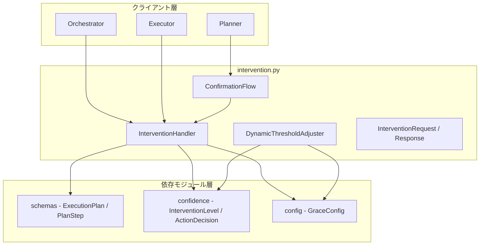
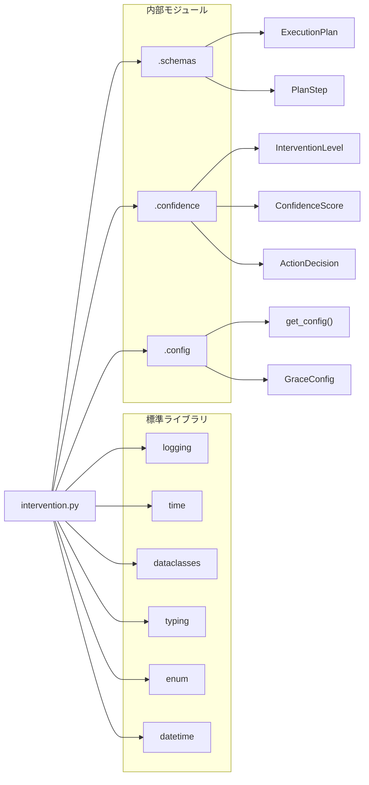

# intervention.py - HITL介入システム ドキュメント

**Version 1.1** | 最終更新: 2026-02-13

---

## 目次

1. [概要](#概要)
2. [アーキテクチャ構成図](#1-アーキテクチャ構成図)
3. [モジュール構成図](#2-モジュール構成図)
4. [クラス・関数一覧表](#3-クラス関数一覧表)
5. [クラス・関数 IPO詳細](#4-クラス関数-ipo詳細)
6. [設定・定数](#5-設定定数)
7. [使用例](#6-使用例)
8. [エクスポート](#7-エクスポート)
9. [変更履歴](#8-変更履歴)
10. [付録: 依存関係図](#付録-依存関係図)

---

## 概要

`intervention.py`は、GRACE（GRaded Autonomy and Confidence-based Escalation）フレームワークにおけるHITL（Human-in-the-Loop）介入システムを提供するモジュールです。信頼度に応じた4段階の介入レベル（SILENT、NOTIFY、CONFIRM、ESCALATE）を管理し、人間とAIの協調的な意思決定を実現します。

### 主な責務

- 信頼度レベルに応じた介入リクエストの生成
- ユーザーからの介入レスポンスの処理
- 計画確認フロー（確認→修正→実行）の管理
- ユーザーフィードバックに基づく動的閾値調整
- 介入履歴の記録と管理

### 各責務対応のモジュール

| # | 責務 | 対応モジュール | 説明 |
|---|------|--------------|------|
| 1 | 信頼度レベルに応じた介入リクエストの生成 | `intervention.py` | InterventionHandlerが信頼度レベル別にリクエストを生成 |
| 2 | ユーザーからの介入レスポンスの処理 | `intervention.py` | コールバック経由でユーザー応答を取得・処理 |
| 3 | 計画確認フロー（確認→修正→実行）の管理 | `intervention.py` | ConfirmationFlowが確認ループを制御 |
| 4 | ユーザーフィードバックに基づく動的閾値調整 | `intervention.py` | DynamicThresholdAdjusterがFP/FN率を監視し閾値を学習 |
| 5 | 介入履歴の記録と管理 | `intervention.py` | InterventionHandlerが全介入の履歴を保持 |

### 主要機能一覧

| 機能 | 説明 |
|------|------|
| `InterventionRequest` | 介入リクエストデータクラス |
| `InterventionResponse` | 介入レスポンスデータクラス |
| `InterventionAction` | 介入アクション列挙型（PROCEED, MODIFY, CANCEL等） |
| `FeedbackRecord` | フィードバック記録データクラス |
| `InterventionHandler` | 信頼度レベルに応じた介入処理クラス |
| `InterventionHandler.handle()` | ActionDecisionに基づいて介入を処理 |
| `InterventionHandler.request_confirmation()` | 計画の確認をリクエスト |
| `InterventionHandler.request_clarification()` | ユーザーに追加情報を求める |
| `DynamicThresholdAdjuster` | フィードバックに基づく動的閾値調整クラス |
| `DynamicThresholdAdjuster.record_feedback()` | ユーザーフィードバックを記録 |
| `DynamicThresholdAdjuster.get_level()` | 現在の閾値に基づいて介入レベルを判定 |
| `ConfirmationFlow` | 計画確認フロー管理クラス |
| `ConfirmationFlow.confirm_plan()` | 計画の確認を行う |
| `create_intervention_handler()` | InterventionHandlerインスタンスを作成 |
| `create_threshold_adjuster()` | DynamicThresholdAdjusterインスタンスを作成 |
| `create_confirmation_flow()` | ConfirmationFlowインスタンスを作成 |

---

## 1. アーキテクチャ構成図

### 1.1 システム全体構成



### 1.2 データフロー

1. クライアント層（Orchestrator/Executor）がActionDecisionを生成
2. InterventionHandlerが信頼度レベルに応じた介入処理を実行
3. コールバック経由でユーザーからのレスポンスを取得
4. InterventionResponseを返却し、実行継続/キャンセルを決定

---

## 2. モジュール構成図

### 2.1 内部モジュール構成

```mermaid
flowchart TB
    subgraph DATA["データクラス"]
        REQ[InterventionRequest]
        RES[InterventionResponse]
        FB[FeedbackRecord]
    end

    subgraph ENUM["列挙型"]
        ACT[InterventionAction]
    end

    subgraph HANDLER_CLS["InterventionHandler"]
        H_INIT["__init__()"]
        H_HANDLE["handle()"]
        H_SILENT["_handle_silent()"]
        H_NOTIFY["_handle_notify()"]
        H_CONFIRM["_handle_confirm()"]
        H_ESCALATE["_handle_escalate()"]
        H_TIMEOUT["_handle_timeout()"]
        H_REQ_CONF["request_confirmation()"]
        H_REQ_CLAR["request_clarification()"]
        H_STATUS["notify_status()"]
        H_HISTORY["get_history()"]
        H_CLEAR["clear_history()"]
    end

    subgraph ADJUSTER_CLS["DynamicThresholdAdjuster"]
        A_INIT["__init__()"]
        A_RECORD["record_feedback()"]
        A_ADJUST["_adjust_thresholds()"]
        A_RAISE["_raise_thresholds()"]
        A_LOWER["_lower_thresholds()"]
        A_LEVEL["get_level()"]
        A_GET["get_current_thresholds()"]
        A_RESET["reset_thresholds()"]
    end

    subgraph FLOW_CLS["ConfirmationFlow"]
        F_INIT["__init__()"]
        F_CONFIRM["confirm_plan()"]
    end

    subgraph FACTORY["ファクトリ関数"]
        CF_HANDLER["create_intervention_handler()"]
        CF_ADJUSTER["create_threshold_adjuster()"]
        CF_FLOW["create_confirmation_flow()"]
    end

    DATA --> HANDLER_CLS
    ENUM --> HANDLER_CLS
    ACT --> RES
    FB --> ADJUSTER_CLS
    H_HANDLE --> H_SILENT
    H_HANDLE --> H_NOTIFY
    H_HANDLE --> H_CONFIRM
    H_HANDLE --> H_ESCALATE
    A_RECORD --> A_ADJUST
    A_ADJUST --> A_RAISE
    A_ADJUST --> A_LOWER
    F_CONFIRM --> H_REQ_CONF
    CF_HANDLER --> H_INIT
    CF_ADJUSTER --> A_INIT
    CF_FLOW --> F_INIT
```



### 2.2 外部依存関係

| ライブラリ | バージョン | 用途 |
|-----------|-----------|------|
| `logging` | 標準ライブラリ | ログ出力 |
| `time` | 標準ライブラリ | 応答時間計測 |
| `dataclasses` | 標準ライブラリ | データクラス定義 |
| `typing` | 標準ライブラリ | 型ヒント |
| `enum` | 標準ライブラリ | 列挙型定義 |
| `datetime` | 標準ライブラリ | タイムスタンプ管理 |

### 2.3 内部依存モジュール

| モジュール | 用途 |
|-----------|------|
| `.schemas` | ExecutionPlan, PlanStep（実行計画関連） |
| `.confidence` | InterventionLevel, ConfidenceScore, ActionDecision |
| `.config` | get_config, GraceConfig（設定管理） |

---

## 3. クラス・関数一覧表

### 3.1 クラス一覧

#### InterventionRequest

| 属性/プロパティ | 概要 |
|----------------|------|
| `level` | 介入レベル（InterventionLevel） |
| `step_id` | ステップID（オプション） |
| `message` | メッセージ |
| `question` | 質問文（オプション） |
| `reason` | 理由（オプション） |
| `options` | 選択肢リスト（オプション） |
| `timeout_seconds` | タイムアウト秒数 |
| `is_blocking` | ブロッキングフラグ |
| `confidence_score` | 信頼度スコア（オプション） |
| `plan` | 実行計画（オプション） |
| `created_at` | 作成日時 |
| `requires_response` | レスポンスが必要か（プロパティ） |

#### InterventionResponse

| 属性/プロパティ | 概要 |
|----------------|------|
| `action` | 介入アクション（InterventionAction） |
| `user_input` | ユーザー入力（オプション） |
| `modified_plan` | 修正された計画（オプション） |
| `selected_option` | 選択されたオプション（オプション） |
| `timeout_reached` | タイムアウトフラグ |
| `response_time_ms` | 応答時間（ミリ秒） |
| `created_at` | 作成日時 |
| `should_continue` | 実行を継続すべきか（プロパティ） |

#### InterventionHandler

| メソッド | 概要 |
|---------|------|
| `__init__(config, on_notify, on_confirm, on_escalate)` | コンストラクタ |
| `handle(decision, step, plan)` | ActionDecisionに基づいて介入を処理 |
| `request_confirmation(plan, confidence, message)` | 計画の確認をリクエスト |
| `request_clarification(question, reason, options, is_blocking)` | ユーザーに追加情報を求める |
| `notify_status(message)` | ステータス通知 |
| `get_history()` | 介入履歴を取得 |
| `clear_history()` | 介入履歴をクリア |

#### DynamicThresholdAdjuster

| メソッド | 概要 |
|---------|------|
| `__init__(config, learning_rate, min_samples)` | コンストラクタ |
| `record_feedback(confidence, was_correct)` | ユーザーフィードバックを記録 |
| `get_level(confidence)` | 現在の閾値に基づいて介入レベルを判定 |
| `get_current_thresholds()` | 現在の閾値を取得 |
| `reset_thresholds()` | 閾値を初期値にリセット |

#### ConfirmationFlow

| メソッド | 概要 |
|---------|------|
| `__init__(handler, max_modifications)` | コンストラクタ |
| `confirm_plan(plan, confidence)` | 計画の確認を行う |

### 3.2 関数一覧（カテゴリ別）

#### ファクトリ関数

| 関数名 | 概要 |
|-------|------|
| `create_intervention_handler(config, on_notify, on_confirm, on_escalate)` | InterventionHandlerインスタンスを作成 |
| `create_threshold_adjuster(config, learning_rate)` | DynamicThresholdAdjusterインスタンスを作成 |
| `create_confirmation_flow(handler, max_modifications)` | ConfirmationFlowインスタンスを作成 |

---

## 4. クラス・関数 IPO詳細

### 4.1 InterventionRequest クラス

介入リクエストを表すデータクラス。介入レベル、メッセージ、オプションなどを保持します。

#### コンストラクタ: `__init__`

**概要**: 介入リクエストを初期化します。

```python
InterventionRequest(
    level: InterventionLevel,
    step_id: Optional[int] = None,
    message: str = "",
    question: Optional[str] = None,
    reason: Optional[str] = None,
    options: Optional[List[str]] = None,
    timeout_seconds: int = 300,
    is_blocking: bool = True,
    confidence_score: Optional[float] = None,
    plan: Optional[ExecutionPlan] = None,
    created_at: datetime = datetime.now()
)
```

| パラメータ | 型 | デフォルト | 説明 |
|------------|------|-----------|------|
| `level` | InterventionLevel | - | 介入レベル（SILENT/NOTIFY/CONFIRM/ESCALATE） |
| `step_id` | Optional[int] | None | 対象ステップのID |
| `message` | str | "" | 表示メッセージ |
| `question` | Optional[str] | None | ユーザーへの質問文 |
| `reason` | Optional[str] | None | 介入の理由 |
| `options` | Optional[List[str]] | None | 選択肢リスト |
| `timeout_seconds` | int | 300 | タイムアウト秒数 |
| `is_blocking` | bool | True | ブロッキング処理か |
| `confidence_score` | Optional[float] | None | 信頼度スコア |
| `plan` | Optional[ExecutionPlan] | None | 関連する実行計画 |
| `created_at` | datetime | datetime.now() | 作成日時 |

| 項目 | 内容 |
|------|------|
| **Input** | `level: InterventionLevel`, 他オプションパラメータ |
| **Process** | データクラスとして各フィールドを初期化 |
| **Output** | InterventionRequestインスタンス |

#### プロパティ: `requires_response`

**概要**: レスポンスが必要かどうかを判定します。

```python
@property
def requires_response(self) -> bool
```

| 項目 | 内容 |
|------|------|
| **Input** | なし（selfのみ） |
| **Process** | levelがCONFIRMまたはESCALATEかを判定 |
| **Output** | `bool`: CONFIRM/ESCALATEの場合True |

**戻り値例**:
```python
True   # level が CONFIRM または ESCALATE の場合
False  # level が SILENT または NOTIFY の場合
```

---

### 4.2 InterventionResponse クラス

介入レスポンスを表すデータクラス。ユーザーの応答アクションと関連情報を保持します。

#### コンストラクタ: `__init__`

**概要**: 介入レスポンスを初期化します。

```python
InterventionResponse(
    action: InterventionAction,
    user_input: Optional[str] = None,
    modified_plan: Optional[ExecutionPlan] = None,
    selected_option: Optional[str] = None,
    timeout_reached: bool = False,
    response_time_ms: Optional[int] = None,
    created_at: datetime = datetime.now()
)
```

| パラメータ | 型 | デフォルト | 説明 |
|------------|------|-----------|------|
| `action` | InterventionAction | - | 実行するアクション |
| `user_input` | Optional[str] | None | ユーザー入力テキスト |
| `modified_plan` | Optional[ExecutionPlan] | None | 修正された計画 |
| `selected_option` | Optional[str] | None | 選択されたオプション |
| `timeout_reached` | bool | False | タイムアウトしたか |
| `response_time_ms` | Optional[int] | None | 応答時間（ミリ秒） |
| `created_at` | datetime | datetime.now() | 作成日時 |

| 項目 | 内容 |
|------|------|
| **Input** | `action: InterventionAction`, 他オプションパラメータ |
| **Process** | データクラスとして各フィールドを初期化 |
| **Output** | InterventionResponseインスタンス |

#### プロパティ: `should_continue`

**概要**: 実行を継続すべきかどうかを判定します。

```python
@property
def should_continue(self) -> bool
```

| 項目 | 内容 |
|------|------|
| **Input** | なし（selfのみ） |
| **Process** | actionがPROCEED/MODIFY/RETRY/SKIPのいずれかを判定 |
| **Output** | `bool`: 継続可能なアクションの場合True |

**戻り値例**:
```python
True   # action が PROCEED, MODIFY, RETRY, SKIP の場合
False  # action が CANCEL, INPUT の場合
```

---

### 4.3 InterventionAction 列挙型

介入時のユーザーアクションを定義する列挙型。

```python
class InterventionAction(str, Enum):
    PROCEED = "proceed"   # そのまま進行
    MODIFY = "modify"     # 計画を修正して進行
    CANCEL = "cancel"     # キャンセル
    INPUT = "input"       # ユーザー入力を受け取る
    RETRY = "retry"       # 再試行
    SKIP = "skip"         # 現在のステップをスキップ
```

| 値 | 説明 |
|------|------|
| `PROCEED` | 現在の計画のまま実行を継続 |
| `MODIFY` | 計画を修正して実行を継続 |
| `CANCEL` | 実行をキャンセル |
| `INPUT` | ユーザーからの追加入力を受け取る |
| `RETRY` | 現在のステップを再試行 |
| `SKIP` | 現在のステップをスキップして次へ |

---

### 4.4 FeedbackRecord クラス

フィードバック記録を表すデータクラス。動的閾値調整で使用されます。

#### コンストラクタ: `__init__`

**概要**: フィードバック記録を初期化します。

```python
FeedbackRecord(
    confidence: float,
    was_correct: bool,
    timestamp: datetime = datetime.now()
)
```

| パラメータ | 型 | デフォルト | 説明 |
|------------|------|-----------|------|
| `confidence` | float | - | その時点の信頼度スコア |
| `was_correct` | bool | - | 結果が正しかったか |
| `timestamp` | datetime | datetime.now() | 記録日時 |

| 項目 | 内容 |
|------|------|
| **Input** | `confidence: float`, `was_correct: bool` |
| **Process** | データクラスとして各フィールドを初期化 |
| **Output** | FeedbackRecordインスタンス |

---

### 4.5 InterventionHandler クラス

信頼度レベルに応じた介入リクエストを生成し、ユーザーからのレスポンスを処理するハンドラークラス。

#### コンストラクタ: `__init__`

**概要**: InterventionHandlerを初期化します。コールバック関数を設定して各介入レベルの処理をカスタマイズできます。

```python
def __init__(
    self,
    config: Optional[GraceConfig] = None,
    on_notify: Optional[Callable[[str], None]] = None,
    on_confirm: Optional[Callable[[InterventionRequest], InterventionResponse]] = None,
    on_escalate: Optional[Callable[[InterventionRequest], InterventionResponse]] = None
)
```

| パラメータ | 型 | デフォルト | 説明 |
|------------|------|-----------|------|
| `config` | Optional[GraceConfig] | None | GRACE設定（Noneの場合はget_config()を使用） |
| `on_notify` | Optional[Callable[[str], None]] | None | NOTIFYレベルの通知コールバック |
| `on_confirm` | Optional[Callable[[InterventionRequest], InterventionResponse]] | None | CONFIRMレベルの確認コールバック |
| `on_escalate` | Optional[Callable[[InterventionRequest], InterventionResponse]] | None | ESCALATEレベルのエスカレーションコールバック |

| 項目 | 内容 |
|------|------|
| **Input** | `config`, `on_notify`, `on_confirm`, `on_escalate` |
| **Process** | 1. 設定を初期化<br>2. コールバック関数を登録<br>3. 介入履歴リストを初期化 |
| **Output** | InterventionHandlerインスタンス |

```python
# 使用例
def notify_callback(message: str):
    print(f"[通知] {message}")

def confirm_callback(request: InterventionRequest) -> InterventionResponse:
    # ユーザーに確認を求める処理
    return InterventionResponse(action=InterventionAction.PROCEED)

handler = InterventionHandler(
    on_notify=notify_callback,
    on_confirm=confirm_callback
)
```

#### メソッド: `handle`

**概要**: ActionDecisionに基づいて適切な介入処理を実行します。信頼度レベルに応じてSILENT/NOTIFY/CONFIRM/ESCALATEの処理を振り分けます。

```python
def handle(
    self,
    decision: ActionDecision,
    step: Optional[PlanStep] = None,
    plan: Optional[ExecutionPlan] = None
) -> InterventionResponse
```

| パラメータ | 型 | デフォルト | 説明 |
|------------|------|-----------|------|
| `decision` | ActionDecision | - | 信頼度に基づくアクション決定 |
| `step` | Optional[PlanStep] | None | 現在のステップ |
| `plan` | Optional[ExecutionPlan] | None | 現在の実行計画 |

| 項目 | 内容 |
|------|------|
| **Input** | `decision: ActionDecision`, `step: Optional[PlanStep]`, `plan: Optional[ExecutionPlan]` |
| **Process** | 1. decisionのlevelを確認<br>2. SILENTの場合: 自動進行<br>3. NOTIFYの場合: 通知を送信し進行<br>4. CONFIRMの場合: ユーザー確認を要求<br>5. ESCALATEの場合: ユーザー入力を要求 |
| **Output** | `InterventionResponse`: 介入レスポンス |

**戻り値例**:
```python
InterventionResponse(
    action=InterventionAction.PROCEED,
    timeout_reached=False,
    response_time_ms=None
)
```

```python
# 使用例
from grace.confidence import ActionDecision, InterventionLevel

decision = ActionDecision(
    level=InterventionLevel.CONFIRM,
    confidence_score=0.65,
    reason="信頼度が低いため確認が必要"
)

response = handler.handle(decision, step=current_step, plan=execution_plan)
if response.should_continue:
    print("実行を継続します")
```

#### メソッド: `request_confirmation`

**概要**: 計画全体の確認をユーザーにリクエストします。

```python
def request_confirmation(
    self,
    plan: ExecutionPlan,
    confidence: float,
    message: Optional[str] = None
) -> InterventionResponse
```

| パラメータ | 型 | デフォルト | 説明 |
|------------|------|-----------|------|
| `plan` | ExecutionPlan | - | 確認する実行計画 |
| `confidence` | float | - | 信頼度スコア |
| `message` | Optional[str] | None | カスタムメッセージ |

| 項目 | 内容 |
|------|------|
| **Input** | `plan: ExecutionPlan`, `confidence: float`, `message: Optional[str]` |
| **Process** | 1. InterventionRequestを作成<br>2. on_confirmコールバックを呼び出し<br>3. コールバックがない場合はタイムアウト処理 |
| **Output** | `InterventionResponse`: 介入レスポンス |

**戻り値例**:
```python
InterventionResponse(
    action=InterventionAction.PROCEED,
    selected_option="はい、実行",
    response_time_ms=1523
)
```

```python
# 使用例
response = handler.request_confirmation(
    plan=execution_plan,
    confidence=0.75,
    message="この計画を実行してよろしいですか？"
)

if response.action == InterventionAction.MODIFY:
    modified_plan = response.modified_plan
```

#### メソッド: `request_clarification`

**概要**: ユーザーに追加情報を求めます。

```python
def request_clarification(
    self,
    question: str,
    reason: str,
    options: Optional[List[str]] = None,
    is_blocking: bool = True
) -> InterventionResponse
```

| パラメータ | 型 | デフォルト | 説明 |
|------------|------|-----------|------|
| `question` | str | - | 質問文 |
| `reason` | str | - | 質問の理由 |
| `options` | Optional[List[str]] | None | 選択肢リスト |
| `is_blocking` | bool | True | ブロッキング処理か |

| 項目 | 内容 |
|------|------|
| **Input** | `question: str`, `reason: str`, `options: Optional[List[str]]`, `is_blocking: bool` |
| **Process** | 1. ESCALATEレベルのInterventionRequestを作成<br>2. on_escalateコールバックを呼び出し<br>3. コールバックがない場合はタイムアウト処理 |
| **Output** | `InterventionResponse`: 介入レスポンス |

**戻り値例**:
```python
InterventionResponse(
    action=InterventionAction.INPUT,
    user_input="営業部のファイルを対象にしてください",
    response_time_ms=3250
)
```

```python
# 使用例
response = handler.request_clarification(
    question="どのフォルダを対象にしますか？",
    reason="検索範囲が特定できません",
    options=["営業部", "開発部", "全体"]
)

if response.user_input:
    target_folder = response.user_input
```

#### メソッド: `notify_status`

**概要**: ステータスを通知します（ブロッキングなし）。

```python
def notify_status(self, message: str) -> None
```

| パラメータ | 型 | デフォルト | 説明 |
|------------|------|-----------|------|
| `message` | str | - | 通知メッセージ |

| 項目 | 内容 |
|------|------|
| **Input** | `message: str` |
| **Process** | 1. on_notifyコールバックを呼び出し<br>2. 履歴に記録 |
| **Output** | なし |

```python
# 使用例
handler.notify_status("ステップ1が完了しました")
handler.notify_status("データを処理中...")
```

#### メソッド: `get_history`

**概要**: 介入履歴を取得します。

```python
def get_history(self) -> List[Dict[str, Any]]
```

| 項目 | 内容 |
|------|------|
| **Input** | なし（selfのみ） |
| **Process** | 履歴リストのコピーを作成 |
| **Output** | `List[Dict[str, Any]]`: 介入履歴のリスト |

**戻り値例**:
```python
[
    {
        "timestamp": "2025-01-29T10:30:00",
        "level": "confirm",
        "action": "proceed",
        "message": "計画を確認してください",
        "response_action": "proceed",
        "timeout_reached": False
    },
    {
        "timestamp": "2025-01-29T10:30:15",
        "level": "notify",
        "action": "status_update",
        "message": "処理中...",
        "response_action": None,
        "timeout_reached": False
    }
]
```

#### メソッド: `clear_history`

**概要**: 介入履歴をクリアします。

```python
def clear_history(self) -> None
```

| 項目 | 内容 |
|------|------|
| **Input** | なし（selfのみ） |
| **Process** | 履歴リストをクリア |
| **Output** | なし |

---

### 4.6 DynamicThresholdAdjuster クラス

ユーザーフィードバックに基づいて介入レベルの閾値を動的に調整するクラス。偽陽性/偽陰性率を監視し、適切な閾値を学習します。

#### コンストラクタ: `__init__`

**概要**: DynamicThresholdAdjusterを初期化します。

```python
def __init__(
    self,
    config: Optional[GraceConfig] = None,
    learning_rate: float = 0.05,
    min_samples: int = 10
)
```

| パラメータ | 型 | デフォルト | 説明 |
|------------|------|-----------|------|
| `config` | Optional[GraceConfig] | None | GRACE設定 |
| `learning_rate` | float | 0.05 | 閾値調整の学習率 |
| `min_samples` | int | 10 | 調整に必要な最小サンプル数 |

| 項目 | 内容 |
|------|------|
| **Input** | `config`, `learning_rate`, `min_samples` |
| **Process** | 1. 設定から初期閾値を読み込み<br>2. 学習パラメータを設定<br>3. フィードバック履歴リストを初期化 |
| **Output** | DynamicThresholdAdjusterインスタンス |

```python
# 使用例
adjuster = DynamicThresholdAdjuster(
    learning_rate=0.03,
    min_samples=15
)
```

#### メソッド: `record_feedback`

**概要**: ユーザーフィードバックを記録し、必要に応じて閾値を調整します。

```python
def record_feedback(self, confidence: float, was_correct: bool) -> None
```

| パラメータ | 型 | デフォルト | 説明 |
|------------|------|-----------|------|
| `confidence` | float | - | その時点の信頼度 |
| `was_correct` | bool | - | 結果が正しかったか |

| 項目 | 内容 |
|------|------|
| **Input** | `confidence: float`, `was_correct: bool` |
| **Process** | 1. FeedbackRecordを作成し履歴に追加<br>2. サンプル数がmin_samples以上なら閾値調整を実行<br>3. 偽陽性率が30%超の場合は閾値を引き上げ<br>4. 偽陰性率が30%超の場合は閾値を引き下げ |
| **Output** | なし |

```python
# 使用例
# 信頼度0.8で実行したが結果が間違っていた
adjuster.record_feedback(confidence=0.8, was_correct=False)

# 信頼度0.5で実行し結果が正しかった
adjuster.record_feedback(confidence=0.5, was_correct=True)
```

#### メソッド: `get_level`

**概要**: 現在の閾値に基づいて介入レベルを判定します。

```python
def get_level(self, confidence: float) -> InterventionLevel
```

| パラメータ | 型 | デフォルト | 説明 |
|------------|------|-----------|------|
| `confidence` | float | - | 信頼度スコア |

| 項目 | 内容 |
|------|------|
| **Input** | `confidence: float` |
| **Process** | 1. confidence >= silent_threshold → SILENT<br>2. confidence >= notify_threshold → NOTIFY<br>3. confidence >= confirm_threshold → CONFIRM<br>4. それ以外 → ESCALATE |
| **Output** | `InterventionLevel`: 介入レベル |

**戻り値例**:
```python
InterventionLevel.SILENT    # confidence >= 0.9
InterventionLevel.NOTIFY    # 0.7 <= confidence < 0.9
InterventionLevel.CONFIRM   # 0.5 <= confidence < 0.7
InterventionLevel.ESCALATE  # confidence < 0.5
```

```python
# 使用例
level = adjuster.get_level(confidence=0.75)
print(level)  # InterventionLevel.NOTIFY
```

#### メソッド: `get_current_thresholds`

**概要**: 現在の閾値設定を取得します。

```python
def get_current_thresholds(self) -> Dict[str, float]
```

| 項目 | 内容 |
|------|------|
| **Input** | なし（selfのみ） |
| **Process** | 現在の3つの閾値を辞書形式で取得 |
| **Output** | `Dict[str, float]`: 閾値辞書 |

**戻り値例**:
```python
{
    "silent": 0.9,
    "notify": 0.7,
    "confirm": 0.5
}
```

#### メソッド: `reset_thresholds`

**概要**: 閾値を設定ファイルの初期値にリセットし、フィードバック履歴をクリアします。

```python
def reset_thresholds(self) -> None
```

| 項目 | 内容 |
|------|------|
| **Input** | なし（selfのみ） |
| **Process** | 1. 閾値を設定ファイルの値にリセット<br>2. フィードバック履歴をクリア |
| **Output** | なし |

---

### 4.7 ConfirmationFlow クラス

計画の確認→修正→実行のフローを管理するクラス。最大修正回数を超えるまで修正を繰り返すことができます。

#### コンストラクタ: `__init__`

**概要**: ConfirmationFlowを初期化します。

```python
def __init__(
    self,
    handler: InterventionHandler,
    max_modifications: int = 3
)
```

| パラメータ | 型 | デフォルト | 説明 |
|------------|------|-----------|------|
| `handler` | InterventionHandler | - | 介入ハンドラー |
| `max_modifications` | int | 3 | 最大修正回数 |

| 項目 | 内容 |
|------|------|
| **Input** | `handler: InterventionHandler`, `max_modifications: int` |
| **Process** | ハンドラーと最大修正回数を設定 |
| **Output** | ConfirmationFlowインスタンス |

#### メソッド: `confirm_plan`

**概要**: 計画の確認フローを実行します。ユーザーが承認するか、キャンセルするか、最大修正回数に達するまでループします。

```python
def confirm_plan(
    self,
    plan: ExecutionPlan,
    confidence: float
) -> tuple[bool, Optional[ExecutionPlan]]
```

| パラメータ | 型 | デフォルト | 説明 |
|------------|------|-----------|------|
| `plan` | ExecutionPlan | - | 確認する実行計画 |
| `confidence` | float | - | 信頼度スコア |

| 項目 | 内容 |
|------|------|
| **Input** | `plan: ExecutionPlan`, `confidence: float` |
| **Process** | 1. 修正カウンタをリセット<br>2. request_confirmationで確認を要求<br>3. PROCEEDの場合: (True, plan)を返却<br>4. MODIFYの場合: 修正計画で再度確認<br>5. CANCELまたはタイムアウト: (False, None)を返却<br>6. 最大修正回数超過: (False, None)を返却 |
| **Output** | `tuple[bool, Optional[ExecutionPlan]]`: (確認結果, 修正された計画またはNone) |

**戻り値例**:
```python
# 承認された場合
(True, ExecutionPlan(...))

# キャンセルまたはタイムアウトの場合
(False, None)
```

```python
# 使用例
flow = ConfirmationFlow(handler=handler, max_modifications=3)

approved, final_plan = flow.confirm_plan(
    plan=execution_plan,
    confidence=0.65
)

if approved:
    # 計画を実行
    execute(final_plan)
else:
    print("計画がキャンセルされました")
```

---

### 4.8 ファクトリ関数

#### `create_intervention_handler`

**概要**: InterventionHandlerインスタンスを作成するファクトリ関数。

```python
def create_intervention_handler(
    config: Optional[GraceConfig] = None,
    on_notify: Optional[Callable[[str], None]] = None,
    on_confirm: Optional[Callable[[InterventionRequest], InterventionResponse]] = None,
    on_escalate: Optional[Callable[[InterventionRequest], InterventionResponse]] = None
) -> InterventionHandler
```

| パラメータ | 型 | デフォルト | 説明 |
|------------|------|-----------|------|
| `config` | Optional[GraceConfig] | None | GRACE設定 |
| `on_notify` | Optional[Callable[[str], None]] | None | 通知コールバック |
| `on_confirm` | Optional[Callable[[InterventionRequest], InterventionResponse]] | None | 確認コールバック |
| `on_escalate` | Optional[Callable[[InterventionRequest], InterventionResponse]] | None | エスカレーションコールバック |

| 項目 | 内容 |
|------|------|
| **Input** | `config`, `on_notify`, `on_confirm`, `on_escalate` |
| **Process** | InterventionHandlerを指定パラメータで初期化 |
| **Output** | `InterventionHandler`: インスタンス |

```python
# 使用例
handler = create_intervention_handler(
    on_notify=lambda msg: print(f"通知: {msg}"),
    on_confirm=my_confirm_handler
)
```

#### `create_threshold_adjuster`

**概要**: DynamicThresholdAdjusterインスタンスを作成するファクトリ関数。

```python
def create_threshold_adjuster(
    config: Optional[GraceConfig] = None,
    learning_rate: float = 0.05
) -> DynamicThresholdAdjuster
```

| パラメータ | 型 | デフォルト | 説明 |
|------------|------|-----------|------|
| `config` | Optional[GraceConfig] | None | GRACE設定 |
| `learning_rate` | float | 0.05 | 学習率 |

| 項目 | 内容 |
|------|------|
| **Input** | `config`, `learning_rate` |
| **Process** | DynamicThresholdAdjusterを指定パラメータで初期化 |
| **Output** | `DynamicThresholdAdjuster`: インスタンス |

```python
# 使用例
adjuster = create_threshold_adjuster(learning_rate=0.03)
```

#### `create_confirmation_flow`

**概要**: ConfirmationFlowインスタンスを作成するファクトリ関数。

```python
def create_confirmation_flow(
    handler: InterventionHandler,
    max_modifications: int = 3
) -> ConfirmationFlow
```

| パラメータ | 型 | デフォルト | 説明 |
|------------|------|-----------|------|
| `handler` | InterventionHandler | - | 介入ハンドラー |
| `max_modifications` | int | 3 | 最大修正回数 |

| 項目 | 内容 |
|------|------|
| **Input** | `handler`, `max_modifications` |
| **Process** | ConfirmationFlowを指定パラメータで初期化 |
| **Output** | `ConfirmationFlow`: インスタンス |

```python
# 使用例
handler = create_intervention_handler()
flow = create_confirmation_flow(handler, max_modifications=5)
```

---

## 5. 設定・定数

### 5.1 InterventionAction 定数

| 定数 | 値 | 説明 |
|------|------|------|
| `InterventionAction.PROCEED` | "proceed" | そのまま進行 |
| `InterventionAction.MODIFY` | "modify" | 計画を修正して進行 |
| `InterventionAction.CANCEL` | "cancel" | キャンセル |
| `InterventionAction.INPUT` | "input" | ユーザー入力を受け取る |
| `InterventionAction.RETRY` | "retry" | 再試行 |
| `InterventionAction.SKIP` | "skip" | 現在のステップをスキップ |

### 5.2 デフォルト値

| 設定項目 | デフォルト値 | 説明 |
|----------|-------------|------|
| `timeout_seconds` | 300 | 介入リクエストのタイムアウト（秒） |
| `is_blocking` | True | ブロッキング処理 |
| `learning_rate` | 0.05 | 閾値調整の学習率 |
| `min_samples` | 10 | 閾値調整に必要な最小サンプル数 |
| `max_modifications` | 3 | 計画の最大修正回数 |

### 5.3 閾値調整の制限値

| 閾値 | 最小値 | 最大値 |
|------|--------|--------|
| `silent_threshold` | 0.80 | 0.95 |
| `notify_threshold` | 0.60 | 0.85 |
| `confirm_threshold` | 0.30 | 0.60 |

---

## 6. 使用例

### 6.1 基本的なワークフロー

```python
from grace.intervention import (
    InterventionHandler,
    InterventionRequest,
    InterventionResponse,
    InterventionAction,
    create_intervention_handler,
)
from grace.confidence import ActionDecision, InterventionLevel

# 1. コールバック関数を定義
def on_notify(message: str):
    print(f"[通知] {message}")

def on_confirm(request: InterventionRequest) -> InterventionResponse:
    print(f"[確認] {request.message}")
    # 実際にはユーザー入力を待つ
    user_choice = input("続行しますか？ (y/n/m): ")
    if user_choice == "y":
        return InterventionResponse(action=InterventionAction.PROCEED)
    elif user_choice == "m":
        return InterventionResponse(action=InterventionAction.MODIFY)
    else:
        return InterventionResponse(action=InterventionAction.CANCEL)

# 2. ハンドラーを作成
handler = create_intervention_handler(
    on_notify=on_notify,
    on_confirm=on_confirm
)

# 3. ActionDecisionに基づいて介入を処理
decision = ActionDecision(
    level=InterventionLevel.CONFIRM,
    confidence_score=0.65,
    reason="複雑なクエリのため確認が必要"
)

response = handler.handle(decision)

# 4. レスポンスに基づいて処理を継続/中断
if response.should_continue:
    print("処理を継続します")
else:
    print("処理を中断します")
```

### 6.2 動的閾値調整を使用するワークフロー

```python
from grace.intervention import (
    create_threshold_adjuster,
    create_intervention_handler,
)

# 1. 閾値調整器を作成
adjuster = create_threshold_adjuster(learning_rate=0.05)

# 2. 現在の閾値を確認
thresholds = adjuster.get_current_thresholds()
print(f"初期閾値: {thresholds}")

# 3. フィードバックを記録
adjuster.record_feedback(confidence=0.8, was_correct=True)
adjuster.record_feedback(confidence=0.75, was_correct=False)
adjuster.record_feedback(confidence=0.6, was_correct=True)

# 4. 信頼度から介入レベルを取得
level = adjuster.get_level(confidence=0.72)
print(f"介入レベル: {level}")

# 5. 閾値をリセット
adjuster.reset_thresholds()
```

### 6.3 計画確認フローを使用するワークフロー

```python
from grace.intervention import (
    create_intervention_handler,
    create_confirmation_flow,
    InterventionRequest,
    InterventionResponse,
    InterventionAction,
)
from grace.schemas import ExecutionPlan

# 1. 確認コールバックを定義
def on_confirm(request: InterventionRequest) -> InterventionResponse:
    print(f"計画を確認してください:\n{request.message}")
    choice = input("選択 (proceed/modify/cancel): ")

    if choice == "proceed":
        return InterventionResponse(action=InterventionAction.PROCEED)
    elif choice == "modify":
        # 修正された計画を返す
        return InterventionResponse(
            action=InterventionAction.MODIFY,
            modified_plan=request.plan  # 実際には修正した計画
        )
    else:
        return InterventionResponse(action=InterventionAction.CANCEL)

# 2. ハンドラーと確認フローを作成
handler = create_intervention_handler(on_confirm=on_confirm)
flow = create_confirmation_flow(handler, max_modifications=3)

# 3. 計画の確認を実行
execution_plan = ExecutionPlan(...)  # 実行計画を作成
approved, final_plan = flow.confirm_plan(
    plan=execution_plan,
    confidence=0.7
)

# 4. 結果に基づいて処理
if approved:
    print("計画が承認されました。実行を開始します。")
    # executor.execute(final_plan)
else:
    print("計画がキャンセルされました。")
```

### 6.4 Streamlitでの統合例

```python
import streamlit as st
from grace.intervention import (
    create_intervention_handler,
    InterventionRequest,
    InterventionResponse,
    InterventionAction,
)

# セッション状態で介入リクエストを管理
if "pending_request" not in st.session_state:
    st.session_state.pending_request = None

def on_confirm(request: InterventionRequest) -> InterventionResponse:
    st.session_state.pending_request = request
    # ここでは一旦Noneを返し、UIで処理する
    return None

# ハンドラーを作成
handler = create_intervention_handler(on_confirm=on_confirm)

# 介入リクエストがあれば表示
if st.session_state.pending_request:
    request = st.session_state.pending_request

    st.warning(request.message)

    col1, col2, col3 = st.columns(3)
    with col1:
        if st.button("続行"):
            response = InterventionResponse(action=InterventionAction.PROCEED)
            st.session_state.pending_request = None
    with col2:
        if st.button("修正"):
            response = InterventionResponse(action=InterventionAction.MODIFY)
            st.session_state.pending_request = None
    with col3:
        if st.button("キャンセル"):
            response = InterventionResponse(action=InterventionAction.CANCEL)
            st.session_state.pending_request = None
```

---

## 7. エクスポート

`__init__.py`でエクスポートされる要素：

```python
__all__ = [
    # Data classes
    "InterventionRequest",
    "InterventionResponse",
    "FeedbackRecord",

    # Enums
    "InterventionAction",

    # Handlers
    "InterventionHandler",
    "DynamicThresholdAdjuster",
    "ConfirmationFlow",

    # Factory functions
    "create_intervention_handler",
    "create_threshold_adjuster",
    "create_confirmation_flow",
]
```

---

## 8. 変更履歴

| バージョン | 変更内容 |
|-----------|---------|
| 1.0 | 初版作成 |
| 1.1 | フォーマット仕様v1.4準拠: 「各責務対応のモジュール」テーブル追加、ASCII図をMermaid v9フローチャートに変更（アーキテクチャ構成図・モジュール構成図・付録依存関係図） |

---

## 付録: 依存関係図


