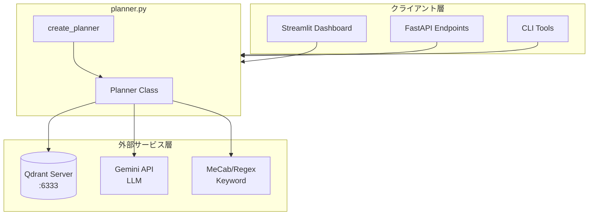
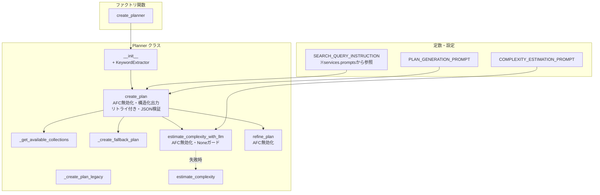
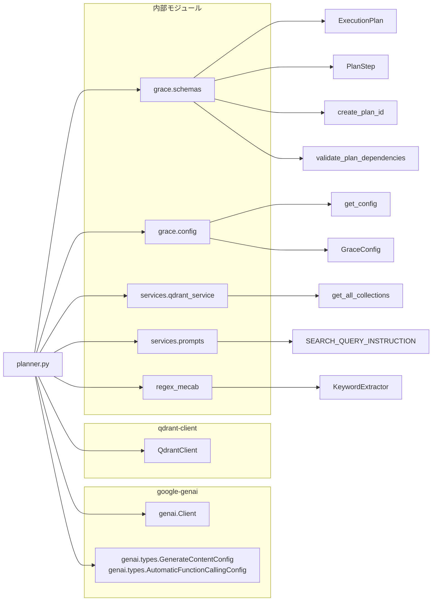

## planner.py - GRACE計画生成エージェント ドキュメント

**Version 3.0** | 最終更新: 2026-02-19

---

## 目次

1. [概要](#概要)
   - [主な責務](#主な責務)
   - [各責務対応のモジュール](#各責務対応のモジュール)
   - [主要機能一覧](#主要機能一覧)
2. [アーキテクチャ構成図](#1-アーキテクチャ構成図)
   - [システム全体構成](#11-システム全体構成)
   - [データフロー](#12-データフロー)
3. [モジュール構成図](#2-モジュール構成図)
   - [内部モジュール構成](#21-内部モジュール構成)
   - [外部依存関係](#22-外部依存関係)
   - [内部依存モジュール](#23-内部依存モジュール)
4. [クラス・関数一覧表](#3-クラス関数一覧表)
   - [クラス一覧](#31-クラス一覧)
   - [関数一覧（カテゴリ別）](#32-関数一覧カテゴリ別)
5. [クラス・関数 IPO詳細](#4-クラス関数-ipo詳細)
   - [Planner クラス](#41-planner-クラス)
   - [ファクトリ関数](#42-ファクトリ関数)
6. [設定・定数](#5-設定定数)
   - [PLAN_GENERATION_PROMPT](#51-plan_generation_prompt)
   - [COMPLEXITY_ESTIMATION_PROMPT](#52-complexity_estimation_prompt)
   - [GraceConfigから使用される設定](#53-graceconfigから使用される設定)
7. [使用例](#6-使用例)
   - [基本的なワークフロー](#61-基本的なワークフロー)
   - [カスタム設定での使用](#62-カスタム設定での使用)
   - [計画の修正（リファインメント）](#63-計画の修正リファインメント)
   - [複雑度の事前推定](#64-複雑度の事前推定)
8. [エクスポート](#7-エクスポート)
9. [変更履歴](#8-変更履歴)
10. [付録: 依存関係図](#付録-依存関係図)
11. [付録: エラーハンドリング](#付録-エラーハンドリング)

---

## 概要

`planner.py`は、GRACE（Guided Reasoning with Adaptive Confidence Execution）エージェントの計画生成コンポーネントです。ユーザーの質問を分析し、回答生成に必要な実行計画（`ExecutionPlan`）を作成します。

### 主な責務

- ユーザークエリの複雑度推定（キーワードベース / LLMベース）
- LLMを用いた実行計画の自動生成（Gemini API + 構造化出力）
- 利用可能なコレクション（Qdrant）の動的取得
- フィードバックに基づく計画の修正（リファインメント）
- フォールバック計画の提供（LLM失敗時の安全な代替）

### 各責務対応のモジュール

| # | 責務 | 対応モジュール | 説明 |
|---|------|--------------|------|
| 1 | ユーザークエリの複雑度推定 | `planner.py` | キーワード/LLMベースの複雑度分析 |
| 2 | LLMを用いた実行計画の自動生成 | `planner.py` | Gemini APIで`ExecutionPlan`スキーマに基づく構造化出力で計画を生成 |
| 3 | 利用可能なコレクションの動的取得 | `qdrant_service.py` | Qdrantから動的にコレクション一覧を取得 |
| 4 | フィードバックに基づく計画の修正 | `planner.py` | ユーザーフィードバックに応じてLLMでリファインメント |
| 5 | フォールバック計画の提供 | `planner.py` | LLMエラー時の安全な代替計画（動的コレクション検索→reasoning、fallbackはweb_search） |

### 主要機能一覧

| 機能 | 説明 |
|------|------|
| `Planner` | 計画生成エージェントクラス |
| `Planner.__init__()` | コンストラクタ（設定・モデル名指定、KeywordExtractor初期化） |
| `Planner.create_plan()` | LLMを使用して実行計画を生成（構造化出力、AFC無効化、最大2回リトライ、JSON完全性チェック） |
| `Planner._create_plan_legacy()` | Legacy Agent委譲用の単純計画生成（バックアップ） |
| `Planner._get_available_collections()` | Qdrantからコレクション一覧を取得 |
| `Planner._create_fallback_plan()` | フォールバック用の単純計画生成 |
| `Planner.estimate_complexity()` | キーワードベースで複雑度を推定 |
| `Planner.estimate_complexity_with_llm()` | LLMで複雑度を推定（AFC無効化、Noneガード付き） |
| `Planner.refine_plan()` | フィードバックに基づき計画を修正（AFC無効化） |
| `create_planner()` | Plannerインスタンスを作成するファクトリ関数 |

---

## 1. アーキテクチャ構成図

### 1.1 システム全体構成



### 1.2 データフロー

1. クライアント層からユーザークエリを受信
2. Qdrantから利用可能なコレクション一覧を動的取得
3. LLMで質問の複雑度を推定（失敗時はキーワードベースにフォールバック）
4. プロンプトを構築しGemini APIで構造化出力（`response_schema=ExecutionPlan`）により計画を生成（最大2回リトライ、JSON完全性チェック付き）
5. `ExecutionPlan`オブジェクトをExecutorに返却

---

## 2. モジュール構成図

### 2.1 内部モジュール構成



### 2.2 外部依存関係

| ライブラリ | バージョン | 用途 |
|-----------|-----------|------|
| `google-genai` | 1.x | Gemini APIクライアント（構造化出力、AFC制御） |
| `qdrant-client` | 1.x | Qdrant接続 |
| `pydantic` | 2.x | データモデル検証（GraceConfig、ExecutionPlan） |

### 2.3 内部依存モジュール

| モジュール | 用途 |
|-----------|------|
| `grace.schemas` | ExecutionPlan, PlanStep, create_plan_id, validate_plan_dependencies |
| `grace.config` | GraceConfig設定管理、get_config() |
| `services.qdrant_service` | get_all_collections()によるコレクション取得 |
| `services.prompts` | SEARCH_QUERY_INSTRUCTION検索クエリ指示テンプレート |
| `regex_mecab` | KeywordExtractorによるキーワード抽出 |

---

## 3. クラス・関数一覧表

### 3.1 クラス一覧

#### Planner

| メソッド | 概要 |
|---------|------|
| `__init__(config, model_name)` | コンストラクタ（設定・モデル名指定、KeywordExtractor初期化） |
| `create_plan(query)` | LLMを使用して実行計画を生成（構造化出力、AFC無効化、最大2回リトライ、JSON完全性チェック） |
| `_create_plan_legacy(query)` | Legacy Agent委譲用の単純計画生成 |
| `_get_available_collections()` | Qdrantからコレクション一覧を取得 |
| `_create_fallback_plan(query)` | フォールバック用の単純計画生成 |
| `estimate_complexity(query)` | キーワードベースで複雑度を推定 |
| `estimate_complexity_with_llm(query)` | LLMで複雑度を推定（AFC無効化、Noneガード） |
| `refine_plan(plan, feedback)` | フィードバックに基づき計画を修正（AFC無効化） |

### 3.2 関数一覧（カテゴリ別）

#### ファクトリ関数

| 関数名 | 概要 |
|-------|------|
| `create_planner(config, model_name)` | Plannerインスタンスを作成 |

---

## 4. クラス・関数 IPO詳細

### 4.1 Planner クラス

計画生成エージェント。ユーザーの質問を分析し、実行計画を生成します。

#### コンストラクタ: `__init__`

**概要**: Plannerインスタンスを初期化します。設定オブジェクトとモデル名を受け取り、Gemini APIクライアントとKeywordExtractor（MeCab優先）を初期化します。

```python
Planner(
    config: Optional[GraceConfig] = None,
    model_name: Optional[str] = None
)
```

| パラメータ | 型 | デフォルト | 説明 |
|------------|------|-----------|------|
| `config` | Optional[GraceConfig] | None | GRACE設定（Noneの場合はデフォルト設定を使用） |
| `model_name` | Optional[str] | None | 使用するモデル名（Noneの場合は設定から取得） |

| 項目 | 内容 |
|------|------|
| **Input** | `config: Optional[GraceConfig] = None`, `model_name: Optional[str] = None` |
| **Process** | 1. 設定オブジェクトの取得（デフォルトまたは指定）<br>2. モデル名の決定（指定またはconfig.llm.model）<br>3. Gemini APIクライアント（genai.Client）の初期化<br>4. KeywordExtractorの初期化（MeCab優先、失敗時はNoneを設定しWARNINGログ出力） |
| **Output** | Plannerインスタンス |

```python
# 使用例
from grace.planner import Planner
from grace.config import get_config

# デフォルト設定で初期化
planner = Planner()

# カスタム設定で初期化
config = get_config("config/custom.yml")
planner = Planner(config=config, model_name="gemini-3-flash-preview")
```

---

#### メソッド: `create_plan`

**概要**: 質問から実行計画を生成します（LLM使用版）。利用可能なコレクションを取得し、複雑度を推定した上で、Gemini APIの構造化出力（`response_schema=ExecutionPlan`）を使用してJSON形式の計画を生成します。AFC（Automatic Function Calling）は明示的に無効化されています。リトライロジック（最大2回）とJSON完全性チェックを実装し、空レスポンスや不完全JSONからの耐障害性を強化しています。

```python
def create_plan(self, query: str) -> ExecutionPlan
```

| パラメータ | 型 | デフォルト | 説明 |
|------------|------|-----------|------|
| `query` | str | - | ユーザーの質問 |

| 項目 | 内容 |
|------|------|
| **Input** | `query: str` |
| **Process** | 1. 利用可能なコレクションをQdrantから取得（`_get_available_collections`）<br>2. LLMで複雑度を推定（`estimate_complexity_with_llm`）<br>3. `PLAN_GENERATION_PROMPT`にコレクション情報＋クエリを埋め込みプロンプト構築<br>4. IPOログにINPUTを出力<br>5. **リトライループ（最大2回）で以下を実行:**<br>&nbsp;&nbsp;5a. Gemini APIで構造化出力（`response_schema=ExecutionPlan`, `max_output_tokens=8192`, AFC無効化）<br>&nbsp;&nbsp;5b. API応答時間を計測・ログ出力<br>&nbsp;&nbsp;5c. IPOログにOUTPUTを出力<br>&nbsp;&nbsp;5d. 空レスポンスガード（`response.text`が空なら`continue`）<br>&nbsp;&nbsp;5e. JSON完全性チェック（`json.loads()`で検証、失敗なら`continue`）<br>&nbsp;&nbsp;5f. `ExecutionPlan.model_validate_json(response.text)`でパース<br>6. 事前推定した複雑度を`plan.complexity`に上書き<br>7. `create_plan_id()`で計画IDを設定<br>8. `validate_plan_dependencies()`で依存関係を検証（エラーは警告のみ）<br>9. 全リトライ失敗時は`_create_fallback_plan()`を返却 |
| **Output** | `ExecutionPlan`: 実行計画オブジェクト |

> 📝 **注意**: `automatic_function_calling=types.AutomaticFunctionCallingConfig(disable=True)` を設定し、AFC永続化によるJSON mode空レスポンスバグを防止しています（See: [python-genai#1818](https://github.com/googleapis/python-genai/issues/1818)）。

**戻り値例**:
```python
ExecutionPlan(
    plan_id="plan_20260212_123456_abc123",
    original_query="『金色夜叉』の作者は誰ですか？",
    complexity=0.3,
    estimated_steps=2,
    requires_confirmation=False,
    steps=[
        PlanStep(
            step_id=1,
            action="rag_search",
            description="関連情報を検索",
            query="『金色夜叉』の作者は誰ですか？",
            collection=None,
            expected_output="関連するドキュメント",
            fallback="reasoning"
        ),
        PlanStep(
            step_id=2,
            action="reasoning",
            description="取得した情報を元に回答を生成",
            depends_on=[1],
            expected_output="ユーザーへの回答"
        )
    ],
    success_criteria="ユーザーの質問に適切に回答できている"
)
```

```python
# 使用例
planner = Planner()
plan = planner.create_plan("『金色夜叉』の作者は誰ですか？")

print(f"計画ID: {plan.plan_id}")
print(f"複雑度: {plan.complexity}")
print(f"ステップ数: {len(plan.steps)}")
# 計画ID: plan_20260212_123456_abc123
# 複雑度: 0.3
# ステップ数: 2
```

---

#### メソッド: `_create_plan_legacy`

**概要**: Legacy Agent委譲用の単純な計画を生成します（バックアップ用）。ReActベースのLegacy Agentに処理を委譲する1ステップの計画を作成します。

```python
def _create_plan_legacy(self, query: str) -> ExecutionPlan
```

| パラメータ | 型 | デフォルト | 説明 |
|------------|------|-----------|------|
| `query` | str | - | ユーザーの質問 |

| 項目 | 内容 |
|------|------|
| **Input** | `query: str` |
| **Process** | Legacy Agent（ReAct）に委譲する1ステップ計画を作成 |
| **Output** | `ExecutionPlan`: Legacy Agent実行用の計画 |

**戻り値例**:
```python
ExecutionPlan(
    original_query="質問文",
    complexity=0.1,
    estimated_steps=1,
    requires_confirmation=False,
    steps=[
        PlanStep(
            step_id=1,
            action="run_legacy_agent",
            description="Legacy Agent (ReAct) を実行して回答を生成",
            query="質問文",
            expected_output="ユーザーへの回答",
            fallback=None
        )
    ],
    success_criteria="ユーザーの質問に適切に回答できている"
)
```

```python
# 使用例（内部メソッド）
plan = planner._create_plan_legacy("簡単な質問")
print(f"アクション: {plan.steps[0].action}")
# アクション: run_legacy_agent
```

---

#### メソッド: `_get_available_collections`

**概要**: 利用可能なQdrantコレクションを取得します。Qdrantサーバーに接続し、コレクション一覧を取得します。接続失敗時は設定ファイルの`search_priority`リストを返します。

```python
def _get_available_collections(self) -> list
```

| 項目 | 内容 |
|------|------|
| **Input** | なし（selfのみ） |
| **Process** | 1. QdrantClientでサーバーに接続（`config.qdrant.url`）<br>2. `get_all_collections()`でコレクション一覧取得<br>3. 失敗時は設定の`search_priority`を返却 |
| **Output** | `list`: コレクション名のリスト |

**戻り値例**:
```python
["wikipedia_ja", "livedoor_news", "cc_news", "qa_data"]
```

```python
# 使用例（内部メソッド）
collections = planner._get_available_collections()
print(f"利用可能なコレクション: {collections}")
# 利用可能なコレクション: ['wikipedia_ja', 'livedoor_news', 'cc_news']
```

---

#### メソッド: `_create_fallback_plan`

**概要**: フォールバック用の単純な計画を生成します。LLMによる計画生成が失敗した場合に使用される2ステップの計画を作成します。コレクションは動的に取得し、「wikipedia」を含むコレクションを優先的に選択します（該当なしの場合はNone＝自動選択）。Step 1のfallbackは`web_search`です。

```python
def _create_fallback_plan(self, query: str) -> ExecutionPlan
```

| パラメータ | 型 | デフォルト | 説明 |
|------------|------|-----------|------|
| `query` | str | - | ユーザーの質問 |

| 項目 | 内容 |
|------|------|
| **Input** | `query: str` |
| **Process** | 1. `_get_available_collections()`で利用可能なコレクションを動的取得<br>2. 「wikipedia」を含むコレクションを検索、見つからなければNone（自動選択）<br>3. rag_search（fallback: web_search）→reasoningの2ステップ計画を作成 |
| **Output** | `ExecutionPlan`: フォールバック計画 |

**戻り値例**:
```python
ExecutionPlan(
    original_query="質問文",
    complexity=0.5,
    estimated_steps=2,
    requires_confirmation=False,
    steps=[
        PlanStep(
            step_id=1,
            action="rag_search",
            description="全コレクションから関連情報を検索",
            query="質問文",
            collection="wikipedia_ja",  # 動的取得。該当なしの場合はNone
            expected_output="関連するドキュメントや情報",
            fallback="web_search"  # v3.0: reasoning → web_search に変更
        ),
        PlanStep(
            step_id=2,
            action="reasoning",
            description="取得した情報を元に回答を生成",
            depends_on=[1],
            expected_output="ユーザーへの回答"
        )
    ],
    success_criteria="ユーザーの質問に適切に回答できている"
)
```

```python
# 使用例（内部メソッド）
fallback_plan = planner._create_fallback_plan("質問文")
print(f"ステップ数: {len(fallback_plan.steps)}")
# ステップ数: 2
```

---

#### メソッド: `estimate_complexity`

**概要**: 質問の複雑度をキーワードベースで推定します（0.0-1.0）。「比較」「違い」「複数」などの複雑度を示すキーワードを検出し、質問の長さも考慮してスコアを算出します。

```python
def estimate_complexity(self, query: str) -> float
```

| パラメータ | 型 | デフォルト | 説明 |
|------------|------|-----------|------|
| `query` | str | - | ユーザーの質問 |

| 項目 | 内容 |
|------|------|
| **Input** | `query: str` |
| **Process** | 1. ベーススコア0.5から開始<br>2. 複雑度キーワード（「比較」「違い」「複数」等）を検出<br>3. キーワードごとに重みを加算<br>4. 質問の長さも考慮（100文字超で+0.1、200文字超でさらに+0.1） |
| **Output** | `float`: 複雑度スコア（0.0-1.0） |

**複雑度キーワードと重み**:

| キーワード | 重み |
|-----------|------|
| 比較、違い | 0.15 |
| 複数 | 0.2 |
| 最新、理由、方法 | 0.1 |
| 詳しく、どのように | 0.15 |
| ステップ、手順、なぜ | 0.1 |

**戻り値例**:
```python
0.65  # 「比較」「違い」を含む質問の場合
```

```python
# 使用例
complexity = planner.estimate_complexity("PythonとJavaの違いを比較してください")
print(f"複雑度: {complexity}")
# 複雑度: 0.8
```

---

#### メソッド: `estimate_complexity_with_llm`

**概要**: LLMを使用して質問の複雑度を推定します。`COMPLEXITY_ESTIMATION_PROMPT`を使用してGemini APIに複雑度を問い合わせます。AFC（Automatic Function Calling）は明示的に無効化されています。レスポンスのNoneガードを実装し、空レスポンス時はキーワードベースの`estimate_complexity()`にフォールバックします。

```python
def estimate_complexity_with_llm(self, query: str) -> float
```

| パラメータ | 型 | デフォルト | 説明 |
|------------|------|-----------|------|
| `query` | str | - | ユーザーの質問 |

| 項目 | 内容 |
|------|------|
| **Input** | `query: str` |
| **Process** | 1. `COMPLEXITY_ESTIMATION_PROMPT`にクエリを埋め込み<br>2. Gemini API呼び出し（`temperature=0.1`, `max_output_tokens=10`, AFC無効化）<br>3. API応答時間を計測・ログ出力<br>4. レスポンスのNoneガード（空レスポンス時は`estimate_complexity()`にフォールバック）<br>5. 数値をパースし0.0-1.0にクランプ<br>6. 例外発生時は`estimate_complexity()`にフォールバック |
| **Output** | `float`: 複雑度スコア（0.0-1.0） |

> 📝 **注意**: AFC永続化により`response.text`がNoneになるケースがあるため、Noneガードを実装しています。

**複雑度の目安**:

| スコア | 意味 |
|-------|------|
| 0.0-0.2 | 非常に単純（事実確認、定義の質問） |
| 0.3-0.4 | 単純（1つのトピックについての説明） |
| 0.5-0.6 | 中程度（比較、分析が必要） |
| 0.7-0.8 | 複雑（複数ソースからの情報統合が必要） |
| 0.9-1.0 | 非常に複雑（専門知識、多段階の推論が必要） |

**戻り値例**:
```python
0.7  # 複数の情報源が必要な質問
```

```python
# 使用例
complexity = planner.estimate_complexity_with_llm("量子コンピュータの原理と応用について詳しく教えてください")
print(f"複雑度（LLM推定）: {complexity}")
# 複雑度（LLM推定）: 0.75
```

---

#### メソッド: `refine_plan`

**概要**: フィードバックに基づいて計画を修正します。元の計画情報とユーザーフィードバックからプロンプトを構築し、Gemini APIの構造化出力（`response_schema=ExecutionPlan`）で修正計画を生成します。AFC（Automatic Function Calling）は明示的に無効化されています。

```python
def refine_plan(
    self,
    plan: ExecutionPlan,
    feedback: str
) -> ExecutionPlan
```

| パラメータ | 型 | デフォルト | 説明 |
|------------|------|-----------|------|
| `plan` | ExecutionPlan | - | 元の計画 |
| `feedback` | str | - | ユーザーからのフィードバック |

| 項目 | 内容 |
|------|------|
| **Input** | `plan: ExecutionPlan`, `feedback: str` |
| **Process** | 1. 元の計画情報（クエリ、ステップ数、ステップ説明一覧）とフィードバックからプロンプト構築<br>2. Gemini APIで構造化出力（`response_schema=ExecutionPlan`, AFC無効化）<br>3. API応答時間を計測・ログ出力<br>4. `ExecutionPlan.model_validate_json(response.text)`でパース<br>5. `create_plan_id()`で新しい計画IDを設定<br>6. 失敗時は元の計画をそのまま返却 |
| **Output** | `ExecutionPlan`: 修正された計画 |

**戻り値例**:
```python
ExecutionPlan(
    plan_id="plan_20260212_123457_def456",  # 新しいID
    original_query="『金色夜叉』の作者は誰ですか？",
    complexity=0.5,  # フィードバックに応じて調整
    estimated_steps=3,  # ステップ数が増加
    steps=[...],  # 修正されたステップ
    ...
)
```

```python
# 使用例
original_plan = planner.create_plan("AIについて教えてください")
feedback = "もっと技術的な詳細が欲しいです"
refined_plan = planner.refine_plan(original_plan, feedback)

print(f"元の計画ステップ数: {len(original_plan.steps)}")
print(f"修正後のステップ数: {len(refined_plan.steps)}")
# 元の計画ステップ数: 2
# 修正後のステップ数: 3
```

---

### 4.2 ファクトリ関数

#### `create_planner`

**概要**: Plannerインスタンスを作成するファクトリ関数です。設定とモデル名を指定してPlannerを生成します。

```python
def create_planner(
    config: Optional[GraceConfig] = None,
    model_name: Optional[str] = None
) -> Planner
```

| パラメータ | 型 | デフォルト | 説明 |
|------------|------|-----------|------|
| `config` | Optional[GraceConfig] | None | GRACE設定 |
| `model_name` | Optional[str] | None | 使用するモデル名 |

| 項目 | 内容 |
|------|------|
| **Input** | `config: Optional[GraceConfig] = None`, `model_name: Optional[str] = None` |
| **Process** | Plannerコンストラクタを呼び出してインスタンスを生成 |
| **Output** | `Planner`: Plannerインスタンス |

**戻り値例**:
```python
<Planner instance with model=gemini-3-flash-preview>
```

```python
# 使用例
from grace.planner import create_planner

# デフォルト設定で作成
planner = create_planner()

# カスタム設定で作成
from grace.config import get_config
config = get_config("config/production.yml")
planner = create_planner(config=config, model_name="gemini-3-flash-preview")
```

---

## 5. 設定・定数

### 5.1 PLAN_GENERATION_PROMPT

計画生成用のプロンプトテンプレート。`SEARCH_QUERY_INSTRUCTION`（`services.prompts`から参照）を埋め込み、コレクション選択ルール、検索クエリ作成ルール、複雑度目安、`requires_confirmation`条件を含む包括的な指示を定義します。

```python
PLAN_GENERATION_PROMPT = f"""
あなたは計画策定の専門家です。ユーザーの質問を分析し、回答を生成するための実行計画を作成してください。

【利用可能なアクション】
- rag_search: ベクトルDB（Qdrant）から関連情報を検索（社内ドキュメント・FAQ向け）
- web_search: Web検索で最新情報や一般的な情報を取得（最新ニュース・外部情報向け）
- reasoning: 収集した情報を分析・統合して回答を生成
- ask_user: ユーザーに追加情報や確認を求める

【利用可能なコレクション (rag_search用)】
{{available_collections}}

【コレクション選択のルール (重要)】
- `rag_search` の `collection` 引数は、原則として指定しないでください（`null` または省略）。
   * 特定のコレクションに限定せず、利用可能なすべてのコレクションから網羅的に検索を行うためです。
   * システム側で自動的に最適なコレクション順序で検索を実行します。
- 例外: ユーザーが明示的に指定した場合のみ、そのコレクション名を指定してください。

【検索クエリの作成ルール】
- `rag_search` の `query` 引数は、ユーザーの質問文を極力そのまま使用してください。
   * 単語の羅列に変換せず、自然言語の文脈を維持することで、ベクトル検索の精度が向上します。

【計画作成のルール (厳守)】
1. 検索アクション（rag_search）は、可能な限り「1つのステップ」にまとめてください。
2. `rag_search` の `query` は、ユーザーの元の質問文を「完全一致でコピー」してください。
3. 依存関係を正しく設定してください（depends_onは先行ステップのIDのみ）。
4. 失敗時の代替手段（fallback）を検討してください。
5. 最後のステップは必ず "reasoning" で回答を生成してください
6. rag_search と web_search の使い分け:
    * 社内ドキュメント・FAQ・ナレッジベースの情報 → rag_search
    * 最新ニュース・外部Web情報・一般知識 → web_search
    * RAGに情報がない可能性がある場合 → rag_search（fallbackに"web_search"を指定）
    * 両方必要な場合 → rag_search → web_search → reasoning の3ステップ

{SEARCH_QUERY_INSTRUCTION}

【計画の複雑度(complexity)の目安】
- 0.0-0.3: 単純な質問（1-2ステップ）
- 0.4-0.6: 中程度の質問（2-3ステップ）
- 0.7-1.0: 複雑な質問（4ステップ以上）

【requires_confirmationをtrueにする条件】
- 質問が曖昧で複数の解釈が可能な場合
- 実行に時間がかかる可能性がある場合
- 外部リソースへのアクセスが必要な場合

ユーザーの質問: {{query}}

JSON形式で実行計画を出力してください。
"""
```

| プレースホルダー | 説明 |
|----------------|------|
| `{{available_collections}}` | 利用可能なQdrantコレクション名のリスト（実行時に`.format()`で埋め込み） |
| `{{query}}` | ユーザーの質問文（実行時に`.format()`で埋め込み） |
| `{SEARCH_QUERY_INSTRUCTION}` | `services.prompts`から参照される検索クエリ指示（f-stringで静的埋め込み） |

> 📝 **注意**: `{{...}}`はf-string内でのエスケープ（実行時に`.format()`で解決）、`{...}`はf-stringで静的に解決されます。

### 5.2 COMPLEXITY_ESTIMATION_PROMPT

複雑度推定用のプロンプトテンプレート。

```python
COMPLEXITY_ESTIMATION_PROMPT = """
以下の質問の複雑度を0.0から1.0の数値で評価してください。

評価基準:
- 0.0-0.2: 非常に単純（事実確認、定義の質問）
- 0.3-0.4: 単純（1つのトピックについての説明）
- 0.5-0.6: 中程度（比較、分析が必要）
- 0.7-0.8: 複雑（複数のソースからの情報統合が必要）
- 0.9-1.0: 非常に複雑（専門知識、多段階の推論が必要）

質問: {query}

数値のみを回答してください（例: 0.5）
"""
```

### 5.3 GraceConfigから使用される設定

Plannerで使用されるGraceConfigの設定項目：

#### LLMConfig（config.llm）

| 設定パス | 型 | デフォルト | 説明 |
|---------|-----|----------|------|
| `llm.provider` | str | `"gemini"` | LLMプロバイダー |
| `llm.model` | str | 設定ファイル依存 | 使用するLLMモデル |
| `llm.temperature` | float | `0.7` | 生成時の温度パラメータ（create_plan, refine_planで使用） |
| `llm.max_tokens` | int | `4096` | 最大出力トークン数（参考値。create_planは8192を明示指定） |
| `llm.timeout` | int | `30` | タイムアウト秒数 |

#### QdrantConfig（config.qdrant）

| 設定パス | 型 | デフォルト | 説明 |
|---------|-----|----------|------|
| `qdrant.url` | str | `"http://localhost:6333"` | QdrantサーバーURL |
| `qdrant.collection_name` | str | `"customer_support_faq"` | デフォルトコレクション名 |
| `qdrant.search_limit` | int | `5` | 検索結果の最大件数 |
| `qdrant.score_threshold` | float | `0.35` | 検索スコア閾値 |
| `qdrant.search_priority` | list | `["wikipedia_ja", "livedoor", "cc_news", "japanese_text"]` | コレクション検索優先順序（フォールバック用） |

---

## 6. 使用例

### 6.1 基本的なワークフロー

```python
from grace.planner import create_planner

# 1. Plannerインスタンスを作成
planner = create_planner()

# 2. 計画を生成
query = "『金色夜叉』の作者は誰ですか？"
plan = planner.create_plan(query)

# 3. 計画内容を確認
print(f"計画ID: {plan.plan_id}")
print(f"複雑度: {plan.complexity}")
print(f"ステップ数: {len(plan.steps)}")

for step in plan.steps:
    print(f"  Step {step.step_id}: {step.action} - {step.description}")

# 出力例:
# 計画ID: plan_20260212_123456_abc123
# 複雑度: 0.3
# ステップ数: 2
#   Step 1: rag_search - 関連情報を検索
#   Step 2: reasoning - 取得した情報を元に回答を生成
```

### 6.2 カスタム設定での使用

```python
from grace.planner import create_planner
from grace.config import get_config

# カスタム設定ファイルを読み込み
config = get_config("config/production.yml")

# 特定のモデルを指定してPlannerを作成
planner = create_planner(config=config, model_name="gemini-3-flash-preview")

# 複雑な質問の計画を生成
plan = planner.create_plan("量子コンピュータの原理と従来のコンピュータとの違いを説明してください")
```

### 6.3 計画の修正（リファインメント）

```python
from grace.planner import create_planner

planner = create_planner()

# 初期計画を生成
initial_plan = planner.create_plan("AIについて教えてください")

# ユーザーフィードバックに基づいて計画を修正
feedback = "もっと技術的な詳細と、具体的な応用例が欲しいです"
refined_plan = planner.refine_plan(initial_plan, feedback)

print(f"初期計画のステップ数: {len(initial_plan.steps)}")
print(f"修正後のステップ数: {len(refined_plan.steps)}")
```

### 6.4 複雑度の事前推定

```python
from grace.planner import create_planner

planner = create_planner()

# 複数の質問の複雑度を比較
questions = [
    "東京タワーの高さは？",
    "PythonとJavaの違いを教えてください",
    "量子コンピュータの原理を詳しく説明し、その応用例を複数挙げてください",
]

for q in questions:
    complexity = planner.estimate_complexity_with_llm(q)
    print(f"複雑度 {complexity:.2f}: {q[:30]}...")

# 出力例:
# 複雑度 0.15: 東京タワーの高さは？...
# 複雑度 0.55: PythonとJavaの違いを教えてください...
# 複雑度 0.85: 量子コンピュータの原理を詳しく説明し、その応...
```

---

## 7. エクスポート

`planner.py`でエクスポートされる要素：

```python
__all__ = [
    # クラス
    "Planner",
    # ファクトリ関数
    "create_planner",
    # 定数
    "PLAN_GENERATION_PROMPT",
]
```

---

## 8. 変更履歴

| バージョン | 変更内容 |
|-----------|---------|
| 0.1.0 | 初版作成 |
| 1.0 | ドキュメント改修: フォーマット統一、IPO詳細・シグネチャ・戻り値例・使用例を追加 |
| 1.1 | ドキュメント改修: 主な責務・主要機能一覧を追加、IPO詳細に「**概要**:」ラベルを追加 |
| 1.2 | ドキュメント改修: 目次を追加 |
| 1.3 | ドキュメント改修: ASCII図をMermaid v9フローチャートに変更、GraceConfig設定情報を詳細化 |
| 2.0 | コード改修に伴う全面更新: PLAN_GENERATION_PROMPT拡張（コレクション選択ルール・検索クエリ作成ルール・複雑度目安・requires_confirmation条件・SEARCH_QUERY_INSTRUCTION埋め込み）、全LLM呼び出し箇所にAFC無効化追加、create_planにIPOログ出力・API時間計測・max_output_tokens=8192を追加、estimate_complexity_with_llmにNoneガード・API時間計測を追加、refine_planにAPI時間計測を追加、フォーマット仕様v1.4準拠（各責務対応のモジュール テーブル追加） |
| 3.0 | コード改修に伴う更新: PLAN_GENERATION_PROMPTにweb_searchアクション追加・ルール6（rag_search/web_search使い分け）追加、create_planにリトライロジック（最大2回）・JSON完全性チェック・空レスポンスガードを追加、_create_fallback_planを動的コレクション選択に変更・fallbackをreasoning→web_searchに変更 |

---

## 付録: 依存関係図



---

## 付録: エラーハンドリング

### LLM生成失敗時

| 状況 | 動作 | ログレベル |
|-----|------|----------|
| Gemini API呼び出し失敗 | リトライ（最大2回）→全失敗時は`_create_fallback_plan()` | WARNING / ERROR |
| 空レスポンス | リトライ（`continue`）→全失敗時は`_create_fallback_plan()` | WARNING |
| 不完全/無効なJSON | JSON完全性チェックで検出→リトライ（`continue`） | WARNING |
| JSONパース失敗（Pydantic） | リトライ→全失敗時は`_create_fallback_plan()` | WARNING / ERROR |
| AFC永続化による空レスポンス | AFC無効化設定により防止 | ― |

### コレクション取得失敗時

| 状況 | 動作 | ログレベル |
|-----|------|----------|
| Qdrant接続失敗 | 設定の`search_priority`リストを使用 | WARNING |

### 複雑度推定失敗時

| 状況 | 動作 | ログレベル |
|-----|------|----------|
| LLM推定失敗 | `estimate_complexity()`にフォールバック | WARNING |
| レスポンスがNone/空 | `estimate_complexity()`にフォールバック | WARNING |

### 計画検証エラー時

| 状況 | 動作 | ログレベル |
|-----|------|----------|
| 依存関係エラー | 警告のみ出力し、計画はそのまま返却 | WARNING |

### 計画修正失敗時

| 状況 | 動作 | ログレベル |
|-----|------|----------|
| refine_plan LLM呼び出し失敗 | 元の計画をそのまま返却 | ERROR |
