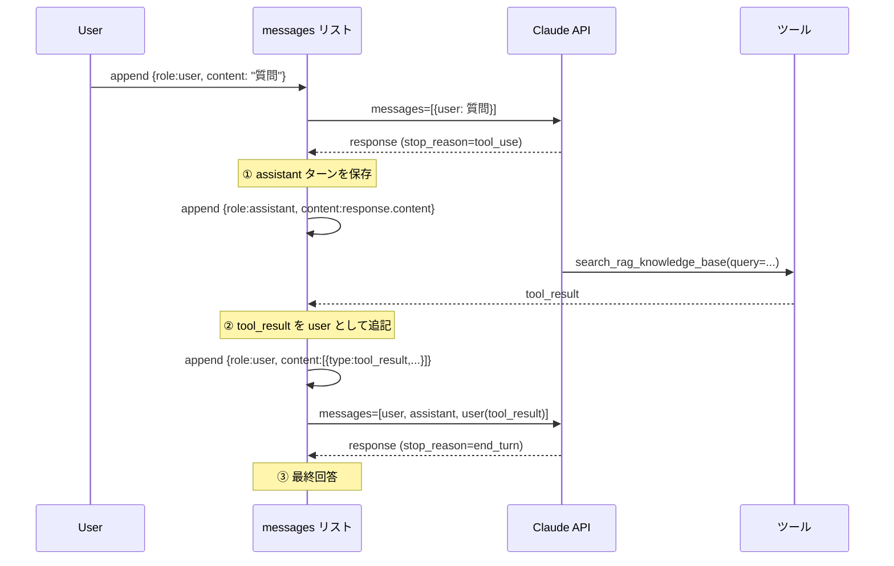
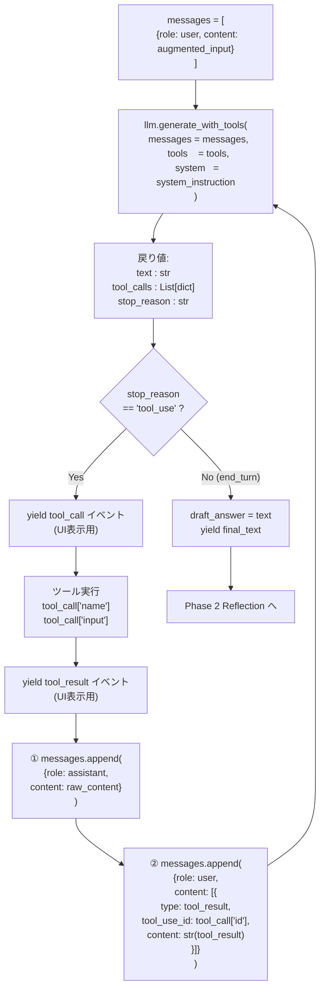
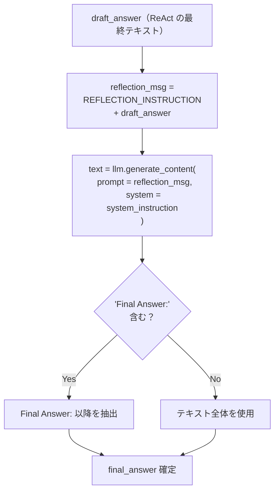
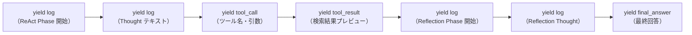

# Anthropic Tool Use — ReAct ループ 仕様書

**対象ファイル**: `service/agent_service.py`  
**API**: Anthropic Messages API (`anthropic` SDK)  
**作成日**: 2026-04-20

---

## 1. 全体像

`agent_service.py` の `ReActAgent` は以下の 2 フェーズで構成されます。

```mermaid
flowchart TD
    START["ユーザークエリ受信"] --> KW

    subgraph PHASE1["Phase 1 : ReAct Loop"]
        KW["キーワード抽出\naugmented_input 生成"]
        KW --> INIT["messages リスト初期化\n{role: user, content: augmented_input}"]
        INIT --> LOOP["generate_with_tools() 呼び出し"]
        LOOP --> CHK{"stop_reason\n== tool_use ?"}
        CHK -- "Yes" --> TOOL["ツール実行"]
        TOOL --> APP["messages に2件追記\nassistant + tool_result"]
        APP --> LOOP
        CHK -- "No (end_turn)" --> DRAFT["draft_answer 確定"]
    end

    subgraph PHASE2["Phase 2 : Reflection"]
        DRAFT --> REF["generate_content() で自己評価"]
        REF --> FINAL["Final Answer 抽出"]
    end

    FINAL --> OUT["最終回答を返す"]

    style PHASE1 fill:#1a1a1a
    style PHASE2 fill:#1a1a1a
```



---

## 2. Anthropic Messages API の基本仕様

### 2-1. API 呼び出しの基本構造

Anthropic の API はすべて `client.messages.create()` の 1 エンドポイントです。
会話の全履歴を毎回 `messages` パラメータとして渡す **ステートレス設計** です。

```python
import anthropic

client = anthropic.Anthropic(api_key=os.getenv("ANTHROPIC_API_KEY"))

response = client.messages.create(
    model      = "claude-sonnet-4-5",
    max_tokens = 4096,
    system     = "システムプロンプト（文字列）",
    messages   = [
        {"role": "user",      "content": "質問"},
        {"role": "assistant", "content": "回答"},
        {"role": "user",      "content": "続きの質問"},
    ],
    tools = [...],   # Tool Use を使う場合のみ
)
```

| パラメータ | 型 | 説明 |
|---|---|---|
| `model` | `str` | モデル名（例: `claude-sonnet-4-5`） |
| `max_tokens` | `int` | 最大出力トークン数（必須） |
| `system` | `str` | システムプロンプト（`messages` の外で指定） |
| `messages` | `List[dict]` | 会話履歴の全件（毎回全部渡す） |
| `tools` | `List[dict]` | ツール定義（Tool Use 使用時のみ） |

### 2-2. レスポンスの構造

```python
response.stop_reason   # "end_turn" | "tool_use" | "max_tokens"
response.content       # List[TextBlock | ToolUseBlock]
```

`response.content` には複数のブロックが混在することがあります。

```python
# テキストブロック
{"type": "text", "text": "Thought: 検索が必要です..."}

# ツール呼び出しブロック（Tool Use 時）
{"type": "tool_use", "id": "toolu_01XxYy",
 "name": "search_rag_knowledge_base",
 "input": {"query": "カリン・フォン・アロルディンゲン"}}
```

---

## 3. ツール定義（Tool Definition）

Anthropic のツール定義はプレーンな `dict` のリストです。
JSON Schema 形式で引数を定義し、`input_schema` キーで渡します。

```python
tools = [
    {
        "name"        : "search_rag_knowledge_base",
        "description" : "社内ドキュメント（Qdrant）から関連情報を検索する。"
                        "プロジェクト固有の情報・Wikipedia・ニュース記事などを検索する際に使用する。",
        "input_schema": {
            "type"      : "object",
            "properties": {
                "query": {
                    "type"       : "string",
                    "description": "検索クエリ。ユーザーの質問から具体的なキーワードを抽出して作成する。"
                }
            },
            "required": ["query"]
        }
    },
    {
        "name"        : "list_rag_collections",
        "description" : "利用可能な Qdrant コレクション一覧を取得する。",
        "input_schema": {
            "type"      : "object",
            "properties": {},
            "required"  : []
        }
    }
]
```

### ツール定義の必須キー

| キー | 説明 |
|---|---|
| `name` | ツール名（Python 関数名と一致させる） |
| `description` | LLM がツールを選択する判断材料。詳細に書くほど精度が上がる |
| `input_schema` | JSON Schema 形式の引数定義。`type` / `properties` / `required` を必ず含める |

---

## 4. messages リストの設計

Anthropic では会話履歴を **自前で管理** します。
`messages` は `role` と `content` のペアのリストです。

### 4-1. role の種類

| role | 説明 |
|---|---|
| `"user"` | ユーザーの発言、およびツール実行結果の返送 |
| `"assistant"` | LLM の応答（テキスト + ツール呼び出し） |

### 4-2. messages の時系列



### 4-3. tool_result メッセージの形式

ツール実行結果は **`role: "user"`** として送信します。
`tool_use_id` は LLM が返した `b.id` と一致させる必要があります。

```python
{
    "role"   : "user",
    "content": [
        {
            "type"       : "tool_result",
            "tool_use_id": "toolu_01XxYy",   # LLM が返した id と必ず一致させる
            "content"    : "検索結果のテキスト"
        }
    ]
}
```

> **重要**: `tool_use_id` が一致しない場合、API エラーになります。
> 複数のツールが同時に呼ばれた場合は、`id` ごとに `tool_result` を同一メッセージ内に並べます。

---

## 5. ReAct ループの詳細フロー



### ループの終了条件

| 条件 | 内容 |
|---|---|
| `stop_reason == "end_turn"` | LLM がツールを呼ばず最終回答を生成した（正常終了） |
| `tool_calls` が空 | ツール呼び出しがなかった |
| `turn_count >= max_turns` | 安全装置。無限ループ防止（デフォルト `max_turns=10`） |

---

## 6. `generate_with_tools()` の仕様

`helper_llm.py` の `AnthropicClient` に実装されたメソッドで、
ループ 1 ステップ分の API 呼び出し・解析・抽出を隠蔽します。

### シグネチャ

```python
def generate_with_tools(
    self,
    messages  : List[Dict[str, Any]],
    tools     : List[Dict[str, Any]],
    system    : str = "",
    model     : Optional[str] = None,
    max_tokens: int = 4096,
) -> Tuple[str, List[Dict[str, Any]], str]:
```

### 引数

| 引数 | 型 | 説明 |
|---|---|---|
| `messages` | `List[dict]` | 会話履歴（user / assistant 交互） |
| `tools` | `List[dict]` | ツール定義リスト |
| `system` | `str` | システムプロンプト |
| `model` | `str` | モデル名（省略時は `default_model`） |
| `max_tokens` | `int` | 最大出力トークン数 |

### 戻り値 `Tuple[str, List[dict], str]`

| 要素 | 型 | 説明 |
|---|---|---|
| `text` | `str` | LLM のテキスト応答（`type=="text"` のブロックを結合） |
| `tool_calls` | `List[dict]` | ツール呼び出しリスト |
| `stop_reason` | `str` | `"tool_use"` / `"end_turn"` / `"max_tokens"` |

### `tool_calls` の要素構造

```python
{
    "name" : "search_rag_knowledge_base",
    "input": {"query": "検索クエリ"},
    "id"   : "toolu_01XxYy"           # tool_result 返送時に必須
}
```

### 実装

```python
def generate_with_tools(self, messages, tools, system="", model=None, max_tokens=4096):
    model_name = model or self.default_model

    create_kwargs = {
        "model"     : model_name,
        "max_tokens": max_tokens,
        "tools"     : tools,
        "messages"  : messages,
    }
    if system:
        create_kwargs["system"] = system

    response = self.client.messages.create(**create_kwargs)

    # ツール呼び出しを抽出
    tool_calls = [
        {"name": b.name, "input": b.input, "id": b.id}
        for b in response.content
        if b.type == "tool_use"
    ]

    # テキスト応答を結合（複数 text ブロックの場合もある）
    text = " ".join(
        b.text for b in response.content if b.type == "text"
    )

    return text, tool_calls, response.stop_reason
```

---

## 7. `build_tool_result_message()` の仕様

複数のツールが同時に呼ばれた場合に、結果をまとめて 1 メッセージにするヘルパーです。

```python
def build_tool_result_message(
    self,
    tool_calls: List[Dict[str, Any]],
    results   : List[str],
) -> Dict[str, Any]:
    content = [
        {
            "type"       : "tool_result",
            "tool_use_id": tc["id"],
            "content"    : result,
        }
        for tc, result in zip(tool_calls, results)
    ]
    return {"role": "user", "content": content}
```

---

## 8. システムプロンプトの設計

Anthropic ではシステムプロンプトを `system=` パラメータで渡します。
`messages` リストに含めないことに注意してください。

```python
system_instruction = SYSTEM_INSTRUCTION_TEMPLATE.format(
    available_collections=", ".join(self.selected_collections)
)

# ReAct ループ内での使い方
text, tool_calls, stop_reason = self.llm.generate_with_tools(
    messages = messages,
    tools    = self.tools,
    system   = system_instruction,    # 毎回渡す
)
```

システムプロンプトには以下を含めます。

- エージェントの役割・制約
- Thought / Action / Observation の出力フォーマット
- 利用可能なコレクション一覧（動的に埋め込む）
- ツール使用ルール（`collection_name` を指定しないなど）

---

## 9. Reflection フェーズの設計

ReAct ループで得た `draft_answer` を LLM に再評価させます。
Tool Use は使わないため `generate_content()` を呼びます。



```python
def _execute_reflection_phase(self, draft_answer: str):
    reflection_msg = f"{REFLECTION_INSTRUCTION}\n\n**あなたの回答案:**\n{draft_answer}"

    reflection_text = self.llm.generate_content(
        prompt     = reflection_msg,
        system     = self.system_instruction,
        max_tokens = 2048,
    )

    if "Final Answer:" in reflection_text:
        final_answer = reflection_text.split("Final Answer:", 1)[1].strip()
    else:
        final_answer = reflection_text

    return final_answer
```

---

## 10. クラス全体の構造

```mermaid
flowchart TD
    subgraph CLASS["ReActAgent クラス"]
        INIT_M["__init__()\n・selected_collections\n・model_name / session_id\n・use_hybrid_search\n・llm（AnthropicClient）\n・tools（ツール定義リスト）\n・system_instruction\n・keyword_extractor"]

        ET["execute_turn(user_input)\n外部から呼ぶ唯一のメソッド\nPhase1 と Phase2 を順に実行"]

        RL["_execute_react_loop(user_input)\n・augmented_input 生成\n・messages 自前管理\n・generate_with_tools() ループ\n・ツール実行・追記"]

        RF["_execute_reflection_phase(draft)\n・generate_content() で評価\n・Final Answer 抽出"]

        FA["_format_final_answer(raw)\n・Answer: / Thought: を除去"]

        AU["_augment_with_keywords(input)\n・KeywordExtractor で重要語抽出\n・プロンプトに付加"]

        CT["_call_tool(name, args)\n・TOOLS_MAP でディスパッチ\n・search_rag_knowledge_base_cached()\n・log_unanswered_question()"]

        INIT_M --> ET
        ET --> RL
        ET --> RF
        ET --> FA
        RL --> AU
        RL --> CT
    end

    style CLASS fill:#1a1a1a
```



---

## 11. messages リストの時系列全体像

1 回の検索ツール呼び出し → 最終回答の、messages の全構成です。

```
messages = [
  # ① 初期ユーザー入力
  { "role": "user",
    "content": "カリン・フォン・アロルディンゲンについて教えて\n\n【重要キーワード】カリン・フォン・アロルディンゲン"
  },

  # ② LLM の応答（Tool Use を含む） ← generate_with_tools() の raw_content を保存
  { "role": "assistant",
    "content": [
      { "type": "text",
        "text": "Thought: 社内ナレッジを検索します。" },
      { "type": "tool_use",
        "id"  : "toolu_01XxYy",
        "name": "search_rag_knowledge_base",
        "input": { "query": "カリン・フォン・アロルディンゲン" }
      }
    ]
  },

  # ③ ツール実行結果（user として送信）
  { "role": "user",
    "content": [
      { "type"       : "tool_result",
        "tool_use_id": "toolu_01XxYy",       # ② の id と一致させる
        "content"    : "【検索結果】カリン・フォン・アロルディンゲン (1941-) はドイツの..."
      }
    ]
  },

  # ④ LLM の最終応答（tool_use なし / stop_reason=end_turn）
  { "role": "assistant",
    "content": [
      { "type": "text",
        "text": "Thought: 検索結果から回答します。\nAnswer: カリン・フォン・アロルディンゲンは..."
      }
    ]
  }
]
```

---

## 12. イベントストリームの設計

`execute_turn()` は `Generator` として実装し、処理の進捗を Streamlit UI にリアルタイム配信します。



| イベント type | 内容 | 送信タイミング |
|---|---|---|
| `"log"` | 思考ログ・フェーズ説明 | Thought テキスト検出時 / フェーズ切り替え時 |
| `"tool_call"` | ツール名・引数 | ツール呼び出し検出時 |
| `"tool_result"` | 実行結果（先頭 500 文字） | ツール実行直後 |
| `"final_text"` | ReAct ループの最終テキスト | `stop_reason == "end_turn"` 時 |
| `"final_answer"` | Reflection 後の最終回答 | Reflection 完了後 |

---

## 13. エラーハンドリング方針

```python
try:
    tool_result = self._call_tool(tc["name"], tc["input"])
except RAGToolError as e:
    tool_result = f"エラーが発生しました: {str(e)}"
    logger.error(f"RAG Tool Error: {e}")
except Exception as e:
    tool_result = f"予期せぬエラー: {str(e)}"
    logger.error(f"Unexpected error: {e}", exc_info=True)

# エラーであってもツール結果として LLM に返す
# → LLM が「検索に失敗した」と判断して別の戦略を取る
messages.append(assistant_msg)
messages.append(build_tool_result_message(tool_calls, [tool_result]))
```

ツール実行がエラーになっても処理を中断せず、エラーメッセージをツール結果として LLM に渡すことで、
LLM 自身がリカバリー戦略（別クエリで再検索、または知っている情報で回答）を判断できます。

---

## 14. 実装チェックリスト

移植・レビュー時に確認すべき項目です。

- [ ] `from helper_llm import create_llm_client` に変更済み
- [ ] `self.llm = create_llm_client("anthropic", default_model=...)` で初期化
- [ ] ツール定義が `input_schema` キーを使用している
- [ ] `messages = [{"role": "user", "content": augmented_input}]` で初期化
- [ ] `generate_with_tools()` の戻り値 `(text, tool_calls, stop_reason)` を正しく受け取っている
- [ ] `stop_reason == "tool_use"` でループ継続を判定している
- [ ] `messages` への追記が **assistant → user(tool_result)** の順になっている
- [ ] `tool_use_id` に `tc["id"]` を正しく設定している
- [ ] 複数ツール同時呼び出し時に全 `tool_result` を同一 user メッセージ内にまとめている
- [ ] `max_turns` 超過時のガード処理がある
- [ ] ツール実行エラーをエラー文字列として LLM に返している
- [ ] Reflection フェーズで `generate_content()` を使用（Tool Use 不使用）
- [ ] `system=` パラメータを毎回渡している（`messages` 内には含めない）

---

*本ドキュメントは `anthropic_grace_agent` の `agent_service.py` 実装・レビューの技術参照資料です。*
