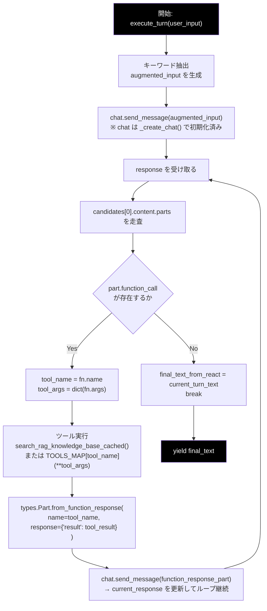
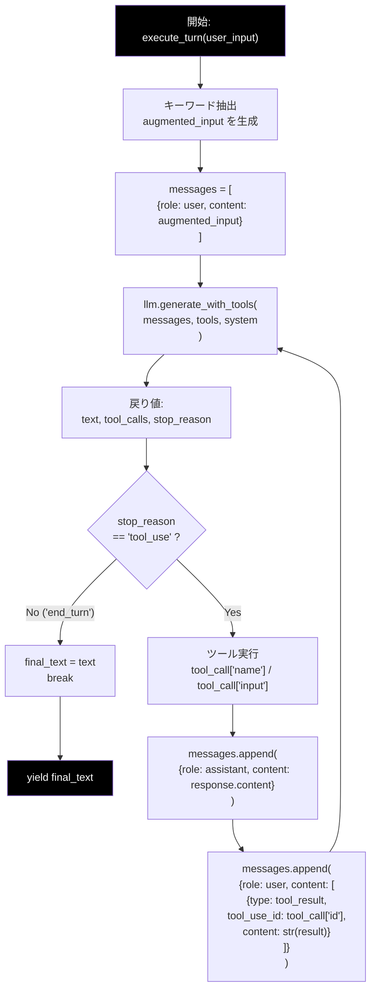

# ReAct Tool Use ループ　移植ガイド

**対象ファイル**: `service/agent_service.py`  
**移植元**: Gemini API (`google.genai`)  
**移植先**: Anthropic API (`anthropic`)  
**作成日**: 2026-04-20

---

## 1. ReAct パターンとは

**ReAct（Reasoning + Acting）** とは、LLM が「思考 → 行動 → 観察」を繰り返して問題を解くパターンです。

```
Thought  : なぜ検索が必要か、どんなクエリで検索するか
Action   : ツール（RAG検索 など）を呼び出す
Observation : ツールの実行結果を受け取る
   ↓ 必要に応じて繰り返す
Final Answer : 最終回答を返す
```

`agent_service.py` ではこれに加えて **Reflection（自己評価・推敲）** フェーズを持ち、
ReAct ループが生成した回答案をさらに LLM が客観的に評価・修正する 2 段構成になっています。

---

## 2. 現状（Gemini版）の全体構成

```mermaid
flowchart TD
    A["ユーザークエリ受信"] --> B["キーワード抽出\n(KeywordExtractor)"]
    B --> C["chat.send_message(augmented_input)"]

    subgraph REACT["Phase 1: ReAct Loop (max_turns=10)"]
        direction TB
        C --> D["response.candidates[0].content.parts を走査"]
        D --> E{"part.function_call\nあり？"}
        E -- "あり" --> F["ツール実行\nsearch_rag_knowledge_base_cached()"]
        F --> G["types.Part.from_function_response()\n結果を生成"]
        G --> H["chat.send_message(function_response_part)\n次のターンへ"]
        H --> D
        E -- "なし" --> I["final_text_from_react を確定"]
    end

    subgraph REFLECTION["Phase 2: Reflection"]
        direction TB
        I --> J["REFLECTION_INSTRUCTION + 回答案を送信"]
        J --> K["Final Answer: を抽出"]
    end

    K --> L["_format_final_answer()\n最終整形"]
    L --> M["yield final_answer"]

    style REACT fill:#1a1a1a
    style REFLECTION fill:#1a1a1a
```



---

## 3. Gemini 版 ReAct ループの詳細フロー



**ポイント:**
- `chat` オブジェクト（`client.chats.create()`）が会話履歴を内部で保持する
- ツール結果は `types.Part.from_function_response()` でラップして `chat.send_message()` に渡す
- LLM がツールを呼ばなくなるまで（または `max_turns` に達するまで）ループする

---

## 4. Gemini と Anthropic の Tool Use フォーマット差異

これが **移植の核心** です。API の設計思想が根本的に異なります。

### 4-1. ツール定義

| 項目 | Gemini（移植元） | Anthropic（移植先） |
|---|---|---|
| 形式 | `types.Tool(function_declarations=[...])` | プレーンな `dict` のリスト |
| キー名 | `parameters` | `input_schema` |

```python
# Gemini
tools = types.Tool(function_declarations=[
    {"name": "search_rag_knowledge_base",
     "parameters": {"type": "object", "properties": {...}}}
])

# Anthropic
tools = [
    {"name": "search_rag_knowledge_base",
     "description": "...",
     "input_schema": {"type": "object", "properties": {...}}}
]
```

### 4-2. ツール呼び出し検出

| 項目 | Gemini（移植元） | Anthropic（移植先） |
|---|---|---|
| 検出方法 | `response.candidates[0].content.parts` を走査して `part.function_call` を探す | `stop_reason == "tool_use"` を確認後、`response.content` を走査 |
| 呼び出し情報取得 | `fn.name` / `fn.args` | `b.name` / `b.input` / `b.id` |

```python
# Gemini
for part in response.candidates[0].content.parts:
    if hasattr(part, 'function_call') and part.function_call:
        tool_name = part.function_call.name
        tool_args = dict(part.function_call.args)

# Anthropic
if response.stop_reason == "tool_use":
    for b in response.content:
        if b.type == "tool_use":
            tool_name = b.name
            tool_args = b.input
            tool_id   = b.id   # ← Anthropic では id が必須
```

> **`b.id` が重要**: Anthropic では後でツール結果を返す際に `tool_use_id` として使用します。
> Gemini にはこの概念がありません。

### 4-3. ツール結果の送信（最大の差異）

ここが移植で**最も注意すべき**箇所です。

```mermaid
flowchart LR
    subgraph GEMINI["Gemini: 1回の送信で完結"]
        G1["FunctionResponse を Part に変換"] --> G2["chat.send_message(part)\n1回の送信のみ"]
    end

    subgraph ANTHROPIC["Anthropic: 2回分の追記が必要"]
        A1["messages に assistant ターンを保存"] --> A2["messages に tool_result を追記"]
        A2 --> A3["client.messages.create(messages=...)"]
    end

    style GEMINI fill:#1a1a1a
    style ANTHROPIC fill:#1a1a1a
```



```python
# Gemini: Part を1回送るだけ
function_response_part = types.Part.from_function_response(
    name=str(tool_name),
    response={'result': tool_result}
)
current_response = self.chat.send_message(message=function_response_part)

# Anthropic: messages に2件追記してから再呼び出し
# ① LLM の応答（tool_use を含む）を assistant として保存
messages.append({"role": "assistant", "content": response.content})

# ② ツール結果を user として追記（tool_use_id が必須）
messages.append({
    "role": "user",
    "content": [{
        "type"       : "tool_result",
        "tool_use_id": tool_id,       # ← b.id から取得した値
        "content"    : str(tool_result)
    }]
})

# ③ 会話履歴全体を渡して再呼び出し
response = client.messages.create(model=..., messages=messages, tools=tools)
```

### 4-4. 会話履歴の管理

| 項目 | Gemini | Anthropic |
|---|---|---|
| 履歴管理 | `chat` オブジェクトが**内部で自動管理** | `messages` リストを**自前で管理** |
| 初期化 | `client.chats.create()` | なし（`messages = []` で開始） |
| ロール区別 | `parts` 内部で `function_call` / `function_response` を区別 | `{"role": "user"/"assistant", "content": [...]}` で明示 |

Gemini では `chat.send_message()` を呼ぶたびに SDK が自動で履歴に追加してくれます。
Anthropic では履歴を **呼び出し側が `messages` リストとして管理** する必要があります。

---

## 5. Anthropic 版 ReAct ループの詳細フロー（移植後）



---

## 6. `generate_with_tools()` の役割

`helper_llm.py` の `AnthropicClient` に実装済みのメソッドで、
ループ 1 ステップ分の API 呼び出し・ツール呼び出し抽出・テキスト抽出を **隠蔽** します。

```python
def generate_with_tools(
    self,
    messages: List[Dict],
    tools: List[Dict],
    system: str = "",
    model: Optional[str] = None,
    max_tokens: int = 4096,
) -> Tuple[str, List[Dict], str]:
    """
    Returns:
        text        : LLM のテキスト応答
        tool_calls  : [{"name":..., "input":..., "id":...}, ...]
        stop_reason : "tool_use" | "end_turn" | "max_tokens"
    """
```

`agent_service.py` の `_execute_react_loop()` はこれを呼ぶだけで済みます。

---

## 7. Reflection フェーズの変更

| 項目 | Gemini（現状） | Anthropic（移植後） |
|---|---|---|
| 送信方法 | `self.chat.send_message(reflection_msg)` | `messages` に追記して `llm.generate_content()` |
| 履歴引き継ぎ | chat が自動管理 | ReAct ループ終了時の `messages` をそのまま使用 |
| レスポンス取得 | `candidates[0].content.parts` を走査 | `llm.generate_content()` が `str` を返す |

---

## 8. 移植変更点まとめ

```mermaid
flowchart LR
    subgraph BEFORE["移植前 (Gemini)"]
        B1["from google import genai"]
        B2["genai.Client()"]
        B3["client.chats.create()"]
        B4["chat.send_message()"]
        B5["candidates[0].content.parts\nを走査"]
        B6["types.Part.from_function_response()\nchat.send_message(part)"]
    end

    subgraph AFTER["移植後 (Anthropic)"]
        A1["from helper_llm import create_llm_client"]
        A2["create_llm_client('anthropic')"]
        A3["messages = [] で自前管理"]
        A4["llm.generate_with_tools(messages, tools)"]
        A5["stop_reason == 'tool_use'\ncontent を走査"]
        A6["messages に2件追記\n(assistant + tool_result)"]
    end

    B1 -.->|置換| A1
    B2 -.->|置換| A2
    B3 -.->|置換| A3
    B4 -.->|置換| A4
    B5 -.->|置換| A5
    B6 -.->|置換| A6

    style BEFORE fill:#1a1a1a
    style AFTER fill:#1a1a1a
```



| # | 変更箇所 | 変更前 | 変更後 |
|---|---|---|---|
| 1 | import | `from google import genai` | `from helper_llm import create_llm_client` |
| 2 | クライアント初期化 | `genai.Client()` | `create_llm_client("anthropic")` |
| 3 | チャット初期化 | `client.chats.create()` | `messages = []`（自前管理） |
| 4 | ツール定義 | `types.Tool(function_declarations=[...])` | `[{"name":..., "input_schema":{...}}]` |
| 5 | LLM 呼び出し | `chat.send_message(augmented_input)` | `llm.generate_with_tools(messages, tools, system)` |
| 6 | ツール検出 | `part.function_call` を走査 | `stop_reason == "tool_use"` → `b.type == "tool_use"` |
| 7 | ツール情報取得 | `fn.name` / `fn.args` | `b.name` / `b.input` / `b.id` |
| 8 | ツール結果送信 | `Part.from_function_response()` → `chat.send_message(part)` | `messages` に 2 件追記 → `generate_with_tools()` 再呼び出し |
| 9 | Reflection 送信 | `chat.send_message(reflection_msg)` | `messages` に追記 → `llm.generate_content()` |

---

## 9. 変更不要な箇所

以下は Gemini API に依存していないため、移植時に変更不要です。

- `SYSTEM_INSTRUCTION_TEMPLATE`（プロンプト文字列）
- `REFLECTION_INSTRUCTION`（プロンプト文字列）
- `KeywordExtractor` によるキーワード抽出ロジック
- `search_rag_knowledge_base_cached()` の呼び出しロジック
- `log_unanswered_question()` の呼び出し
- `_format_final_answer()` の整形ロジック
- `get_available_collections_from_qdrant_helper()`

---

## 10. 移植後の疑似コード

```python
def _execute_react_loop(self, user_input: str):
    augmented_input = self._augment_with_keywords(user_input)

    # Anthropic: 履歴を自前で管理
    messages = [{"role": "user", "content": augmented_input}]

    for turn in range(self.max_turns):
        # 1ステップ実行（helper_llm.py の generate_with_tools に委譲）
        text, tool_calls, stop_reason = self.llm.generate_with_tools(
            messages=messages,
            tools=self.tools,
            system=self.system_instruction,
        )

        if stop_reason == "end_turn" or not tool_calls:
            yield {"type": "final_text", "content": text}
            break

        # ツール呼び出しが返った場合
        for tc in tool_calls:
            yield {"type": "tool_call", "name": tc["name"], "args": tc["input"]}

            tool_result = self._call_tool(tc["name"], tc["input"])
            yield {"type": "tool_result", "content": str(tool_result)[:500]}

            # Anthropic: 必ず2件追記する
            # ① assistant のターンを保存
            messages.append({
                "role"   : "assistant",
                "content": last_response_content   # generate_with_tools の生応答
            })
            # ② tool_result を user として追記（tool_use_id 必須）
            messages.append({
                "role"   : "user",
                "content": [{
                    "type"       : "tool_result",
                    "tool_use_id": tc["id"],
                    "content"    : str(tool_result)
                }]
            })
```

---

*本ドキュメントは `anthropic_grace_agent` 移植作業の技術参照資料として使用する。*  
*`agent_service.py` の実装完了後に本ファイルのコードサンプルを更新すること。*
