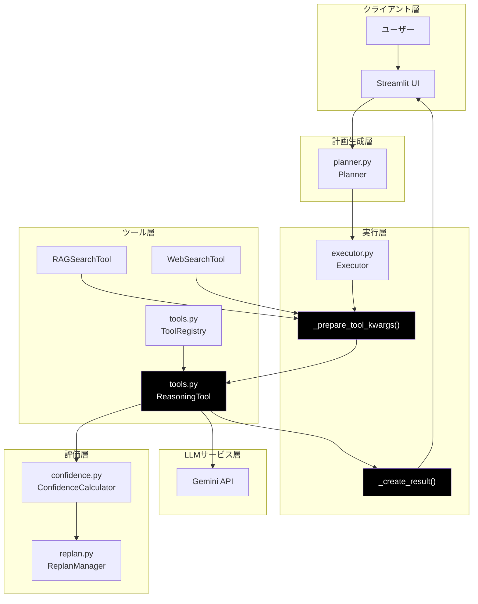
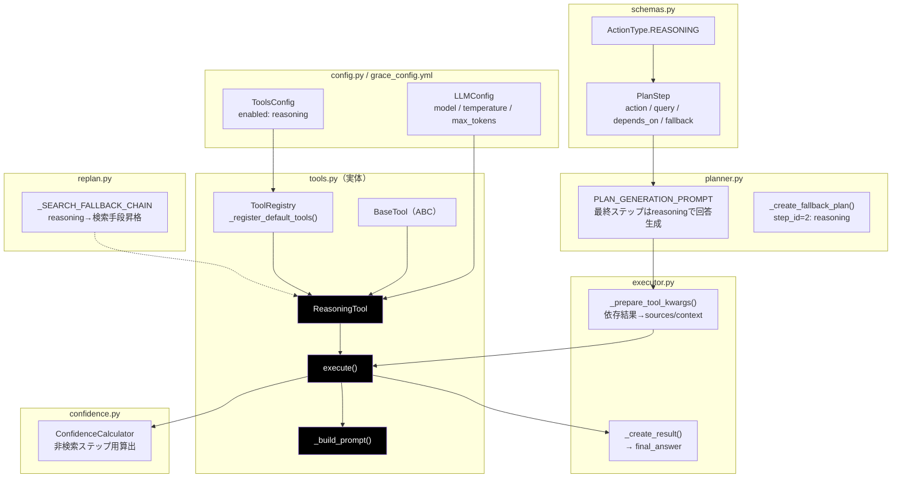
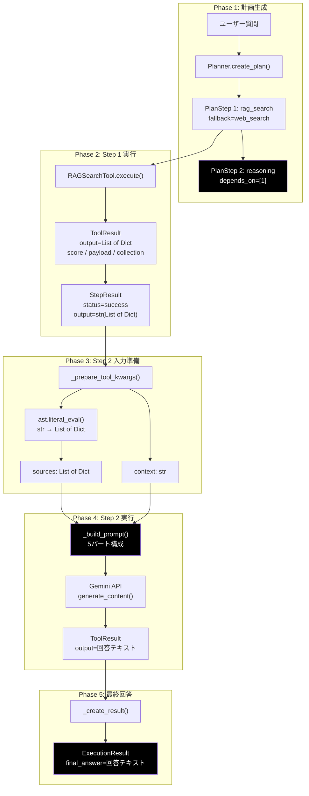
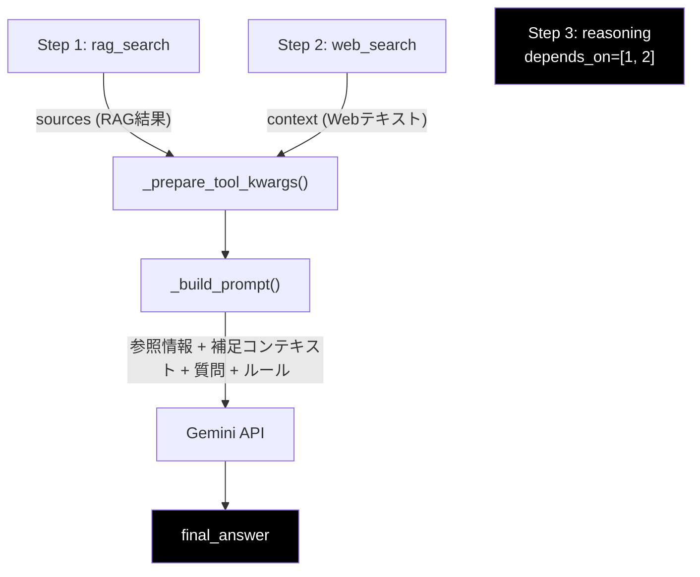

# reasoning（推論機能）- 横断モジュール構成 ドキュメント

**Version 1.0** | 最終更新: 2026-02-20

---

## 目次

1. [概要](#概要)
2. [アーキテクチャ構成図](#1-アーキテクチャ構成図)
3. [モジュール構成図](#2-モジュール構成図)
4. [クラス・関数一覧表](#3-クラス関数一覧表)
5. [クラス・関数 IPO詳細](#4-クラス関数-ipo詳細)
6. [設定・定数](#5-設定定数)
7. [使用例](#6-使用例)
8. [エクスポート](#7-エクスポート)
9. [変更履歴](#8-変更履歴)
10. [付録: データフロー詳細](#付録-データフロー詳細)

---

## 概要

`reasoning` は、GRACEフレームワークにおける **LLM推論による最終回答生成機能** を担う横断的機能。独立した `.py` ファイルとしては存在せず、`tools.py` 内の `ReasoningTool` クラスを実体として、計画生成（`planner.py`）・実行（`executor.py`）・信頼度計算（`confidence.py`）・リプラン（`replan.py`）の各モジュールが連携して動作する。

### 主な責務

- 収集した情報（RAG検索結果・Web検索結果・他ステップ出力）を統合して最終回答を生成
- Gemini API を用いた推論プロンプトの構築と LLM 呼び出し
- 実行計画の最終ステップとして `final_answer` を提供
- 信頼度計算における非検索ステップとしての評価
- リプランにおけるフォールバック昇格の起点

### 各責務対応のモジュール

| # | 責務 | 対応モジュール | 説明 |
|---|------|--------------|------|
| 1 | 推論の実行（LLM呼び出し） | `tools.py` | `ReasoningTool.execute()` が Gemini API を呼び出し回答を生成 |
| 2 | 推論プロンプトの構築 | `tools.py` | `ReasoningTool._build_prompt()` が参照情報・コンテキスト・ルールを結合 |
| 3 | 計画への reasoning ステップ配置 | `planner.py` | `PLAN_GENERATION_PROMPT` で最終ステップに `reasoning` を強制指示 |
| 4 | 依存ステップ結果の入力準備 | `executor.py` | `_prepare_tool_kwargs()` が依存ステップ出力を `sources`/`context` に変換 |
| 5 | 最終回答の抽出 | `executor.py` | `_create_result()` が最後の reasoning 出力を `final_answer` に採用 |
| 6 | 信頼度の算出 | `confidence.py` | 非検索ステップ用の加重平均（`search_quality×0.6 + tool_success×0.4`） |
| 7 | フォールバック昇格判定 | `replan.py` | `_SEARCH_FALLBACK_CHAIN` で fallback="reasoning" を検索手段に昇格 |
| 8 | ツール登録・有効化制御 | `tools.py` + `config.py` | `ToolRegistry` が `grace_config.yml` の `tools.enabled` に基づき登録 |

### 主要機能一覧

| 機能 | 所在 | 説明 |
|------|------|------|
| `ReasoningTool` | `tools.py` L303 | LLM推論ツール本体クラス（`BaseTool` 継承） |
| `ReasoningTool.execute()` | `tools.py` L318 | query/context/sources を受け取り Gemini API で回答生成 |
| `ReasoningTool._build_prompt()` | `tools.py` L395 | 5パート構成の推論プロンプトを構築 |
| `ActionType.REASONING` | `schemas.py` | `"reasoning"` アクション種別の Enum 定義 |
| `PlanStep.action` | `schemas.py` | Literal に `"reasoning"` を含む |
| `Executor._prepare_tool_kwargs()` | `executor.py` L645 | reasoning ステップ用の引数準備（依存結果→sources/context） |
| `Executor._create_result()` | `executor.py` L1105 | 最後の reasoning ステップ出力を `final_answer` に採用 |
| `ConfidenceCalculator` | `confidence.py` L196 | reasoning ステップ用の信頼度計算ロジック |
| `_SEARCH_FALLBACK_CHAIN` | `replan.py` L392 | fallback="reasoning" 時の検索手段昇格マッピング |

---

## 1. アーキテクチャ構成図

### 1.1 システム全体構成



### 1.2 データフロー概要


---

## 2. モジュール構成図

### 2.1 内部モジュール構成



### 2.2 モジュール依存関係

| モジュール | reasoning における役割 | 依存方向 |
|-----------|----------------------|---------|
| `schemas.py` | アクション種別定義 | `tools.py` → `schemas.py` |
| `config.py` | LLMパラメータ・有効化設定 | `tools.py` → `config.py` |
| `grace_config.yml` | `tools.enabled: reasoning` 設定 | `config.py` → YAML |
| `planner.py` | 計画に reasoning を最終ステップ配置 | `planner.py` → `schemas.py` |
| `tools.py` | **ReasoningTool 実体** | 中核 |
| `executor.py` | 入力準備 + 最終回答抽出 | `executor.py` → `tools.py` |
| `confidence.py` | 信頼度算出（非検索ステップ） | `confidence.py` ← `executor.py` |
| `replan.py` | フォールバック昇格判定 | `replan.py` → `tools.py`（間接） |

---

## 3. クラス・関数一覧表

### 3.1 クラス一覧

| クラス | 所在 | 種別 | 説明 |
|--------|------|------|------|
| `ReasoningTool` | `tools.py` L303 | クラス（`BaseTool` 継承） | LLM推論ツール本体 |

### 3.2 メソッド一覧

| メソッド | クラス | 行番号 | 説明 |
|----------|--------|--------|------|
| `__init__` | `ReasoningTool` | L309 | 初期化（Gemini Client生成、モデル名読み込み） |
| `execute` | `ReasoningTool` | L318 | LLM推論を実行し `ToolResult` を返却 |
| `_build_prompt` | `ReasoningTool` | L395 | 推論用プロンプトを5パート構成で構築 |

### 3.3 関連関数・メソッド（他モジュール）

| 関数/メソッド | 所在 | 説明 |
|---------------|------|------|
| `Executor._prepare_tool_kwargs()` | `executor.py` L645 | reasoning ステップの入力引数を準備 |
| `Executor._create_result()` | `executor.py` L1105 | 最後の reasoning 出力を `final_answer` に採用 |
| `ToolRegistry._register_default_tools()` | `tools.py` L808 | `config.tools.enabled` に基づき `ReasoningTool` を登録 |
| `Planner._create_fallback_plan()` | `planner.py` L315 | フォールバック計画の step_id=2 に `reasoning` を配置 |

---

## 4. クラス・関数 IPO詳細

### 4.1 ReasoningTool クラス

#### シグネチャ

```python
class ReasoningTool(BaseTool):
    name = "reasoning"
    description = "収集した情報を分析・統合して回答を生成"
```

#### クラス属性

| 属性 | 型 | 説明 |
|------|----|------|
| `name` | `str` | `"reasoning"` — ToolRegistry への登録名 |
| `description` | `str` | `"収集した情報を分析・統合して回答を生成"` |

#### インスタンス属性

| 属性 | 型 | 説明 |
|------|----|------|
| `config` | `GraceConfig` | GRACE統合設定 |
| `model_name` | `str` | 使用するLLMモデル名（デフォルト: `config.llm.model`） |
| `client` | `genai.Client` | Google Gemini API クライアント |

---

#### 4.1.1 `__init__`

##### シグネチャ

```python
def __init__(
    self,
    config: Optional[GraceConfig] = None,
    model_name: Optional[str] = None
) -> None
```

##### IPO

| 区分 | 内容 |
|------|------|
| **Input** | `config`: GraceConfig（省略時 `get_config()` で取得）、`model_name`: LLMモデル名（省略時 `config.llm.model`） |
| **Process** | 1. `config` を設定（引数 or `get_config()`）<br>2. `model_name` を設定（引数 or `config.llm.model`）<br>3. `genai.Client()` を生成して `self.client` に格納 |
| **Output** | なし（インスタンス初期化） |

---

#### 4.1.2 `execute`

##### シグネチャ

```python
def execute(
    self,
    query: str,
    context: Optional[str] = None,
    sources: Optional[List[Dict]] = None,
    **kwargs
) -> ToolResult
```

##### IPO

| 区分 | 内容 |
|------|------|
| **Input** | `query`: ユーザーの元クエリ<br>`context`: 補足コンテキスト（他ステップのテキスト出力）<br>`sources`: 参照ソースのリスト（RAG/Web検索結果の `List[Dict]`） |
| **Process** | 1. 実行開始時刻を記録<br>2. `_build_prompt(query, context, sources)` でプロンプト構築<br>3. IPO INPUT ログ出力<br>4. `self.client.models.generate_content()` で Gemini API 呼び出し<br>&nbsp;&nbsp;&nbsp;— model: `self.model_name`<br>&nbsp;&nbsp;&nbsp;— temperature: `config.llm.temperature`<br>&nbsp;&nbsp;&nbsp;— max_output_tokens: `config.llm.max_tokens`<br>5. `response.text` から回答テキスト取得<br>6. IPO OUTPUT ログ出力<br>7. 実行時間（ms）算出<br>8. `response.usage_metadata` からトークン使用量を抽出<br>9. `ToolResult(success=True, ...)` を生成して返却<br>10. 例外時: `ToolResult(success=False, error=str(e))` を返却 |
| **Output** | `ToolResult` |

##### 戻り値例（成功時）

```python
ToolResult(
    success=True,
    output="社内ナレッジ（FAQ_2024.md）によると、有給休暇は年間20日付与されます。...",
    confidence_factors={
        "has_sources": True,       # sources が渡されたか
        "source_count": 3,         # sources の件数
        "answer_length": 256,      # 回答文字数
        "token_usage": {
            "input_tokens": 1200,
            "output_tokens": 150,
        }
    },
    execution_time_ms=2340
)
```

##### 戻り値例（失敗時）

```python
ToolResult(
    success=False,
    output=None,
    error="429 Resource has been exhausted"
)
```

---

#### 4.1.3 `_build_prompt`

##### シグネチャ

```python
def _build_prompt(
    self,
    query: str,
    context: Optional[str],
    sources: Optional[List[Dict]]
) -> str
```

##### IPO

| 区分 | 内容 |
|------|------|
| **Input** | `query`: ユーザーの元クエリ<br>`context`: 補足コンテキスト（`Optional[str]`）<br>`sources`: 参照ソースリスト（`Optional[List[Dict]]`） |
| **Process** | 5パート構成のプロンプトを順番に結合:<br>1. **システム指示** — 「ハイブリッド・ナレッジ・エージェント」ロール定義<br>2. **【参照情報】** — `sources` を展開（各ソースの score, collection, Q/A/content, source を整形）<br>3. **【補足コンテキスト】** — `context` テキストをそのまま挿入<br>4. **【ユーザーの質問】** — `query` を挿入<br>5. **【回答の構成ルール】** — 5つのルール（正確性、事実優先、出典明示、丁寧な日本語、捏造禁止） |
| **Output** | `str` — 結合されたプロンプト文字列 |

##### プロンプト構造図


##### sources 1件あたりの展開フォーマット

```text
--- 情報源 {i} (信頼度: {score:.2f}, コレクション: {col}) ---
Q: {question}          ← payload.question がある場合
A: {answer}            ← payload.answer がある場合
{content[:1000]}       ← question/answer がない場合のみ
出典: {src_file}
```

> **注意**: `content` は最大1000文字に切り詰められる。`question` または `answer` が存在する場合、`content` は出力されない。

---

### 4.2 関連処理（executor.py）

#### 4.2.1 `_prepare_tool_kwargs()` — reasoning ステップ分岐

##### 該当コード概要

```python
# executor.py L658-692
elif step.action == "reasoning":
    context_parts = []
    sources = []
    for dep_id in step.depends_on:
        if dep_id in state.step_results:
            dep_output = state.step_results[dep_id].output
            # List[Dict] → sources に追加
            # str(JSON風) → ast.literal_eval → sources に追加
            # str(通常) → context_parts に追加
    kwargs["sources"] = sources       # List[Dict]
    kwargs["context"] = "\n\n".join(context_parts)  # str
```

##### IPO

| 区分 | 内容 |
|------|------|
| **Input** | `step`: `PlanStep`（action="reasoning"）、`state`: `ExecutionState`（前ステップ結果を保持） |
| **Process** | 1. `step.depends_on` の各依存ステップIDをループ<br>2. 各依存ステップの `output` を取得<br>3. 型判定による振り分け:<br>&nbsp;&nbsp;— `str` で `"[{"` 始まり → `ast.literal_eval()` でパース → `sources` に追加<br>&nbsp;&nbsp;— `str`（通常テキスト）→ `context_parts` に追加<br>&nbsp;&nbsp;— `list` → `sources` に直接追加<br>4. `kwargs["sources"]`、`kwargs["context"]` に格納 |
| **Output** | `Dict[str, Any]` — `ReasoningTool.execute()` に渡すキーワード引数 |

---

#### 4.2.2 `_create_result()` — final_answer 抽出

##### 該当コード概要

```python
# executor.py L1105-1112
final_answer = None
for step in reversed(state.plan.steps):
    if (step.action in ["reasoning", "run_legacy_agent"]) and step.step_id in state.step_results:
        result = state.step_results[step.step_id]
        if result.status == "success":
            final_answer = result.output
            break
```

##### IPO

| 区分 | 内容 |
|------|------|
| **Input** | `state`: `ExecutionState`（全ステップ結果を保持） |
| **Process** | 1. 計画のステップリストを**逆順**に走査<br>2. `action` が `"reasoning"` または `"run_legacy_agent"` のステップを探索<br>3. そのステップの `status` が `"success"` なら `output` を `final_answer` に採用<br>4. 最初に見つかった時点で `break` |
| **Output** | `final_answer: Optional[str]` — `ExecutionResult.final_answer` に格納 |

---

### 4.3 関連処理（confidence.py）

#### reasoning ステップの信頼度算出

```python
# confidence.py L196-210
# 検索ステップ以外（Reasoningなど）の場合
# 「有効な（信頼できる）要素」だけで加重平均を計算し、正規化する
# 1. 検索品質 (search_quality) — 継承スコアがあれば最優先 (重み 0.6)
# 2. ツール成功 (tool_success) — 必須要素 (重み 0.4)
```

| 要素 | 重み | 説明 |
|------|------|------|
| `search_quality` | 0.6 | 依存ステップから継承された検索品質スコア（0 の場合は除外） |
| `tool_success` | 0.4 | ToolResult の成功/失敗に基づくスコア |
| `llm_self_eval` | 0.0 | 検索ステップ以外では N/A |
| `query_coverage` | 0.0 | 検索ステップ以外では N/A |

---

### 4.4 関連処理（replan.py）

#### フォールバック昇格: `_SEARCH_FALLBACK_CHAIN`

検索系ステップの `fallback` が `"reasoning"` に設定されている場合、`ReplanManager._apply_fallback()` はそのまま reasoning にフォールバックせず、`_SEARCH_FALLBACK_CHAIN` に基づいて**別の検索手段に昇格**させる。

```python
# replan.py L392-395
_SEARCH_FALLBACK_CHAIN: Dict[str, str] = {
    "rag_search": "web_search",
    "web_search": "rag_search",
}

# replan.py L411
if fallback_action == "reasoning" and step.action in self._SEARCH_FALLBACK_CHAIN:
    # reasoning → 代替検索手段に昇格
```

| 元アクション | fallback 指定 | 昇格後のアクション |
|-------------|--------------|------------------|
| `rag_search` | `"reasoning"` | `"web_search"` |
| `web_search` | `"reasoning"` | `"rag_search"` |

---

## 5. 設定・定数

### 5.1 grace_config.yml 関連設定

#### LLM設定（ReasoningTool が使用）

| キー | デフォルト値 | 説明 |
|------|------------|------|
| `llm.provider` | `"gemini"` | LLMプロバイダ |
| `llm.model` | `"gemini-3-flash-preview"` | 使用モデル名 → `ReasoningTool.model_name` |
| `llm.temperature` | `0.7` | 生成温度 → `GenerateContentConfig.temperature` |
| `llm.max_tokens` | `4096` | 最大出力トークン数 → `GenerateContentConfig.max_output_tokens` |
| `llm.timeout` | `30` | タイムアウト秒数 |

#### ツール有効化設定

| キー | デフォルト値 | 説明 |
|------|------------|------|
| `tools.enabled` | `["rag_search", "web_search", "reasoning", "ask_user"]` | `"reasoning"` が含まれていれば `ToolRegistry` に登録 |
| `tools.disabled` | `["write_file", "replace", "run_shell_command"]` | 恒久禁止ツール（reasoning は対象外） |

### 5.2 プロンプト内定数（_build_prompt 内）

| 定数 | 値 | 説明 |
|------|----|------|
| ロール定義 | `"ハイブリッド・ナレッジ・エージェント"` | システム指示で使用 |
| content 最大長 | `1000` 文字 | `sources[].content` の切り詰め上限 |
| 回答ルール数 | `5` 項目 | 正確性・事実優先・出典明示・丁寧な日本語・捏造禁止 |

### 5.3 Planner 内定数（PLAN_GENERATION_PROMPT 内）

| ルール | 内容 |
|--------|------|
| ルール5 | `"最後のステップは必ず reasoning で回答を生成してください"` |
| 使い分け | `"両方必要な場合 → rag_search → web_search → reasoning の3ステップ"` |

---

## 6. 使用例

### 6.1 基本ワークフロー: RAG → reasoning

```python
from grace.tools import ReasoningTool, ToolResult
from grace.config import get_config

# 1. ReasoningTool 初期化
config = get_config()
reasoning_tool = ReasoningTool(config=config)

# 2. RAG検索結果をsourcesとして渡す
sources = [
    {
        "score": 0.85,
        "collection": "customer_support_faq",
        "payload": {
            "question": "有給休暇は何日ありますか？",
            "answer": "正社員は年間20日の有給休暇が付与されます。",
            "source": "HR_FAQ_2024.md"
        }
    }
]

# 3. 推論実行
result: ToolResult = reasoning_tool.execute(
    query="有給休暇の日数を教えてください",
    sources=sources
)

print(result.success)                    # True
print(result.output)                     # "社内ナレッジ（HR_FAQ_2024.md）によると..."
print(result.confidence_factors)         # {"has_sources": True, "source_count": 1, ...}
print(result.execution_time_ms)          # 2340
```

### 6.2 コンテキスト付きワークフロー: Web検索結果 + context

```python
# Web検索結果がテキスト形式の場合（sources ではなく context として渡される）
result = reasoning_tool.execute(
    query="2025年のAIトレンドについて教えてください",
    context="--- 参照情報 (Step 1) ---\n最新のAIトレンドとして...",
    sources=None
)
# output: "提供された情報によると、2025年のAIトレンドは..."
```

### 6.3 ToolRegistry 経由での実行

```python
from grace.tools import create_tool_registry

registry = create_tool_registry()

# ToolRegistry.execute() 経由で実行
result = registry.execute(
    "reasoning",
    query="社内の福利厚生について教えてください",
    sources=[...],
    context="補足: 2024年度の改定内容を含む"
)
```

### 6.4 典型的な実行計画パターン

```python
from grace.schemas import ExecutionPlan, PlanStep

plan = ExecutionPlan(
    original_query="有給休暇の日数を教えてください",
    complexity=0.5,
    estimated_steps=2,
    requires_confirmation=False,
    steps=[
        PlanStep(
            step_id=1,
            action="rag_search",
            description="全コレクションから関連情報を検索",
            query="有給休暇の日数を教えてください",
            collection=None,
            expected_output="関連するドキュメントや情報",
            fallback="web_search",
            timeout_seconds=30
        ),
        PlanStep(
            step_id=2,
            action="reasoning",            # ← 最終ステップは必ず reasoning
            description="取得した情報を元に回答を生成",
            query=None,
            collection=None,
            depends_on=[1],                # ← step1 の結果に依存
            expected_output="ユーザーへの回答",
            fallback=None,
            timeout_seconds=30
        )
    ],
    success_criteria="ユーザーの質問に適切に回答できている"
)
```

---

## 7. エクスポート

### 7.1 `__init__.py` でのエクスポート

```python
# Tools
from grace.tools import (
    ToolResult,
    BaseTool,
    ReasoningTool,    # ← reasoning 実体
    ToolRegistry,
    create_tool_registry,
)
```

### 7.2 `__all__` 定義

| エクスポート名 | カテゴリ | 説明 |
|---------------|---------|------|
| `ReasoningTool` | Tools | LLM推論ツールクラス |
| `ToolResult` | Tools | 全ツール共通の結果データクラス |
| `BaseTool` | Tools | ツール基底クラス |
| `ToolRegistry` | Tools | ツール登録・管理 |
| `create_tool_registry` | Tools | ToolRegistryファクトリ関数 |

---

## 8. 変更履歴

| バージョン | 日付 | 変更内容 |
|-----------|------|---------|
| 1.0 | 2026-02-20 | 初版作成。reasoning の横断モジュール構成を文書化 |

---

## 付録: データフロー詳細

### 典型パターン: rag_search → reasoning



### 3ステップパターン: rag_search → web_search → reasoning


