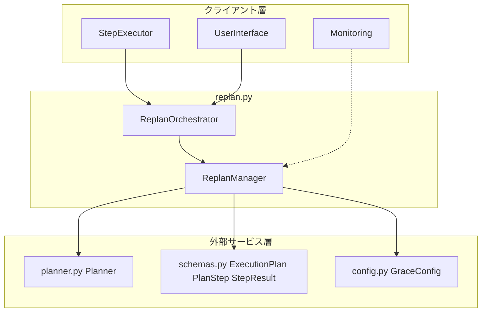
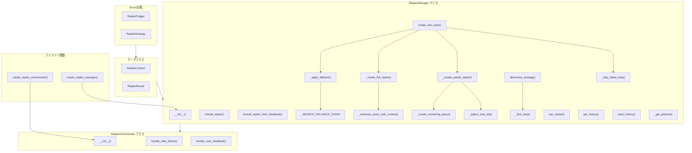
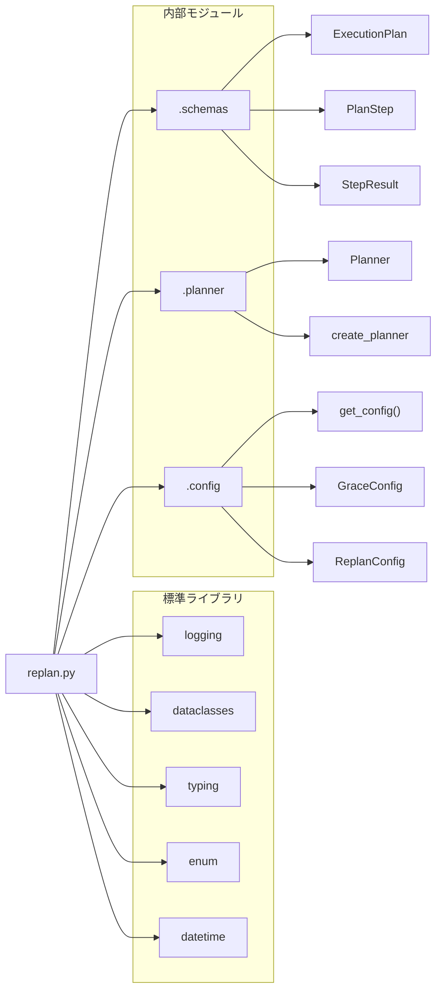

# replan.py - 動的リプランニングシステム ドキュメント

**Version 1.4** | 最終更新: 2026-02-20

---

## 目次

1. [概要](#概要)
2. [アーキテクチャ構成図](#1-アーキテクチャ構成図)
3. [モジュール構成図](#2-モジュール構成図)
4. [クラス・関数一覧表](#3-クラス関数一覧表)
5. [クラス・関数 IPO詳細](#4-クラス関数-ipo詳細)
6. [設定・定数](#5-設定定数)
7. [使用例](#6-使用例)
8. [エクスポート](#7-エクスポート)
9. [変更履歴](#8-変更履歴)
10. [付録: 依存関係図](#付録-依存関係図)

---

## 概要

`replan.py`は、GRACEフレームワークにおける動的リプランニングシステムを提供するモジュール。ステップ実行の失敗、低信頼度、ユーザーフィードバック、新情報の発見、タイムアウトなどのトリガーに応じて、実行計画を動的に修正・再生成する。

### 主な責務

- リプランのトリガー条件判定（ステップ失敗・低信頼度・ユーザーフィードバック）
- リプラン戦略の決定（部分再計画・全体再計画・代替・スキップ・中断）
- 失敗情報やフィードバックを考慮した新計画の生成（フォールバックチェーン付き）
- リプラン履歴の管理
- Executorとの統合によるリプランフロー制御

### 各責務対応のモジュール

| # | 責務 | 対応モジュール | 説明 |
|---|------|--------------|------|
| 1 | リプランのトリガー条件判定 | `replan.py` | `ReplanManager.should_replan()` / `should_replan_from_feedback()` |
| 2 | リプラン戦略の決定 | `replan.py` | `ReplanManager.determine_strategy()` でコンテキストに応じた戦略選択 |
| 3 | 失敗情報やフィードバックを考慮した新計画の生成 | `replan.py` + `planner.py` | `ReplanManager.create_new_plan()` が `Planner.create_plan()` を呼び出し。フォールバック時は `_SEARCH_FALLBACK_CHAIN` で検索系アクションを優先 |
| 4 | リプラン履歴の管理 | `replan.py` | `ReplanManager` が `history: List[ReplanResult]` で管理 |
| 5 | Executorとの統合によるリプランフロー制御 | `replan.py` | `ReplanOrchestrator` が判定→コンテキスト作成→戦略決定→実行を統合 |

### 主要機能一覧

| 機能 | 説明 |
|------|------|
| `ReplanTrigger` | リプランのトリガー条件を定義するEnum |
| `ReplanStrategy` | リプラン戦略を定義するEnum |
| `ReplanContext` | リプラン時のコンテキストデータクラス |
| `ReplanResult` | リプラン結果データクラス |
| `ReplanManager` | リプランの判定・戦略決定・計画生成を担う中核クラス |
| `ReplanManager._SEARCH_FALLBACK_CHAIN` | 検索系アクションのフォールバック優先順位マッピング（クラス変数） |
| `ReplanManager.should_replan()` | ステップ実行結果に基づくリプラン要否判定 |
| `ReplanManager.should_replan_from_feedback()` | ユーザーフィードバックに基づくリプラン要否判定 |
| `ReplanManager.determine_strategy()` | コンテキストに応じたリプラン戦略の決定 |
| `ReplanManager.create_new_plan()` | 戦略に応じた新計画の生成 |
| `ReplanManager._apply_fallback()` | 代替アクション適用（フォールバックチェーン昇格付き） |
| `ReplanOrchestrator` | ExecutorとReplanManagerを統合するオーケストレーター |
| `ReplanOrchestrator.handle_step_failure()` | ステップ失敗時の自動リプラン処理 |
| `ReplanOrchestrator.handle_user_feedback()` | ユーザーフィードバックによるリプラン処理 |
| `create_replan_manager()` | ReplanManagerインスタンスのファクトリ関数 |
| `create_replan_orchestrator()` | ReplanOrchestratorインスタンスのファクトリ関数 |

---

## 1. アーキテクチャ構成図

### 1.1 システム全体構成



### 1.2 データフロー

1. クライアント層（Executor/UI）がステップ失敗またはユーザーフィードバックを検知
2. `ReplanOrchestrator`がリプラン要否を`ReplanManager`に問い合わせ
3. `ReplanManager`がトリガー条件を判定し、リプラン戦略を決定
4. 戦略に応じて`Planner`を呼び出し、新しい`ExecutionPlan`を生成（FALLBACK戦略では`_SEARCH_FALLBACK_CHAIN`で検索系アクションを優先昇格）
5. `ReplanResult`をクライアント層に返却

---

## 2. モジュール構成図

### 2.1 内部モジュール構成



### 2.2 外部依存関係

| ライブラリ | バージョン | 用途 |
|-----------|-----------|------|
| `logging` | 標準ライブラリ | ログ出力 |
| `dataclasses` | 標準ライブラリ | データクラス定義 |
| `typing` | 標準ライブラリ | 型注釈 |
| `enum` | 標準ライブラリ | Enum定義 |
| `datetime` | 標準ライブラリ | 日時情報 |

### 2.3 内部依存モジュール

| モジュール | 用途 |
|-----------|------|
| `.schemas` | `ExecutionPlan`, `PlanStep`, `StepResult` データ型 |
| `.planner` | `Planner`, `create_planner` による計画生成 |
| `.config` | `get_config()`, `GraceConfig`, `ReplanConfig` による設定取得 |

---

## 3. クラス・関数一覧表

### 3.1 クラス一覧

#### ReplanTrigger（Enum）

| メンバー | 値 | 概要 |
|---------|-----|------|
| `STEP_FAILED` | `"step_failed"` | ステップ実行失敗 |
| `LOW_CONFIDENCE` | `"low_confidence"` | 信頼度が閾値未満 |
| `USER_FEEDBACK` | `"user_feedback"` | ユーザーからの修正要求 |
| `NEW_INFORMATION` | `"new_information"` | 新しい情報の発見 |
| `TIMEOUT` | `"timeout"` | タイムアウト |

#### ReplanStrategy（Enum）

| メンバー | 値 | 概要 |
|---------|-----|------|
| `PARTIAL` | `"partial"` | 失敗ステップ以降のみ再計画 |
| `FULL` | `"full"` | 全体を再計画 |
| `FALLBACK` | `"fallback"` | 代替アクションへ切り替え |
| `SKIP` | `"skip"` | 失敗ステップをスキップ |
| `ABORT` | `"abort"` | 実行中断 |

#### ReplanContext（dataclass）

| フィールド / メソッド | 型 | 概要 |
|---------------------|------|------|
| `trigger` | `ReplanTrigger` | トリガー条件 |
| `original_query` | `str` | 元のユーザークエリ |
| `failed_step_id` | `Optional[int]` | 失敗したステップID |
| `error_message` | `Optional[str]` | エラーメッセージ |
| `completed_results` | `Dict[int, StepResult]` | 完了済み結果 |
| `user_feedback` | `Optional[str]` | ユーザーフィードバック |
| `new_information` | `Optional[str]` | 新しい情報 |
| `replan_count` | `int` | 現在のリプラン回数 |
| `created_at` | `datetime` | 作成日時 |
| `has_completed_steps` | `bool`（property） | 完了済みステップの有無 |
| `completed_step_ids` | `List[int]`（property） | 完了済みステップIDリスト |
| `get_completed_outputs()` | `Dict[int, str]` | 完了済みステップの出力取得 |

#### ReplanResult（dataclass）

| フィールド | 型 | 概要 |
|-----------|------|------|
| `success` | `bool` | リプラン成功フラグ |
| `strategy` | `ReplanStrategy` | 適用された戦略 |
| `new_plan` | `Optional[ExecutionPlan]` | 新しい計画 |
| `reason` | `str` | 理由 |
| `replan_count` | `int` | リプラン回数 |
| `created_at` | `datetime` | 作成日時 |

#### ReplanManager

| メソッド / 属性 | 概要 |
|----------------|------|
| `__init__(config, planner)` | コンストラクタ（設定・Planner指定） |
| `_SEARCH_FALLBACK_CHAIN` | 検索系アクションのフォールバック優先順位（クラス変数） |
| `should_replan(step_result, replan_count)` | ステップ結果に基づくリプラン要否判定 |
| `should_replan_from_feedback(feedback, replan_count)` | フィードバックに基づくリプラン要否判定 |
| `determine_strategy(context, current_plan)` | リプラン戦略の決定 |
| `create_new_plan(context, strategy, current_plan)` | 新しい計画の生成 |
| `can_replan(replan_count)` | リプラン可能か判定 |
| `get_history()` | リプラン履歴を取得 |
| `clear_history()` | リプラン履歴をクリア |
| `_get_planner()` | Plannerの遅延初期化取得 |
| `_create_full_replan(context)` | 全体再計画の実行 |
| `_create_partial_replan(context, current_plan)` | 部分再計画の実行 |
| `_apply_fallback(context, current_plan)` | 代替アクションの適用（フォールバックチェーン昇格付き） |
| `_skip_failed_step(context, current_plan)` | 失敗ステップのスキップ |
| `_enhance_query_with_context(original_query, context)` | エラーコンテキスト付きクエリ生成 |
| `_create_remaining_query(context, completed_steps)` | 残りステップ用クエリ生成 |
| `_adjust_step_ids(steps, start_id, completed_count)` | ステップID・依存関係の調整 |
| `_find_step(plan, step_id)` | 計画からステップを検索 |

#### ReplanOrchestrator

| メソッド | 概要 |
|---------|------|
| `__init__(config, replan_manager)` | コンストラクタ（設定・ReplanManager指定） |
| `handle_step_failure(step_result, current_plan, completed_results, replan_count)` | ステップ失敗時のリプラン処理 |
| `handle_user_feedback(feedback, current_plan, completed_results, replan_count)` | ユーザーフィードバックによるリプラン処理 |

### 3.2 関数一覧（カテゴリ別）

#### ファクトリ関数

| 関数名 | 概要 |
|-------|------|
| `create_replan_manager(config, planner)` | ReplanManagerインスタンスを作成 |
| `create_replan_orchestrator(config, replan_manager)` | ReplanOrchestratorインスタンスを作成 |

---

## 4. クラス・関数 IPO詳細

### 4.1 ReplanTrigger（Enum）

リプランのトリガー条件を定義する文字列Enum。`str`を継承しているため文字列として直接比較可能。

```python
class ReplanTrigger(str, Enum):
    STEP_FAILED = "step_failed"
    LOW_CONFIDENCE = "low_confidence"
    USER_FEEDBACK = "user_feedback"
    NEW_INFORMATION = "new_information"
    TIMEOUT = "timeout"
```

```python
# 使用例
trigger = ReplanTrigger.STEP_FAILED
print(trigger.value)
# 出力: step_failed

print(trigger == "step_failed")
# 出力: True
```

### 4.2 ReplanStrategy（Enum）

リプラン戦略を定義する文字列Enum。戦略の選択は`ReplanManager.determine_strategy()`で行われる。

```python
class ReplanStrategy(str, Enum):
    PARTIAL = "partial"
    FULL = "full"
    FALLBACK = "fallback"
    SKIP = "skip"
    ABORT = "abort"
```

```python
# 使用例
strategy = ReplanStrategy.PARTIAL
print(strategy.value)
# 出力: partial
```

### 4.3 ReplanContext クラス

リプラン時のコンテキスト情報を保持するデータクラス。トリガー条件、エラー情報、完了済みステップの結果、ユーザーフィードバックなどを集約する。

#### コンストラクタ: `__init__`

**概要**: ReplanContextインスタンスを生成する。

```python
ReplanContext(
    trigger: ReplanTrigger,
    original_query: str,
    failed_step_id: Optional[int] = None,
    error_message: Optional[str] = None,
    completed_results: Dict[int, StepResult] = field(default_factory=dict),
    user_feedback: Optional[str] = None,
    new_information: Optional[str] = None,
    replan_count: int = 0,
    created_at: datetime = field(default_factory=datetime.now)
)
```

| パラメータ | 型 | デフォルト | 説明 |
|------------|------|-----------|------|
| `trigger` | `ReplanTrigger` | - | リプランのトリガー条件 |
| `original_query` | `str` | - | 元のユーザークエリ |
| `failed_step_id` | `Optional[int]` | `None` | 失敗したステップのID |
| `error_message` | `Optional[str]` | `None` | エラーメッセージ |
| `completed_results` | `Dict[int, StepResult]` | `{}` | 完了済みステップの結果マップ |
| `user_feedback` | `Optional[str]` | `None` | ユーザーフィードバック |
| `new_information` | `Optional[str]` | `None` | 新たに発見された情報 |
| `replan_count` | `int` | `0` | 現在のリプラン回数 |
| `created_at` | `datetime` | `datetime.now()` | コンテキスト作成日時 |

| 項目 | 内容 |
|------|------|
| **Input** | `trigger: ReplanTrigger`, `original_query: str`, 他オプションフィールド |
| **Process** | dataclassとして各フィールドを初期化 |
| **Output** | `ReplanContext`インスタンス |

```python
# 使用例
from grace.replan import ReplanContext, ReplanTrigger

context = ReplanContext(
    trigger=ReplanTrigger.STEP_FAILED,
    original_query="最新のAI研究について調べてください",
    failed_step_id=2,
    error_message="Qdrant collection not found",
    replan_count=0
)
print(context.trigger)
# 出力: ReplanTrigger.STEP_FAILED
```

#### プロパティ: `has_completed_steps`

**概要**: 完了済みステップが存在するかを判定する。

```python
@property
def has_completed_steps(self) -> bool
```

| 項目 | 内容 |
|------|------|
| **Input** | なし（selfのみ） |
| **Process** | `completed_results`の長さが0より大きいか判定 |
| **Output** | `bool`: 完了済みステップがある場合`True` |

```python
# 使用例
print(context.has_completed_steps)
# 出力: False（completed_resultsが空の場合）
```

#### プロパティ: `completed_step_ids`

**概要**: 完了済みステップのIDリストをソート済みで返す。

```python
@property
def completed_step_ids(self) -> List[int]
```

| 項目 | 内容 |
|------|------|
| **Input** | なし（selfのみ） |
| **Process** | `completed_results`のキーをソートしてリスト化 |
| **Output** | `List[int]`: ソート済みの完了ステップIDリスト |

```python
# 使用例
print(context.completed_step_ids)
# 出力: [1, 3]（ステップ1,3が完了済みの場合）
```

#### メソッド: `get_completed_outputs`

**概要**: 完了済みステップの出力をDict形式で取得する。出力がNoneのステップは除外される。

```python
def get_completed_outputs(self) -> Dict[int, str]
```

| 項目 | 内容 |
|------|------|
| **Input** | なし（selfのみ） |
| **Process** | `completed_results`を走査し、`output`がNoneでないものを抽出 |
| **Output** | `Dict[int, str]`: ステップID→出力テキストのマッピング |

**戻り値例**:
```python
{
    1: "AI研究の最新トレンドに関する情報を取得しました",
    3: "論文リストを整理しました"
}
```

```python
# 使用例
outputs = context.get_completed_outputs()
for step_id, output in outputs.items():
    print(f"Step {step_id}: {output}")
```

### 4.4 ReplanResult クラス

リプラン処理の結果を保持するデータクラス。成功/失敗フラグ、適用された戦略、新しい計画を含む。

#### コンストラクタ: `__init__`

**概要**: ReplanResultインスタンスを生成する。

```python
ReplanResult(
    success: bool,
    strategy: ReplanStrategy,
    new_plan: Optional[ExecutionPlan] = None,
    reason: str = "",
    replan_count: int = 0,
    created_at: datetime = field(default_factory=datetime.now)
)
```

| パラメータ | 型 | デフォルト | 説明 |
|------------|------|-----------|------|
| `success` | `bool` | - | リプラン成功フラグ |
| `strategy` | `ReplanStrategy` | - | 適用された戦略 |
| `new_plan` | `Optional[ExecutionPlan]` | `None` | 新しい計画（失敗時はNone） |
| `reason` | `str` | `""` | リプラン理由 |
| `replan_count` | `int` | `0` | リプラン回数 |
| `created_at` | `datetime` | `datetime.now()` | 結果作成日時 |

| 項目 | 内容 |
|------|------|
| **Input** | `success: bool`, `strategy: ReplanStrategy`, 他オプションフィールド |
| **Process** | dataclassとして各フィールドを初期化 |
| **Output** | `ReplanResult`インスタンス |

**戻り値例**:
```python
ReplanResult(
    success=True,
    strategy=ReplanStrategy.PARTIAL,
    new_plan=ExecutionPlan(...),
    reason="部分再計画",
    replan_count=1
)
```

```python
# 使用例
from grace.replan import ReplanResult, ReplanStrategy

result = ReplanResult(
    success=True,
    strategy=ReplanStrategy.FULL,
    reason="全体再計画"
)
print(f"成功: {result.success}, 戦略: {result.strategy.value}")
# 出力: 成功: True, 戦略: full
```

### 4.5 ReplanManager クラス

動的リプランニングの中核クラス。リプランの要否判定、戦略決定、新計画の生成を担う。内部で`Planner`を遅延初期化し、設定に基づいた閾値管理とリプラン履歴の記録を行う。検索系アクションのフォールバック時には`_SEARCH_FALLBACK_CHAIN`により代替検索手段への昇格を行う。

#### コンストラクタ: `__init__`

**概要**: ReplanManagerを初期化する。設定から閾値を読み込み、リプラン履歴を初期化する。

```python
ReplanManager(
    config: Optional[GraceConfig] = None,
    planner: Optional[Planner] = None
)
```

| パラメータ | 型 | デフォルト | 説明 |
|------------|------|-----------|------|
| `config` | `Optional[GraceConfig]` | `None` | GRACE設定（Noneの場合`get_config()`で取得） |
| `planner` | `Optional[Planner]` | `None` | 計画生成用Planner（Noneの場合は遅延初期化） |

| 項目 | 内容 |
|------|------|
| **Input** | `config: Optional[GraceConfig]`, `planner: Optional[Planner]` |
| **Process** | 1. configがNoneなら`get_config()`で取得<br>2. `config.replan`から`max_replans`, `confidence_threshold`, `partial_replan_threshold`を読み込み<br>3. `history`リストを初期化<br>4. ログ出力 |
| **Output** | `ReplanManager`インスタンス |

```python
# 使用例
from grace.replan import ReplanManager
from grace.config import get_config

# デフォルト設定で初期化
manager = ReplanManager()

# カスタム設定で初期化
config = get_config()
manager = ReplanManager(config=config)
```

#### クラス変数: `_SEARCH_FALLBACK_CHAIN`

**概要**: 検索系アクションのフォールバック優先順位を定義するクラス変数。`_apply_fallback()`で使用され、検索系アクションが失敗した際にfallbackが`reasoning`に設定されていても、別の検索手段に昇格させる。

```python
_SEARCH_FALLBACK_CHAIN = {
    "rag_search": "web_search",
    "web_search": "rag_search",
}
```

| キー | 値 | 説明 |
|-----|-----|------|
| `"rag_search"` | `"web_search"` | RAG検索失敗 → Web検索にフォールバック |
| `"web_search"` | `"rag_search"` | Web検索失敗 → RAG検索にフォールバック |

> 📝 **注意**: このフォールバックチェーンは`_apply_fallback()`内でのみ参照される。元のステップの`fallback`が`"reasoning"`で、かつ元の`action`が検索系（`_SEARCH_FALLBACK_CHAIN`のキーに存在）の場合に昇格が発動する。

#### メソッド: `should_replan`

**概要**: ステップ実行結果に基づいてリプランの要否を判定する。最大リプラン回数、ステップの失敗状態、信頼度閾値を評価する。

```python
def should_replan(
    self,
    step_result: StepResult,
    replan_count: int
) -> tuple[bool, Optional[ReplanTrigger]]
```

| パラメータ | 型 | デフォルト | 説明 |
|------------|------|-----------|------|
| `step_result` | `StepResult` | - | ステップ実行結果 |
| `replan_count` | `int` | - | 現在のリプラン回数 |

| 項目 | 内容 |
|------|------|
| **Input** | `step_result: StepResult`, `replan_count: int` |
| **Process** | 1. `replan_count >= max_replans`なら`(False, None)`<br>2. `step_result.status == "failed"`なら`(True, STEP_FAILED)`<br>3. `step_result.confidence < confidence_threshold`なら`(True, LOW_CONFIDENCE)`<br>4. それ以外は`(False, None)` |
| **Output** | `tuple[bool, Optional[ReplanTrigger]]`: リプラン要否とトリガー |

**戻り値例**:
```python
(True, ReplanTrigger.STEP_FAILED)
(True, ReplanTrigger.LOW_CONFIDENCE)
(False, None)
```

```python
# 使用例
should, trigger = manager.should_replan(step_result, replan_count=0)
if should:
    print(f"リプラン必要: {trigger.value}")
# 出力: リプラン必要: step_failed
```

#### メソッド: `should_replan_from_feedback`

**概要**: ユーザーフィードバックに基づいてリプランの要否を判定する。修正キーワード（「修正」「変更」「やり直し」「違う」「別の」）の有無で判定する。

```python
def should_replan_from_feedback(
    self,
    feedback: str,
    replan_count: int
) -> tuple[bool, Optional[ReplanTrigger]]
```

| パラメータ | 型 | デフォルト | 説明 |
|------------|------|-----------|------|
| `feedback` | `str` | - | ユーザーフィードバック文字列 |
| `replan_count` | `int` | - | 現在のリプラン回数 |

| 項目 | 内容 |
|------|------|
| **Input** | `feedback: str`, `replan_count: int` |
| **Process** | 1. `replan_count >= max_replans`なら`(False, None)`<br>2. `feedback`に修正キーワードが含まれていれば`(True, USER_FEEDBACK)`<br>3. それ以外は`(False, None)` |
| **Output** | `tuple[bool, Optional[ReplanTrigger]]`: リプラン要否とトリガー |

**戻り値例**:
```python
(True, ReplanTrigger.USER_FEEDBACK)
(False, None)
```

```python
# 使用例
should, trigger = manager.should_replan_from_feedback("結果を修正してください", 0)
print(should)
# 出力: True
```

#### メソッド: `determine_strategy`

**概要**: リプランコンテキストと現在の計画に基づき、最適なリプラン戦略を決定する。

```python
def determine_strategy(
    self,
    context: ReplanContext,
    current_plan: ExecutionPlan
) -> ReplanStrategy
```

| パラメータ | 型 | デフォルト | 説明 |
|------------|------|-----------|------|
| `context` | `ReplanContext` | - | リプランコンテキスト |
| `current_plan` | `ExecutionPlan` | - | 現在の実行計画 |

| 項目 | 内容 |
|------|------|
| **Input** | `context: ReplanContext`, `current_plan: ExecutionPlan` |
| **Process** | 1. `replan_count >= max_replans` → `ABORT`<br>2. `STEP_FAILED`かつfallbackあり → `FALLBACK`<br>3. `TIMEOUT` → `FULL`<br>4. `USER_FEEDBACK`かつ「最初から」 → `FULL`<br>5. `USER_FEEDBACK` → `PARTIAL`<br>6. 序盤（進捗≤34%）で失敗 → `FULL`<br>7. それ以外 → `PARTIAL` |
| **Output** | `ReplanStrategy`: 選択された戦略 |

**戻り値例**:
```python
ReplanStrategy.PARTIAL
ReplanStrategy.FULL
ReplanStrategy.FALLBACK
ReplanStrategy.ABORT
```

```python
# 使用例
strategy = manager.determine_strategy(context, current_plan)
print(f"戦略: {strategy.value}")
# 出力: 戦略: partial
```

#### メソッド: `create_new_plan`

**概要**: 戦略に応じた新しい計画を生成する。FULL/PARTIAL/FALLBACK/SKIP/ABORTの各戦略に対応し、結果を履歴に記録する。

```python
def create_new_plan(
    self,
    context: ReplanContext,
    strategy: ReplanStrategy,
    current_plan: ExecutionPlan
) -> ReplanResult
```

| パラメータ | 型 | デフォルト | 説明 |
|------------|------|-----------|------|
| `context` | `ReplanContext` | - | リプランコンテキスト |
| `strategy` | `ReplanStrategy` | - | 適用するリプラン戦略 |
| `current_plan` | `ExecutionPlan` | - | 現在の実行計画 |

| 項目 | 内容 |
|------|------|
| **Input** | `context: ReplanContext`, `strategy: ReplanStrategy`, `current_plan: ExecutionPlan` |
| **Process** | 1. 戦略に応じて対応する内部メソッドを呼び出し<br>2. `FULL` → `_create_full_replan()`<br>3. `PARTIAL` → `_create_partial_replan()`<br>4. `FALLBACK` → `_apply_fallback()`<br>5. `SKIP` → `_skip_failed_step()`<br>6. `ABORT` → 失敗結果を生成<br>7. `ReplanResult`を作成し`history`に記録<br>8. 例外発生時は失敗結果を返却 |
| **Output** | `ReplanResult`: リプラン結果 |

**戻り値例**:
```python
ReplanResult(
    success=True,
    strategy=ReplanStrategy.PARTIAL,
    new_plan=ExecutionPlan(...),
    reason="部分再計画",
    replan_count=1
)
```

```python
# 使用例
result = manager.create_new_plan(context, strategy, current_plan)
if result.success:
    print(f"リプラン成功: {result.reason}")
    new_plan = result.new_plan
```

#### メソッド: `can_replan`

**概要**: 現在のリプラン回数がmax_replans未満かを判定する。

```python
def can_replan(self, replan_count: int) -> bool
```

| パラメータ | 型 | デフォルト | 説明 |
|------------|------|-----------|------|
| `replan_count` | `int` | - | 現在のリプラン回数 |

| 項目 | 内容 |
|------|------|
| **Input** | `replan_count: int` |
| **Process** | `replan_count < max_replans`を評価 |
| **Output** | `bool`: リプラン可能な場合`True` |

```python
# 使用例
if manager.can_replan(replan_count=1):
    print("リプラン可能")
# 出力: リプラン可能
```

#### メソッド: `get_history`

**概要**: リプラン履歴のコピーを取得する。

```python
def get_history(self) -> List[ReplanResult]
```

| 項目 | 内容 |
|------|------|
| **Input** | なし（selfのみ） |
| **Process** | `self.history`のコピーを返却 |
| **Output** | `List[ReplanResult]`: リプラン履歴のコピー |

```python
# 使用例
history = manager.get_history()
print(f"リプラン実行回数: {len(history)}")
# 出力: リプラン実行回数: 2
```

#### メソッド: `clear_history`

**概要**: リプラン履歴をクリアする。

```python
def clear_history(self) -> None
```

| 項目 | 内容 |
|------|------|
| **Input** | なし（selfのみ） |
| **Process** | `self.history.clear()`を実行 |
| **Output** | `None` |

```python
# 使用例
manager.clear_history()
print(len(manager.get_history()))
# 出力: 0
```

#### メソッド: `_get_planner`

**概要**: Plannerインスタンスを遅延初期化で取得する。未初期化の場合は`create_planner()`で作成する。

```python
def _get_planner(self) -> Planner
```

| 項目 | 内容 |
|------|------|
| **Input** | なし（selfのみ） |
| **Process** | 1. `self.planner`がNoneなら`create_planner(config=self.config)`で作成<br>2. `self.planner`を返却 |
| **Output** | `Planner`: Plannerインスタンス |

#### メソッド: `_create_full_replan`

**概要**: エラー情報を含めたクエリで全体を再計画する。

```python
def _create_full_replan(self, context: ReplanContext) -> ExecutionPlan
```

| パラメータ | 型 | デフォルト | 説明 |
|------------|------|-----------|------|
| `context` | `ReplanContext` | - | リプランコンテキスト |

| 項目 | 内容 |
|------|------|
| **Input** | `context: ReplanContext` |
| **Process** | 1. `_enhance_query_with_context()`でエラー情報付きクエリ生成<br>2. `Planner.create_plan()`で新計画生成<br>3. `requires_confirmation = True`を設定 |
| **Output** | `ExecutionPlan`: 新しい実行計画 |

#### メソッド: `_create_partial_replan`

**概要**: 失敗ステップ以降を再生成し、完了済みステップと結合する。

```python
def _create_partial_replan(
    self,
    context: ReplanContext,
    current_plan: ExecutionPlan
) -> ExecutionPlan
```

| パラメータ | 型 | デフォルト | 説明 |
|------------|------|-----------|------|
| `context` | `ReplanContext` | - | リプランコンテキスト |
| `current_plan` | `ExecutionPlan` | - | 現在の実行計画 |

| 項目 | 内容 |
|------|------|
| **Input** | `context: ReplanContext`, `current_plan: ExecutionPlan` |
| **Process** | 1. `failed_step_id`がなければ`current_plan`をそのまま返却<br>2. 完了済みステップ（`step_id < failed_step_id`）を保持<br>3. `_create_remaining_query()`で残りクエリ生成<br>4. `Planner.create_plan()`で残りステップ生成<br>5. `_adjust_step_ids()`でID・依存関係調整<br>6. 完了済み＋新ステップを結合した`ExecutionPlan`を返却 |
| **Output** | `ExecutionPlan`: 部分再計画された実行計画 |

#### メソッド: `_apply_fallback`

**概要**: 失敗ステップを代替アクション（`step.fallback`）に置き換える。検索系アクション（`rag_search`/`web_search`）のfallbackが`reasoning`に設定されている場合、`_SEARCH_FALLBACK_CHAIN`に基づき別の検索手段に昇格させる。

```python
def _apply_fallback(
    self,
    context: ReplanContext,
    current_plan: ExecutionPlan
) -> ExecutionPlan
```

| パラメータ | 型 | デフォルト | 説明 |
|------------|------|-----------|------|
| `context` | `ReplanContext` | - | リプランコンテキスト |
| `current_plan` | `ExecutionPlan` | - | 現在の実行計画 |

| 項目 | 内容 |
|------|------|
| **Input** | `context: ReplanContext`, `current_plan: ExecutionPlan` |
| **Process** | 1. `failed_step_id`がなければ`current_plan`をそのまま返却<br>2. 失敗ステップの`fallback`を取得<br>3. **フォールバックチェーン昇格**: `fallback == "reasoning"` かつ `step.action`が`_SEARCH_FALLBACK_CHAIN`のキーに存在する場合、`_SEARCH_FALLBACK_CHAIN[step.action]`に昇格（例: `rag_search`失敗 → fallback `reasoning` → 昇格して `web_search`）<br>4. 昇格後のアクションで新ステップを作成（`description`に`[代替]`プレフィックス付与）<br>5. フォールバック先が`web_search`の場合は`collection=None`に設定<br>6. 代替ステップの`fallback`は`None`（二重フォールバック防止）<br>7. `requires_confirmation = False`で返却 |
| **Output** | `ExecutionPlan`: 代替アクション適用済みの計画 |

> 📝 **注意**: フォールバックチェーン昇格は`fallback`フィールドが`"reasoning"`の場合にのみ発動する。`fallback`が直接`"web_search"`や`"rag_search"`に設定されている場合はそのまま使用される。

**戻り値例**:
```python
# rag_search(fallback="reasoning") → web_searchに昇格された計画
ExecutionPlan(
    original_query="...",
    steps=[
        PlanStep(step_id=1, action="web_search", description="[代替] RAGで情報検索", collection=None, ...),
        PlanStep(step_id=2, action="reasoning", ...)
    ],
    requires_confirmation=False,
    ...
)
```

```python
# 使用例: RAG検索失敗 → Web検索にフォールバック昇格
context = ReplanContext(
    trigger=ReplanTrigger.STEP_FAILED,
    original_query="AI研究の最新動向",
    failed_step_id=1
)
# step 1: action="rag_search", fallback="reasoning"
# → _apply_fallback()により action="web_search" に昇格
result = manager.create_new_plan(context, ReplanStrategy.FALLBACK, plan)
print(result.new_plan.steps[0].action)
# 出力: web_search
```

#### メソッド: `_skip_failed_step`

**概要**: 失敗ステップを計画から除外し、依存関係を更新する。

```python
def _skip_failed_step(
    self,
    context: ReplanContext,
    current_plan: ExecutionPlan
) -> ExecutionPlan
```

| パラメータ | 型 | デフォルト | 説明 |
|------------|------|-----------|------|
| `context` | `ReplanContext` | - | リプランコンテキスト |
| `current_plan` | `ExecutionPlan` | - | 現在の実行計画 |

| 項目 | 内容 |
|------|------|
| **Input** | `context: ReplanContext`, `current_plan: ExecutionPlan` |
| **Process** | 1. `failed_step_id`がなければ`current_plan`をそのまま返却<br>2. 失敗ステップを除外<br>3. 残ステップの`depends_on`から失敗ステップIDを除去 |
| **Output** | `ExecutionPlan`: 失敗ステップスキップ済みの計画 |

#### メソッド: `_enhance_query_with_context`

**概要**: エラーメッセージ、完了済みステップ情報、フィードバック、新情報をクエリに追加する。

```python
def _enhance_query_with_context(
    self,
    original_query: str,
    context: ReplanContext
) -> str
```

| パラメータ | 型 | デフォルト | 説明 |
|------------|------|-----------|------|
| `original_query` | `str` | - | 元のクエリ |
| `context` | `ReplanContext` | - | リプランコンテキスト |

| 項目 | 内容 |
|------|------|
| **Input** | `original_query: str`, `context: ReplanContext` |
| **Process** | 1. コンテキストからヒント情報を収集（エラー、完了済みステップ、フィードバック、新情報）<br>2. ヒントがあれば`【追加情報】`セクションとして元クエリに付加 |
| **Output** | `str`: コンテキスト付きの拡張クエリ |

**戻り値例**:
```python
"最新のAI研究について調べてください\n\n【追加情報】\n注意: 前回の試行で「collection not found」というエラーが発生\n進捗: ステップ1は完了済み"
```

#### メソッド: `_create_remaining_query`

**概要**: 部分再計画用のクエリを生成する。完了済みステップ数と失敗理由を含む。

```python
def _create_remaining_query(
    self,
    context: ReplanContext,
    completed_steps: List[PlanStep]
) -> str
```

| パラメータ | 型 | デフォルト | 説明 |
|------------|------|-----------|------|
| `context` | `ReplanContext` | - | リプランコンテキスト |
| `completed_steps` | `List[PlanStep]` | - | 完了済みステップのリスト |

| 項目 | 内容 |
|------|------|
| **Input** | `context: ReplanContext`, `completed_steps: List[PlanStep]` |
| **Process** | 元の質問、完了済みステップ数、失敗理由を含むプロンプト文字列を構築。JSONスキーマ準拠のアクション指定を含む |
| **Output** | `str`: 残りステップ再計画用のプロンプト文字列 |

#### メソッド: `_adjust_step_ids`

**概要**: 新しいステップのIDと依存関係を調整する。最初のステップは最後の完了ステップに依存し、以降は直前のステップに依存する。

```python
def _adjust_step_ids(
    self,
    steps: List[PlanStep],
    start_id: int,
    completed_count: int
) -> List[PlanStep]
```

| パラメータ | 型 | デフォルト | 説明 |
|------------|------|-----------|------|
| `steps` | `List[PlanStep]` | - | 調整対象のステップリスト |
| `start_id` | `int` | - | 開始ステップID |
| `completed_count` | `int` | - | 完了済みステップ数 |

| 項目 | 内容 |
|------|------|
| **Input** | `steps: List[PlanStep]`, `start_id: int`, `completed_count: int` |
| **Process** | 1. 各ステップに`start_id`から連番IDを割り当て<br>2. 最初のステップは`completed_count`（直前完了ステップ）に依存<br>3. 以降のステップは直前のステップIDに依存 |
| **Output** | `List[PlanStep]`: ID・依存関係調整済みのステップリスト |

#### メソッド: `_find_step`

**概要**: 計画内から指定IDのステップを検索する。

```python
def _find_step(
    self,
    plan: ExecutionPlan,
    step_id: int
) -> Optional[PlanStep]
```

| パラメータ | 型 | デフォルト | 説明 |
|------------|------|-----------|------|
| `plan` | `ExecutionPlan` | - | 検索対象の実行計画 |
| `step_id` | `int` | - | 検索するステップID |

| 項目 | 内容 |
|------|------|
| **Input** | `plan: ExecutionPlan`, `step_id: int` |
| **Process** | `plan.steps`を走査し、`step.step_id == step_id`のステップを返却 |
| **Output** | `Optional[PlanStep]`: 該当ステップ（見つからない場合`None`） |

### 4.6 ReplanOrchestrator クラス

ExecutorとReplanManagerを統合し、自動リプランフローを管理するオーケストレーター。ステップ失敗時とユーザーフィードバック時のリプラン処理を一貫したインターフェースで提供する。

#### コンストラクタ: `__init__`

**概要**: ReplanOrchestratorを初期化する。設定とReplanManagerを受け取る。

```python
ReplanOrchestrator(
    config: Optional[GraceConfig] = None,
    replan_manager: Optional[ReplanManager] = None
)
```

| パラメータ | 型 | デフォルト | 説明 |
|------------|------|-----------|------|
| `config` | `Optional[GraceConfig]` | `None` | GRACE設定（Noneの場合`get_config()`で取得） |
| `replan_manager` | `Optional[ReplanManager]` | `None` | リプランマネージャー（Noneの場合自動作成） |

| 項目 | 内容 |
|------|------|
| **Input** | `config: Optional[GraceConfig]`, `replan_manager: Optional[ReplanManager]` |
| **Process** | 1. configがNoneなら`get_config()`で取得<br>2. replan_managerがNoneなら`ReplanManager(config=self.config)`で作成 |
| **Output** | `ReplanOrchestrator`インスタンス |

```python
# 使用例
from grace.replan import ReplanOrchestrator

orchestrator = ReplanOrchestrator()
```

#### メソッド: `handle_step_failure`

**概要**: ステップ失敗時のリプラン処理を統合的に実行する。要否判定→コンテキスト作成→戦略決定→計画生成の一連フローを処理する。

```python
def handle_step_failure(
    self,
    step_result: StepResult,
    current_plan: ExecutionPlan,
    completed_results: Dict[int, StepResult],
    replan_count: int
) -> Optional[ReplanResult]
```

| パラメータ | 型 | デフォルト | 説明 |
|------------|------|-----------|------|
| `step_result` | `StepResult` | - | 失敗したステップの結果 |
| `current_plan` | `ExecutionPlan` | - | 現在の実行計画 |
| `completed_results` | `Dict[int, StepResult]` | - | 完了済みステップの結果 |
| `replan_count` | `int` | - | 現在のリプラン回数 |

| 項目 | 内容 |
|------|------|
| **Input** | `step_result: StepResult`, `current_plan: ExecutionPlan`, `completed_results: Dict[int, StepResult]`, `replan_count: int` |
| **Process** | 1. `should_replan()`でリプラン要否判定<br>2. リプラン不要なら`None`を返却<br>3. `ReplanContext`を作成（trigger, original_query, failed_step_id, error_message, completed_results, replan_count）<br>4. `determine_strategy()`で戦略決定<br>5. `create_new_plan()`で新計画生成 |
| **Output** | `Optional[ReplanResult]`: リプラン結果（リプランしない場合`None`） |

**戻り値例**:
```python
# リプラン実行時
ReplanResult(
    success=True,
    strategy=ReplanStrategy.PARTIAL,
    new_plan=ExecutionPlan(...),
    reason="部分再計画",
    replan_count=1
)

# リプラン不要時
None
```

```python
# 使用例
result = orchestrator.handle_step_failure(
    step_result=failed_step,
    current_plan=plan,
    completed_results={1: step1_result},
    replan_count=0
)
if result and result.success:
    plan = result.new_plan
```

#### メソッド: `handle_user_feedback`

**概要**: ユーザーフィードバックによるリプラン処理を統合的に実行する。フィードバックの判定→コンテキスト作成→戦略決定→計画生成の一連フローを処理する。

```python
def handle_user_feedback(
    self,
    feedback: str,
    current_plan: ExecutionPlan,
    completed_results: Dict[int, StepResult],
    replan_count: int
) -> Optional[ReplanResult]
```

| パラメータ | 型 | デフォルト | 説明 |
|------------|------|-----------|------|
| `feedback` | `str` | - | ユーザーフィードバック |
| `current_plan` | `ExecutionPlan` | - | 現在の実行計画 |
| `completed_results` | `Dict[int, StepResult]` | - | 完了済みステップの結果 |
| `replan_count` | `int` | - | 現在のリプラン回数 |

| 項目 | 内容 |
|------|------|
| **Input** | `feedback: str`, `current_plan: ExecutionPlan`, `completed_results: Dict[int, StepResult]`, `replan_count: int` |
| **Process** | 1. `should_replan_from_feedback()`でリプラン要否判定<br>2. リプラン不要なら`None`を返却<br>3. `ReplanContext`を作成（trigger, original_query, user_feedback, completed_results, replan_count）<br>4. `determine_strategy()`で戦略決定<br>5. `create_new_plan()`で新計画生成 |
| **Output** | `Optional[ReplanResult]`: リプラン結果（リプランしない場合`None`） |

**戻り値例**:
```python
# フィードバックに修正キーワードが含まれる場合
ReplanResult(
    success=True,
    strategy=ReplanStrategy.PARTIAL,
    new_plan=ExecutionPlan(...),
    reason="部分再計画",
    replan_count=1
)

# 修正キーワードが含まれない場合
None
```

```python
# 使用例
result = orchestrator.handle_user_feedback(
    feedback="結果を修正してください",
    current_plan=plan,
    completed_results={1: step1_result, 2: step2_result},
    replan_count=0
)
if result:
    print(f"リプラン戦略: {result.strategy.value}")
```

### 4.7 ファクトリ関数

#### `create_replan_manager`

**概要**: ReplanManagerインスタンスを作成するファクトリ関数。

```python
def create_replan_manager(
    config: Optional[GraceConfig] = None,
    planner: Optional[Planner] = None
) -> ReplanManager
```

| パラメータ | 型 | デフォルト | 説明 |
|------------|------|-----------|------|
| `config` | `Optional[GraceConfig]` | `None` | GRACE設定 |
| `planner` | `Optional[Planner]` | `None` | 計画生成用Planner |

| 項目 | 内容 |
|------|------|
| **Input** | `config: Optional[GraceConfig]`, `planner: Optional[Planner]` |
| **Process** | `ReplanManager(config=config, planner=planner)`を呼び出し |
| **Output** | `ReplanManager`: 新しいインスタンス |

```python
# 使用例
from grace.replan import create_replan_manager

manager = create_replan_manager()
```

#### `create_replan_orchestrator`

**概要**: ReplanOrchestratorインスタンスを作成するファクトリ関数。

```python
def create_replan_orchestrator(
    config: Optional[GraceConfig] = None,
    replan_manager: Optional[ReplanManager] = None
) -> ReplanOrchestrator
```

| パラメータ | 型 | デフォルト | 説明 |
|------------|------|-----------|------|
| `config` | `Optional[GraceConfig]` | `None` | GRACE設定 |
| `replan_manager` | `Optional[ReplanManager]` | `None` | リプランマネージャー |

| 項目 | 内容 |
|------|------|
| **Input** | `config: Optional[GraceConfig]`, `replan_manager: Optional[ReplanManager]` |
| **Process** | `ReplanOrchestrator(config=config, replan_manager=replan_manager)`を呼び出し |
| **Output** | `ReplanOrchestrator`: 新しいインスタンス |

```python
# 使用例
from grace.replan import create_replan_orchestrator

orchestrator = create_replan_orchestrator()
```

---

## 5. 設定・定数

### 5.1 ReplanConfig（config.replan経由）

`ReplanConfig`はPydantic `BaseModel`として定義される（`config.py` L100-105）。`ReplanManager`は`GraceConfig.replan`から以下の設定値を読み込む。

```python
class ReplanConfig(BaseModel):
    """リプラン設定"""
    max_replans: int = 3
    confidence_threshold: float = 0.4
    partial_replan_threshold: float = 0.6
    cooldown_seconds: int = 5
```

| キー | 型 | デフォルト値 | 説明 |
|-----|------|-------------|------|
| `max_replans` | `int` | `3` | 最大リプラン回数 |
| `confidence_threshold` | `float` | `0.4` | 信頼度閾値（これ未満で`LOW_CONFIDENCE`トリガー） |
| `partial_replan_threshold` | `float` | `0.6` | 部分再計画の閾値 |
| `cooldown_seconds` | `int` | `5` | リプラン間のクールダウン秒数（※現在の`replan.py`では未使用） |

> 📝 **注意**: `cooldown_seconds`は`ReplanConfig`に定義されているが、現在の`replan.py`実装では参照されていない。将来的なリプラン間隔制御に使用される予定と推測される。

### 5.2 _SEARCH_FALLBACK_CHAIN（クラス変数）

`ReplanManager`のクラス変数として定義される検索系アクションのフォールバック優先順位マッピング。`_apply_fallback()`内で、元の`fallback`が`"reasoning"`に設定されている検索系アクションの代替手段を決定する際に使用される。

```python
_SEARCH_FALLBACK_CHAIN = {
    "rag_search": "web_search",   # RAG失敗 → Web検索
    "web_search": "rag_search",   # Web失敗 → RAG検索
}
```

| 元アクション | フォールバック先 | 説明 |
|-------------|----------------|------|
| `rag_search` | `web_search` | RAG検索が失敗した場合、Web検索で代替 |
| `web_search` | `rag_search` | Web検索が失敗した場合、RAG検索で代替 |

**昇格条件**: 元ステップの`fallback`が`"reasoning"`かつ元の`action`が`_SEARCH_FALLBACK_CHAIN`のキーに存在する場合に発動。

### 5.3 修正キーワード

`should_replan_from_feedback()`で使用するフィードバック判定キーワード。

```python
modification_keywords = ["修正", "変更", "やり直し", "違う", "別の"]
```

### 5.4 戦略決定ロジック定数

| 条件 | 閾値 | 結果 |
|------|------|------|
| 序盤失敗判定 | 進捗 ≤ 0.34（34%） | `FULL`（全体再計画） |
| 全体リプラン要求キーワード | `"最初から"` | `FULL` |

---

## 6. 使用例

### 6.1 基本的なワークフロー

```python
from grace.replan import (
    ReplanManager,
    ReplanOrchestrator,
    ReplanContext,
    ReplanTrigger,
    create_replan_manager,
    create_replan_orchestrator,
)

# 1. 初期化
manager = create_replan_manager()
orchestrator = create_replan_orchestrator()

# 2. ステップ失敗時のリプラン
result = orchestrator.handle_step_failure(
    step_result=failed_step_result,
    current_plan=current_plan,
    completed_results={1: step1_result},
    replan_count=0
)

# 3. 結果確認
if result and result.success:
    print(f"リプラン成功: {result.strategy.value}")
    new_plan = result.new_plan
else:
    print("リプラン不要またはリプラン失敗")
```

### 6.2 ユーザーフィードバックによるリプラン

```python
# ユーザーフィードバックでリプラン
result = orchestrator.handle_user_feedback(
    feedback="検索結果を修正して、もっと最新の情報にしてください",
    current_plan=current_plan,
    completed_results=completed_results,
    replan_count=0
)

if result and result.success:
    print(f"戦略: {result.strategy.value}, 理由: {result.reason}")
```

### 6.3 手動でのリプラン制御

```python
# ReplanManagerを直接使用
manager = create_replan_manager()

# リプラン要否判定
should, trigger = manager.should_replan(step_result, replan_count=0)
if should:
    # コンテキスト構築
    context = ReplanContext(
        trigger=trigger,
        original_query="AIの最新動向を調べてください",
        failed_step_id=step_result.step_id,
        error_message=step_result.error,
        completed_results=completed_results,
        replan_count=0
    )

    # 戦略決定
    strategy = manager.determine_strategy(context, current_plan)

    # 計画生成
    result = manager.create_new_plan(context, strategy, current_plan)
    print(f"戦略: {strategy.value}, 成功: {result.success}")

# 履歴確認
for r in manager.get_history():
    print(f"  {r.strategy.value}: {r.reason}")
```

---

## 7. エクスポート

`__all__`でエクスポートされる要素：

```python
__all__ = [
    # Enums
    "ReplanTrigger",
    "ReplanStrategy",

    # Data classes
    "ReplanContext",
    "ReplanResult",

    # Managers
    "ReplanManager",
    "ReplanOrchestrator",

    # Factory functions
    "create_replan_manager",
    "create_replan_orchestrator",
]
```

---

## 8. 変更履歴

| バージョン | 変更内容 |
|-----------|---------|
| 1.0 | 初版作成 |
| 1.1 | IPO詳細の追加、使用例の充実 |
| 1.2 | アーキテクチャ構成図・モジュール構成図追加、プライベートメソッドの詳細記述 |
| 1.3 | フォーマット仕様v1.4準拠: 「各責務対応のモジュール」テーブル追加、ASCII図をMermaid v9フローチャートに変更、クラス一覧・関数一覧の構成を仕様に準拠、ReplanContext/ReplanResultのIPO詳細にコンストラクタ・プロパティ・メソッドを個別記述化、config.pyのReplanConfig定義に基づく設定・定数セクションの正確化（cooldown_seconds追加・未使用注記） |
| 1.4 | `_SEARCH_FALLBACK_CHAIN`クラス変数の追加記載、`_apply_fallback()`のフォールバックチェーン昇格ロジック（検索系アクション→別検索手段への昇格、`collection=None`設定）を反映、モジュール構成図にCHAINノード追加、主要機能一覧・クラス一覧にフォールバックチェーン関連を追加、Mermaid図のノードラベルをダブルクォート化（PyCharm Pro v9準拠） |

---

## 付録: 依存関係図


