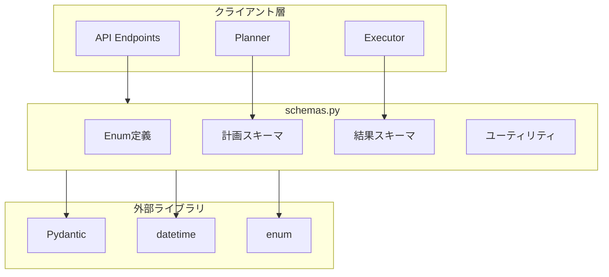
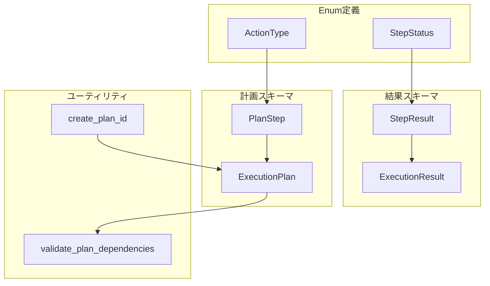
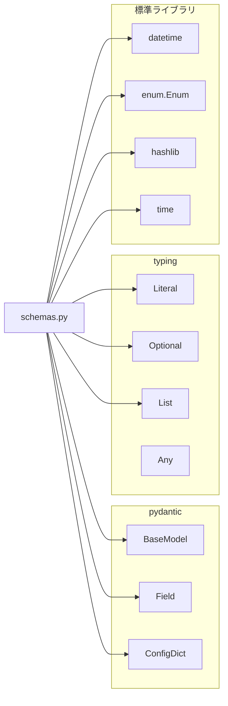
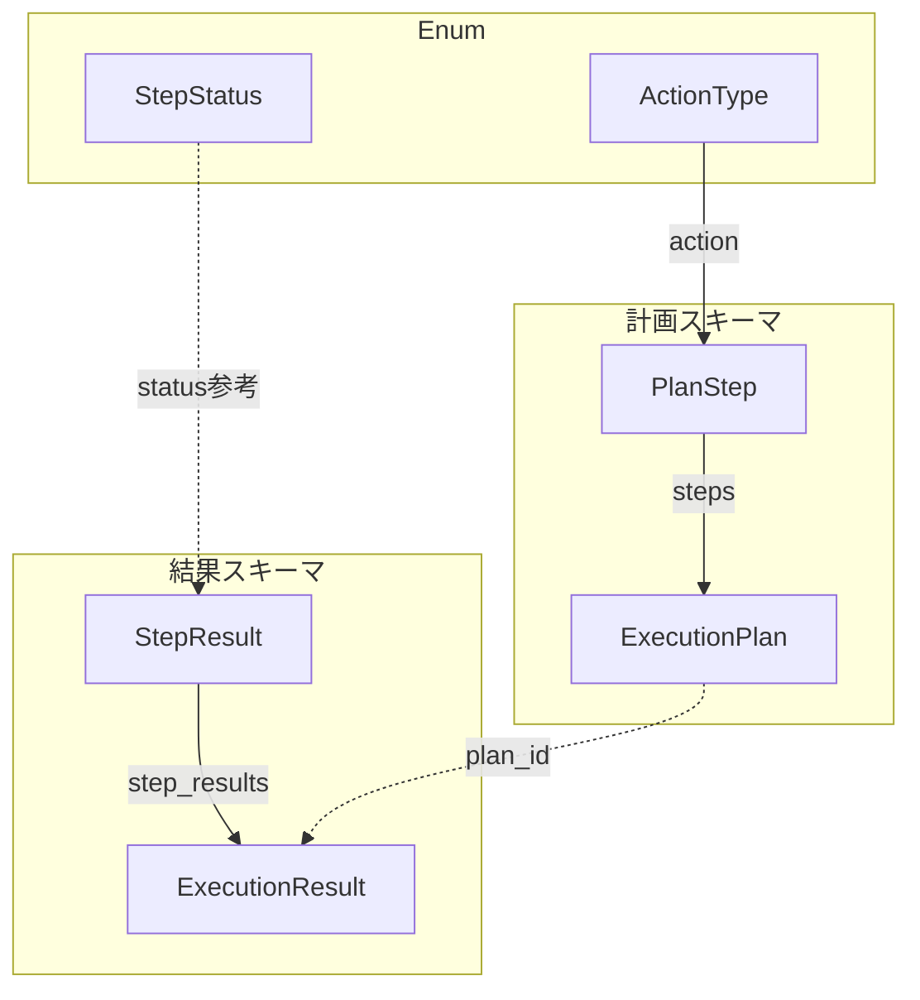

# schemas.py - GRACE Pydanticスキーマ定義 ドキュメント

**Version 1.0** | 最終更新: 2025-01-29

---

## 目次

1. [概要](#概要)
2. [アーキテクチャ構成図](#1-アーキテクチャ構成図)
3. [モジュール構成図](#2-モジュール構成図)
4. [クラス・関数一覧表](#3-クラス関数一覧表)
5. [クラス・関数 IPO詳細](#4-クラス関数-ipo詳細)
6. [設定・定数](#5-設定定数)
7. [使用例](#6-使用例)
8. [エクスポート](#7-エクスポート)
9. [変更履歴](#8-変更履歴)
10. [付録: 依存関係図](#付録-依存関係図)

---

## 概要

`schemas.py`は、GRACEシステムの計画生成・実行に使用するPydanticデータモデルを定義するモジュールです。実行計画（ExecutionPlan）、ステップ（PlanStep）、実行結果（ExecutionResult, StepResult）のスキーマを提供し、型安全なデータ操作を実現します。

### 主な責務

- アクション種別（ActionType）とステップ状態（StepStatus）のEnum定義
- 計画スキーマ（PlanStep, ExecutionPlan）の定義
- 実行結果スキーマ（StepResult, ExecutionResult）の定義
- 計画ID生成と依存関係検証のユーティリティ提供

### 主要機能一覧

| 機能 | 説明 |
|------|------|
| `ActionType` | 実行可能なアクション種別のEnum |
| `StepStatus` | ステップ実行状態のEnum |
| `PlanStep` | 計画の1ステップを表現するPydanticモデル |
| `ExecutionPlan` | 実行計画全体を表現するPydanticモデル |
| `StepResult` | ステップ実行結果のPydanticモデル |
| `ExecutionResult` | 計画全体の実行結果のPydanticモデル |
| `create_plan_id()` | 一意の計画IDを生成するユーティリティ関数 |
| `validate_plan_dependencies()` | 計画の依存関係を検証するユーティリティ関数 |

---

## 1. アーキテクチャ構成図

### 1.1 システム全体構成



### 1.2 データフロー

1. Plannerが`ExecutionPlan`と`PlanStep`を使用して計画を生成
2. Executorが計画を受け取り、各ステップを実行
3. 実行結果を`StepResult`として記録
4. 全体の実行結果を`ExecutionResult`として返却

---

## 2. モジュール構成図

### 2.1 内部モジュール構成



### 2.2 外部依存関係

| ライブラリ | バージョン | 用途 |
|-----------|-----------|------|
| `pydantic` | >= 2.0 | データモデル定義、バリデーション |

### 2.3 内部依存モジュール

| モジュール | 用途 |
|-----------|------|
| `typing` | 型ヒント（Literal, Optional, List, Any） |
| `datetime` | 日時処理 |
| `enum` | Enum基底クラス |
| `hashlib` | 計画ID生成用ハッシュ |

---

## 3. クラス・関数一覧表

### 3.1 Enumクラス一覧

#### ActionType

| 値 | 説明 |
|-----|------|
| `RAG_SEARCH` | RAGベクトル検索 |
| `WEB_SEARCH` | Web検索 |
| `REASONING` | 推論処理 |
| `ASK_USER` | ユーザーへの質問 |
| `CODE_EXECUTE` | コード実行 |

#### StepStatus

| 値 | 説明 |
|-----|------|
| `PENDING` | 待機中 |
| `RUNNING` | 実行中 |
| `SUCCESS` | 成功 |
| `PARTIAL` | 部分成功 |
| `FAILED` | 失敗 |
| `SKIPPED` | スキップ |

### 3.2 Pydanticモデル一覧

#### PlanStep

| フィールド | 型 | 説明 |
|-----------|-----|------|
| `step_id` | `int` | ステップ番号（1から開始） |
| `action` | `Literal[...]` | 実行するアクション種別 |
| `description` | `str` | ステップの説明 |
| `query` | `Optional[str]` | 検索クエリ |
| `collection` | `Optional[str]` | 検索対象コレクション |
| `depends_on` | `List[int]` | 依存する先行ステップID |
| `expected_output` | `str` | 期待される出力の説明 |
| `fallback` | `Optional[str]` | 失敗時の代替アクション |
| `timeout_seconds` | `Optional[int]` | タイムアウト秒数 |

#### ExecutionPlan

| フィールド | 型 | 説明 |
|-----------|-----|------|
| `original_query` | `str` | ユーザーの元の質問 |
| `complexity` | `float` | 推定複雑度（0.0-1.0） |
| `estimated_steps` | `int` | 推定ステップ数 |
| `requires_confirmation` | `bool` | 実行前確認の要否 |
| `steps` | `List[PlanStep]` | 実行ステップのリスト |
| `success_criteria` | `str` | 計画成功の判定基準 |
| `created_at` | `Optional[datetime]` | 計画作成日時 |
| `plan_id` | `Optional[str]` | 計画ID |

#### StepResult

| フィールド | 型 | 説明 |
|-----------|-----|------|
| `step_id` | `int` | ステップID |
| `status` | `Literal[...]` | 実行結果ステータス |
| `output` | `Optional[str]` | 出力内容 |
| `confidence` | `float` | 信頼度スコア（0.0-1.0） |
| `sources` | `List[str]` | 引用ソース |
| `error` | `Optional[str]` | エラーメッセージ |
| `execution_time_ms` | `Optional[int]` | 実行時間（ミリ秒） |
| `token_usage` | `Optional[dict]` | トークン使用量 |
| `created_at` | `Optional[datetime]` | 結果作成日時 |

#### ExecutionResult

| フィールド | 型 | 説明 |
|-----------|-----|------|
| `plan_id` | `str` | 計画ID |
| `original_query` | `str` | 元のクエリ |
| `final_answer` | `Optional[str]` | 最終回答 |
| `step_results` | `List[StepResult]` | 各ステップの結果 |
| `overall_confidence` | `float` | 全体の信頼度 |
| `overall_status` | `Literal[...]` | 全体のステータス |
| `replan_count` | `int` | リプラン回数 |
| `total_execution_time_ms` | `Optional[int]` | 総実行時間（ミリ秒） |
| `total_token_usage` | `Optional[dict]` | 総トークン使用量 |
| `total_cost_usd` | `Optional[float]` | 総コスト（USD） |
| `created_at` | `Optional[datetime]` | 結果作成日時 |

### 3.3 ユーティリティ関数一覧

| 関数名 | 概要 |
|-------|------|
| `create_plan_id()` | 一意の計画IDを生成 |
| `validate_plan_dependencies(plan)` | 計画の依存関係を検証 |

---

## 4. クラス・関数 IPO詳細

### 4.1 ActionType Enum

**概要**: 実行可能なアクション種別を定義するEnum。文字列ベースで、JSONシリアライズに対応。

```python
class ActionType(str, Enum):
    RAG_SEARCH = "rag_search"
    WEB_SEARCH = "web_search"
    REASONING = "reasoning"
    ASK_USER = "ask_user"
    CODE_EXECUTE = "code_execute"
```

| 値 | 文字列値 | 用途 |
|-----|---------|------|
| `RAG_SEARCH` | `"rag_search"` | Qdrantベクトルデータベースでの検索 |
| `WEB_SEARCH` | `"web_search"` | インターネット検索 |
| `REASONING` | `"reasoning"` | LLMによる推論処理 |
| `ASK_USER` | `"ask_user"` | ユーザーへの確認・質問 |
| `CODE_EXECUTE` | `"code_execute"` | Pythonコードの実行 |

```python
# 使用例
from schemas import ActionType

action = ActionType.RAG_SEARCH
print(action.value)  # 出力: "rag_search"
print(action == "rag_search")  # 出力: True
```

---

### 4.2 StepStatus Enum

**概要**: ステップの実行状態を定義するEnum。状態遷移の管理に使用。

```python
class StepStatus(str, Enum):
    PENDING = "pending"
    RUNNING = "running"
    SUCCESS = "success"
    PARTIAL = "partial"
    FAILED = "failed"
    SKIPPED = "skipped"
```

| 値 | 文字列値 | 説明 |
|-----|---------|------|
| `PENDING` | `"pending"` | 実行待ち |
| `RUNNING` | `"running"` | 実行中 |
| `SUCCESS` | `"success"` | 正常完了 |
| `PARTIAL` | `"partial"` | 部分的に成功 |
| `FAILED` | `"failed"` | 失敗 |
| `SKIPPED` | `"skipped"` | スキップされた |

```python
# 使用例
from schemas import StepStatus

status = StepStatus.SUCCESS
print(status.value)  # 出力: "success"
```

---

### 4.3 PlanStep クラス

**概要**: 計画の1ステップを表現するPydanticモデル。アクション、依存関係、タイムアウト等を含む。

```python
class PlanStep(BaseModel):
    step_id: int = Field(..., description="ステップ番号（1から開始）", ge=1)
    action: Literal["rag_search", "web_search", "reasoning", "ask_user", "code_execute", "run_legacy_agent"]
    description: str = Field(..., description="このステップで何をするか", min_length=1)
    query: Optional[str] = Field(None, description="検索クエリ（検索系アクションの場合）")
    collection: Optional[str] = Field(None, description="検索対象コレクション（RAG検索の場合）")
    depends_on: List[int] = Field(default_factory=list, description="依存する先行ステップのID")
    expected_output: str = Field(..., description="期待される出力の説明")
    fallback: Optional[str] = Field(None, description="失敗時の代替アクション")
    timeout_seconds: Optional[int] = Field(30, description="タイムアウト秒数", ge=1, le=300)
```

| 項目 | 内容 |
|------|------|
| **Input** | 各フィールドの値（`step_id`, `action`, `description`等） |
| **Process** | Pydanticによるバリデーション（型チェック、範囲チェック） |
| **Output** | `PlanStep`インスタンス |

**フィールド詳細**:

| フィールド | 型 | 必須 | デフォルト | 制約 |
|-----------|-----|:----:|-----------|------|
| `step_id` | `int` | ✅ | - | >= 1 |
| `action` | `Literal` | ✅ | - | 指定値のみ |
| `description` | `str` | ✅ | - | 1文字以上 |
| `query` | `Optional[str]` | - | `None` | - |
| `collection` | `Optional[str]` | - | `None` | - |
| `depends_on` | `List[int]` | - | `[]` | - |
| `expected_output` | `str` | ✅ | - | - |
| `fallback` | `Optional[str]` | - | `None` | - |
| `timeout_seconds` | `Optional[int]` | - | `30` | 1-300 |

**戻り値例**:

```python
{
    "step_id": 1,
    "action": "rag_search",
    "description": "関連ドキュメントを検索",
    "query": "Pythonの非同期処理について",
    "collection": "tech_docs",
    "depends_on": [],
    "expected_output": "非同期処理に関する技術文書",
    "fallback": "web_search",
    "timeout_seconds": 30
}
```

```python
# 使用例
from schemas import PlanStep

step = PlanStep(
    step_id=1,
    action="rag_search",
    description="関連ドキュメントを検索",
    query="Pythonの非同期処理",
    collection="tech_docs",
    expected_output="非同期処理に関する技術文書"
)
print(step.model_dump())
```

---

### 4.4 ExecutionPlan クラス

**概要**: 実行計画全体を表現するPydanticモデル。複数のステップ、複雑度、成功基準等を含む。

```python
class ExecutionPlan(BaseModel):
    original_query: str = Field(..., description="ユーザーの元の質問", min_length=1)
    complexity: float = Field(..., ge=0.0, le=1.0, description="推定複雑度（0.0-1.0）")
    estimated_steps: int = Field(..., description="推定ステップ数", ge=1, le=20)
    requires_confirmation: bool = Field(..., description="実行前に確認が必要か")
    steps: List[PlanStep] = Field(..., description="実行ステップのリスト", min_length=1)
    success_criteria: str = Field(..., description="計画成功の判定基準")
    created_at: Optional[datetime] = Field(default_factory=datetime.now, description="計画作成日時")
    plan_id: Optional[str] = Field(None, description="計画ID（自動生成）")
```

| 項目 | 内容 |
|------|------|
| **Input** | 各フィールドの値（`original_query`, `complexity`, `steps`等） |
| **Process** | 1. Pydanticによるバリデーション<br>2. ネストされたPlanStepの検証<br>3. 範囲チェック（complexity: 0.0-1.0, estimated_steps: 1-20） |
| **Output** | `ExecutionPlan`インスタンス |

**フィールド詳細**:

| フィールド | 型 | 必須 | デフォルト | 制約 |
|-----------|-----|:----:|-----------|------|
| `original_query` | `str` | ✅ | - | 1文字以上 |
| `complexity` | `float` | ✅ | - | 0.0-1.0 |
| `estimated_steps` | `int` | ✅ | - | 1-20 |
| `requires_confirmation` | `bool` | ✅ | - | - |
| `steps` | `List[PlanStep]` | ✅ | - | 1要素以上 |
| `success_criteria` | `str` | ✅ | - | - |
| `created_at` | `Optional[datetime]` | - | `datetime.now()` | - |
| `plan_id` | `Optional[str]` | - | `None` | - |

**戻り値例**:

```python
{
    "original_query": "Pythonの非同期処理について教えて",
    "complexity": 0.6,
    "estimated_steps": 3,
    "requires_confirmation": False,
    "steps": [
        {
            "step_id": 1,
            "action": "rag_search",
            "description": "技術文書を検索",
            "query": "Python async await",
            "collection": "tech_docs",
            "depends_on": [],
            "expected_output": "非同期処理の解説文書",
            "fallback": None,
            "timeout_seconds": 30
        },
        {
            "step_id": 2,
            "action": "reasoning",
            "description": "検索結果を統合して回答を生成",
            "query": None,
            "collection": None,
            "depends_on": [1],
            "expected_output": "ユーザーへの回答文",
            "fallback": None,
            "timeout_seconds": 60
        }
    ],
    "success_criteria": "非同期処理の概念と使用方法が説明できている",
    "created_at": "2025-01-29T10:30:00",
    "plan_id": "abc123def456"
}
```

```python
# 使用例
from schemas import ExecutionPlan, PlanStep, create_plan_id

plan = ExecutionPlan(
    original_query="Pythonの非同期処理について教えて",
    complexity=0.6,
    estimated_steps=2,
    requires_confirmation=False,
    steps=[
        PlanStep(
            step_id=1,
            action="rag_search",
            description="技術文書を検索",
            query="Python async await",
            expected_output="非同期処理の解説文書"
        ),
        PlanStep(
            step_id=2,
            action="reasoning",
            description="回答を生成",
            depends_on=[1],
            expected_output="ユーザーへの回答文"
        )
    ],
    success_criteria="非同期処理の概念が説明できている",
    plan_id=create_plan_id()
)
print(plan.model_dump_json(indent=2))
```

---

### 4.5 StepResult クラス

**概要**: ステップ実行結果を表現するPydanticモデル。出力、信頼度、エラー情報等を含む。

```python
class StepResult(BaseModel):
    step_id: int = Field(..., description="ステップID")
    status: Literal["success", "partial", "failed"] = Field(..., description="実行結果ステータス")
    output: Optional[str] = Field(None, description="出力内容")
    confidence: float = Field(..., ge=0.0, le=1.0, description="信頼度スコア（0.0-1.0）")
    sources: List[str] = Field(default_factory=list, description="引用ソース")
    error: Optional[str] = Field(None, description="エラーメッセージ（失敗時）")
    execution_time_ms: Optional[int] = Field(None, description="実行時間（ミリ秒）")
    token_usage: Optional[dict] = Field(None, description="トークン使用量")
    created_at: Optional[datetime] = Field(default_factory=datetime.now, description="結果作成日時")
```

| 項目 | 内容 |
|------|------|
| **Input** | 各フィールドの値（`step_id`, `status`, `output`等） |
| **Process** | Pydanticによるバリデーション（型チェック、範囲チェック） |
| **Output** | `StepResult`インスタンス |

**戻り値例**:

```python
{
    "step_id": 1,
    "status": "success",
    "output": "Pythonの非同期処理は、asyncioモジュールを使用して...",
    "confidence": 0.85,
    "sources": ["tech_docs/async_guide.md", "tech_docs/python_concurrent.md"],
    "error": None,
    "execution_time_ms": 1250,
    "token_usage": {"input": 150, "output": 320},
    "created_at": "2025-01-29T10:30:05"
}
```

```python
# 使用例
from schemas import StepResult

result = StepResult(
    step_id=1,
    status="success",
    output="Pythonの非同期処理は...",
    confidence=0.85,
    sources=["tech_docs/async_guide.md"],
    execution_time_ms=1250
)
print(result.model_dump())
```

---

### 4.6 ExecutionResult クラス

**概要**: 計画全体の実行結果を表現するPydanticモデル。最終回答、全ステップ結果、コスト情報等を含む。

```python
class ExecutionResult(BaseModel):
    plan_id: str = Field(..., description="計画ID")
    original_query: str = Field(..., description="元のクエリ")
    final_answer: Optional[str] = Field(None, description="最終回答")
    step_results: List[StepResult] = Field(default_factory=list, description="各ステップの結果")
    overall_confidence: float = Field(..., ge=0.0, le=1.0, description="全体の信頼度")
    overall_status: Literal["success", "partial", "failed", "cancelled"] = Field(..., description="全体のステータス")
    replan_count: int = Field(0, description="リプラン回数")
    total_execution_time_ms: Optional[int] = Field(None, description="総実行時間（ミリ秒）")
    total_token_usage: Optional[dict] = Field(None, description="総トークン使用量")
    total_cost_usd: Optional[float] = Field(None, description="総コスト（USD）")
    created_at: Optional[datetime] = Field(default_factory=datetime.now, description="結果作成日時")
```

| 項目 | 内容 |
|------|------|
| **Input** | 各フィールドの値（`plan_id`, `original_query`, `step_results`等） |
| **Process** | 1. Pydanticによるバリデーション<br>2. ネストされたStepResultの検証 |
| **Output** | `ExecutionResult`インスタンス |

**戻り値例**:

```python
{
    "plan_id": "abc123def456",
    "original_query": "Pythonの非同期処理について教えて",
    "final_answer": "Pythonの非同期処理は、asyncioモジュールを使用して...",
    "step_results": [
        {
            "step_id": 1,
            "status": "success",
            "output": "関連文書を3件取得",
            "confidence": 0.9,
            "sources": ["doc1.md", "doc2.md"],
            "error": None,
            "execution_time_ms": 800,
            "token_usage": None,
            "created_at": "2025-01-29T10:30:05"
        }
    ],
    "overall_confidence": 0.85,
    "overall_status": "success",
    "replan_count": 0,
    "total_execution_time_ms": 2500,
    "total_token_usage": {"input": 500, "output": 800},
    "total_cost_usd": 0.0023,
    "created_at": "2025-01-29T10:30:10"
}
```

```python
# 使用例
from schemas import ExecutionResult, StepResult

result = ExecutionResult(
    plan_id="abc123def456",
    original_query="Pythonの非同期処理について教えて",
    final_answer="Pythonの非同期処理は...",
    step_results=[
        StepResult(
            step_id=1,
            status="success",
            output="関連文書を3件取得",
            confidence=0.9
        )
    ],
    overall_confidence=0.85,
    overall_status="success",
    total_execution_time_ms=2500
)
print(result.model_dump_json(indent=2))
```

---

### 4.7 ユーティリティ関数

#### `create_plan_id`

**概要**: 一意の計画IDを生成する。MD5ハッシュを使用して12文字のIDを生成。

```python
def create_plan_id() -> str
```

| 項目 | 内容 |
|------|------|
| **Input** | なし |
| **Process** | 1. 現在時刻とオブジェクトIDから一意の文字列を生成<br>2. MD5ハッシュを計算<br>3. 先頭12文字を抽出 |
| **Output** | `str`: 12文字の計画ID |

**戻り値例**:

```python
"abc123def456"
```

```python
# 使用例
from schemas import create_plan_id

plan_id = create_plan_id()
print(plan_id)  # 出力: "abc123def456" (例)
```

---

#### `validate_plan_dependencies`

**概要**: 計画の依存関係を検証する。存在しない依存先や循環依存をチェック。

```python
def validate_plan_dependencies(plan: ExecutionPlan) -> List[str]
```

| パラメータ | 型 | デフォルト | 説明 |
|------------|------|-----------|------|
| `plan` | `ExecutionPlan` | - | 検証対象の計画 |

| 項目 | 内容 |
|------|------|
| **Input** | `plan: ExecutionPlan` |
| **Process** | 1. 全ステップIDの集合を作成<br>2. 各ステップの依存先をチェック<br>3. 存在しない依存先をエラーとして記録<br>4. 後方依存（循環依存）をエラーとして記録 |
| **Output** | `List[str]`: エラーメッセージのリスト（空なら問題なし） |

**戻り値例**:

```python
# 問題なしの場合
[]

# エラーがある場合
[
    "Step 2: 存在しない依存先 5",
    "Step 3: 循環依存または後方依存 4"
]
```

```python
# 使用例
from schemas import ExecutionPlan, PlanStep, validate_plan_dependencies

plan = ExecutionPlan(
    original_query="テスト",
    complexity=0.5,
    estimated_steps=2,
    requires_confirmation=False,
    steps=[
        PlanStep(step_id=1, action="reasoning", description="ステップ1", expected_output="出力1"),
        PlanStep(step_id=2, action="reasoning", description="ステップ2", depends_on=[1], expected_output="出力2"),
    ],
    success_criteria="完了"
)

errors = validate_plan_dependencies(plan)
if errors:
    print("依存関係エラー:", errors)
else:
    print("依存関係は正常です")
```

---

## 5. 設定・定数

本モジュールには外部から参照可能な設定・定数はありません。

Enumの値は以下の通りです：

### 5.1 ActionType の値

| 定数名 | 値 |
|-------|-----|
| `ActionType.RAG_SEARCH` | `"rag_search"` |
| `ActionType.WEB_SEARCH` | `"web_search"` |
| `ActionType.REASONING` | `"reasoning"` |
| `ActionType.ASK_USER` | `"ask_user"` |
| `ActionType.CODE_EXECUTE` | `"code_execute"` |

### 5.2 StepStatus の値

| 定数名 | 値 |
|-------|-----|
| `StepStatus.PENDING` | `"pending"` |
| `StepStatus.RUNNING` | `"running"` |
| `StepStatus.SUCCESS` | `"success"` |
| `StepStatus.PARTIAL` | `"partial"` |
| `StepStatus.FAILED` | `"failed"` |
| `StepStatus.SKIPPED` | `"skipped"` |

---

## 6. 使用例

### 6.1 基本的なワークフロー

```python
from schemas import (
    ExecutionPlan,
    PlanStep,
    ExecutionResult,
    StepResult,
    create_plan_id,
    validate_plan_dependencies,
)

# 1. 計画を作成
plan = ExecutionPlan(
    original_query="機械学習の基礎について教えて",
    complexity=0.7,
    estimated_steps=3,
    requires_confirmation=False,
    steps=[
        PlanStep(
            step_id=1,
            action="rag_search",
            description="機械学習の基礎文書を検索",
            query="機械学習 基礎 入門",
            collection="ml_docs",
            expected_output="機械学習の基礎に関する文書"
        ),
        PlanStep(
            step_id=2,
            action="web_search",
            description="最新のトレンドを検索",
            query="machine learning trends 2025",
            depends_on=[1],
            expected_output="最新トレンド情報"
        ),
        PlanStep(
            step_id=3,
            action="reasoning",
            description="情報を統合して回答を生成",
            depends_on=[1, 2],
            expected_output="ユーザーへの包括的な回答"
        ),
    ],
    success_criteria="機械学習の基礎概念と最新トレンドが説明できている",
    plan_id=create_plan_id()
)

# 2. 依存関係を検証
errors = validate_plan_dependencies(plan)
if errors:
    raise ValueError(f"計画エラー: {errors}")

# 3. 計画をJSONに変換（API送信用）
plan_json = plan.model_dump_json(indent=2)
print(plan_json)
```

### 6.2 実行結果の記録

```python
from schemas import ExecutionResult, StepResult

# ステップ結果を記録
step_results = [
    StepResult(
        step_id=1,
        status="success",
        output="関連文書を5件取得しました",
        confidence=0.9,
        sources=["ml_docs/basics.md", "ml_docs/intro.md"],
        execution_time_ms=1200
    ),
    StepResult(
        step_id=2,
        status="success",
        output="2025年のトレンド情報を取得",
        confidence=0.85,
        sources=["https://example.com/ml-trends"],
        execution_time_ms=2500
    ),
    StepResult(
        step_id=3,
        status="success",
        output="機械学習は、データからパターンを学習する...",
        confidence=0.88,
        sources=[],
        execution_time_ms=3000
    ),
]

# 全体結果を作成
result = ExecutionResult(
    plan_id="abc123def456",
    original_query="機械学習の基礎について教えて",
    final_answer="機械学習は、データからパターンを学習するAI技術です...",
    step_results=step_results,
    overall_confidence=0.87,
    overall_status="success",
    replan_count=0,
    total_execution_time_ms=6700,
    total_token_usage={"input": 800, "output": 1200},
    total_cost_usd=0.0045
)

print(result.model_dump_json(indent=2))
```

---

## 7. エクスポート

`__all__`でエクスポートされる要素：

```python
__all__ = [
    # Enums
    "ActionType",
    "StepStatus",

    # Plan schemas
    "PlanStep",
    "ExecutionPlan",

    # Result schemas
    "StepResult",
    "ExecutionResult",

    # Utilities
    "create_plan_id",
    "validate_plan_dependencies",
]
```

---

## 8. 変更履歴

| バージョン | 日付 | 変更内容 |
|-----------|------|---------|
| 1.0 | 2025-01-29 | 初版作成 |

---

## 付録: 依存関係図



---

## 付録: スキーマ関係図


