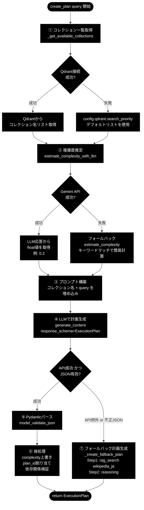

# test_planner_create_plan.md — テスト仕様書

## 1. テスト対象

| 項目 | 内容 |
|---|---|
| テストファイル | `test_planner_create_plan.py` |
| テスト対象クラス | `grace.planner.Planner` |
| テスト対象メソッド | `create_plan()`, `estimate_complexity_with_llm()`, `refine_plan()` |
| 関連ファイル | `planner.py`, `schemas.py`, `config.py`, `tools.py`, `prompts.py` |

---

## 2. Planner の責務

Planner の仕事は **「ユーザーのクエリを受け取り、ExecutionPlan（設計図）を返す」** ことである。
実際に rag_search を実行したり、回答を生成するのは Executor の責務であり、Planner は関与しない。

```
ユーザークエリ
    │
    ▼
┌─────────────┐     ExecutionPlan (JSONデータ)     ┌─────────────┐
│   Planner   │ ──────────────────────────────────▶│  Executor   │
│  (計画生成)  │   steps: [                         │  (計画実行)  │
│             │     {action: "rag_search", ...},   │             │
│             │     {action: "reasoning", ...}     │             │
│             │   ]                                │             │
└─────────────┘                                    └─────────────┘
  ↑ 今回のテスト対象                                  ↑ テスト対象外
```

---

## 2.1 Planner の処理の流れ（create_plan）



### フロー要約

| ステップ | 処理 | API呼び出し | 失敗時 |
|---|---|---|---|
| ① | コレクション一覧取得 | なし（Qdrant接続） | デフォルトリストで続行 |
| ② | 複雑度推定 | ★ Gemini API（1回目） | キーワードマッチにフォールバック |
| ③ | プロンプト構築 | なし | — |
| ④ | LLMで計画生成 | ★ Gemini API（2回目） | フォールバック計画を返却 |
| ⑤ | Pydanticパース | なし | フォールバック計画を返却 |
| ⑥ | 後処理（complexity上書き等） | なし | — |

**実APIが呼ばれるのは ② と ④ の2回。**
**どの段階で失敗しても、必ず ExecutionPlan が返る設計になっている。**

---

## 3. 利用可能なアクション

`planner.py` の `PLAN_GENERATION_PROMPT`（L31〜79）にプロンプト文字列として定義されている。
Python のリストや設定ファイルではなく、**LLMへのプロンプト指示としてハードコード**されている。
```python
class ToolsConfig(BaseModel):
    """ツール設定"""
    enabled: list = Field(
        default_factory=lambda: ["rag_search", "reasoning", "ask_user"]
    )
    #                              ↑ web_search が含まれていない
```
と言うことは、
```
【利用可能なアクション】
- rag_search: ベクトルDB（Qdrant）から関連情報を検索
- reasoning:  収集した情報を分析・統合して回答を生成
- ask_user:   ユーザーに追加情報や確認を求める
```
tools.py — ToolRegistry の登録処理
```python
def _register_default_tools(self):
    enabled_tools = self.config.tools.enabled  # ["rag_search", "reasoning", "ask_user"]

    if "rag_search" in enabled_tools:
        self.register(RAGSearchTool(...))
    if "reasoning" in enabled_tools:
        self.register(ReasoningTool(...))
    if "ask_user" in enabled_tools:
        self.register(AskUserTool())

    # ↑ web_search の登録処理自体が存在しない
```

web_search を有効にするには
将来的に使いたい場合、以下の4箇所を追加する必要があります：

- tools.py に WebSearchTool クラスを実装
- tools.py の _register_default_tools に登録処理を追加
- config.py の ToolsConfig.enabled に "web_search" を追加
- planner.py の PLAN_GENERATION_PROMPT に web_search の説明を追加

### バリデーション構造

```
┌─────────────────────────────────────────────────┐
│ PLAN_GENERATION_PROMPT（プロンプト文字列）        │ ← LLMへの指示（3種類）
│   「rag_search, reasoning, ask_user が使えるよ」 │
└──────────────────┬──────────────────────────────┘
                   ▼
         Gemini API に送信
                   ▼
         LLMが ExecutionPlan JSON を生成
                   ▼
┌─────────────────────────────────────────────────┐
│ PlanStep.action の Literal 型制約（schemas.py）   │ ← バリデーション（6種類許容）
│   "rag_search" | "web_search" | "reasoning"      │
│   | "ask_user" | "code_execute" | "run_legacy_agent" │
└─────────────────────────────────────────────────┘
```

プロンプトでは3つしか案内していないが、schemas.py は6種類を許容する。
LLMがプロンプト指示に従えば3つしか使わない。

### LLMが生成しうるステップパターン

**典型パターン（大半のケース）**

```
Step 1: rag_search  → 検索
Step 2: reasoning   → 回答生成（最終）
```

**例外パターン（曖昧な質問の場合）**

```
Step 1: ask_user    → 「どの意味ですか？」とユーザーに確認
Step 2: rag_search  → 確認結果を元に検索
Step 3: reasoning   → 回答生成（最終）
```

**確実に言えること:**

- 最終ステップは必ず `reasoning`（プロンプトで明示指示）
- `rag_search` は原則1つにまとめる（プロンプトで指示）
- `ask_user` が入る可能性がある（曖昧なクエリの場合）

---

## 4. モック方針（最小限）

| モック対象 | モック内容 | 理由 |
|---|---|---|
| `grace.planner.QdrantClient` | 接続しない | Qdrantサーバー不要にする |
| `grace.planner.get_all_collections` | 固定3コレクション返却 | 同上 |
| `grace.planner.KeywordExtractor` | `extract()` が空リスト返却 | MeCab環境依存を排除 |

**モックしないもの:**

| 対象 | 理由 |
|---|---|
| `genai.Client()`（Gemini API） | 実APIコールでテストする方針 |
| `services.prompts.SEARCH_QUERY_INSTRUCTION` | そのままimport |

---

## 5. TC-01 の処理の流れ（詳細）

```python
def test_tc01_simple_query_returns_execution_plan(self, planner):
    query = "Pythonとは何ですか？"
    plan = planner.create_plan(query)
```

### テスト準備（フィクスチャ）

```
① grace_config フィクスチャ
   └→ GraceConfig(llm=..., qdrant=...) を生成

② planner フィクスチャ
   ├→ QdrantClient をモック（接続しない）
   ├→ get_all_collections をモック → 固定3コレクション返却
   ├→ KeywordExtractor をモック（MeCab不要）
   └→ Planner(config=grace_config) を生成
       └→ genai.Client() は本物（実API接続）
```

### create_plan(query) の内部処理

```
③ _get_available_collections()
   └→ モックの get_all_collections が呼ばれる
   └→ ["wikipedia_ja", "livedoor", "cc_news"] を返す

④ estimate_complexity_with_llm(query)     ★ 1回目のAPI呼び出し
   ├→ プロンプト: 「この質問の複雑度を0.0〜1.0で評価して」
   ├→ Gemini API に送信（実API）
   └→ 例: 0.2 が返る

⑤ プロンプト構築
   └→ PLAN_GENERATION_PROMPT に コレクション名 + query を埋め込み

⑥ client.models.generate_content(...)     ★ 2回目のAPI呼び出し
   ├→ response_schema=ExecutionPlan（構造化JSON出力）
   └→ Gemini API が ExecutionPlan 形式のJSON を返す

⑦ ExecutionPlan.model_validate_json(response.text)
   └→ Pydantic でパース・バリデーション

⑧ plan.complexity = estimated_complexity
   └→ ④の値（0.2）で上書き（⑥のJSON内の値は捨てる）

⑨ plan.plan_id = create_plan_id()
   └→ タイムスタンプベースのIDを割り当て

⑩ validate_plan_dependencies(plan)
   └→ depends_on の循環チェック（警告のみ）

⑪ return plan
```

### テストのアサーション

```
⑫ assert isinstance(plan, ExecutionPlan)   → ⑦で成功していればOK
   assert len(plan.steps) >= 1              → ⑥でLLMが生成していればOK
   assert plan.plan_id is not None          → ⑨で設定済み
   assert 0.0 <= plan.complexity <= 1.0     → ④+⑧で保証
```

**実APIが呼ばれるのは ④ と ⑥ の2回。**

---

## 6. estimate_complexity の2つのメソッド

### 一覧

| メソッド | 方式 | 用途 |
|---|---|---|
| `estimate_complexity_with_llm(query)` | Gemini APIに聞く | 本命 |
| `estimate_complexity(query)` | キーワードマッチ | フォールバック用 |

### estimate_complexity（キーワード版）の中身

```python
def estimate_complexity(self, query: str) -> float:
    score = 0.5  # ベーススコア

    # キーワードが含まれていたら加点
    if "比較" in query: score += 0.15
    if "違い" in query: score += 0.15
    if "なぜ" in query: score += 0.1
    # ... 等

    # 長い質問も加点
    if len(query) > 100: score += 0.1

    return min(1.0, score)
```

### 呼び出し関係

```python
def estimate_complexity_with_llm(self, query: str) -> float:
    try:
        # Gemini API で複雑度を推定
        response = self.client.models.generate_content(...)
        complexity = float(response.text.strip())
        return min(1.0, max(0.0, complexity))

    except Exception as e:                          # ← API失敗時
        return self.estimate_complexity(query)       # ← ここで使われる
```

### フロー図

```
estimate_complexity_with_llm(query)
    │
    ├── 正常時 → Gemini APIの回答を使う
    │
    └── API失敗時 → estimate_complexity(query) にフォールバック
                     （キーワードマッチで簡易計算）
```

### estimate_complexity は必要か？

**必要。** Gemini APIがタイムアウトやレート制限で失敗したとき、`create_plan` 全体が落ちないための安全策。API不調でもキーワードベースで「それなりの値」を返せる。

### complexity は後続でどう使われるか

現時点の `create_plan()` 内では **`plan.complexity` に設定されるだけ**。
この値は `ExecutionPlan` に含まれて `Executor` に渡されるので、将来的には：

- 複雑度が高い → ステップ数を多めに許容
- 複雑度が低い → 早期終了でコスト節約
- 複雑度に応じて介入（Phase 3）やリプラン（Phase 4）の閾値を調整

---

## 7. テストケース一覧

### create_plan() のテスト（TC-01〜10）

**返却オブジェクトの構造検証**

- `ExecutionPlan` インスタンスが返ること
- `plan_id` が割り当てられていること
- `plan_id` が呼び出しごとに一意であること
- `original_query` が入力クエリと一致すること

**ステップの妥当性検証**

- ステップが1件以上あること
- 最終ステップが必ず `reasoning` であること（プロンプト指示の遵守）
- 複雑なクエリでは複数ステップが生成されること
- `depends_on` が前方のステップのみを参照していること（循環・後方依存がないこと）

**complexity の検証**

- 値が 0.0〜1.0 の範囲内であること
- LLMが生成したJSON内の値ではなく、`estimate_complexity_with_llm()` の戻り値で上書きされていること

**フォールバック検証**

- Gemini APIがエラーを返した場合 → フォールバック計画（rag_search + reasoning の2ステップ固定）が返ること
- Gemini APIが不正JSONを返した場合 → 同上
- Qdrantコレクション取得に失敗した場合 → 設定ファイルのデフォルトリストで計画生成が継続すること

### estimate_complexity_with_llm() のテスト（TC-11〜14）

- 単純クエリ → 低い値（0.0〜0.4）が返ること
- 複雑クエリ → 高い値（0.5〜1.0）が返ること
- どんな入力でも戻り値が 0.0〜1.0 に収まること
- API失敗時 → キーワードベースの `estimate_complexity()` にフォールバックすること

### refine_plan() のテスト（TC-15〜18）

- フィードバックを元に修正された `ExecutionPlan` が返ること
- 修正計画に新しい `plan_id` が付与されること（元の計画と異なる）
- 修正計画の最終ステップが `reasoning` を維持すること
- API失敗時 → 元の計画がそのまま返ること（plan_id が変わらない）

### テスト対象外（Plannerの責務ではないもの）

- `rag_search` の実行（Executorの責務）
- Qdrantへの検索リクエスト（RAGSearchToolの責務）
- 回答文の生成（ReasoningToolの責務）

---

## 8. テストケース詳細

### TC-01: 単純クエリで ExecutionPlan が正しく返る（正常系）

| 項目 | 内容 |
|---|---|
| INPUT | `query = "Pythonとは何ですか？"` |
| 期待 | `ExecutionPlan` インスタンスが返り、基本フィールドが妥当 |
| 合格条件 | ① `isinstance(result, ExecutionPlan)` ② `len(result.steps) >= 1` ③ `result.plan_id is not None` ④ `0.0 <= result.complexity <= 1.0` |

### TC-02: 複雑クエリで複数ステップが生成される（正常系）

| 項目 | 内容 |
|---|---|
| INPUT | 長く複雑なクエリ（比較・詳細説明・最新トレンド） |
| 合格条件 | ① `len(result.steps) >= 2` ② `result.estimated_steps >= 2` |

### TC-03: 最終ステップが必ず reasoning である（正常系）

| 項目 | 内容 |
|---|---|
| INPUT | `query = "日本の首都はどこですか？"` |
| 根拠 | プロンプトに「最後のステップは必ず reasoning で回答を生成」と指示 |
| 合格条件 | `result.steps[-1].action == "reasoning"` |

### TC-04: depends_on の依存関係が正しい（正常系）

| 項目 | 内容 |
|---|---|
| INPUT | `query = "量子コンピュータの仕組みを説明してください"` |
| 合格条件 | ① `validate_plan_dependencies(plan)` が空リスト ② 各 `depends_on` は自身より小さい `step_id` のみ |

### TC-05: plan_id が一意である（正常系）

| 項目 | 内容 |
|---|---|
| INPUT | 同一クエリで2回呼び出し |
| 合格条件 | `plan1.plan_id != plan2.plan_id` |

### TC-06: complexity が estimate_complexity_with_llm の値で上書きされる（正常系）

| 項目 | 内容 |
|---|---|
| 根拠 | `create_plan()` 内 L195: `plan.complexity = estimated_complexity` |
| 合格条件 | `plan.complexity == estimate_complexity_with_llm の戻り値`（スパイで検証） |

### TC-07: original_query がユーザー入力と一致する（正常系）

| 項目 | 内容 |
|---|---|
| INPUT | `query = "『金色夜叉:尾崎紅葉不如帰:徳富蘆花』の構成者は誰ですか？"` |
| 合格条件 | `result.original_query == query` |

### TC-08: LLM APIエラー → フォールバック計画（異常系）

| 項目 | 内容 |
|---|---|
| 条件 | `generate_content` が `Exception` を送出 |
| 合格条件 | ① `ExecutionPlan` が返る ② `complexity == 0.5` ③ 2ステップ固定 ④ Step1 = `rag_search`(wikipedia_ja) ⑤ Step2 = `reasoning` |

### TC-09: LLMが不正JSON返却 → フォールバック計画（異常系）

| 項目 | 内容 |
|---|---|
| 条件 | `response.text` が壊れたJSON |
| 合格条件 | TC-08 と同様のフォールバック計画 |

### TC-10: コレクション取得失敗 → デフォルトリストで動作（境界値）

| 項目 | 内容 |
|---|---|
| 条件 | `_get_available_collections` 内で例外発生 |
| 根拠 | `planner.py` L254-255: `except → return self.config.qdrant.search_priority` |
| 合格条件 | ① `ExecutionPlan` が正常に返る ② `len(plan.steps) >= 1` |

### TC-11: 単純クエリ → 低い複雑度（正常系）

| 項目 | 内容 |
|---|---|
| INPUT | `query = "Pythonとは？"` |
| 合格条件 | ① `isinstance(result, float)` ② `0.0 <= result <= 0.4` |

### TC-12: 複雑クエリ → 高い複雑度（正常系）

| 項目 | 内容 |
|---|---|
| INPUT | 量子コンピューティングに関する長い複合質問 |
| 合格条件 | `0.5 <= result <= 1.0` |

### TC-13: 戻り値が常に 0.0〜1.0 の範囲（境界値）

| 項目 | 内容 |
|---|---|
| INPUT | 空文字列、極短、極長、英語、キーワード集中 等の複数クエリ |
| 合格条件 | 全てのクエリで `0.0 <= result <= 1.0` |

### TC-14: API失敗 → キーワードベースのフォールバック（異常系）

| 項目 | 内容 |
|---|---|
| 条件 | `generate_content` が例外を送出 |
| 根拠 | `planner.py` L372-374: `except → return self.estimate_complexity(query)` |
| 合格条件 | ① `result == planner.estimate_complexity(query)` ② `0.0 <= result <= 1.0` |

### TC-15: フィードバックで修正された計画が返る（正常系）

| 項目 | 内容 |
|---|---|
| INPUT | `plan` = `create_plan("AIについて教えてください")` の結果、`feedback` = `"もっと技術的な詳細と、具体的な応用例が欲しいです"` |
| 期待 | フィードバックを反映した修正計画が返る |
| 合格条件 | ① `isinstance(result, ExecutionPlan)` ② `len(result.steps) >= 1` ③ `0.0 <= result.complexity <= 1.0` |

### TC-16: 修正計画に新しい plan_id が付与される（正常系）

| 項目 | 内容 |
|---|---|
| INPUT | 初期計画 + フィードバック |
| 根拠 | `planner.py` L423: `refined_plan.plan_id = create_plan_id()` |
| 合格条件 | ① `result.plan_id is not None` ② `result.plan_id != initial_plan.plan_id` |

### TC-17: 修正計画の最終ステップが reasoning を維持する（正常系）

| 項目 | 内容 |
|---|---|
| INPUT | 初期計画 + フィードバック |
| 根拠 | LLMが `ExecutionPlan` スキーマに準拠した構造化出力を行い、計画ルール（最終=reasoning）を踏襲する |
| 合格条件 | `result.steps[-1].action == "reasoning"` |

### TC-18: API失敗 → 元の計画がそのまま返る（異常系）

| 項目 | 内容 |
|---|---|
| 条件 | `generate_content` が例外を送出 |
| 根拠 | `planner.py` L428-430: `except Exception as e → return plan`（元の計画） |
| 合格条件 | ① `result.plan_id == initial_plan.plan_id` ② `result.original_query == initial_plan.original_query` |

---

## 9. 実行方法

```bash
cd <project_root>
GOOGLE_API_KEY=xxxxx pytest test_planner_create_plan.py -v -s
```

### 注意事項

- 実APIを叩くため、テスト1回あたり数秒〜十数秒かかる
- API課金が発生する（少額）
- ネットワーク接続が必要
- `GOOGLE_API_KEY` が未設定の場合、全テストが自動スキップされる
- `scope="module"` で `Planner` インスタンスを共有しているため、正常系テスト群ではAPI初期化は1回のみ
