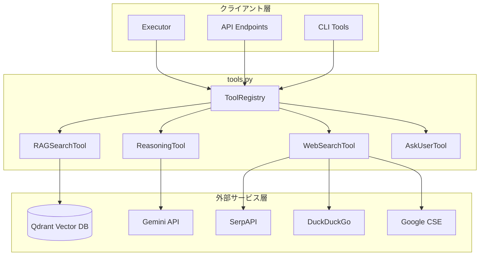
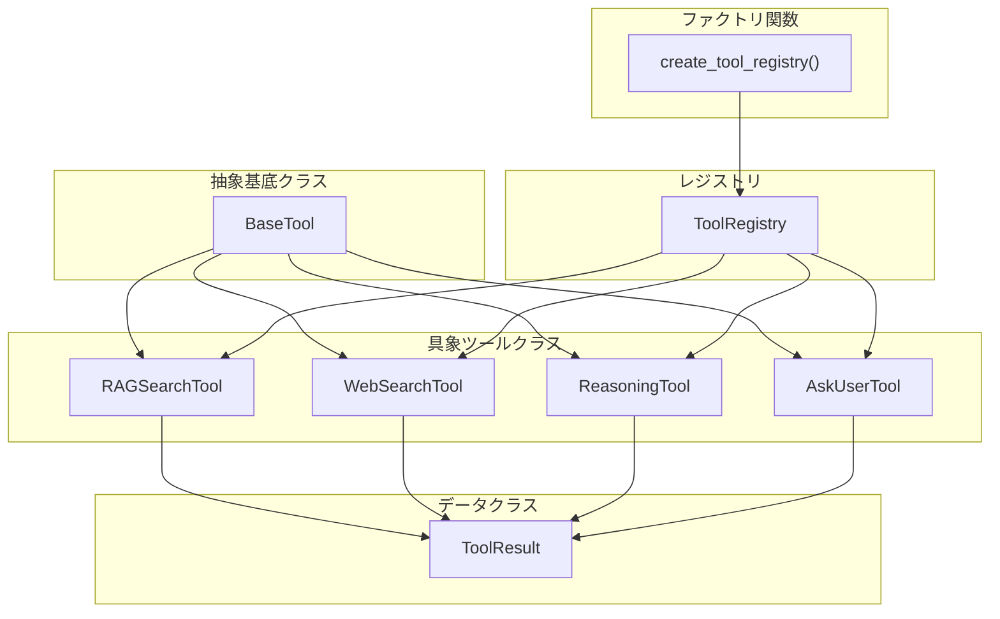
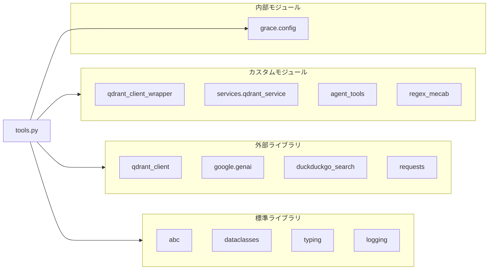
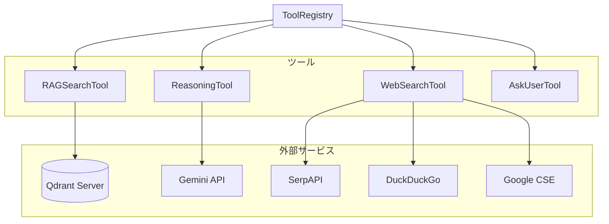

# tools.py - ツール定義モジュール ドキュメント

**Version 2.0** | 最終更新: 2026-02-19

---

## 目次

1. [概要](#概要)
2. [アーキテクチャ構成図](#1-アーキテクチャ構成図)
   - [システム全体構成](#11-システム全体構成)
   - [データフロー](#12-データフロー)
3. [モジュール構成図](#2-モジュール構成図)
   - [内部モジュール構成](#21-内部モジュール構成)
   - [外部依存関係](#22-外部依存関係)
   - [内部依存モジュール](#23-内部依存モジュール)
   - [外部カスタムモジュール依存](#24-外部カスタムモジュール依存)
4. [クラス・関数一覧表](#3-クラス関数一覧表)
   - [データクラス一覧](#31-データクラス一覧)
   - [クラス一覧](#32-クラス一覧)
   - [ファクトリ関数一覧](#33-ファクトリ関数一覧)
5. [クラス・関数 IPO詳細](#4-クラス関数-ipo詳細)
   - [ToolResult データクラス](#41-toolresult-データクラス)
   - [BaseTool クラス（抽象基底）](#42-basetool-クラス抽象基底)
   - [RAGSearchTool クラス](#43-ragsearchtool-クラス)
   - [ReasoningTool クラス](#44-reasoningtool-クラス)
   - [AskUserTool クラス](#45-askusertool-クラス)
   - [WebSearchTool クラス](#46-websearchtool-クラス)
   - [ToolRegistry クラス](#47-toolregistry-クラス)
   - [ファクトリ関数](#48-ファクトリ関数)
6. [外部カスタムモジュール IPO詳細](#5-外部カスタムモジュール-ipo詳細)
   - [qdrant_client_wrapper](#51-qdrant_client_wrapper)
   - [services.qdrant_service](#52-servicesqdrant_service)
   - [agent_tools](#53-agent_tools)
   - [regex_mecab](#54-regex_mecab)
7. [設定・定数](#6-設定定数)
8. [使用例](#7-使用例)
   - [ToolRegistryを使用した基本ワークフロー](#71-toolregistryを使用した基本ワークフロー)
   - [RAG検索の直接実行](#72-rag検索の直接実行)
   - [Web検索の直接実行](#73-web検索の直接実行)
   - [推論ツールの使用](#74-推論ツールの使用)
   - [AskUserToolの使用](#75-askusertoolの使用)
   - [RAG検索 → Web検索フォールバックワークフロー](#76-rag検索--web検索フォールバックワークフロー)
9. [エクスポート](#8-エクスポート)
10. [変更履歴](#9-変更履歴)
11. [付録: 依存関係図](#付録-依存関係図)
12. [関連ドキュメント](#関連ドキュメント)

---

## 概要

`tools.py`は、GRACEエージェントが使用するツール（RAG検索、Web検索、推論、ask_user等）を定義するモジュールです。各ツールは統一されたインターフェース（`BaseTool`）を実装し、`ToolRegistry`を通じて管理・実行されます。

### 主な責務

- ツールの統一インターフェース定義（BaseTool抽象基底クラス）
- RAG検索ツールによるQdrantベクトルDB検索
- Web検索ツールによる外部情報の取得（SerpAPI / DuckDuckGo / Google CSE 切り替え対応）
- LLM推論ツールによる回答生成
- ユーザー質問ツールによるHITL（Human-in-the-Loop）サポート
- ツールレジストリによるツールの一元管理

### 各責務対応のモジュール

| # | 責務 | 対応モジュール | 説明 |
|---|------|--------------|------|
| 1 | ツールの統一インターフェース定義 | `tools.py` | BaseTool抽象基底クラスとToolResultデータクラス |
| 2 | RAG検索ツールによるQdrantベクトルDB検索 | `tools.py` | RAGSearchToolクラス（agent_tools委譲） |
| 3 | Web検索ツールによる外部情報の取得 | `tools.py` | WebSearchToolクラス（SerpAPI/DDG/CSE切り替え） |
| 4 | LLM推論ツールによる回答生成 | `tools.py` | ReasoningToolクラス（Gemini API呼び出し） |
| 5 | ユーザー質問ツールによるHITLサポート | `tools.py` | AskUserToolクラス（Executor連携） |
| 6 | ツールレジストリによるツールの一元管理 | `tools.py` | ToolRegistryクラスとcreate_tool_registry() |

### 主要機能一覧

| 機能 | 説明 |
|------|------|
| `ToolResult` | ツール実行結果を保持するデータクラス |
| `BaseTool` | すべてのツールの抽象基底クラス |
| `RAGSearchTool` | Qdrantベクトルデータベースからの検索 |
| `RAGSearchTool.execute()` | コレクション自動フォールバック付きRAG検索 |
| `WebSearchTool` | Web検索で最新情報を取得（SerpAPI/DDG/CSE対応） |
| `WebSearchTool.execute()` | RAG互換フォーマットでWeb検索結果を返却 |
| `WebSearchTool._search_serpapi()` | SerpAPI検索バックエンド（リトライ1回付き） |
| `WebSearchTool._search_ddg()` | DuckDuckGo検索バックエンド |
| `WebSearchTool._search_google()` | Google CSE検索バックエンド |
| `WebSearchTool._parse_to_rag_format()` | 検索結果をrag_search互換形式に変換 |
| `ReasoningTool` | 検索結果を元にした回答生成 |
| `ReasoningTool.execute()` | LLMによる推論・回答生成 |
| `AskUserTool` | ユーザーへの質問・確認要求 |
| `AskUserTool.execute()` | HITL用の質問情報生成 |
| `ToolRegistry` | ツールの登録・取得・実行を一元管理 |
| `ToolRegistry.execute()` | ツール名を指定した実行 |
| `create_tool_registry()` | ToolRegistryのファクトリ関数 |

---

## 1. アーキテクチャ構成図

### 1.1 システム全体構成



### 1.2 データフロー

**RAG検索フロー**:
1. Executor が `ToolRegistry.execute("rag_search", query=...)` を呼び出し
2. RAGSearchTool がコレクション候補を決定
3. 各コレクションを順次検索（フォールバック付き）
4. 検索結果を `ToolResult` として返却

**Web検索フロー**:
1. Executor が `ToolRegistry.execute("web_search", query=...)` を呼び出し
2. WebSearchTool が設定された検索バックエンド（SerpAPI/DDG/CSE）を使用
3. 検索結果をRAG互換フォーマットに変換
4. `ToolResult` として返却

**推論フロー**:
1. Executor が `ToolRegistry.execute("reasoning", query=..., sources=...)` を呼び出し
2. ReasoningTool がプロンプトを構築
3. Gemini API に送信し回答を生成
4. 生成結果を `ToolResult` として返却

---

## 2. モジュール構成図

### 2.1 内部モジュール構成



### 2.2 外部依存関係

| ライブラリ | バージョン | 用途 |
|-----------|-----------|------|
| `qdrant_client` | - | Qdrantベクトルデータベースクライアント |
| `google-genai` | - | Gemini API クライアント |
| `duckduckgo_search` | - | DuckDuckGo検索（WebSearchTool） |
| `requests` | - | SerpAPI / Google CSE HTTP通信（WebSearchTool） |
| `dataclasses` | 標準 | データクラス定義 |
| `abc` | 標準 | 抽象基底クラス |
| `typing` | 標準 | 型ヒント |
| `logging` | 標準 | ログ出力 |

### 2.3 内部依存モジュール

| モジュール | インポート | 用途 |
|-----------|-----------|------|
| `.config` | `get_config`, `GraceConfig` | 設定管理 |

### 2.4 外部カスタムモジュール依存

| モジュール | インポート | 用途 |
|-----------|-----------|------|
| `qdrant_client_wrapper` | `search_collection`, `embed_query_unified`, `embed_sparse_query_unified` | Qdrant検索ラッパー |
| `services.qdrant_service` | `get_collection_embedding_params` | コレクション情報取得 |
| `agent_tools` | `search_rag_knowledge_base_structured` | Legacy Agent検索ロジック |
| `regex_mecab` | `KeywordExtractor` | キーワード抽出 |

**GraceConfigから使用するサブ設定**:

| サブ設定 | 説明 |
|---------|------|
| `config.qdrant.url` | Qdrant接続URL（デフォルト: http://localhost:6333） |
| `config.qdrant.search_priority` | コレクション検索優先順位リスト |
| `config.llm.model` | 使用するLLMモデル（デフォルト: gemini-3-flash-preview） |
| `config.llm.temperature` | LLM生成時の温度 |
| `config.llm.max_tokens` | 最大出力トークン数 |
| `config.tools.enabled` | 有効なツールリスト |
| `config.web_search.backend` | Web検索バックエンド（serpapi/duckduckgo/google_cse） |
| `config.web_search.num_results` | Web検索取得件数 |
| `config.web_search.language` | Web検索言語 |
| `config.web_search.timeout` | Web検索タイムアウト秒数 |

---

## 3. クラス・関数一覧表

### 3.1 データクラス一覧

#### ToolResult

| フィールド | 型 | デフォルト | 説明 |
|-----------|------|-----------|------|
| `success` | bool | - | 実行成功フラグ |
| `output` | Any | - | 出力内容 |
| `confidence_factors` | Dict[str, Any] | {} | 信頼度計算用の要素 |
| `error` | Optional[str] | None | エラーメッセージ |
| `execution_time_ms` | Optional[int] | None | 実行時間（ミリ秒） |

### 3.2 クラス一覧

#### BaseTool（抽象基底）

| 属性/メソッド | 型/シグネチャ | 説明 |
|-------------|--------------|------|
| `name` | str | ツール名 |
| `description` | str | ツールの説明 |
| `execute(**kwargs)` | → ToolResult | ツール実行（抽象メソッド） |

#### RAGSearchTool

| メソッド | 概要 |
|---------|------|
| `__init__(config, qdrant_url)` | コンストラクタ |
| `client` (property) | Qdrantクライアント取得（遅延初期化） |
| `execute(query, collection, limit, score_threshold)` | RAG検索実行 |
| `_get_all_collections_dynamic()` | 動的コレクション一覧取得 |
| `_calculate_confidence_factors(scores)` | 信頼度要素計算 |

#### WebSearchTool

| メソッド | 概要 |
|---------|------|
| `__init__(config)` | コンストラクタ（バックエンド設定読み込み） |
| `execute(query, num_results, language)` | Web検索実行（RAG互換形式） |
| `_search_serpapi(query, num_results, language)` | SerpAPI検索バックエンド（リトライ1回付き） |
| `_search_ddg(query, num_results, language)` | DuckDuckGo検索バックエンド |
| `_search_google(query, num_results, language)` | Google CSE検索バックエンド |
| `_parse_to_rag_format(raw_results, num_results)` | 検索結果をRAG互換フォーマットに変換 |
| `_calculate_confidence_factors(scores)` | 信頼度要素計算 |

#### ReasoningTool

| メソッド | 概要 |
|---------|------|
| `__init__(config, model_name)` | コンストラクタ |
| `execute(query, context, sources)` | LLM推論実行 |
| `_build_prompt(query, context, sources)` | プロンプト構築 |

#### AskUserTool

| メソッド | 概要 |
|---------|------|
| `FUNCTION_DECLARATION` (class attr) | Gemini Function Calling用定義 |
| `execute(question, reason, urgency, options)` | ユーザー質問実行 |

#### ToolRegistry

| メソッド | 概要 |
|---------|------|
| `__init__(config)` | コンストラクタ |
| `_register_default_tools()` | デフォルトツール登録 |
| `register(tool)` | ツール登録 |
| `get(name)` | ツール取得 |
| `list_tools()` | 登録ツール名リスト |
| `execute(name, **kwargs)` | ツール実行 |

### 3.3 ファクトリ関数一覧

| 関数名 | 概要 |
|-------|------|
| `create_tool_registry(config)` | ToolRegistryインスタンス作成 |

---

## 4. クラス・関数 IPO詳細

### 4.1 ToolResult データクラス

**概要**: ツール実行結果を保持するデータクラス。すべてのツールがこの形式で結果を返します。

```python
@dataclass
class ToolResult:
    success: bool
    output: Any
    confidence_factors: Dict[str, Any] = field(default_factory=dict)
    error: Optional[str] = None
    execution_time_ms: Optional[int] = None
```

**フィールド詳細**:

| フィールド | 型 | 説明 |
|-----------|------|------|
| `success` | bool | ツール実行が成功したかどうか |
| `output` | Any | 出力内容（ツールにより異なる） |
| `confidence_factors` | Dict[str, Any] | 信頼度計算に使用する要素 |
| `error` | Optional[str] | 失敗時のエラーメッセージ |
| `execution_time_ms` | Optional[int] | 実行時間（ミリ秒） |

**ツール別output形式**:

| ツール | output型 | 内容 |
|--------|----------|------|
| `RAGSearchTool` | List[Dict] | 検索結果のリスト |
| `WebSearchTool` | List[Dict] | RAG互換形式のWeb検索結果リスト |
| `ReasoningTool` | str | 生成された回答文 |
| `AskUserTool` | Dict | 質問情報（question, reason, urgency, options, awaiting_response） |

**戻り値例**:
```python
# RAG検索成功時
ToolResult(
    success=True,
    output=[
        {"score": 0.92, "payload": {"question": "...", "answer": "..."}, "collection": "wikipedia_ja"},
        {"score": 0.85, "payload": {...}, "collection": "wikipedia_ja"}
    ],
    confidence_factors={
        "result_count": 2,
        "avg_score": 0.885,
        "max_score": 0.92,
        "min_score": 0.85,
        "score_variance": 0.00122,
        "used_collection": "wikipedia_ja"
    },
    execution_time_ms=150
)

# Web検索成功時
ToolResult(
    success=True,
    output=[
        {"score": 1.0, "payload": {"question": "", "answer": "snippet...", "content": "", "source": "https://...", "title": "Page Title"}, "collection": "web_search"},
        {"score": 0.9, "payload": {...}, "collection": "web_search"}
    ],
    confidence_factors={
        "result_count": 5,
        "avg_score": 0.8,
        "top_score": 1.0,
        "score_spread": 0.5,
        "search_engine": "serpapi"
    },
    execution_time_ms=2500
)

# 推論成功時
ToolResult(
    success=True,
    output="東京の人口は約1400万人です。",
    confidence_factors={
        "has_sources": True,
        "source_count": 3,
        "answer_length": 120,
        "token_usage": {"input_tokens": 500, "output_tokens": 50}
    },
    execution_time_ms=1200
)

# 失敗時
ToolResult(
    success=False,
    output=None,
    error="No relevant results found in any collection.",
    confidence_factors={"result_count": 0, "avg_score": 0.0},
    execution_time_ms=500
)
```

---

### 4.2 BaseTool クラス（抽象基底）

**概要**: すべてのツールが継承する抽象基底クラス。統一されたインターフェースを提供します。

```python
class BaseTool(ABC):
    name: str = "base_tool"
    description: str = "Base tool"

    @abstractmethod
    def execute(self, **kwargs) -> ToolResult:
        pass
```

**クラス属性**:

| 属性 | 型 | 説明 |
|------|------|------|
| `name` | str | ツール識別名（ToolRegistryで使用） |
| `description` | str | ツールの説明 |

**抽象メソッド**:

| メソッド | 戻り値 | 説明 |
|---------|--------|------|
| `execute(**kwargs)` | ToolResult | ツールを実行し結果を返す |

---

### 4.3 RAGSearchTool クラス

Qdrantベクトルデータベースから関連情報を検索するツール。

#### コンストラクタ: `__init__`

**概要**: RAGSearchToolを初期化し、Qdrant接続情報とキーワード抽出器を設定します。

```python
def __init__(
    self,
    config: Optional[GraceConfig] = None,
    qdrant_url: Optional[str] = None
)
```

| パラメータ | 型 | デフォルト | 説明 |
|------------|------|-----------|------|
| `config` | Optional[GraceConfig] | None | GRACE設定 |
| `qdrant_url` | Optional[str] | None | Qdrant接続URL |

| 項目 | 内容 |
|------|------|
| **Input** | `config: Optional[GraceConfig]`, `qdrant_url: Optional[str]` |
| **Process** | 1. 設定を取得<br>2. Qdrant URLを設定<br>3. KeywordExtractorを初期化（オプション） |
| **Output** | RAGSearchToolインスタンス |

---

#### プロパティ: `client`

**概要**: Qdrantクライアントを遅延初期化で取得します。

```python
@property
def client(self) -> QdrantClient
```

| 項目 | 内容 |
|------|------|
| **Input** | なし |
| **Process** | クライアントが未初期化なら`QdrantClient(url)`で作成 |
| **Output** | `QdrantClient`: Qdrantクライアント |

---

#### メソッド: `execute`

**概要**: RAG検索を実行します。コレクション自動フォールバック機能付き。

```python
def execute(
    self,
    query: str,
    collection: Optional[str] = None,
    limit: Optional[int] = None,
    score_threshold: Optional[float] = None,
    **kwargs
) -> ToolResult
```

| パラメータ | 型 | デフォルト | 説明 |
|------------|------|-----------|------|
| `query` | str | - | 検索クエリ |
| `collection` | Optional[str] | None | 検索対象コレクション |
| `limit` | Optional[int] | None | 取得件数上限 |
| `score_threshold` | Optional[float] | None | スコア閾値 |

| 項目 | 内容 |
|------|------|
| **Input** | `query: str`, `collection: Optional[str]`, `limit: Optional[int]`, `score_threshold: Optional[float]` |
| **Process** | 1. 検索対象コレクション候補を決定<br>2. 各コレクションを順次検索<br>3. 結果が見つかったら採用してループ終了<br>4. Dynamic Thresholding（Top1が0.98以上なら他を除外）<br>5. confidence_factorsを計算 |
| **Output** | `ToolResult`: 検索結果 |

**Dynamic Thresholding**:

| 条件 | 動作 |
|------|------|
| Top1スコア >= 0.98 | 2位以下を除外（ノイズ除去） |
| それ以外 | すべての結果を保持 |

**confidence_factors**:

| キー | 型 | 説明 |
|-----|------|------|
| `result_count` | int | 検索結果数 |
| `avg_score` | float | 平均スコア |
| `max_score` | float | 最大スコア |
| `min_score` | float | 最小スコア |
| `score_variance` | float | スコアの分散 |
| `used_collection` | str | 使用されたコレクション名 |

**戻り値例**:
```python
ToolResult(
    success=True,
    output=[
        {
            "score": 0.92,
            "payload": {
                "question": "東京の人口は？",
                "answer": "東京都の人口は約1400万人です。",
                "source": "統計局データ.pdf"
            },
            "collection": "wikipedia_ja"
        }
    ],
    confidence_factors={
        "result_count": 1,
        "avg_score": 0.92,
        "max_score": 0.92,
        "min_score": 0.92,
        "score_variance": 0.0,
        "used_collection": "wikipedia_ja"
    },
    execution_time_ms=150
)
```

```python
# 使用例
tool = RAGSearchTool()
result = tool.execute(
    query="東京の人口を教えてください",
    collection=None  # 自動フォールバック
)

if result.success:
    for item in result.output:
        print(f"スコア: {item['score']}, 回答: {item['payload'].get('answer')}")
```

---

#### メソッド: `_get_all_collections_dynamic`

**概要**: Qdrantから全コレクション一覧を動的に取得し、優先順位付けして返します。

```python
def _get_all_collections_dynamic(self) -> List[str]
```

| 項目 | 内容 |
|------|------|
| **Input** | なし |
| **Process** | 1. Qdrantから全コレクション取得<br>2. 設定の優先順位リストでソート<br>3. 優先順位リストにないものを後ろに追加 |
| **Output** | `List[str]`: ソートされたコレクション名リスト |

**戻り値例**:
```python
["wikipedia_ja", "livedoor", "cc_news", "japanese_text", "custom_collection"]
```

---

#### メソッド: `_calculate_confidence_factors`

**概要**: 検索結果スコアから信頼度計算用の統計情報を算出します。

```python
def _calculate_confidence_factors(self, scores: List[float]) -> Dict[str, Any]
```

| パラメータ | 型 | デフォルト | 説明 |
|------------|------|-----------|------|
| `scores` | List[float] | - | 検索結果のスコアリスト |

| 項目 | 内容 |
|------|------|
| **Input** | `scores: List[float]` |
| **Process** | 平均、分散、最大、最小を計算 |
| **Output** | `Dict[str, Any]`: 統計情報 |

**戻り値例**:
```python
{
    "result_count": 5,
    "avg_score": 0.82,
    "score_variance": 0.015,
    "max_score": 0.95,
    "min_score": 0.70
}
```

---

### 4.4 ReasoningTool クラス

収集した情報を分析・統合して回答を生成するLLM推論ツール。

#### コンストラクタ: `__init__`

**概要**: ReasoningToolを初期化し、Gemini APIクライアントを設定します。

```python
def __init__(
    self,
    config: Optional[GraceConfig] = None,
    model_name: Optional[str] = None
)
```

| パラメータ | 型 | デフォルト | 説明 |
|------------|------|-----------|------|
| `config` | Optional[GraceConfig] | None | GRACE設定 |
| `model_name` | Optional[str] | None | 使用するモデル名 |

| 項目 | 内容 |
|------|------|
| **Input** | `config: Optional[GraceConfig]`, `model_name: Optional[str]` |
| **Process** | 1. 設定を取得<br>2. モデル名を設定<br>3. Gemini Clientを初期化 |
| **Output** | ReasoningToolインスタンス |

---

#### メソッド: `execute`

**概要**: LLM推論を実行し、回答を生成します。

```python
def execute(
    self,
    query: str,
    context: Optional[str] = None,
    sources: Optional[List[Dict]] = None,
    **kwargs
) -> ToolResult
```

| パラメータ | 型 | デフォルト | 説明 |
|------------|------|-----------|------|
| `query` | str | - | ユーザーの質問 |
| `context` | Optional[str] | None | 追加コンテキスト |
| `sources` | Optional[List[Dict]] | None | 参照ソース（RAG検索結果） |

| 項目 | 内容 |
|------|------|
| **Input** | `query: str`, `context: Optional[str]`, `sources: Optional[List[Dict]]` |
| **Process** | 1. プロンプトを構築<br>2. Gemini APIに送信<br>3. 回答を取得<br>4. トークン使用量を記録 |
| **Output** | `ToolResult`: 生成された回答 |

**confidence_factors**:

| キー | 型 | 説明 |
|-----|------|------|
| `has_sources` | bool | ソースが提供されたか |
| `source_count` | int | ソース数 |
| `answer_length` | int | 回答の文字数 |
| `token_usage` | Dict | トークン使用量 |

**戻り値例**:
```python
ToolResult(
    success=True,
    output="東京都の人口は約1400万人です。総務省統計局のデータによると...",
    confidence_factors={
        "has_sources": True,
        "source_count": 3,
        "answer_length": 250,
        "token_usage": {"input_tokens": 800, "output_tokens": 100}
    },
    execution_time_ms=1500
)
```

```python
# 使用例
tool = ReasoningTool()
sources = [
    {"score": 0.92, "payload": {"question": "...", "answer": "..."}}
]
result = tool.execute(
    query="東京の人口を教えてください",
    sources=sources
)
print(result.output)
```

---

#### メソッド: `_build_prompt`

**概要**: 推論用のプロンプトを構築します。

```python
def _build_prompt(
    self,
    query: str,
    context: Optional[str],
    sources: Optional[List[Dict]]
) -> str
```

| パラメータ | 型 | デフォルト | 説明 |
|------------|------|-----------|------|
| `query` | str | - | ユーザーの質問 |
| `context` | Optional[str] | - | 追加コンテキスト |
| `sources` | Optional[List[Dict]] | - | 参照ソース |

| 項目 | 内容 |
|------|------|
| **Input** | `query: str`, `context: Optional[str]`, `sources: Optional[List[Dict]]` |
| **Process** | システム指示、参照情報、補足コンテキスト、質問、回答ルールを結合 |
| **Output** | `str`: 構築されたプロンプト |

**プロンプト構造**:

| 順序 | セクション | 内容 |
|:---:|----------|------|
| 1 | システム指示 | ハイブリッド・ナレッジ・エージェントとしての役割 |
| 2 | 【参照情報】 | 各ソースの情報（スコア、コレクション、Q&A、出典） |
| 3 | 【補足コンテキスト】 | 他ステップの結果など（任意） |
| 4 | 【ユーザーの質問】 | 元のクエリ |
| 5 | 【回答の構成ルール】 | 正確性、出典明示、捏造禁止 等 |

---

### 4.5 AskUserTool クラス

ユーザーに追加情報や確認を求めるHITL用ツール。

#### クラス属性: `FUNCTION_DECLARATION`

**概要**: Gemini Function Calling用のツール定義。

```python
FUNCTION_DECLARATION = {
    "name": "ask_user_for_clarification",
    "description": "ユーザーに追加情報を求めるツール...",
    "parameters": {
        "type": "object",
        "properties": {
            "question": {"type": "string", "description": "ユーザーへの質問文"},
            "reason": {"type": "string", "description": "なぜこの質問が必要か"},
            "options": {"type": "array", "items": {"type": "string"}, "description": "選択肢"},
            "urgency": {"type": "string", "enum": ["blocking", "optional"], "description": "緊急度"}
        },
        "required": ["question", "reason", "urgency"]
    }
}
```

**使用条件**:
- 質問の意図が曖昧で、複数の解釈が可能
- 必要な情報が検索で見つからない
- 矛盾する情報があり、どちらを優先すべきか不明

---

#### メソッド: `execute`

**概要**: ユーザーへの質問情報を生成します。

```python
def execute(
    self,
    question: str,
    reason: str,
    urgency: str = "blocking",
    options: Optional[List[str]] = None,
    **kwargs
) -> ToolResult
```

| パラメータ | 型 | デフォルト | 説明 |
|------------|------|-----------|------|
| `question` | str | - | ユーザーへの質問 |
| `reason` | str | - | 質問の理由 |
| `urgency` | str | "blocking" | 緊急度（blocking/optional） |
| `options` | Optional[List[str]] | None | 選択肢リスト |

| 項目 | 内容 |
|------|------|
| **Input** | `question: str`, `reason: str`, `urgency: str`, `options: Optional[List[str]]` |
| **Process** | 質問情報を構造化 |
| **Output** | `ToolResult`: 質問情報（回答待ち状態） |

**urgency値**:

| 値 | 説明 |
|------|------|
| `blocking` | 回答がないと進めない |
| `optional` | 推測で進めることも可能 |

**戻り値例**:
```python
ToolResult(
    success=True,
    output={
        "question": "東京のどの地域について知りたいですか？",
        "reason": "検索結果に複数の地域情報があるため",
        "urgency": "blocking",
        "options": ["23区", "多摩地域", "島嶼部"],
        "awaiting_response": True
    },
    confidence_factors={
        "requires_user_input": True,
        "urgency": "blocking"
    }
)
```

```python
# 使用例
tool = AskUserTool()
result = tool.execute(
    question="どの年度のデータをお探しですか？",
    reason="複数年度のデータが見つかりました",
    urgency="blocking",
    options=["2023年", "2024年", "最新"]
)
```

---

### 4.6 WebSearchTool クラス

Web検索で最新情報を取得するツール。SerpAPI / DuckDuckGo / Google CSE の3つの検索バックエンドに対応し、検索結果をRAG検索互換のフォーマットで返却します。

#### コンストラクタ: `__init__`

**概要**: WebSearchToolを初期化し、設定からバックエンド・件数・言語・タイムアウトを読み込みます。

```python
def __init__(self, config: Optional[GraceConfig] = None)
```

| パラメータ | 型 | デフォルト | 説明 |
|------------|------|-----------|------|
| `config` | Optional[GraceConfig] | None | GRACE設定 |

| 項目 | 内容 |
|------|------|
| **Input** | `config: Optional[GraceConfig]` |
| **Process** | 1. 設定を取得<br>2. `config.web_search` から `backend`, `num_results`, `language`, `timeout` を設定 |
| **Output** | WebSearchToolインスタンス |

**初期化される属性**:

| 属性 | 型 | ソース | 説明 |
|------|------|--------|------|
| `backend` | str | `config.web_search.backend` | 検索バックエンド名 |
| `num_results` | int | `config.web_search.num_results` | デフォルト取得件数 |
| `language` | str | `config.web_search.language` | デフォルト検索言語 |
| `timeout` | int | `config.web_search.timeout` | HTTPタイムアウト秒数 |

---

#### メソッド: `execute`

**概要**: Web検索を実行し、RAG検索互換フォーマットで結果を返却します。

```python
def execute(
    self,
    query: str,
    num_results: Optional[int] = None,
    language: Optional[str] = None,
    **kwargs
) -> ToolResult
```

| パラメータ | 型 | デフォルト | 説明 |
|------------|------|-----------|------|
| `query` | str | - | 検索クエリ |
| `num_results` | Optional[int] | None | 取得件数（デフォルト: configの値） |
| `language` | Optional[str] | None | 検索言語（デフォルト: configの値） |

| 項目 | 内容 |
|------|------|
| **Input** | `query: str`, `num_results: Optional[int]`, `language: Optional[str]` |
| **Process** | 1. パラメータのデフォルト値を適用<br>2. `backend` に応じた検索メソッドを呼び出し<br>3. `_parse_to_rag_format()` でRAG互換形式に変換<br>4. confidence_factorsを計算 |
| **Output** | `ToolResult`: RAG互換形式の検索結果 |

**バックエンド分岐**:

| backend値 | 呼び出しメソッド | 説明 |
|-----------|----------------|------|
| `"serpapi"` | `_search_serpapi()` | SerpAPI経由のGoogle検索（リトライ付き） |
| `"duckduckgo"` | `_search_ddg()` | DuckDuckGo検索 |
| `"google_cse"` | `_search_google()` | Google Custom Search Engine |

**confidence_factors**:

| キー | 型 | 説明 |
|-----|------|------|
| `result_count` | int | 検索結果数 |
| `avg_score` | float | 平均スコア |
| `top_score` | float | 最高スコア |
| `score_spread` | float | スコア幅（max - min） |
| `search_engine` | str | 使用した検索エンジン名 |

**戻り値例**:
```python
# 成功時
ToolResult(
    success=True,
    output=[
        {
            "score": 1.0,
            "payload": {
                "question": "",
                "answer": "東京都の人口は約1400万人で...",
                "content": "",
                "source": "https://www.example.com/tokyo-population",
                "title": "東京都の人口統計"
            },
            "collection": "web_search"
        },
        {
            "score": 0.9,
            "payload": {
                "question": "",
                "answer": "総務省統計局によると...",
                "content": "",
                "source": "https://www.stat.go.jp/...",
                "title": "人口推計"
            },
            "collection": "web_search"
        }
    ],
    confidence_factors={
        "result_count": 5,
        "avg_score": 0.8,
        "top_score": 1.0,
        "score_spread": 0.5,
        "search_engine": "serpapi"
    },
    execution_time_ms=2500
)

# 結果なし
ToolResult(
    success=False,
    output=[],
    error="Web検索結果が見つかりませんでした: 'very specific query'",
    confidence_factors={"result_count": 0, "search_engine": "serpapi"},
    execution_time_ms=1200
)

# エラー時
ToolResult(
    success=False,
    output=None,
    error="Web検索エラー (serpapi): ReadTimeout",
    execution_time_ms=30000
)
```

```python
# 使用例
tool = WebSearchTool()
result = tool.execute(
    query="2025年 東京 人口 最新",
    num_results=5,
    language="ja"
)

if result.success:
    for item in result.output:
        print(f"[{item['score']:.2f}] {item['payload']['title']}")
        print(f"  URL: {item['payload']['source']}")
        print(f"  概要: {item['payload']['answer'][:80]}...")
```

---

#### メソッド: `_search_serpapi`

**概要**: SerpAPI検索バックエンド。リトライ1回付きでタイムアウト耐性を確保。

```python
def _search_serpapi(self, query: str, num_results: int, language: str) -> list
```

| パラメータ | 型 | デフォルト | 説明 |
|------------|------|-----------|------|
| `query` | str | - | 検索クエリ |
| `num_results` | int | - | 取得件数 |
| `language` | str | - | 検索言語 |

| 項目 | 内容 |
|------|------|
| **Input** | `query: str`, `num_results: int`, `language: str` |
| **Process** | 1. 環境変数 `SERPAPI_KEY` またはconfig設定からAPIキーを取得<br>2. `hl`（言語）, `gl`（国）パラメータを設定<br>3. `serpapi.com/search.json` にGETリクエスト送信<br>4. ReadTimeout時は最大1回リトライ（待機: 2×(attempt+1)秒） |
| **Output** | `list`: SerpAPI `organic_results` リスト |

**リトライ仕様**:

| 項目 | 値 |
|------|-----|
| 最大試行回数 | 2（初回 + リトライ1回） |
| リトライ待機 | 2 × (attempt + 1) 秒 |
| リトライ対象 | `requests.exceptions.ReadTimeout` のみ |

> 📝 **注意**: APIキー未設定時は `ValueError` を送出します。環境変数 `SERPAPI_KEY` の設定を推奨。

---

#### メソッド: `_search_ddg`

**概要**: DuckDuckGo検索バックエンド。

```python
def _search_ddg(self, query: str, num_results: int, language: str) -> list
```

| パラメータ | 型 | デフォルト | 説明 |
|------------|------|-----------|------|
| `query` | str | - | 検索クエリ |
| `num_results` | int | - | 取得件数 |
| `language` | str | - | 検索言語 |

| 項目 | 内容 |
|------|------|
| **Input** | `query: str`, `num_results: int`, `language: str` |
| **Process** | 1. 言語からregionを決定（"ja" → "jp-jp", それ以外 → "wt-wt"）<br>2. `DDGS().text()` で検索実行 |
| **Output** | `list`: DDG検索結果リスト（各要素に `title`, `href`, `body`） |

---

#### メソッド: `_search_google`

**概要**: Google Custom Search Engine検索バックエンド。

```python
def _search_google(self, query: str, num_results: int, language: str) -> list
```

| パラメータ | 型 | デフォルト | 説明 |
|------------|------|-----------|------|
| `query` | str | - | 検索クエリ |
| `num_results` | int | - | 取得件数 |
| `language` | str | - | 検索言語 |

| 項目 | 内容 |
|------|------|
| **Input** | `query: str`, `num_results: int`, `language: str` |
| **Process** | 1. 環境変数またはconfigから `GOOGLE_CSE_API_KEY`, `GOOGLE_CSE_ENGINE_ID` を取得<br>2. Google CSE REST API にGETリクエスト送信 |
| **Output** | `list`: Google CSE `items` リスト（各要素に `title`, `link`, `snippet`） |

> ⚠️ **非推奨**: Google CSEは新規受付停止のため、`serpapi` または `duckduckgo` の使用を推奨します。

---

#### メソッド: `_parse_to_rag_format`

**概要**: 各検索バックエンドの結果をRAG検索互換のフォーマットに変換します。

```python
def _parse_to_rag_format(self, raw_results: list, num_results: int) -> list
```

| パラメータ | 型 | デフォルト | 説明 |
|------------|------|-----------|------|
| `raw_results` | list | - | 各バックエンドの生の検索結果 |
| `num_results` | int | - | 取得件数（スコア正規化用） |

| 項目 | 内容 |
|------|------|
| **Input** | `raw_results: list`, `num_results: int` |
| **Process** | 1. 検索順位ベースの正規化スコアを計算: `1.0 - (i / max(num_results, 1)) * 0.5`<br>2. バックエンド別のフィールドマッピング |
| **Output** | `list`: RAG互換形式のリスト |

**スコア正規化**:

| 順位 | スコア（num_results=5の場合） |
|------|-----|
| 1位 | 1.00 |
| 2位 | 0.90 |
| 3位 | 0.80 |
| 4位 | 0.70 |
| 5位 | 0.60 |

**バックエンド別フィールドマッピング**:

| RAGフィールド | DuckDuckGo | SerpAPI / Google CSE |
|-------------|------------|---------------------|
| `payload.answer` | `body` | `snippet` |
| `payload.source` | `href` | `link` |
| `payload.title` | `title` | `title` |
| `collection` | `"web_search"` | `"web_search"` |

**戻り値例**:
```python
[
    {
        "score": 1.0,
        "payload": {
            "question": "",
            "answer": "東京都の人口は...",
            "content": "",
            "source": "https://www.example.com/...",
            "title": "東京の人口統計"
        },
        "collection": "web_search"
    }
]
```

---

#### メソッド: `_calculate_confidence_factors`

**概要**: Web検索結果のConfidence統計情報を算出します。

```python
def _calculate_confidence_factors(self, scores: list) -> dict
```

| パラメータ | 型 | デフォルト | 説明 |
|------------|------|-----------|------|
| `scores` | list | - | スコアリスト |

| 項目 | 内容 |
|------|------|
| **Input** | `scores: list` |
| **Process** | result_count, avg_score, top_score, score_spreadを計算 |
| **Output** | `dict`: 統計情報 |

**戻り値例**:
```python
{
    "result_count": 5,
    "avg_score": 0.8,
    "top_score": 1.0,
    "score_spread": 0.5,
    "search_engine": "serpapi"
}
```

> 📝 **注意**: RAGSearchToolの `_calculate_confidence_factors` とはキー構成が異なります（`score_variance` → `score_spread`、`search_engine` の有無）。

---

### 4.7 ToolRegistry クラス

ツールの登録・取得・実行を一元管理するレジストリ。

#### コンストラクタ: `__init__`

**概要**: ToolRegistryを初期化し、デフォルトツールを登録します。

```python
def __init__(self, config: Optional[GraceConfig] = None)
```

| パラメータ | 型 | デフォルト | 説明 |
|------------|------|-----------|------|
| `config` | Optional[GraceConfig] | None | GRACE設定 |

| 項目 | 内容 |
|------|------|
| **Input** | `config: Optional[GraceConfig]` |
| **Process** | 1. 設定を取得<br>2. ツール辞書を初期化<br>3. デフォルトツールを登録 |
| **Output** | ToolRegistryインスタンス |

---

#### メソッド: `_register_default_tools`

**概要**: 設定に基づいてデフォルトツールを登録します。

```python
def _register_default_tools(self)
```

| 項目 | 内容 |
|------|------|
| **Input** | なし |
| **Process** | `config.tools.enabled` に含まれるツールを登録 |
| **Output** | なし |

**登録されるツール**:

| 設定値 | ツールクラス |
|--------|-------------|
| `"rag_search"` | RAGSearchTool |
| `"web_search"` | WebSearchTool |
| `"reasoning"` | ReasoningTool |
| `"ask_user"` | AskUserTool |

---

#### メソッド: `register`

**概要**: ツールをレジストリに登録します。

```python
def register(self, tool: BaseTool)
```

| パラメータ | 型 | デフォルト | 説明 |
|------------|------|-----------|------|
| `tool` | BaseTool | - | 登録するツール |

| 項目 | 内容 |
|------|------|
| **Input** | `tool: BaseTool` |
| **Process** | `tool.name` をキーとして辞書に登録 |
| **Output** | なし |

```python
# カスタムツールの登録例
class CustomTool(BaseTool):
    name = "custom_tool"
    description = "カスタムツール"

    def execute(self, **kwargs) -> ToolResult:
        return ToolResult(success=True, output="OK")

registry = ToolRegistry()
registry.register(CustomTool())
```

---

#### メソッド: `get`

**概要**: 名前でツールを取得します。

```python
def get(self, name: str) -> Optional[BaseTool]
```

| パラメータ | 型 | デフォルト | 説明 |
|------------|------|-----------|------|
| `name` | str | - | ツール名 |

| 項目 | 内容 |
|------|------|
| **Input** | `name: str` |
| **Process** | 辞書からツールを取得 |
| **Output** | `Optional[BaseTool]`: ツールまたはNone |

---

#### メソッド: `list_tools`

**概要**: 登録されているツール名のリストを取得します。

```python
def list_tools(self) -> List[str]
```

| 項目 | 内容 |
|------|------|
| **Input** | なし |
| **Process** | 登録されたツール名を取得 |
| **Output** | `List[str]`: ツール名リスト |

**戻り値例**:
```python
["rag_search", "web_search", "reasoning", "ask_user"]
```

---

#### メソッド: `execute`

**概要**: ツール名を指定して実行します。

```python
def execute(self, name: str, **kwargs) -> ToolResult
```

| パラメータ | 型 | デフォルト | 説明 |
|------------|------|-----------|------|
| `name` | str | - | ツール名 |
| `**kwargs` | Any | - | ツールへの引数 |

| 項目 | 内容 |
|------|------|
| **Input** | `name: str`, `**kwargs` |
| **Process** | 1. ツールを取得<br>2. 見つからなければエラー結果を返す<br>3. ツールの`execute()`を呼び出す |
| **Output** | `ToolResult`: 実行結果 |

**未登録ツールの場合**:
```python
ToolResult(
    success=False,
    output=None,
    error="Unknown tool: invalid_tool"
)
```

```python
# 使用例
registry = ToolRegistry()

# RAG検索
result = registry.execute("rag_search", query="東京の人口")

# Web検索
result = registry.execute("web_search", query="東京の人口 最新")

# 推論
result = registry.execute("reasoning", query="...", sources=[...])

# ユーザー質問
result = registry.execute("ask_user", question="...", reason="...", urgency="blocking")
```

---

### 4.8 ファクトリ関数

#### `create_tool_registry`

**概要**: ToolRegistryインスタンスを作成するファクトリ関数。

```python
def create_tool_registry(config: Optional[GraceConfig] = None) -> ToolRegistry
```

| パラメータ | 型 | デフォルト | 説明 |
|------------|------|-----------|------|
| `config` | Optional[GraceConfig] | None | GRACE設定 |

| 項目 | 内容 |
|------|------|
| **Input** | `config: Optional[GraceConfig]` |
| **Process** | ToolRegistryをインスタンス化 |
| **Output** | `ToolRegistry`: インスタンス |

```python
# 使用例
from grace.tools import create_tool_registry

registry = create_tool_registry()
print(registry.list_tools())
# 出力: ['rag_search', 'web_search', 'reasoning', 'ask_user']
```

---

## 5. 外部カスタムモジュール IPO詳細

tools.py が依存する外部カスタムモジュールの詳細仕様を記述します。

### 5.1 qdrant_client_wrapper

**ファイル**: `qdrant_client_wrapper.py`（1184行）
**概要**: Qdrantベクトルデータベースとの操作を一元管理するユーティリティモジュール

#### 5.1.1 search_collection()

**概要**: コレクションを検索（Dense または Hybrid）。Sparse Vectorエラー時は自動的にDense Vectorのみで再試行。

```python
def search_collection(
    client: QdrantClient,
    collection_name: str,
    query_vector: List[float],
    sparse_vector: Optional[models.SparseVector] = None,
    limit: int = 5,
    hybrid_alpha: float = 0.5
) -> List[Dict[str, Any]]
```

| 項目 | 内容 |
|------|------|
| **Input** | `client`: QdrantClientインスタンス, `collection_name`: コレクション名, `query_vector`: Dense埋め込みベクトル, `sparse_vector`: Sparseベクトル（省略可）, `limit`: 件数上限, `hybrid_alpha`: ハイブリッド検索αスコア |
| **Process** | 1. コレクション情報を取得し名前付きベクトルかどうかを判定<br>2. sparse_vectorがある場合、Hybrid Search（RRF Fusion）を試行<br>3. Sparse Vectorエラー時はDense Vectorのみで再試行<br>4. 最終フォールバック: query_points形式 |
| **Output** | `List[Dict[str, Any]]`: 検索結果リスト |

#### 5.1.2 embed_query_unified()

**概要**: クエリテキストを埋め込みベクトルに変換（プロバイダー抽象化版）

```python
def embed_query_unified(text: str, provider: str = None) -> List[float]
```

| 項目 | 内容 |
|------|------|
| **Input** | `text`: 埋め込むテキスト, `provider`: "gemini" or "openai" |
| **Process** | プロバイダーを決定→クライアント作成→embed_text実行 |
| **Output** | `List[float]`: 埋め込みベクトル |

#### 5.1.3 embed_sparse_query_unified()

**概要**: クエリテキストをSparse Embeddingに変換

```python
def embed_sparse_query_unified(text: str, model_name: str = None) -> models.SparseVector
```

| 項目 | 内容 |
|------|------|
| **Input** | `text`: クエリテキスト, `model_name`: Sparseモデル名 |
| **Process** | Sparseクライアント取得→スパースベクトル生成→SparseVector変換 |
| **Output** | `models.SparseVector`: スパースベクトル |

---

### 5.2 services.qdrant_service

**ファイル**: `services/qdrant_service.py`（1066行）

#### 5.2.1 get_collection_embedding_params()

**概要**: コレクションの設定からベクトル次元数に基づきモデル設定を推論

```python
def get_collection_embedding_params(
    client: QdrantClient, collection_name: str
) -> Dict[str, Any]
```

| 項目 | 内容 |
|------|------|
| **Input** | `client`: QdrantClient, `collection_name`: コレクション名 |
| **Process** | コレクション情報取得→ベクトルサイズ取得→モデル推論 |
| **Output** | `Dict[str, Any]`: `{"model": str, "dims": int}` |

---

### 5.3 agent_tools

**ファイル**: `agent_tools.py`（645行）
**概要**: Legacy Agent の検索ロジック。RAGSearchTool が内部で使用。

#### 5.3.1 search_rag_knowledge_base_structured()

**概要**: Qdrantから知識を検索（構造化データ版）

```python
def search_rag_knowledge_base_structured(
    query: str,
    collection_name: Optional[str] = None,
    use_hybrid_search: bool = True
) -> Union[List[Dict[str, Any]], str]
```

| 項目 | 内容 |
|------|------|
| **Input** | `query`: 検索クエリ, `collection_name`: コレクション名, `use_hybrid_search`: ハイブリッド検索フラグ |
| **Process** | ヘルスチェック→コレクション確認→ベクトル生成→検索→リランキング |
| **Output** | 成功: `List[Dict]`, 失敗: `str`（エラーメッセージ） |

**エラーメッセージ形式**:

| パターン | 意味 |
|---------|------|
| `[[NO_RAG_RESULT]]` | 検索結果なし |
| `[[NO_RAG_RESULT_LOW_SCORE]]` | スコア閾値未満 |
| `[[RAG_TOOL_ERROR]]` | 検索エラー |

---

### 5.4 regex_mecab

**ファイル**: `regex_mecab.py`（390行）
**概要**: MeCabと正規表現を統合したキーワード抽出システム

```python
class KeywordExtractor:
    def __init__(self, prefer_mecab: bool = True)
    def extract(self, text: str, top_n: int = 5, use_scoring: bool = True) -> List[str]
    def extract_with_details(self, text: str, top_n: int = 10) -> Dict[str, List[Tuple[str, float]]]
```

| 項目 | 内容 |
|------|------|
| **Input** | `text`: 分析対象テキスト, `top_n`: 抽出数, `use_scoring`: スコアリング使用 |
| **Process** | 言語判定→MeCab/正規表現で抽出→スコアリング |
| **Output** | `List[str]`: キーワードリスト |

---

## 6. 設定・定数

### 6.1 QdrantConfig（Qdrant設定）

RAGSearchToolで使用するQdrant関連の設定。

| キー | デフォルト値 | 説明 |
|-----|-------------|------|
| `url` | `"http://localhost:6333"` | Qdrant接続URL |
| `collection_name` | `"customer_support_faq"` | デフォルトコレクション名 |
| `search_limit` | `5` | 検索結果の取得件数上限 |
| `score_threshold` | `0.45` | スコア閾値 |
| `search_priority` | `["wikipedia_ja", "livedoor", "cc_news", "japanese_text"]` | コレクション検索優先順位 |

### 6.2 WebSearchConfig（Web検索設定）

WebSearchToolで使用するWeb検索関連の設定。

```python
class WebSearchConfig(BaseModel):
    backend: str = "serpapi"
    num_results: int = 5
    language: str = "ja"
    timeout: int = 30
    google_cse_api_key: str = ""
    google_cse_engine_id: str = ""
    serpapi_api_key: str = ""
```

| キー | デフォルト値 | 説明 |
|-----|-------------|------|
| `backend` | `"serpapi"` | 検索バックエンド（`"serpapi"` / `"duckduckgo"` / `"google_cse"`） |
| `num_results` | `5` | デフォルト取得件数 |
| `language` | `"ja"` | デフォルト検索言語 |
| `timeout` | `30` | HTTPタイムアウト秒数 |
| `google_cse_api_key` | `""` | Google CSE APIキー（環境変数 `GOOGLE_CSE_API_KEY` 推奨） |
| `google_cse_engine_id` | `""` | Google CSE エンジンID（環境変数 `GOOGLE_CSE_ENGINE_ID` 推奨） |
| `serpapi_api_key` | `""` | SerpAPI キー（環境変数 `SERPAPI_KEY` 推奨） |

**grace_config.yml での設定例**:
```yaml
web_search:
  backend: "serpapi"
  num_results: 5
  language: "ja"
  timeout: 30
```

### 6.3 ToolsConfig（ツール設定）

有効なツールを制御する設定。

| キー | デフォルト値 | 説明 |
|-----|-------------|------|
| `enabled` | `["rag_search", "web_search", "reasoning", "ask_user"]` | 有効なツールリスト |

**grace_config.yml での設定例**:
```yaml
tools:
  enabled:
    - rag_search
    - web_search
    - reasoning
    - ask_user
  disabled:
    - write_file
    - replace
    - run_shell_command
```

### 6.4 ReasoningToolのプロンプトルール

| ルール | 内容 |
|--------|------|
| 正確性と誠実さ | 参照情報にある事実のみを述べる |
| 判明した事実を優先 | 直接的な回答を最初に述べる |
| 出典の明示 | 「社内ナレッジ（出典）によると...」形式 |
| 丁寧な日本語 | です・ます調で読みやすく構造化 |
| 捏造禁止 | 事前知識での補完・推測を禁止 |

### 6.5 Dynamic Thresholding

RAG検索結果のノイズ除去ルール。

| 条件 | 動作 |
|------|------|
| Top1スコア >= 0.98 | 2位以下の結果を除外 |
| Top1スコア < 0.98 | すべての結果を保持 |

---

## 7. 使用例

### 7.1 ToolRegistryを使用した基本ワークフロー

```python
from grace.tools import create_tool_registry

# 1. レジストリを作成
registry = create_tool_registry()

# 2. 登録されているツールを確認
print(f"利用可能なツール: {registry.list_tools()}")
# 出力: 利用可能なツール: ['rag_search', 'web_search', 'reasoning', 'ask_user']

# 3. RAG検索を実行
search_result = registry.execute(
    "rag_search",
    query="東京の人口を教えてください"
)

if search_result.success:
    print(f"検索結果: {len(search_result.output)}件")

    # 4. 検索結果を使って推論
    reasoning_result = registry.execute(
        "reasoning",
        query="東京の人口を教えてください",
        sources=search_result.output
    )

    if reasoning_result.success:
        print(f"回答: {reasoning_result.output}")
else:
    print(f"検索失敗: {search_result.error}")
```

### 7.2 RAG検索の直接実行

```python
from grace.tools import RAGSearchTool

tool = RAGSearchTool()
result = tool.execute(
    query="Python の基本文法",
    collection="wikipedia_ja"
)

if result.success:
    for item in result.output:
        print(f"スコア: {item['score']:.2f}, コレクション: {item.get('collection')}")
        print(f"回答: {item['payload'].get('answer', '')[:100]}...")
```

### 7.3 Web検索の直接実行

```python
from grace.tools import WebSearchTool

tool = WebSearchTool()

# SerpAPI（デフォルト）でWeb検索
result = tool.execute(
    query="Python 3.12 新機能",
    num_results=5,
    language="ja"
)

if result.success:
    print(f"検索エンジン: {result.confidence_factors.get('search_engine')}")
    print(f"検索結果: {result.confidence_factors.get('result_count')}件")
    for item in result.output:
        print(f"  [{item['score']:.2f}] {item['payload']['title']}")
        print(f"    URL: {item['payload']['source']}")
        print(f"    概要: {item['payload']['answer'][:80]}...")
else:
    print(f"検索失敗: {result.error}")
```

### 7.4 推論ツールの使用

```python
from grace.tools import ReasoningTool

tool = ReasoningTool()
sources = [
    {
        "score": 0.92,
        "payload": {
            "question": "東京の人口は？",
            "answer": "東京都の人口は約1400万人です。",
            "source": "統計局データ.pdf"
        },
        "collection": "wikipedia_ja"
    }
]

result = tool.execute(
    query="東京の人口について詳しく教えてください",
    context="ユーザーは2024年のデータを希望",
    sources=sources
)

if result.success:
    print(f"回答:\n{result.output}")
```

### 7.5 AskUserToolの使用

```python
from grace.tools import AskUserTool

tool = AskUserTool()
result = tool.execute(
    question="どの年度のデータをお探しですか？",
    reason="検索結果に複数年度のデータが含まれているため",
    urgency="blocking",
    options=["2022年", "2023年", "2024年", "最新のデータ"]
)

# 実際のUIとの連携はExecutorで行う
```

### 7.6 RAG検索 → Web検索フォールバックワークフロー

```python
from grace.tools import create_tool_registry

registry = create_tool_registry()

query = "2025年の最新技術トレンド"

# 1. まずRAG検索を試行
rag_result = registry.execute("rag_search", query=query)

if rag_result.success and len(rag_result.output) > 0:
    sources = rag_result.output
    print(f"RAG検索で {len(sources)} 件の結果を取得")
else:
    # 2. RAG検索で結果が得られなければWeb検索にフォールバック
    print("RAG検索で結果なし → Web検索にフォールバック")
    web_result = registry.execute("web_search", query=query)
    if web_result.success:
        sources = web_result.output
        print(f"Web検索で {len(sources)} 件の結果を取得")
    else:
        sources = []
        print(f"Web検索も失敗: {web_result.error}")

# 3. 取得した情報源で推論
if sources:
    reasoning_result = registry.execute(
        "reasoning",
        query=query,
        sources=sources
    )
    if reasoning_result.success:
        print(f"\n回答:\n{reasoning_result.output}")
```

---

## 8. エクスポート

`__all__`でエクスポートされる要素：

```python
__all__ = [
    # Data classes
    "ToolResult",

    # Base class
    "BaseTool",

    # Tools
    "RAGSearchTool",
    "WebSearchTool",
    "ReasoningTool",
    "AskUserTool",

    # Registry
    "ToolRegistry",
    "create_tool_registry",
]
```

---

## 9. 変更履歴

| バージョン | 変更内容 |
|-----------|---------|
| 1.0 | 初版作成（2025-01-29） |
| 1.1 | 外部カスタムモジュール IPO詳細を追加（2025-01-29） |
| 2.0 | WebSearchToolクラスのIPO詳細を追加（2026-02-19）: SerpAPI/DuckDuckGo/Google CSE対応、ToolRegistry登録、WebSearchConfig設定、Mermaidアーキテクチャ図更新、使用例追加 |

---

## 付録: 依存関係図



### ツール → 外部サービス連携図



---

## 関連ドキュメント

| ドキュメント | 説明 |
|-------------|------|
| `config.md` | GraceConfig設定管理の詳細ドキュメント |
| `executor.md` | 計画実行エージェント（ToolRegistryの使用元） |
| `confidence.md` | 信頼度計算システム（ToolResult.confidence_factorsの使用先） |
| `schemas.md` | StepResult等のデータ構造 |

---

## 解決済み・残存課題

### Version 2.0 で解決した項目

1. ✅ **WebSearchToolの全メソッドIPO詳細**:
   - コンストラクタ、`execute()`、`_search_serpapi()`、`_search_ddg()`、`_search_google()`、`_parse_to_rag_format()`、`_calculate_confidence_factors()` → [セクション 4.6](#46-websearchtool-クラス)
2. ✅ **ToolRegistry にWebSearchTool登録を反映**: `_register_default_tools()` に `"web_search"` 分岐を追加 → [セクション 4.7](#47-toolregistry-クラス)
3. ✅ **WebSearchConfig設定の文書化**: grace_config.yml の `web_search` セクション → [セクション 6.2](#62-websearchconfigweb検索設定)
4. ✅ **アーキテクチャ構成図をMermaid化**: ASCII図からMermaid v9フローチャートに移行 → [セクション 1.1](#11-システム全体構成)

### 残存する課題・注意事項

1. **コメントアウトされた機能**:
   - `RAGSearchTool.execute()` 内のキーワードフィルタリング機能（tools.py 116-125行、166-179行）がコメントアウトされています。
   - 将来の有効化が検討されている可能性があります。

2. **limit, score_threshold パラメータの使用**:
   - `RAGSearchTool.execute()` のパラメータ `limit`, `score_threshold` が定義されていますが、現在の実装では `search_rag_knowledge_base_structured` に直接渡されていません。

3. **KeywordExtractor の現状**:
   - `RAGSearchTool.__init__` で初期化されていますが、キーワードフィルタリング機能がコメントアウトされているため現在未使用。

4. **Google CSE非推奨**:
   - `google_cse` バックエンドは新規受付停止のため非推奨。`serpapi` または `duckduckgo` の使用を推奨。
