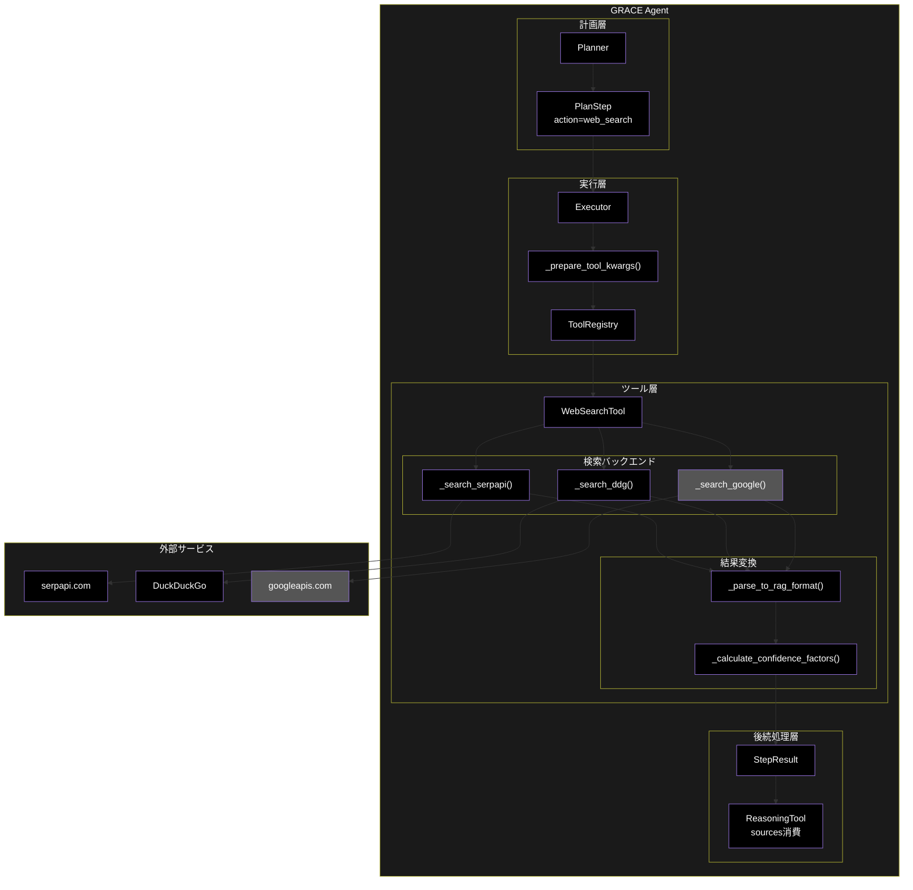
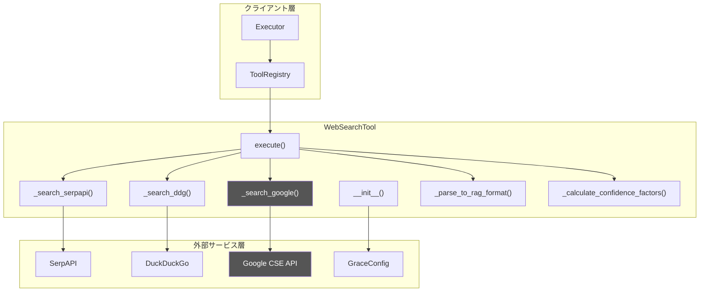
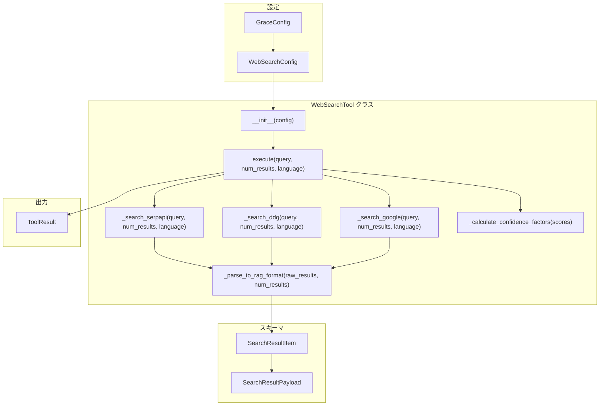
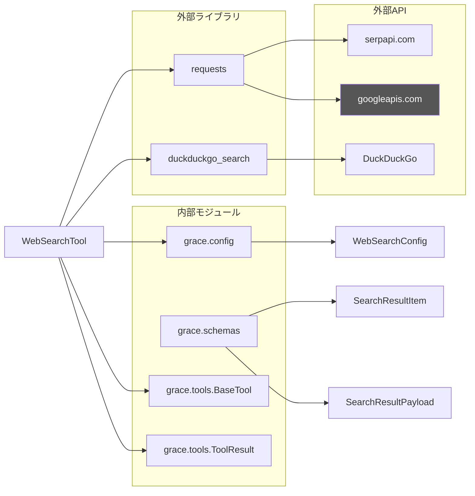

# WebSearchTool (tools.py) - Web検索ツール ドキュメント

**Version 1.0** | 最終更新: 2026-02-20

---

## 目次

1. [概要](#概要)
   - [処理のアーキテクチャ図](#処理のアーキテクチャ図)
   - [データフロー図](#データフロー図)
2. [アーキテクチャ構成図](#1-アーキテクチャ構成図)
   - [システム全体構成](#11-システム全体構成)
   - [データフロー](#12-データフロー)
3. [モジュール構成図](#2-モジュール構成図)
   - [内部モジュール構成](#21-内部モジュール構成)
   - [外部依存関係](#22-外部依存関係)
   - [内部依存モジュール](#23-内部依存モジュール)
4. [クラス・関数一覧表](#3-クラス関数一覧表)
   - [クラス一覧](#31-クラス一覧)
   - [関数一覧（カテゴリ別）](#32-関数一覧カテゴリ別)
5. [クラス・関数 IPO詳細](#4-クラス関数-ipo詳細)
   - [WebSearchTool クラス](#41-websearchtool-クラス)
   - [関連データクラス](#42-関連データクラス)
   - [関連設定クラス](#43-関連設定クラス)
   - [関連スキーマクラス](#44-関連スキーマクラス)
6. [設定・定数](#5-設定定数)
   - [grace_config.yml: web_search セクション](#51-grace_configyml-web_search-セクション)
   - [バックエンド別設定](#52-バックエンド別設定)
7. [使用例](#6-使用例)
   - [基本的なワークフロー](#61-基本的なワークフロー)
   - [ToolRegistry経由の実行](#62-toolregistry経由の実行)
   - [RAG検索 → Web検索フォールバック](#63-rag検索--web検索フォールバック)
   - [Executor経由の実行（実運用）](#64-executor経由の実行実運用)
8. [エクスポート](#7-エクスポート)
9. [変更履歴](#8-変更履歴)
10. [付録: 依存関係図](#付録-依存関係図)

---

## 概要

`WebSearchTool` は、`tools.py` 内に定義されたWeb検索ツールクラスです。GRACE Agentのツールシステム（`BaseTool` パターン）に準拠し、SerpAPI / DuckDuckGo / Google CSE の3つの検索バックエンドを切り替えて使用できます。検索結果は `rag_search` 互換フォーマット（`SearchResultItem` 構造）で返却されるため、後続の `ReasoningTool` が無変更でそのまま消費可能です。

### 主な責務

- 設定ファイルに基づく検索バックエンドの選択と初期化
- 外部検索API（SerpAPI / DuckDuckGo / Google CSE）への問い合わせ実行
- 検索結果の `rag_search` 互換フォーマットへの変換
- 検索順位ベースの正規化スコア算出
- Confidence統計情報（result_count, avg_score, top_score, score_spread）の算出

### 各責務対応のモジュール

| # | 責務 | 対応モジュール | 説明 |
|---|------|--------------|------|
| 1 | 検索バックエンドの選択と初期化 | `config.py` / `tools.py` | `WebSearchConfig.backend` に基づき `__init__` で設定 |
| 2 | 外部検索APIへの問い合わせ | `tools.py` | `_search_serpapi()` / `_search_ddg()` / `_search_google()` |
| 3 | rag_search互換フォーマット変換 | `tools.py` / `schemas.py` | `_parse_to_rag_format()` で `SearchResultItem` 構造に変換 |
| 4 | 正規化スコア算出 | `tools.py` | `_parse_to_rag_format()` 内で順位ベーススコアを計算 |
| 5 | Confidence統計情報の算出 | `tools.py` | `_calculate_confidence_factors()` で統計値を生成 |

### 主要機能一覧

| 機能 | 説明 |
|------|------|
| `WebSearchTool` | Web検索ツールクラス（SerpAPI / DuckDuckGo / Google CSE 切り替え対応） |
| `WebSearchTool.__init__()` | コンストラクタ（設定からbackend/num_results/language/timeoutを初期化） |
| `WebSearchTool.execute()` | Web検索を実行し、rag_search互換形式の `ToolResult` を返す |
| `WebSearchTool._search_serpapi()` | SerpAPI検索バックエンド（リトライ1回付き） |
| `WebSearchTool._search_ddg()` | DuckDuckGo検索バックエンド |
| `WebSearchTool._search_google()` | Google CSE検索バックエンド（⚠️ 非推奨） |
| `WebSearchTool._parse_to_rag_format()` | 各バックエンドの生結果をrag_search互換フォーマットに変換 |
| `WebSearchTool._calculate_confidence_factors()` | 検索結果のConfidence統計情報を算出 |
| `WebSearchConfig` | Web検索設定モデル（`config.py`） |
| `SearchResultItem` | 検索結果1件の型定義（`schemas.py`、RAG/Web共通） |
| `SearchResultPayload` | 検索結果ペイロードの型定義（`schemas.py`、RAG/Web共通） |

### 処理のアーキテクチャ図



### データフロー図

```mermaid
flowchart LR
    subgraph INPUT["入力"]
        style INPUT fill:#1a1a1a,color:#fff
        QUERY["query: str"]
        NUM["num_results: int"]
        LANG["language: str"]
    end

    subgraph CONFIG["設定解決"]
        style CONFIG fill:#1a1a1a,color:#fff
        YAML["grace_config.yml\nweb_search セクション"]
        ENV["環境変数\nSERPAPI_KEY 等"]
        RESOLVE["パラメータ補完\nNone → config default"]
    end

    subgraph DISPATCH["バックエンド選択"]
        style DISPATCH fill:#1a1a1a,color:#fff
        SW{"backend?"}
        S_SERP["SerpAPI\norganic_results"]
        S_DDG["DuckDuckGo\ntitle/href/body"]
        S_GOOG["Google CSE\nitems"]
    end

    subgraph CONVERT["フォーマット変換"]
        style CONVERT fill:#1a1a1a,color:#fff
        RAW["raw_results: list"]
        SCORE["スコア算出\n1.0 - index/N * 0.5"]
        MAP["フィールドマッピング\nsnippet→answer\nlink→source"]
        RESULT["rag_search互換\nList of SearchResultItem構造"]
    end

    subgraph STATS["統計算出"]
        style STATS fill:#1a1a1a,color:#fff
        SCORES["scores: List float"]
        FACTORS["confidence_factors\nresult_count\navg_score\ntop_score\nscore_spread"]
    end

    subgraph OUTPUT["出力"]
        style OUTPUT fill:#1a1a1a,color:#fff
        TR["ToolResult"]
        TR_OUT["output: List Dict"]
        TR_CF["confidence_factors: Dict"]
        TR_ERR["error: Optional str"]
    end

    QUERY --> RESOLVE
    NUM --> RESOLVE
    LANG --> RESOLVE
    YAML --> RESOLVE
    ENV --> RESOLVE
    RESOLVE --> SW
    SW -->|"serpapi"| S_SERP
    SW -->|"duckduckgo"| S_DDG
    SW -->|"google_cse"| S_GOOG
    S_SERP --> RAW
    S_DDG --> RAW
    S_GOOG --> RAW
    RAW --> SCORE
    SCORE --> MAP
    MAP --> RESULT
    RESULT --> SCORES
    SCORES --> FACTORS
    RESULT --> TR_OUT
    FACTORS --> TR_CF
    TR_OUT --> TR
    TR_CF --> TR
    TR_ERR --> TR

    style QUERY fill:#000,color:#fff
    style NUM fill:#000,color:#fff
    style LANG fill:#000,color:#fff
    style YAML fill:#000,color:#fff
    style ENV fill:#000,color:#fff
    style RESOLVE fill:#000,color:#fff
    style SW fill:#000,color:#fff
    style S_SERP fill:#000,color:#fff
    style S_DDG fill:#000,color:#fff
    style S_GOOG fill:#555,color:#fff
    style RAW fill:#000,color:#fff
    style SCORE fill:#000,color:#fff
    style MAP fill:#000,color:#fff
    style RESULT fill:#000,color:#fff
    style SCORES fill:#000,color:#fff
    style FACTORS fill:#000,color:#fff
    style TR fill:#000,color:#fff
    style TR_OUT fill:#000,color:#fff
    style TR_CF fill:#000,color:#fff
    style TR_ERR fill:#000,color:#fff
```



---

## 1. アーキテクチャ構成図

### 1.1 システム全体構成



### 1.2 データフロー

1. `Executor._prepare_tool_kwargs()` が `PlanStep(action="web_search")` から kwargs を構築
2. `ToolRegistry.execute("web_search", **kwargs)` → `WebSearchTool.execute()` を呼び出し
3. `execute()` が設定の `backend` に基づき適切な検索メソッドを選択
4. 検索バックエンド（SerpAPI / DDG / Google CSE）が生の検索結果を返却
5. `_parse_to_rag_format()` が生結果を `rag_search` 互換フォーマットに変換
6. `_calculate_confidence_factors()` がスコア統計情報を算出
7. `ToolResult` として `Executor` に返却
8. `Executor` が `StepResult` に変換し、後続の `ReasoningTool` が `sources` として消費

---

## 2. モジュール構成図

### 2.1 内部モジュール構成



### 2.2 外部依存関係

| ライブラリ | バージョン | 用途 |
|-----------|-----------|------|
| `requests` | 2.x | SerpAPI / Google CSE への HTTP リクエスト |
| `duckduckgo_search` | 6.x | DuckDuckGo 検索バックエンド |

### 2.3 内部依存モジュール

| モジュール | 用途 |
|-----------|------|
| `grace.config` | `GraceConfig`, `WebSearchConfig` の取得 |
| `grace.schemas` | `SearchResultItem`, `SearchResultPayload`（型定義、将来的な移行先） |
| `grace.tools.BaseTool` | 抽象基底クラス |
| `grace.tools.ToolResult` | 実行結果データクラス |

---

## 3. クラス・関数一覧表

### 3.1 クラス一覧

#### WebSearchTool

| メソッド | 概要 |
|---------|------|
| `__init__(config)` | コンストラクタ。設定から backend / num_results / language / timeout を初期化 |
| `execute(query, num_results, language, **kwargs)` | Web検索を実行し、rag_search互換形式の `ToolResult` を返す |
| `_search_serpapi(query, num_results, language)` | SerpAPI検索バックエンド（リトライ1回付き） |
| `_search_ddg(query, num_results, language)` | DuckDuckGo検索バックエンド |
| `_search_google(query, num_results, language)` | Google CSE検索バックエンド（⚠️ 非推奨） |
| `_parse_to_rag_format(raw_results, num_results)` | 各バックエンドの生結果をrag_search互換フォーマットに変換 |
| `_calculate_confidence_factors(scores)` | 検索結果のConfidence統計情報を算出 |

#### 関連クラス（他モジュール定義）

| クラス | 定義場所 | 概要 |
|--------|---------|------|
| `BaseTool` | `tools.py` | ツール抽象基底クラス（`WebSearchTool` の親） |
| `ToolResult` | `tools.py` | ツール実行結果データクラス |
| `WebSearchConfig` | `config.py` | Web検索設定モデル |
| `SearchResultItem` | `schemas.py` | 検索結果1件（RAG/Web共通フォーマット） |
| `SearchResultPayload` | `schemas.py` | 検索結果ペイロード（RAG/Web共通） |

### 3.2 関数一覧（カテゴリ別）

#### レジストリ登録

| 関数名 | 概要 |
|-------|------|
| `ToolRegistry._register_default_tools()` | `config.tools.enabled` に `"web_search"` があれば `WebSearchTool` を自動登録 |
| `create_tool_registry(config)` | `ToolRegistry` インスタンスを作成するファクトリ関数 |

---

## 4. クラス・関数 IPO詳細

### 4.1 WebSearchTool クラス

Web検索ツール。SerpAPI / DuckDuckGo / Google CSE の3つの検索バックエンドを設定で切り替え可能。検索結果は `rag_search` 互換フォーマットで返却し、後続の `ReasoningTool` がそのまま消費できる。

#### コンストラクタ: `__init__`

**概要**: 設定から検索バックエンドの種類、取得件数、言語、タイムアウトを読み込んで初期化する。

```python
WebSearchTool(config: Optional[GraceConfig] = None)
```

| パラメータ | 型 | デフォルト | 説明 |
|------------|------|-----------|------|
| `config` | `Optional[GraceConfig]` | `None` | GRACE設定オブジェクト。`None` の場合 `get_config()` で取得 |

| 項目 | 内容 |
|------|------|
| **Input** | `config: Optional[GraceConfig] = None` |
| **Process** | 1. `config` が `None` なら `get_config()` でシングルトン設定を取得<br>2. `config.web_search.backend` を `self.backend` に設定<br>3. `config.web_search.num_results` を `self.num_results` に設定<br>4. `config.web_search.language` を `self.language` に設定<br>5. `config.web_search.timeout` を `self.timeout` に設定 |
| **Output** | `WebSearchTool` インスタンス |

**インスタンス属性**:

| 属性 | 型 | 説明 |
|------|------|------|
| `config` | `GraceConfig` | 設定オブジェクト |
| `backend` | `str` | 検索バックエンド名（`"serpapi"` / `"duckduckgo"` / `"google_cse"`） |
| `num_results` | `int` | デフォルト取得件数 |
| `language` | `str` | デフォルト検索言語 |
| `timeout` | `int` | HTTPリクエストタイムアウト（秒） |

```python
# 使用例
from grace.tools import WebSearchTool
from grace.config import get_config

# デフォルト設定で初期化
tool = WebSearchTool()

# カスタム設定で初期化
config = get_config("config/grace_config.yml")
tool = WebSearchTool(config=config)
```

---

#### メソッド: `execute`

**概要**: Web検索を実行し、rag_search互換形式の `ToolResult` を返す。設定されたバックエンドに応じて適切な検索メソッドにディスパッチし、結果を統一フォーマットに変換する。

```python
def execute(
    self,
    query: str,
    num_results: Optional[int] = None,
    language: Optional[str] = None,
    **kwargs
) -> ToolResult
```

| パラメータ | 型 | デフォルト | 説明 |
|------------|------|-----------|------|
| `query` | `str` | - | 検索クエリ |
| `num_results` | `Optional[int]` | `None` | 取得件数（`None` の場合 config の値を使用） |
| `language` | `Optional[str]` | `None` | 検索言語（`None` の場合 config の値を使用） |

| 項目 | 内容 |
|------|------|
| **Input** | `query: str`, `num_results: Optional[int] = None`, `language: Optional[str] = None` |
| **Process** | 1. `num_results` / `language` が `None` の場合、config デフォルト値で補完<br>2. `self.backend` に基づきバックエンドを選択（`serpapi` / `duckduckgo` / `google_cse`）<br>3. 選択されたバックエンドで検索 API を呼び出し<br>4. `_parse_to_rag_format()` で rag_search 互換フォーマットに変換<br>5. `_calculate_confidence_factors()` でスコア統計を算出<br>6. IPOログを出力<br>7. `ToolResult` を構築して返却 |
| **Output** | `ToolResult`: 検索結果（`output` は `List[Dict]` の rag_search 互換形式） |

**戻り値例（成功時）**:

```python
ToolResult(
    success=True,
    output=[
        {
            "score": 1.0,
            "payload": {
                "question": "",
                "answer": "Pythonは汎用プログラミング言語で...",
                "content": "",
                "source": "https://example.com/python-guide",
                "title": "Python入門ガイド"
            },
            "collection": "web_search"
        },
        {
            "score": 0.9,
            "payload": {
                "question": "",
                "answer": "Python 3.12の新機能には...",
                "content": "",
                "source": "https://example.com/python312",
                "title": "Python 3.12 リリースノート"
            },
            "collection": "web_search"
        }
    ],
    confidence_factors={
        "result_count": 5,
        "avg_score": 0.8,
        "top_score": 1.0,
        "score_spread": 0.4,
        "search_engine": "serpapi"
    },
    error=None,
    execution_time_ms=1200
)
```

**戻り値例（結果なし）**:

```python
ToolResult(
    success=False,
    output=[],
    error="Web検索結果が見つかりませんでした: 'xyzabc123'",
    confidence_factors={"result_count": 0, "search_engine": "serpapi"},
    execution_time_ms=800
)
```

**戻り値例（エラー時）**:

```python
ToolResult(
    success=False,
    output=None,
    error="Web検索エラー (serpapi): HTTPError 429 Too Many Requests",
    confidence_factors={},
    execution_time_ms=5000
)
```

```python
# 使用例
from grace.tools import WebSearchTool

tool = WebSearchTool()
result = tool.execute(query="Python 最新バージョン", num_results=5, language="ja")

if result.success:
    for item in result.output:
        print(f"[{item['score']:.2f}] {item['payload']['title']}")
        print(f"  {item['payload']['answer'][:100]}")
        print(f"  URL: {item['payload']['source']}")
else:
    print(f"検索失敗: {result.error}")
```

---

#### メソッド: `_search_serpapi`

**概要**: SerpAPI検索バックエンドを使用してWeb検索を実行する。タイムアウト対策として最大1回のリトライを行う。

```python
def _search_serpapi(
    self,
    query: str,
    num_results: int,
    language: str
) -> list
```

| パラメータ | 型 | デフォルト | 説明 |
|------------|------|-----------|------|
| `query` | `str` | - | 検索クエリ |
| `num_results` | `int` | - | 取得件数 |
| `language` | `str` | - | 検索言語（`hl` パラメータ） |

| 項目 | 内容 |
|------|------|
| **Input** | `query: str`, `num_results: int`, `language: str` |
| **Process** | 1. 環境変数 `SERPAPI_KEY` または `config.web_search.serpapi_api_key` から API キーを取得<br>2. API キー未設定の場合は `ValueError` を送出<br>3. `https://serpapi.com/search.json` へ GET リクエスト送信<br>4. `ReadTimeout` 発生時は最大1回リトライ（指数バックオフ: 2秒、4秒）<br>5. レスポンスJSON の `organic_results` を返却 |
| **Output** | `list`: SerpAPI の `organic_results` 配列（各要素に `title`, `link`, `snippet` 等を含む） |

**環境変数**:

| 変数名 | 必須 | 説明 |
|--------|:----:|------|
| `SERPAPI_KEY` | ✅ | SerpAPI の API キー |

```python
# 使用例（内部メソッドのため通常は直接呼び出さない）
raw_results = tool._search_serpapi("Python tutorial", 5, "ja")
# raw_results: [{"title": "...", "link": "...", "snippet": "..."}, ...]
```

---

#### メソッド: `_search_ddg`

**概要**: DuckDuckGo検索バックエンドを使用してWeb検索を実行する。API キー不要。

```python
def _search_ddg(
    self,
    query: str,
    num_results: int,
    language: str
) -> list
```

| パラメータ | 型 | デフォルト | 説明 |
|------------|------|-----------|------|
| `query` | `str` | - | 検索クエリ |
| `num_results` | `int` | - | 取得件数 |
| `language` | `str` | - | 検索言語（`"ja"` → リージョン `"jp-jp"` に変換） |

| 項目 | 内容 |
|------|------|
| **Input** | `query: str`, `num_results: int`, `language: str` |
| **Process** | 1. `language` を DuckDuckGo リージョンコードに変換（`"ja"` → `"jp-jp"`、その他 → `"wt-wt"`）<br>2. `DDGS().text()` で検索実行<br>3. 結果リストを返却 |
| **Output** | `list`: DuckDuckGo の検索結果配列（各要素に `title`, `href`, `body` を含む） |

```python
# 使用例（内部メソッドのため通常は直接呼び出さない）
raw_results = tool._search_ddg("Python tutorial", 5, "ja")
# raw_results: [{"title": "...", "href": "...", "body": "..."}, ...]
```

---

#### メソッド: `_search_google`

> ⚠️ **非推奨**: Google CSE は新規受付停止のため非推奨です。`serpapi` または `duckduckgo` バックエンドを使用してください。

**概要**: Google Custom Search Engine API を使用してWeb検索を実行する。

```python
def _search_google(
    self,
    query: str,
    num_results: int,
    language: str
) -> list
```

| パラメータ | 型 | デフォルト | 説明 |
|------------|------|-----------|------|
| `query` | `str` | - | 検索クエリ |
| `num_results` | `int` | - | 取得件数 |
| `language` | `str` | - | 検索言語（`lr` パラメータに `"lang_"` を付与） |

| 項目 | 内容 |
|------|------|
| **Input** | `query: str`, `num_results: int`, `language: str` |
| **Process** | 1. 環境変数 `GOOGLE_CSE_API_KEY` / `GOOGLE_CSE_ENGINE_ID` または config から認証情報を取得<br>2. 認証情報未設定の場合は `ValueError` を送出<br>3. `https://www.googleapis.com/customsearch/v1` へ GET リクエスト送信<br>4. レスポンスJSON の `items` を返却 |
| **Output** | `list`: Google CSE の `items` 配列（各要素に `title`, `link`, `snippet` 等を含む） |

**環境変数**:

| 変数名 | 必須 | 説明 |
|--------|:----:|------|
| `GOOGLE_CSE_API_KEY` | ✅ | Google API キー |
| `GOOGLE_CSE_ENGINE_ID` | ✅ | Programmable Search Engine ID |

---

#### メソッド: `_parse_to_rag_format`

**概要**: 各検索バックエンドの生結果を rag_search 互換フォーマットに変換する。検索順位から正規化スコアを生成する。

```python
def _parse_to_rag_format(
    self,
    raw_results: list,
    num_results: int
) -> list
```

| パラメータ | 型 | デフォルト | 説明 |
|------------|------|-----------|------|
| `raw_results` | `list` | - | バックエンドの生検索結果リスト |
| `num_results` | `int` | - | 取得件数（スコア正規化に使用） |

| 項目 | 内容 |
|------|------|
| **Input** | `raw_results: list`, `num_results: int` |
| **Process** | 1. 各結果を順にイテレート<br>2. 検索順位ベースの正規化スコアを算出: `score = 1.0 - (index / max(num_results, 1)) * 0.5`<br>3. バックエンド種別に応じてフィールドをマッピング（下表参照）<br>4. `collection` を `"web_search"` 固定で設定<br>5. フォーマット済みリストを返却 |
| **Output** | `list`: rag_search 互換フォーマットのリスト（`SearchResultItem` 構造） |

**バックエンド別フィールドマッピング**:

| payload フィールド | DuckDuckGo | SerpAPI / Google CSE |
|-------------------|------------|---------------------|
| `question` | `""` | `""` |
| `answer` | `item["body"]` | `item["snippet"]` |
| `content` | `""` | `""` |
| `source` | `item["href"]` | `item["link"]` |
| `title` | `item["title"]` | `item["title"]` |

**スコア算出ロジック**:

| 順位（0始まり） | num_results=5 の場合のスコア |
|:---:|:---:|
| 0 | 1.00 |
| 1 | 0.90 |
| 2 | 0.80 |
| 3 | 0.70 |
| 4 | 0.60 |

**戻り値例**:

```python
[
    {
        "score": 1.0,
        "payload": {
            "question": "",
            "answer": "Python 3.13の新機能には...",
            "content": "",
            "source": "https://docs.python.org/ja/3.13/whatsnew/",
            "title": "Python 3.13 の新機能"
        },
        "collection": "web_search"
    },
    {
        "score": 0.9,
        "payload": {
            "question": "",
            "answer": "Python 3.13は2024年10月に...",
            "content": "",
            "source": "https://example.com/python-313",
            "title": "Python 3.13 リリース情報"
        },
        "collection": "web_search"
    }
]
```

---

#### メソッド: `_calculate_confidence_factors`

**概要**: 検索結果のスコアリストからConfidence統計情報を算出する。

```python
def _calculate_confidence_factors(self, scores: list) -> dict
```

| パラメータ | 型 | デフォルト | 説明 |
|------------|------|-----------|------|
| `scores` | `list` | - | 検索結果のスコアリスト（`List[float]`） |

| 項目 | 内容 |
|------|------|
| **Input** | `scores: list` |
| **Process** | 1. スコアリストが空の場合はゼロ値の辞書を返却<br>2. `result_count` = スコア数<br>3. `avg_score` = 平均スコア（小数点2桁）<br>4. `top_score` = 最大スコア<br>5. `score_spread` = 最大 - 最小（小数点2桁）<br>6. `search_engine` = `self.backend` |
| **Output** | `dict`: Confidence統計情報 |

**戻り値例（結果あり）**:

```python
{
    "result_count": 5,
    "avg_score": 0.8,
    "top_score": 1.0,
    "score_spread": 0.4,
    "search_engine": "serpapi"
}
```

**戻り値例（結果なし）**:

```python
{
    "result_count": 0,
    "avg_score": 0.0,
    "top_score": 0.0,
    "score_spread": 0.0,
    "search_engine": "serpapi"
}
```

---

### 4.2 関連データクラス

#### ToolResult データクラス

**概要**: 全ツール共通の実行結果データクラス。`WebSearchTool.execute()` の戻り値。

```python
@dataclass
class ToolResult:
    success: bool
    output: Any
    confidence_factors: Dict[str, Any] = field(default_factory=dict)
    error: Optional[str] = None
    execution_time_ms: Optional[int] = None
```

| フィールド | 型 | 説明 |
|-----------|------|------|
| `success` | `bool` | 実行成功フラグ |
| `output` | `Any` | 実行結果（Web検索の場合は `List[Dict]`） |
| `confidence_factors` | `Dict[str, Any]` | Confidence計算用の統計情報 |
| `error` | `Optional[str]` | エラーメッセージ（失敗時） |
| `execution_time_ms` | `Optional[int]` | 実行時間（ミリ秒） |

---

### 4.3 関連設定クラス

#### WebSearchConfig

**概要**: Web検索の設定モデル。`config.py` に定義。

```python
class WebSearchConfig(BaseModel):
    backend: str = "serpapi"
    num_results: int = 5
    language: str = "ja"
    timeout: int = 30
    google_cse_api_key: str = ""
    google_cse_engine_id: str = ""
    serpapi_api_key: str = ""
```

| フィールド | 型 | デフォルト | 説明 |
|-----------|------|-----------|------|
| `backend` | `str` | `"serpapi"` | 検索バックエンド（`"serpapi"` / `"duckduckgo"` / `"google_cse"`） |
| `num_results` | `int` | `5` | デフォルト取得件数 |
| `language` | `str` | `"ja"` | デフォルト検索言語 |
| `timeout` | `int` | `30` | HTTPリクエストタイムアウト（秒） |
| `google_cse_api_key` | `str` | `""` | Google CSE API キー（⚠️ 非推奨） |
| `google_cse_engine_id` | `str` | `""` | Google CSE Engine ID（⚠️ 非推奨） |
| `serpapi_api_key` | `str` | `""` | SerpAPI APIキー（環境変数 `SERPAPI_KEY` 推奨） |

---

### 4.4 関連スキーマクラス

#### SearchResultPayload

**概要**: 検索結果ペイロード（RAG/Web共通）。`schemas.py` に定義。

```python
class SearchResultPayload(BaseModel):
    question: str = ""
    answer: str = ""
    content: str = ""
    source: str = ""
    title: str = ""
```

| フィールド | 型 | 説明 | RAG検索での用途 | Web検索での用途 |
|-----------|------|------|---------------|---------------|
| `question` | `str` | 関連質問文 | Q/Aペアの質問文 | 空文字 |
| `answer` | `str` | 回答・スニペット文 | Q/Aペアの回答 | 検索スニペット |
| `content` | `str` | 本文コンテンツ | チャンク本文 | 空文字 |
| `source` | `str` | 出典 | ファイル名 | URL |
| `title` | `str` | タイトル | ドキュメント名 | ページタイトル |

#### SearchResultItem

**概要**: 検索結果1件（RAG/Web共通フォーマット）。`schemas.py` に定義。

```python
class SearchResultItem(BaseModel):
    score: float = Field(..., ge=0.0, le=1.0)
    payload: SearchResultPayload = Field(default_factory=SearchResultPayload)
    collection: str = ""
```

| フィールド | 型 | 説明 | RAG検索での例 | Web検索での例 |
|-----------|------|------|-------------|-------------|
| `score` | `float` | 関連度スコア（0.0-1.0） | ベクトル類似度 | 順位ベース正規化スコア |
| `payload` | `SearchResultPayload` | 詳細情報 | Q/A + ソース | スニペット + URL |
| `collection` | `str` | 検索元 | `"wikipedia_ja"` 等 | `"web_search"` 固定 |

> 📝 **注意**: 現時点では `WebSearchTool._parse_to_rag_format()` は `dict` を返しています。`SearchResultItem` は将来的な型安全化のための定義であり、段階的に移行予定です。既存コードとの互換性は `SearchResultItem.model_dump()` で保たれます。

---

## 5. 設定・定数

### 5.1 grace_config.yml: web_search セクション

```yaml
web_search:
  backend: "serpapi"               # "serpapi" or "duckduckgo" or "google_cse"(非推奨)
  num_results: 5
  language: "ja"
  timeout: 30
  # SerpAPI用（backendが"serpapi"の場合に使用）
  # serpapi_api_key: ""            # 環境変数 SERPAPI_KEY 推奨
  # Google CSE用（※非推奨）
  # google_cse_api_key: ""        # 環境変数 GOOGLE_CSE_API_KEY
  # google_cse_engine_id: ""      # 環境変数 GOOGLE_CSE_ENGINE_ID
```

| キー | デフォルト値 | 説明 |
|-----|-------------|------|
| `backend` | `"serpapi"` | 検索バックエンド種別 |
| `num_results` | `5` | デフォルト取得件数 |
| `language` | `"ja"` | デフォルト検索言語 |
| `timeout` | `30` | HTTPタイムアウト（秒） |

### 5.2 バックエンド別設定

| バックエンド | API エンドポイント | 認証 | 状態 | 料金 |
|-------------|-------------------|------|------|------|
| `serpapi` | `https://serpapi.com/search.json` | `SERPAPI_KEY` 環境変数 | ✅ 推奨（デフォルト） | 月100回無料、以降 $50/5000回 |
| `duckduckgo` | `duckduckgo_search` ライブラリ | 不要 | ✅ 利用可 | 無料 |
| `google_cse` | `https://www.googleapis.com/customsearch/v1` | `GOOGLE_CSE_API_KEY` + `GOOGLE_CSE_ENGINE_ID` | ⚠️ 非推奨 | 100回/日無料、以降 $5/1000回 |

**環境変数一覧**:

| 変数名 | 必須条件 | 説明 |
|--------|---------|------|
| `SERPAPI_KEY` | backend=serpapi | SerpAPI の API キー |
| `GOOGLE_CSE_API_KEY` | backend=google_cse | Google API キー（⚠️ 非推奨） |
| `GOOGLE_CSE_ENGINE_ID` | backend=google_cse | CSE Engine ID（⚠️ 非推奨） |

---

## 6. 使用例

### 6.1 基本的なワークフロー

```python
from grace.tools import WebSearchTool

# 1. 初期化
tool = WebSearchTool()

# 2. 検索実行
result = tool.execute(query="Python 3.13 新機能", num_results=5)

# 3. 結果確認
if result.success:
    print(f"検索成功: {result.confidence_factors['result_count']}件")
    for item in result.output:
        print(f"  [{item['score']:.2f}] {item['payload']['title']}")
        print(f"    {item['payload']['answer'][:80]}...")
        print(f"    URL: {item['payload']['source']}")
else:
    print(f"検索失敗: {result.error}")
```

### 6.2 ToolRegistry経由の実行

```python
from grace.tools import create_tool_registry

# 1. レジストリ作成（configのtools.enabledに基づき自動登録）
registry = create_tool_registry()

# 2. 登録済みツール確認
print(registry.list_tools())
# 出力: ['rag_search', 'web_search', 'reasoning', 'ask_user']

# 3. Web検索実行
result = registry.execute("web_search", query="最新のAIニュース", num_results=3)

if result.success:
    for item in result.output:
        print(f"[{item['score']:.2f}] {item['payload']['title']}")
```

### 6.3 RAG検索 → Web検索フォールバック

```python
from grace.tools import create_tool_registry

registry = create_tool_registry()

query = "2026年の東京の天気予報"

# 1. まずRAG検索を試行
rag_result = registry.execute("rag_search", query=query)

# 2. RAG検索で結果が得られなければWeb検索にフォールバック
if not rag_result.success or not rag_result.output:
    print("RAG検索で結果なし → Web検索にフォールバック")
    web_result = registry.execute("web_search", query=query)

    if web_result.success:
        # 3. Web検索結果をReasoningToolのsourcesとして使用
        reasoning_result = registry.execute(
            "reasoning",
            query=query,
            sources=web_result.output
        )
        print(reasoning_result.output)
```

### 6.4 Executor経由の実行（実運用）

```python
from grace import create_planner, create_executor

# 1. Planner が web_search を含む計画を生成
planner = create_planner()
plan = planner.create_plan("最新のPython 3.13の新機能を教えてください")

# 2. Executor が計画を実行（web_search ステップを自動実行）
executor = create_executor()
result = executor.execute_plan(plan)

# 3. 最終回答を取得
print(result.final_answer)
print(f"信頼度: {result.overall_confidence:.2f}")
```

---

## 7. エクスポート

`__init__.py` でエクスポートされる要素：

```python
__all__ = [
    # Tools（tools.py）
    "WebSearchTool",

    # Schemas（schemas.py）
    "SearchResultPayload",
    "SearchResultItem",
]
```

`tools.py` の `__all__`:

```python
__all__ = [
    # Data classes
    "ToolResult",
    # Base class
    "BaseTool",
    # Tools
    "RAGSearchTool",
    "WebSearchTool",
    "ReasoningTool",
    "AskUserTool",
    # Registry
    "ToolRegistry",
    "create_tool_registry",
]
```

---

## 8. 変更履歴

| バージョン | 変更内容 |
|-----------|---------|
| 1.0 | 初版作成。WebSearchTool の全メソッド IPO 詳細、SearchResultItem / SearchResultPayload スキーマ定義、バックエンド別設定を記載 |

---

## 付録: 依存関係図



---

## 関連ドキュメント

| ドキュメント | 説明 |
|-------------|------|
| `grace/doc/tools.md` | tools.py 全体のドキュメント（全ツール網羅） |
| `grace/doc/web_search.md` | Web検索の実装仕様書 + TODO（実装前の設計ドキュメント） |
| `grace/doc/web_search_spec.md` | Web検索の詳細仕様 |
| `grace/doc/executor.md` | Executor ドキュメント（Web検索ステップの実行フローを含む） |
| `grace/doc/schemas.md` | スキーマ定義ドキュメント |
