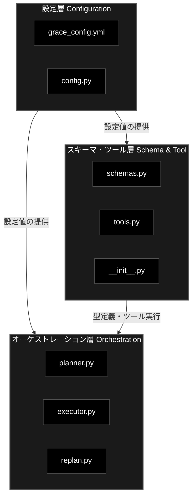

# GRACE Agent — web_search 実装に伴うモジュール変更一覧

**対象パッケージ**: `grace/`
**作成日**: 2026-02-20
**対象機能**: Web検索ツール（SerpAPI / DuckDuckGo / Google CSE マルチバックエンド対応）

---

## 1. 変更モジュール一覧

| # | モジュール | 変更種別 | 変更の目的 |
|---|-----------|---------|-----------|
| 1 | `grace_config.yml` | **追加** | web_search セクションの新設、tools.enabled への追加 |
| 2 | `config.py` | **追加** | `WebSearchConfig`・`ToolsConfig` Pydantic モデル定義 |
| 3 | `schemas.py` | **修正** | `ActionType` enum / `PlanStep.action` Literal に `web_search` 追加 |
| 4 | `tools.py` | **追加** | `WebSearchTool` クラスの新規実装（主要変更） |
| 5 | `planner.py` | **修正** | 計画生成プロンプトへの web_search アクション・使い分けルール追加 |
| 6 | `executor.py` | **修正** | `_prepare_tool_kwargs` に web_search 用引数準備ロジック追加 |
| 7 | `replan.py` | **修正** | フォールバックチェーンに `rag_search ↔ web_search` 相互参照追加 |
| 8 | `__init__.py` | **未対応（要修正）** | `WebSearchTool` のインポート/エクスポートが未追加 |

### 変更なしのモジュール

| モジュール | 理由 |
|-----------|------|
| `confidence.py` | `ConfidenceFactors` が汎用設計のため web_search 固有の変更不要 |
| `intervention.py` | 介入ロジックはアクション種別に依存しないため変更不要 |

---

## 2. 変更の全体アーキテクチャ

web_search の追加は、既存の `BaseTool` パターン + `ToolResult` 統一インターフェースに沿い、3層に分類される。



---

## 3. 各モジュールの変更詳細

---

### 3.1 grace_config.yml

**変更の目的**: Web検索バックエンドの選択、API認証情報、検索パラメータの設定を一元管理する。

#### 変更内容

**(1) `tools` セクション — `web_search` の有効化**

```yaml
tools:
  enabled:
    - rag_search
    - web_search    # ← 追加
    - reasoning
    - ask_user
```

- `ToolRegistry._register_default_tools()` が `enabled` リストを参照し、`WebSearchTool` を自動登録する。

**(2) `web_search` セクションの新設**

```yaml
web_search:
  backend: "serpapi"               # "serpapi" | "duckduckgo" | "google_cse"
  num_results: 5
  language: "ja"
  timeout: 30
  # SerpAPI用
  # serpapi_api_key: ""            # 環境変数 SERPAPI_KEY 推奨
  # Google CSE用（非推奨）
  # google_cse_api_key: ""
  # google_cse_engine_id: ""
```

| パラメータ | 型 | デフォルト | 説明 |
|-----------|------|-----------|------|
| `backend` | str | `"serpapi"` | 使用する検索バックエンド |
| `num_results` | int | `5` | 取得件数 |
| `language` | str | `"ja"` | 検索言語 |
| `timeout` | int | `30` | タイムアウト秒数 |
| `serpapi_api_key` | str | `""` | SerpAPI キー（環境変数 `SERPAPI_KEY` 推奨） |
| `google_cse_api_key` | str | `""` | Google CSE キー（非推奨） |
| `google_cse_engine_id` | str | `""` | Google CSE エンジンID（非推奨） |

---

### 3.2 config.py

**変更の目的**: `grace_config.yml` の `web_search` / `tools` セクションを Pydantic モデルとしてバリデーション・型安全に扱う。

#### 変更内容

**(1) `WebSearchConfig` クラスの追加**

```python
class WebSearchConfig(BaseModel):
    """Web検索設定"""
    backend: str = "serpapi"
    num_results: int = 5
    language: str = "ja"
    timeout: int = 30
    google_cse_api_key: str = ""
    google_cse_engine_id: str = ""
    serpapi_api_key: str = ""
```

- 3種類のバックエンド（serpapi / duckduckgo / google_cse）に対応する設定を統合管理する。
- API キーは環境変数での上書きを推奨（`GRACE_WEB_SEARCH_SERPAPI_API_KEY` 等）。

**(2) `ToolsConfig` クラスの追加**

```python
class ToolsConfig(BaseModel):
    """ツール設定"""
    enabled: list = Field(
        default_factory=lambda: ["rag_search", "web_search", "reasoning", "ask_user"]
    )
```

- デフォルトで `web_search` が有効リストに含まれる。

**(3) `GraceConfig` への統合**

```python
class GraceConfig(BaseModel):
    # ... 既存フィールド ...
    web_search: WebSearchConfig = Field(default_factory=WebSearchConfig)  # 追加
    tools: ToolsConfig = Field(default_factory=ToolsConfig)              # 追加
```

---

### 3.3 schemas.py

**変更の目的**: 計画スキーマ（`ActionType` / `PlanStep`）で `web_search` アクションを正式な型として定義する。

#### 変更内容

**(1) `ActionType` enum への追加**

```python
class ActionType(str, Enum):
    RAG_SEARCH = "rag_search"
    WEB_SEARCH = "web_search"   # ← 追加
    REASONING = "reasoning"
    ASK_USER = "ask_user"
    CODE_EXECUTE = "code_execute"
```

**(2) `PlanStep.action` の Literal 拡張**

```python
class PlanStep(BaseModel):
    action: Literal[
        "rag_search",
        "web_search",       # ← 追加
        "reasoning",
        "ask_user",
        "code_execute",
        "run_legacy_agent"
    ]
```

- LLM が JSON 出力する計画ステップの `action` フィールドで `"web_search"` をバリデーション可能にする。

---

### 3.4 tools.py（主要変更）

**変更の目的**: `BaseTool` を継承した `WebSearchTool` クラスを新規実装し、RAG検索と統一インターフェース（`ToolResult`）で Web検索結果を返す。

#### 変更内容

**(1) `WebSearchTool` クラスの新規追加（L544-793）**

| 項目 | 内容 |
|------|------|
| クラス名 | `WebSearchTool(BaseTool)` |
| name | `"web_search"` |
| description | `"Web検索で最新情報を取得"` |

**コンストラクタ `__init__`**

```python
def __init__(self, config: Optional[GraceConfig] = None):
```

- `config.web_search` から `backend` / `num_results` / `language` / `timeout` を読み込む。

**メインメソッド `execute`**

```python
def execute(self, query: str, num_results=None, language=None, **kwargs) -> ToolResult:
```

| 処理 | 説明 |
|------|------|
| バックエンド振り分け | `backend` の値に応じて `_search_ddg` / `_search_google` / `_search_serpapi` を呼び出し |
| 結果変換 | `_parse_to_rag_format()` で rag_search 互換フォーマットに統一変換 |
| Confidence算出 | `_calculate_confidence_factors()` でスコア統計情報を付与 |
| IPOログ出力 | `[WEB SEARCH IPO: OUTPUT]` でログ・コンソールに出力 |
| エラーハンドリング | 例外時も `ToolResult(success=False)` を返却 |

**バックエンド実装（プライベートメソッド 3種）**

| メソッド | バックエンド | 特記事項 |
|---------|------------|---------|
| `_search_ddg()` | DuckDuckGo | `duckduckgo_search` ライブラリ使用、リージョン自動設定 |
| `_search_google()` | Google CSE | ※非推奨（新規受付停止）。API Key + Engine ID 必須 |
| `_search_serpapi()` | SerpAPI | リトライ1回付き（ReadTimeout 対策）、`organic_results` を返却 |

**結果変換メソッド `_parse_to_rag_format`**

- 各バックエンドの生結果を以下の rag_search 互換フォーマットに変換する:

```python
{
    "score": 0.90,          # 検索順位ベース正規化（1位=1.0, 最下位≈0.5）
    "payload": {
        "question": "",
        "answer": "<snippet/body>",
        "content": "",
        "source": "<URL>",
        "title": "<タイトル>"
    },
    "collection": "web_search"
}
```

- `collection` フィールドを `"web_search"` に固定することで、下流の `ReasoningTool` や `ConfidenceCalculator` が検索ソースを識別可能。

**Confidence統計メソッド `_calculate_confidence_factors`**

```python
{
    "result_count": int,
    "avg_score": float,
    "top_score": float,
    "score_spread": float,
    "search_engine": str    # 使用バックエンド名
}
```

**(2) `ToolRegistry._register_default_tools` への登録追加（L815-816）**

```python
if "web_search" in enabled_tools:
    self.register(WebSearchTool(config=self.config))
```

**(3) `__all__` への追加（L868）**

```python
__all__ = [
    # ...
    "WebSearchTool",   # ← 追加
    # ...
]
```

---

### 3.5 planner.py

**変更の目的**: LLM に対して `web_search` アクションの存在と、`rag_search` との使い分けルールを指示する。

#### 変更内容

**(1) `PLAN_GENERATION_PROMPT` の修正**

以下の箇所が追加・修正されている:

**利用可能なアクション一覧に追加:**

```
- web_search: Web検索で最新情報や一般的な情報を取得（最新ニュース・外部情報向け）
```

**計画作成ルール（ルール6）の追加:**

```
6. rag_search と web_search の使い分け:
    * 社内ドキュメント・FAQ・ナレッジベースの情報 → rag_search
    * 最新ニュース・外部Web情報・一般知識 → web_search
    * RAGに情報がない可能性がある場合 → rag_search（fallbackに"web_search"を指定）
    * 両方必要な場合 → rag_search → web_search → reasoning の3ステップ
```

- LLM が計画生成時に、質問の性質に応じて `rag_search` と `web_search` を適切に選択・組み合わせるようになる。
- `fallback` フィールドに `"web_search"` を指定する戦略も明示されている。

---

### 3.6 executor.py

**変更の目的**: Executor がステップ実行時に `web_search` ツールへ適切な引数を渡せるようにする。

#### 変更内容

**(1) `_prepare_tool_kwargs` メソッド内の分岐追加（L654-656）**

```python
elif step.action == "web_search":
    kwargs["num_results"] = self.config.web_search.num_results
    kwargs["language"] = self.config.web_search.language
```

| 引数 | 取得元 | 説明 |
|------|-------|------|
| `query` | `step.query or step.description` | 共通ロジック（L648）で設定済み |
| `num_results` | `config.web_search.num_results` | 検索件数 |
| `language` | `config.web_search.language` | 検索言語 |

- `rag_search` の場合は `collection` を渡し、`web_search` の場合は `num_results` / `language` を渡す、という引数の使い分けが実装されている。

**(2) `_execute_fallback` メソッドの間接的影響**

- `PlanStep.fallback` に `"web_search"` が指定されている場合、`_execute_fallback` が `WebSearchTool` を呼び出す。
- `ToolRegistry.get("web_search")` で取得するため、追加のコード変更は不要（既存の汎用ロジックで対応）。

---

### 3.7 replan.py

**変更の目的**: 検索ステップ失敗時のフォールバック戦略に `rag_search ↔ web_search` の相互参照を組み込む。

#### 変更内容

**(1) `_SEARCH_FALLBACK_CHAIN` の追加（L392-395）**

```python
_SEARCH_FALLBACK_CHAIN = {
    "rag_search": "web_search",  # RAG失敗 → Web検索
    "web_search": "rag_search",  # Web失敗 → RAG検索
}
```

**(2) `_apply_fallback` メソッドの強化（L409-416）**

```python
# fallback先が reasoning で、元が検索系の場合は web_search に昇格
fallback_action = step.fallback
if fallback_action == "reasoning" and step.action in self._SEARCH_FALLBACK_CHAIN:
    fallback_action = self._SEARCH_FALLBACK_CHAIN[step.action]
```

- 元の fallback 指定が `"reasoning"` でも、失敗元が検索系アクションの場合は、もう一方の検索バックエンドに昇格させる。
- 例: `rag_search` → fallback `"reasoning"` → 実際には `"web_search"` に昇格。

**(3) `_apply_fallback` 内の collection 制御（L424）**

```python
collection=step.collection if fallback_action != "web_search" else None,
```

- フォールバック先が `web_search` の場合、`collection` フィールドを `None` にクリアする（Web検索にコレクション指定は不要）。

**(4) リプラン用プロンプトへの追加（L521）**

```
- 'web_search' (必要な場合)
```

- LLM にリプランを依頼する際の利用可能アクションリストに `web_search` を追加。

---

### 3.8 \_\_init\_\_.py

**変更の目的**: パッケージレベルで `WebSearchTool` をエクスポートし、外部からの利用を可能にする。

#### 現状と問題点

`tools.py` の `__all__` には `WebSearchTool` が含まれているが、**`__init__.py` のインポート文とエクスポートリストには未追加**。

**現状（未対応）:**

```python
# Tools
from grace.tools import (
    ToolResult,
    BaseTool,
    RAGSearchTool,
    ReasoningTool,       # ← WebSearchTool がない
    AskUserTool,
    ToolRegistry,
    create_tool_registry,
)
```

**修正案:**

```python
# Tools
from grace.tools import (
    ToolResult,
    BaseTool,
    RAGSearchTool,
    WebSearchTool,       # ← 追加
    ReasoningTool,
    AskUserTool,
    ToolRegistry,
    create_tool_registry,
)
```

`__all__` リストにも `"WebSearchTool"` を追加する必要がある。

> **注意**: 現時点では `ToolRegistry` 経由での利用（`config.tools.enabled` に `"web_search"` が含まれていれば自動登録）が正常に動作しているため、実行上の問題は発生していない。ただし、`from grace import WebSearchTool` のような直接インポートは失敗する。

---

## 4. 変更なしモジュールの補足

### 4.1 confidence.py — 変更不要の理由

- `ConfidenceFactors` は `search_result_count` / `search_avg_score` / `search_max_score` 等の汎用フィールドを持つ。
- `WebSearchTool` が返す `ToolResult.confidence_factors` はこれらの汎用フィールドにマッピングされるため、Confidence 計算ロジックに web_search 固有の変更は不要。
- `WebSearchTool._calculate_confidence_factors()` が `search_engine` フィールドを追加で返すが、これは Confidence 計算には使用されず、デバッグ・ログ用途。

### 4.2 intervention.py — 変更不要の理由

- 介入判定は `ConfidenceScore.score` の閾値に基づく。
- アクション種別（`rag_search` / `web_search`）には依存しないため、変更不要。

---

## 5. まとめ

| 変更層 | モジュール | 変更規模 |
|-------|-----------|---------|
| 設定層 | grace_config.yml | セクション追加 |
| 設定層 | config.py | クラス2つ追加 + GraceConfig 拡張 |
| スキーマ・ツール層 | schemas.py | enum/Literal に1値追加 |
| スキーマ・ツール層 | tools.py | **クラス1つ新規（約250行）+ Registry登録** |
| スキーマ・ツール層 | \_\_init\_\_.py | **未対応（要修正）** |
| オーケストレーション層 | planner.py | プロンプト拡張（使い分けルール追加） |
| オーケストレーション層 | executor.py | 引数準備ロジック追加（3行） |
| オーケストレーション層 | replan.py | フォールバックチェーン追加 + プロンプト修正 |

**設計方針**: `BaseTool` / `ToolResult` の統一インターフェースにより、新ツール追加の影響範囲が最小限に抑えられている。主要な実装は `tools.py` に集約され、他モジュールは設定参照・引数振り分け・フォールバック定義の軽微な変更のみ。
