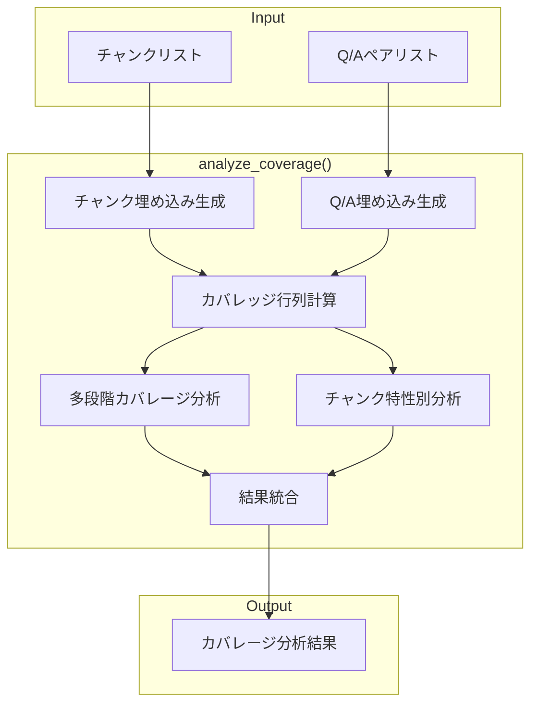
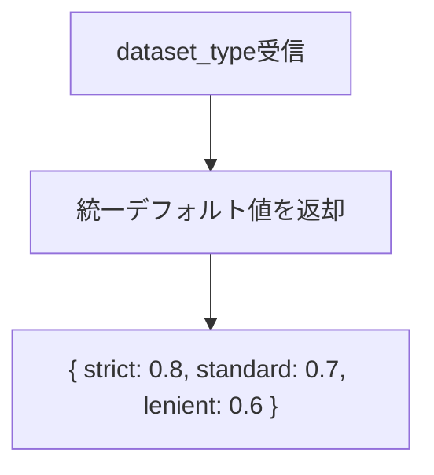
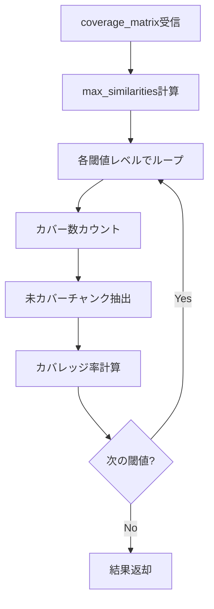
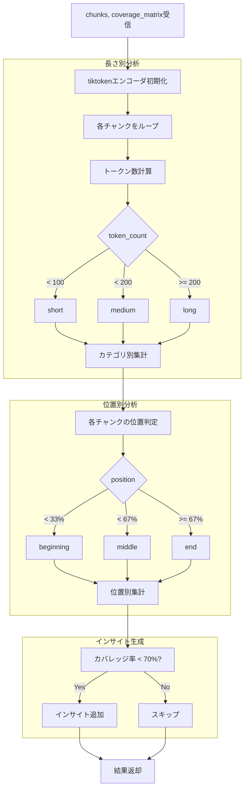
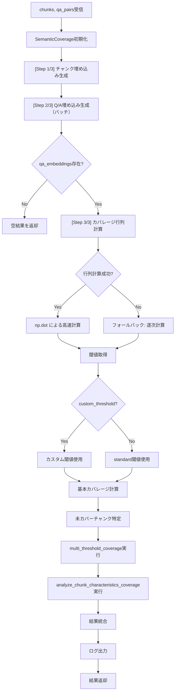
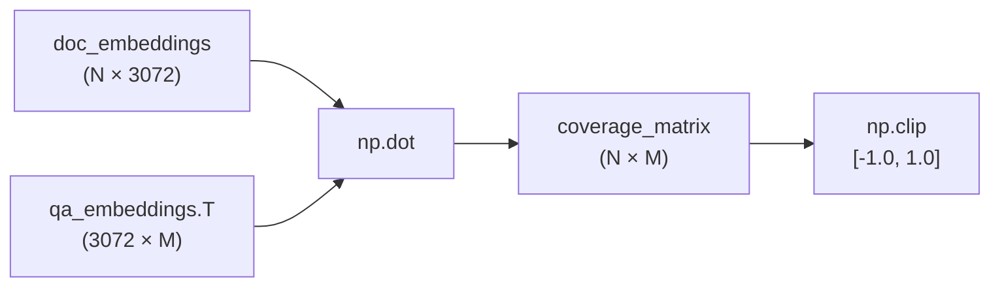

# evaluation.py 完全ガイド（v3.0）

## 概要

`qa_generation/evaluation.py` は、**生成されたQ/Aペアがチャンクをどれだけカバーしているかを分析するカバレッジ分析モジュール**です。セマンティック類似度に基づく評価を行い、多段階閾値評価とチャンク特性別分析により、Q/A品質の詳細な把握を可能にします。

---

## 目次

1. [v3.0の変更点](#v30の変更点)
2. [アーキテクチャ](#アーキテクチャ)
3. [関数一覧](#関数一覧)
4. [IPO詳細（Input/Process/Output）](#ipo詳細inputprocessoutput)
5. [カバレッジ分析の仕組み](#カバレッジ分析の仕組み)
6. [閾値と評価基準](#閾値と評価基準)
7. [使用方法](#使用方法)
8. [出力データ構造](#出力データ構造)
9. [関連モジュール](#関連モジュール)

---

## v3.0の変更点

| 項目 | v2.x | v3.0 |
|-----|------|------|
| config.py依存 | あり | **削除** |
| データセット別閾値 | 個別設定 | **統一デフォルト値** |
| 閾値設定 | DATASET_CONFIGSから取得 | 固定値（strict:0.8, standard:0.7, lenient:0.6） |

### 削除された依存

```python
# v2.x（削除）
from qa_generation.config import DATASET_CONFIGS

# v3.0（現在）
# config.pyへの依存なし
```

---

## アーキテクチャ

### 全体構成

```
┌─────────────────────────────────────────────────────────────┐
│                     evaluation.py                           │
├─────────────────────────────────────────────────────────────┤
│                                                             │
│  ┌─────────────────────────────────────────────────────┐    │
│  │              公開関数                                 │   │
│  ├─────────────────────────────────────────────────────┤    │
│  │  get_optimal_thresholds()     # 閾値取得             │   │
│  │  multi_threshold_coverage()   # 多段階カバレージ       │   │
│  │  analyze_chunk_characteristics_coverage()           │   │
│  │                               # チャンク特性分析       │   │
│  │  analyze_coverage()           # メイン分析関数         │   │
│  └─────────────────────────────────────────────────────┘    │
│                                                             │
└─────────────────────────────────────────────────────────────┘
                              │
                              ▼
┌─────────────────────────────────────────────────────────────┐
│                   SemanticCoverage                          │
│  (qa_generation/semantic.py)                                │
│  ├─ generate_embeddings()        # チャンク埋め込み            │
│  ├─ generate_embeddings_batch()  # Q/A埋め込み（バッチ）       │
│  └─ cosine_similarity()          # 類似度計算                 │
└─────────────────────────────────────────────────────────────┘
```

### 処理フロー



---

## 関数一覧

| 関数名 | 機能概要 |
|-------|---------|
| `get_optimal_thresholds` | カバレッジ分析用の閾値（strict/standard/lenient）を取得 |
| `multi_threshold_coverage` | 複数の閾値でカバレッジを評価し、各レベルの結果を返す |
| `analyze_chunk_characteristics_coverage` | チャンクの長さ別・位置別にカバレッジを分析 |
| `analyze_coverage` | カバレッジ分析のメイン関数。全機能を統合して実行 |

---

## IPO詳細（Input/Process/Output）

### get_optimal_thresholds()

#### IPO

| 区分 | 内容 |
|-----|------|
| **Input** | `dataset_type`: str（データセットタイプ、現在は未使用） |
| **Process** | 統一デフォルト値を返す |
| **Output** | `Dict[str, float]`: {strict, standard, lenient} |

#### プロセスフロー



#### 出力構造

```python
{
    "strict": 0.8,    # 厳格な評価
    "standard": 0.7,  # 標準評価
    "lenient": 0.6    # 緩やかな評価
}
```

---

### multi_threshold_coverage()

#### IPO

| 区分 | 内容 |
|-----|------|
| **Input** | `coverage_matrix`: np.ndarray（カバレッジ行列）<br>`chunks`: List[Dict]（チャンクリスト）<br>`qa_pairs`: List[Dict]（Q/Aペアリスト）<br>`thresholds`: Dict[str, float]（閾値辞書） |
| **Process** | 1. 各チャンクの最大類似度を取得<br>2. 各閾値レベルでカバー数をカウント<br>3. 未カバーチャンク情報を収集 |
| **Output** | `Dict`: 各閾値レベルのカバレッジ結果 |

#### プロセスフロー



#### 出力構造

```python
{
    "strict": {
        "threshold": 0.8,
        "covered_chunks": 72,
        "coverage_rate": 0.72,
        "uncovered_count": 28,
        "uncovered_chunks": [
            {"chunk_id": "chunk_0", "similarity": 0.75, "gap": 0.05},
            ...
        ]
    },
    "standard": { ... },
    "lenient": { ... }
}
```

---

### analyze_chunk_characteristics_coverage()

#### IPO

| 区分 | 内容 |
|-----|------|
| **Input** | `chunks`: List[Dict]（チャンクリスト）<br>`coverage_matrix`: np.ndarray（カバレッジ行列）<br>`qa_pairs`: List[Dict]（Q/Aペアリスト）<br>`threshold`: float（判定閾値、デフォルト0.7） |
| **Process** | 1. 長さ別分析（short/medium/long）<br>2. 位置別分析（beginning/middle/end）<br>3. インサイト生成 |
| **Output** | `Dict`: チャンク特性別カバレッジ結果 |

#### プロセスフロー



#### 長さカテゴリの基準

| カテゴリ | トークン数 |
|---------|----------|
| short | < 100 |
| medium | 100 〜 199 |
| long | >= 200 |

#### 位置カテゴリの基準

| カテゴリ | チャンクインデックス |
|---------|-------------------|
| beginning | < 全体の33% |
| middle | 33% 〜 66% |
| end | >= 67% |

#### 出力構造

```python
{
    "by_length": {
        "short": {
            "count": 25,
            "covered": 20,
            "avg_similarity": 0.75,
            "coverage_rate": 0.80
        },
        "medium": { ... },
        "long": { ... }
    },
    "by_position": {
        "beginning": {
            "count": 33,
            "covered": 28,
            "avg_similarity": 0.78,
            "coverage_rate": 0.85
        },
        "middle": { ... },
        "end": { ... }
    },
    "summary": {
        "total_chunks": 100,
        "total_qa_pairs": 250,
        "threshold_used": 0.7,
        "insights": [
            "shortチャンクのカバレージが低い（65.0%）",
            "文書end部分のカバレージが低い（60.0%）"
        ]
    }
}
```

---

### analyze_coverage()

#### IPO

| 区分 | 内容 |
|-----|------|
| **Input** | `chunks`: List[Dict]（チャンクリスト）<br>`qa_pairs`: List[Dict]（Q/Aペアリスト）<br>`dataset_type`: str（データセットタイプ、デフォルト"wikipedia_ja"）<br>`custom_threshold`: Optional[float]（カスタム閾値） |
| **Process** | 1. SemanticCoverage初期化<br>2. チャンク埋め込み生成<br>3. Q/A埋め込み生成（バッチ）<br>4. カバレッジ行列計算<br>5. 基本カバレッジ計算<br>6. 多段階カバレージ分析<br>7. チャンク特性別分析<br>8. 結果統合・ログ出力 |
| **Output** | `Dict`: 総合カバレッジ分析結果 |

#### プロセスフロー



#### カバレッジ行列計算の詳細



- **N**: チャンク数
- **M**: Q/Aペア数
- **3072**: Gemini埋め込み次元数

#### 出力構造

```python
{
    # 基本メトリクス
    "coverage_rate": 0.85,
    "covered_chunks": 85,
    "total_chunks": 100,
    "uncovered_chunks": [
        {
            "chunk": {"id": "chunk_0", "text": "..."},
            "similarity": 0.65,
            "gap": 0.05
        },
        ...
    ],
    "max_similarities": [0.92, 0.78, 0.65, ...],
    "threshold": 0.7,

    # 多段階カバレージ
    "multi_threshold": {
        "strict": { ... },
        "standard": { ... },
        "lenient": { ... }
    },

    # チャンク特性別分析
    "chunk_analysis": {
        "by_length": { ... },
        "by_position": { ... },
        "summary": { ... }
    },

    # データセット情報
    "dataset_type": "wikipedia_ja",
    "optimal_thresholds": {
        "strict": 0.8,
        "standard": 0.7,
        "lenient": 0.6
    }
}
```

---

## カバレッジ分析の仕組み

### セマンティックカバレッジとは

Q/Aペアが元のチャンクの内容をどれだけ「意味的に」カバーしているかを測定します。

```
チャンク: "AES-256は256ビットの鍵長を持つ対称鍵暗号です"
    ↓ 埋め込みベクトル化
Q/A: "AES-256の鍵長は何ビット？" → "256ビット"
    ↓ 埋め込みベクトル化
コサイン類似度計算 → 0.85（カバーしている）
```

### カバレッジ行列

```
              Q/A_0   Q/A_1   Q/A_2   ... Q/A_M
Chunk_0   [   0.92    0.45    0.30   ...  0.55  ]
Chunk_1   [   0.35    0.88    0.42   ...  0.60  ]
Chunk_2   [   0.40    0.50    0.75   ...  0.65  ]
  ...
Chunk_N   [   0.55    0.60    0.45   ...  0.70  ]
```

各チャンクの**最大類似度**（max_similarities）を閾値と比較してカバー判定を行います。

### カバー判定

```python
max_similarity = coverage_matrix[i].max()  # チャンクiの最大類似度
is_covered = max_similarity >= threshold   # 閾値以上ならカバー
```

---

## 閾値と評価基準

### 3段階閾値

| レベル | 閾値 | 意味 | 用途 |
|-------|:----:|------|------|
| **strict** | 0.8 | 高い類似度を要求 | 厳密な品質評価 |
| **standard** | 0.7 | 標準的な類似度 | 通常の評価（デフォルト） |
| **lenient** | 0.6 | 緩やかな類似度 | 最低限のカバー確認 |

### 閾値の解釈

```
類似度 0.9〜1.0: ほぼ同一の内容
類似度 0.8〜0.9: 非常に関連性が高い
類似度 0.7〜0.8: 関連性が高い
類似度 0.6〜0.7: ある程度関連
類似度 0.5〜0.6: 弱い関連
類似度 < 0.5:    ほとんど無関連
```

### カスタム閾値

```python
# 標準の閾値を使用
result = analyze_coverage(chunks, qa_pairs)

# カスタム閾値を指定
result = analyze_coverage(chunks, qa_pairs, custom_threshold=0.75)
```

---

## 使用方法

### 基本的な使用例

```python
from qa_generation.evaluation import analyze_coverage

# カバレッジ分析の実行
result = analyze_coverage(
    chunks=chunks,
    qa_pairs=qa_pairs,
    dataset_type="wikipedia_ja"
)

# 結果の確認
print(f"カバレッジ率: {result['coverage_rate']:.1%}")
print(f"カバー済み: {result['covered_chunks']}/{result['total_chunks']}")
```

### 多段階評価の確認

```python
multi = result['multi_threshold']

print("多段階カバレージ:")
print(f"  Strict  (0.8): {multi['strict']['coverage_rate']:.1%}")
print(f"  Standard(0.7): {multi['standard']['coverage_rate']:.1%}")
print(f"  Lenient (0.6): {multi['lenient']['coverage_rate']:.1%}")
```

### チャンク特性別分析の確認

```python
analysis = result['chunk_analysis']

# 長さ別
print("長さ別カバレージ:")
for length, data in analysis['by_length'].items():
    print(f"  {length}: {data['coverage_rate']:.1%} (n={data['count']})")

# 位置別
print("位置別カバレージ:")
for pos, data in analysis['by_position'].items():
    print(f"  {pos}: {data['coverage_rate']:.1%} (n={data['count']})")

# インサイト
if analysis['summary']['insights']:
    print("インサイト:")
    for insight in analysis['summary']['insights']:
        print(f"  - {insight}")
```

### 未カバーチャンクの分析

```python
uncovered = result['uncovered_chunks']

print(f"未カバーチャンク: {len(uncovered)}件")
for item in uncovered[:5]:  # 上位5件
    print(f"  ID: {item['chunk']['id']}")
    print(f"  類似度: {item['similarity']:.3f}")
    print(f"  ギャップ: {item['gap']:.3f}")
    print(f"  テキスト: {item['chunk']['text'][:50]}...")
```

---

## 出力データ構造

### 完全な出力例

```python
{
    # ========== 基本メトリクス ==========
    "coverage_rate": 0.85,           # カバレッジ率（0.0〜1.0）
    "covered_chunks": 85,            # カバー済みチャンク数
    "total_chunks": 100,             # 総チャンク数
    "threshold": 0.7,                # 使用した閾値
    "max_similarities": [            # 各チャンクの最大類似度
        0.92, 0.78, 0.65, ...
    ],
    "uncovered_chunks": [            # 未カバーチャンク詳細
        {
            "chunk": {
                "id": "chunk_15",
                "text": "補足情報..."
            },
            "similarity": 0.65,
            "gap": 0.05
        },
        ...
    ],

    # ========== 多段階カバレージ ==========
    "multi_threshold": {
        "strict": {
            "threshold": 0.8,
            "covered_chunks": 72,
            "coverage_rate": 0.72,
            "uncovered_count": 28,
            "uncovered_chunks": [...]
        },
        "standard": {
            "threshold": 0.7,
            "covered_chunks": 85,
            "coverage_rate": 0.85,
            "uncovered_count": 15,
            "uncovered_chunks": [...]
        },
        "lenient": {
            "threshold": 0.6,
            "covered_chunks": 93,
            "coverage_rate": 0.93,
            "uncovered_count": 7,
            "uncovered_chunks": [...]
        }
    },

    # ========== チャンク特性別分析 ==========
    "chunk_analysis": {
        "by_length": {
            "short": {
                "count": 25,
                "covered": 20,
                "avg_similarity": 0.75,
                "coverage_rate": 0.80
            },
            "medium": {
                "count": 50,
                "covered": 45,
                "avg_similarity": 0.78,
                "coverage_rate": 0.90
            },
            "long": {
                "count": 25,
                "covered": 20,
                "avg_similarity": 0.72,
                "coverage_rate": 0.80
            }
        },
        "by_position": {
            "beginning": {
                "count": 33,
                "covered": 30,
                "avg_similarity": 0.80,
                "coverage_rate": 0.91
            },
            "middle": {
                "count": 34,
                "covered": 30,
                "avg_similarity": 0.77,
                "coverage_rate": 0.88
            },
            "end": {
                "count": 33,
                "covered": 25,
                "avg_similarity": 0.72,
                "coverage_rate": 0.76
            }
        },
        "summary": {
            "total_chunks": 100,
            "total_qa_pairs": 250,
            "threshold_used": 0.7,
            "insights": [
                "文書end部分のカバレージが低い（76.0%）"
            ]
        }
    },

    # ========== データセット情報 ==========
    "dataset_type": "wikipedia_ja",
    "optimal_thresholds": {
        "strict": 0.8,
        "standard": 0.7,
        "lenient": 0.6
    }
}
```

---

## 関連モジュール

| モジュール | 関係 |
|-----------|------|
| `qa_generation/semantic.py` | SemanticCoverageクラスを使用して埋め込み生成・類似度計算 |
| `qa_generation/pipeline.py` | evaluate_coverage()からanalyze_coverage()を呼び出し |
| `qa_generation/data_io.py` | カバレッジ結果をJSONファイルとして保存 |

### SemanticCoverageの使用

```python
# evaluation.py内部での使用
analyzer = SemanticCoverage()

# チャンク埋め込み
doc_embeddings = analyzer.generate_embeddings(chunks)

# Q/A埋め込み（バッチ処理）
qa_embeddings = analyzer.generate_embeddings_batch(qa_texts, batch_size=2048)

# コサイン類似度（フォールバック時）
similarity = analyzer.cosine_similarity(doc_emb, qa_emb)
```

---

## ベストプラクティス

### 1. カバレッジ率の目安

| カバレッジ率 | 評価 | 対応 |
|:-----------:|------|------|
| 90%以上 | 優秀 | 維持 |
| 80〜90% | 良好 | 必要に応じて改善 |
| 70〜80% | 普通 | 未カバー箇所の確認推奨 |
| 70%未満 | 要改善 | Q/A追加生成を検討 |

### 2. インサイトの活用

```python
insights = result['chunk_analysis']['summary']['insights']

if insights:
    print("改善が必要な箇所:")
    for insight in insights:
        print(f"  - {insight}")
```

### 3. 未カバーチャンクの優先対応

```python
# ギャップが小さい順（あと少しでカバーできる）
sorted_uncovered = sorted(
    result['uncovered_chunks'],
    key=lambda x: x['gap']
)

print("優先対応すべきチャンク（ギャップ小）:")
for item in sorted_uncovered[:5]:
    print(f"  {item['chunk']['id']}: gap={item['gap']:.3f}")
```

---

**作成日**: 2025-01-27
**対象ファイル**: `qa_generation/evaluation.py`
**バージョン**: v3.0（config.py依存削除版）
