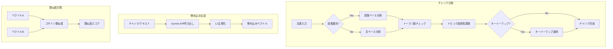
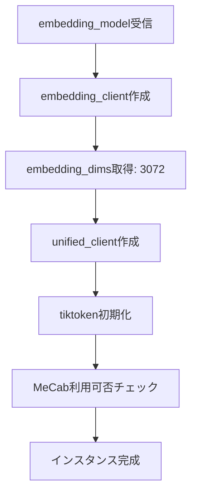
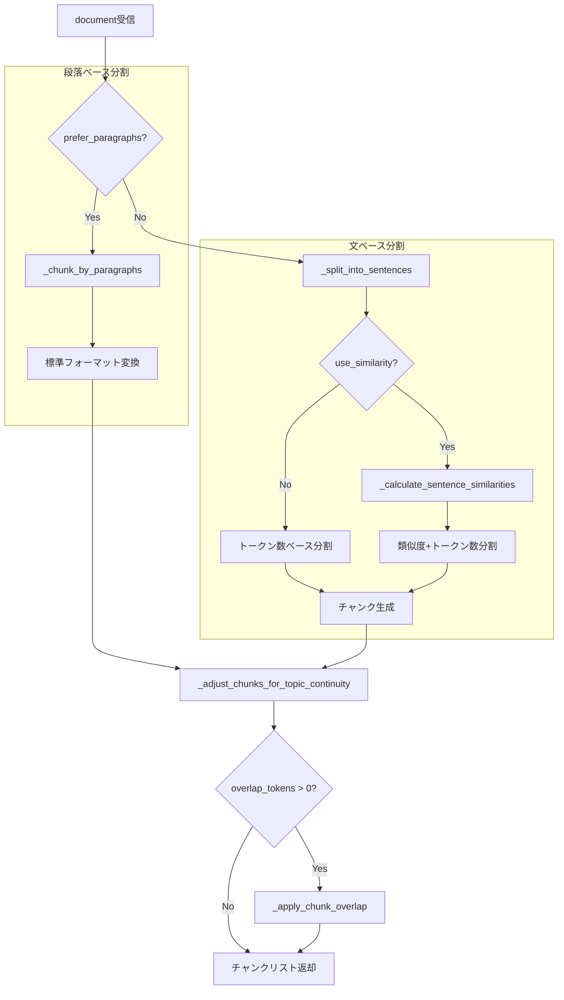
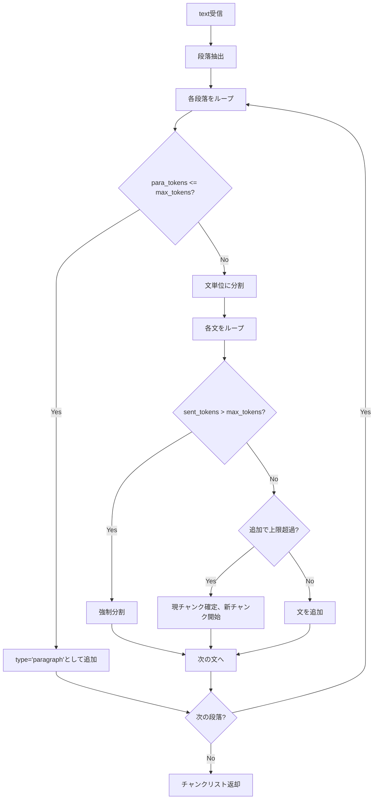
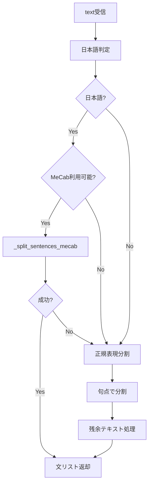
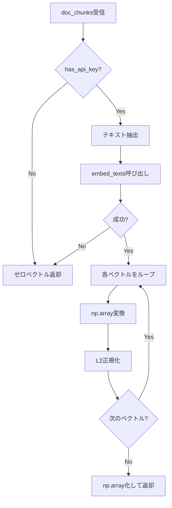
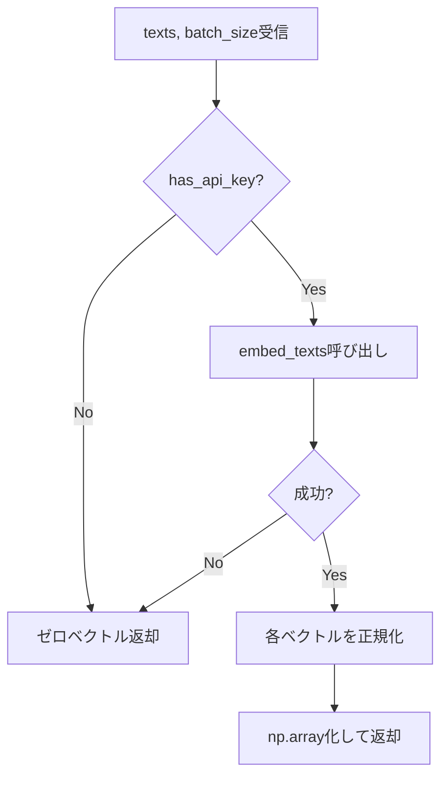
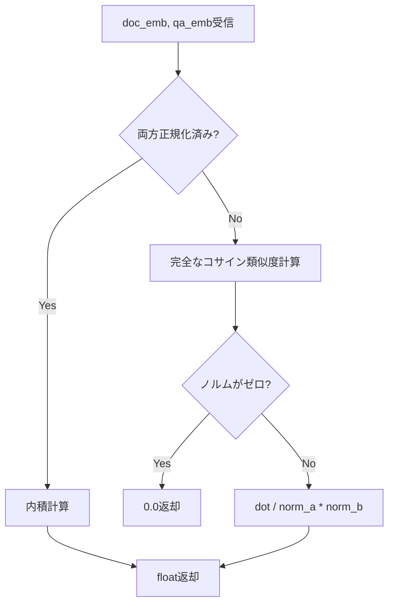
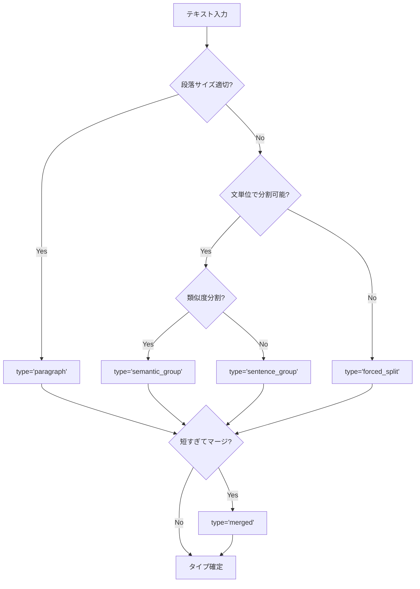

# semantic.py 完全ガイド

## 概要

`qa_generation/semantic.py` は、**セマンティック（意味的）分析とカバレッジ測定を行うモジュール**です。文書のセマンティックチャンク分割、埋め込みベクトル生成、コサイン類似度計算など、Q/A生成システムの基盤となる機能を提供します。

---

## 目次

1. [アーキテクチャ](#アーキテクチャ)
2. [クラス・メソッド一覧](#クラスメソッド一覧)
3. [IPO詳細（Input/Process/Output）](#ipo詳細inputprocessoutput)
4. [セマンティックチャンク分割](#セマンティックチャンク分割)
5. [埋め込みベクトル生成](#埋め込みベクトル生成)
6. [使用方法](#使用方法)
7. [設定・パラメータ](#設定パラメータ)
8. [関連モジュール](#関連モジュール)

---

## アーキテクチャ

### 全体構成

```
┌─────────────────────────────────────────────────────────────┐
│                      semantic.py                            │
├─────────────────────────────────────────────────────────────┤
│                                                             │
│  ┌─────────────────────────────────────────────────────┐    │
│  │              SemanticCoverage クラス                 │    │
│  ├─────────────────────────────────────────────────────┤    │
│  │  【初期化】                                          │    │
│  │  __init__()                  # 初期化・クライアント設定 │   │
│  │  _check_mecab_availability() # MeCab利用可否チェック   │   │
│  │                                                     │   │
│  │  【チャンク分割】                                     │   │
│  │  create_semantic_chunks()    # メインチャンク分割      │   │
│  │  _chunk_by_paragraphs()      # 段落ベース分割         │   │
│  │  _split_into_paragraphs()    # 段落抽出             │   │
│  │  _split_into_sentences()     # 文分割               │   │
│  │  _split_sentences_mecab()    # MeCab文分割          │   │
│  │  _force_split_sentence()     # 強制分割             │   │
│  │  _adjust_chunks_for_topic_continuity()             │   │
│  │                              # トピック連続性調整     │   │
│  │  _apply_chunk_overlap()      # オーバーラップ適用     │   │
│  │  _calculate_sentence_similarities()                │   │
│  │                              # 文間類似度計算        │   │
│  │                                                    │   │
│  │  【埋め込み生成】                                     │   │
│  │  generate_embeddings()       # チャンク埋め込み生成    │   │
│  │  generate_embedding()        # 単一テキスト埋め込み    │   │
│  │  generate_embeddings_batch() # バッチ埋め込み生成      │   │
│  │                                                     │    │
│  │  【類似度計算】                                       │    │
│  │  cosine_similarity()         # コサイン類似度計算      │    │
│  └─────────────────────────────────────────────────────┘    │
│                                                             │
└─────────────────────────────────────────────────────────────┘
                              │
              ┌───────────────┼───────────────┐
              ▼               ▼               ▼
┌─────────────────┐ ┌─────────────────┐ ┌─────────────────┐
│  helper_llm     │ │ helper_embedding│ │    MeCab        │
│  (トークン計算)   │ │  (埋め込み生成)   │ │  (日本語分割)     │
└─────────────────┘ └─────────────────┘ └─────────────────┘
```

### 処理フロー概要



---

## クラス・メソッド一覧

### SemanticCoverageクラス

| メソッド名 | 可視性 | 機能概要 |
|-----------|:-----:|---------|
| `__init__` | public | 初期化。埋め込みクライアント、LLMクライアント、トークナイザーの設定 |
| `_check_mecab_availability` | private | MeCabの利用可能性をチェック |
| `create_semantic_chunks` | public | 文書をセマンティックチャンクに分割（メイン関数） |
| `_chunk_by_paragraphs` | private | 段落単位でチャンク化 |
| `_split_into_paragraphs` | private | テキストを段落に分割 |
| `_split_into_sentences` | private | テキストを文に分割（言語自動判定） |
| `_split_sentences_mecab` | private | MeCabを使用した日本語文分割 |
| `_force_split_sentence` | private | 単一文を強制的にトークン分割 |
| `_adjust_chunks_for_topic_continuity` | private | 短いチャンクを隣接チャンクとマージ |
| `_apply_chunk_overlap` | private | チャンク間にオーバーラップを適用 |
| `_calculate_sentence_similarities` | private | 隣接文間のコサイン類似度を計算 |
| `generate_embeddings` | public | チャンクリストから埋め込みベクトルを生成 |
| `generate_embedding` | public | 単一テキストの埋め込みを生成 |
| `generate_embeddings_batch` | public | 複数テキストの埋め込みを一括生成 |
| `cosine_similarity` | public | 2つのベクトルのコサイン類似度を計算 |

---

## IPO詳細（Input/Process/Output）

### \_\_init\_\_()

#### IPO

| 区分 | 内容 |
|-----|------|
| **Input** | `embedding_model`: str（埋め込みモデル名、デフォルト: "gemini-embedding-001"） |
| **Process** | 1. 埋め込みクライアント初期化（Gemini）<br>2. 埋め込み次元数取得（3072）<br>3. LLMクライアント初期化（トークン計算用）<br>4. tiktokenエンコーダ初期化<br>5. MeCab利用可否チェック |
| **Output** | SemanticCoverageインスタンス |

#### プロセスフロー



---

### create_semantic_chunks()

#### IPO

| 区分 | 内容 |
|-----|------|
| **Input** | `document`: str（分割対象文書）<br>`max_tokens`: int（最大トークン数、デフォルト200）<br>`min_tokens`: int（最小トークン数、デフォルト50）<br>`overlap_tokens`: int（オーバーラップトークン数、デフォルト0）<br>`use_similarity`: bool（類似度分割使用、デフォルトFalse）<br>`similarity_threshold`: float（類似度閾値、デフォルト0.7）<br>`prefer_paragraphs`: bool（段落優先、デフォルトTrue）<br>`verbose`: bool（詳細出力、デフォルトTrue） |
| **Process** | 1. 段落ベース or 文ベース分割選択<br>2. トークン数に基づくチャンク作成<br>3. トピック連続性調整（短チャンクマージ）<br>4. オーバーラップ適用（指定時） |
| **Output** | `List[Dict]`: チャンク辞書のリスト |

#### プロセスフロー



#### 出力構造

```python
[
    {
        "id": "chunk_0",
        "text": "チャンクテキスト...",
        "type": "paragraph",  # paragraph/sentence_group/semantic_group/merged/forced_split
        "sentences": ["文1。", "文2。", ...],
        "start_sentence_idx": 0,
        "end_sentence_idx": 3,
        # オーバーラップ時のみ
        "overlap_text": "前チャンクの末尾文...",
        "is_overlapped": True
    },
    ...
]
```

---

### _chunk_by_paragraphs()

#### IPO

| 区分 | 内容 |
|-----|------|
| **Input** | `text`: str（分割対象テキスト）<br>`max_tokens`: int（最大トークン数）<br>`min_tokens`: int（最小トークン数） |
| **Process** | 1. 段落抽出<br>2. 各段落のトークン数チェック<br>3. 大きすぎる段落は文単位に分割<br>4. 超長文は強制分割 |
| **Output** | `List[Dict]`: {text, type}のリスト |

#### プロセスフロー



---

### _split_into_sentences()

#### IPO

| 区分 | 内容 |
|-----|------|
| **Input** | `text`: str（分割対象テキスト） |
| **Process** | 1. 日本語判定（最初の100文字）<br>2. 日本語かつMeCab利用可能→MeCab使用<br>3. それ以外→正規表現で句点分割 |
| **Output** | `List[str]`: 文のリスト |

#### プロセスフロー



#### 日本語判定パターン

```python
# ひらがな、カタカナ、漢字のいずれかを含むか
is_japanese = bool(re.search(r'[\u3040-\u309F\u30A0-\u30FF\u4E00-\u9FFF]', text[:100]))
```

---

### generate_embeddings()

#### IPO

| 区分 | 内容 |
|-----|------|
| **Input** | `doc_chunks`: List[Dict]（チャンクのリスト、各チャンクに'text'キーが必要） |
| **Process** | 1. APIキー有無チェック<br>2. テキスト抽出<br>3. Gemini Embedding API呼び出し<br>4. L2正規化 |
| **Output** | `np.ndarray`: 埋め込みベクトル配列 (N × 3072) |

#### プロセスフロー



#### L2正規化の重要性

```python
# 正規化によりコサイン類似度が内積で計算可能に
norm = np.linalg.norm(embedding)
if norm > 0:
    embedding = embedding / norm

# 正規化済みベクトル同士の場合
cosine_similarity = np.dot(vec_a, vec_b)  # 内積で計算可能
```

---

### generate_embeddings_batch()

#### IPO

| 区分 | 内容 |
|-----|------|
| **Input** | `texts`: List[str]（テキストのリスト）<br>`batch_size`: int（バッチサイズ、デフォルト100） |
| **Process** | 1. APIキー有無チェック<br>2. Gemini Embedding API呼び出し（バッチ処理）<br>3. L2正規化 |
| **Output** | `np.ndarray`: 埋め込みベクトル配列 (N × 3072) |

#### プロセスフロー



---

### cosine_similarity()

#### IPO

| 区分 | 内容 |
|-----|------|
| **Input** | `doc_emb`: np.ndarray（文書埋め込み）<br>`qa_emb`: np.ndarray（Q/A埋め込み） |
| **Process** | 1. 正規化済みチェック<br>2. 正規化済み→内積で計算<br>3. 未正規化→完全な計算 |
| **Output** | `float`: コサイン類似度 (-1.0 〜 1.0) |

#### プロセスフロー



#### 計算式

```
正規化済み: similarity = dot(a, b)
未正規化:   similarity = dot(a, b) / (||a|| × ||b||)
```

---

## セマンティックチャンク分割

### 分割の優先順位

```
1. 段落（paragraph）
   ├─ 筆者が意図的に作成した意味的まとまり
   └─ 最も重要なセマンティック境界

2. 文グループ（sentence_group）
   ├─ 段落が大きすぎる場合に文単位で分割
   └─ トークン数制限を考慮

3. セマンティックグループ（semantic_group）
   ├─ 類似度ベースの分割を使用した場合
   └─ 文間の類似度が閾値を下回る箇所で分割

4. マージ済み（merged）
   ├─ 短いチャンクを隣接チャンクと結合
   └─ トピック連続性を維持

5. 強制分割（forced_split）
   ├─ 単一文が上限超過の場合
   └─ セマンティック境界を無視してトークン分割
```

### チャンクタイプの決定フロー



### トークン数の基準

| 設定項目 | デフォルト値 | 説明 |
|---------|:-----------:|------|
| max_tokens | 200 | チャンクの最大トークン数 |
| min_tokens | 50 | これより小さい場合はマージを検討 |
| マージ上限 | 300 | マージ後のトークン数上限 |

---

## 埋め込みベクトル生成

### Gemini Embedding仕様

| 項目 | 値 |
|-----|---|
| モデル | gemini-embedding-001 |
| 次元数 | 3072 |
| 正規化 | L2正規化（自動適用） |

### 埋め込み生成の最適化

```python
# バッチ処理による効率化
embeddings = analyzer.generate_embeddings_batch(texts, batch_size=100)

# 正規化済みのため、内積でコサイン類似度が計算可能
similarity_matrix = np.dot(embeddings, embeddings.T)
```

### エラーハンドリング

```python
# APIキーなし or APIエラー時
return np.zeros((len(texts), 3072))  # ゼロベクトルを返却
```

---

## 使用方法

### 基本的な使用例

```python
from qa_generation.semantic import SemanticCoverage

# 初期化
analyzer = SemanticCoverage()

# セマンティックチャンク分割
document = """
これは最初の段落です。重要な情報が含まれています。

これは2番目の段落です。別のトピックについて説明しています。
詳細な情報も含まれています。
"""

chunks = analyzer.create_semantic_chunks(
    document,
    max_tokens=200,
    min_tokens=50,
    prefer_paragraphs=True
)

for chunk in chunks:
    print(f"ID: {chunk['id']}, Type: {chunk['type']}")
    print(f"Text: {chunk['text'][:50]}...")
```

### 埋め込み生成

```python
# チャンクの埋め込み生成
embeddings = analyzer.generate_embeddings(chunks)
print(f"Shape: {embeddings.shape}")  # (N, 3072)

# 単一テキストの埋め込み
embedding = analyzer.generate_embedding("質問テキスト")
print(f"Shape: {embedding.shape}")  # (3072,)

# バッチ埋め込み
texts = ["テキスト1", "テキスト2", "テキスト3"]
embeddings = analyzer.generate_embeddings_batch(texts)
```

### 類似度計算

```python
# 2つのテキストの類似度を計算
emb1 = analyzer.generate_embedding("AES-256は256ビットの鍵長を持つ")
emb2 = analyzer.generate_embedding("AES-256の鍵長は256ビット")

similarity = analyzer.cosine_similarity(emb1, emb2)
print(f"類似度: {similarity:.3f}")  # 0.95程度
```

### オーバーラップ付きチャンク分割

```python
chunks = analyzer.create_semantic_chunks(
    document,
    max_tokens=200,
    overlap_tokens=50,  # 50トークン分の重複
    prefer_paragraphs=True
)

for chunk in chunks:
    if chunk.get('is_overlapped'):
        print(f"オーバーラップ: {chunk['overlap_text'][:30]}...")
```

### 類似度ベース分割

```python
chunks = analyzer.create_semantic_chunks(
    document,
    use_similarity=True,
    similarity_threshold=0.7,
    prefer_paragraphs=False  # 文ベース分割を使用
)
```

---

## 設定・パラメータ

### 初期化パラメータ

| パラメータ | 型 | デフォルト | 説明 |
|----------|---|----------|------|
| `embedding_model` | str | "gemini-embedding-001" | 使用する埋め込みモデル |

### create_semantic_chunksパラメータ

| パラメータ | 型 | デフォルト | 説明 |
|----------|---|----------|------|
| `document` | str | - | 分割対象の文書 |
| `max_tokens` | int | 200 | チャンクの最大トークン数 |
| `min_tokens` | int | 50 | チャンクの最小トークン数 |
| `overlap_tokens` | int | 0 | オーバーラップトークン数 |
| `use_similarity` | bool | False | 類似度ベース分割を使用 |
| `similarity_threshold` | float | 0.7 | 分割判定の類似度閾値 |
| `prefer_paragraphs` | bool | True | 段落ベース分割を優先 |
| `verbose` | bool | True | 詳細なログ出力 |

### 内部設定値

| 項目 | 値 | 説明 |
|-----|---|------|
| 埋め込み次元数 | 3072 | Gemini Embeddingの出力次元 |
| バッチサイズ（デフォルト） | 100 | 埋め込み生成時のデフォルトバッチサイズ |
| トークナイザー | cl100k_base | tiktoken使用 |
| マージ上限 | 300 | チャンクマージ時の最大トークン数 |

---

## 関連モジュール

| モジュール | 関係 |
|-----------|------|
| `qa_generation/evaluation.py` | SemanticCoverageを使用してカバレッジ分析 |
| `qa_generation/pipeline.py` | チャンク分割にSemanticCoverageを使用（v2.x以前） |
| `helper/helper_embedding.py` | 埋め込みクライアントを提供 |
| `helper/helper_llm.py` | LLMクライアント（トークン計算用）を提供 |

### evaluation.pyでの使用例

```python
# evaluation.py内部
analyzer = SemanticCoverage()

# チャンク埋め込み
doc_embeddings = analyzer.generate_embeddings(chunks)

# Q/A埋め込み（バッチ）
qa_embeddings = analyzer.generate_embeddings_batch(qa_texts, batch_size=2048)

# カバレッジ行列計算
coverage_matrix = np.dot(doc_embeddings, qa_embeddings.T)
```

---

## ベストプラクティス

### 1. チャンク分割の選択

```python
# 通常のドキュメント（段落構造あり）
chunks = analyzer.create_semantic_chunks(
    document,
    prefer_paragraphs=True
)

# 段落構造がない/不明確なテキスト
chunks = analyzer.create_semantic_chunks(
    document,
    prefer_paragraphs=False,
    use_similarity=True
)
```

### 2. 適切なトークン数設定

```python
# 短めのチャンク（詳細なQ/A生成向け）
chunks = analyzer.create_semantic_chunks(
    document,
    max_tokens=150,
    min_tokens=30
)

# 長めのチャンク（コンテキスト重視）
chunks = analyzer.create_semantic_chunks(
    document,
    max_tokens=300,
    min_tokens=100
)
```

### 3. オーバーラップの活用

```python
# 文脈を維持したい場合
chunks = analyzer.create_semantic_chunks(
    document,
    overlap_tokens=50  # 約1-2文分
)
```

### 4. 大量テキストの埋め込み生成

```python
# 大量のテキストを処理する場合はバッチサイズを調整
embeddings = analyzer.generate_embeddings_batch(
    texts,
    batch_size=2048  # APIの制限に応じて調整
)
```

---

**作成日**: 2025-01-27
**対象ファイル**: `qa_generation/semantic.py`
**総行数**: 537行
