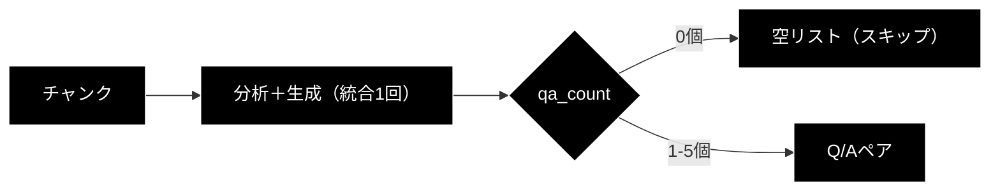
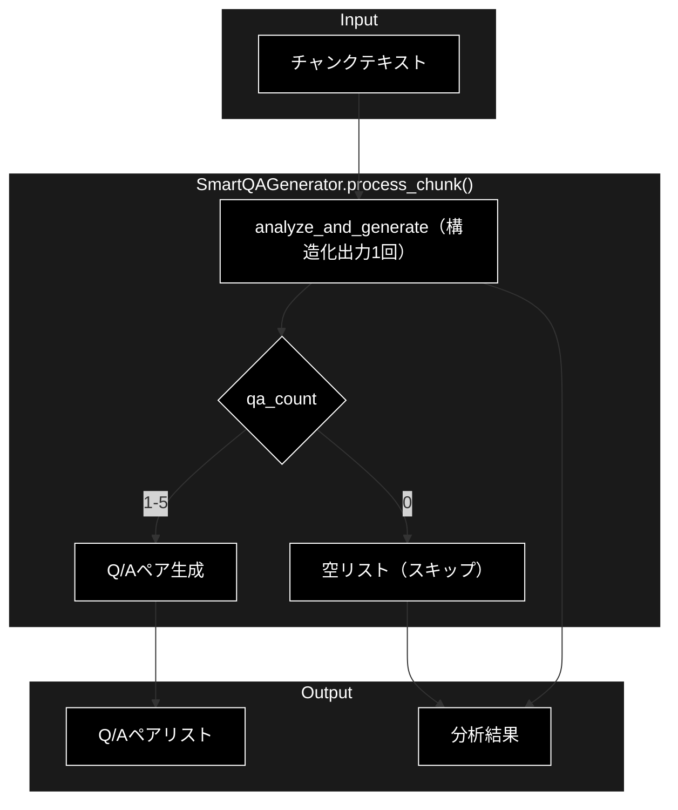
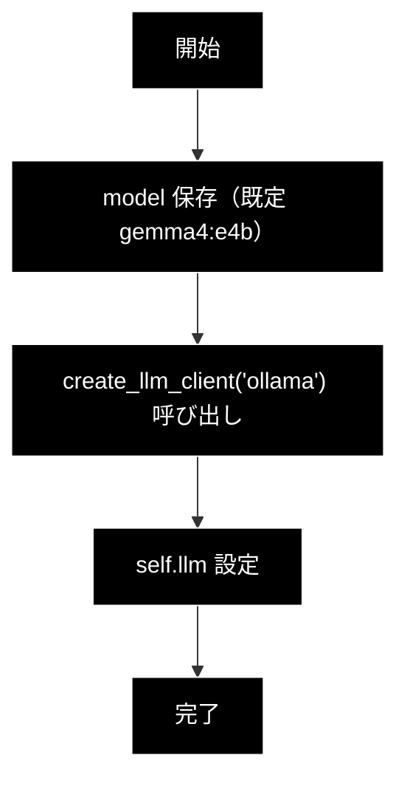
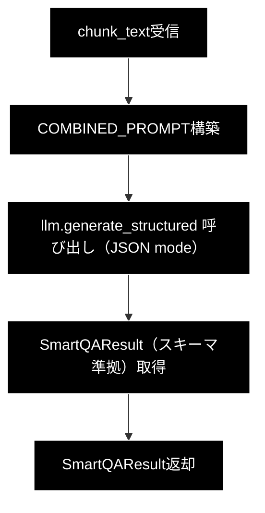
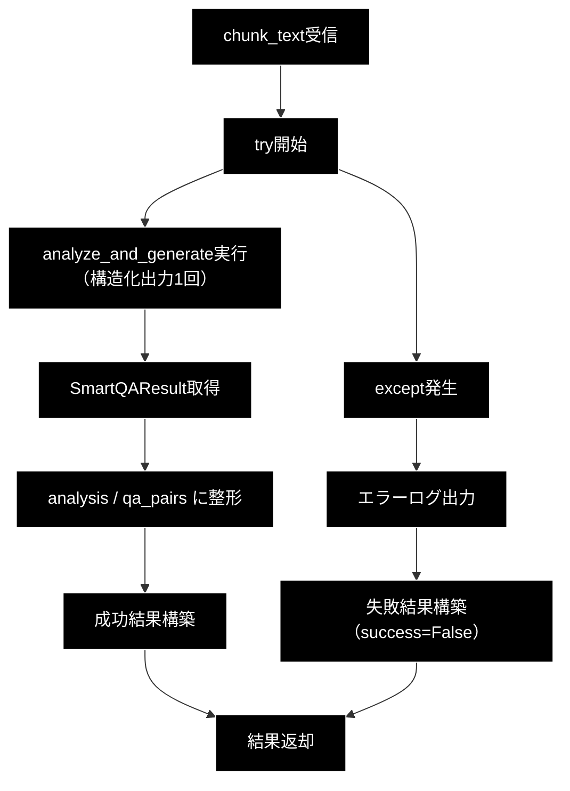
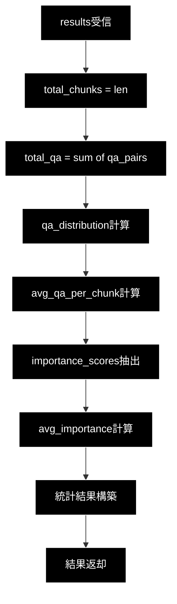

# smart_qa_generator.py 完全ガイド（v3.0）

## 概要

`qa_generation/smart_qa_generator.py` は、**コンテンツを考慮したインテリジェントQ/A生成システム**です。従来の固定数Q/A生成方式と異なり、LLM（Ollama・ローカルLLM）によるチャンク分析を行い、各チャンクの情報密度・重要度・複雑さに応じて最適なQ/A数を動的に決定します。

v3.0 では分析（`analyze_chunk`）と生成（`generate_qa_pairs`）の2段階方式を廃止し、Ollama の JSON mode 構造化出力（`{"qa_pairs":[...]}` を含む `SmartQAResult`）による **1回呼び出し** に統合しました。Markdownフェンス手剥がし＋`json.raw_decode` の脆弱なパースも排除されています。LLM はローカル実行のため API キーは不要で、API コストも発生しません。

---

## 目次

1. [SmartQAGeneratorの優位性](#smartqageneratorの優位性)
2. [アーキテクチャ](#アーキテクチャ)
3. [クラス・関数一覧](#クラス関数一覧)
4. [IPO詳細（Input/Process/Output）](#ipo詳細inputprocessoutput)
5. [使用方法](#使用方法)
6. [判断基準とQ/A数決定ロジック](#判断基準とqa数決定ロジック)
7. [エラーハンドリング](#エラーハンドリング)
8. [設定・パラメータ](#設定パラメータ)

---

## SmartQAGeneratorの優位性

### 従来方式との比較

| 観点 | 従来方式 | SmartQAGenerator |
|-----|---------|------------------|
| **Q/A数決定** | 固定（例: 3個/チャンク） | 動的（0〜5個/チャンク） |
| **コンテンツ考慮** | なし | 情報密度・重要度・複雑さを分析 |
| **メタ情報処理** | 無駄なQ/Aを生成 | 0個（スキップ） |
| **高密度情報** | 情報損失の可能性 | 4〜5個で網羅的にカバー |
| **品質** | 均一（低〜中） | コンテンツに最適化（高） |

### 主な優位性

#### 1. コンテンツ適応型Q/A数決定

```
従来: すべてのチャンク → 固定3個のQ/A
Smart: チャンク分析 → 0〜5個の最適なQ/A数
```

- **メタ情報チャンク**（「詳細は付録参照」など）→ **0個**（無駄を排除）
- **単純な事実**（「製品は赤色です」）→ **1個**
- **標準的な説明**（複数の関連情報）→ **2〜3個**
- **高密度技術情報**（API仕様、暗号化詳細）→ **4〜5個**

#### 2. 重要トピックの明示化

分析フェーズで抽出された `key_topics` を生成フェーズに渡すことで、重要な情報を優先的にQ/A化します。

```python
# 分析結果例
{
    'qa_count': 4,
    'key_topics': ['暗号化方式', '鍵長', 'ブロックサイズ', '利用モード'],
    'importance_score': 0.9,
    'complexity': 'high'
}
```

#### 3. 構造化出力1回による品質向上



- **統合呼び出し**: `temperature=0.2` で安定した分析と自然な生成を1回で実行
- Ollama の JSON mode 構造化出力（`SmartQAResult`）でスキーマ準拠の結果を取得

#### 4. 構造化出力による堅牢化

JSON mode 構造化出力（`{"qa_pairs":[...]}`）でスキーマ準拠の結果を直接受け取るため、Markdownフェンス手剥がし＋`json.raw_decode` の脆弱なパースは不要です。構造化出力に失敗した場合は `success=False` を返し、呼び出し側でそのチャンクをスキップします。

#### 5. 統計分析機能

処理結果の品質を数値で把握できます。

```python
{
    'total_chunks': 100,
    'total_qa_pairs': 245,
    'avg_qa_per_chunk': 2.45,
    'avg_importance_score': 0.72,
    'qa_distribution': {0: 5, 1: 15, 2: 30, 3: 35, 4: 12, 5: 3}
}
```

---

## アーキテクチャ

### 全体構成

```
┌─────────────────────────────────────────────────────────────┐
│                   smart_qa_generator.py                     │
├─────────────────────────────────────────────────────────────┤
│                                                             │
│  ┌─────────────────────────────────────────────────────┐    │
│  │              SmartQAGenerator クラス                 │    │
│  ├─────────────────────────────────────────────────────┤    │
│  │  __init__()             # 初期化・Ollamaクライアント    │    │
│  │  analyze_and_generate() # 構造化出力1回（分析＋生成）   │    │
│  │  process_chunk()        # 一括処理（メイン）           │   │
│  └─────────────────────────────────────────────────────┘   │
│                                                            │
│  ┌─────────────────────────────────────────────────────┐   │
│  │           ユーティリティ関数                           │   │
│  ├─────────────────────────────────────────────────────┤   │
│  │  analyze_qa_statistics()  # 統計分析                  │   │
│  └─────────────────────────────────────────────────────┘    │
│                                                             │
└─────────────────────────────────────────────────────────────┘
                              │
                              ▼
┌─────────────────────────────────────────────────────────────┐
│                  Ollama API（OpenAI 互換）                   │
│  └─ create_llm_client("ollama").generate_structured()       │
│       JSON mode 構造化出力 → SmartQAResult                   │
└─────────────────────────────────────────────────────────────┘
```

### 処理フロー



---

## クラス・関数一覧

### クラス一覧

| クラス名 | 機能概要 |
|---------|---------|
| `SmartQAGenerator` | コンテンツを考慮したインテリジェントQ/A生成を行うメインクラス。チャンク分析とQ/A生成の両機能を提供。 |

### メソッド一覧（SmartQAGenerator）

| メソッド名 | 可視性 | 機能概要 |
|-----------|:-----:|---------|
| `__init__` | public | インスタンス初期化。`create_llm_client("ollama")` で Ollama クライアントを生成。 |
| `analyze_and_generate` | public | チャンク分析とQ/A生成を JSON mode 構造化出力1回で実行し `SmartQAResult` を返す。 |
| `process_chunk` | public | 分析と生成を一括実行するメインメソッド。結果を dict に整形。 |

### 構造化出力スキーマ一覧

| クラス名 | 機能概要 |
|---------|---------|
| `SmartQAPair` | Q/Aペア1件（`question` / `answer` / `topic`）の Pydantic モデル。 |
| `SmartQAResult` | チャンク分析とQ/A生成の統合結果（`qa_count` / `key_topics` / `importance_score` / `complexity` / `reasoning` / `qa_pairs`）。 |

### ユーティリティ関数一覧

| 関数名 | 機能概要 |
|-------|---------|
| `analyze_qa_statistics` | 複数チャンクの処理結果を統計分析し、Q/A数分布・平均重要度などを算出。 |

---

## IPO詳細（Input/Process/Output）

### SmartQAGenerator.\_\_init\_\_()

#### IPO

| 区分 | 内容 |
|-----|------|
| **Input** | `model`: str（使用モデル名、デフォルト: "gemma4:e4b"）<br>`api_key`: Optional[str]（未使用。Ollama はローカル実行のためキー不要） |
| **Process** | 1. モデル名の保存<br>2. `create_llm_client("ollama", default_model=...)` で Ollama クライアント生成 |
| **Output** | SmartQAGeneratorインスタンス |

#### プロセスフロー



---

### SmartQAGenerator.analyze_and_generate()

#### IPO

| 区分 | 内容 |
|-----|------|
| **Input** | `chunk_text`: str（分析・生成対象のチャンクテキスト） |
| **Process** | 1. `COMBINED_PROMPT` を構築（分析基準＋生成ガイドラインを内包）<br>2. `self.llm.generate_structured()` を1回呼び出し（`response_schema=SmartQAResult`, `temperature=0.2`, JSON mode）<br>3. スキーマ準拠の `SmartQAResult` を取得（`qa_count` は 0-5、`importance_score` は 0.0-1.0 をスキーマで保証） |
| **Output** | `SmartQAResult`: {qa_count, key_topics, importance_score, complexity, reasoning, qa_pairs} |

#### プロセスフロー



#### 出力構造（SmartQAResult）

```python
{
    'qa_count': int,                 # 生成すべきQ/A数（0-5）
    'key_topics': List[str],         # 主要トピック
    'importance_score': float,       # 重要度（0.0-1.0）
    'complexity': str,               # 複雑さ（low/medium/high）
    'reasoning': str,                # 判断理由
    'qa_pairs': List[SmartQAPair]    # 生成Q/A（qa_count個。0なら空リスト）
}

# SmartQAPair
{
    'question': str,  # 質問文
    'answer': str,    # 回答文（50-150文字程度）
    'topic': str      # トピック（1-3単語）
}
```

---

### SmartQAGenerator.process_chunk()

#### IPO

| 区分 | 内容 |
|-----|------|
| **Input** | `chunk_text`: str（チャンクテキスト） |
| **Process** | 1. analyze_and_generate実行（構造化出力1回）<br>2. `SmartQAResult` を analysis / qa_pairs の dict に整形<br>3. 結果統合<br>4. エラー時は失敗結果（success=False）返却 |
| **Output** | `Dict`: {analysis, qa_pairs, success} |

#### プロセスフロー



#### 出力構造

```python
{
    'analysis': Dict,        # analyze_chunk()の結果
    'qa_pairs': List[Dict],  # generate_qa_pairs()の結果
    'success': bool          # 処理成功フラグ
}
```

---

### analyze_qa_statistics()

#### IPO

| 区分 | 内容 |
|-----|------|
| **Input** | `results`: List[Dict]（process_chunk()の結果リスト） |
| **Process** | 1. 総チャンク数カウント<br>2. 総Q/A数カウント<br>3. Q/A数分布計算<br>4. 平均Q/A数計算<br>5. 平均重要度計算 |
| **Output** | `Dict`: {total_chunks, total_qa_pairs, avg_qa_per_chunk, avg_importance_score, qa_distribution} |

#### プロセスフロー



#### 出力構造

```python
{
    'total_chunks': int,           # 総チャンク数
    'total_qa_pairs': int,         # 総Q/A数
    'avg_qa_per_chunk': float,     # 平均Q/A数/チャンク
    'avg_importance_score': float, # 平均重要度
    'qa_distribution': Dict[int, int]  # Q/A数分布 {0: 5, 1: 15, ...}
}
```

---

## 使用方法

### 基本的な使用例

```python
from qa_generation.smart_qa_generator import SmartQAGenerator

# 初期化（Ollama・ローカルLLM。APIキー不要）
generator = SmartQAGenerator(model="gemma4:e4b")

# 単一チャンク処理
result = generator.process_chunk(chunk_text)

if result['success']:
    print(f"分析結果: {result['analysis']}")
    print(f"生成Q/A数: {len(result['qa_pairs'])}")
    for qa in result['qa_pairs']:
        print(f"Q: {qa['question']}")
        print(f"A: {qa['answer']}")
```

### 複数チャンクの一括処理

```python
from qa_generation.smart_qa_generator import SmartQAGenerator, analyze_qa_statistics

generator = SmartQAGenerator()

# 複数チャンク処理
results = []
for chunk in chunks:
    result = generator.process_chunk(chunk['text'])
    results.append(result)

# 統計分析
stats = analyze_qa_statistics(results)
print(f"総Q/A数: {stats['total_qa_pairs']}")
print(f"平均Q/A数/チャンク: {stats['avg_qa_per_chunk']:.2f}")
```

### 分析結果と生成Q/Aを直接扱う場合

```python
# 分析＋生成を構造化出力1回で実行（SmartQAResult を直接取得）
result = generator.analyze_and_generate(chunk_text)
print(f"推奨Q/A数: {result.qa_count}")
print(f"主要トピック: {result.key_topics}")

for qa in result.qa_pairs:
    print(f"Q: {qa.question}")
    print(f"A: {qa.answer}（topic: {qa.topic}）")
```

---

## 判断基準とQ/A数決定ロジック

### Q/A数の判断基準

| Q/A数 | 判断基準 | 例 |
|:-----:|---------|---|
| **0** | 補足情報のみ、メタ情報、意味のない繰り返し | 「詳細は付録参照」「ページ番号: 42」 |
| **1** | 単純な事実の記述（1つの情報のみ） | 「この製品は赤色です。」 |
| **2** | 関連する2つの事実 | 「製品は赤色で、サイズはMです。」 |
| **3** | 複数の関連情報、標準的な説明パラグラフ | 一般的な製品説明、概要説明 |
| **4-5** | 高密度な技術情報、複数の独立したポイント、警告・注意事項 | API仕様、暗号化詳細、安全上の注意 |

### 分析プロンプトの観点

1. **情報密度**: チャンクに含まれる独立した情報・事実の数
2. **重要度**: 情報の重要性（critical/high/medium/low）
3. **複雑さ**: 説明に必要な詳細度（high/medium/high）
4. **独立性**: 各情報が他の文脈なしで理解可能か

---

## エラーハンドリング

### 構造化出力失敗時の挙動

JSON mode 構造化出力（`SmartQAResult`）が失敗・例外となった場合、`process_chunk()` は `success=False` を返し、呼び出し側でそのチャンクをスキップします。文字数ベースのフォールバック判定は v3.0 で廃止されました。

### エラー時の戻り値

```python
# process_chunk エラー時
{
    'analysis': {},
    'qa_pairs': [],
    'success': False
}
```

---

## 設定・パラメータ

### 初期化パラメータ

| パラメータ | 型 | デフォルト | 説明 |
|----------|---|----------|------|
| `model` | str | "gemma4:e4b" | 使用する Ollama モデル（代替: `llama3.2`） |
| `api_key` | Optional[str] | None | 未使用。Ollama はローカル実行のため API キー不要 |

### 内部設定値

| 項目 | 値 | 用途 |
|-----|---|------|
| 統合temperature | 0.2 | 分析と生成を安定して行うための低温度（構造化出力1回） |
| max_tokens | 4096 | 構造化出力の最大トークン数 |
| Q/A数上限 | 5 | 最大Q/A数（`SmartQAResult.qa_count` をスキーマで制約） |
| Q/A数下限 | 0 | 最小Q/A数（スキップ） |
| importance_score上限 | 1.0 | 最大重要度 |
| importance_score下限 | 0.0 | 最小重要度 |

### LLM プロバイダー・API

| 項目 | 内容 |
|-----|------|
| プロバイダー | Ollama（ローカルLLM）に固定 |
| クライアント生成 | `create_llm_client("ollama", default_model=...)` |
| API 形式 | Ollama API（OpenAI 互換）。`generate_structured()`（JSON mode） |
| APIキー | 不要（ローカル実行） |
| 接続先 | 任意で環境変数 `OLLAMA_BASE_URL` を指定可能 |
| コスト | ローカル実行のため API コストは発生しない（トークン集計のみ） |

---

## 関連モジュール

| モジュール | 関係 |
|-----------|------|
| `qa_generation/pipeline.py` | SmartQAGeneratorを使用してQ/A生成を実行 |
| `qa_generation/evaluation.py` | 生成されたQ/Aのカバレッジを分析 |
| `qa_generation/models.py` | Q/Aペアのデータモデル定義 |
| `celery_tasks.py` | 並列処理時にSmartQAGeneratorを呼び出し |

---

**作成日**: 2025-01-27
**最終更新**: 2026-06-21
**対象ファイル**: `qa_generation/smart_qa_generator.py`
**バージョン**: v3.0

## 変更履歴

| 日付 | 内容 |
|-----|------|
| 2025-01-27 | 初版（v2.5・2段階方式） |
| 2026-06-21 | Ollama ネイティブ化の表記統一・Mermaid §7 スタイル整備（v3.0：分析＋生成の構造化出力1回への統合を反映） |
