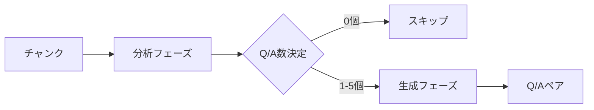
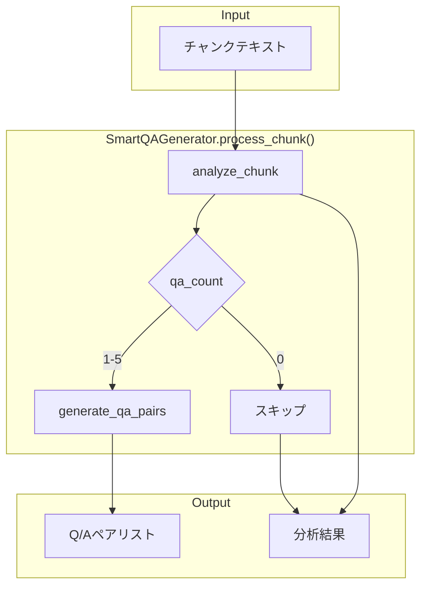
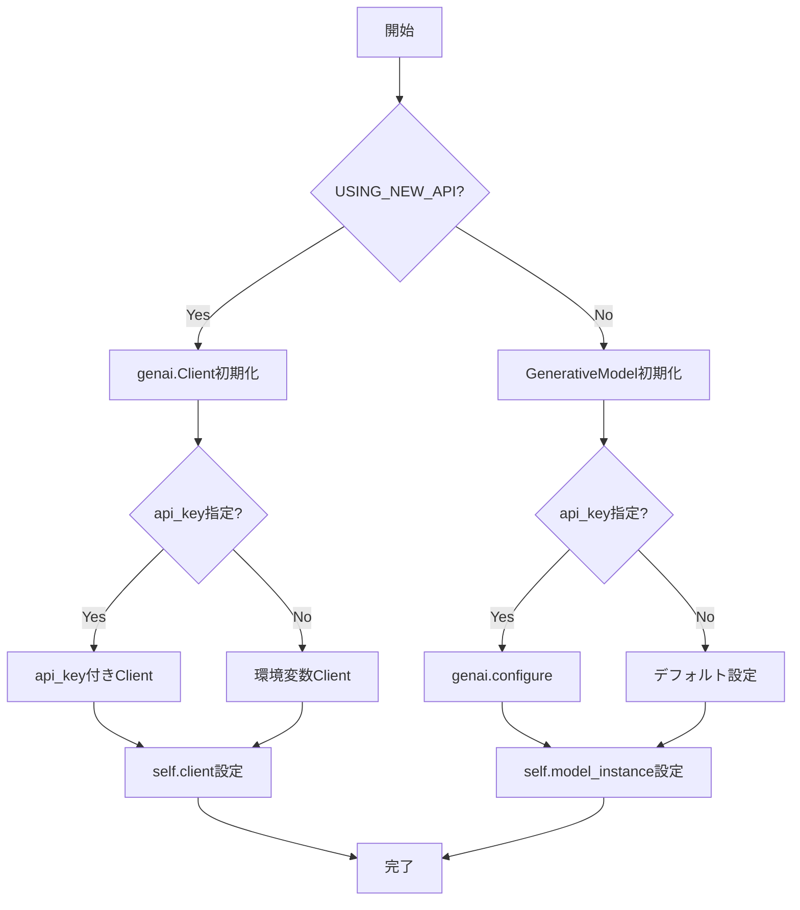
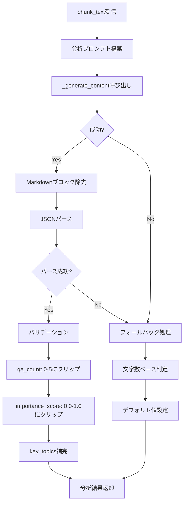
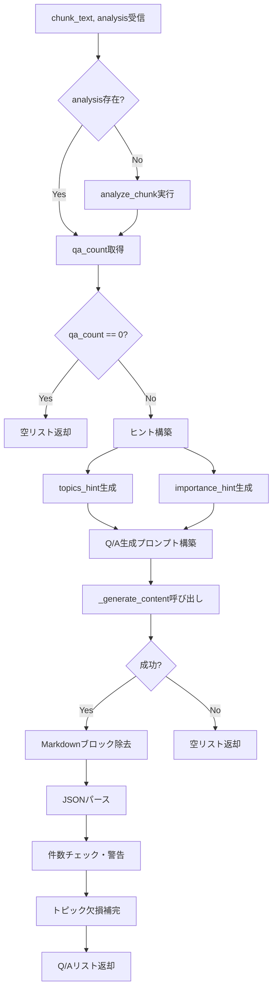
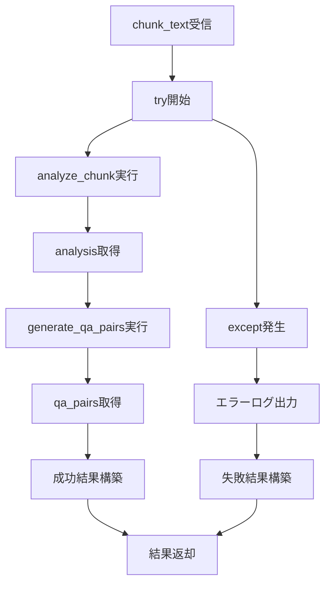
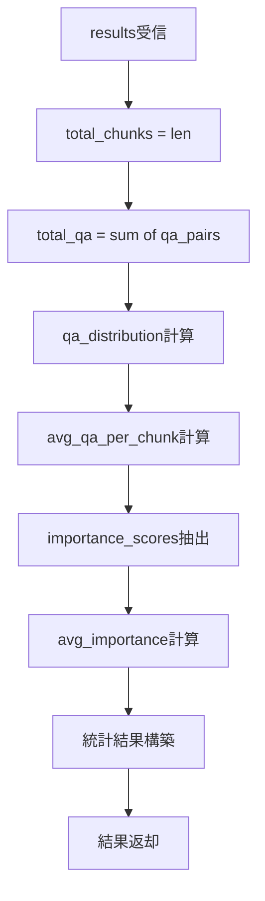

# smart_qa_generator.py 完全ガイド（v2.5）

## 概要

`qa_generation/smart_qa_generator.py` は、**コンテンツを考慮したインテリジェントQ/A生成システム**です。従来の固定数Q/A生成方式と異なり、LLMによるチャンク分析を行い、各チャンクの情報密度・重要度・複雑さに応じて最適なQ/A数を動的に決定します。

---

## 目次

1. [SmartQAGeneratorの優位性](#smartqageneratorの優位性)
2. [アーキテクチャ](#アーキテクチャ)
3. [クラス・関数一覧](#クラス関数一覧)
4. [IPO詳細（Input/Process/Output）](#ipo詳細inputprocessoutput)
5. [使用方法](#使用方法)
6. [判断基準とQ/A数決定ロジック](#判断基準とqa数決定ロジック)
7. [エラーハンドリング](#エラーハンドリング)
8. [設定・パラメータ](#設定パラメータ)

---

## SmartQAGeneratorの優位性

### 従来方式との比較

| 観点 | 従来方式 | SmartQAGenerator |
|-----|---------|------------------|
| **Q/A数決定** | 固定（例: 3個/チャンク） | 動的（0〜5個/チャンク） |
| **コンテンツ考慮** | なし | 情報密度・重要度・複雑さを分析 |
| **メタ情報処理** | 無駄なQ/Aを生成 | 0個（スキップ） |
| **高密度情報** | 情報損失の可能性 | 4〜5個で網羅的にカバー |
| **品質** | 均一（低〜中） | コンテンツに最適化（高） |

### 主な優位性

#### 1. コンテンツ適応型Q/A数決定

```
従来: すべてのチャンク → 固定3個のQ/A
Smart: チャンク分析 → 0〜5個の最適なQ/A数
```

- **メタ情報チャンク**（「詳細は付録参照」など）→ **0個**（無駄を排除）
- **単純な事実**（「製品は赤色です」）→ **1個**
- **標準的な説明**（複数の関連情報）→ **2〜3個**
- **高密度技術情報**（API仕様、暗号化詳細）→ **4〜5個**

#### 2. 重要トピックの明示化

分析フェーズで抽出された `key_topics` を生成フェーズに渡すことで、重要な情報を優先的にQ/A化します。

```python
# 分析結果例
{
    'qa_count': 4,
    'key_topics': ['暗号化方式', '鍵長', 'ブロックサイズ', '利用モード'],
    'importance_score': 0.9,
    'complexity': 'high'
}
```

#### 3. 2段階処理による品質向上



- **分析フェーズ**: 低温度（0.1）で安定した判断
- **生成フェーズ**: 中温度（0.3）で自然な文章生成

#### 4. フォールバック機構

API障害時でも文字数ベースの簡易判定で処理を継続します。

```python
# フォールバック基準
token_count < 50   → 0個
token_count < 100  → 1個
token_count < 200  → 2個
token_count >= 200 → 3個
```

#### 5. 統計分析機能

処理結果の品質を数値で把握できます。

```python
{
    'total_chunks': 100,
    'total_qa_pairs': 245,
    'avg_qa_per_chunk': 2.45,
    'avg_importance_score': 0.72,
    'qa_distribution': {0: 5, 1: 15, 2: 30, 3: 35, 4: 12, 5: 3}
}
```

---

## アーキテクチャ

### 全体構成

```
┌─────────────────────────────────────────────────────────────┐
│                   smart_qa_generator.py                     │
├─────────────────────────────────────────────────────────────┤
│                                                             │
│  ┌─────────────────────────────────────────────────────┐    │
│  │              SmartQAGenerator クラス                 │    │
│  ├─────────────────────────────────────────────────────┤    │
│  │  __init__()           # 初期化・API設定               │    │
│  │  _generate_content()  # LLM呼び出し（内部）            │    │
│  │  analyze_chunk()      # チャンク分析                  │    │
│  │  generate_qa_pairs()  # Q/Aペア生成                   │   │
│  │  process_chunk()      # 一括処理（メイン）             │   │
│  └─────────────────────────────────────────────────────┘   │
│                                                            │
│  ┌─────────────────────────────────────────────────────┐   │
│  │           ユーティリティ関数                           │   │
│  ├─────────────────────────────────────────────────────┤   │
│  │  analyze_qa_statistics()  # 統計分析                  │   │
│  └─────────────────────────────────────────────────────┘    │
│                                                             │
└─────────────────────────────────────────────────────────────┘
                              │
                              ▼
┌─────────────────────────────────────────────────────────────┐
│                    Google Gemini API                        │
│  ├─ google.genai（新API・推奨）                               │
│  └─ google.generativeai（旧API・フォールバック）                │
└─────────────────────────────────────────────────────────────┘
```

### 処理フロー



---

## クラス・関数一覧

### クラス一覧

| クラス名 | 機能概要 |
|---------|---------|
| `SmartQAGenerator` | コンテンツを考慮したインテリジェントQ/A生成を行うメインクラス。チャンク分析とQ/A生成の両機能を提供。 |

### メソッド一覧（SmartQAGenerator）

| メソッド名 | 可視性 | 機能概要 |
|-----------|:-----:|---------|
| `__init__` | public | インスタンス初期化。Gemini APIクライアントの設定。 |
| `_generate_content` | private | LLMへのプロンプト送信と応答取得。新旧API両対応。 |
| `analyze_chunk` | public | チャンクの情報密度・重要度・複雑さを分析し、最適なQ/A数を決定。 |
| `generate_qa_pairs` | public | 分析結果に基づいてQ/Aペアを生成。 |
| `process_chunk` | public | 分析と生成を一括実行するメインメソッド。 |

### ユーティリティ関数一覧

| 関数名 | 機能概要 |
|-------|---------|
| `analyze_qa_statistics` | 複数チャンクの処理結果を統計分析し、Q/A数分布・平均重要度などを算出。 |

---

## IPO詳細（Input/Process/Output）

### SmartQAGenerator.\_\_init\_\_()

#### IPO

| 区分 | 内容 |
|-----|------|
| **Input** | `model`: str（使用モデル名、デフォルト: "gemini-2.0-flash"）<br>`api_key`: Optional[str]（APIキー、Noneの場合は環境変数から取得） |
| **Process** | 1. APIバージョン判定（新API/旧API）<br>2. クライアントインスタンス生成<br>3. モデル名の保存 |
| **Output** | SmartQAGeneratorインスタンス |

#### プロセスフロー



---

### SmartQAGenerator.analyze_chunk()

#### IPO

| 区分 | 内容 |
|-----|------|
| **Input** | `chunk_text`: str（分析対象のチャンクテキスト） |
| **Process** | 1. 分析プロンプト構築<br>2. LLM呼び出し（temperature=0.1）<br>3. JSON応答パース<br>4. バリデーション（qa_count: 0-5, importance_score: 0.0-1.0）<br>5. エラー時はフォールバック |
| **Output** | `Dict`: {qa_count, key_topics, importance_score, complexity, reasoning} |

#### プロセスフロー



#### 出力構造

```python
{
    'qa_count': int,           # 生成すべきQ/A数（0-5）
    'key_topics': List[str],   # 主要トピック
    'importance_score': float, # 重要度（0.0-1.0）
    'complexity': str,         # 複雑さ（low/medium/high）
    'reasoning': str           # 判断理由
}
```

---

### SmartQAGenerator.generate_qa_pairs()

#### IPO

| 区分 | 内容 |
|-----|------|
| **Input** | `chunk_text`: str（チャンクテキスト）<br>`analysis`: Optional[Dict]（分析結果、Noneの場合は自動分析） |
| **Process** | 1. 分析結果がない場合はanalyze_chunk実行<br>2. qa_count=0ならスキップ<br>3. トピックヒント・重要度ヒント構築<br>4. Q/A生成プロンプト構築<br>5. LLM呼び出し（temperature=0.3）<br>6. JSON応答パース<br>7. トピック欠損補完 |
| **Output** | `List[Dict]`: [{question, answer, topic}, ...] |

#### プロセスフロー



#### 出力構造

```python
[
    {
        'question': str,  # 質問文
        'answer': str,    # 回答文
        'topic': str      # トピック（1-3単語）
    },
    ...
]
```

---

### SmartQAGenerator.process_chunk()

#### IPO

| 区分 | 内容 |
|-----|------|
| **Input** | `chunk_text`: str（チャンクテキスト） |
| **Process** | 1. analyze_chunk実行<br>2. generate_qa_pairs実行（分析結果を渡す）<br>3. 結果統合<br>4. エラー時は失敗結果返却 |
| **Output** | `Dict`: {analysis, qa_pairs, success} |

#### プロセスフロー



#### 出力構造

```python
{
    'analysis': Dict,        # analyze_chunk()の結果
    'qa_pairs': List[Dict],  # generate_qa_pairs()の結果
    'success': bool          # 処理成功フラグ
}
```

---

### analyze_qa_statistics()

#### IPO

| 区分 | 内容 |
|-----|------|
| **Input** | `results`: List[Dict]（process_chunk()の結果リスト） |
| **Process** | 1. 総チャンク数カウント<br>2. 総Q/A数カウント<br>3. Q/A数分布計算<br>4. 平均Q/A数計算<br>5. 平均重要度計算 |
| **Output** | `Dict`: {total_chunks, total_qa_pairs, avg_qa_per_chunk, avg_importance_score, qa_distribution} |

#### プロセスフロー



#### 出力構造

```python
{
    'total_chunks': int,           # 総チャンク数
    'total_qa_pairs': int,         # 総Q/A数
    'avg_qa_per_chunk': float,     # 平均Q/A数/チャンク
    'avg_importance_score': float, # 平均重要度
    'qa_distribution': Dict[int, int]  # Q/A数分布 {0: 5, 1: 15, ...}
}
```

---

## 使用方法

### 基本的な使用例

```python
from qa_generation.smart_qa_generator import SmartQAGenerator

# 初期化
generator = SmartQAGenerator(model="gemini-2.0-flash")

# 単一チャンク処理
result = generator.process_chunk(chunk_text)

if result['success']:
    print(f"分析結果: {result['analysis']}")
    print(f"生成Q/A数: {len(result['qa_pairs'])}")
    for qa in result['qa_pairs']:
        print(f"Q: {qa['question']}")
        print(f"A: {qa['answer']}")
```

### 複数チャンクの一括処理

```python
from qa_generation.smart_qa_generator import SmartQAGenerator, analyze_qa_statistics

generator = SmartQAGenerator()

# 複数チャンク処理
results = []
for chunk in chunks:
    result = generator.process_chunk(chunk['text'])
    results.append(result)

# 統計分析
stats = analyze_qa_statistics(results)
print(f"総Q/A数: {stats['total_qa_pairs']}")
print(f"平均Q/A数/チャンク: {stats['avg_qa_per_chunk']:.2f}")
```

### 分析と生成を分離する場合

```python
# Step 1: 分析のみ
analysis = generator.analyze_chunk(chunk_text)
print(f"推奨Q/A数: {analysis['qa_count']}")
print(f"主要トピック: {analysis['key_topics']}")

# Step 2: 分析結果を使って生成
if analysis['qa_count'] > 0:
    qa_pairs = generator.generate_qa_pairs(chunk_text, analysis)
```

---

## 判断基準とQ/A数決定ロジック

### Q/A数の判断基準

| Q/A数 | 判断基準 | 例 |
|:-----:|---------|---|
| **0** | 補足情報のみ、メタ情報、意味のない繰り返し | 「詳細は付録参照」「ページ番号: 42」 |
| **1** | 単純な事実の記述（1つの情報のみ） | 「この製品は赤色です。」 |
| **2** | 関連する2つの事実 | 「製品は赤色で、サイズはMです。」 |
| **3** | 複数の関連情報、標準的な説明パラグラフ | 一般的な製品説明、概要説明 |
| **4-5** | 高密度な技術情報、複数の独立したポイント、警告・注意事項 | API仕様、暗号化詳細、安全上の注意 |

### 分析プロンプトの観点

1. **情報密度**: チャンクに含まれる独立した情報・事実の数
2. **重要度**: 情報の重要性（critical/high/medium/low）
3. **複雑さ**: 説明に必要な詳細度（high/medium/high）
4. **独立性**: 各情報が他の文脈なしで理解可能か

---

## エラーハンドリング

### フォールバック機構

API呼び出しが失敗した場合、文字数ベースの簡易判定を使用します。

```python
# フォールバックロジック
token_count = len(chunk_text) // 4

if token_count < 50:
    fallback_count = 0
elif token_count < 100:
    fallback_count = 1
elif token_count < 200:
    fallback_count = 2
else:
    fallback_count = 3
```

### エラー時の戻り値

```python
# analyze_chunk エラー時
{
    'qa_count': <フォールバック値>,
    'key_topics': [],
    'importance_score': 0.5,
    'complexity': 'medium',
    'reasoning': '分析エラーのため文字数ベースで決定: <エラー内容>'
}

# process_chunk エラー時
{
    'analysis': {},
    'qa_pairs': [],
    'success': False
}
```

---

## 設定・パラメータ

### 初期化パラメータ

| パラメータ | 型 | デフォルト | 説明 |
|----------|---|----------|------|
| `model` | str | "gemini-2.0-flash" | 使用するGeminiモデル |
| `api_key` | Optional[str] | None | Google API Key（Noneの場合は環境変数`GOOGLE_API_KEY`から取得） |

### 内部設定値

| 項目 | 値 | 用途 |
|-----|---|------|
| 分析temperature | 0.1 | 安定した判断のため低温度 |
| 生成temperature | 0.3 | 自然な文章生成のため中温度 |
| Q/A数上限 | 5 | 最大Q/A数 |
| Q/A数下限 | 0 | 最小Q/A数（スキップ） |
| importance_score上限 | 1.0 | 最大重要度 |
| importance_score下限 | 0.0 | 最小重要度 |

### API対応

| API | パッケージ | 状態 |
|-----|----------|------|
| 新API | `google.genai` | 推奨 |
| 旧API | `google.generativeai` | フォールバック（非推奨） |

---

## 関連モジュール

| モジュール | 関係 |
|-----------|------|
| `qa_generation/pipeline.py` | SmartQAGeneratorを使用してQ/A生成を実行 |
| `qa_generation/evaluation.py` | 生成されたQ/Aのカバレッジを分析 |
| `qa_generation/models.py` | Q/Aペアのデータモデル定義 |
| `celery_tasks.py` | 並列処理時にSmartQAGeneratorを呼び出し |

---

**作成日**: 2025-01-27
**対象ファイル**: `qa_generation/smart_qa_generator.py`
**バージョン**: v2.5
