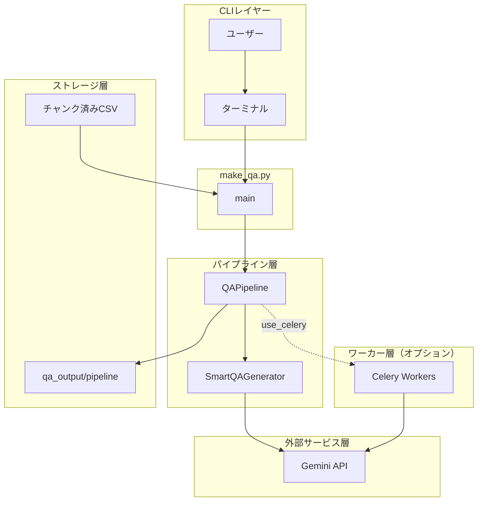
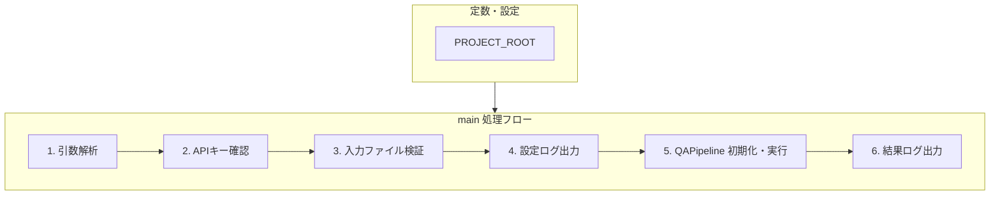
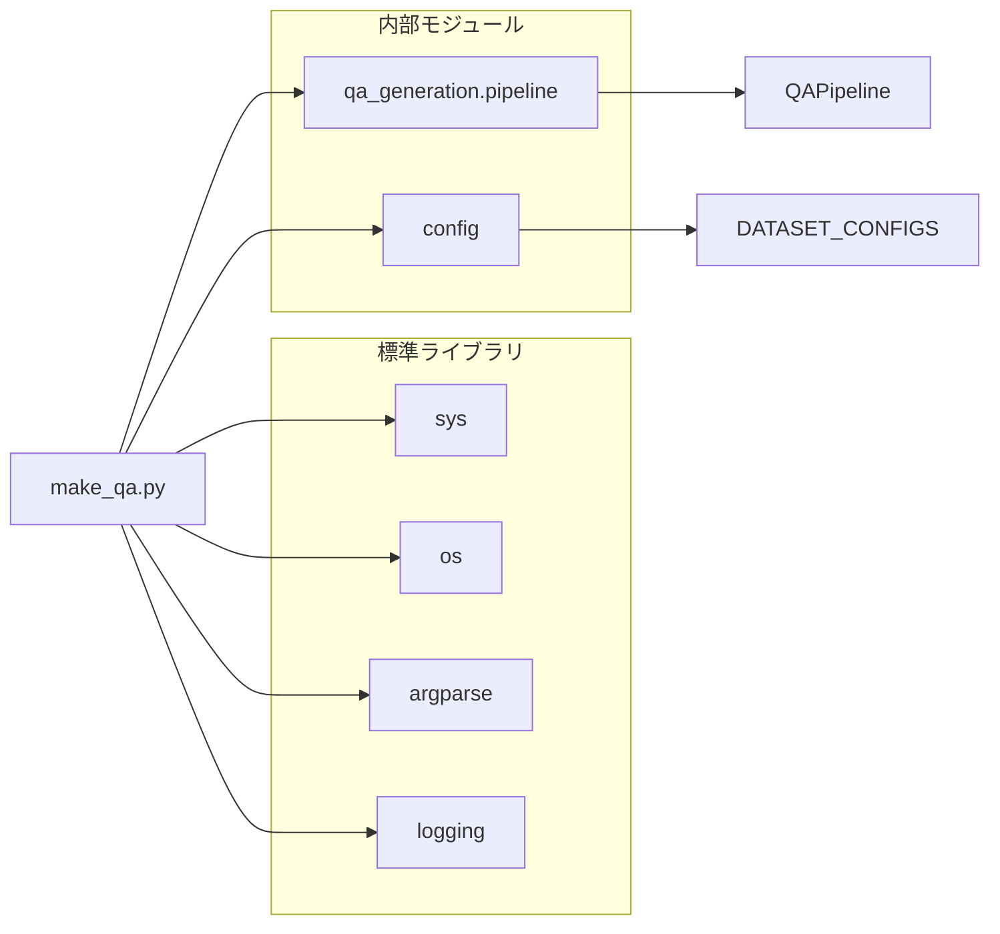
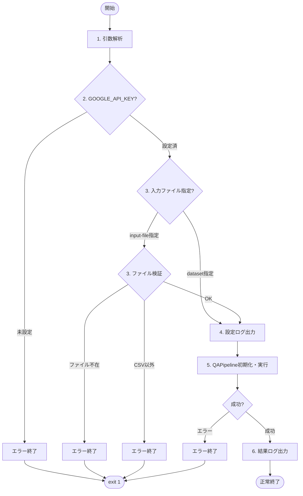

# make_qa.py - Q/Aペア生成 CLIエントリーポイント ドキュメント

**Version 2.1** | 最終更新: 2025-02-07

---

## 目次

1. [概要](#概要)
2. [アーキテクチャ構成図](#1-アーキテクチャ構成図)
3. [クラス・関数一覧表](#2-クラス関数一覧表)
4. [モジュール構成図](#3-モジュール構成図)
5. [クラス・関数 IPO詳細](#4-クラス関数-ipo詳細)
6. [設定・定数](#5-設定定数)
7. [使用例](#6-使用例)
8. [変更履歴](#7-変更履歴)
9. [付録: 依存関係図](#付録-依存関係図)
10. [付録: 実行フローチャート](#付録-実行フローチャート)
11. [付録: CLI引数仕様](#付録-cli引数仕様)

---

## 概要

`make_qa.py`は、チャンク済みCSVファイルまたは事前定義データセットからQ/Aペアを自動生成するCLIエントリーポイント。`QAPipeline`を呼び出し、Celery並列処理または同期処理でQ/Aペアを生成する。

### 主な責務

- CLI引数の解析と検証（入力ソース・モデル・並列処理等）
- 入力ファイルの存在確認・形式検証（CSV限定）
- 環境変数（`GOOGLE_API_KEY`）の存在確認
- `QAPipeline`の初期化と実行の制御
- 実行結果のサマリーログ出力

### 主要機能一覧

| 機能 | 説明 |
|------|------|
| `main()` | CLIエントリーポイント。引数解析・検証・パイプライン実行・結果出力を行う |

### 前提条件

- 入力CSVは既にチャンク済み（`csv_text_to_chunks_text_csv.py`で処理済み）
- `GOOGLE_API_KEY` 環境変数が設定されていること

---

## 1. アーキテクチャ構成図

### 1.1 システム全体構成



### 1.2 データフロー

1. ユーザーがCLI引数を指定して`make_qa.py`を実行
2. `main()`が引数を解析し、入力ファイル/データセット・APIキーを検証
3. `QAPipeline`を初期化し、`pipeline.run()`を実行
4. パイプラインがCSVを読み込み、Gemini APIを呼び出してQ/Aペアを生成
5. 結果を`qa_output/pipeline`ディレクトリに保存
6. サマリー（生成Q/A数、カバレージ率等）をログ出力

---

## 2. クラス・関数一覧表

### 2.1 クラス一覧

本モジュールにクラス定義はありません。

### 2.2 関数一覧（名称・概要・構成）

| 名称 | 概要 | 構成 |
|------|------|------|
| `main()` | CLIエントリーポイント。引数解析・検証・パイプライン実行・結果出力を行う | 下記「`main()` 内部構成」参照 |

### 2.3 定数一覧

| 名称 | 概要 | 構成 |
|------|------|------|
| `PROJECT_ROOT` | プロジェクトルートの絶対パス | `os.path.dirname(os.path.dirname(os.path.abspath(__file__)))` で算出 |
| `logger` | モジュールロガー | `logging.getLogger(__name__)` で取得 |

### 2.4 `main()` 内部構成

`main()`は単一関数ですが、内部は以下の6つの処理ブロックで構成されています。

| # | 処理ブロック | 概要 | 行範囲 | 主な処理内容 |
|:-:|-------------|------|:------:|-------------|
| 1 | 引数解析 | CLI引数の定義と解析 | 60-183 | `argparse`で6カテゴリの引数を定義し`parse_args()`で解析 |
| 2 | APIキー確認 | 環境変数チェック | 188-190 | `GOOGLE_API_KEY`未設定時に`sys.exit(1)` |
| 3 | 入力ファイル検証 | ファイル存在・形式チェック | 195-205 | ファイル存在確認、`.csv`拡張子チェック |
| 4 | 設定ログ表示 | 実行設定のログ出力 | 210-233 | 入力ソース・モデル・生成モード・並列設定をログ表示 |
| 5 | パイプライン実行 | Q/A生成の実行 | 239-258 | `QAPipeline`初期化 → `pipeline.run()`実行 |
| 6 | 結果表示 | サマリーログ出力 | 263-272 | 生成ファイルパス・Q/A数・カバレージ率を出力 |

> 📝 **注意**: エラー発生時（ブロック5,6）はトレースバック表示＋`sys.exit(1)`で終了します。

### 2.5 引数定義カテゴリ（ブロック1 詳細）

`main()`内の`argparse`引数定義は、以下の6カテゴリに分類されています。

| # | カテゴリ | 引数数 | 含まれる引数 |
|:-:|---------|:------:|-------------|
| 1 | 入力ソース（排他的必須） | 2 | `--dataset`, `--input-file` |
| 2 | 共通パラメータ | 3 | `--model`, `--output`, `--max-docs` |
| 3 | カバレージ分析 | 2 | `--analyze-coverage`, `--coverage-threshold` |
| 4 | Q/A生成 | 3 | `--batch-chunks`, `--use-smart-generation`, `--no-smart-generation` |
| 5 | Celery並列処理 | 3 | `--use-celery`, `-c`/`--concurrency`, `--celery-workers` |
| | **合計** | **13** | |

---

## 3. モジュール構成図

### 3.1 内部モジュール構成



### 3.2 外部依存関係

| ライブラリ | バージョン | 用途 |
|-----------|-----------|------|
| `argparse` | 標準 | CLI引数解析 |
| `logging` | 標準 | ログ出力 |
| `os` | 標準 | 環境変数・パス操作 |
| `sys` | 標準 | パス追加・終了コード制御 |

### 3.3 内部依存モジュール

| モジュール | 用途 |
|-----------|------|
| `qa_generation.pipeline.QAPipeline` | Q/A生成パイプラインクラス |
| `config.DATASET_CONFIGS` | 事前定義データセットの設定辞書 |

---

## 4. クラス・関数 IPO詳細

### 4.1 エントリーポイント関数

#### `main`

**概要**: CLI引数を解析し、`QAPipeline`を初期化・実行するエントリーポイント関数。入力検証、ログ出力、エラーハンドリングを含む。

```python
def main() -> None
```

| パラメータ | 型 | デフォルト | 説明 |
|------------|------|-----------|------|
| - | - | - | パラメータなし（CLI引数から`sys.argv`経由で取得） |

| 項目 | 内容 |
|------|------|
| **Input** | CLI引数（`sys.argv`経由）: `--dataset` or `--input-file`, `--model`, `--output`, `--max-docs`, `--use-celery`, `-c`, `--batch-chunks`, `--use-smart-generation` / `--no-smart-generation`, `--analyze-coverage`, `--coverage-threshold`, `--celery-workers` |
| **Process** | 1. `argparse`で引数を解析（入力ソースは排他的必須）<br>2. `GOOGLE_API_KEY`環境変数の存在を確認<br>3. 入力ファイルの存在・拡張子（`.csv`限定）を検証<br>4. 設定内容（入力・モデル・生成モード・並列設定）をログ出力<br>5. `QAPipeline`を初期化（`dataset_name`, `input_file`, `model`, `output_dir`, `max_docs`）<br>6. `pipeline.run()`を実行（Celery/同期、スマート生成等の設定を渡す）<br>7. 結果サマリー（ファイルパス、Q/A数、カバレージ率）をログ出力<br>8. エラー発生時はトレースバック表示＋`sys.exit(1)` |
| **Output** | `None`（標準出力へのログ出力。ファイル出力は`QAPipeline`が担当） |

**終了コード**:

| コード | 条件 |
|--------|------|
| `0` | 正常終了 |
| `1` | `GOOGLE_API_KEY`未設定 / 入力ファイル不在 / CSV以外の入力 / 実行時エラー |

```python
# 使用例（コマンドラインから実行）
# チャンク済みCSVからQ/A生成（同期処理）
# $ python qa_qdrant/make_qa.py \
#     --input-file output_chunked/data_chunks.csv \
#     --analyze-coverage

# Celery並列処理でQ/A生成
# $ python qa_qdrant/make_qa.py \
#     --input-file output_chunked/data_chunks.csv \
#     --use-celery \
#     -c 8 \
#     --use-smart-generation \
#     --analyze-coverage
```

---

## 5. 設定・定数

### 5.1 PROJECT_ROOT

プロジェクトルートディレクトリの絶対パス。出力ディレクトリのデフォルト値の基準として使用。

```python
PROJECT_ROOT = os.path.dirname(os.path.dirname(os.path.abspath(__file__)))
```

| 定数名 | 値 | 説明 |
|-------|-----|------|
| `PROJECT_ROOT` | `make_qa.py`の2階層上のディレクトリ | デフォルト出力パス（`{PROJECT_ROOT}/qa_output/pipeline`）の基準 |

### 5.2 デフォルト値一覧

| 項目 | デフォルト値 | 説明 |
|------|-------------|------|
| `--model` | `gemini-3.0-flash` | 使用するGeminiモデル |
| `--output` | `{PROJECT_ROOT}/qa_output/pipeline` | 出力ディレクトリ |
| `--batch-chunks` | `3` | 1回のAPIで処理するチャンク数（1-5） |
| `--concurrency` | `8` | 並列タスク数 |
| `--use-smart-generation` | `True` | スマートQ/A生成（LLMによる動的Q/A数決定） |

---

## 6. 使用例

### 6.1 基本的なワークフロー（同期処理）

```python
# チャンク済みCSVからQ/A生成（同期処理）
# $ python qa_qdrant/make_qa.py \
#     --input-file output_chunked/data_chunks.csv \
#     --analyze-coverage
```

### 6.2 Celery並列処理

```python
# 1. Celeryワーカーを起動（別ターミナル）
# $ ./start_celery.sh -c 8

# 2. Celery並列処理でQ/A生成
# $ python qa_qdrant/make_qa.py \
#     --input-file output_chunked/data_chunks.csv \
#     --use-celery \
#     -c 8 \
#     --use-smart-generation \
#     --analyze-coverage
```

### 6.3 事前定義データセットを使用

```python
# wikipedia_ja データセットを処理
# $ python qa_qdrant/make_qa.py \
#     --dataset wikipedia_ja \
#     --use-celery \
#     -c 4
```

### 6.4 処理チャンク数を制限（テスト用）

```python
# 最初の100チャンクのみ処理
# $ python qa_qdrant/make_qa.py \
#     --input-file output_chunked/large_data.csv \
#     --max-docs 100 \
#     --analyze-coverage
```

### 6.5 従来方式のQ/A生成

```python
# スマート生成を無効化（トークン数ベースの固定Q/A数）
# $ python qa_qdrant/make_qa.py \
#     --input-file output_chunked/data_chunks.csv \
#     --no-smart-generation \
#     --analyze-coverage
```

---

## 7. 変更履歴

| バージョン | 変更内容 |
|-----------|---------|
| 1.0 | 初版作成 |
| 2.0 | `a_class_method_md_format.md`フォーマット仕様に準拠して全面再作成 |
| 2.1 | 「2. クラス・関数一覧表」セクションを追加（名称・概要・構成の一覧表、`main()`内部構成、引数定義カテゴリ）。セクション番号を再採番 |
| 3.0 | pipeline.py v3.0対応。`--input-chunks`を`--input-file`に統一。チャンク関連引数を削除。`-c, --concurrency`引数を追加。`--use-smart-generation` / `--no-smart-generation`引数を追加 |

---

## 付録: 依存関係図



---

## 付録: 実行フローチャート



---

## 付録: CLI引数仕様

### 入力ソース（排他的・必須）

| 引数 | 型 | 説明 |
|------|------|------|
| `--dataset` | str | 事前定義データセット名（`DATASET_CONFIGS`のキー） |
| `--input-file` | str | チャンク済みCSVファイルのパス |

> 📝 **注意**: `--dataset` と `--input-file` は排他的。いずれか一方を必ず指定。

### 共通パラメータ

| 引数 | 型 | デフォルト | 説明 |
|------|------|-----------|------|
| `--model` | str | `gemini-3.0-flash` | 使用するGeminiモデル |
| `--output` | str | `{PROJECT_ROOT}/qa_output/pipeline` | 出力ディレクトリ |
| `--max-docs` | int | `None` | 処理する最大チャンク数 |

### カバレージ分析パラメータ

| 引数 | 型 | デフォルト | 説明 |
|------|------|-----------|------|
| `--analyze-coverage` | flag | `False` | カバレージ分析を実行 |
| `--coverage-threshold` | float | `None` | カバレージ判定の類似度閾値 |

### Q/A生成パラメータ

| 引数 | 型 | デフォルト | 説明 |
|------|------|-----------|------|
| `--batch-chunks` | int | `3` | 1回のAPIで処理するチャンク数（1-5） |
| `--use-smart-generation` | flag | `True` | スマートQ/A生成を使用（LLMによる動的Q/A数決定） |
| `--no-smart-generation` | flag | - | 従来方式のQ/A生成を使用（トークン数ベース） |

### Celery並列処理パラメータ

| 引数 | 型 | デフォルト | 説明 |
|------|------|-----------|------|
| `--use-celery` | flag | `False` | Celeryによる非同期並列処理を使用 |
| `-c`, `--concurrency` | int | `8` | 並列タスク数。`start_celery.sh -c`と同じ値を推奨 |
| `--celery-workers` | int | `1` | Celeryワーカープロセス数チェック用 |

> ⚠️ **非推奨**: `--celery-workers`は非推奨です。`--concurrency`を使用してください。

### 削除された引数（v3.0）

| 削除された引数 | 代替方法 |
|---------------|---------|
| `--input-chunks` | `--input-file`に統一 |
| `--merge-chunks` | 削除（前段のchunkingで完了） |
| `--min-tokens` | 削除 |
| `--max-tokens` | 削除 |
| `--overlap-tokens` | 削除 |
| `--use-similarity` | 削除 |
| `--similarity-threshold` | 削除 |
