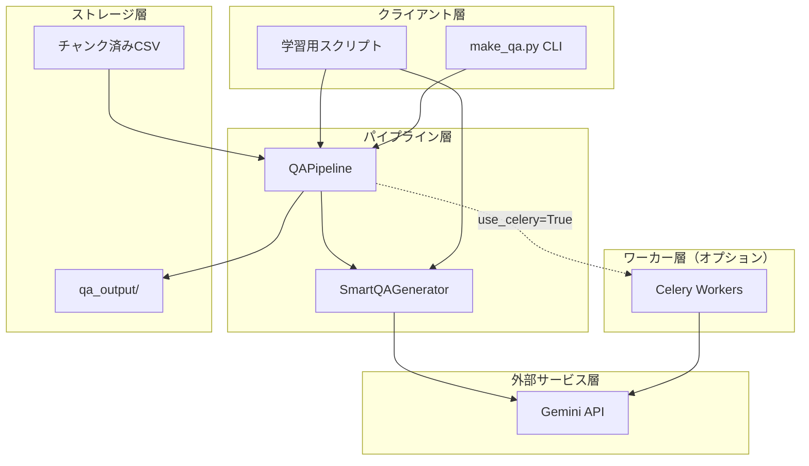
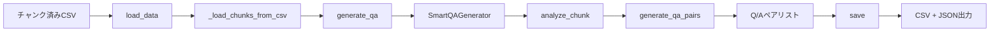
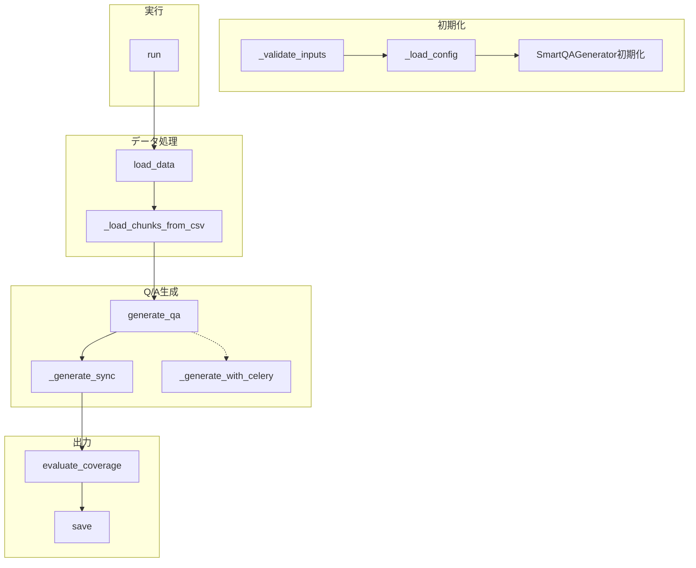
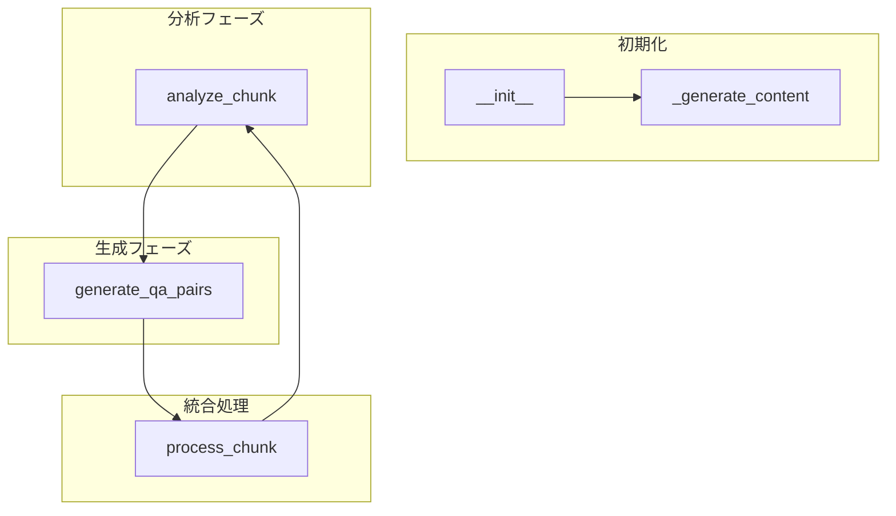
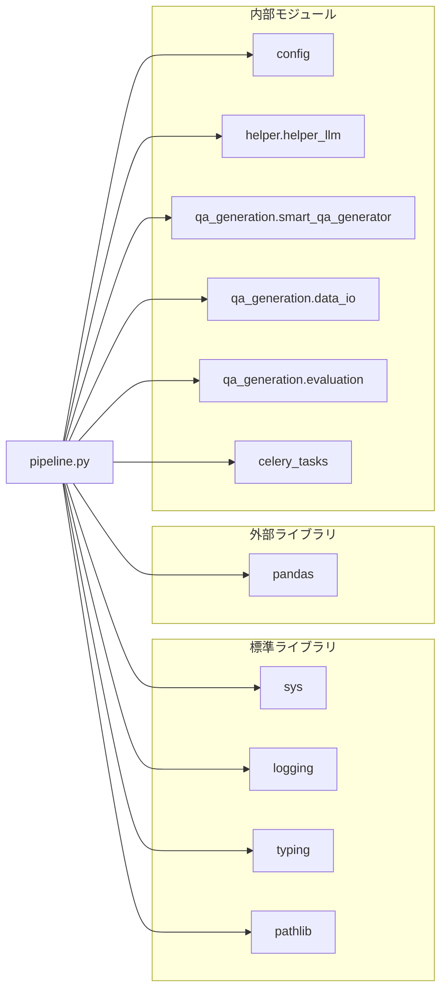
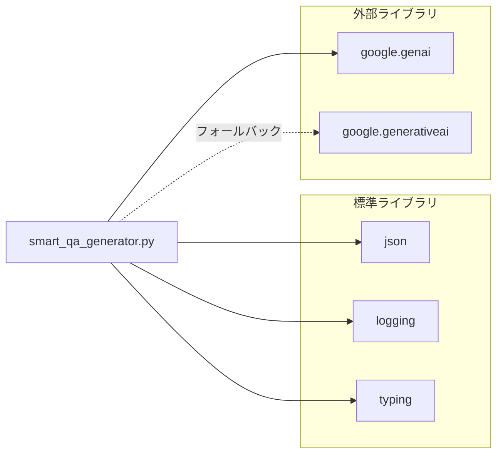
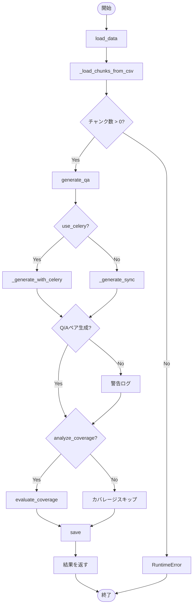
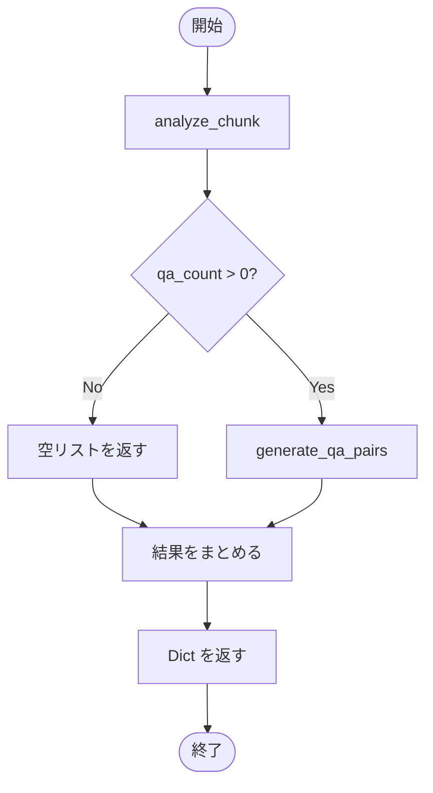

# QAPipeline & SmartQAGenerator - Q/Aペア生成システム ドキュメント

**Version 1.0** | 最終更新: 2025-01-30

---

## 目次

1. [概要](#概要)
2. [アーキテクチャ構成図](#1-アーキテクチャ構成図)
3. [モジュール構成図](#2-モジュール構成図)
4. [クラス・関数一覧表](#3-クラス関数一覧表)
5. [クラス・関数 IPO詳細](#4-クラス関数-ipo詳細)
6. [設定・定数](#5-設定定数)
7. [使用例](#6-使用例)
8. [変更履歴](#7-変更履歴)
9. [付録: 依存関係図](#付録-依存関係図)

---

## 概要

`QAPipeline`と`SmartQAGenerator`は、チャンク済みテキストからQ/A（質問・回答）ペアを自動生成するためのシステムです。

- **QAPipeline** (`qa_generation/pipeline.py`): パイプライン全体のオーケストレーション
- **SmartQAGenerator** (`qa_generation/smart_qa_generator.py`): LLMを使用したインテリジェントQ/A生成

### 主な責務

- チャンク済みCSVファイルの読み込みと検証
- チャンクデータの分析とQ/A数の動的決定
- LLM（Gemini API）を使用したQ/Aペアの生成
- 生成結果の保存（CSV、JSONサマリー）
- オプションでカバレージ分析の実行
- Celery並列処理のサポート（オプション）

### 主要機能一覧

| 機能 | 説明 |
|------|------|
| `QAPipeline` | Q/A生成パイプライン制御クラス |
| `QAPipeline.__init__()` | パイプラインの初期化 |
| `QAPipeline.load_data()` | チャンク済みCSVの読み込み |
| `QAPipeline._load_chunks_from_csv()` | DataFrameをチャンクリストに変換 |
| `QAPipeline.generate_qa()` | Q/Aペアの生成（メインメソッド） |
| `QAPipeline.run()` | パイプライン全体の実行 |
| `SmartQAGenerator` | インテリジェントQ/A生成クラス |
| `SmartQAGenerator.analyze_chunk()` | チャンクを分析してQ/A数を決定 |
| `SmartQAGenerator.generate_qa_pairs()` | Q/Aペアを生成 |
| `SmartQAGenerator.process_chunk()` | 分析と生成を一括実行 |

### 前提条件

- `GOOGLE_API_KEY` 環境変数が設定されていること
- 入力CSVは既にチャンク済み（`csv_text_to_chunks_text_csv.py`で処理済み）
- チャンクCSVには `text` または `Combined_Text` カラムが必要

---

## 1. アーキテクチャ構成図

### 1.1 システム全体構成



### 1.2 データフロー



### 1.3 処理の流れ

1. ユーザーがCLI引数を指定して`make_qa.py`を実行
2. `QAPipeline`を初期化（設定ロード、SmartQAGenerator初期化）
3. `load_data()`でチャンク済みCSVを読み込み
4. `_load_chunks_from_csv()`でチャンクリストに変換
5. `generate_qa()`でQ/Aペアを生成
   - 内部で`SmartQAGenerator.process_chunk()`を呼び出し
   - 各チャンクを`analyze_chunk()`で分析
   - `generate_qa_pairs()`でQ/Aペアを生成
6. `save()`で結果をファイルに保存
7. サマリーをログ出力

---

## 2. モジュール構成図

### 2.1 QAPipeline 内部構成



### 2.2 SmartQAGenerator 内部構成



### 2.3 外部依存関係

| ライブラリ | バージョン | 用途 |
|-----------|-----------|------|
| `google-genai` | 最新 | Gemini API（新API） |
| `google-generativeai` | フォールバック | Gemini API（旧API） |
| `pandas` | - | DataFrame処理 |
| `pathlib` | 標準 | パス操作 |

### 2.4 内部依存モジュール

| モジュール | 用途 |
|-----------|------|
| `qa_generation.smart_qa_generator` | Q/A生成エンジン |
| `qa_generation.data_io` | データ入出力 |
| `qa_generation.evaluation` | カバレージ分析 |
| `config.DATASET_CONFIGS` | データセット設定 |
| `helper.helper_llm.LLMClient` | LLMクライアント（DI用） |
| `celery_tasks` | Celery並列処理 |

---

## 3. クラス・関数一覧表

### 3.1 QAPipeline クラス

| メソッド | 概要 |
|---------|------|
| `__init__(dataset_name, input_file, model, output_dir, max_docs, client)` | パイプラインを初期化 |
| `_validate_inputs()` | 入力パラメータの検証 |
| `_load_config()` | 設定のロード |
| `load_data()` | チャンク済みCSVを読み込み |
| `_load_chunks_from_csv(df)` | DataFrameをチャンクリストに変換 |
| `generate_qa(chunks, use_celery, ...)` | Q/Aペアを生成 |
| `_generate_sync(chunks, batch_size, use_smart_generation)` | 同期処理でQ/A生成 |
| `_generate_with_celery(chunks, workers, concurrency, ...)` | Celery並列処理でQ/A生成 |
| `evaluate_coverage(chunks, qa_pairs, threshold)` | カバレージを評価 |
| `save(qa_pairs, coverage_results)` | 結果を保存 |
| `run(use_celery, celery_workers, concurrency, ...)` | パイプライン全体を実行 |

### 3.2 SmartQAGenerator クラス

| メソッド | 概要 |
|---------|------|
| `__init__(model, api_key)` | ジェネレーターを初期化 |
| `_generate_content(prompt, temperature)` | LLMでコンテンツ生成 |
| `analyze_chunk(chunk_text)` | チャンクを分析してQ/A数を決定 |
| `generate_qa_pairs(chunk_text, analysis)` | Q/Aペアを生成 |
| `process_chunk(chunk_text)` | 分析と生成を一括実行 |

### 3.3 ユーティリティ関数

| 関数名 | 概要 |
|-------|------|
| `analyze_qa_statistics(results)` | Q/A生成結果の統計分析 |

---

## 4. クラス・関数 IPO詳細

### 4.1 QAPipeline クラス

Q/A生成パイプライン全体を制御するクラス。チャンク済みCSVの読み込みからQ/A生成、保存までを一括管理する。

#### コンストラクタ: `__init__`

**概要**: パイプラインを初期化し、設定をロードしてSmartQAGeneratorを準備する。

```python
QAPipeline(
    dataset_name: Optional[str] = None,
    input_file: Optional[str] = None,
    model: str = "gemini-2.0-flash",
    output_dir: str = "qa_output/pipeline",
    max_docs: Optional[int] = None,
    client: Optional[LLMClient] = None
)
```

| パラメータ | 型 | デフォルト | 説明 |
|------------|------|-----------|------|
| `dataset_name` | Optional[str] | None | 事前定義データセット名（cc_news, wikipedia_ja等） |
| `input_file` | Optional[str] | None | チャンク済みCSVファイルのパス |
| `model` | str | "gemini-2.0-flash" | 使用するGeminiモデル |
| `output_dir` | str | "qa_output/pipeline" | 出力ディレクトリ |
| `max_docs` | Optional[int] | None | 処理する最大チャンク数 |
| `client` | Optional[LLMClient] | None | LLMクライアント（DI用） |

| 項目 | 内容 |
|------|------|
| **Input** | `dataset_name` または `input_file`（排他的） |
| **Process** | 1. `_validate_inputs()`で入力を検証<br>2. `_load_config()`で設定をロード<br>3. `SmartQAGenerator`を初期化 |
| **Output** | `QAPipeline`インスタンス |

> 📝 **注意**: `dataset_name` と `input_file` は排他的。いずれか一方のみ指定可能。

---

#### メソッド: `load_data`

**概要**: チャンク済みCSVファイルを読み込み、DataFrameとして返す。

```python
def load_data(self) -> pd.DataFrame
```

| 項目 | 内容 |
|------|------|
| **Input** | `self.input_file` または `self.dataset_name` |
| **Process** | 1. ファイル形式を確認（CSV以外はエラー）<br>2. `load_uploaded_file()`でCSVを読み込み<br>3. `max_docs`で行数を制限 |
| **Output** | `pd.DataFrame`: チャンクデータを含むDataFrame |

**戻り値例**:
```python
#    chunk_id                text  tokens  ...
# 0  chunk_0   "Daughter Duo..."    223  ...
# 1  chunk_1   "New York City..."   11  ...
# 2  chunk_2   "The Board of..."   226  ...
```

---

#### メソッド: `_load_chunks_from_csv`

**概要**: DataFrameをチャンクリスト（List[Dict]）に変換する。テキストカラムとIDカラムを自動検出。

```python
def _load_chunks_from_csv(self, df: pd.DataFrame) -> List[Dict]
```

| パラメータ | 型 | デフォルト | 説明 |
|------------|------|-----------|------|
| `df` | pd.DataFrame | - | チャンクデータを含むDataFrame |

| 項目 | 内容 |
|------|------|
| **Input** | `df: pd.DataFrame` |
| **Process** | 1. テキストカラムを検出（`text`, `Combined_Text`, `content`, `chunk_text`）<br>2. IDカラムを検出（`chunk_id`, `id`, `chunk_idx`）<br>3. 各行をDict形式に変換 |
| **Output** | `List[Dict]`: チャンクのリスト |

**戻り値例**:
```python
[
    {
        'id': 'cc_news_5per_chunk_0',
        'text': 'Daughter Duo is Dancing...',
        'type': 'llm_chunk',
        'tokens': 223,
        'dataset_type': 'cc_news_5per'
    },
    # ...
]
```

---

#### メソッド: `generate_qa`

**概要**: チャンクリストからQ/Aペアを生成する。同期処理またはCelery並列処理を選択可能。

```python
def generate_qa(
    self,
    chunks: List[Dict],
    use_celery: bool = False,
    celery_workers: int = 1,
    concurrency: int = 8,
    batch_chunks: int = 3,
    use_smart_generation: bool = True
) -> List[Dict]
```

| パラメータ | 型 | デフォルト | 説明 |
|------------|------|-----------|------|
| `chunks` | List[Dict] | - | チャンクのリスト |
| `use_celery` | bool | False | Celery並列処理を使用するか |
| `celery_workers` | int | 1 | Celeryワーカー数チェック用 |
| `concurrency` | int | 8 | 並列タスク数 |
| `batch_chunks` | int | 3 | 1回のAPIで処理するチャンク数 |
| `use_smart_generation` | bool | True | スマートQ/A生成を使用するか |

| 項目 | 内容 |
|------|------|
| **Input** | `chunks: List[Dict]`, 処理オプション |
| **Process** | 1. `use_celery`に応じて処理方法を選択<br>2. `_generate_sync()`または`_generate_with_celery()`を実行<br>3. 各チャンクに対してQ/Aペアを生成 |
| **Output** | `List[Dict]`: Q/Aペアのリスト |

**戻り値例**:
```python
[
    {
        'question': 'Amara Ramasarはどのバレエ団に所属していますか？',
        'answer': 'Amara RamasarはNYCBに所属しています。',
        'chunk_id': 'cc_news_5per_chunk_0',
        'topic': 'バレエ団所属',
        'dataset_type': 'cc_news_5per'
    },
    # ...
]
```

---

#### メソッド: `run`

**概要**: パイプライン全体を実行する統合メソッド。

```python
def run(
    self,
    use_celery: bool = False,
    celery_workers: int = 1,
    concurrency: int = 8,
    batch_chunks: int = 3,
    analyze_coverage: bool = True,
    coverage_threshold: Optional[float] = None,
    use_smart_generation: bool = True
) -> Dict
```

| パラメータ | 型 | デフォルト | 説明 |
|------------|------|-----------|------|
| `use_celery` | bool | False | Celery並列処理を使用するか |
| `celery_workers` | int | 1 | Celeryワーカー数 |
| `concurrency` | int | 8 | 並列タスク数 |
| `batch_chunks` | int | 3 | バッチサイズ |
| `analyze_coverage` | bool | True | カバレージ分析を実行するか |
| `coverage_threshold` | Optional[float] | None | カバレージ判定閾値 |
| `use_smart_generation` | bool | True | スマート生成を使用するか |

| 項目 | 内容 |
|------|------|
| **Input** | 実行オプション |
| **Process** | 1. `load_data()`でデータ読み込み<br>2. `_load_chunks_from_csv()`でチャンク変換<br>3. `generate_qa()`でQ/A生成<br>4. `evaluate_coverage()`でカバレージ分析<br>5. `save()`で結果保存 |
| **Output** | `Dict`: 実行結果 |

**戻り値例**:
```python
{
    'saved_files': {
        'summary': 'qa_output/pipeline/summary_20250130_123456.json',
        'qa_csv': 'qa_output/pipeline/qa_pairs_20250130_123456.csv'
    },
    'qa_count': 15,
    'coverage_results': {
        'coverage_rate': 0.85,
        'covered_chunks': 17,
        'total_chunks': 20,
        'uncovered_chunks': [...]
    },
    'success': True
}
```

---

### 4.2 SmartQAGenerator クラス

コンテンツを考慮したインテリジェントQ/A生成クラス。LLMでチャンクを分析し、適切なQ/A数を動的に決定する。

#### コンストラクタ: `__init__`

**概要**: SmartQAGeneratorを初期化し、Gemini APIクライアントを準備する。

```python
SmartQAGenerator(
    model: str = "gemini-2.0-flash",
    api_key: Optional[str] = None
)
```

| パラメータ | 型 | デフォルト | 説明 |
|------------|------|-----------|------|
| `model` | str | "gemini-2.0-flash" | 使用するGeminiモデル |
| `api_key` | Optional[str] | None | API Key（Noneの場合は環境変数から取得） |

| 項目 | 内容 |
|------|------|
| **Input** | `model`, `api_key`（オプション） |
| **Process** | 1. 新API（google.genai）を優先的に使用<br>2. 旧API（google.generativeai）にフォールバック<br>3. クライアントを初期化 |
| **Output** | `SmartQAGenerator`インスタンス |

---

#### メソッド: `analyze_chunk`

**概要**: チャンクを分析してQ/A生成計画を立てる。情報密度、重要度、複雑さを評価し、適切なQ/A数（0-5個）を決定する。

```python
def analyze_chunk(self, chunk_text: str) -> Dict
```

| パラメータ | 型 | デフォルト | 説明 |
|------------|------|-----------|------|
| `chunk_text` | str | - | 分析対象のチャンクテキスト |

| 項目 | 内容 |
|------|------|
| **Input** | `chunk_text: str` |
| **Process** | 1. LLMにチャンク分析プロンプトを送信<br>2. 情報密度、重要度、複雑さを評価<br>3. Q/A数（0-5）を決定<br>4. エラー時は文字数ベースでフォールバック |
| **Output** | `Dict`: 分析結果 |

**戻り値例**:
```python
{
    'qa_count': 3,              # 生成すべきQ/A数（0-5）
    'key_topics': ['バレエ団', '引退', '共演'],  # 主要トピック
    'importance_score': 0.75,   # 重要度（0.0-1.0）
    'complexity': 'medium',     # 複雑さ（low/medium/high）
    'reasoning': '複数の関連情報を含む標準的な説明パラグラフ'
}
```

**Q/A数の判断基準**:

| Q/A数 | 判断基準 |
|-------|---------|
| 0個 | 補足情報のみ、メタ情報のみ（ページ番号、参照リンク等） |
| 1個 | 単純な事実の記述（1つの情報のみ） |
| 2個 | 関連する2つの事実 |
| 3個 | 複数の関連情報、標準的な説明パラグラフ |
| 4-5個 | 高密度な技術情報、重要な警告・注意事項を含む |

---

#### メソッド: `generate_qa_pairs`

**概要**: 分析結果に基づいてQ/Aペアを生成する。

```python
def generate_qa_pairs(
    self,
    chunk_text: str,
    analysis: Optional[Dict] = None
) -> List[Dict]
```

| パラメータ | 型 | デフォルト | 説明 |
|------------|------|-----------|------|
| `chunk_text` | str | - | チャンクテキスト |
| `analysis` | Optional[Dict] | None | `analyze_chunk()`の結果（Noneの場合は自動分析） |

| 項目 | 内容 |
|------|------|
| **Input** | `chunk_text`, `analysis`（オプション） |
| **Process** | 1. `analysis`がNoneなら`analyze_chunk()`を実行<br>2. `qa_count=0`なら空リストを返す<br>3. LLMにQ/A生成プロンプトを送信<br>4. JSON形式でQ/Aペアを取得 |
| **Output** | `List[Dict]`: Q/Aペアのリスト |

**戻り値例**:
```python
[
    {
        'question': 'レジーナ・ウィロビーは何歳で引退しますか？',
        'answer': 'レジーナは40歳で、3月に舞台から引退します。',
        'topic': '引退'
    },
    {
        'question': 'レジーナとメリーナはどの作品で共演しますか？',
        'answer': 'くるみ割り人形の雪の場面とアラビアのディヴェルティスマンで共演します。',
        'topic': '共演'
    }
]
```

---

#### メソッド: `process_chunk`

**概要**: チャンクの分析とQ/A生成を一括実行する統合メソッド。実際のパイプラインではこのメソッドが使用される。

```python
def process_chunk(self, chunk_text: str) -> Dict
```

| パラメータ | 型 | デフォルト | 説明 |
|------------|------|-----------|------|
| `chunk_text` | str | - | チャンクテキスト |

| 項目 | 内容 |
|------|------|
| **Input** | `chunk_text: str` |
| **Process** | 1. `analyze_chunk()`で分析<br>2. `generate_qa_pairs()`でQ/A生成<br>3. 結果をまとめて返す |
| **Output** | `Dict`: 処理結果 |

**戻り値例**:
```python
{
    'analysis': {
        'qa_count': 3,
        'key_topics': ['バレエ団', '引退'],
        'importance_score': 0.75,
        'complexity': 'medium',
        'reasoning': '...'
    },
    'qa_pairs': [
        {'question': '...', 'answer': '...', 'topic': '...'},
        # ...
    ],
    'success': True
}
```

```python
# 使用例
generator = SmartQAGenerator(model="gemini-2.0-flash")
result = generator.process_chunk("チャンクテキスト...")

if result['success']:
    print(f"生成Q/A数: {len(result['qa_pairs'])}")
    for qa in result['qa_pairs']:
        print(f"Q: {qa['question']}")
        print(f"A: {qa['answer']}")
```

---

### 4.3 ユーティリティ関数

#### `analyze_qa_statistics`

**概要**: Q/A生成結果の統計分析を行う。

```python
def analyze_qa_statistics(results: List[Dict]) -> Dict
```

| パラメータ | 型 | デフォルト | 説明 |
|------------|------|-----------|------|
| `results` | List[Dict] | - | `process_chunk()`の結果リスト |

| 項目 | 内容 |
|------|------|
| **Input** | `results: List[Dict]` |
| **Process** | 1. 総チャンク数をカウント<br>2. 総Q/A数をカウント<br>3. Q/A数分布を計算<br>4. 平均重要度を計算 |
| **Output** | `Dict`: 統計情報 |

**戻り値例**:
```python
{
    'total_chunks': 10,
    'total_qa_pairs': 25,
    'avg_qa_per_chunk': 2.5,
    'avg_importance_score': 0.68,
    'qa_distribution': {
        0: 1,   # 0個生成: 1チャンク
        2: 3,   # 2個生成: 3チャンク
        3: 5,   # 3個生成: 5チャンク
        4: 1    # 4個生成: 1チャンク
    }
}
```

---

## 5. 設定・定数

### 5.1 QAPipeline 設定

パイプライン設定は`config.py`の`DATASET_CONFIGS`または動的生成される。

**ローカルファイル用の動的設定**:
```python
{
    "name": "ローカルファイル (data_chunks)",
    "text_column": "text",
    "title_column": None,
    "lang": "ja",
    "qa_per_chunk": 3,
    "type": "data_chunks"
}
```

**事前定義データセット設定例（cc_news）**:
```python
{
    "name": "CC-News（英語ニュース）",
    "icon": "🌐",
    "description": "Common Crawl英語ニュース記事",
    "text_column": "Combined_Text",
    "lang": "en",
    "qa_per_chunk": 5,
    "type": "cc_news"
}
```

### 5.2 SmartQAGenerator 設定

| 設定項目 | 値 | 説明 |
|---------|-----|------|
| デフォルトモデル | `gemini-2.0-flash` | 使用するGeminiモデル |
| 分析時temperature | 0.1 | 分析プロンプトの温度 |
| 生成時temperature | 0.3 | Q/A生成プロンプトの温度 |
| Q/A数範囲 | 0-5 | 1チャンクあたりの生成Q/A数 |

---

## 6. 使用例

### 6.1 SmartQAGenerator 単体使用

```python
from qa_generation.smart_qa_generator import SmartQAGenerator

# 初期化
generator = SmartQAGenerator(model="gemini-2.0-flash")

# チャンクテキスト
chunk_text = """
AES-256暗号化アルゴリズムは、対称鍵暗号方式の一種で、
256ビットの鍵長を持ちます。NISTにより承認されており、
機密情報の保護に広く使用されています。
"""

# 一括処理（推奨）
result = generator.process_chunk(chunk_text)

if result['success']:
    print(f"Q/A数: {len(result['qa_pairs'])}")
    for qa in result['qa_pairs']:
        print(f"Q: {qa['question']}")
        print(f"A: {qa['answer']}")
```

### 6.2 QAPipeline 基本使用

```python
from qa_generation.pipeline import QAPipeline

# パイプライン初期化
pipeline = QAPipeline(
    input_file="output_chunked/data_chunks.csv",
    model="gemini-2.0-flash",
    output_dir="qa_output/pipeline",
    max_docs=10  # テスト用に制限
)

# パイプライン実行（同期処理）
result = pipeline.run(
    use_celery=False,
    use_smart_generation=True,
    analyze_coverage=True
)

print(f"生成Q/A数: {result['qa_count']}")
print(f"出力ファイル: {result['saved_files']['qa_csv']}")
```

### 6.3 Celery並列処理

```bash
# 1. Celeryワーカーを起動（別ターミナル）
./start_celery.sh -c 8

# 2. パイプライン実行
python qa_qdrant/make_qa.py \
  --input-file output_chunked/data_chunks.csv \
  --use-celery \
  -c 8 \
  --analyze-coverage
```

### 6.4 ステップバイステップ処理

```python
from qa_generation.pipeline import QAPipeline

# 初期化
pipeline = QAPipeline(
    input_file="output_chunked/data_chunks.csv",
    max_docs=5
)

# Step 1: データ読み込み
df = pipeline.load_data()
print(f"読み込み行数: {len(df)}")

# Step 2: チャンク変換
chunks = pipeline._load_chunks_from_csv(df)
print(f"チャンク数: {len(chunks)}")

# Step 3: Q/A生成
qa_pairs = pipeline.generate_qa(
    chunks,
    use_celery=False,
    use_smart_generation=True
)
print(f"生成Q/A数: {len(qa_pairs)}")

# Step 4: 保存
coverage_results = {"coverage_rate": 0, "total_chunks": len(chunks)}
saved_files = pipeline.save(qa_pairs, coverage_results)
print(f"保存先: {saved_files['qa_csv']}")
```

---

## 7. 変更履歴

| バージョン | 変更内容 |
|-----------|---------|
| 1.0 | 初版作成（QAPipeline v3.0、SmartQAGenerator v2.5 対応） |

---

## 付録: 依存関係図

### A.1 QAPipeline 依存関係



### A.2 SmartQAGenerator 依存関係



---

## 付録: 処理フローチャート

### B.1 QAPipeline.run() フローチャート



### B.2 SmartQAGenerator.process_chunk() フローチャート


