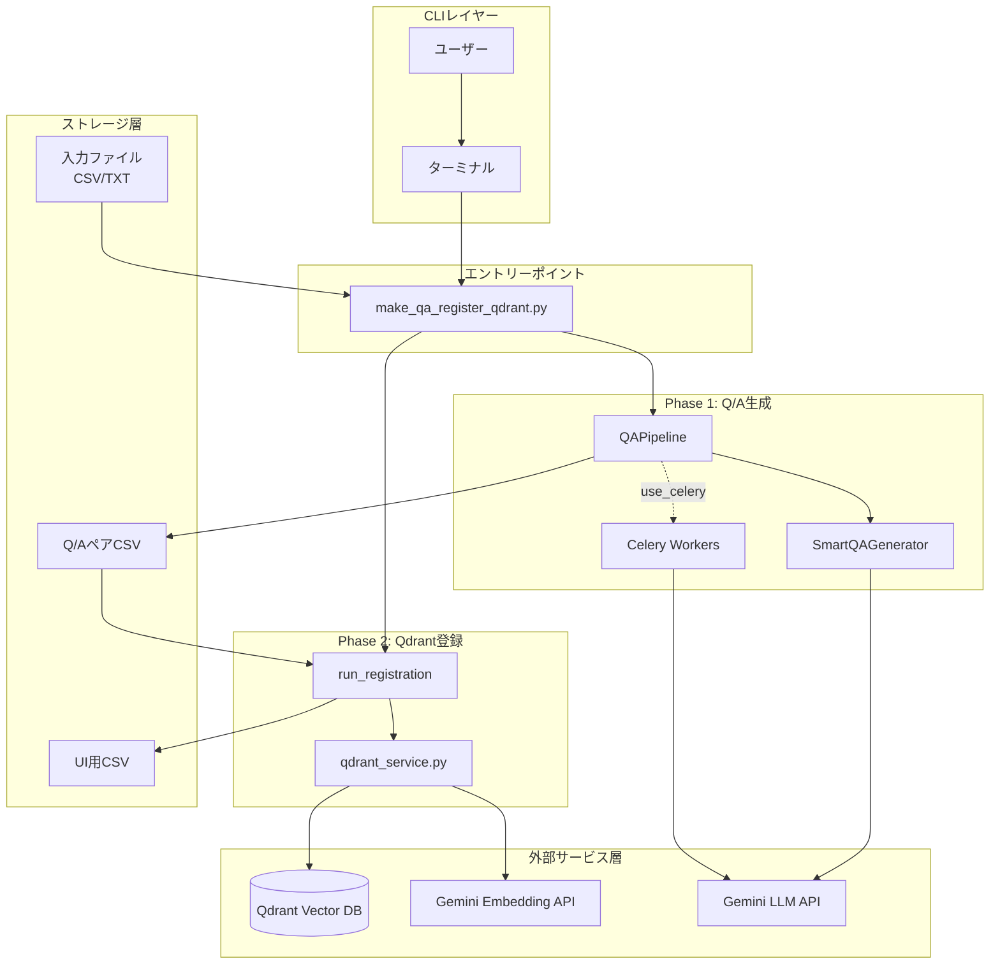
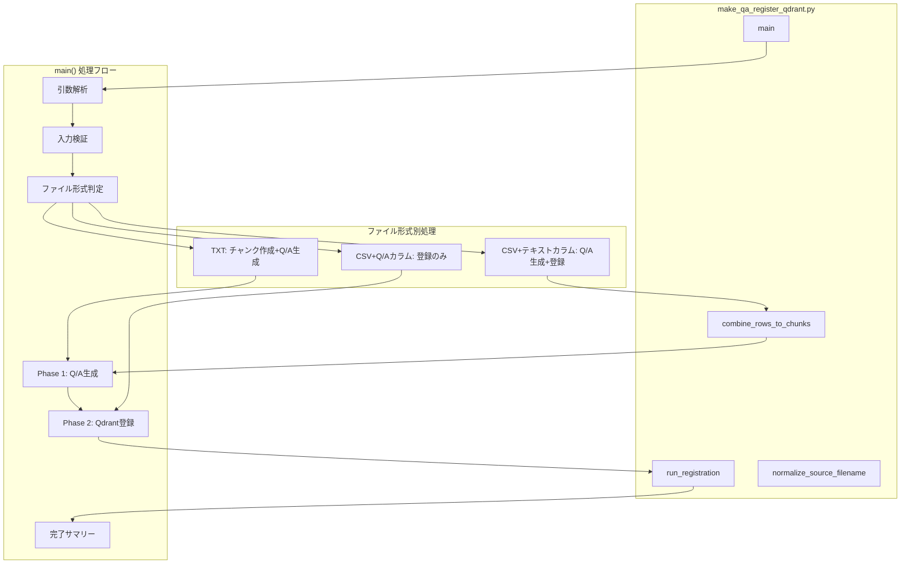
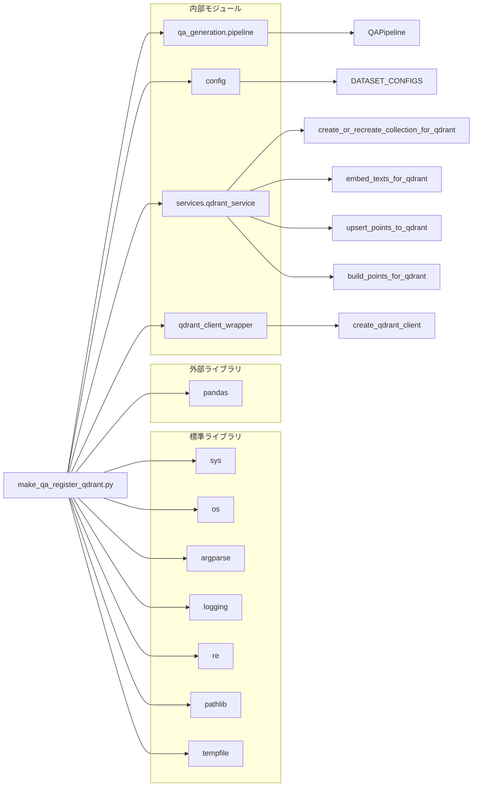
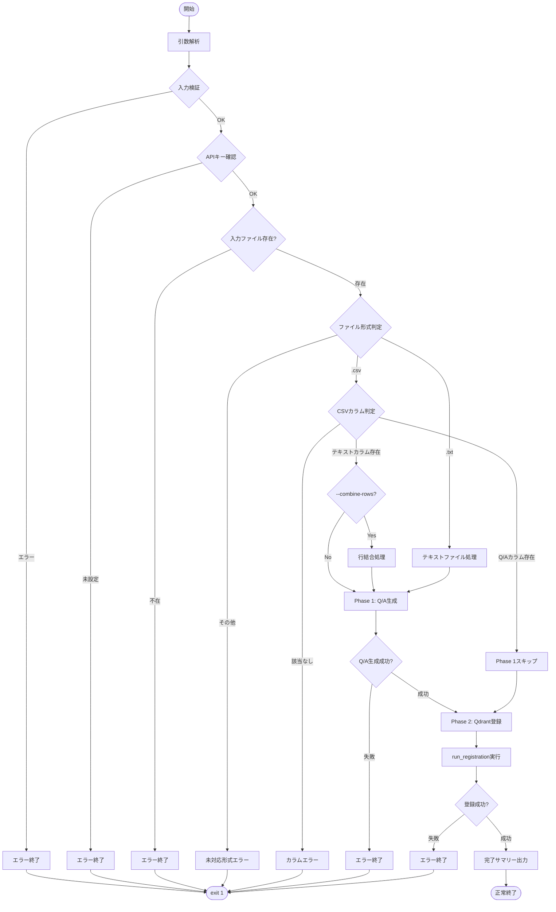

# make_qa_register_qdrant.py - Q/A生成+Qdrant登録 統合CLIツール ドキュメント

**Version 1.0** | 最終更新: 2025-01-29

---

## 目次

1. [概要](#概要)
2. [アーキテクチャ構成図](#1-アーキテクチャ構成図)
3. [モジュール構成図](#2-モジュール構成図)
4. [クラス・関数一覧表](#3-クラス関数一覧表)
5. [クラス・関数 IPO詳細](#4-クラス関数-ipo詳細)
6. [CLI引数仕様](#5-cli引数仕様)
7. [使用例](#6-使用例)
8. [変更履歴](#7-変更履歴)
9. [付録: 依存関係図](#付録-依存関係図)

---

## 概要

`make_qa_register_qdrant.py`は、チャンクCSVまたはテキストファイルからQ/Aペアを生成し、Qdrantベクトルデータベースに登録するまでを一括で行う統合CLIツール。Celery並列処理に対応し、大規模データの効率的な処理が可能。

### 主な責務

- 入力ファイル（CSV/TXT）の読み込みと形式判定
- CSVの複数行を結合してチャンク化（オプション）
- `QAPipeline`によるQ/Aペア生成
- 生成されたQ/AペアのQdrantへの登録
- UI用正規化CSVの自動生成
- Celery並列処理によるスケーラブルな処理

### 主要機能一覧

| 機能 | 説明 |
|------|------|
| `normalize_source_filename()` | ファイル名から日時サフィックスを除去 |
| `combine_rows_to_chunks()` | CSVの複数行を結合してチャンクCSVを作成 |
| `run_registration()` | Q/AペアCSVをQdrantに登録 |
| `main()` | CLIエントリーポイント（2フェーズ統合処理） |

### 前提条件

- Qdrant Dockerコンテナが起動していること（`docker-compose up -d`）
- `GOOGLE_API_KEY` 環境変数が設定されていること
- Celery使用時は事前にワーカーを起動（`./start_celery.sh restart -c 8`）

---

## 1. アーキテクチャ構成図

### 1.1 システム全体構成



### 1.2 データフロー

1. ユーザーがCLI引数（入力ファイル、コレクション名等）を指定して実行
2. **Phase 1**: 入力ファイルを判定し、`QAPipeline`でQ/Aペアを生成
3. **Phase 2**: 生成されたQ/AペアCSVをQdrantに登録
4. UI用正規化CSVを生成して完了

### 1.3 処理フェーズ

| フェーズ | 処理内容 | 主要モジュール |
|---------|---------|---------------|
| Phase 1 | Q/A生成 | `QAPipeline`, `SmartQAGenerator` |
| Phase 2 | Qdrant登録 | `run_registration()`, `qdrant_service` |

---

## 2. モジュール構成図

### 2.1 内部モジュール構成



### 2.2 外部依存関係

| ライブラリ | バージョン | 用途 |
|-----------|-----------|------|
| `argparse` | 標準 | CLI引数解析 |
| `logging` | 標準 | ログ出力 |
| `re` | 標準 | 正規表現（ファイル名正規化） |
| `pandas` | - | CSV読み込み・データフレーム操作 |
| `pathlib` | 標準 | パス操作 |
| `tempfile` | 標準 | 一時ファイル処理 |

### 2.3 内部依存モジュール

| モジュール | インポート | 用途 |
|-----------|-----------|------|
| `qa_generation.pipeline` | `QAPipeline` | Q/A生成パイプライン |
| `config` | `DATASET_CONFIGS` | 事前定義データセット設定 |
| `services.qdrant_service` | `create_or_recreate_collection_for_qdrant` | コレクション作成 |
| `services.qdrant_service` | `embed_texts_for_qdrant` | テキストベクトル化 |
| `services.qdrant_service` | `upsert_points_to_qdrant` | ポイントアップサート |
| `services.qdrant_service` | `build_points_for_qdrant` | ポイント構築 |
| `qdrant_client_wrapper` | `create_qdrant_client` | Qdrantクライアント作成 |

---

## 3. クラス・関数一覧表

### 3.1 関数一覧

#### ユーティリティ関数

| 関数名 | 概要 |
|-------|------|
| `normalize_source_filename(filename)` | ファイル名から日時サフィックスを除去 |
| `combine_rows_to_chunks(df, text_column, block_size, output_dir)` | CSVの複数行を結合してチャンクCSVを作成 |

#### メイン処理関数

| 関数名 | 概要 |
|-------|------|
| `run_registration(...)` | Q/AペアCSVをQdrantに登録（Phase 2） |
| `main()` | CLIエントリーポイント（Phase 1 + Phase 2 統合） |

---

## 4. クラス・関数 IPO詳細

### 4.1 ユーティリティ関数

#### `normalize_source_filename`

**概要**: ファイル名から日時サフィックス（例: `_20251230_232641`）を除去して正規化する。UI（agent_rag.py）での参照を安定させるための処理。

```python
def normalize_source_filename(filename: str) -> str
```

| パラメータ | 型 | デフォルト | 説明 |
|------------|------|-----------|------|
| `filename` | str | - | 元のファイル名 |

| 項目 | 内容 |
|------|------|
| **Input** | `filename: str` |
| **Process** | 正規表現`_\d{8}_\d{6}`にマッチする部分を空文字に置換 |
| **Output** | `str`: 正規化されたファイル名 |

**戻り値例**:
```python
# 入力
"qa_pairs_cc_news_20251230_123456.csv"
# 出力
"qa_pairs_cc_news.csv"
```

---

#### `combine_rows_to_chunks`

**概要**: CSVの複数行を結合してチャンクCSVを作成する。大量の短い行を持つCSVを効率的に処理するための前処理。

```python
def combine_rows_to_chunks(
    df: pd.DataFrame,
    text_column: str,
    block_size: int,
    output_dir: str
) -> str
```

| パラメータ | 型 | デフォルト | 説明 |
|------------|------|-----------|------|
| `df` | pd.DataFrame | - | 入力DataFrame |
| `text_column` | str | - | テキストカラム名 |
| `block_size` | int | - | 結合する行数 |
| `output_dir` | str | - | 出力ディレクトリ |

| 項目 | 内容 |
|------|------|
| **Input** | `df`, `text_column`, `block_size`, `output_dir` |
| **Process** | 1. 指定カラムの存在確認<br>2. `block_size`行ごとにテキストを結合<br>3. 空行をフィルタリング<br>4. チャンクCSVを出力 |
| **Output** | `str`: 作成されたチャンクCSVのパス |

**出力CSVカラム**:

| カラム | 説明 |
|--------|------|
| `chunk_id` | チャンク連番 |
| `text` | 結合されたテキスト |
| `start_row` | 結合開始行番号 |
| `end_row` | 結合終了行番号 |
| `row_count` | 結合行数 |

**戻り値例**:
```python
"qa_output/pipeline/combined_chunks_20251230_123456.csv"
```

```python
# 使用例
import pandas as pd

df = pd.read_csv("input.csv")
chunk_csv = combine_rows_to_chunks(
    df=df,
    text_column="text",
    block_size=400,
    output_dir="qa_output/pipeline"
)
print(chunk_csv)
# 出力: qa_output/pipeline/combined_chunks_20251230_123456.csv
```

---

### 4.2 メイン処理関数

#### `run_registration`

**概要**: Q/AペアCSVをQdrantコレクションに登録する（Phase 2）。

```python
def run_registration(
    csv_path: str,
    collection_name: str,
    recreate: bool,
    batch_size: int,
    provider: str,
    ui_output_dir: str = "qa_output"
) -> bool
```

| パラメータ | 型 | デフォルト | 説明 |
|------------|------|-----------|------|
| `csv_path` | str | - | Q/AペアCSVのパス |
| `collection_name` | str | - | Qdrantコレクション名 |
| `recreate` | bool | - | コレクションを再作成するか |
| `batch_size` | int | - | Embeddingバッチサイズ |
| `provider` | str | - | Embeddingプロバイダー |
| `ui_output_dir` | str | `"qa_output"` | UI用CSVの出力ディレクトリ |

| 項目 | 内容 |
|------|------|
| **Input** | 上記パラメータ全て |
| **Process** | 1. CSVファイル読み込み<br>2. `question` + `answer`を結合してベクトル化対象テキスト作成<br>3. Qdrantクライアント初期化・コレクション準備<br>4. バッチ処理ループ（ベクトル化→ポイント構築→アップサート）<br>5. UI用正規化CSVを作成 |
| **Output** | `bool`: 成功時`True`、失敗時`False` |

**ペイロード構造**:

| フィールド | 説明 |
|-----------|------|
| `source` | 正規化されたファイル名 |
| `domain` | コレクション名 |
| `question` | 質問文 |
| `answer` | 回答文 |

---

#### `main`

**概要**: CLI引数を解析し、Phase 1（Q/A生成）とPhase 2（Qdrant登録）を統合実行するエントリーポイント。

```python
def main() -> None
```

| 項目 | 内容 |
|------|------|
| **Input** | CLI引数（`sys.argv`経由） |
| **Process** | 1. 引数解析・検証<br>2. APIキー確認<br>3. ファイル形式判定（TXT/CSV）<br>4. **Phase 1**: Q/A生成（`QAPipeline.run()`）<br>5. **Phase 2**: Qdrant登録（`run_registration()`）<br>6. 完了サマリー出力 |
| **Output** | `None`（終了コードで結果を返す） |

**ファイル形式別処理フロー**:

| 入力形式 | 条件 | 処理 |
|---------|------|------|
| `.txt` | - | チャンク作成 → Q/A生成 → 登録 |
| `.csv` | `question`+`answer`カラム存在 | Q/A生成スキップ → 登録のみ |
| `.csv` | テキストカラム存在 + `--combine-rows` | 行結合 → Q/A生成 → 登録 |
| `.csv` | テキストカラム存在 | Q/A生成 → 登録 |

**終了コード**:

| コード | 説明 |
|--------|------|
| `0` | 正常終了 |
| `1` | エラー終了（APIキー未設定、ファイル不在、処理失敗等） |

---

## 5. CLI引数仕様

### 5.1 入力ソース（いずれか1つ必須）

| 引数 | 型 | 説明 |
|------|------|------|
| `--dataset` | str | 事前定義されたデータセット名（`DATASET_CONFIGS`のキー） |
| `--input-file` | str | 入力ファイルのパス（`.txt`, `.csv`） |

### 5.2 CSV処理オプション（`--input-file`がCSVの場合）

| 引数 | 型 | デフォルト | 説明 |
|------|------|-----------|------|
| `--text-column` | str | `text` | テキストカラム名 |
| `--combine-rows` | flag | `False` | 複数行を結合してチャンク化 |
| `--block-size` | int | `400` | 結合する行数 |

### 5.3 Q/A生成オプション

| 引数 | 型 | デフォルト | 説明 |
|------|------|-----------|------|
| `--model` | str | `gemini-2.0-flash` | 使用するLLMモデル |
| `--max-docs` | int | `None` | 処理する最大文書数 |
| `--use-celery` | flag | `False` | Celery並列処理を使用 |
| `-c`, `--concurrency` | int | `8` | 並列タスク数 |
| `--celery-workers` | int | `1` | ⚠️ 非推奨。`--concurrency`を使用 |
| `--batch-chunks` | int | `3` | 1回のAPIで処理するチャンク数 |
| `--merge-chunks` | flag | `True` | 小さいチャンクを統合する |
| `--overlap-tokens` | int | `0` | チャンク間の重複トークン数 |
| `--use-similarity` | flag | `False` | ベクトル類似度によるセマンティック分割 |
| `--similarity-threshold` | float | `0.7` | セマンティック分割の類似度閾値 |
| `--use-smart-generation` | flag | `True` | スマートQ/A生成を使用（デフォルト有効） |
| `--no-smart-generation` | flag | - | 従来方式のQ/A生成を使用 |

### 5.4 Qdrant登録オプション

| 引数 | 型 | デフォルト | 説明 |
|------|------|-----------|------|
| `--collection` | str | **必須** | Qdrantコレクション名 |
| `--recreate` | flag | `False` | コレクションを再作成 |
| `--batch-size` | int | `100` | Embeddingバッチサイズ |
| `--provider` | str | `gemini` | Embeddingプロバイダー |

### 5.5 出力オプション

| 引数 | 型 | デフォルト | 説明 |
|------|------|-----------|------|
| `--output` | str | `qa_output/pipeline` | Q/AペアCSVの出力ディレクトリ |
| `--ui-output` | str | `qa_output` | UI用正規化CSVの出力ディレクトリ |

---

## 6. 使用例

### 6.1 Celery並列処理（推奨）+ 行結合オプション

```bash
# 1. Celeryワーカー起動（別ターミナル）
./start_celery.sh restart -c 8 --flower

# 2. Q/A生成 + Qdrant登録
python qa_qdrant/make_qa_register_qdrant.py \
  --input-file output_chunked/cc_news_5per_chunks.csv \
  --collection cc_news_5per \
  --use-celery \
  --model gemini-2.5-flash \
  --concurrency 8 \
  --text-column text \
  --combine-rows \
  --block-size 1200 \
  --recreate
```

### 6.2 Wikipedia用設定（小さいblock-size）

```bash
python qa_qdrant/make_qa_register_qdrant.py \
  --input-file output_chunked/wikipedia_ja_5per_chunked.csv \
  --collection wikipedia_ja_5per \
  --use-celery \
  --model gemini-2.5-flash \
  --concurrency 3 \
  --text-column text \
  --combine-rows \
  --block-size 400 \
  --recreate
```

### 6.3 並列数を指定（行結合なし）

```bash
python qa_qdrant/make_qa_register_qdrant.py \
  --input-file output_chunked/cc_news_5per_chunks.csv \
  --collection cc_news_5per \
  --use-celery \
  -c 4 \
  --recreate
```

### 6.4 Celery不使用（同期処理）

```bash
python qa_qdrant/make_qa_register_qdrant.py \
  --input-file output_chunked/cc_news_5per_chunks.csv \
  --collection cc_news_5per \
  --recreate
```

### 6.5 テキストファイルから（チャンク作成 + Q/A生成 + 登録）

```bash
python qa_qdrant/make_qa_register_qdrant.py \
  --input-file data/document.txt \
  --collection my_collection \
  --use-celery \
  --concurrency 8 \
  --recreate
```

### 6.6 従来方式のQ/A生成（スマート生成を無効化）

```bash
python qa_qdrant/make_qa_register_qdrant.py \
  --input-file output_chunked/cc_news_5per_chunks.csv \
  --collection cc_news_5per \
  --use-celery \
  --no-smart-generation \
  --recreate
```

### 6.7 事前定義データセットを使用

```bash
python qa_qdrant/make_qa_register_qdrant.py \
  --dataset wikipedia_ja \
  --collection wikipedia_ja_full \
  --use-celery \
  -c 4 \
  --recreate
```

---

## 7. 変更履歴

| バージョン | 変更内容 |
|-----------|---------|
| 1.0 | 初版作成 |

---

## 付録: 依存関係図



---

## 付録: 処理フローチャート



---

## 付録: 並列処理について

### 推奨設定

| 環境 | concurrency | 備考 |
|------|-------------|------|
| M2 MacBook Air (8 vCPU) | 8 | 最適 |
| 一般的なPC (4 vCPU) | 4 | 推奨 |
| メモリ制限環境 | 2-3 | 安定性重視 |

### Celeryワーカーとの整合性

```bash
# start_celery.sh と同じ値を指定することを推奨
./start_celery.sh restart -c 8 --flower

python qa_qdrant/make_qa_register_qdrant.py \
  --use-celery \
  -c 8  # ← start_celery.sh -c と同じ値
  ...
```

---

## 不足情報・確認事項

> 📝 **注意**: 以下の情報について確認が必要です。

| 項目 | 現状 | 確認事項 |
|------|------|---------|
| バージョン情報 | 仮で1.0を設定 | 正式なバージョン番号 |
| `pipeline.run()`引数 | `merge_chunks`, `overlap_tokens`, `use_similarity`, `similarity_threshold`を渡している | `pipeline.py v3.0`では削除された引数のため、互換性確認が必要 |
| Celeryタイムアウト | 明記なし | 大規模データ処理時のタイムアウト設定 |
| エラーリトライ | なし | Embedding API失敗時のリトライロジック |
