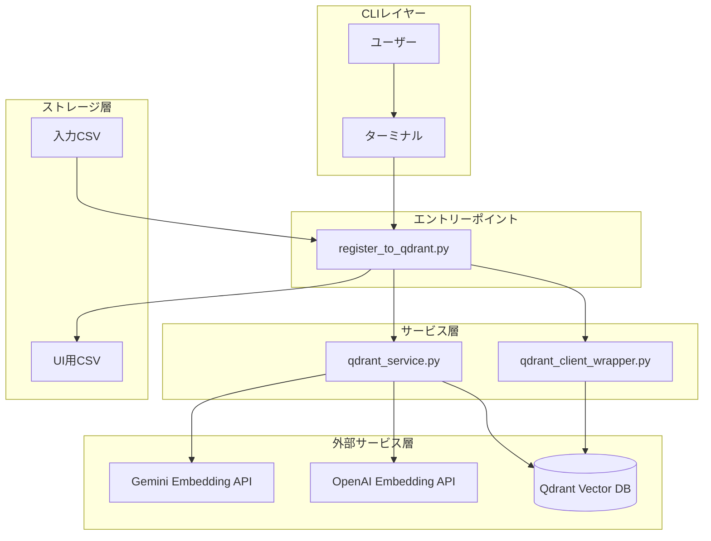
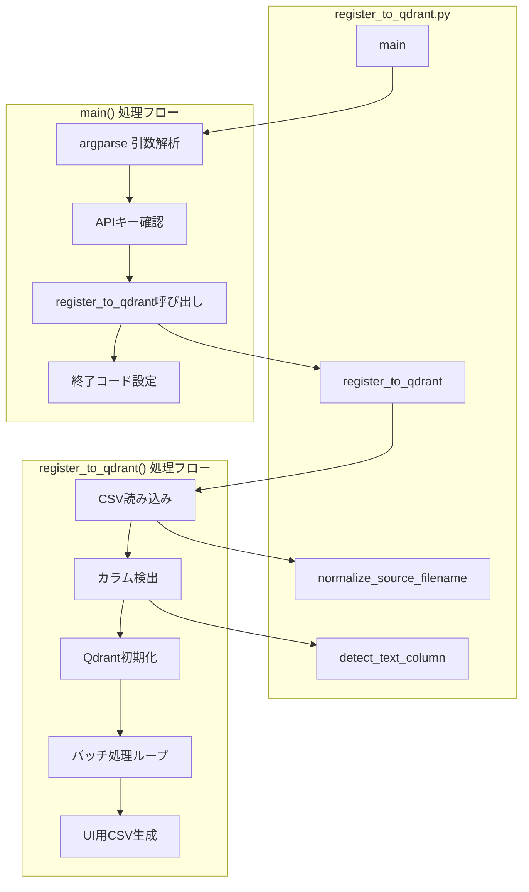
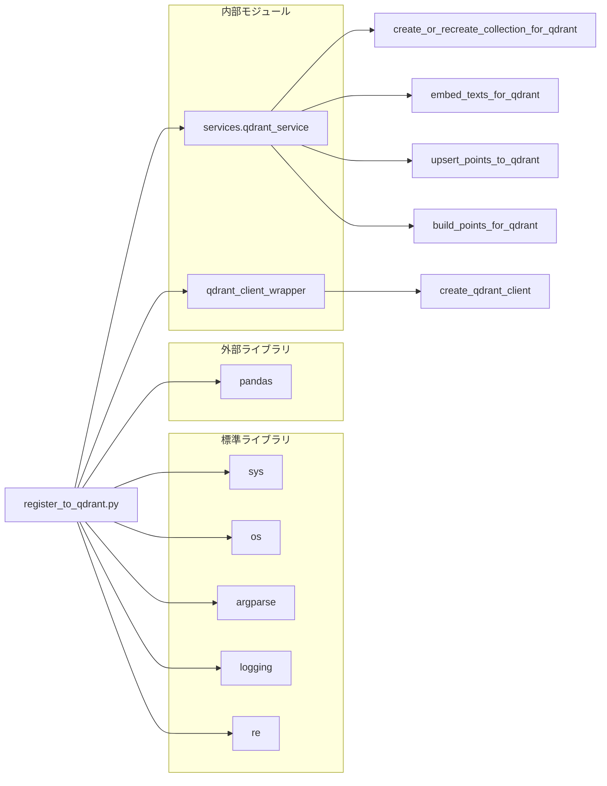
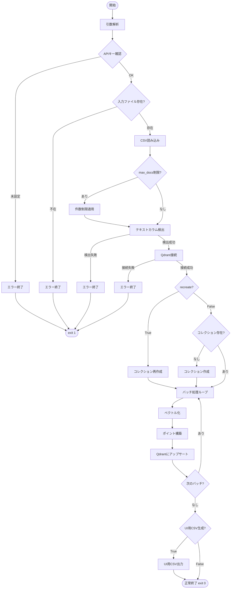

# register_to_qdrant.py - CSVデータQdrant登録 CLIツール ドキュメント

**Version 1.0** | 最終更新: 2025-01-29

---

## 目次

1. [概要](#概要)
2. [アーキテクチャ構成図](#1-アーキテクチャ構成図)
3. [モジュール構成図](#2-モジュール構成図)
4. [クラス・関数一覧表](#3-クラス関数一覧表)
5. [クラス・関数 IPO詳細](#4-クラス関数-ipo詳細)
6. [CLI引数仕様](#5-cli引数仕様)
7. [使用例](#6-使用例)
8. [変更履歴](#7-変更履歴)
9. [付録: 依存関係図](#付録-依存関係図)

---

## 概要

`register_to_qdrant.py`は、CSVファイルをQdrantベクトルデータベースに登録する統合CLIツール。`register_csv_to_qdrant.py`と`register_qdrant.py`を統合した最終版であり、Q/AペアCSV・汎用CSVの両方に対応する。

### 主な責務

- CSVファイルの読み込みとベクトル化対象カラムの自動検出
- Embedding APIを使用したテキストのベクトル化
- Qdrantコレクションの作成・再作成
- バッチ処理によるスケーラブルなデータ登録
- ファイル名の正規化（日時サフィックス除去）
- UI用CSV自動生成

### 主要機能一覧

| 機能 | 説明 |
|------|------|
| `normalize_source_filename()` | ファイル名から日時サフィックスを除去 |
| `detect_text_column()` | ベクトル化対象テキストカラムを自動検出 |
| `register_to_qdrant()` | CSVをQdrantに登録するメイン処理 |
| `main()` | CLIエントリーポイント |

### 前提条件

- Qdrant Dockerコンテナが起動していること（`docker-compose up -d`）
- `GOOGLE_API_KEY`（Gemini使用時）または`OPENAI_API_KEY`（OpenAI使用時）が設定されていること

---

## 1. アーキテクチャ構成図

### 1.1 システム全体構成



### 1.2 データフロー

1. ユーザーがCLI引数（入力CSV、コレクション名等）を指定して実行
2. CSVファイルを読み込み、ベクトル化対象カラムを自動検出
3. Qdrantクライアントを初期化し、コレクションを準備
4. バッチ単位でEmbedding APIを呼び出しテキストをベクトル化
5. ポイントを構築してQdrantにアップサート
6. （オプション）UI用CSVを生成

---

## 2. モジュール構成図

### 2.1 内部モジュール構成



### 2.2 外部依存関係

| ライブラリ | バージョン | 用途 |
|-----------|-----------|------|
| `argparse` | 標準 | CLI引数解析 |
| `logging` | 標準 | ログ出力 |
| `re` | 標準 | 正規表現（ファイル名正規化） |
| `pandas` | - | CSV読み込み・データフレーム操作 |

### 2.3 内部依存モジュール

| モジュール | インポート | 用途 |
|-----------|-----------|------|
| `services.qdrant_service` | `create_or_recreate_collection_for_qdrant` | コレクション作成・再作成 |
| `services.qdrant_service` | `embed_texts_for_qdrant` | テキストのベクトル化 |
| `services.qdrant_service` | `upsert_points_to_qdrant` | ポイントのアップサート |
| `services.qdrant_service` | `build_points_for_qdrant` | ポイント構築 |
| `qdrant_client_wrapper` | `create_qdrant_client` | Qdrantクライアント作成 |

---

## 3. クラス・関数一覧表

### 3.1 関数一覧

#### ユーティリティ関数

| 関数名 | 概要 |
|-------|------|
| `normalize_source_filename(filename)` | ファイル名から日時サフィックスを除去して正規化 |
| `detect_text_column(df, text_col)` | ベクトル化対象のテキストカラムを自動検出 |

#### メイン処理関数

| 関数名 | 概要 |
|-------|------|
| `register_to_qdrant(...)` | CSVファイルをQdrantに登録するメイン処理 |
| `main()` | CLIエントリーポイント |

---

## 4. クラス・関数 IPO詳細

### 4.1 ユーティリティ関数

#### `normalize_source_filename`

**概要**: ファイル名から日時サフィックス（例: `_20251230_232641`）を除去して正規化する。

```python
def normalize_source_filename(filename: str) -> str
```

| パラメータ | 型 | デフォルト | 説明 |
|------------|------|-----------|------|
| `filename` | str | - | 元のファイル名 |

| 項目 | 内容 |
|------|------|
| **Input** | `filename: str` |
| **Process** | 正規表現`_\d{8}_\d{6}`にマッチする部分を空文字に置換 |
| **Output** | `str`: 正規化されたファイル名 |

**戻り値例**:
```python
# 入力
"qa_pairs_fineweb_edu_ja_20251230_123456.csv"

# 出力
"qa_pairs_fineweb_edu_ja.csv"
```

```python
# 使用例
normalized = normalize_source_filename("qa_pairs_fineweb_edu_ja_20251230_123456.csv")
print(normalized)
# 出力: qa_pairs_fineweb_edu_ja.csv
```

---

#### `detect_text_column`

**概要**: ベクトル化対象のテキストカラムを自動検出する。

```python
def detect_text_column(df: pd.DataFrame, text_col: Optional[str] = None) -> tuple[List[str], str]
```

| パラメータ | 型 | デフォルト | 説明 |
|------------|------|-----------|------|
| `df` | pd.DataFrame | - | 入力DataFrame |
| `text_col` | Optional[str] | `None` | 明示的に指定されたカラム名 |

| 項目 | 内容 |
|------|------|
| **Input** | `df: pd.DataFrame`, `text_col: Optional[str] = None` |
| **Process** | 1. `text_col`が指定されていればそのカラムを使用<br>2. `question` + `answer` カラムがあれば結合<br>3. `Combined_Text` カラムがあれば使用<br>4. `text` カラムがあれば使用<br>5. どれもなければ`ValueError` |
| **Output** | `tuple[List[str], str]`: (テキストリスト, 検出方法の説明) |

**検出優先順位**:

| 優先度 | 条件 | 検出方法 |
|--------|------|---------|
| 1 | `--text-col`で指定 | 指定カラム |
| 2 | `question` + `answer`カラム存在 | 2カラムを改行で結合 |
| 3 | `Combined_Text`カラム存在 | 単一カラム |
| 4 | `text`カラム存在 | 単一カラム |

**戻り値例**:
```python
# Q/AペアCSVの場合
(
    ["質問1\n回答1", "質問2\n回答2", ...],
    "'question' + 'answer' の結合"
)
```

```python
# 使用例
import pandas as pd

df = pd.DataFrame({
    "question": ["Q1", "Q2"],
    "answer": ["A1", "A2"]
})
texts, method = detect_text_column(df)
print(method)
# 出力: 'question' + 'answer' の結合
```

---

### 4.2 メイン処理関数

#### `register_to_qdrant`

**概要**: CSVファイルをQdrantコレクションに登録するメイン処理関数。

```python
def register_to_qdrant(
    input_file: str,
    collection_name: str,
    recreate: bool = False,
    batch_size: int = 100,
    text_col: Optional[str] = None,
    domain: Optional[str] = None,
    max_docs: Optional[int] = None,
    provider: str = "gemini",
    normalize_filename: bool = True,
    create_ui_csv: bool = True,
    ui_output_dir: str = "qa_output"
) -> bool
```

| パラメータ | 型 | デフォルト | 説明 |
|------------|------|-----------|------|
| `input_file` | str | - | 入力CSVファイルパス |
| `collection_name` | str | - | Qdrantコレクション名 |
| `recreate` | bool | `False` | コレクションを再作成するか |
| `batch_size` | int | `100` | Embeddingバッチサイズ |
| `text_col` | Optional[str] | `None` | ベクトル化対象カラム（None=自動検出） |
| `domain` | Optional[str] | `None` | ペイロードのdomain値（None=コレクション名） |
| `max_docs` | Optional[int] | `None` | 登録する最大件数（None=全件） |
| `provider` | str | `"gemini"` | Embeddingプロバイダー |
| `normalize_filename` | bool | `True` | ファイル名正規化を行うか |
| `create_ui_csv` | bool | `True` | UI用CSVを生成するか |
| `ui_output_dir` | str | `"qa_output"` | UI用CSVの出力先 |

| 項目 | 内容 |
|------|------|
| **Input** | 上記パラメータ全て |
| **Process** | 1. 入力ファイル存在確認<br>2. CSV読み込み・件数制限適用<br>3. ベクトル化対象テキストの決定<br>4. Qdrantクライアント初期化・コレクション準備<br>5. バッチ処理ループ（ベクトル化→ポイント構築→アップサート）<br>6. UI用CSV生成（オプション）<br>7. 完了ログ出力 |
| **Output** | `bool`: 成功時`True`、失敗時`False` |

**ペイロード構造**:

| フィールド | 説明 |
|-----------|------|
| `source` | 正規化されたファイル名 |
| `domain` | ドメイン値（引数またはコレクション名） |
| `embedding_provider` | 使用したプロバイダー（gemini/openai） |
| `embedding_model` | 使用したモデル名 |
| その他 | CSVの各カラム値 |

```python
# 使用例
success = register_to_qdrant(
    input_file="qa_output/qa_pairs.csv",
    collection_name="my_collection",
    recreate=True,
    batch_size=100,
    provider="gemini"
)
print("成功" if success else "失敗")
```

---

#### `main`

**概要**: CLI引数を解析し、`register_to_qdrant()`を呼び出すエントリーポイント。

```python
def main() -> None
```

| 項目 | 内容 |
|------|------|
| **Input** | CLI引数（`sys.argv`経由） |
| **Process** | 1. `argparse`で引数を解析<br>2. 使用プロバイダーに応じたAPIキーを確認<br>3. `register_to_qdrant()`を呼び出し<br>4. 結果に応じて終了コードを設定 |
| **Output** | `None`（終了コードで結果を返す） |

**終了コード**:

| コード | 説明 |
|--------|------|
| `0` | 正常終了（登録成功） |
| `1` | エラー終了（APIキー未設定、登録失敗等） |

---

## 5. CLI引数仕様

### 5.1 必須引数

| 引数 | 型 | 説明 |
|------|------|------|
| `--input-file` | str | 登録するCSVファイルのパス |
| `--collection` | str | 登録先のQdrantコレクション名 |

### 5.2 Qdrant設定

| 引数 | 型 | デフォルト | 説明 |
|------|------|-----------|------|
| `--recreate` | flag | `False` | 既存の同名コレクションを削除して作り直す |
| `--batch-size` | int | `100` | 1回のEmbedding API呼び出し/登録処理で扱う件数 |

### 5.3 ベクトル化設定

| 引数 | 型 | デフォルト | 説明 |
|------|------|-----------|------|
| `--text-col` | str | `None` | ベクトル化対象のカラム名（未指定時は自動検出） |
| `--provider` | str | `gemini` | Embeddingに使用するプロバイダー（`gemini`/`openai`） |

### 5.4 データ処理設定

| 引数 | 型 | デフォルト | 説明 |
|------|------|-----------|------|
| `--domain` | str | `None` | ペイロードの`domain`フィールド値（デフォルト: コレクション名） |
| `--max-docs` | int | `None` | 登録する最大ドキュメント数（テスト用） |

### 5.5 出力設定

| 引数 | 型 | デフォルト | 説明 |
|------|------|-----------|------|
| `--normalize-filename` | flag | `True` | ファイル名から日時サフィックスを除去 |
| `--no-normalize-filename` | flag | - | ファイル名正規化を無効化 |
| `--create-ui-csv` | flag | `True` | UI用正規化CSVを生成 |
| `--no-create-ui-csv` | flag | - | UI用CSV生成を無効化 |
| `--ui-output-dir` | str | `qa_output` | UI用CSVの出力ディレクトリ |

---

## 6. 使用例

### 6.1 基本的な使い方

```bash
# Q/AペアCSVを登録（コレクション新規作成）
python register_to_qdrant.py \
  --input-file qa_output/qa_pairs.csv \
  --collection my_collection \
  --recreate
```

### 6.2 フル機能を使う場合

```bash
# 日時サフィックス付きファイルを正規化して登録
python register_to_qdrant.py \
  --input-file qa_output/pipeline/qa_pairs_fineweb_edu_ja_20251230_123456.csv \
  --collection qa_fineweb_edu_ja \
  --recreate \
  --batch-size 100 \
  --normalize-filename \
  --create-ui-csv \
  --ui-output-dir qa_output
```

### 6.3 テスト用（少量データで動作確認）

```bash
# 最初の10件のみ登録
python register_to_qdrant.py \
  --input-file test_data.csv \
  --collection test_collection \
  --max-docs 10 \
  --batch-size 5
```

### 6.4 OpenAI Embeddingを使用

```bash
# OpenAI text-embedding-3-small を使用
python register_to_qdrant.py \
  --input-file qa_output/qa_pairs.csv \
  --collection my_collection_openai \
  --provider openai \
  --recreate
```

### 6.5 特定カラムをベクトル化対象に指定

```bash
# 'content' カラムをベクトル化
python register_to_qdrant.py \
  --input-file documents.csv \
  --collection docs_collection \
  --text-col content \
  --recreate
```

---

## 7. 変更履歴

| バージョン | 変更内容 |
|-----------|---------|
| 1.0 | 初版作成（register_csv_to_qdrant.py と register_qdrant.py を統合） |

---

## 付録: 依存関係図



---

## 付録: 処理フローチャート



---

## 不足情報・確認事項

> 📝 **注意**: 以下の情報が不足しているため、確認・補完が必要です。

| 項目 | 現状 | 確認事項 |
|------|------|---------|
| バージョン情報 | 仮で1.0を設定 | 正式なバージョン番号があれば指定 |
| Embeddingモデルバージョン | `gemini-embedding-001`, `text-embedding-3-small` | モデルバージョンの更新予定 |
| Qdrantベクトルサイズ | Gemini: 3072, OpenAI: 1536 | `qdrant_service.py`の設定と整合性確認 |
| エラーハンドリング | 基本的なtry-except実装済み | リトライロジックの要否 |
| UI用CSV出力条件 | `question`/`answer`カラム存在時のみ | 他のカラム構成への対応要否 |

