# 自律型Agent　（GRACE エージェント）ドキュメント
# grace_chat_page.py
**Version 3.4** | 最終更新: 2026-06-21

---

## 目次

1. [概要](#概要)
2. [画面レイアウト図](#1-画面レイアウト図)
3. [UIコンポーネント詳細](#2-uiコンポーネント詳細)
4. [セッション状態管理](#3-セッション状態管理)
5. [ユーザー操作フロー](#4-ユーザー操作フロー)
6. [関数一覧表](#5-関数一覧表)
7. [関数 IPO詳細](#6-関数-ipo詳細)
8. [依存関係](#7-依存関係)
9. [イベント処理](#8-イベント処理)
10. [エラーハンドリング](#9-エラーハンドリング)
11. [使用例](#10-使用例)
12. [変更履歴](#11-変更履歴)

---

## 概要

`grace_chat_page.py`は、GRACE（Goal-Reasoning-Action-Critique-Execute）アーキテクチャを使用した自律型エージェントとの対話インターフェースを提供するStreamlit UIページです。
Planner + Executor の2フェーズ分離型アーキテクチャにより、計画策定（Plan）→ 実行（Execute）→ 信頼度評価（Confidence）→ 介入判定（Intervention）→ リプラン（Replan）の一連のプロセスをリアルタイムに可視化します。


📝 **注意**: `grace/__init__.py` では「Guided Reasoning with Adaptive Confidence Execution」と定義されていますが、UIキャプションでは「Goal-Reasoning-Action-Critique-Execute Architecture」と表示されます。

### 主な責務

- ユーザーからの質問入力の受付
- Planner による実行計画の策定と表示（複雑度・ステップ数・成功基準の可視化）
- Executor による計画の逐次実行と進捗表示（Generator ベースのリアルタイム更新）
- 各ステップの信頼度スコア表示と実行結果サマリの提示
- 会話履歴の管理とセッション状態の維持
- 検索対象コレクションの参考表示（GRACEは全コレクションを自動検索）
- Qdrantコレクションデータのプレビュー表示
- キャッシュ管理と統計表示

### 各責務対応のモジュール


| # | 責務             | 対応モジュール          | 説明                                                                    |
| - | ---------------- | ----------------------- | ----------------------------------------------------------------------- |
| 1 | 実行計画の策定   | `grace/planner.py`      | LLM（Ollama・ローカルLLM）による計画生成、複雑度推定、フォールバック計画 |
| 2 | 計画の逐次実行   | `grace/executor.py`     | Generator ベースのステップ実行、状態管理（ExecutionState）              |
| 3 | 信頼度評価       | `grace/confidence.py`   | LLM自己評価 + Heuristicフォールバック、クエリ網羅度計算                 |
| 4 | 介入判定（HITL） | `grace/intervention.py` | 信頼度に基づく SILENT/NOTIFY/CONFIRM/ESCALATE の4段階判定               |
| 5 | リプラン         | `grace/replan.py`       | ステップ失敗時の PARTIAL/FULL 戦略による計画修正                        |
| 6 | ツール実行       | `grace/tools.py`        | ToolRegistry（RAGSearchTool, WebSearchTool, ReasoningTool, AskUserTool）|
| 7 | データモデル     | `grace/schemas.py`      | ExecutionPlan, PlanStep, StepResult, ExecutionResult, SearchResultItem 等 |
| 8 | 設定管理         | `grace/config.py`       | GraceConfig（YAML + 環境変数）、LLM/Embedding/Confidence/Intervention/Replan/Planner/Executor/WebSearch設定 |
| 9 | ベンチマーク     | `grace/benchmark.py`    | BenchmarkRunner によるクエリセット実行・CSV計測（Phase 5、`run_benchmark.py` から起動） |
| 10 | 信頼度較正       | `grace/calibration.py`  | `Calibrator`（温度スケーリング）による overall_confidence の事後較正（`config/calibration.json`） |
| 11 | LLM互換アダプタ  | `grace/llm_compat.py`   | `create_chat_client()` が genai 互換 IF（`models.generate_content`）で Ollama（ローカルLLM）を呼び出す（既定 Ollama / 代替 Gemini は embedding 検証等の限定用途） |

### 主要機能一覧


| 機能                     | 説明                                                                      |
| ------------------------ | ------------------------------------------------------------------------- |
| `show_grace_chat_page()` | メインページ表示関数                                                      |
| サイドバー設定           | モデル選択、コレクション参考表示、キャッシュ管理                          |
| コレクションデータ表示   | Qdrantコレクションの内容プレビュー（最大100件）                           |
| チャット履歴表示         | 会話履歴の表示                                                            |
| 計画策定表示             | Planner が生成した ExecutionPlan の構造化表示（📋 計画策定）              |
| 実行プロセス表示         | Executor のステップ実行ログ・信頼度のリアルタイム表示（⚡ 実行）          |
| 実行結果サマリ           | 全体ステータス・信頼度・リプラン回数・実行時間の表示（📊 実行結果サマリ） |

### アーキテクチャ概要

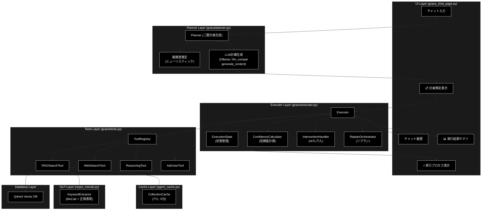

### Planner / Executor 2フェーズ処理フロー

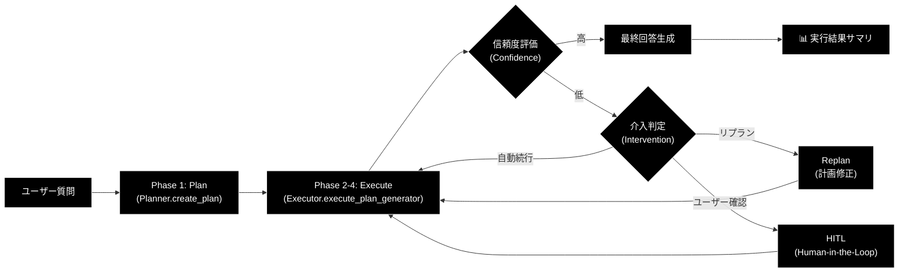

---

## 1. 画面レイアウト図

### 1.1 全体レイアウト

```mermaid
flowchart TB
    subgraph Browser["ブラウザウィンドウ"]
        direction TB
        subgraph Sidebar["📋 サイドバー (280px固定)"]
            direction TB
            S1["⚙️ 設定ヘッダー"]
            S2["モデル選択<br/>[selectbox]"]
            S3["コレクション選択<br/>[multiselect] (参考表示)"]
            S4["☑️ ハイブリッド検索<br/>(disabled)"]
            S5["[🗑️ 履歴クリア]"]
            S6["[🔄 キャッシュリセット]"]
            S7["📊 キャッシュ統計<br/>(expander)"]
            S1 --> S2 --> S3 --> S4 --> S5 --> S6 --> S7
        end
        subgraph Main["📄 メインエリア (残り幅)"]
            direction TB
            M1["🧠 タイトル<br/>自律型エージェント GRACE"]
            M2["キャプション<br/>Planner + Executor"]
            M3["📊 コレクションデータ表示<br/>(expander)"]
            M4["💬 チャットセクション"]
            M5["チャット履歴エリア"]
            M6["📋 計画策定 Plan<br/>(expander, 展開)"]
            M7["⚡ 実行 Execute<br/>(expander, 展開)"]
            M8["📊 実行結果サマリ<br/>(expander, 折りたたみ)"]
            M9["最終回答表示"]
            M10["📝 チャット入力"]
            M1 --> M2 --> M3 --> M4 --> M5 --> M6 --> M7 --> M8 --> M9 --> M10
        end
    end

    Sidebar -.-> Main
classDef default fill:#000,stroke:#fff,color:#fff
classDef subgraphStyle fill:#1a1a1a,stroke:#fff,color:#fff
class Executor,GRACE,M1,M10,M2,M3,M4,M5,M6,M7,M8,M9,S1,S2,S3,S4,S5,S6,S7 default
style Browser fill:#1a1a1a,stroke:#fff,color:#fff
style Sidebar fill:#1a1a1a,stroke:#fff,color:#fff
style Main fill:#1a1a1a,stroke:#fff,color:#fff
```

### 1.2 コンポーネント配置図

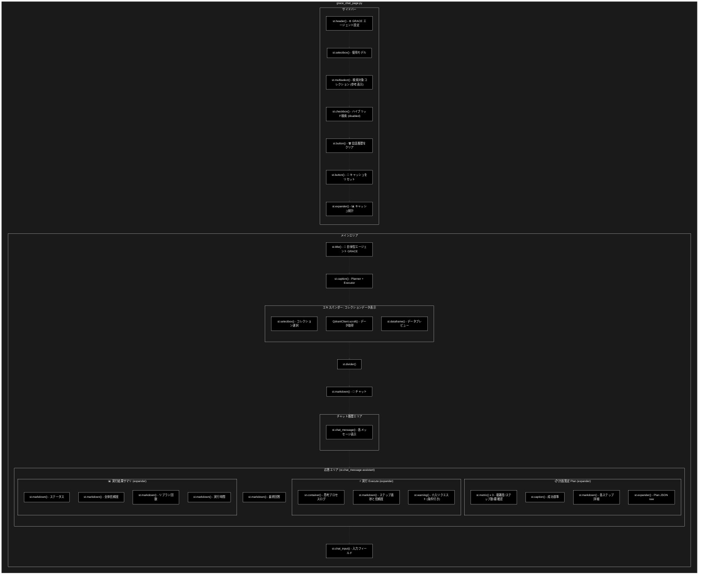

### 1.3 応答エリア内部構造

ユーザーが質問を送信した際、`st.chat_message("assistant")` 内に以下の3つのExpanderが順次生成されます。

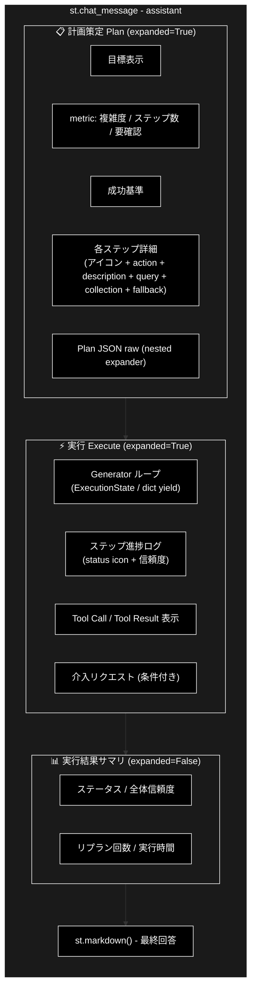

---

## 2. UIコンポーネント詳細

### 2.1 サイドバー


| コンポーネント     | 種類             | キー | デフォルト値             | 説明                                                              |
| ------------------ | ---------------- | ---- | ------------------------ | ----------------------------------------------------------------- |
| 設定ヘッダー       | `st.header`      | -    | -                        | 「⚙️ GRACE エージェント設定」                                   |
| モデル選択         | `st.selectbox`   | -    | `AgentConfig.MODEL_NAME` | 使用するLLMモデル（Ollama・ローカルLLM）                                       |
| コレクション選択   | `st.multiselect` | -    | 全コレクション           | 検索対象コレクション（参考表示。GRACEは全コレクションを自動検索） |
| ハイブリッド検索   | `st.checkbox`    | -    | `True`                   | Sparse + Dense検索（`disabled=True`、GRACE側デフォルトに委任）    |
| 履歴クリア         | `st.button`      | -    | -                        | 会話履歴・Planner・Executor 状態のクリア                          |
| キャッシュリセット | `st.button`      | -    | -                        | セッションキャッシュのクリア                                      |
| キャッシュ統計     | `st.expander`    | -    | 折りたたみ               | キャッシュ状態の詳細表示                                          |

#### モデル選択の詳細

```python
selected_model = st.selectbox(
    "使用モデル (Model)",
    options=GeminiConfig.AVAILABLE_MODELS,
    index=GeminiConfig.AVAILABLE_MODELS.index(AgentConfig.MODEL_NAME)
    if AgentConfig.MODEL_NAME in GeminiConfig.AVAILABLE_MODELS else 0
)
```

**オプション一覧** (`GeminiConfig.AVAILABLE_MODELS` — Ollama ローカルモデル):


| モデル名                     | 説明                                       |
| ---------------------------- | ------------------------------------------ |
| `gemma4:e4b`                 | Gemma 4 E4B（**デフォルト**・推奨）             |
| `gemma4:26b-a4b-it-q4_K_M`   | Gemma 4 26B 量子化版（高性能）                 |
| `llama3.2`                   | Llama 3.2（ローカル・高速）                    |
| `llama3.2:3b`               | Llama 3.2 3B（軽量版）                        |
| `qwen2.5:7b`                | Qwen 2.5 7B（多言語対応）                     |

`GeminiConfig.DEFAULT_MODEL` は `"gemma4:e4b"`（`config.py`、環境変数 `OLLAMA_DEFAULT_MODEL` で上書き可）。`AgentConfig.MODEL_NAME` も同モデルを既定とします。利用可能モデル一覧は `GeminiConfig.AVAILABLE_MODELS` を参照。


#### コレクション選択の詳細

```python
selected_collections = st.multiselect(
    "検索対象コレクション (参考表示)",
    options=all_collections,
    default=all_collections if all_collections != ["(None)"] else [],
    help="GRACEエージェントはQdrant上の全コレクションを自動検索します。"
)
```

コレクション選択はUIでの参考表示のみです。GRACE Executor 内の `RAGSearchTool` が Qdrant から動的にコレクション一覧を取得し、優先順位に従って全コレクションを順次検索します。

#### キャッシュ統計の詳細


| 表示項目       | 説明                               |
| -------------- | ---------------------------------- |
| キャッシュ状態 | 🟢 ヒット / ⚪ なし                |
| コレクション   | キャッシュされているコレクション名 |
| 前回スコア     | 直近の検索スコア                   |
| ヒット回数     | キャッシュヒット累計               |
| 経過時間       | キャッシュ作成からの経過秒数       |

### 2.2 メインエリア


| コンポーネント           | 種類                           | 説明                                                                          |
| ------------------------ | ------------------------------ | ----------------------------------------------------------------------------- |
| タイトル                 | `st.title`                     | 「🧠 自律型エージェント (GRACE)」                                             |
| キャプション             | `st.caption`                   | 「Goal-Reasoning-Action-Critique-Execute Architecture — Planner + Executor」 |
| コレクションデータ表示   | `st.expander` + `st.dataframe` | Qdrantデータのプレビュー                                                      |
| チャットセクション見出し | `st.markdown`                  | 「### 💬 チャット」                                                           |
| チャット履歴             | `st.chat_message`              | 会話の表示                                                                    |
| 📋 計画策定 (Plan)       | `st.expander`                  | Planner が生成した ExecutionPlan の表示                                       |
| ⚡ 実行 (Execute)        | `st.expander`                  | Executor のステップ実行ログのリアルタイム表示                                 |
| 📊 実行結果サマリ        | `st.expander`                  | 全体ステータス・信頼度・リプラン回数・実行時間                                |
| 最終回答                 | `st.markdown`                  | Executor の最終回答テキスト                                                   |
| チャット入力             | `st.chat_input`                | ユーザー入力                                                                  |

### 2.3 エキスパンダー一覧


| エキスパンダー名            | 初期状態   | 表示タイミング   | 内容                                                                       |
| --------------------------- | ---------- | ---------------- | -------------------------------------------------------------------------- |
| 📊 コレクションデータの表示 | 折りたたみ | 常時             | コレクション選択 + DataFrameプレビュー（100件）                            |
| 📋 計画策定 (Plan)          | **展開**   | 質問送信後       | 目標、複雑度/ステップ数/要確認のmetric、成功基準、各ステップ詳細           |
| 🔧 Plan JSON (raw)          | 折りたたみ | 計画策定内       | ExecutionPlan の JSON ダンプ（デバッグ用、ネストExpander）                 |
| ⚡ 実行 (Execute)           | **展開**   | 計画策定後       | ステップ進捗ログ（status icon + 信頼度）、Tool Call/Result、介入リクエスト |
| 📊 実行結果サマリ           | 折りたたみ | 実行完了後       | ステータス、全体信頼度、リプラン回数、実行時間                             |
| 📊 キャッシュ統計           | 折りたたみ | 常時(サイドバー) | キャッシュヒット状態、統計情報                                             |

### 2.4 計画策定 (Plan) Expander 内部詳細

計画策定 Expander は `Planner.create_plan()` の結果である `ExecutionPlan` を構造化表示します。


| 表示要素   | コンポーネント          | データソース                                                                                    |
| ---------- | ----------------------- | ----------------------------------------------------------------------------------------------- |
| 目標       | `st.markdown`           | `plan.original_query`                                                                           |
| 複雑度     | `st.metric` (3カラム左) | `plan.complexity`（0.0-1.0）                                                                    |
| ステップ数 | `st.metric` (3カラム中) | `plan.estimated_steps`                                                                          |
| 要確認     | `st.metric` (3カラム右) | `plan.requires_confirmation`（⚠️/✅）                                                         |
| 成功基準   | `st.caption`            | `plan.success_criteria`                                                                         |
| 各ステップ | `st.markdown` (ループ)  | `plan.steps[]` の action, description, query, collection, expected_output, fallback, depends_on |

**ステップのアクションアイコンマッピング**:


| action             | アイコン |
| ------------------ | -------- |
| `rag_search`       | 🔍       |
| `web_search`       | 🌐       |
| `reasoning`        | 🧠       |
| `ask_user`         | 💬       |
| `code_execute`     | 💻       |
| `run_legacy_agent` | 🤖       |
| その他             | ▶️     |

### 2.5 実行 (Execute) Expander 内部詳細

実行 Expander は `Executor.execute_plan_generator()` の Generator から yield される値をリアルタイム表示します。


| yield 型                     | 表示処理                                                                                         |
| ---------------------------- | ------------------------------------------------------------------------------------------------ |
| `ExecutionState`             | ステップID、ステータスアイコン、信頼度を1行で表示。介入リクエストがある場合は`st.warning` で表示 |
| `dict` (type=`log`)          | 思考プロセスログを`st.markdown` で追記                                                           |
| `dict` (type=`tool_call`)    | ツール名・引数を表示（🛠️）                                                                     |
| `dict` (type=`tool_result`)  | ツール結果を表示（📝、500文字で切り詰め）                                                        |
| `dict` (type=`final_answer`) | Legacy Agent 経由の最終回答を取得                                                                |
| `StopIteration.value`        | `ExecutionResult` を取得（Generator 終了時）                                                     |

**ステータスアイコンマッピング**:


| StepStatus | アイコン |
| ---------- | -------- |
| `SUCCESS`  | ✅       |
| `FAILED`   | ❌       |
| `SKIPPED`  | ⏭️     |
| `RUNNING`  | 🔄       |
| `PENDING`  | ⏳       |
| その他     | ❓       |

### 2.6 実行結果サマリ Expander 内部詳細


| 表示項目     | コンポーネント | データソース                                                          |
| ------------ | -------------- | --------------------------------------------------------------------- |
| ステータス   | `st.markdown`  | `execution_result.overall_status`（success/partial/failed/cancelled） |
| 全体信頼度   | `st.markdown`  | `execution_result.overall_confidence`（0.00-1.00）                    |
| リプラン回数 | `st.markdown`  | `execution_result.replan_count`                                       |
| 実行時間     | `st.markdown`  | `execution_result.total_execution_time_ms`（ミリ秒、存在時のみ表示）  |

### 2.7 ダイアログ・モーダル

（このページではダイアログ・モーダルは使用していません）

---

## 3. セッション状態管理

### 3.1 状態一覧


| キー                  | 型           | 初期値                             | 説明                      | リセット条件                |
| --------------------- | ------------ | ---------------------------------- | ------------------------- | --------------------------- |
| `grace_chat_history`  | `List[Dict]` | `[]`                               | 会話履歴（role, content） | クリアボタン                |
| `grace_session_id`    | `str`        | `uuid.uuid4()`                     | セッション識別子          | ページリロード              |
| `grace_planner`       | `Planner`    | `None`（初回アクセス時に自動生成） | 計画策定エージェント      | モデル変更時 / クリアボタン |
| `grace_executor`      | `Executor`   | `None`（初回アクセス時に自動生成） | 計画実行エージェント      | モデル変更時 / クリアボタン |
| `grace_current_model` | `str`        | -                                  | 選択中モデル              | モデル変更時 / クリアボタン |

#### 旧バージョン（v1.0）からの変更点


| 旧キー（削除）                | 新キー（追加）                     | 変更理由                                        |
| ----------------------------- | ---------------------------------- | ----------------------------------------------- |
| `grace_agent`（ReActAgent）   | `grace_planner` + `grace_executor` | 単一エージェント → 2フェーズ分離               |
| `grace_current_hybrid_search` | （削除）                           | GRACE側デフォルトに委任（UI は`disabled=True`） |
| `grace_current_collections`   | （削除）                           | GRACEが全コレクション自動検索のため不要         |

### 3.2 状態遷移図

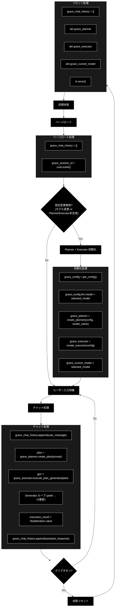

### 3.3 初期化・リセット条件


| 条件                    | 対象状態                                                                       | 処理                                      |
| ----------------------- | ------------------------------------------------------------------------------ | ----------------------------------------- |
| ページ初回ロード        | `grace_chat_history`, `grace_session_id`                                       | デフォルト値で初期化                      |
| モデル変更              | `grace_planner`, `grace_executor`, `grace_current_model`                       | Planner + Executor 再初期化、トースト表示 |
| Planner/Executor 未生成 | `grace_planner`, `grace_executor`                                              | 初期化処理を実行（初回アクセス時）        |
| クリアボタン            | `grace_chat_history`, `grace_planner`, `grace_executor`, `grace_current_model` | 全状態クリア後`st.rerun()`                |
| キャッシュリセット      | キャッシュのみ                                                                 | `collection_cache.clear(session_id)`      |

### 3.4 初期化処理の詳細

Planner と Executor の初期化は以下の条件のいずれかを満たす場合に実行されます。

```python
should_reinitialize = (
    "grace_current_model" not in st.session_state
    or st.session_state.grace_current_model != selected_model
    or "grace_planner" not in st.session_state
    or "grace_executor" not in st.session_state
)
```

初期化フロー:

```python
# 1. GraceConfig を取得し、UIで選択したモデルを反映
grace_config = get_config()            # grace/config.py のシングルトン
grace_config.llm.model = selected_model

# 2. Planner を初期化（モデル名を明示的に指定）
st.session_state.grace_planner = create_planner(
    config=grace_config,
    model_name=selected_model
)

# 3. Executor を初期化（ToolRegistry, Confidence, Intervention, Replan を内包）
st.session_state.grace_executor = create_executor(
    config=grace_config
)

# 4. 現在のモデルを記録
st.session_state.grace_current_model = selected_model
```

旧バージョンとの主な違い:

- 旧: コレクション変更・ハイブリッド検索変更でもエージェント再初期化が必要だった
- 新: **モデル変更のみ**で再初期化。コレクション検索は `RAGSearchTool` が Qdrant から動的に取得するため、UI 側の選択は再初期化トリガーにならない

---

## 4. ユーザー操作フロー

### 4.1 基本操作フロー

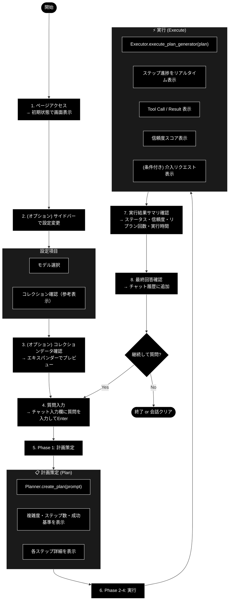

### 4.2 操作シーケンス図


---

## 5. 関数一覧表

### 5.1 メイン関数


| 関数名                   | 概要                           |
| ------------------------ | ------------------------------ |
| `show_grace_chat_page()` | ページ全体のレンダリングと制御 |

### 5.2 ヘルパー関数・クラス（インポート）


| 関数 / クラス                                    | モジュール               | 概要                                                 |
| ------------------------------------------------ | ------------------------ | ---------------------------------------------------- |
| `get_available_collections_from_qdrant_helper()` | `services.agent_service` | Qdrantコレクション一覧取得                           |
| `Planner` / `create_planner()`                   | `grace.planner`          | 計画策定エージェントの生成                           |
| `Executor` / `create_executor()`                 | `grace.executor`         | 計画実行エージェントの生成                           |
| `ExecutionPlan`                                  | `grace.schemas`          | 実行計画データモデル                                 |
| `ExecutionState`                                 | `grace.executor`         | 実行状態管理データクラス                             |
| `ExecutionResult`                                | `grace.schemas`          | 全体実行結果データモデル                             |
| `StepResult`                                     | `grace.schemas`          | ステップ単位の実行結果                               |
| `StepStatus`                                     | `grace.schemas`          | ステップの状態Enum                                   |
| `GraceConfig` / `get_config()`                   | `grace.config`           | GRACE設定の取得（UI では `get_config as get_grace_config` でエイリアスインポート） |
| `collection_cache`                               | `agent_cache`            | コレクションキャッシュ管理（グローバルインスタンス） |

### 5.3 grace/ パッケージ内部構成

`grace_chat_page.py` が直接利用するのは Planner / Executor / schemas のみですが、Executor 内部で以下のモジュールが連携します。


| モジュール              | 概要                                     | Executor からの利用               |
| ----------------------- | ---------------------------------------- | --------------------------------- |
| `grace/planner.py`      | 計画生成（LLM + JSON Schema）            | UI から直接呼び出し               |
| `grace/executor.py`     | 計画実行（Generator + 状態管理）         | UI から直接呼び出し               |
| `grace/schemas.py`      | データモデル定義                         | ExecutionPlan, ExecutionResult 等 |
| `grace/config.py`       | 設定管理（YAML + 環境変数）              | get_config() 経由                 |
| `grace/tools.py`        | ToolRegistry（RAG, WebSearch, Reasoning, AskUser） | Executor 内部で自動利用 |
| `grace/confidence.py`   | 信頼度計算（LLM自己評価 + クエリ網羅度） | Executor 内部で自動利用           |
| `grace/intervention.py` | HITL介入（Confirm, Escalate）            | Executor 内部で自動利用           |
| `grace/replan.py`       | リプラン戦略（部分/全体リプラン）        | Executor 内部で自動利用           |
| `grace/calibration.py`  | confidence 較正（温度スケーリング）      | Executor 内部で自動利用           |
| `grace/llm_compat.py`   | genai 互換 LLM クライアント（Ollama・ローカルLLM） | Planner / Executor / Confidence / Tools が利用 |

---

## 6. 関数 IPO詳細

### 6.1 `show_grace_chat_page`

**概要**: GRACEエージェントチャットページのメイン表示関数。サイドバー設定、コレクションデータプレビュー、チャット履歴、Planner による計画策定、Executor による計画実行を統合管理する。

```python
def show_grace_chat_page() -> None
```


| 項目        | 内容                                                                                                                                                                                                                                                                                                                                                                                                                            |
| ----------- | ------------------------------------------------------------------------------------------------------------------------------------------------------------------------------------------------------------------------------------------------------------------------------------------------------------------------------------------------------------------------------------------------------------------------------- |
| **Input**   | なし（セッション状態から取得）                                                                                                                                                                                                                                                                                                                                                                                                  |
| **Process** | 1. コレクションデータ表示エリアの描画<br>2. サイドバー設定UIの描画<br>3. セッション状態の初期化・更新チェック<br>4. Planner + Executor の初期化（必要時）<br>5. チャット履歴の表示<br>6. ユーザー入力の処理<br>7. Phase 1: Planner.create_plan() → 計画策定 Expander 表示<br>8. Phase 2-4: Executor.execute_plan_generator() → 実行 Expander 表示<br>9. ExecutionResult → 実行結果サマリ表示<br>10. 最終回答の表示・履歴追加 |
| **Output**  | なし（画面描画のみ）                                                                                                                                                                                                                                                                                                                                                                                                            |

**主要処理フロー**:

```python
# 1. コレクションデータ表示
with st.expander("📊 コレクションデータの表示", expanded=False):
    target_collection = st.selectbox("コレクションを選択:", preview_collections)
    points, _ = client.scroll(collection_name=target_collection, limit=100)
    st.dataframe(df_preview)

# 2. サイドバー設定
with st.sidebar:
    selected_model = st.selectbox("使用モデル", options=GeminiConfig.AVAILABLE_MODELS)
    selected_collections = st.multiselect("検索対象コレクション (参考表示)", ...)
    use_hybrid_search = st.checkbox("ハイブリッド検索", value=True, disabled=True)

# 3. セッション状態初期化
if "grace_chat_history" not in st.session_state:
    st.session_state.grace_chat_history = []
if "grace_session_id" not in st.session_state:
    st.session_state.grace_session_id = str(uuid.uuid4())

# 4. Planner + Executor 初期化（モデル変更時 or 未生成時）
if should_reinitialize:
    grace_config = get_config()
    grace_config.llm.model = selected_model
    st.session_state.grace_planner = create_planner(config=grace_config, model_name=selected_model)
    st.session_state.grace_executor = create_executor(config=grace_config)
    st.session_state.grace_current_model = selected_model

# 5. チャット履歴表示
for message in st.session_state.grace_chat_history:
    with st.chat_message(message["role"]):
        st.markdown(message["content"])

# 6. ユーザー入力処理
if prompt := st.chat_input("質問を入力してください..."):
    st.session_state.grace_chat_history.append({"role": "user", "content": prompt})

    with st.chat_message("assistant"):
        # 7. Phase 1: 計画策定
        with st.expander("📋 計画策定 (Plan)", expanded=True):
            plan = st.session_state.grace_planner.create_plan(prompt)
            # metric: 複雑度, ステップ数, 要確認
            # 各ステップ詳細表示

        # 8. Phase 2-4: 実行
        with st.expander("⚡ 実行 (Execute)", expanded=True):
            gen = st.session_state.grace_executor.execute_plan_generator(plan)
            try:
                while True:
                    yielded = next(gen)
                    if isinstance(yielded, ExecutionState):
                        # ステップ状態・信頼度を表示
                    elif isinstance(yielded, dict):
                        # log / tool_call / tool_result / final_answer を表示
            except StopIteration as e:
                execution_result = e.value  # ExecutionResult

        # 9. 実行結果サマリ
        with st.expander("📊 実行結果サマリ", expanded=False):
            # ステータス, 全体信頼度, リプラン回数, 実行時間

        # 10. 最終回答表示
        st.markdown(execution_result.final_answer)
        st.session_state.grace_chat_history.append({"role": "assistant", "content": ...})
```

### 6.2 `Planner.create_plan`（二層計画生成）

**概要**: ユーザーの質問を分析し、ExecutionPlan を生成する。**二層方式**を採用しており、ヒューリスティック複雑度が閾値未満の通常クエリは **ルールベースの2ステップ計画**（LLM呼び出しなし）を即時生成し、複雑なクエリや明示的なWeb検索指示の場合のみ **LLM計画生成** を行う。LLM呼び出しは `grace/llm_compat.py` の `create_chat_client(config)` が返す genai 互換クライアント経由で行う（`client.models.generate_content(model=..., contents=..., config={"response_schema": ExecutionPlan, "response_mime_type": "application/json", "max_output_tokens": 8192, ...})`）。`config.llm.provider="ollama"`（既定）では `OllamaGenaiClient` が `create_llm_client("ollama")`（OpenAI 互換 `/v1` エンドポイント、既定 `http://localhost:11434/v1`）経由で Ollama を呼び出し、`response.text`（JSON本体に整形済み）を `ExecutionPlan.model_validate_json()` で構造化する。API キーは不要（ローカル実行）。`provider="gemini"` 等を明示指定した場合のみ google-genai の `genai.Client()` が使われる（embedding 検証等の限定用途）。呼び出しサイトのコードは genai 互換形式を維持しているが、Ollama アダプターでは google-genai 固有パラメータ（AFC 関連等）は無視される。

**参照**: `grace/planner.py` / `grace/llm_compat.py`（詳細IPOは `grace/doc/planner.md` / `grace/doc/llm_compat.md`）

```python
def create_plan(self, query: str) -> ExecutionPlan
```


| 項目        | 内容                                                                                                                                                                                                                                                                                                                                                                                                                                                                                                                                                             |
| ----------- | ---------------------------------------------------------------------------------------------------------------------------------------------------------------------------------------------------------------------------------------------------------------------------------------------------------------------------------------------------------------------------------------------------------------------------------------------------------------------------------------------------------------------------------------------------------------- |
| **Input**   | `query: str` — ユーザーの質問文                                                                                                                                                                                                                                                                                                                                                                                                                                                                                                                                 |
| **Process** | 1. `estimate_complexity(query)` — キーワードベースのヒューリスティック複雑度を算出<br>2. `_should_use_llm_plan(query, complexity)` で分岐（`force_llm_plan` / Web検索マーカー / `complexity >= planner.llm_plan_complexity_threshold`(0.7)）<br>3. 分岐先=ルールベース: `_create_rule_based_plan()` が LLM 呼び出しなしで標準2ステップ計画を生成<br>4. 分岐先=LLM計画: `_create_llm_plan()` が利用可能コレクション一覧を取得し `PLAN_GENERATION_PROMPT` を構築、`client.models.generate_content(..., response_schema=ExecutionPlan, max_output_tokens=8192)` を最大2回リトライ（空レスポンス／不完全JSONを検知して再試行）し `ExecutionPlan.model_validate_json()` で構造化<br>5. LLM計画では別途 `estimate_complexity_with_llm(query)` で複雑度を推定し、その値で `plan.complexity` を上書きする<br>6. `validate_plan_dependencies()` で依存関係を検証（警告のみ）<br>7. 計画IDを付与（`create_plan_id()`） |
| **Output**  | `ExecutionPlan` — 実行計画（LLM計画生成失敗時はフォールバック計画を返却） |

**ルールベース計画 / フォールバック動作**: `_create_rule_based_plan()` は `rag_search`（`collection=None`＝全コレクション網羅、`fallback="web_search"`）→ `reasoning` の標準2ステップ計画を生成します。一方 `_create_fallback_plan()`（LLM計画生成失敗時）は別実装で、利用可能コレクションから wikipedia 系コレクションを優先選択（無ければ `None`）した `rag_search`（`fallback="web_search"`）→ `reasoning` の2ステップ計画（`complexity=0.5`）を生成します。LLM計画生成プロンプトでも「計画には web_search ステップを含めず rag_search の fallback に web_search を指定する（web_search は結果不十分時に Executor が動的実行する）」ルールを徹底しています。

### 6.3 `Planner._should_use_llm_plan`

**概要**: LLM計画生成を使うべきか判定する（二層分岐のゲート）。

```python
def _should_use_llm_plan(self, query: str, heuristic_complexity: float) -> bool
```


| 項目        | 内容 |
| ----------- | ---- |
| **Input**   | `query: str` — 質問文<br>`heuristic_complexity: float` — `estimate_complexity()` の値 |
| **Process** | 1. `config.planner.force_llm_plan=True` なら常に True<br>2. クエリに `_LLM_PLAN_MARKERS`（「最新ニュース」「ニュースを検索」「web検索」「ウェブ検索」「webで検索」）が含まれれば True<br>3. それ以外は `heuristic_complexity >= config.planner.llm_plan_complexity_threshold`（デフォルト0.7） |
| **Output**  | `bool` — True=LLM計画生成 / False=ルールベース計画 |

### 6.4 `Planner.estimate_complexity`

**概要**: キーワードベースの簡易的な複雑度推定。二層計画生成のゲート（`_should_use_llm_plan`）でも使用される。

```python
def estimate_complexity(self, query: str) -> float
```


| 項目        | 内容                                                                                                                                                                                          |
| ----------- | --------------------------------------------------------------------------------------------------------------------------------------------------------------------------------------------- |
| **Input**   | `query: str` — ユーザーの質問文                                                                                                                                                              |
| **Process** | 1. ベーススコア 0.5 から開始<br>2. キーワード11個の出現で加算: 「比較」0.15 /「違い」0.15 /「複数」0.2 /「最新」0.1 /「理由」0.1 /「方法」0.1 /「詳しく」0.15 /「ステップ」0.1 /「手順」0.1 /「なぜ」0.1 /「どのように」0.15<br>3. 質問文の長さ（100文字超で+0.1、200文字超で+0.1）を加算<br>4. 最大1.0でクランプ |
| **Output**  | `float` — 複雑度スコア（0.0-1.0）                                                                                                                                                            |

### 6.5 `Planner.refine_plan`

**概要**: フィードバックに基づいて計画を修正する。

```python
def refine_plan(self, plan: ExecutionPlan, feedback: str) -> ExecutionPlan
```


| 項目        | 内容                                                                                                             |
| ----------- | ---------------------------------------------------------------------------------------------------------------- |
| **Input**   | `plan: ExecutionPlan` — 元の計画<br>`feedback: str` — ユーザーからのフィードバック                             |
| **Process** | 元の計画の完全なJSON（`model_dump_json`、created_at/plan_id 除外）とフィードバックをプロンプトに含め、`client.models.generate_content(..., config={"response_schema": ExecutionPlan, "max_output_tokens": 4096})` で構造化出力を取得し `ExecutionPlan.model_validate_json()` でパース。新しいplan_idを付与 |
| **Output**  | `ExecutionPlan` — 修正された計画（失敗時は元の計画をそのまま返却）                                              |

### 6.6 `Executor.execute_plan_generator`

**概要**: 計画をステップごとに実行し、進捗を Generator で逐次返す。UI でのリアルタイム表示に使用。

**参照**: `grace/executor.py`

```python
def execute_plan_generator(
    self, plan: ExecutionPlan, state: Optional[ExecutionState] = None
) -> Generator[ExecutionState | dict, None, ExecutionResult]
```


| 項目        | 内容                                                                                                                                                                                                                                                                                                                                                                                                                                                                                                                                                                                                                                                                                           |
| ----------- | ---------------------------------------------------------------------------------------------------------------------------------------------------------------------------------------------------------------------------------------------------------------------------------------------------------------------------------------------------------------------------------------------------------------------------------------------------------------------------------------------------------------------------------------------------------------------------------------------------------------------------------------------------------------------------------------------- |
| **Input**   | `plan: ExecutionPlan` — 実行する計画<br>`state: Optional[ExecutionState]` — 既存状態（再開時、省略時は新規作成）                                                                                                                                                                                                                                                                                                                                                                                                                                                                                                                                                                             |
| **Process** | 1.`ExecutionState` を初期化（全ステップを PENDING に設定）<br>2. （`config.executor.parallel_search=True` 時）依存関係のない検索ステップ（rag_search/web_search）を `_prefetch_parallel_searches()` で並列プリフェッチ（最大 `max_parallel_steps`=4）<br>3. 各ステップをループ: スキップ済みチェック → キャンセルチェック → 依存チェック → ステップ実行 → 信頼度計算 → 介入判定<br>4. ステップ実行は `_execute_step()`（Generator）を `yield from` で中継し、ToolRegistry 経由でツールを実行（`run_legacy_agent` は `_execute_legacy_agent_step()`）<br>5. 検索結果が不十分（`_is_search_result_sufficient()` が False）な場合、`_execute_fallback_chain()` が `config.executor.fallback_chain`（rag_search → web_search → ask_user）に従い動的ステップを挿入実行。逆に十分な場合は計画済みの後続 web_search ステップを動的スキップ<br>6. 信頼度に基づく介入チェック（`decide_action()`）: CONFIRM/ESCALATE で一時停止、InterventionRequestを設定してyield後return<br>7. ステップ失敗時に ReplanOrchestrator がリプランを試行（`yield from execute_plan_generator(new_plan, state)` で再帰呼び出し）<br>8. 全ステップ完了後に `_calculate_overall_confidence()` で全体信頼度を算出 |
| **Yield**   | `ExecutionState` — ステップ完了/一時停止の通知（status, confidence, intervention_request）<br>`dict` — ツール実行イベント（type: log / tool_call / tool_result / final_answer）                                                                                                                                                                                                                                                                                                                                                                                                                                                                                                              |
| **Return**  | `ExecutionResult` — 最終実行結果（`StopIteration.value` で取得）                                                                                                                                                                                                                                                                                                                                                                                                                                                                                                                                                                                                                              |

**Generator のライフサイクル**:

```
┌─ next(gen) ─────────────────────────────────────────────┐
│                                                          │
│  [ステップ開始]                                           │
│    └─ _execute_step(step, state)                        │
│        ├─ ToolRegistry.get(action).execute(**kwargs)     │
│        │   └─ yield dict(type="log", content=...)       │
│        └─ return StepResult                             │
│                                                          │
│  [信頼度計算]                                             │
│    └─ _llm_calculate_step_confidence(tool_result, ...)  │
│        ├─ ConfidenceCalculator.llm_calculate()          │
│        └─ Heuristicフォールバック（LLMスコア < 0.6時）     │
│                                                          │
│  [介入判定]                                               │
│    ├─ SILENT/NOTIFY → 自動続行                           │
│    └─ CONFIRM/ESCALATE → yield ExecutionState (paused)  │
│                                                          │
│  [ステップ完了]                                           │
│    └─ yield ExecutionState (status + confidence)         │
│                                                          │
│  [失敗時リプラン]                                         │
│    └─ yield from execute_plan_generator(new_plan, state) │
│                                                          │
├─ ... (次ステップへ) ...                                   │
│                                                          │
│  [全ステップ完了]                                         │
│    ├─ _calculate_overall_confidence(state)               │
│    │   ├─ ConfidenceAggregator.aggregate()（検索ベース） │
│    │   ├─ GroundednessVerifier.verify()（支持率=主成分） │
│    │   ├─ _blend_groundedness_confidence()              │
│    │   └─ Calibrator.transform()（温度スケーリング較正） │
│    └─ return ExecutionResult ← StopIteration.value       │
└──────────────────────────────────────────────────────────┘
```

### 6.7 `get_available_collections_from_qdrant_helper`

**概要**: Qdrantから利用可能なコレクション一覧を取得する。

**参照**: `services/agent_service.py`


| 項目        | 内容                                                      |
| ----------- | --------------------------------------------------------- |
| **Input**   | なし                                                      |
| **Process** | QdrantClient でコレクション一覧を取得                     |
| **Output**  | `List[str]`: コレクション名のリスト（エラー時は空リスト） |

### 6.8 主要データモデル

#### ExecutionPlan（`grace/schemas.py`）


| フィールド              | 型                   | 説明                                |
| ----------------------- | -------------------- | ----------------------------------- |
| `original_query`        | `str`                | ユーザーの元の質問                  |
| `complexity`            | `float` (0.0-1.0)    | 推定複雑度                          |
| `estimated_steps`       | `int` (1-20)         | 推定ステップ数                      |
| `requires_confirmation` | `bool`               | 実行前に確認が必要か                |
| `steps`                 | `List[PlanStep]`     | 実行ステップのリスト（1個以上必須） |
| `success_criteria`      | `str`                | 計画成功の判定基準                  |
| `created_at`            | `Optional[datetime]` | 計画作成日時（自動設定）            |
| `plan_id`               | `Optional[str]`      | 計画ID（MD5ハッシュ先頭12文字）     |

#### PlanStep（`grace/schemas.py`）


| フィールド        | 型                      | 説明                                                                                          |
| ----------------- | ----------------------- | --------------------------------------------------------------------------------------------- |
| `step_id`         | `int` (≥1)             | ステップ番号                                                                                  |
| `action`          | `Literal[...]`          | アクション種別（rag_search, web_search, reasoning, ask_user, code_execute, run_legacy_agent） |
| `description`     | `str`                   | ステップの説明（1文字以上必須）                                                               |
| `query`           | `Optional[str]`         | 検索クエリ（検索系アクション用）                                                              |
| `collection`      | `Optional[str]`         | 検索対象コレクション（原則 null — 全コレクション自動検索）                                   |
| `depends_on`      | `List[int]`             | 依存する先行ステップID                                                                        |
| `expected_output` | `str`                   | 期待される出力の説明                                                                          |
| `fallback`        | `Optional[str]`         | 失敗時の代替アクション                                                                        |
| `timeout_seconds` | `Optional[int]` (1-300) | タイムアウト秒数（デフォルト30）                                                              |

#### ExecutionResult（`grace/schemas.py`）


| フィールド                | 型                   | 説明                                                  |
| ------------------------- | -------------------- | ----------------------------------------------------- |
| `plan_id`                 | `str`                | 計画ID                                                |
| `original_query`          | `str`                | 元のクエリ                                            |
| `final_answer`            | `Optional[str]`      | 最終回答                                              |
| `step_results`            | `List[StepResult]`   | 各ステップの結果                                      |
| `overall_confidence`      | `float` (0.0-1.0)    | 全体の信頼度                                          |
| `overall_status`          | `Literal[...]`       | 全体ステータス（success, partial, failed, cancelled） |
| `replan_count`            | `int`                | リプラン回数                                          |
| `total_execution_time_ms` | `Optional[int]`      | 総実行時間（ミリ秒）                                  |
| `total_token_usage`       | `Optional[dict]`     | 総トークン使用量                                      |
| `total_cost_usd`          | `Optional[float]`    | 総コスト（USD）                                       |
| `created_at`              | `Optional[datetime]` | 結果作成日時                                          |

#### ExecutionState（`grace/executor.py`）


| フィールド             | 型                              | 説明                            |
| ---------------------- | ------------------------------- | ------------------------------- |
| `plan`                 | `ExecutionPlan`                 | 実行中の計画                    |
| `current_step_id`      | `int`                           | 現在のステップID                |
| `step_results`         | `Dict[int, StepResult]`         | ステップID → 結果のマップ      |
| `step_statuses`        | `Dict[int, StepStatus]`         | ステップID → 状態のマップ      |
| `overall_confidence`   | `float`                         | 全体信頼度（実行中は暫定値）    |
| `is_cancelled`         | `bool`                          | キャンセル済みフラグ            |
| `is_paused`            | `bool`                          | 一時停止フラグ（介入待ち）      |
| `intervention_request` | `Optional[InterventionRequest]` | 介入リクエスト                  |
| `replan_count`         | `int`                           | リプラン回数                    |
| `max_replans`          | `int`                           | 最大リプラン回数（デフォルト3） |
| `start_time`           | `Optional[float]`               | 実行開始時刻                    |
| `end_time`             | `Optional[float]`               | 実行終了時刻                    |

#### StepResult（`grace/schemas.py`）


| フィールド          | 型                                        | 説明                       |
| ------------------- | ----------------------------------------- | -------------------------- |
| `step_id`           | `int`                                     | ステップID                 |
| `status`            | `Literal["success", "partial", "failed"]` | 実行結果ステータス         |
| `output`            | `Optional[Any]`                           | 出力内容（文字列、または検索結果リスト等の構造化データ） |
| `confidence`        | `float` (0.0-1.0)                         | 信頼度スコア               |
| `sources`           | `List[str]`                               | 引用ソース                 |
| `error`             | `Optional[str]`                           | エラーメッセージ（失敗時） |
| `execution_time_ms` | `Optional[int]`                           | 実行時間（ミリ秒）         |
| `token_usage`       | `Optional[dict]`                          | トークン使用量             |
| `created_at`        | `Optional[datetime]`                      | 結果作成日時               |

#### SearchResultItem / SearchResultPayload（`grace/schemas.py`）

RAG検索・Web検索の結果を共通フォーマットで表現するスキーマです（RAGSearchTool / WebSearchTool が出力）。

**SearchResultItem**:

| フィールド   | 型                    | 説明                                       |
| ------------ | --------------------- | ------------------------------------------ |
| `score`      | `float` (0.0-1.0)     | 関連度スコア                               |
| `payload`    | `SearchResultPayload` | 検索結果の詳細情報                         |
| `collection` | `str`                 | 検索元コレクション名（例: `wikipedia_ja`, `web_search`） |

**SearchResultPayload**: `question`, `answer`, `content`, `source`, `title`（いずれも `str`、デフォルト空文字）

---

## 7. 依存関係

### 7.1 外部ライブラリ


| ライブラリ      | バージョン | 用途                                         |
| --------------- | ---------- | -------------------------------------------- |
| `streamlit`     | >= 1.28    | UIフレームワーク                             |
| `pandas`        | >= 2.0     | データフレーム表示                           |
| `qdrant-client` | >= 1.6     | Qdrant接続・データ取得                       |
| `openai`     | >= 1.100   | Ollama 呼び出し（OpenAI 互換 `/v1` クライアント） |
| `ollama`     | (Optional) | Ollama ネイティブクライアント          |
| `pydantic`      | >= 2.0     | データモデル（ExecutionPlan, StepResult 等） |
| `pyyaml`        | >= 6.0     | GraceConfig の YAML 読み込み                 |
| `MeCab`         | (Optional) | 日本語形態素解析（KeywordExtractor）         |
| `cohere`        | (Optional) | Re-ranking API                               |

### 7.2 内部モジュール（設定）


| モジュール                  | 用途                                                           |
| --------------------------- | -------------------------------------------------------------- |
| `config.AgentConfig`        | エージェント設定（デフォルトモデル、RAG設定）                  |
| `config.GeminiConfig`       | Ollama ローカルLLM モデル設定（利用可能モデル一覧・既定 `gemma4:e4b`）   |
| `grace.config.GraceConfig`  | GRACE統合設定（LLM, Confidence, Intervention, Replan, Qdrant） |
| `grace.config.get_config()` | GraceConfig シングルトン取得（YAML + 環境変数）                |

### 7.3 サービス層


| サービス                                                              | 用途                             | 旧版からの変更 |
| --------------------------------------------------------------------- | -------------------------------- | -------------- |
| `grace.Planner` / `create_planner()`                                  | 計画策定（LLM + JSON Schema）    | **新規追加** |
| `grace.Executor` / `create_executor()`                                | 計画実行（Generator + 状態管理） | **新規追加** |
| `services.agent_service.get_available_collections_from_qdrant_helper` | Qdrantコレクション取得           | 維持           |
| `agent_cache.collection_cache`                                        | セッションベースのキャッシュ管理 | 維持           |
| `qdrant_client_wrapper.get_qdrant_client`                             | Qdrantクライアント取得           | 維持           |

#### 旧版（v1.0）から削除されたサービス


| 旧サービス                                     | 理由                                  |
| ---------------------------------------------- | ------------------------------------- |
| `services.agent_service.ReActAgent`            | Planner + Executor に置換             |
| `agent_parallel_search.parallel_search_engine` | `grace/tools.py` RAGSearchTool に統合 |
| `agent_tools`                                  | `grace/tools.py` ToolRegistry に統合  |

### 7.4 grace/ パッケージ構成図

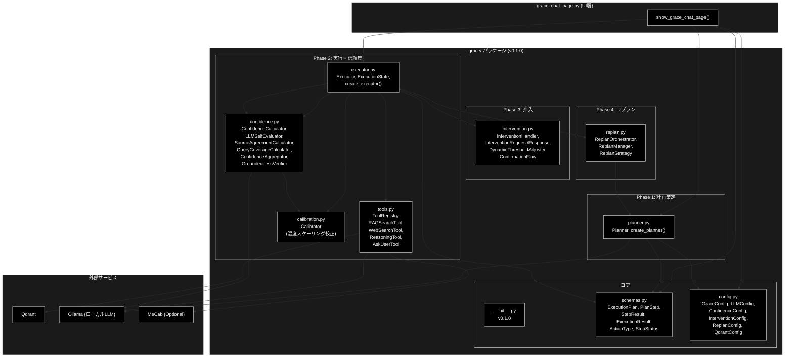

### 7.5 依存モジュール詳細

#### 7.5.1 grace/config.py — GRACE 統合設定

YAML ファイル（既定 `config/grace_config.yml`、`ConfigLoader.DEFAULT_CONFIG_PATH`）と環境変数（`GRACE_` プレフィックス）から設定を読み込みます。

**主要クラス**:


| クラス               | 説明                                              |
| -------------------- | ------------------------------------------------- |
| `GraceConfig`        | 統合設定ルート                                    |
| `LLMConfig`          | LLM設定（model, temperature, max_tokens 等）      |
| `ConfidenceConfig`   | 信頼度閾値設定                                    |
| `InterventionConfig` | 介入レベル設定                                    |
| `ReplanConfig`       | リプラン制御設定（max_replans 等）                |
| `QdrantConfig`       | Qdrant接続・検索設定（search_priority, search_limit, rag_sufficient_score 等） |

**デフォルトモデル**: `gemma4:e4b`（`LLMConfig.model`）

#### 7.5.2 grace/tools.py — ToolRegistry

Executor が使用するツール群を管理するレジストリです。

**主要クラス**:


| クラス          | ActionType   | 説明                                                               |
| --------------- | ------------ | ------------------------------------------------------------------ |
| `ToolRegistry`  | -            | ツール管理・ルーティング                                           |
| `BaseTool`      | -            | ツール基底クラス（ABC）                                            |
| `RAGSearchTool` | `rag_search` | Qdrant全コレクション自動検索（auto-collection fallback、MeCabキーワードフィルタ、動的閾値） |
| `WebSearchTool` | `web_search` | Web検索（`config.web_search.backend`: serpapi / duckduckgo / google_cse を切替、rag_search互換フォーマットに変換） |
| `ReasoningTool` | `reasoning`  | LLM推論（検索結果を基に Ollama・ローカルLLM で回答生成）              |
| `AskUserTool`   | `ask_user`   | HITL（ユーザーへの確認要求）                                       |

ツールの登録は `config.tools.enabled`（デフォルト: `["rag_search", "web_search", "reasoning", "ask_user"]`）に基づき `ToolRegistry._register_default_tools()` が行います。

**RAGSearchTool の検索戦略**:

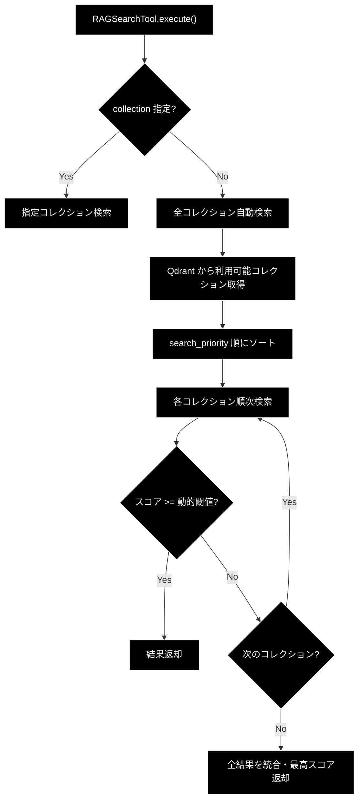

#### 7.5.3 grace/confidence.py — 信頼度計算（groundedness + 較正）

ステップ実行結果の信頼度を多角的に評価します。LLM方式とHeuristic方式のハイブリッド計算に加え、**S1: 根拠妥当性（groundedness）を最終 confidence の主成分とするパイプライン**を実装しています。すべての LLM 呼び出しは `grace/llm_compat.py` の `create_chat_client(config)` 経由（`client.models.generate_content(...)` → `response.text` を手動パース）で行います。詳細IPOは `grace/doc/confidence.md` / `grace/doc/calibration.md` を参照。

**主要コンポーネント**:


| コンポーネント              | 説明                                                                                              |
| --------------------------- | ------------------------------------------------------------------------------------------------- |
| `ConfidenceCalculator`      | 統合信頼度計算（`calculate` → Heuristic / `llm_calculate` → LLM / `decide_action` → 介入レベル判定） |
| `LLMSelfEvaluator`          | Ollama・ローカルLLM による自己評価（query と answer の整合性）。応答スキーマは `EvaluationResult` / `FinalEvaluationResult` |
| `SourceAgreementCalculator` | 複数ソース間のテキスト一致度計算                                                                  |
| `QueryCoverageCalculator`   | クエリ網羅度計算（LLM評価）                                                                       |
| `ConfidenceAggregator`      | 複数信頼度指標の重み付け統合                                                                      |
| `GroundednessVerifier`      | **S1**: 最終回答の各主張が引用ソースに支持される割合（support_rate）をLLMで検証。応答スキーマは `GroundednessResponse` / `ClaimVerdict`、集計結果は `GroundednessResult`（support_rate, supported/contradicted/neutral, total） |
| `EvaluationResult`          | LLM信頼度評価の応答スキーマ（Pydantic BaseModel: score, reason）                                  |

> 注: `GroundednessVerifier` / `GroundednessResult` / `Calibrator` 等の S1 系要素は `grace/__init__.py` の `__all__` には公開されておらず、Executor 内部からのみ利用されます（`create_groundedness_verifier()` / `Calibrator.load()`）。

**ステップ単位の信頼度計算フロー（`_llm_calculate_step_confidence`）**:

1. LLM方式で信頼度を計算（`ConfidenceCalculator.llm_calculate()`）
2. LLMスコアが0.6未満かつ検索ステップの場合、Heuristic方式（`calculate()`）で再計算して比較
3. 高い方のスコアを採用（LLM方式失敗時はHeuristicにフォールバック）

**全体信頼度の合成フロー（`Executor._calculate_overall_confidence`）**:

1. 完了ステップの信頼度を `ConfidenceAggregator` で集約（検索ベースの集約値）
2. 最終回答ステップ（reasoning / run_legacy_agent）について `GroundednessVerifier.verify(query, final_answer, sources)` で support_rate を算出
3. `_blend_groundedness_confidence()` が **groundedness（支持率）を主成分**、self_eval / coverage を従、検索ベース集約値を補助項としてブレンド（重みは `ConfidenceConfig` の `groundedness_weight=0.6` 等）。groundedness が未検証（ソース無し / LLM失敗）の場合は従来ブレンドにフォールバック、矛盾検出時はペナルティを適用
4. `grace/calibration.py` の `Calibrator`（温度スケーリング、`config/calibration.json` から `Calibrator.load()`）で較正。T=1.0 なら恒等変換

**介入レベル判定（`decide_action`）**:


| InterventionLevel | 信頼度範囲     | 動作                       |
| ----------------- | -------------- | -------------------------- |
| `SILENT`          | 高（閾値以上） | 自動続行、ログのみ         |
| `NOTIFY`          | 中高           | 自動続行、UI に通知        |
| `CONFIRM`         | 中低           | 一時停止、ユーザー確認待ち |
| `ESCALATE`        | 低             | 一時停止、エスカレーション |

#### 7.5.4 grace/intervention.py — HITL 介入

信頼度が低い場合のユーザー介入フローを管理します。

**主要クラス**:


| クラス                     | 説明                                                                                   |
| -------------------------- | -------------------------------------------------------------------------------------- |
| `InterventionHandler`      | 介入要否判定・リクエスト生成                                                           |
| `InterventionRequest`      | 介入リクエスト（level, step_id, message, confidence_score, plan, timeout_seconds=300） |
| `InterventionResponse`     | ユーザー応答（action: PROCEED / MODIFY / CANCEL / INPUT / RETRY / SKIP）               |
| `InterventionAction`       | 介入アクションEnum（6種類）                                                            |
| `DynamicThresholdAdjuster` | フィードバックに基づく閾値自動調整                                                     |
| `ConfirmationFlow`         | 確認フロー管理                                                                         |
| `FeedbackRecord`           | フィードバック記録                                                                     |

#### 7.5.5 grace/replan.py — リプラン戦略

ステップ失敗時に計画を動的に修正します。

**主要クラス**:


| クラス               | 説明                                                                                     |
| -------------------- | ---------------------------------------------------------------------------------------- |
| `ReplanOrchestrator` | リプラン全体制御（失敗検知 → 戦略選択 → 新計画生成）                                   |
| `ReplanManager`      | リプラン戦略の管理・実行                                                                 |
| `ReplanStrategy`     | リプラン戦略Enum（PARTIAL / FULL / FALLBACK / SKIP / ABORT）                             |
| `ReplanTrigger`      | トリガーEnum（STEP_FAILED / LOW_CONFIDENCE / USER_FEEDBACK / NEW_INFORMATION / TIMEOUT） |
| `ReplanContext`      | リプラン時のコンテキスト                                                                 |
| `ReplanResult`       | リプラン結果（success, new_plan, reason）                                                |

**リプランフロー**:

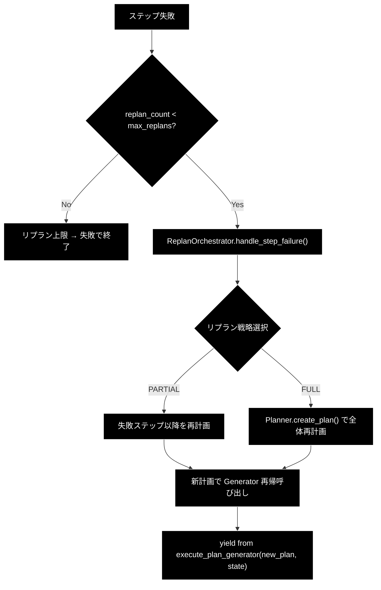

#### 7.5.6 agent_cache.py — コレクションキャッシュ

前回の検索成功コレクションをセッション単位でキャッシュし、検索効率を向上させます（旧版から変更なし）。

**主要クラス**:


| 名前                   | 種類                   | 説明                                                                    |
| ---------------------- | ---------------------- | ----------------------------------------------------------------------- |
| `CollectionCache`      | クラス                 | キャッシュ管理                                                          |
| `CollectionCacheEntry` | dataclass              | キャッシュエントリ（collection_name, last_score, timestamp, hit_count） |
| `collection_cache`     | グローバルインスタンス | デフォルトキャッシュ（TTL: 300秒）                                      |

---

## 8. イベント処理

### 8.1 ボタンイベント


| ボタン                  | イベント | 処理内容                                                                                                   |
| ----------------------- | -------- | ---------------------------------------------------------------------------------------------------------- |
| 🗑️ 会話履歴をクリア   | クリック | `grace_chat_history` クリア、`grace_planner` / `grace_executor` / `grace_current_model` 削除、`st.rerun()` |
| 🔄 キャッシュをリセット | クリック | `collection_cache.clear(session_id)`、トースト表示                                                         |

### 8.2 入力イベント


| コンポーネント                   | イベント | 処理内容                                                  | 旧版との差分                                         |
| -------------------------------- | -------- | --------------------------------------------------------- | ---------------------------------------------------- |
| モデル選択                       | 変更     | `should_reinitialize = True`、Planner + Executor 再初期化 | ReActAgent → Planner + Executor                     |
| コレクション選択                 | 変更     | UI表示のみ更新（再初期化は発生しない）                    | 旧: 再初期化トリガー →**新: 参考表示のみ**          |
| ハイブリッド検索                 | -        | `disabled=True` のため操作不可                            | 旧: 再初期化トリガー →**新: 操作無効化**            |
| コレクション選択（プレビュー用） | 変更     | Qdrantからデータ取得、DataFrame更新                       | 変更なし                                             |
| チャット入力                     | Enter    | Plan → Execute → Result → 最終回答 の一連処理開始      | execute_turn → create_plan + execute_plan_generator |

### 8.3 Generator イベント処理

新アーキテクチャでは、`Executor.execute_plan_generator()` が Generator として yield する値をリアルタイムに処理します。

#### 処理ループ構造

```python
gen = executor.execute_plan_generator(plan)
execution_result: Optional[ExecutionResult] = None

try:
    while True:
        yielded = next(gen)

        if isinstance(yielded, ExecutionState):
            # --- ステップ完了/一時停止の通知 ---
            ...
        elif isinstance(yielded, dict):
            # --- ツール実行イベント ---
            event_type = yielded.get("type", "")
            ...

except StopIteration as e:
    execution_result = e.value  # ExecutionResult
```

#### yield 型別イベント処理

**ExecutionState（ステップ状態通知）**:


| 処理           | 詳細                                                                           |
| -------------- | ------------------------------------------------------------------------------ |
| ステータス表示 | `Step {sid}: {status_icon} {status}{conf_str}` を `thought_container` に追記   |
| 信頼度表示     | `state.step_results[sid].confidence` を `(信頼度: 0.XX)` 形式で付記            |
| 介入リクエスト | `state.is_paused and state.intervention_request` の場合、`st.warning()` で表示 |
| 自動続行       | 現Phase では介入リクエスト後も`st.info("（自動続行します）")` で自動続行       |

**dict イベント**:


| type           | 処理内容                                                      | 表示コンポーネント                     |
| -------------- | ------------------------------------------------------------- | -------------------------------------- |
| `log`          | 思考プロセスログを追記 +`st.divider()`                        | `thought_container` 内の `st.markdown` |
| `tool_call`    | `🛠️ Tool Call: {name}` + `Args: {args}` を表示              | `thought_container` 内の `st.markdown` |
| `tool_result`  | `📝 Tool Result:` + 内容（500文字で切り詰め）+ `st.divider()` | `thought_container` 内の `st.markdown` |
| `final_answer` | Legacy Agent 経由の最終回答を`final_response_content` に格納  | 直接代入（後続で`st.markdown` 表示）   |

**StopIteration（Generator 終了）**:


| 処理         | 詳細                                                                            |
| ------------ | ------------------------------------------------------------------------------- |
| 結果取得     | `e.value` から `ExecutionResult` を取得                                         |
| 最終回答抽出 | `execution_result.final_answer` を `final_response_content` に設定              |
| サマリ表示   | `📊 実行結果サマリ` Expander にステータス・信頼度・リプラン回数・実行時間を表示 |
| 履歴追加     | `grace_chat_history.append({"role": "assistant", "content": ...})`              |

### 8.4 イベント処理フロー図

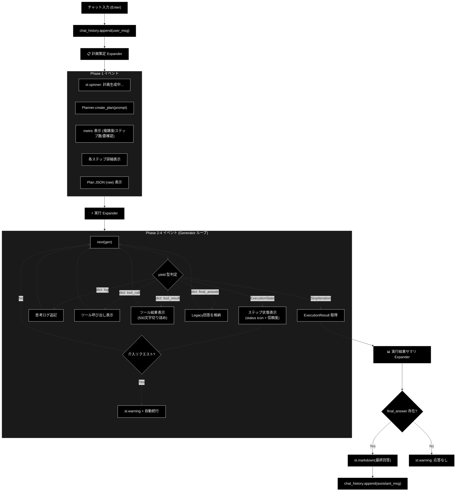

### 8.5 旧版イベント処理との対比


| 観点            | 旧版（v1.0）                                                | 新版（v2.0+）                                                      |
| --------------- | ----------------------------------------------------------- | ------------------------------------------------------------------ |
| イベントソース  | `ReActAgent.execute_turn()` Generator                       | `Executor.execute_plan_generator()` Generator                      |
| yield 型        | `dict` のみ（type: log/tool_call/tool_result/final_answer） | `ExecutionState` + `dict`（2種類の yield）                         |
| ステップ状態    | なし（ReAct フェーズとして一括）                            | ステップ単位の status + confidence をリアルタイム表示              |
| 介入            | なし                                                        | `ExecutionState.is_paused` + `intervention_request` で一時停止通知 |
| 最終結果取得    | `final_answer` イベント（dict）                             | `StopIteration.value`（`ExecutionResult`）+ Legacy 用 dict         |
| 表示先 Expander | 1つ（🤔 エージェントの思考プロセス）                        | 3つ（📋 計画策定 / ⚡ 実行 / 📊 実行結果サマリ）                   |
| エラー時        | try/except で`st.error`                                     | 同様 +`ExecutionResult(status="failed")` でも結果返却              |

---

## 9. エラーハンドリング

### 9.1 エラー種別


| エラー種別                    | 発生箇所             | 発生条件                                          | 対処                                                      |
| ----------------------------- | -------------------- | ------------------------------------------------- | --------------------------------------------------------- |
| Qdrant接続エラー              | サイドバー初期化     | サーバー未起動、ネットワーク障害                  | `st.warning` で警告表示、`["(None)"]` で続行              |
| Planner/Executor 初期化エラー | セッション初期化     | API認証失敗、GraceConfig 読み込みエラー           | `st.error` でエラー表示、`return` で処理中断              |
| 計画策定エラー                | Phase 1（Plan）      | LLM呼び出し失敗、構造化出力パースエラー           | `_generate_plan_with_retry()` がリトライ後、Planner 内部でルールベース計画を自動生成 |
| ステップ実行エラー            | Phase 2-4（Execute） | ツール実行失敗、タイムアウト                      | Executor 内部でフォールバック → リプラン試行             |
| Generator 例外                | Phase 2-4（Execute） | 予期しないランタイムエラー                        | `ExecutionResult(status="failed", confidence=0.0)` を返却 |
| チャット処理エラー            | 全体 try/except      | 上記以外の未捕捉エラー                            | `st.error` でエラー表示、`logger.error(exc_info=True)`    |
| コレクションデータ取得エラー  | データプレビュー     | コレクション不在、スキーマ不一致                  | `st.error` でエラー表示                                   |

### 9.2 エラー処理の多層構造

新アーキテクチャではエラーが3つの層で処理されます。

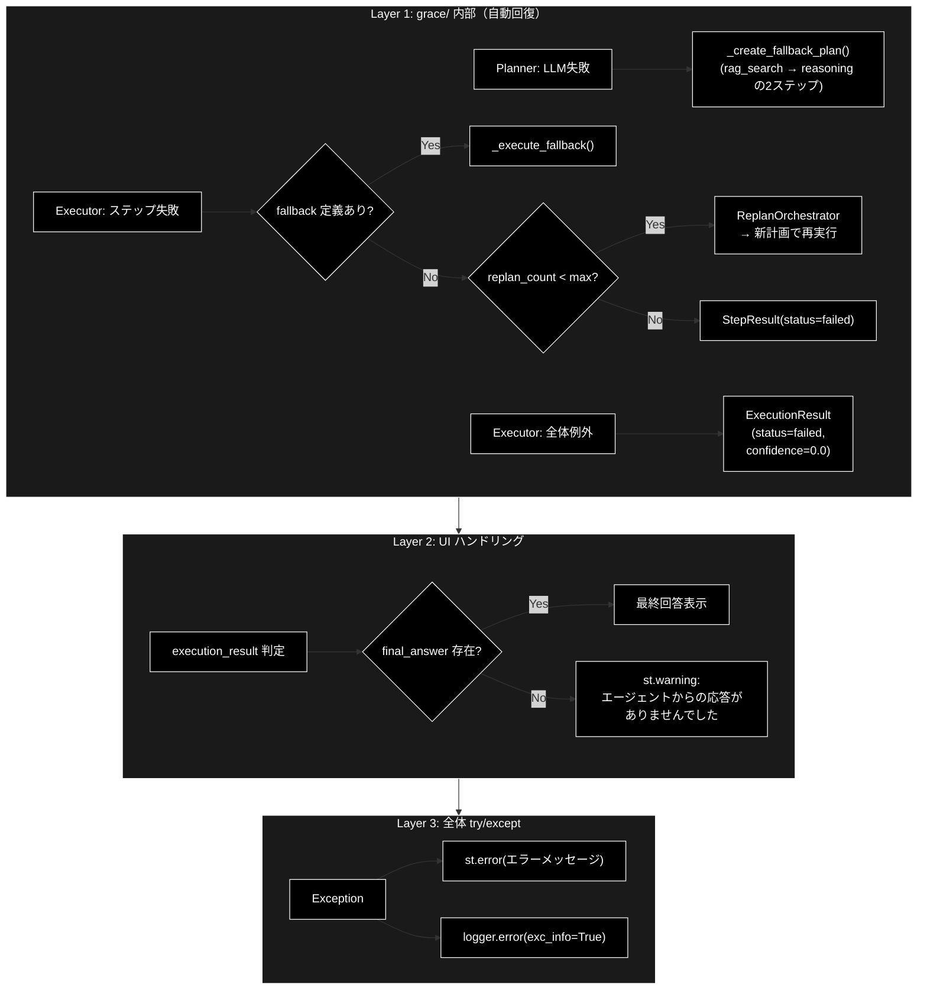

### 9.3 エラー表示コンポーネント


| 表示種別 | Streamlitコンポーネント | 用途                                                     |
| -------- | ----------------------- | -------------------------------------------------------- |
| エラー   | `st.error()`            | 致命的エラー（初期化失敗、未捕捉例外）                   |
| 警告     | `st.warning()`          | 注意喚起（コレクション未検出、応答なし、介入リクエスト） |
| 情報     | `st.info()`             | 補足情報（データなし、自動続行通知）                     |
| トースト | `st.toast()`            | 一時的な通知（設定変更、キャッシュクリア、初期化完了）   |

### 9.4 エラー処理コード例

```python
# Planner + Executor 初期化エラー
try:
    grace_config = get_grace_config()
    grace_config.llm.model = selected_model
    st.session_state.grace_planner = create_planner(config=grace_config, model_name=selected_model)
    st.session_state.grace_executor = create_executor(config=grace_config)
    st.toast("GRACE Planner + Executor の準備が完了しました。")
except Exception as e:
    st.error(f"GRACE エージェントの初期化に失敗しました: {e}")
    logger.error(f"GRACE init failed: {e}", exc_info=True)
    return

# チャット処理エラー（全体を包む try/except）
try:
    # Phase 1: 計画策定
    plan = st.session_state.grace_planner.create_plan(prompt)
    # → 失敗時: Planner 内部でフォールバック計画を自動生成

    # Phase 2-4: 実行
    gen = st.session_state.grace_executor.execute_plan_generator(plan)
    try:
        while True:
            yielded = next(gen)
            # イベント処理...
    except StopIteration as e:
        execution_result = e.value
    # → Generator 内部例外: ExecutionResult(status="failed") を返却

    # 最終回答チェック
    if final_response_content:
        st.markdown(final_response_content)
    else:
        st.warning("エージェントからの応答がありませんでした。")

except Exception as e:
    st.error(f"エラーが発生しました: {e}")
    logger.error(f"GRACE Chat Error: {e}", exc_info=True)
```

---

## 10. 使用例

### 10.1 基本的な使用方法

1. ページにアクセス
2. サイドバーで必要に応じてモデルを変更（デフォルト: `gemma4:e4b`）
3. （オプション）コレクションデータのプレビュー — エキスパンダーを開いてコレクションを選択し、登録されているQ&Aデータを確認
4. チャット入力欄に質問を入力して Enter
5. **📋 計画策定 (Plan)** を確認 — 複雑度、ステップ数、各ステップの詳細
6. **⚡ 実行 (Execute)** を確認 — ステップ進捗、ツール呼び出し・結果、信頼度スコア
7. **📊 実行結果サマリ** を確認（任意）— 全体ステータス、信頼度、リプラン回数、実行時間
8. 最終回答を確認
9. 必要に応じて追加の質問を続ける

### 10.2 典型的な質問例

```
- 「カリン・フォン・アロルディンゲンについて教えてください」
- 「Wikipediaの情報から、〇〇の歴史を説明してください」
- 「ライブドアニュースで報じられた××について教えて」
- 「△△と□□の違いは何ですか？」
```

### 10.3 計画策定の表示例

```
📋 計画策定 (Plan)

目標: カリン・フォン・アロルディンゲンについて教えてください

  複雑度: 0.4    ステップ数: 3    要確認: ✅ いいえ

🎯 成功基準: ユーザーの質問に対して、検索結果に基づく正確な回答を提供する
────────────────────────────
🔍 Step 1: [rag_search] Qdrantナレッジベースから関連情報を検索
   🔑 Query: `カリン・フォン・アロルディンゲン`
   📤 期待出力: Wikipedia等からの人物情報
   🔄 Fallback: `web_search`

🧠 Step 2: [reasoning] 検索結果を基に回答を生成  ← 依存: Step [1]
   📤 期待出力: 経歴・業績をまとめた回答文

🧠 Step 3: [reasoning] 回答の品質チェックと最終整形  ← 依存: Step [2]
   📤 期待出力: ユーザーに提示する最終回答
```

### 10.4 実行プロセスの表示例

```
⚡ 実行 (Execute)

📝 【ツール実行結果: rag_search】
  [検索結果 JSON...]
────────────────────────────
Step 1: ✅ success (信頼度: 0.82)

📝 【ツール実行結果: reasoning】
  カリン・フォン・アロルディンゲンは...
────────────────────────────
Step 2: ✅ success (信頼度: 0.78)

Step 3: ✅ success (信頼度: 0.85)
```

### 10.5 実行結果サマリの表示例

```
📊 実行結果サマリ

ステータス: success
全体信頼度: 0.82
リプラン回数: 0
実行時間: 3450ms
```

---

## 11. 変更履歴


| バージョン | 日付           | 変更内容                                                                                                                                                                                                                                                                                                                                                                                                                                                                                                                                                                                                                                                                                                                                                                                                                                                                                                                                           |
| ---------- | -------------- | -------------------------------------------------------------------------------------------------------------------------------------------------------------------------------------------------------------------------------------------------------------------------------------------------------------------------------------------------------------------------------------------------------------------------------------------------------------------------------------------------------------------------------------------------------------------------------------------------------------------------------------------------------------------------------------------------------------------------------------------------------------------------------------------------------------------------------------------------------------------------------------------------------------------------------------------------- |
| 1.0        | 2025-01-29     | 初版作成                                                                                                                                                                                                                                                                                                                                                                                                                                                                                                                                                                                                                                                                                                                                                                                                                                                                                                                                           |
| 1.1        | 2025-01-29     | 依存モジュール詳細（agent_cache, agent_parallel_search, agent_tools, regex_mecab）を追加                                                                                                                                                                                                                                                                                                                                                                                                                                                                                                                                                                                                                                                                                                                                                                                                                                                           |
| **2.0**    | **2025-06-14** | **ReActAgent → Planner + Executor アーキテクチャに全面移行**。主な変更: (1) アーキテクチャ概要を2フェーズ分離型に更新、(2) 画面レイアウトを3 Expander 構成に変更、(3) セッション状態から `grace_agent` / `grace_current_hybrid_search` / `grace_current_collections` を削除し `grace_planner` / `grace_executor` を追加、(4) イベント処理を Generator ベース（ExecutionState + dict yield）に刷新、(5) 依存関係に grace/ パッケージ構成図を追加、(6) エラーハンドリングを3層構造（grace内部自動回復 / UI判定 / 全体try-except）に整理、(7) 使用例を計画策定・実行プロセス・結果サマリの表示例に更新、(8) 付録Bに GraceConfig 設定リファレンスを追加                                                                                                                                                                                                                                                                                               |
| **3.1**    | **2026-06-12** | **ソースコード（`grace/` 全モジュール）との突合に基づく最新化**。主な変更: (1) `WebSearchTool` / `web_search` アクションを追加（ToolRegistry・アーキテクチャ図・config）、(2) Planner を二層計画生成（ルールベース即時計画 + 複雑クエリ向けLLM計画）に更新し、削除済みの `estimate_complexity_with_llm` を撤去、`_should_use_llm_plan` を追加、(3) LLM呼び出しを `helper.helper_llm.create_llm_client("anthropic")` + `generate_structured()` に統一しAFC関連記述を削除、(4) `GraceConfig` に `PlannerConfig` / `ExecutorConfig` / `WebSearchConfig` を追加し `QdrantConfig`（search_priority・rag_sufficient_score）を更新、(5) Executor IPO に並列検索プリフェッチ・動的フォールバック連鎖（rag_search → web_search → ask_user）・web_search 動的スキップを追記、(6) Phase 5 ベンチマーク（付録E、`BenchmarkRunner` / `run_benchmark.py`）を追加、(7) schemas に `SearchResultItem` / `SearchResultPayload` を追加し `StepResult.output` を `Optional[Any]` に修正、(8) モデル一覧を `claude-opus-4-7` 等 `ModelConfig.AVAILABLE_MODELS` に同期、(9) トラブルシューティングのAFC記述を撤去 |
| **3.2**    | **2026-06-16** | **技術スタック表記をAnthropic Claudeに統一**。主な変更: (1) LLM（Plan/Execute/Confidence/Replan推論・Agent応答）の記述を `Anthropic Claude` / `ModelConfig` / `ANTHROPIC_API_KEY` に統一（埋め込みは `gemini-embedding-001`（3072次元）/ Gemini を維持）、(2) Mermaidダイアグラム（flowchart 12 + sequenceDiagram 1 = 13個）の黒背景・白文字スタイル準拠を確認 |
| **3.3**    | **2026-06-17** | **現行 `grace/` ソースとの再突合に基づく最新化**。主な変更: (1) Planner / Confidence の LLM 呼び出しを実装どおり `grace/llm_compat.py` の `create_chat_client()` + `client.models.generate_content(... response_schema=ExecutionPlan ...)` + `model_validate_json()` に修正（`generate_structured()` 記述を撤去）、(2) `estimate_complexity_with_llm` は現存し LLM計画では `plan.complexity` を上書きする旨に訂正（「構造化出力をそのまま採用」「LLM推定は廃止」の誤記を修正）、(3) AFC無効化パラメータ（`AutomaticFunctionCallingConfig(disable=True)`）は呼び出しサイトに残存し Anthropic アダプターでは無視される旨を明記、(4) `_create_fallback_plan()` が `_create_rule_based_plan` に委譲という記述を訂正（wikipedia 系コレクション優先の独自2ステップ計画）、(5) **S1: groundedness + 較正パイプライン**を追記（`GroundednessVerifier` / `_blend_groundedness_confidence` / `grace/calibration.py` `Calibrator` 温度スケーリング）し confidence.py 節・Generator ライフサイクル・`ConfidenceConfig`（groundedness_weight 等）・grace パッケージ構成図に反映、(6) `QdrantConfig.search_priority` 既定値を実装（`["wikipedia_ja","livedoor","cc_news","japanese_text"]`）に同期、(7) 設定ファイル既定パスを `config/grace_config.yml` に統一、(8) 責務テーブル・依存モジュール表に `calibration.py` / `llm_compat.py` を追加。Mermaid（flowchart 12 + sequenceDiagram 1）の黒背景準拠を維持 |
| **3.4**    | **2026-06-21** | **Ollama ネイティブ化の表記統一・Mermaid §7 スタイル整備**。主な変更: (1) LLM（Plan/Execute/Confidence/Reasoning 推論）の記述を `Anthropic Claude` → `Ollama`（ローカルLLM）に統一、デフォルトモデルを `gemma4:e4b`（代替 `llama3.2`）に変更、(2) Embedding を `nomic-embed-text`（768次元）に統一、(3) LLM クライアントを `create_llm_client("ollama")` / `OllamaGenaiClient`（OpenAI 互換 `/v1`、既定 `http://localhost:11434/v1`）に統一、API キー不要（ローカル実行）を明記、(4) モデル一覧・設定リファレンス（`GeminiConfig` / `LLMConfig` / `EmbeddingConfig`）を実装の Ollama 既定値に同期、(5) トラブルシューティングの APIキー設定を Ollama 起動・モデル取得手順に変更、CostConfig はローカル実行のため API コスト非発生と注記、(6) Mermaid ノードラベルを Ollama 表記に更新（ノードID は維持）、全 flowchart に §7 黒背景スタイル・全 sequenceDiagram に init ヘッダーが付与済みであることを確認 |
| **3.0**    | **2026-02-17** | **ソースコード全量解析に基づく全面改訂**。主な変更: (1) H1見出しをフォーマット仕様v1.4に準拠（`##` → `#`）、(2) 概要セクションに「各責務対応のモジュール」テーブルを追加、(3) `__init__.py` (v0.1.0) の "Guided Reasoning with Adaptive Confidence Execution" 定義を注記、(4) Planner IPO詳細にAFC無効化・`max_output_tokens=8192`・複雑度上書きロジックを追記、(5) Executor IPO詳細に未完了ステップフィルタ・LLM/Heuristicハイブリッド信頼度計算・依存スコア継承ロジックを追記、(6) confidence.py に SourceAgreementCalculator・EvaluationResult を追加、(7) intervention.py に ConfirmationFlow・InterventionAction(6種類)を追加、(8) replan.py に ReplanTrigger(5種類)・ReplanStrategy(5種類)・ReplanContext を追加、(9) schemas.py に token_usage・total_token_usage・total_cost_usd・created_at フィールドを追加、(10) Planner.estimate_complexity / Planner.refine_plan の IPO を追加、(11) grace/ パッケージ構成図を全モジュール反映に更新 |

---

## 付録A: アプリケーション構成

### A.1 メインアプリケーション (agent_rag.py)

`grace_chat_page.py`は`agent_rag.py`からインポートされ、サイドバーのメニューから呼び出されます。

```python
# agent_rag.py より抜粋
from ui.pages import show_grace_chat_page

page_mapping = {
    "grace_chat": show_grace_chat_page,
    # 他のページ...
}
```

**利用可能なページ一覧**:


| ページID              | 表示名                   | 説明                                 |
| --------------------- | ------------------------ | ------------------------------------ |
| `explanation`         | 📖 説明                  | システム説明ページ                   |
| `agent_chat`          | 🤖 エージェント対話      | ReAct+Reflectionエージェント（旧版） |
| `grace_chat`          | 🧠 GRACE エージェント    | **本ページ（Planner + Executor）**   |
| `log_viewer`          | 📊 未回答ログ            | 未回答質問のログ閲覧                 |
| `rag_download`        | 📥 RAGデータダウンロード | データセットダウンロード             |
| `qa_generation`       | 🤖 Q/A生成               | Q&Aペア生成                          |
| `qdrant_registration` | 📥 CSVデータ登録         | Qdrantへのデータ登録                 |
| `show_qdrant`         | 🗄️ Qdrantデータ管理    | コレクション管理                     |
| `qdrant_search`       | 🔎 Qdrant検索            | 検索テスト                           |

### A.2 CLI版エージェント (agent_main.py)

同等の機能を持つCLI版エージェントも提供されています。

```bash
# CLI版エージェントの実行
python agent_main.py
```

**CLI版の機能**:

- Planner + Executor 2フェーズ処理
- 動的コレクション取得
- キーワード抽出（オプション）
- 多言語対応の検索戦略
- 信頼度評価・リプラン

---

## 付録B: 設定リファレンス

### B.1 AgentConfig（旧設定 — UI共通）


| 設定項目                 | デフォルト値                 | 説明                             |
| ------------------------ | ---------------------------- | -------------------------------- |
| `RAG_DEFAULT_COLLECTION` | `"wikipedia_ja_5per"`        | デフォルト検索コレクション       |
| `RAG_SEARCH_LIMIT`       | 3                            | 検索結果の最大件数               |
| `RAG_SCORE_THRESHOLD`    | 0.50                         | 検索結果として採用する最小スコア |
| `MODEL_NAME`             | `ModelConfig.DEFAULT_MODEL` | デフォルトモデル                 |
| `CHAT_LOG_FILE_NAME`     | `"agent_chat.log"`           | チャットログファイル名           |
| `CHAT_LOG_LEVEL`         | `"INFO"`                     | ログレベル                       |

### B.2 GeminiConfig（Ollama ローカルLLM）

> クラス名は歴史的経緯で `GeminiConfig`（`config.py`）ですが、保持する値はすべて Ollama ローカルLLM 設定です。

| 設定項目              | デフォルト値               | 説明             |
| --------------------- | -------------------------- | ---------------- |
| `DEFAULT_MODEL`       | `"gemma4:e4b"`        | デフォルトモデル（環境変数 `OLLAMA_DEFAULT_MODEL` で上書き可） |
| `EMBEDDING_MODEL`     | `"nomic-embed-text"`       | 埋め込みモデル   |
| `EMBEDDING_DIMS`      | 768                        | 埋め込み次元数   |
| `DEFAULT_TEMPERATURE` | 1.0                        | 温度パラメータ   |

### B.3 GraceConfig（grace/config.py — GRACE 統合設定）

GraceConfig は `config/grace_config.yml` から読み込まれ、環境変数（`GRACE_` プレフィックス）で上書き可能です。

#### B.3.1 LLMConfig


| 設定項目      | デフォルト値               | 説明                  |
| ------------- | -------------------------- | --------------------- |
| `provider`    | `"ollama"`                 | LLMプロバイダー       |
| `model`       | `"gemma4:e4b"`        | 使用モデル            |
| `temperature` | 0.7                        | 温度パラメータ        |
| `max_tokens`  | 4096                       | 最大トークン数        |
| `timeout`     | 30                         | APIタイムアウト（秒） |

#### B.3.2 EmbeddingConfig


| 設定項目     | デフォルト値             | 説明                 |
| ------------ | ------------------------ | -------------------- |
| `provider`   | `"ollama"`               | 埋め込みプロバイダー（Ollama Embeddingを使用） |
| `model`      | `"nomic-embed-text"`     | 埋め込みモデル       |
| `dimensions` | 768                      | 埋め込み次元数       |

#### B.3.3 ConfidenceConfig


| 設定項目                   | デフォルト値 | 説明                     |
| -------------------------- | ------------ | ------------------------ |
| `weights.search_quality`   | 0.25         | 検索品質の重み           |
| `weights.source_agreement` | 0.20         | ソース一致度の重み       |
| `weights.llm_self_eval`    | 0.25         | LLM自己評価の重み        |
| `weights.tool_success`     | 0.15         | ツール成功率の重み       |
| `weights.query_coverage`   | 0.15         | クエリ網羅度の重み       |
| `thresholds.silent`        | 0.9          | SILENT 介入レベルの閾値  |
| `thresholds.notify`        | 0.7          | NOTIFY 介入レベルの閾値  |
| `thresholds.confirm`       | 0.4          | CONFIRM 介入レベルの閾値 |
| `groundedness_enabled`     | `True`       | S1: groundedness を最終信頼度の主成分にする |
| `groundedness_weight`      | 0.6          | groundedness（支持率・主成分）の重み |
| `self_eval_weight`         | 0.25         | 自己評価（従）の重み     |
| `coverage_weight`          | 0.15         | 網羅度（従）の重み       |
| `search_aux_weight`        | 0.2          | 検索ベース集約値（補助）の重み |
| `calibration_path`         | `"config/calibration.json"` | 温度スケーリング較正パラメータの保存先 |

#### B.3.4 InterventionConfig


| 設定項目                   | デフォルト値 | 説明                     |
| -------------------------- | ------------ | ------------------------ |
| `default_timeout`          | 300（5分）   | 介入タイムアウト（秒）   |
| `auto_proceed_on_timeout`  | `false`      | タイムアウト時の自動続行 |
| `max_clarification_rounds` | 3            | 最大確認回数             |

#### B.3.5 ReplanConfig


| 設定項目                   | デフォルト値 | 説明                           |
| -------------------------- | ------------ | ------------------------------ |
| `max_replans`              | 3            | 最大リプラン回数               |
| `confidence_threshold`     | 0.4          | リプラントリガーの信頼度閾値   |
| `partial_replan_threshold` | 0.6          | 部分リプランの閾値             |
| `cooldown_seconds`         | 5            | リプラン間のクールダウン（秒） |

#### B.3.6 QdrantConfig


| 設定項目          | デフォルト値                                               | 説明                     |
| ----------------- | ---------------------------------------------------------- | ------------------------ |
| `url`                  | `"http://localhost:6333"`              | QdrantサーバーURL        |
| `collection_name`      | `"customer_support_faq"`               | デフォルトコレクション   |
| `search_limit`         | 5                                      | 検索結果の最大件数       |
| `score_threshold`      | 0.35                                   | 最小スコア閾値           |
| `rag_sufficient_score` | 0.7                                    | RAG結果を十分と判断するスコア閾値（これ未満なら web_search を動的実行） |
| `search_priority`      | `["wikipedia_ja", "livedoor", "cc_news", "japanese_text"]` | コレクション検索優先順位（`grace/config.py` の `QdrantConfig.search_priority` 既定値。YAML で上書き可） |

#### B.3.7 WebSearchConfig

| 設定項目             | デフォルト値 | 説明                                               |
| -------------------- | ------------ | -------------------------------------------------- |
| `backend`            | `"serpapi"`  | 検索バックエンド（`"serpapi"` / `"duckduckgo"` / `"google_cse"`） |
| `num_results`        | 5            | 取得件数                                           |
| `language`           | `"ja"`       | 検索言語                                           |
| `timeout`            | 30           | タイムアウト（秒）                                 |
| `serpapi_api_key`    | `""`         | SerpAPI APIキー（backend=serpapi 時）              |
| `google_cse_api_key` / `google_cse_engine_id` | `""` | Google CSE 用（新規受付停止） |

#### B.3.8 PlannerConfig（二層計画生成）

| 設定項目                         | デフォルト値 | 説明                                                                 |
| -------------------------------- | ------------ | ------------------------------------------------------------------- |
| `llm_plan_complexity_threshold`  | 0.7          | この複雑度（ヒューリスティック）未満はルールベース計画（LLM呼び出しなし） |
| `force_llm_plan`                 | `False`      | True の場合、複雑度に関わらず常に LLM 計画生成を使用                 |

#### B.3.9 ExecutorConfig

| 設定項目             | デフォルト値                                                  | 説明                                                       |
| -------------------- | ------------------------------------------------------------ | ---------------------------------------------------------- |
| `fallback_chain`     | `{"rag_search": "web_search", "web_search": "ask_user"}`     | 結果不十分時に動的挿入するフォールバック連鎖（PlanStep.fallback 未指定時のデフォルト） |
| `parallel_search`    | `True`                                                       | 依存関係のない検索ステップを並列実行                       |
| `max_parallel_steps` | 4                                                            | 並列実行の最大ステップ数                                   |

#### B.3.10 その他


| サブ設定        | 主要項目                                           | 説明           |
| --------------- | -------------------------------------------------- | -------------- |
| `CostConfig`    | `daily_limit_usd=10.0`, `per_query_limit_usd=0.50` | コスト管理（フィールドは残存するが Ollama はローカル実行のため API コストは発生しない。トークン集計のみ） |
| `ErrorConfig`   | `max_retries=3`, `exponential_backoff=true`        | エラーリトライ |
| `LoggingConfig` | `level="INFO"`, `file="logs/grace.log"`            | ロギング       |
| `ToolsConfig`   | `enabled=["rag_search", "web_search", "reasoning", "ask_user"]`, `disabled=[]` | 有効ツール一覧（恒久禁止は `disabled`） |

### B.4 CohereConfig（オプション）


| 設定項目       | デフォルト値                  | 説明           |
| -------------- | ----------------------------- | -------------- |
| `API_KEY`      | `os.getenv("COHERE_API_KEY")` | Cohere APIキー |
| `RERANK_MODEL` | `"rerank-multilingual-v3.0"`  | Rerankモデル   |

---

## 付録C: トラブルシューティング

### C.1 よくある問題と解決策


| 問題                                     | 原因                               | 解決策                                                                                                                |
| ---------------------------------------- | ---------------------------------- | --------------------------------------------------------------------------------------------------------------------- |
| 「コレクションがありません」と表示される | Qdrantサーバー未起動               | `docker-compose up -d qdrant` でQdrantを起動                                                                          |
| Planner/Executor 初期化エラー            | Ollama サーバー未起動 / モデル未取得 | APIキーは不要（ローカル実行）。`ollama serve` の起動と `ollama pull gemma4:e4b` を確認。接続先は任意 `OLLAMA_BASE_URL`（既定 `http://localhost:11434/v1`） |
| GraceConfig 読み込みエラー               | YAML ファイル不在 or 構文エラー    | `config/grace_config.yml` を確認。不在時はデフォルト値で動作                                                          |
| 計画策定が常にフォールバック             | LLM呼び出し失敗                     | API認証・ネットワーク・モデル名を確認。一時的エラーは `_generate_plan_with_retry()` が指数バックオフでリトライ。ログ `logs/grace_run.log` 参照 |
| 信頼度が常に0.0                          | Confidence計算の依存エラー         | `grace_config.yml` の `confidence.weights` 合計が1.0か確認                                                            |
| 検索結果が見つからない                   | コレクションにデータがない         | CSVデータ登録ページでデータを登録                                                                                     |
| web_search が動作しない                  | バックエンド未設定                 | `web_search.backend`（既定 serpapi）と対応APIキー（例 `serpapi_api_key`）を確認                                       |
| MeCabエラー                              | MeCab未インストール                | `pip install mecab-python3` でインストール（Optional）                                                                |
| キャッシュが効かない                     | TTL切れ                            | 5分以内に同一セッションで検索を実行                                                                                   |

### C.2 ログの確認方法

```bash
# アプリケーションログ
journalctl -u streamlit-app -f

# GRACE エージェントログ（新規）
tail -f logs/grace_run.log

# 旧エージェントログ
tail -f logs/agent_chat.log
```

---

## 付録D: grace/ パッケージ エクスポート一覧

`grace/__init__.py` (v0.1.0) で公開されている全要素:

```python
__all__ = [
    # Version
    "__version__",
    # Schemas
    "ExecutionPlan", "PlanStep", "StepResult", "ExecutionResult",
    "ActionType", "StepStatus", "SearchResultPayload", "SearchResultItem",
    "create_plan_id", "validate_plan_dependencies",
    # Config
    "GraceConfig", "get_config", "reload_config",
    # Planner
    "Planner", "create_planner",
    # Tools
    "ToolResult", "BaseTool", "RAGSearchTool", "WebSearchTool", "ReasoningTool",
    "AskUserTool", "ToolRegistry", "create_tool_registry",
    # Executor
    "ExecutionState", "Executor", "create_executor",
    # Confidence (Phase 2)
    "ConfidenceFactors", "ConfidenceScore", "ActionDecision", "InterventionLevel",
    "ConfidenceCalculator", "LLMSelfEvaluator", "SourceAgreementCalculator",
    "QueryCoverageCalculator", "ConfidenceAggregator",
    "create_confidence_calculator", "create_llm_evaluator",
    "create_source_agreement_calculator", "create_query_coverage_calculator",
    "create_confidence_aggregator",
    # Intervention (Phase 3)
    "InterventionRequest", "InterventionResponse", "InterventionAction",
    "FeedbackRecord", "InterventionHandler", "DynamicThresholdAdjuster",
    "ConfirmationFlow", "create_intervention_handler",
    "create_threshold_adjuster", "create_confirmation_flow",
    # Replan (Phase 4)
    "ReplanTrigger", "ReplanStrategy", "ReplanContext", "ReplanResult",
    "ReplanManager", "ReplanOrchestrator",
    "create_replan_manager", "create_replan_orchestrator",
    # Benchmark (Phase 5)
    "BENCHMARK_QUERIES", "CSV_HEADERS", "BENCHMARK_CSV_PATH",
    "BenchmarkSession", "BenchmarkLogger", "BenchmarkRunner",
]
```

---

## 付録E: ベンチマーク（Phase 5）

`grace/benchmark.py` は、GRACE エージェントの計画・実行性能を定量計測する仕組みです。`run_benchmark.py` から起動できます。

```bash
# ベンチマーク実行（各クエリを3回ずつ実行 → CSV出力）
python run_benchmark.py
```

```python
# run_benchmark.py
from grace.benchmark import BenchmarkRunner

runner = BenchmarkRunner()
sessions = runner.run_query_set(runs_per_query=3)
# 結果は logs/benchmark_results.csv に追記される
```

### E.1 主要コンポーネント

| 名前                | 種類             | 説明                                                                                   |
| ------------------- | ---------------- | -------------------------------------------------------------------------------------- |
| `BenchmarkRunner`   | クラス           | クエリセットを `runs_per_query` 回ずつ実行（`run()` / `run_query_set()`）              |
| `BenchmarkSession`  | dataclass        | 1回の実行セッションの計測値（plan/execute 時間、step信頼度の min/max 等。`to_csv_row()`）|
| `BenchmarkLogger`   | クラス           | 計画・実行結果を CSV（`BENCHMARK_CSV_PATH`）に記録                                      |
| `BENCHMARK_QUERIES` | `List[Dict]`     | 既定のベンチマーククエリ集（`id` 付き）                                                 |
| `CSV_HEADERS`       | `List[str]`      | 出力CSVのヘッダー定義                                                                   |
| `BENCHMARK_CSV_PATH`| `Path`           | 出力先（`logs/benchmark_results.csv`）                                                  |

### E.2 計測項目（抜粋）

`BenchmarkSession` は plan_time_sec / execute_time_sec / total_time_sec、ステップ信頼度の最小・最大値、全体信頼度・ステータス・リプラン回数などを CSV 行に変換して記録します。`runs_per_query=3`（既定）で統計的な信頼性を確保します。
