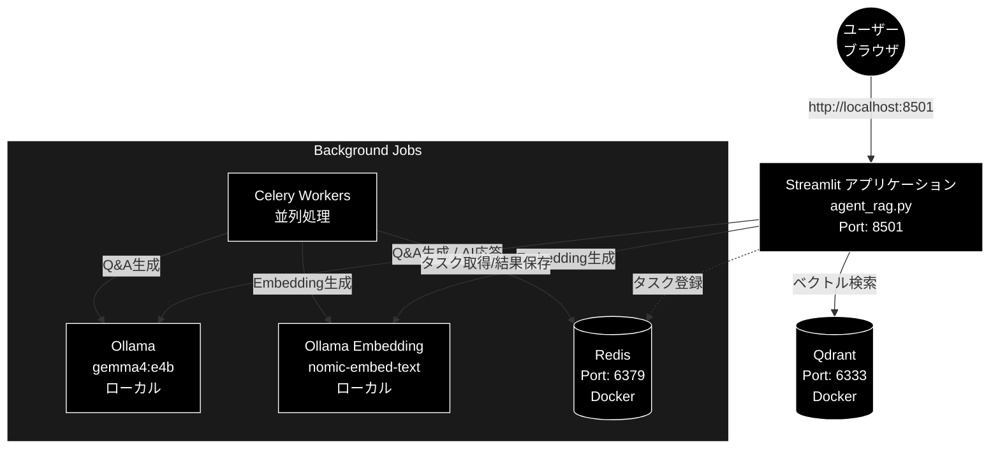

# Agent RAG (Ollama) 環境構築手順書

**開発マシン:** MacBook Air M2 / 24GB メモリ / macOS

**Version 1.3** | **最終更新:** 2026-06-21

---

## 1. 前提ソフトウェアのインストール

システム構成図



### 1.1 Homebrew（未インストールの場合）

```bash
/bin/bash -c "$(curl -fsSL https://raw.githubusercontent.com/Homebrew/install/HEAD/install.sh)"
```

### 1.2 Python 3.11 以上

本プロジェクトは `pyproject.toml` で `requires-python = ">=3.11"` を指定しています。
Python 3.11 以上（動作確認・推奨は 3.13 系）を用意してください（パッケージ管理は後述の uv が自動で解決します）。

```bash
brew install python@3.13
```

または pyenv を利用:

```bash
brew install pyenv
pyenv install 3.13.5
pyenv local 3.13.5
```

### 1.3 uv（Python パッケージマネージャ）

本プロジェクトは **uv**（`pyproject.toml` + `uv.lock`）で依存関係を管理します。

```bash
# 公式インストーラ
curl -LsSf https://astral.sh/uv/install.sh | sh
source ~/.bashrc   # または source ~/.zshrc

# Homebrew でも可
brew install uv
```

### 1.4 Docker Desktop for Mac

[Docker Desktop](https://www.docker.com/products/docker-desktop/) をインストール。
Apple Silicon (M2) 版を選択すること。

インストール後、Docker Desktop を起動し、Settings → Resources で以下を推奨:


| リソース | 推奨値 |
| -------- | ------ |
| CPUs     | 4      |
| Memory   | 8 GB   |
| Swap     | 1 GB   |

### 1.5 Redis（Celery ブローカー用）

Docker 経由で起動するため個別インストールは不要。
ローカルで直接使いたい場合:

```bash
brew install redis
brew services start redis
```

### 1.6 Ollama（ローカルLLM / Embedding）

LLM（チャンク分割 / Q&A生成 / Agent応答）と Embedding はすべて **Ollama**（ローカル実行・OpenAI互換 `/v1` エンドポイント）で処理します。クラウドの API キーは不要です。

```bash
# Ollama 本体のインストール
brew install ollama

# Ollama サーバの起動（既定: http://localhost:11434）
ollama serve

# 使用モデルの取得（別ターミナルで）
ollama pull gemma4:e4b          # LLM（デフォルト。代替: ollama pull llama3.2）
ollama pull nomic-embed-text    # Embedding（768次元）
```

> Embedding は Ollama の `nomic-embed-text`（768次元）を使用します。LLM は `gemma4:e4b`（代替 `llama3.2`）が既定です。
> いずれもローカルで実行されるため **API コストは発生せず、API キーも不要** です。
> 接続先を変更したい場合のみ `OLLAMA_BASE_URL`（既定 `http://localhost:11434/v1`）を `.env` に設定します。

### 1.7 MeCab（オプション: キーワード抽出用）

```bash
brew install mecab mecab-ipadic
```

`mecab-python3` は `pyproject.toml` の依存に含まれており、`uv sync` で自動インストールされます。

> MeCab 本体がなくてもアプリは動作します（キーワード抽出機能が無効になるのみ）。

---

## 2. プロジェクトのセットアップ

### 2.1 リポジトリのクローン

```bash
git clone https://github.com/nakashima2toshio/ollama_grace_agent_v2.git
cd ollama_grace_agent_v2
```

### 2.2 依存関係のインストール（uv）

uv は仮想環境の作成と依存解決をまとめて行います。`uv.lock` に固定された
バージョンで再現性のある環境を構築します。

```bash
# .venv を自動作成し、uv.lock どおりに依存をインストール
uv sync

# 仮想環境を有効化したい場合（任意。uv run を使えば不要）
source .venv/bin/activate
```

> `requirements.txt` も同梱されています。uv を使わない場合は
> `uv pip install -r requirements.txt` または通常の `pip install -r requirements.txt`
> でも構築できますが、バージョン固定の観点から **uv sync を推奨** します。

---

## 3. 依存パッケージ（主要）

依存は `pyproject.toml` に定義され、`uv.lock` でバージョン固定されています。
主要パッケージは以下のとおりです。

```txt
# === Web UI ===
streamlit==1.52.1
fastapi>=0.116.0
gradio==5.44.1

# === Ollama クライアント (LLM / Embedding: OpenAI互換クライアントを Ollama に向けて使用。API キー不要) ===
openai>=1.100.2

# === ベクトルDB (Qdrant) ===
qdrant-client==1.16.1

# === 非同期タスク (Celery + Redis) ===
celery==5.5.3
redis==7.1.0
flower==2.0.1

# === データセット ===
datasets>=4.1.1

# === ユーティリティ ===
python-dotenv==1.2.1
pandas==2.3.3
numpy==2.3.5
requests==2.32.5
tqdm==4.67.1
tiktoken==0.12.0
pydantic==2.12.5

# === MeCab（オプション: キーワード抽出） ===
mecab-python3>=1.0.12
```

> **注意:** LLM・Embedding はいずれも Ollama（ローカル実行）で生成します。
> LLM は `gemma4:e4b`（代替 `llama3.2`）、Embedding は `nomic-embed-text`（768次元）を使用します。
> ローカル実行のため API コストは発生せず、クラウドの API キーも不要です。
> `openai` パッケージは OpenAI互換クライアントとして Ollama の `/v1` エンドポイントに接続する用途で使用します。

---

## 4. Docker Compose（Qdrant + Redis）

### 4.1 docker-compose.yml

Compose ファイルは **`docker-compose/docker-compose.yml`** に配置済みです:

```yaml
services:
  qdrant:
    image: qdrant/qdrant:latest
    ports:
      - "6333:6333"
    volumes:
      - qdrant_data:/qdrant/storage
    healthcheck:
      test: ["CMD", "wget", "--quiet", "--tries=1", "--spider", "http://localhost:6333/health"]
      interval: 10s
      timeout: 5s
      retries: 3

  redis:
    image: redis:7-alpine
    ports:
      - "6379:6379"
    command: redis-server --appendonly yes
    volumes:
      - redis_data:/data
    healthcheck:
      test: ["CMD", "redis-cli", "ping"]
      interval: 5s
      timeout: 3s
      retries: 5

volumes:
  qdrant_data:
  redis_data:

networks:
  default:
    name: qdrant-network
```

### 4.2 起動・停止

```bash
# 起動（バックグラウンド）
docker compose -f docker-compose/docker-compose.yml up -d

# 状態確認
docker compose -f docker-compose/docker-compose.yml ps

# ログ確認
docker compose -f docker-compose/docker-compose.yml logs -f qdrant
docker compose -f docker-compose/docker-compose.yml logs -f redis

# 停止
docker compose -f docker-compose/docker-compose.yml down

# 停止 + データ削除
docker compose -f docker-compose/docker-compose.yml down -v
```

### 4.3 動作確認

```bash
# Qdrant ヘルスチェック
curl http://localhost:6333/health

# Redis 接続確認
docker compose -f docker-compose/docker-compose.yml exec redis redis-cli ping
# → PONG が返れば OK
```

---

## 5. Celery ワーカーの起動

### 5.1 起動スクリプト

```bash
# 実行権限付与（初回のみ）
chmod +x start_celery.sh

# 起動（推奨設定: concurrency=8 + Flower モニタリング）
./start_celery.sh start -c 8 --flower

# 再起動
./start_celery.sh restart -c 8 --flower

# 停止
./start_celery.sh stop

# 状態確認
./start_celery.sh status
```

### 5.2 Flower（タスクモニタリング）

Flower を起動した場合、ブラウザで確認可能:

```
http://localhost:5555
```

### 5.3 M2 MacBook Air 推奨設定


| パラメータ  | 推奨値 | 説明                                |
| ----------- | ------ | ----------------------------------- |
| concurrency | 8      | 8 vCPU に対応、API レート制限も考慮 |
| Flower      | 有効   | タスク状況のリアルタイム監視        |

---

## 6. 環境変数の設定

### 6.1 `.env` ファイルの作成

プロジェクトルートに `.env` を作成:

```bash
# === Ollama (LLM / Embedding: ローカル実行・API キー不要) ===
# 接続先を変更する場合のみ設定（既定は http://localhost:11434/v1）
# OLLAMA_BASE_URL=http://localhost:11434/v1

# === Cohere API（オプション: Rerank 用） ===
COHERE_API_KEY=your_cohere_api_key_here

# === Web 検索（オプション: grace/tools.py の backend に応じて設定） ===
# SERPAPI_KEY=your_serpapi_key_here            # backend=serpapi
# GOOGLE_CSE_API_KEY=your_cse_api_key_here     # backend=google_cse
# GOOGLE_CSE_ENGINE_ID=your_cse_engine_id

# === Qdrant ===
QDRANT_HOST=localhost
QDRANT_PORT=6333

# === Redis / Celery ===
CELERY_BROKER_URL=redis://localhost:6379/0
CELERY_RESULT_BACKEND=redis://localhost:6379/0
```

> LLM・Embedding はいずれも Ollama（ローカル実行）で処理します。クラウドの API キーは不要です。
> 接続先を変更したい場合のみ `OLLAMA_BASE_URL`（既定 `http://localhost:11434/v1`）を設定してください。

### 6.2 事前準備・オプション API キーの取得先

Ollama（LLM / Embedding）はローカル実行のため API キーは不要です。事前に `ollama serve` でサーバを起動し、必要なモデルを取得しておきます。

```bash
ollama pull gemma4:e4b          # LLM（代替: ollama pull llama3.2）
ollama pull nomic-embed-text    # Embedding（768次元）
```

オプション機能で利用する API キーの取得先:

| API | 取得先 | 用途 |
|---|---|---|
| Cohere API Key | https://dashboard.cohere.com/api-keys | Rerank（オプション） |
| SerpAPI Key | https://serpapi.com/ | Web 検索（オプション・backend=serpapi） |
| Google CSE Key / Engine ID | https://programmablesearchengine.google.com/ | Web 検索（オプション・backend=google_cse） |

---

## 7. アプリケーションの起動

### 7.1 起動手順（まとめ）

```bash
# 1. Docker コンテナ起動
docker compose -f docker-compose/docker-compose.yml up -d

# 2. Celery ワーカー起動
./start_celery.sh start -c 8 --flower

# 3. Streamlit アプリ起動（uv 経由）
uv run streamlit run agent_rag.py --server.port 8501
```

ブラウザで以下にアクセス:

```
http://localhost:8501
```

> `.venv` を有効化済みの場合は `streamlit run agent_rag.py --server.port 8501` でも起動できます。

### 7.2 全サービスの停止

```bash
# Streamlit: Ctrl+C で停止

# Celery 停止
./start_celery.sh stop

# Docker 停止
docker compose -f docker-compose/docker-compose.yml down
```

---

## 8. 動作確認チェックリスト

```
[ ] Python 3.11 以上（推奨 3.13 系）がインストールされている
[ ] uv がインストールされている
[ ] uv sync が正常完了（.venv 作成 + 依存インストール）
[ ] Docker Desktop が起動している
[ ] docker compose -f docker-compose/docker-compose.yml up -d で Qdrant / Redis が起動
[ ] curl http://localhost:6333/health が正常応答
[ ] Ollama サーバが起動している（ollama serve / curl http://localhost:11434/api/tags が応答）
[ ] ollama pull gemma4:e4b（LLM）と ollama pull nomic-embed-text（Embedding）が完了
[ ] ./start_celery.sh status でワーカーが起動中
[ ] uv run streamlit run agent_rag.py が正常起動
[ ] ブラウザで http://localhost:8501 にアクセス可能
```

---

## 9. トラブルシューティング

### Qdrant に接続できない

```bash
# コンテナの状態確認
docker compose -f docker-compose/docker-compose.yml ps
# qdrant コンテナが unhealthy の場合、再起動
docker compose -f docker-compose/docker-compose.yml restart qdrant
```

### Celery ワーカーが起動しない

```bash
# Redis が起動しているか確認
docker compose -f docker-compose/docker-compose.yml exec redis redis-cli ping

# ログ確認
tail -50 logs/celery_qa_worker.log
```

### Planner/Executor 初期化エラー

Ollama サーバが起動しており、必要なモデル（`gemma4:e4b` / `nomic-embed-text`）が取得済みか確認してください。

```bash
# Ollama サーバの起動確認
curl http://localhost:11434/api/tags

# 取得済みモデルの一覧
ollama list

# 接続先を変更している場合は OLLAMA_BASE_URL（既定 http://localhost:11434/v1）を確認
```

```bash
# PYTHONPATH にプロジェクトルートを追加
export PYTHONPATH="$(pwd):$(pwd)/helper"
```

### uv sync が失敗する

```bash
# uv 自体を最新化
uv self update

# キャッシュをクリアして再試行
uv cache clean
uv sync
```

---

## 10. ポート一覧


| サービス  | ポート | 用途                         |
| --------- | ------ | ---------------------------- |
| Streamlit | 8501   | Web UI                       |
| Ollama    | 11434  | ローカルLLM / Embedding API  |
| Qdrant    | 6333   | ベクトルDB REST API          |
| Redis     | 6379   | Celery ブローカー / 結果保存 |
| Flower    | 5555   | Celery タスクモニタリング    |
