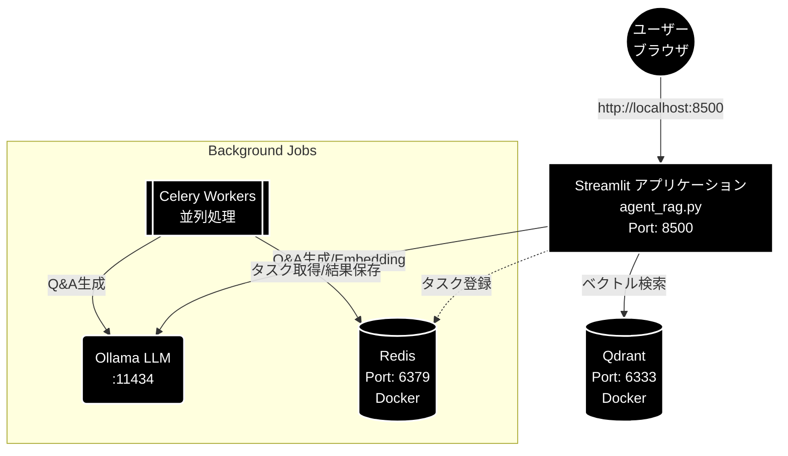

# Agent RAG (Ollama) 環境構築手順書

**開発マシン:** MacBook Air M2 / 24GB メモリ / macOS

---

## 1. 前提ソフトウェアのインストール

システム構成図



### 1.1 Homebrew（未インストールの場合）

```bash
/bin/bash -c "$(curl -fsSL https://raw.githubusercontent.com/Homebrew/install/HEAD/install.sh)"
```

### 1.2 Python 3.13.x（専用）

```bash
brew install python@3.13
```

または pyenv を利用:

```bash
brew install pyenv
pyenv install 3.13.0
pyenv local 3.13.0
```

### 1.3 Docker Desktop for Mac

[Docker Desktop](https://www.docker.com/products/docker-desktop/) をインストール。
Apple Silicon (M2) 版を選択すること。

インストール後、Docker Desktop を起動し、Settings → Resources で以下を推奨:


| リソース | 推奨値 |
| -------- | ------ |
| CPUs     | 4      |
| Memory   | 8 GB   |
| Swap     | 1 GB   |

### 1.4 Redis（Celery ブローカー用）

Docker 経由で起動するため個別インストールは不要。
ローカルで直接使いたい場合:

```bash
brew install redis
brew services start redis
```

### 1.5 MeCab（オプション: キーワード抽出用）

```bash
brew install mecab mecab-ipadic
pip install mecab-python3
```

> MeCab がなくてもアプリは動作します（キーワード抽出機能が無効になるのみ）。

---

## 2. プロジェクトのセットアップ

### 2.1 リポジトリのクローン

```bash
git clone https://github.com/nakashima2toshio/ollama_grace_agent.git
cd ollama_grace_agent
```

### 2.2 Python 仮想環境の作成と依存パッケージのインストール

本プロジェクトは `uv` によるパッケージ管理を採用しています。

```bash
uv sync
```

> `uv sync` は `pyproject.toml` を参照して仮想環境の作成と依存パッケージのインストールを自動で行います。

---

## 3. 依存パッケージ（pyproject.toml）

本プロジェクトは `uv` を使用するため `requirements.txt` は使用しません。
依存パッケージは `pyproject.toml` で管理されています。

主な依存パッケージ:

```toml
# === Web UI ===
streamlit>=1.35.0

# === Ollama ===
# Ollama は外部インストール（ollama.com）
ollama>=0.1.0

# === ベクトルDB (Qdrant) ===
qdrant-client>=1.9.0

# === Embedding / NLP ===
sentence-transformers>=3.0.0
transformers>=4.40.0
torch>=2.2.0

# === 非同期タスク (Celery + Redis) ===
celery>=5.4.0
redis>=5.0.0
flower>=2.0.0

# === データセット ===
datasets>=2.19.0       # HuggingFace datasets

# === ユーティリティ ===
python-dotenv>=1.0.0
pandas>=2.2.0
numpy>=1.26.0
requests>=2.31.0
tqdm>=4.66.0

# === MeCab（オプション: キーワード抽出） ===
# mecab-python3>=1.0.9
# unidic-lite>=1.0.8
```

> **注意:** `torch` は Apple Silicon (MPS) 対応版が自動インストールされます。
> GPU メモリが限られるため、Embedding はデフォルトで CPU 実行でも十分です。

---

## 4. Docker Compose（Qdrant + Redis）

### 4.1 docker-compose.yml

プロジェクトルートに配置済みの `docker-compose.yml` を使用します:

```yaml
services:
  qdrant:
    image: qdrant/qdrant:latest
    ports:
      - "6333:6333"
    volumes:
      - qdrant_data:/qdrant/storage
    healthcheck:
      test: ["CMD", "wget", "--quiet", "--tries=1", "--spider", "http://localhost:6333/health"]
      interval: 10s
      timeout: 5s
      retries: 3

  redis:
    image: redis:7-alpine
    ports:
      - "6379:6379"
    command: redis-server --appendonly yes
    volumes:
      - redis_data:/data
    healthcheck:
      test: ["CMD", "redis-cli", "ping"]
      interval: 5s
      timeout: 3s
      retries: 5

volumes:
  qdrant_data:
  redis_data:

networks:
  default:
    name: qdrant-network
```

### 4.2 起動・停止

```bash
# 起動（バックグラウンド）
docker compose up -d

# 状態確認
docker compose ps

# ログ確認
docker compose logs -f qdrant
docker compose logs -f redis

# 停止
docker compose down

# 停止 + データ削除
docker compose down -v
```

### 4.3 動作確認

```bash
# Qdrant ヘルスチェック
curl http://localhost:6333/health

# Redis 接続確認
docker compose exec redis redis-cli ping
# → PONG が返れば OK
```

---

## 5. Celery ワーカーの起動

### 5.1 起動スクリプト

```bash
# 実行権限付与（初回のみ）
chmod +x start_celery.sh

# 起動（推奨設定: concurrency=8 + Flower モニタリング）
./start_celery.sh start -c 8 --flower

# 再起動
./start_celery.sh restart -c 8 --flower

# 停止
./start_celery.sh stop

# 状態確認
./start_celery.sh status
```

### 5.2 Flower（タスクモニタリング）

Flower を起動した場合、ブラウザで確認可能:

```
http://localhost:5555
```

### 5.3 M2 MacBook Air 推奨設定


| パラメータ  | 推奨値 | 説明                                |
| ----------- | ------ | ----------------------------------- |
| concurrency | 8      | 8 vCPU に対応、API レート制限も考慮 |
| Flower      | 有効   | タスク状況のリアルタイム監視        |

---

## 6. 環境変数の設定

### 6.1 `.env` ファイルの作成

本プロジェクトは Ollama（ローカル LLM）を使用するため、**API キーは不要**です。

プロジェクトルートに `.env` を作成:

```bash
# === Ollama（ローカル LLM） ===
# API キー不要。ollama serve でローカル起動するのみ。
OLLAMA_BASE_URL=http://localhost:11434

# === Qdrant ===
QDRANT_HOST=localhost
QDRANT_PORT=6333

# === Redis / Celery ===
CELERY_BROKER_URL=redis://localhost:6379/0
CELERY_RESULT_BACKEND=redis://localhost:6379/0
```

> **注意:** Ollama はローカルで動作するため、Gemini / Google / Cohere 等のクラウド API キーは一切不要です。

---

## 7. アプリケーションの起動

### 7.1 起動手順（まとめ）

```bash
# 1. Docker コンテナ起動
docker compose up -d

# 2. Celery ワーカー起動
./start_celery.sh start -c 8 --flower

# 3. Streamlit アプリ起動
uv run streamlit run agent_rag.py --server.port 8501
```

ブラウザで以下にアクセス:

```
http://localhost:8501
```

### 7.2 全サービスの停止

```bash
# Streamlit: Ctrl+C で停止

# Celery 停止
./start_celery.sh stop

# Docker 停止
docker compose down
```

---

## 8. 動作確認チェックリスト

```
[ ] Python 3.13.x がインストールされている
[ ] uv sync が正常完了
[ ] Docker Desktop が起動している
[ ] docker compose up -d で Qdrant / Redis が起動
[ ] curl http://localhost:6333/health が正常応答
[ ] ollama serve が起動中
[ ] ollama list に gemma4:e4b が表示される
[ ] ./start_celery.sh status でワーカーが起動中
[ ] uv run streamlit run agent_rag.py が正常起動
[ ] ブラウザで http://localhost:8501 にアクセス可能
```

---

## 9. トラブルシューティング

### Qdrant に接続できない

```bash
# コンテナの状態確認
docker compose ps
# qdrant コンテナが unhealthy の場合、再起動
docker compose restart qdrant
```

### Celery ワーカーが起動しない

```bash
# Redis が起動しているか確認
docker compose exec redis redis-cli ping

# ログ確認
tail -50 logs/celery_qa_worker.log
```

### `ModuleNotFoundError` が出る

```bash
# PYTHONPATH にプロジェクトルートを追加
export PYTHONPATH="$(pwd):$(pwd)/helper"
```

### Apple Silicon で torch のインストールに失敗

```bash
# MPS 対応版を明示的にインストール
uv run pip install torch torchvision torchaudio
```

---

## 10. ポート一覧


| サービス  | ポート | 用途                         |
| --------- | ------ | ---------------------------- |
| Streamlit | 8501   | Web UI                       |
| Qdrant    | 6333   | ベクトルDB REST API          |
| Redis     | 6379   | Celery ブローカー / 結果保存 |
| Flower    | 5555   | Celery タスクモニタリング    |
| Ollama    | 11434  | ローカル LLM API             |
