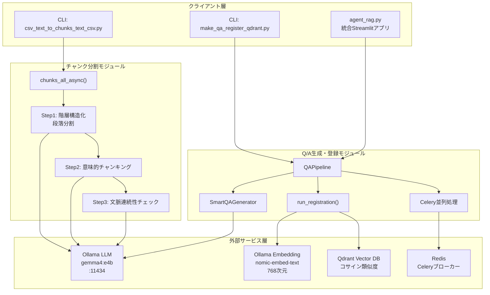
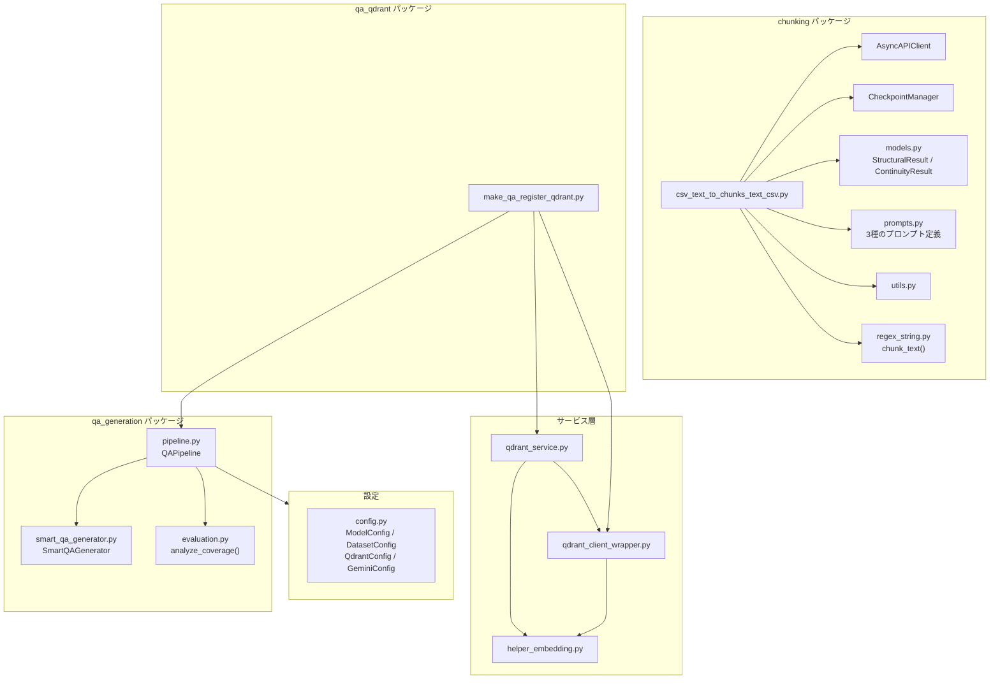
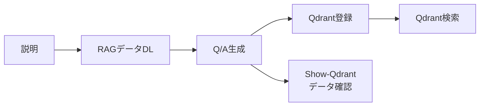
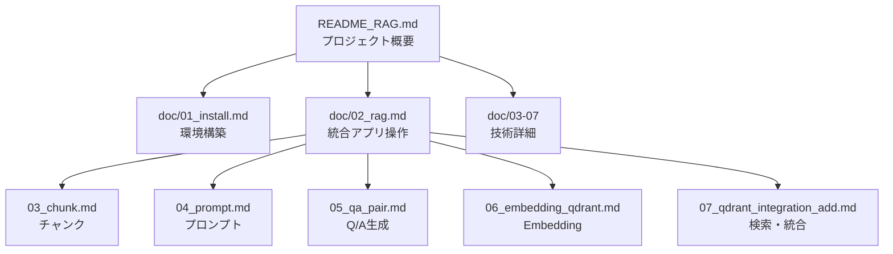
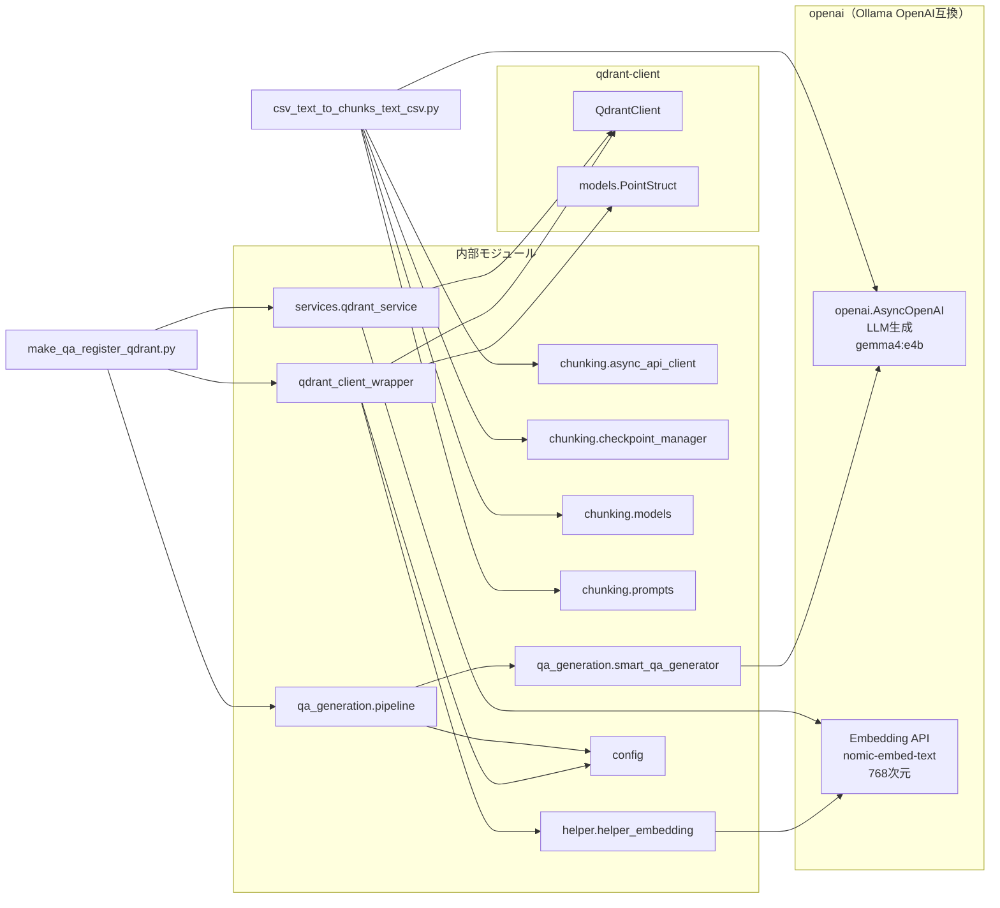

# RAG Q/A 生成・検索システム ドキュメント

**Version 2.0** | 最終更新: 2026-02-16

**Agent Graceの資料へ** [Agent Grace](README.md) | **ReActの資料へ** [ReAct](README_ReAct.md)

---

## 目次

1. [概要](#概要)
2. [アーキテクチャ構成図](#1-アーキテクチャ構成図)
3. [RAG関連 ファイル・クラス・関数 一覧表](#15-rag関連-ファイルクラス関数-一覧表)
4. [モジュール構成図](#2-モジュール構成図)
5. [クラス・関数一覧表](#3-クラス関数一覧表)
6. [クラス・関数 IPO詳細](#4-クラス関数-ipo詳細)
7. [統合アプリ agent_rag.py](#5-統合アプリ-agent_ragpy)
8. [クイックスタート](#6-クイックスタート)
9. [環境構築詳細](#7-環境構築詳細)
10. [設定・定数](#8-設定定数)
11. [使用例](#9-使用例)
12. [対応データセット](#10-対応データセット)
13. [ディレクトリ構造](#11-ディレクトリ構造)
14. [ドキュメント一覧](#12-ドキュメント一覧)
15. [エクスポート](#13-エクスポート)
16. [変更履歴](#14-変更履歴)
17. [付録: 依存関係図](#付録-依存関係図)

---

## 概要

本システムは、日本語・英語ドキュメントから文章をチャンク分割し、チャンクからQ/Aペアを自動生成し、Qdrantベクトルデータベースで類似度検索・AI応答生成（RAG）を実現する統合アプリケーションです。

中心となるモジュールは以下の2つです。

- **チャンク分割**: `csv_text_to_chunks_text_csv.py` — LLMベースの3段階セマンティックチャンキング
- **Q/A生成・Qdrant登録**: `make_qa_register_qdrant.py` — Q/Aペア自動生成からベクトルDB登録までの統合パイプライン

### 主な責務

- テキスト/CSVファイルのLLMベース意味的チャンク分割（3段階: 段落分割→意味的分割→連続性チェック）
- チャンクからのQ/Aペア自動生成（SmartQAGenerator / Celery並列処理）
- Ollama Embedding（`nomic-embed-text`, 768次元）によるベクトル化
- Qdrantベクトルデータベースへの登録・検索・RAG応答生成
- カバレージ分析によるQ/A品質評価

### 各責務対応のモジュール


| # | 責務                  | 対応モジュール                            | 説明                                               |
| - | --------------------- | ----------------------------------------- | -------------------------------------------------- |
| 1 | LLMベースチャンク分割 | `chunking/csv_text_to_chunks_text_csv.py` | 3段階非同期パイプライン（段落→意味→連続性）      |
| 2 | Q/Aペア自動生成       | `qa_qdrant/make_qa_register_qdrant.py`    | Phase 1: QAPipeline経由でSmartQAGenerator使用      |
| 3 | Qdrantベクトル登録    | `qa_qdrant/make_qa_register_qdrant.py`    | Phase 2: Embedding→コレクション作成→アップサート |
| 4 | Embedding生成         | `services/qdrant_service.py`              | Ollama Embedding（768次元）                        |
| 5 | ベクトル検索・RAG     | `qdrant_client_wrapper.py`                | Dense/Hybrid Search、3段階フォールバック           |

### 主要機能一覧


| 機能                       | 説明                                                          |
| -------------------------- | ------------------------------------------------------------- |
| `chunks_all_async()`       | テキストを3段階で意味的にチャンク化（asyncio並列処理）        |
| `load_text_from_csv()`     | CSVファイルからテキストを読み込み（カラム自動検出）           |
| `save_chunks_as_csv()`     | チャンクをメタデータ付きCSV + シンプルCSVで保存               |
| `QAPipeline`               | Q/A生成パイプライン制御クラス（チャンク済みCSV専用）          |
| `QAPipeline.run()`         | パイプライン実行（データ読込→チャンク変換→Q/A生成→保存）   |
| `run_registration()`       | Q/AペアCSVからQdrant登録（Embedding→アップサート）           |
| `combine_rows_to_chunks()` | CSV複数行を結合してチャンクCSVを作成                          |
| `AsyncAPIClient`           | Ollama OpenAI互換クライアント（Semaphore並列制御+リトライ）   |
| `CheckpointManager`        | 3段階チャンク処理のチェックポイント管理（クラッシュ復旧対応） |
| `search_collection()`      | Qdrantコレクション検索（Dense/Hybrid、3段階フォールバック）   |

---

## 1. アーキテクチャ構成図

### 1.1 システム全体構成



### 1.2 データフロー

1. 入力データ（CSV/テキスト）を `csv_text_to_chunks_text_csv.py` で3段階チャンク分割
2. チャンクCSVを `make_qa_register_qdrant.py` に入力
3. Phase 1: `QAPipeline` → `SmartQAGenerator` でQ/Aペアを自動生成（Celery並列処理対応）
4. Phase 2: `run_registration()` でQ/AペアをOllama Embeddingでベクトル化
5. Qdrantコレクションにアップサート登録
6. ユーザー質問 → Embedding → Qdrant検索 → RAG応答生成

---

## 1.5 RAG関連 ファイル・クラス・関数 一覧表

### チャンク分割パッケージ（chunking/）


| ファイル名                       | クラス名            | メソッド/関数名               | 機能概要                                                   |
| -------------------------------- | ------------------- | ----------------------------- | ---------------------------------------------------------- |
| `csv_text_to_chunks_text_csv.py` | -                   | `chunks_all_async()`          | テキストを3段階で意味的にチャンク化（メインエントリ）      |
| `csv_text_to_chunks_text_csv.py` | -                   | `load_text_from_csv()`        | CSVファイルからテキストを読み込み（カラム自動検出）        |
| `csv_text_to_chunks_text_csv.py` | -                   | `save_chunks_as_csv()`        | チャンクをメタデータ付きCSVで保存（+シンプルCSV同時出力）  |
| `csv_text_to_chunks_text_csv.py` | -                   | `save_chunks_as_simple_csv()` | チャンクをシンプルCSV（Textカラムのみ）で保存              |
| `csv_text_to_chunks_text_csv.py` | -                   | `save_chunks_as_text()`       | チャンクをテキスト形式で保存（後方互換）                   |
| `csv_text_to_chunks_text_csv.py` | -                   | `generate_output_filename()`  | 入力ファイル名+タイムスタンプから出力ファイル名を自動生成  |
| `csv_text_to_chunks_text_csv.py` | -                   | `_step1_hierarchical_split()` | Step1: 階層構造化（段落分割） — LLMで空行ベースの段落分離 |
| `csv_text_to_chunks_text_csv.py` | -                   | `_step2_semantic_chunking()`  | Step2: 意味的チャンキング — 段落を意味単位に再分割        |
| `csv_text_to_chunks_text_csv.py` | -                   | `_step3_continuity_check()`   | Step3: 文脈連続性チェック — 隣接チャンクの結合/分離判定   |
| `csv_text_to_chunks_text_csv.py` | -                   | `_normalize_whitespace()`     | テキストの改行・空白を正規化（CSV出力用）                  |
| `csv_text_to_chunks_text_csv.py` | -                   | `_preprocess_text()`          | テキスト前処理（長い1行を句読点で分割）                    |
| `csv_text_to_chunks_text_csv.py` | -                   | `_postprocess_paragraph()`    | 段落の後処理（句読点で文を分割し改行区切り）               |
| `csv_text_to_chunks_text_csv.py` | -                   | `_split_sentences_simple()`   | 簡易的な文分割（日本語対応）                               |
| `csv_text_to_chunks_text_csv.py` | -                   | `main()`                      | CLIエントリポイント（argparse→チャンク実行）              |
| `async_api_client.py`            | `AsyncAPIClient`    | `__init__()`                  | Ollama OpenAI互換クライアント初期化（Semaphore並列制御）   |
| `async_api_client.py`            | `AsyncAPIClient`    | `generate_content()`          | Semaphore制御付きOllama API呼び出し（構造化出力）          |
| `async_api_client.py`            | `AsyncAPIClient`    | `_execute_with_retry()`       | リトライロジック（指数バックオフ、不完全JSON検出）         |
| `async_api_client.py`            | `AsyncAPIClient`    | `_is_valid_json()`            | JSONの完全性チェック                                       |
| `async_api_client.py`            | `AsyncAPIClient`    | `_is_truncated_response()`    | レスポンス切断チェック（finish_reason判定）                |
| `async_api_client.py`            | `AsyncAPIClient`    | `get_stats()`                 | リクエスト統計情報を取得                                   |
| `async_api_client.py`            | `AsyncAPIClient`    | `reset_stats()`               | 統計情報をリセット                                         |
| `checkpoint_manager.py`          | `CheckpointManager` | `__init__()`                  | チェックポイントディレクトリ・ジョブID初期化               |
| `checkpoint_manager.py`          | `CheckpointManager` | `save()`                      | ステップ結果をJSON保存（原子書込み）                       |
| `checkpoint_manager.py`          | `CheckpointManager` | `load()`                      | ステップ結果を読み込み                                     |
| `checkpoint_manager.py`          | `CheckpointManager` | `load_with_metadata()`        | メタデータ付きでステップ結果を読み込み                     |
| `checkpoint_manager.py`          | `CheckpointManager` | `exists()`                    | チェックポイントの存在確認                                 |
| `checkpoint_manager.py`          | `CheckpointManager` | `get_latest_completed_step()` | 最後に完了したステップを取得                               |
| `checkpoint_manager.py`          | `CheckpointManager` | `get_resume_point()`          | クラッシュからの再開ポイントを取得                         |
| `checkpoint_manager.py`          | `CheckpointManager` | `clear()`                     | ジョブのチェックポイントを削除                             |
| `checkpoint_manager.py`          | `CheckpointManager` | `get_job_info()`              | ジョブ情報を取得                                           |
| `checkpoint_manager.py`          | `CheckpointManager` | `list_jobs()`                 | 保存済みジョブの一覧を取得（クラスメソッド）               |
| `checkpoint_manager.py`          | `CheckpointManager` | `cleanup_old_jobs()`          | 古いジョブを削除（クラスメソッド）                         |
| `models.py`                      | `SentenceUnit`      | -                             | 1つの文（意味の最小単位）のPydanticモデル                  |
| `models.py`                      | `ParagraphUnit`     | `full_text`                   | 段落内の全文を改行結合して返すプロパティ                   |
| `models.py`                      | `StructuralResult`  | -                             | テキスト構造化結果（Step1/Step2のレスポンススキーマ）      |
| `models.py`                      | `ContinuityResult`  | -                             | 文脈連続性判定結果（Step3のレスポンススキーマ）            |
| `prompts.py`                     | -                   | `PARAGRAPH_SEPARATION_PROMPT` | Step1: 空行ベース段落分割プロンプト                        |
| `prompts.py`                     | -                   | `SEMANTIC_CHUNKING_PROMPT`    | Step2: 意味的分割プロンプト（トピック境界検出）            |
| `prompts.py`                     | -                   | `CONTINUITY_CHECK_PROMPT`     | Step3: 文脈連続性判定プロンプト（True/False）              |
| `regex_string.py`                | -                   | `chunk_text()`                | テキストをチャンクに分割（日本語/英語自動判定）            |
| `regex_string.py`                | -                   | `chunk_text_with_info()`      | テキスト分割+詳細情報（分割方法・言語・件数）              |
| `utils.py`                       | -                   | `show_paragraphs()`           | パラグラフリストの整形表示                                 |
| `utils.py`                       | -                   | `setup_logging()`             | ロギング設定（ファイル+コンソール）                        |
| `utils.py`                       | -                   | `format_time()`               | 秒数を読みやすい形式に変換（秒/分/時間）                   |
| `utils.py`                       | -                   | `format_size()`               | 文字数を読みやすい形式に変換（K文字/M文字）                |
| `utils.py`                       | -                   | `estimate_api_calls()`        | API呼び出し回数と処理時間を見積もり                        |
| `utils.py`                       | -                   | `print_stats()`               | 統計情報の整形表示                                         |

### Q/A生成・Qdrant登録（qa_qdrant/）


| ファイル名                   | クラス名 | メソッド/関数名               | 機能概要                                                        |
| ---------------------------- | -------- | ----------------------------- | --------------------------------------------------------------- |
| `make_qa_register_qdrant.py` | -        | `main()`                      | 統合パイプライン実行（Phase1: Q/A生成 → Phase2: Qdrant登録）   |
| `make_qa_register_qdrant.py` | -        | `run_registration()`          | Qdrant登録ロジック（Embedding→コレクション作成→アップサート） |
| `make_qa_register_qdrant.py` | -        | `combine_rows_to_chunks()`    | CSV複数行を結合してチャンクCSVを作成                            |
| `make_qa_register_qdrant.py` | -        | `normalize_source_filename()` | ファイル名から日時サフィックスを除去して正規化                  |

### Q/A生成パイプライン（qa_generation/）


| ファイル名    | クラス名     | メソッド/関数名           | 機能概要                                             |
| ------------- | ------------ | ------------------------- | ---------------------------------------------------- |
| `pipeline.py` | `QAPipeline` | `__init__()`              | コンストラクタ（設定ロード、SmartQAGenerator初期化） |
| `pipeline.py` | `QAPipeline` | `load_data()`             | データ読み込み（CSV/データセット対応）               |
| `pipeline.py` | `QAPipeline` | `_load_chunks_from_csv()` | チャンク済みCSVをチャンクリストに変換                |
| `pipeline.py` | `QAPipeline` | `generate_qa()`           | Q/Aペアを生成（同期/Celery並列切替）                 |
| `pipeline.py` | `QAPipeline` | `_generate_with_celery()` | Celery並列処理によるQ/A生成                          |
| `pipeline.py` | `QAPipeline` | `_generate_sync()`        | 同期処理によるQ/A生成（SmartQAGenerator使用）        |
| `pipeline.py` | `QAPipeline` | `evaluate_coverage()`     | カバレージ評価（チャンク網羅率分析）                 |
| `pipeline.py` | `QAPipeline` | `save()`                  | 結果をCSV保存                                        |
| `pipeline.py` | `QAPipeline` | `run()`                   | パイプライン一括実行（読込→変換→生成→分析→保存） |
| `pipeline.py` | `QAPipeline` | `_validate_inputs()`      | 入力パラメータの排他制御検証                         |
| `pipeline.py` | `QAPipeline` | `_load_config()`          | データセット/ファイル設定をロード                    |

### Qdrant操作サービス（services/）


| ファイル名          | クラス名              | メソッド/関数名                              | 機能概要                                              |
| ------------------- | --------------------- | -------------------------------------------- | ----------------------------------------------------- |
| `qdrant_service.py` | `QdrantHealthChecker` | `__init__()`                                 | Qdrantヘルスチェッカー初期化                          |
| `qdrant_service.py` | `QdrantHealthChecker` | `check_port()`                               | ポートの開放状態チェック                              |
| `qdrant_service.py` | `QdrantHealthChecker` | `check_qdrant()`                             | Qdrant接続チェック（メトリクス付き）                  |
| `qdrant_service.py` | `QdrantDataFetcher`   | `__init__()`                                 | Qdrantデータフェッチャー初期化                        |
| `qdrant_service.py` | `QdrantDataFetcher`   | `fetch_collections()`                        | コレクション一覧をDataFrameで取得                     |
| `qdrant_service.py` | `QdrantDataFetcher`   | `fetch_collection_points()`                  | コレクションの詳細データをDataFrameで取得             |
| `qdrant_service.py` | `QdrantDataFetcher`   | `fetch_collection_info()`                    | コレクションの詳細情報（ベクトル設定含む）            |
| `qdrant_service.py` | `QdrantDataFetcher`   | `fetch_collection_source_info()`             | コレクションのデータソース情報を集計                  |
| `qdrant_service.py` | -                     | `embed_texts_for_qdrant()`                   | テキストをOllama Embeddingでバッチベクトル化          |
| `qdrant_service.py` | -                     | `create_or_recreate_collection_for_qdrant()` | コレクション作成/再作成（Sparse Vector対応）          |
| `qdrant_service.py` | -                     | `build_points_for_qdrant()`                  | Qdrantポイント構築（payload: question/answer/source） |
| `qdrant_service.py` | -                     | `upsert_points_to_qdrant()`                  | ポイントをバッチアップサート                          |
| `qdrant_service.py` | -                     | `embed_query_for_search()`                   | 検索クエリをベクトル化（プロバイダー自動選択）        |
| `qdrant_service.py` | -                     | `get_collection_stats()`                     | コレクション統計情報を取得                            |
| `qdrant_service.py` | -                     | `get_all_collections()`                      | 全コレクション一覧を取得                              |
| `qdrant_service.py` | -                     | `get_all_collections_simple()`               | 全コレクション一覧を取得（シンプル版）                |
| `qdrant_service.py` | -                     | `delete_all_collections()`                   | 全コレクションを削除（除外リスト対応）                |
| `qdrant_service.py` | -                     | `load_csv_for_qdrant()`                      | CSVをロード（列名マッピング+バリデーション）          |
| `qdrant_service.py` | -                     | `build_inputs_for_embedding()`               | 埋め込み用入力テキストを構築（question+answer結合）   |
| `qdrant_service.py` | -                     | `scroll_all_points_with_vectors()`           | コレクションから全ポイント取得（ベクトル含む）        |
| `qdrant_service.py` | -                     | `merge_collections()`                        | 複数コレクションを統合して新コレクションに登録        |
| `qdrant_service.py` | -                     | `map_collection_to_csv()`                    | コレクション名から対応CSVファイル名を取得             |
| `qdrant_service.py` | -                     | `get_dynamic_collection_mapping()`           | コレクションとCSVの動的マッピング生成                 |
| `qdrant_service.py` | -                     | `get_collection_embedding_params()`          | コレクションの埋め込みモデル設定を推論                |

### Qdrantクライアントラッパー


| ファイル名                 | クラス名              | メソッド/関数名                        | 機能概要                                              |
| -------------------------- | --------------------- | -------------------------------------- | ----------------------------------------------------- |
| `qdrant_client_wrapper.py` | `QdrantHealthChecker` | `check_port()`                         | ポートの開放状態チェック                              |
| `qdrant_client_wrapper.py` | `QdrantHealthChecker` | `check_qdrant()`                       | Qdrant接続チェック（メトリクス付き）                  |
| `qdrant_client_wrapper.py` | `QdrantHealthChecker` | `get_client()`                         | 接続済みクライアントを取得                            |
| `qdrant_client_wrapper.py` | `QdrantDataFetcher`   | `fetch_collections()`                  | コレクション一覧をDataFrameで取得                     |
| `qdrant_client_wrapper.py` | `QdrantDataFetcher`   | `fetch_collection_points()`            | コレクションの詳細データを取得                        |
| `qdrant_client_wrapper.py` | `QdrantDataFetcher`   | `fetch_collection_info()`              | コレクションの詳細情報を取得                          |
| `qdrant_client_wrapper.py` | `QdrantDataFetcher`   | `fetch_collection_source_info()`       | データソース情報を集計                                |
| `qdrant_client_wrapper.py` | -                     | `create_qdrant_client()`               | QdrantClientを作成（ファクトリ関数）                  |
| `qdrant_client_wrapper.py` | -                     | `get_qdrant_client()`                  | シングルトンQdrantClientを取得                        |
| `qdrant_client_wrapper.py` | -                     | `get_embedding_client()`               | プロバイダー別EmbeddingClientを取得                   |
| `qdrant_client_wrapper.py` | -                     | `get_cached_sparse_embedding_client()` | Sparse Embeddingクライアントを取得（キャッシュ付き）  |
| `qdrant_client_wrapper.py` | -                     | `create_or_recreate_collection()`      | コレクション作成/再作成（Hybrid Search対応）          |
| `qdrant_client_wrapper.py` | -                     | `embed_texts_unified()`                | テキストをベクトル化（プロバイダー統一版）            |
| `qdrant_client_wrapper.py` | -                     | `embed_query_unified()`                | 検索クエリをベクトル化（プロバイダー統一版）          |
| `qdrant_client_wrapper.py` | -                     | `embed_sparse_texts_unified()`         | テキストをSparse Embeddingでベクトル化                |
| `qdrant_client_wrapper.py` | -                     | `embed_sparse_query_unified()`         | クエリをSparse Embeddingでベクトル化                  |
| `qdrant_client_wrapper.py` | -                     | `build_points()`                       | Qdrantポイント構築（Dense/Hybrid対応）                |
| `qdrant_client_wrapper.py` | -                     | `upsert_points()`                      | ポイントをバッチアップサート                          |
| `qdrant_client_wrapper.py` | -                     | `search_collection()`                  | コレクション検索（Dense/Hybrid、3段階フォールバック） |
| `qdrant_client_wrapper.py` | -                     | `create_collection_for_provider()`     | プロバイダー別コレクション作成                        |
| `qdrant_client_wrapper.py` | -                     | `get_provider_vector_size()`           | プロバイダーのベクトル次元数を取得                    |
| `qdrant_client_wrapper.py` | -                     | `get_collection_stats()`               | コレクション統計情報を取得                            |
| `qdrant_client_wrapper.py` | -                     | `get_all_collections()`                | 全コレクション一覧を取得                              |
| `qdrant_client_wrapper.py` | -                     | `delete_all_collections()`             | 全コレクションを削除                                  |
| `qdrant_client_wrapper.py` | -                     | `load_csv_for_qdrant()`                | CSVをロード（Qdrant登録用）                           |
| `qdrant_client_wrapper.py` | -                     | `build_inputs_for_embedding()`         | 埋め込み用入力テキストを構築                          |
| `qdrant_client_wrapper.py` | -                     | `batched()`                            | イテラブルをバッチに分割                              |

### 設定管理


| ファイル名  | クラス名             | メソッド/関数名             | 機能概要                                |
| ----------- | -------------------- | --------------------------- | --------------------------------------- |
| `config.py` | `ModelConfig`        | `supports_temperature()`    | モデルのtemperatureサポート判定         |
| `config.py` | `ModelConfig`        | `get_model_limits()`        | モデルのトークン制限を取得              |
| `config.py` | `ModelConfig`        | `get_model_pricing()`       | モデルの料金情報を取得                  |
| `config.py` | `DatasetInfo`        | -                           | データセット情報（dataclass）           |
| `config.py` | `DatasetConfig`      | `get_dataset()`             | データセット設定を取得                  |
| `config.py` | `DatasetConfig`      | `get_dataset_dict()`        | データセット設定を辞書形式で取得        |
| `config.py` | `DatasetConfig`      | `get_all_dataset_names()`   | 全データセット名を取得                  |
| `config.py` | `QAGenerationConfig` | -                           | Q/A生成設定（質問タイプ階層、閾値等）   |
| `config.py` | `QdrantConfig`       | -                           | Qdrant接続設定（HOST/PORT/VECTOR_SIZE） |
| `config.py` | `GeminiConfig`       | `get_model_limits()`        | LLMモデルの制限を取得                   |
| `config.py` | `GeminiConfig`       | `get_model_pricing()`       | LLMモデルの料金を取得                   |
| `config.py` | `GeminiConfig`       | `supports_thinking_level()` | 思考レベルサポート判定                  |
| `config.py` | `PathConfig`         | `ensure_dirs()`             | 必要なディレクトリを一括作成            |
| `config.py` | `CeleryConfig`       | -                           | Celery並列処理設定                      |
| `config.py` | `AgentConfig`        | -                           | RAGエージェント設定（検索閾値等）       |
| `config.py` | `LLMProviderConfig`  | `get_embedding_dims()`      | プロバイダー別Embedding次元数を取得     |

---

## 2. モジュール構成図

### 2.1 内部モジュール構成



### 2.2 外部依存関係


| ライブラリ          | 用途                                              |
| ------------------- | ------------------------------------------------- |
| `openai==1.100.2`   | Ollama OpenAI互換クライアント（LLM / Embedding）  |
| `qdrant-client`     | Qdrantベクトルデータベース操作                    |
| `pydantic`          | レスポンススキーマ定義（構造化出力）              |
| `pandas`            | CSV入出力・データ処理                             |
| `tiktoken`          | トークン数計算                                    |
| `celery[redis]`     | 並列タスク処理                                    |
| `streamlit`         | Web UIフレームワーク                              |

### 2.3 内部依存モジュール


| モジュール                         | 用途                                       |
| ---------------------------------- | ------------------------------------------ |
| `chunking.async_api_client`        | Ollama OpenAI互換非同期呼び出し            |
| `chunking.checkpoint_manager`      | チェックポイント永続化                     |
| `chunking.models`                  | Pydanticスキーマ（段落/連続性判定）        |
| `chunking.prompts`                 | 3段階チャンク用プロンプト                  |
| `qa_generation.pipeline`           | Q/A生成パイプライン制御                    |
| `qa_generation.smart_qa_generator` | スマートQ/A生成（LLM動的決定）             |
| `services.qdrant_service`          | Qdrant操作サービス                         |
| `qdrant_client_wrapper`            | Qdrantクライアントラッパー                 |
| `helper.helper_embedding`          | Embedding抽象化レイヤー                    |
| `config`                           | 全体設定管理                               |

---

## 3. クラス・関数一覧表

### 3.1 csv_text_to_chunks_text_csv.py

#### 関数一覧


| 関数名                                                     | 概要                                                  |
| ---------------------------------------------------------- | ----------------------------------------------------- |
| `chunks_all_async(text, model, ...)`                       | テキストを3段階で意味的にチャンク化（メインエントリ） |
| `load_text_from_csv(csv_path, ...)`                        | CSVファイルからテキストを読み込み                     |
| `save_chunks_as_csv(chunks, output_file, ...)`             | チャンクをメタデータ付きCSVで保存                     |
| `save_chunks_as_simple_csv(chunks, output_file, ...)`      | チャンクをシンプルCSV（Textのみ）で保存               |
| `save_chunks_as_text(chunks, output_file)`                 | チャンクをテキスト形式で保存                          |
| `generate_output_filename(input_file, output_dir, ...)`    | 出力ファイル名の自動生成                              |
| `_step1_hierarchical_split(text, client, model, ...)`      | Step1: 階層構造化（段落分割）                         |
| `_step2_semantic_chunking(paragraphs, client, model, ...)` | Step2: 意味的チャンキング                             |
| `_step3_continuity_check(chunks, client, model, ...)`      | Step3: 文脈連続性チェック                             |
| `_normalize_whitespace(text)`                              | テキストの改行・空白を正規化                          |
| `_preprocess_text(text)`                                   | テキスト前処理（長い1行を句読点で分割）               |
| `_postprocess_paragraph(paragraph)`                        | 段落の後処理（句読点で文を分割し改行区切り）          |

### 3.2 make_qa_register_qdrant.py

#### 関数一覧


| 関数名                                                     | 概要                                                          |
| ---------------------------------------------------------- | ------------------------------------------------------------- |
| `main()`                                                   | 統合パイプライン実行（Phase1: Q/A生成 → Phase2: Qdrant登録） |
| `run_registration(csv_path, collection_name, ...)`         | Qdrant登録ロジック（Embedding→アップサート）                 |
| `combine_rows_to_chunks(df, text_column, block_size, ...)` | CSV複数行を結合してチャンクCSVを作成                          |
| `normalize_source_filename(filename)`                      | ファイル名から日時サフィックスを除去                          |

### 3.3 AsyncAPIClient クラス


| メソッド                                                  | 概要                                                      |
| --------------------------------------------------------- | --------------------------------------------------------- |
| `__init__(base_url, max_workers, max_retries, ...)`       | コンストラクタ（Ollama接続、Semaphore初期化）             |
| `generate_content(model, contents, response_schema, ...)` | Semaphore制御付きAPI呼び出し                              |
| `get_stats()`                                             | リクエスト統計情報を取得                                  |
| `reset_stats()`                                           | 統計情報をリセット                                        |

### 3.4 CheckpointManager クラス


| メソッド                           | 概要                                                 |
| ---------------------------------- | ---------------------------------------------------- |
| `__init__(checkpoint_dir, job_id)` | コンストラクタ（チェックポイントディレクトリ初期化） |
| `save(step_name, data, metadata)`  | ステップの結果をJSON保存（原子書込み）               |
| `load(step_name)`                  | ステップの結果を読み込み                             |
| `exists(step_name)`                | チェックポイントの存在確認                           |
| `get_resume_point()`               | 再開ポイントを取得                                   |
| `clear()`                          | チェックポイントを削除                               |

### 3.5 QAPipeline クラス（qa_generation/pipeline.py）


| メソッド                                         | 概要                                                 |
| ------------------------------------------------ | ---------------------------------------------------- |
| `__init__(dataset_name, input_file, model, ...)` | コンストラクタ（設定ロード、SmartQAGenerator初期化） |
| `load_data()`                                    | データ読み込み（CSV/データセット対応）               |
| `generate_qa(chunks, use_celery, ...)`           | Q/Aペアを生成（同期/Celery並列）                     |
| `evaluate_coverage(chunks, qa_pairs, ...)`       | カバレージ評価                                       |
| `save(qa_pairs, coverage_results)`               | 結果をCSV保存                                        |
| `run(use_celery, concurrency, ...)`              | パイプライン一括実行                                 |

---

## 4. クラス・関数 IPO詳細

### 4.1 chunks_all_async()

**概要**: テキストを3段階（段落分割→意味的分割→連続性チェック）で意味的にチャンク化する非同期メイン関数。

```python
async def chunks_all_async(
    text: str,
    model: str = "gemma4:e4b",
    max_workers: int = 8,
    block_size: int = 1000,
    checkpoint_manager: Optional[CheckpointManager] = None,
    output_file: Optional[str] = None,
    dataset_type: str = "custom",
    source_file: Optional[str] = None
) -> List[str]
```


| パラメータ           | 型                          | デフォルト  | 説明                             |
| -------------------- | --------------------------- | ----------- | -------------------------------- |
| `text`               | str                         | -           | 分割対象テキスト                 |
| `model`              | str                         | "gemma4:e4b"  | 使用するOllama LLMモデル         |
| `max_workers`        | int                         | 8           | 非同期並列ワーカー数             |
| `block_size`         | int                         | 1000        | Step1ブロックサイズ（文字数）    |
| `checkpoint_manager` | Optional[CheckpointManager] | None        | チェックポイント管理             |
| `output_file`        | Optional[str]               | None        | 出力ファイルパス（CSV/テキスト） |
| `dataset_type`       | str                         | "custom"    | データセット種別                 |
| `source_file`        | Optional[str]               | None        | 元ファイル名                     |


| 項目        | 内容                                                                                                                                                                                                                                                                                                                                    |
| ----------- | --------------------------------------------------------------------------------------------------------------------------------------------------------------------------------------------------------------------------------------------------------------------------------------------------------------------------------------- |
| **Input**   | `text: str`（分割対象テキスト）, `model: str`, `max_workers: int`                                                                                                                                                                                                                                                                       |
| **Process** | 1. Ollama接続確認、AsyncAPIClient初期化<br>2. Step1: `_step1_hierarchical_split()` — テキストをブロック分割→LLMで段落分離<br>3. Step2: `_step2_semantic_chunking()` — 段落を意味単位にチャンク化<br>4. Step3: `_step3_continuity_check()` — 隣接チャンクの連続性判定→マージ<br>5. output_file指定時はCSV/テキスト保存 |
| **Output**  | `List[str]`: 最終チャンクリスト                                                                                                                                                                                                                                                                                                         |

**戻り値例**:

```python
[
    "人工知能（AI）は、機械学習と深層学習を基盤として急速に発展しています。特に自然言語処理（NLP）の分野では、トランスフォーマーモデルが革命的な成果を上げました。",
    "BERTやGPTなどの大規模言語モデルは、文脈理解能力を大幅に向上させています。",
    "AIの応用は医療診断から自動運転まで幅広く、社会に大きな影響を与えています。"
]
```

```python
# 使用例
import asyncio
from chunking.csv_text_to_chunks_text_csv import chunks_all_async

text = open("data/document.txt", "r").read()
chunks = asyncio.run(chunks_all_async(
    text=text,
    model="gemma4:e4b",
    max_workers=8,
    block_size=1000,
    output_file="chunks_output/result.csv"
))
print(f"生成チャンク数: {len(chunks)}")
```

---

### 4.2 load_text_from_csv()

**概要**: CSVファイルからテキストを読み込む。テキストカラムを自動検出し、複数行を結合して返す。

```python
def load_text_from_csv(
    csv_path: str,
    text_column: Optional[str] = None,
    max_rows: Optional[int] = None,
    combine_rows: bool = False
) -> str
```


| パラメータ     | 型            | デフォルト | 説明                                 |
| -------------- | ------------- | ---------- | ------------------------------------ |
| `csv_path`     | str           | -          | CSVファイルパス                      |
| `text_column`  | Optional[str] | None       | テキストカラム名（None時は自動検出） |
| `max_rows`     | Optional[int] | None       | 最大処理行数                         |
| `combine_rows` | bool          | False      | 全行を1テキストに結合するか          |


| 項目        | 内容                                                                                                                                    |
| ----------- | --------------------------------------------------------------------------------------------------------------------------------------- |
| **Input**   | `csv_path: str`（CSVファイルパス）                                                                                                      |
| **Process** | 1. CSV読み込み（pandas）<br>2. テキストカラム自動検出（text, Content, Combined_Text等）<br>3. 空行フィルタリング<br>4. 改行区切りで結合 |
| **Output**  | `str`: 結合されたテキスト                                                                                                               |

---

### 4.3 save_chunks_as_csv()

**概要**: チャンクをメタデータ付きCSVで保存。オプションでシンプルCSV（Textカラムのみ）も同時出力。

```python
def save_chunks_as_csv(
    chunks: List[str],
    output_file: str,
    dataset_type: str = "custom",
    source_file: Optional[str] = None,
    normalize_whitespace: bool = True,
    save_simple_csv: bool = True
) -> str
```


| パラメータ             | 型            | デフォルト | 説明                     |
| ---------------------- | ------------- | ---------- | ------------------------ |
| `chunks`               | List[str]     | -          | チャンクリスト           |
| `output_file`          | str           | -          | 出力ファイルパス         |
| `dataset_type`         | str           | "custom"   | データセット種別         |
| `source_file`          | Optional[str] | None       | 元ファイル名             |
| `normalize_whitespace` | bool          | True       | 改行・空白を正規化するか |
| `save_simple_csv`      | bool          | True       | シンプルCSVも保存するか  |


| 項目        | 内容                                                                                                                                                           |
| ----------- | -------------------------------------------------------------------------------------------------------------------------------------------------------------- |
| **Input**   | `chunks: List[str]`, `output_file: str`                                                                                                                        |
| **Process** | 1. 各チャンクの改行正規化（オプション）<br>2. メタデータ付きCSV生成（chunk_id, text, tokens, chunk_idx等）<br>3. `save_simple_csv=True`時、`_simple.csv`も出力 |
| **Output**  | `str`: 保存したCSVファイルパス                                                                                                                                 |

---

### 4.4 AsyncAPIClient クラス

Ollama OpenAI互換クライアントへの非同期呼び出しを管理。Semaphoreで並列数を制御し、指数バックオフでリトライする。

#### コンストラクタ: `__init__`

**概要**: Ollama OpenAI互換クライアントの初期化。並列数制御用Semaphoreとリトライ設定を構成する。

```python
AsyncAPIClient(
    base_url: str = "http://localhost:11434/v1",
    max_workers: int = 8,
    max_retries: int = 3,
    max_output_tokens: int = 8192
)
```


| パラメータ          | 型  | デフォルト                      | 説明                                         |
| ------------------- | --- | ------------------------------- | -------------------------------------------- |
| `base_url`          | str | "http://localhost:11434/v1"     | Ollama OpenAI互換エンドポイント              |
| `max_workers`       | int | 8                               | 並列数（Semaphore上限）                      |
| `max_retries`       | int | 3                               | リトライ回数                                 |
| `max_output_tokens` | int | 8192                            | 出力トークン制限                             |


| 項目        | 内容                                                                       |
| ----------- | -------------------------------------------------------------------------- |
| **Input**   | `base_url: str`, `max_workers: int`                                        |
| **Process** | openai.AsyncOpenAI初期化（base_url指定）、Semaphore作成、統計カウンタ初期化 |
| **Output**  | AsyncAPIClientインスタンス                                                 |

#### メソッド: `generate_content`

**概要**: Semaphoreで並列数を制御しながらOllama API呼び出し。不完全JSONの検出とリトライ機能を含む。

```python
async def generate_content(
    model: str,
    contents: str,
    response_schema: Type[BaseModel],
    task_id: Optional[str] = None
) -> Optional[str]
```


| 項目        | 内容                                                                                                                                                                                                                          |
| ----------- | ----------------------------------------------------------------------------------------------------------------------------------------------------------------------------------------------------------------------------- |
| **Input**   | `model: str`, `contents: str`, `response_schema: Type[BaseModel]`                                                                                                                                                             |
| **Process** | 1. Semaphore取得<br>2. `asyncio.to_thread()`で同期API→非同期実行<br>3. レスポンス切断チェック（finish_reason）<br>4. JSON完全性チェック<br>5. 失敗時は指数バックオフでリトライ（最大3回）<br>6. レート制限エラー時は30秒待機 |
| **Output**  | `Optional[str]`: JSONレスポンス文字列、全リトライ失敗時はNone                                                                                                                                                                 |

---

### 4.5 CheckpointManager クラス

3段階チャンク処理の中間結果をJSON保存し、クラッシュ時に途中から再開可能にする。

#### コンストラクタ: `__init__`

**概要**: チェックポイントディレクトリとジョブIDの初期化。

```python
CheckpointManager(
    checkpoint_dir: str = "./checkpoints",
    job_id: Optional[str] = None
)
```


| 項目        | 内容                                                       |
| ----------- | ---------------------------------------------------------- |
| **Input**   | `checkpoint_dir: str`, `job_id: Optional[str]`             |
| **Process** | ジョブID生成（未指定時はタイムスタンプ）、ディレクトリ作成 |
| **Output**  | CheckpointManagerインスタンス                              |

#### メソッド: `save`

**概要**: ステップの結果をJSONとして保存（一時ファイル→リネームで原子性確保）。

```python
def save(step_name: str, data: List[str], metadata: Optional[dict] = None) -> str
```


| 項目        | 内容                                                                                                                            |
| ----------- | ------------------------------------------------------------------------------------------------------------------------------- |
| **Input**   | `step_name: str`（"step1"/"step2"/"step3"）, `data: List[str]`                                                                  |
| **Process** | 1. チェックポイントデータ構築（step, timestamp, count, data）<br>2. 一時ファイルに書き込み<br>3. `os.replace()`で原子的リネーム |
| **Output**  | `str`: 保存したファイルパス                                                                                                     |

#### メソッド: `get_resume_point`

**概要**: クラッシュからの再開ポイントを取得。

```python
def get_resume_point() -> tuple[Optional[str], Optional[List[str]]]
```


| 項目        | 内容                                                                            |
| ----------- | ------------------------------------------------------------------------------- |
| **Input**   | なし（内部ステートから判定）                                                    |
| **Process** | step3→step2→step1の順にチェックポイント存在確認                               |
| **Output**  | `Tuple[Optional[str], Optional[List[str]]]`: (再開ステップ名, 前ステップデータ) |

---

### 4.6 run_registration()（make_qa_register_qdrant.py）

**概要**: Q/AペアCSVをQdrantに登録する。Embedding生成→コレクション作成→バッチアップサート。

```python
def run_registration(
    csv_path: str,
    collection_name: str,
    recreate: bool,
    batch_size: int,
    provider: str,
    ui_output_dir: str = "qa_output"
) -> bool
```


| パラメータ        | 型   | デフォルト  | 説明                       |
| ----------------- | ---- | ----------- | -------------------------- |
| `csv_path`        | str  | -           | Q/AペアCSVのパス           |
| `collection_name` | str  | -           | Qdrantコレクション名       |
| `recreate`        | bool | -           | コレクションを再作成するか |
| `batch_size`      | int  | -           | Embeddingバッチサイズ      |
| `provider`        | str  | -           | Embeddingプロバイダー      |
| `ui_output_dir`   | str  | "qa_output" | UI用正規化CSVの出力先      |


| 項目        | 内容                                                                                                                                                                                                                                                                                                                                         |
| ----------- | -------------------------------------------------------------------------------------------------------------------------------------------------------------------------------------------------------------------------------------------------------------------------------------------------------------------------------------------- |
| **Input**   | `csv_path: str`, `collection_name: str`                                                                                                                                                                                                                                                                                                      |
| **Process** | 1. CSV読み込み、question+answerを結合してベクトル化対象テキスト作成<br>2. Qdrantクライアント接続、コレクション作成/再作成<br>3. バッチ処理: `embed_texts_for_qdrant()` → `build_points_for_qdrant()` → `upsert_points_to_qdrant()`<br>4. UI用正規化CSV出力 |
| **Output**  | `bool`: 成功時True、失敗時False                                                                                                                                                                                                                                                                                                              |

---

### 4.7 QAPipeline クラス（qa_generation/pipeline.py）

チャンク済みCSVからQ/Aペアを生成するパイプライン制御クラス。

#### メソッド: `run`

**概要**: パイプライン一括実行（データ読込→チャンク変換→Q/A生成→カバレージ分析→保存）。

```python
def run(
    use_celery: bool = False,
    celery_workers: int = 1,
    concurrency: int = 8,
    batch_chunks: int = 3,
    analyze_coverage: bool = True,
    coverage_threshold: Optional[float] = None,
    use_smart_generation: bool = True
) -> Dict
```


| パラメータ             | 型   | デフォルト | 説明                         |
| ---------------------- | ---- | ---------- | ---------------------------- |
| `use_celery`           | bool | False      | Celery並列処理を使用するか   |
| `concurrency`          | int  | 8          | 並列タスク数                 |
| `batch_chunks`         | int  | 3          | 1回のAPIで処理するチャンク数 |
| `analyze_coverage`     | bool | True       | カバレージ分析を実行するか   |
| `use_smart_generation` | bool | True       | スマートQ/A生成を使用するか  |


| 項目        | 内容                                                                                                                                                                                                                         |
| ----------- | ---------------------------------------------------------------------------------------------------------------------------------------------------------------------------------------------------------------------------- |
| **Input**   | チャンク済みCSVファイル（コンストラクタで指定）                                                                                                                                                                              |
| **Process** | 1.`load_data()` でCSV/データセット読み込み<br>2. `_load_chunks_from_csv()` でチャンクリスト変換<br>3. `generate_qa()` でQ/Aペア生成（同期/Celery）<br>4. `evaluate_coverage()` でカバレージ分析<br>5. `save()` で結果CSV出力 |
| **Output**  | `Dict`: `{saved_files, qa_count, coverage_results, success}`                                                                                                                                                                 |

**戻り値例**:

```python
{
    "saved_files": {"qa_csv": "qa_output/pipeline/qa_pairs_20260216.csv"},
    "qa_count": 150,
    "coverage_results": {"coverage_rate": 0.85, "covered_chunks": 42, "total_chunks": 50},
    "success": True
}
```

---

### 4.8 combine_rows_to_chunks()（make_qa_register_qdrant.py）

**概要**: CSVの複数行を結合してチャンクCSVを作成する。

```python
def combine_rows_to_chunks(
    df: pd.DataFrame,
    text_column: str,
    block_size: int,
    output_dir: str
) -> str
```


| 項目        | 内容                                                                                                                                |
| ----------- | ----------------------------------------------------------------------------------------------------------------------------------- |
| **Input**   | `df: pd.DataFrame`, `text_column: str`, `block_size: int`                                                                           |
| **Process** | 1. block_size行ごとにテキストを結合<br>2. 空行フィルタリング<br>3. チャンクCSV出力（chunk_id, text, start_row, end_row, row_count） |
| **Output**  | `str`: 作成されたチャンクCSVのパス                                                                                                  |

---

## 5. 統合アプリ agent_rag.py

### 5.1 6画面構成

統合アプリは以下の6つの画面で構成されています。


| # | 画面名          | 機能             | 主な操作                          |
| - | --------------- | ---------------- | --------------------------------- |
| 1 | **説明**        | プロジェクト概要 | ドキュメント確認                  |
| 2 | **RAGデータDL** | データセット取得 | cc_news, livedoor等のダウンロード |
| 3 | **Q/A生成**     | Q/Aペア生成      | LLM生成、Celery並列処理           |
| 4 | **Qdrant登録**  | ベクトルDB登録   | CSV→Embedding→登録              |
| 5 | **Show-Qdrant** | コレクション表示 | データ確認、統計情報              |
| 6 | **Qdrant検索**  | 類似度検索       | 質問入力→検索→AI応答            |

### 5.2 画面フロー



### 5.3 各画面の概要

#### 画面1: 説明（About）

プロジェクトの概要とドキュメントへのリンクを表示。

#### 画面2: RAGデータDL

Hugging Faceからデータセットをダウンロード・前処理。対応データセット: cc_news, livedoor, wikipedia_ja, fineweb_edu_ja 等。

#### 画面3: Q/A生成

チャンク分割 → LLMによるQ/Aペア生成。同期処理 / Celery並列処理を選択可能。カバレージ分析オプション付き。

#### 画面4: Qdrant登録

CSVファイルからQdrantへベクトルデータを登録。Ollama Embedding（nomic-embed-text, 768次元）。

#### 画面5: Show-Qdrant

登録済みコレクションの確認・統計表示。

#### 画面6: Qdrant検索

質問を入力 → 類似Q/A検索 → AI応答生成。

**詳細な操作方法**: [doc/02_rag.md](doc/02_rag.md)

---

## 6. クイックスタート

### 6.1 前提条件

- Python 3.13.x
- Docker / Docker Compose
- Ollama（ローカルLLM）起動済み（:11434）

### 6.2 インストール

```bash
# リポジトリのクローン
git clone <repository-url>
cd ollama_grace_agent

# 依存パッケージのインストール
uv sync

# 環境変数の設定
cp .env.example .env
# .envの設定（Ollamaはデフォルトでlocalhost:11434を使用するため通常設定不要）
# # OLLAMA_BASE_URL=http://localhost:11434/v1 （デフォルト不要）
```

### 6.3 サービス起動

```bash
# Qdrant + Redis の起動
docker-compose -f docker-compose/docker-compose.yml up -d

# Celeryワーカー起動（並列処理を使う場合）
./start_celery.sh restart -c 8 --flower

# 統合アプリの起動
uv run streamlit run agent_rag.py
```

### 6.4 CLIでの実行（2段階パイプライン）

```bash
# Step 1: チャンク分割
python -m chunking.csv_text_to_chunks_text_csv \
  --input-file OUTPUT/cc_news_1per.csv \
  --output chunks_output \
  --model gemma4:e4b \
  --workers 8 \
  --block-size 500

# Step 2: Q/A生成 + Qdrant登録
python qa_qdrant/make_qa_register_qdrant.py \
  --input-file chunks_output/cc_news_1per_chunks_YYYYMMDD_HHMMSS.csv \
  --collection cc_news_1per \
  --use-celery \
  --concurrency 8 \
  --recreate
```

### 6.5 動作確認

ブラウザで http://localhost:8501 を開き、統合アプリが表示されることを確認。

**詳細な環境構築手順**: [doc/01_install.md](doc/01_install.md)

---

## 7. 環境構築詳細

### 7.1 Python環境

```bash
# Python 3.13.xが必要
python --version

# uvを使用した環境管理（推奨）
uv sync
```

### 7.2 依存パッケージ

```bash
uv sync

# Celery関連（並列処理を使う場合）
pip install "celery[redis]" kombu flower
```

### 7.3 Docker（Qdrant + Redis）

```bash
# docker-compose.ymlの場所
docker-compose -f docker-compose/docker-compose.yml up -d

# 起動確認
curl http://localhost:6333/collections  # Qdrant
redis-cli ping                           # Redis
```

### 7.4 環境変数

`.env`ファイルを作成:

```env
# OLLAMA_BASE_URL=http://localhost:11434/v1 （デフォルト不要）
QDRANT_URL=http://localhost:6333
REDIS_URL=redis://localhost:6379/0
```

**詳細な環境構築手順**: [doc/01_install.md](doc/01_install.md)

---

## 8. 設定・定数

### 8.1 GeminiConfig

Ollama LLM / Embedding関連の設定。

```python
class GeminiConfig:
    DEFAULT_MODEL = "gemma4:e4b"
    EMBEDDING_MODEL = "nomic-embed-text"
    EMBEDDING_DIMS = 768
    DEFAULT_THINKING_LEVEL = "low"
    DEFAULT_TEMPERATURE = 1.0
```


| キー              | デフォルト値     | 説明                   |
| ----------------- | ---------------- | ---------------------- |
| `DEFAULT_MODEL`   | "gemma4:e4b"       | デフォルトLLMモデル    |
| `EMBEDDING_MODEL` | "nomic-embed-text" | Embeddingモデル        |
| `EMBEDDING_DIMS`  | 768              | Embedding次元数        |

### 8.2 QdrantConfig

Qdrant接続設定。

```python
class QdrantConfig:
    HOST = "localhost"
    PORT = 6333
    URL = "http://localhost:6333"
    DEFAULT_VECTOR_SIZE = 768  # nomic-embed-text
    DEFAULT_EMBEDDING_MODEL = "nomic-embed-text"
```

### 8.3 CeleryConfig

Celery並列処理設定。


| キー                 | デフォルト値             | 説明                     |
| -------------------- | ------------------------ | ------------------------ |
| `BROKER_URL`         | redis://localhost:6379/0 | Redisブローカー          |
| `WORKER_CONCURRENCY` | 8                        | デフォルトワーカー並列数 |
| `TASK_TIME_LIMIT`    | 300                      | タスクタイムアウト（秒） |

### 8.4 チャンク処理プロンプト

3段階チャンク処理で使用するプロンプト（`chunking/prompts.py`）:


| プロンプト                    | 用途                                              |
| ----------------------------- | ------------------------------------------------- |
| `PARAGRAPH_SEPARATION_PROMPT` | Step1: 空行ベースの段落分割ルール                 |
| `SEMANTIC_CHUNKING_PROMPT`    | Step2: 意味のまとまり（トピック）ベースの再構成   |
| `CONTINUITY_CHECK_PROMPT`     | Step3: 隣接チャンクの文脈連続性判定（True/False） |

---

## 9. 使用例

### 9.1 基本ワークフロー（CLI 2段階パイプライン）

```python
# 使用例: CLIでのチャンク分割 → Q/A生成 → Qdrant登録

# Step 1: チャンク分割
# python -m chunking.csv_text_to_chunks_text_csv \
#   --input-file OUTPUT/wikipedia_ja_1per.csv \
#   --output chunks_output \
#   --model gemma4:e4b \
#   --workers 8

# Step 2: Q/A生成 + Qdrant登録
# python qa_qdrant/make_qa_register_qdrant.py \
#   --input-file chunks_output/wikipedia_ja_1per_chunks.csv \
#   --collection wikipedia_ja_1per \
#   --use-celery \
#   --concurrency 8 \
#   --recreate
```

### 9.2 Pythonからの直接利用

```python
# 使用例: チャンク分割をPythonから実行
import asyncio
from chunking import chunks_all_async, load_text_from_csv

# CSVからテキスト読み込み
text = load_text_from_csv("OUTPUT/cc_news_1per.csv")

# チャンク分割
chunks = asyncio.run(chunks_all_async(
    text=text,
    model="gemma4:e4b",
    max_workers=8,
    output_file="chunks_output/result.csv"
))
print(f"生成チャンク数: {len(chunks)}")
```

### 9.3 応用ワークフロー（テキストファイルからの一括処理）

```bash
# テキストファイルから直接Q/A生成+登録
python qa_qdrant/make_qa_register_qdrant.py \
  --input-file data/document.txt \
  --collection my_collection \
  --use-celery \
  --concurrency 8 \
  --recreate
```

### 9.4 CSV行結合オプション

```bash
# CSV行を結合してチャンク化（大量の短い行がある場合）
python qa_qdrant/make_qa_register_qdrant.py \
  --input-file OUTPUT/cc_news_5per.csv \
  --collection cc_news_5per \
  --use-celery \
  --text-column text \
  --combine-rows \
  --block-size 400 \
  --recreate
```

---

## 10. 対応データセット


| データセット   | 言語   | 内容                             | ソース                                           |
| -------------- | ------ | -------------------------------- | ------------------------------------------------ |
| cc_news        | 英語   | ニュース記事                     | Hugging Face (cc_news)                           |
| livedoor       | 日本語 | ブログ記事（9カテゴリ、7,376件） | rondhuit.com                                     |
| wikipedia_ja   | 日本語 | Wikipedia記事                    | Hugging Face (wikimedia/wikipedia)               |
| japanese_text  | 日本語 | Webテキスト（CC100）             | Hugging Face (range3/cc100-ja)                   |
| fineweb_edu_ja | 日本語 | 教育的高品質Webテキスト          | Hugging Face (hotchpotch/fineweb-2-edu-japanese) |

---

## 11. ディレクトリ構造

```
ollama_grace_agent/
├── agent_rag.py                      # 統合Streamlitアプリ（メインエントリ）
├── config.py                         # 全体設定管理
│
├── chunking/                         # ★ チャンク分割パッケージ
│   ├── __init__.py                   # パッケージエクスポート
│   ├── csv_text_to_chunks_text_csv.py  # ★ メイン: 3段階チャンク分割
│   ├── async_api_client.py           # Ollama OpenAI互換非同期クライアント
│   ├── checkpoint_manager.py         # チェックポイント管理
│   ├── models.py                     # Pydanticモデル定義
│   ├── prompts.py                    # 3種のプロンプト定義
│   ├── regex_string.py               # テキスト分割ユーティリティ
│   └── utils.py                      # ユーティリティ関数
│
├── qa_qdrant/                        # ★ Q/A生成・Qdrant登録
│   └── make_qa_register_qdrant.py    # ★ メイン: 統合パイプライン
│
├── qa_generation/                    # Q/A生成パッケージ
│   ├── pipeline.py                   # QAPipelineクラス
│   ├── smart_qa_generator.py         # SmartQAGenerator
│   ├── evaluation.py                 # カバレージ分析
│   └── data_io.py                    # データ入出力
│
├── services/                         # サービス層
│   └── qdrant_service.py             # Qdrant操作サービス
│
├── helper/                           # ヘルパー
│   ├── helper_embedding.py           # Embedding抽象化レイヤー
│   ├── helper_embedding_sparse.py    # Sparse Embedding
│   └── helper_llm.py                 # LLMクライアント
│
├── qdrant_client_wrapper.py          # Qdrantクライアントラッパー
├── celery_tasks.py                   # Celeryタスク定義
│
├── ui/                               # UIコンポーネント
│   └── pages/                        # 各画面のページ
│
├── doc/                              # ドキュメント
│   ├── 01_install.md
│   ├── 02_rag.md
│   ├── 03_chunk.md
│   ├── 04_prompt.md
│   ├── 05_qa_pair.md
│   ├── 06_embedding_qdrant.md
│   └── 07_qdrant_integration_add.md
│
├── docker-compose/                   # Docker設定
│   └── docker-compose.yml
│
├── chunks_output/                    # チャンク分割出力
├── qa_output/                        # 生成されたQ/Aデータ
├── OUTPUT/                           # 前処理済みデータ
├── checkpoints/                      # チェックポイント
│
├── pyproject.toml                    # 依存パッケージ（uv管理）
├── .env                              # 環境変数（gitignore）
├── start_celery.sh                   # Celeryワーカー起動スクリプト
└── CLAUDE.md                         # Claude Code用ガイド
```

---

## 12. ドキュメント一覧

### 12.1 ドキュメント相関図



### 12.2 ドキュメント概要


| ドキュメント                                                         | 主題                     | 対象読者       |
| -------------------------------------------------------------------- | ------------------------ | -------------- |
| [doc/01_install.md](doc/01_install.md)                               | 環境構築ガイド           | 導入者・開発者 |
| [doc/02_rag.md](doc/02_rag.md)                                       | 統合アプリ操作マニュアル | 利用者・開発者 |
| [doc/03_chunk.md](doc/03_chunk.md)                                   | チャンク分割技術         | 開発者         |
| [doc/04_prompt.md](doc/04_prompt.md)                                 | プロンプト設計           | 開発者         |
| [doc/05_qa_pair.md](doc/05_qa_pair.md)                               | Q/Aペア生成処理          | 開発者         |
| [doc/06_embedding_qdrant.md](doc/06_embedding_qdrant.md)             | Embedding・Qdrant登録    | 開発者         |
| [doc/07_qdrant_integration_add.md](doc/07_qdrant_integration_add.md) | Qdrant検索・統合         | 開発者         |

---

## 13. エクスポート

### chunking パッケージ

```python
__all__ = [
    # Models
    "SentenceUnit", "ParagraphUnit", "StructuralResult", "ContinuityResult",
    # Prompts
    "PARAGRAPH_SEPARATION_PROMPT", "SEMANTIC_CHUNKING_PROMPT", "CONTINUITY_CHECK_PROMPT",
    # API Client
    "AsyncAPIClient",
    # Checkpoint
    "CheckpointManager",
    # Main Processor
    "chunks_all_async", "load_text_from_csv", "save_chunks_as_csv", "save_chunks_as_text",
    # Utils
    "show_paragraphs", "setup_logging", "format_time", "format_size", "estimate_api_calls",
]
```

### qdrant_client_wrapper.py

```python
__all__ = [
    # クライアント
    "QdrantHealthChecker", "create_qdrant_client", "get_qdrant_client",
    # コレクション管理
    "create_or_recreate_collection", "get_collection_stats", "get_all_collections",
    # 埋め込み
    "embed_texts_unified", "embed_query_unified",
    # ポイント操作
    "build_points", "upsert_points",
    # 検索
    "search_collection",
]
```

---

## 14. 変更履歴


| バージョン | 変更内容                                                                                                                                                                                                                                       |
| ---------- | ---------------------------------------------------------------------------------------------------------------------------------------------------------------------------------------------------------------------------------------------- |
| 1.0        | 初版作成（OpenAI GPT-4o / text-embedding-3-small ベース）                                                                                                                                                                                      |
| 1.5        | Gemini API対応、SemanticCoverageクラスによるチャンク分割                                                                                                                                                                                       |
| 2.0        | フォーマット仕様書準拠で全面再構成。LLMベース3段階チャンク分割（csv_text_to_chunks_text_csv.py）導入。Gemini Embedding（gemini-embedding-001, 3072次元）に統一。make_qa_register_qdrant.py統合パイプライン追加。IPO詳細追加。                   |
| 2.1        | Ollama（ローカルLLM）に全面移行。llama3.2 / nomic-embed-text（768次元）。openai==1.100.2（Ollama OpenAI互換）使用。Python 3.13.x対応。uv管理に移行。                                                                                           |
| 2.2        | デフォルトモデルを llama3.2 → gemma4:e4b に変更（2026-05-23）                                                                                                                                                                                   |

---

## 付録: 依存関係図



---

## 技術スタック


| カテゴリ       | 技術                                                        |
| -------------- | ----------------------------------------------------------- |
| **言語**       | Python 3.13.x                                               |
| **LLM**        | Ollama / gemma4:e4b（ローカル）                               |
| **Embedding**  | Ollama / nomic-embed-text（768次元）                        |
| **ベクトルDB** | Qdrant（コサイン類似度、Hybrid Search対応）                 |
| **並列処理**   | Celery + Redis / asyncio                                    |
| **Web UI**     | Streamlit                                                   |
| **コンテナ**   | Docker / Docker Compose                                     |

---

## ライセンス

MIT License
