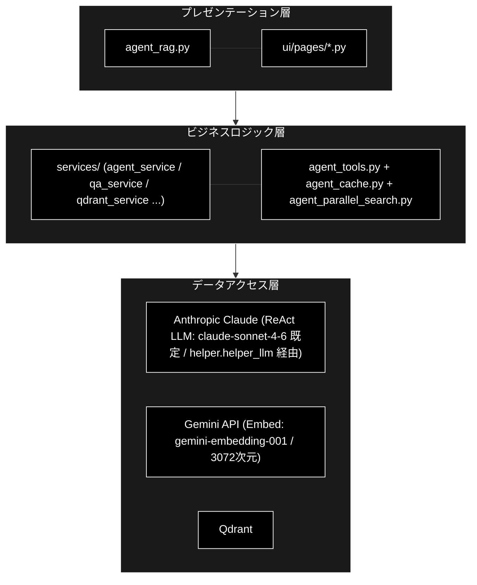
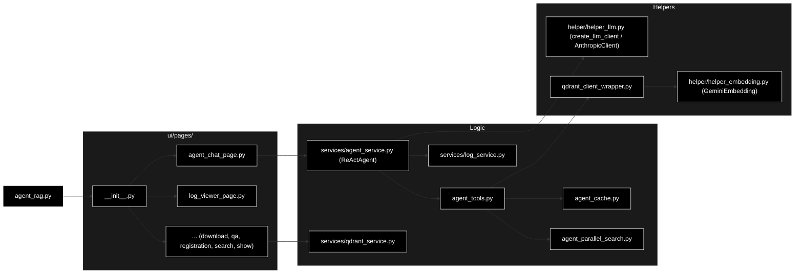
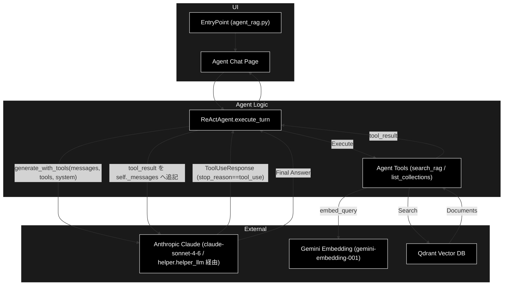
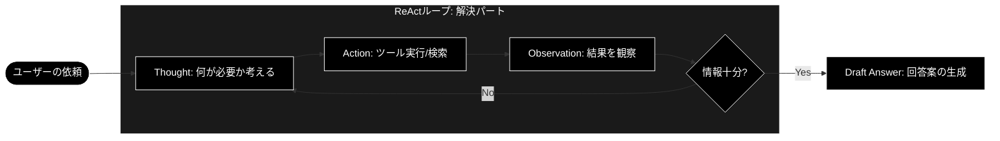
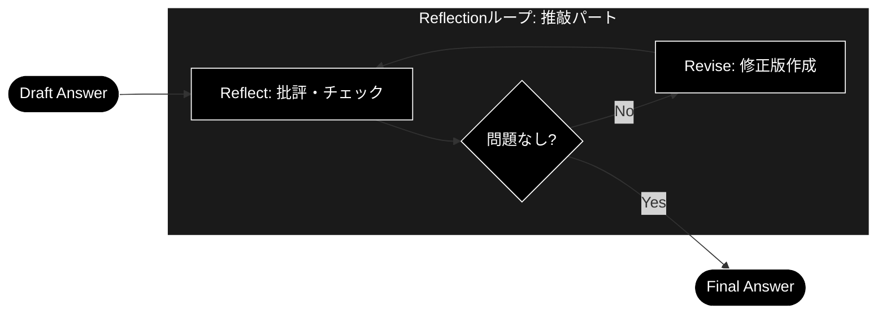
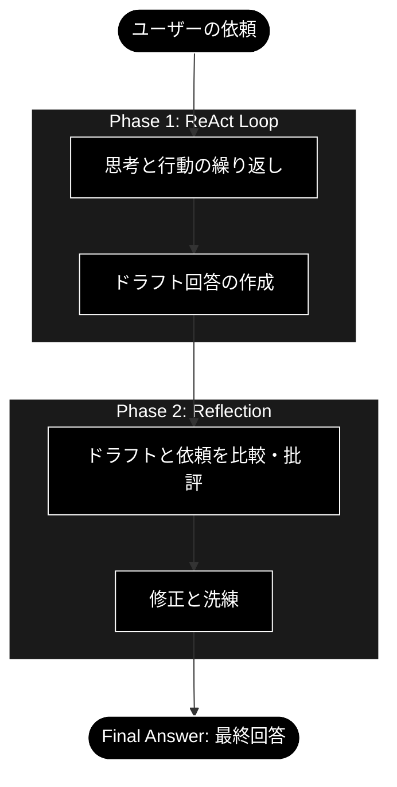
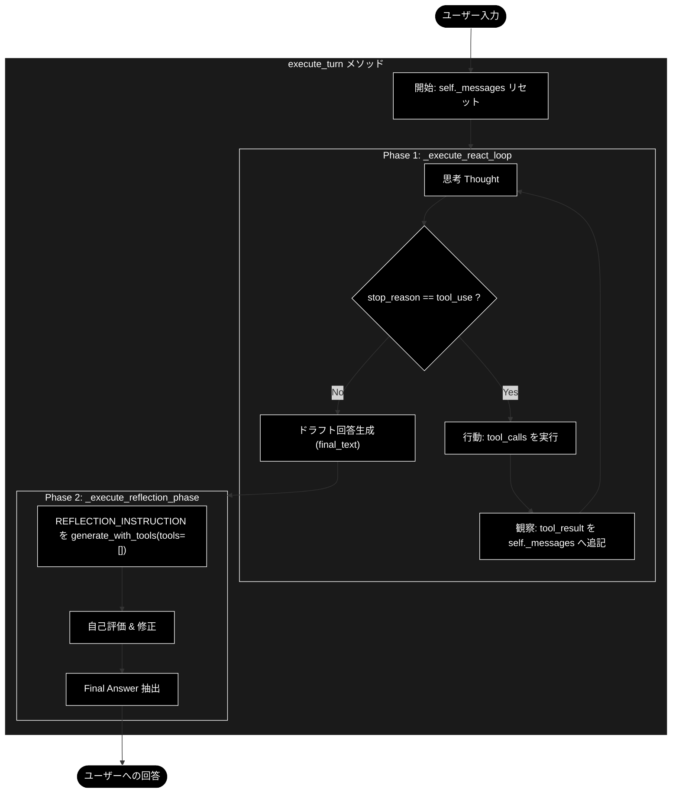
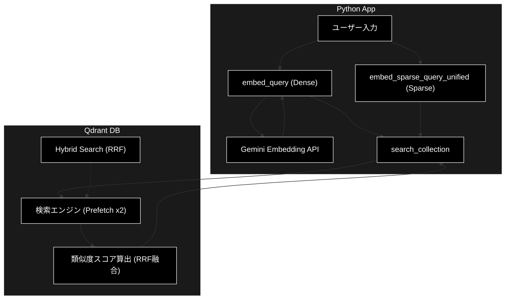
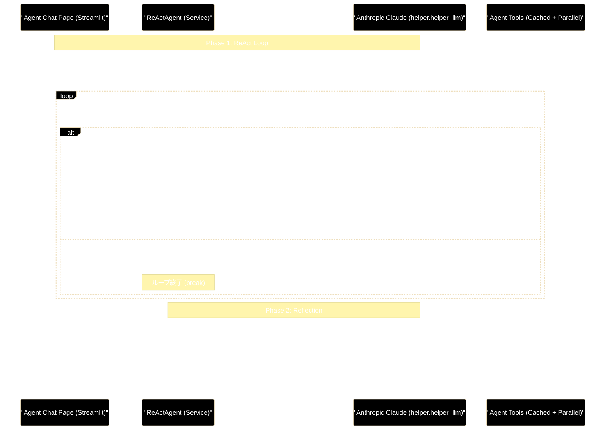
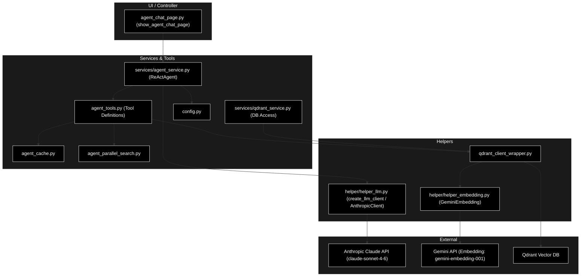

**Agent Graceの資料へ** [Agent Grace](README.md) | **RAGの資料へ** [RAG](readme_rag.md)

## 自律型RAGエージェントシステム（ReAct + Reflection）

> バージョン: v3.0
> 最終更新: 2026-06-21


# Agent RAG システム

本システムは、「自律型 RAG エージェント」および統合管理プラットフォームです。
システムの特徴（ReAct + Reflection、フルスクラッチ実装、Anthropic Tool Use ネイティブ）です。
StreamlitベースのUIを通じて、データの取得・ベクトル化から、Qdrant データベース管理、
そして高度なエージェント対話まで、RAG パイプライン全体を一気通貫で管理・運用することができます。

> **補足:** 本書が対象とするのは `agent_rag.py` を起点とする **ReAct + Reflection エージェント** です。
> `grace/` 配下に実装された **GRACE 自律エージェント (Plan + Executor)** は別アーキテクチャであり、
> 詳細は [`readme_autonomous_agent.md`](readme_autonomous_agent.md) を参照してください。

> ## ⚠️ 重要: この ReAct エージェントの LLM クライアントについて
>
> 本書が対象とする `ReActAgent` (`services/agent_service.py`) は、プロジェクト標準の
> **Anthropic Claude (`claude-sonnet-4-6`)** を **Anthropic Messages API のネイティブ Tool Use** で
> 駆動します（旧 Gemini ネイティブ function-calling 実装から移行済み）。具体的には:
>
> - `helper/helper_llm.py` の `create_llm_client("anthropic")` を経由して `AnthropicClient` を生成し、
>   `self.llm.generate_with_tools(messages, tools, system, max_tokens)` で推論します。
> - レスポンスは `ToolUseResponse(text, tool_calls, stop_reason, assistant_message)` として返り、
>   ループ継続は **`stop_reason == "tool_use"`** で判定します。
> - 会話履歴は Anthropic のステートレス設計に合わせ **`self._messages`（dict のリスト）で自前管理**し、
>   `execute_turn()` の先頭でリセットします。
> - 既定モデルは `get_config("models.default", "claude-sonnet-4-6")` で解決します
>   （旧実装にあった「非 gemini モデル名の自動フォールバック」ロジックは廃止済み）。
> - **Embedding は Gemini `gemini-embedding-001`（3072次元）** を維持します（検索側の責務）。

**主な特徴と技術的工夫:**
```text
1. ReAct (Reasoning + Acting):
   　　エージェント自らが「考える（Reasoning）」と「行動する（Acting）」をループ
   　　・入力プロンプトの最適化（重要キーワードの自動抽出・付与）
   　　・CoT（Chain-of-Thought)のLoop
   　　・Hybrid RAG (Dense + Sparse)の検索
   　　必要な情報が揃うまで自律的に検索ツール (search_rag_knowledge_base) を行使します。
2. Reflection (自己評価結果に基づき、最終回答 (Final Answer) を抽出：自己省察):
   　　回答を作成した後、即座に出力せず「自己評価」フェーズを実行し、回答の品質を向上。
   　　検索結果との整合性やスタイルを自ら批評し、ハルシネーション（幻覚）や誤りを修正してからユーザーに回答します。
3. フルスクラッチ実装:
   　　Anthropic Tool Use (Messages API) を helper.helper_llm 経由で利用し、柔軟な制御を実現しました。
   　　会話状態は self._messages リストで自前管理します（Anthropic はステートレス設計）。
4. スマート検索（キャッシュ + 並列検索）:
   　　前回成功コレクションを優先しつつ、キャッシュミス時は全コレクションを並列検索。
```
## 目次

## RAG Q/A 生成・検索システム

1. [概要](#1-概要)
   - 1.1 [本モジュールの目的](#11-本モジュールの目的)
   - 1.2 [主な機能（画面の概要）](#12-主な機能画面の概要)
   - 1.3 [対応データセット](#13-対応データセット)
2. [アーキテクチャ](#2-アーキテクチャ)
   - 2.1 [システム構成図（3層アーキテクチャ）](#21-システム構成図3層アーキテクチャ)
   - 2.2 [モジュール依存関係図](#22-モジュール依存関係図)
   - 2.3 [レイヤー別役割分担表](#23-レイヤー別役割分担表)
   - 2.4 [システムアーキテクチャ図（Mermaid）](#24-システムアーキテクチャ図mermaid)
   - 2.5 [コンポーネント連携シーケンス図](#25-コンポーネント連携シーケンス図)
3. [データフロー](#3-データフロー)
4. [サービス層 & ツール層](#4-サービス層--ツール層)
5. [UI層 (ui/pages/)](#5-ui層-uipages)
6. [メニュー単位の処理概要・処理方式](#6-メニュー単位の処理概要処理方式)
7. [設定・依存関係](#7-設定依存関係)
8. [使用方法](#8-使用方法)
9. [ReAct + Reflection エージェント詳細設計](#9-react--reflection-エージェント詳細設計)

---

## 1. 概要


### 1.1 本モジュールの目的

`agent_rag.py` は、RAG（Retrieval-Augmented Generation）システムの統合管理ツールです。

**一言で言うと**: RAG Q&A生成・Qdrant管理、および **ReAct + Reflection 型エージェント** による対話を実現する統合Streamlitアプリケーション

**役割**:

- データ取得からベクトル検索までの **RAGパイプライン全体** を管理
- **ReAct + Reflection エージェント** を介した、ツール利用による高度な対話機能
- **Embedding** は **Gemini** (`gemini-embedding-001` / 3072次元) を採用

> **LLM の扱い（重要）:** `ReActAgent` は **Anthropic Claude (`claude-sonnet-4-6`)** を
> **Anthropic Tool Use（Messages API）** で駆動します（`create_llm_client("anthropic")` 経由。
> 既定 `claude-sonnet-4-6`。旧 Gemini 実装から移行済み）。


| 項目           | 内容                                                                          |
| -------------- | ----------------------------------------------------------------------------- |
| ファイル名     | agent_rag.py                                                                  |
| フレームワーク | Streamlit                                                                     |
| プロジェクト標準LLM | Anthropic Claude (`claude-sonnet-4-6`)                                    |
| ReActエージェント実行LLM | **Anthropic Tool Use（Messages API）**（既定 `claude-sonnet-4-6`）   |
| Embedding      | Gemini (`gemini-embedding-001` / 3072次元)                                    |
| ベクトルDB     | Qdrant (`localhost:6333`)                                                     |
| 起動コマンド   | `uv run streamlit run agent_rag.py`                                           |

### 1.2 主な機能（画面の概要）


| 画面             | アイコン | 機能概要                                                                                                   |
| ---------------- | -------- | ---------------------------------------------------------------------------------------------------------- |
| 説明             | 📖       | システムのデータフロー・ディレクトリ構造を表示                                                             |
| エージェント対話 | 🤖       | **ReAct + Reflection Agent** (Anthropic Tool Use) との対話。ナレッジベース検索 + **Reflection (自己推敲)** による高品質な回答。 |
| 未回答ログ       | 📊       | エージェントが回答できなかった質問のログ分析                                                               |
| RAGデータDL      | 📥       | HuggingFace/ローカルファイルからデータ取得・前処理                                                         |
| Q/A生成          | 🤖       | LLM によるQ&Aペア自動生成（Celery並列処理対応）                                                          |
| CSVデータ登録    | 📥       | **Gemini Embedding (3072次元)** でベクトル化・登録・コレクション統合                                       |
| Qdrantデータ管理 | 🗄️     | Qdrantコレクション内容の閲覧 (Show-Qdrant)                                                                 |
| Qdrant検索       | 🔎       | セマンティック検索単体のテスト・AI応答生成                                                                 |
| ベンチマーク     | 📈       | 検索品質・エージェント応答のベンチマーク実行・可視化                                                       |

**アプリケーション・全機能**


- 画面：


### 1.3 対応データセット


| データセット    | 識別子          | 説明                                   |
| --------------- | --------------- | -------------------------------------- |
| Wikipedia日本語 | `wikipedia_ja`  | Wikipedia日本語版                      |
| CC-News         | `cc_news`       | CC-News英語ニュース                    |
| Livedoor        | `livedoor`      | Livedoorニュースコーパス               |
| 日本語Webテキスト | `japanese_text` | 日本語のWebテキスト                  |
| カスタム        | `custom_upload` / `qa_pairs_custom_upload` | ローカルファイル（CSV/TXT/JSON/JSONL） |

---

## 2. アーキテクチャ

### 2.1 システム構成図（3層アーキテクチャ）



### 2.2 モジュール依存関係図



### 2.3 レイヤー別役割分担表


| レイヤー             | モジュール                          | 責務                                                              |
| -------------------- | ----------------------------------- | ----------------------------------------------------------------- |
| **エントリポイント** | `agent_rag.py`                      | アプリ起動、ルーティング                                          |
| **UI層**             | `ui/pages/agent_chat_page.py`       | エージェント対話UI、ユーザー入力受付、思考ログの表示              |
| **サービス層**       | `services/agent_service.py`         | **エージェント制御コア (`ReActAgent`)**。ReActループ、Reflection、会話履歴（`self._messages`）の自前管理 |
| **ツール層**         | `agent_tools.py`                    | エージェントが利用するツール群 (`search_rag_knowledge_base`)      |
| **検索戦略**         | `agent_cache.py` / `agent_parallel_search.py` | コレクションキャッシュと全コレクション並列検索            |
| **LLMクライアント**  | `helper/helper_llm.py`（`AnthropicClient`） | `create_llm_client("anthropic")` / `generate_with_tools()`（Anthropic Tool Use を抽象化） |
| **Embedding抽象化**  | `helper/helper_embedding.py`        | `GeminiEmbedding` / `create_embedding_client("gemini")`           |
| **DBラッパー**       | `qdrant_client_wrapper.py`          | Qdrant 接続・ハイブリッド検索 (`search_collection`)               |

・3層アーキテクチャ


### 2.4 システムアーキテクチャ図（Mermaid）



### 2.5 コンポーネント連携シーケンス図

詳細なエージェントターンのシーケンスは [9.4 シーケンス図 (Agent Turn)](#94-シーケンス図-agent-turn) を参照してください。

---

## 3. データフロー

(基本構成は既存と同様。RAGデータ生成パイプラインは [`readme_rag.md`](readme_rag.md) を参照)

### 3.1 エンドツーエンド処理フロー図

1. データDL -> 2. 前処理（プロンプト最適化、チャンク） -> 3. QA生成 (LLM) -> 4. 埋め込み登録 (Gemini Embedding) -> **5. エージェントによる活用 (Search & Answer)**


---

## 4. サービス層 & ツール層

### 4.1 services/agent_service.py - エージェント制御 (ReAct + Reflection Engine)

**責務**: エージェントの思考プロセス (ReAct + Reflection) をカプセル化したコアサービス。

*   **クラス `ReActAgent`**:
    *   **LLMクライアント**: `create_llm_client("anthropic", default_model=self.model_name)` で `AnthropicClient` (`self.llm`) を生成（API キーは `create_llm_client("anthropic")` 内部で `ANTHROPIC_API_KEY` を参照）。クライアント／チャットセッションの初期化は廃止し、`_build_system_instruction()` / `_build_tools()` に置き換え済み（旧 Gemini 実装から移行済み）。
    *   **system / tools**: `_build_system_instruction()` が `system=` パラメータで渡す system プロンプトを構築し、`_build_tools()` が `input_schema` 形式の dict リスト（`search_rag_knowledge_base` / `list_rag_collections`）を返します。会話履歴は `self._messages`（dict のリスト）で自前管理します（Anthropic はステートレス設計）。
    *   **モデル解決**: `model_name or get_config("models.default", "claude-sonnet-4-6")`。旧実装にあった「非 gemini モデル名の自動フォールバック」ロジックは廃止済みです。
    *   **ReActループ** (`_execute_react_loop`): `generate_with_tools()` を駆動し、`stop_reason == "tool_use"` を検出してツール実行を制御。
    *   **Reflection** (`_execute_reflection_phase`): 回答案生成後の自己評価・修正フェーズを実行（`generate_with_tools(tools=[])`）。
    *   **イベント駆動**: 思考ログやツール実行結果を `Generator[Dict[str, Any], None, None]` としてUIに逐次返却。
    *   **キーワード抽出**: `regex_mecab.KeywordExtractor` が利用可能なら、入力からキーワードを抽出してプロンプトを拡張。
    *   **状態**: `self.llm` / `self._messages`（会話履歴）/ `self.system_instruction` / `self.tools` / `self.thought_log` / `self.keyword_extractor` / `self.session_id` / `self.use_hybrid_search`。

### 4.2 services/qa_service.py - Q/A生成

**責務**: テキストチャンクからQ/Aペアを生成するビジネスロジック (同期/非同期)。主な関数: `run_advanced_qa_generation`, `generate_qa_pairs`, `save_qa_pairs_to_file`。

### 4.3 services/qdrant_service.py - Qdrant操作

**責務**: Qdrantクライアントの操作を抽象化し、コレクション管理・登録・検索ユーティリティを提供。主な関数: `get_all_collections`, `create_or_recreate_collection_for_qdrant`, `build_points_for_qdrant`, `embed_query_for_search`。

### 4.4 agent_tools.py - エージェント用ツール


| 関数名                              | 説明                                                                                                  |
| ----------------------------------- | ----------------------------------------------------------------------------------------------------- |
| `search_rag_knowledge_base`         | 全コレクションを並列検索し、コサイン類似度閾値でフィルタした上位5件を整形して返す。`collection_name` は指定されても無視される。 |
| `search_rag_knowledge_base_cached`  | キャッシュ + 並列検索を組み合わせたスマート検索。`ReActAgent` が実際に呼び出すのはこちら。            |
| `search_rag_knowledge_base_structured` | 単一コレクションを検索する下位モジュール。事前計算ベクトルを受け取り並列検索から呼ばれる。          |
| `list_rag_collections`              | 利用可能なQdrantコレクションの一覧（件数付き）を返す。                                                |

> **注:** LLM に公開されるツールは `search_rag_knowledge_base` と `list_rag_collections` の2つ。
> `_build_tools()` が **Anthropic Tool Use 形式（`input_schema` の dict リスト）** として定義し、
> `generate_with_tools(messages, tools, system, max_tokens)` の `tools` 引数に渡されます。
> ただし実行時、`search_rag_knowledge_base` への Tool Use 呼び出しは `ReActAgent._execute_react_loop` 内で
> `search_rag_knowledge_base_cached` に振り替えられます（キャッシュ + 並列検索を適用するため）。
> `collection_name` はツール入力に含めませんが、`search_rag_knowledge_base` / `_cached` 側で実質的に全コレクション検索に回されます。

> **Rerank について:** `rerank_results`（Cohere API）は実装上残っていますが、現行フローでは無効化されており、
> 採用判定は **コサイン類似度閾値 (`COSINE_SIMILARITY_THRESHOLD = 0.7`)** で行います。

---

## 5. UI層 (ui/pages/)

### 5.1 画面一覧と遷移

サイドバーのラジオボタンにより、以下の画面を切り替え。

1. **説明 (`explanation_page.py`)**
2. **エージェント対話 (`agent_chat_page.py`)**
3. **未回答ログ (`log_viewer_page.py`)**
4. **RAGデータDL (`download_page.py`)**
5. **Q/A生成 (`qa_generation_page.py`)**
6. **CSVデータ登録 (`qdrant_registration_page.py`)**
7. **Qdrantデータ管理 (`qdrant_show_page.py`)**
8. **Qdrant検索 (`qdrant_search_page.py`)**
9. **ベンチマーク (`benchmark_page.py`)**
10. **GRACE対話 (`grace_chat_page.py`)** — GRACE 自律エージェント用（[`readme_autonomous_agent.md`](readme_autonomous_agent.md) 参照）

### 5.2 各ページの機能詳細

#### `agent_chat_page.py` (エージェント対話)

* **エントリ関数**: `show_agent_chat_page()`
* **機能**: Anthropic Tool Use を用いた `ReActAgent` とのチャットインターフェース。
* **特徴**:
  * **モデル選択**: サイドバーで Anthropic 系モデル（`claude-sonnet-4-6` / `claude-haiku-4-5-20251001`）から使用モデルを選択可能。既定は `AgentConfig.MODEL_NAME`（= `ModelConfig.DEFAULT_MODEL` = `claude-sonnet-4-6`）。
  * **マルチコレクション**: 検索対象コレクションをサイドバーでマルチセレクト（既定は全選択）。
  * **ハイブリッド検索トグル**: 「⚡ ハイブリッド検索 (Sparse + Dense)」チェックボックスで切替（既定 ON）。
  * **再初期化判定**: コレクション・モデル・ハイブリッド設定のいずれかが変わると `ReActAgent(selected_collections, selected_model, session_id=..., use_hybrid_search=...)` を再生成。
  * **ReActループ**: 思考(Thought)と行動(Action)を `st.expander`（思考プロセス）に逐次表示。
  * **Reflection**: 回答案生成後に自己評価・修正を行い、ハルシネーションの低減とスタイル統一を実現。
  * **キャッシュ**: セッション単位の `collection_cache` をリセットでき、統計（ヒット回数・前回スコアなど）を表示。
  * **イベント駆動**: `agent.execute_turn(prompt)` のジェネレータを反復し、`log` / `tool_call` / `tool_result` / `final_answer` イベントを処理（`final_text` はループ内部の中間イベントで UI には描画されません）。

#### `log_viewer_page.py` (未回答ログ)

* **機能**: エージェントが「回答なし」(`[[NO_RAG_RESULT]]` 等) と判断したクエリの履歴を表示・分析（`log_unanswered_question` で記録）。

---

## 6. メニュー単位の処理概要・処理方式

### 6.1 📖 説明

システム全体の概要を表示。

### 6.2 🤖 エージェント対話

ReAct + Reflection エージェントがユーザーの質問に対し、ツール（検索）を使って回答を作成します。

* **思考の可視化**: 「なぜその検索を行うか」という推論過程（Thought）を表示。
* **ツール利用**: `search_rag_knowledge_base`（内部的には `search_rag_knowledge_base_cached`）を自律的に呼び出し、Qdrantから情報を取得。
* **Reflection (推敲)**: 回答案を作成した後、自己評価フェーズを実行。正確性・適切性・スタイルを推敲し、より洗練された回答を提示します。

---

## 9. ReAct + Reflection エージェント詳細設計

本システムの中核である「ハイブリッド・ナレッジ・エージェント」の詳細設計です。

### 9.1 ReAct + Reflection の仕組み


Anthropic Tool Use（Messages API）を利用し、以下のサイクルを回します。


1. **ReAct フェーズ (解決) — `_execute_react_loop`**:

   * **Thought (思考)**: ユーザーの入力に対し、外部知識が必要か、どんなクエリで検索すべきか考える。
   * **Action (行動)**: ツール (`search_rag_knowledge_base`) を呼び出す（`generate_with_tools()` の戻り値 `ToolUseResponse` の `stop_reason == "tool_use"` と `tool_calls` の有無で判定）。
   * **Observation (観察)**: ツールを実行し、その結果を `{"type":"tool_result", "tool_use_id":..., "content":...}` として（複数ツールは1件の user メッセージにまとめて）`self._messages` に追記し、次ループで Anthropic に再送。
   * **Draft Answer (ドラフト作成)**: `stop_reason` が `"tool_use"` でなくなったターンのテキスト（`result.text`）を回答案 (`final_text`) とする。


2. **Reflection フェーズ (推敲) — `_execute_reflection_phase`**:

* **Critique (批評)**: `REFLECTION_INSTRUCTION` を付与し、検索結果との整合性やスタイルを自己評価。
* **Revise (修正)**: 必要に応じて回答を修正し、`Final Answer:` 以降を最終回答とする。

### 9.2 主要クラス・関数 IPO 定義

#### `services.agent_service.ReActAgent.execute_turn`


エージェントの1ターン（ユーザー発話〜最終回答）を制御するメインメソッド。ジェネレータとして実装されています。


| 項目        | 内容                                                                                                                                                                                                                                                                                                                                                                                                                  |
| ----------- | ----------------------------------------------------------------------------------------------------------------------------------------------------------------------------------------------------------------------------------------------------------------------------------------------------------------------------------------------------------------------------------------------------------------------- |
| **Input**   | `user_input: str` — ユーザーの質問文字列                                                                                                                                                                                                                                                                                                                                                                              |
| **Process** | 1. `self.thought_log` と `self._messages` をリセット（Anthropic ステートレス設計）。<br>2. **ReAct Loop** (`_execute_react_loop`):<br>　a. （任意）`KeywordExtractor` でキーワード抽出し入力を拡張、`self._messages` に user メッセージとして追記。<br>　b. `self.llm.generate_with_tools(messages, tools, system, max_tokens)` を呼ぶ。<br>　c. 戻り値 `ToolUseResponse` の `stop_reason == "tool_use"` かつ `tool_calls` ありならツール実行（`search_rag_knowledge_base` → `search_rag_knowledge_base_cached`）。<br>　d. `assistant_message` を履歴へ追記し、全 `tool_result`（`tool_use_id` 一致）を1件の user メッセージにまとめて追記して `max_turns`(既定10) まで反復。<br>　e. `stop_reason` が `"tool_use"` でなければそのテキストを `final_text` イベントとしてYield。<br>3. **Reflection Phase** (`_execute_reflection_phase`):<br>　a. `REFLECTION_INSTRUCTION` + 回答案を `self._messages` に追記し `generate_with_tools(tools=[])` で送信。<br>　b. `result.text` を抽出し、`Final Answer:` で分割。<br>　c. `Final Answer:` 以降を最終回答とする。<br>4. `_format_final_answer` で整形し `final_answer` イベントをYield。 |
| **Output**  | `Generator[Dict[str, Any], None, None]`: イベントストリーム<br>(`{'type': 'log', 'content': ...}`, `{'type': 'tool_call', 'name': ..., 'args': ...}`, `{'type': 'tool_result', 'content': ...}`, `{'type': 'final_text', 'content': ...}`, `{'type': 'final_answer', 'content': ...}`)                                                                                                                                                                                                                            |

#### `agent_tools.search_rag_knowledge_base_cached`

実行時に `ReActAgent` が呼び出すスマート検索関数。


| 項目        | 内容                                                                                                                                                                                                                                                                                              |
| ----------- | --------------------------------------------------------------------------------------------------------------------------------------------------------------------------------------------------------------------------------------------------------------------------------------------------- |
| **Input**   | `query: str` / `session_id: str` / `collection_name: Optional[str]` / `use_hybrid_search: bool`                                                                                                                                                                                                   |
| **Process** | 1. `embed_query` でDenseベクトルを1回だけ生成（ハイブリッド時は `embed_sparse_query_unified` でSparseも生成）。<br>2. コレクション明示指定があればそれを検索。<br>3. キャッシュ (`collection_cache`) ヒット時はそのコレクションを優先検索。<br>4. キャッシュミス／低スコア時は全コレクションを4並列検索 (`parallel_search_engine`)。<br>5. 最高スコアのコレクションをキャッシュへ保存し、上位5件を整形。 |
| **Output**  | 整形済み検索結果文字列（または `[[NO_RAG_RESULT]]` / `[[NO_RAG_RESULT_LOW_SCORE]]` / `[[RAG_TOOL_ERROR]]`）                                                                                                                                                                                       |

#### ストリーミングイベントプロトコル（`execute_turn` の Yield）

`execute_turn` / `_execute_react_loop` / `_execute_reflection_phase` が Yield する辞書イベントの種別は以下の通りです。

| `type`          | フィールド            | 発生元                          | UI 処理 (`agent_chat_page.py`)                        |
| :-------------- | :-------------------- | :------------------------------ | :---------------------------------------------------- |
| `log`           | `content`            | フェーズ開始通知 / Thought / Keyword / Reflection Thought | 思考プロセス `st.expander` に追記                     |
| `tool_call`     | `name`, `args`       | Tool Use 検出時（`stop_reason == "tool_use"`） | 思考プロセスに追記し `st.spinner` で実行中表示         |
| `tool_result`   | `content`            | ツール実行後（先頭500文字に丸め） | 思考プロセスに追記                                     |
| `final_text`    | `content`            | ReActループ終了時（ドラフト回答） | UI では未描画（`execute_turn` 内で `draft_answer` に保持） |
| `final_answer`  | `content`            | `_format_final_answer` 後       | `response_text_placeholder.markdown` で最終回答を描画 |

### 9.3 システムプロンプト設計

* **`SYSTEM_INSTRUCTION_TEMPLATE`** (`agent_service.py`):
  * ReAct の出力フォーマット（`Thought:` / `Answer:`）を規定。
  * Router Guidelines（どのコレクションを使うか）を提示。`{available_collections}` を選択コレクションで埋める。
  * **重要:** ツール呼び出し時に `collection_name` を指定しないよう指示（システムが自動選択）。
* **`REFLECTION_INSTRUCTION`** (`agent_service.py`):
  * ドラフト回答に対する評価基準（正確性・適切性・スタイル）を定義し、`Final Answer:` 形式での出力を要求。

---

# Hybrid RAG Agent - 理論と実装リファレンス

本ドキュメントは、ReAct + Reflection エージェントの理論的背景（概念図）と、`agent_rag.py` および関連モジュールの実装詳細を体系的にまとめたリファレンスです。本エージェントの推論ロールは Anthropic Tool Use（`helper.helper_llm` 経由、既定 `claude-sonnet-4-6`）で実行されます。

---

## 第2部: アーキテクチャ概念 (Theoretical Architecture)

エージェント (Anthropic Claude) の思考プロセスは、大きく2つのフェーズ（解決と推敲）で構成されています。

## 2.1 Phase 1: ReAct (試行錯誤による解決)

ReActは、**「考え（Reasoning）」ながら「行動（Acting）」し、その結果を見てまた「考える」**というプロセスです。
AIは単に回答を出力するのではなく、外部ツール（検索など）を使いながら、情報が揃うまで行動を繰り返します。



* **Thought**: 現在の状態を分析し、次に何をすべきか計画します。
* **Action**: ツール（検索）を実行します。
* **Observation**: ツールの実行結果（検索結果）を受け取ります。

## 2.1.1 入力文字列から検索クエリ生成までの処理構造（重要）

Pythonコード側で「キーワード抽出」や「クエリ整形」を行う関数は、補助的に `regex_mecab.KeywordExtractor` がありますが、
最終的な検索クエリの決定は **LLM (Anthropic Claude) モデル自体** が、システムプロンプトの指示に基づき「入力文」を解釈し「最適な検索クエリ」へと変換（推論）します。

1. 入力フェーズ (Pythonコード: `ui/pages/agent_chat_page.py`)

* ユーザーの行動:
  チャット画面に自然文で質問を入力します。

  > 具体例: 「実験生物学では、生物の機構を解明するためにどのような操作を加えますか？」

* コード処理 (`ReActAgent.execute_turn` → `_execute_react_loop`):
  この文字列は（必要に応じて抽出キーワードを付与した上で）`self._messages` に user メッセージとして追記され、
  `self.llm.generate_with_tools(messages=self._messages, ...)` 経由で Anthropic に送信されます。
  同時に、システムプロンプト (`SYSTEM_INSTRUCTION_TEMPLATE`、`_build_system_instruction()` が構築し `system=` で渡す) によって、モデルには思考のルールが与えられています。

  > 指示: 「Thought: [なぜ検索が必要か、どんなクエリで検索するか]」

2. 生成・推論フェーズ (Anthropic Claude 内部)

* モデルの思考 (Reasoning):
  モデルはプロンプトの指示に従い、ユーザーの意図を汲み取りつつ、検索ツール (`search_rag_knowledge_base`)
  に渡すべき最適な引数 `query` を考えます。

* クエリの決定 (Tool Use 生成):
  モデルは思考の結果に基づき、ツールの引数 `query` を生成します。ここでの出力が、実際の検索クエリとなります。

  > 生成パターン例:
  > ケースA (重要語抽出): "実験生物学 生物の機構 操作"
  > ケースB (キーワード化): "実験生物学 実験操作"
  > ケースC (そのまま): "実験生物学では、生物の機構を解明するためにどのような操作を加えますか？"

※現状のプロンプトでは「キーワードのみにせよ」という強制はないため、モデルの文脈判断によりケースA〜Cのように変動します。なお `KeywordExtractor` が有効な場合は、抽出済みキーワードをクエリに含めるよう追加指示されます。

3. 伝達・実行フェーズ (Pythonコード: `agent_tools.py`)

* コード処理 (`_execute_react_loop` → `search_rag_knowledge_base_cached`):
  Anthropic から返ってきた `ToolUseResponse.tool_calls` の各要素（モデルが決めたクエリ。`tc["name"]` / `tc["input"]` / `tc["id"]`）を Python 側で受け取り、検索関数を実行します。
  なお `collection_name` はツール入力に含めず、全コレクションが検索対象になります。

```python
# agent_service.py（_execute_react_loop 抜粋）
if tool_name == "search_rag_knowledge_base":
    tool_result = search_rag_knowledge_base_cached(
        query             = tool_args.get("query", ""),
        session_id        = self.session_id,
        collection_name   = tool_args.get("collection_name"),  # 通常 None
        use_hybrid_search = self.use_hybrid_search,
    )
```

まとめ


| フェーズ | 担当               | 処理内容                                 | 具体例                                  |
| :------- | :----------------- | :--------------------------------------- | :-------------------------------------- |
| 1. 入力  | agent_chat_page.py | ユーザーの自然文を受け取る               | 「実験生物学では...操作を加えますか？」 |
| 2. 変換  | Anthropic Claude (LLM) | 文脈から「検索用クエリ」を推論・生成する | 「実験生物学 実験操作」 (ケースB)       |
| 3. 実行  | agent_tools.py     | 生成されたクエリで全コレクション検索     | query="実験生物学 実験操作" で検索      |

つまり、「クエリ生成ロジック」の実体は主に LLM（Anthropic Claude）の推論プロセスの中にあります（`KeywordExtractor` は補助）。

### 2.1.2 CoT (Chain of Thought) の処理構造（重要）

ReActエージェントは、最終的な回答を出す前に、思考(Thought)と行動(Action/Tool Use)を連鎖させ、論理的に答えを導き出します。
以下は、実際の実行ログに基づく思考の連鎖プロセスです。


#### 具体的な挙動の仕組み (実行ログの追跡)

1. **初期思考 (Initial Thought)**

   * **入力**: 「実験生物学では、生物の機構を解明するためにどのような操作を加えますか？」
   * **LLMの推論**: 質問の意図を理解し、外部情報が必要か判断します。
   * **思考ログ**:
     > 🧠 Thought: [生物の機構を解明するための操作に関する質問なので、社内ナレッジを検索する。]

2. **ツール実行 (Action & Observation)**

   * **LLMの行動**: 推論に基づき、適切なツールと引数を生成します（`collection_name` は指定しない）。
   * **ツール呼び出し**:
     > 🛠️ Tool Call: `search_rag_knowledge_base`
     > Args: `{'query': '実験生物学 生物機構 操作'}`

   * **ツールの結果 (Observation)**:
     > 📝 Tool Result: --- Result 1 [Cosine: 0.50] --- Q: 実験生物学では... A: 人為的に操作を加え通常と異なる条件を作り出し...

3. **解決思考 (Reasoning & Draft)**

   * **思考ログ**:
     > 🧠 Thought: [検索結果から、質問に対する回答が得られた。]
   * **ドラフト回答**:
     > Answer: 社内ナレッジによると、実験生物学では...

4. **推敲 (Reflection)**

   * **LLMの自己評価**:
     > 🤔 Reflection Thought: [自己評価: 回答は質問に直接的かつ明確に答えており...修正は不要と判断しました。]

#### まとめ


| ステップ | フェーズ        | 処理内容                 | 実際のログ要素                               |
| :------- | :-------------- | :----------------------- | :------------------------------------------- |
| **1**    | **Thought**     | 検索の必要性と戦略の立案 | `Thought: ...社内ナレッジを検索する。`       |
| **2**    | **Action**      | 検索ツールの実行         | `Tool Call: search_rag_knowledge_base`       |
| **3**    | **Observation** | 検索結果の取得           | `Tool Result: ...人為的に操作を加え...`      |
| **4**    | **Draft**       | 情報の統合と回答作成     | `Answer: 社内ナレッジによると...`            |
| **5**    | **Reflection**  | 回答の品質チェック       | `Reflection Thought: ...修正は不要と判断...` |

### 2.1.3 Reflectionフェーズ (自己省察と推敲) の処理構造（重要）

検索結果を基に一度回答を作成した後、さらに「推敲」を行うプロセスです。
これにより、回答の正確性やスタイルが、システム要件（丁寧な日本語など）に合致しているか自己評価し、必要に応じて修正します。

#### プロンプト戦略 (`REFLECTION_INSTRUCTION`)

`REFLECTION_INSTRUCTION` 定数にて、以下の観点でのチェックを指示しています。

1. **正確性 (Accuracy)**: 検索結果に基づいているか？ 幻覚 (Hallucination) はないか？
2. **適切性 (Relevance)**: ユーザーの質問に直接答えているか？
3. **スタイル (Style)**: 親しみやすく丁寧な日本語（です・ます調）か？ 箇条書き等のフォーマットは適切か？

#### 具体的な挙動の仕組み

1. **ドラフト生成フェーズ** (ReActループ終了後)

   * **コード処理**: `_execute_react_loop` がツール呼び出しのないターンのテキストを `final_text` イベントとしてYieldし、`execute_turn` が `draft_answer` として保持します。

2. **推敲フェーズ** (Reflection)

   * **コード処理** (`_execute_reflection_phase`): `REFLECTION_INSTRUCTION` + ドラフト回答を `reflection_msg` として `self._messages` に追記し、`self.llm.generate_with_tools(messages=self._messages, tools=[], ...)` で送信します（`self._messages` が ReAct ループの検索結果・思考ログを含む会話コンテキストを保持）。Tool Use は使いません（`tools=[]`）。
   * **LLMの思考 (Reflection Thought)**: プロンプトに従い、自分の回答を評価します。
   * **最終回答の生成 (Final Answer)**: `Final Answer:` 以降を最終版として抽出します。

#### まとめ


| フェーズ    | 担当                                | 処理内容                             | 具体例                                                 |
| :---------- | :---------------------------------- | :----------------------------------- | :----------------------------------------------------- |
| 1. 推敲指示 | `agent_service._execute_reflection_phase` | ドラフト回答 + 評価プロンプトを送信  | `REFLECTION_INSTRUCTION` + 「社内ナレッジによると...」 |
| 2. 自己評価 | `Anthropic Claude (LLM)`            | 基準（正確性・スタイル）に従って評価 | 「自己評価: ...修正は不要と判断しました。」            |
| 3. 最終化   | `Anthropic Claude (LLM)`            | 修正版（またはそのまま）の回答を出力 | 「社内ナレッジによると...（最終回答）」                |

### 2.2 Phase 2: Reflection (自己省察と推敲)

Reflectionは、生成された回答（ドラフト）に対して客観的な批評を行い、品質を高めるプロセスです。



* **Reflect**: 正確性、適切性、スタイルをチェックします。
* **Revise**: 問題があれば修正し、最終回答を生成します。

> **実装メモ:** 現行実装では Reflection は1回（シングルパス）です。`generate_with_tools(REFLECTION_INSTRUCTION + ドラフト, tools=[])` で評価・修正を行い、
> `Final Answer:` を抽出して最終回答とします（無限の修正ループは回しません）。

## 2.3 統合モデル (ReAct + Reflection)

「動く（Action）」フェーズと「考える（Reflection）」フェーズを連携させることで、より高度な成果物を生み出します。



---

# 第3部: 実装詳細 (Implementation Details)

上記の理論が、実際のPythonコードでどのように実装されているか解説します。

## 2.4 エージェント制御: `services/agent_service.py`

エージェントのライフサイクル管理を行うコアサービスです。UI 側（`ui/pages/agent_chat_page.py`）が `ReActAgent` を生成・呼び出します。

* **`ReActAgent.__init__(selected_collections, model_name=None, session_id=None, use_hybrid_search=True)`**:
  * **役割**: エージェントを初期化します。`create_llm_client("anthropic", default_model=self.model_name)` で `AnthropicClient` (`self.llm`) を生成し、`_build_system_instruction()` が system プロンプトを、`_build_tools()` が `input_schema` 形式の Tool Use 定義を事前構築します。会話履歴は `self._messages = []` で初期化します。
  * **詳細**: `model_name` 未指定時は `get_config("models.default", "claude-sonnet-4-6")` を使用。旧実装にあった「非 gemini モデル名の自動フォールバック」ロジックは廃止済み。UI で選択した Anthropic モデルを動的に切替可能。
  * **状態**: `self.llm` / `self._messages`（会話履歴を自前保持）/ `self.system_instruction` / `self.tools` / `self.thought_log` / `self.keyword_extractor` / `self.session_id` / `self.use_hybrid_search` を保持。

> **補足:** UI 側でのエージェント生成は `ui/pages/agent_chat_page.py` の `show_agent_chat_page()` 内で行われます
> （`ReActAgent(selected_collections, selected_model, session_id=..., use_hybrid_search=...)`）。旧記述の `setup_agent()` 関数は存在しません。

### ReActループの実装 (`_execute_react_loop`)

Anthropic Tool Use（Messages API）と Python の `for turn_count in range(1, max_turns + 1):` ループを組み合わせて ReAct を実現しています。



* **コード対応**: `_execute_react_loop` 内の `for turn_count in range(1, max_turns + 1):` ループ（`max_turns` は `get_config("agent.max_turns", 10)`）。
* **ツール検出**: `generate_with_tools()` の戻り値 `ToolUseResponse` の `stop_reason == "tool_use"` かつ `tool_calls` ありで判定。`stop_reason` が `"tool_use"` でないターンで `break` してドラフトを確定します。
* **Thoughtの可視化**: テキスト (`result.text`) に `Thought:` または `考え:` を含む場合、`log` イベントとしてYieldし Streamlit UI (`st.expander`) にリアルタイム表示します。

### プロンプト設計

* **Router Guidelines (`SYSTEM_INSTRUCTION_TEMPLATE`)**:
  * **役割**: どのコレクション（`wikipedia_ja`, `livedoor`, `cc_news`, `japanese_text`, `custom_upload` 等）に該当するかの判断基準を提供します。
  * **実装**: `{available_collections}` を選択コレクションで埋め込み、LLM が自律的に判断します（`collection_name` はツール引数に含めない）。
* **Reflection Strategy (`REFLECTION_INSTRUCTION`)**:
  * **役割**: ドラフト回答に対する評価基準（正確性・適切性・スタイル）を定義します。

## 2.5 ツール定義: `agent_tools.py`

LLM が呼び出すことができる「手足」となる関数群です。

* **`search_rag_knowledge_base(query, collection_name=None, use_hybrid_search=True)`**:
  * **役割**: 全コレクションを並列検索し、コサイン類似度閾値でフィルタした上位5件を整形して返します。`collection_name` は無視されます。
* **`search_rag_knowledge_base_cached(query, session_id, ...)`**:
  * **役割**: キャッシュ + 並列検索のスマート検索。`ReActAgent` が実際に呼ぶのはこちら。
* **`list_rag_collections()`**:
  * **役割**: 現在利用可能なコレクションの一覧（件数付き）を返します。

> **ツール定義 (`_build_tools`)**: `_build_tools()` が **Anthropic Tool Use 形式（`{"name", "description", "input_schema"}` の dict リスト）** を返し、
> `generate_with_tools(..., tools=self.tools, ...)` に渡します。`collection_name` はツール入力スキーマに含めず（システムが自動選択）、実行時は全コレクション検索に回されます。

## 2.6 知識ベース検索とハイブリッド検索

Qdrant データベースとの対話、Embedding 生成、ハイブリッド検索を担当します。

### Embedding (ベクトル化) の構成

`helper/helper_embedding.py` に集約・抽象化されています。Qdrant ラッパー (`qdrant_client_wrapper.embed_query`) は内部で Gemini Embedding に委譲します。


| 項目               | 詳細                                                                                                              |
| :----------------- | :---------------------------------------------------------------------------------------------------------------- |
| **抽象基底クラス** | `EmbeddingClient`（`helper/helper_embedding.py`）                                                                  |
| **実装クラス**     | **`GeminiEmbedding`**: Gemini API (`gemini-embedding-001` / 3072次元) を使用。現行の主力。                         |
| **ファクトリ関数** | `create_embedding_client(provider="gemini", ...)`                                                                 |
| **クエリ埋め込み** | `qdrant_client_wrapper.embed_query()`（Dense）/ `embed_sparse_query_unified()`（Sparse, `helper/helper_embedding_sparse.py` 経由） |

### 検索ロジック (Hybrid Search)

Qdrant の **Hybrid RAG (Dense + Sparse)** 機能を活用しています。


| 処理フェーズ       | モジュール / 関数                                             | 詳細 (Input / Process / Output)                                                                                                                                                                 |
| :----------------- | :------------------------------------------------------------ | :-------------------------------------------------------------------------------------------------------------------------------------------------------------------------------------------- |
| **設定 (Setup)**   | `qdrant_client_wrapper.py`<br>`create_or_recreate_collection` | **Input**: `client`, `name`, `vector_size`<br>**Process**: DenseベクトルとSparseベクトルの両方の設定を行い、コレクションを作成。<br>**Output**: なし                                            |
| **実行 (Runtime)** | `qdrant_client_wrapper.py`<br>`search_collection`             | **Input**: `client`, `collection_name`, `query_vector`, `sparse_vector`<br>**Process**: Dense (意味検索) と Sparse (キーワード検索) を `models.FusionQuery(fusion=models.Fusion.RRF)` で統合。<br>**Output**: 高精度な検索結果リスト |



### 1. 検索を実現しているクラス・関数

`agent_rag.py` はエントリーポイント（画面遷移の管理）であり、実際の検索ロジックは **ツール層** と **DBラッパー** に分離されています。


| 層                | ファイル                         | 関数 / クラス                 | 説明                                                                                                |
| :---------------- | :------------------------------- | :---------------------------- | :-------------------------------------------------------------------------------------------------- |
| **App Entry**     | `agent_rag.py`                   | `main()`                      | 画面選択ラジオボタンで各ページを呼び出します。                                                       |
| **UI Layer**      | `ui/pages/qdrant_search_page.py` | `show_qdrant_search_page()`   | 検索画面のメイン関数。ユーザー入力を受け取り、検索を実行します。                                      |
| **Tool Layer**    | `agent_tools.py`                 | `search_rag_knowledge_base_cached` / `search_rag_knowledge_base_structured` | エージェントの検索の中核。キャッシュ・並列・単一コレクション検索を担います。 |
| **DB Wrapper**    | `qdrant_client_wrapper.py`       | `search_collection()`         | **検索実行の中核関数。** Qdrant にクエリを送信。ハイブリッド検索 (RRF) の分岐もここで行われます。     |
| **Embedding**     | `qdrant_client_wrapper.py`       | `embed_query()` / `embed_sparse_query_unified()` | クエリを Dense / Sparse ベクトルに変換します（Gemini Embedding）。            |

### 2. Dense + Sparse 機能を実現しているクラス・関数

「Dense + Sparse（ハイブリッド検索）」は、通常のベクトル検索（Dense）に加え、キーワード検索に近い性質を持つ **Sparse Vector** を組み合わせることで実現されています。


| 機能                  | ファイル                     | 関数 / クラス                                | 説明                                                                                                                            |
| :-------------------- | :--------------------------- | :------------------------------------------- | :------------------------------------------------------------------------------------------------------------------------------ |
| **Sparse Vector生成** | `qdrant_client_wrapper.py`   | `embed_sparse_query_unified()`               | クエリ文字列を**Sparse Vector**（疎ベクトル、キーワード重み）に変換します。内部で `helper/helper_embedding_sparse.py` を呼び出します。 |
| **Hybrid検索実行**    | `qdrant_client_wrapper.py`   | `search_collection()`                        | 引数 `sparse_vector` が渡された場合、DenseとSparseの両方を使って検索し、**RRF (Reciprocal Rank Fusion)** で結果を統合します。    |
| **コレクション定義**  | `services/qdrant_service.py` | `create_or_recreate_collection_for_qdrant()` | コレクション作成時に、Dense用設定に加え `sparse_vectors_config` を設定し、ハイブリッド検索可能な器を用意します。                 |
| **ポイント構築**      | `services/qdrant_service.py` | `build_points_for_qdrant()`                  | データ登録時に、DenseベクトルとSparseベクトルを一つの `PointStruct` にまとめて格納する構造を作ります。                          |

### 3. 構造と処理フロー

ハイブリッド検索が実行される際のデータフローと構造は以下の通りです。

#### A. 処理フロー

1. **UI入力**: `show_qdrant_search_page` でユーザーが「⚙️ ハイブリッド検索を有効にする」をチェックし、検索ボタンを押す。
2. **ベクトル化 (Parallel)**:
   * **Dense**: `embed_query(query)` → `[0.12, -0.5, ...]` (3072次元)
   * **Sparse**: `embed_sparse_query_unified(query)` → `indices=[101, 503...], values=[0.5, 0.8...]`
3. **検索実行**: `search_collection(..., query_vector, sparse_vector)` が呼ばれる。
4. **Qdrantクエリ構築**:
   * Dense用とSparse用の2つの `models.Prefetch` オブジェクトを作成。
   * `models.FusionQuery(fusion=models.Fusion.RRF)` を使用して、2つの検索結果をスコアベースで融合するクエリを発行。
5. **結果表示**: 統合された検索結果（Hits）がUIに返却され、表示される。

#### B. データ構造 (Qdrant内部)

Qdrant内では、1つのポイント（ドキュメント）に対して「名前付きベクトル (Named Vectors)」としてDenseとSparseが共存しています。

```python
# build_points_for_qdrant 内での構造イメージ
PointStruct(
    id=...,
    vector={
        "default": [0.1, 0.2, ...],        # Dense Vector (意味検索用 / 3072次元)
        "text-sparse": {                   # Sparse Vector (キーワードマッチ用)
            "indices": [12, 505, ...],
            "values": [0.9, 0.5, ...]
        }
    },
    payload={ "question": "...", "answer": "..." }
)
```

この構造により、`search_collection` 関数内で Dense と Sparse をそれぞれ検索し、RRF でマージすることが可能になっています。

## 第3部: 動作シーケンス (Runtime Behavior)

### 9.4 シーケンス図 (Agent Turn)



#### 主要構成要素


| 項目                   | 実装詳細                                  | 役割                                                                                     |
| :--------------------- | :---------------------------------------- | :--------------------------------------------------------------------------------------- |
| **ループ制御**         | `for turn_count in range(1, max_turns + 1):` | 思考・行動サイクルの維持と無限ループ防止（`max_turns` 既定10）。                          |
| **ツール検出**         | `result.stop_reason == "tool_use" and result.tool_calls` | モデルがツール利用を要求した場合、対応する Python 関数 (`agent_tools.py`) を実行します。 |
| **結果フィードバック** | `self._messages.append({"role":"user","content":[{"type":"tool_result","tool_use_id":...,"content":...}]})` | ツール実行結果を tool_result ブロックとして `self._messages` に追記し、次のターンの推論に渡します（会話履歴は自前管理）。 |
| **LLMクライアント**    | `self.llm = create_llm_client("anthropic", ...)` / `self.llm.generate_with_tools(...)` | `helper.helper_llm` 経由で Anthropic Tool Use を利用。戻り値 `ToolUseResponse`（`text` / `tool_calls` / `stop_reason` / `assistant_message`）を解析します。 |

## 3.2 Router & Multi-turn Strategy

エージェントがどのように検索対象を決定し、失敗時にリカバリするかを示します。

1. **Router (コレクション選択)**:
   * `collection_name` はツール引数に含めず、`search_rag_knowledge_base_cached` がキャッシュ・並列検索により最適なコレクションを自動選択します。
2. **キャッシュ戦略 (`agent_cache.py`)**:
   * 前回成功したコレクションをセッション単位でキャッシュ（`collection_cache`, TTL 300秒）。ヒット時は優先検索します。
3. **並列検索 (`agent_parallel_search.py`)**:
   * キャッシュミス／低スコア時は `parallel_search_engine`（`ThreadPoolExecutor`, 4並列）で全コレクションを同時検索し、最高スコアの結果を採用します。
4. **Multi-turn Strategy (リカバリ)**:
   * 検索結果が `[[NO_RAG_RESULT]]` / `[[NO_RAG_RESULT_LOW_SCORE]]` だった場合、LLM はクエリを言い換えて再検索を試みます。

---

## 7. 設定・依存関係

### 7.1 必須環境変数

```bash
# ReAct エージェントの LLM 用（必須）
# ReActAgent は create_llm_client("anthropic") を利用するため、Anthropic のキーが必須です。
ANTHROPIC_API_KEY=your_anthropic_api_key

# Gemini Embedding 用（必須・検索のベクトル化）
GEMINI_API_KEY=your_gemini_api_key
GOOGLE_API_KEY=your_gemini_api_key

# Rerank用（オプション・現行フローでは無効化）
COHERE_API_KEY=your_cohere_api_key

# インフラ
QDRANT_HOST=localhost
QDRANT_PORT=6333
```

> **注:** 本書の `ReActAgent` の LLM は **Anthropic Claude** です。API キーは `create_llm_client("anthropic")` 内部で
> `ANTHROPIC_API_KEY` を参照します。Embedding（検索）は Gemini を維持するため `GEMINI_API_KEY` / `GOOGLE_API_KEY` も必要です。

### 7.2 主要な定数・設定値


| 定数 / 設定                              | 場所                  | 値 / 既定                       | 用途                                   |
| :--------------------------------------- | :-------------------- | :------------------------------ | :------------------------------------- |
| `ModelConfig.DEFAULT_MODEL`              | `config.py`           | `claude-sonnet-4-6`             | 既定の ReAct LLM モデル                |
| UI モデル選択肢                          | `config.py`           | `claude-sonnet-4-6` / `claude-haiku-4-5-20251001` | UI のモデル選択肢 |
| `AgentConfig.MODEL_NAME`                 | `config.py`           | `= ModelConfig.DEFAULT_MODEL`   | エージェント既定モデル                 |
| `GeminiConfig.EMBEDDING_MODEL` / `EMBEDDING_DIMS` | `config.py`  | `gemini-embedding-001` / `3072` | Embedding モデルと次元数               |
| `models.default`                         | `get_config(...)`     | `claude-sonnet-4-6`             | 既定 LLM モデル（未指定時に使用）      |
| `agent.max_tokens`                       | `get_config(...)`     | `4096`                          | ReAct ループの1回の最大出力トークン    |
| `agent.reflection_max_tokens`            | `get_config(...)`     | `2048`                          | Reflection フェーズの最大出力トークン  |
| `COSINE_SIMILARITY_THRESHOLD`            | `agent_tools.py`      | `0.7`                           | 検索結果の採用閾値                     |
| `AgentConfig.RAG_SEARCH_LIMIT`           | `config.py`           | `3`                             | 単一コレクションの取得件数             |
| `AgentConfig.RAG_DEFAULT_COLLECTION`     | `config.py`           | `wikipedia_ja_5per`             | `_structured` の既定コレクション       |
| `agent.max_turns`                        | `get_config(...)`     | `10`                            | ReActループ最大ターン数                |
| `collection_cache` TTL                   | `agent_cache.py`      | `300` 秒                        | コレクションキャッシュ有効期限         |
| 並列数 / タイムアウト                     | `agent_parallel_search.py` | `4` / `10`秒              | 並列検索のワーカー数・各コレクションのタイムアウト |

> **モデル名について:** Anthropic モデル名はそのまま使用します（マッピングは作りません）。`ReActAgent` は
> `model_name or get_config("models.default", "claude-sonnet-4-6")` で既定モデルを解決します
> （旧 Gemini 実装にあった自動フォールバックロジックは廃止済み）。

## 8. 使用方法

### 8.1 起動手順

```bash
# 依存関係のインストール（uv）
uv sync

# Qdrant 起動
docker-compose -f docker-compose/docker-compose.yml up -d

# Streamlit UI 起動
uv run streamlit run agent_rag.py
```

CLI 版エージェント（`agent_main.py` の `UpgradedCLIAgent.execute_turn`）も利用可能です。CLI 版も同じく Anthropic Tool Use を利用し（`create_llm_client("anthropic")` / `generate_with_tools`）、`AgentConfig.MODEL_NAME`（= `claude-sonnet-4-6`）を既定モデルとします。ただし UI 版 `ReActAgent` と異なり、ストリーミングではなく最終回答文字列を返し、`search_rag_knowledge_base`（非キャッシュ版）を直接呼びます。

### 8.2 典型的なワークフロー

1. RAGデータをダウンロード・前処理（📥 RAGデータDL）。
2. Q/A を生成（🤖 Q/A生成）。
3. Gemini Embedding でベクトル化し Qdrant に登録（📥 CSVデータ登録）。
4. 🤖 エージェント対話で質問し、ReAct + Reflection による回答を得る。

---

# 第4部: モジュール構成図 (Module Dependencies)

システムの全体的な依存関係図です。



---

## 変更履歴

| バージョン | 日付 | 内容 |
|-----------|------|------|
| v3.0 | 2026-06-21 | **Anthropic Tool Use ネイティブへ全面改修。** `services/agent_service.py` の現行実装に整合し、LLM 機構を旧 Gemini ネイティブ function-calling から Anthropic Messages API の Tool Use（`create_llm_client("anthropic")` + `generate_with_tools` / `stop_reason=="tool_use"` / `ToolUseResponse`）へ全面置換。会話履歴は `self._messages` で自前管理（ステートレス設計）、`tool_result` ブロックを1件の user メッセージにまとめる方式を反映。`_setup_client`/`_create_chat`/`function_call`/`Part.from_function_response`/`candidates[]` 等の旧記述、および非 gemini モデルの自動フォールバック・`models.legacy_default`・`api.google_api_key` の記述を削除。既定モデルを `claude-sonnet-4-6`、設定キーを `models.default`/`agent.max_tokens`/`agent.reflection_max_tokens` に更新。UI モデル選択肢を Anthropic 系（`claude-sonnet-4-6`/`claude-haiku-4-5-20251001`）へ。全 Mermaid 図を Anthropic フローへ更新（黒背景スタイル維持）。Embedding は Gemini `gemini-embedding-001`（3072次元）を維持。 |
| v2.0 | 2026-06-17 | **コード実態への整合化（重要修正）。** レガシー `ReActAgent` (`services/agent_service.py`) は Anthropic ではなく **google-genai SDK を直接利用** する Gemini ネイティブ function-calling 実装であることを正確に反映。誤記を全面修正: 実メソッド (`_setup_client` / `_create_chat` / `execute_turn` / `_execute_react_loop` / `_execute_reflection_phase` / `_format_final_answer`)、定数 (`SYSTEM_INSTRUCTION_TEMPLATE` / `REFLECTION_INSTRUCTION` / `TOOLS_MAP`)、`candidates[].content.parts`（`text`/`function_call`）解析、`chat.send_message` / `types.Part.from_function_response`、`while turn_count < max_turns`（既定10）、チャットセッションによる状態保持（`self._messages` は不在）。ストリーミングイベントプロトコル（`log`/`tool_call`/`tool_result`/`final_text`/`final_answer`）を追記。非 gemini モデル名（例 `claude-sonnet-4-6`）→ `gemini-2.5-flash` 自動フォールバックを明記。LLM 用キーは `GEMINI_API_KEY`/`GOOGLE_API_KEY`。`grace/doc/react_reasoning.md` を参照。全 Mermaid 図を Gemini-native フローへ更新（黒背景スタイル維持）。**（注: その後の Anthropic 移行により本エントリの内容は v3.0 で全面的に置き換えられました。）** |
| v1.1 | 2026-06-16 | 技術スタック表記を Anthropic Claude に統一（誤り。v2.0 で訂正）。Embedding は Gemini `gemini-embedding-001`（3072次元）。全 Mermaid 図を黒背景スタイルに準拠。 |
| v1.0 | — | 初版。 |
