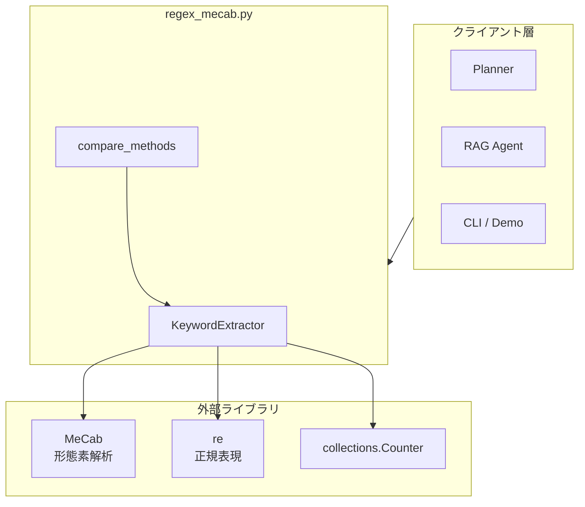
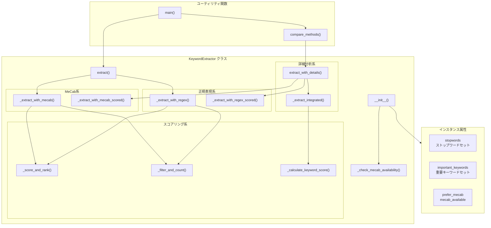
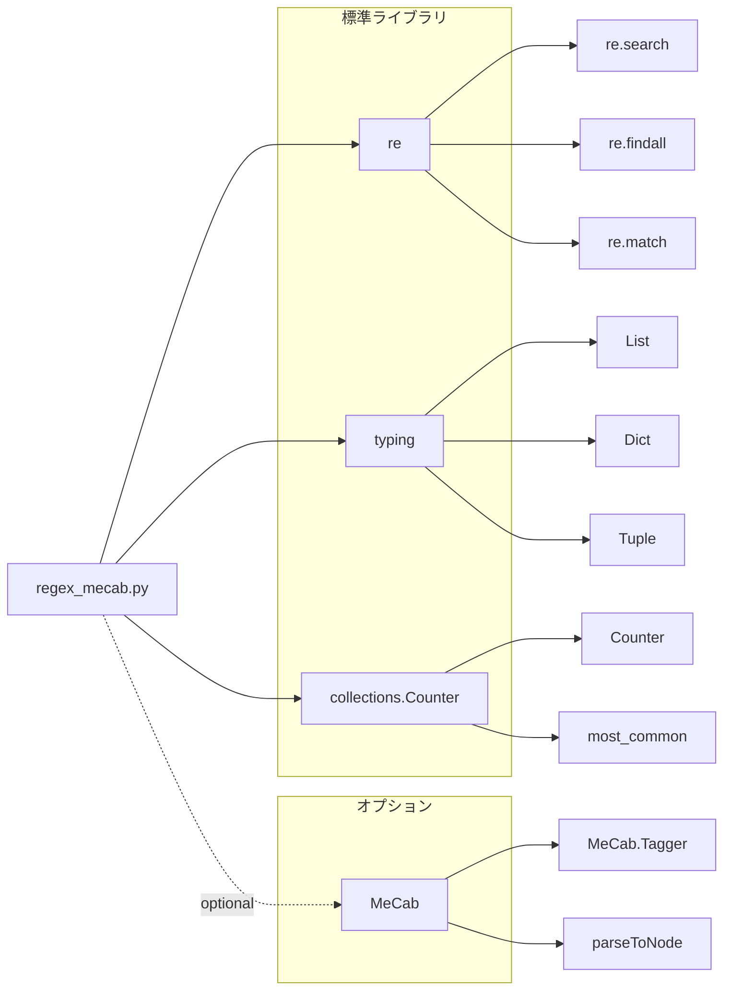

# regex_mecab.py - キーワード抽出モジュール ドキュメント

**Version 1.0** | 最終更新: 2025-01-30

---

## 目次

1. [概要](#概要)
   - [主な責務](#主な責務)
   - [主要機能一覧](#主要機能一覧)
2. [アーキテクチャ構成図](#1-アーキテクチャ構成図)
   - [システム全体構成](#11-システム全体構成)
   - [データフロー](#12-データフロー)
3. [モジュール構成図](#2-モジュール構成図)
   - [内部モジュール構成](#21-内部モジュール構成)
   - [外部依存関係](#22-外部依存関係)
   - [内部依存モジュール](#23-内部依存モジュール)
4. [クラス・関数一覧表](#3-クラス関数一覧表)
   - [クラス一覧](#31-クラス一覧)
   - [関数一覧（カテゴリ別）](#32-関数一覧カテゴリ別)
5. [クラス・関数 IPO詳細](#4-クラス関数-ipo詳細)
   - [KeywordExtractor クラス](#41-keywordextractor-クラス)
   - [ユーティリティ関数](#42-ユーティリティ関数)
6. [設定・定数](#5-設定定数)
   - [stopwords](#51-stopwords)
   - [important_keywords](#52-important_keywords)
   - [スコアリング重み](#53-スコアリング重み)
7. [使用例](#6-使用例)
   - [基本的なワークフロー](#61-基本的なワークフロー)
   - [詳細分析ワークフロー](#62-詳細分析ワークフロー)
   - [手法比較](#63-手法比較)
8. [エクスポート](#7-エクスポート)
9. [変更履歴](#8-変更履歴)
10. [付録: 依存関係図](#付録-依存関係図)
11. [付録: スコアリングアルゴリズム](#付録-スコアリングアルゴリズム)

---

## 概要

`regex_mecab.py`は、MeCabと正規表現を統合したロバストなキーワード抽出モジュールです。MeCabが利用可能な場合は複合名詞抽出を優先し、利用不可の場合は正規表現版に自動フォールバックします。日本語・英語の両方に対応し、言語を自動判定して最適な抽出方法を選択します。

### 主な責務

- テキストからのキーワード抽出（日本語・英語対応）
- MeCabによる複合名詞抽出（日本語テキスト向け）
- 正規表現によるキーワード抽出（フォールバック・英語対応）
- キーワードのスコアリングとランキング
- 抽出手法の比較分析

### 主要機能一覧

| 機能 | 説明 |
|------|------|
| `KeywordExtractor` | キーワード抽出クラス（MeCab＋正規表現統合） |
| `KeywordExtractor.__init__()` | コンストラクタ（MeCab優先設定） |
| `KeywordExtractor.extract()` | キーワード抽出（自動フォールバック） |
| `KeywordExtractor._extract_with_mecab()` | MeCabによる複合名詞抽出 |
| `KeywordExtractor._extract_with_regex()` | 正規表現によるキーワード抽出 |
| `KeywordExtractor._score_and_rank()` | スコアリングベースのランキング |
| `KeywordExtractor._filter_and_count()` | 頻度ベースのフィルタリング |
| `KeywordExtractor.extract_with_details()` | 詳細情報付きキーワード抽出 |
| `KeywordExtractor._calculate_keyword_score()` | キーワードスコア計算 |
| `compare_methods()` | 抽出手法の比較表示 |
| `main()` | デモ実行関数 |

---

## 1. アーキテクチャ構成図

### 1.1 システム全体構成



### 1.2 データフロー

1. クライアントからテキストを受信
2. 言語判定（日本語文字の有無をチェック）
3. MeCab利用可能かつ日本語テキストの場合はMeCabで抽出
4. それ以外の場合は正規表現で抽出
5. スコアリング・ランキングを実施
6. キーワードリストを返却

---

## 2. モジュール構成図

### 2.1 内部モジュール構成



### 2.2 外部依存関係

| ライブラリ | バージョン | 用途 | 必須 |
|-----------|-----------|------|:----:|
| `re` | 標準ライブラリ | 正規表現によるパターンマッチング | ✅ |
| `typing` | 標準ライブラリ | 型ヒント | ✅ |
| `collections` | 標準ライブラリ | Counter（頻度カウント） | ✅ |
| `MeCab` | 0.996.x | 日本語形態素解析 | ⚪ |

### 2.3 内部依存モジュール

| モジュール | 用途 |
|-----------|------|
| なし | 外部モジュールへの依存なし（スタンドアロン） |

---

## 3. クラス・関数一覧表

### 3.1 クラス一覧

#### KeywordExtractor

| メソッド | 概要 |
|---------|------|
| `__init__(prefer_mecab)` | コンストラクタ（MeCab優先設定） |
| `_check_mecab_availability()` | MeCab利用可能性チェック |
| `extract(text, top_n, use_scoring)` | キーワード抽出（自動フォールバック） |
| `_extract_with_mecab(text, top_n, use_scoring)` | MeCabによる複合名詞抽出 |
| `_extract_with_regex(text, top_n, use_scoring)` | 正規表現によるキーワード抽出 |
| `_filter_and_count(words, top_n)` | 頻度ベースのフィルタリング |
| `_score_and_rank(words, top_n)` | スコアリングベースのランキング |
| `extract_with_details(text, top_n)` | 詳細情報付きキーワード抽出 |
| `_extract_with_mecab_scored(text, top_n)` | MeCab版（スコア付き） |
| `_extract_with_regex_scored(text, top_n)` | 正規表現版（スコア付き） |
| `_extract_integrated(text, top_n)` | 統合版抽出 |
| `_calculate_keyword_score(keyword, text)` | キーワードスコア計算 |

### 3.2 関数一覧（カテゴリ別）

#### ユーティリティ関数

| 関数名 | 概要 |
|-------|------|
| `compare_methods(text, top_n)` | 各抽出手法を比較して結果を表示 |
| `main()` | デモ実行関数 |

---

## 4. クラス・関数 IPO詳細

### 4.1 KeywordExtractor クラス

MeCabと正規表現を統合したキーワード抽出クラス。MeCabが利用可能な場合は複合名詞抽出を優先し、利用不可の場合は正規表現版に自動フォールバックします。

#### コンストラクタ: `__init__`

**概要**: KeywordExtractorインスタンスを初期化します。MeCabの利用可能性をチェックし、ストップワードと重要キーワードのセットを設定します。

```python
KeywordExtractor(prefer_mecab: bool = True)
```

| パラメータ | 型 | デフォルト | 説明 |
|------------|------|-----------|------|
| `prefer_mecab` | bool | True | MeCabを優先的に使用するか |

| 項目 | 内容 |
|------|------|
| **Input** | `prefer_mecab: bool = True` |
| **Process** | 1. prefer_mecab設定を保存<br>2. _check_mecab_availability()でMeCab利用可能性をチェック<br>3. stopwords（日本語＋英語）セットを初期化<br>4. important_keywords（AI関連用語）セットを初期化<br>5. MeCab利用状況をコンソール出力 |
| **Output** | KeywordExtractorインスタンス |

**インスタンス属性**:

| 属性 | 型 | 説明 |
|-----|-----|------|
| `prefer_mecab` | bool | MeCab優先フラグ |
| `mecab_available` | bool | MeCab利用可能フラグ |
| `stopwords` | set | ストップワードセット（日本語＋英語） |
| `important_keywords` | set | 重要キーワードセット（スコアブースト用） |

```python
# 使用例
from regex_mecab import KeywordExtractor

# デフォルト（MeCab優先）
extractor = KeywordExtractor()
# ✅ MeCabが利用可能です（複合名詞抽出モード）

# MeCabを使用しない
extractor = KeywordExtractor(prefer_mecab=False)
```

---

#### メソッド: `_check_mecab_availability`

**概要**: MeCabの利用可能性をチェックします。インポートとインスタンス化の両方を試行し、動作確認を行います。

```python
def _check_mecab_availability(self) -> bool
```

| 項目 | 内容 |
|------|------|
| **Input** | なし（selfのみ） |
| **Process** | 1. MeCabモジュールをインポート<br>2. MeCab.Tagger()をインスタンス化<br>3. テスト文字列で動作確認<br>4. 例外発生時はFalseを返却 |
| **Output** | `bool`: MeCabが利用可能ならTrue |

**戻り値例**:
```python
True   # MeCabが正常に動作
False  # ImportErrorまたはRuntimeError発生
```

---

#### メソッド: `extract`

**概要**: テキストからキーワードを抽出します。言語を自動判定し、MeCabまたは正規表現で抽出を行います。

```python
def extract(
    self,
    text: str,
    top_n: int = 5,
    use_scoring: bool = True
) -> List[str]
```

| パラメータ | 型 | デフォルト | 説明 |
|------------|------|-----------|------|
| `text` | str | - | 分析対象テキスト |
| `top_n` | int | 5 | 抽出するキーワード数 |
| `use_scoring` | bool | True | スコアリングを使用するか |

| 項目 | 内容 |
|------|------|
| **Input** | `text: str`, `top_n: int = 5`, `use_scoring: bool = True` |
| **Process** | 1. 言語判定（日本語文字の有無をチェック）<br>2. MeCab利用可能＆日本語の場合→_extract_with_mecab()<br>3. それ以外→_extract_with_regex()<br>4. MeCabエラー時は正規表現にフォールバック |
| **Output** | `List[str]`: キーワードリスト |

**戻り値例**:
```python
["人工知能", "機械学習", "深層学習", "自然言語処理", "トランスフォーマー"]
```

```python
# 使用例
extractor = KeywordExtractor()

# 日本語テキスト
text_jp = "人工知能（AI）は、機械学習と深層学習を基盤として発展しています。"
keywords = extractor.extract(text_jp, top_n=5)
print(keywords)
# ['人工知能', '機械学習', '深層学習', 'AI', '基盤']

# 英語テキスト
text_en = "Artificial intelligence is based on machine learning and deep learning."
keywords = extractor.extract(text_en, top_n=5)
print(keywords)
# ['Artificial', 'intelligence', 'machine', 'learning', 'deep']
```

---

#### メソッド: `_extract_with_mecab`

**概要**: MeCabを使用して複合名詞を抽出します。連続する名詞を結合して複合名詞を生成します。

```python
def _extract_with_mecab(
    self,
    text: str,
    top_n: int,
    use_scoring: bool
) -> List[str]
```

| パラメータ | 型 | デフォルト | 説明 |
|------------|------|-----------|------|
| `text` | str | - | 分析対象テキスト |
| `top_n` | int | - | 抽出するキーワード数 |
| `use_scoring` | bool | - | スコアリングを使用するか |

| 項目 | 内容 |
|------|------|
| **Input** | `text: str`, `top_n: int`, `use_scoring: bool` |
| **Process** | 1. MeCab.Tagger()でテキストを解析<br>2. 連続する名詞をバッファに蓄積<br>3. 名詞以外が出現したらバッファをフラッシュ<br>4. 複合名詞リストを生成<br>5. use_scoring=Trueなら_score_and_rank()、Falseなら_filter_and_count() |
| **Output** | `List[str]`: 複合名詞キーワードリスト |

**戻り値例**:
```python
["自然言語処理", "機械学習", "深層学習", "大規模言語モデル", "医療診断"]
```

---

#### メソッド: `_extract_with_regex`

**概要**: 正規表現を使用してキーワードを抽出します。カタカナ語、漢字複合語、英数字をパターンマッチングで抽出します。

```python
def _extract_with_regex(
    self,
    text: str,
    top_n: int,
    use_scoring: bool
) -> List[str]
```

| パラメータ | 型 | デフォルト | 説明 |
|------------|------|-----------|------|
| `text` | str | - | 分析対象テキスト |
| `top_n` | int | - | 抽出するキーワード数 |
| `use_scoring` | bool | - | スコアリングを使用するか |

| 項目 | 内容 |
|------|------|
| **Input** | `text: str`, `top_n: int`, `use_scoring: bool` |
| **Process** | 1. 正規表現パターンでマッチング<br>   - カタカナ2文字以上: `[ァ-ヴー]{2,}`<br>   - 漢字2文字以上: `[一-龥]{2,}`<br>   - 英数字: `[A-Za-z]{2,}[A-Za-z0-9]*`<br>2. use_scoring=Trueなら_score_and_rank()、Falseなら_filter_and_count() |
| **Output** | `List[str]`: キーワードリスト |

**戻り値例**:
```python
["トランスフォーマー", "モデル", "BERT", "GPT", "NLP"]
```

---

#### メソッド: `_filter_and_count`

**概要**: 頻度ベースでキーワードをフィルタリングします。ストップワードを除外し、出現頻度の高い順にランキングします。

```python
def _filter_and_count(self, words: List[str], top_n: int) -> List[str]
```

| パラメータ | 型 | デフォルト | 説明 |
|------------|------|-----------|------|
| `words` | List[str] | - | 候補単語リスト |
| `top_n` | int | - | 抽出するキーワード数 |

| 項目 | 内容 |
|------|------|
| **Input** | `words: List[str]`, `top_n: int` |
| **Process** | 1. ストップワード除外（小文字比較）<br>2. 1文字以下を除外<br>3. Counter()で頻度カウント<br>4. most_common()で上位N件を取得 |
| **Output** | `List[str]`: 頻度順キーワードリスト |

---

#### メソッド: `_score_and_rank`

**概要**: スコアリングベースでキーワードをランキングします。頻度、長さ、重要度、文字種を考慮した総合スコアを算出します。

```python
def _score_and_rank(self, words: List[str], top_n: int) -> List[str]
```

| パラメータ | 型 | デフォルト | 説明 |
|------------|------|-----------|------|
| `words` | List[str] | - | 候補単語リスト |
| `top_n` | int | - | 抽出するキーワード数 |

| 項目 | 内容 |
|------|------|
| **Input** | `words: List[str]`, `top_n: int` |
| **Process** | 1. ストップワード・1文字以下を除外<br>2. 各単語のスコアを計算（頻度＋長さ＋重要度＋文字種）<br>3. スコア降順でソート<br>4. 上位N件を返却 |
| **Output** | `List[str]`: スコア順キーワードリスト |

**スコアリング詳細**: [付録: スコアリングアルゴリズム](#付録-スコアリングアルゴリズム)を参照

---

#### メソッド: `extract_with_details`

**概要**: 詳細情報付きでキーワードを抽出します。各抽出手法（MeCab、正規表現、統合版）の結果とスコアを比較分析用に返します。

```python
def extract_with_details(
    self,
    text: str,
    top_n: int = 10
) -> Dict[str, List[Tuple[str, float]]]
```

| パラメータ | 型 | デフォルト | 説明 |
|------------|------|-----------|------|
| `text` | str | - | 分析対象テキスト |
| `top_n` | int | 10 | 抽出するキーワード数 |

| 項目 | 内容 |
|------|------|
| **Input** | `text: str`, `top_n: int = 10` |
| **Process** | 1. 言語判定<br>2. MeCab版でスコア付き抽出<br>3. 正規表現版でスコア付き抽出<br>4. 統合版でスコア付き抽出<br>5. 結果を辞書にまとめて返却 |
| **Output** | `Dict[str, List[Tuple[str, float]]]`: 手法別の(キーワード, スコア)リスト |

**戻り値例**:
```python
{
    'MeCab複合名詞': [('自然言語処理', 0.85), ('機械学習', 0.75), ...],
    '正規表現': [('トランスフォーマー', 0.70), ('BERT', 0.65), ...],
    '統合版': [('自然言語処理', 0.85), ('トランスフォーマー', 0.70), ...]
}
```

```python
# 使用例
extractor = KeywordExtractor()
text = "人工知能（AI）は、機械学習と深層学習を基盤として発展しています。"
results = extractor.extract_with_details(text, top_n=5)

for method, keywords in results.items():
    print(f"\n【{method}】")
    for keyword, score in keywords:
        print(f"  {keyword}: {score:.3f}")
```

---

#### メソッド: `_extract_integrated`

**概要**: MeCabと正規表現の結果をマージして統合版の抽出を行います。両手法の結果を統合し、統一スコアでランキングします。

```python
def _extract_integrated(
    self,
    text: str,
    top_n: int
) -> List[Tuple[str, float]]
```

| パラメータ | 型 | デフォルト | 説明 |
|------------|------|-----------|------|
| `text` | str | - | 分析対象テキスト |
| `top_n` | int | - | 抽出するキーワード数 |

| 項目 | 内容 |
|------|------|
| **Input** | `text: str`, `top_n: int` |
| **Process** | 1. MeCabから抽出（日本語の場合、top_n*2件）<br>2. 正規表現から抽出（top_n*2件）<br>3. 結果をセットでマージ<br>4. 各キーワードの統合スコアを計算<br>5. スコア降順でソートして上位N件を返却 |
| **Output** | `List[Tuple[str, float]]`: (キーワード, スコア)のリスト |

---

#### メソッド: `_calculate_keyword_score`

**概要**: キーワードの総合スコアを計算します。頻度、長さ、重要キーワード一致、文字種を考慮してスコアを算出します。

```python
def _calculate_keyword_score(self, keyword: str, text: str) -> float
```

| パラメータ | 型 | デフォルト | 説明 |
|------------|------|-----------|------|
| `keyword` | str | - | スコア計算対象のキーワード |
| `text` | str | - | 元のテキスト（頻度計算用） |

| 項目 | 内容 |
|------|------|
| **Input** | `keyword: str`, `text: str` |
| **Process** | 1. ストップワードチェック（該当すれば0.0）<br>2. 頻度スコア計算（最大0.3）<br>3. 長さスコア計算（最大0.2）<br>4. 重要キーワードブースト（+0.4）<br>5. 文字種スコア計算（最大0.2）<br>6. 合計を1.0以下にクリップ |
| **Output** | `float`: スコア（0.0-1.0） |

**戻り値例**:
```python
0.85  # 重要キーワードに該当し、頻度も高い場合
```

---

### 4.2 ユーティリティ関数

#### `compare_methods`

**概要**: 各抽出手法を比較して結果をコンソールに表示します。デバッグや手法選定の参考用です。

```python
def compare_methods(text: str, top_n: int = 10)
```

| パラメータ | 型 | デフォルト | 説明 |
|------------|------|-----------|------|
| `text` | str | - | 分析対象テキスト |
| `top_n` | int | 10 | 抽出するキーワード数 |

| 項目 | 内容 |
|------|------|
| **Input** | `text: str`, `top_n: int = 10` |
| **Process** | 1. KeywordExtractorインスタンスを作成<br>2. extract_with_details()で各手法の結果を取得<br>3. 手法ごとにキーワードとスコアを整形出力 |
| **Output** | なし（コンソール出力） |

```python
# 使用例
from regex_mecab import compare_methods

text = "人工知能（AI）は、機械学習と深層学習を基盤として発展しています。"
compare_methods(text, top_n=5)

# 出力例:
# ================================================================================
# キーワード抽出手法の比較 (Text: 人工知能（AI）は、機械学習と深層学習を基...)
# ================================================================================
#
# 【MeCab複合名詞】
# --------------------------------------------------------------------------------
#    1. 人工知能              (スコア: 0.850)
#    2. 機械学習              (スコア: 0.750)
# ...
```

---

#### `main`

**概要**: デモ実行関数。日本語・英語のサンプルテキストでキーワード抽出をテストします。

```python
def main()
```

| 項目 | 内容 |
|------|------|
| **Input** | なし |
| **Process** | 1. 日本語・英語のサンプルテキストを定義<br>2. KeywordExtractorインスタンスを作成<br>3. 各言語でextract()とcompare_methods()を実行<br>4. 結果をコンソール出力 |
| **Output** | なし（コンソール出力） |

```python
# 使用例
if __name__ == "__main__":
    main()
```

---

## 5. 設定・定数

### 5.1 stopwords

ストップワードセット（日本語＋英語）。キーワード抽出時に除外される一般的な単語です。

```python
stopwords = {
    # 日本語
    'こと', 'もの', 'これ', 'それ', 'ため', 'よう', 'さん',
    'ます', 'です', 'ある', 'いる', 'する', 'なる', 'できる',
    'いう', '的', 'な', 'に', 'を', 'は', 'が', 'で', 'と',
    'の', 'から', 'まで', '等', 'など', 'よる', 'おく', 'くる',
    # 英語
    'the', 'is', 'are', 'was', 'were', 'be', 'been', 'being',
    'have', 'has', 'had', 'having', 'do', 'does', 'did', 'done',
    'a', 'an', 'and', 'but', 'or', 'as', 'if', 'when',
    'at', 'by', 'for', 'with', 'about', 'against', 'between',
    # ... (その他多数)
}
```

### 5.2 important_keywords

重要キーワードセット（スコアブースト用）。これらのキーワードに部分一致する場合、スコアが加算されます。

```python
important_keywords = {
    'AI', 'Artificial Intelligence', 'Machine Learning', 'Deep Learning',
    'NLP', 'Natural Language Processing', 'Transformer', 'BERT', 'GPT',
    'CNN', 'Vision', '医療', 'Diagnosis', 'Autonomous Driving',
    'Ethics', 'Bias', 'Challenges', 'Issues', 'Model', 'Data'
}
```

### 5.3 スコアリング重み

`_score_and_rank()`メソッドで使用されるスコアリング重み:

| 要素 | 重み | 最大値 | 説明 |
|-----|------|-------|------|
| 頻度スコア | 0.3 | 0.3 | 出現回数/3.0（最大3回で上限） |
| 長さスコア | 0.3 | 0.3 | 文字数/8.0（8文字以上で上限） |
| 重要キーワード | 0.5 | 0.5 | important_keywordsに部分一致 |
| 文字種スコア | 0.1-0.3 | 0.3 | カタカナ/英大文字/漢字等 |

**文字種スコア詳細**:

| パターン | スコア | 説明 |
|---------|--------|------|
| `[ァ-ヴー]{3,}` | +0.2 | カタカナ3文字以上 |
| `[A-Z]{2,}` | +0.3 | 英大文字2文字以上（頭字語） |
| `[A-Z][a-z]+` | +0.1 | 英語固有名詞（大文字始まり） |
| `[一-龥]{4,}` | +0.2 | 漢字4文字以上 |

---

## 6. 使用例

### 6.1 基本的なワークフロー

```python
from regex_mecab import KeywordExtractor

# 1. インスタンス作成
extractor = KeywordExtractor()

# 2. キーワード抽出
text = """
人工知能（AI）は、機械学習と深層学習を基盤として急速に発展しています。
特に自然言語処理（NLP）の分野では、トランスフォーマーモデルが革命的な成果を上げました。
BERTやGPTなどの大規模言語モデルは、文脈理解能力を大幅に向上させています。
"""

keywords = extractor.extract(text, top_n=10)
print(keywords)
# ['人工知能', '機械学習', '深層学習', '自然言語処理', 'AI',
#  'トランスフォーマー', 'BERT', 'GPT', '大規模言語モデル', '文脈理解能力']
```

### 6.2 詳細分析ワークフロー

```python
from regex_mecab import KeywordExtractor

extractor = KeywordExtractor()

text = "AIは医療診断から自動運転まで幅広く応用されています。"

# 詳細情報付きで抽出
results = extractor.extract_with_details(text, top_n=5)

for method, keywords in results.items():
    print(f"\n【{method}】")
    for keyword, score in keywords:
        print(f"  {keyword:15s} スコア: {score:.3f}")

# 出力例:
# 【MeCab複合名詞】
#   医療診断         スコア: 0.750
#   自動運転         スコア: 0.700
#   AI              スコア: 0.650
# ...
```

### 6.3 手法比較

```python
from regex_mecab import compare_methods

text = """
Artificial intelligence (AI) is rapidly advancing based on machine learning.
Large language models like BERT and GPT have significantly enhanced NLP capabilities.
"""

# 各手法の比較結果を表示
compare_methods(text, top_n=5)
```

---

## 7. エクスポート

`regex_mecab.py`では明示的な`__all__`は定義されていませんが、以下が主要なエクスポート対象です：

```python
# 推奨エクスポート
__all__ = [
    # クラス
    "KeywordExtractor",
    # ユーティリティ関数
    "compare_methods",
    "main",
]
```

---

## 8. 変更履歴

| バージョン | 変更内容 |
|-----------|---------|
| 1.0 | 初版作成 |

---

## 付録: 依存関係図



---

## 付録: スコアリングアルゴリズム

### `_score_and_rank()`のスコア計算式

```
総合スコア = 頻度スコア + 長さスコア + 重要キーワードブースト + 文字種スコア
```

#### 1. 頻度スコア（最大0.3）
```python
freq_score = min(freq / 3.0, 1.0) * 0.3
```
- 出現回数を3で割り、1.0を上限とする
- 0.3を乗じて最終スコアを算出

#### 2. 長さスコア（最大0.3）
```python
length_score = min(len(word) / 8.0, 1.0) * 0.3
```
- 文字数を8で割り、1.0を上限とする
- 複合語（長い単語）を優遇

#### 3. 重要キーワードブースト（+0.5）
```python
if any(imp.lower() in word.lower() for imp in important_keywords):
    score += 0.5
```
- `important_keywords`に部分一致すれば+0.5

#### 4. 文字種スコア（最大0.3）
```python
if re.match(r'^[ァ-ヴー]{3,}$', word):      # カタカナ3文字以上
    score += 0.2
elif re.match(r'^[A-Z]{2,}$', word):        # 英大文字2文字以上
    score += 0.3
elif re.match(r'^[A-Z][a-z]+$', word):      # 英固有名詞
    score += 0.1
elif re.match(r'^[一-龥]{4,}$', word):      # 漢字4文字以上
    score += 0.2
```

### `_calculate_keyword_score()`との違い

| 項目 | `_score_and_rank()` | `_calculate_keyword_score()` |
|-----|---------------------|------------------------------|
| 長さスコア重み | 0.3 | 0.2 |
| 重要キーワードブースト | +0.5 | +0.4 |
| 文字種スコア | +0.1〜0.3 | +0.1〜0.2 |
| 用途 | 内部ランキング | 詳細分析・統合版 |
