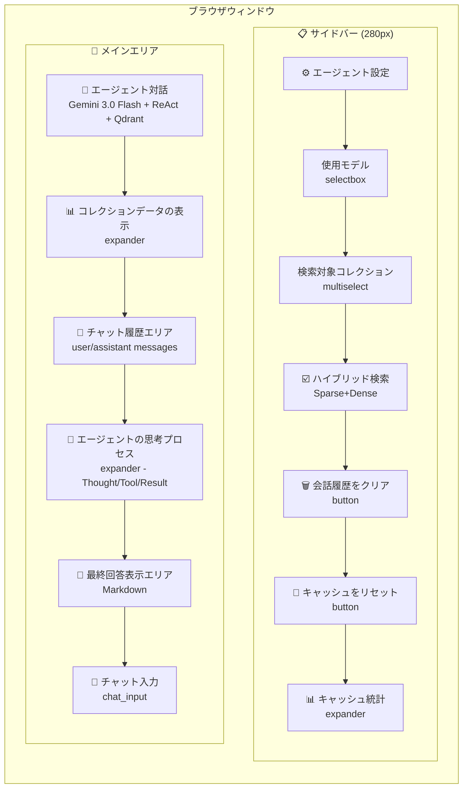
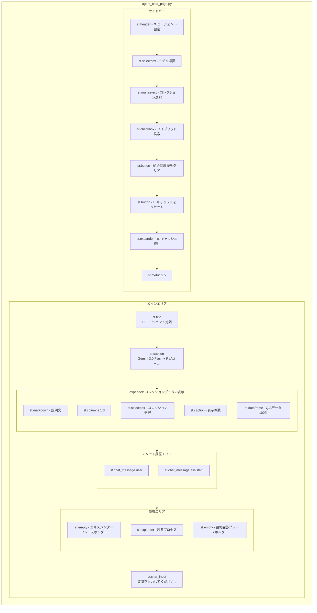
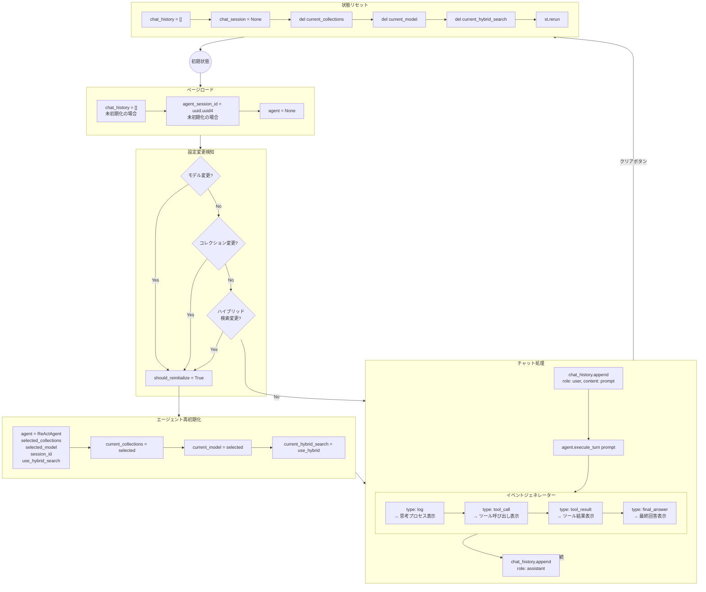
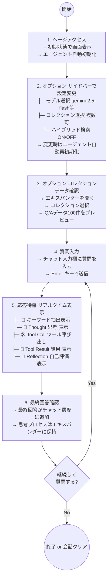
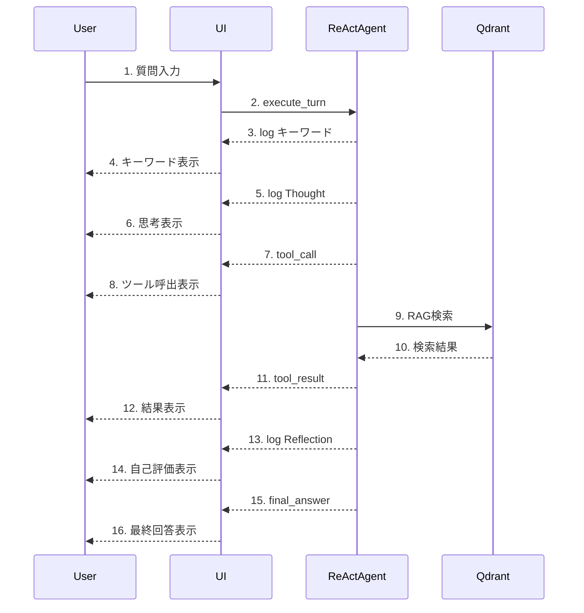
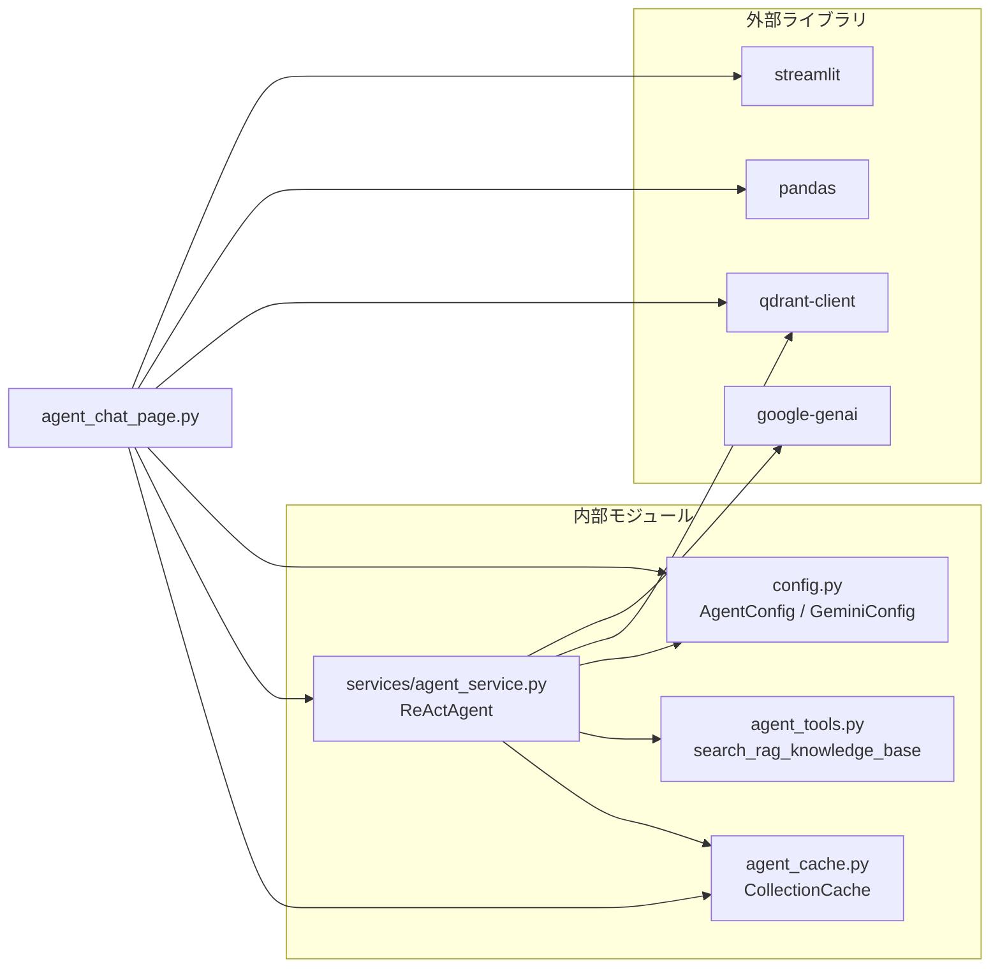
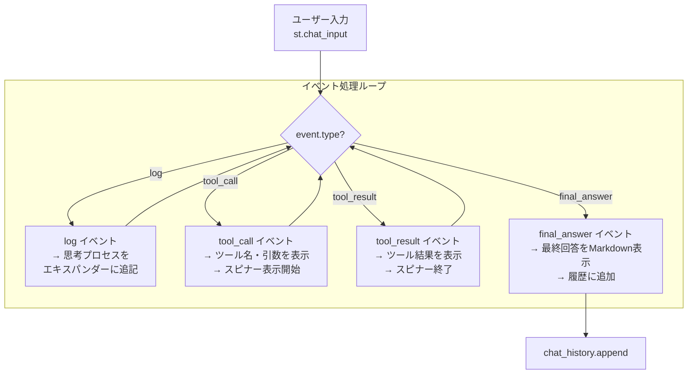

# agent_chat_page.py - ハイブリッド・ナレッジ・エージェント チャット画面 ドキュメント

**Version 1.1** | 最終更新: 2025-01-29

---

## 目次

1. [概要](#概要)
2. [画面レイアウト図](#1-画面レイアウト図)
3. [UIコンポーネント詳細](#2-uiコンポーネント詳細)
4. [セッション状態管理](#3-セッション状態管理)
5. [ユーザー操作フロー](#4-ユーザー操作フロー)
6. [関数一覧表](#5-関数一覧表)
7. [関数 IPO詳細](#6-関数-ipo詳細)
8. [依存関係](#7-依存関係)
9. [イベント処理](#8-イベント処理)
10. [エラーハンドリング](#9-エラーハンドリング)
11. [使用例](#10-使用例)
12. [変更履歴](#11-変更履歴)

---

## 概要

`agent_chat_page.py`は、Gemini API を使用した ReAct 型エージェントとの対話インターフェースを提供する Streamlit ページです。Qdrant 上のナレッジベース（コレクション）を動的に選択し、RAG（Retrieval-Augmented Generation）検索を行いながらユーザーの質問に回答します。

### 主な責務

- ユーザーからの質問入力の受付とエージェントへの送信
- ReAct エージェントの思考プロセス（Thought-Action-Observation）のリアルタイム可視化
- 会話履歴の管理とセッション状態の維持
- 検索対象コレクションの選択と設定
- ハイブリッド検索（Dense + Sparse）の切り替え
- キャッシュ統計の表示と管理

### 主要機能一覧

| 機能 | 説明 |
|------|------|
| `show_agent_chat_page()` | メインページ表示関数 |
| サイドバー設定 | モデル選択、コレクション選択、ハイブリッド検索、キャッシュ管理 |
| コレクションデータ表示 | Qdrantコレクション内のQ/Aデータプレビュー（100件） |
| チャット履歴表示 | 会話履歴のストリーミング表示 |
| 思考プロセス表示 | エージェント推論（Thought/Tool Call/Tool Result）のリアルタイム表示 |
| キャッシュ統計 | セッション単位のキャッシュヒット状況の表示 |

---

## 1. 画面レイアウト図

### 1.1 全体レイアウト



### 1.2 コンポーネント配置図



---

## 2. UIコンポーネント詳細

### 2.1 サイドバー

| コンポーネント | 種類 | キー | デフォルト値 | 説明 |
|---------------|------|------|-------------|------|
| エージェント設定ヘッダー | `st.header` | - | - | セクションヘッダー |
| モデル選択 | `st.selectbox` | - | `AgentConfig.MODEL_NAME` (`gemini-2.5-flash`) | 使用するLLMモデル |
| コレクション選択 | `st.multiselect` | - | 全コレクション | 検索対象コレクション（複数選択可） |
| ハイブリッド検索 | `st.checkbox` | - | `True` | Sparse+Dense検索の有効化 |
| 会話履歴クリア | `st.button` | - | - | 会話履歴とエージェント状態のクリア |
| キャッシュリセット | `st.button` | - | - | セッションキャッシュのクリア |
| キャッシュ統計 | `st.expander` | - | 折りたたみ | キャッシュ状態の詳細表示 |

#### モデル選択の詳細

```python
selected_model = st.selectbox(
    "使用モデル (Model)",
    options=GeminiConfig.AVAILABLE_MODELS,
    index=GeminiConfig.AVAILABLE_MODELS.index(AgentConfig.MODEL_NAME)
    if AgentConfig.MODEL_NAME in GeminiConfig.AVAILABLE_MODELS else 0
)
```

**オプション一覧** (`GeminiConfig.AVAILABLE_MODELS`):

| モデル名 | 説明 |
|---------|------|
| `gemini-2.5-flash` | デフォルト・高速推論モデル |
| `gemini-3-pro-preview` | 最新Pro（思考モード対応） |
| `gemini-3-pro-image-preview` | 画像対応Pro |
| `gemini-2.5-flash-preview` | プレビュー版Flash |
| `gemini-2.5-pro-preview` | プレビュー版Pro |
| `gemini-2.0-flash` | 安定版Flash |

#### コレクション選択の詳細

```python
selected_collections = st.multiselect(
    "検索対象コレクション (Target Collections)",
    options=all_collections,
    default=all_collections if all_collections != ["(None)"] else [],
    help="エージェントが検索ツールを使用する際に、候補として提示されるコレクションです。"
)
```

#### キャッシュ統計の詳細

| メトリクス | 説明 |
|-----------|------|
| キャッシュ状態 | 🟢 ヒット / ⚪ なし |
| コレクション | 前回ヒットしたコレクション名 |
| 前回スコア | 前回検索時の最高スコア |
| ヒット回数 | キャッシュヒットの累計回数 |
| 経過時間 | キャッシュ作成からの経過秒数 |

### 2.2 メインエリア

| コンポーネント | 種類 | 説明 |
|---------------|------|------|
| タイトル | `st.title` | "🤖 エージェント対話 (Agent Chat)" |
| キャプション | `st.caption` | "Gemini 3.0 Flash + ReAct + Qdrant Hybrid RAG (Dense + Sparse)" |
| コレクションデータ表示 | `st.expander` | Q/Aデータプレビュー（折りたたみ） |
| チャット履歴 | `st.chat_message` | ユーザー/アシスタントメッセージの表示 |
| 思考プロセス | `st.expander` | エージェント推論のリアルタイム表示 |
| 最終回答 | `st.markdown` | エージェントの最終回答表示 |
| チャット入力 | `st.chat_input` | ユーザー入力フィールド |

### 2.3 エキスパンダー

| エキスパンダー名 | 初期状態 | 内容 |
|-----------------|---------|------|
| 📊 コレクションデータの表示 | 折りたたみ | コレクション選択、データフレーム（100件） |
| 🤔 エージェントの思考プロセス | 展開 | Thought, Tool Call, Tool Result のリアルタイム表示 |
| 📊 キャッシュ統計 | 折りたたみ | キャッシュヒット状態、統計メトリクス |

### 2.4 データフレーム表示設定

```python
st.dataframe(
    df_preview,
    width='stretch',
    hide_index=True,
    height=600,
    column_config={
        "ID"      : st.column_config.NumberColumn("ID", width="small"),
        "Question": st.column_config.TextColumn("質問 (Question)", width="medium"),
        "Answer"  : st.column_config.TextColumn("回答 (Answer)", width="large")
    }
)
```

---

## 3. セッション状態管理

### 3.1 状態一覧

| キー | 型 | 初期値 | 説明 | リセット条件 |
|-----|-----|-------|------|-------------|
| `chat_history` | `List[Dict[str, str]]` | `[]` | 会話履歴 `[{"role": "user"/"assistant", "content": "..."}]` | クリアボタン |
| `chat_session` | - | `None` | （非推奨）チャットセッション | クリアボタン |
| `agent_session_id` | `str` | `uuid.uuid4()` | セッション識別子（キャッシュ用） | ページリロード |
| `agent` | `ReActAgent` | `None` | エージェントインスタンス | 設定変更時 |
| `current_collections` | `List[str]` | - | 現在選択中のコレクションリスト | コレクション変更時 |
| `current_model` | `str` | - | 現在選択中のモデル名 | モデル変更時 |
| `current_hybrid_search` | `bool` | - | 現在のハイブリッド検索設定 | チェックボックス変更時 |

### 3.2 状態遷移図



### 3.3 初期化・リセット条件

| 条件 | 対象状態 | 処理 |
|------|---------|------|
| ページ初回ロード | `chat_history`, `agent_session_id` | デフォルト値で初期化 |
| モデル変更 | `agent`, `current_model` | エージェント再初期化、トースト通知 |
| コレクション変更 | `agent`, `current_collections` | エージェント再初期化、トースト通知 |
| ハイブリッド検索変更 | `agent`, `current_hybrid_search` | エージェント再初期化、トースト通知 |
| 会話履歴クリアボタン | `chat_history`, `chat_session`, `current_*` | 全状態クリア後 `st.rerun()` |
| キャッシュリセットボタン | キャッシュのみ | `collection_cache.clear(session_id)` |

---

## 4. ユーザー操作フロー

### 4.1 基本操作フロー



### 4.2 操作シーケンス図



---

## 5. 関数一覧表

### 5.1 メイン関数

| 関数名 | 概要 |
|-------|------|
| `show_agent_chat_page()` | ページ全体のレンダリングと制御 |

### 5.2 ヘルパー関数（インポート）

| 関数名 | モジュール | 概要 |
|-------|-----------|------|
| `get_available_collections_from_qdrant_helper()` | `services.agent_service` | Qdrantコレクション一覧取得 |
| `ReActAgent` | `services.agent_service` | ReAct型エージェントクラス |
| `collection_cache` | `agent_cache` | コレクションキャッシュマネージャー |

---

## 6. 関数 IPO詳細

### 6.1 `show_agent_chat_page`

**概要**: エージェントチャットページのメイン表示関数。サイドバー設定、コレクションプレビュー、チャット履歴、ユーザー入力処理を統合管理する。

```python
def show_agent_chat_page() -> None
```

| 項目 | 内容 |
|------|------|
| **Input** | なし（セッション状態およびQdrantから取得） |
| **Process** | 1. コレクションデータ表示エキスパンダーの描画<br>2. サイドバー設定UIの描画<br>3. セッション状態の初期化・更新チェック<br>4. エージェントの初期化（必要時）<br>5. チャット履歴の表示<br>6. ユーザー入力の処理<br>7. エージェント応答のストリーミング表示 |
| **Output** | なし（画面描画のみ） |

**主要処理フロー**:

```python
def show_agent_chat_page():
    st.title("🤖 エージェント対話 (Agent Chat)")
    st.caption("Gemini 3.0 Flash + ReAct + Qdrant Hybrid RAG (Dense + Sparse)")

    # 1. コレクションデータの表示エリア
    with st.expander("📊 コレクションデータの表示", expanded=False):
        # Qdrantからデータ取得・表示
        ...

    # 2. サイドバー設定
    with st.sidebar:
        st.header("⚙️ エージェント設定")
        selected_model = st.selectbox(...)
        selected_collections = st.multiselect(...)
        use_hybrid_search = st.checkbox(...)
        # クリア/リセットボタン
        ...

    # 3. セッション状態初期化
    if "chat_history" not in st.session_state:
        st.session_state.chat_history = []
    if "agent_session_id" not in st.session_state:
        st.session_state.agent_session_id = str(uuid.uuid4())

    # 4. 設定変更検知とエージェント初期化
    should_reinitialize = False
    # モデル/コレクション/ハイブリッド検索の変更チェック
    ...
    if should_reinitialize or "agent" not in st.session_state:
        st.session_state.agent = ReActAgent(
            selected_collections,
            selected_model,
            session_id=st.session_state.agent_session_id,
            use_hybrid_search=use_hybrid_search
        )

    # 5. チャット履歴表示
    for message in st.session_state.chat_history:
        with st.chat_message(message["role"]):
            st.markdown(message["content"])

    # 6. ユーザー入力処理
    if prompt := st.chat_input("質問を入力してください..."):
        st.session_state.chat_history.append({"role": "user", "content": prompt})

        # 7. エージェント応答処理
        with st.chat_message("assistant"):
            for event in st.session_state.agent.execute_turn(prompt):
                if event["type"] == "log":
                    # 思考ログ表示
                elif event["type"] == "tool_call":
                    # ツール呼び出し表示
                elif event["type"] == "tool_result":
                    # ツール結果表示
                elif event["type"] == "final_answer":
                    # 最終回答表示
```

### 6.2 `get_available_collections_from_qdrant_helper`

**概要**: Qdrantから利用可能なコレクション名のリストを取得する。

**参照**: `services/agent_service.py`

```python
def get_available_collections_from_qdrant_helper() -> List[str]
```

| 項目 | 内容 |
|------|------|
| **Input** | なし |
| **Process** | 1. config_serviceからQdrant URLを取得（デフォルト: `http://localhost:6333`）<br>2. QdrantClientで接続<br>3. `client.get_collections()` でコレクション一覧を取得 |
| **Output** | `List[str]`: コレクション名のリスト（エラー時は空リスト） |

**戻り値例**:

```python
["wikipedia_ja_5per", "cc_news_5per", "qa_pairs_custom_upload", "livedoor"]
```

### 6.3 `ReActAgent` クラス

**概要**: ReAct（Reasoning + Acting）パターンを実装したエージェントクラス。Gemini APIとQdrant RAGを統合。

**参照**: `services/agent_service.py`

#### コンストラクタ: `__init__`

```python
def __init__(
    self,
    selected_collections: List[str],
    model_name: str = None,
    session_id: Optional[str] = None,
    use_hybrid_search: bool = True
)
```

| パラメータ | 型 | デフォルト | 説明 |
|------------|------|-----------|------|
| `selected_collections` | `List[str]` | - | 検索対象コレクションのリスト |
| `model_name` | `str` | `gemini-2.5-flash` | 使用するGeminiモデル名 |
| `session_id` | `Optional[str]` | `uuid.uuid4()` | セッション識別子（キャッシュ用） |
| `use_hybrid_search` | `bool` | `True` | ハイブリッド検索（Sparse+Dense）の有効化 |

**インスタンス変数**:

| 変数名 | 型 | 説明 |
|--------|------|------|
| `selected_collections` | `List[str]` | 検索対象コレクションリスト |
| `model_name` | `str` | 使用モデル名 |
| `session_id` | `str` | セッションID |
| `use_hybrid_search` | `bool` | ハイブリッド検索フラグ |
| `client` | `genai.Client` | Google GenAI クライアント |
| `chat` | `Chat` | チャットセッション |
| `thought_log` | `List[str]` | 思考プロセスログ |
| `keyword_extractor` | `KeywordExtractor` | キーワード抽出器（オプション） |

#### メソッド: `execute_turn`

```python
def execute_turn(self, user_input: str) -> Generator[Dict[str, Any], None, None]
```

| 項目 | 内容 |
|------|------|
| **Input** | `user_input: str` - ユーザーの質問テキスト |
| **Process** | 1. キーワード抽出（オプション）<br>2. ReActループ（Thought→Action→Observation）<br>3. ツール実行（search_rag_knowledge_base）<br>4. Reflectionフェーズ<br>5. 最終回答生成 |
| **Output** | `Generator[Dict[str, Any], None, None]`: イベントジェネレーター |

**イベント型一覧**:

| type | content | 説明 |
|------|---------|------|
| `"log"` | ログメッセージ | 思考プロセス、キーワード抽出等 |
| `"tool_call"` | `name`, `args` | ツール呼び出し情報 |
| `"tool_result"` | 結果テキスト | ツール実行結果（最大500文字） |
| `"final_text"` | ReAct結果テキスト | ReActフェーズの出力 |
| `"final_answer"` | 最終回答テキスト | エージェントの最終回答 |

### 6.4 `CollectionCache` クラス

**概要**: 前回の検索成功コレクションをセッション単位でキャッシュ管理。TTL（有効期限）サポート、ヒット回数追跡機能を提供。

**参照**: `agent_cache.py`

#### コンストラクタ: `__init__`

```python
def __init__(self, ttl: int = 300)
```

| パラメータ | 型 | デフォルト | 説明 |
|------------|------|-----------|------|
| `ttl` | `int` | `300` | Time To Live（秒）。デフォルト5分。 |

#### メソッド: `get`

```python
def get(self, session_id: str) -> Optional[CollectionCacheEntry]
```

| 項目 | 内容 |
|------|------|
| **Input** | `session_id: str` - セッションID |
| **Process** | キャッシュ存在確認、有効期限チェック、ヒットカウント増加 |
| **Output** | `Optional[CollectionCacheEntry]`: キャッシュエントリ（存在しない/期限切れの場合は`None`） |

#### メソッド: `set`

```python
def set(self, session_id: str, collection_name: str, score: float, query: str = None)
```

| 項目 | 内容 |
|------|------|
| **Input** | `session_id: str`, `collection_name: str`, `score: float`, `query: str`（オプション） |
| **Process** | 既存スコアより高い場合のみ更新、タイムスタンプ記録 |
| **Output** | なし |

#### メソッド: `get_stats`

```python
def get_stats(self, session_id: str = None) -> Dict
```

| 項目 | 内容 |
|------|------|
| **Input** | `session_id: str` - セッションID（省略時は全体統計） |
| **Process** | キャッシュエントリから統計情報を抽出 |
| **Output** | `Dict`: 統計情報の辞書 |

**戻り値例（個別セッション）**:

```python
{
    "cached"       : True,
    "session_id"   : "abc-123-def",
    "collection"   : "wikipedia_ja_5per",
    "last_score"   : 0.873,
    "hit_count"    : 5,
    "age_seconds"  : 120.5,
    "query_history": ["質問1", "質問2"],
    "expired"      : False
}
```

**戻り値例（全体統計）**:

```python
{
    "total_sessions"      : 10,
    "active_sessions"     : 8,
    "total_hits"          : 45,
    "avg_score"           : 0.756,
    "most_used_collection": "wikipedia_ja_5per",
    "most_used_count"     : 6,
    "ttl"                 : 300
}
```

#### メソッド: `clear`

```python
def clear(self, session_id: str = None) -> None
```

| 項目 | 内容 |
|------|------|
| **Input** | `session_id: str` - セッションID（省略時は全削除） |
| **Process** | 指定セッションまたは全キャッシュを削除 |
| **Output** | なし |

### 6.5 `CollectionCacheEntry` データクラス

**概要**: キャッシュエントリの構造を定義するデータクラス。

```python
@dataclass
class CollectionCacheEntry:
    collection_name: str    # コレクション名
    last_score: float       # 検索スコア
    timestamp: float        # タイムスタンプ（time.time()）
    hit_count: int = 1      # ヒット回数
    query_history: list = None  # 直近のクエリ履歴（オプション）
```

---

## 7. 依存関係

### 7.1 外部ライブラリ

| ライブラリ | バージョン | 用途 |
|-----------|-----------|------|
| `streamlit` | 1.52.1 | UIフレームワーク |
| `pandas` | 2.3.3 | データフレーム表示 |
| `qdrant-client` | 1.16.1 | Qdrant接続 |
| `google-genai` | 1.52.0 | Gemini API SDK |

### 7.2 内部モジュール

| モジュール | 用途 |
|-----------|------|
| `config.AgentConfig` | エージェント設定（MODEL_NAME, RAG_SEARCH_LIMIT等） |
| `config.GeminiConfig` | Geminiモデル設定（AVAILABLE_MODELS, DEFAULT_MODEL等） |

### 7.3 サービス層

| サービス | 用途 |
|---------|------|
| `services.agent_service.ReActAgent` | ReAct型エージェント処理 |
| `services.agent_service.get_available_collections_from_qdrant_helper` | Qdrantコレクション一覧取得 |
| `agent_cache.collection_cache` | コレクションキャッシュ管理（TTL: 300秒） |

### 7.4 設定値参照

| 設定クラス | 設定項目 | 値 | 説明 |
|-----------|---------|-----|------|
| `GeminiConfig` | `AVAILABLE_MODELS` | `["gemini-2.5-flash", ...]` | 利用可能モデル一覧 |
| `GeminiConfig` | `DEFAULT_MODEL` | `"gemini-2.5-flash"` | デフォルトモデル |
| `AgentConfig` | `MODEL_NAME` | `GeminiConfig.DEFAULT_MODEL` | エージェント使用モデル |
| `AgentConfig` | `RAG_SEARCH_LIMIT` | `3` | 検索結果取得件数 |
| `AgentConfig` | `RAG_SCORE_THRESHOLD` | `0.50` | 検索スコア閾値 |

### 7.5 依存関係図



---

## 8. イベント処理

### 8.1 ボタンイベント

| ボタン | イベント | 処理内容 |
|-------|---------|---------|
| 🗑️ 会話履歴をクリア | クリック | `chat_history=[]`、`chat_session=None`、`current_*`削除、`st.rerun()` |
| 🔄 キャッシュをリセット | クリック | `collection_cache.clear(session_id)`、トースト通知「✅ キャッシュをクリアしました」 |

### 8.2 入力イベント

| コンポーネント | イベント | 処理内容 |
|---------------|---------|---------|
| モデル選択 | 変更 | `should_reinitialize = True`、トースト通知「モデルが変更されました: {model}」 |
| コレクション選択 | 変更 | `should_reinitialize = True`、トースト通知「検索対象コレクションが変更されたため、エージェントを再設定します。」 |
| ハイブリッド検索 | 変更 | `should_reinitialize = True`、トースト通知「ハイブリッド検索: 有効/無効」 |
| チャット入力 | Enter | `agent.execute_turn(prompt)` 実行開始 |
| プレビューコレクション選択 | 変更 | Qdrantからデータ取得・表示更新 |

### 8.3 リアルタイム更新

| イベント種別 | 更新内容 |
|-------------|---------|
| `log` | 思考プロセスエキスパンダーに追記（🔑/🧠/🤔） |
| `tool_call` | ツール呼び出し情報を表示（🛠️）、スピナー表示開始 |
| `tool_result` | ツール結果を表示（📝）、スピナー終了 |
| `final_answer` | 最終回答をマークダウン表示、履歴に追加 |

### 8.4 イベント処理フロー



---

## 9. エラーハンドリング

### 9.1 エラー種別

| エラー種別 | 発生条件 | 対処 |
|-----------|---------|------|
| Qdrant接続エラー | サーバー未起動/URL誤り | `st.warning`で警告表示、コレクションリストを`["(None)"]`に設定 |
| エージェント初期化エラー | API認証失敗/ネットワークエラー | `st.error`でエラー表示、処理中断（`return`） |
| チャット処理エラー | API呼び出し失敗/タイムアウト | `st.error`でエラー表示、`logger.error`でログ出力 |
| データ取得エラー | コレクションデータ取得失敗 | `st.error`でエラー表示 |
| コレクション取得エラー | Qdrant接続エラー | 空リストで続行、`st.warning`で警告表示 |
| RAGToolError | RAG検索ツール実行失敗 | ツール結果として「エラーが発生しました: {e}」を返却 |

### 9.2 エラー表示

| 表示種別 | Streamlitコンポーネント | 用途 |
|---------|------------------------|------|
| エラー | `st.error()` | 致命的エラー（初期化失敗、API エラー等） |
| 警告 | `st.warning()` | 注意喚起（コレクション未取得、応答なし等） |
| 情報 | `st.info()` | 補足情報（データなし、セッションIDなし等） |
| トースト | `st.toast()` | 一時的な通知（設定変更、キャッシュクリア等） |

### 9.3 エラー処理コード例

```python
# エージェント初期化エラー
try:
    st.session_state.agent = ReActAgent(
        selected_collections,
        selected_model,
        session_id=st.session_state.agent_session_id,
        use_hybrid_search=use_hybrid_search
    )
    st.toast("エージェントの準備が完了しました（キャッシュ+並列検索）。")
except Exception as e:
    st.error(f"エージェントの初期化に失敗しました: {e}")
    return

# チャット処理エラー
try:
    for event in st.session_state.agent.execute_turn(prompt):
        # イベント処理
        ...
except Exception as e:
    st.error(f"エラーが発生しました: {e}")
    logger.error(f"Chat Error: {e}", exc_info=True)
```

---

## 10. 使用例

### 10.1 基本的な使用方法

1. ページにアクセス（サイドメニューから「エージェント対話」を選択）
2. サイドバーで必要に応じて設定を変更
   - 使用モデルの選択（デフォルト: `gemini-2.5-flash`）
   - 検索対象コレクションの選択（デフォルト: 全コレクション）
   - ハイブリッド検索の有効/無効（デフォルト: 有効）
3. （オプション）「📊 コレクションデータの表示」を開いてデータを確認
4. チャット入力欄に質問を入力してEnter
5. 思考プロセスを確認しながら応答を待機
   - キーワード抽出結果
   - エージェントの思考（Thought）
   - ツール呼び出し（Tool Call）と結果
   - 自己評価（Reflection）
6. 最終回答を確認
7. 必要に応じて追加の質問を続ける

### 10.2 典型的な質問例

```
- 「カリン・フォン・アロルディンゲンについて教えてください」（Wikipediaデータ検索）
- 「最近のテクノロジーニュースで話題になっている企業は？」（CC-Newsデータ検索）
- 「ライブドアニュースで人気の記事のジャンルは？」（Livedoorデータ検索）
- 「こんにちは」（一般的な会話、ツール不使用）
```

### 10.3 設定変更時の動作

| 設定 | 変更時の動作 |
|------|-------------|
| モデル変更 | トースト通知「モデルが変更されました: {model_name}」、エージェント再初期化 |
| コレクション変更 | トースト通知「検索対象コレクションが変更されたため、エージェントを再設定します。」、エージェント再初期化 |
| ハイブリッド検索変更 | トースト通知「ハイブリッド検索: 有効/無効」、エージェント再初期化 |

### 10.4 キャッシュ動作

- **初回検索**: 全コレクションを並列検索し、最高スコアのコレクションをキャッシュに保存
- **2回目以降**: キャッシュヒット時は前回成功したコレクションを優先的に検索
- **TTL（5分）経過後**: キャッシュ自動削除、次回検索で再キャッシュ

---

## 11. 変更履歴

| バージョン | 日付 | 変更内容 |
|-----------|------|---------|
| 1.0 | 2025-01-29 | 初版作成 |
| 1.1 | 2025-01-29 | ASCII図をMermaid v9フローチャートに変更（PyCharm Pro対応） |

---

## 付録: 関連モジュール参照

| モジュール | ファイルパス | 説明 |
|-----------|-------------|------|
| `config.py` | `config.py` | 設定・定数の一元管理（GeminiConfig, AgentConfig） |
| `agent_service.py` | `services/agent_service.py` | ReActAgent、ヘルパー関数 |
| `agent_cache.py` | `agent_cache.py` | コレクションキャッシュマネージャー（CollectionCache） |
| `agent_tools.py` | `agent_tools.py` | RAG検索ツール（search_rag_knowledge_base） |
| `agent_parallel_search.py` | `agent_parallel_search.py` | 並列検索エンジン |
