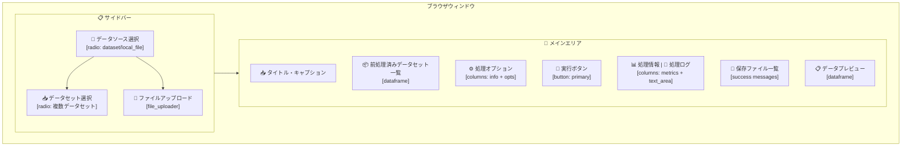
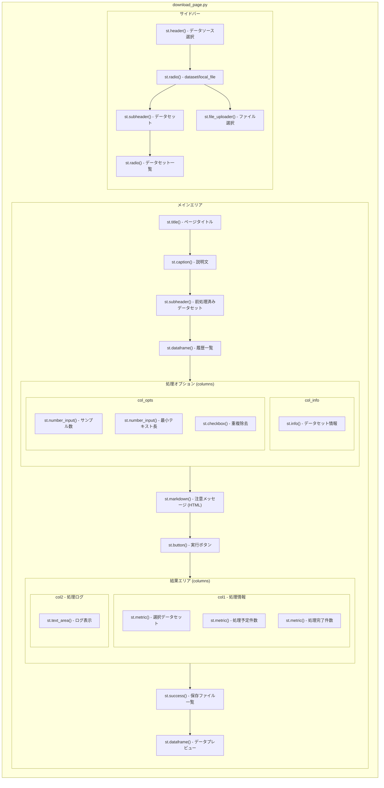
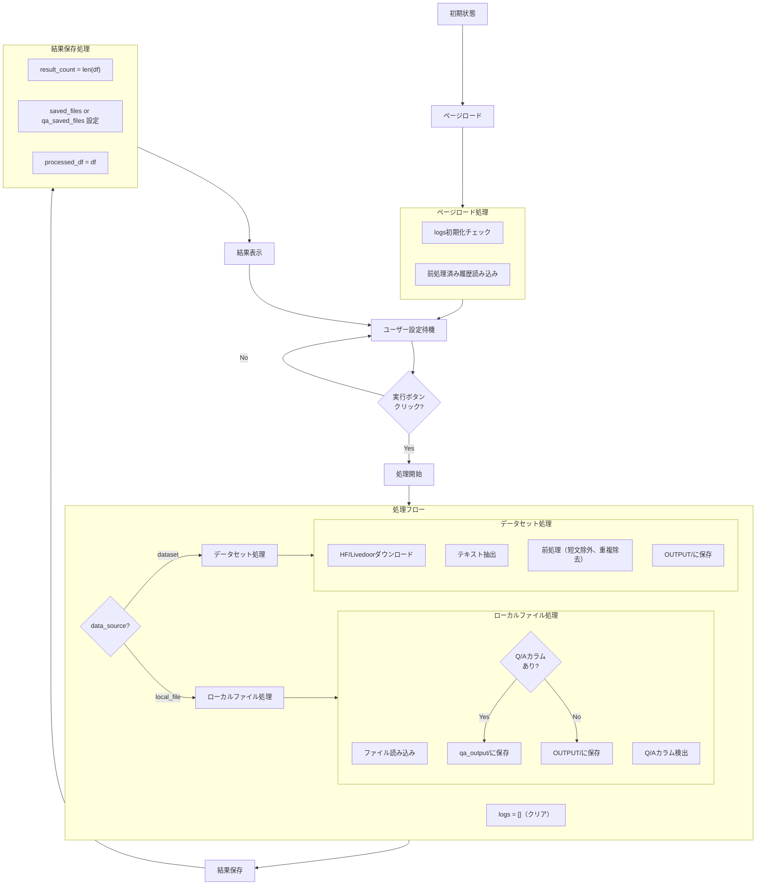
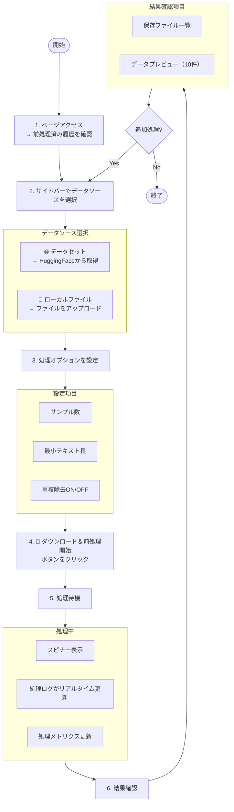
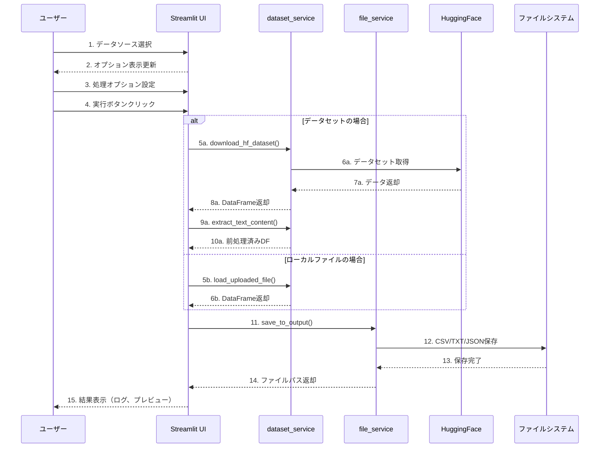
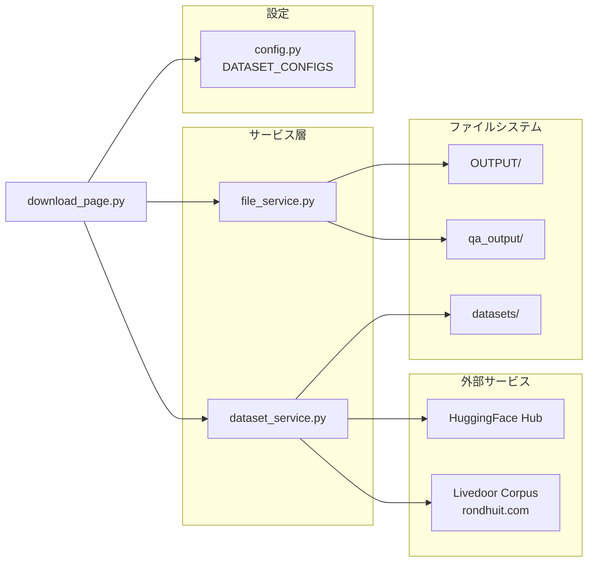

# download_page.py - RAGデータダウンロード・前処理ページ ドキュメント

**Version 1.0** | 最終更新: 2025-01-29

---

## 目次

1. [概要](#概要)
2. [画面レイアウト図](#1-画面レイアウト図)
3. [UIコンポーネント詳細](#2-uiコンポーネント詳細)
4. [セッション状態管理](#3-セッション状態管理)
5. [ユーザー操作フロー](#4-ユーザー操作フロー)
6. [関数一覧表](#5-関数一覧表)
7. [関数 IPO詳細](#6-関数-ipo詳細)
8. [依存関係](#7-依存関係)
9. [イベント処理](#8-イベント処理)
10. [エラーハンドリング](#9-エラーハンドリング)
11. [使用例](#10-使用例)
12. [変更履歴](#11-変更履歴)

---

## 概要

`download_page.py`は、HuggingFaceデータセットまたはローカルファイルからRAG（Retrieval-Augmented Generation）用データをダウンロード・前処理し、OUTPUT/フォルダに保存するStreamlit UIページです。

### 主な責務

- HuggingFaceデータセット（Wikipedia日本語版、CC100、CC-News、Livedoor等）のダウンロード
- ローカルファイル（CSV, TXT, JSON, JSONL）のアップロード・読み込み
- テキストデータの前処理（短文除外、重複除去、テキスト抽出）
- Q/Aカラム検出時の自動Q/Aペア抽出
- 処理結果のOUTPUT/またはqa_output/フォルダへの保存
- 処理履歴・進捗のリアルタイム表示

### 主要機能一覧

| 機能 | 説明 |
|------|------|
| `show_rag_download_page()` | メインページ表示関数 |
| データソース選択 | HuggingFaceデータセット or ローカルファイルの切り替え |
| データセット選択 | 利用可能なデータセットからの選択（Wikipedia、CC100等） |
| ファイルアップロード | CSV/TXT/JSON/JSONL形式のローカルファイル読み込み |
| 処理オプション設定 | サンプル数、最小テキスト長、重複除去の設定 |
| 処理ログ表示 | ダウンロード・前処理の進捗をリアルタイム表示 |
| 結果プレビュー | 処理済みデータの先頭10件をDataFrame表示 |

---

## 1. 画面レイアウト図

### 1.1 全体レイアウト



### 1.2 コンポーネント配置図



---

## 2. UIコンポーネント詳細

### 2.1 サイドバー

| コンポーネント | 種類 | キー | デフォルト値 | 説明 |
|---------------|------|------|-------------|------|
| データソース選択 | `st.radio` | `data_source_selector` | `dataset` | データセット or ローカルファイル |
| データセット選択 | `st.radio` | - | 最初のデータセット | ダウンロード対象データセット |
| ファイルアップロード | `st.file_uploader` | - | `None` | CSV/TXT/JSON/JSONL対応 |

#### データソース選択の詳細

```python
data_source = st.radio(
    "データソースを選択",
    options=["dataset", "local_file"],
    format_func=lambda x: "🌐 データセット" if x == "dataset" else "📁 ローカルファイル",
    key="data_source_selector",
)
```

**オプション一覧**:

| 値 | 表示名 | 説明 |
|-----|--------|------|
| `dataset` | 🌐 データセット | HuggingFaceからダウンロード |
| `local_file` | 📁 ローカルファイル | ローカルファイルをアップロード |

#### データセット選択の詳細

| データセットキー | 表示名 | 説明 |
|----------------|--------|------|
| `wikipedia_ja` | 📚 Wikipedia日本語版 | Wikipedia日本語版の記事データ |
| `japanese_text` | 📰 日本語Webテキスト（CC100） | 日本語Webテキストコーパス |
| `fineweb_edu_ja` | 🎓 FineWeb-Edu日本語版 | 教育的価値の高い日本語Webテキスト |
| `cc_news` | 🌐 CC-News（英語ニュース） | Common Crawl英語ニュース記事 |
| `livedoor` | 📰 Livedoorニュースコーパス | Livedoorニュース日本語記事 |

### 2.2 メインエリア

| コンポーネント | 種類 | 説明 |
|---------------|------|------|
| タイトル | `st.title` | 📥 RAGデータダウンロード・前処理ツール |
| キャプション | `st.caption` | ページ説明文 |
| 前処理済み一覧 | `st.dataframe` | OUTPUT/フォルダの履歴表示 |
| データセット情報 | `st.info` | 選択データセットの詳細情報 |
| サンプル数 | `st.number_input` | ダウンロード件数（10〜10,000） |
| 最小テキスト長 | `st.number_input` | 除外閾値（10〜1,000文字） |
| 重複除去 | `st.checkbox` | 重複テキストの除外 |
| 実行ボタン | `st.button` | ダウンロード＆前処理開始 |
| 処理メトリクス | `st.metric` | 選択データセット、処理件数 |
| 処理ログ | `st.text_area` | リアルタイムログ表示 |
| 保存ファイル | `st.success` | 保存完了ファイル一覧 |
| データプレビュー | `st.dataframe` | 処理結果の先頭10件 |

### 2.3 処理オプション詳細

| オプション | 種類 | データセット時 | ローカルファイル時 |
|-----------|------|--------------|------------------|
| サンプル数 | `st.number_input` | 10〜10,000（デフォルト: config値） | 1〜1,000（デフォルト: 100） |
| 最小テキスト長 | `st.number_input` | 10〜1,000（デフォルト: config値） | 10〜1,000（デフォルト: 50） |
| 重複除去 | `st.checkbox` | デフォルト: True | デフォルト: True |

### 2.4 ダイアログ・モーダル

（このページではダイアログ・モーダルは使用していません）

---

## 3. セッション状態管理

### 3.1 状態一覧

| キー | 型 | 初期値 | 説明 | リセット条件 |
|-----|-----|-------|------|-------------|
| `logs` | `List[str]` | `[]` | 処理ログメッセージ | 処理開始時 |
| `result_count` | `int` | - | 処理完了件数 | 処理完了時に設定 |
| `saved_files` | `Dict[str, str]` | - | 保存ファイルパス（データセット用） | 処理完了時に設定 |
| `qa_saved_files` | `Dict[str, str]` | - | 保存ファイルパス（Q/A用） | 処理完了時に設定 |
| `qa_count` | `int` | - | Q/Aペア数 | 処理完了時に設定 |
| `processed_df` | `pd.DataFrame` | - | 処理済みDataFrame | 処理完了時に設定 |

### 3.2 状態遷移図



### 3.3 初期化・リセット条件

| 状態キー | 初期化タイミング | リセットトリガー |
|---------|----------------|----------------|
| `logs` | ページ初回ロード時 | 実行ボタンクリック時 |
| `result_count` | 処理完了時に設定 | 次回処理開始時に上書き |
| `saved_files` | 処理完了時に設定 | 次回処理開始時に上書き |
| `qa_saved_files` | Q/A処理完了時に設定 | 次回処理開始時に上書き |
| `processed_df` | 処理完了時に設定 | 次回処理開始時に上書き |

---

## 4. ユーザー操作フロー

### 4.1 基本操作フロー



### 4.2 操作シーケンス図



---

## 5. 関数一覧表

### 5.1 メイン関数

| 関数名 | 概要 |
|-------|------|
| `show_rag_download_page()` | ページ全体のレンダリングと処理制御 |

### 5.2 ローカル関数

| 関数名 | 概要 |
|-------|------|
| `add_log(message)` | ログメッセージをセッション状態に追加 |

### 5.3 インポート関数（services.dataset_service）

| 関数名 | 概要 |
|-------|------|
| `download_livedoor_corpus(save_dir)` | Livedoorコーパスをダウンロード・解凍 |
| `load_livedoor_corpus(data_dir)` | Livedoorコーパスを読み込み |
| `download_hf_dataset(...)` | HuggingFaceデータセットをダウンロード |
| `extract_text_content(df, config)` | テキストコンテンツを抽出・前処理 |
| `load_uploaded_file(uploaded_file)` | アップロードファイルを読み込み |

### 5.4 インポート関数（services.file_service）

| 関数名 | 概要 |
|-------|------|
| `load_preprocessed_history()` | OUTPUT/フォルダの前処理済みファイル一覧取得 |
| `save_to_output(df, dataset_type)` | OUTPUT/フォルダにCSV/TXT/JSON保存 |

---

## 6. 関数 IPO詳細

### 6.1 `show_rag_download_page`

**概要**: RAGデータダウンロード・前処理ページのメイン表示関数。サイドバー設定、処理オプション、ダウンロード・前処理実行、結果表示を統合管理する。

```python
def show_rag_download_page() -> None
```

| 項目 | 内容 |
|------|------|
| **Input** | なし（セッション状態・サイドバー入力から取得） |
| **Process** | 1. タイトル・キャプション表示<br>2. 前処理済み履歴の読み込み・表示<br>3. サイドバーでデータソース選択UI描画<br>4. 処理オプションUI描画<br>5. 実行ボタン処理<br>6. データソースに応じたダウンロード・前処理<br>7. 結果保存・表示 |
| **Output** | なし（画面描画のみ） |

**主要処理フロー**:

```python
# 1. タイトル表示
st.title("📥 RAGデータダウンロード・前処理ツール")

# 2. 前処理済み履歴表示
df_preprocessed = load_preprocessed_history()
st.dataframe(df_preprocessed, ...)

# 3. サイドバー設定
with st.sidebar:
    data_source = st.radio("データソースを選択", ...)
    if data_source == "dataset":
        selected_dataset = st.radio("ダウンロードするデータセット", ...)
    else:
        uploaded_file = st.file_uploader("ファイルを選択", ...)

# 4. 処理オプション
sample_size = st.number_input("サンプル数", ...)
min_length = st.number_input("最小テキスト長", ...)
remove_duplicates = st.checkbox("重複を除去", ...)

# 5. 実行ボタン
if st.button("🚀 ダウンロード＆前処理開始"):
    # 6. 処理実行
    if data_source == "local_file":
        df = load_uploaded_file(uploaded_file)
        # Q/Aカラム検出・処理
    else:
        df = download_hf_dataset(...)
        df_processed = extract_text_content(df, config)

    # 7. 保存
    saved_files = save_to_output(df_processed, selected_dataset)
    st.session_state["result_count"] = len(df_processed)
```

### 6.2 `add_log`

**概要**: 処理ログメッセージをセッション状態に追加するローカル関数。

```python
def add_log(message: str) -> None
```

| 項目 | 内容 |
|------|------|
| **Input** | `message: str` - ログメッセージ |
| **Process** | `st.session_state["logs"].append(message)` |
| **Output** | なし（セッション状態を更新） |

### 6.3 インポート関数（services.dataset_service）

#### `download_livedoor_corpus`

**概要**: Livedoorニュースコーパスをダウンロード・解凍する。

**参照**: `services/dataset_service.py`

| 項目 | 内容 |
|------|------|
| **Input** | `save_dir: str = "datasets"` - 保存ディレクトリ |
| **Process** | 1. tar.gzをダウンロード<br>2. 解凍<br>3. textディレクトリパスを返却 |
| **Output** | `str`: 解凍後のデータディレクトリパス |

#### `load_livedoor_corpus`

**概要**: Livedoorコーパスをカテゴリ別に読み込む。

| 項目 | 内容 |
|------|------|
| **Input** | `data_dir: str` - データディレクトリパス |
| **Process** | カテゴリディレクトリを走査し、記事ファイルを読み込み |
| **Output** | `pd.DataFrame`: url, date, title, content, categoryカラム |

#### `download_hf_dataset`

**概要**: HuggingFaceからデータセットをストリーミングダウンロードする。

| 項目 | 内容 |
|------|------|
| **Input** | `dataset_name: str`, `config_name: Optional[str]`, `split: str`, `sample_size: int`, `log_callback: Callable` |
| **Process** | HuggingFace datasets APIでストリーミング取得 |
| **Output** | `pd.DataFrame`: データセットのDataFrame |

#### `extract_text_content`

**概要**: データセットからテキストコンテンツを抽出・前処理する。

| 項目 | 内容 |
|------|------|
| **Input** | `df: pd.DataFrame`, `config: Dict[str, Any]` |
| **Process** | 1. タイトル+テキストを結合<br>2. テキストクレンジング<br>3. 空テキスト除外 |
| **Output** | `pd.DataFrame`: Combined_Textカラムを含むDataFrame |

#### `load_uploaded_file`

**概要**: アップロードされたファイルを読み込みDataFrameに変換する。

| 項目 | 内容 |
|------|------|
| **Input** | `uploaded_file` - Streamlit file_uploaderオブジェクト |
| **Process** | 拡張子に応じた読み込み（CSV/TXT/JSON/JSONL） |
| **Output** | `pd.DataFrame`: Combined_Textカラムを含むDataFrame |

### 6.4 インポート関数（services.file_service）

#### `load_preprocessed_history`

**概要**: OUTPUT/フォルダから前処理済みCSVファイル一覧を取得する。

**参照**: `services/file_service.py`

| 項目 | 内容 |
|------|------|
| **Input** | なし |
| **Process** | OUTPUT/preprocessed_*.csvファイルを検索 |
| **Output** | `pd.DataFrame`: ファイル名、データセット名、サイズ、作成日付 |

#### `save_to_output`

**概要**: OUTPUTフォルダにCSV/TXT/JSONを保存する。

| 項目 | 内容 |
|------|------|
| **Input** | `df: pd.DataFrame`, `dataset_type: str` |
| **Process** | 1. CSV保存<br>2. TXT保存<br>3. メタデータJSON保存 |
| **Output** | `Dict[str, str]`: 保存ファイルパスの辞書 |

---

## 7. 依存関係

### 7.1 外部ライブラリ

| ライブラリ | バージョン | 用途 |
|-----------|-----------|------|
| `streamlit` | >= 1.28 | UIフレームワーク |
| `pandas` | >= 2.0 | データフレーム操作 |
| `datasets` | >= 2.0 | HuggingFaceデータセット取得 |

### 7.2 標準ライブラリ

| モジュール | 用途 |
|-----------|------|
| `datetime` | タイムスタンプ生成 |
| `pathlib.Path` | ファイルパス操作 |

### 7.3 内部モジュール

| モジュール | 用途 |
|-----------|------|
| `config.DATASET_CONFIGS` | データセット設定辞書 |

### 7.4 サービス層

| サービス | 用途 |
|---------|------|
| `services.dataset_service.download_livedoor_corpus` | Livedoorコーパスダウンロード |
| `services.dataset_service.load_livedoor_corpus` | Livedoorコーパス読み込み |
| `services.dataset_service.download_hf_dataset` | HuggingFaceダウンロード |
| `services.dataset_service.extract_text_content` | テキスト抽出・前処理 |
| `services.dataset_service.load_uploaded_file` | アップロードファイル読み込み |
| `services.file_service.load_preprocessed_history` | 前処理履歴取得 |
| `services.file_service.save_to_output` | ファイル保存 |

---

## 8. イベント処理

### 8.1 ボタンイベント

| ボタン | イベント | 処理内容 |
|-------|---------|---------|
| 🚀 ダウンロード＆前処理開始 | クリック | ログクリア→データ取得→前処理→保存→結果表示 |

### 8.2 入力イベント

| コンポーネント | イベント | 処理内容 |
|---------------|---------|---------|
| データソース選択 | 変更 | サイドバー表示切り替え（データセット or ファイルアップロード） |
| データセット選択 | 変更 | config取得、処理オプションデフォルト値更新 |
| ファイルアップロード | ファイル選択 | uploaded_file設定、処理オプション表示 |
| サンプル数 | 変更 | sample_size更新 |
| 最小テキスト長 | 変更 | min_length更新 |
| 重複除去 | 変更 | remove_duplicates更新 |

### 8.3 リアルタイム更新

| イベント種別 | 更新内容 |
|-------------|---------|
| ログ追加 | `st.session_state["logs"]`に追記 |
| スピナー表示 | `st.spinner()`で処理中表示 |
| メトリクス更新 | 処理完了件数を`st.metric()`で表示 |

---

## 9. エラーハンドリング

### 9.1 エラー種別

| エラー種別 | 発生条件 | 対処 |
|-----------|---------|------|
| ファイル未選択エラー | ローカルファイル未選択で実行 | `st.error`表示、`st.stop()`で処理中断 |
| HuggingFaceダウンロードエラー | ネットワークエラー、データセット不正 | `st.error`表示、ログに記録 |
| ファイル読み込みエラー | ファイル形式不正、エンコーディングエラー | `st.error`表示、ログに記録 |
| 保存エラー | ディスク容量不足、権限エラー | `st.error`表示、ログに記録 |

### 9.2 エラー表示

| 表示種別 | Streamlitコンポーネント | 用途 |
|---------|------------------------|------|
| エラー | `st.error()` | 致命的エラー（処理中断） |
| 警告 | `st.warning()` | 注意喚起（ファイル未選択等） |
| 情報 | `st.info()` | 補足情報（前処理済みデータなし等） |

### 9.3 エラー処理コード例

```python
try:
    if data_source == "local_file":
        df = load_uploaded_file(uploaded_file)
    else:
        df = download_hf_dataset(...)

    # 前処理・保存処理
    ...

except Exception as e:
    add_log(f"❌ エラー発生: {str(e)}")
    st.error(f"エラーが発生しました: {str(e)}")
```

---

## 10. 使用例

### 10.1 基本的な使用方法（データセット）

1. ページにアクセス
2. サイドバーで「🌐 データセット」を選択
3. ダウンロードするデータセットを選択（例: Wikipedia日本語版）
4. 処理オプションを設定
   - サンプル数: 1000
   - 最小テキスト長: 200
   - 重複除去: ON
5. 「🚀 ダウンロード＆前処理開始」をクリック
6. 処理ログを確認しながら完了を待つ
7. 保存ファイル一覧とデータプレビューを確認

### 10.2 基本的な使用方法（ローカルファイル）

1. ページにアクセス
2. サイドバーで「📁 ローカルファイル」を選択
3. CSVファイルをアップロード
4. 処理オプションを設定
5. 「🚀 ダウンロード＆前処理開始」をクリック
6. Q/Aカラムが検出された場合は`qa_output/`に保存
7. 結果を確認

### 10.3 対応ファイル形式

| 形式 | 拡張子 | 説明 |
|------|--------|------|
| CSV | `.csv` | カンマ区切りテキスト |
| TXT | `.txt` | 1行1ドキュメント形式 |
| JSON | `.json` | JSONオブジェクトまたは配列 |
| JSONL | `.jsonl` | JSON Lines形式 |

### 10.4 Q/Aカラム自動検出

ローカルファイルに以下のカラムが含まれる場合、Q/Aペアとして自動処理されます：

- `question` または `Question` を含むカラム → questionカラム
- `answer` または `Answer` を含むカラム → answerカラム

---

## 11. 変更履歴

| バージョン | 日付 | 変更内容 |
|-----------|------|---------|
| 1.0 | 2025-01-29 | 初版作成 |

---

## 付録: 依存関係図


