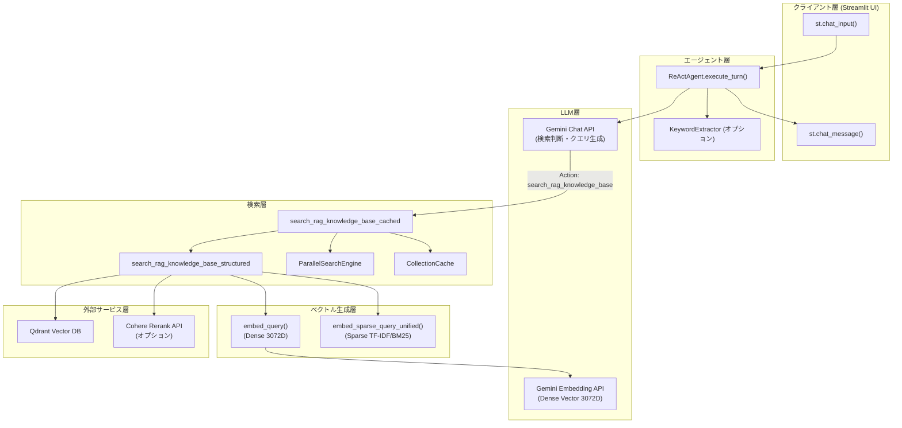
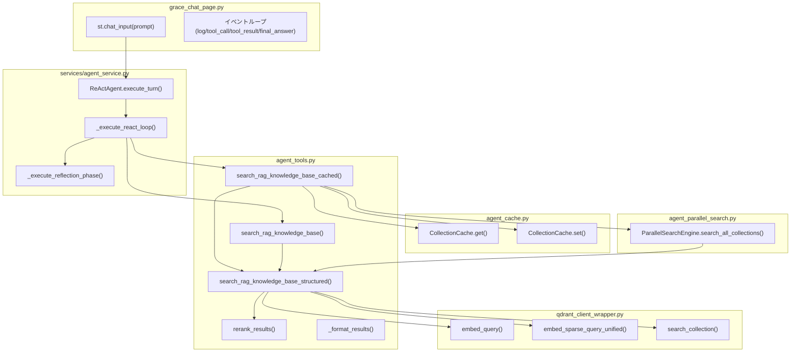
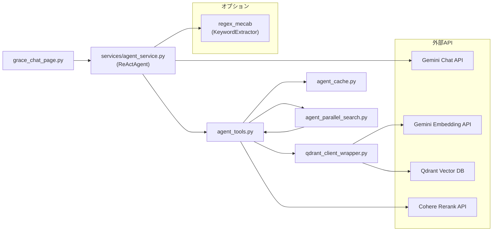

# grace_chat_input_query - ユーザークエリ入力〜Embedding処理 詳細設計ドキュメント

**Version 1.1** | 最終更新: 2026-02-09

---

## 目次

1. [概要](#概要)
2. [アーキテクチャ構成図](#1-アーキテクチャ構成図)
3. [モジュール構成図](#2-モジュール構成図)
4. [クラス・関数一覧表](#3-クラス関数一覧表)
5. [クラス・関数 IPO詳細](#4-クラス関数-ipo詳細)
6. [設定・定数](#5-設定定数)
7. [使用例](#6-使用例)
8. [エクスポート](#7-エクスポート)
9. [変更履歴](#8-変更履歴)
10. [付録: 依存関係図](#付録-依存関係図)

---

## 概要

本ドキュメントは、`grace_chat_page.py` でユーザーがチャット入力欄に質問（query）を入力してから、Qdrant検索のための Embedding ベクトルが生成されるまでの処理フローを詳細に記述する設計資料です。

### 処理の責務

本処理パイプラインは、ユーザーの自然言語クエリを、ベクトル検索エンジン（Qdrant）が消費可能な Dense / Sparse ベクトル表現へ変換する責務を担います。具体的には以下の責務を持ちます。

- ユーザー入力テキストの受け取りとセッション状態への記録
- ReActAgent への質問の委譲（`execute_turn`）
- LLM（Gemini）による検索クエリの生成判断（Thought → Action）
- オプションのキーワード抽出によるクエリ拡張（MeCab/Regex）
- Gemini Embedding API を用いた Dense ベクトル（3072次元）の生成
- スパースベクトル（TF-IDF / BM25系）の生成（ハイブリッド検索有効時）
- キャッシュ戦略に基づく検索対象コレクションの決定
- 並列検索エンジンへのクエリとベクトルの引き渡し

### 処理の概要

```
[User Input (自然言語)]
    │
    ▼
[grace_chat_page.py] st.chat_input → prompt
    │
    ▼
[ReActAgent.execute_turn(prompt)]
    │
    ├─ (オプション) KeywordExtractor.extract(prompt) → キーワード拡張
    │
    ▼
[Gemini LLM] → Thought → Action: search_rag_knowledge_base(query=...)
    │
    ▼
[search_rag_knowledge_base_cached(query, session_id, ...)]
    │
    ├─ ステップ1: キャッシュチェック (CollectionCache)
    ├─ ステップ2: embed_query(query) → Dense Vector (3072D)
    ├─ ステップ3: embed_sparse_query_unified(query) → Sparse Vector (条件付き)
    │
    ▼
[search_collection(client, collection_name, query_vector, sparse_vector)]
    │
    ▼
[Qdrant Vector DB] → 検索結果
```

### 主な責務

- ユーザーの自然言語クエリの受け取りとバリデーション
- LLM による検索必要性の判断とクエリ生成
- キーワード抽出によるクエリの意味的拡張（オプション）
- Gemini Embedding API による Dense ベクトル生成
- スパースベクトル（TF-IDF / BM25）の生成（ハイブリッド検索時）
- キャッシュに基づくコレクション選択の最適化
- 並列検索エンジンへのベクトルの引き渡し

### 主要機能一覧

| 機能 | 説明 |
|------|------|
| `st.chat_input()` | ユーザーからの自然言語クエリ入力受付 |
| `ReActAgent.execute_turn()` | ReAct ループの実行（Thought → Action → Observation） |
| `KeywordExtractor.extract()` | MeCab/Regex によるキーワード抽出（オプション） |
| `search_rag_knowledge_base_cached()` | キャッシュ+並列検索のスマート検索エントリポイント |
| `search_rag_knowledge_base_structured()` | 単一コレクション検索（Embedding → Qdrant） |
| `embed_query()` | Gemini Embedding API による Dense ベクトル生成 |
| `embed_sparse_query_unified()` | TF-IDF / BM25 系スパースベクトル生成 |
| `search_collection()` | Qdrant クライアントによるベクトル検索実行 |
| `CollectionCache.get()` / `.set()` | 前回成功コレクションのキャッシュ管理 |
| `ParallelSearchEngine.search_all_collections()` | 複数コレクションの並列検索 |

---

## 1. アーキテクチャ構成図

### 1.1 システム全体構成



### 1.2 データフロー

1. ユーザーが `st.chat_input()` で質問テキスト（prompt）を入力
2. `ReActAgent.execute_turn(prompt)` に委譲
3. （オプション）`KeywordExtractor.extract()` でキーワード抽出、プロンプトを拡張
4. 拡張済みプロンプトを Gemini Chat API に送信
5. Gemini が `Thought:` で思考し、`Action: search_rag_knowledge_base(query="...")` を決定
6. ツール関数 `search_rag_knowledge_base_cached()` が呼び出される
7. キャッシュチェック → コレクション決定
8. `embed_query(query)` で Dense ベクトル（3072次元）を生成
9. （ハイブリッド検索有効時）`embed_sparse_query_unified(query)` でスパースベクトルを生成
10. `search_collection()` で Qdrant にベクトル検索を実行
11. （オプション）`rerank_results()` で Cohere Rerank を実行
12. 結果をフォーマットして ReActAgent に返却

---

## 2. モジュール構成図

### 2.1 内部モジュール構成



### 2.2 外部依存関係

| ライブラリ | バージョン | 用途 |
|-----------|-----------|------|
| `streamlit` | >= 1.28 | UIフレームワーク（チャット入力） |
| `google-generativeai` | >= 0.3 | Gemini Chat API / Embedding API |
| `qdrant-client` | >= 1.6 | Qdrant ベクトル検索 |
| `cohere` | >= 4.0 | Rerank API（オプション） |

### 2.3 内部依存モジュール

| モジュール | 用途 |
|-----------|------|
| `config.AgentConfig` | RAGデフォルトコレクション、検索件数上限 |
| `config.GeminiConfig` | Geminiモデル名、Embedding モデル設定 |
| `config.CohereConfig` | Cohere API キー、Rerank モデル |
| `config.QdrantConfig` | Qdrant URL |
| `services.agent_service.ReActAgent` | ReAct エージェント |
| `qdrant_client_wrapper` | Qdrant操作ラッパー（embed_query, search_collection等） |
| `agent_cache` | コレクションキャッシュ |
| `agent_parallel_search` | 並列検索エンジン |

---

## 3. クラス・関数一覧表

### 3.1 クラス一覧

#### ReActAgent（services/agent_service.py）

| メソッド | 概要 |
|---------|------|
| `__init__(collections, model_name, session_id, use_hybrid_search)` | エージェント初期化 |
| `execute_turn(prompt)` | ReActループ + Reflection の実行（イベントジェネレータ） |

#### CollectionCache（agent_cache.py）

| メソッド | 概要 |
|---------|------|
| `get(session_id)` | キャッシュからコレクション情報を取得 |
| `set(session_id, collection_name, score, query)` | キャッシュにコレクション情報を保存 |
| `update_query_history(session_id, query)` | クエリ履歴を更新 |

#### ParallelSearchEngine（agent_parallel_search.py）

| メソッド | 概要 |
|---------|------|
| `search_all_collections(query, collections, search_func)` | 全コレクション並列検索 |
| `_search_single_collection(query, collection_name, search_func)` | 単一コレクション検索（内部） |

### 3.2 関数一覧（カテゴリ別）

#### 検索エントリポイント関数（agent_tools.py）

| 関数名 | 概要 |
|-------|------|
| `search_rag_knowledge_base_cached(query, session_id, ...)` | キャッシュ+並列のスマート検索 |
| `search_rag_knowledge_base(query, collection_name, ...)` | Legacy String Output版検索 |
| `search_rag_knowledge_base_structured(query, collection_name, ...)` | 構造化データ版検索 |

#### ベクトル生成関数（qdrant_client_wrapper.py）

| 関数名 | 概要 |
|-------|------|
| `embed_query(query)` | Gemini Embedding API で Dense ベクトル（3072D）を生成 |
| `embed_sparse_query_unified(query)` | TF-IDF / BM25 系スパースベクトルを生成 |

#### 検索実行関数（qdrant_client_wrapper.py）

| 関数名 | 概要 |
|-------|------|
| `search_collection(client, collection_name, query_vector, sparse_vector, limit)` | Qdrant でベクトル検索を実行 |

#### 後処理関数（agent_tools.py）

| 関数名 | 概要 |
|-------|------|
| `rerank_results(query, results, top_k, threshold)` | Cohere Rerank API で再評価 |
| `filter_results_by_keywords(results, query)` | キーワードフィルタリング |
| `_format_results(results, source_label)` | 検索結果のフォーマット |

---

## 4. クラス・関数 IPO詳細

### 4.1 UI入力処理（grace_chat_page.py）

#### `st.chat_input` → `execute_turn` 呼び出し

**概要**: ユーザーが入力したテキストをセッション履歴に記録し、ReActAgent に委譲する。

```python
if prompt := st.chat_input("質問を入力してください..."):
    st.session_state.grace_chat_history.append({"role": "user", "content": prompt})
    for event in st.session_state.grace_agent.execute_turn(prompt):
        # イベント処理
```

| 項目 | 内容 |
|------|------|
| **Input** | `prompt: str` — ユーザーの自然言語テキスト |
| **Process** | 1. `st.chat_input()` で入力を取得<br>2. `grace_chat_history` にユーザーメッセージを追加<br>3. `ReActAgent.execute_turn(prompt)` をジェネレータとして呼び出し<br>4. 各イベント（log, tool_call, tool_result, final_answer）を処理・表示 |
| **Output** | `Generator[Dict]`: イベントの逐次出力（`type`, `content` 等を含む辞書） |

---

### 4.2 ReActAgent.execute_turn（services/agent_service.py）

#### メソッド: `execute_turn`

**概要**: ReAct ループを実行し、LLM の Thought → Action → Observation サイクルを回す。最終的に Reflection フェーズで回答を推敲する。

```python
def execute_turn(self, user_input: str) -> Generator[Dict[str, Any], None, None]
```

| パラメータ | 型 | デフォルト | 説明 |
|------------|------|-----------|------|
| `user_input` | `str` | - | ユーザーの質問テキスト |

| 項目 | 内容 |
|------|------|
| **Input** | `user_input: str` |
| **Process** | 1. （オプション）KeywordExtractor でキーワードを抽出し、プロンプトを拡張<br>2. 拡張済みプロンプトを Gemini Chat API に送信<br>3. レスポンスの `parts` を解析（text / function_call）<br>4. `function_call` の場合、ツール名と引数を抽出<br>5. ツール関数を実行（`search_rag_knowledge_base` 等）<br>6. ツール結果を `function_response` として Gemini に返送<br>7. 最大10ターンまでループ<br>8. 最終テキストを Reflection フェーズで推敲 |
| **Output** | `Generator[Dict]`: `{"type": "log"/"tool_call"/"tool_result"/"final_answer", "content": ...}` |

> 📝 **注意**: `execute_turn` はジェネレータとして実装されており、各イベントを `yield` で逐次返却します。grace_chat_page.py はこのイベントをリアルタイムに UI に反映します。

---

### 4.3 キーワード抽出（オプション）

#### `KeywordExtractor.extract`

**概要**: MeCab / Regex を用いてユーザークエリから重要キーワードを抽出する。抽出されたキーワードはプロンプトに付加され、LLM が検索クエリを生成する際のヒントとなる。

```python
def extract(self, text: str, top_n: int = 5) -> List[str]
```

| パラメータ | 型 | デフォルト | 説明 |
|------------|------|-----------|------|
| `text` | `str` | - | 入力テキスト |
| `top_n` | `int` | `5` | 抽出するキーワード数 |

| 項目 | 内容 |
|------|------|
| **Input** | `text: str`, `top_n: int = 5` |
| **Process** | 1. MeCab で形態素解析（利用可能な場合）<br>2. 名詞・固有名詞を優先的に抽出<br>3. TF-IDF 等のスコアリングで重要度を評価<br>4. 上位 `top_n` 件を返却 |
| **Output** | `List[str]`: 抽出されたキーワードのリスト |

**クエリ拡張のフォーマット**:

```python
augmented_input = f"""{user_input}

【重要: 検索クエリ作成の指示】
以下の抽出された重要キーワードを、必ず検索クエリに含めてください。
重要キーワード: {keywords_str}"""
```

> ⚠️ **注意**: `KeywordExtractor`（`regex_mecab` モジュール）はオプション依存です。インストールされていない場合はスキップされ、ユーザー入力がそのまま LLM に渡されます。

---

### 4.4 search_rag_knowledge_base_cached（agent_tools.py）

#### 関数: `search_rag_knowledge_base_cached`

**概要**: キャッシュと並列検索を組み合わせたスマート検索のメインエントリポイント。セッション単位のキャッシュ戦略により、2回目以降の検索を高速化する。

```python
def search_rag_knowledge_base_cached(
    query: str,
    session_id: str,
    collection_name: Optional[str] = None,
    cache_threshold: float = 0.6,
    use_hybrid_search: bool = True
) -> str
```

| パラメータ | 型 | デフォルト | 説明 |
|------------|------|-----------|------|
| `query` | `str` | - | 検索クエリ |
| `session_id` | `str` | - | セッションID（キャッシュキー） |
| `collection_name` | `Optional[str]` | `None` | 明示指定コレクション（優先） |
| `cache_threshold` | `float` | `0.6` | キャッシュ検索成功のスコア閾値 |
| `use_hybrid_search` | `bool` | `True` | ハイブリッド検索の有効/無効 |

| 項目 | 内容 |
|------|------|
| **Input** | `query`, `session_id`, `collection_name`, `cache_threshold`, `use_hybrid_search` |
| **Process** | 1. ユーザーが `collection_name` を明示指定 → そのコレクションのみ検索<br>2. `CollectionCache.get(session_id)` でキャッシュチェック<br>3. キャッシュヒット → キャッシュされたコレクションで検索<br>4. スコアが `cache_threshold` 以上 → キャッシュ成功、結果を返却<br>5. スコアが低い or キャッシュなし → 全コレクション並列検索<br>6. `ParallelSearchEngine.search_all_collections()` で4並列検索<br>7. 最高スコアのコレクションをキャッシュに保存<br>8. トップ5件をフォーマットして返却 |
| **Output** | `str`: フォーマット済み検索結果文字列 |

**戻り値例**:

```python
"""--- Result 1 [Score: 0.8923] ---
Q: レベッカ・クローンとは何ですか？
A: レベッカ・クローンは...
Source: qa_pairs_custom_upload

--- Result 2 [Score: 0.7651] ---
Q: ...
A: ...
Source: wikipedia_ja
"""
```

---

### 4.5 search_rag_knowledge_base_structured（agent_tools.py）

#### 関数: `search_rag_knowledge_base_structured`

**概要**: 単一コレクションに対する検索を実行する中核関数。Dense Embedding の生成、Sparse Embedding の生成（条件付き）、Qdrant 検索、Reranking をこの関数内で行う。

```python
def search_rag_knowledge_base_structured(
    query: str,
    collection_name: Optional[str] = None,
    use_hybrid_search: bool = True
) -> Union[List[Dict[str, Any]], str]
```

| パラメータ | 型 | デフォルト | 説明 |
|------------|------|-----------|------|
| `query` | `str` | - | 検索クエリ |
| `collection_name` | `Optional[str]` | `None` | コレクション名（省略時はデフォルト） |
| `use_hybrid_search` | `bool` | `True` | ハイブリッド検索の有効/無効 |

| 項目 | 内容 |
|------|------|
| **Input** | `query`, `collection_name`, `use_hybrid_search` |
| **Process** | 1. `collection_name` が None の場合、`AgentConfig.RAG_DEFAULT_COLLECTION` を使用<br>2. `check_qdrant_health()` で接続確認<br>3. コレクションの存在確認<br>4. **`embed_query(query)` で Dense ベクトル（3072D）を生成** ← Embedding 生成のコアステップ<br>5. `use_hybrid_search=True` の場合、**`embed_sparse_query_unified(query)` でスパースベクトルを生成**<br>6. `search_collection(client, collection_name, query_vector, sparse_vector, limit=20)` で候補を広く取得<br>7. スパースベクトルエラー時は Dense のみで再試行<br>8. `rerank_results(query, candidates, top_k, threshold=0.2)` で再評価<br>9. メトリクス記録 |
| **Output** | `Union[List[Dict[str, Any]], str]`: 成功時は検索結果リスト、失敗時はエラー文字列 |

**戻り値例（成功時）**:

```python
[
    {
        "score": 0.8923,
        "original_score": 0.7512,
        "rerank_score": 0.8923,
        "collection_name": "qa_pairs_custom_upload",
        "payload": {
            "question": "レベッカ・クローンとは何ですか？",
            "answer": "レベッカ・クローンは..."
        }
    },
    # ...
]
```

**戻り値例（失敗時）**:

```python
"[[NO_RAG_RESULT]] 検索結果が見つかりませんでした。コレクション: 'wikipedia_ja'."
```

---

### 4.6 embed_query（qdrant_client_wrapper.py）

#### 関数: `embed_query`

**概要**: Gemini Embedding API を呼び出し、テキストクエリを Dense ベクトル（3072次元浮動小数点配列）に変換する。これがベクトル検索の核となるベクトル表現である。

```python
def embed_query(query: str) -> List[float]
```

| パラメータ | 型 | デフォルト | 説明 |
|------------|------|-----------|------|
| `query` | `str` | - | 埋め込み対象のテキスト |

| 項目 | 内容 |
|------|------|
| **Input** | `query: str` |
| **Process** | 1. Gemini Embedding API にテキストを送信<br>2. モデル（`gemini-embedding-001`）で 3072次元の Dense ベクトルを生成<br>3. ベクトルを `List[float]` として返却 |
| **Output** | `List[float]`: 3072次元の Dense ベクトル。失敗時は `None` |

> 📝 **注意**: `embed_query` は `qdrant_client_wrapper.py` に実装されています。このモジュールのソースコードは本ドキュメント作成時に提供されていないため、内部実装の詳細は推定です。実装確認が必要です。

> ⚠️ **次元数に関する注意（2026-02-09追記）**: 現在の `config.py` では `GeminiConfig.EMBEDDING_DIMS = 3072`、`QdrantConfig.DEFAULT_VECTOR_SIZE = 3072` に設定されています。ただし、`COLLECTION_EMBEDDINGS` に登録された旧コレクションは OpenAI Embedding（1536次元）で作成されたものが含まれます。現在の `embed_query()` は常に `provider="gemini"`（3072次元）を使用するため、OpenAI用コレクションに対して検索すると次元不一致エラーが発生するリスクがあります。詳細は改善計画 STEP 11 を参照してください。

---

### 4.7 embed_sparse_query_unified（qdrant_client_wrapper.py）

#### 関数: `embed_sparse_query_unified`

**概要**: TF-IDF / BM25 ベースのスパースベクトルを生成する。ハイブリッド検索（Dense + Sparse）時に使用され、キーワード一致の精度を向上させる。

```python
def embed_sparse_query_unified(query: str) -> Any
```

| パラメータ | 型 | デフォルト | 説明 |
|------------|------|-----------|------|
| `query` | `str` | - | 埋め込み対象のテキスト |

| 項目 | 内容 |
|------|------|
| **Input** | `query: str` |
| **Process** | 1. テキストをトークン化<br>2. TF-IDF / BM25 アルゴリズムでスパースベクトルを計算<br>3. Qdrant の `text-sparse` ベクトルフィールドに対応する形式で返却 |
| **Output** | スパースベクトル（Qdrant互換形式）。生成失敗時は例外 |

> ⚠️ **注意**: スパースベクトルは全てのコレクションで対応しているとは限りません。`search_rag_knowledge_base_structured` 内では、スパースベクトルエラー時に Dense のみで再試行するフォールバック処理が実装されています。

---

### 4.8 search_collection（qdrant_client_wrapper.py）

#### 関数: `search_collection`

**概要**: Qdrant クライアントを使用してベクトル検索を実行する。Dense ベクトルのみ、または Dense + Sparse のハイブリッド検索（RRF: Reciprocal Rank Fusion）をサポートする。

```python
def search_collection(
    client: QdrantClient,
    collection_name: str,
    query_vector: List[float],
    sparse_vector: Any = None,
    limit: int = 20
) -> List[Dict[str, Any]]
```

| パラメータ | 型 | デフォルト | 説明 |
|------------|------|-----------|------|
| `client` | `QdrantClient` | - | Qdrant クライアントインスタンス |
| `collection_name` | `str` | - | 検索対象コレクション名 |
| `query_vector` | `List[float]` | - | Dense ベクトル（3072D） |
| `sparse_vector` | `Any` | `None` | スパースベクトル（None の場合は Dense のみ） |
| `limit` | `int` | `20` | 取得件数上限 |

| 項目 | 内容 |
|------|------|
| **Input** | `client`, `collection_name`, `query_vector`, `sparse_vector`, `limit` |
| **Process** | 1. `sparse_vector` が None → Dense ベクトルのみで検索<br>2. `sparse_vector` が存在 → RRF（Reciprocal Rank Fusion）によるハイブリッド検索<br>3. Qdrant API にクエリを発行<br>4. 結果を `List[Dict]` 形式に変換 |
| **Output** | `List[Dict[str, Any]]`: 検索結果リスト（`score`, `payload` 等を含む） |

---

### 4.9 CollectionCache（agent_cache.py）

#### メソッド: `get`

**概要**: セッションIDに基づいてキャッシュされたコレクション情報を取得する。TTL（デフォルト5分）経過後は自動的に期限切れとなる。

```python
def get(self, session_id: str) -> Optional[CollectionCacheEntry]
```

| 項目 | 内容 |
|------|------|
| **Input** | `session_id: str` |
| **Process** | 1. キャッシュ辞書から `session_id` を検索<br>2. 有効期限チェック（`time.time() - timestamp > TTL`）<br>3. 期限切れの場合は削除して None を返却<br>4. 有効な場合はヒットカウントを増加して返却 |
| **Output** | `Optional[CollectionCacheEntry]`: キャッシュエントリ or None |

#### メソッド: `set`

**概要**: 検索成功時にコレクション情報をキャッシュに保存する。既存エントリのスコアが高い場合は更新しない。

```python
def set(self, session_id: str, collection_name: str, score: float, query: str = None)
```

| 項目 | 内容 |
|------|------|
| **Input** | `session_id`, `collection_name`, `score`, `query` |
| **Process** | 1. 既存エントリの有無とスコア比較<br>2. 新スコアが低い場合はスキップ<br>3. `CollectionCacheEntry` を生成して保存 |
| **Output** | なし（キャッシュ辞書を更新） |

---

## 5. 設定・定数

### 5.1 AgentConfig

| キー | デフォルト値 | 説明 |
|-----|-------------|------|
| `RAG_DEFAULT_COLLECTION` | (設定値) | デフォルト検索コレクション名 |
| `RAG_SEARCH_LIMIT` | (設定値) | Rerank 後の最終取得件数 |
| `MODEL_NAME` | (設定値) | デフォルト Gemini モデル名 |

### 5.2 CollectionCache 設定

| キー | デフォルト値 | 説明 |
|-----|-------------|------|
| `TTL` | `300` (5分) | キャッシュ有効期限（秒） |
| `cache_threshold` | `0.6` | キャッシュ検索成功とみなすスコア閾値 |

### 5.3 ParallelSearchEngine 設定

| キー | デフォルト値 | 説明 |
|-----|-------------|------|
| `max_workers` | `4` | 並列実行数 |
| `timeout_per_collection` | `10` | コレクション毎のタイムアウト（秒） |

### 5.4 検索パラメータ

| パラメータ | 値 | 説明 |
|-----------|-----|------|
| 候補取得数 | `20` | Qdrant からの初回取得件数（Rerank 前） |
| Rerank threshold | `0.2` | Cohere Rerank のスコア足切りライン |
| 最終返却数 | `5` | `_format_results` で返却する最大件数 |
| キャッシュ保存閾値 | `0.5` | キャッシュに保存する最低スコア |

---

## 6. 使用例

### 6.1 基本的なワークフロー（エンドツーエンド）

```python
# 1. ユーザーがUIで質問を入力
prompt = "レベッカ・クローンについて教えてください"

# 2. grace_chat_page.py がエージェントに委譲
for event in agent.execute_turn(prompt):
    if event["type"] == "tool_call":
        # → search_rag_knowledge_base(query="レベッカ・クローン")
        pass
    elif event["type"] == "final_answer":
        print(event["content"])

# 3. 内部では以下が順に実行される:
#    a. KeywordExtractor.extract("レベッカ・クローンについて教えてください")
#       → ["レベッカ", "クローン"]
#    b. Gemini LLM が Thought → Action を決定
#    c. search_rag_knowledge_base_cached(query="レベッカ・クローン", session_id="...")
#    d. embed_query("レベッカ・クローン") → [0.012, -0.034, ...] (3072D)
#    e. embed_sparse_query_unified("レベッカ・クローン") → sparse vector
#    f. search_collection(...) → Qdrant検索
#    g. rerank_results(...) → 再評価
```

### 6.2 キャッシュ利用時のワークフロー

```python
# 1回目の質問: キャッシュなし → 全コレクション並列検索
# → 最高スコアの "qa_pairs_custom_upload" がキャッシュされる

# 2回目の質問（同一セッション）:
# → キャッシュヒット → "qa_pairs_custom_upload" のみ検索
# → スコアが 0.6 以上なら即返却（高速）
```

---

## 7. エクスポート

本ドキュメントの対象範囲は複数モジュールにまたがるため、個別モジュールのエクスポートを以下に示します。

**agent_tools.py**:
```python
# 主要エクスポート（暗黙的）
search_rag_knowledge_base
search_rag_knowledge_base_cached
search_rag_knowledge_base_structured
rerank_results
```

**agent_cache.py**:
```python
__all__ = [
    "CollectionCache",
    "CollectionCacheEntry",
    "collection_cache",
    "get_cache_stats",
    "clear_cache",
]
```

**agent_parallel_search.py**:
```python
__all__ = [
    "ParallelSearchEngine",
    "SearchResult",
    "parallel_search_engine",
    "search_all_parallel",
]
```

---

## 8. 変更履歴

| バージョン | 日付 | 変更内容 |
|-----------|------|---------|
| 1.0 | 2026-02-09 | 初版作成: ユーザークエリ入力〜Embedding 処理の詳細設計 |
| 1.1 | 2026-02-09 | 改善Phase1: Dense ベクトル次元数を768→3072に修正（全12箇所）、Embeddingモデル名を `gemini-embedding-001` に修正、OpenAIコレクション混在リスクの注意書き追加 |

---

## 付録: 依存関係図



---

## 付録: 不足情報・確認事項

以下の情報が不足しているため、正確な設計資料の完成には確認が必要です。

| # | 不足情報 | 影響範囲 | 確認先 |
|---|---------|---------|--------|
| 1 | `qdrant_client_wrapper.py` のソースコード | `embed_query()`, `embed_sparse_query_unified()`, `search_collection()` の内部実装詳細 | ソースコード提供 |
| 2 | `services/agent_service.py`（GRACE版 ReActAgent）のソースコード | `execute_turn()` のイベントジェネレータ実装詳細、ツール呼び出しの具体的フロー | ソースコード提供 |
| 3 | `config.py` のソースコード | `AgentConfig.RAG_DEFAULT_COLLECTION`, `RAG_SEARCH_LIMIT` 等の具体的なデフォルト値 | ソースコード提供 |
| 4 | Gemini Embedding モデル名 | `text-embedding-004` か別のモデルか | `qdrant_client_wrapper.py` 確認 |
| 5 | スパースベクトルの具体的な実装方式 | TF-IDF / BM25 / fastembed 等のどれを使用しているか | `qdrant_client_wrapper.py` 確認 |
| 6 | `regex_mecab.py`（KeywordExtractor）のソースコード | キーワード抽出のアルゴリズム詳細 | ソースコード提供 |
| 7 | GRACE版 `ReActAgent` と `agent_main.py` の `UpgradedCLIAgent` の差異 | イベントジェネレータ vs 同期戻り値の違い、ツールマップの違い | `services/agent_service.py` 確認 |
