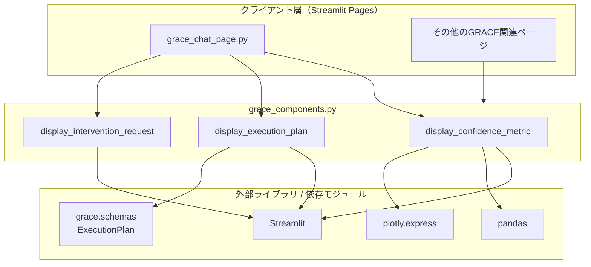
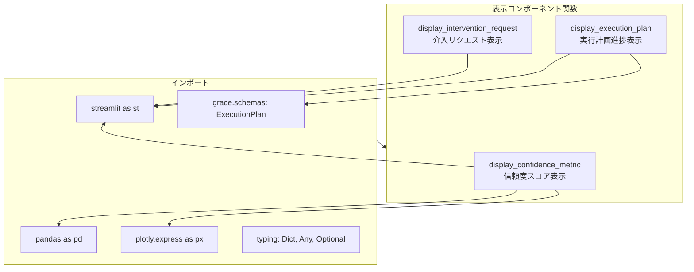
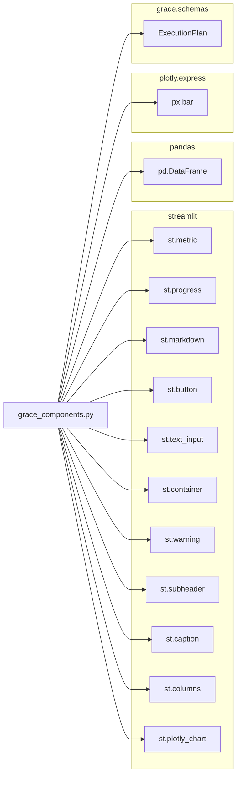

# grace_components.py - GRACE UIコンポーネント ドキュメント

**Version 1.0** | 最終更新: 2025-01-29

---

## 目次

1. [概要](#概要)
2. [アーキテクチャ構成図](#1-アーキテクチャ構成図)
3. [モジュール構成図](#2-モジュール構成図)
4. [関数一覧表](#3-関数一覧表)
5. [関数 IPO詳細](#4-関数-ipo詳細)
6. [設定・定数](#5-設定定数)
7. [使用例](#6-使用例)
8. [エクスポート](#7-エクスポート)
9. [変更履歴](#8-変更履歴)
10. [付録: 依存関係図](#付録-依存関係図)

---

## 概要

`grace_components.py`は、GRACE（Guided Reasoning with Adaptive Confidence Execution）アーキテクチャ向けの再利用可能なStreamlit UIコンポーネントを提供するモジュールです。信頼度メトリクス、実行計画の進捗、ユーザー介入リクエストなどの可視化機能を提供します。

### 主な責務

- 信頼度スコアと内訳のビジュアル表示（メトリクス、プログレスバー、棒グラフ）
- 実行計画（ExecutionPlan）のステップ進捗の可視化
- Human-in-the-Loop 介入リクエストのUI表示とユーザー応答の取得
- GRACEエージェントの内部状態をユーザーに分かりやすく提示

### 主要機能一覧

| 機能 | 説明 |
|------|------|
| `display_confidence_metric()` | 信頼度スコアと内訳を表示するコンポーネント |
| `display_execution_plan()` | 実行計画の進捗をステップ形式で表示 |
| `display_intervention_request()` | 介入リクエスト（確認・入力）を表示しユーザー応答を取得 |

---

## 1. アーキテクチャ構成図

### 1.1 システム全体構成



### 1.2 データフロー

1. GRACEエージェントが信頼度スコア・実行計画・介入リクエストを生成
2. Streamlitページがコンポーネント関数を呼び出し
3. コンポーネントがStreamlit/Plotlyを使用してUI描画
4. ユーザー操作（介入応答等）をコールバック経由でページに返却

---

## 2. モジュール構成図

### 2.1 内部モジュール構成



### 2.2 外部依存関係

| ライブラリ | バージョン | 用途 |
|-----------|-----------|------|
| `streamlit` | 1.52.1+ | UIフレームワーク（metric, progress, markdown, button等） |
| `pandas` | 2.x | データフレーム作成（チャート用データ整形） |
| `plotly` | 5.x | インタラクティブチャート（棒グラフ） |

### 2.3 内部依存モジュール

| モジュール | 用途 |
|-----------|------|
| `grace.schemas.ExecutionPlan` | 実行計画のデータ構造（steps, original_query） |

> 📝 **注意**: `grace.schemas` モジュールの詳細構造は別途ドキュメントを参照してください。

---

## 3. 関数一覧表

### 3.1 表示コンポーネント関数

| 関数名 | 概要 |
|-------|------|
| `display_confidence_metric(score, level, breakdown)` | 信頼度スコアをメトリクス、プログレスバー、棒グラフで表示 |
| `display_execution_plan(plan, current_step_id)` | 実行計画の各ステップを進捗状況付きで表示 |
| `display_intervention_request(request, on_response)` | 介入リクエスト（confirm/escalate）を表示しユーザー応答を取得 |

---

## 4. 関数 IPO詳細

### 4.1 `display_confidence_metric`

**概要**: 信頼度スコアと内訳を表示するコンポーネント。スコアに応じた色分け、プログレスバー、内訳の棒グラフを描画する。

```python
def display_confidence_metric(
    score: float,
    level: str,
    breakdown: Dict[str, float]
) -> None
```

| パラメータ | 型 | デフォルト | 説明 |
|------------|------|-----------|------|
| `score` | `float` | - | 信頼度スコア（0.0〜1.0） |
| `level` | `str` | - | 信頼度レベル（例: "high", "medium", "low"） |
| `breakdown` | `Dict[str, float]` | - | 内訳辞書（要因名→スコア） |

| 項目 | 内容 |
|------|------|
| **Input** | `score: float`, `level: str`, `breakdown: Dict[str, float]` |
| **Process** | 1. スコアに応じた色を決定（≥0.7: green, ≥0.4: orange, <0.4: red）<br>2. `st.metric`でスコアとレベルを表示<br>3. `st.progress`でプログレスバーを表示<br>4. breakdownがある場合、DataFrameに変換<br>5. `plotly.express.bar`で横棒グラフを描画 |
| **Output** | なし（UI描画のみ） |

**UI出力例**:

```
┌─────────────────────────────┐
│ Current Confidence          │
│ 0.75 ▲ high                 │
│ ████████████████░░░░░░░░░░░ │
│                             │
│ Confidence Breakdown        │
│ ├─ query_clarity    ████░░  │
│ ├─ tool_confidence  █████░  │
│ └─ result_quality   ████░░  │
└─────────────────────────────┘
```

```python
# 使用例
from grace_components import display_confidence_metric

display_confidence_metric(
    score=0.75,
    level="high",
    breakdown={
        "query_clarity": 0.8,
        "tool_confidence": 0.9,
        "result_quality": 0.6
    }
)
```

---

### 4.2 `display_execution_plan`

**概要**: 実行計画の進捗を表示するコンポーネント。各ステップの状態（完了/実行中/待機）をアイコンと色で可視化する。

```python
def display_execution_plan(
    plan: ExecutionPlan,
    current_step_id: int = 0
) -> None
```

| パラメータ | 型 | デフォルト | 説明 |
|------------|------|-----------|------|
| `plan` | `ExecutionPlan` | - | 実行計画オブジェクト |
| `current_step_id` | `int` | `0` | 現在実行中のステップID |

| 項目 | 内容 |
|------|------|
| **Input** | `plan: ExecutionPlan`, `current_step_id: int = 0` |
| **Process** | 1. サブヘッダーとクエリキャプションを表示<br>2. 各ステップをループ処理<br>3. ステップIDと`current_step_id`を比較し状態を判定<br>4. 状態に応じたアイコン・色でMarkdown描画（unsafe_allow_html） |
| **Output** | なし（UI描画のみ） |

**ステップ状態判定**:

| 条件 | アイコン | 背景色 |
|------|---------|--------|
| `step_id < current_step_id` | ✅ | green |
| `step_id == current_step_id` | ▶️ | blue |
| `step_id > current_step_id` | ⏳ | gray |

**UI出力例**:

```
📋 Execution Plan
Query: ナレッジベースから情報を検索して回答

┌─────────────────────────────────────┐
│ ✅ Step 0: search                   │ (green)
│ RAGツールで検索                      │
│ Query: キーワード抽出                 │
└─────────────────────────────────────┘
┌─────────────────────────────────────┐
│ ▶️ Step 1: analyze                  │ (blue)
│ 検索結果を分析                       │
│ Query: 結果の要約                    │
└─────────────────────────────────────┘
┌─────────────────────────────────────┐
│ ⏳ Step 2: respond                  │ (gray)
│ 最終回答を生成                       │
│ Query: ユーザーへの回答              │
└─────────────────────────────────────┘
```

```python
# 使用例
from grace_components import display_execution_plan
from grace.schemas import ExecutionPlan

plan = ExecutionPlan(
    original_query="ナレッジベースから情報を検索して回答",
    steps=[...]  # ExecutionStep のリスト
)

display_execution_plan(plan, current_step_id=1)
```

---

### 4.3 `display_intervention_request`

**概要**: 介入リクエスト（確認・入力）を表示し、ユーザーの応答をコールバック関数で返すコンポーネント。

```python
def display_intervention_request(
    request: Dict[str, Any],
    on_response: callable
) -> None
```

| パラメータ | 型 | デフォルト | 説明 |
|------------|------|-----------|------|
| `request` | `Dict[str, Any]` | - | 介入リクエスト辞書 |
| `on_response` | `callable` | - | ユーザー応答を受け取るコールバック関数 |

**request 辞書の構造**:

```python
{
    "type": "confirm" | "escalate",
    "data": {
        "message": str  # 表示メッセージ
    }
}
```

| 項目 | 内容 |
|------|------|
| **Input** | `request: Dict[str, Any]`, `on_response: callable` |
| **Process** | 1. `request["type"]`でリクエスト種別を判定<br>2. `confirm`の場合: Proceed/Stop ボタンを表示<br>3. `escalate`の場合: テキスト入力とSubmitボタンを表示<br>4. ユーザー操作時に`on_response(value)`を呼び出し |
| **Output** | なし（コールバック経由でユーザー応答を返却） |

**リクエスト種別と応答**:

| type | UI要素 | on_response引数 |
|------|--------|----------------|
| `confirm` | ✅ Proceed / 🛑 Stop ボタン | `"proceed"` または `"stop"` |
| `escalate` | テキスト入力 + Submit ボタン | ユーザー入力文字列 |

**UI出力例（confirm）**:

```
┌─────────────────────────────────────┐
│ ⚠️ Intervention Required: CONFIRM   │
│                                     │
│ 検索結果が少ないです。続行しますか？    │
│                                     │
│ [✅ Proceed]  [🛑 Stop]              │
└─────────────────────────────────────┘
```

**UI出力例（escalate）**:

```
┌─────────────────────────────────────┐
│ ⚠️ Intervention Required: ESCALATE  │
│                                     │
│ 追加の検索キーワードを入力してください  │
│                                     │
│ Your Answer: [________________]     │
│                                     │
│ [Submit]                            │
└─────────────────────────────────────┘
```

```python
# 使用例
from grace_components import display_intervention_request

def handle_response(response):
    if response == "proceed":
        # 処理を続行
        pass
    elif response == "stop":
        # 処理を中断
        pass
    else:
        # ユーザー入力を処理
        print(f"User input: {response}")

request = {
    "type": "confirm",
    "data": {"message": "検索結果が少ないです。続行しますか？"}
}

display_intervention_request(request, on_response=handle_response)
```

---

## 5. 設定・定数

このモジュールには定数定義はありません。

**スタイル設定**（関数内でハードコード）:

| 設定 | 値 | 説明 |
|------|-----|------|
| 高信頼度色 | `green` | score ≥ 0.7 |
| 中信頼度色 | `orange` | 0.4 ≤ score < 0.7 |
| 低信頼度色 | `red` | score < 0.4 |
| チャート高さ | `200px` | Confidence Breakdown チャート |

---

## 6. 使用例

### 6.1 基本的なワークフロー

```python
import streamlit as st
from grace_components import (
    display_confidence_metric,
    display_execution_plan,
    display_intervention_request,
)
from grace.schemas import ExecutionPlan

# 1. 信頼度表示
st.subheader("Confidence")
display_confidence_metric(
    score=0.75,
    level="high",
    breakdown={
        "query_clarity": 0.8,
        "tool_confidence": 0.9,
        "result_quality": 0.6
    }
)

# 2. 実行計画表示
plan = get_current_plan()  # ExecutionPlan を取得
display_execution_plan(plan, current_step_id=1)

# 3. 介入リクエスト処理
if intervention_needed:
    def handle_response(resp):
        st.session_state.user_response = resp

    display_intervention_request(
        request={"type": "confirm", "data": {"message": "Continue?"}},
        on_response=handle_response
    )
```

### 6.2 GRACEチャットページでの統合例

```python
# grace_chat_page.py での使用例
import streamlit as st
from grace_components import (
    display_confidence_metric,
    display_execution_plan,
    display_intervention_request,
)

def show_grace_chat_page():
    st.title("GRACE Agent Chat")

    # サイドバーに信頼度メトリクスを表示
    with st.sidebar:
        if "confidence" in st.session_state:
            conf = st.session_state.confidence
            display_confidence_metric(
                score=conf["score"],
                level=conf["level"],
                breakdown=conf["breakdown"]
            )

    # メインエリアに実行計画を表示
    with st.expander("📋 Current Plan", expanded=True):
        if "plan" in st.session_state:
            display_execution_plan(
                st.session_state.plan,
                current_step_id=st.session_state.current_step
            )

    # 介入リクエストがある場合は表示
    if st.session_state.get("intervention_request"):
        display_intervention_request(
            st.session_state.intervention_request,
            on_response=lambda r: handle_intervention(r)
        )
```

---

## 7. エクスポート

現在 `__all__` は定義されていません。以下のエクスポートを推奨します：

```python
__all__ = [
    "display_confidence_metric",
    "display_execution_plan",
    "display_intervention_request",
]
```

---

## 8. 変更履歴

| バージョン | 日付 | 変更内容 |
|-----------|------|---------|
| 1.0 | 2025-01-29 | 初版作成 |

---

## 付録: 依存関係図



---

## 付録: 要確認事項

以下の情報が不足しているため、確認が必要です：

| 項目 | 確認内容 |
|------|---------|
| `ExecutionPlan` スキーマ | `grace/schemas.py` の `ExecutionPlan`, `ExecutionStep` の完全な型定義 |
| `ExecutionStep` の属性 | `step_id`, `action`, `description`, `query` 以外の属性 |
| エラーハンドリング | `on_response` コールバックでの例外処理方針 |
| スタイルのカスタマイズ | 色・サイズの設定を外部化する予定があるか |
| 追加の介入タイプ | `confirm`, `escalate` 以外の `request["type"]` の予定 |
